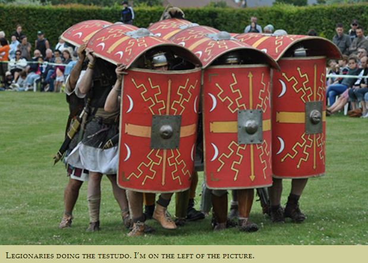
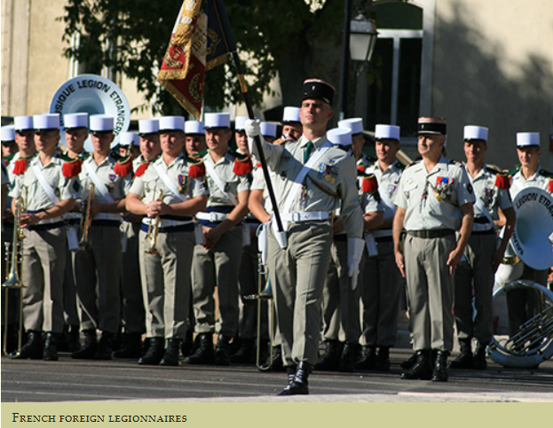
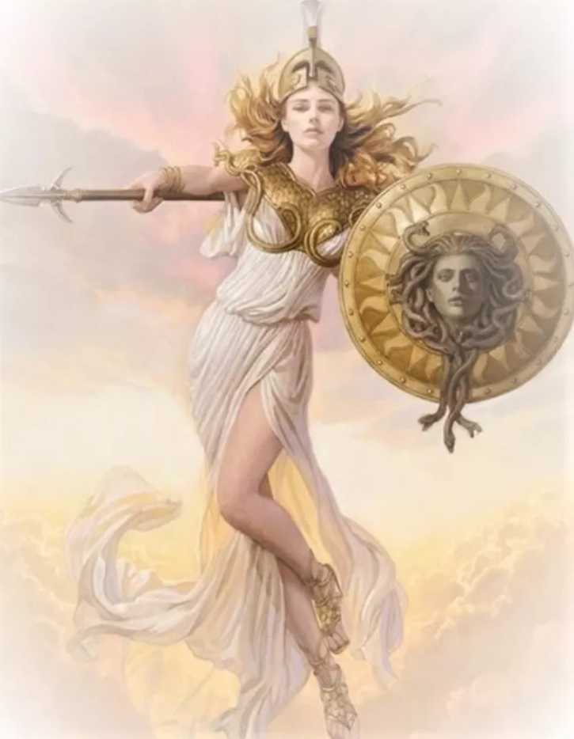

# 咬文嚼字-Part 1 
@(TOEFL)[托福, TOEFL, 词根词缀,咬文嚼字]

[toc]

## MOP

### abomination（憎恶）：厌恶和躲避不祥之物的迷信做法

> **`ab-`**  表示从，来自（from）；从...离开，离开（away from, sway, off）；不，非，表否定（not, opposite）。在字母v 前缩略成a-，在字母c, t 前扩展为abs-。来自拉丁介词ab。源自希腊语 ab, ab- "away from."
>
> **`omin-`** = omen, 表示“预兆”。
>
> **`-able`**  一般缀于动词后，构成形容词，表示“可…的，能…”。

古罗马人在采取任何重大行动前，都会首先进行占卜，请示神灵的意见。他们相信神灵会通过一些征兆（omen）来表达旨意。如果出现的是凶兆，他们自然会非常失望。因此，人们对那些带来凶兆的事物非常厌恶，会想尽各种办法远离这类事物。英语单词abomination就源自古罗马人对不祥之物的厌恶和躲避，它由ab（away，远离）+omin（omen,征兆）+ation（后缀）构成，原始含义就是“远离不祥之兆”，表示的是对不祥之物的憎恶。随着时间推移，它的宗教迷信含义逐渐淡化，可用来表示对各种事物的憎恶。而动词abominate其实是从它反向衍生出来的。

**相关单词：**

- **abomination**：[əbɒmɪ'neɪʃ(ə)n]  n.憎恶，憎恨，令人讨厌的事物
- **abominate**：[ə'bɒmɪneɪt] vt.憎恶，痛恨
- **abominable**：[ə'bɒm(ə)nəb(ə)l] adj.令人憎恶的，讨厌的，可恶的
- **omen**：['omən] 
  - n. 预兆；征兆
  - vt. 预示；有…的前兆；预告
- **ominous**：['ɑmɪnəs] adj. 预兆的；不吉利的

### ghoul /ɡuːl/ (传说中的)盗墓食尸鬼;对凶残之事兴趣浓厚的人

>   ghoul∙ish   ghoul n. 食尸鬼, 饿鬼, 盗墓者 -ish 表形容词，“像…一样，有的…”，通常缀于名词或形容词后。 a. 食尸鬼似的, 残忍的

1. （传说中的）盗墓食尸鬼
   (in stories) an evil spirit that opens graves and eats the dead bodies in them

2. (disapproving) 对凶残之事兴趣浓厚的人
   a person who is too interested in unpleasant things such as death and disaster

## 职位/头衔

### Archon  ['ɑrkɑn]

> n.	执政官；古希腊雅典九人执政官之一；主要官员
> Web	光明执政官；统治者；神族的执政官

 

N (in ancient Athens) one of the nine chief magistrates (古雅典)九个执政官之一;

archive（档案）：古希腊执政官的办公室。

档案指的是政府保存下来的公文资料。很多国家很早就有将重要的公文资料保存到特定场所的做法，最初保管档案的场所其实就是政府的办公室。

英语中表示“档案”的单词archive来自希腊语arkheia，源自词根arkhe（统治），原本指的是城邦统治者（archon，执政官）居住或办公的场所。因为最初的档案都存放在政府的办公场所，所以原本表示“办公场所”的archive一词演变为“档案馆、档案”之意。

- **archive**：n.档案馆，档案vt.将……存档
- **archon**：['ɑrkɑn] n. 执政官（古代雅典九名统治者之一）；统治者

### paragon /ˈpærəɡɑːn/

**paragon**（模范）：用来检验金子纯度的试金石。

古代西方人为了检验金子的纯度，常常使用一种用纹理细密的深色玉石做成的试金石（touchstone）。将要检验的金子在试金石上摩擦，就可以根据划痕颜色来判断金子的纯度。

这种试金石在意大利语中被称为paragone，它来自希腊语parakonan，由:

- para（并列、对抗）
- akone（磨石）构成。

英语单词**paragon**就来源于此，本意就是这种试金石。因为试金石是衡量价值的标准，因此衍生出“完美之物、模范”之意。

- paragon： ['pærəg(ə)n]  n. 完美之物，模范，试金石 adj. 完美的

###  centurion /sen'tʊriən/

**centurion（百夫长）：古罗马军队中的百人队队长**（an officer in the army of ancient Rome who was responsible for 100 soldiers）

单词centurion来自拉丁语，本意是古罗马军队中一个百人队（Centuria）的领导，一般译为“百夫长”。其中**cent**表示“一百”，如century（世纪、百年）、percent（百分比）。

百人队在罗马军队一直是一个很重要的编制。如同其名称一样，百人队最初大约由100人组成。在马略改革后，标准的百人队编制又变为80人，并成为罗马军团战术的核心。

标准的百人队分为十个8人小组。8人小组（**Contubernium**）是罗马军队中最小的组织单位，由8名士兵组成，类似于现代军队中的步兵班，由一名伍长指挥。他们在战地居住在同一帐篷内，而在营房中则居住在同一房间内，可能被一起嘉奖或处罚。

此外每个8人小组配有两名辅助的“仆人”。他们负责照料为8人小组驼行李的骡子，保证士兵在长距离行军中的饮水供应。**这些“仆人”通常具有铁匠或木匠的技能**。由于加上了这些非战斗人员，一个满员的百人队人数依然在一百人左右。

> you are a smith far beyond expectation.

- centurion： [sen'tjʊərɪən] n.百夫长，百人队队长
- century：['sɛntʃəri] n. 世纪，百年
- percent：[pɚ'sɛnt] n. 百分比；百分数

### dean（院长）：古罗马军队的十夫长

英语单词dean源自拉丁语decanus，最早指的是罗马军队中的十夫长。古罗马军队中，每十名士兵组成一个小队，在扎营时分享一顶帐篷。这个小队的领头人就叫做decanus，源自dekanos，而希腊语deka、拉丁语decem就是“十”的意思。

在中世纪欧洲的修道院中，僧侣们也按照军队的方式进行组织，每十人组成一个小组，每个小组的领头人依然叫做decanus。后来，decanus的管辖范围有所扩大，负责一个教区分部的牧师负责人也被称为decanus。

等教会创建各种学校后，负责管理一所学校或学院的人也继承了decanus这个称谓，进入英语后则演变成了dean。

- **dean**：[din] n. 院长；系主任；教务长；主持牧师

词源说明(童理民)  
1 - 来自拉丁语 decanus,修道院管理十个人的牧师，词源同 ten,December.后词义通用化。

### arbiter （仲裁者）

古罗马时期的审判员制度

古罗马时期，国家的司法权力掌握在“裁判官”手中。这个职位最早设立于公元前376年，是从执政官的职权中分离出来的，地位仅次于执政官，享有在其职责范围内的法律方面的最高权威。但裁判官并不参与具体案件的审判，而是交给审判员去审理。审判员不是国家官吏，他是由裁判官从预定名单中选定并授权处理特定案件的公断人，因此在拉丁语中被称为arbiter

arbiter，由ad（to）和baetere（来、去）构成，字面意思就是“去某地（审案）的人”。

arbiter和arbitrator同源，在现代都能表示“仲裁人”，区别在于：

- **arbiter**一词更为古老，是书面用语，通常应用于文学领域，“审判”的意味胜过“仲裁”；
- **arbitrator**比较通俗，通常表示受争议双方所托，居中仲裁，拥有较大的自由裁量权，甚至可以是**arbitrary**（独断的）。

相关单词：

- **arbiter**：['ɑːbɪtə] n.仲裁者，裁决人
- **arbitrator**：['ɑːbɪtreɪtə] n.仲裁者，公断人
- **arbitrate**：['ɑrbɪtret] vt.仲裁，公断
- **arbitrary**：['ɑrbətrɛri] adj.独断的，武断的，任意的，专制的

### [admiral](https://mp.weixin.qq.com/s?__biz=MzA4NTQ4NzIzNg==&mid=2651800919&idx=1&sn=4c88c003130ce5a91517adc4b9f599e1&chksm=842cdebcb35b57aada37b62afe3e5390cf6908392e0888c42ca1f972937c54e01b755b57d9e6&scene=178&cur_album_id=1297162942844207107#rd) （海军上将）

英语单词**admiral**（海军上将）和**emir**（埃米尔，穆斯林酋长）同源，都源自阿拉伯语单词**amir**。**amir**是某些穆斯林国家的酋长、首领的称号，它在16世纪90年代进入英语，演变为英语单词**emir**，中文音译为“埃米尔”。

中世纪时，阿拉伯商船在出海时，常常结队行动，以对抗海盗。在阿拉伯语中，指挥整个船队的首领叫作**`amir-al-bahr`**，末尾的**bahr**表示“船队”，中间的al原本是阿拉伯语中的定冠词，相当于英语中的**the**。这个词组流传至欧洲后，欧洲人把中间那个定冠词**al**也当成了单词的一部分，把这个词组简写为**amiral**，用来表示船队首领。

后来，受到单词**admirable**（令人敬佩的）的影响，单词**amiral**的拼写方式逐渐变成**admiral**，中间插入了一个字母`d`。现在，这个单词被用来表示海军舰队的最高指挥官，即舰队司令。admiral还可以表示海军中的高级军衔，常常翻译为“海军上将”。

在记单词时，我们可以利用**admirable**（令人敬佩的）来帮助记忆单词**admiral**（海军上将、舰队司令）。海军上将（**admiral**）这样的人，自然是令人敬佩的（**admirable**）。

- **admiral**：['ædmərəl] n.海军上将，舰队司令

- **admirable**：[ˈædmərəbl] adj.令人敬佩的

- **emir**：[eˈmɪə(r); ˈeɪmɪə(r)] n.埃米尔，穆斯林酋长

  

### lieutenant : （陆军）中尉；（海军或空军）上尉

（中尉）：代理指挥官职位的军官

英语单词**lieutenant**来自法语短语**lieu tenant**，由:

- **lieu**（代替）
- **tenant**（持有人）

组成，字面意思就是“代替行使指挥权的人”，指的是在战场上当指挥官牺牲或受伤而无法指挥时，代替行使指挥权的人。

16世纪70年代后用来表示中尉军衔，仅次于上尉（**captain**）。

- **lieutenant：[luːˈtenənt]** n.中尉，副官，助理人员
- **lieutenancy：[lʊˈtenənsi]** n. 代理官员；中尉之军衔
- **tenant：['tɛnənt]** n. 承租人；房客；佃户；居住者vt. 租借

### colonel（上校）：指挥一个纵队的军官

> 词源同 column,柱，纵队。即管理一个纵队的军官。 
>
> commander of a column of soldiers

英语单词**colonel**（陆军上校）与**column**（柱子、纵队）拼写很相似，它们其实拥有相同的词源，都来自拉丁语单词**columna**（柱子、纵队）。

英语**colonel**（陆军上校）来自意大利语单词***colonnella***，本意就是一个军团中负责指挥一个纵队的军官，在集合时他站在纵队的最前面。而意大利单词***colonnella***来自单词***colonella***（纵队），最终来自拉丁语***columna***（柱子、纵队）。

- **colonel**：['kɝnl] n.陆军上校
- **column**：['kɑləm] n.柱子，纵队，列，专栏

**英语词源趣谈（庄和成）**

**colonel** - 对于**colonel**（上校）一词的读音（/ˈkɩːnl/）与拼法极不一致这一点，人们往往感到疑惑不解。要寻找其原因，我们不能不追溯一下**colonel**的历史。

**colonel**来源于意大利语***colonello***，原意为“纵队指挥官”，法语吸收了该词，先作***colonelle***，后因语音异化的影响而改拼为***coronel***。16世纪英语直接从法语借用了后一种形式，即***coronel***。最初***coronel***按三个音节发音，以后逐渐读成两个音节，作/ˈkɩːnl/。

17世纪中期以后，其拼法按意大利语被改为现今通用的形式**colonel**，使它更像原意大利语形式。尽管教师和发音词典竭力想引导人们按新的拼法来读**colonel**一词，但是习惯的力量太大，人们坚持原先的读法。最后专家们只好作罢，接受原发音为**colonel**的标准发音。

例

- Colonel is the military rank between lieutenant-colonel and brigadier. (CID) 上校是在陆军中校之上，准将之下的军衔。
- Two officers were promoted to colonel in the army last week. (NED) 上周两位军官晋升为陆军上校。

**摩西英语(摩西)**

colonel ['kɜːn(ə)l] n.陆军上校。你两条大长腿（L）却学小短腿kernel ['kɜːn(ə)l] n.核心；谷粒的发音，肿么回事？

偶本是意大利colonna，表示**commander of a column of soldiers**，**column**是俺兄弟，法国佬把**`l`**改成了**`r`**，英国人从法国人借来该词后，保留了**`r`**的音，拼写却变回了**`l`**......找谁说理去！

### [Legionary v.s Legionnaire](https://inaciem.com/diary/legionary-vs-legionnaire)

While I was creating this website, a question came to my mind : is it “legionnaire” or “legionary” in english? For a non native english speaker, it’s not obvious. In french, it’s the same word for both. I searched the web, and it was not easy to understand the subtle difference between them.

After some good research, I discovered that :

**Legionary**:

It’s the ancient roman soldier. He served in the legion. They were, in my opinion, probably the best warriors of all time. Our modern western civilization is mainly based on the ancient Roman Empire they have created.
The legionary wears:

- a sword or “gladius”
- a shield or “scutum”
- a helmet
- a tunic or “tunica”
- caligae
- an armour or “lorica”… :)

**Legionnaire**:

It’s a “modern” legionary. He is a member of, for instance, the french foreign legion.

Hope that helps you!

As I said, in french we do not have the distinction, they both are members of a legion.
To distinguish them, we say in french :

- “légionnaire romain”: roman legionary
- or “légionnaire de la légion étrangère”: foreign legion legionnaire

所以: 超时空军团是：[Chrono Legionnaire](https://cnc.fandom.com/wiki/Chrono_legionnaire).

古罗马军团（legion）在历史上赫赫有名，但从词源上看，legion原本居然是一帮临时工！真是让人大跌眼镜！

英语单词**legion**来自拉丁语，由拉丁词根**`leg-`**（采集、挑选）派生出，字面意思就是“征集来的一群人”。古罗马最初没有常备军队，所有市民都有服兵役的义务。发生战争时，就从符合条件的市民中挑选一部分人临时组建军队。通过这种方式组建的一支军队就是**legion**。

马略军事改革后，古罗马创建了常备军队，legion成为军队的建制单位之一，常常翻译为“军团”。一个军团的总人数在6000人左右，以步兵为主，辅以少量骑兵。在罗马共和国初期，一名执政官可以指挥两个军团。

词根**`leg-`**的过去分词形式是**`lect-`**，后面加了一个过去分词后缀**`-t`**，末尾的字母**g**在t前面音变为**c**以便发音。常见单词**collect**（收集）、**select**（挑选）都派生自这个词根。

- **legion**：[ˈliːdʒən]n.（古罗马）军团；众多；军队adj. 众多的；大量的
- **collect**：[kəˈlekt] v.收集，聚集，募捐
- **select**：[sɪˈlekt] v.选择，挑选

**参考**:

1. [词源趣谈：赫赫有名的古罗马军团（legion）原来不过是一群临时工？！](https://mp.weixin.qq.com/s/5s3DAl-SChixvMqvMixLcg)

### Marshal v.s Marshall (司马氏)

美国上世纪著名的军事家，陆军五星上将，曾任陆军参谋长、国防部长的马歇尔（Marshall）将军，曾经因为功勋卓绝而被国会计划授予“元帅”军衔。然而，马歇尔将军却断然拒绝了。这是为什么呢？

原来，英语中表示“元帅”的单词是**marshal**，跟马歇尔将军的姓氏**Marshall**只少了一个字母。如果马歇尔将军变成了“马歇尔元帅”，在英语中就应该被称为“**Marshal Marshall**”，读起来是不是很别扭？。

单词**marshal**（元帅）源自古日耳曼语，由**mar**（=mare，马）和**shal**（仆人）组成，字面意思就是“马夫，伺候马的人”。随着骑兵在军事历史上的日益重要，“**marshal**”这样一个职务变得越来越重要，逐渐升级，先后演变为“御马总管”、“骑兵队长”、“王室军务总管”等诸多职务，最终升级为最高军衔“元帅”也就不足为奇了。二战期间英国著名将军蒙哥马利的头衔就是**marshal**（元帅）。

马歇尔将军的姓氏**Marshall**其实就来自单词**marshal**，只不过拼写稍微变了一点。显然是因为他家老祖宗是个**marshal**，所以就以此作为自己的姓氏。也是因为这个原因，马歇尔将军对于**marshal**（元帅）这个头衔不感冒，毕竟人家老祖宗就是干这个的。

出于对马歇尔将军的尊重，以及其他一些原因，美国军队没有设置**marshal**（元帅）这个西方军队常见的最高军衔。现在，美国军队中最高的军衔就是五星上将，并且仅限于战争时期才授予。

巧合的是，我们中国也有一个“司马”，它既是一个官职名称，又是一个常见的姓氏。作为官职的“司马”相当于英语中的**marshal**（元帅），原本是负责马匹的小吏，逐渐升级为掌管全国军队的高级官职。作为姓氏的“司马”相当于英语中的**Marshall**（马歇尔），在中国历史上也涌现出了不少名人，比如著名军事家司马懿。 

- **marshal**：['mɑːʃ(ə)l] n.元帅，陆军元帅

- **Marshall**：[ˈmɑ:ʃəl] n.（姓氏）马歇尔

**参考：**

1. [词源趣谈：震惊！马歇尔将军拒绝元帅头衔，居然是因为这件小事！](https://mp.weixin.qq.com/s/lduUgE4HL7bfGiNQkVi3Og)

## 物品

### [Aegis](https://mp.weixin.qq.com/s?__biz=MzA4NTQ4NzIzNg==&mid=2651800934&idx=1&sn=35ceebf8622625188190dad1cec81bbf&chksm=842cde8db35b579bbf0b3a20050a3517ebcd0efecdcf6932711b453aa4825f91d474fc4a66b3&scene=178&cur_album_id=1297162942844207107#rd) （宙斯盾）

在古希腊神话中，神王宙斯拥有一块神盾。它是火神赫菲斯托斯特地为宙斯锻造的，上面还蒙有一块曾经哺育过宙斯的母山羊阿玛尔忒亚的毛皮。这块盾牌拥有巨大的魔力，只要摇晃一下，就会天摇地动，电闪雷鸣。

后来，宙斯因为宠爱女儿雅典娜，就把这块盾牌送给了雅典娜。雅典娜在盾牌中间安上了蛇发女妖美杜莎的头，进一步增强了神盾的魔力，任何被其光芒照到的人都会化为石头。从此以后雅典娜战无不胜、所向披靡。

这块神奇的盾牌在希腊语中叫做**aigis**，可能源自名词**aigos（山羊）**，因为它上面蒙有一块山羊皮。

这个单词进入拉丁语后拼写为**aegis**，后来进入英语，常常翻译为“宙斯盾”。

美国海军的防御作战系统就被称为**AEGIS（宙斯盾）**，因为它可以有效地防御敌人从各个方向发起的攻击，构成了海军舰队的防护盾牌。

单词**aigis**常常被用来比喻“保护、庇护”或“支持、赞助”，常见短语**under the aegis of**意思就是“在……的保护下”，比如:

- The space programwill continue under the aegis of the armed forces.

  > 这项太空计划将在武装力量保护下继续进行。

它还可以表示“由……主办或赞助”，比如

- A conference underthe aegis of the United Nations. 

  > 一个联合国主办的会议。

**aegis**：['iːdʒɪs] n.保护，庇护，支持，赞助

- 

### Final Verdict

 **ver-/verit-（真实）：真理女神维瑞塔斯。**

在罗马神话中有一位真理女神，叫做维瑞塔斯（**Veritas**）。她是农神萨图恩的女儿，美德女神（Virtue）的母亲，对应于希腊神话中的真理女神阿莱西娅（Aletheia）。有人认为,她藏於圣井的底部，因为她很难以捉摸。她的形象通常呈现为一个身著白衣的年轻处子。

在拉丁语中，veritas就是“真理、真相”的意思，来自形容词verus（真实的）。拉丁语谚语in vino veritas（in wine truth）就是“酒后吐真言”的意思。

哈佛大学的校训就是**veritas（真理）**，醒目地摆放在校徽中。很多大学的校训中也能找到**veritas**一词，如耶鲁大学的校训就是**Lux et Veritas** (Light and Truth，光明和真理)。

英语词根`ver-/verit-`就来源于拉丁语**verus**和**veritas**，由此衍生出不少与“真实、真理”相关的单词：

- ver-/verit-：真实、真理
- veritas：[,verɪ'tæs] n. （拉）真理；真相；真实
- very：['vɛri] adj. 恰好是，正是；甚至；十足的；特有的adv. 非常，很；完全
- verify：['vɛrɪfaɪ] vt. 核实；查证
- verification：[,vɛrɪfɪ'keʃən] n. 确认，查证；核实
- verdict： ['vɝdɪkt] n. 结论；裁定
- veridical：[vɪ'rɪdɪk(ə)l] adj. 不虚伪的；诚实的
- veracity：[və'ræsəti] n. 诚实；精确性；老实；说真实话
- veracious：[və'reʃəs] adj. 诚实的；真实的
- verism：['viərizəm] n. 真实主义，写实主义
- aver：[ə'vɜː] vt. 断言，极力声明；主张

 ### Stout

[The Perfect Stout (quest)](https://wowpedia.fandom.com/wiki/The_Perfect_Stout_(quest))

stout 【staʊt】

- a: 粗壮的;肥胖的;肥壮的;粗壮结实的;厚实牢固的;顽强的;坚毅的;不屈不挠的
- 烈性黑啤酒

## 建筑

### gothic

gothic（野蛮的）：灭亡西罗马帝国的哥特人。

4、5世纪时，居住在古罗马帝国东部、北部的以日耳曼人为主体的各蛮族部落大举迁徙、入侵罗马。曾经无比强大的罗马帝国在蛮族势力的反复冲击下四分五裂。蛮族中的东、西哥特人（Goth）曾经多次入侵意大利，直接导致了西罗马帝国的灭亡。欧洲从此进入了长达千年之久的黑暗时期，即“中世纪”。

因此，哥特人的名字就与“野蛮”等负面含义产生了关联，由哥特人（Goth）一词衍生的英语单词gothic（哥特人的）也产生了“野蛮的”之意。

文艺复兴期间，由于意大利人对于哥特族摧毁罗马帝国的这段历史情仇难以释怀，因此为了与这段时期有所区分，他们便将中世纪时期的欧洲建筑及艺术风格称为gothic，即“哥特式”。尽管gothic这个词多少有些负面意味，但事实上为数众多的哥特风格作品拥有非常高的艺术价值。

gothic：['ɡɔθik] adj.哥特式的，野蛮的，中世纪的，粗鄙的
Goth：[ɡɔθ] n. 野蛮人；粗野的人；哥特人

--------------

在WOW里面，Revendreth（瑞文德斯）是一个充满阴暗气息的地方，哥特式的建筑上（**the gothic spires of Revendreth**），一直都是阴森森的天空，居民也都是看起来让人很不愉快有点吸血鬼的那种气息，最让我大跌眼镜的是里面有一个人很怕圣光，都快要嗝屁了还要下午茶的贵族。

-----------------------------------

 1. 哥特人的，哥特族的，哥特语的（指反对罗马帝国的一支日耳曼民族）
> connected with the Goths (= a Germanic people who fought against the Roman Empire)

******************

2. (architecture 建) 哥特式的，哥特风格的（12至16世纪流行于西欧的建筑风格，以尖拱、尖窗和细长柱为特色）
> built in the style that was popular in western Europe from the 12th to the 16th centuries, and which has pointed arches and windows and tall thin pillars

3. (of a novel, etc. 小说等) 哥特派的，哥特风格的（流行于18至19世纪**，描述神秘或恐怖气氛中的爱情故事**）
> written in the style popular in the 18th and 19th centuries, which described romantic adventures in **mysterious or frightening surroundings**

4. (of type and printing 字体和印刷字体) 哥特体黑体字的（旧时德语书籍常用）
> having pointed letters with thick lines and sharp angles. German books used to be printed in this style.

5. 哥特派的
> connected with goths

### arsenal（兵工厂 / 军械库）

威尼斯的一个著名造船厂。英语单词**arsenal**的初始源头是阿拉伯语 ***dar-as-sina***，意思是“**制造车间**”。

在15世纪时，该词广泛流传于地中海周边多个国家中，西班牙语和意大利语都借用了它，拼写为darsena，用来表示“船坞”、“码头”。

当时在威尼斯有一个规模巨大的造船厂，威尼斯人将darsena改头换尾，改写为arzenale，用来表示这个造船厂。该词进入英语后，拼写改为arsenal，含义也发生了变化，用来表示船坞中用来存放海军装备和武器的仓库，后来又泛化为任何各种军械库和兵工厂。

1886年，一群来自伦敦市伍尔维奇区的皇家兵工厂（Royal Arsenal）的工人组建了一支足球俱乐部，这就是后来著名的英超俱乐部“阿森纳”（Arsenal）。所以人们常称阿森纳队为“兵工厂”，称其队员“枪手”。

- arsenal 【ˈɑːrsənl】： (统称)武器;兵工厂;武器库;军火库

#### 比较 arson / arsonist

**`ard-,ars-`** 
= to burn. 表示“燃烧”。源自拉丁语 ardere "to burn, be on fire," 源自 aridus "parched."

   

- **arson**【ˈɑːrsn】： 纵火(罪);放火(罪) 记忆技巧：ars 燃烧 + on 人 → 纵火；纵火罪

  > the crime of deliberately setting fire to sth, especially a building

- **arsonist**【ˈɑːrsənɪst】： 纵火犯;放火犯

  >  a person who commits the crime of arson

###  sepulcher 坟墓

> n. 坟墓
> vt. 埋葬
>
>  一种在岩石上凿出或用石头堆成的坟墓，墓穴，来自古法语 sepulcre,坟墓，圣墓，尤指耶稣基督的墓，来自拉丁语 sepulcrum,坟墓，墓穴，来自 sepelire,埋葬，举行葬礼，来自 PIE*sep,缅怀，悼念，表达尊重。

## 副本

### gossamer v.s cobweb

按旧时英国习俗，风和日暖的11月上中旬乃食鹅时节，人们称之为**gossamer**（相当于goose summer），它是由gos（即goose，鹅）和somer（即summer，夏季）二词组合而成。

英国有一个传统宗教节日St. Martin's Day（圣马丁节）恰在11月11日，故**gossamer**亦称**St. Martin's summer**。美国人把这一时节称作Indian summer，和中国人所说的“小阳春”差不多。

这个时节虽然已近晚秋，但是天气却晴暖如春，在林子里，在草丛中，常常可以看到蜘蛛在吐丝结网，薄纱似的银丝飘浮在宁静的空气中。

14世纪以后，gossamer先是转义指“蛛丝”、“游丝”，而后又引申为“薄纱”，原因恐怕即在于此。

- Walking between two trees, he felt gossamer catch on his face. 他在两棵树中间走过时感到有游丝粘在脸上。
- In the early morning the lawn was covered with gossamer (threads). (CID) 清晨草地被蛛丝覆盖着。
- The bride wore a delicate gossamer veil. (CID) 新娘戴着薄薄的面纱。

| gossamer                                                     | cobweb                                                       |
| ------------------------------------------------------------ | ------------------------------------------------------------ |
|  |  |

**obweb**和**spiderweb**都指“蜘蛛网”，但cobweb的历史较spiderweb要长得多，可以追溯到13世纪。cobweb在中古英语中作copweb，其中cop源自盎格鲁撒克逊语即古英语里的coppe，意思是“蜘蛛”。

我们一旦知道了这一点，cobweb的词义就变得和spiderweb一样容易理解了。然而，奇怪得很，我们几乎未见过cob或cop被单独用以指“蜘蛛”。

- The fly was caught in a cobweb spun over a window in the barn. (WBD) 谷仓内窗子上方的蜘蛛网里逮住了一只苍蝇。
- Cobwebs hung down from the rafters. (CAE) 椽子上布满蛛网。

**Reference:**

1. [What is the difference between a gossamer and a cobweb ](https://hinative.com/en-US/questions/12107287)

## 其他

### robe & plunder

robe: 古代抢劫所得最主要的掠夺品

英语单词robe（长袍）和rob（抢劫）在拼写上如此接近，它们在词源上有何渊源呢？原来，它们都来自古日耳曼语，拥有相同的词源。robe原本表示“战利品”。**由于古代打劫或作战时获得的主要战利品就是敌人身上的衣服，因此robe一词才逐渐产生了“衣服”的含义，通常表示比较高档的礼服、长袍**。

- rob：[rɒb] v.抢劫，掠夺
- robber：['rɑbɚ] n. 强盗；盗贼
- robbery：['rɑbəri] n. 抢劫，盗窃；抢掠
- robe：[rəʊb] n.长袍，制服，礼服
- bathrobe： ['bæθrob] n. 浴衣；睡衣

to rob Peter to pay Paul拆东墙补西墙。1547年，伦敦西敏寺的St.Peter教堂（church）升级为大教堂（cathedral），但仅仅10年后就被同城的St.Paul's Cathedral降回到了church级别。Prepare for the math test in your English class, it is like rob Peter to pay Paul.

 plunder 

n. 抢夺, 掠夺品, 战利品

v. 掠夺, 抢劫, 抢夺

来自德语plundern , 抢劫室内物品，来自中古高地德语plunder , 室内物品，衣服，行李，家具等。后来在17世纪欧洲三十年战争期间，英国士兵把该词引入英国。最终词源不详。

### sabotage /ˈsæbətɑːʒ/

> Lysonia: The ward has been sabotaged, as we agreed.

来自法语 sabotage,捣乱，破坏，
- 来自 `sabot`,木鞋，
- 来自中古法语 savate,旧鞋子，
- 词源同 sabaton,护脚甲，
- savate,法国腿踢，
- ciabatta,拖鞋面包。

现词义据说是来自 18，19 世纪机器工业刚兴起时，手工业者担心机器会抢走他们的饭碗，愤而把木鞋扔进机器里面破坏机器运转。

### hubris /hjuːbrɪs/
> She must pay for her hubris

hubris ['hjuːbrɪs] n.狂妄自大。来自希腊语hybris,对神的放肆无礼。引申词义傲慢，狂妄。

原指对神的放肆和傲慢。比如公元前480年，波斯王薛西斯带领大军进军希腊，可是在达达尼尔海峡，波斯人刚搭建的两座浮桥都被狂风吹垮，愤怒的薛西斯令人把铁索抛进海里，想要锁住大海，并派人鞭打大海300下，以报复大海阻止他前进。神怒了，后果是薛西斯输掉了战争。

### mor- / mort- (死亡) ：死神墨尔斯

在罗马神话中，死神叫做墨尓斯（Mors），对应于希腊神话中的桑纳托斯。在西方文化中，墨尓斯常被描绘为身着黑色长袍，手持长柄镰刀的阴森老人。墨尓斯的名字Mors在拉丁语中就是“死亡”的意思，英语中表示“死亡”的词根mor-/mort-就来源于此。

mor-/mort-：死亡

- **mortal**：['mɔːt(ə)l] adj.凡人的，致死的，总有一死的n.人类，凡人
- **mortality**：[mɔː'tælɪtɪ] n.死亡数，死亡率，必死性
- **immortal：[ɪ'mɔːt(ə)l]** adj.不朽的，长生不死的，神仙的n.神仙，不朽人物
- **immortality： [,ɪmɔr'tæləti]** n. 不朽；不朽的声名；不灭
- **morbid：['mɔrbɪd]** adj. 病态的；由病引起的；恐怖的；病变部位的
- **moribund：['mɒrɪbʌnd]** adj.垂死的，停滞不前的n.垂死的人
- **mortician：[mɔː'tɪʃ(ə)n]** n.殡葬业者，丧事承办人
- **mortuary：['mɔːtjʊərɪ; -tʃʊ-]** n.太平间adj.死的，悲哀的
- **mortify： ['mɔrtɪfaɪ]** vt. 抑制；苦修；使…感屈辱 vi. 禁欲；苦行；约束

#### moral- 道德的
- moral n/a.道德
- morality n. 道德、教训、品行
- unmoral a. 不属于道德范畴的，无道德观念的 
- nonmoral a. 与道德无关的
- morals n. 道德、士气、品德、品行
- moralist
- moralisim
- moralize vt. 教化，使有德行

