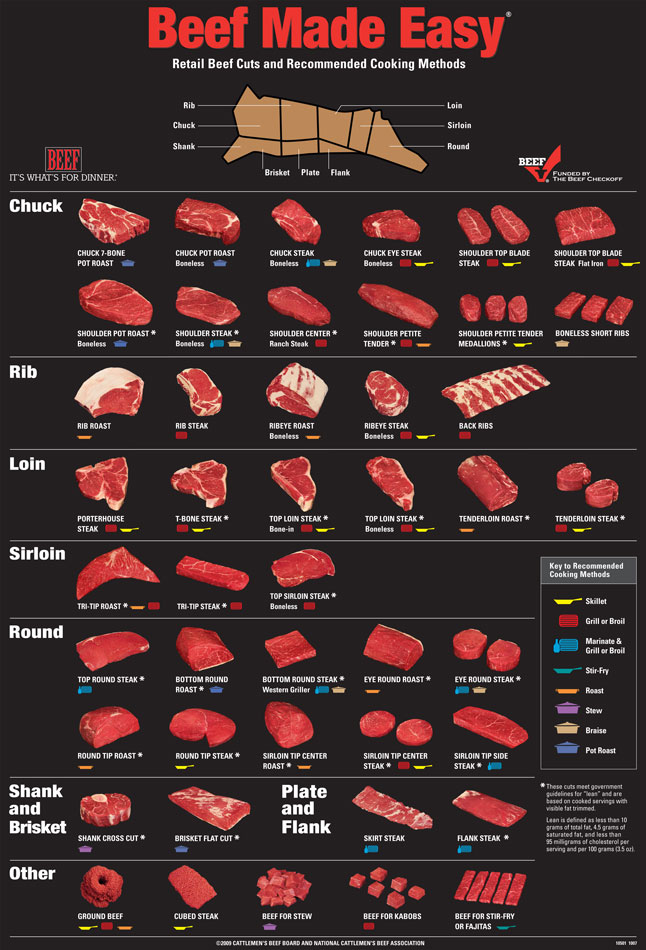

# 咬文嚼字-Part2-好饿好想吃
@(TOEFL)[托福, TOEFL, 词根词缀,咬文嚼字]

[toc]

## Gourmand vs gourmet

**gourmet 【ˈɡʊrmənd】**与**gourmand【ɡʊrˈmeɪ】**均为法语借用词，都保留了原先的拼法，发音也基本不变，两者有时会被混用，但其差别是明显的。

**gourmet**于1820年左右进入英语，源自古法语**gromet**，原义为“酒店伙计”、“品酒人”（wine taster），以后受**gourmand**的影响，转指精于品尝美酒和美食的人，即“美食家”，也指“讲究饮食的人”。如今也常作形容词用，表示“制作美食佳酿的”或“精美的”。

**gourmand**从15世纪进入英语起就用于古法语的原义：“贪吃的人”，但在18世纪时曾一度用以指“美食家”，而到19世纪gourmet在英语出现后，此义便又逐渐被gourmet所取用，因此，今天gourmand仍然用于原义。

- **`gorg-`**,**`gurg-`** 
  = throat, 表示“喉”。源自拉丁语 gurges "throat," also "gulf, whirlpool."

- **gourmand**: [ˈɡʊrmənd] n. 美食家;大肚子;大肚汉;喜欢吃喝的人

  > 来自法语，词源不详。可能来自 vor-,吞食，词源同 voracity,gorge.

- **gourmet**: [ɡʊrˈmeɪ] n .  美食家；讲究饮食的人；美酒美食品尝家

  > 来自古法语groumet, 酒管，酒侍。可能来自groom, 仆人，管酒的人，词义进一步引申为品酒家，美食家。比较butler。

- They're real gourmets and buy only the best cuts of meat. (LLA) 他们极为讲究饮食，只买最好的肉块。
- Our speciality foods will appeal particularly to the gourmet. (CID) 我们的特色佳肴会特别吸引美食家。
  Have you tried that new gourmet restaurant? (CID) 你试过那家新开的菜肴精美的餐馆了没有？
- His wife is a gourmet cook. 他的妻子能做一手好菜。

**摩西英语(摩西)**

- **gourmand** ['gʊəmənd; 'gɔː-] n. 美食家；贪食者
- **gourmet** ['gʊəmeɪ; 'gɔː-] n. 美食家。

怎样区分这俩吃货呢？**a gourmand regards quantity more than quality, a gourmet quality more than quantity**.即gourmand重量多于重质，gourmet重质多于重量，江湖派一些，gourmand，妈的mand真能吃！

### toast（敬酒）：在葡萄酒中放烤面包片的习俗

> torr- = dry, 表示“干”。源自拉丁语 torrere "to dry, parch, burn."

古今中外，人们都有在喝酒时碰杯的习俗。据说该习俗最早出现于古希腊。那时人们在饮酒前，会主动把自己杯里的酒和对方杯中酒掺杂，以此表示酒里无毒。后来，信任的朋友和熟人之间就不再这么麻烦，仅仅象征性地碰一下酒杯即可。这就是碰杯的起源。

碰杯时，人们往往还会说一些祝福的话，这种做法就是“敬酒”。在英语中用**toast**表示。单词**toast**本指烤面包，它是怎么跟“敬酒”扯上关系的呢？

原来，古代人喜欢喝葡萄酒，但当时葡萄酒的味道远不如现在好喝。人们往往会在葡萄酒杯中放一片烤面包（**toast**），涂有香料或果酱的烤面包更好。烤面包可以吸收葡萄酒的酸味，使葡萄酒变得更加香醇。人们在向长辈或女性敬酒时，往往会把对方的美德或美貌比作葡萄酒中的**toast**。久而久之，**toast**一词就用来比喻杰出的、广受赞誉的人，还可以用作动词，表示“敬酒”之意。

敬酒这种习俗无论中外都很流行。在西方宴会上还出现了专门的**toastmaster**，相当于宴会主持人。他的职责就是组织宴会上的敬酒活动，避免出现一窝蜂的混乱场面。

- **toast**：
  - n.烤面包，**敬酒**，干杯，**接受敬酒的人**，广受赞誉的人
  - vt.向……敬酒，为……干杯
  - vi.烤火，取暖，烘烤面包
- **toaster**：['tostɚ] 
  - n. 烤面包器，烤箱；
  - 祝酒人；
  - 烤面包的人
- **toast in the town**：广受赞誉的人
- **toastmaster**：n.宴会主持人，祝酒提议人，致祝酒辞者

**词源说明(童理民)**  

来自古法语 **toster**,烤火，烤面包，**`-st`**,过去分词格，来自拉丁语 **torrere**,燃烧，词源同torrid,terracotta.拼写比较 roast,roster.后引申词义干杯，祝酒，致辞等。

最初用于祝愿漂亮女人或受欢迎的女人永远健康美丽，据说是来自中世纪流传的一个小故事，在英国著名的巴斯温泉度假村，有一位美女在泡温泉，然后一个绅士（或假绅士真色狼）想去搭讪这个美女，于是就想出了一个妙招，拿起一个杯子在美女沐浴过的水池里面舀了一杯水，然后说，您真美丽，祝您永远健康，潜台词就是我是真的仰慕您的美丽，您的洗澡水都让我如此着迷。故事虽然美丽，但实际情况更可能是来自面包的比喻义，因这种面包当时用于增加酒的香味，因此，举杯前说一段祝酒辞能更好的增加宴会的品味。

**摩西英语(摩西)**

- **toast** [təʊst] n.干杯；烤面包；接受敬酒的人，vt.向…祝酒，vi.烤火；使暖和；烘烤。12世纪时，麦芽酒的味道不咋地，人们通常用加了香料的烤面包浸在酒里来吸收酒的异味，这其中的道理到现在也是个迷但这种现象一直持续到了16世纪。向...祝酒，就是要用**toast**吸取酒中的异味，然后让被敬酒者舒服。 
- **toast**有"烤面包片,吐司面包"的意思,这和敬酒有什么关系?据说12世纪起,英国人饮酒时喜欢将香喷喷的**toast**浸到酒碗中,以增加酒的味道.酒席上,人们通常会向最德高望重的人,最优秀的人或尊贵的客人频频举杯,盛赞对方的美德就像**toast**一样,可以使酒的味道更加醇厚。到了18世纪,**toast**逐渐就有了敬酒之意。
- **toast**有"烤面包片,吐司面包"的意思,这和敬酒有什么关系?还有一种说法认为toast源于盎格鲁-撒克逊人的祝酒习俗.盎格鲁-撒克逊人属日耳曼民族,是盎格鲁人,撒克逊人和朱特人的一支,5世纪和6世纪居住在英 国.据说盎格鲁-撒克逊人饮酒时,喜欢将面包浸到木制的酒碗中.他们认为喝酒时吃到面包的人来年会有好运道.从那时起**toast**就开始表示"向尊敬的人 (们)敬酒。

**英语词源趣谈(庄和诚)**

**toast**一词源自古法语动词**toster**（烤）和拉丁语形容词***tōstus***（烤过的）。在英语中“烤面包（片）”作**toast**，“祝酒”也作**toast**。这两者之间有无联系呢？

旧时，在英国流行一种习俗：人们饮酒时，常爱把一块加了香料的烤面包片（**a piece of spiced toast**）泡入酒中，据说这样可使酒味更美。该习俗在莎士比亚时代尤为风行，所以我们今天有**to drink a toast**（祝酒）的说法。

据传，昔日英国人还认为受祝酒的人的名字，尤其是自己所爱慕的女人的芳名，也会像烤面包片那样使酒变得芳香甜美。这种看法可能起源于爱尔兰散文作家、评论家、剧作家斯梯尔（Richard Steele, 1672-1729）在他主办的单张小品期刊《闲谈者》（The Tatler）第24期（1709年6月4日）上发表的一篇轶闻趣事，内容大意如下：

查理二世在位时，一位有名的美妇人在巴思温泉（**Bath**）休养。有个追求她的人为了向她献殷勤，从她站着的温泉水中舀了一杯水，当众为她的健康干杯。旁边一个喝得半醉的朋友说，祝酒者本人倒不喜欢那水，而是喜欢泡在其中的**toast**，也就是泡在水中的美人。从此以后，**toast**一词既用以表示“祝酒”，也常引申为“受祝酒的人”。

- She ate two slices of toast spread with jam. 她吃了两片涂了果酱的烤面包。
- We drank a toast to our guests. 我们为客人祝酒。
- Now, if you'd all please raise your glasses, I'd like to propose a toast to the bride and groom. (CID) 现在请大家都举起杯来，我提议为新娘和新郎干杯。
- We toasted his victory in/with champagne. (OCD) 我们用香槟酒为他的胜利干杯。

## 荤的

### Cow v.s Beef / Sheep v.s Mutton

在英语中有一个有趣的现象，那就是对于猪、羊、牛等牲畜，表示动物的单词和表示其肉食的单词相差甚远，如pig（猪）和pork（猪肉）、sheep（绵羊）和mutton（羊肉）、cow（牛）和beef（牛肉）。这是为什么？

原来，在11世纪时，法国诺曼底公爵率军入侵英格兰，成为了英格兰的国王。从此以后，英格兰的统治阶层变成了说法语的法国贵族，他们在表示”猪肉”、“羊肉”、“牛肉”等食品时，使用的是高贵的法语。这些法语单词后来逐渐进入英语，变成对这些肉食的称呼。

而负责饲养牲畜的仆人一般是英国人，依然使用源自原始日耳曼语的古英语来称呼这些牲畜。久而久之，就造成了表示这些动物的英语单词和表示它们的肉的英语单词的不一致。

- **pig**：[pɪg] n.猪
- **pork**：[pɔːk] n.猪肉
- **sheep**：[ʃiːp] n.绵羊
- **mutton**：['mʌtn] n.羊肉
- **cow**：[kaʊ] n.牛
- **beef**：[biːf] n.牛肉

### bacon（培根）：常用于腌制的猪后臀肉

 

英语单词**bacon**指的是用盐、香料腌制或用烟熏制而成的猪肉，是西式猪肉制品三大品种（火腿、培根、灌肠）之一，其词源与单词**back**（背、后）相同，本意为“猪的背部、后部的肉”，从拼写上还能看出与back的联系。

该词在14世纪之前既可以指熏腌肉，也可以指新鲜肉。后来，由于人们常常用猪的背部和后部的肉来制作培根肉，所以**bacon**一词的词义缩小了，专指经过腌制或熏制而成的猪肉。

英国的两位大哲学家***罗杰•培根*** 和***弗朗西斯•培根*** 的老祖宗都是制作培根的，故以**Bacon**作为自己家族的姓氏。

- **bacon**：['beɪk(ə)n] n.培根肉，腌猪肉、熏猪肉
- **back**：[bæk] 
  
  - n. 后面；背部v. 支持；后退
  - adv. 以前；向后地
  - adj. 后面的；过去的
  
- **save one's bacon**使自己(或某人)免遭死亡(或损伤，失败)；幸免于难。

  > **bacon**现在指猪背部和肋部的熏肉，可是在中世纪，**bacon**就象现在的单词**pork**一样，泛指猪身上所有位置的肉，所以这句习语中的**bacon**就相当于**body**，那习语的意思就好理解了。

  - I saved my bacon by arriving just in time for the meeting. 

| 单词                    | 解释                                                         |
| ----------------------- | ------------------------------------------------------------ |
| **lard** 【lɑːrd】 | n. 猪油 vt. 涂加猪油, 夹杂, 润色   - 来自拉丁语 lardum,猪油，熏肉。后仅指猪油。 |
|                         |                                                              |
|                         |                                                              |

### [beef](http://www.dorflersmeats.com/butcher-shop/beef/)

 

### [Veal](http://www.dorflersmeats.com/butcher-shop/veal/)

> 词源说明(童理民)   1 - 来自拉丁语 vitulus,小牛，字母 t 脱落，来自 PIE*wet,年，词源同 vellum,wether.原指尚未成年的小牛，后指小牛肉。

 

## 素的

| 单词                         | 解释                                                         |
| ---------------------------- | ------------------------------------------------------------ |
|                              |                                                              |
| **crumb** 【krʌm】      | n. 碎屑, 面包屑; 少许 vt. 捏碎, 弄碎  来自古英语cruma, 面包屑，碎片。可能同crisp, 卷的， 脆的。  在IT界，尤其是网站设计里面，Crumb就是navigator导航栏。具体缘由参阅《Don't make me think》。 |
| **crumble** 【ˈkrʌmbl】 | crumb【面包屑】 + -le, 表反复。 v. （使）破碎, 成碎屑; 坍塌; 崩溃 n. 酥皮水果甜点   |

### pickle   泡菜, 腌菜; 盐卤汁; 困境; 讨厌鬼

> n. 泡菜, 腌菜; 盐卤汁; 困境; 讨厌鬼
> vt. 腌制; 酸洗

**pickle** - 一般辞书认为，**pickle**源自中世纪荷兰语***pekel***，但有一种说法认为，它源于14世纪一个名叫***William Beukel/Bukelz***的荷兰人的姓氏。此人乃渔民，据说他发明了腌菜和泡菜的制作方法，因此人们就用其姓氏Beukel来指腌汁、泡菜等，以后该词逐渐演变为pekel，英语作**pickle**。

例　

- Would you like a pickle with that sandwich? (FWF) 你的三明治要不要配泡菜？
- These cucumbers are just the right size for pickling. (CWR) 这些黄瓜拿来腌大小正合适。
- Lisa bought some pickles at the deli. (NED) 莉萨在熟食店买了点泡菜。

## 水产的

### Urchin [ˈɜːrtʃɪn] 海胆

n. 小脏孩;贫穷肮脏的儿童;流浪儿

1. a young child who is poor and dirty, often one who has no home
2. = sea urchin (海胆)

**urchin** 

操法语的诺曼人在1066年征服了英国，此后数百年来法语借用词源源不断地涌入英语之中，**urchin**即为其中之一。它是13世纪时进入的，在古法语的原词形为***herichon***，原指***hedgehog***（刺猬），英国人按其发音曾拼出各种不同的词形，最后定为**urchin**。

在英国民间故事中，刺猬被认为是喜欢恶作剧的小妖精的化身，它昼伏夜出，四处寻觅食物，常常趁人不备时作弄人。因此，原义为“刺猬”的**urchin**常喻指“小妖精”。

到了16世纪初**urchin**又进而转义为“小淘气”或“顽童”。今天，它的原始词义虽然已被废弃，但我们仍能从海胆的英语名称**sea urchin**找到它的痕迹。海胆壳上能活动的棘刺和刺猬身上的硬刺极为相似，所以海胆一度被称作**sea hedgehog**，后来才改称**sea urchin**。另外，法语hérisson和urchin同出一源，但该词至今仍指“刺猬”。

例　You little urchin! 你这个小淘气！

###  clam（蛤蜊）：像钳子一样的蛤蜊壳

蛤蜊是一种有壳的软体动物，它的壳像是一把钳子，能够紧紧地夹住东西。因此，古苏格兰人将其命名为**clam**。该词来自古英语clamm，意思是“紧握”。英语单词**clamp**（夹钳）也来源于此。这就是为什么单词**clam**和**clamp**的拼写如此相似的原因。

- clam：[klæm] 
  - n.蛤蜊，沉默寡言的人，钳子
  - vi.捞蛤；保持沉默，闭嘴不言
- clamp：[klæmp] 
  - n.夹钳
  - vt.夹紧，固定住

**as happy as a clam**非常幸福。**clam**是蛤蜊，它和幸福有啥关系呢？

首先，蛤蜊的外壳张开时很象人大笑时的双唇，其次，蛤蜊在水里外壳张开其实有被捕食者吃掉的风险，所以，唯有被潮水冲到沙滩上的蛤蜊才能“开怀大笑”。

- I am as happy as a clam living all by myself in this little house by the sea. 

## 甜品的

### Bang for the buck

 

**Bang for the buck** is an [idiom](https://en.wikipedia.org/wiki/Idiom) meaning the worth of one's money or exertion. The phrase originated from the slang usage of the words "bang" which means "excitement" and "buck" which means "money".[[1\]](https://en.wikipedia.org/wiki/Bang_for_the_buck#cite_note-Heacock19-1) Variations of the term include "bang for **your** buck," "bang for **one's** buck," "**more** bang for the buck," "**bigger** bang for the buck," and mixings of these. "More bang for the buck" was preceded by "more bounce to the ounce", an advertising slogan used in 1950 to market the carbonated soft drink [Pepsi](https://en.wikipedia.org/wiki/Pepsi).

The phrase "bigger bang for the buck" was notably used by U.S. President [Dwight D. Eisenhower](https://en.wikipedia.org/wiki/Dwight_D._Eisenhower)'s [Secretary of Defense](https://en.wikipedia.org/wiki/United_States_Secretary_of_State), [Charles Erwin Wilson](https://en.wikipedia.org/wiki/Charles_Erwin_Wilson), in 1954. He used it to describe the [New Look](https://en.wikipedia.org/wiki/New_Look_(policy)) policy of depending on nuclear weapons, rather than a large regular army, to keep the Soviet Union in check. Today, the phrase is used to mean a greater worth for the money used.

!4$ is sometimes used as a shorthand version.

### buck = dollar

The "buck" is a holdover from America's colonial frontier days when buckskins were the primary measure for bartering goods. The earliest evidence we have of this tradition comes from the journals of [Conrad Weiser](http://en.wikipedia.org/wiki/Conrad_Weiser), who in 1748, while writing about a trade dispute, [recalled](https://archive.org/stream/con00radweisersjouweisrich/con00radweisersjouweisrich_djvu.txt):

> Your Brethren, therefore, have order'd that every cask of Whiskey shall be sold to You for five Bucks in your Town
> The term appears to have stuck around after the dollar became the benchmark for trade after its introduction (and with greater success than the derided Continental).

The first time "a grand" was used in relation to money, however, did not happen until the turn of the last century. The first recorded reference for the use of "a grand" as slang for $1,000 is in 1915, although the Oxford English Dictionary doesn't give it a first citation until 1921, the date of its appearance in [Collier's](https://colliersmagazine.com/). It doesn't appear to have any other meaning than "a grand sum of money."

Tangential Trivia: \$1,000 in 1915 would be the equivalent of \$23,500 today.

 

**Reference:**

1. [Bang for the buck --Wikipedia](https://en.wikipedia.org/wiki/Bang_for_the_buck)
2. [**Why is a dollar sometimes called a "buck" and $1,000 called a "grand", etc?**](https://www.quora.com/Why-is-a-dollar-sometimes-called-a-buck-and-1-000-called-a-grand-etc)

### dessert（甜点）：收拾餐桌后再吃的食物

> serv- 
> = serve, 表示“服务”。
> dis- 
> 来自拉丁语dis-，表示“分开，散开”，引申词义“离开，无，没有，缺乏，表相反等”。该前缀在字母 g, l, m, r, s, v 前缩写为 di-；在字母f前同化为 dif-。

在西方，人们喜欢在餐后吃甜食或甜点心，表示甜食或甜点心的英语单词dessert的本意就是“收拾餐桌以后吃的”。dessert源自法语，原为法语动词desservir的过去分词形式，而desservir = des（等于英语否定前缀un）+servir（等于英语中的serve，上菜），字面意思就是“收拾桌子”。收拾完桌子后再吃的自然就是甜食了。

- **dessert**：[dɪ'zɜːt] n.餐后甜点，甜食
- （比较）desert【ˈdezərt , dɪˈzɜːrt】:de-分开 + sert-插入 → 不再加入 → 离开。
  - n. 沙漠
    a. 被遗弃的; 沙漠的, 不毛的
    v. 抛弃, 离弃, 舍弃; 废弃, 放弃; 背离, 使失望; 逃走, 开小差; 
- **serve**： [sɝv] 
  - vt. 招待，供应；为…服务；对…有用；可作…用
  - vi. 服役，服务；适合，足够；发球；招待，侍候
  - n. 发球，轮到发球
- **service**： ['sɝvɪs] n. 服务，服侍；服役

词源说明(童理民)  
1 - des-,不，非，使相反，-sert,服务，词源同 deserts,serve.即停止正餐服务，上甜点。

## 调味品

### salt- = salt, 表示“盐”，来自拉丁语。源自拉丁语 sal "salt."{16}

> -ate 表示“...盐”{42} 这个盐应该是工业/化学领域的盐，和salt这种可食用盐是两码事

| 单词 | 解释                                                         | 单词 | 解释 |
| ---- | ------------------------------------------------------------ | ---- | ---- |
| salt | n. 盐, 风趣, 刺激 a. 含盐的, 咸的, 风趣的, 辛辣的 vt. 加盐于, 用盐腌 salt-  = salt, 表示“盐”，来自拉丁语。源自拉丁语 sal "salt." 来自古英语 sealt,盐，来自 Proto-Germanic*saltom,盐，来自 PIE*sal,盐，词源同 halogen,saline. |      |      |
|      |                                                              |      |      |
|      |                                                              |      |      |

英语词源趣谈(庄和诚)
salt - 当我们了解到salary一词竟是来自意为“盐”的拉丁语sal时，都不免会感到有点惊奇。salary与“盐”之间究竟有什么联系呢？盐在古代被视为珍品，把盐泼翻甚至被人看作是凶兆。古罗马军队把盐作为军饷的一部分，按日实行定量配给，用食盐配给的这部分饷金拉丁文叫salārium（由sal派生而成），相当于英语salt-allowance或salt money。以后，尽管这部分军饷为金钱所取代，但salārium一词却保留了下来。法语借用了该词，作salarie，14世纪进入英语，以salary的形式出现，而且词义被扩展了，用以泛指“薪金”、“薪水”。今天我们尚能从be worth one's salt（称职，胜任）和earn one's salt（自食其力）这两个习语看到salt和salary的历史痕迹。

例　For some people, job satisfaction is more important than a high salary. (LLA) 对某些人来说，工作满意度比高薪更重要。

This position offers an annual salary of 50,000. 这一职位年薪5万美元。

He earns/gets quite a good/high/decent salary in his present job. 他现在的工作薪金不菲／很高／尚可观。

The boss put up/raised everyone's salary by 4,000 last year, because profits were good. (CID) 因为效益不错，老板去年给每个人提薪4000元。

#### salary（工资）：古罗马军队发给士兵的买盐津贴

英语单词**salary**（工资）来源于拉丁语名词**salarium**，本意是“用来买盐的津贴”，其中的**`sal`**指的就是**salt**（盐）。

为什么**salary**（工资）原本是“买盐的津贴”呢？原来，古代只有少数地方产盐，而制盐技术落后，交通不便，所以盐特别珍贵，被称为“***白色金子***”。

罗马军队专门为士兵买盐提供津贴，并且这部分津贴是军饷的重要组成部分，定时发放，十分稳定。所以人们就用**salary**一词来表示一个人稳定可靠的收入，即“工资”。

当西方人想表示一个人称职时，会使用习语**worth one’s salt**（配得上给他的盐）。还有一个跟盐有关的习语，**sit above the salt**（坐在盐罐上首），表示“上座”，这是因为盐罐是餐桌上的重要器皿，只有贵宾才能紧挨着盐罐坐，所以盐罐上方的座位就是上座。

**相关单词：**

- **`sal-`**：盐

- **salt**：[sɔlt] n.盐

- **salty**：['sɔlti] adj. 咸的；含盐的

- **salary**： ['sælərɪ] n.工资，薪水

- **worth one’s salt**： 称职

- **sit above the salt** 坐上席；受尊敬。

  盐在过去还是比较金贵的，所以欧洲人宴请宾客时，会请贵宾坐在紧挨着主人的位置，因为餐桌多为长方形，所以贵宾的位置相当于**sit above the salt**（餐桌上盛盐的罐子），而其他客人则是sit below the salt。

  > They all stood up and asked Peter to sit above the salt. 

- **take with a grain of salt** 对...持保留意见。

  罗马人击败本都国王**Mithridate**后，发现这位传说中百毒不侵的国王的药方中有这样一服药方：胡桃、芸香和无花果碾碎混合后配少许盐服用能助防毒。其实这些东西一起吃有啥味呀，加点盐能调味是真的。

  > All this is speculative,so take it with a grain of salt. 

- **not worth one's salt** 不称职。

  不起眼的盐在古代很贵重的，罗马士兵的薪水的一部分就是所谓的“盐饷”，salary ['sælərɪ] n.薪水，与日耳曼词源的salt盐同源，同时也与希腊词源的**`halo-`**同源。He has had three jobs in the past year, and all his employers have said that he is not worth his salt. 

#### salad（色拉）：用盐水泡过的蔬菜

沙拉（**salad**）是西方人非常喜爱的菜肴之一，通常由蔬菜、水果再加上一些调味酱制成。

在现代，制作沙拉时通常使用沙拉酱作为调味品，而在古代，制作沙拉的调味品通常就是盐水。**salad**一词的来源就与“盐”有关。它来自拉丁语***salata***，字面意思就是**salted**（用盐腌的、用盐泡过的）。

不过和泡菜不同，沙拉通常是用新鲜蔬菜制成，在盐水中泡的时间很短，达到调味的效果即可。现在，随着各种沙拉酱的出现，很少有人还使用盐水来制作沙拉，但**salad**这个单词的拼写依然显示了它和盐之间的关系。

- **salad**：['sæləd] n.沙拉，色拉
- **salt**：[sɔlt] n. 盐
  - adj. 咸水的；含盐的，咸味的；盐腌的
  - vt. 用盐腌；给…加盐
- **salty**：['sɔlti] adj. 咸的；含盐的

### hal- 7= salt, 表示“盐，卤”。源自希腊语 hals (词干 hal-) "salt, sea."{7}

> -ate 表示“...盐”{42} 这个盐应该是工业/化学领域的盐，和salt这种可食用盐是两码事

| 单词        | 解释                                                         | 单词 | 解释 |
| ----------- | ------------------------------------------------------------ | ---- | ---- |
| **hal-ide** | n. 卤化物 a. 卤化物的 推荐：hal-盐 + -ide  hal- = salt, 表示“盐，卤”。源自希腊语 hals (词干 hal-) "salt, sea." -ide 22 化学名词后缀，表示“...化物”如oxide氧化物。 |      |      |
|             |                                                              |      |      |
|             |                                                              |      |      |

### mustard（芥末）：沉浸在未发酵葡萄汁中的调味品

> **`drunk`** a. 喝醉了的 drink的过去式
> **`-ard`** 表名词，“不好的人”。源自日耳曼语 *-hart, *-hard "hold, hardy."
>
>  来自拉丁语 **mustum**,新酒，新酿制葡萄酒，**`-ard`**,名词后缀。来自古罗马时期的芥末烹调方法，即把新酒与芥末籽拌在一起用以给面团调味，后就以该词命名这种植物。

芥末（**mustard**）是一种历史悠久的调味品。它是用芥菜的种子经过碾磨之后制成的。最早的时候，芥末是和醋混合在一起形成膏状，就像我们今天看到的芥末酱一样。

但在中世纪时，曾经有一段时间，人们用酿葡萄酒过程中的一种副产品——未发酵的葡萄汁来替代醋。这种未发酵葡萄汁在拉丁语中称为**mustum**，在英语中称为**must**。因此，人们就将芥末和**must**混合后形成的芥末酱称为**mustard**，后缀**`-ard`**表示沉湎某物的人，如**drunkard**（酒鬼）。

所以**mustard**的字面意思就是沉浸在**must**（未发酵葡萄汁）中的调味品。

**相关单词：**

- **mustard**：['mʌstəd] n.芥末，芥菜，深黄色
- **must**：[mʌst] n. 未发酵葡萄汁

**摩西英语(摩西)：**

**as keen as mustard**极热心的，极感兴趣的。**mustard** ['mʌstəd] n.芥末；芥菜；深黄色。那么芥末和热心有啥交集呢？

原因就在于芥末经常用来给牛肉调味，所以久而久之强烈的滋味（趣味或味道）就等同于了芥末。

- He is as keen as mustard in his work.顺便说一下，英语里有很多**as x as y**格式的习语和成语哦。 

**must:**

n. 必须, 未发酵葡萄汁, 绝对必要的事物
aux. 必须

1. 来自古英语 motan,有能力做，有必要做，-st,过去分词后缀，来自 Proto-Germanic*mot,能力，力量，来自 PIE*med,测量，衡量，采取手段，词源同 measure,medical.其在古英语时期语气并不是很强烈，后不断强化。比较 noblesse oblige.
2. 来自拉丁语 vinum mustum,新酒，新酿葡萄酒，来自 mustus,新鲜的，水灵的，来自 PIE*meus,湿的，带水气的，词源同 mist,moist.

### vinegar（醋）：酒变酸后得到的调味品

> vin-,葡萄，葡萄酒，-egar,酸的，词源同 acid.用来指醋。

醋（**vinegar**）是由酒精在醋酸杆菌等微生物的作用下转化而成的。传说，中国古人在用粮食酿酒过程中，有人觉得酒糟扔掉太可惜，就存放起来。过来一段时期后，发现酒糟转变成了另一种味道酸甜的调味品，这就是醋的来历。

英语单词**vinegar**也反应了醋和酒之间的关系。它来自古法语vinaigre，由vin（wine，酒）和aigre（sour，变酸）组成，其源头是拉丁语vinum acetum（变酸的酒）。由此可推测，西方的醋最早也是由酒变酸后形成的。

- **vinegar**：['vɪnɪgə] n.醋

酒放久变酸了即成醋。英语中意指“醋”的vinegar按其词源的字面义讲就含有“酸酒”的意思。古法语称醋为vyn egre，vyn源于拉丁语vīnum 'wine'（酒），egre源于拉丁语acer/acris 'sour'（酸的），两部分合起来就是sour wine（酸酒）。以后vyn egre演变为vinaigre (vin 'wine' + aigre 'sour')，从法语来看其字面含义更是显而易见了。英语vinegar一词就是由此而来。

例　

- This wine tastes like vinegar. (CID) 这酒的味道像醋。
- Mary sprinkled some vinegar on her French fries. (NED) 玛丽在炸土豆条上洒了几滴醋。

## 酒水饮料

### cider（苹果酒）：希伯来语中的“烈酒”

 

苹果酒（**cider**）是以苹果为主要原料，经破碎，压榨，低温发酵，陈酿调配而成的果酒。

苹果酒是世界第二大果酒，产量仅次于葡萄酒。苹果酒作为一种饮料，在世界上已经有很长的历史。诺曼征服时期的英国，就有了苹果酿酒的历史。诺曼征服之后，英格兰寺院中开始有了关于苹果酒的确切记载。在肯特郡、萨默塞特和汉普郡等这些主要的苹果种植区，多数庄园有自己的压榨设备，并且能够酿制出自己的苹果酒。

英语单词**cider**源自希伯来语***shekhar***，与阿拉伯语***sakar***（烈酒）有关，原本可用来泛指“烈酒”。经由拉丁语、法语进入英语后，词义逐渐变窄，用来专指“苹果酒”。

- **cider**：['saɪdɚ] n. 苹果酒
