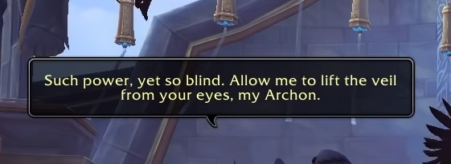

# 咬文嚼字-Part 2 
@(TOEFL)[托福, TOEFL, 词根词缀,咬文嚼字]

[toc]

## yet

> Such power, yet so blind. Allow me to lift the veil from your eyes, my Archon.

柯林斯英汉双解

1. ***ADV*** You use **`yet`** in negative statements to indicate that something has not happened up to the present time, although it probably will happen. You can also use yet in questions to ask if something has happened up to the present time. 尚 (用于否定句); 已经 (用于疑问句)

    - 例：They haven't finished yet. 他们还没有结束。
    - 例：No decision has yet been made.尚未作出决定。
    - 例：She hasn't yet set a date for her marriage. 她尚未定下她结婚的日子。

2. ***ADV*** You use **`yet`** with a negative statement when you are talking about the past, to report something that was not the case then, although it became the case later. (当时) 还 (用于否定句)

    - 例：There was so much that Sam didn't know yet.有那么多萨姆当时还不知道的。

3. ***ADV*** If you say that something should not or cannot be done **`yet`**, you mean that it should not or cannot be done now, although it will have to be done at a later time. (此时) 还 (用于否定句) [with brd-neg, ADV with v]

    - 例：Don't get up yet. 还别起床。
    - 例：The hostages cannot go home just yet.人质们这时还不能回家。

4. ***ADV*** You use **`yet`** after a superlative to indicate, for example, that something is the worst or the best of its kind up to the present time. 迄今 (最…)

    - 例：This is the network's worst idea yet.这是到目前为止该网络最糟糕的点子。
    - 例：Her latest novel is her best yet.她的最新小说是到目前为止她的最好的小说。

5. ***ADV*** You can use **`yet`** to say that there is still a possibility that something will happen. 仍 (用以表示某事仍有发生的可能性) [ADV before v]

    - 例：Like the best stories, this one may yet have a happy ending.像那些最好的故事一样，这个故事可能仍有个幸福的结局。

6. ***ADV*** You can use **`yet`** after expressions that refer to a period of time, when you want to say how much longer a situation will continue for. 还 (会继续某段时间) [n ADV]

    - 例：Unemployment will go on rising for some time yet.失业人数还会继续增长一段时间。
    - 例：Nothing will happen for a few years yet.几年内还不会发生什么事。

7. ***ADV*** If you say that you have `yet` to do something, you mean that you have never done it, especially when this is surprising or bad. 还 (不曾做某事) [ADV to-inf]

    - 例：She has yet to spend a Christmas with her husband. 她还不曾跟丈夫一起度过一个圣诞节。

8. ***CONJ*** You can use **`yet`** to **introduce a fact that is rather surprising after the previous fact you have just mentioned**. 然而

    - 例：I don't eat much, yet I am a size 16. 我吃得不多，然而我是个穿16号的人。

9. ***ADV*** You can use **`yet`** to emphasize a word, especially when you are saying that something is surprising because it is more extreme than previous things of its kind, or a further case of them. 还 (尤用以强调令人吃惊的事物) [强调]

    - 例： I saw yet another doctor.我还看了另一位医生。
    - 例：They would criticize me, or worse yet, pay me no attention.他们会批评我，甚或更糟，会不理我。

10. **PHRASE** You use **`as yet`** with negative statements to describe a situation that has existed up until the present time. 迄今还 (用于否定陈述句中) [正式]

    - 例：As yet it is not known whether the crash was the result of an accident.迄今尚不知该撞击是否是由于一起事故。

 ## -wise

### Otherwise

一个单词有很多个意思，但都来自一个本质意思，你只要充分理解这个本质意思，所有的意思都一通百通。

**otherwise**的本质意思就是 ***not this one, but something else***，很明显就是从**other**衍生过来的，其后缀**`wise`**是表示**「in a… way」**以…方式，**「in … respect」**在…方面。

比如

- likewise 类似的（in a "like" way）
- clockwise 顺时针的 （沿着钟表走动的方向）
- stepwise 逐步的 （像阶梯一样的方式）

你自己也可以用wise创造新词，这种做法很常见，表示「在…方面」

- timewise 在时间方面(Timewise, we are OK 在时间方面，我们还很充足）
- moneywise 在钱方面
- marketwise 在市场方面
- healthwise 在健康方面

我们再来看otherwise，就是在其他方面(other respect/other thing），即not this one but something else，就是指「除目前说的这个以外的其他…」，something else包罗万象，指代任何你想指代的东西。

> 否则（if not）只是其中的一个意思，出现在是两个对立的情况中，只有Yes和No，才会让你觉得otherwise是「否则」的意思。

如果在非对立的情况中，**otherwise就是指除此之外的「其他情况」**。

反正这是个万能词，可以指代任何方面，既可以是副词，也可以是代词。比如:

- Please follow my instructions. Don't do it ***otherwise**(副词，= don’t do it in a different way).*

**Reference**:

1. [把otherwise当「否则」理解，--知乎--史蒂芬的专栏](https://zhuanlan.zhihu.com/p/140503806)) 

## orthogonal

Authorization is [orthogonal](https://docs.microsoft.com/en-us/aspnet/core/security/authorization/introduction?view=aspnetcore-5.0) and independent from authentication. However, authorization requires an authentication mechanism.  

Used to describe two things that are independent of each other. One does not imply the other.
> Common sense and intelligence are orthogonal. I've seen plenty of smart people with no common sense.

