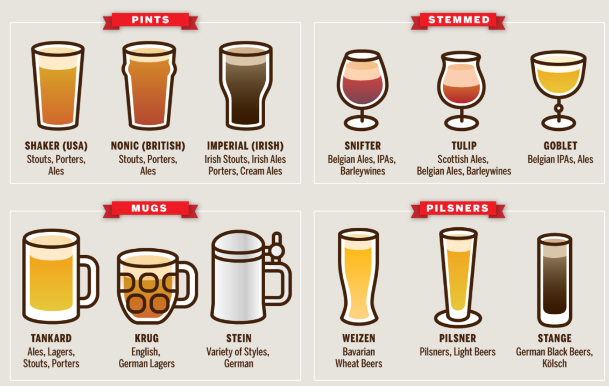

# 咬文嚼字-Part 3 古代西方
@(TOEFL)[托福, TOEFL, 词根词缀,咬文嚼字]

[toc]

## 地名

### palatial /pəˈleɪʃl/

(a.):宫殿般的;富丽堂皇的

相传，坐落在罗马七丘的古罗马城是战神之子***Romulus***于公元前753年前后创建的。

我们如今用以表示“宫殿”和“豪华住宅”、“华丽建筑物”等义的**palace**一词可一直追溯到古罗马七丘之一的主丘***the Palatine Hill***（[帕拉蒂尼山](https://rome.us/ancient-rome/palatine-hill.html)）。

罗马帝国的第一代皇帝奥古斯都（Augustus）以及其后的提比略（Tiberius）和尼禄（Nero）等皇帝都先后把皇宫建在这座山丘上。有人说世界上第一座富丽堂皇的宫殿是尼禄所建。他在位时，建于该山丘上的罗马城已发展为华丽的住宅区，权贵名士都聚居于此，富人的住宅布满山坡。尼禄想把整座山丘据为己有，遂下令私人住宅一律拆除。然后建筑师们为他精心设计了一座皇宫，罗马人称之为palātium，字面义是on the site of the Palatine（位于帕拉蒂尼山上）。以后法国国王据此把他们的王宫叫做palais，英语借用了这个词，初作paleys，后来才演变成palace的。从palace的形容词形式palatial（宫殿的）我们能够更清楚地看到palace同palātium之间的联系。其实，至今英语里还有palatine一词，也作形容词用，同palatial词义相近。

例　

- The queen of England lives in Buckingham Palace. 英国女王住在白金汉宫。
- Demonstrators gathered in front of the presidential palace. (CID) 示威者聚集在总统官邸门前。
- A palace coup led by the general has toppled the dictator. (CID) 由将军领导的宫廷政变推翻了独裁者。
- The palaces of the rich dot the coastline. (WBD) 海岸线上富人的豪华住宅星罗棋布。

1. https://mp.weixin.qq.com/s/UQMLNulL__EF6u6lqMuNDw)

## 称呼与职业

### magic （拜火教祭司）

拜火教是流行于古代波斯（今伊朗）及中亚等地的宗教，中国史称祆教，正式名称是琐罗亚斯德教，其创始人为伊朗先知琐罗亚斯德（**Zarathushtra**，又译查拉图斯特拉）。拜火教是基督教诞生之前中东和西亚最有影响的宗教，古代波斯帝国的国教，该教认为阿胡拉·马兹达（意为“智慧之主”）是最高主神，马兹达创造了物质世界，也创造了火，即“无限的光明”。该教以崇拜火而闻名，故得名“拜火教”。

拜火教的出现，对后来的犹太教、基督教、伊斯兰教，都有深远的影响。在基督教尚未成为罗马国教之前，罗马国内流行的摩尼教就是该教的一个分支。佛祖释迦牟尼悟道后招收的第一批弟子就有拜火教教徒。

拜火教的祭司在古波斯语被称为magush，希腊语中被称为magos，拉丁语中被称为magus，复数形式为magi，意思是“哲人”、“贤人”、“知晓神之奥秘的人”。据《圣经》记载，耶稣出生时，三位magi在东方看见伯利恒方向的天空上有一颗大星，于是便跟着它来到了耶稣基督的出生地，并给耶稣带来了礼物，这就是圣诞礼物的由来。

美国著名文学家欧·亨利写的短篇小说《麦琪的礼物》（*The Gift of the Magi*）中，就用了这个典故。里面的Magi并非小说中的人物，而是拜火教祭司。*The Gift of the Magi*意思就是“圣诞礼物”。

英语单词**magic**（不可思议的，神奇的；魔术、魔法）就派生自**magi**（拜火教祭司），字面意思是“**magi**的”。古人认为**magi**（拜火教祭司）拥有深奥秘密和超能力，所以就用magic来形容巫术、魔法等神奇的事情。

>  比如：What magic drug have you taken to recover so quickly? 你吃什么灵丹妙药，好得这样快？

单词magical衍生自**magic**（魔术、魔法），后面多了一个形容词后缀，意思是“魔术的，魔法的”。做形容词时，**magic**和**magical**的含义差不多，都可以表示“有魔力的，神奇的”，区别在于，magic通常取其本意，而magical常取其引申含义，形容某人某物是“迷人的、美妙的”。如**a magic bed**的意思是“魔法床”，而**a magical bed**的意思则是“神奇的床”。

>  再比如，The beautiful island of Cyprus is a magical place to get married. 美丽的塞浦路斯岛是缔结良缘的美妙之地。

衍生自magic（魔术、魔法）的单词还有magician，后缀-ian表示某种人，所以magician的意思就是魔术师或魔法师。

- **magic**：['mædʒɪk] adj.不可思议的，神奇的，有魔力的，魔术的n.魔法，巫术，魔
- **magical**：['mædʒɪk(ə)l] adj.魔术的，有魔力的，神奇的
- **magician**：[mə'dʒɪʃ(ə)n] n.魔术师，魔法师，巫师

引用： [词源趣谈：magic——神奇的拜火教祭司--钱磊博士](https://mp.weixin.qq.com/s/4U8Py1gjj_yIkYF4ujrqUQ)

### Actuary（精算师）

在保险行业有一种非常专业的人员叫做“精算师”，他们的主要职责就是收集并分析各种统计信息，在此基础上计算出各种事件发生的概率，为各种保险业务的定价提供数学支持。

在英语中，精算师被称为**actuary**。这个单词来自拉丁语，由：

- 词根**`act-`**（活动、行动）
- 后缀**`-ary`**组成，
- 中间的那个字母u可以简单地看作是一个连接字母。

词根**`act-`**和单词**act**（活动、行动）同源，在这里表示“***公共事务、社会中发生的各种事件***”。

后面的**`-ary`**是个常见的形容词及名词后缀，在这里表示“***从事与……相关工作的人***”。

整个单词的字面意思就是“从事与公共事务相关工作的人”。

在古罗马时期，**actuary**是元老院中的一个职务，相当于书记官，负责信息的采集、整理和发布。他需要收集整理各地上报的各种社会重大事件、各地方法官的裁决，参加元老院会议，负责记录会议中形成的决议，最后汇总各方面的信息编写成公报并对外发表。

到了中世纪，**actuary**这个单词的含义变得更加广泛，可以表示抄写员、速记员、法院书记、公证员、记账员、会计师等等。这些职务都涉及到信息的收集整理。

到了近代，**actuary**开始被用来特指保险公司中进行保险精算业务的数学家，也就是所谓的“精算师”。

**actuary**的形容词形式是**actuarial**，后面加了一个形容词后缀**`-al`**，意思是“保险精算的”。与它同源的单词还有**actual**（实际的），字面意思就是“与实践活动相关的”。

- **actuary**：['æktʃuəri] n.保险精算师
- **actuarial**：[ˌæktʃuˈeəriəl] adj.保险精算的
- **actual**：[ˈæktʃuəl] adj.实际的，真实的，现实的

**参考：**

[英语词源趣谈](https://mp.weixin.qq.com/mp/appmsgalbum?__biz=MzA4NTQ4NzIzNg==&action=getalbum&album_id=1297162942844207107&scene=173&from_msgid=2651803449&from_itemidx=1&count=3&nolastread=1#wechat_redirect)

### Villain /ˈvɪlən/ 反派

`villain -` 今指“坏蛋”或“恶棍”的**villain**一词原先并不含贬义。它源自中世纪拉丁语**vīllānus 'farmhand'**，通过法语***vilain***于14世纪进入英语的。

从终极词源来看，**villain**和另一个词**villa**（别墅）都源于拉丁语***vīlla 'country house'***。在中世纪封建时代，这两个词是密切相关的，villa原指“农庄住宅”或“庄园”，而villain则指为villa的主人工作的“农奴”或“农民”。

后来，贵族由于阶级优越感以及他们对农民的阶级偏见，往往把意指农民、乡下人的词语同“愚昧”、“粗野”、“邪恶”等概念联系起来。这样，**villain**的词义就逐渐发生贬降。19世纪出现了一个戏谑性短语**villain of the piece**，指“剧中反面人物”或“首恶”，被德莱塞（***Theodore Dreiser***）、墨多克（***Iris Murdoch***）等作家乃至普通人广泛使用。

但**villa**和出自同一拉丁词源的**village**（乡村）一词至今却仍保留了原拉丁词中的含义。

例:

- The villain cheated the old lady out of her life's savings. (FWF) 这个恶棍骗走了老太太一生的积蓄。
- He made his reputation as an actor playing villains. (CID) 他以演反派角色而出名。
- A faulty fuse was the villain of the piece. 毛病就出在保险丝上。
- The whole village turned out to watch the parade. 全村的人都出来看游行

**villain**（恶棍）：在古罗马农场干活的奴隶。

英语单词**villain**源自拉丁语***villanus***，本意为在villa（古罗马农场）干活的人，通常是奴隶或隶农。**villa**是古罗马贵族在乡村的房地产，包括居所和农场。英语单词**village**（农村）、**villager**（村民）等都源自拉丁语***villa***。

由于在***villa***里面干活的奴隶或隶农地位很低，常常遭到贵族老爷的鄙视和呵斥，因此表示他的拉丁语villanus及其衍生的英语单词villain就不可避免地含有了强烈的贬义，并从表示社会地位的卑贱延伸至表示人品的卑贱，逐渐发展出“坏人、恶棍、反派”等负面含义。可以说，这个单词体现了一种强烈的阶级偏见。

- villain：['vɪlən] n.坏人，恶棍，反派，罪犯
- villainous：['vɪlənəs] adj.邪恶的，缺德的，恶毒的，堕落的
- villa：['vɪlə] 乡村别墅，农场
- village：['vɪlɪdʒ] n.农村，乡村，郊外
- villager：['vɪlɪdʒə] n.村民，乡村居民

*Avengers: Infinity War* depicts the beginning of the Avengers' attempt to protect the Infinity Stones from the **[villainous](https://www.cbr.com/were-in-endgame-now-infinity-war-meme/)** Thanos who wants to use them to erase half of humanity from existence. Thanks to his mystical training, [Doctor Strange](https://www.cbr.com/doctor-strange-2-prepares-filming-in-london/) is able to see each of the 14 million possible outcomes from their fight against Thanos. **All but one end in failure.** Much to Tony Stark's dismay, Doctor Strange gives up the Time Stone to Thanos. When Stark questions his motives, Doctor Strange simply states, "We're in the endgame now."

### Barbarian

**barbarian**（蛮族）：不会讲希腊语的外地人。

在古代欧洲，希腊的文明程度最高，因此当时的希腊人对本民族的文化尤其是希腊语非常骄傲，嘲笑外地人所讲的语言就像是“吧啦吧啦”（***barbar***）的鸟语，所以就用***barbaros***这个单词来形容文化程度低下的外地人。经过拉丁语流传至英语后，产生了**barbarous**（野蛮的）和**barbarian**（蛮族）这些词汇。“蛮族”指的是希腊和罗马周围的文明程度较低的其他民族，主要包括凯尔特人、日耳曼人、斯拉夫人等。后来，这些蛮族部落在欧洲大范围迁徙并入侵罗马帝国，建立了众多的蛮族小政权，是众多欧洲当代国家的源头。位于北非的柏柏尔人（**berber**）也被归入蛮族，该民族的英文名称一样来自希腊语***barbaros***。

- barbarian：[bɑː'beərɪən] n.野蛮人，蛮族
- barbarous：['bɑːb(ə)rəs] adj.野蛮的，未开化的，残暴的
- barbaric：[bɑr'bærɪk] adj. 野蛮的，粗野的；原始的
- barbarism：['bɑrbərɪzəm] n. 野蛮；原始；未开化；暴虐
- barbarity：[bɑr'bærəti] n. 残暴；粗野
- Berber： ['bə:bə] n.柏柏尔人，柏柏尔语

### buccaneer /ˌbʌkəˈnɪr/

**buccaneer**（海盗）：专门掠夺西班牙商船的“皇家海盗”。

在大航海时代，西班牙和葡萄牙率先开展航海探险事业，积极在新发现的美洲大陆进行殖民，从美洲掠夺了大量财富，成为那个时代的霸主。1630年左右，一群在加勒比海域进行探险投机的法国人竞争不过西班牙人，被西班牙人赶到一座海岛上。从此以后，这群法国人以此为据点，做起了海盗生意，专门袭击西班牙商船，声势越来越大，越来越多的法国人以及英国人、荷兰人也加入进来，将这项专门针对西班牙商船的海盗事业越做越大，并且还赢得了本国政府的支持，获得政府颁发的“私掠许可证”，成为奉旨打劫的“皇家海盗”，就算被西班牙军队俘虏后还可以享受战俘待遇，而不是像普通海盗那样被绞死。在后来英国和西班牙的大海战中，***英国海军就依靠这些“皇家海盗”击败了西班牙的无敌舰队，终结了西班牙的霸主地位***。

在法语中，这群海盗被称为“***boucanier***”，源自加勒比海土著语***buccan***（烤肉架），字面意思就是“使用烤肉架烤肉的人”，因为这群海盗也喜欢使用这种架子烤肉吃。英国人将其英语化为**buccaneer**。1684年，著名法国作家Alexandre Exquemelin描写17世纪加勒比海盗的名著《美洲海盗》的英译版本出版后，buccaneer一词更是广为流传，成为了“海盗”（pirate）的同义词。

在荷兰语中，这群海盗被称为***vrijbuiten***，由**`vrij`**（free）+ **`buiten`**（booty，掠夺品），演变为英语中的**freebooter**和**filibuster**，都表示“海盗”。

同样源于加勒比海土著语***buccan***（烤肉架）还有单词**barbecue**（烧烤），它是经由西班牙、法语进入英国的。

- buccaneer：[,bʌkə'nɪə] n.海盗vi.做海盗
- freebooter：['friːbuːtə] n.海盗
- filibuster：['fɪlɪbʌstə] n.海盗，暴兵，阻挠议事的议员，阻挠议事的行为 vi. 掠夺，阻挠议事

### chiseler（骗子）：从银币上凿碎银的罪犯

15世纪后，西班牙通过殖民逐渐占领了大片的美洲土地，并于16世纪30年代开始在盛产白银的美洲殖民地设厂铸造银币。西班牙银币在欧洲得到大范围流通。

一些精明的骗子打起了西班牙银币的主意。他们从每一块银币上凿下一点儿银子，然后积少成多，用攒下来的碎银子铸造出额外的银币。由于他们的这种作案手法，人们将其称为chiseler（凿工），单词chisel就是“凿”的意思。

- chiseler：['tʃizələ] n.骗子，凿工
- chisel：['tʃɪzl] (chis-=cis- , 砍，劈，词源同decide , excise。)
  - v. 雕，刻；凿；欺骗
  - n. 凿子

### cop 警察？ 抓人？

> 来自词根cap- , 抓，握，词源同capture , captive。

cop - 该词有两个主要词义：作为动词用时，cop是个俚语词，表示to grab，get（攫取，抓住）；作为名词用时，cop则是个口头用语，意指“警察”。我们不妨把它们当作两个cop来看待。前一个cop源自古法语caper 'seize'（抓住）。关于后一个cop的词源则有三种不同的说法。

- 其一，警察乃抓捕罪犯者，故而被称为copper，即one who cops or catches offenders。该词始见于1846年，到了1859年被缩略为cop。一般认为此说较为可信。
- 其二，昔时英国警察制服上的纽扣是铜（copper）制的，而cop则是copper的逆构。这一说法似乎和事实不符。英国的警察部队于1829年组建，而cop一词则早在1704年就已用于one who captures or snatches一义。
- 其三，cop是constable on patrol（巡逻警察）或chief of police（警长）的首字母缩拼词，即由各词的第一字母缩合而成。

cop一词不论用于何种情况，多少总带贬抑含义，因此一般警察都不喜欢cop这一字眼。曾任美国联邦调查局局长近半个世纪的胡佛（Edgar Hoover, 1895-1972）被人取了个绰号叫nation's top cop（国家头号警察），这一绰号每每见诸各种报刊，他对此十分恼火。（参见police）

例　Quick, run — there's a cop coming! (CID) 快跑——警察来了！

I don't much enjoy cops and robbers films. 我不怎么爱看警匪片。

There are more criminals out there than cops to chase them. (LAA) 那里的罪犯多得警察抓不过来。

###  trivia（琐事）：妇女们在三岔路口的闲聊

> tri∙via  [词根树]
> tri- 
> 表示“三”。源自希腊语 tri- "three."
> via- 
> = way, 表示“道路”。源自拉丁语 via "way, road."

中国有句古话，叫做“三个女人一台戏”，意思是三个女人凑一块就会叽叽喳喳地闲聊开，热闹得像唱戏一样。古代罗马人想必对此也深有体会。他们认为，三条道路汇集之地，必然会有妇女聚集在一起叽叽喳喳扯些家长里短的琐碎之事。

英语单词**trivia**就反映了古人的这种观念。该词来自拉丁语**trivium**，由**`tri`**（three，三）+**`via`**（way，道路）构成，字面意思就是三条道路汇聚之地。

因此单词trivia的本意就是妇女们在路口闲聊所说的事，自然是无关紧要的琐事。

- **trivia**： ['trɪvɪə] n. 琐事
- **trivial**： ['trɪvɪəl] adj.琐碎的，无关紧要的

trivial-关于该词的来源存在两种说法，但只是略有差别。

1. 其一，源于拉丁语trivium，而trivium系由tri- 'three'加via 'way, road'构成，故字面义为“三条路的会合点”或“十字路口”。古罗马妇女从市场回家的路上，喜欢停在十字路口同人闲聊，内容自然是些无关紧要或琐碎的事情。
2. 其二，源于意为“三艺”的拉丁语trivium。什么是“三艺”？从古罗马到中世纪，大学的文科有七门学科，称文科“七艺”。“七艺”可分为“四艺”和“三艺”两类。“四艺”，即quadrivium，指算术、几何、音乐和天文；“三艺”，即trivium，指语法、修辞和逻辑。在两类学科中，“三艺”被认为是不重要的、低级的、普通的学科。

以上不论是哪种说法，都肯定英语trivial一词源于拉丁语trivium。其实“三艺”一义也是从“十字路口”引申的。更确切地说，trivial是直接从trivium的形容词形式triviālis演变过来的，15世纪进入英语，故最初含有of the crossroads（十字路口的）和belonging to the trivium（三艺的）之义。其今义“琐屑的”、“不重要的”、“平凡的”等都是16世纪以后从这一原义引申来的。

与trivial相关的词，除了trivium（三艺），quadrivium（四艺）被直接借入英语外，我们发现还有trivia一词。严格地说来，trivia是原拉丁文trivium的复数形式，但它进入英语却是从trivial逆生而成的，一般用以指“琐事”。

- His father often loses his temper over trivial matters. 他父亲常常因一些琐事而动肝火。
- I'm so sorry to bother you with such a trivial problem. 为这样一个小问题来打扰你，真对不起。
- She just dismissed my problem as too trivial to be worth discussing. (CID) 她认为我的问题不值一谈。
- I'm not going to waste my time on such trivia. (LDC) 我不打算把时间浪费在这些琐事上。

### snob（势利眼）：对平民大学生的蔑称

英语单词snob源自18世纪90年代时英国剑桥、牛津等大学的俚语，用来表示“平民、俗人”。据说当时在英国剑桥和牛津大学，在学生名册上，在贵族学生的姓名后面标注上拉丁语nobilitate（nobility，贵族），在平民学生的姓名后面标注上sine nobilitate（non nobility，非贵族）。

因此，贵族学生就用snob来称呼平民学生。当时能上牛津、剑桥等大学的平民子弟通常出身于富裕家庭，其中有不少人羡慕贵族和上流社会，鄙视其他平民，趋势附炎，冒充贵族四处显摆，令真正的贵族学生十分瞧不起，因此snob一词就逐渐衍生出“自命不凡者、趋势附炎者、势利眼”等负面含义。

- snob：[snɒb] n. 自命不凡者、趋势附炎者、势利眼
- snobbery：['snɒb(ə)rɪ] n.势利，谄上欺下，摆架子
- snobby：['snɔbi] adj.势利的
- snobbish：['snɒbɪʃ] adj.势利的

snob - 旧时在牛津、剑桥等英国大学的学生名册中，出身高贵的学生姓名后面标有NOB的字样，NOB是nobility（高贵的出身，贵族身份）一词的简略形式；出身平民的普通学生姓名则被标以s. nob.，这是拉丁语sine nobilitate 'without nobility'（无高贵出身）的缩略。

据认为，英语snob一词可能即由此而来，因此最初含有低贱者或平民之意。长期以来剑桥师生曾一直用该词来指“市民”（townsman），以别于“穿长袍的大学师生”（gownsman）。

snob的今义据说是英国小说家萨克雷（William Makepeace Thackeray, 1811-1863）最先使用的。1847年他出版了著名散文集《势利人脸谱》（Book of Snobs），这是由45个特写组成的英国社会各阶层势利人的肖像。他把英王乔治四世（George IV, 1762-1830）也称作snob，因为他以“欧洲第一绅士”自诩，但身上却丝毫没有绅士的特征。

经萨克雷这么一用，snob成了一个常用词，现通常多指“势利的人”、“自以为懂行的人”或“自命不凡的人”。intellectual snob是“自以为很有学识的人”，academic snob是“自封为学者的人”，music snob指“自以为懂音乐的人”，wine snob指“自命不凡、非上等酒不喝的人”，而snob appeal/value则是“对势利顾客的吸引力（价值）”。

- He's too much of a snob to mix with that earthy crowd. (FWF) 他这个人势利透顶，不屑与那些粗人为伍。
- A Rolls-Royce has snob appeal. (LDC) 劳斯莱斯汽车对势利顾客是有吸引力的。
- John is a snob who acts as though he is better than we are. (NED) 约翰是个自命不凡的人，好像比我们都高明似的。

## 人物

### Scarlet / Scarlette

n. 猩红色, 绯红色, 红衣
a. 绯红色的, 鲜红色的

1 - 来自古法语 escarlate,红布，来自拉丁语 scarlatum,红布，来自波斯语 saqerlat,红布，特指颜色鲜红的布。并由该词衍生姓氏 Scarlett,染色工或布商，如好莱坞著名美女 Scarlett Johansson.

### diesel 发明内燃机的工程师狄塞尔

柴油发动机是燃烧柴油来获取能量释放的发动机。它是由德国工程师鲁道夫•狄塞尔（Rudolf Diesel）于1892年发明的，是19世纪末最重要的一项机械发明。为了纪念这位发明家，人们用他的姓Diesel来表示柴油，而柴油发动机也称为diesel engine（狄塞尔发动机），或简称diesel。

- diesel：['diːz(ə)l] n.柴油、柴油机。

###  bridal / ale：以卖酒为由头收取礼金的英国传统婚宴

英语单词**bridal**含有两个意思，一个是**bride**（新娘）的形容词，另一个是名词，表示“婚礼”。bridal以常见的形容词后缀al结尾，为什么还能作名词呢？原来，单词bridal源自古英语brydealo，等于现代英语的bride ale，表示婚宴。

**ale**是英国地区的一种传统啤酒，通常翻译为“麦芽酒”或“爱尔啤酒”。在古代英国，麦芽酒是英国人的主要饮料。当人们想筹措资金时，就会组织一次宴会，在宴会上销售麦芽酒，通过卖酒的方式来筹钱。所以ale还可以表示通过销售麦芽酒的方式来筹钱的宴会，如**bid ale**就是为教区穷人募捐而举行的慈善宴会。

在古代英国，结婚的新人为了筹措婚宴的费用，也会在婚宴上向来宾提供大量麦芽酒供其饮用，而来宾也以购买麦芽酒的名义向新人赠送礼金，以此弥补新人的婚礼支出，因此这种婚宴就被称为**bride ale**。

**bride ale**原本只用作名词，但后来常常连写为bride-ale用作形容词，并且受到以al结尾的形容词的影响，逐渐变成bridal，因此增加了“婚礼的，新娘的”之意。

- ale： [eɪl] n.麦芽酒，爱尔啤酒，以卖酒方式筹钱或募捐的宴会
- bridal：['braɪd(ə)l]n.婚宴，婚礼adj.婚礼的，新娘的
- bride： [braɪd] n. 新娘；姑娘，女朋友
- stout 【staʊt】
  - a: 粗壮的;肥胖的;肥壮的;粗壮结实的;厚实牢固的;顽强的;坚毅的;不屈不挠的
  - 烈性黑啤酒

bridal ['braɪd(ə)l] adj.新娘的；婚礼的，n.婚礼。

这个单词由两部分组成：**bride**新娘+**ale** [eɪl] n.麦芽酒。

ale是啤酒进入英国前流行的饮料，

- 与beer相比，ale没经过**啤酒花发酵**，多流行于乡下；
- 啤酒的酿造加入了啤酒花，先盛行于城镇。

热闹的婚礼中，宾客喝掉大量的酒，这样看，bridal类似“喜酒”

 

[The Perfect Stout (quest)](https://wowpedia.fandom.com/wiki/The_Perfect_Stout_(quest))

在当今英美富有人家的婚宴上，向新娘敬酒时新娘和宾客喝的通常都是香槟酒，可是在古时英国的传统婚宴上新娘和宾客喝的则是麦芽酒（ale）。这一习惯反映在bridal的词源上。bridal在古英语作brdealu，由两个古英语词brd 'bride'（新娘）和ealu 'ale'（麦芽酒）构成，意思是wedding feast（婚筵），但字面义则为bride('s) ale（新娘麦芽酒）。

嗣后，其词形、词性及意义均发生了变化。词形先由brdealu变为bridale，后又变为bridal。该词原先只作名词用，以后因为常常用作名词修饰语，而且总和以**-al**结尾的形容词如fatal（致命的），mortal（终有一死的），natal（出生的）等相联系，所以到了18世纪就逐渐地转为bride或wedding的形容词用了。词义也随之发生了变化，表示“婚礼的”或“新娘的”，如bridal chamber（洞房），bridal dinner（婚筵）。

- We stayed in the hotel's bridal suite. (CID) 我们住旅店的新婚套房。
- Sue tossed her bridal bouquet to the bridesmaids. (NED) 苏把新娘花束扔给伴娘。

## 物品

### Indenture(契约)

在中世纪的欧洲，人们在签订契约时，往往会把两份内容相同的契约写在同一张羊皮纸上，然后在中间以锯齿状边缘分割开，双方各持一份。以后需要比对契约真伪，只需要查看两份契约的锯齿状边缘能否对上即可。

英语中，这种以锯齿状边缘分割的契约就被称为**`indenture`**。这个单词来自拉丁语，由前缀`in-`（进入）加词根`dent-`（齿）及名词后缀-ure构成，字面意思为“缩进成锯齿状之物”。

**indenture**对应的动词是**indent**，意思是“缩进，使成锯齿状”。比如：

- We usually indent the first line of a paragraph.

> 我们通常使每个段落的第一行缩进。

从词源上看，拉丁词根`dent-`（齿）其实和来自英国人本族语的常见单词`tooth`（牙齿）源自同一个老祖宗，只不过发生了音变，导致拼写差异比较大。具体来说，开头的辅音字母`t`和`d`相通，末尾的`th`和`t`相通，中间的双元音字母`oo`和单元音字母`e`相通，然后`dent-`中的鼻音字母`n`在单词`tooth`中脱落了。

只要我们熟悉了这些常见的音变规律，就能轻松地看出词根dent-和单词tooth之间的亲缘关系，可以利用常见单词tooth来帮助记忆词根`dent-`。

来自词根`dent-`（齿）的常见单词还有**dental**（牙齿的），**dentist**（牙科医生），**trident**（三叉戟、三齿鱼叉）等等。

**词根dent-（齿）**

- indenture：[ɪnˈdentʃə(r)] n.契约，合同
- indent：[ɪnˈdent] v.缩进，使成锯齿状
- dental：[ˈdentl] adj.牙齿的
- dentist：[ˈdentɪst] n.牙科医生
- trident：[ˈtraɪdnt] n.三叉戟，三齿鱼叉
- tooth：[tuːθ] n.牙齿

**References & Conncection**

1. [词源趣谈：以锯齿状边缘分割开的indenture（契约）-- 钱博士英语(钱磊博士)](

### banquet（宴会）：西方请客时摆在长凳上的小点心

> banqu∙et  [词根树]
> **`banqu-`** 
> = bench, 表示“长椅”。源自日耳曼语 *bankiz, *bankon- "bank of earth."
> **`-et`** 
> = -et, 表示“小”。源自拉丁语 -ellus, diminutive suffix.
>
> 源自法语，和 bench【椅子】同源，词尾 -el 是小词后缀。古宴会时，人人面前摆张小凳子，用以放置食物。

英语单词**banquet**表示正式的宴会，如国宴，所以一看到**banquet**这个单词，很多人就会联想到美食琳琅满目的豪华宴会，但实际上，banquet这个词在历史上跟豪华一点关系也没有。

**banquet**由***bangu***和***et***构成，其中，banqu源于拉丁语bancus，即bench（长凳），et表示“小的东西”。所以该词的字面意思就是摆在长凳上的小点心。

16世纪的西方正式宴会上，当吃完正餐后或在两顿正餐之间，主人会在长凳上摆上各种小点心来款待客人，类似现在的饭后甜点。**banquet**原本指的就是这种小点心，而不是宴会。

15世纪后，banquet的词义发生变化，用来表示宴会本身而不是宴会后的小点心。

- **banquet**：【ˈbæŋkwɪt】 n.大型宴会，正式宴会，国宴vt.宴请，设宴招待vi.参加宴会
- **bank**： [bæŋk]  n. 银行。本意指摆放钱币的长凳

### fee, pecuniary

盎格鲁撒克逊人用牛来进行交易。牛在古代是主要的财产形式（form of property），也是主要的支付手段（means of payment）。他们称牛为fēoh，把财产也叫做fēoh。

嗣后，该词逐渐被用以泛指作为支付的任何东西，最后其词形演变为fee，意义也发生了变化，***现指各种费，如会费、学费、入场费、手续费*** 等。

在拉丁语中也出现了类似的词义演变，如源自pecus（牛）的pecūnia转指“钱”，借自该词的英语单词**pecuniary**（金钱上的）即源于此。

德语中的Vieh和fee是同源词，但其义依旧未变，还指“牛”或“牲畜”。英语中另有两个词**feudal**（封建的）和**fellow**（家伙，伙伴），和**fee**也有亲缘关系，它们都源自古英语fēoh，fellow原指生意合伙人。

例　

- Some lawyers charge exorbitant fees. 有些律师收费过高。
- If you want to join, there's an entrance fee of ￥50 and an annual membership fee of ￥20. 入会须缴入会费50元和年费20元。
- Our parents worked hard to pay our school fees, so we felt it was our duty to do well. (LLA) 为了给我们交学费，双亲辛勤地工作，所以我们觉得有责任把功课学好。
- Last year alone, the company paid over 12 million in legal fees. (LLA) 仅在去年一年，公司就付了1200万美元的诉讼费。

>  词源说明(童理民)  
> 1 - 来自 PIE*peku,牛。引申词义耕作，耕种，指有土地所有权的国王或庄园领主把土地封给其臣民或臣子进行耕作，以臣民或臣子上交一定的地租或提供劳务服务做为交换，类似于中国古代的分封制。该词与 feud 没有词源联系。比较其词源同源词 fee,pecuniary.

### adobe（泥砖）：古埃及人用于建筑的泥料

在古埃及时代，由于尼罗河一带缺少木材，因此古埃及建筑的通常是采用大量的泥砖和石头建成。其中，

- 石头一般用在金字塔陵墓和神庙等宗教建筑，
- 而泥砖则用在王室宫殿、城墙、城镇和神庙旁的附属建筑。

建筑用的泥砖原料主要来自尼罗河沿岸的淤泥。古埃及人取得泥土后，会将泥放入模具中，并放置在阳光强烈处来干燥硬化，最后成为泥砖。这种用泥砖盖房屋的方法在埃及的一些地方仍在沿用。

古埃及的一些建在高地上的泥砖建筑村落、神庙和陵墓目前依然存在，如村庄德尔巴拉梅迪纳、小镇莱红和堡垒巴衡等。

英语单词adobe源自古埃及的科普特语tube，意为“泥砖”。后来流传至阿拉伯，加上定冠词al后变成了阿拉伯语al-tob，后来拼写变为attob。穆斯林占领西班牙后，该单词经由西班牙进入英语，最终演变为英语单词adobe。

- adobe： [ə'dəʊbɪ; ə'dəʊb] n.泥砖，砖坯

### broom（扫帚）：用金雀花枝叶制造的用品

英语单词broom在辞典中有两个释义：1、扫帚，2、金雀花。这两个看似不相关的事物是怎么扯到一起的呢？原来，在古英语中，用来表示“扫帚”的单词原本是besom，而单词broom表示“金雀花”，一种长荆棘的小灌木。本来这两个词毫无关联，但由于人们常常使用金雀花的枝叶来制作扫帚，因此人们将这种用金雀花枝叶制造的扫帚称为broom。随着时间流逝，broom的使用频率越来越高，逐渐替代了besom一词，成为“扫帚”的代名词。

- broom：[bruːm] 
  - n.扫帚，金雀花
  - vt.扫除

**jump the broom with**与...结婚。broom是金雀花；扫帚，broomstick是扫帚把，broomstick marriage（扫帚把婚姻）指的是那种多为非法（比如私奔）的婚姻，因为仪式上男女双方从一把扫帚上跳过就算结为夫妻了。习俗产生于英国，后来在美国黑人中较为流行。He jumped the broom with her many years ago. 

早先英国家庭妇女用来扫地的并非我们今天称之为broom的扫帚，而是叫做besom的扫帚，其实那只是一束带树叶的细枝。当时broom原指“金雀花”，一种枝细叶小花黄的植物。由于扫帚常常用broom的枝叶做成，所以到了大约公元1000年，扫帚逐渐改称为broom，不过besom一词也一直使用到19世纪以后才渐渐地少了下来。昔日有一种迷信，broom横放在门上可以驱挡妖巫，虽然妖巫能乘broom飞行，但她得先把横置于门上的broom里的细枝或麦秆之类的东西一一数清方能开门入内。

例　He got the broom and swept the kitchen floor. (CWR) 他拿起扫帚，把厨房的地面清扫了一下。

The plastic bristles on this broom are easy to clean. (CWR) 这把扫帚上的塑料毛容易清洗。

 ## -wise

### Otherwise

一个单词有很多个意思，但都来自一个本质意思，你只要充分理解这个本质意思，所有的意思都一通百通。

**otherwise**的本质意思就是 ***not this one, but something else***，很明显就是从**other**衍生过来的，其后缀**`wise`**是表示**「in a… way」**以…方式，**「in … respect」**在…方面。

比如

- likewise 类似的（in a "like" way）
- clockwise 顺时针的 （沿着钟表走动的方向）
- stepwise 逐步的 （像阶梯一样的方式）

你自己也可以用wise创造新词，这种做法很常见，表示「在…方面」

- timewise 在时间方面(Timewise, we are OK 在时间方面，我们还很充足）
- moneywise 在钱方面
- marketwise 在市场方面
- healthwise 在健康方面

我们再来看otherwise，就是在其他方面(other respect/other thing），即not this one but something else，就是指「除目前说的这个以外的其他…」，something else包罗万象，指代任何你想指代的东西。

> 否则（if not）只是其中的一个意思，出现在是两个对立的情况中，只有Yes和No，才会让你觉得otherwise是「否则」的意思。

如果在非对立的情况中，**otherwise就是指除此之外的「其他情况」**。

反正这是个万能词，可以指代任何方面，既可以是副词，也可以是代词。比如:

- Please follow my instructions. Don't do it ***otherwise**(副词，= don’t do it in a different way).*

### straw（吸管）：最早用作吸管的天然麦秆

英语单词**straw**的本意是农作物的茎秆，如麦秆，稻草，它与“吸管”有什么关系呢？原来，人类最早用作习惯的材料就是天然的麦秆。

19世纪时，美国人喜欢喝冰凉的淡香酒。为了避免口中的热气冲淡酒的冰冻味道，人们使用天然的麦秆来吸饮。但是天然麦秆容易折断，并且不够卫生。

1888年，一名叫做马尔温•斯通（Marvin Stone）的美国卷烟制造商从卷烟中得到启发，使用打蜡的纸做成了喝饮料的吸管（drinking straw），并申请了专利。这项发明不仅为亿万消费者提供了便利，还有效降低了蛀牙的发生率。

最初，人们使用drinking straw来表示吸管，后来直接简化成了straw。

- **straw**：[strɔː] 
  - n.农作物的茎秆，麦秆；吸管；无价值的东西
  - adj.稻草的，无价值的
- **strawberry**：['strɔːb(ə)rɪ] n.草莓，草莓色
- **straw man** ：n.稻草人

**Reference**:

1. [把otherwise当「否则」理解，发现很多句子看不懂，正确的理解是什么？--知乎--史蒂芬的专栏 ](https://zhuanlan.zhihu.com/p/140503806)

