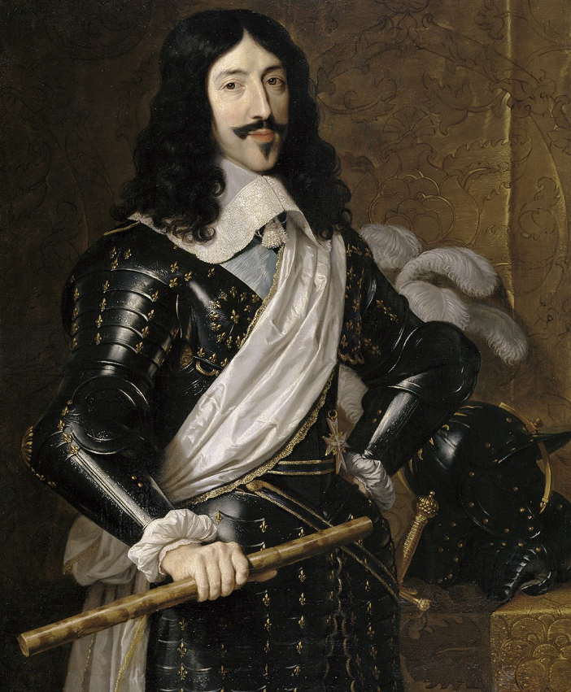
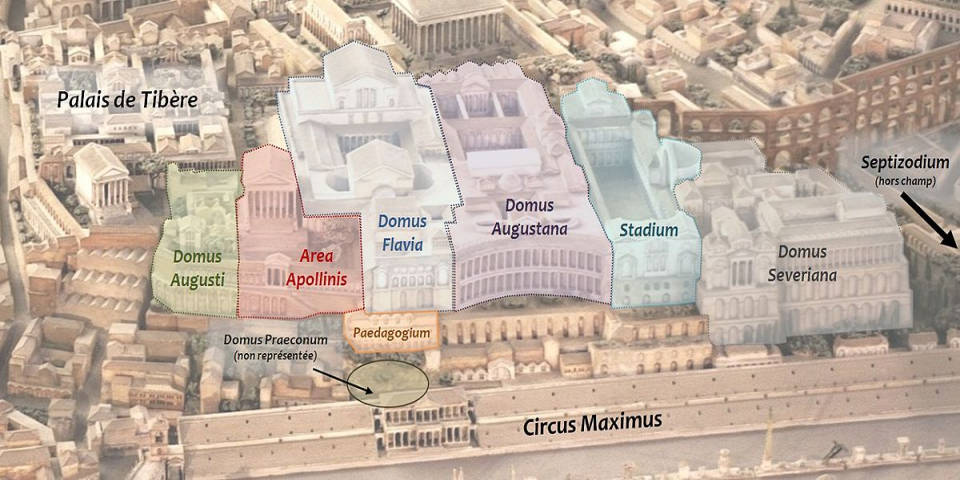
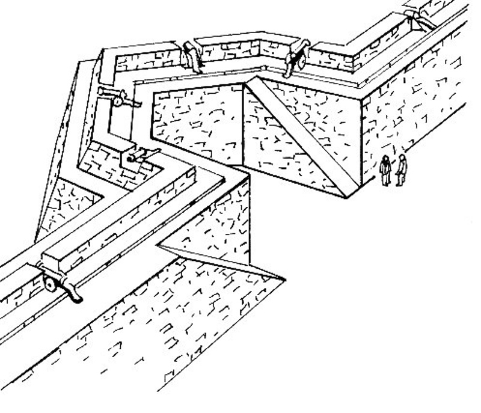
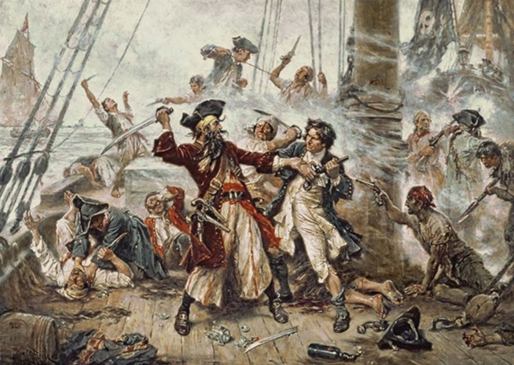
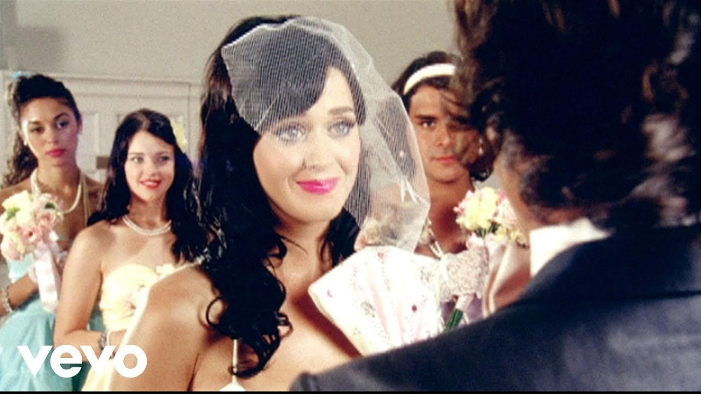
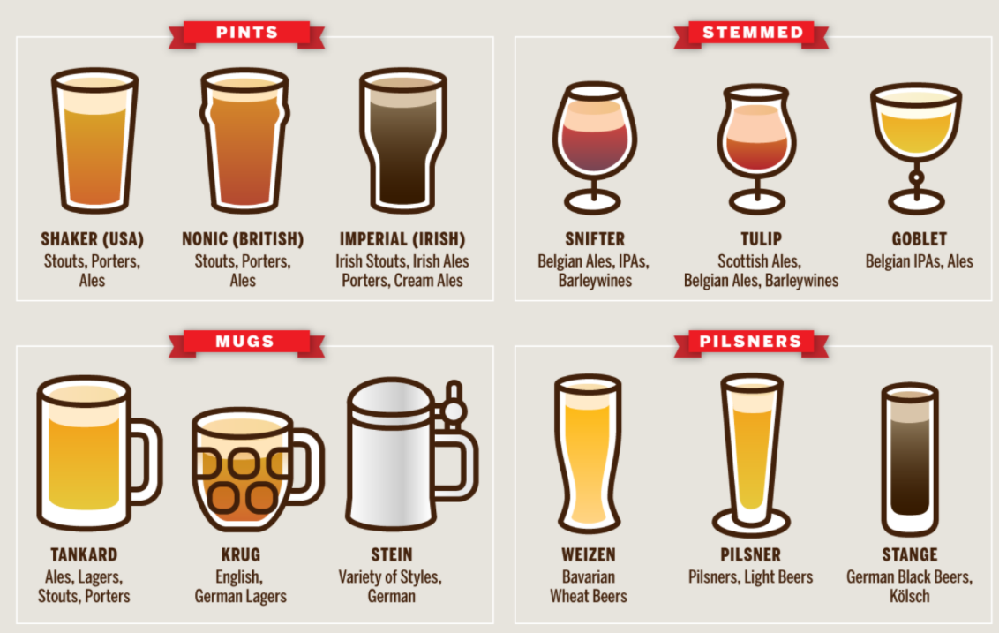
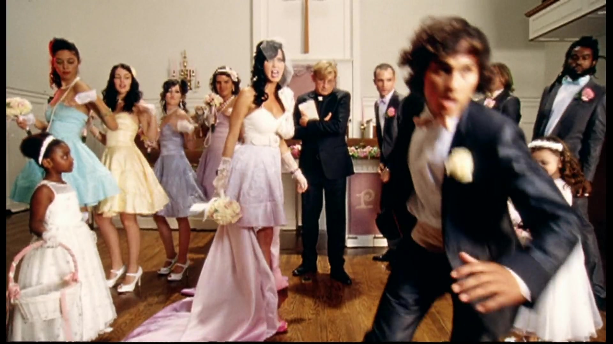
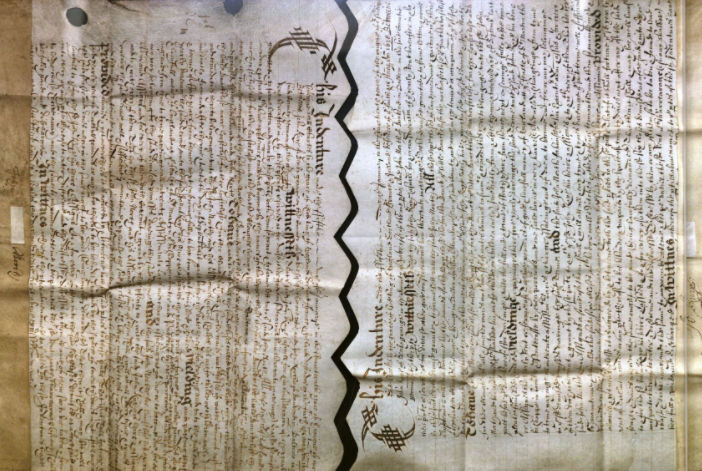
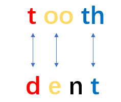
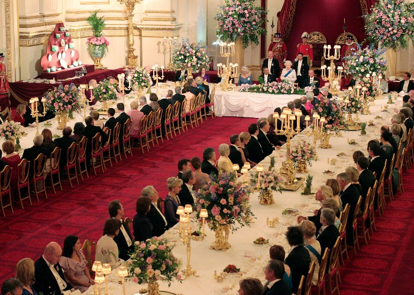

# 咬文嚼字-Part 3 古代西方
@(TOEFL)[托福, TOEFL, 词根词缀,咬文嚼字]

[toc]

## 国家

### dollar（美元）：盛产银币的波西米亚小镇

>  来自德语 taler,货币单位，词源同 dale,山谷，因铸造于 Joachimstal 而得名。后于 1785 年，dollar 被美国国会采用作为基准货币单位。

1519年，在波西米亚（位于今捷克共和国境内）一个名叫Joachimstal的小镇附近，有一座银矿开始制造银币。人们将这里铸造的银币取名为Joachimster。这种银币广泛流通，其冗长的名字后来简化为taler。在荷兰及德国南方，taler一词演变成daler。

进入英语后，其拼写形式变成了现在的dollar，用来泛指任何一种外国货币，特别是西班牙铸造的古银币。

美国独立之前，北美殖民地并没有统一的货币，使用最广泛的是一种被称为“八分币”的西班牙比索。在英语中，这种西班牙比索也被称为dollar。

美国独立后，在1785年召开的大会上，毛里求斯总督和托马斯•杰弗逊建议用dollar作为美国货币单位的名称。因为dollar一词已经广为人知，而与英国的任何货币无关。从此以后，dollar就成了美国货币单位的名称，即所谓的“美元”。

- **dollar**： ['dɒlə] n.美元

### budget（预算）：装财务预算书的皮包

> 来自拉丁语 bulga,皮袋子，钱夹，词源同 ball,膨胀，鼓起，球。预算来自钱夹比喻义。比较bourse,钱夹，股票交易所。

英语单词**budget**源自法语***bougette***（小钱包），是古法语***bouge***（钱包）的指小形式。后缀**`-et`**表示“小”，如**widget**（小部件、小工具）、**closet**（小房间）、**bullet**（子弹，小球）。

单词**budget**原本表示小钱包，后来泛指任何尺寸的钱包，尤其是皮质的钱包。那么，它的意思是如何从“皮包”变成“预算”的呢？原来，在过去，英国财政大臣到议会提请审批财政预算时，通常将预算材料事先装在一个皮包中，在会场上再从皮包中掏出来。所以当时的人们就用“**open the budget**”（打开皮包拿出预算材料）来表示“提出预算”。时间长了，**budget**一词的意思就逐渐从“装预算材料的皮包”转变为“预算”本身了。

- **budget**： ['bʌdʒɪt] n.预算，预算费vt.把……编入预算vi.编制预算adj.廉价的

**英语词源趣谈(庄和诚)**

该词原义为“皮包”或“钱袋”，它源自拉丁语**bulga**（皮包），但却是通过法语指小词***bougette***（钱袋）进入英语的。我们从辞书里尚能查到这一古义。

旧时店主把钱放在钱袋里，做预算时就得先打开钱袋，数一数现金。据说从前英国财政大臣在议会上提出预算时也有个习惯：先打开皮包（**open the budget**），取出有关文件。于是人们就常常将“皮包”同“预算”相联系。久而久之，**budget**的词义逐渐引申为“预算”或“预算案”。至今英语还保留着**open the budget**一语，但它已丧失原义，现仅用于引申义“***向议会提出预算案***”。

关于**budget**词义的这种演变还有另外一种解释。1733年，英国财政大臣沃波尔爵士（Robert Walpole, 1676-1745）提出了一项不得人心的消费税议案，有一本政治小册子将他比作“集市上打开假药包的江湖医生”（a mountebank at a fair opening his budget of crank medicines），从此以后budget就和政府财政预算联系起来了。**budget**亦可作动词用，表示“编预算”、“计划”或“安排”。

英语另有一个词**bulge**（膨胀）和**budget**是同源词，也是源于拉丁语**bulga**的。

- The firm has drawn up a budget for the coming financial year. (CID) 公司已制定了下一财政年度的预算。
- It's important to balance one's budget. 使收支平衡十分重要。
- We'll have to budget more carefully in the future. We've spent far more than we can afford. (LLA) 我们在将来必须更精打细算。我们的开支已远远超出我们所能承受的。
- You will have to learn how to budget your time to get all your work done. (CAE) 要把所有工作都做完的话，你必须安排好自己的时间。

## 外交

### tributary（附属国）：向宗主国纳贡的国家

> tribut∙ary  [词根树]
> tribut- 
> 表示“部落”，引申为“贡品、给予”。来自 tri- 三 + be- 存在。
> -ary 
> 表形容词，“…的”。
> 更多同源词...

在古代，小国或被征服的国家需要向大国或征服国纳贡，以换取和平和保护。这种国家就被称为**tributary**（附属国）。

这个单词源自**tribute**（贡物），字面意思就是“纳贡的”。单词**tribute**来自拉丁词根***tribuere***（支付、给予、分配）。与它同源的单词有**contribute**（贡献）、**attribute**（归属）。

- **tribute**：['trɪbjuːt] n.贡物，礼物，颂词，致敬
- **tributary**：['trɪbjʊt(ə)rɪ] 
  - adj.纳贡的，附属的，辅助的
  - n.进贡国，附属国，支流
- **contribute**：[kən'trɪbjut] v.贡献，捐献，出力，投稿
- **contribution**：[,kɑntrɪ'bjuʃən] n. 贡献；捐献；投稿
- **attribute**：[ə'trɪbjuːt] vt.归属，把……归于n.属性，特质
- **attribution**：[,ætrə'bjʊʃən] n. 归因；属性；归属
- **distribute**：[dɪ'strɪbjut] vt. 分配；散布；分开；把…分类
- **distribution**：['dɪstrə'bjʊʃən] n. 分布；分配

**词源说明(童理民)**  
1 - 来自拉丁语 tribuere,支付，分配，给予，部落间的财富分配或其它，来自 tribus,部落，词源同 tribe,contribution.引申词义河流的支流。

## 大佬

### tycoon(大亨) - tycoon直接借自日语“大君”。

“大君”原是外国人对幕府时代（1192-1867）统治日本的将军（shogun）的尊称。

据认为，很可能是19世纪50年代率舰远征迫使日本改变孤立政策而与西方建立贸易和外交关系的美国海军军官Matthew C. Perry (1794-1858)或是与日本签订贸易协定（1858）的美国第一任驻日本总领事Townsend Harris (1804-1878)回美后把这个词带进美国英语中的。

南北战争期间，林肯总统（Abraham Lincoln, 1809-1865）曾被他的部下，如他的私人秘书John Hay (1838-1905)，亲切地称作tycoon。

到了20世纪初，**tycoon**一词常被转用以指洛克菲勒（John Davison Rockefeller, 1839-1937）这样的“企业界巨头”，最初用business作前置修饰语，写成business tycoon，以后又把business一词省略掉，这一词义一直沿用至今，而且多用于口语，如今也用以指“大亨”、“大款”或“阔佬”。

例　

- There were rumours that a Hong Kong property tycoon was going to withdraw his millions from the bank. (CID) 有谣言说一名香港房地产巨子打算从银行抽走他的数百万巨资。
- The business tycoon donated a million dollars to the university. (NED) 那位商业巨头捐了一百万元给大学。

### mogul（显贵）：征服南亚的莫卧儿大帝

1525年，帖木儿帝国建立155年之后，中亚蒙古贵族帖木儿六世孙巴布尔（Babur）乘印度分裂、德里苏丹国日趋衰亡之际，南下攻入印度，几经征战，建立了印度史上著名的莫卧儿帝国（Mughal Empire）。

“莫卧儿”（Mughal）一词来自波斯语，是“蒙古”（Mongol）的转音。因此“莫卧儿帝国”就是“蒙古帝国”的意思，是帖木儿蒙古帝国的续集，是突厥化的伊斯兰教蒙古人在南亚次大陆上新建的国家。

巴布尔因为开创了莫卧儿帝国，故被尊称为“莫卧儿大帝”（Great Mogul）。**Mogul**一词来自Mughal，同样是Mongol（蒙古）的转音。小写的**mogul**一词在英语中表示像莫卧儿大帝那样的权贵显要。

- mogul：['moɡl] n. 有权势的人；显要人物

**词源说明(童理民)**  
1 - 来自 Mongol 拼写变体，即蒙古人，于 1520 年征服印度建立莫卧儿王朝，引申词义大蒙古人，大亨。

### ringleader(头目) 围成一圈跳舞的领舞者

> ring,马戏场，leader,领班，老板。字面意思即马戏场老板，比喻用法。

ringleader - 昔日，在英国上流社会的社交晚会上，人们开始跳舞前总先围成一个圈子（ring），然后由一人带头起舞（lead the ring），这个领舞者就被称作ringleader。

到了19世纪ring引申为“团伙”或“帮派”，ringleader的词义也随之贬降为“首恶”、“元凶”或“（带领其他人犯法或闹事的）头目”。

例　

- Police arrested the ringleaders, but let the rest go free. (LDE) 警察逮捕了那些头目，但却把其余的人都放了。
- The judge sentenced the ringleader of criminals to life in prison. (NED) 法官判处首恶分子终身监禁。
- Once they caught the ringleader, it was easy to round up the rest of the gang. (CID) 他们一抓住首恶，围捕其他恶棍就容易了。

### bigwig（大人物）：欧洲上流人士戴的大假发

> big【大】 + wig【假发】过去假发象征着一种社会地位。
>
> **`big`** a. 大的, 重要的 ad. 大量地
> **`wig` **n. 假发, 斥责 v. 激动, 发狂 (~ out)

在十八世纪的欧洲，很多社会上流人士喜欢佩戴假发（wig）。据说法国国王 [路易十三（ Louis XIV ）](https://medium.com/@nicolvalentin/big-wigs-how-louis-xiv-shaped-the-history-of-hair-9080034898a7)是始作俑者。

 

在当时，满头浓发被看作是男性力量的表现，而这位国王却是个秃头。为了掩饰这一缺陷，路易十三就戴上了一顶长度及臀的原色卷发。大臣们纷纷效仿，从而使得佩戴假发成为当时的一种时尚。我们在一些欧洲古装剧中还能看到法官和律师们佩戴着白色的假发。

假发的大小与佩戴者的身份地位密切相关。一般来说地位越高者，佩戴的假发越大越长。所以人们就是用**bigwig**（大假发）这个单词来表示大人物。

- **bigwig**： ['bɪgwɪg] n.权贵之人，有重大影响力的人
- **wig**： [wɪg]n.假发

**英语词源趣谈(庄和诚)**:

**bigwig** - 假发除了可作戏装、乔装用品之外，还被用作个人装饰品或职位的标志。

几个世纪以前，假发在欧洲十分流行，至17世纪发展到最高峰，成为阶级及地位的标志，法国国王路易十四中年时喜欢戴假发，欧洲各国王族纷纷效仿，尤其在英国，身份越高者或自认为身份越高者，所戴假发就越大。

按当时习俗，只有贵族、法官和主教可戴假发。美国独立战争和法国大革命之后，各种地位标志被荡涤殆尽，假发便不多见了。如今仅在英国法庭尚可见到法官和律师戴着垂肩假发。

**bigwig**一词反映了那个时代的英国习俗。bigwig由big（大的）和wig（假发）二词复合组成，用以喻指“要人”、“大亨”或“名人”，通常用在口语中。

意指“假发”的wig一词是**periwig** 【perɪwɪg】的缩略，而**periwig**则又是***peruke***的异体。两者同出一源，都源自法语***perruque***。

例

- They were invited to a lunch with local bigwigs. 他们被邀请与当地要人们共进午餐。
- She has called a meeting of party bigwigs to discuss their strategy for the next election. (CID) 她已召集了党内要员开会讨论下次选举的策略。

**摩西英语(摩西)**

bigwig ['bɪgwɪg] n.权贵之人；有重大影响的人。法国波旁王朝的国王路易十三年轻时就秃头了，于是佩戴假发（wig）遮丑，权贵们出于讨好的目的开始模仿。那年头假发的购买和护理需要不少钱，因此只有权贵能买得起用得起。后来贵族头上的假发越发以大为美，甚至大到很夸张的程度，**bigwig**就借指权贵了。

### magnate

> magnate 【ˈmæɡneɪt】：n. 大官, 巨头

> 推荐：magn-大 + -ate
> magn- = great, 表示“大，伟大”，源自拉丁语 magnus "great"， 其最高级形式为 maximus。
> -ate 表名词，“人或地位”。

词源说明(童理民)  
1 - 来自拉丁语 magnus,伟大的，巨大的，富贵的，词源同 major,master.引申词义伟人，贵族等，但现多含贬义。

## 地名

### palatial /pəˈleɪʃl/

(a.):宫殿般的;富丽堂皇的

相传，坐落在罗马七丘的古罗马城是战神之子***Romulus***于公元前753年前后创建的。

我们如今用以表示“宫殿”和“豪华住宅”、“华丽建筑物”等义的**palace**一词可一直追溯到古罗马七丘之一的主丘***the Palatine Hill***（[帕拉蒂尼山](https://rome.us/ancient-rome/palatine-hill.html)）。

罗马帝国的第一代皇帝奥古斯都（Augustus）以及其后的提比略（Tiberius）和尼禄（Nero）等皇帝都先后把皇宫建在这座山丘上。有人说世界上第一座富丽堂皇的宫殿是尼禄所建。他在位时，建于该山丘上的罗马城已发展为华丽的住宅区，权贵名士都聚居于此，富人的住宅布满山坡。尼禄想把整座山丘据为己有，遂下令私人住宅一律拆除。然后建筑师们为他精心设计了一座皇宫，罗马人称之为palātium，字面义是on the site of the Palatine（位于帕拉蒂尼山上）。以后法国国王据此把他们的王宫叫做palais，英语借用了这个词，初作paleys，后来才演变成palace的。从palace的形容词形式palatial（宫殿的）我们能够更清楚地看到palace同palātium之间的联系。其实，至今英语里还有palatine一词，也作形容词用，同palatial词义相近。

例　

- The queen of England lives in Buckingham Palace. 英国女王住在白金汉宫。
- Demonstrators gathered in front of the presidential palace. (CID) 示威者聚集在总统官邸门前。
- A palace coup led by the general has toppled the dictator. (CID) 由将军领导的宫廷政变推翻了独裁者。
- The palaces of the rich dot the coastline. (WBD) 海岸线上富人的豪华住宅星罗棋布。

1. https://mp.weixin.qq.com/s/UQMLNulL__EF6u6lqMuNDw)

### boulevard（林荫大道）：在废弃的城墙上修建的宽阔马路

> 由bulwark改编的变体词。bulwark, 防御，堡垒。原指军事城墙，后指城墙改造的散步道路，然后借指普通的林荫大道，大道。

在中世纪，重要的城市或要塞都会修筑城墙。城墙顶部有宽阔的通道以便防御人员的通行。这种城墙在荷兰语中被称为***bolwerc***。从该词产生了英语单词**bulwark**（壁垒）和法语单词**boulevard**。

 

火药发明后，城墙的防护作用大大降低，常常被废弃不用。城墙顶部的宽阔通道成了人们散步遛马的好去处。有些城市甚至拆掉城墙，在原来的地方修建马路。由于在城墙遗址上修建的马路通常都比较宽阔，因此**boulevard**一词产生了“大马路、大道”的含义。该词进入英语后，专门用来表示“大道”，尤其是两旁有林荫的漂亮大道。

美国洛杉矶市的日落大道（**Sunset Boulevard**）是全球知名的一条马路，是好莱坞名流文化和星光璀璨的标志符号。以**Sunset Boulevard**为名的还有五十年代的美国经典电影、舞台剧和相关影视剧等。

 

- **boulevard**： ['buːləvɑːd] n.林荫大道，大马路

**摩西英语(摩西)**
**boulevard** ['buːləvɑːd] n.[建] 林荫大道。14世纪，法语从近邻的荷兰语引入了这个单词（原型为单词**bulwark** ['bʊlwək] n.壁垒；保障；防波堤，vt. 保护）。

这里**`boule-`**同**bole**[boʊl]树干，**`vard`**(-wark)同**work**，**bulwark**本指城墙外起巩固性质的第二道墙。巴黎扩大后，城墙向外扩，原有的两道城墙间成了道路。

### Bourgeoisie 【ˌbʊrʒwɑːˈziː】 | bourgeois 【ˈbʊəʒwɑː】

>  the middle classes in society.

**`burg-`** 表示“ 城堡”。源自拉丁语 burgus "fortified place;" 古法语 burg "borough."
更多同源词...

**bourgeoisie**（资产阶级）：社会地位较高的城镇居民.

英语单词**bourgeoisie**音译为“布尔乔亚”，常被翻译为“资产阶级”或“中产阶级”。它来自法语，字面意思就是**town dwellers**（城镇居民），其中的**`bourg`**相当于英语中的**town**。

在欧洲的封建时期，在农村中逐渐出现一些小镇，里面聚集了一些手工业者和商人等非农业人口，他们为周边的农业人口提供农产品以外的其他各种商品，这些人就被称为**bourgeoisie**，意思就是住在小镇的这种非农业人口。后来，随着工商业的发展，这些人的财富不断增多，并且还可以雇佣工人为自己工作。他们的地位高于农民和工人，但低于封建贵族。

欧洲进入资本主义社会后，西方社会学家尤其是马克思主义学派在进行阶级划分时，使用bourgeoisie来表示社会中的富有阶级之一，指有产者、中产阶级，通常翻译为“资产阶级”。值得注意的是，**bourgeoisie**是集合名词，表示整个阶级。当表示具体一个人时，男人用**bourgeois**表示，女人用**bourgeoise**表示。

- bourgeoisie：[,bʊəʒwɑː'ziː] n.资产阶级、中产阶级
- bourgeois：['bʊəʒwɑː] adj.资产阶级的、中产阶级的、贪图享受的n.资产阶级男人、中产阶级男人
- bourgeoise： ['buəʒwɑ:z, buə'ʒwɑ:z] n.资产阶级女人、中产阶级女人

### burgess（市民）：自治市中的市民

英语单词**burgess**在字典中除了“市民”的含义外，还拥有“议员”、“镇行政官”的含义。难道任何一名市民都能当议员或行政官吗？没错，只要你是burgess，你就是一名议员或行政官。

因为burgess指的不是一般的市民，而是自治市（borough）的市民。自治市是拥有自治权利的城市，城市的所有主权属于所有市民，就像古希腊城邦一样，城市事务由所有市民（burgess）共同决定。所以burgess也就相当于“议员”或“镇行政官”了。不过现在这个单词很少用作“议员”，用的时候也仅仅表示代表某个自治市、特别市或大学的议员。

和burgess同源的单词是burgher（市民、公民），都来自词根-burg（要塞、设防城市）。这里的-burg就等于town，如匹兹堡（Pittsburgh）、汉堡（Hamburg）、爱丁堡（Edinburgh）。

- **burgess**：['bɜːdʒɪs] n.（自治）市民、自由民、议员、镇行政官
- **burgher**：['bɜːgə] n.市民、公民

> borrow ['bɒrəʊ] v.借。借是与还相对的。凭什么借给你？熟人靠信用，不熟？
>
> 对不起，抵押等值物品吧。另外，因为要归还，所以借来的东西要小心看管。这个单词与**burg**城；镇；村（保护居住者的安全）、**burgess**市民以及**barrow**古坟（保护死者遗体）和**bury**埋葬（目的也是保护死者遗体）等都是日耳曼词源。

### borough（自治市）：带碉堡的城市

英语单词**borough**（自治市）来自原始日耳曼语**`burgs`**（城堡、要塞），本意是“带碉堡的城市”。

西方好多城市都以**`burg`**或**`burgh`**结尾，如:

- 汉堡（Hamburg）、
- 爱丁堡（Edinburgh）、
- 匹兹堡（Pittsburgh）

这里的**burg**或**burgh**都来自原始日耳曼语burgs（城堡、要塞），指的是带碉堡的城市，也就是说，这些城市以前其实是要塞或城堡。

在欧洲封建时期，城镇的主权原本属于封建贵族即所谓“领主”（**Lord**）的，是其封地的一部分。后来，随着工商业的发展，城镇越来越繁荣，市民的经济地位提高了，对封建贵族的压榨越来越不满。所以市民们想方设法争取城市自治。

刚开始时，市民们用钱从领主那里一项一项地赎回城市的各种权利。那个时候市民们通过经商积累了大量货币，而领主的收入主要是封地上的各种农产品，所以缺乏货币。在11、12世纪又赶上了十字军东征运动，大批领主要参加十字军，亟需便于携带的金银货币充当盘缠，所以就把城镇的很多权利都卖给市民了。

但金钱不能买到所有权利，所以领主和市民最后免不了要开战，城市的自治权就是通过赎买和战争的方式获得的。因此自治市中常常修筑了各种防御工事，用来保卫城市的主权。因为自治市往往都是这种带碉堡的城市，所以人们就用原本表示“带碉堡的城市”的borough一词来表示“自治市”了。

- **borough**：['bʌrə] n.自治市，区
- **burg**：[bɜːg] n.镇、城、村
- **burgh**：['bʌrə] n.（苏格兰）自治市，城镇

### Hamburg | hamburger

> 来自 Hamburg,德国城市汉堡。通常认为因 19 世纪大量德国汉堡移民将这种食物引进美国而得名，并由该词衍生后缀-burger,包子。

 

**hamburger** - 这是当今人们熟知的一个德语外来词，其由来可以追溯到许多世纪以前。鞑靼人喜欢生吃切碎的牛肉丝，以后这种吃法经由俄国波罗的海地区传入德国。**[Hamburg](https://en.wikipedia.org/wiki/Hamburg)**（汉堡）人在做法上作了一些改进，把碎牛肉制成饼状，再加以烹调，成了一种类似牛排的菜肴，名之曰**Hamburger**。

> **Hamburg** is the [second-largest city](https://en.wikipedia.org/wiki/List_of_cities_in_Germany_by_population) in [Germany](https://en.wikipedia.org/wiki/Germany) after [Berlin](https://en.wikipedia.org/wiki/Berlin), as well as the overall [7th largest city](https://en.wikipedia.org/wiki/List_of_cities_in_the_European_Union_by_population_within_city_limits) and largest non-[capital city](https://en.wikipedia.org/wiki/Capital_city) in the [European Union](https://en.wikipedia.org/wiki/European_Union) with a population of over 1.84 million(汉堡是德国仅次于柏林的第二大城市，也是欧盟第七大城市和最大的非首都城市，人口超过184万)
>
>  

19世纪中期，在第一次德国移民浪潮中，以**Hamburger**命名的这一名菜随着德国移民进入了美国，很受美国人喜爱。1836年，一道以**Hamburg steak**（汉堡牛排）命名的菜出现在美国人的菜单上。这就是**hamburger**的前身。当时**Hamburg steak**的做法与今天的**hamburger**已经很接近了，就是用碎牛肉和洋葱、胡椒粉拌在一起。以后**Hamburg steak**又作**hamburger steak**和**hamburg**，最后人们还是直接采用了原德语名称**hamburger**，只是首字母不大写而已。

19世纪英国营养学家[J. H. Salisbury](https://en.wikipedia.org/wiki/James_H._Salisbury)对此菜肴赞扬备至，他劝人们一天至少吃上三次，**hamburger**因此得了一个别称**Salisbury**【ˈsælzbəri】 **steak**。到了1912年许多人都喜欢在面包片里夹上**hamburger**，于是**hamburger**一词除了表示“汉堡牛排”又多了一层意义：“夹牛肉饼的面包片”，现通译为“汉堡包”。

此后**hamburger**也被用以指“（用来做汉堡包的）绞碎的牛肉”。第二次世界大战期间美国肉类的匮乏使**hamburger**身价倍增，并进而取代了**hot dog**（热狗），从此以后**hamburger**成了最受美国人欢迎的快速食品。出售该快速食品的食品店、售货店以及售货摊在美国几乎随处可见，而且出现了花样繁多的夹心面包，诸如：

- **cheeseburger**
- **fishburger**，
- **nutburger**，
- **beefburger**，
- **turkeyburger**，
- **clam-burger**，
- **muttonburger**，
- **shrimpburger**

等。在这些以**`-burger`**结尾的复合词中，词根通常表示所夹之物的名称，而**`-burger`**则作为一个后缀，表示各种类似于hamburger的夹心面包。

例　

- I'll take a hamburger and French fries, please. (CAE) 我要一份汉堡包和法式炸土豆条。
- Hamburgers are named after the German city of Hamburg and don't actually contain any ham — they are made of beef. (CID) 汉堡包是以德国的汉堡市命名的，实际上其中并不含火腿，而是牛肉做的。
- I bought two pounds of hamburger for a meat loaf. (CWR) 我买了两磅牛肉糜来做肉饼。

### Britain（不列颠）：迁徙至不列颠地区的布列吞人

我们知道，英国所在的地方被称为“大不列颠”（Great Britain），主要包括英格兰、苏格兰、威尔士等地区。那么，Britain这个地名是如何产生的呢？

在罗马入侵不列颠之前，统治不列颠地区的是凯尔特人。至于凯尔特人迁徙至不列颠的具体时间，尚存疑问。有些历史学家认为，首批凯尔特人约于公元前8—前5世纪之间由莱茵河下游和塞纳河流域分批迁入不列颠定居。而另一种观点则将之前推至公元前二十世纪早中期，认为甚至钟形杯文化时期就有操原始凯尔特语的移民到来了。依照此说，凯尔特语言、文化与民族播迁于不列颠诸岛，迄今已逾三千多年。

分批移入不列颠地区的凯尔特人中，其中的一支自称为Britto，即Briton（布列吞人）。也有人认为，布列吞人是移入不列颠地区的凯尔特人和不列颠的早期居民伊比利亚人混合后形成的民族。罗马人则称他们为Brittani，将他们所在的地方称为Brittania（布列塔尼亚），即“布列吞人的土地），英语单词Britain就来源于此。

罗马帝国结束对不列颠的统治后，盎格鲁-撒克逊人入侵不列颠。一些布列吞人逃离不列颠，越过英吉利海峡，来到了法国西部靠近英吉利海峡的一块土地。这个地方也因此被称为Brittany（布列塔尼）。

- **Britain**：['brɪt(ə)n] n.不列颠，英国
- **British**：adj.不列颠的，英国的，英国人的n.英国人
- **Briton**：['britən] adj.布列吞人，不列颠人，英国人
- **Brittany**：['britəni] n. 布列塔尼（法国西北部一地区

## 面具

### Persona / person

person（个人）：古希腊罗马戏剧中的面具。

中国的传统戏剧如京剧中有所谓的脸谱，不同的人物性格用不同脸谱予以直观表示。古代希腊、罗马的戏剧中也有类似的表现手法，不过不是脸谱，而是面具，不同角色戴不同面具。

佩戴面具可以解决一人分饰多角的问题，还能克服剧场条件限制，使远处的观众辨别出角色的形象和表情。拉丁语中这种面具叫做persona。正因为如此，persona渐渐成了戏剧中的“人物角色”的意思。

由于每个人在社会生活中都要扮演一定的人格角色，所以persona就从戏剧中的“人物角色”延伸为表示人在社会生活中的人格角色。英语单词person便来自拉丁语persona。

- person：['pɜːs(ə)n]n.人，个人
- persona：[pə'səʊnə; pɜː-]n.人物角色，伪装的外表
- personal： ['pɜːs(ə)n(ə)l]adj.个人的，私人的，亲自的
- personally：['pɜːs(ə)n(ə)lɪ] adv. 亲自地；当面；个别地；就自己而言
- personality： [pɜːsə'nælɪtɪ] n.人格，个性
- personage：['pɝsənɪdʒ] n. 要人；角色；名士
- personnel： [,pɝsə'nɛl] n. 人事部门；全体人员adj. 人员的；有关人事的

#### Profile

`- pro-`,向前，`-fil`,线，线条，词源同 **file**,**filament**.即画出线条轮廓，引申诸相当词义。

**profile ['prəʊfaɪl]** 

- n.侧面；轮廓；外形；剖面；简况，
- vt.描…的轮廓；扼要描述，
- vi.给出轮廓。

这里的词根`fil-`表示线绳（或拉线），而`pro-`表向前，**profile**名词意为“**a drawing of the outline of anything**”。如果还不明白，file作为文件和档案的意思应该知道吧？想想我们古代的“线装书”就懂了。 ​​​​

### character（个性）：环境在人的身心留下的印记

> 来自 PIE*gher,刻，写，刮，进一步来自 PIE*sker,切，砍，词源同 carve,graph,scribe.即刻进骨子里的特征。

英语单词**character**来自希腊语***kharakter***，本意是“刻下的印记”，来自***kharax***（尖头的棍子）。由此产生了**character**的基本含义“符号、印记”。

古代希腊人认为，环境和人的成长经历会在人的身心留下印记，从而使其具有与众不同的性格特征，因此**character**又衍生出“性格、个性、特征”的含义。

在文学、戏剧等艺术作品中，作者通过对人物性格的刻画，从而塑造出个性鲜明的人物，这种“人物角色”也被称为**character**。

- **character**：['kærəktə] n.性格，品质，特性，角色，字符，印记vt.印、刻，使具有特征
- **characterize**：['kærəktə'raɪz] vt. 描绘…的特性；具有…的特征vi. 塑造人物
- **characteristic**：[,kærəktə'rɪstɪk] adj. 典型的；特有的；表示特性的n. 特征；特性；特色

## 万物有灵

### anim-（生命）：代表生命之源的灵魂

anim-（生命）：代表生命之源的灵魂

古代人认为生命的本质是因为灵魂的存在。在拉丁文中，灵魂分为阴性和阳性两个单词，既阴性的anima（阿尼玛）和阳性的animus（阿尼姆斯）。表示生命的词根anim就来自这两个拉丁文。由于生命和灵魂密不可分，所有词根anim既有“生命”、“能动”的含义，也有“精神”、“心”的含义。

- anim-：生命，能动，精神，心
- anima： ['ænɪmə] n. 灵魂，生命；神圣之灵
- animus：['ænɪməs] n. 敌意；意图；基本态度；女性的男性意向
- animosity：['ænə'mɑsəti] n. 憎恶，仇恨，敌意
- animal：['ænɪm(ə)l] n.动物，有生命能动的
- animate：['ænɪmet] vt. 使有生气；使活泼；鼓舞；推动adj. 有生命的
- animation：[,ænɪ'meʃən] n.动画，原意是使其具有生命，使其动起来
- unanimous：[juː'nænɪməs] adj.全体一致的
- equanimity：[,ɛkwə'nɪməti] n.（心情）平静坦然

## 称呼与职业

### Actuary（精算师）

在保险行业有一种非常专业的人员叫做“精算师”，他们的主要职责就是收集并分析各种统计信息，在此基础上计算出各种事件发生的概率，为各种保险业务的定价提供数学支持。

在英语中，精算师被称为**actuary**。这个单词来自拉丁语，由：

- 词根**`act-`**（活动、行动）
- 后缀**`-ary`**组成，
- 中间的那个字母u可以简单地看作是一个连接字母。

词根**`act-`**和单词**act**（活动、行动）同源，在这里表示“***公共事务、社会中发生的各种事件***”。

后面的**`-ary`**是个常见的形容词及名词后缀，在这里表示“***从事与……相关工作的人***”。

整个单词的字面意思就是“从事与公共事务相关工作的人”。

在古罗马时期，**actuary**是元老院中的一个职务，相当于书记官，负责信息的采集、整理和发布。他需要收集整理各地上报的各种社会重大事件、各地方法官的裁决，参加元老院会议，负责记录会议中形成的决议，最后汇总各方面的信息编写成公报并对外发表。

到了中世纪，**actuary**这个单词的含义变得更加广泛，可以表示抄写员、速记员、法院书记、公证员、记账员、会计师等等。这些职务都涉及到信息的收集整理。

到了近代，**actuary**开始被用来特指保险公司中进行保险精算业务的数学家，也就是所谓的“精算师”。

**actuary**的形容词形式是**actuarial**，后面加了一个形容词后缀**`-al`**，意思是“保险精算的”。与它同源的单词还有**actual**（实际的），字面意思就是“与实践活动相关的”。

- **actuary**：['æktʃuəri] n.保险精算师
- **actuarial**：[ˌæktʃuˈeəriəl] adj.保险精算的
- **actual**：[ˈæktʃuəl] adj.实际的，真实的，现实的

**参考：**

[英语词源趣谈](https://mp.weixin.qq.com/mp/appmsgalbum?__biz=MzA4NTQ4NzIzNg==&action=getalbum&album_id=1297162942844207107&scene=173&from_msgid=2651803449&from_itemidx=1&count=3&nolastread=1#wechat_redirect)

### Villain /ˈvɪlən/ 反派

`villain -` 今指“坏蛋”或“恶棍”的**villain**一词原先并不含贬义。它源自中世纪拉丁语**vīllānus 'farmhand'**，通过法语***vilain***于14世纪进入英语的。

从终极词源来看，**villain**和另一个词**villa**（别墅）都源于拉丁语***vīlla 'country house'***。在中世纪封建时代，这两个词是密切相关的，villa原指“农庄住宅”或“庄园”，而villain则指为villa的主人工作的“农奴”或“农民”。

后来，贵族由于阶级优越感以及他们对农民的阶级偏见，往往把意指农民、乡下人的词语同“愚昧”、“粗野”、“邪恶”等概念联系起来。这样，**villain**的词义就逐渐发生贬降。19世纪出现了一个戏谑性短语**villain of the piece**，指“剧中反面人物”或“首恶”，被德莱塞（***Theodore Dreiser***）、墨多克（***Iris Murdoch***）等作家乃至普通人广泛使用。

但**villa**和出自同一拉丁词源的**village**（乡村）一词至今却仍保留了原拉丁词中的含义。

例:

- The villain cheated the old lady out of her life's savings. (FWF) 这个恶棍骗走了老太太一生的积蓄。
- He made his reputation as an actor playing villains. (CID) 他以演反派角色而出名。
- A faulty fuse was the villain of the piece. 毛病就出在保险丝上。
- The whole village turned out to watch the parade. 全村的人都出来看游行

**villain**（恶棍）：在古罗马农场干活的奴隶。

英语单词**villain**源自拉丁语***villanus***，本意为在villa（古罗马农场）干活的人，通常是奴隶或隶农。**villa**是古罗马贵族在乡村的房地产，包括居所和农场。英语单词**village**（农村）、**villager**（村民）等都源自拉丁语***villa***。

由于在***villa***里面干活的奴隶或隶农地位很低，常常遭到贵族老爷的鄙视和呵斥，因此表示他的拉丁语villanus及其衍生的英语单词villain就不可避免地含有了强烈的贬义，并从表示社会地位的卑贱延伸至表示人品的卑贱，逐渐发展出“坏人、恶棍、反派”等负面含义。可以说，这个单词体现了一种强烈的阶级偏见。

- villain：['vɪlən] n.坏人，恶棍，反派，罪犯
- villainous：['vɪlənəs] adj.邪恶的，缺德的，恶毒的，堕落的
- villa：['vɪlə] 乡村别墅，农场
- village：['vɪlɪdʒ] n.农村，乡村，郊外
- villager：['vɪlɪdʒə] n.村民，乡村居民

*Avengers: Infinity War* depicts the beginning of the Avengers' attempt to protect the Infinity Stones from the **[villainous](https://www.cbr.com/were-in-endgame-now-infinity-war-meme/)** Thanos who wants to use them to erase half of humanity from existence. Thanks to his mystical training, [Doctor Strange](https://www.cbr.com/doctor-strange-2-prepares-filming-in-london/) is able to see each of the 14 million possible outcomes from their fight against Thanos. **All but one end in failure.** Much to Tony Stark's dismay, Doctor Strange gives up the Time Stone to Thanos. When Stark questions his motives, Doctor Strange simply states, "We're in the endgame now."

 

### barber（理发师）：古代负责修剪胡须的匠人

> 来自拉丁语 barba,胡子，词源同 barber.

古希腊人是不修剪胡须的，所以我们看到古希腊名人如苏格拉底的画像都是一脸的大胡子。因为修剪胡须需要锋利的剃刀，而古代无法制造能够达到这种要求的刀具。古埃及人最早用石块后来用青铜刀具刮胡子，但这种做法并没有流传至希腊。

到了亚历山大时期，他要求所有士兵都要剃须，以免在战斗中被敌人揪住胡须。从此后，剃须的做法才在希腊开始流行。公元前299年，**Ticinius Mena**首次将一位剃须匠人带到罗马。随后，修剪胡子和剃须的做法在罗马人中迅速普及，剃须被看作是文明、进步的象征。

那时候剃须需要专业的匠人，因为剃须所需的锋利剃刀只有专业匠人才有。他们的工作范围除了剃须和理发外，甚至还包括给病人实施放血这样的外科手术，因为他的剃刀可当手术刀使用。现在理发店门口红白相间标识以前其实是“本店可做外科手术”的暗示。

 

英语单词**barber**就反映了古代理发师的剃须职责。**barber**来源于拉丁语中表示“胡须”的单词**barba**，英语单词**barb**（倒刺、钩子）、**beard**（胡须）都与此同源。

现在随着家用剃须刀的普及，人们早已经习惯了在家中剃须，所以barber的职责也已不再包含剃须了，但它的拼写依然在提示它曾经的含义。

- **barber**：[ˈbɑːrbər] n.理发师v.理发，修剪，当理发师

- **barb**：[bɑːb] n.（鱼钩、箭头上的）倒钩vt.装倒钩

- **beard**：[bɪəd] n.（嘴唇上下及下巴的）胡须。

- **beard the lion in his den **虎口拔牙。

  《圣经.撒母耳记》中，年轻的牧羊人大卫夸耀他曾经从一只狮子口中救下来过一只羊羔。当狮子过来攻击他的时候，他揪住了狮子的胡须并杀死了它。后来大卫又战胜了巨人歌利亚并最终成为了以色列的国王。He's in his office, so let's beard the lion in his den now. 

### Barbarian 不会讲希腊语的野蛮人

 

在古代欧洲，希腊的文明程度最高，因此当时的希腊人对本民族的文化尤其是希腊语非常骄傲，嘲笑外地人所讲的语言就像是“吧啦吧啦”（***barbar***）的鸟语，所以就用***barbaros***这个单词来形容文化程度低下的外地人。

经过拉丁语流传至英语后，产生了**barbarous**（野蛮的）和**barbarian**（蛮族）这些词汇。

“蛮族”指的是希腊和罗马周围的文明程度较低的其他民族，主要包括凯尔特人、日耳曼人、斯拉夫人等。后来，这些蛮族部落在欧洲大范围迁徙并入侵罗马帝国，建立了众多的蛮族小政权，是众多欧洲当代国家的源头。位于北非的柏柏尔人（**berber**）也被归入蛮族，该民族的英文名称一样来自希腊语***barbaros***。

- **barbarian**：[bɑː'beərɪən] n.野蛮人，蛮族
- **barbarous**：['bɑːb(ə)rəs] adj.野蛮的，未开化的，残暴的
- **barbaric**：[bɑr'bærɪk] adj. 野蛮的，粗野的；原始的
- **barbarism**：['bɑrbərɪzəm] n. 野蛮；原始；未开化；暴虐
- **barbarity**：[bɑr'bærəti] n. 残暴；粗野
- **Berber**： ['bə:bə] n.柏柏尔人，柏柏尔语

### buccaneer /ˌbʌkəˈnɪr/ 专门掠夺西班牙商船的“皇家海盗” 

在大航海时代，西班牙和葡萄牙率先开展航海探险事业，积极在新发现的美洲大陆进行殖民，从美洲掠夺了大量财富，成为那个时代的霸主。

1630年左右，一群在加勒比海域进行探险投机的法国人竞争不过西班牙人，被西班牙人赶到一座海岛上。从此以后，这群法国人以此为据点，做起了海盗生意，专门袭击西班牙商船，声势越来越大，越来越多的法国人以及英国人、荷兰人也加入进来，将这项专门针对西班牙商船的海盗事业越做越大，并且还赢得了本国政府的支持，获得政府颁发的“私掠许可证”，成为奉旨打劫的“皇家海盗”，就算被西班牙军队俘虏后还可以享受战俘待遇，而不是像普通海盗那样被绞死。在后来英国和西班牙的大海战中，***英国海军就依靠这些“皇家海盗”击败了西班牙的无敌舰队，终结了西班牙的霸主地位***。

 

在法语中，这群海盗被称为“***boucanier***”，源自加勒比海土著语***buccan***（烤肉架），字面意思就是“使用烤肉架烤肉的人”，因为这群海盗也喜欢使用这种架子烤肉吃。英国人将其英语化为**buccaneer**。

1684年，著名法国作家Alexandre Exquemelin描写17世纪加勒比海盗的名著《美洲海盗》的英译版本出版后，**buccaneer**一词更是广为流传，成为了“海盗”（**pirate**）的同义词。

在荷兰语中，这群海盗被称为***vrijbuiten***，由**`vrij`**（free）+ **`buiten`**（booty，掠夺品），演变为英语中的**freebooter**和**filibuster**，都表示“海盗”。

同样源于加勒比海土著语***buccan***（烤肉架）还有单词**barbecue**（烧烤），它是经由西班牙、法语进入英国的。

- **buccaneer**：[,bʌkə'nɪə] 
  - n.海盗
  - vi.做海盗
- **freebooter**：['friːbuːtə] n.海盗
- **filibuster**：['fɪlɪbʌstə] 
  - n.海盗，暴兵，阻挠议事的议员，阻挠议事的行为 
  - vi. 掠夺，阻挠议事

### chiseler（骗子）：从银币上凿碎银的罪犯

15世纪后，西班牙通过殖民逐渐占领了大片的美洲土地，并于16世纪30年代开始在盛产白银的美洲殖民地设厂铸造银币。西班牙银币在欧洲得到大范围流通。

一些精明的骗子打起了西班牙银币的主意。他们从每一块银币上凿下一点儿银子，然后积少成多，用攒下来的碎银子铸造出额外的银币。由于他们的这种作案手法，人们将其称为chiseler（凿工），单词chisel就是“凿”的意思。

- chiseler：['tʃizələ] n.骗子，凿工
- chisel：['tʃɪzl] (chis-=cis- , 砍，劈，词源同decide , excise。)
  - v. 雕，刻；凿；欺骗
  - n. 凿子

### cop 警察？ 抓人？

> 来自词根cap- , 抓，握，词源同capture , captive。

cop - 该词有两个主要词义：作为动词用时，cop是个俚语词，表示to grab，get（攫取，抓住）；作为名词用时，cop则是个口头用语，意指“警察”。我们不妨把它们当作两个cop来看待。前一个cop源自古法语caper 'seize'（抓住）。关于后一个cop的词源则有三种不同的说法。

- 其一，警察乃抓捕罪犯者，故而被称为copper，即one who cops or catches offenders。该词始见于1846年，到了1859年被缩略为cop。一般认为此说较为可信。
- 其二，昔时英国警察制服上的纽扣是铜（copper）制的，而cop则是copper的逆构。这一说法似乎和事实不符。英国的警察部队于1829年组建，而cop一词则早在1704年就已用于one who captures or snatches一义。
- 其三，cop是constable on patrol（巡逻警察）或chief of police（警长）的首字母缩拼词，即由各词的第一字母缩合而成。

cop一词不论用于何种情况，多少总带贬抑含义，因此一般警察都不喜欢cop这一字眼。曾任美国联邦调查局局长近半个世纪的胡佛（Edgar Hoover, 1895-1972）被人取了个绰号叫nation's top cop（国家头号警察），这一绰号每每见诸各种报刊，他对此十分恼火。（参见police）

例　Quick, run — there's a cop coming! (CID) 快跑——警察来了！

I don't much enjoy cops and robbers films. 我不怎么爱看警匪片。

There are more criminals out there than cops to chase them. (LAA) 那里的罪犯多得警察抓不过来。

###  trivia（琐事）：妇女们在三岔路口的闲聊

> tri∙via  [词根树]
> tri- 
> 表示“三”。源自希腊语 tri- "three."
> via- 
> = way, 表示“道路”。源自拉丁语 via "way, road."

中国有句古话，叫做“三个女人一台戏”，意思是三个女人凑一块就会叽叽喳喳地闲聊开，热闹得像唱戏一样。古代罗马人想必对此也深有体会。他们认为，三条道路汇集之地，必然会有妇女聚集在一起叽叽喳喳扯些家长里短的琐碎之事。

英语单词**trivia**就反映了古人的这种观念。该词来自拉丁语**trivium**，由**`tri`**（three，三）+**`via`**（way，道路）构成，字面意思就是三条道路汇聚之地。

因此单词trivia的本意就是妇女们在路口闲聊所说的事，自然是无关紧要的琐事。

- **trivia**： ['trɪvɪə] n. 琐事
- **trivial**： ['trɪvɪəl] adj.琐碎的，无关紧要的

trivial-关于该词的来源存在两种说法，但只是略有差别。

1. 其一，源于拉丁语trivium，而trivium系由tri- 'three'加via 'way, road'构成，故字面义为“三条路的会合点”或“十字路口”。古罗马妇女从市场回家的路上，喜欢停在十字路口同人闲聊，内容自然是些无关紧要或琐碎的事情。
2. 其二，源于意为“三艺”的拉丁语trivium。什么是“三艺”？从古罗马到中世纪，大学的文科有七门学科，称文科“七艺”。“七艺”可分为“四艺”和“三艺”两类。“四艺”，即quadrivium，指算术、几何、音乐和天文；“三艺”，即trivium，指语法、修辞和逻辑。在两类学科中，“三艺”被认为是不重要的、低级的、普通的学科。

以上不论是哪种说法，都肯定英语trivial一词源于拉丁语trivium。其实“三艺”一义也是从“十字路口”引申的。更确切地说，trivial是直接从trivium的形容词形式triviālis演变过来的，15世纪进入英语，故最初含有of the crossroads（十字路口的）和belonging to the trivium（三艺的）之义。其今义“琐屑的”、“不重要的”、“平凡的”等都是16世纪以后从这一原义引申来的。

与trivial相关的词，除了trivium（三艺），quadrivium（四艺）被直接借入英语外，我们发现还有trivia一词。严格地说来，trivia是原拉丁文trivium的复数形式，但它进入英语却是从trivial逆生而成的，一般用以指“琐事”。

- His father often loses his temper over trivial matters. 他父亲常常因一些琐事而动肝火。
- I'm so sorry to bother you with such a trivial problem. 为这样一个小问题来打扰你，真对不起。
- She just dismissed my problem as too trivial to be worth discussing. (CID) 她认为我的问题不值一谈。
- I'm not going to waste my time on such trivia. (LDC) 我不打算把时间浪费在这些琐事上。

### apprentice（学徒）：处于学习阶段的手工艺人

在古代西方的手工艺行业中，广泛采取学徒制（**apprenticeship**）的教育培训方式。学徒（**apprentice**）是手工艺行业中最低一级，要寄宿在行业中最高一级的**master**（师傅）家中充当学徒，一边为师傅干活，一边学习和实习。通常要学习3到6年后才能出师，升为“熟练工”（**journeyman**）。在大多数手工艺行业公会中，工匠的职称一般都划分为：

- “学徒”（**apprentice**）
- “熟练工”（**journeyman**）
- “师傅”（**master**）

三个级别。

> **masterpiece** ['mɑːstəpiːs] n.杰作。中世纪工匠从入门到独立操作分三个级别：**apprentice**学徒、**craftsman**技工（或**journeyman**熟练工）和**master**（或artisan工匠）。要想得到行业协会的认可并具有**master**（或**artisan**）的身份，技工需要有一件（**a piece of work**）能证明自己具备成为**master**的作品才可以。

英语单词**apprentice**来自古法语***aprentiz***（学习者），而后者来自动词***aprendre***。同源的英语单词有**apprehend**（理解）。

- **apprentice**：[ə'prentɪs] 
  - n.学徒，生手
  - vi.当学徒
  - vt.使……当学徒
- **apprenticeship**：[ə'prentɪ(s)ʃɪp] n.学徒制，学徒期，学徒身份
- **apprehend**：[æprɪ'hend] 
  - vt.理解，逮捕，忧虑
  - vi.理解，担心

### vaudeville 歌舞杂耍表演(尤流行于20世纪初)

据传，15世纪时在法国诺曼底有位漂洗工（fuller）名叫巴斯兰（Olivier Basselin），创作了许多讽刺戏谑的饮酒歌，在当地广受欢迎。他工作的地方是一个名为Vau de Vire的峡谷，因此他所编写的歌便被称为chanson du Vau de Vire 'song of the valley of the Vire'（维尔山谷之歌）。这类歌曲曾经在法国风靡一时，后来被简称为Vau de Vire，而且渐渐地和另一类歌曲voix de ville（都市之声）弄混，进而演变为vau de ville，最后又合为一个词vaudeville。17世纪以后vaudeville被带进了巴黎的剧院，常常穿插在喜剧、哑剧等的演出中。18世纪时英语吸收了该词，起初用以指“通俗歌曲”。到了19世纪，美国人借用了vaudeville来指英国人所说的variety，即“歌舞杂耍表演”。从19世纪晚期至20世纪50年代vaudeville这一轻松欢快的娱乐形式风行全美国，在大城市和新开垦的边远地区尤为流行。它包括10至15个互不相关的单独表演节目，其中有魔术、杂技、喜剧、驯兽、耍把戏、歌舞等。许多著名的喜剧明星和演员一开始都从事过vaudeville表演。

- vaudeville 【ˈvɔːdəvɪl】 歌舞杂耍表演(尤流行于20世纪初)

- The movie studio's founder had gotten his start in vaudeville. (NED) 那位电影制片厂的创办人是搞杂耍表演起家的。
- Vaudeville was very popular in the United States in the early 1900s. (NED) 20世纪初歌舞杂耍表演在美国十分流行。

词源说明(童理民)  
1 - 词源有争议，通常认为来自法语 voix de ville,即 village voice,原指村庄或山谷里面的娱乐表演，引申词义歌舞杂耍表演等。

## 人物

### -ard 表名词，“不好的人”{10}

> 源自日耳曼语 *-hart, *-hard "hold, hardy."

**coward** - 英语之所以把胆小鬼叫做**coward**，是否因为胆小鬼在困难和危险面前**cower**（畏缩不前）或是被困难和危险cowed（**吓**着）的缘故？还是因为在战场上敌人往往骂他是**cowherd**（牧牛人）或**cowheart**（胆小）的缘故？都不是。

流行于中世纪的法国民间讽刺故事诗《列那狐的故事》（Roman de Renart，英语译作Reynard the Fox）中有一只名叫***coart***的小野兔，它最大的特点是胆小。以后人们就常用coart来形容胆小的人，英语单词coward即是从该词逐渐演变过来的。

其词尾-ard常作为贬义后缀，如:

> 但在中世纪时，曾经有一段时间，人们用酿葡萄酒过程中的一种副产品——未发酵的葡萄汁来替代醋。这种未发酵葡萄汁在拉丁语中称为**mustum**，在英语中称为**must**。因此，人们就将芥末和**must**混合后形成的芥末酱称为**mustard**，后缀**`-ard`**表示沉湎某物的人，如**drunkard**（酒鬼）。

- bastard（私生子）
- laggard（落后者）
- drunkard（酒鬼）
- sluggard（懒汉）
- dastard（卑怯的人）

等。但若究其根源，coart则又是源于古法语coue/coe（尾巴），拉丁语cauda（尾巴）。把胆小鬼与尾巴相联系，大概是因为胆小的人一受到惊吓总像狗一样掉转屁股就溜（turn tail）或是夹着尾巴逃跑（with tail between the legs）的缘故吧。顺带提一下，coward的法语对应词couard也是这么来的。

至于英美人也有**Coward**这一姓氏，倒是和胆小鬼毫无关系，而是因为其祖上是**cowherd**（牧牛人）的缘故，**cowherd**古时的词形为**coward**。

- Cowards die many times before their deaths;/The valiant never taste of death but once. (Shakespeare, Julius Caesar 2. 2) 懦夫在未死以前，就已经死过好多次；勇士一生只死一次。（莎士比亚《裘力斯·凯撒》第2幕第2场）
- She knew she was an awful coward about going to the dentist. (LLA) 她知道自己很怕见牙医。
- The coward was frightened by shadows on the wall. (NED) 那个胆小鬼被墙上的影子吓得要死。

### Scarlet / Scarlette

n. 猩红色, 绯红色, 红衣
a. 绯红色的, 鲜红色的

1 - 来自古法语 escarlate,红布，来自拉丁语 scarlatum,红布，来自波斯语 saqerlat,红布，特指颜色鲜红的布。并由该词衍生姓氏 Scarlett,染色工或布商，如好莱坞著名美女 Scarlett Johansson.

### diesel 发明内燃机的工程师狄塞尔

柴油发动机是燃烧柴油来获取能量释放的发动机。它是由德国工程师鲁道夫•狄塞尔（Rudolf Diesel）于1892年发明的，是19世纪末最重要的一项机械发明。为了纪念这位发明家，人们用他的姓Diesel来表示柴油，而柴油发动机也称为diesel engine（狄塞尔发动机），或简称diesel。

- diesel：['diːz(ə)l] n.柴油、柴油机。

###  bridal / ale：以卖酒为由头收取礼金的英国传统婚宴

 

英语单词**bridal**含有两个意思，一个是**bride**（新娘）的形容词，另一个是名词，表示“婚礼”。bridal以常见的形容词后缀al结尾，为什么还能作名词呢？原来，单词bridal源自古英语brydealo，等于现代英语的bride ale，表示婚宴。

**ale**是英国地区的一种传统啤酒，通常翻译为“麦芽酒”或“爱尔啤酒”。在古代英国，麦芽酒是英国人的主要饮料。当人们想筹措资金时，就会组织一次宴会，在宴会上销售麦芽酒，通过卖酒的方式来筹钱。所以ale还可以表示通过销售麦芽酒的方式来筹钱的宴会，如**bid ale**就是为教区穷人募捐而举行的慈善宴会。

在古代英国，结婚的新人为了筹措婚宴的费用，也会在婚宴上向来宾提供大量麦芽酒供其饮用，而来宾也以购买麦芽酒的名义向新人赠送礼金，以此弥补新人的婚礼支出，因此这种婚宴就被称为**bride ale**。

**bride ale**原本只用作名词，但后来常常连写为bride-ale用作形容词，并且受到以al结尾的形容词的影响，逐渐变成bridal，因此增加了“婚礼的，新娘的”之意。

- **ale**： [eɪl] n.麦芽酒，爱尔啤酒，以卖酒方式筹钱或募捐的宴会
- **bridal**：['braɪd(ə)l] n.婚宴，婚礼 adj. 婚礼的，新娘的
- **bride**： [braɪd] n. 新娘；姑娘，女朋友(即将(或刚刚)结婚的女子)
- **stout** 【staʊt】
  - a: 粗壮的;肥胖的;肥壮的;粗壮结实的;厚实牢固的;顽强的;坚毅的;不屈不挠的
  - 烈性黑啤酒

**bridal** ['braɪd(ə)l] adj.新娘的；婚礼的，n.婚礼。这个单词由两部分组成：**bride**新娘+**ale** [eɪl] n.麦芽酒。

**ale**是啤酒进入英国前流行的饮料，

- 与**beer**相比，**ale**没经过**啤酒花发酵**，多流行于乡下；
- 啤酒的酿造加入了啤酒花，先盛行于城镇。

热闹的婚礼中，宾客喝掉大量的酒，这样看，**bridal**类似“喜酒”

 

[The Perfect Stout (quest)](https://wowpedia.fandom.com/wiki/The_Perfect_Stout_(quest))

 **bridal  & bride** 

在当今英美富有人家的婚宴上，向新娘敬酒时新娘和宾客喝的通常都是香槟酒，可是在古时英国的传统婚宴上新娘和宾客喝的则是麦芽酒（ale）。这一习惯反映在bridal的词源上。bridal在古英语作brdealu，由两个古英语词brd 'bride'（新娘）和ealu 'ale'（麦芽酒）构成，意思是wedding feast（婚筵），但字面义则为bride('s) ale（新娘麦芽酒）。

嗣后，其词形、词性及意义均发生了变化。词形先由brdealu变为bridale，后又变为bridal。该词原先只作名词用，以后因为常常用作名词修饰语，而且总和以**-al**结尾的形容词如fatal（致命的），mortal（终有一死的），natal（出生的）等相联系，所以到了18世纪就逐渐地转为bride或wedding的形容词用了。词义也随之发生了变化，表示“婚礼的”或“新娘的”，如bridal chamber（洞房），bridal dinner（婚筵）。

- We stayed in the hotel's bridal suite. (CID) 我们住旅店的新婚套房。
- Sue tossed her bridal bouquet to the bridesmaids. (NED) 苏把新娘花束扔给伴娘。

1.**bridal ['braɪd(ə)l] adj.新娘的；婚礼的，n.婚礼。**

这个单词由两部分组成：bride新娘+ale [eɪl] n.麦芽酒。ale是啤酒进入英国前流行的饮料，与beer相比，ale没经过啤酒花发酵，多流行于乡下；啤酒的酿造加入了啤酒花，先盛行于城镇。热闹的婚礼中，宾客喝掉大量的酒，这样看，bridal类似“喜酒”。 

2.**bride [braɪd] n.新娘。**

或与

- brew [bruː] vt.酿造；酝酿，vi.酿酒；被冲泡；即将发生，n.啤酒；质地，
- 和broth [brɒθ] n.肉汤；液体培养基，

有关。父系社会那么长，新娘子进门后就得为全家做饭了。**wife** [waɪf] n. 妻子；夫人，地位也高不到哪里去，或与**weave** [wiːv] n.&amp;v.编织，有关，女织嘛！

### bridegroom (新娘的马夫:给新娘做牛做马的男人)

> A **bridegroom** is a man who is getting married.
>
> 来自古英语 grome,男仆，词源同 grow,crew.

 

**bridegroom**中的**groom**和意为“马夫”的**groom**本无任何联系。**bridegroom**在古英语中原作brdguma，由brd 'bride'加guma 'man'构成，故含有bride man之义。到中古英语时期，brdguma演变为bridegome。

16世纪时，当gome即guma从英语中消失之后，该复合词第二成分的意义就变得晦涩难解，随后被人误与较为熟悉的groom一词相联系，因此bridegroom才变成现在这个形式，但其词义却保持不变，仍然指“新郎”。它往往被缩略为**groom**，这一用法始见于莎士比亚剧作，如《奥瑟罗》和《辛白林》。

-  bridegroom [ˈbraɪdɡruːm]  n. 新郎;即将(或刚刚)结婚的男子

- Let's drink (a toast) to the bride and bridegroom! 让我们举杯向新娘和新郎祝贺！
- The bride and groom were posing for pictures. (CAE) 新娘和新郎摆好姿势准备拍照。
- It is traditional for the groom to buy presents for the bridesmaids. (LLA) 传统上，给伴娘的礼品由新郎买。

### dowry（嫁妆）：女子出嫁时娘家赠送的礼物

 

女子出嫁时，女方家庭向男方或新婚夫妇赠送一定的陪嫁礼物，这是全世界范围内通行的一项古老习俗。这种陪嫁礼物就是“嫁妆”，在英文中称为**dowry**。它源自拉丁语***dotare***，其中的do就是“赠送”的意思，如英语单词**donate**（捐赠）、**endow**（捐赠）。

娘家赠送嫁妆的原因，一方面是为新婚夫妇提供一定资助，帮助他们成家立业，另一方面还有比较深厚的社会历史原因。我们知道，古代社会是父权和夫权社会，女性地位低下，嫁入男方后就成了婆家的人，与娘家不再有瓜葛，也不能继承娘家的遗产，所以女性成家后几乎再也无法从娘家获得任何帮助。在这种背景下，娘家向出嫁女儿提供帮助的唯一途径就是结婚时的嫁妆了。

嫁妆的丰厚与否，与女儿日后在婆家的地位息息相关。在印度和孟加拉等地方，人们对嫁妆异常看重，甚至经常发生“索奁**[lián]**焚妻”这样的暴行。“索奁焚妻”指的是因为女方家庭拒绝男方的要求，不肯提供更多嫁妆，男方便杀害新婚妻子作为报复的事件，通常采取浇上汽油活活烧死的残忍手段。在印度，这一恶习屡禁不止，每年造成了大量女性的死亡。**dowry**一词在印度已经违背了“自愿捐赠”的本意，变成了女方家庭的一项沉重负担。

 

- **dowry**：['daʊ(ə)rɪ] n.嫁妆，天资，亡夫的遗产
- **dower**：['daʊə] n. 天赋；嫁妆；亡夫遗产vt. 给以嫁妆；给以产业
- **donate**：['donet] n.v.捐赠
- **endow**： [ɪn'daʊ; en-] 
  - vt.赋予，捐赠，天生拥有 
  - n. 嫁妆；天资；亡夫遗产
- **Dorothy**：['dɒrəθɪ]  n. 桃乐茜，女子名字，意为“神的礼物”，缩写为 **Dora**。
- **wry** [raɪ]  
  - 啼笑皆非的: showing that you are both amused and disappointed or annoyed
    -  ‘At least we got one vote,’ she said with a wry smile “我们起码还得了一票。”她苦笑着解嘲道。
    - He pulled a wry face when I asked him how it had gone. 我问他近况如何，他有些哭笑不得。
  - 挖苦的；讽刺的；揶揄的: amusing in a way that shows irony
    - a wry comedy about family life  关于家庭生活的讽刺喜剧
    -  a wry comment 挖苦的评论
    - wry humour  冷嘲式的幽默

### Jack  专栏

#### 千斤顶的男人

> 来自人名Jack , 代指各种叫不出名字的人或物，如千斤顶，插座等。扑克J来自人名Jack , 骑士，武士。

n. 插座, 千斤顶, 男人
vt. 抬起, 提醒, 扛举, 增加, 提高, 放弃
a. 雄的

词源说明(童理民)  
1 - 常见人名，来自古法语 Jacques,来自拉丁语 Jacobus,即圣经人物 Jacob.后该人名被极大的通用化，代指各种叫不出名字的人或物，类似于中国的张三李四。

#### Jack in the box 玩偶盒 

盒子，有盖，打开，冷不丁一个玩偶小丑跳出来吓一跳，这就是Jack in the box。为啥叫Jack呢，因为Jack在英语里泛指普通人（Jack是常见男子名John的衍生形式）。为啥是小丑呢？因为小丑脸涂成了白色，象死人。不过确切说，跳出来的是auguste [au'ɡu:st] n.笨拙型马戏团小丑。

#### Union Jack英国国旗。

Union好理解，因为英国的全称是“大不列颠及北爱尔兰联合王国”，国旗实际是英格兰主保圣人圣乔治、苏格兰主保圣人圣安德鲁和爱尔兰主保圣人圣帕特里克三面旗帜的古代photoshop版本。而Jack本身就有类似于比如千斤顶那样的寻常机械装置的含义，因为航行时船头需悬挂国旗表明身份。

#### jack-of-all-trades  万事通先生

早在17世纪初，Jack of all trades一语就已见诸使用。最初此语确如字面所表示的那样，是指掌握多种技能，样样都会的“百业巧匠”，是个褒义词语。其中Jack原为英语中最普通的人名之一，并不指某个特定的人，只是用来泛指“（普通）人”，如谚语Every Jack has his Jill（人各有偶），Jack的首字母还可改为小写，而trade则指“业”，即“职业”之意。但过了约一个世纪之后，随着各行各业更趋于专业化，这类人的缺点日益凸显出来，此语也逐渐蒙上了一层贬义。到了19世纪Jack of all trades后面往往加上了(and) master of none，意义也就完全被贬降了，就成了“万事皆通，一无所长”。今天尽管我们在用时常常把(and) master of none这部分省略掉，但仍然多用于贬义，相当于汉语“博而不精的人”、“三脚猫”或“万事通”，而且往往把整个短语变成一个复合名词来用，即Jack-of-all-trades。

例　He can do carpentering, decorating, a bit of plumbing and so on — he's a jack-of-all-trades. 他会干木工活，会搞装潢，检修管道也懂一点——他是个多面手。

A mother has to be a jack-of-all-trades — cook, nurse, teacher, sports coach and lots more! (CID) 做母亲的必须什么都懂一点——做饭、护理、当老师、当体育教练等等，等等。

My dad is a real Jack-of-all-trades — he can turn his hand to anything from plumbing to gardening. (TGE) 我爹是个真正的万事通——从检修管道到栽培植物，样样都略懂一点。

英英  
n.
1 . somebody who can do many types of work 

#### jilt  抛弃情人者 (Jackson?)

n. 抛弃情人者
vt. 抛弃

1 - 词源不详，可能来自 Jill,常见女性名字，词义贬义化，用于指荡妇，浪荡女子，妓女，玩弄男人的女人，后引申词义抛弃，甩掉。

英英  
n.1 . somebody who abruptly breaks off a romantic or sexual relationship with somebody else 
v.

1 . to abruptly break off a romantic or sexual relationship with somebody 
2 . to tell someone that you want to end your romantic relationship with them 

#### jackanape  那不勒斯的杰克

> 来自 Jack of Naples,字面意思即那不勒斯的杰克，代指粗鲁无礼的人或猴子。

jackanapes - jackanape 古义为“猿”或“猴”，原系英格兰东南部东海岸萨福克郡（**Suffolk**）的第一公爵William de la Pole (1396-1450)的绰号。

虽然这位公爵是一位很有权势和地位的人，但人们对他的调侃和奚落从未中止过。这主要是因为他的家族是英国最早从商人阶层晋升为贵族阶层的一批人，被当时看重出身血统的英国人讽刺为“暴发户新贵”，就像一只被绳子拴着的猴子一样招人耻笑。

15世纪时**Jack**一词在英格兰常用以指“养驯的公猿”，和**ape**（猿）一词连用，类似于**jackass**（公驴）。这位公爵的盾形纹章（coat of arms）上有用来驯猿的坠子及链条的图案。

因此，1450年当他被其政敌以叛逆罪处死之后，他先是被戏称为the Ape-clogge（猿坠），继而又得了Jacknapes（亦作Jack Napes）这一绰号，jackanapes一词即为其变体。该绰号的本义是**Jack of the ape**，但也有人把其中Napes与Naples相联系，把jackanapes解释为**monkey imported from Naples**（从那不勒斯进口的猿），可能是因为当时很多宠物猿都是从Naples进口的。

到了16世纪**jackanapes**由专有名词转化为普通名词，表示“猿”或“猴”，最后又被用以喻指“自大而鲁莽的人”或“淘气孩子”，但该词如今已用得不多。

- Come here, you young jackanapes! 过来，你这个小淘气鬼！

#### jackboot : 长筒(军)靴 => 暴政

1 - jack,代称，boot,靴子。用来指军靴，长筒靴，比喻义蹂躏，暴政。

英英  
n.
1 . a sturdy long black leather boot that comes up to , or over , the knee , worn especially by the military in Nazi Germany 
2 . military or other rule that is characterized by cruelty , oppression , or arbitrary aggression 
3 . a heavy boot of hard leather worn for riding 
4 . a heavy military boot that covers the bottom part of your leg up to the knee and is made of thick leather 

#### jackal 豺狼

> 词源说明(童理民)  : 来自土耳其语 cakal,来自波斯语 shaghal,来自梵语 srgala-s,狼嚎，嚎叫，可能来自拟声词。

jackal - 长期以来，人们在词源上一直把jackal和jack相联系，可能是因为jackal既指“豺”，也喻指“走狗”，而jack则可指“人”、“仆人”等，见于

- jack-in-office（神气活现的小职员）
- jack-of-all-trades（杂而不精的人）
- jack tar（水手）

等词语。究其根源，**jackal**实源自波斯语shagāl/shaghāl，从土耳其语chakāl演变而来。其他一些语言也借用了这个词，如法语作chacal，德语作Schakal。

- Now and again the jackals howled. (CCE) 那几只豺不时凄厉地长嚎。
- Jackals swarmed around the dying animals. (NED) 豺麇集在垂死的动物周围。

#### Jackdaw 寒鸦

 

词源说明(童理民)  
1 - jack,代称，daw,乌鸦，拟声词，模仿其叫声。

英英  
n.
1 . a medium - sized noisy bird of the crow family known for stealing things , especially shiny objects . 
2 . a bird with a black head and a grey body that steals shiny objects . It is a type of crow . 

##### a (比较) Crow：乌鸦

> 拟声词，模仿乌鸦的叫声。比较 crane,cock.

n. 乌鸦; 啼叫声, 喔喔叫声
vi. 啼叫, 报晓; 自鸣得意
【第三人称单数：crows；现在分词：crowing；过去式：crowed】

**摩西英语(摩西)**

- **crow's nest**: 桅杆瞭望台。

  古代北欧人出海时，习惯将乌鸦装在笼子里带上船，估摸着快到岸边了，鸟笼被放在桅杆高处并把鸟放出来，然后船顺着鸟飞行的方向航行，就能到达岸边。现在crow's nest可以指任何瞭望台，比如山顶上的也可以。The sailor in the crow's nest is right,we are close to the land. 

- **crow's foot** 不是乌鸦的脚，而是眼角的鱼尾纹；

  pedigree n.族谱，字面意思是foot of a crane ，为啥呢？因为鹤脚的形状象家谱。重点是词根ped,pod,pus与foot同源，而英语本土词汇crane与pedigree中的gree同源，都表示鹤这种wading bird涉禽。但是crane与crow不同源，确可以放到一起记忆，可能都是拟声。

#### jack-o'-latern

 

n. 鬼火, 空心南瓜灯

词源说明(童理民)  

1 - jack,代称，lantern,灯笼。字面意思即 Jack 的灯笼，来自 will-o-the-wisp 的别称，鬼火。后来用于指万圣节鬼灯，即将大南瓜，萝卜或葫芦等掏空，并在表皮上雕刻面目狰狞的鬼脸，然后放进蜡烛点灯，因南瓜比较常用，所以也称为南瓜灯。

#### Jack-o-dandy

 

n. 花花公子
a. 服装浮华的, 极好的

推荐：
词源不详，可能来自Andrew的昵称，用来指好打扮的男人。比较gussy。

**Reference:**

1. [The Man in the Pink Suit- A cultural history of the dandy.](https://slate.com/culture/2013/05/history-of-the-dandy-liberace-gatsby-david-bowie-and-other-peacocks.html)

## 物品

### Indenture(契约)

在中世纪的欧洲，人们在签订契约时，往往会把两份内容相同的契约写在同一张羊皮纸上，然后在中间以锯齿状边缘分割开，双方各持一份。以后需要比对契约真伪，只需要查看两份契约的锯齿状边缘能否对上即可。

英语中，这种以锯齿状边缘分割的契约就被称为**`indenture`**。这个单词来自拉丁语，由前缀`in-`（进入）加词根`dent-`（齿）及名词后缀-ure构成，字面意思为“缩进成锯齿状之物”。

**indenture**对应的动词是**indent**，意思是“缩进，使成锯齿状”。比如：

- We usually indent the first line of a paragraph.

> 我们通常使每个段落的第一行缩进。

从词源上看，拉丁词根`dent-`（齿）其实和来自英国人本族语的常见单词`tooth`（牙齿）源自同一个老祖宗，只不过发生了音变，导致拼写差异比较大。具体来说，开头的辅音字母`t`和`d`相通，末尾的`th`和`t`相通，中间的双元音字母`oo`和单元音字母`e`相通，然后`dent-`中的鼻音字母`n`在单词`tooth`中脱落了。

只要我们熟悉了这些常见的音变规律，就能轻松地看出词根dent-和单词tooth之间的亲缘关系，可以利用常见单词tooth来帮助记忆词根`dent-`。

来自词根`dent-`（齿）的常见单词还有**dental**（牙齿的），**dentist**（牙科医生），**trident**（三叉戟、三齿鱼叉）等等。

**词根dent-（齿）**

- indenture：[ɪnˈdentʃə(r)] n.契约，合同
- indent：[ɪnˈdent] v.缩进，使成锯齿状
- dental：[ˈdentl] adj.牙齿的
- dentist：[ˈdentɪst] n.牙科医生
- trident：[ˈtraɪdnt] n.三叉戟，三齿鱼叉
- tooth：[tuːθ] n.牙齿

**References & Conncection**

1. [词源趣谈：以锯齿状边缘分割开的indenture（契约）-- 钱博士英语(钱磊博士)](

### banquet（宴会）：西方请客时摆在长凳上的小点心

> banqu∙et  [词根树]
> **`banqu-`** 
> = bench, 表示“长椅”。源自日耳曼语 *bankiz, *bankon- "bank of earth."
> **`-et`** 
> = -et, 表示“小”。源自拉丁语 -ellus, diminutive suffix.
>
> 源自法语，和 bench【椅子】同源，词尾 -el 是小词后缀。古宴会时，人人面前摆张小凳子，用以放置食物。

英语单词**banquet**表示正式的宴会，如国宴，所以一看到**banquet**这个单词，很多人就会联想到美食琳琅满目的豪华宴会，但实际上，banquet这个词在历史上跟豪华一点关系也没有。

**banquet**由***bangu***和***et***构成，其中，banqu源于拉丁语bancus，即bench（长凳），et表示“小的东西”。所以该词的字面意思就是摆在长凳上的小点心。

16世纪的西方正式宴会上，当吃完正餐后或在两顿正餐之间，主人会在长凳上摆上各种小点心来款待客人，类似现在的饭后甜点。**banquet**原本指的就是这种小点心，而不是宴会。

15世纪后，banquet的词义发生变化，用来表示宴会本身而不是宴会后的小点心。

- **banquet**：【ˈbæŋkwɪt】 n.大型宴会，正式宴会，国宴vt.宴请，设宴招待vi.参加宴会
- **bank**： [bæŋk]  n. 银行。本意指摆放钱币的长凳

### fee, pecuniary

盎格鲁撒克逊人用牛来进行交易。牛在古代是主要的财产形式（form of property），也是主要的支付手段（means of payment）。他们称牛为fēoh，把财产也叫做fēoh。

嗣后，该词逐渐被用以泛指作为支付的任何东西，最后其词形演变为fee，意义也发生了变化，***现指各种费，如会费、学费、入场费、手续费*** 等。

在拉丁语中也出现了类似的词义演变，如源自pecus（牛）的pecūnia转指“钱”，借自该词的英语单词**pecuniary**（金钱上的）即源于此。

德语中的Vieh和fee是同源词，但其义依旧未变，还指“牛”或“牲畜”。英语中另有两个词**feudal**（封建的）和**fellow**（家伙，伙伴），和**fee**也有亲缘关系，它们都源自古英语fēoh，fellow原指生意合伙人。

例　

- Some lawyers charge exorbitant fees. 有些律师收费过高。
- If you want to join, there's an entrance fee of ￥50 and an annual membership fee of ￥20. 入会须缴入会费50元和年费20元。
- Our parents worked hard to pay our school fees, so we felt it was our duty to do well. (LLA) 为了给我们交学费，双亲辛勤地工作，所以我们觉得有责任把功课学好。
- Last year alone, the company paid over 12 million in legal fees. (LLA) 仅在去年一年，公司就付了1200万美元的诉讼费。

>  词源说明(童理民)  
> 1 - 来自 PIE*peku,牛。引申词义耕作，耕种，指有土地所有权的国王或庄园领主把土地封给其臣民或臣子进行耕作，以臣民或臣子上交一定的地租或提供劳务服务做为交换，类似于中国古代的分封制。该词与 feud 没有词源联系。比较其词源同源词 fee,pecuniary.

### adobe（泥砖）：古埃及人用于建筑的泥料

在古埃及时代，由于尼罗河一带缺少木材，因此古埃及建筑的通常是采用大量的泥砖和石头建成。其中，

- 石头一般用在金字塔陵墓和神庙等宗教建筑，
- 而泥砖则用在王室宫殿、城墙、城镇和神庙旁的附属建筑。

建筑用的泥砖原料主要来自尼罗河沿岸的淤泥。古埃及人取得泥土后，会将泥放入模具中，并放置在阳光强烈处来干燥硬化，最后成为泥砖。这种用泥砖盖房屋的方法在埃及的一些地方仍在沿用。

古埃及的一些建在高地上的泥砖建筑村落、神庙和陵墓目前依然存在，如村庄德尔巴拉梅迪纳、小镇莱红和堡垒巴衡等。

英语单词adobe源自古埃及的科普特语tube，意为“泥砖”。后来流传至阿拉伯，加上定冠词al后变成了阿拉伯语al-tob，后来拼写变为attob。穆斯林占领西班牙后，该单词经由西班牙进入英语，最终演变为英语单词adobe。

- adobe： [ə'dəʊbɪ; ə'dəʊb] n.泥砖，砖坯

### broom（扫帚）：用金雀花枝叶制造的用品

英语单词broom在辞典中有两个释义：1、扫帚，2、金雀花。这两个看似不相关的事物是怎么扯到一起的呢？原来，在古英语中，用来表示“扫帚”的单词原本是besom，而单词broom表示“金雀花”，一种长荆棘的小灌木。本来这两个词毫无关联，但由于人们常常使用金雀花的枝叶来制作扫帚，因此人们将这种用金雀花枝叶制造的扫帚称为broom。随着时间流逝，broom的使用频率越来越高，逐渐替代了besom一词，成为“扫帚”的代名词。

- **broom**：[bruːm] 
  - n.扫帚，金雀花
  - vt.扫除

**jump the broom with**与...结婚。

broom是金雀花；扫帚，broomstick是扫帚把，broomstick marriage（扫帚把婚姻）指的是那种多为非法（比如私奔）的婚姻，因为仪式上男女双方从一把扫帚上跳过就算结为夫妻了。

习俗产生于英国，后来在美国黑人中较为流行。**He jumped the broom with her many years ago**. 

早先英国家庭妇女用来扫地的并非我们今天称之为broom的扫帚，而是叫做besom的扫帚，其实那只是一束带树叶的细枝。当时broom原指“金雀花”，一种枝细叶小花黄的植物。由于扫帚常常用broom的枝叶做成，所以到了大约公元1000年，扫帚逐渐改称为broom，不过besom一词也一直使用到19世纪以后才渐渐地少了下来。昔日有一种迷信，broom横放在门上可以驱挡妖巫，虽然妖巫能乘broom飞行，但她得先把横置于门上的broom里的细枝或麦秆之类的东西一一数清方能开门入内。

例　He got the broom and swept the kitchen floor. (CWR) 他拿起扫帚，把厨房的地面清扫了一下。

The plastic bristles on this broom are easy to clean. (CWR) 这把扫帚上的塑料毛容易清洗。

### straw（吸管）：最早用作吸管的天然麦秆

英语单词**straw**的本意是农作物的茎秆，如麦秆，稻草，它与“吸管”有什么关系呢？原来，人类最早用作习惯的材料就是天然的麦秆。

19世纪时，美国人喜欢喝冰凉的淡香酒。为了避免口中的热气冲淡酒的冰冻味道，人们使用天然的麦秆来吸饮。但是天然麦秆容易折断，并且不够卫生。

1888年，一名叫做马尔温•斯通（Marvin Stone）的美国卷烟制造商从卷烟中得到启发，使用打蜡的纸做成了喝饮料的吸管（drinking straw），并申请了专利。这项发明不仅为亿万消费者提供了便利，还有效降低了蛀牙的发生率。

最初，人们使用drinking straw来表示吸管，后来直接简化成了straw。

- **straw**：[strɔː] 
  - n.农作物的茎秆，麦秆；吸管；无价值的东西
  - adj.稻草的，无价值的
- **strawberry**：['strɔːb(ə)rɪ] n.草莓，草莓色
- **straw man** ：n.稻草人

###  estate（财产）：中世纪欧洲的社会等级划分

> e- 
> 缓音字母。拉丁语后期，在 sc-, sp-, st- 开头的单词前面加上 e-，只是为了更方便发音，单词含义不变。
> stat- 
> = stand, 表示“站、立”。

单词**estate**源自**status**，表示“地位”，等于单词state（状态）。第一个字母e是后来添加的。罗马人觉得以st、sp、sc开头的单词不好发音，就在前面添加了一个e，如especial=special（特别的），Espain=Spain（西班牙）。流传至英语后，有些单词纠正了，有些单词依然保留了前面的e。

在17世纪以前，单词estate仅仅表示“地位、社会等级”，还没有“财产”的含义。在15世纪，英国和法国将整个社会划分为三个等级（**estate**）：

- 第一等级是教士（**clergy** 【ˈklɜːrdʒi】）
- 第二等级是贵族（**nobles**）
- 第三等级是平民（**commons**）。

17世纪以后，因为社会地位主要取决于财产，所以estate逐渐有了“财产”的含义，如real estate（不动产）。

值得注意的是，这里的**real**不是表示“真正的”，而是表示“王室的”（**royal**），是法语**royale**的另一个变体。**real estate**的本意是“王室的财产”，因为当时所有的土地都是国王的财产。

- **estate**：[ɪ'steɪt; e-] n.房地产，财产，身份

**罗马帝国后期罗马人越发觉着sc-,sp-和st开头的单词难发音或发音难听，就在前边加了个e-。**

| s                                                      | es                                  |
| ------------------------------------------------------ | ----------------------------------- |
| squire [skwaɪə] n.乡绅 (中世纪拉丁语作 scutarius) | esquire [ɪ'skwaɪə] n.绅士           |
| spy n.间谍                                             | espionage ['espɪənɑːʒ] n.间谍活动。 |
| state n.情况                                           | estate n.财产；身份                 |

### Perfume  

**perfume**（香水）：用来消毒和清洁空气的熏香之烟。

在中世纪时期的欧洲，当有人死于传染病时，尸体被抬走后，人人往往会点燃某种香料，用其产生的带有香味的烟雾来熏病人的房间，以达到消毒和去除异味的作用。

英语单词**`perfume`**的本意就是“用烟来熏病人的房间”，做名词时表示“用来消毒的烟”、“薰烟”。它由`per`（**through，彻底、弥漫**）+**fume**（烟）构成，字面意思就是“用烟弥漫”或“弥漫的烟”。

后来，人们流行在身上喷洒具有芬芳气味的液体，即所谓的“香水”。由于香水的目的也是为了去除异味、清洁空气，所以香水所发出的香气以及用香水清洁空气的行为也被称为perfume。现在，香水本身也被称为perfume。

- perfume：['pɜːfjuːm] 
  - n.香水，香味vt.喷香水于……，使……带香味
  - vi.散发香气
- fume：[fjuːm]  
  - n.烟，愤怒，烦恼
  - vt.熏，冒烟，愤怒的说
  - vi.冒烟，发怒

### die v.s dice

1.die [daɪ] v.死亡；凋零；熄灭，n.冲模；骰子（其它词源）。

相信与否，die并不是严格意义上的英语单词！古英语里只有名词death没有动词die，他们用starve [stɑːv] v.（使）饿死来表示死亡（后starve专指饿死）。793年后从维京人那里借用了die这个单词，所以，没有维京海盗，就没有今天的“狗带”。 

2.dice [daɪs] n. 骰子，vi. 掷骰子。

前边说了The die is cast.骰子已掷出喻无法回头木已成舟，那dice和die n.骰子什么关系呢？dice是die的复数。不让人省心。不过想想的mouse老鼠的复数是mice，而louse虱子的复数是lice，penny美分；便士的复数是pence也就释然了。其实这里的-ce就是原本复数-s的轻化。

die的词源说明：

1 - 来自 PIE*dheu,离开，死亡，词源同 dead,death.
2 - 来自拉丁语 datum,给予，词源同 date,donate.原指掷骰子，后指骰子。

### Phonogram(英)= Record Player(美)

> n. 留声机
> 推荐：
> gram-写 + -o- + phone-声音 → 写下声音 → 留声机。
> **`gram-`** = write, 表示“写，图”。源自希腊语 graphein "to scratch, draw, write," gramma "a picture, written letter, piece of writing," grame "a line."
>
> **`phone`** n. 电话, 受话器, 耳机 vt. 打电话给 vi. 打电话

1877年美国发明家爱迪生（Thomas A. Edison, 1847-1931）发明了留声机，法国人勒努瓦（Lenoir）称其为**phonographe**。该词传入美国后作**phonograph**，并被开始广泛采用，成为留声机的最早名称。

以后，留声机在逐步改进的过程中又先后被赋予graphophone，phonogram和gramophone等商品名称，其中以gramophone使用最为广泛。**gramophone**原为商标名。1887年美国发明家伯林纳（Emil Berliner, 1851-1929）发明了唱片录音系统，对爱迪生的留声机作了重大改进。他将早先指“留声机”的**phonogram**一词倒置，杜撰了**gramophone**作为改进后的留声机的注册商标。该词很快地就成了留声机的属名。

但到了20世纪50年代中期在美国又逐渐为**record player**一词所取代，现在主要用于英国英语。

### cheap（便宜的）：从贸易到对交易的评价

> 1. 家伙，来自 cheap,原指卖东西的小商人。
> 2. 皲裂，来自 chop 变体。(皲 读**jūn**， 表示：皮肤因寒冷或干燥而破裂。)

在现代英语中，**cheap**是个形容词，表示“便宜的”，但它其实原本是个名词，表示“交易”、“贸易”，来自古英语***ceap***。伦敦现在还有一条街道叫做齐普赛德街（**Cheapside**），***中世纪时因商铺林立***而远近闻名。

后来，**cheap**一词的含义发生了微妙的变化，变成了购买者对交易的评价和感知，如常用短语**good cheap**表示“划算的交易”，因此**cheap**一词逐渐衍生出“划算的、便宜的”之意。由于很多人认为便宜即劣质，所以**cheap**也常常被赋予“劣质的”、“小气的”等贬义。

与**cheap**同源的单词有**chapman**，由**chap**（贸易）+**man**（人）构成，本意是“商人”，后来专指“叫卖小贩、游商”。单词**chap**其实是**chapman**的缩写，出现于16世纪，词意发生了较大变化，从“商人”变成“顾客”，18世纪时演变为“**家伙、小伙子**”，已经看不出与**chapman**之间的关系。

- **cheap**：[tʃiːp] adj.便宜的，劣质的，小气的，卑劣的
- **chapman**：['tʃæpmən] n.叫卖小贩
- **chap**：[tʃæp] n. 小伙子；家伙

## 抽签与彩票

### lot（份额）：用来摇奖抽签的工具

通过摇奖或抽签的方式来分配财产的做法古来已久。圣经上就有记载，摩西用抽奖的方法把约旦河西岸的土地分配给人民。

英语单词**lot**来自古英语***hlot***，指的就是用来摇奖或抽签的工具，通常是一片写有人名的木片。摇奖或抽签时，把所有木片统统放在一个容器内，摇动容器或从中抽取，写有谁的姓名的木片第一个掉出来或被抽中，谁就是中奖者，可以获得对应的奖品或份额。

**lot**除了表示摇奖或抽签的工具外，还可以表示通过这种方式所分配的份额。**a lot**就是一个**lot**所代表的那一份。由于人们总是希望自己的那一份足够大，所以**a lot** 就衍生出了“大量”之意。

殖民者分配新获得的土地时，人们也往往采取这种摇奖的方式，所以单词**lot**衍生出“一块地”、“特定用途的一块地”的含义，如**parking lot**（停车场）。

英语单词**allot**由**`ad`**（to）+**`lot`**构成，意思就是“to divide by lot”（通过lot来分配），后来直接表示“分配”。

- **lot**： [lɒt] 
  - n. 阄，命运，份额，许多
  - vi 抓阄，抽签
  - vt 分组
  - pron.大量，许多
- **a lot of / lots of**：很多，大量
- **allot**：[ə'lɒt] vt.分配，分派，拨给
- **allotment**：[ə'lɑtmənt] n. 分配；分配物；养家费；命运

### lottery（彩票）：热那亚人针对议员选举的博彩游戏

> 来自 lot,抽签，抓阄，引申词义彩票。

现代意义的彩票发源于意大利。在16世纪初期的意大利北部热那亚共和国，人们每年从90名候选人中随机选取5人作为城市议会的议员，方法是把90人的名字写在90个小球上，从中随机抽取5个小球，名字写在这5个小球上的人就成为议员。

这项活动吸引了热那亚人的极大热情。每到选举议员的时候，当地人便对候选议员进行押宝投注，押中的议员数量越多，赢得的奖金就越多。当地人贝内德托•根蒂勒（Benedetto Gentile）受此启发，把小球上的人名换成号码，这样人们在没有议员选举时也可以玩这种赌博游戏了。这就是世界上第一种乐透型彩票。

英语单词lottery（彩票）就来自意大利语lotteria（彩票），而意大利语lotteria来自lotto，本意就是“a lot”。lot来自古英语hlot，是用来摇奖或抽签的工具。

- **lottery**： ['lɒt(ə)rɪ] n.彩票，抽奖
- **lotto**：['lɑto] n. 乐透型彩票，猜号码的游戏

