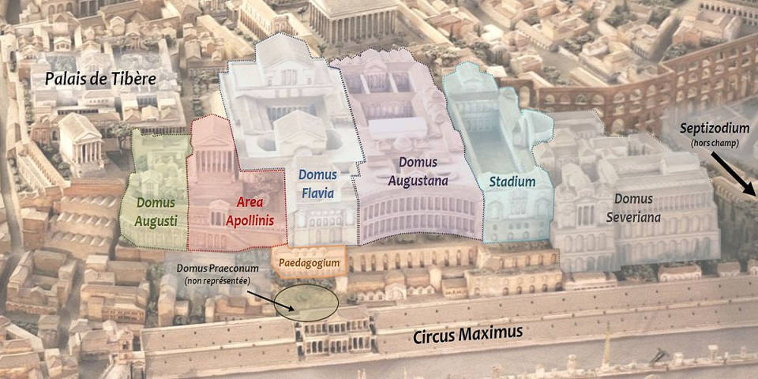
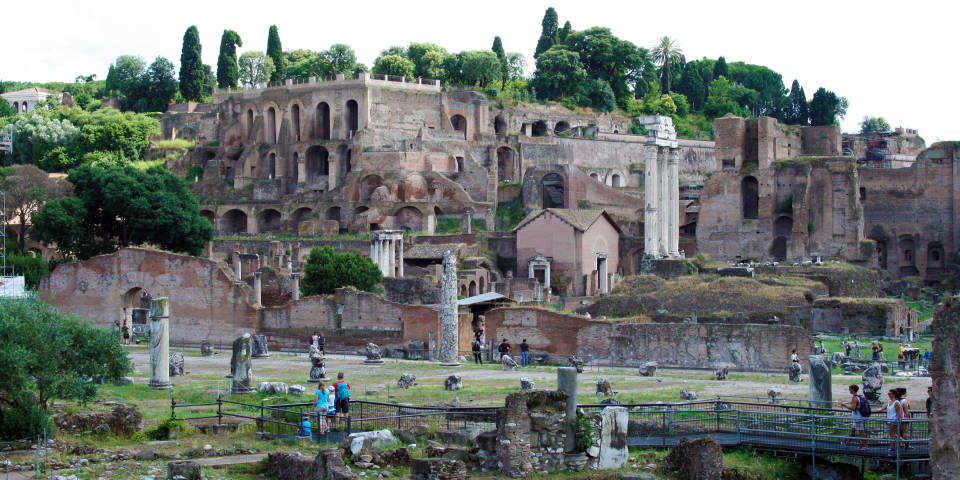
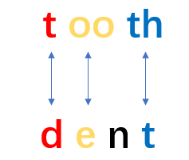

# 咬文嚼字-Part 3 
@(TOEFL)[托福, TOEFL, 词根词缀,咬文嚼字]

[toc]

 ## -wise

### Otherwise

一个单词有很多个意思，但都来自一个本质意思，你只要充分理解这个本质意思，所有的意思都一通百通。

**otherwise**的本质意思就是 ***not this one, but something else***，很明显就是从**other**衍生过来的，其后缀**`wise`**是表示**「in a… way」**以…方式，**「in … respect」**在…方面。

比如

- likewise 类似的（in a "like" way）
- clockwise 顺时针的 （沿着钟表走动的方向）
- stepwise 逐步的 （像阶梯一样的方式）

你自己也可以用wise创造新词，这种做法很常见，表示「在…方面」

- timewise 在时间方面(Timewise, we are OK 在时间方面，我们还很充足）
- moneywise 在钱方面
- marketwise 在市场方面
- healthwise 在健康方面

我们再来看otherwise，就是在其他方面(other respect/other thing），即not this one but something else，就是指「除目前说的这个以外的其他…」，something else包罗万象，指代任何你想指代的东西。

> 否则（if not）只是其中的一个意思，出现在是两个对立的情况中，只有Yes和No，才会让你觉得otherwise是「否则」的意思。

如果在非对立的情况中，**otherwise就是指除此之外的「其他情况」**。

反正这是个万能词，可以指代任何方面，既可以是副词，也可以是代词。比如:

- Please follow my instructions. Don't do it ***otherwise**(副词，= don’t do it in a different way).*

**Reference**:

1. [把otherwise当「否则」理解，发现很多句子看不懂，正确的理解是什么？--知乎--史蒂芬的专栏 ](https://zhuanlan.zhihu.com/p/140503806)

## buccaneer /ˌbʌkəˈnɪr/

**buccaneer**（海盗）：专门掠夺西班牙商船的“皇家海盗”。
在大航海时代，西班牙和葡萄牙率先开展航海探险事业，积极在新发现的美洲大陆进行殖民，从美洲掠夺了大量财富，成为那个时代的霸主。1630年左右，一群在加勒比海域进行探险投机的法国人竞争不过西班牙人，被西班牙人赶到一座海岛上。从此以后，这群法国人以此为据点，做起了海盗生意，专门袭击西班牙商船，声势越来越大，越来越多的法国人以及英国人、荷兰人也加入进来，将这项专门针对西班牙商船的海盗事业越做越大，并且还赢得了本国政府的支持，获得政府颁发的“私掠许可证”，成为奉旨打劫的“皇家海盗”，就算被西班牙军队俘虏后还可以享受战俘待遇，而不是像普通海盗那样被绞死。在后来英国和西班牙的大海战中，***英国海军就依靠这些“皇家海盗”击败了西班牙的无敌舰队，终结了西班牙的霸主地位***。

在法语中，这群海盗被称为“***boucanier***”，源自加勒比海土著语***buccan***（烤肉架），字面意思就是“使用烤肉架烤肉的人”，因为这群海盗也喜欢使用这种架子烤肉吃。英国人将其英语化为**buccaneer**。1684年，著名法国作家Alexandre Exquemelin描写17世纪加勒比海盗的名著《美洲海盗》的英译版本出版后，buccaneer一词更是广为流传，成为了“海盗”（pirate）的同义词。

在荷兰语中，这群海盗被称为***vrijbuiten***，由**`vrij`**（free）+ **`buiten`**（booty，掠夺品），演变为英语中的**freebooter**和**filibuster**，都表示“海盗”。

同样源于加勒比海土著语***buccan***（烤肉架）还有单词**barbecue**（烧烤），它是经由西班牙、法语进入英国的。

- buccaneer：[,bʌkə'nɪə] n.海盗vi.做海盗
- freebooter：['friːbuːtə] n.海盗
- filibuster：['fɪlɪbʌstə] n.海盗，暴兵，阻挠议事的议员，阻挠议事的行为 vi. 掠夺，阻挠议事

## Barbarian

**barbarian**（蛮族）：不会讲希腊语的外地人。

在古代欧洲，希腊的文明程度最高，因此当时的希腊人对本民族的文化尤其是希腊语非常骄傲，嘲笑外地人所讲的语言就像是“吧啦吧啦”（***barbar***）的鸟语，所以就用***barbaros***这个单词来形容文化程度低下的外地人。经过拉丁语流传至英语后，产生了**barbarous**（野蛮的）和**barbarian**（蛮族）这些词汇。“蛮族”指的是希腊和罗马周围的文明程度较低的其他民族，主要包括凯尔特人、日耳曼人、斯拉夫人等。后来，这些蛮族部落在欧洲大范围迁徙并入侵罗马帝国，建立了众多的蛮族小政权，是众多欧洲当代国家的源头。位于北非的柏柏尔人（**berber**）也被归入蛮族，该民族的英文名称一样来自希腊语***barbaros***。

- barbarian：[bɑː'beərɪən] n.野蛮人，蛮族
- barbarous：['bɑːb(ə)rəs] adj.野蛮的，未开化的，残暴的
- barbaric：[bɑr'bærɪk] adj. 野蛮的，粗野的；原始的
- barbarism：['bɑrbərɪzəm] n. 野蛮；原始；未开化；暴虐
- barbarity：[bɑr'bærəti] n. 残暴；粗野
- Berber： ['bə:bə] n.柏柏尔人，柏柏尔语

## Villain /ˈvɪlən/

`villain -` 今指“坏蛋”或“恶棍”的**villain**一词原先并不含贬义。它源自中世纪拉丁语**vīllānus 'farmhand'**，通过法语***vilain***于14世纪进入英语的。

从终极词源来看，**villain**和另一个词**villa**（别墅）都源于拉丁语***vīlla 'country house'***。在中世纪封建时代，这两个词是密切相关的，villa原指“农庄住宅”或“庄园”，而villain则指为villa的主人工作的“农奴”或“农民”。

后来，贵族由于阶级优越感以及他们对农民的阶级偏见，往往把意指农民、乡下人的词语同“愚昧”、“粗野”、“邪恶”等概念联系起来。这样，**villain**的词义就逐渐发生贬降。19世纪出现了一个戏谑性短语**villain of the piece**，指“剧中反面人物”或“首恶”，被德莱塞（***Theodore Dreiser***）、墨多克（***Iris Murdoch***）等作家乃至普通人广泛使用。

但**villa**和出自同一拉丁词源的**village**（乡村）一词至今却仍保留了原拉丁词中的含义。

例:

- The villain cheated the old lady out of her life's savings. (FWF) 这个恶棍骗走了老太太一生的积蓄。
- He made his reputation as an actor playing villains. (CID) 他以演反派角色而出名。
- A faulty fuse was the villain of the piece. 毛病就出在保险丝上。
- The whole village turned out to watch the parade. 全村的人都出来看游行

**villain**（恶棍）：在古罗马农场干活的奴隶。

英语单词**villain**源自拉丁语***villanus***，本意为在villa（古罗马农场）干活的人，通常是奴隶或隶农。**villa**是古罗马贵族在乡村的房地产，包括居所和农场。英语单词**village**（农村）、**villager**（村民）等都源自拉丁语***villa***。

由于在***villa***里面干活的奴隶或隶农地位很低，常常遭到贵族老爷的鄙视和呵斥，因此表示他的拉丁语villanus及其衍生的英语单词villain就不可避免地含有了强烈的贬义，并从表示社会地位的卑贱延伸至表示人品的卑贱，逐渐发展出“坏人、恶棍、反派”等负面含义。可以说，这个单词体现了一种强烈的阶级偏见。

- villain：['vɪlən] n.坏人，恶棍，反派，罪犯
- villainous：['vɪlənəs] adj.邪恶的，缺德的，恶毒的，堕落的
- villa：['vɪlə] 乡村别墅，农场
- village：['vɪlɪdʒ] n.农村，乡村，郊外
- villager：['vɪlɪdʒə] n.村民，乡村居民

*Avengers: Infinity War* depicts the beginning of the Avengers' attempt to protect the Infinity Stones from the **[villainous](https://www.cbr.com/were-in-endgame-now-infinity-war-meme/)** Thanos who wants to use them to erase half of humanity from existence. Thanks to his mystical training, [Doctor Strange](https://www.cbr.com/doctor-strange-2-prepares-filming-in-london/) is able to see each of the 14 million possible outcomes from their fight against Thanos. **All but one end in failure.** Much to Tony Stark's dismay, Doctor Strange gives up the Time Stone to Thanos. When Stark questions his motives, Doctor Strange simply states, "We're in the endgame now."

## palatial /pəˈleɪʃl/

(a.):宫殿般的;富丽堂皇的

相传，坐落在罗马七丘的古罗马城是战神之子***Romulus***于公元前753年前后创建的。

我们如今用以表示“宫殿”和“豪华住宅”、“华丽建筑物”等义的**palace**一词可一直追溯到古罗马七丘之一的主丘***the Palatine Hill***（[帕拉蒂尼山](https://rome.us/ancient-rome/palatine-hill.html)）。

罗马帝国的第一代皇帝奥古斯都（Augustus）以及其后的提比略（Tiberius）和尼禄（Nero）等皇帝都先后把皇宫建在这座山丘上。有人说世界上第一座富丽堂皇的宫殿是尼禄所建。他在位时，建于该山丘上的罗马城已发展为华丽的住宅区，权贵名士都聚居于此，富人的住宅布满山坡。尼禄想把整座山丘据为己有，遂下令私人住宅一律拆除。然后建筑师们为他精心设计了一座皇宫，罗马人称之为palātium，字面义是on the site of the Palatine（位于帕拉蒂尼山上）。以后法国国王据此把他们的王宫叫做palais，英语借用了这个词，初作paleys，后来才演变成palace的。从palace的形容词形式palatial（宫殿的）我们能够更清楚地看到palace同palātium之间的联系。其实，至今英语里还有palatine一词，也作形容词用，同palatial词义相近。

例　

- The queen of England lives in Buckingham Palace. 英国女王住在白金汉宫。
- Demonstrators gathered in front of the presidential palace. (CID) 示威者聚集在总统官邸门前。
- A palace coup led by the general has toppled the dictator. (CID) 由将军领导的宫廷政变推翻了独裁者。
- The palaces of the rich dot the coastline. (WBD) 海岸线上富人的豪华住宅星罗棋布。

## Indenture(契约)

在中世纪的欧洲，人们在签订契约时，往往会把两份内容相同的契约写在同一张羊皮纸上，然后在中间以锯齿状边缘分割开，双方各持一份。以后需要比对契约真伪，只需要查看两份契约的锯齿状边缘能否对上即可。

英语中，这种以锯齿状边缘分割的契约就被称为**`indenture`**。这个单词来自拉丁语，由前缀`in-`（进入）加词根`dent-`（齿）及名词后缀-ure构成，字面意思为“缩进成锯齿状之物”。

**indenture**对应的动词是**indent**，意思是“缩进，使成锯齿状”。比如：
- We usually indent the first line of a paragraph.
> 我们通常使每个段落的第一行缩进。

从词源上看，拉丁词根`dent-`（齿）其实和来自英国人本族语的常见单词`tooth`（牙齿）源自同一个老祖宗，只不过发生了音变，导致拼写差异比较大。具体来说，开头的辅音字母`t`和`d`相通，末尾的`th`和`t`相通，中间的双元音字母`oo`和单元音字母`e`相通，然后`dent-`中的鼻音字母`n`在单词`tooth`中脱落了。

只要我们熟悉了这些常见的音变规律，就能轻松地看出词根dent-和单词tooth之间的亲缘关系，可以利用常见单词tooth来帮助记忆词根`dent-`。

来自词根`dent-`（齿）的常见单词还有**dental**（牙齿的），**dentist**（牙科医生），**trident**（三叉戟、三齿鱼叉）等等。

**词根dent-（齿）**

- indenture：[ɪnˈdentʃə(r)] n.契约，合同
- indent：[ɪnˈdent] v.缩进，使成锯齿状
- dental：[ˈdentl] adj.牙齿的
- dentist：[ˈdentɪst] n.牙科医生
- trident：[ˈtraɪdnt] n.三叉戟，三齿鱼叉
- tooth：[tuːθ] n.牙齿

### References & Conncection
1. [词源趣谈：以锯齿状边缘分割开的indenture（契约）-- 钱博士英语(钱磊博士)](https://mp.weixin.qq.com/s/UQMLNulL__EF6u6lqMuNDw)

## magic （拜火教祭司）

拜火教是流行于古代波斯（今伊朗）及中亚等地的宗教，中国史称祆教，正式名称是琐罗亚斯德教，其创始人为伊朗先知琐罗亚斯德（**Zarathushtra**，又译查拉图斯特拉）。拜火教是基督教诞生之前中东和西亚最有影响的宗教，古代波斯帝国的国教，该教认为阿胡拉·马兹达（意为“智慧之主”）是最高主神，马兹达创造了物质世界，也创造了火，即“无限的光明”。该教以崇拜火而闻名，故得名“拜火教”。

拜火教的出现，对后来的犹太教、基督教、伊斯兰教，都有深远的影响。在基督教尚未成为罗马国教之前，罗马国内流行的摩尼教就是该教的一个分支。佛祖释迦牟尼悟道后招收的第一批弟子就有拜火教教徒。

拜火教的祭司在古波斯语被称为magush，希腊语中被称为magos，拉丁语中被称为magus，复数形式为magi，意思是“哲人”、“贤人”、“知晓神之奥秘的人”。据《圣经》记载，耶稣出生时，三位magi在东方看见伯利恒方向的天空上有一颗大星，于是便跟着它来到了耶稣基督的出生地，并给耶稣带来了礼物，这就是圣诞礼物的由来。

美国著名文学家欧·亨利写的短篇小说《麦琪的礼物》（*The Gift of the Magi*）中，就用了这个典故。里面的Magi并非小说中的人物，而是拜火教祭司。*The Gift of the Magi*意思就是“圣诞礼物”。

英语单词**magic**（不可思议的，神奇的；魔术、魔法）就派生自**magi**（拜火教祭司），字面意思是“**magi**的”。古人认为**magi**（拜火教祭司）拥有深奥秘密和超能力，所以就用magic来形容巫术、魔法等神奇的事情。

>  比如：What magic drug have you taken to recover so quickly? 你吃什么灵丹妙药，好得这样快？

单词magical衍生自**magic**（魔术、魔法），后面多了一个形容词后缀，意思是“魔术的，魔法的”。做形容词时，**magic**和**magical**的含义差不多，都可以表示“有魔力的，神奇的”，区别在于，magic通常取其本意，而magical常取其引申含义，形容某人某物是“迷人的、美妙的”。如**a magic bed**的意思是“魔法床”，而**a magical bed**的意思则是“神奇的床”。

>  再比如，The beautiful island of Cyprus is a magical place to get married. 美丽的塞浦路斯岛是缔结良缘的美妙之地。

衍生自magic（魔术、魔法）的单词还有magician，后缀-ian表示某种人，所以magician的意思就是魔术师或魔法师。

- **magic**：['mædʒɪk] adj.不可思议的，神奇的，有魔力的，魔术的n.魔法，巫术，魔
- **magical**：['mædʒɪk(ə)l] adj.魔术的，有魔力的，神奇的
- **magician**：[mə'dʒɪʃ(ə)n] n.魔术师，魔法师，巫师

引用： [词源趣谈：magic——神奇的拜火教祭司--钱磊博士](https://mp.weixin.qq.com/s/4U8Py1gjj_yIkYF4ujrqUQ)

## Actuary（精算师）

在保险行业有一种非常专业的人员叫做“精算师”，他们的主要职责就是收集并分析各种统计信息，在此基础上计算出各种事件发生的概率，为各种保险业务的定价提供数学支持。

在英语中，精算师被称为**actuary**。这个单词来自拉丁语，由：

- 词根**`act-`**（活动、行动）
- 后缀**`-ary`**组成，
- 中间的那个字母u可以简单地看作是一个连接字母。

词根**`act-`**和单词**act**（活动、行动）同源，在这里表示“***公共事务、社会中发生的各种事件***”。

后面的**`-ary`**是个常见的形容词及名词后缀，在这里表示“***从事与……相关工作的人***”。

整个单词的字面意思就是“从事与公共事务相关工作的人”。

在古罗马时期，**actuary**是元老院中的一个职务，相当于书记官，负责信息的采集、整理和发布。他需要收集整理各地上报的各种社会重大事件、各地方法官的裁决，参加元老院会议，负责记录会议中形成的决议，最后汇总各方面的信息编写成公报并对外发表。

到了中世纪，**actuary**这个单词的含义变得更加广泛，可以表示抄写员、速记员、法院书记、公证员、记账员、会计师等等。这些职务都涉及到信息的收集整理。

到了近代，**actuary**开始被用来特指保险公司中进行保险精算业务的数学家，也就是所谓的“精算师”。

**actuary**的形容词形式是**actuarial**，后面加了一个形容词后缀**`-al`**，意思是“保险精算的”。与它同源的单词还有**actual**（实际的），字面意思就是“与实践活动相关的”。

- **actuary**：['æktʃuəri] n.保险精算师
- **actuarial**：[ˌæktʃuˈeəriəl] adj.保险精算的
- **actual**：[ˈæktʃuəl] adj.实际的，真实的，现实的

**参考：**

[英语词源趣谈](https://mp.weixin.qq.com/mp/appmsgalbum?__biz=MzA4NTQ4NzIzNg==&action=getalbum&album_id=1297162942844207107&scene=173&from_msgid=2651803449&from_itemidx=1&count=3&nolastread=1#wechat_redirect)

