# 咬文嚼字-Part 5 贵族相关词语 

@(TOEFL)[托福, TOEFL, 词根词缀,咬文嚼字]

[toc]

## [Do men ever visit Boston](https://www.quora.com/What-is-the-difference-between-a-duke-an-earl-a-lord-a-marquis-a-baron-and-a-count)

You can keep the ranking straight with this mnemonic: "Do men ever visit Boston?" Thus: duke, marquis, earl, viscount, baron.

**Duke** is the highest, most powerful rank. There are but a handful of dukes. William the Conqueror was a duke.

**Marquis** (pronounced markwiss in England) is next, but we'll come back to it.

**Counts and Earls are equivalent ranks**, so equivalent that the wives of earls have always been called countesses. ***(I assume that William the Conqueror brought/made counts, and the native English equivalent rank was Earl.*** But if that's true, then how can it be true that the wives of earls have always been countesses?) What is a count? He is the ruler of a county. And now we can go back to consider the marquises.

**Marquis**: Some counties are border counties. A border county is where the action is. This is where the enemy starts their invasions. This is the jumping off point for your invasion of the enemy kingdom.

If a border count doesn't wind up dead, it's probably because he's rich enough to keep an unusually large military force. So, the border count is rich and well armed. Plus, he's a war hero, right? Surviving all those battles? Plus he captures all that loot?

So a border count tends to be more prominent, powerful, and respected than other counts. And a border (and by extension, a border county) is called a "mark" or a "march." It's not called that because that's where the armies march; that's just coincidence, though often enough you have to send out for new peasants since the armies of both sides marched thru there enough times to dispose of or drive out the old peasants.

So, eventually, border count became a rank above regular count. Thus: marquis.

**Viscount** is below count, the same as the vice president is below the president.

And then **baron** is the bottom of the totem pole[^1]. But these are all barons, to hear some people tell it. When the king is at odds with his barons, and they're making him sign the **[Magna Carta](https://en.wikipedia.org/wiki/Magna_Carta)**, you can bet that the dukes, marqueses, earls, counts, and viscounts are standing with the barons, not with the king.

But, to hear some tell it, a baron is anybody who holds directly from the king. So the dukes and such are literally barons. They just don't call themselves that because they have more impressive titles.

Expect all of this to be wrong: Things can switch up on you every time you cross into a new country or a new century.

[^1]: totem pole【ˈtoʊtəm poʊl】 图腾柱;(机构等内的)等级，级别。 a range of different levels in an organization, etc.

### peer（贵族）：与查理曼大帝平起平坐的十二骑士

英语单词**peer**原本是“同等的人”之意，来自拉丁语par（equal，相等）。它还可以表示“贵族”，这是为什么呢？原来，在中世纪，法兰克王国的著名国王查理曼大帝身边有十二个武艺高强的骑士，一直追随查理曼大帝南征北战，立下赫赫战功。为了犒赏他们，查理曼大帝借鉴亚瑟王和十二圆桌骑士的故事，和这十二位骑士平起平坐，将他们称为**peer**，意思就是“平起平坐的人”。***由于这些骑士都是贵族，因此peer就衍生了“贵族”的含义***。

- peer：[pɪə] n.贵族，同等的人vt.封……为贵族，与……同等
- peerage：['pɪərɪdʒ] n.（全体）贵族，贵族地位，贵族阶级
- peerless：['pɪrləs] adj. 无与伦比的；出类拔萃的；无比的
- compeer：[kəm'pɪr] n. 同辈；同伴；地位相等的人

### duke（公爵）：罗马帝国时期的蛮族军事统帅

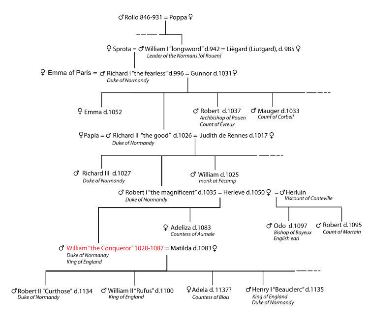

在古罗马时代，出身为日耳曼或凯尔特蛮族而作为雇佣军为罗马军队所用的将帅，由于没有正式的罗马军衔而统称为***Dux***，是“***军队首领***”的意思。该词来自拉丁语动词***ducere***（领导、引导），这就是英语单词**Duke**（公爵）的来源。英语词根**`duc-`**（引导）与此同源。

罗马帝国灭亡之后，各部族的军事领袖成为欧洲各小国的国君，其中许多就以***Dux***为称号，他们统治的小国就被称为“***公国***”（**duchy**）或“***大公国***”（**Archduchy【ˈɑːtʃˈdʌtʃɪ 】**）。直到近代，意大利和德国统一之前的很多小国都以此为称号。这些小国的国君一般翻译为“***大公***”。

欧洲现存的独立公国是卢森堡和安道尔公国。历史上的其它公国经过合并和并吞，逐渐丧失独立性，成为国家的一部分，其统治者也演变成了由国王授予的爵位，即“公爵”（**Duke**）。在欧洲各国，公爵都是最高爵位之一。

英国的公爵爵位出现很晚。1337年，爱德华三世把康沃尔郡升为公国，将公爵爵号授予年方7岁的“黑太子”爱德华([the Black Prince](https://en.wikipedia.org/wiki/Edward_the_Black_Prince))。为突出公爵特殊地位，以后多年里除女王配偶和王子外，其他王亲国戚均不许称王，最高可获公爵爵位。自从1483年建立诺福克公国以后，公爵爵位开始授予王亲以外者，但很少建立公国。而且能获此最高爵位者多是军功显赫的统帅。

- **`duc-`**：引导，领导
- duct： [dʌkt] n. 输送管，导管vt. 用导管输送；以导管封住
- duke：[djuːk] n.公爵
- duchy：['dʌtʃɪ] n.公国，公爵领地
- duchess：['dʌtʃɪs; -es] n.公爵夫人，女公爵
- archduke： [,ɑrtʃ'duk] n. 大公，（奥地利）皇太子
- ducal：['dukl] adj. 公爵的；公爵领地的；象公爵的
- duce： ['duːtʃɪ] n.（意）领袖；首领

###  marquis（侯爵）：镇守边疆的诸侯

**marquis** 【ˈmɑːrkwɪs】（ (除英国外一些欧洲国家的) 侯爵）是欧洲贵族爵位中的一种，在公爵（**duke**）之下、伯爵（**count**）之上，也可拼写为**marquess**。该词来自法语***marchis***，字面意思是“镇守边疆的诸侯”，来自***marche***（边疆），与英语单词**march**（行军）都来自拉丁语***marca***（边疆）。欧洲中世纪边疆与内陆的概念区别源自于古罗马帝国时期对帝国行省的划分，比较稳定的内陆省份归于元老院管理，而不稳定的边疆省份归于皇帝管理。中世纪以后，则把封疆贵族按照相似的概念分为最受君主信赖、管理边疆的“侯爵”，和地位较低、管理内地一方领土的“伯爵”。

- marquis：['mɑːkwɪs] n.侯爵
- march： [mɑrtʃ] v.（使）前进，（使）行军，进军；游行示威；进展n. 前进；行军；游行示威；进行曲
- marchioness：[,mɑrʃə'nɛs] n. 女侯爵，侯爵夫人

### count（伯爵）：罗马皇帝的侍从

在古罗马帝国时期，罗马皇帝身边的亲信往往能得到皇帝的宠爱，掌管帝国的军政大权，有时还会出任地方官吏，最常见的是担任某个行省的总督。欧洲大陆部分国家的伯爵爵位名称就出自拉丁文的***comes***，意为“***侍从***”。例如，法语中表示“伯爵”的单词为***counte*** ，出自拉丁文***comitem***，即***comes***的宾格，意思就是“伙伴，侍从”，进入英语后演变为英语单词**count**，表示“伯爵”，但通常指的是欧洲大陆地区的伯爵。

英语单词**county**是英国的行政区划单位，通常被翻译为“郡”或“县”，其实，它在历史上指的就是[诺曼底公爵](https://en.wikipedia.org/wiki/Duke_of_Normandy)征服英国后，封给手下各伯爵（**count**）的封地，从拼写上我们可以明显地看出它们之间的关系。

- count：[kaʊnt] n.（法、德、南非）地区的伯爵
- countess： ['kaʊntəs] n. 伯爵夫人；女伯爵
- county： ['kaʊntɪ] n.郡，县

### earl（伯爵）：北欧地区的“部落首领”

欧洲国家贵族爵位中，从最低级以上的第三级一般在中文里译作“伯爵”，处在侯爵之下，在子爵之上。

英国的“伯爵”**earl**源自古英语***eorl***，与北欧国家的“伯爵”Jarl同源，原意是“***部落首领***”。11世纪，丹麦国王克努特统治英国后，把伯爵（**earl**）爵位引进英国，以丹麦方式把英国划分为许多伯爵领地（**earldom**）。每个伯爵均是镇守一方的诸侯，相当于现在的总督职位。在英国，**earl**（伯爵）的历史最悠久。在1237年黑太子爱德华被封为公爵之前，它是英国最高的爵位。同时，**earl**还是欧洲五种爵位中唯一一个源自古英语的爵位。

- earl： [ɜːl] n.伯爵
- earldom：['ɜːldəm] n.伯爵领地

### viscount（子爵）：法国的副伯爵

英语单词**visecount**（子爵）来自法语，由**`vice`**（副的）+**`count`**（伯爵）构成，字面意思就是“副伯爵”。**visecount**常为郡守，地位在掌管一方的诸侯（伯爵）之下，在普通贵族男爵之上，但有时也可能是实力强大的诸侯。在英国，1440年比奥芒特的约翰被封为子爵，位居所有男爵之上。

**`vis-`** 表示“改变、交流”，引申为“副职”或“代理牧师”。源自拉丁语 *vux (属格 vicis) "turn, situation, change."

- viscount：['vaɪkaʊnt] n.子爵
- vice：[vaɪs] adj. 副的；代替的

###  baron（男爵）直接从国王那里获得封地的贵族

男爵（**baron**）是贵族爵位中最低的一级。盎格鲁一撒克逊时代英语中已有“男爵”（**baron**）一词，但无男爵爵位，而且词义不够确定，似有“自由者”或“国王的臣仆”之意，并无尊贵之意。当时，所有那些直接从国王那儿得到封地的贵族都可称为“男爵”。当时男爵在世俗贵族中占了很高比例，以至于“男爵”一词长期作为贵族的集合名词使用。11-14世纪，男爵的封号和封地可通过血缘和婚姻关系传递，但不得随意出售和转让，历代国王也不随意增加或褫夺贵族封号。

1387年，理查二世封约翰•比彻姆为基德敏斯特男爵后，男爵才成为英国贵族的正式爵位，并且始终是人数最多的爵位。

- baron：['bær(ə)n] n.男爵
- baroness：['bær(ə)nɪs; -nes] n.男爵夫人，女男爵
- barony：['bærəni] n. 男爵领地；男爵爵位
- baronet： ['bærənət] n. 从男爵；准男爵vt. 封…为准男爵

### emperor（皇帝）：古罗马军队的统帅

很多人区分不了单词**emperor**（皇帝）和**king**（国王）的差异。英语单词emperor（皇帝）源自拉丁语imperiator，意思是“指挥官”。最开始只是罗马军队对战功显赫的将军的称号，后来被长老院用在凯撒，屋大维和他们的继承人身上。

西罗马帝国灭亡后，教皇曾经封法兰克国王查理曼为罗马帝国的emperor，但只是一个虚名。随后主要由德意志诸侯国组成的神圣罗马帝国继承了西罗马帝国的衣钵，所以神圣罗马帝国也有emperor，从各个德意志诸侯国的国王中推选出。

东罗马帝国也使用emperor这个头衔。欧洲历史上后来只有拿破仑建立的法兰西第一帝国使用了emperor这个头衔。

由此可见，**emperor**指的是*由多个民族和国家组成的帝国的最高统治者，并常常特指古罗马帝国的皇帝*。一般国家的国王都是king而不是emperor。

- emperor： ['emp(ə)rə] n.皇帝，君主
- empress：['ɛmprəs] n. 皇后；女皇
- empire： ['empaɪə]n.帝国
- imperial： [ɪm'pɪərɪəl]adj.帝国的，皇帝的，至高无上的

#### imper-  = command, 表示“命令，统治” {7}

| 单词                              | 解释                                                         | 单词             | 解释 |
| --------------------------------- | ------------------------------------------------------------ | ---------------- | ---- |
| **imper∙ial**  【ɪmˈpɪriəl】 | **`imper-`** = command, 表示“命令，统治”。 **`-ial`** 表形容词，“…的”，一般缀于名词后。 源自拉丁语 -alis, adjective suffix. | imper-ative  |      |
| emper-or                      |                                                              | empr-ess         |      |
| em-pire                       |                                                              | imper-ious   |      |
| imper-actor-ial               |                                                              |                  |      |

### king（国王）：氏族部落的首领

> 1 - 缩写自古英语 cyning,国王，君主，统治者，来自 Proto-Germanic*kuningaz,对应于 kin,家族，种族，氏族，-ing,集合名词后缀。即一个家族或氏族的统领，后用于指国王，君主。引申词义关键的，重要的，大的等。比较其与 emperor 的区别。

在现代英语中，单词king往往被翻译为“国王”，表示“一国之君”，然而古代，king其实并没有这么高的地位，仅仅是氏族部落的首领，相当于“酋长”。

king来自古英语cyning，与单词**`cynn`**（kin，家族，种族）相关，仅仅是“一族之长”（**leader of a kin**），指的是公元4世纪时入侵不列颠的日耳曼民族的部落首领。当时入侵不列颠的日耳曼民族包括撒克逊人、盎格鲁人和朱特人。

后来，这些人在不列颠东南部（即英格兰）建立了七个小国家，或者说是七个部落，包括三个撒克逊人的、三个盎格鲁人的和一个朱特人的。这些部落的首领就是king，这些部落因而被称为**kingdom**（王国）。

后来，这些部落统一为英格兰后，其首领依然被称为king。从此以后，英格兰的男性首领都被称为king，该词也就被译为“国王”了。

- king：[kɪŋ] 
  - n.国王
  - vt.立……为国王
  - vi.统治，做国王
  - adj.主要的，最大的，最重要的
- kin：[kɪn] 
  - n.家族，同族，亲戚
  - adj.同类的，有亲戚关系的
- kingdom：['kɪŋdəm] n. 王国；界；领域
- kingly：['kɪŋli] adj. 国王的；高贵的，国王似的
- kingship：['kɪŋʃɪp] n. 王权；王位；君主身分

1.希腊拉丁词根**`gen-`**,**`gon-`**表示生产（孩子），与日耳曼词源的**kin** [kɪn]n.亲戚；家族；同族，adj.同类的；有亲属关系的，同源。大家一起生孩子，就有了宗族的概念。按照这个道理，希腊拉丁人对本族人**generous** ['dʒen(ə)rəs] adj.慷慨的；有雅量的，而日耳曼人对本族人则是kind adj.和蔼的；宽容的。 

同样，拉丁人的首长是**general** ['dʒen(ə)r(ə)l] adj.一般的；综合的，n.一般；将军（形容词是说适用于整个宗族），而日耳曼人部落的首领则是**king**。后缀**`-gen`**表示producer，比如**hydrogen** ['haɪdrədʒ(ə)n] n.氢，因它燃烧后生成水（hydro-），而日耳曼后缀**`-kind`**，比如**mankind**那是“种类”是“人”。

这样我们也就好理解这三个单词了：

- **akin** [ə'kɪn] adj.类似的；同类的；同族的，那是因为它的意思是“of the same kin”，
- 而**kindred** ['kɪndrɪd] adj.同类的；血缘的；同族的，n.家族；相似，后缀**`-red`**表**状态**，实际就是**hundred**中的-red，
- 而**kinsman** ['kɪnzmən] n.男性亲戚；同族者，则是本族之人。

2.**king** [kɪŋ] n.国王，vi. 统治；做国王，vt. 立…为王，adj.主要的。古英语中写作***cyning***。这里**`cyn-`**同**kin** [kɪn] n.亲戚；家族；同族，adj.同类的；有亲属关系的，本意是出生（氏族），与词根**`gen-`**同源。后缀-ing日耳曼语里表people of。日耳曼人的概念里，国王不算啥，他是leader of the people而已。

### queen（王后）：国王的妻子

> 来自古英语 cwen,女人，妻子，王后，女王，来自 PIE*gwen,女人，通常指比较高贵出身的女人，词源同 gynecology,gynarch.

> queen在古英语的词形为cwēn，原义是“妻子”、“女人”，以后词义升格为“王后”、“女王”。在词源上它与医学术语gynaecology（妇科），gynaecologist（妇科医生）有亲缘关系，其中前缀gynaeco-源于希腊语gunē，意思就是“女性”或“女人”。这个前缀和queen都可一直追溯至印欧词根gwen（女人）。

英语单词**queen**常常被译为“王后”或“女王”。该单词来自古英语***cwen***，原本仅仅表示“妻子”，专指“国王的妻子”，因此衍生出“王后”的含义。

后来，由于在英国历史上，曾经有女性担任国家元首即“女王”一职，而英语中又没有与king（国王）对应的阴性词，因此女性国家元首也被称为**queen**，该词也就产生了“女王”的含义。

在印欧语系中，只有英语和北欧语言等少数语言缺乏与“国王”对应的阴性词。

在需要严格区分时，英语通过以下词组来区分与queen相关的各种头衔：

- **queen regnant**（女王）：执掌政权的女性君主。

- **queen consort**（王后）：男性君主的妻子，**consort**表示“配偶”

  >  (**`con-`**共同 + **`sort`**【种类】 → 同类相聚 → 结交。)

- **queen regent**（摄政太后）：未成年君主的母亲，临时执掌政权。

有意思的是，国王的妻子被称为**queen consort**，虽然不执掌权力，但享有与国王一样的待遇和级别，而女王的丈夫却很少被称为**king consort**，而是被称为**prince consort**，对应中文是“亲王”，所享受的待遇和级别都比女王低。这和中国的“驸马”地位低于公主一样。

- **queen**：[kwiːn] 
  - n.王后，女王，皇后，蜂后
  - vt.使……成为女王或王后
  - vi.做女王
- **queenly**：['kwinli] 
  - adj. 女王的，王后的；高贵的
  - adv. 似女王地

**摩西英语(摩西)**

1.**queen consort** 王后，是王、国王正妻的头衔，当君主不能称为皇帝或其他相当头衔时，其正室只能称为王后而不能称皇后，有些甚至只能称更次一等的王妃。consort n.配偶；伴侣，词根是ser,sor,sort，意思是连接（成线）、依附，所以consort的哲学含义就是partner of the same lot。同记consortium n.财团。

2.**queen regnant **女王，即女性的君主或国王，君主制国家中的君主为女性时，她通常被称为女王。女王拥有政治上的统治权力，但是女王的丈夫通常无法分享她妻子的位阶，头衔或是权力。**regnant**的词根**reg**表统治、管理、使保持直。比如图片中的埃及艳后**Cleopatra**克利奥帕特拉七世和现在英国女王伊丽莎白二世。

3.**queen** [kwiːn] n.女王；王后，vt. 使…成为女王或王后，其实也不是很了不起。词源角度讲，queen只是王（king）的女人。比较一个类似单词吧：**quean** [kwiːn] n. 妓女；轻佻女人。根据格林定律，这个queen与希腊词根gyn-同源，gyn-表女人，如**polygyny** [pə'lɪdʒɪnɪ] n.一夫多妻。

## 男人与女人（希腊词根）

### 1. **`gynec-`** /  **`gyn-`** = woman, 表示“妇女”。源自希腊语 gune "woman."{18}

> queen在古英语的词形为cwēn，原义是“妻子”、“女人”，以后词义升格为“王后”、“女王”。在词源上它与医学术语gynaecology（妇科），gynaecologist（妇科医生）有亲缘关系，其中前缀gynaeco-源于希腊语gunē，意思就是“女性”或“女人”。这个前缀和queen都可一直追溯至印欧词根gwen（女人）。

| 单词                                                         | 解释                                                         | 单词                                | 解释                                                         |
| ------------------------------------------------------------ | ------------------------------------------------------------ | ----------------------------------- | ------------------------------------------------------------ |
| **mis-o-gyny**                   【mɪˈsɑdʒəni】         | n. 厌恶女人；厌女症[癖]   Misogyny is a strong dislike of women.  **`miso-`**坏的，错的，不好的 + -**`gyny`**, 妇女 | **philo-gyny ** 【fɪ'lɒdʒənɪ】 | ~~对女子的喜欢，对女子的爱慕~~ **舔狗** A positive and admiring attitude toward women in general  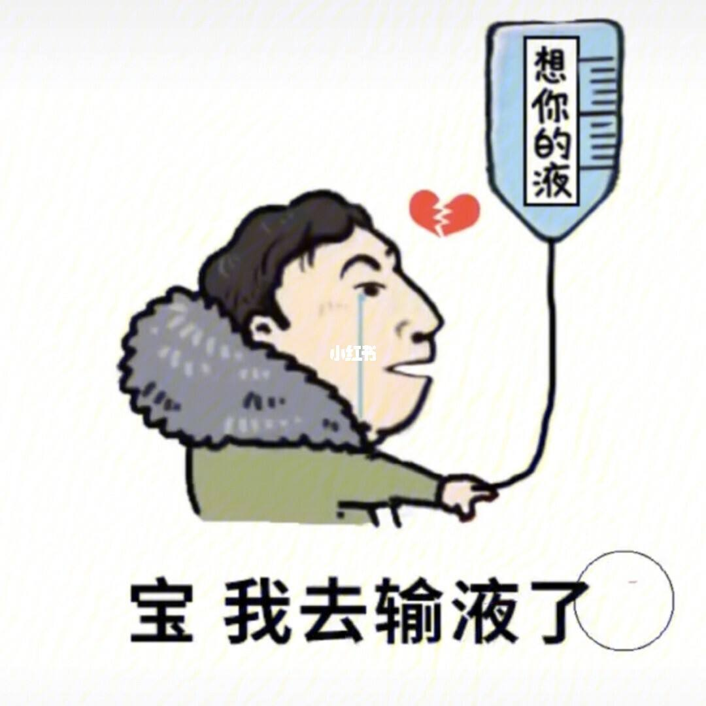 **`philo-`** = love, 表示“爱”，在医学和生物学领域常翻译成“嗜...”。 **`gyny-`** = woman, 表示“妇女”。源自希腊语 gune "woman." |
| **gynec-o-logy**                            【ˌgaɪnəˈkɑlədʒi】 | n. 妇科学 gynaeco-女人 + logy学，学科。 **`gyneco-`** = woman, 表示“妇女”。源自希腊语 gune "woman." **`-logy`** = science, 表示“科学，学科”，由词根 log-, 说，引申而来 the branch of medicine that deals with the diseases and hygiene of women  **\* gynaecologist (*Australia, UK* )** **\* gynecologist (*US*)** | gyneco-logist                       | 妇科医生                                                     |
| gynaeco-cracy 【ˌdʒɪnɪ'kɒkrəsɪ】                        | 妇人政治；女权政治 government by women or by a single woman 女性统治; 妇女当政 (Also called gynarchy) | gynec-oid                           | 有妇女特性的                                                 |
| gynec-ian                                                    | 妇女的，妇人的                                               | gyn-iatr-ics                        | 妇科疗法                                                     |
| gyn-andr-ous                                                 | 雌雄两蕊合生的                                               | gynoec-ium                          | 雌蕊，雌蕊群                                                 |
|                                                              |                                                              | philo-gyn-ous                       | 爱好女人的                                                   |
| poly-gyny                                                    | 一夫多妻                                                     | poly-gyn-ous                        | 一夫多妻的，多花柱的                                         |
| mono-gyn-ous                                                 | 一妻制的                                                     |                                     |                                                              |

### 2. **`andr-`** = male, man, 表示“男人”。源自希腊语 aner (词干 andr-) "man."{17}

| 单词                                   | 解释                                                         | 打你                                     | 解释                                                         |
| -------------------------------------- | ------------------------------------------------------------ | ---------------------------------------- | ------------------------------------------------------------ |
| **gyn∙andr∙ous**  【dʒɪ'nændrəs】 | **`gyn-`** = woman, 表示“妇女”。源自希腊语 gune "woman." **`andr-`** = male, man, 表示“男人”。源自希腊语 aner (词干 andr-) "man." **`-ous`** 表形容词，表示“…的”，用于化学领域表示“亚酸的，低价（金属）的”。 (of flowers such as the orchid) having the stamens and styles united in a column | **mon∙andr∙ous**     【məˈnændrəs】 | **`mon-`** 表示“单个，一个”。源自希腊语 monos "alone, single, sole." **`andr-`** = male, man, 表示“男人”。源自希腊语 aner (词干 andr-) "man." **`-ous`** 表形容词，表示“…的”，用于化学领域表示“亚酸的，低价（金属）的”。 （卵孢子）单雄受精的，具单一雄蕊的having only one husband at a time |
|                                        |                                                              |                                          |                                                              |
|                                        |                                                              |                                          |                                                              |

## Your Majesty

### 1. Your Majesty:(你的)王权

为什么称呼英女王时要说 Your Majesty，而不是 My Majesty 呢？影视剧里都把“Your Majesty”翻译为“陛下”，虽然这么翻没错，但会对我们造成思维定势，让我们无法理解 your 和 my 的问题。

是不是觉得 majesty 长得像 major？没错，它俩同源的，majesty 最本初的意思就是“伟大”，后来慢慢演变成“royal power”，即君权”、“王权”。

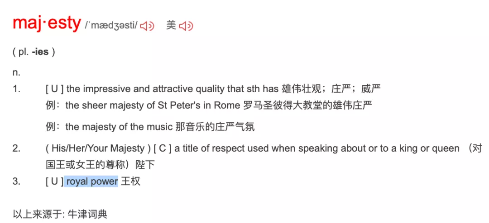

所以，面对一个君主，称其为“Your Majesty”（你的王权），这在逻辑是对的。但如果说“My Majesty”就变成“我的王权”了。怎么？想造反？

另外，Your Majesty 是面对君主的第二人称，但如果你跟别人谈论君主时要用到第三人称，就要根据其性别加上 his 或者 her。

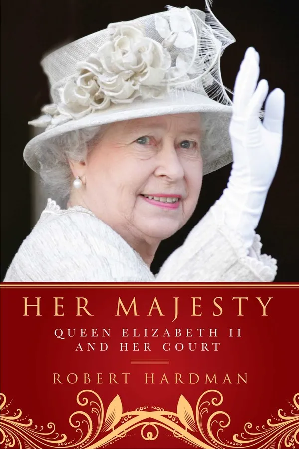

比如谈论到英女王时，要说 Her Majesty；谈论西班牙国王时，就要说 His Majesty了。

>  例：Her Majesty delivered a speech prior to the dinner.（在晚宴前，女王陛下发表了演说）。

### 2. Your Royal Highness

值得注意的是，majesty 一词只限于国王或女王，就是一个君主国内的“一把手”，其他王室成员哪怕是女王的老公，都要降一级。

比如英女王已故老公菲利普亲王，第二人称是Your Royal Highness，第三人称是 His Royal Highness，相当于“殿下”

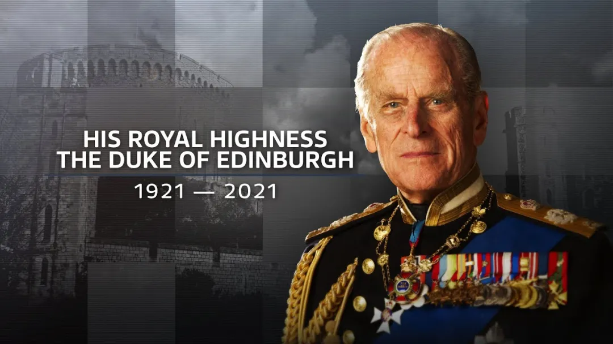

### 3. Your Grace v.s My Lady

英国的贵族体系比较复杂，简单来说，可以分为“公侯伯子男”不同等级。

有爵位的贵族，男性一般被称为 My Lord，女性被称为 My Lady，其中公爵夫人、侯爵夫人还称成为 Your Grace。

这里 lord 和 lady 表示“大人”、“夫人”，所以前面加“my”逻辑是对的，但 grace 一词用法跟 majesty 类似，就要说 Your Grace了。

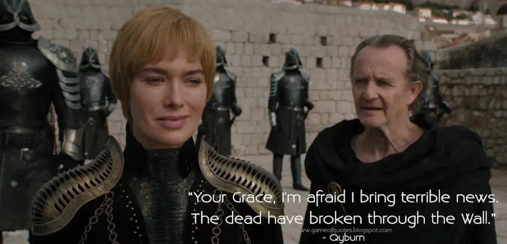

### 4. Your Honor & the Hon.

贵族以外的社会上的高阶人士，也有不少尊称。

其中最著名的莫过于“法官”的尊称了，你可能听说过“Your Honor”的说法。

>  She was with the Hon. Joanna Southwood.这是尼罗河上的惨案里的一句话。 Hon.是Honourable的缩略形式，用(the Honourable)，意为阁下。 《英》用于对伯爵以下的贵族子女、高等法院的法官、下院议员等的尊称。 《美》用于对参众两院议员、州议员、州长、市长、法官等的尊称。

### 5.  Your Excellency 

对于外国的元首、大使，或者身居要职的到访贵客，会被称为“Your Excellency”，相当于“阁下”。

这里的 honor 和 excellency 用法跟前面的 majesty、grace 用法一样，都是某种荣誉、荣耀，前面都要加 your 的逻辑才对。

### 6. 精彩评论

- 陛下、殿下、阁下、麾下，暗指称呼者在被称呼者的建筑之下，表示人尊己卑。其实这里也有“您”之意：我在您之建筑之下。

- 公侯伯子男爵位体系是翻译时套用的中国周代的封建体系。

- Your Grace 指高阶贵族，当时欧洲很多国王其实就是大的封建领主变成的，跟春秋战国时代大大小小的“王”差不多，都是周天子的封建领主，都不敢称帝，帝王才是真正的 Your majesty

- 爵位的称谓，首先要区分hereditary peerage世袭爵位和life peerage授勋爵位两种情况。具体参看Debrett's Handbook

- 法语：(直接称呼)votre majesté，(间接称呼)sa majesté，陛下）。ma 我的（接阴性词），dame 女士，madame 女士。mon 我的接阳性词，monsieur 先生。当年学法语的时候，老师跟我们说这些词是当初贵族的遗留，也影响了现在的英语，还有de是贵族名字，比如戴高乐，de Gaulle ，并且最后说欧洲皇室是一家子，非常乱。依稀记得就这么多，不敢说一定对，如果您有兴趣可以查一下。

- She was with the Hon. Joanna Southwood.这是尼罗河上的惨案里的一句话。 Hon.是Honourable的缩略形式，用(the Honourable)，意为阁下。 《英》用于对伯爵以下的贵族子女、高等法院的法官、下院议员等的尊称。 《美》用于对参众两院议员、州议员、州长、市长、法官等的尊称。

- H.M.S. 女王的船，HM Government 女王的政府，HM Treasury 女王的财政部，HM Revenue & Customs 女王的海关总署，多没文化的翻译

- 英国军舰前缀HMS: Her/ His Majesty's Ship

  

Reference:

1. [“陛下”为啥是 Your Majesty 而不是 My Majesty？巨大思维差异！ 侃哥-侃英语](https://mp.weixin.qq.com/s/3Edlcc14KEyk3pZ3MZYPdg)

## 其他和贵族相关的单词

### 忠诚与效忠

#### fealty（忠诚）：封臣获得封地时应尽的效忠义务

> fid-相信 + -el + -ity, 表示性质 → 相信的性质 → 坚贞。
>
>  fid∙el∙ity  [词根树]
> fid- 
> = trust, faith, 表示“相信，信念”。源自拉丁语 fidere "to trust," fidus "faithful," fides "faith, trust."
> -ity 
> 表名词，指具备某种性质。

在西方封建社会中，封臣在获封土地时，通常需要向分封土地的封建主宣誓效忠，为其提供特定服务，这种效忠义务就是**fealty**。单词fealty和fidelity（忠诚、保真度）一样，都来自拉丁语fidelis（忠诚）。

值得注意的是，这种效忠义务是以封地为依据的，并不等同于臣民对君主的效忠（**allegiance**）。因为一仆不可事二主，但一个人却可以获得多个封建主的封地，并向提供封地的所有封建主宣誓效忠，承诺履行该封地所关联的义务。

在现代，fealty一词所包含的封建色彩已经消失，仅仅用来表示“忠诚、效忠”。

- **fealty**：['fiːəltɪ] n.忠诚，忠实，效忠
- **fidelity**： [fɪ'dɛləti] n. 保真度；忠诚；精确；尽责

词源说明(童理民)  
1 - 来自拉丁语 fides,相信，信仰，词源同 faith.引申词义忠诚。

#### allegiance（效忠）：臣民对君主的效忠义务

英语单词**allegiance**由**liege**派生出。liege指的是“君臣关系”，即“君主和他的臣民之间的权利义务关系”。

在封建社会中，臣民必须服从并服务君主，而君主必须供养并保护臣民，这就是“君臣关系”的核心。臣民服从并服务君主的义务就是**allegiance**，通常被译为“效忠”。

但它与同样被译为“效忠”的**fealty**有较大不同。**fealty**是获封土地的封臣对分封土地的封建主应尽的义务，与封地紧密相关，一个封臣可能获得好几个封建主分封的土地，对这些封建主都负有**fealty**。而一个臣民只能有一个君主，所以只能对一个君主负有**allegiance**。

英国1870年之前的法律规定，所有出生于英国或归化英国的人都是英国国王的臣民，都对国王负有**allegiance**的义务，除非是该人所居住的地方获得独立或被英国割让。也就是说，任何英国人天生都负有对国王效忠的义务，并且不可拒绝承认。

现在，随着封建制度的消亡，**allegiance**一词所含有的封建色彩也已经消失，常常用来表示一国的国民对国家的忠诚和服务。

- **allegiance**：[ə'lidʒəns] n.效忠，忠诚，忠贞
- **liege**：[lidʒ] 
  - n. 君主；臣民
  - adj. 君主的；君臣关系的

词源说明(童理民)  
1 - al-,去，往，liege,臣子，臣民。原指臣子对君王的效忠。后该词多与-lig 相联系，绑，捆绑，词源同 ligature,韧带。

### 王子，校长与原则

英语单词prince常常被翻译成“王子”或“亲王”，比如英国女王伊丽莎白二世的丈夫菲利普·蒙巴顿，他的头衔就是prince，结婚前翻译为“王子”，结婚后被翻译为“亲王”。那么，这个prince到底是个啥头衔呢？

#### 首席，排在第一位的人

单词**prince**来自古法语，源自拉丁语***princeps***，由词根**`prim-`**（第一，first）和**`cap-`**（拿，take）组合而成，字面意思就是“the one who takes the first（place/position）”（首席，排在第一位的人）。

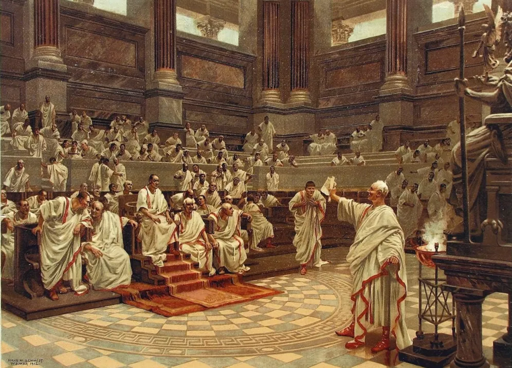

在古罗马共和国时期，罗马元老院中的威望和权力最大的议员被称为**princeps senatus**（首席议员），简称为**princeps**。首席议员享有众多特权，如召集和解散会议、确定议程、决定议事规则等。

凯撒大帝遇刺身亡后，其继承人屋大维上台。为了掌控元老院，屋大维想办法长期霸占了princeps（首席议员）这个职务，使其变成了自己的一个固定头衔，通常译为“第一公民”或“元首”。

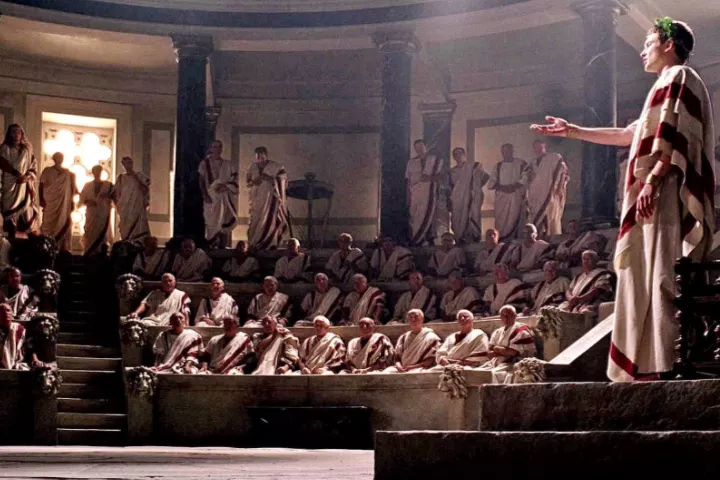

屋大维死后，他的继承者也都继承了princeps头衔，这种执政制度称为“元首制”，也就是皇帝和元老院合作，一起治理国家。

元首制持续了300多年。直到罗马皇帝戴克里先执政时，无需元老院背书的“皇帝敕令”已成了帝国行政的方式，元老院退化成了皇帝的“咨询机构”，元首制宣告结束，罗马正式进入了君主制时期。

#### prince的三种称谓

英语单词prince就来自拉丁语princeps（元首），为什么拼写不一样呢？因为在途经古法语时发生了音变，末尾的辅音[p]脱落了，导致拼写变成了prince。

在中世纪欧洲封建制度中，prince这个封号的使用者主要有三种情况：

1. 贵族，其爵位比公爵（duke）要低。

2. 小国家的君主，通常从属于某个皇帝或国王。

3. 国王的男性近亲，相当于我国的“王爷”。

比如，威尔士的君主头衔就是Prince of Wales（威尔士亲王）。13世纪末，英格兰国王征服威尔士后，立自己尚在襁褓中的儿子为威尔士的君主。这种做法后来成为惯例，英国国王的儿子通常都会获得prince（王子）的封号，而其中获得Prince of Wales（威尔士亲王）封号的就是王位继承人。

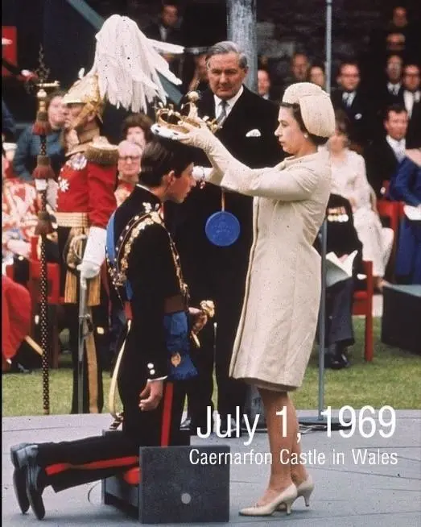

#### principal (形容词)

和prince同源的还有principal，字面意思就是“第一的，排在最前面的”，用作形容词时表示“首要的，最重要的”，比如the country’s principal cities（这个国家的主要城市）。在金融领域中，principal表示“本金的”，比如the principal amount of your investment（你投资的本金额）。

#### principal(名词)

principal还可以转作名词，表示某个机构的负责人或团队中的首领，比如学校的校长、戏剧中的主角、乐队中的首席演奏者等等，在金融领域中还可以表示“本金“。

#### Principle

和prince同源的还有单词principle，它是一个名词，字面意思就是“放在最前面的事物”，可以表示事物的***本原、起源***，比如：

- The first principle of all things is water. 水是万物之本。

它还可以表示***原理***，比如：

- These machines all operate on the same principle. 这些机器的工作原理都一样。

它还可以表示***原则***，比如：

- It is a matter of principle. 这是一个原则问题。

#### -m后缀：最高级形式

最后补充一下，词根**`prin-`**/**`prim-`**（第一，首）其实就等于前缀**`pre-`**（前面）加上最高级形式**`-m`**，字面意思就是“最前面的”。

由它派生出的常见单词还有**prime**（首要的，主要的）、**primary**（初级的，基本的，首要的）等。

#### 相关单词

- 词根**prin-/prim-**（第一，首）
- **prince**：[prɪns] 
  - n.王子，亲王，
  - （小国）君主，
  - 贵族
- **principal**：[ˈprɪnsəpl] 
  - adj. 最重要的，首要的；本金的
  - n. 校长，院长；主要演员，首席演奏者；
  - 本金
- **principle**：[ˈprɪnsəpl] 
  - n.本原，起源；
  - 原理，法则，原则；
  - 信条，观念
- **prime**：[praɪm] adj. 主要的，首要的，一流的
- **primary**：[ˈpraɪməri] 
  - adj.最初的，最早的；
  - 初级的，基本的；
  - 首要的，最重要的

#### Referece

1. [词源趣谈 | 贵为prince（王子、亲王），其实原来仅仅是“第一公民”](https://mp.weixin.qq.com/s/uH2lkd8MqS2WXdRbbw-FdQ)

### [Minister](https://mp.weixin.qq.com/s/YqjWyrjx1h9L0b62NYp6rg) (大臣、部长)

在中国历史上，再大的官见了皇帝也得自称“奴才”、“小的”。西方也一样，大臣在国王面前自称**minister**，字面意思就是“小人、奴仆”。

**prime minister**就是首相、主要的大臣。后来英国实行了君主立宪制，国王的大臣变成了政府的部长，但**minister**的称呼并没有变化，只是一般翻译为“部长”而不再是“大臣”。

**minister**可以分解为两部分:

- 前面的**minis**表示“小”，和单词minus（减去，负的）、minor（较小的、次要的）同源
- 后面的-ter是个比较级后缀。

合起来整个单词的字面意思就是“较小的人，地位较低的人”，引申为“奴仆”。

在英语中，**minister**原本表示:

- 牧师（上帝的奴仆）
- 大臣（国王的奴仆）。

**minister**派生出单词**ministry**：

- 前面的**`ministr-`**等于**minister**，
- 后面附加了一个抽象名词后缀-y。

**ministry**原本是一个抽象名词，表示“*牧师或部长的身份和职责*”，后来转用做**具体名词**，***表示部长履行职责的场所和机构***，也就是政府下面的一个部，比如**the ministry of education**（教育部）。

单词**administrate**也来自**`minister`**:

- 前缀**`ad-`**表示“去、趋近”，
- 中间的**`ministr-`**等于**minister**，
- 末尾的**`-ate`**来自***拉丁语动词的过去分词后缀***，在此用作**动词后缀**。

整个单词的字面意思就是“*去当大臣、去辅助国王*”，***引申为“管理、行政”***。

它还派生出名词**administration**（管理、行政、行政机构）和**administrator**（管理员、行政人员）。

------------------------

- **minus**：[ˈmaɪnəs] adj.负的，零下的，稍差的prep.减去，零下n.减号，负号；不足
- **minor**：[ˈmaɪnə(r)] adj.较小的，未成年的，次要的，小调的n.未成年人，小调，辅修科目
- **minister**：[ˈmɪnɪstə(r)] n.部长，大臣，牧师vi.执行牧师职务，照料，伺候
- **ministry**：[ˈmɪnɪstri] n.（政府）部门；牧师职务和任期
- **administrate**：[ədˈmɪnɪstreɪt] vt.管理，行政，经营
- **administration**：[ədˌmɪnɪˈstreɪʃn] n.管理，行政，行政机构，经营
- **administrator**：[ədˈmɪnɪstreɪtə(r)] n.管理员，行政人员

Reference: [词源趣谈：再大的minister（大臣、部长），其实也只是一个小“奴仆”。--钱磊博士](https://mp.weixin.qq.com/s/YqjWyrjx1h9L0b62NYp6rg)

### minstrel（吟游诗人）：流落民间的宫廷歌手

英语单词**minstrel**常用来表示“吟游诗人”，然而，从词源上看，它原本指的是国王或贵族家中的歌手。单词**minstrel**源自拉丁语***ministralis***，与**minister**（大臣、部长）、**ministry**（部门）同源，含有“家臣、奴仆”之意，指的是宫廷里或王公贵族家中的歌手，他们并非科班出身，只是由于有一定的文艺才能而被主人看中，专门负责唱歌吟诗，为主人及客人提供娱乐，地位与弄臣相仿。

后来，越来越多科班出身的音乐人开始得到王公贵族的青睐，那些半路出家的minstrel在宫廷里越来越不吃香，只好流落至民间，靠街头卖艺为生，变成了流浪歌手或吟游诗人。

在英语中，**minstrel**一词在16世纪之前指的都是宫廷里或贵族家中负责娱乐的歌手、说书人、杂耍艺人、小丑等。直到18世纪该词的词义才开始缩小，专指中世纪的吟游诗人或流浪歌手。

- minstrel：['mɪnstr(ə)l] n.（中世纪）吟游诗人，歌手，艺人

**troubadour** 【ˈtruːbədɔːr】游吟诗人(因11–13世纪法国的巡回表演者而得名) 

来自法语 troubadour,法国南部等地的游吟诗人，来自普罗旺斯方言 trobar,找到，发明，创作诗歌，来自通俗拉丁语*tropare,找到，创作诗歌，来自拉丁语 tropus,诗，歌，尤指带有比喻性质的诗歌，词源同 trope.

### Silhouette /sɪlu'et/

**silhouette** - 18世纪中期有位法国作家，名叫**Étienne de Silhouette (1709-1767)**，他借助贵妇人**Madame de Pompadour**的影响于1759年当上了路易十五的财政大臣。他一上任便提出对贵族的房地产征收土地税，并实施财政紧缩政策，招致贵族的强烈反对，因而任职不到一年便遭罢免。

18世纪下半叶至19世纪初是剪影的黄金时代，当时剪影在巴黎也十分流行，**Silhouette**业余爱好剪影。剪影是一种最简单的艺术形式，而**Silhouette**曾试图以最简单的方式来改变法国的财政状况。有人便把此一廉价艺术品叫做**portrait la silhouette**，随后索性以silhouette简称之，意在揶揄嘲讽**Silhouette**短暂的政治生涯，奚落其小小剪影终不成巨画。

殊不知他的大名却从此载入辞书，不仅在法语中占了一席之地，而且还进入了英语词汇行列。二百余年来，其拼写形式一直保持稳定，词义也无甚变化，至今仍然指“剪影”，有时也指“黑色轮廓像”或“侧面影像”。作动词用时，表示“衬托出……的轮廓”。

例:

- Her silhouette appeared on the curtain. 窗帘上映出她的侧影。

- She stood in front of the window, silhouetted against the dawn sky. 她站在窗前，黎明的天空衬托出她的轮廓。

- The trees on the top of the hill were silhouetted against the setting sun. 落日衬托出山顶上树木的轮廓。

- A silhouette of a deer on a road sign warns drivers that there may be wild animals on the road. 路标上鹿的剪影警告司机，野生动物可能会跑到路上来。

---------------------------------

**silhouette**（剪影）：厉行节俭的法国财务大臣西卢埃特。

英语单词silhouette（剪影）来自18世纪法国财务大臣**Etienne de Silhouette**的名字。在他担任财务大臣时，法国因为“七年战争”而陷入财务危机。他上任后厉行节俭政策，禁止铺张奢华，因此遭到很多人尤其是有钱人的憎恶。为了嘲笑他，人们把他的名字当成了各种便宜货的代名词。当时在法国出现了一种便宜的肖像方法，即在纸上剪出人物的外部轮廓。与常规的肖像画相比，这种剪影方式非常便宜。人们便沿用一贯的恶搞，将其称呼为silhouette。没想到后来这个词竟然长盛不衰，成为了对“剪影”的正式称呼。

- silhouette：[,sɪlʊ'et] n.剪影，轮廓

### Patron （主顾）：掏钱资助艺术家的贵族

**`patr-`** = father, 表示“父亲，祖国”。源自拉丁语 pater (属格 patris) "father.".

**`-on`** 表名词，指人，物和一些物理学上的名词。
在古代，艺术家的日子不好过。因为艺术品既不能拿来充饥，又不能拿来保暖，所以不能像普通商品那样能给艺术家带来稳定的收入。艺术家的收入主要来自上流人士的资助。那些达官贵人欣赏某位艺术家的才华，就会花大价钱购买他的作品。这种购买艺术家的作品、资助艺术家的人就被称为**patron**（赞助人、保护人）。这个单词来自拉丁语***patronus***（守护神、保护人），词根是**`pater-`**（father，父亲）。英语单词**`patrician`**（贵族）与此同源。

对于艺术家来说，这些人绝不仅仅是买家，而是他们的恩人和庇护人，故称之为**patron**。例如文艺复兴时期的意大利，在二百年的文艺复兴鼎盛时期，美第奇家族([The Medici Family](https://www.history.com/topics/renaissance/medici-family))是许多艺术大师们的**patron**。罗马和佛罗伦萨的许多名垂青史的建筑，雕塑，绘画和壁画，都是在美第奇家族的资助下，由波提切利，达芬奇，米开郎基罗，拉斐尔等艺术大师完成，因而创造了辉煌灿烂的文艺复兴文化。

在现代，**patron**一词的含义已经泛化，可以表示各种行业的大主顾，但依然含有“赞助、庇护”的含义，因此一般指的是那种经常惠顾的老主顾，而不是一般的顾客（**customer**）。

- patron：['peɪtr(ə)n] n.主顾、赞助人、庇护人
- patroness：[,petrən'ɛs] n. 女主顾；女资助人；女保护人
- patronage：['pætrənɪdʒ] n. 赞助；光顾；任免权
- patronize：[ˈpætrəˌnaɪz] vt. 以高人一等的态度对待；经常光顾，惠顾；资助；保护

### meritocracy  精英领导体制

> meritocracy【ˌmerɪˈtɑːkrəsi】

**`merit`**  n. 优点, 价值; 功绩; 良好 v. 值得, 应得, 应受到。

**`cracy-`** = rule, ruler, 表示“统治或政体，统治者”，最初含义表示“力量”。也引申为“支持者，参加者”等。源自希腊语 kratos "strength, might, power."

- meritocracy: n, 精英领导阶级
- meritocratic: adj.  评功论赏的，任人唯才的，以功绩定地位的；

### Prima nocta 首席夜行(初夜)权

 

[**Prima nocta**](http://noitsnotok.org/not-ok/prima-nocta-anyone/) (also known as “the right of the lord” or “the right of the first night”) refers to **a supposed medieval European legal right of lords to have sex with the newly married wife of another man on the night of their wedding**.

Ahh, it’s good to be king. Or Tony Stark. One can only imagine the reasons why he would reinstate such a misogynistic law.

So – does ignorance prevent this from being an example of normalized misogyny? Nope. As in most situations, **ignorance is no excuse, and if you didn’t know when what prima nocta meant, you do now**.

> ## "Prima nocta" is the historical (and [probably mostly symbolic](http://www.snopes.com/weddings/customs/droit.asp)) right of a lord to insist on sex with any bride under his rule on her wedding night. It played a major part in *Braveheart*.

**misogyny 【mɪˈsɑdʒəni】** 

n. 厌恶女人；厌女症[癖]  Misogyny is a strong dislike of women.
**`miso-`**坏的，错的，不好的 + -**`gyny`**, 妇女

 

**Reference:**

1. [There's A Weird, Old-Timey Rape Joke In "Avengers: Age Of Ultron"](https://www.buzzfeed.com/alisonwillmore/theres-a-weird-old-timey-rape-joke-in-avengers-age-of-ultron)

2. [为什么我们见到的英国人几乎都是英格兰人，很少见到苏格兰人和威尔士人？](https://zhuanlan.zhihu.com/p/141276681)

   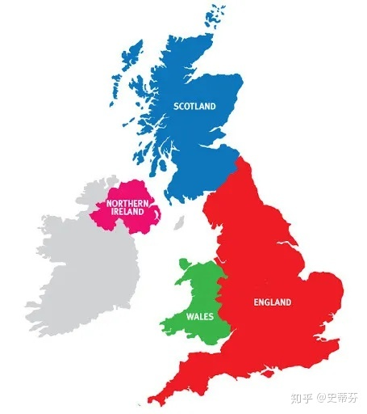

### Parliament v.s Congress

#### Parliament：起源于英国

在英语中，表示一个国家的最高立法机构的常见单词是parliament，一般翻译为”议会“。这个单词来自拉丁语，前面的parlia-等于parley（会谈，谈判），后面加了一个抽象名词后缀-ment。整个单词的字面意思就是“会议、会谈”。

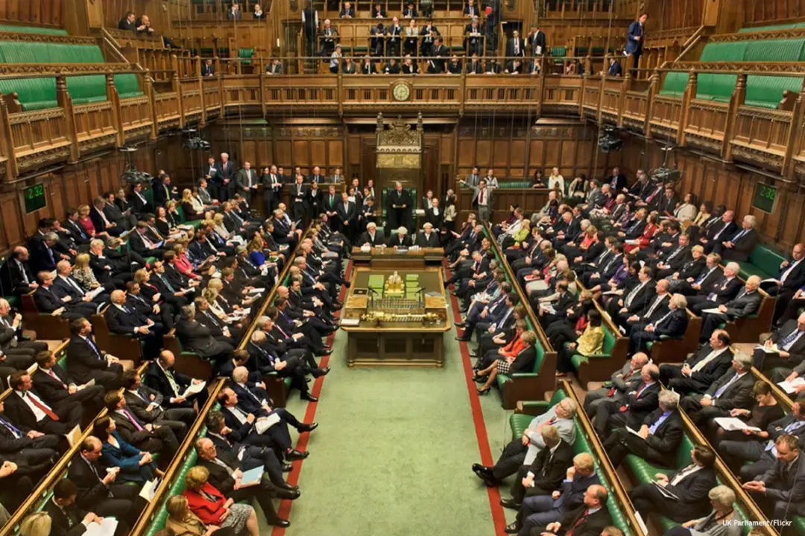

议会（**parliament**）最早诞生于英国。英国议会渊源于古代的贤人会议，后来发展为大会议，1265年召开的西蒙议会是英国议会的萌芽，而1295年召开的模范议会则被认为是英国议会诞生的标志。

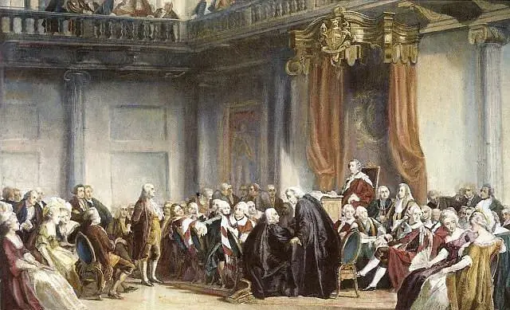

#### Congress: 起源于美国

英国议会迄今已有700多年的历史，被称为“议会之母”。其他西方国家的议会也一般叫作parliament，唯独有一个国家例外，这个国家就是美国。美国的议会叫作**congress**，常常翻译为“国会”。为什么叫法不一样呢？这是由它独特的历史造成的。

18世纪70年代，英国在北美的13个殖民地为了反抗英国的压榨，决定联合起来开展斗争。弗吉尼亚和马萨诸塞这两个殖民地的议会先后通过决议，决定召开北美殖民地的代表大会，称为Continental Congress of the United Colonies，这就是历史上著名的“大陆会议”。

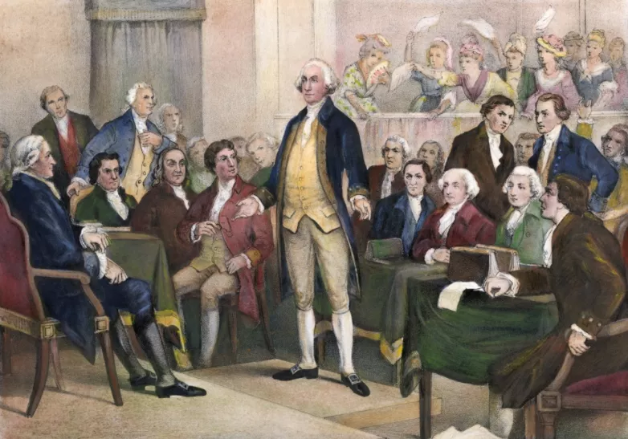

单词congress来自拉丁语，由常见前缀con（全部，一起）和动词词根grad-（迈步、行走）的过去分词形式gress-组成，字面意思就是“大家走到一起来”，也就是“集会、会议”。

1774年，第一届大陆会议在费城召开，除佐治亚缺席外，其他12个殖民地的55名代表都参加了会议。在大陆会议的统一指挥下，北美各殖民地联合起来，开展了反抗英国、争取独立的革命运动。在革命运动中，大陆会议成为了协调各殖民地行动的最高政治机构，扮演了临时政府的角色。

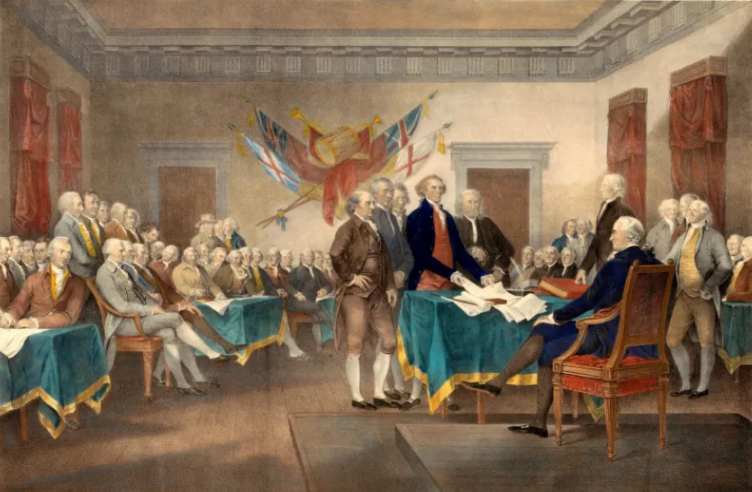

美国独立后，成立了联邦政府，大陆会议（Continental Congress）就演变成了现在的美国国会（Congress of the United States）。这就是美国国会不是parliament而是congress的原因。

美国国会的男议员叫做congressman，女议员叫做congresswoman。这两个单词一般指的是众议院（House of Representatives）的议员，因为参议院（Senate）的议员有另一个名称，叫做senator（参议员）。

#### 相关单词

- **parliament**：[ˈpɑːləmənt] n.议会，国会，英国议会
- **parley**：[ˈpɑːli] n.v.会谈，谈判
- **congress**：[ˈkɒŋɡres] n.国会，议会，国民大会，美国国会
- **congressman**：[ˈkɒŋɡrəsmən] n.美国国会男议员，众议院男议员
- **congresswoman**：[ˈkɒŋɡrəswʊmən] n.美国国会女议员，众议院女议员
- **senate**：[ˈsenət] n.美国参议院，古罗马元老院
- **senator**：[ˈsenətə(r)] n.美国参议员，古罗马元老院议员

#### Senate 参议院

senate - 今天某些西方国家的参议院乃起源于古罗马的元老院。

元老院在拉丁语作***senātus***。senātus是从senex 'old (man)'派生的，故含有“老人班子”（council of elders）之意。事实也如此，因为在古罗马只有老人才被认为是真正的贤哲。无怪乎汉语译之为“元老院”。

英语的senate就是源自拉丁文senātus的，于13世纪进入英语。它既指“元老院”，也指“参议院”。不同的只是今日之senate不尽由老人组成，senator（参议员）未必都是老的了，按美国宪法，年满30岁便可竞选参议员了。

senate有时也指某些大学里由教授组成的“评议会”或“理事会”。

除了**senator**，英语还有几个词，如**senior**（年长的），**senile**（因年老而糊涂的），**senescent**（变老的）等也源自拉丁语***senex***。

例　

- The United States Senate has 100 senators, two from each state. (NED) 美国参议院有100名参议员，每个州2名。
- One term in the United States Senate lasts six years. (NED) 美国参议院的任期为六年。
- The Senate is/are debating the issue next week. (CID) 参议院下周将辩论这个问题。
- The faculty senate voted to punish the students caught cheating. (NED) 教员评议会投票决定处罚作弊的学生。

**senate（参议院）：古罗马的元老院**

在古罗马的酋长制时代，为了辅助酋长治理国家，由氏族长老会议演变产生了“元老院”。所谓“元老院”，就是由组成国家的各个部落中的长老们构成的政治机构，是存续时间最长的古罗马国家机构。

古罗马共和国时代，元老院由前任国家长官和其他贵族代表组成，共300名，拥有立法权，掌管财政和外交，统辖行省，主持重大宗教活动。

在共和国的最后几十年里，由于议员腐败、自身改革失败及贵族议员对平民的排斥，元老院的威望降低。由于军阀崛起，元老院的权力被消弱。

后来，恺撒大帝把元老院的员额增加到900。罗马帝国时代，国家权力被逐渐地转移到皇帝的名下。元老院实权日趋缩小，但仍是贵族统治的重要支柱。

在英语中，古罗马的“元老院”就叫做**senate**，源自拉丁语***senatus***，字面意思就是“***council of elders***”（长老们组成的委员会），源自拉丁语***senex***（老人、长老）。

英国议会中的“**上院**”和美国国会中的“参议院”其实都源自古罗马的“元老院”，所以它们也都叫做**senate**。senate里面的成员就叫做senator（参议员）。

- **senate**：['senɪt] n.（古罗马）元老院，英国议会上院，美国国会参议院
- **senator**：['senətə] n.参议员，元老
- **senile**：['sinaɪl] adj. 高龄的；老衰的；高龄所致的
- **senior**：['sinɪɚ] 
  - adj. 高级的；年长的；地位较高的；年资较深的，资格较老的
  - n. 上司；较年长者；毕业班学生

### beggar 乞丐

**beggar** - beg（乞讨）由beggar（乞丐）逆生而来，许多关于英语构词法的书都谈及这一点，可是beggar的由来却鲜为人知。

公元12世纪，列日（Liège，今比利时东部城市）有一个天主教神父，因其口吃，人称Lambert le Begue，意即Lambert the Stammerer（结巴Lambert）。他在荷兰和比利时创建了一个名为Beguine的半世俗女修道会（the Beguine Sisterhood），其成员称为Beguine，可以结婚，也可重返世俗。她们在低地国家和德国、法国、瑞士及意大利等国曾经活跃一时。

随后在荷兰、比利时等低地国家又相继出现了若干个性质类似的宗教团体——修道兄弟会（monastic fraternities），其成员无须立誓，故亦可随意返俗，还可拥有私人财产。人们根据Lambert le Begue的大名称之为Beghard。他们中有不少人是靠施舍物或救济金为生的，

另有一些小偷、乞丐常常冒称Beghard四处行乞，因此Beghard名声不佳。古法语中有个意指“乞丐”的词begard便是据Beghard产生的，嗣后英语借用了该词，作beggar。因此，一般认为beggar来源于Beghard。（参见panhandle）

例　

- Beggars can't be choosers. 要饭的哪能挑肥拣瘦。
- He tossed the beggar a coin. 他丢了一枚硬币给乞丐。
- A street beggar held out his hand asking for a coin. (FWF) 一个街头叫化子伸手要钱。

**beggar（乞丐）：中世纪的半世俗宗教团体贝格德**

英语中表示乞讨的单词是beg，那么，表示“乞丐”的单词是什么呢？很多人以为是begger，其实应该是**beggar**。为什么是beggar而不是begger呢？原来，英语单词beggar并不是由beg衍生的，恰恰相反，**单词beg才是由beggar反向衍生的**。

单词**beggar**源自中世纪时期流行于北欧低地国家如荷兰、比利时的一个半世俗宗教团体贝格德Beghard。他们由男性基督教徒构成，是介于僧侣和世俗信徒之间的一种修行团体。他们放弃私人财产，群居在修道院中，但可以随时还俗。

Beghard的成员在古法语单词被称作begart。他们很多人就像中国的僧尼那样到处托钵化缘为生，很多真正的乞丐也会冒充begart。久而久之，人们就把begart和乞丐划上了等号。英语单词beggar就来源于古法语begart，已经丧失了初始含义，变成了“乞丐”的意思。

- beggar： ['begə] n.乞丐，乞讨者
- beg： [beg] v.乞求，乞讨
- beggary： ['bɛgɚri] n. 赤贫；卑劣；行乞

> **beggars can't be choosers**要饭的哪能挑肥拣瘦。饿昏了的你要求别人给你些吃的，人家好心给你俩馒头，你还嫌弃不是驴肉火烧。概括起来，受人恩惠是“是”或“否”即yes or no的问题，而不是多和少或好和坏的问题。I don't care much for the Christmas present, for beggars can't be choosers. 

### infantry（步兵）：中年轻王子所率领的年轻士兵

> in∙fant  [词根树]
> **fam-,fan-,fat-,fess-** 
> = speak, 表示“说、预言”，fat- 由“预言”引申为“命运”。
>
> **in-** 
> 表示“无，没有（not,opposite）”，

英语单词**infantry**（步兵）与**infant**（婴儿）的拼写非常接近，它们之间有何关系呢？

原来，它们都来自拉丁语***infantem***，而***infantem***是***infans***的名词。**infans**由**`in`**（不）+**`fans`**（说话）组成，意思是不能说话，所以***infantem***原本指的是还不会说话的婴儿，但后来可以表示各种年龄段的小孩子。

infant（婴儿）直接来自infantem，而infantry（步兵）来自infantem所衍生的西班牙语infante（王子）和infanteria（步兵）。

西班牙语infante（王子）来自拉丁语infantem，字面意思就是“（国王的）孩子”。这些王子在年轻时常常被送入军营接受锻炼。在军营中，这些年轻王子所率领的部队就叫做infanteria，通常是和王子年龄相仿的年轻人。

由于这些人资历尚浅，一般没有取得骑士称号，因此通常都是步行训练和作战，所以infanteria一词就有了“步兵”的含义。

该词进入法语后拼写变为***infantrie***，进入英语拼写演变为**infantry**。

- **infantry**：['ɪnf(ə)ntrɪ] n.步兵，步兵团
- **infant**： ['ɪnf(ə)nt]
  - n.婴儿，幼儿，未成年人
  - adj.婴幼的，幼稚的
- **infantile**：['ɪnfəntaɪl] 
  - adj. 婴儿的；幼稚的；
  - 初期的
- **infancy**：['ɪnfənsi] n. 初期；婴儿期；幼年

### snob（势利眼）：对平民大学生的蔑称

英语单词snob源自18世纪90年代时英国剑桥、牛津等大学的俚语，用来表示“平民、俗人”。据说当时在英国剑桥和牛津大学，在学生名册上，在贵族学生的姓名后面标注上拉丁语nobilitate（nobility，贵族），在平民学生的姓名后面标注上sine nobilitate（non nobility，非贵族）。

因此，贵族学生就用snob来称呼平民学生。当时能上牛津、剑桥等大学的平民子弟通常出身于富裕家庭，其中有不少人羡慕贵族和上流社会，鄙视其他平民，趋势附炎，冒充贵族四处显摆，令真正的贵族学生十分瞧不起，因此snob一词就逐渐衍生出“自命不凡者、趋势附炎者、势利眼”等负面含义。

- **snob**：[snɒb] n. 自命不凡者、趋势附炎者、势利眼

- **snobbery**：['snɒb(ə)rɪ] n.势利，谄上欺下，摆架子

- **snobby**：['snɔbi] adj.势利的

- **snobbish**：['snɒbɪʃ] adj.势利的

  > **snob** n. 势利小人; 自以为优越的人, 自命高雅的人
  > **`-ish`** 表形容词，“像…一样，有的…”，通常缀于名词或形容词后。

snob - 旧时在牛津、剑桥等英国大学的学生名册中，出身高贵的学生姓名后面标有NOB的字样，NOB是nobility（高贵的出身，贵族身份）一词的简略形式；出身平民的普通学生姓名则被标以s. nob.，这是拉丁语sine nobilitate 'without nobility'（无高贵出身）的缩略。

据认为，英语snob一词可能即由此而来，因此最初含有低贱者或平民之意。长期以来剑桥师生曾一直用该词来指“市民”（townsman），以别于“穿长袍的大学师生”（gownsman）。

snob的今义据说是英国小说家萨克雷（William Makepeace Thackeray, 1811-1863）最先使用的。1847年他出版了著名散文集《势利人脸谱》（Book of Snobs），这是由45个特写组成的英国社会各阶层势利人的肖像。他把英王乔治四世（George IV, 1762-1830）也称作snob，因为他以“欧洲第一绅士”自诩，但身上却丝毫没有绅士的特征。

经萨克雷这么一用，snob成了一个常用词，现通常多指“势利的人”、“自以为懂行的人”或“自命不凡的人”。intellectual snob是“自以为很有学识的人”，academic snob是“自封为学者的人”，music snob指“自以为懂音乐的人”，wine snob指“自命不凡、非上等酒不喝的人”，而snob appeal/value则是“对势利顾客的吸引力（价值）”。

- He's too much of a snob to mix with that earthy crowd. (FWF) 他这个人势利透顶，不屑与那些粗人为伍。
- A Rolls-Royce has snob appeal. (LDC) 劳斯莱斯汽车对势利顾客是有吸引力的。
- John is a snob who acts as though he is better than we are. (NED) 约翰是个自命不凡的人，好像比我们都高明似的。

### frank（直率的）：性情直率的法兰克人

法兰克人（Frank）是欧洲民族大迁徙时期入侵罗马帝国的日耳曼民族的一支，因为最初居住在莱因河北部法兰西亚（Francia）地区而得名。他们建立了中世纪初期欧洲最大的基督教王国，其领土涵盖了当今的法国和德国。法国的国名France也是源自Frank。

法兰克人性格粗犷豪放，对人坦诚，说话直言不讳。十字军第一次东征时，当时的东罗马皇帝的女儿在其著作《亚历克西亚德》就描写了一位法兰克贵族。当时，在朝见东罗马皇帝时，所有的十字军贵族都站着，只有一名法兰克贵族大大咧咧地坐在一把椅子上。带队的国王赶紧让他站起来，他还嘟囔着为啥皇帝一个人坐着。皇帝后来问他的家乡和出身，他毫不谦虚地说自己是法兰克人，出身贵族，还说自己在老家从未遇到敢向他挑战的人。正因为法兰克人这种鲜明的个性，英语单词frank逐渐衍生了“直率的、坦白的”的意思。

- **frank**： [fræŋk]adj.坦白的，直率的，老实的
- **frankly**：['fræŋkli] adv. 真诚地，坦白地
- **Frankish**：['fræŋkiʃ] 
  - adj. 法兰克人的；法兰克语的
  - n. 法兰克语
- **France**：[frɑːns] n. 法国，法兰西

## References 

1. [Peerage of England](https://en.wikipedia.org/wiki/Peerage_of_England) 

