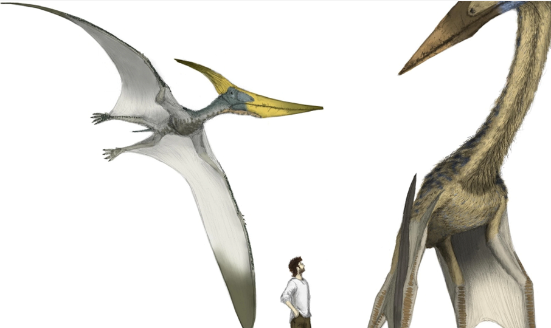
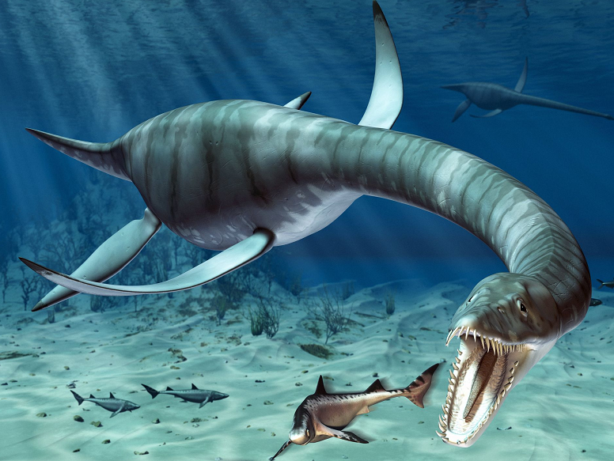
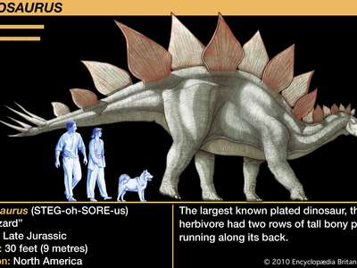
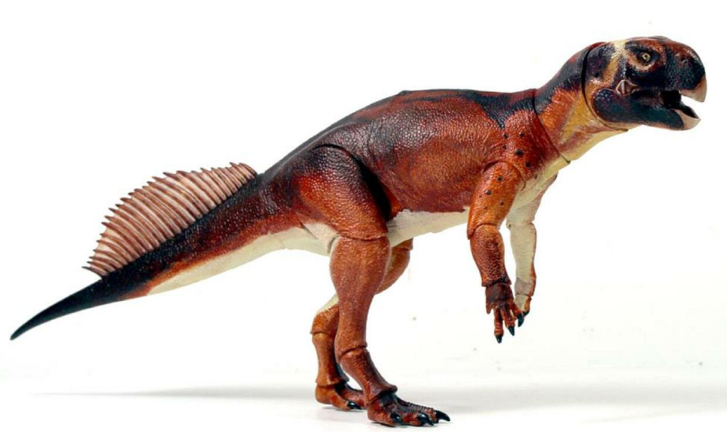
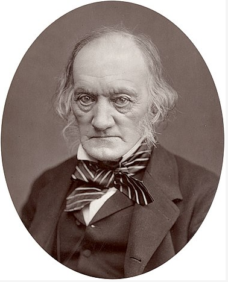
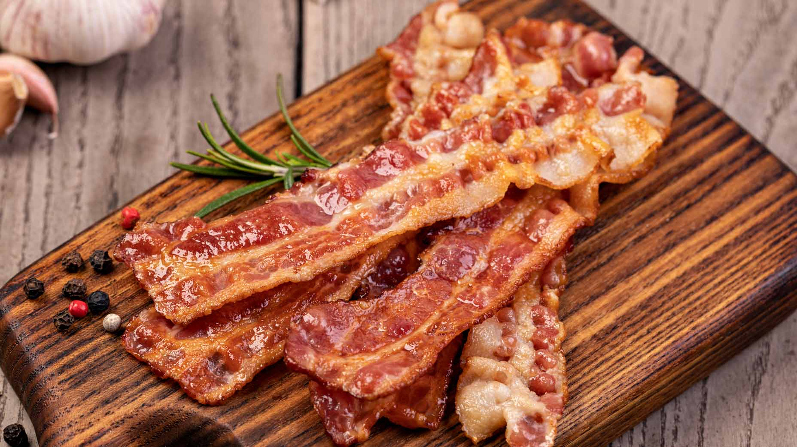
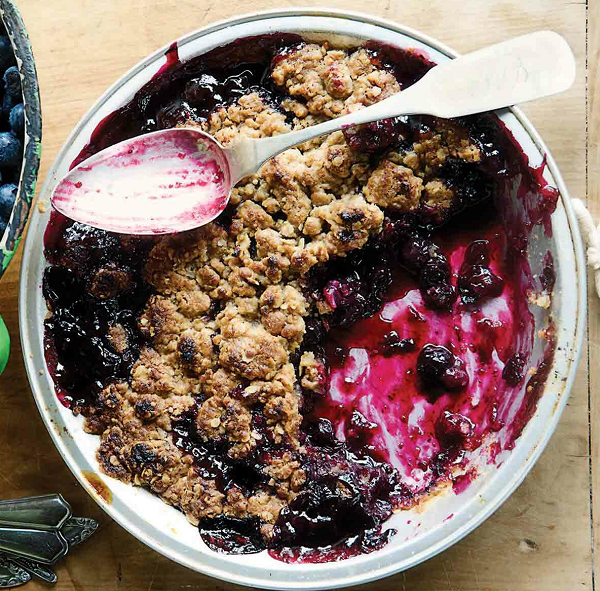
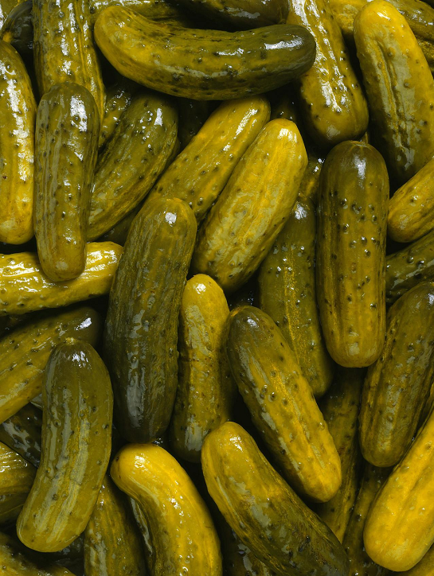

# 咬文嚼字-学科相关-Animal

@(TOEFL)[托福, TOEFL, 词根词缀,咬文爵字,学科相关]

[toc]

## - saur = lizard, 表示“蜥蜴”。{12}
| 单词                                                         | 解释                                                         | 单词                                                    | 解释                                                         |
| ------------------------------------------------------------ | ------------------------------------------------------------ | ------------------------------------------------------- | ------------------------------------------------------------ |
| **saur-ian** 【ˈsɔːriən】                               |                                                              | **dino-saur** 【ˈdaɪnəsɔːr】                       |                                                              |
| **bronto-saur-us** 【ˌbrɑːntəˈsɔːrəs】                  | bronto-  = thunder, 表示“雷”。源自希腊语 bronte "thunder." 雷龙;原始的雷龙;雷龙属  | **ichthyo-saur** 【ɪkθɪəsɔ:ə】                     | **`ichthyo-`**  = fish, 表示“鱼”。源自希腊语 ikhthus "fish." （古生）鱼龙  |
| **megalo-saur-us** 【ˌmeɡələˈsɔːrəs】                   | 巨蜥，巨齿龙(最早得到科学研究的恐龙之一)  | **ptero-saur** 【ˈterəˌsɔr】                       | 翼龙  |
| **plesio-saur** 【plisɪrsɔ】                            | 蛇颈龙;蛇颈龙类  | **plesio-saur-us** 【ˌplisɪəˈsɔrəs】               | 蛇颈龙;蛇颈龙属;中生代十分繁盛的蛇颈蜥属;蛇颈龙类            |
| **stego-saur-us** 【ˌsteɡə'sɔrəs】                      | 剑龙  | **tyranno-saur-us** 【tɪˌrænə'sɔrəs】              | 暴龙  |
| **ankylo-saur**                            【ˈæŋkɪləsɔːr】 | **`ankylo-`**  表示“弯曲、僵硬、粘连”。源自希腊语 ankulos "crooked, bent." 甲龙(食草恐龙，全身披甲)  | **psitaco-saurus**          【psit·ta·co·sau·rus】 | **`psittaco-`**  = parrot, 表示“鹦鹉”。源自希腊语 psittakos "a parrot." 鹦鹉嘴龙  |

### Dinosaure(恐龙)：令人恐怖的蜥蜴

恐龙（**dinosaur**）这名字最早为英国古生物学家欧文（[Sir Richard Owen](https://en.wikipedia.org/wiki/Richard_Owen), 1804-1892）在1842年创造，由希腊语**`deinos`**（恐怖的）和**`sauros`**（蜥蜴）组合而成，字面意思就是“令人恐怖的蜥蜴”。

恐龙和蜥蜴拥有相同的祖先，虽然表面上和蜥蜴相似，但实际上其生物结构却远比蜥蜴、蛇、龟等先进。

汉字“恐龙”是日本生物学家对dinosaur的翻译，后来被中国接受。实际上恐龙与中国的“龙”毫无相似之处。

- **dinosaur**：['daɪnəsɔː] n.恐龙，过时的人或事物

- **saurian**：['sɔrɪən] 

  - adj.蜥蜴的，蜥蜴类的
  - n.蜥蜴，蜥蜴类

- **tyrannosaurus**：[tɪˌrænə'sɔ:rəs] n. 暴龙，霸王龙

  > tyranno- 
  > = tyrant, 表示“暴君”。

- **brontosaurus**：[,brɑntə'sɔrəs] n. 雷龙

- A dinosaur's skeleton was displayed in the museum's main hall. (NED) 一具恐龙骨架陈列在博物馆的大厅。

- The old car was a gas-guzzling dinosaur and we had to get rid of it. (CAE) 这辆旧车是油老虎，我们不得不把它处理掉。

- The typewriter's a bit of a dinosaur (= very old-fashioned), isn't it? (CID) 这台打字机该进博物馆了，对不对？

## mammal ['mæm(ə)l] n.哺乳动物

> **mammal[ˈmæml]**
> mamm- 
> = breast, 表示“乳房”。源自拉丁语 mamma "breast."
>
> -al 
> 表名词，“人，物，状态”

这个单词是瑞典生物学家林奈根据拉丁单词mammalis（意思是of the breast，词根mamma-表示乳头，因为所有的雌性哺乳动物都用乳汁喂养幼崽）创造。林奈所处的时代，欧洲很多妇女习惯把婴儿交给奶妈喂养，导致婴儿死亡率奇高。林奈创造这个单词，同时也是在提倡母乳喂养。 

> **mamm∙ary  [ˈmæməri]**
> mamm- 
> = breast, 表示“乳房”。源自拉丁语 mamma "breast."
>
> -ary 
> 表形容词，“…的”。

### baby

mammal - baby一词来自babe，原为babe的指小词，一度指“玩具娃娃”。babe则是模仿婴儿哭声baba构成的儿语拟声词，中古英语作baban，曾作标准词用，意指“婴儿”，而今多见于诗歌语言，其原先地位已为后来者baby所取代。

在非正式用语中，babe常用以表示对妻子、丈夫、情人的昵称，相当于汉语“宝贝”。baby除指“婴儿”还可转义为“年纪最小的人”、“孩子气的人”等；作动词用时，则表示“把……当婴儿对待”。

出自婴儿叫声的拟声词还有mama/mamma，papa/poppa，babble（牙牙学语）等词。另有一词mammal（哺乳动物），若究其根源可以说亦属此类。mammal源于拉丁语mamma（乳房），而mamma乃是儿语拟声词。

例

- The baby girl is teething. 这女婴正在长牙。
- Both mother and baby are doing well. 母子均平安。
- She is expecting another baby next month. 下个月她又快生孩子了。
- Don't be such a baby — take your medicine! 别这么孩子气——把药吃下去！

## Cow v.s Beef / Sheep v.s Mutton

在英语中有一个有趣的现象，那就是对于猪、羊、牛等牲畜，表示动物的单词和表示其肉食的单词相差甚远，如pig（猪）和pork（猪肉）、sheep（绵羊）和mutton（羊肉）、cow（牛）和beef（牛肉）。这是为什么？

原来，在11世纪时，法国诺曼底公爵率军入侵英格兰，成为了英格兰的国王。从此以后，英格兰的统治阶层变成了说法语的法国贵族，他们在表示”猪肉”、“羊肉”、“牛肉”等食品时，使用的是高贵的法语。这些法语单词后来逐渐进入英语，变成对这些肉食的称呼。

而负责饲养牲畜的仆人一般是英国人，依然使用源自原始日耳曼语的古英语来称呼这些牲畜。久而久之，就造成了表示这些动物的英语单词和表示它们的肉的英语单词的不一致。

- **pig**：[pɪg] n.猪
- **pork**：[pɔːk] n.猪肉
- **sheep**：[ʃiːp] n.绵羊
- **mutton**：['mʌtn] n.羊肉
- **cow**：[kaʊ] n.牛
- **beef**：[biːf] n.牛肉

### bacon（培根）：常用于腌制的猪后臀肉

英语单词**bacon**指的是用盐、香料腌制或用烟熏制而成的猪肉，是西式猪肉制品三大品种（火腿、培根、灌肠）之一，其词源与单词**back**（背、后）相同，本意为“猪的背部、后部的肉”，从拼写上还能看出与back的联系。

该词在14世纪之前既可以指熏腌肉，也可以指新鲜肉。后来，由于人们常常用猪的背部和后部的肉来制作培根肉，所以**bacon**一词的词义缩小了，专指经过腌制或熏制而成的猪肉。

英国的两位大哲学家罗杰•培根和弗朗西斯•培根的老祖宗都是制作培根的，故以**Bacon**作为自己家族的姓氏。

- **bacon**：['beɪk(ə)n] n.培根肉，腌猪肉、熏猪肉
- **back**：[bæk] n. 后面；背部v. 支持；后退adv. 以前；向后地adj. 后面的；过去的

| 单词                         | 解释                                                         |
| ---------------------------- | ------------------------------------------------------------ |
| **lard** 【lɑːrd】      | n. 猪油 vt. 涂加猪油, 夹杂, 润色   - 来自拉丁语 lardum,猪油，熏肉。后仅指猪油。 |
| **crumb** 【krʌm】      | n. 碎屑, 面包屑; 少许 vt. 捏碎, 弄碎  来自古英语cruma, 面包屑，碎片。可能同crisp, 卷的， 脆的。  在IT界，尤其是网站设计里面，Crumb就是navigator导航栏。具体缘由参阅《Don't make me think》。 |
| **crumble** 【ˈkrʌmbl】 | crumb【面包屑】 + -le, 表反复。 v. （使）破碎, 成碎屑; 坍塌; 崩溃 n. 酥皮水果甜点   |

### pickle   泡菜, 腌菜; 盐卤汁; 困境; 讨厌鬼

> n. 泡菜, 腌菜; 盐卤汁; 困境; 讨厌鬼
> vt. 腌制; 酸洗

**pickle** - 一般辞书认为，**pickle**源自中世纪荷兰语***pekel***，但有一种说法认为，它源于14世纪一个名叫***William Beukel/Bukelz***的荷兰人的姓氏。此人乃渔民，据说他发明了腌菜和泡菜的制作方法，因此人们就用其姓氏Beukel来指腌汁、泡菜等，以后该词逐渐演变为pekel，英语作**pickle**。

例　

- Would you like a pickle with that sandwich? (FWF) 你的三明治要不要配泡菜？
- These cucumbers are just the right size for pickling. (CWR) 这些黄瓜拿来腌大小正合适。
- Lisa bought some pickles at the deli. (NED) 莉萨在熟食店买了点泡菜。

 save one's bacon

**save one's bacon**使自己(或某人)免遭死亡(或损伤，失败)；幸免于难。

**bacon**现在指猪背部和肋部的熏肉，可是在中世纪，**bacon**就象现在的单词**pork**一样，泛指猪身上所有位置的肉，所以这句习语中的**bacon**就相当于**body**，那习语的意思就好理解了。

- I saved my bacon by arriving just in time for the meeting. 

## Urchin [ˈɜːrtʃɪn] 海胆

n. 小脏孩;贫穷肮脏的儿童;流浪儿

1. a young child who is poor and dirty, often one who has no home
2. = sea urchin (海胆)

**urchin** 

操法语的诺曼人在1066年征服了英国，此后数百年来法语借用词源源不断地涌入英语之中，**urchin**即为其中之一。它是13世纪时进入的，在古法语的原词形为***herichon***，原指***hedgehog***（刺猬），英国人按其发音曾拼出各种不同的词形，最后定为**urchin**。

在英国民间故事中，刺猬被认为是喜欢恶作剧的小妖精的化身，它昼伏夜出，四处寻觅食物，常常趁人不备时作弄人。因此，原义为“刺猬”的**urchin**常喻指“小妖精”。

到了16世纪初**urchin**又进而转义为“小淘气”或“顽童”。今天，它的原始词义虽然已被废弃，但我们仍能从海胆的英语名称**sea urchin**找到它的痕迹。海胆壳上能活动的棘刺和刺猬身上的硬刺极为相似，所以海胆一度被称作**sea hedgehog**，后来才改称**sea urchin**。另外，法语hérisson和urchin同出一源，但该词至今仍指“刺猬”。

例　You little urchin! 你这个小淘气！

## [alligator/crocodile（鳄鱼）](https://mp.weixin.qq.com/s/O1_wRK1OZQeP0ICRN6KtXw)

### alligator [ˈælɪɡeɪtər]  

=> **[ˈæ-lɪ-ɡeɪ-tər]**

当西班牙殖民者初次踏上美洲大陆，遇到美洲特有的短吻鳄时，就用西班牙语称其为***el lagarto***（**the lizard**，蜥蜴）。后来英国殖民者沿用了西班牙人对其的称谓，在英语中将其称作***lagarto***。但在16世纪末期，有些人误将西班牙语中的定冠词**`el`**也看作该词的一部分，因此就从西班牙语**`el lagarto`**中产生了英语单词**alligator**。

### crocodile

> The difference between an alligator (left) and a crocodile (right).

英语中表示鳄鱼的还有一个单词**crocodile**。它来自希腊语。根据词源大师Frisk的解释，前面的**`croco`**表示卵石，后面的`dile`表示爬虫，合起来字面意思就是“卵石上的爬虫”。鳄鱼得此名号显然是因为它们喜欢在卵石上晒太阳的生活习性。这个单词首先出现于古希腊著名历史学家希罗多德的名著《历史》中，用来表示埃及尼罗河中的鳄鱼。

**alligator**和**crocodile**的区别是：

- **alligator**特指短吻鳄，比如，**American alligator**（美洲鳄）和**Chinese alligator**（中国的扬子鳄）。
- 单词**crocodile**泛指各种鳄鱼，是鳄鱼的统称。习语**crocodile tears**（鳄鱼的眼泪）常用来比喻坏人的假仁假义。

相关单词：

- **alligator**：['ælɪgeɪtə]  n.短吻鳄，美洲鳄

- **crocodile**：[ˈkrɒkədaɪl] n.鳄鱼

## Petrel, Parrort, Parakeet

### **Petrel** /ˈpetrəl/

海燕在觅食时，像小海鸥一样自水面飞掠而过，偶尔降落水面，在海员看来，宛如圣彼得（**St. Peter**）之行于革尼撒勒湖（**Lake of Gennesareth**，即加利利海Sea of Galilee）上（见《圣经·马太福音》14:29）。

因此，在意大利语中这种海鸟被称作**petrello**，意思是**Little Peter**（小彼得），英语名称**petrel**很可能即源于此，它原作pitteral/pittrel，法语名称pétrel则借自英语。

英国海盗、探险家丹皮尔（William Dampier, 1652-1715）在他所写的《新荷兰之行》（Voyage to New Holland）一书的第一部分有关于海燕的一段记述：

>  “As they fly...they pat the Water alternately with their Feet, as if they walk upon it; tho' still upon the Wing. (当它们飞翔时……它们用脚交替拍打水面，仿佛在水面上行走；虽然仍在飞翔。)
>
> And from hence the Seamen give them the name of Petrels, in allusion to St. Peter's walking upon the Lake of Gennesareth.”(因此，海员们给他们起了海燕的名字，意指圣彼得在根尼萨雷斯湖上行走。)

丹皮尔是将海燕的英语名称与圣彼得相联系的第一人，可是他把原拼法**pitteral**改作**Petrel**。

**petrel**常常被称作**stormy petrel**，因为海员迷信，海燕掠过海面预示暴风雨即将来临，而且他们观察到，即使在暴风雨中海燕也爱在海面上低飞，故在其名称前冠以**stormy**。海员还把**petrel**叫做***Mother Carey's chicken***，据认为Mother Carey乃拉丁文Mater cara 'dear Mother'（圣母玛利亚）的讹误拼法。按迷信说法，在海面低飞而过的海燕是圣母玛利亚所派，向海员预告暴风雨的来临。

- stormy：有暴风雨(或暴风雪)的;群情激愤的;激烈争吵的

### **petrify**　　

/ˈpetrɪfaɪ/　v. 把……吓呆；使惊呆

借自法语pétrifier，源自拉丁语petra 'stone'和facere 'to make'，故字面原义为“使变成石头”、“使石化”，今多用于喻义，表示“把……吓呆”或“使惊呆”，常用被动语态。（参见petrol）

eg:

- As soon as she got on stage she was petrified with fright. 她一登台就吓呆了。
- He had the gun pointed at my head. I was absolutely petrified. (LLA) 他用枪指着我的头。我完全吓呆了。
- I stood petrified as the dog came bounding up to me. 当那条狗朝我扑过来的时候，我吓得呆站在那里。

**Parrot**

n. 鹦鹉, 应声虫
vt. 学舌, 机械地模仿
【复数：parrots；过去分词：parroted；现在分词：parroting】
1 - 词源不详，可能来自法语方言 Pierre,人名 Peter 的法语形式。比较 parakeet,petrel.由于该鸟学人说话的习惯，也用于形容人鹦鹉学舌。

### Parakeet（虎皮鹦鹉）

**Common name**: [Parakeet](https://worldbirds.com/parakeet/), Budgerigar, Budgie 

