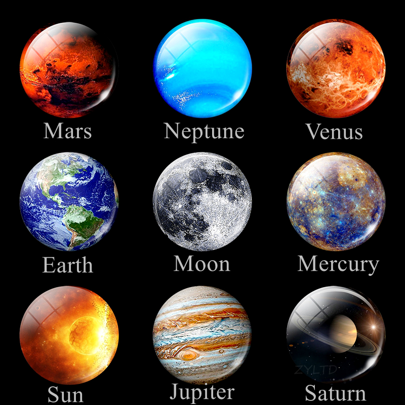

# 咬文嚼字-学科相关-Astronomy

@(TOEFL)[托福, TOEFL, 词根词缀,咬文爵字,学科相关]

[toc]

## Astronomy

###  **`astr-`** / `aster-`（星）

星空之神*阿斯特赖俄斯*。

希腊神话中，阿斯特赖俄斯（***Astraeus***）是十二泰坦神之一的克利俄斯与女海神欧律比亚的儿子。他掌管星辰，和黎明女神厄俄斯生下了四位风神和大量星辰之神。

阿斯特赖俄斯的名字***Astraeus***在希腊语中就是“***星辰”***之意，英语中表示“星星”的词根**`astr-`**就来源于此，变体为***aster-***。

- **`astr-/aster-`**：星星
- **astrology**： [ə'strɒlədʒɪ] n.占星术
- **astronomy**： [ə'strɒnəmɪ] n.天文学
- **astronaut**： ['æstrənɔːt] n.宇航员
- **asterisk**：['æstərɪsk] n.星号vt.用星号标识
- **astral**： ['æstrəl] adj. 星的；星际的
- **asteroid**：['æstərɔɪd] n. 小行星；海盘车；小游星adj. 星状的

 

#### astrology

**astrology** - 按古代占星术，通过星辰运行可以预卜人事的吉凶祸福。占星家认为人间面临灾难皆因星辰处于凶位或凶向所致。

**disaster**在16世纪始用于英语，它源自拉丁语，是由***dis- 'against'***和***astrum 'star'***两部分构成，其字面意义为“（星的）凶位”或“凶向”（**unfavourable aspect of a star**），其今义“灾难”、“祸患”则显然系由此引申而得。

英语复合词**ill-starred**（苦命的，倒霉的），**ill-boding**（凶兆的，不祥的）均与占星术有关，而英语里表示“占星术”的**astrology**一词亦源于同一拉丁词根***astrum***（星）。

> 例
>
> - The fire was the worst disaster ever to hit the town for decades. 这场火灾是该镇数十年来遭受过的最严重的灾难。
> - This is one of the worst natural disasters ever to befall the area. (CID) 这是该地区遭受过的最严重的自然灾害之一。
> - Natural disasters such as the drought two years ago have left the region devastated. (LLA) 自然灾害，如两年前的旱灾，使那个地区一片荒芜。
> - Their first date was a disaster. 他们的第一次约会就彻底失败了。

 

| 单词                                    | 解释                                                         | 单词 | 解释 |
| --------------------------------------- | ------------------------------------------------------------ | ---- | ---- |
| **Sirius** 【ˈsɪrɪəs】 天狼星 | the brightest star in the sky after the sun,  lying in the constellation Canis Major.  It is a binary star whose companion,  Sirius B, is a very faint white dwarf.  Distance: 8.6 light-years （它是一颗双星，其伴星天狼星B是一颗 非常微弱的白矮星。距离：8.6光年） |      |      |
|                                         |                                                              |      |      |
|                                         |                                                              |      |      |

### Mercury  水星 （神使墨丘利）

#### 神使

英语中，水星被称为**Mercury**。奇怪的是，表示水银的英文单词也是**mercury**。这是为什么呢？原来，这两个单词都源自古罗马神话中的神使**墨丘利（Mercury）**的名字。

墨丘利（***Mercury***）是古罗马神话中主神朱庇特的儿子，等同于古希腊神话的赫耳墨斯（***Hermes***），负责为众神传递信息。他的形象一般是头戴一顶插有双翅的帽子，脚穿飞行鞋，手握魔杖，行走如飞。

墨丘利（Mercury）是罗马神话中为众神传递信息的使者，等同于希腊神话的赫耳墨斯（hermes）。他是主神朱庇特的儿子，是商业、交通旅游和体育运动的神，还是小偷和骗子所崇拜的保护神。他的形象一般是头戴一顶插有双翅的帽子，脚穿飞行鞋，手握魔杖，行走如飞。

墨丘利机智狡猾，被视为欺骗之术的创造者。他还身怀偷窃之术，经常与众神开玩笑，偷走了朱庇特的权杖、尼普顿的三股叉、阿波罗的金箭和银弓、战神的宝剑。他还用乌龟壳、树枝和羊肠发明了竖琴（lyre）。

墨丘利刚出生没多久，就偷走了阿波罗的50头牛。农夫巴图斯目击了此事。墨丘利要巴图斯替他保守秘密，并答应给他好处。但巴图斯违背诺言，四处宣扬墨丘利偷牛的事。墨丘利一生气，就把巴图斯变成了石头。

阿波罗知道是墨丘利偷了牛，上门来索赔。墨丘利答应还牛，却在阿波罗牵牛时用竖琴奏出了美妙的音乐。阿波罗听得如痴如醉，竟然同意用牛群换取墨丘利的竖琴，还把自己的魔杖倒贴给他。所以墨丘利就成了小偷和商人的保护神，因为他偷了阿波罗的牛后又用竖琴与他交换。

墨丘利还利用自己高超的偷窃本领，帮了朱庇特很多忙。朱庇特曾被提丰打败并囚禁在山洞里，墨丘利将其偷出。墨丘利还用音乐和故事催眠看守白牛的百眼巨人，将其在睡梦中杀死。墨丘利还奉朱庇特之命，将襁褓中的酒神送到宁芙仙女那里抚养。

墨丘利是竖琴和牧笛的发明者，是各种竞技比赛的保护神。他行走敏捷，被看作行路者的保护神。

由于墨丘利行动敏捷，活性极大的金属元素水银和太阳系中公转速度最快的行星（水星）都用他的名字Mercury命名。由他的名字还产生了词根-merc-，表示“商业、商品”。

在拉丁语中，墨丘利被称为***Mercurius***，进入英语后改写***Mercury***。

前面的词根**`merc-`**表示“商业、贸易、交换”。常见单词**commerce**（商业）、**commercial**（商业的）就派生自这个词根。

#### 水星

水星是太阳系中离太阳最近、体积最小的行星。因为距离最近，受到太阳的引力也最大，因此它跑得比其他行星都要快。古希腊人用希腊神话中跑得最快的神使赫尔墨斯来命名水星，古罗马人则用古罗马神话中对应的神使墨丘利（**Mercury**）来命名。英国人沿用了古罗马人的做法，所以首字母大写的**Mercury**既表示古罗马神话中的神使墨丘利，又表示水星。

#### 水银

汞又叫水银，是古代西方人很早就认识的少数化学物质之一。如同中国文化中的金木水火土一样，古代西方人将最常见的七种物质与七大天体对应起来，如金对应太阳，银对应月亮，铁对应火星，铅对应土星，锡对应木星，铜对应金星，而活性最大，***常温下呈液态的金属汞则对应跑得最快的水星***。所以汞的英文名称与水星相同，是小写的**mercury**。

- **merc**-：商业，商品

- **mercury**： ['mɜːkjərɪ] 水星，水银，墨丘利

- **mercurial**：[mɜː'kjʊərɪəl]adj.水银的，水星的，活泼善变的，雄辩机智的

- **merchant**：['mɜːtʃ(ə)nt]n.商人，adj.商人的

  > **-ant 表名词，“…人”。**

- **merchandise**：['mɜːtʃ(ə)ndaɪs; -z]n.商品、货物

- **commerce**：['kɒmɜːs]n.贸易、商业

- **commercial**：[kə'mɜːʃ(ə)l] adj.商贸的

- **market**：['mɑːkɪt] n.市场，mark是merc的变形

- **mercenary**：['mɜːsɪn(ə)rɪ] n.雇佣兵，唯利是图者

**参考：**

1. [词源趣谈：古罗马神话中最狡猾的神仙，小偷、骗子和商人的保护神，水星和水银的名字都来源于他。](https://mp.weixin.qq.com/s/bYlIVGI57VQIIkRh2_zb9g)

### Venus 金星 （爱与美神维纳斯）

金星是离地球最近的行星，也是是全天中除太阳和月亮外最亮的星，犹如一颗耀眼的钻 石，光彩夺目。所以古代希腊人便用神话中的爱与美神来命名它。罗马人所信奉的爱与美神 是维纳斯（**Venus**），所以在拉丁语中将金星称为 **Venus**。英语则直接照搬拉丁语的说法。 

- Venus：['vinəs] n. 金星；维纳斯

### Earth 地球

### Mars 火星 （战神马尔斯）

火星因为其橘红色外表而被中国人称为“火星”。古希腊人却由其联想至鲜血，因此以 希腊神话中好战嗜血的战神来命名它。古罗马神话中对应的战神是马尔斯（**Mars**），所以在 拉丁语中被称为 Mars。英语则直接照搬拉丁语的说法。

- Mars：[mɑrz] n. 火星；马尔斯

### Jupiter 木星  （神王朱庇特）

木星是太阳星中体积最大的行星，质量为太阳系中其它七大行星质量总和的 2.5 倍，并 且拥有数量最多的卫星，特别像古希腊神话中妻妾成群的神王宙斯，便以宙斯来命名。在古 罗马神话中对应的神王是朱庇特（**Jupiter**），所以在拉丁语中就用朱庇特来命名它。英语则 直接照搬拉丁语的说法。

- Jupiter： ['dʒʊpətɚ] n. 木星；朱庇特

#### (1): Io：[,aɪ 'o] （木卫一） (被化为白牛的美女伊娥)

在希腊神话中，伊俄（**Io**）是一位美丽的凡人少女，是河神伊那科斯的女儿，赫拉神殿 的女祭司。宙斯爱上了她，在乌云的掩护下与她相会。心生疑虑的赫拉驱散乌云。宙斯怕事 情败露，将伊俄变成一头小母牛。赫拉识破了丈夫的诡计，将计就计地向宙斯讨要了这头小 母牛，命令百眼巨人严密看管。

宙斯派出赫尔墨斯杀死了百眼巨人。赫拉仍然不肯放过伊俄，派出一群牛虻，不断叮咬 被变为小母牛的依娥。为了躲避牛虻的叮咬，伊俄四处奔跑，渡过了伊俄渡过了博斯普鲁斯([Bosporus Strait](https://baike.baidu.com/item/%E4%BC%8A%E6%96%AF%E5%9D%A6%E5%B8%83%E5%B0%94%E6%B5%B7%E5%B3%A1/1371859?fromtitle=%E5%8D%9A%E6%96%AF%E6%99%AE%E9%B2%81%E6%96%AF%E6%B5%B7%E5%B3%A1&fromid=1005745&fr=aladdin),又名：伊斯坦布尔海峡) 海峡，该海峡因此而得名（博斯普鲁斯意为“***牛所通过***”）。然后又穿过地中海，来到了埃 及。从此这片海便以她的名字命名，叫爱奥尼亚海（**Ionian Sea**，伊俄之海）。

最后，宙斯请 求赫拉放过可怜的少女，伊俄才得以恢复原形。

伊俄的名字 **Io** 在希腊语中就是“流浪”的意思，英语单词 **ion**（离子）与此同源。在天 文学上，**Io** 被用来命名木星的第一颗卫星。在化学中，元素锾（Ionium）的命名也源于此。

- **Io**：[,aɪ 'o] n. 木卫一，伊俄 
- **Ionia**：[ai'əunjə] n. 爱奥尼亚 
- **Ionian**：[ai'əunjən] 
  - n.爱奥尼亚人 
  - adj.爱奥尼亚的，爱奥尼亚人的 
- **Ionium**：[aɪ'onɪəm] n. 锾（一种化学元素，第 90 号元素钍的放射性同位素）

#### (2): Ganymede（木卫三）：被宙斯掳走的美少年伽倪墨得斯

木卫三是伽利略所发现的四颗木星卫星中第三靠近木星的卫星，是太阳系中体积最大的卫星，比水星还大。天文学家用希腊神话中被宙斯掳走的美少年伽倪墨得斯（**Ganymede**） 来命名它。

希腊神话中，伽倪墨得斯（**Ganymede**，亦可写作 **Ganymedes**）原本是特洛伊城（Troy） 的创建者特罗斯（Tros）的第三个儿子，是远近闻名的美少年。

主神宙斯被他那举世无双的 美貌吸引，化作一只巨大的老鹰，将正在和朋友嬉戏的伽倪墨得斯掳走，带至奥林匹斯山顶。 在这里，宙斯让伽倪墨得斯接替已经嫁给大力神的青春女神赫柏（**Hebe**），担任众神的侍酒 童。伽倪墨得斯干得非常出色，得到了众神的赞赏。宙斯对他宠爱有加，还把他斟酒的形象 置于夜空之上，这就是夜空中的宝瓶座（**Aquarius**）。

#### (3): Callisto（木卫四）：被宙斯诱奸的宁芙仙女卡利斯托

木卫四是伽利略所发现的四颗木星卫星中距离木星最远的卫星。天文学家用希腊神话中 被宙斯诱奸的宁芙仙女卡利斯托（**Callisto**）来命名它。

希腊神话中，卡利斯托是月亮和狩猎女神阿尔忒弥斯的侍女。为了侍奉月亮女神，卡利斯托曾发誓终身不嫁。她总是身穿威武的猎装，肩背神弓，手持金矛，紧随着阿尔忒弥斯， 在高山密林中勇猛地追逐野兽，是阿尔忒弥斯最得力、最信任的助手。

有一回，宙斯偶遇美丽的卡利斯托，生性风流的神王立刻就情不自禁地迷恋上了她，但 遭到了卡利斯托的果断拒绝。狡猾的宙斯摇身一变，变成阿尔忒弥斯的模样来接近她，并与 她同床共眠，最终成功地诱奸了卡利斯托。卡利斯托怀孕后，被阿尔忒弥斯赶走。

后来，卡利斯托生下了儿子阿尔卡斯（**Arcas**）。天后赫拉嫉恨卡利斯托，将其变成一只 母熊。失去母亲的阿尔卡斯被外祖父养大，在一次打猎中遇到母亲。思儿心切的母亲想拥抱 儿子，却忘了自己变成了一头熊。看到母熊扑来，阿尔卡斯惊慌失措，准备用长矛还击。就 在这千钧一发之际，目睹这一切的宙斯心有不忍，就将阿尔卡斯变为一只小熊，并将他们母 子都升上天空，成为大熊座和小熊座。

卡利斯托的名字 Callisto 来自希腊语 kallistos，是 kalos（美丽的）的最高级形式，意思 就是“最美丽的”，由此可见卡利斯托的确美貌非凡，难怪宙斯也为她动心。英语词根 **`cal-`**/**`call-`** （优美的）便来源于此，含有该词根的单词还有 calligraphy（书法）等。

- **Callisto**：[kə'listəu] n.木卫四，卡利斯托
- **calligraphy**：[kə'lɪɡrəfi] n. 书法；笔迹

### Saturn 土星 （农神萨图恩）

土星位于木星的外侧，体积仅次于木星，也有不少卫星。古希腊人由此联想到被宙斯赶 走的前任神王，宙斯的父亲克洛诺斯，将它命名为克洛诺斯星。在古罗马神话中对应的神祇 是农神萨图恩（**Saturn**），所以在拉丁语中就用萨图恩来命名它。英语则直接照搬拉丁语的 说法。

- Saturn：['sætɝn] n. 土星；萨图恩

### Uranus 天王星 （天神乌拉诺斯）

天王星是太阳系中离太阳第七远行星，位于土星外侧。直到 1781 年，科学家才通过望 远镜观测到这颗行星后。最初它被称为“乔治亚行星”，以纪念资助此项研究的英国国王乔治三世。

由于其他行星的名字都取自希腊神话，因此为保持一致，由波德首先建议用希腊神 话中克洛诺斯（对应土星）的父亲，第一代神王乌拉诺斯（**Uranus**）来命名这个行星。

由于 古罗马神话中没有与乌拉诺斯对应的神祇，所以 **Uranus** 这个名字后来便成为了天王星的正 式名称。中文的“天王星”便是对 Uranus 的意译

- Uranus：[ˈjʊrənəs] n. 天王星；乌拉诺斯

### Nepture 海王星 （海神尼普顿）

海王星是环绕太阳运行的第八颗行星，1846 年被科学家观测到。发现后的一段时间内， 海王星并没有得到一个统一的命名。经历过一段时间的争吵后，科学家们最后达成共识，以 罗马神话中的海神尼普顿（**Neptune**）来命名这个新发现的行星。部分原因是因为它的颜色 为海洋一样的蓝色。

- Neptune：['neptju:n] n. 海王星；海神

###  Pluto（冥王星）：冥王普鲁托

1930 年由美国天文学家汤博发现的冥王星曾被认为是行星，但 2006 年被天文界排除出 太阳系行星系列，被归入“矮行星”。冥王星以古罗马神话中的冥王普鲁托（**Pluto**）命名。 普鲁托（Pluto）是冥王在古罗马神话中的叫法，对应于古希腊神话中的哈迪斯（Hades）。

- Pluto：['plʊto] n.冥王星，冥王

### satellite （卫星）：行星的随从

 **satellite** 【ˈsætəlaɪt】

1607 年，科学家伽利略用自制望远镜观察木星时，惊奇地发现，木星的周围有四颗小 星体，围绕着木星来回旋转，并伴随着木星一起在太空中运动。人们将这四颗星星命名为“伽 利略星”。后来，天文学家开普勒用拉丁语给这些小星体取名为 satellites，意思是“伴随者、 伴侣”，因为这些星体伴随在木星周围和木星一起运动。英语单词 satellite 就来源于此，它 原本仅表示木星的卫星，后来天文学家发现很多行星都有卫星伴随，于是该词便被用来泛指 各种卫星。

**satellite**是直接从法语借来的，而法语词则源自拉丁语satelles 'attendant, guard'（侍从，侍卫）。16世纪当它进入英语之时，也用于此义，但当时还不通用。直到18世纪中期约翰逊（Samuel Johnson, 1709-1784）都还没有把它收录在他编的《英语辞典》（1755）中。satellite的词义在17世纪发生了变化。

1611年德国天文学家开普勒（Johannes Kepler, 1571-1630）用拉丁词satelles的复数形式satellites喻指刚发现不久的绕着木星运转的小天体即卫星，因为他认为这些卫星正像一直守候在重要人物周围的侍从和护卫。英语把这一新义借了过来。

1957年10月4日苏联发射了第一颗人造卫星，从satellites变出的单数形式的satellite又很自然地被用以喻指“人造卫星”。此后，satellite的词义进一步引申为“卫星国”、“卫星城镇”、“卫星社区”等义。

- The World Cup was transmitted around the world by satellite. 世界杯足球赛通过卫星播送到世界各地。
- This broadcast comes live by satellite from New York. (LDC) 这一现场直播是通过卫星从纽约传过来的。
- Another communications satellite was launched. 又有一颗通信卫星发射升空。
- At one time, most East European countries were satellites of the Soviet Union. (LLA) 大多数东欧国家一度是苏联的卫星国。

### comet（彗星）：拖着一头长发的星星

彗星的特点是身后拖着一道长长的尾巴，形如扫帚，因此中国古人形象地将其称为“扫帚星”。但在浪漫的古希腊人眼中，这道长长的彗尾可不是扫帚，而是一头秀丽的长发。

因此，古希腊人将彗星称为kometes，字面意思就是“长发的”，来自名词kome（头发）。该词途经拉丁语进入英语后，拼写演变为comet。英语词根com-（头发）便来自希腊语kome（头发）。含有该词根的单词还有acomia（秃头、无发症）。

- com-：头发
- comet：['kɑmət] n.彗星
- acomia：['eɪkəmjə] n.秃头、无发症

comet - 彗星通常在背着太阳的一面拖着一条扫帚状的长尾，故汉语有“扫帚星”之称。其英语名称comet源于希腊语komētēs 'long-haired'（长发的）。

古时候希腊人常用这个词来形容头发比他们长的波斯人。当他们第一次看到彗星时，就称之为astēr komētēs，意即long-haired star。以后罗马人借用了该短语，略去了名词，只保留形容词部分，故拉丁语作comēta。该词于12世纪进入英语，最初也拼作cometa。人们有时还把它叫做star with a tail（带尾巴的星体）。

- "When beggars die, there are no comets seen;/The heavens themselves blaze forth the death of princes.”(Shakespeare, Julius Caesar 2.2) “乞丐死了的时候，天上不会有彗星出现；/君主们的凋殒才会上感天象。”（莎士比亚《裘力斯·凯撒》）
- A huge comet is approaching the earth and will be visible for a few months. (NED) 一颗巨大的彗星正接近地球，几个月之内都将能见到。

## Ascendant [əˈsendənt] 运星

**ascendant**（运星）：西方占星术中的上升星座。

在西方占星术中，影响人的性格和命运的除了

- “太阳星座”（出生时太阳所处的黄道十二宫位置）
- “月亮星座”（出生时月亮所处的黄道十二宫位置）外，还有一个重要的星座，那就是
- “上升星座”（ascendant sign）。

所谓“上升星座”，指的是出生时东方地平线上升起的第一个星座。单词**ascendant**是动词**ascend**（上升）的形容词，字面意思就是“上升的”。

由于占星术认为，出生时上升的这个星座对人的性格和命运具有支配性影响，它的地位比其他星座更加优越，因此单词**ascendant**一词便从“上升的”衍生出“优越的、支配性的”等含义。

- **ascend**：[ə'send] v.上升，攀爬
- **ascendant**：[ə'send(ə)nt] adj.上升的，优越的，支配性的n.优势，支配地位，运星
- **ascendancy**：[ə'sɛndənsi] n.优势，支配地位

| a.scend /əˈsend/ | v. 上升;升高;登高 |      |
| ---------------- | ----------------- | ---- |
| a.scent          |                   |      |
| con.de.scens.ion |                   |      |
| de.scend         |                   |      |
| de.scent         |                   |      |
| tran.scend       |                   |      |
| ascens.ion       |                   |      |
| a.scens.ive      |                   |      |

# 物理学

## aspect（方面）：星体的相对位置 {49}

> spect- 49
> = look, see, 表示“看”，引申为“光谱”。源自拉丁语 specere "to look, to see"。{49}

英语单词**aspect**（方面）原本是一个天文学术语，表示“星体的相对位置”。它由a（to）+spect（看）构成，字面意思就是“（星体相互）观看对方的方式”。后来衍生出“看待事物的方式”、“事物呈现出来的外观”等含义。与它同源的单词有**respect**（尊重）、**inspect**（视察）、**spectacle**（景象）等。

- **`spec-`**/**`spect-`**：看

- **aspect**：['æspekt] n.方面，方向，形势，外观

- **respect**：[rɪ'spɛkt] n. 尊敬，尊重；方面；敬意vt. 尊敬，尊重

- **inspect**：[ɪn'spɛkt] vt. 检查；视察；检阅vi. 进行检查；进行视察

  > - in-,进入，使，-spect,看，词源同 spectator,respect.引申词义检查，巡视。

- **spectacle**：['spɛktəkl] n. 景象；场面；奇观；壮观；公开展示；表相 n.眼镜

## 相关单词

| 单词                                | 解释                                                         | 单词 | 解释 |
| ----------------------------------- | ------------------------------------------------------------ | ---- | ---- |
| **main-spring** 【ˈmeɪnsprɪŋ】 | n. 主发条, 主要动机, 主要原因, 主要动力 推荐：main【主要的】 + spring【弹簧】  **main** n. 主要部分, 干线, 体力, 力量, 主群组 a. 主要的, 重要的, 全力的 **spring** n. 春天; 弹簧, 弹性; 跳跃; 泉 v. 跳跃, 突然猛烈地移动, 突如其来地做, 突然说, 突然出现; 营救 词源说明(童理民)   1 - main,主要的，spring,弹簧，发条。引申词义钟表的主发条等。 |      |      |
|                                     |                                                              |      |      |
|                                     |                                                              |      |      |

## tri- = rub, 表示“摩擦”。源自 拉丁语 terere (过去分词 tritus) "to rub away, thresh, tread, wear out." {15}

| 单词                                | 解释                                                         | 单词 | 解释 |
| ----------------------------------- | ------------------------------------------------------------ | ---- | ---- |
| **de-tri-ment** 【ˈdetrɪmənt】 | n. 损害, 损害物 推荐：de-坏 + tri-=trit-摩擦 + -ment名词后缀 → 磨坏了 → 损害。  **`de-`** 来自拉丁语介词形式 de, 表示“从，从...离开，从...向下，向下”。 **`tri-`** 15= rub, 表示“摩擦”。源自 拉丁语 terere (过去分词 tritus) "to rub away, thresh, tread, wear out." **`-men`**t 表名词，“行为或结果”。 词源说明(童理民)   1 - de-,向下，离开，-tri,转，磨，词源同 turn,attrition.即刮下，磨损，引申词义伤害。 |      |      |
|                                     |                                                              |      |      |
|                                     |                                                              |      |      |

## 摩擦摩擦，魔鬼的步伐

### frict- = friction, 表示“摩擦”{8}

| 单词                               | 解释                                                         | 单词                                                    | 解释                                                         |
| ---------------------------------- | ------------------------------------------------------------ | ------------------------------------------------------- | ------------------------------------------------------------ |
| **frivol-ous**  【ˈfrɪvələs】 | a. 轻佻的, 妄动的, 琐碎的 推荐：frivol【虚度日子, 做无聊事】 + -ous  **`frict-`** = friction, 表示“摩擦”。 **`-ous`** 表形容词，表示“…的”，用于化学领域表示“亚酸的，低价（金属）的”。 词源说明(童理民)   1 - 来自拉丁语 friare,破开的，卷曲的，词源同 friable,friction.用来指经不起推敲，愚蠢可笑的言语。 | **frivol-ity  **                   【frɪˈvɑːləti】 | n. 轻薄, 轻率, 不足取的事，可笑的表现;轻浮的举止;愚蠢的行为 推荐：frivol【虚度日子, 做无聊事】 + -ity, 表名词  **`frict-`** = friction, 表示“摩擦”。 词源说明(童理民)   1 - 来自 frivolous,愚蠢的，可笑的。 |
| **frivol** 【frɪvəl】         | vt. 糟蹋, 浪费 vi. 虚度日子, 做无聊事  |                                                         |                                                              |
|                                    |                                                              |                                                         |                                                              |

### terge-  表示“擦、除掉”.源自拉丁语 tergere "to rub, polish, wipe".{6}

| 单词                            | 解释                                                         | 单词                                                       | 解释                                                         |
| ------------------------------- | ------------------------------------------------------------ | ---------------------------------------------------------- | ------------------------------------------------------------ |
| **de-terge ** 【dɪ'tɜːdʒ】 | vt. 擦净(伤口等) 推荐：de-离开 + terge-擦  de- 来自拉丁语介词形式 de, 表示“从，从...离开，从...向下，向下”。由 terge- 表示“擦、除掉”.源自拉丁语 tergere "to rub, polish, wipe". | **de-terg-ent**                      【dɪˈtɜːrdʒənt】 | n.洗涤剂;去垢剂;洗衣粉 adj.有洗净力的推荐：de-向下，强调 + terg-转，磨擦 + -ent表名词. 引申义洗涤，洗涤剂。  **`deterge`** vt. 擦净(伤口等) **`-ent`** 表名词，“…药剂”。 切换词根显示方式 词源说明(童理民)   1 - de-,向下，表强调，-terg,转，磨擦，词源同 turn,terse.引申词义洗涤，洗涤剂。 |
|                                 |                                                              |                                                            |                                                              |
|                                 |                                                              |                                                            |                                                              |

## orbit- = circle, 表示“圆圈”，医学上指眼（眶）{7}

| 单词                       | 解释                                                         | 单词 | 解释 |
| -------------------------- | ------------------------------------------------------------ | ---- | ---- |
| **orbit** 【ˈɔːrbɪt】 | n. 轨道, 常轨, 眼眶 vt. 绕...轨道而行 vi. 进入轨道, 盘旋  **`orbit-`** = circle, 表示“圆圈”，医学上指眼（眶）。 词源说明(童理民)   1 - 来自拉丁语 orbis,圈，环，球体，词源同 orb.引申词义轨道。 |      |      |
|                            |                                                              |      |      |
|                            |                                                              |      |      |

## momentum 动能、势头

词源说明(童理民)  
1 - 来自拉丁语 momentum,运动，变化，冲击，词源同 moment,move.

摩西英语(摩西)
momentum [mə'mentəm] n.势头；[物] 动量；动力；冲力。词根的意思就是移动。一个保持着平衡状态的天平，可能左边加上0.01克的砝码后它就开始发生倾斜，这个极小但是又能引起物体移动的量叫momentum。去掉中性后缀-um，就是moment ['məʊm(ə)nt] n.重要；瞬间；指定时刻，那是指针移动的最小量。

## gravity（重力）：物体的“沉重”属性 {15}

> grave- {15}
> = heavy, 表示“重”。

英语单词**gravity**和**gravitation**都源自拉丁语***gravis***（=grave，沉重的），都含有“重力、地心引力”的含义，因此很多人都区分不了这两个单词之间的细微差异。其实，通过词源分析，两者之间的差异一目了然。**gravity**直接来自拉丁语名词***gravitas***，是***gravis***的名词形式，本意就是“沉重性、严重性”，13世纪进入法语，15世纪进入英语。当时并没有“重力、地心引力”的含义，因为那时候人们还没有“重力”和“万有引力”的概念，光知道物体有“沉重”这种性质。

直到16世纪末期，科学家伽利略才首次提出了“重力”或“万有引力”的概念，并通过著名的比萨斜塔实验向大众演示了重力的作用过程。这个时候，科学家才有了“引力”这个概念，并在17世纪40年代创造了动词**gravitate**，用来表示“引力作用”，而它的名词形式自然就是**gravitation**。

这么看，**gravity**和**gravitation**之间的差异就很明显了：**gravity**是**grave**（沉重的）的名词形式，意思是“沉重性、严重性”，后来万有引力概念诞生后，在非专业场合可以表示“重力、万有引力”，但同时保留了“沉重性、严重性”之意。而**gravitation**出现在万有引力概念诞生之后，是动词**gravitate**（引力作用）的名词形式，专门用来表示“重力、万有引力”，不表示“沉重性、严重性”。

- **`grav-`**：沉重

- **gravity**：['ɡrævəti] n. 重力，地心引力；严重性；庄严

- **grave**：[ɡrev] adj. 重大的；严肃的；黯淡的n. 墓穴，坟墓；死亡vt. 雕刻；铭记

- **gravid**：['grævɪd] adj. 妊娠的；怀孕的。字面意思指身子变沉重

  > 来自 grav-,重，词源同 barometer,gravity.引申词义怀孕。

- **gravitate**：['ɡrævɪtet] vi. 受引力作用；被吸引

- **gravitation**：[,ɡrævɪ'teʃən] n. 重力；万有引力；地心吸力

**词源说明(童理民)**  

1. 来自 PIE*ghrebh,刮，挖，词源同 carve,graph.后该词主要指坟墓。*
2. *来自 PIE*gwere,重，词源同 barometer,gravity.用于音乐术语。

**摩西英语(摩西)**

- 当**grave**出现在单词**margrave** ['mɑːgreɪv] n.（神圣罗马帝国的）侯爵；（德国各边界的）总督时，就不是坟墓或沉重或雕刻了。

  神圣罗马帝国的边疆地区叫做**march**，与**mark**,和**margin**边缘等有关，因为边界才会有国境线的**mark**。

  **grave**在这里是侯爵，本意是**leader**，**margrave**=**leader of the border region**。

- **grave** [greɪv]这个单词两层含义： adj. 重大的；严肃的；黯淡，n.坟墓，v.雕刻，形容词含义时其词根grav-表heavy，如gravity n.重力；引力和aggravate v.加重；使恶化（to make the situation more heavier）等。名词和动词含义时其词根本意是to dig即挖掘，坟墓是地上挖的坑，雕刻是在固体上蚀刻。

## engine（引擎）：设计精巧装置所需的天赋

 

我们知道，在现代英语中，**engine**一词表示“发动机”。那么，在发动机问世之前，engine表示什么呢？

其实，**engine**来自拉丁语***ingenium***，由**`in`**（内在）+**`gen`**（产生）+**`ium`**（名词后缀）构成，意思是“天赋，内在才能”。

12世纪左右进入法语后演变为***engin***，表示“技能、才智、诡计、战争器械”等含义。

13世纪左右进入英语后演变为**engine**，词义演变为“（战争中使用的）精巧的机械装置”。

当蒸汽机问世后， **engine**通常专指从自然界获取能量并将其转换为机械能的装置，即中文所说的“发动机”。与它同源的英语单词有**ingenious**（心灵手巧的）、**ingenuity**（独创性）。

- **engine**：['endʒɪn] n.引擎，发动机，机车，火车头
- **engineer**：[endʒɪ'nɪə] n.工程师，工兵v.设计，策划，建造
- **engineering**：['ɛndʒə'nɪrɪŋ] n. 工程，工程学
- **ingenious**：[ɪn'dʒiːnɪəs] adj.心灵手巧的，有独创性的，机灵的
- **ingenuity**：[,ɪndʒɪ'njuːɪtɪ] n.独创性，心灵手巧，精巧，精巧的装置

词源说明(童理民)  
1 - 来自 ingenious,灵巧的，精巧的。

# 量子力学

## atom（原子）：不可再细分的最小颗粒

> a-,不，非，-tom,切，词源同 anatomy.因古代认为原子是最小的不可切分的单位而得名。

古希腊人认为，物质是不可能无限地分割下去的，到最后会小到不可再分，这种不可再分的最小微粒就是“原子”。

最先提出原子学说的是古希腊爱奥尼亚学派中的留基伯。他的学生德谟克利特（Democritus, 460-370 BC,古希腊哲学家）特继承并发展了原子学说，并用原子学说来解释宇宙。他认为宇宙由原子和虚空组成，原子从古以来就存在于虚空之中，既不能创生，也不能毁灭，它们在无限的虚空中运动着构成万物。

他还提出原子在数量上无限，在形式上是多样的，如水的原子是圆而光滑的，它们相互间不能“勾住”，因而就像小球那样相互滚来滚去，而铁的原子则粗糙不平，因而互相粘附在一起成为“固体”，火的原子是多刺的，这便是烧灼使人感到痛的原因。

在希腊语中，原子被称作***atomos***，由**`a`**（not）+**`tomos`**（cut）构成，意思就是“不可分割）。后来这个词进入英语，演变为**atom**。现在我们知道原子并非不可分割，比原子更小的是**夸克**。

- **atom**： ['ætəm] n.原子
- **atomic**：[ə'tɑmɪk] adj. 原子的，原子能的；微粒子的
- **atomize**：['ætəmaɪz] vt. 使分裂为原子；将…喷成雾状；使遭受原子弹轰炸vi. 分裂
- **atomistic**：[,ætə'mɪstɪk] adj. 原子的；原子论的
- The splitting of the atom was a milestone in the history of science. (FWF) 使原子产生核裂变是科学史上的一个里程碑。
- An atom is made up of protons, neutrons, and one or more electrons. (NED) 原子由质子、中子和一个或多个电子组成。
- There's not an atom of truth in what she says. 她说的话没有丝毫真实性。

### insect（昆虫）：身体分节的虫子

古代西方看到蚂蚁、甲虫等昆虫大多数都有一个共同特点，身体都是一节一节的，因此以为昆虫都是这样的。英语单词**insect**（昆虫）和**entomology**（昆虫学）都反映了古代人的这种观念。

**insect**来自拉丁语***insectum***，本意是“cut up”（切断）。**entomology**来自希腊语***entomos***，本意也是“cut up”（切断）。

- **`sect-`**：切，分割
- **insect**： ['ɪnsekt] n.昆虫
- **section**： ['sɛkʃən] 
  - n. 截面；部分；部门；地区；章节
  - v.划分，切割，分段
- **sector**：['sɛktɚ] n. 部门；扇形，扇区；象限仪
- **`tom-`**：切，分割
- **entomology**：[ˌentə'mɒlədʒi] n.昆虫学
- **atom**：['ætəm] n. 原子。字面意思为“不可分割”

## Molecule

|                                    |                                                              |                                               |                                                              |
| ---------------------------------- | ------------------------------------------------------------ | --------------------------------------------- | ------------------------------------------------------------ |
| **molecule**  【ˈmɑːlɪkjuːl】 | n. 分子, 些微 推荐： mole-堆 + -cule小 → 很小的东西堆在一起 → 分子。 **`-ule`** 23 表名词，“小…”。源自拉丁语 -ulus, 小词后缀。  **`mole-`**  = heap, 表示“堆”。源自拉丁语 moles "heavy bulk, mass, massive structure." 来自拉丁语 moles,大块，防洪堤，大工程，大建筑物，-cul,小词后缀。用于化学术语分子 | **molecular**            【məˈlekjələr】 | a. 分子的, 由分子组成的 推荐：molecule【分子】 + -ar表形容词。 **`molecule`**  n. 分子, 些微 **`-ar`** 表形容词，“…的”。源自拉丁语 -alis, adjective suffix. |
|                                    |                                                              |                                               |                                                              |
|                                    |                                                              |                                               |                                                              |

## -on  表名词，指人，物和一些物理学上的名词

**ions**: Ions are electrically charged atoms.离子是带电的原子。

| 单词                                                         | 解释                                                         | 单词                                 | 解释                                                         |
| ------------------------------------------------------------ | ------------------------------------------------------------ | ------------------------------------ | ------------------------------------------------------------ |
| **Prot-ium** 【prəʊtɪəm】 氕[piē]                  | 质子数1，它的原子由一个质子和一个电子组成，是氢的主要形式,，氕为氢的主要成分，约占普通氢的99.98%。 | **prot-on** 【ˈproʊtɑːn】       | **`prot-`** = first, source, parent, preceding, earliest form, original, basic，表示“最初的，原始的，第一的”。 a very small piece of matter (= a substance) with a positive electric charge that forms part of the nucleus (= central part) of an atom 质子 |
| **Deuter-ium **                      【djuːˈtɪriəm】 氘[dāo] | 重氢,原子核中有一个质子和一个中子，氢中有0.02%的氘。 在大自然的含量约为一般氢的7000分之一 ，用于热核反应 | **deuter-on**     【djuːtərɒn】 | the nucleus of deuterium（氘核）                             |
| **trit-ium** 【ˈtrɪtiəm】 [氚[chuān]](https://baike.baidu.com/item/%E6%B0%95%E6%B0%98%E6%B0%9A/8757957) | 杜撰词，来自希腊语 tritos,第三，词源同 three,third.-ium,化学元素后缀。比较 deuterium. 称作超重氢。原子核中有一个质子和两个中子。并带有[放射性](https://baike.baidu.com/item/放射性)，会发生[β衰变](https://baike.baidu.com/item/β衰变)，其[半衰期](https://baike.baidu.com/item/半衰期)为12.43年。由于氚的β衰变只会放出高速移动的电子，不会穿透人体，因此只有大量吸入氚才会对人体有害。 | **trit-on** 【ˈtraɪtən】        | （贝壳）法螺，北螈，氚核 small usually bright-colored semiaquatic salamanders of North America and Europe and northern Asia |
| **nucleus** 【ˈnuːkliəs】                               | **`nucle-`**核 + -us. 引申词义原子核，细胞核。 (physics 物) 核；原子核： the part of an atom that contains most of its mass and that carries a positive electric charge； (biology 生) 细胞核： the central part of some cells, containing the genetic material |                                      |                                                              |
| **ion** 【ˈaɪən】                                       | (physics 物 or chemistry 化) 离子 an atom or a molecule with a positive or negative electric charge caused by its losing or gaining one or more electrons | **phot-on** 【ˈfoʊtɑːn】        | n. 光子, 光量子, 光度 推荐： phot-光 + on            |
| **electr-on<**br />【ɪˈlektrɑːn】                            | a very small piece of matter (= a substance) with a negative electric charge, found in all atoms 电子 | **neutr-on** 【ˈnuːtrɑːn】      | a very small piece of matter (= a substance) that carries no electric charge and that forms part of the nucleus (= central part) of an atom 中子 |

## proto-（第一）：变化多端的海中老人普罗透斯

普罗透斯（**Proteus**）是希腊神话中的一个早期海神，荷马史诗中所说的“海中老人”之一。他有预测未来的神通，但只向能逮住他的人透露预言。为了避免被人逮住，他拥有随意改变自己形状的神力。他居住在尼罗河三角洲海岸外的法罗斯岛上，以放牧海兽为生。

根据荷马史诗的记载，参加特洛伊战争的斯巴达国王墨涅拉奥斯（Menelaus）从特洛伊启程回国前触犯了神灵，被困在法罗斯岛上。在这里他遇到了普罗透斯的女儿。后者向他透露了普罗透斯的秘密，还告诉他制服普罗透斯的诀窍。于是，墨涅拉奥斯带着手下，身披海豹皮，悄悄接近普罗透斯，趁他瞌睡时，突然抓住他，任凭他千变万化也不松手。普罗透斯最后没办法，只好变回原形投降，向墨涅拉奥斯透露了他所需要的预言。

普罗透斯的名字Proteus非常有意思，它来自希腊语protos（第一）。古话说，一生二，二生四，四生万物，Proteus这个名字就暗示着他能够千变万化。英语词根proto-（第一、最初）就来源于此。由Proteus衍生出形容词protean，意思是“千变万化的”。

- **`proto-`**：第一，最初

- **Proteus**：['prəʊtɪəs] n. 多变的人；普罗透斯（希腊海神）；变形杆菌属

- **protean**： ['prəʊtɪən; prəʊ'tiːən] adj.千变万化的，一人分饰多角的，变形虫的

- **protocol**：['protə'kɔl] n. 协议；草案；礼仪v. 拟定。本意为“第一页”

- **proton**：['protɑn] n. 质子

- **protein**： ['protin] n. 蛋白质；朊adj. 蛋白质的

- **protoplasm**：['protəplæzəm] n. 原生质；原浆；细胞质

- **prototype**： ['protə'taɪp] n. 原型；标准，模范

- **prototypical**：[,protə'tɪpɪkl] adj. 原型的；典型的

- **protagonist**：[prə'tæɡənɪst] n. 主角，主演；主要人物，领导者

  

##  ion（离子）：被化为白牛的美女伊娥（Io）

在希腊神话中，伊俄（**Io**）是一位美丽的凡人少女，是河神伊那科斯的女儿，赫拉神殿 的女祭司。宙斯爱上了她，在乌云的掩护下与她相会。心生疑虑的赫拉驱散乌云。宙斯怕事 情败露，将伊俄变成一头小母牛。赫拉识破了丈夫的诡计，将计就计地向宙斯讨要了这头小 母牛，命令百眼巨人严密看管。

宙斯派出赫尔墨斯杀死了百眼巨人。赫拉仍然不肯放过伊俄，派出一群牛虻，不断叮咬 被变为小母牛的依娥。为了躲避牛虻的叮咬，伊俄四处奔跑，渡过了伊俄渡过了博斯普鲁斯([Bosporus Strait](https://baike.baidu.com/item/%E4%BC%8A%E6%96%AF%E5%9D%A6%E5%B8%83%E5%B0%94%E6%B5%B7%E5%B3%A1/1371859?fromtitle=%E5%8D%9A%E6%96%AF%E6%99%AE%E9%B2%81%E6%96%AF%E6%B5%B7%E5%B3%A1&fromid=1005745&fr=aladdin),又名：伊斯坦布尔海峡) 海峡，该海峡因此而得名（博斯普鲁斯意为“***牛所通过***”）。然后又穿过地中海，来到了埃 及。从此这片海便以她的名字命名，叫爱奥尼亚海（**Ionian Sea**，伊俄之海）。

最后，宙斯请 求赫拉放过可怜的少女，伊俄才得以恢复原形。

伊俄的名字 **Io** 在希腊语中就是“流浪”的意思，英语单词 **ion**（离子）与此同源。在天 文学上，**Io** 被用来命名木星的第一颗卫星。在化学中，元素锾（Ionium）的命名也源于此。

- **Io**：[,aɪ 'o] n. 木卫一，伊俄 
- **Ionia**：[ai'əunjə] n. 爱奥尼亚 
- **Ionian**：[ai'əunjən] 
  - n.爱奥尼亚人 
  - adj.爱奥尼亚的，爱奥尼亚人的 
- **Ionium**：[aɪ'onɪəm] n. 锾（一种化学元素，第 90 号元素钍的放射性同位素）

## quark 物理学家的反拉丁命名论

夸克是一种基本粒子，为构成物质的基本单元。两个上夸克和一个下夸克组成一个质子，两个下夸克和一个上夸克组成一个中子。
**quark** 原为一种喜欢上上下下蹦跳的海鸟，为拟声构词，模仿这种海鸟的叫声。

发现该物理粒子的美国科学家 **Murray Gell-Mann** 希望为其取一个朗朗上口的名字，避免落入俗套（科学界流行从希腊和拉丁语中找词来命名科学术语）。后来在一本小说的打油诗中找到一名”**Three quarks for Muster Mark**”,向麦克老人三呼夸克。

这个词听起来既有穿透力，又较好的契合了这种物质的基本属性，因此以此命名。

##  ohm(欧姆）, amp（安培）, volt （伏特），watt(瓦特)

1881年巴黎国际电学会议通过一项决议，为了纪念对电磁学作出巨大贡献的法国物理学家**André Marie Ampère** (1775-1836)，***电流强度***的单位以他的姓氏命名为**ampere**，口语常作**amp**，汉语译为“安培”，简称“安”。

在此以前为了纪念意大利物理学家**Alessandro Volta** (1745-1827)，电压单位已定名为**volt**，汉语作“伏特”或简称“伏”。

另外两个电学的常用单位名称，即***电阻单位***  **ohm**（欧姆）和 ***功率单位*** **watt**（瓦特）则分别得名于德国物理学家**Georg Simon Ohm** (1789-1854)和英国发明家**James Watt** (1736-1819)。

- This piece of equipment needs a thirty-amp fus

