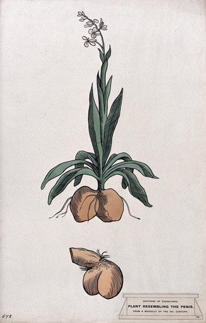
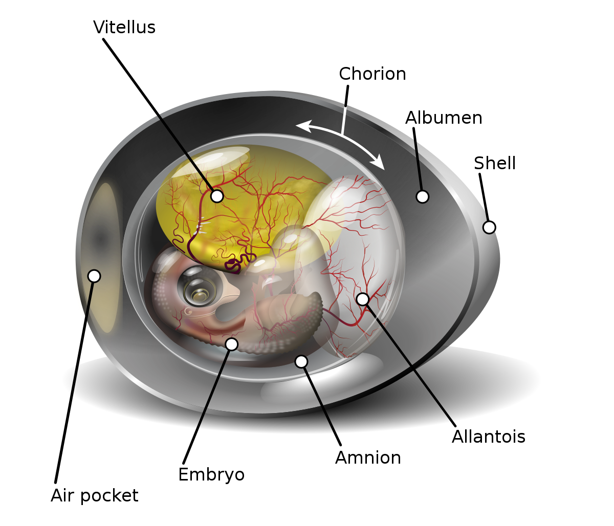

# 咬文嚼字-学科相关-Biology and Medicine

@(TOEFL)[托福, TOEFL, 词根词缀,咬文爵字,学科相关]

[toc]

# Biology(生物学)

**biology** - 意为“生命”或“生物”的希腊语词根**`bíos`**被近代欧洲语言吸收，广泛用作前缀或构词成分，特别是在20世纪。

构词力强的英语组合语素**`bio-`**就是由此而来的。**biography**是最早出现于英语的**`bio-`**衍生词之一。英国桂冠诗人、剧作家、批评家德莱顿（John Dryden, 1631-1700）在1683年首次将该词用于其散文著作*Life of Plutarch*。

**biography**源自希腊语*`biographiā`*，由bíos 'life'加gráphein 'write'构成，从英语构词法来看，就是**`bio-`** 'life'和**`-grahy`** 'writing'的组合，意思是“传记”。若再将biography冠以源于希腊语的组合语素**`auto-`** 'of oneself'（自己的），就构成**autobiography**（自传）。

**biology**是另一个较早产生的**`bio-`**衍生词，始见于19世纪初，是仿德语biologie和法语biologie创造的，由bio-加-ology 'the study of'（……学）构成。到了20世纪bio-衍生词猛增了起来，诸如**bioengineering**（生物工程），**bionic**（仿生学的），**biotechnology**（生物技术），**biosphere**（生物圈），**biorhythm**（生物节律），**biochemistry**（生物化学）等等。

例

- Boswell wrote a famous biography of Dr. Johnson. 博斯韦尔为约翰逊博士写过一本著名的传记。
- Famous people often have several very different biographies written about them. (CID) 名人们通常都有几种内容大相径庭的传记。
- Every sophomore is required to take biology. 每一位二年级生必修生物学。

## bio-,bi- = life, 表示“生命，生物”。源自希腊语 bios "life." {112}

| 单词                            | 解释                                                         | 单词                                 | 解释                                                         |
| ------------------------------- | ------------------------------------------------------------ | ------------------------------------ | ------------------------------------------------------------ |
| **micro-be** 【ˈmaɪkroʊb】 | n. 微生物, 细菌 推荐micro-微小的 + be-生命  **`micro-`** = small, 表示“小”。源自希腊语 (s)mikros "small." **`be-`** = life, 表示“生命，生物”。源自希腊语 bios "life." 词源说明(童理民)   1 - micro-,微小的，-be,生命，词源同 biology,zoo.引申词义微生物。 | **pro-ger-ia** 【prəʊ'dʒɪərɪə】 | 【医】 早老.早衰 推荐：pro-前 + ger-老 + -ia  **`pro-`** 表示“向前，在前”，变体包括 pur-, por-。 **`ger-`** = old, 表示“老”。源自希腊语 geras "old age," geron "old man.". |
| **biota** 【baɪ'əʊtə】     | n.   生物区；生物群 all the plant and animal life of a particular region  bio-,bi- = life, 表示“生命，生物”。源自希腊语 bios "life." n. 1 . the total complement of animals and plants in a particular area |                                      |                                                              |
|                                 |                                                              |                                      |                                                              |

## 细胞核

### cyto- = cell, 表示“细胞”。源自希腊语 kutos "a hollow, vessel." {64}

| 单词                                   | 解释                                                         | 单词                                 | 解释                                                         |
| -------------------------------------- | ------------------------------------------------------------ | ------------------------------------ | ------------------------------------------------------------ |
| **cyto-plasm** 【ˈˈsaɪtoʊplæzəm】 | n. 细胞质,胞浆 推荐：cyto-细胞 + -plasm...质  **`cyto-`** = cell, 表示“细胞”。源自希腊语 kutos "a hollow, vessel." **`plasm-`** = mold, 表示“模式”。源自希腊语 plasma "something molded or created"。医学领域常引申为“血浆”或“原生质”，“形成”等。源自希腊语 plassein "to mold" 词源说明(童理民)   1 - cyto-,细胞，-plasm,形成，词源同 plastic. | **cyto-logy**  【saɪˈtɑːlədʒi】 | n. 细胞学 推荐：cyto-细胞 + -logy 学，学科  **`cyto-`** = cell, 表示“细胞”。源自希腊语 kutos "a hollow, vessel." **`-logy`** = science, 表示“科学，学科”，由词根 log-, 说，引申而来；-logy 作为词缀表示...学，-logist 作为词缀表示...学家, -logical 作为词缀表示...学的。源自希腊语 logos "speech, word, reason." 词源说明(童理民)   1 - cyto-,细胞，来自 PIE*skeu,遮盖，隐藏，词源同 hide,house.-logy,学说。比较 cell,小室，细胞。 |
|                                        |                                                              |                                      |                                                              |
|                                        |                                                              |                                      |                                                              |

### karyo- 表示“核”，生物学前缀。源自希腊语 karyon "nut, kernel,"{13}

| 单词                                 | 解释                                                         | 单词 | 解释 |
| ------------------------------------ | ------------------------------------------------------------ | ---- | ---- |
| **eu-karyo-te**  【jʊ'kærɪəʊt】 | n. 真核细胞（等于eucaryote） 推荐：eu-好 + karyo-核 + -ote  **`eu-`** 表示“好，优秀”。源自希腊语 eu- "well." **`karyo-`** 表示“核”，生物学前缀。源自希腊语 karyon "nut, kernel," |      |      |
|                                      |                                                              |      |      |
|                                      |                                                              |      |      |

## patho- = feeling, suffering, 表示“感情，遭受（病痛）”{39}

>  源自希腊语 pathos "suffering, passion, emotion, feelings.

| 单词                             | 解释                                                         | 单词 | 解释 |
| -------------------------------- | ------------------------------------------------------------ | ---- | ---- |
| **patho-gen** 【ˈpæθədʒən】 | n. 病原体 推荐：patho-疾病的 + gen-产生，原。  patho- = feeling, suffering, 表示“感情，遭受（病痛）”。源自希腊语 pathos "suffering, passion, emotion, feelings." -gen 中文翻译成“...原”，原意表示“产生”。 词源说明(童理民)   1 - patho-,疾病的，-gen,产生，原，词源同 antigen. |      |      |
|                                  |                                                              |      |      |
|                                  |                                                              |      |      |

## phyt- = plant, 表示“植物” {37}

> 源自希腊语 phutos, phuton "a plant."

| 单词                                         | 解释                                                         | 单词                                        | 解释                           |
| -------------------------------------------- | ------------------------------------------------------------ | ------------------------------------------- | ------------------------------ |
| **phyt-o-plankton** 【ˌfaɪtoʊˈplæŋtən】 | **`phyto-`** = plant, 表示“植物”。源自希腊语 phutos, phuton "a plant." **plankton** n. (总称)浮游生物 浮游藻;植物性浮游生物;浮游植物;浮游藻类;浮游植物群落 very small plants that float near the surface of water and on which sea creatures feed | **ceno-phyte**                         | 【植】新生代植物               |
| **epi-phyte**  【epɪfaɪt】         | **n.**(寄生于动物的)真菌；【植】附生植物 ； **`epi-`** 表示“在…上，在…周围，在…后面”。源自希腊语 epi "on, over, at." **`phyte-`** = plant, 表示“植物”。源自希腊语 phutos, phuton "a plant." | **phyt-o-bilogy** 【faɪtəʊbaɪ'ɒlədʒɪ】 | phyto-植物 + biology【生物学】 |
|                                              |                                                              |                                             |                                |

### orchid（兰花）：根部像男人睾丸的花卉

> 词根分解  [词根树]
> orchid- 
> = testes, 表示“睾丸”。来自希腊语的 orcheome（舞蹈），古雅典运动员跑步是裸体的，这个时候 xx 就像在跳舞。源自希腊语 orkhis "testicle."

提起兰花，我们脑子里会涌现一种优雅脱俗的花朵。哇，淡紫色，好浪漫哦！慢着，地表之上这货确实漂亮，但地表之下的根很猥琐哦。怎讲？因为orchid这个单词的希腊词源本意是“睾丸”，因为其根上有两个睾丸状的东东。英国人也挺直白，把兰花叫做fool's ballocks，ballocks=ball+指小后缀-ock+复数s。

但在西方很多国家的文字里，有些墨守成规的礼法人士在女士面前却羞于提起兰花。英语中表示“兰花”的单词**orchid**来自希腊语**orchis**（睾丸）。因为兰花是孖根植物，根部与男子睾丸一样成双成对且形状相似。

在古英语中“兰花”和“睾丸”都是**orchid**，后来为了避免误解和文雅，就用**testicle**来表示“睾丸”，而用**orchid** 专指兰花。

至今**orchid**作为词根在一些医学术语中还是指“睾丸”，如**orchiopexy**（睾丸固定术）。

- **orchid**：['ɔːkɪd] 
  - n.兰花，兰科植物，淡紫色
  - adj.淡紫色的
- **orchiopexy**：[,ɔ:ki'ɔpəksi] n. 睾丸固定术

### Celsius /selsiəs/

Celsius（摄氏度）：发明摄氏温标的瑞典科学家摄尔修斯。

我们常用的摄氏温标是由瑞典科学家**安德斯•摄尔修斯**（Anders Celsius，1701～1744）发明的。摄尔修斯是瑞典著名的物理学家和气象学家。1742年，他在总结前人经验的基础上创立了摄氏温标。他把水银温度计插人正在熔解的雪中，定出冰点作为一个标准温度点；然后又把温度计插入沸腾的水中，定出沸点作为另一个标准温度点。并把冰点和沸点之间等分100度，所以摄氏温标又叫百分温标。

1948年在巴黎召开的第九届国际计量大会把百分温标正式命名为“摄氏温标”，并用摄尔修斯的名字Celsius作为摄氏温标的单位，称为“摄氏度”，用℃表示。

最初，为了避免测量低温时出现负值，摄尔修斯把水的沸点定为零度，而冰点定为100度。摄尔修斯去世后，根据其他科学家的建议，人们把这种标度倒转过来，以冰点为零度，沸点为100度。

- Celsius：['selsɪəs] n.摄氏度adj.摄氏的

------------------------

### pupae /ˈpjuːpiː/  (pupa /ˈpjuːpə/)

**`pupa -`** 

 **pupa**本是拉丁语***pūpa***，意为“***女孩***”、“***洋娃娃***”，复数形式为***pupae***。1758年瑞典博物学家林奈（**[Carolus Linnaeus](https://en.wikipedia.org/wiki/Carl_Linnaeus)**, 1707-1778）把它当作术语来用，指“蛹”。林奈这一创造曾被誉为“天才诗人的手法”（**a stroke of poetic genius**）。一位作家这样写道：“只要你看一看蛾蛹的下侧，你就会发现它的脸、它的眼睛以及小臂状的双翅，有如襁褓中的婴儿，有如小洋娃娃。” 

英语另有两个词 **puppet**（木偶）和 **puppy**（小狗），从表面上看乃分别来自法语**poupette**（玩偶）和**poupée**（玩偶），实际上其终极词源同为拉丁语***pūpa***。

>  例　Female wasps lay their eggs in the pupae of various flies. 雌黄蜂在多种苍蝇的蛹中产卵。

 

因为如果你仔细观察蛾蛹，就会发现它的脸、眼睛以及小臂状的双翅，都像极了襁褓中的婴儿，犹如小洋娃娃。

与pupa同源的英语单词还有**pupil**（小学生）、**puppet**（木偶）和**puppy**（小狗）。

- pupa： ['pjupə] n. 蛹
- pupil：[ˈpjuːpl] n. 学生；瞳孔；未成年人
- puppet：['pʌpɪt] n. 木偶；傀儡；受他人操纵的人
- puppy：['pʌpi] n. 小狗，幼犬

### pupil（学生）：小小的玩具娃娃

当我们看到幼儿园中或小学低年级班中一群群按照老师要求规规矩矩端坐在座位上的小朋友们，是不是觉得他们特别像小小的玩具娃娃一样？英语单词pupil（学生）的本意正是“小娃娃”，它来自拉丁语pupillus，是pupa（娃娃、玩偶）的指小形式。

pupil还可以表示“瞳孔”，因为我们仔细察看别人的瞳孔，可以发现瞳孔里有一个小人，其实就是你自己的倒影。

同源的单词还有puppet（傀儡）、puppy（小狗）等。

- pupil：['pjuːpɪl; -p(ə)l] n.（小）学生，瞳孔
- puppet：['pʌpɪt] n. 木偶；傀儡；受他人操纵的人
- puppy：['pʌpi] n. 小狗，幼犬

### larvae /ˈlɑrvi/ (larva /ˈlɑːrvə/)

A **larva** is an insect at the stage of its life after it has developed from an egg and before it changes into its adult form.

### malaria 由脏空气引发的疾病

疟疾（**malaria【məˈleriə】**）是一种由于疟蚊叮咬引发的传染病。在古代罗马(该词源自意大利语短语mala aria) 城周围有许多沼泽，沼泽附件的空气又脏又臭，在沼泽附近待的时间一久，人就容易得疟疾。

当时的罗马人不知道疟疾是因为疟蚊叮咬引发的，还以为是脏空气引发的，所以将这种病称为malaria，由mal（bad）+aria（air）构成，字面意思就是“脏空气”。英语单词malaria就来自意大利语**malaria**。

该词始用于18世纪中期。到了19世纪后半期，当人们发现疟疾是由按蚊（**anopheles【ə'nɒfəˌlɪz】**）传布时，便给疟疾重新下了定义，但却保留了原有的名称。

- **malaria**：[mə'leərɪə] n.疟疾，痢疾，瘴气
- **malarial**：[mə'lɛrɪəl] adj.疟疾的，患疟疾的，毒气的

### mosquito  （蚊子）：小飞虫

> 来自西班牙语 mosca,蚊子，-ito,小词后缀，来自拉丁语 musca,蚊子，来自 PIE*mu,蚊子，拟声词，模仿蚊子嗡嗡的声音，词源同 moth,midge.

蚊子的体型通常很小，因此在古代***西班牙***语中被称为**mosquito**，是**`mosca`**（飞虫）的指小形式，字面意思就是“小飞虫”。英语单词mosquito就直接来自西班牙语。

(**anopheles【ə'nɒfəˌlɪz】**词根则是来自古希腊)

- **mosquito**：[mə'skito] n.蚊子

- （比较）**mosque**【mɑːsk】 n. 清真寺 (a building in which Muslims worship )

  > 来自阿拉伯语 masjid,祷告的地方，清真寺，来自 ma-,表方位，sajada,俯伏在地，祈祷，祷告。

## par-,partur- = bring forth, 表示“生产，生出孩子”。源自拉丁语 parire "to get, beget, give birth." {26}

| 单词                        | 解释                                                         | 单词                        | 解释                                                         |
| --------------------------- | ------------------------------------------------------------ | --------------------------- | ------------------------------------------------------------ |
| **vip-er** 【ˈvaɪpər】 | n. 蝰蛇, 毒蛇, 毒如蛇蝎的人, 阴险的人 viv-,vit- = life, 表示“生命”， 最终源自原始印欧语 *gweie- “to live活着”。和表示生命的词根 bio-同源。源自拉丁语 vivus "living, alive," vivere "to live," viva "life."  par-,partur- = bring forth, 表示“生产，生出孩子”。源自拉丁语 parire "to get, beget, give birth." -er 是施动者名词后缀，表示“人或物”，一般缀于动词后，来自古英语。 词源说明(童理民)   1 - 来自拉丁语 vipera,蛇，蝰蛇，来自 vi-,生命，词源同 vivid,-per,带来，生育，词源同 parent,即带来生命的，因相比于其它蛇由蛋孵化而生，这种蛇在孵化前蛋一直在母蛇肚子里。 | **vip-er** 【ˈvaɪpər】 | n. 蝰蛇, 毒蛇, 毒如蛇蝎的人, 阴险的人                                                                  viv-,vit- = life, 表示“生命”， 最终源自原始印欧语 *gweie- “to live活着”。和表示生命的词根 bio-同源。源自拉丁语 vivus "living, alive," vivere "to live," viva "life."  par-,partur- = bring forth, 表示“生产，生出孩子”。源自拉丁语 parire "to get, beget, give birth." -er 是施动者名词后缀，表示“人或物”，一般缀于动词后，来自古英语。 词源说明(童理民)   1 - 来自拉丁语 vipera,蛇，蝰蛇，来自 vi-,生命，词源同 vivid,-per,带来，生育，词源同 parent,即带来生命的，因相比于其它蛇由蛋孵化而生，这种蛇在孵化前蛋一直在母蛇肚子里。  摩西英语(摩西) viper ['vaɪpə] n. 毒蛇；毒如蛇蝎的人。拼写中的vi-实际是词根viv，表live,living和alive等，而per则是词根par-，表准备、生产、安排、分配（部分）等，我们的父母亲parent就是“生产”了我们的人。部分有毒的蝰蛇是oviparous卵生的，但也有胎生的viviparous，即生下来的不是卵（ovi），而是活体。 |
|                             |                                                              |                             |                                                              |
|                             |                                                              |                             |                                                              |

## viv-,vit- = life, 表示“生命”， 最终源自原始印欧语 *gweie- “to live活着”。和表示生命的词根 bio-同源。{23}

> 源自拉丁语 vivus "living, alive," vivere "to live," viva "life." 

| 单词                        | 解释                                                         | 单词                        | 解释                                                         |
| --------------------------- | ------------------------------------------------------------ | --------------------------- | ------------------------------------------------------------ |
| **vip-er** 【ˈvaɪpər】 | n. 蝰蛇, 毒蛇, 毒如蛇蝎的人, 阴险的人 viv-,vit- = life, 表示“生命”， 最终源自原始印欧语 *gweie- “to live活着”。和表示生命的词根 bio-同源。源自拉丁语 vivus "living, alive," vivere "to live," viva "life."  par-,partur- = bring forth, 表示“生产，生出孩子”。源自拉丁语 parire "to get, beget, give birth." -er 是施动者名词后缀，表示“人或物”，一般缀于动词后，来自古英语。 词源说明(童理民)   1 - 来自拉丁语 vipera,蛇，蝰蛇，来自 vi-,生命，词源同 vivid,-per,带来，生育，词源同 parent,即带来生命的，因相比于其它蛇由蛋孵化而生，这种蛇在孵化前蛋一直在母蛇肚子里。 | **vip-er** 【ˈvaɪpər】 | n. 蝰蛇, 毒蛇, 毒如蛇蝎的人, 阴险的人                                                                  viv-,vit- = life, 表示“生命”， 最终源自原始印欧语 *gweie- “to live活着”。和表示生命的词根 bio-同源。源自拉丁语 vivus "living, alive," vivere "to live," viva "life."  par-,partur- = bring forth, 表示“生产，生出孩子”。源自拉丁语 parire "to get, beget, give birth." -er 是施动者名词后缀，表示“人或物”，一般缀于动词后，来自古英语。 词源说明(童理民)   1 - 来自拉丁语 vipera,蛇，蝰蛇，来自 vi-,生命，词源同 vivid,-per,带来，生育，词源同 parent,即带来生命的，因相比于其它蛇由蛋孵化而生，这种蛇在孵化前蛋一直在母蛇肚子里。  摩西英语(摩西) viper ['vaɪpə] n. 毒蛇；毒如蛇蝎的人。拼写中的vi-实际是词根viv，表live,living和alive等，而per则是词根par-，表准备、生产、安排、分配（部分）等，我们的父母亲parent就是“生产”了我们的人。部分有毒的蝰蛇是oviparous卵生的，但也有胎生的viviparous，即生下来的不是卵（ovi），而是活体。 |
|                             |                                                              |                             |                                                              |
|                             |                                                              |                             |                                                              |

## flagell- = whip, 表示“鞭子”。源自拉丁语 flagrum "a whip."{7}

| 单词                                                   | 解释                                                         | 单词                                     | 解释                                                         |
| ------------------------------------------------------ | ------------------------------------------------------------ | ---------------------------------------- | ------------------------------------------------------------ |
| **flagell-um  **                   【fləˈdʒɛləm】 | n. 鞭毛, 鞭状葡萄枝, 鞭子 推荐：flagell-鞭子 + -um  **`flagell-`** = whip, 表示“鞭子”。源自拉丁语 flagrum "a whip."  词源说明(童理民)   1 - 词源同 flagellate,鞭笞。用于解剖学名词。 | cysto-flagellata                         | n. 囊状鞭毛虫类 推荐：Cysto-囊+ flagellata【鞭毛虫类】  Flagellata 【医】 鞭毛虫类 **`cyst-`** = bladder, pouch, 表示“囊”, 医学上引申为“膀胱”。源自希腊语 kustis "bladder, bag" < "bellows." **`flagell-`** = whip, 表示“鞭子”。源自拉丁语 flagrum "a whip." |
| **flagitious** 【flə'dʒɪʃəs】                     | a. 极恶的, 残忍的, 凶恶的 **`flagell-`** = whip, 表示“鞭子”。源自拉丁语 flagrum "a whip." 英英   adj. 1 . extremely cruel , wicked , or vicious  2 . notorious or infamous | **flail**[^1] 【fleɪl】             | n. 连枷 v. 用连枷打, 打 推荐：来自flagellate, 鞭打，鞭笞。后用来指打谷工具，连枷。  flagell- = whip, 表示“鞭子”。源自拉丁语 flagrum "a whip." 词源说明(童理民)   1 - 来自 flagellate,鞭打，鞭笞。后用来指打谷工具，连枷。 |
| **flagell-ate** 【ˈflædʒəleɪt】                   | vt. 鞭打, 鞭挞 a. 鞭状的, 鞭索形的, 有鞭毛的 n. 鞭毛虫 推荐：flagell-鞭子 + -ate  **`flagell-`** = whip, 表示“鞭子”。源自拉丁语 flagrum "a whip." **`-ate`** 表动词，“做，造成”。  词源说明(童理民)   1 - 来自 PIE*bhlag,击打，鞭笞，词源同 flail,flog. | **flagelli-form** 【flə'dʒelɪfɔ:m】 | n. 鞭毛状的, 细长而柔韧的 推荐：flagelli-鞭子 + form-形状  flagelli- = whip, 表示“鞭子”。源自拉丁语 flagrum "a whip." form- = shape, 表示“形状”。来自拉丁语 forma "form, shape, contour, apearance, beauty." adj.1 . describes an organism or body part that is long , tapering , and very narrow |
| **flagell-ant**[^2] 【flædʒɪlənt】                | n. 鞭笞者, 受鞭笞者, 自笞者;  a. (言语)刺人的, 伤人的 推荐：flagell-鞭子 + -ant  flagell- = whip, 表示“鞭子”。源自拉丁语 flagrum "a whip." -ant 表形容词，“…的”。  |                                          |                                                              |

[^1]:摩西英语(摩西) flail [fleɪl] vt.&amp;vi.打；用连枷打，n.连枷（打谷物用的工具）。这是拉丁词源单词flagellum [flə'dʒeləm] n.[昆] 鞭毛；鞭子被英语本土化的结果（元音间的g脱落，flagellum&gt;flail），类似fragil ['frædʒaɪl] adj.易碎的和frail [freɪl] adj.脆弱的。His arms were flailing in all directions. 

[^2]: 摩西英语(摩西) flagellant ['flædʒ(ə)l(ə)nt] n.苦修者；执鞭抽打者，adj.伤人的；鞭打的。欧洲黑死病（black death）期间，欧洲人口减少了三分之一。由于医学不发达，没有人知道瘟疫的源头。死亡阴影中，人们开始用鞭打自己的方式进行忏悔，希望这样能洗净过去的罪恶，从而不被瘟疫感染。词根flag-表to strike。  n. 1 . a penitent who whips himself or herself as a means of repentance  2 . somebody who uses whipping to achieve pleasure 

# Physiology 生理学

> he scientific study of the normal functions of living things

| 单词                              | 解释                                                         | 单词                                | 解释                                                         |
| --------------------------------- | ------------------------------------------------------------ | ----------------------------------- | ------------------------------------------------------------ |
| **amnion** 【æmnɪən】        | **`amnion-`** 表示“羊膜”，源自希腊语 amnion "membrane around a fetus"。  1 . the inner of the two membranes enclosing the embryo of a bird , reptile , or mammal and its surrounding fluid .  2 . the fluid - filled sac within which the embryo of a bird , reptile , or mammal develops |                                     |                                                              |
| **glande**                        | n. 龟头, 阴茎头 【复数：glandes】 单词笔记   ［添加］ 词源说明(童理民)   1 - 来自 PIE*gwele,橡实，球体，词源同 globe.因呈球体而得名。 | **gland** 【ɡlænd】            | n. 腺, 密封套 **`gland-`** = acorn, 表示“橡子”，含义"腺体"是因为其形状和橡子类似而得名。源自拉丁语 glans (词干 gland-) "an acorn." 词源说明(童理民)   1 - 来自 PIE*gwele,橡实，球体，词源同 globe.因呈球体而得名，用于解剖学术语。 |
| **gland-ule ** 【ɡlændju:l】 | n. 小腺 推荐：gland【腺】 + -ule  gland n. 腺, 密封套 | **glandul-ar** 【ˈɡlændʒələr】 | a. 腺的, 含腺的, 天生的, 固有的, 肉体的 推荐：glandule【小腺】 + -ar  glandule n. 小腺 |

## 一 core 三连

### Core- （心）：源自心脏的意识活动 {52}

我们中国人认为心脏是人的意识活动的场所，所以才有“心灵”、“心理”、“心思”等词汇。和我们东方人一样，古代西方人也有类似的观念，所以很多表示意识活动的单词都由表示心脏的词根**`cord-`**构成。该词根来自拉丁语**`cor/cordis`**（心脏）。词根**`card-/cardio-`**（心脏）来自希腊语***kardia***，但最终源头和**`cord-`**一样来自原始印欧语词根**`kerd-`**。

- **cord**-：心脏，心理，心灵
- **core**：[kɔː] n.核心，要点
- **cordial**：['kɔːdɪəl] adj. 衷心的，诚恳的；兴奋的
- **concord**：['kɒŋkɔːd] n.和谐；和睦；一致；协调
- **accord**： [ə'kɔːd]n. 符合；一致；协议；自愿vt. 使一致；给予vi. 符合；一致
- **accordance**：[ə'kɔrdns] n. 一致；和谐
- **discord**：['dɪskɔːd] n. 不和；不调和；嘈杂声vi. 不一致；刺耳
- **`card-`**/**`cardio-`**：心脏
- cardiac：['kɑrdɪæk] n. 强心剂；强胃剂adj. 心脏的；心脏病的；贲门的
- cardiology：[,kɑrdɪ'ɑlədʒi] n. 心脏病学
- cardiopathy： [,kɑrdɪ'ɑpəθi] n. 心脏病

### chord- = string, 表示“线”。原指“肠子”，后引申为线、绒毛、脉络等 {19}

>  源自希腊语 khorde "gut, string."

| 单词                        | 解释                                                         | 单词                      | 解释 |
| --------------------------- | ------------------------------------------------------------ | ------------------------- | ---- |
| chord-ate 【'kɔːdeɪt】 | a. 具有脊索的, 脊索动物门的 n. 脊索动物 推荐：chord-脊索 + -ate  chord- 19= string, 表示“线”。原指“肠子”，后引申为线、绒毛、脉络等 。源自希腊语 khorde "gut, string." | cordate 【'kɔːdeɪt】 |      |
|                             |                                                              |                           |      |
|                             |                                                              |                           |      |

### cor- = pupil, 表示“瞳孔”{5}

| 单词        | 解释                                                         | 单词 | 解释 |
| ----------- | ------------------------------------------------------------ | ---- | ---- |
| cor-ectopia | 【医】 瞳孔异位 推荐：cor-瞳孔 + ectopia【n. 异位】  cor- = pupil, 表示“瞳孔”。 ectopia n. 出位, 异位 |      |      |
|             |                                                              |      |      |
|             |                                                              |      |      |

## plasm- = mold, 表示“模式”。医学领域常引申为“血浆”或“原生质”，“形成”等{60}

> - 表示“模式”。源自希腊语 plasma "something molded or created"。
> - 医学领域常引申为“血浆”或“原生质”，“形成”等。源自希腊语 plassein "to mold"

| 单词                                   | 解释                                                         | 单词                                   | 解释                                                         |
| -------------------------------------- | ------------------------------------------------------------ | -------------------------------------- | ------------------------------------------------------------ |
| **proto-plasm** 【ˈproʊtəplæzəm】 | n. 原生质 （细胞质） 推荐：proto-原始 , 第一 + -plasm...质  proto- = first, source, parent, preceding, earliest form, original, basic，表示“最初的，原始的，第一的”。 plasm- = mold, 表示“模式”。源自希腊语 plasma "something molded or created"。医学领域常引申为“血浆”或“原生质”，“形成”等。源自希腊语 plassein "to mold" | **cyto-plasm** 【ˈˈsaɪtoʊplæzəm】 | n. 细胞质,胞浆 推荐：cyto-细胞 + -plasm...质  **`cyto-`** = cell, 表示“细胞”。源自希腊语 kutos "a hollow, vessel." **`plasm-`** = mold, 表示“模式”。源自希腊语 plasma "something molded or created"。医学领域常引申为“血浆”或“原生质”，“形成”等。源自希腊语 plassein "to mold" 词源说明(童理民)   1 - cyto-,细胞，-plasm,形成，词源同 plastic. |
|                                        |                                                              |                                        |                                                              |
|                                        |                                                              |                                        |                                                              |

## vas- = vessel, 表示“管状的”，引申为“容器”{18}

| 单词                              | 解释                                                         | 单词                              | 解释                                                         |
| --------------------------------- | ------------------------------------------------------------ | --------------------------------- | ------------------------------------------------------------ |
| **vas-cular** 【ˈvæskjələr】 | a. 血管的, 维管的 推荐：vas-管 + -cular  **`-ular`** 表形容词，“有…形状或性质的”。源自拉丁语 -ulus, 小词后缀。 **`vas-`** = vessel, 表示“管状的”，引申为“容器”。 词源说明(童理民)   1 - 来自拉丁语 vas,容器，词源同 vase,vessel.-cul,小词后缀，引申词义血管。 | **vas-cular** 【ˈvæskjələr】 | a. 血管的, 维管的 推荐：vas-管 + -cular  **`-ular`** 表形容词，“有…形状或性质的”。源自拉丁语 -ulus, 小词后缀。 **`vas-`** = vessel, 表示“管状的”，引申为“容器”。 词源说明(童理民)   1 - 来自拉丁语 vas,容器，词源同 vase,vessel.-cul,小词后缀，引申词义血管。 |
|                                   |                                                              |                                   |                                                              |
|                                   |                                                              |                                   |                                                              |

## cort-  = skin, 表示“皮” {16}

>  源自拉丁语 corium "skin，hide，leader;" cortex "bark"{16}

| 单词                           | 解释                                                         | 单词 | 解释 |
| ------------------------------ | ------------------------------------------------------------ | ---- | ---- |
| **cort-ex** 【ˈkɔːrteks】 | n. 皮层 **`cort-`** = skin, 表示“皮”。源自拉丁语 corium "skin，hide，leader;" cortex "bark"。 词源说明(童理民)   1 - 来自 PIE*sker,切，词源同 carnal,score.原指树皮，后引申词义大脑皮质。 |      |      |
|                                |                                                              |      |      |
|                                |                                                              |      |      |

## fren-（精神）：控制人精神的横膈膜 {12}

横隔膜是胸腔和腹腔之间的分隔，它位于心脏和双侧肺脏的下面，肝脏、脾脏、胃的上方，就像一个大圆盘平放在身体内部分隔了胸腹腔。由于横膈膜与心脏距离较近，古人看到人情绪激动时心跳也会加快，便以为横膈膜是负责人精神状态的器官，因此英语中表示“横膈膜”的词根fren-/phren-同时还可以表示“精神”，产生了很多与“精神”相关的单词。

- fren-/phren- /phreno：精神
- diaphragm：['daɪəfræm] n.横隔膜，隔板，快门，光圈
- phrenic：['frɛnɪk] adj. 横隔膜的；精神的
- frenzy：['frenzɪ] n.狂暴，狂怒，暴怒vt.使发狂，使狂怒
- frenetic：[frə'netɪk] adj.狂热的，发狂的n.疯子，狂人
- schizophrenia：[,skɪtsə'frinɪə] n.精神分裂症
- schizophrenic：[,skɪtsə'frɛnɪk] adj. 精神分裂症的n. 精神分裂症患者

## 粘液

### 1. myx- = mucus, 表示“粘液”。源自希腊语 muxa "mucus, lamp wick." {6}

| 单词                                | 解释                                                         | 单词       | 解释                                                         |
| ----------------------------------- | ------------------------------------------------------------ | ---------- | ------------------------------------------------------------ |
| **myx-oma** 【mɪks'əʊmə】      | n. 粘液瘤 推荐：myx-粘液 + -oma肿瘤  **`myx-`** = mucus, 表示“粘液”。源自希腊语 muxa "mucus, lamp wick." **`-oma`** = "tumor, mass, swelling", 名词后缀，表示“...肿、...瘤”等。正确的复数形式是 -omata。  词源说明(童理民)   1 - 来自希腊语 myxa,黏液，词源同 mucus,muggy.-oma,瘤，肿块，词源同 myeloma,carcinoma. | myx-oma-s  | 粘液瘤（myxoma的复数） 推荐：myx-粘液 + oma-瘤 + -s  **`myx-`** = mucus, 表示“粘液”。源自希腊语 muxa "mucus, lamp wick." **`-oma`** = "tumor, mass, swelling", 名词后缀，表示“...肿、...瘤”等。正确的复数形式是 -omata。 |
| **myx-omata** 【mɪkˈsəʊmətə】  | 粘液瘤 推荐：myx-粘液 + -omata, 瘤  **`myx`**- = mucus, 表示“粘液”。源自希腊语 muxa "mucus, lamp wick." **`-omata`** = "tumor, mass, swelling", 名词后缀，表示“...肿、...瘤”等。正确的复数形式是 -omata。 |            |                                                              |
| **myx-edema ** 【mɪksɪ'di:mə】 | n. 粘液水肿 单词笔记   ［添加］ 推荐： myx-粘液 + edema【n. 水肿】  **`myx-`** = mucus, 表示“粘液”。源自希腊语 muxa "mucus, lamp wick." **`edema`** n. 水肿, 浮肿 | myxo-edema | n. 粘液水肿 推荐：myxo-粘液 + edema【n. 水肿】 **`myxo-`** = mucus, 表示“粘液”。源自希腊语 muxa "mucus, lamp wick." **`edema`** n. 水肿, 浮肿 |
|                                     |                                                              |            |                                                              |

### 2. phlegm （粘液）：导致人性情冷淡的粘液 {5}

> 词根分解  [词根树]
> **`phlegm-`** {5}
> = flame, 表示“发炎”。源自希腊语 phlegein "to burn."

根据四体液学说，体内粘液占比较高的人性情冷淡、反应迟钝。因此，英语单词**phlegm**（粘液）的形容词**phlegmatic**就产生了“冷淡的、迟钝的”等含义。

古医学体液理论构成人体的血液，黏液，胆汁，黑胆汁四种体液之一。来自希腊语 phlegma,发热，由体热所致的多痰症，来自 phlegein,燃烧，发热，来自 PIE*bhel,照耀，燃烧，词源同 blaze,bleach.

后在中世纪医学理论认为体内多痰会致人**冷淡**，**迟钝**，但是，被误解为冷淡是**冷静**，**镇定**的表现，因此，产生模糊和矛盾的词义。

- **phlegm**：[flem] n. 痰；粘液
- **phlegmatic**：[fleg'mætɪk] adj. 冷淡的；迟钝的；冷漠的
- **phlegmy**：['flɛmi] adj. 痰的；生痰的；含痰的

1. the thick mucus secreted by the walls of the respiratory passages , especially during a cold 
2. calmness or composure that is not easily disturbed 
3. in medieval medicine , one of the four basic bodily fluids . Phlegm was believed to be cold and moist in nature and to cause sluggishness and apathy . 
4. a thick yellow or green substance that you get in your nose and throat , especially when you have a cold 
5. the ability to be calm in a dangerous or frightening situation 

### 3. muc- = slimy, 表示“粘糊糊”。源自拉丁语 mucus "mucus." {13}

| 单词                        | 解释                                                         | 单词                                      | 解释                                                         |
| --------------------------- | ------------------------------------------------------------ | ----------------------------------------- | ------------------------------------------------------------ |
| **mold**[^4] 【moʊld】 | n. 模子, 模型, 霉 v. 形成, 塑造, 发霉 **`mod-`** = mode, manner, 表示“方式，模式，风度”。 源自拉丁语 modus "measure, sie, limit, manner, harmony, melogy." **`muc-`**  = slimy, 表示“粘糊糊”。源自拉丁语 mucus "mucus." | **muc-osa**            【mjuˈkoʊsə】 | 粘膜 **`muc-`** = slimy, 表示“粘糊糊”。源自拉丁语 mucus "mucus." |
|                             |                                                              |                                           |                                                              |
|                             |                                                              |                                           |                                                              |

[^4]: 词源说明(童理民) 1 - 来自 model 的法语拼写形式，即模子，模型，引申词义模具，铸模。字母 l,d 置换。 2 - 来自古古诺斯语 mygla,发霉，来自 PIE*meug,湿的，黏的，词源 mucus,muggy.由湿的引申词义发霉，发霉。-d,过去分词后缀，字母 g 脱落，比较 vagina,vanilla. 3 - 来自古英语 molde,泥土，散土，来自 PIE*mele,磨，词源同 meal,mill.由磨引申词义碎土，散土，腐叶土。

## cerebr- = brain, 表示“脑”。源自拉丁语 cerebrum "brain."{9}

| 单词                              | 解释                                                         | 单词 | 解释 |
| --------------------------------- | ------------------------------------------------------------ | ---- | ---- |
| **cerebr-al** 【səˈriːbrəl】 | a. 脑的, 大脑的 推荐：cerebr-脑 + -al表形容词。  **`cerebr-`** = brain, 表示“脑”。源自拉丁语 cerebrum "brain." **`-al`** 表形容词，“…的”，一般缀于名词后。源自拉丁语 -alis, adjective suffix. 词源说明(童理民)   1 - 来自 cereb-,脑，词源同 horn,角，头。 |      |      |
|                                   |                                                              |      |      |
|                                   |                                                              |      |      |

## cut- 表示“表皮”。源自拉丁语 cutis "skin{8}

| 单词                            | 解释                                                         | 单词 | 解释 |
| ------------------------------- | ------------------------------------------------------------ | ---- | ---- |
| **cut-icle** 【ˈkjuːtɪkl】 | n. 角质层;(手指甲或脚指甲根部的)甲小皮  cut- 表示“表皮”。源自拉丁语 cutis "skin." 词源说明(童理民)   1 - 来自 PIE*skeu,遮盖，保护，词源同 hide,house,custody. |      |      |
|                                 |                                                              |      |      |
|                                 |                                                              |      |      |

## metabol- 表示“代谢，变态”{5}

>  缩写自 metabolism，词根本身由 meta- 变化 + bol- 扔，两部分组成。

| 单词                              | 解释                                                         | 单词                             | 解释                                                         |
| --------------------------------- | ------------------------------------------------------------ | -------------------------------- | ------------------------------------------------------------ |
| metabol-ism 【məˈtæbəlɪzəm】 | n. 新陈代谢, 变态 推荐：meta-改变 + bol-扔，投 + -ism. 即改变扔的方向，使发生变化，并用于生物学术语新陈代谢。  **`metabol-`** 表示“代谢，变态”，缩写自 metabolism，词根本身由 meta- 变化 + bol- 扔，两部分组成。 **`-ism`** 抽象名词后缀，表示“…主义”；“宗教”；“制度、行为”；“…学”、“…术”、“…论”、“…法”；“疾病名称”；“情况、状态”等。 词源说明(童理民)   1 - meta-,改变，-bol,扔，投，词源同 hyperbole,ballet,ballistic.即改变扔的方向，使发生变化，并用于生物学术语新陈代谢。比较 anabolism. | metabol-ic 【ˌmetəˈbɑːlɪk】 | a. 变化的, 变形的, 新陈代谢的 推荐：metabol-代谢 + -ic  metabol- 表示“代谢，变态”，缩写自 metabolism，词根本身由 meta- 变化 + bol- 扔，两部分组成。 -ic 表形容词，“…的”。 |
|                                   |                                                              |                                  |                                                              |
|                                   |                                                              |                                  |                                                              |

## 单词故事

### hormone  激素也叫荷尔蒙

**hormone** - 激素也叫荷尔蒙，是人或高等动物内分泌腺分泌的有机物质。它直接进入血液，对肌体的代谢、生长、发育和繁殖等起重要的调节作用，如甲状腺素、肾上腺素、胰岛素等都是激素。

激素的英语名称**hormone**（汉语的旧称荷尔蒙即由此音译而来）是英国科学家斯特林博士（E. H. Sterling）取自希腊语动词hormân 'stimulate, excite'（刺激，使兴奋）的现在分词hormôn，并在词尾加-e杜撰而成的。

他在1905年8月15日出版的《柳叶刀》（The Lancet）杂志的一篇文章中提及该物质时说，“这些化学信使（chemical messengers）我们可以称之为hormone。”

例

- We are governed by the hormones that circulate around our bodies. (CCE) 我们受在我们周身循环的荷尔蒙调节支配。
- Dairy cows are often given hormones to promote milk production. (CAE) 乳牛常常被注射荷尔蒙以增加奶产量。
- Those children do not produce enough growth hormone. 那些孩子缺乏生长激素。

### acne（痤疮）：acme的误写

acne【ˈækni】（痤疮）：acme【ˈækmi】（顶点）的误写。

单词**acne**指的是青少年脸上常见的粉刺、痤疮，它实际上与单词**acme**（顶点、最高点）同源。单词**acne**和**acme**都源自希腊语***akmas***，本意是“点”，同时还可以表示脸上的斑点。

	

6世纪时，在将希腊语**akmas**直译为拉丁语时，译者看花了眼，将字母**`m`**看成了**`n`**，译成了拉丁语***aknas***。这一错误保留至今，并演变成了英语单词**acne**，专指“粉刺、痤疮”。

- acne：['ækni] n. 粉刺，痤疮
- acme：['ækmi] n. 顶点，极点；最高点

# Neurology [nʊˈrɑːlədʒi]

| 单词                           | 解释                                                         | 单词                                 | 解释                                                         |
| ------------------------------ | ------------------------------------------------------------ | ------------------------------------ | ------------------------------------------------------------ |
| **cleft** 【kleft】       | n. 裂缝, 裂口 a. 劈开的 cleave的过去式和过去分词 推荐：来自cleave,劈开。  clev- 6= carve, 表示“刻，划”。 词源说明(童理民)   1 - 来自 cleave,劈开。 | **deft** 【deft】               | a. 敏捷熟练的, 灵巧的 单词笔记   ［添加］ 词源说明(童理民)   1 - 来自 PIE*dhabh,装配，匹配，词源同 fabric,daft.引申词义手巧的，灵巧的。 |
| **neuron** 【ˈnʊrɑːn】    | n. 神经元, 轴索, 神经细胞 推荐：neur-神经 + -on  neuron- 50 = nerve, 表示“神经”。源自希腊语 neuron "sinew." 词源说明(童理民)   1 - neuro-,神经，-on,医学名词后缀。 | **syn-apse** 【ˈsaɪnæps】       | n. (神经)突触, 神经键 **`syn-`** 表示“共同，相同，对称”。源自希腊语 sun, xun "together, with." **`apse-`** 表示“接触、系牢”。原始印欧语形式为：*ap-。 词源说明(童理民)   1 - 来自希腊语 synapais,连接点，来自 synaptein,连接，系，来自 syn-,一起，haptein,系，捆绑，词源同 apse,haptic.后用于医学术语指神经元的突触。 |
| **axon** 【ˈæksɑːn】      | n. 轴突; 轴索 **`axon-`** = axis, 表示“轴”。源自希腊语 axon "axis," 和拉丁语 axis "axle, pivot." 词源说明(童理民)   1 - 来自 PIE*aks,轴。此处用于神经学术语。 | **eu-karyo-te**  【jʊ'kærɪəʊt】 | n. 真核细胞（等于eucaryote） 推荐：eu-好 + karyo-核 + -ote  **`eu-`** 表示“好，优秀”。源自希腊语 eu- "well." **`karyo-`** 表示“核”，生物学前缀。源自希腊语 karyon "nut, kernel," |
| **syn-apse** 【ˈsaɪnæps】 | n. (神经)突触, 神经键 **`syn-`** 表示“共同，相同，对称”。源自希腊语 sun, xun "together, with." **`apse-`** 表示“接触、系牢”。原始印欧语形式为：*ap-。 词源说明(童理民)   1 - 来自希腊语 synapais,连接点，来自 synaptein,连接，系，来自 syn-,一起，haptein,系，捆绑，词源同 apse,haptic.后用于医学术语指神经元的突触。 | **dendr-ite** 【ˈdendraɪt】     | n. 树突(位于神经元末端的细分支，接收其他神经元传来的信号) 推荐：dendr-树 + -ite  **`dendr-`** = tree, 表示“树”。源自希腊语 dendron "tree." **`-ite`** 名词后缀，源自法语。和化学相关，如：矿物、岩石、炸药等。 词源说明(童理民)   1 - 词源同 tree.前面 den-为 dr 的韵律重复。用于术语树突。拼写比较 gangrene. |

 

| 单词                                | 解释                                                         | 单词 | 解释 |
| ----------------------------------- | ------------------------------------------------------------ | ---- | ---- |
| **dopa-amine**  【ˈdoʊpəmiːn】 | 【化】 多巴胺（**dopamine**） 推荐：dopa【多巴】 + amine-氨  **`dopa`** 【化】 多巴; 二羟基苯丙氨酸 【医】 多巴, 二羟苯基丙氨酸 **`amine-`** 表示“氨”，氨是在利比亚的一座 Ammon（埃及主神）神庙附近发现了一种矿物质提取的气体，瑞典化学家将其命名为 ammonia。 |      |      |
|                                     |                                                              |      |      |
|                                     |                                                              |      |      |

## neuron- 50= nerve, 表示“神经”。源自希腊语 neuron "sinew." {50}

| 单词                        | 解释                                                         | 单词 | 解释 |
| --------------------------- | ------------------------------------------------------------ | ---- | ---- |
| **neuron** 【ˈnʊrɑːn】 | n. 神经元, 轴索, 神经细胞 推荐：neur-神经 + -on  neuron- 50 = nerve, 表示“神经”。源自希腊语 neuron "sinew." 词源说明(童理民)   1 - neuro-,神经，-on,医学名词后缀。 |      |      |
|                             |                                                              |      |      |
|                             |                                                              |      |      |

## **`dendr-`** = tree, 表示“树”。源自希腊语 dendron "tree."{9}

 

| 单词                             | 解释                                                         | 单词 | 解释 |
| -------------------------------- | ------------------------------------------------------------ | ---- | ---- |
| **dendr-ite** 【ˈdendraɪt】 | n. 树突(位于神经元末端的细分支，接收其他神经元传来的信号) 推荐：dendr-树 + -ite  **`dendr-`** = tree, 表示“树”。源自希腊语 dendron "tree." **`-ite`** 名词后缀，源自法语。和化学相关，如：矿物、岩石、炸药等。 词源说明(童理民)   1 - 词源同 tree.前面 den-为 dr 的韵律重复。用于术语树突。拼写比较 gangrene. |      |      |
|                                  |                                                              |      |      |
|                                  |                                                              |      |      |

## apt- 表示“接触、系牢”。原始印欧语形式为：*ap-{8}

| 单词                               | 解释                                                         | 单词                           | 解释                                                         |
| ---------------------------------- | ------------------------------------------------------------ | ------------------------------ | ------------------------------------------------------------ |
| **syn-apse** 【ˈsaɪnæps】     | n. (神经)突触, 神经键 **`syn-`** 表示“共同，相同，对称”。源自希腊语 sun, xun "together, with." **`apse-`** 表示“接触、系牢”。原始印欧语形式为：*ap-。 词源说明(童理民)   1 - 来自希腊语 synapais,连接点，来自 synaptein,连接，系，来自 syn-,一起，haptein,系，捆绑，词源同 apse,haptic.后用于医学术语指神经元的突触。 | **syn-apse** 【ˈsaɪnæps】 | n. (神经)突触, 神经键 **`syn-`** 表示“共同，相同，对称”。源自希腊语 sun, xun "together, with." **`apse-`** 表示“接触、系牢”。原始印欧语形式为：*ap-。 词源说明(童理民)   1 - 来自希腊语 synapais,连接点，来自 synaptein,连接，系，来自 syn-,一起，haptein,系，捆绑，词源同 apse,haptic.后用于医学术语指神经元的突触。 |
| **syn-apt-ic ** 【sɪ'næptɪk】 | a. 突触的, 联合的 推荐：syn-共同 + (h)apt-接触 + -ic  syn- 表示“共同，相同，对称”。源自希腊语 sun, xun "together, with." apt- 8表示“接触、系牢”。原始印欧语形式为：*ap- |                                |                                                              |
|                                    |                                                              |                                |                                                              |

## Refrence 

1. [Biological approach assumptions What is the biological approach](https://slidetodoc.com/biological-approach-assumptions-what-is-the-biological-approach/)

