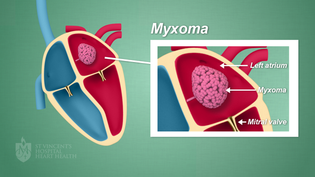
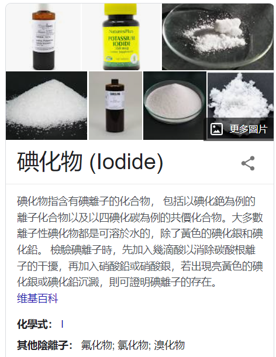
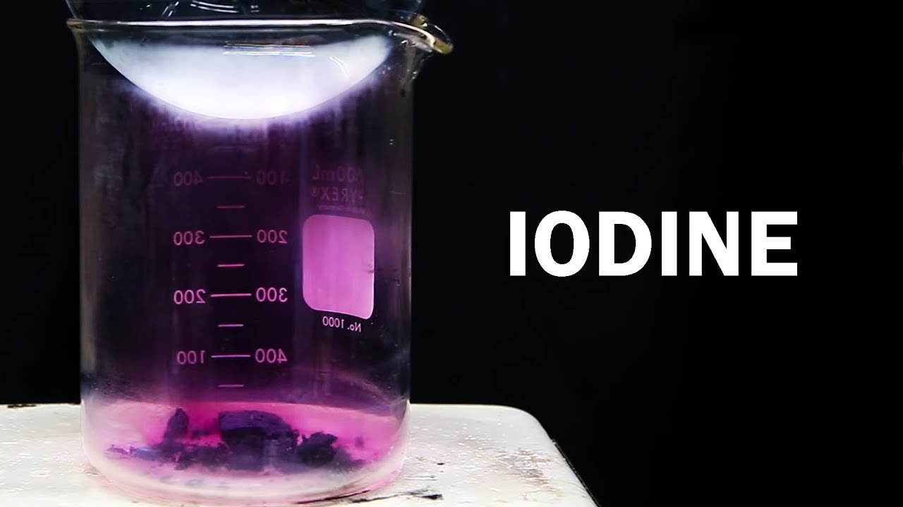
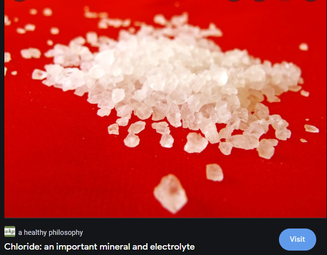
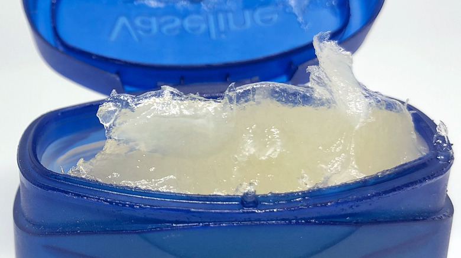

# 咬文嚼字-学科相关-Biology and Medicine

@(TOEFL)[托福, TOEFL, 词根词缀,咬文爵字,学科相关]

[toc]

# Biology(生物学)

**biology** - 意为“生命”或“生物”的希腊语词根**`bíos`**被近代欧洲语言吸收，广泛用作前缀或构词成分，特别是在20世纪。

构词力强的英语组合语素**`bio-`**就是由此而来的。**biography**是最早出现于英语的**`bio-`**衍生词之一。英国桂冠诗人、剧作家、批评家德莱顿（John Dryden, 1631-1700）在1683年首次将该词用于其散文著作*Life of Plutarch*。

**biography**源自希腊语*`biographiā`*，由bíos 'life'加gráphein 'write'构成，从英语构词法来看，就是**`bio-`** 'life'和**`-grahy`** 'writing'的组合，意思是“传记”。若再将biography冠以源于希腊语的组合语素**`auto-`** 'of oneself'（自己的），就构成**autobiography**（自传）。

**biology**是另一个较早产生的bio-衍生词，始见于19世纪初，是仿德语biologie和法语biologie创造的，由bio-加-ology 'the study of'（……学）构成。到了20世纪bio-衍生词猛增了起来，诸如**bioengineering**（生物工程），**bionic**（仿生学的），**biotechnology**（生物技术），**biosphere**（生物圈），**biorhythm**（生物节律），**biochemistry**（生物化学）等等。

例

- Boswell wrote a famous biography of Dr. Johnson. 博斯韦尔为约翰逊博士写过一本著名的传记。
- Famous people often have several very different biographies written about them. (CID) 名人们通常都有几种内容大相径庭的传记。
- Every sophomore is required to take biology. 每一位二年级生必修生物学。

| 单词                            | 解释                                                         | 单词 | 解释 |
| ------------------------------- | ------------------------------------------------------------ | ---- | ---- |
| **micro-be** 【ˈmaɪkroʊb】 | n. 微生物, 细菌 推荐micro-微小的 + be-生命  **`micro-`** = small, 表示“小”。源自希腊语 (s)mikros "small." **`be-`** = life, 表示“生命，生物”。源自希腊语 bios "life." 词源说明(童理民)   1 - micro-,微小的，-be,生命，词源同 biology,zoo.引申词义微生物。 |      |      |
|                                 |                                                              |      |      |
|                                 |                                                              |      |      |

## phyt- = plant, 表示“植物” {37}

> 源自希腊语 phutos, phuton "a plant."

| 单词                                         | 解释                                                         | 单词                                        | 解释                           |
| -------------------------------------------- | ------------------------------------------------------------ | ------------------------------------------- | ------------------------------ |
| **phyt-o-plankton** 【ˌfaɪtoʊˈplæŋtən】 | **`phyto-`** = plant, 表示“植物”。源自希腊语 phutos, phuton "a plant." **plankton** n. (总称)浮游生物 浮游藻;植物性浮游生物;浮游植物;浮游藻类;浮游植物群落 very small plants that float near the surface of water and on which sea creatures feed | **ceno-phyte**                         | 【植】新生代植物               |
| **epi-phyte**  【epɪfaɪt】         | **n.**(寄生于动物的)真菌；【植】附生植物 ； **`epi-`** 表示“在…上，在…周围，在…后面”。源自希腊语 epi "on, over, at." **`phyte-`** = plant, 表示“植物”。源自希腊语 phutos, phuton "a plant." | **phyt-o-bilogy** 【faɪtəʊbaɪ'ɒlədʒɪ】 | phyto-植物 + biology【生物学】 |
|                                              |                                                              |                                             |                                |

### orchid（兰花）：根部像男人睾丸的花卉

> 词根分解  [词根树]
> orchid- 
> = testes, 表示“睾丸”。来自希腊语的 orcheome（舞蹈），古雅典运动员跑步是裸体的，这个时候 xx 就像在跳舞。源自希腊语 orkhis "testicle."

提起兰花，我们脑子里会涌现一种优雅脱俗的花朵。哇，淡紫色，好浪漫哦！慢着，地表之上这货确实漂亮，但地表之下的根很猥琐哦。怎讲？因为orchid这个单词的希腊词源本意是“睾丸”，因为其根上有两个睾丸状的东东。英国人也挺直白，把兰花叫做fool's ballocks，ballocks=ball+指小后缀-ock+复数s。

但在西方很多国家的文字里，有些墨守成规的礼法人士在女士面前却羞于提起兰花。英语中表示“兰花”的单词**orchid**来自希腊语**orchis**（睾丸）。因为兰花是孖根植物，根部与男子睾丸一样成双成对且形状相似。

在古英语中“兰花”和“睾丸”都是**orchid**，后来为了避免误解和文雅，就用**testicle**来表示“睾丸”，而用**orchid** 专指兰花。

至今**orchid**作为词根在一些医学术语中还是指“睾丸”，如**orchiopexy**（睾丸固定术）。

- **orchid**：['ɔːkɪd] 
  - n.兰花，兰科植物，淡紫色
  - adj.淡紫色的
- **orchiopexy**：[,ɔ:ki'ɔpəksi] n. 睾丸固定术

### Celsius /selsiəs/

Celsius（摄氏度）：发明摄氏温标的瑞典科学家摄尔修斯。

我们常用的摄氏温标是由瑞典科学家**安德斯•摄尔修斯**（Anders Celsius，1701～1744）发明的。摄尔修斯是瑞典著名的物理学家和气象学家。1742年，他在总结前人经验的基础上创立了摄氏温标。他把水银温度计插人正在熔解的雪中，定出冰点作为一个标准温度点；然后又把温度计插入沸腾的水中，定出沸点作为另一个标准温度点。并把冰点和沸点之间等分100度，所以摄氏温标又叫百分温标。

1948年在巴黎召开的第九届国际计量大会把百分温标正式命名为“摄氏温标”，并用摄尔修斯的名字Celsius作为摄氏温标的单位，称为“摄氏度”，用℃表示。

最初，为了避免测量低温时出现负值，摄尔修斯把水的沸点定为零度，而冰点定为100度。摄尔修斯去世后，根据其他科学家的建议，人们把这种标度倒转过来，以冰点为零度，沸点为100度。

- Celsius：['selsɪəs] n.摄氏度adj.摄氏的

------------------------

### pupae /ˈpjuːpiː/  (pupa /ˈpjuːpə/)

**`pupa -`** 

 **pupa**本是拉丁语***pūpa***，意为“***女孩***”、“***洋娃娃***”，复数形式为***pupae***。1758年瑞典博物学家林奈（**[Carolus Linnaeus](https://en.wikipedia.org/wiki/Carl_Linnaeus)**, 1707-1778）把它当作术语来用，指“蛹”。林奈这一创造曾被誉为“天才诗人的手法”（**a stroke of poetic genius**）。一位作家这样写道：“只要你看一看蛾蛹的下侧，你就会发现它的脸、它的眼睛以及小臂状的双翅，有如襁褓中的婴儿，有如小洋娃娃。” 

英语另有两个词 **puppet**（木偶）和 **puppy**（小狗），从表面上看乃分别来自法语**poupette**（玩偶）和**poupée**（玩偶），实际上其终极词源同为拉丁语***pūpa***。

>  例　Female wasps lay their eggs in the pupae of various flies. 雌黄蜂在多种苍蝇的蛹中产卵。

 

因为如果你仔细观察蛾蛹，就会发现它的脸、眼睛以及小臂状的双翅，都像极了襁褓中的婴儿，犹如小洋娃娃。

与pupa同源的英语单词还有**pupil**（小学生）、**puppet**（木偶）和**puppy**（小狗）。

- pupa： ['pjupə] n. 蛹
- pupil：[ˈpjuːpl] n. 学生；瞳孔；未成年人
- puppet：['pʌpɪt] n. 木偶；傀儡；受他人操纵的人
- puppy：['pʌpi] n. 小狗，幼犬

### pupil（学生）：小小的玩具娃娃

当我们看到幼儿园中或小学低年级班中一群群按照老师要求规规矩矩端坐在座位上的小朋友们，是不是觉得他们特别像小小的玩具娃娃一样？英语单词pupil（学生）的本意正是“小娃娃”，它来自拉丁语pupillus，是pupa（娃娃、玩偶）的指小形式。

pupil还可以表示“瞳孔”，因为我们仔细察看别人的瞳孔，可以发现瞳孔里有一个小人，其实就是你自己的倒影。

同源的单词还有puppet（傀儡）、puppy（小狗）等。

- pupil：['pjuːpɪl; -p(ə)l] n.（小）学生，瞳孔
- puppet：['pʌpɪt] n. 木偶；傀儡；受他人操纵的人
- puppy：['pʌpi] n. 小狗，幼犬

### larvae /ˈlɑrvi/ (larva /ˈlɑːrvə/)

A **larva** is an insect at the stage of its life after it has developed from an egg and before it changes into its adult form.

### malaria 由脏空气引发的疾病

疟疾（**malaria【məˈleriə】**）是一种由于疟蚊叮咬引发的传染病。在古代罗马(该词源自意大利语短语mala aria) 城周围有许多沼泽，沼泽附件的空气又脏又臭，在沼泽附近待的时间一久，人就容易得疟疾。

当时的罗马人不知道疟疾是因为疟蚊叮咬引发的，还以为是脏空气引发的，所以将这种病称为malaria，由mal（bad）+aria（air）构成，字面意思就是“脏空气”。英语单词malaria就来自意大利语**malaria**。

该词始用于18世纪中期。到了19世纪后半期，当人们发现疟疾是由按蚊（**anopheles【ə'nɒfəˌlɪz】**）传布时，便给疟疾重新下了定义，但却保留了原有的名称。

- **malaria**：[mə'leərɪə] n.疟疾，痢疾，瘴气
- **malarial**：[mə'lɛrɪəl] adj.疟疾的，患疟疾的，毒气的

### mosquito  （蚊子）：小飞虫

> 来自西班牙语 mosca,蚊子，-ito,小词后缀，来自拉丁语 musca,蚊子，来自 PIE*mu,蚊子，拟声词，模仿蚊子嗡嗡的声音，词源同 moth,midge.

蚊子的体型通常很小，因此在古代***西班牙***语中被称为**mosquito**，是**`mosca`**（飞虫）的指小形式，字面意思就是“小飞虫”。英语单词mosquito就直接来自西班牙语。

(**anopheles【ə'nɒfəˌlɪz】**词根则是来自古希腊)

- **mosquito**：[mə'skito] n.蚊子

- （比较）**mosque**【mɑːsk】 n. 清真寺 (a building in which Muslims worship )

  > 来自阿拉伯语 masjid,祷告的地方，清真寺，来自 ma-,表方位，sajada,俯伏在地，祈祷，祷告。

## flagell- = whip, 表示“鞭子”。源自拉丁语 flagrum "a whip."{7}

| 单词                                                   | 解释                                                         | 单词                                     | 解释                                                         |
| ------------------------------------------------------ | ------------------------------------------------------------ | ---------------------------------------- | ------------------------------------------------------------ |
| **flagell-um  **                   【fləˈdʒɛləm】 | n. 鞭毛, 鞭状葡萄枝, 鞭子 推荐：flagell-鞭子 + -um  **`flagell-`** = whip, 表示“鞭子”。源自拉丁语 flagrum "a whip."  词源说明(童理民)   1 - 词源同 flagellate,鞭笞。用于解剖学名词。 | cysto-flagellata                         | n. 囊状鞭毛虫类 推荐：Cysto-囊+ flagellata【鞭毛虫类】  Flagellata 【医】 鞭毛虫类 **`cyst-`** = bladder, pouch, 表示“囊”, 医学上引申为“膀胱”。源自希腊语 kustis "bladder, bag" < "bellows." **`flagell-`** = whip, 表示“鞭子”。源自拉丁语 flagrum "a whip." |
| **flagitious** 【flə'dʒɪʃəs】                     | a. 极恶的, 残忍的, 凶恶的 **`flagell-`** = whip, 表示“鞭子”。源自拉丁语 flagrum "a whip." 英英   adj. 1 . extremely cruel , wicked , or vicious  2 . notorious or infamous | **flail**[^1] 【fleɪl】             | n. 连枷 v. 用连枷打, 打 推荐：来自flagellate, 鞭打，鞭笞。后用来指打谷工具，连枷。  flagell- = whip, 表示“鞭子”。源自拉丁语 flagrum "a whip." 词源说明(童理民)   1 - 来自 flagellate,鞭打，鞭笞。后用来指打谷工具，连枷。 |
| **flagell-ate** 【ˈflædʒəleɪt】                   | vt. 鞭打, 鞭挞 a. 鞭状的, 鞭索形的, 有鞭毛的 n. 鞭毛虫 推荐：flagell-鞭子 + -ate  **`flagell-`** = whip, 表示“鞭子”。源自拉丁语 flagrum "a whip." **`-ate`** 表动词，“做，造成”。  词源说明(童理民)   1 - 来自 PIE*bhlag,击打，鞭笞，词源同 flail,flog. | **flagelli-form** 【flə'dʒelɪfɔ:m】 | n. 鞭毛状的, 细长而柔韧的 推荐：flagelli-鞭子 + form-形状  flagelli- = whip, 表示“鞭子”。源自拉丁语 flagrum "a whip." form- = shape, 表示“形状”。来自拉丁语 forma "form, shape, contour, apearance, beauty." adj.1 . describes an organism or body part that is long , tapering , and very narrow |
| **flagell-ant**[^2] 【flædʒɪlənt】                | n. 鞭笞者, 受鞭笞者, 自笞者;  a. (言语)刺人的, 伤人的 推荐：flagell-鞭子 + -ant  flagell- = whip, 表示“鞭子”。源自拉丁语 flagrum "a whip." -ant 表形容词，“…的”。  |                                          |                                                              |

[^1]:摩西英语(摩西) flail [fleɪl] vt.&amp;vi.打；用连枷打，n.连枷（打谷物用的工具）。这是拉丁词源单词flagellum [flə'dʒeləm] n.[昆] 鞭毛；鞭子被英语本土化的结果（元音间的g脱落，flagellum&gt;flail），类似fragil ['frædʒaɪl] adj.易碎的和frail [freɪl] adj.脆弱的。His arms were flailing in all directions. 

[^2]: 摩西英语(摩西) flagellant ['flædʒ(ə)l(ə)nt] n.苦修者；执鞭抽打者，adj.伤人的；鞭打的。欧洲黑死病（black death）期间，欧洲人口减少了三分之一。由于医学不发达，没有人知道瘟疫的源头。死亡阴影中，人们开始用鞭打自己的方式进行忏悔，希望这样能洗净过去的罪恶，从而不被瘟疫感染。词根flag-表to strike。  n. 1 . a penitent who whips himself or herself as a means of repentance  2 . somebody who uses whipping to achieve pleasure 

# Physiology 生理学

> he scientific study of the normal functions of living things

| 单词                       | 解释                                                         | 单词 | 解释 |
| -------------------------- | ------------------------------------------------------------ | ---- | ---- |
| **amnion** 【æmnɪən】 | **`amnion-`** 表示“羊膜”，源自希腊语 amnion "membrane around a fetus"。  1 . the inner of the two membranes enclosing the embryo of a bird , reptile , or mammal and its surrounding fluid .  2 . the fluid - filled sac within which the embryo of a bird , reptile , or mammal develops |      |      |
|                            |                                                              |      |      |
|                            |                                                              |      |      |

## Core- （心）：源自心脏的意识活动

我们中国人认为心脏是人的意识活动的场所，所以才有“心灵”、“心理”、“心思”等词汇。和我们东方人一样，古代西方人也有类似的观念，所以很多表示意识活动的单词都由表示心脏的词根**`cord-`**构成。该词根来自拉丁语**`cor/cordis`**（心脏）。词根**`card-/cardio-`**（心脏）来自希腊语***kardia***，但最终源头和**`cord-`**一样来自原始印欧语词根**`kerd-`**。

- **cord**-：心脏，心理，心灵
- **core**：[kɔː] n.核心，要点
- **cordial**：['kɔːdɪəl] adj. 衷心的，诚恳的；兴奋的
- **concord**：['kɒŋkɔːd] n.和谐；和睦；一致；协调
- **accord**： [ə'kɔːd]n. 符合；一致；协议；自愿vt. 使一致；给予vi. 符合；一致
- **accordance**：[ə'kɔrdns] n. 一致；和谐
- **discord**：['dɪskɔːd] n. 不和；不调和；嘈杂声vi. 不一致；刺耳
- **`card-`**/**`cardio-`**：心脏
- cardiac：['kɑrdɪæk] n. 强心剂；强胃剂adj. 心脏的；心脏病的；贲门的
- cardiology：[,kɑrdɪ'ɑlədʒi] n. 心脏病学
- cardiopathy： [,kɑrdɪ'ɑpəθi] n. 心脏病

### hormone  激素也叫荷尔蒙

**hormone** - 激素也叫荷尔蒙，是人或高等动物内分泌腺分泌的有机物质。它直接进入血液，对肌体的代谢、生长、发育和繁殖等起重要的调节作用，如甲状腺素、肾上腺素、胰岛素等都是激素。

激素的英语名称**hormone**（汉语的旧称荷尔蒙即由此音译而来）是英国科学家斯特林博士（E. H. Sterling）取自希腊语动词hormân 'stimulate, excite'（刺激，使兴奋）的现在分词hormôn，并在词尾加-e杜撰而成的。

他在1905年8月15日出版的《柳叶刀》（The Lancet）杂志的一篇文章中提及该物质时说，“这些化学信使（chemical messengers）我们可以称之为hormone。”

例

- We are governed by the hormones that circulate around our bodies. (CCE) 我们受在我们周身循环的荷尔蒙调节支配。
- Dairy cows are often given hormones to promote milk production. (CAE) 乳牛常常被注射荷尔蒙以增加奶产量。
- Those children do not produce enough growth hormone. 那些孩子缺乏生长激素。

### acne（痤疮）：acme的误写

acne【ˈækni】（痤疮）：acme【ˈækmi】（顶点）的误写。

单词**acne**指的是青少年脸上常见的粉刺、痤疮，它实际上与单词**acme**（顶点、最高点）同源。单词**acne**和**acme**都源自希腊语***akmas***，本意是“点”，同时还可以表示脸上的斑点。

	

6世纪时，在将希腊语**akmas**直译为拉丁语时，译者看花了眼，将字母**`m`**看成了**`n`**，译成了拉丁语***aknas***。这一错误保留至今，并演变成了英语单词**acne**，专指“粉刺、痤疮”。

- acne：['ækni] n. 粉刺，痤疮
- acme：['ækmi] n. 顶点，极点；最高点

## fren-（精神）：控制人精神的横膈膜

横隔膜是胸腔和腹腔之间的分隔，它位于心脏和双侧肺脏的下面，肝脏、脾脏、胃的上方，就像一个大圆盘平放在身体内部分隔了胸腹腔。由于横膈膜与心脏距离较近，古人看到人情绪激动时心跳也会加快，便以为横膈膜是负责人精神状态的器官，因此英语中表示“横膈膜”的词根fren-/phren-同时还可以表示“精神”，产生了很多与“精神”相关的单词。

- fren-/phren-：精神
- diaphragm：['daɪəfræm] n.横隔膜，隔板，快门，光圈
- phrenic：['frɛnɪk] adj. 横隔膜的；精神的
- frenzy：['frenzɪ] n.狂暴，狂怒，暴怒vt.使发狂，使狂怒
- frenetic：[frə'netɪk] adj.狂热的，发狂的n.疯子，狂人
- schizophrenia：[,skɪtsə'frinɪə] n.精神分裂症
- schizophrenic：[,skɪtsə'frɛnɪk] adj. 精神分裂症的n. 精神分裂症患者

## 粘液

### 1. myx- = mucus, 表示“粘液”。源自希腊语 muxa "mucus, lamp wick." {6}

| 单词                                | 解释                                                         | 单词       | 解释                                                         |
| ----------------------------------- | ------------------------------------------------------------ | ---------- | ------------------------------------------------------------ |
| **myx-oma** 【mɪks'əʊmə】      | n. 粘液瘤 推荐：myx-粘液 + -oma肿瘤  **`myx-`** = mucus, 表示“粘液”。源自希腊语 muxa "mucus, lamp wick." **`-oma`** = "tumor, mass, swelling", 名词后缀，表示“...肿、...瘤”等。正确的复数形式是 -omata。  词源说明(童理民)   1 - 来自希腊语 myxa,黏液，词源同 mucus,muggy.-oma,瘤，肿块，词源同 myeloma,carcinoma. | myx-oma-s  | 粘液瘤（myxoma的复数） 推荐：myx-粘液 + oma-瘤 + -s  **`myx-`** = mucus, 表示“粘液”。源自希腊语 muxa "mucus, lamp wick." **`-oma`** = "tumor, mass, swelling", 名词后缀，表示“...肿、...瘤”等。正确的复数形式是 -omata。 |
| **myx-omata** 【mɪkˈsəʊmətə】  | 粘液瘤 推荐：myx-粘液 + -omata, 瘤  **`myx`**- = mucus, 表示“粘液”。源自希腊语 muxa "mucus, lamp wick." **`-omata`** = "tumor, mass, swelling", 名词后缀，表示“...肿、...瘤”等。正确的复数形式是 -omata。 |            |                                                              |
| **myx-edema ** 【mɪksɪ'di:mə】 | n. 粘液水肿 单词笔记   ［添加］ 推荐： myx-粘液 + edema【n. 水肿】  **`myx-`** = mucus, 表示“粘液”。源自希腊语 muxa "mucus, lamp wick." **`edema`** n. 水肿, 浮肿 | myxo-edema | n. 粘液水肿 推荐：myxo-粘液 + edema【n. 水肿】 **`myxo-`** = mucus, 表示“粘液”。源自希腊语 muxa "mucus, lamp wick." **`edema`** n. 水肿, 浮肿 |
|                                     |                                                              |            |                                                              |

### 2. phlegm （粘液）：导致人性情冷淡的粘液 {5}

> 词根分解  [词根树]
> **`phlegm-`** {5}
> = flame, 表示“发炎”。源自希腊语 phlegein "to burn."

根据四体液学说，体内粘液占比较高的人性情冷淡、反应迟钝。因此，英语单词**phlegm**（粘液）的形容词**phlegmatic**就产生了“冷淡的、迟钝的”等含义。

古医学体液理论构成人体的血液，黏液，胆汁，黑胆汁四种体液之一。来自希腊语 phlegma,发热，由体热所致的多痰症，来自 phlegein,燃烧，发热，来自 PIE*bhel,照耀，燃烧，词源同 blaze,bleach.

后在中世纪医学理论认为体内多痰会致人**冷淡**，**迟钝**，但是，被误解为冷淡是**冷静**，**镇定**的表现，因此，产生模糊和矛盾的词义。

- **phlegm**：[flem] n. 痰；粘液
- **phlegmatic**：[fleg'mætɪk] adj. 冷淡的；迟钝的；冷漠的
- **phlegmy**：['flɛmi] adj. 痰的；生痰的；含痰的

1. the thick mucus secreted by the walls of the respiratory passages , especially during a cold 
2. calmness or composure that is not easily disturbed 
3. in medieval medicine , one of the four basic bodily fluids . Phlegm was believed to be cold and moist in nature and to cause sluggishness and apathy . 
4. a thick yellow or green substance that you get in your nose and throat , especially when you have a cold 
5. the ability to be calm in a dangerous or frightening situation 

# Medicine [ˈmedɪsn]

## ine / in

### 1. 表形容词 "....的" {51}

also *-in*, adjectival word-forming element, Middle English, from Old French *-in*/*-ine*, or directly from Latin suffix *-inus*/*-ina*/*-inum* "of, like," forming adjectives and derived nouns, as in *divinus*, *feminus*, *caninus*; 

> 这个词根可以看出我对拉丁(古罗马)词根有多陌生。。。。

| 单词                          | 解释                                                         | 单词                               | 解释                                                         |
| ----------------------------- | ------------------------------------------------------------ | ---------------------------------- | ------------------------------------------------------------ |
| **bov-ine** 【ˈboʊvaɪn】 | a. (似)牛的, 迟钝的n. 牛科动物 ： bov-牛 + -ine **`bov-`** = ox, 表示“牛”。源自拉丁语 bos (词干 bov-) "ox, bull, cow." 更多同源词... **`-ine`** 表形容词，“…的”。 | aquil-ine                          | 似鹰的，钩状的                                               |
| asin-ine                      | 驴的，愚蠢的                                                 | can-ine                            | 犬齿，                                                       |
| carp-ine                      | 山羊的                                                       | columbine                          | 鸽似的                                                       |
| elephat-ine                   | 象的，巨大的，粗苯的                                         | equ-ine                            | 马的                                                         |
| leonine                       | 狮子的，狮子般的                                             | lup-ine                            | 狼的，凶残的                                                 |
| pisc-ine                      | 鱼的，鱼族的                                                 | porc-ine                           | 猪的，猪似的                                                 |
| serpent-ine                   | 蛇的，层层卷绕的，阴险的，迂回的                             | vultur-ine                         | 秃鹫似的，贪婪的，掠食的                                     |
| sibyll-ine                    | 女巫的，预言性的                                             | hirc-ine                           | 山羊的，羊膻味的                                             |
| mur-ine                       | 鼠科的                                                       | viper-ine                          | 毒蛇的                                                       |
| vulp-ine                      | 狐狸的，狐狸似的，诡计多端的                                 | zebr-ine                           | 斑马的，像斑马的                                             |
| petal-ine                     | 花瓣的，花瓣状的                                             | **alkal∙ine**   【ˈælkəlaɪn】 | **`alkal-`**  表示“碱”，源自阿拉伯语 al-qaliy (the ashes)。al-是阿拉伯语中的定冠词 "the"。  碱性的;含碱的（Something that is **alkaline** contains an alkali or has a pH value of more than 7.） |
| caul-ine                      | 茎的，茎生的                                                 | a-mar-anth-ine                     | 不凋的，不死的，紫红色的                                     |
| hyacinth-ine                  | 风信子的，紫青色的                                           | hyal-ine                           | 玻璃似的，透明的                                             |
| sangu-ine                     | 血红色的，满怀希望的，乐观的                                 | nerv-ine                           | 神经的，有镇静作用的                                         |
| sup-ine                       | 仰卧的，掌心向上的，懒散的                                   | saturn-ine                         | 沉默寡言的，阴沉的，铅中毒的                                 |
|                               |                                                              |                                    |                                                              |
| femin-ine                     | 女性的，阴性的                                               | infant-ine                         | 小孩似的                                                     |
| ex-sangu-ine                  | 失血的，贫血症的                                             | sacchar-ine                        | 糖的，含糖的，极甜的                                         |
| sal-ine                       | 盐的，苦涩的，                                               | bacul-ine                          | 棍棒的，鞭刑的                                               |
| inter-nec-ine                 | 相互残杀的，两败俱伤的                                       | per-egr-ine                        | 流浪的，移居的，漫游的，外国的，一样的                       |
| asbest-ine                    | 石棉的，不燃性的                                             | figual-ine                         | 陶土的                                                       |
| estuar-ine                    | 河口的，港口的                                               | pont-ine                           | 桥的，与桥有关的                                             |
| river-ine                     | 河的，河边的，                                               | pendul-ine                         | 悬垂的                                                       |

### 2. 表名词，“状态，药物，化学物品”等  {39}+{65}

> **`-ine`**: 该元素组成的物品，比如氯气、咖啡因等
>
> **`-ide`**: 该元素和其他元素组合成的物品，如：氯化物（Chloride (Cl-) forms when chlorine (Cl2) reacts with hydrogen or [sodium](https://www.ahealthyphilosophy.com/article/sodium-an-essential-macromineral).）、氧化物等 

- 有两种意思，其中一种是 chemical suffix [-ine](https://www.etymonline.com/word/-ine?ref=etymonline_crossreference#etymonline_v_42197)

> word-forming element in chemistry, often interchangeable with [-in](https://www.etymonline.com/word/-in?ref=etymonline_crossreference#etymonline_v_42359) (2), though modern use distinguishes them; early 19c., from French *-ine*, the suffix commonly used to form words for derived substances, hence its extended use in chemistry. It was applied unsystematically at first (as in [aniline](https://www.etymonline.com/word/aniline?ref=etymonline_crossreference)), but now has more restricted use.

| 单词                                   | 解释                                                         | 单词                                                 | 解释                                                         |
| -------------------------------------- | ------------------------------------------------------------ | ---------------------------------------------------- | ------------------------------------------------------------ |
| **Caffe-ine** 【ˈkæfiːn】         | 咖啡因，咖啡碱 **Caffeine** is a chemical substance found in coffee, tea, and cocoa, which affects your brain and body and makes you more active. | **coca-ine**                       【koʊˈkeɪn】 | coca n. [古柯](https://baike.baidu.com/item/%E5%8F%A4%E6%9F%AF/2772401?fr=aladdin), 古柯叶，南美经济作物 a powerful drug that some people take illegally for pleasure and can become addicted to. Doctors sometimes use it as an anaesthetic . |
| **morph-ine**   【ˈmɔːrfiːn】     | n. 吗啡 推荐：morph-形状 + -ine **`morph-`** = form, shape, 表示“形状”。派生的 morphin- 专指“吗啡”。源自希腊语 morphe "form, shape"。 **`-ine`**  表名词，“状态，药物，化学物品等” | **penicill-in** 【ˌpenɪˈsɪlɪn】                 | 青霉素;盘尼西林                                              |
| adrenal-ine                            | **`adrenal-`** 表示“肾上腺”。复合词根：**`ad-`**（to）+ **`reno-`**（肾）+**al-**（...的)。 肾上腺分泌的一种激素及神经传导物质，能使心跳加快，让人在兴奋、恐惧、紧张或愤怒时精力猛增。 | **vacc-ine**                                         | **`vacc-`** = bull, 表示“牛”。源自拉丁语 vacca "cow. 牛痘苗，疫苗 |
| medic-ine                              |                                                              |                                                      |                                                              |
|                                        |                                                              | nectar-ine[^3] 【ˈnektəriːn】                   | 油桃(桃的变种，果皮光滑)                                     |
| anti-febr-ine                          |                                                              | dopam-ine                                            | compound organic chemical, 1959, from *DOPA,* the amino acid (from first letter of elements of *dioxyphenylalanine*), + [amine](https://www.etymonline.com/word/amine?ref=etymonline_crossreference). |
|                                        |                                                              |                                                      |                                                              |
| **iod-ide** 【ˈaɪədaɪd】          | n. 碘化物 推荐：iod-碘 + -ide  **`iod-`** 化学词根表示“碘”，来源于io-紫色，如 violet【紫色】。 **`-ide`** 化学名词后缀，表示“...化物”如oxide氧化物。  词源说明(童理民)   1 - 来自 iodine,碘，-ide,化学名词后缀。 | **iod-ine** 【ˈaɪədaɪn】                        | n. 碘, 碘酒  **`iod-`** 化学词根表示“碘”，来源于io-紫色，如 violet【紫色】。 **`-ine`** 表名词，“状态，药物，化学物品等”。  词源说明(童理民)   1 - 来自希 腊语 ideides,紫色的 ，来自 io-,紫色， 词源同 violet,-eides,像，相 似，词源同alkaloid,ovoid,idea.后 1814 年，英国化学家 Humphrey Davy 借用该希腊词来表示化学元素碘。 |
| **chlor-ide** 【ˈklɔːraɪd】       | 氯化物**Chloride** is a chemical compound of chlorine and another substance.（The scientific name for common salt is sodium chloride.食盐的学名是氯化钠。）  Chloride (Cl-) forms when chlorine (Cl2) reacts with hydrogen or [sodium](https://www.ahealthyphilosophy.com/article/sodium-an-essential-macromineral). | **chlor-ine** 【ˈklɔːriːn】                     | n. 氯 推荐：chlor-氯 + -ine  **`chlor-`** = green, 表示“绿”。用在化学领域表示"氯"源自希腊语 khloros "green, greenish yellow;" khloos "greenish color." **`-ine`** 表名词，“状态，药物，化学物品等”。  |
|                                        |                                                              | **chol-ine** 【kəʊli:n】                        | n. 胆碱 推荐：chol-胆 + -ine  **`chol-`** = bile, 表示“胆，胆汁”。古希腊人认为霍乱与黑胆汁过多有关，所以也表示“霍乱”。源自希腊语 khole "bile." **`-ine`** 表名词，“状态，药物，化学物品等”。 |
| **mescal-ine**      【ˈmeskəlɪn】 | 墨斯卡林，仙人球毒碱(从仙人球中提取的致幻剂) a drug obtained from a type of cactus , that affects people's minds and makes them see and hear things that are not really there | **aspir-in** 【ˈæsprɪn】                        | 阿司匹林,一种解热镇痛药品的商标名称。 a drug used to reduce pain, fever and inflammation |
| dis-cip-l-ine                          | **`dis-`**分开 + **`cip-`**抓住 + **`-l-`** + **`-ine`**。引申词义训练，必要的纪律，惩罚。 | doctr-ine                                            | = to teach, 表示“教”。源自拉丁语 docere "to teach."          |
| fam-ine                                | fam-来自拉丁语fames,饥饿，饥荒                               | rout-ine                                             | **route** n. 路径, 途径, 路线 vt. 确定路线, 按规定路线发送。 常规;正常顺序;生活乏味;无聊;(演出中的)一套动作，一系列笑话(等) |
| mar-ine                                | 舰队，水兵                                                   | **glycer∙ine** 【ˈɡlɪsərɪn】                    | n. 甘油, 丙三醇： a thick sweet clear liquid made from fats and oils and used in medicines, beauty products and explosives 推荐：glycer-甜 + -ine **`glycer-`** = sweet, 表示“甜”，构成医学词汇时表示“葡萄糖”。源自希腊语 glukus "sweet." **`-ine`** 表名词，“状态，药物，化学物品等”。 |
| fluor-ine                              |                                                              | curarine                                             |                                                              |
| epi-nephr-ine                          |                                                              | vasel-ine                                            | 凡士林                                                       |

[^3]: nectar（甘露）：神的饮品。希腊神话众神饮用的琼浆玉液叫做nektar，由nek-（死亡）和-tar（战胜）组成，字面意思就是“战胜死亡”，据说神仙们饮用后可以永葆美貌并长生不老。英语单词nectar就来来源于此。nectar：['nektə] n.花蜜，甘露，琼浆玉液，神酒，美味的饮料  nectarous：['nektərəs] adj.甘美的，神酒似的

nectary：['nekt(ə)rɪ] n.（植物）蜜腺，蜜管

#### penicillin 青霉素

penicillin - 1928年春的一天，英国细菌学家弗莱明（**Sir Alexander Fleming**, 1881-1955）在伦敦圣玛丽医院（St. Mary's Hospital）的实验室里观察到他所培养的葡萄球菌被一种特异青霉菌penicillium notatum所污染。

这种霉菌极有可能是从窗外飘进来的。随着青霉菌的迅速繁殖，金黄色的葡萄球菌不仅不能生长发育，而且不断地被消灭。这显示青霉菌能分泌一种杀灭葡萄球菌或防止其生长的物质。他把这种物质取名为penicillin。

以后英国病理学家佛洛里（**Howard Walter Florey**, 1898-1968）和德裔英籍生物化学家钱恩（**Ernst Boris Chain**, 1906-1979）根据弗莱明的发现，将**penicillin**分离、提纯，并首次进行了临床试验，从而肯定了它的治疗价值。为此三人合得1945年诺贝尔生理学或医学奖。

**penicillin**的发现标志着抗生素纪元的开始，它拯救了千百万人的生命，解除了无数人的痛苦。尽管弗莱明发现**penicillin**完全出于偶然，但他的名字将永远和**penicillin**联系在一起。

**penicillin**一词是发现者根据可用以提取青霉素等抗生素的青霉菌之拉丁名称***pēnicillium***杜撰的，汉语最初将它音译为“盘尼西林”，但如今人们常称之为“青霉素”。

- The doctor prescribed some penicillin to fight my infection. (NED) 为了治疗我的感染，医生给我开了一些青霉素。
- She has a penicillin allergy. 她对青霉素过敏。

 

#### aspirin 阿司匹林：一种解热镇痛药品的商标名称

阿司匹林的学名叫做乙酰水杨酸，是一种历史悠久的解热镇痛药，诞生于1899年3月6日。

在德语中，乙酰水杨酸是***acetylierte spirsäure***，冗长而拗口，不方便记忆。于是，一位德国化学家Heinrich Dreser利用acetylierte（乙酰[ **xiān**]）的第一个字母a、spirsäure（水杨酸）的前四个字母spir以及表示化学制品的后缀**`-in`**，创造了aspirin这个新词，用作一种乙酰水杨酸药品的商标名。

由于这个商标名易于发音和记忆，很快就得到广泛应用。人们去药店买药时，不会说要买“乙酰水杨酸”，而是直接说买**aspirin**，哪怕要买的药品并非aspirin这个品牌。就这样，aspirin这个词就从一个商标名演变成了一种药品名称。

- aspirin：['æsprɪn] n.阿司匹林
- The doctor prescribed aspirin for my arthritis pain. (CWR) 医生为我的关节炎疼痛开了阿斯匹林。
- As aspirin prevents the formation of blood clots, it is also used to treat heart attack and stroke victims. (CID) 由于阿斯匹林可以防止血块的形成，它也被用于治疗心脏病和中风患者。

#### vaccine 疫苗

> **`vacc-`**=bull, 表示*牛*，来源于拉丁语**vacca**.
>
> **`-ine`** 表名词，“状态，药物，化学物品”等

琴纳（Edward Jenner,18世纪英国医生）将用于人体接种的牛痘苗称为**vaccine virus**，其中**vaccine**来自拉丁语**vaccinus**（母牛的），原本是个形容词，后来演变为名词。不仅可用来表示用于预防天花的牛痘苗，还可以表示任何一种用于接种的疫苗。

- **vaccinate**: `/'væksɪneɪt/`  vt.给……接种疫苗vi.接种疫苗
- **vaccination** ：[,væksɪ'neɪʃən] n.接种疫苗

#### alkali（碱）：古阿拉伯人从灰烬中提取的物质

在中世纪时，阿拉伯人就掌握了从生长于海边盐碱地上的藜科植物**saltwort**（猪毛草）中提取碱的方法。他们焚烧这种植物，从灰烬中获得碱类物质。

在阿拉伯语中，这种来自灰烬的碱被称为***al-qali***，其中**al**是定冠词，**qali**就是“灰烬”的意思。

英语单词alkali就源自阿拉伯语**al-qali**，表示“碱”。

- **alkali**：['ælkəlaɪ] 

  - n.碱
  - adj.碱性的

- **alkaline**：['ælkəlaɪn] adj.碱性的，碱的

- **alkaloid**：['ælkə'lɔɪd] n. 生物碱；植物碱基

   

#### vaseline 凡士林

**vaseline** - 提起凡士林，不少学习英语的都知道是从英语的**vaseline**音译而来的，但是对**vaseline**的由来，恐怕就未必有很多人了解了。这一直可以追溯到欧洲移民来到北美新大陆的早期。这些移居者经常发现一种奇特现象，冰凉的山洞中汇成的河水流入地底下神秘地消失后，竟在数英里外重又冒出地面，然而，此时水面上却蒙上薄薄一层油，宛如彩虹，闪闪发光。此外，移居者还发现一股股泉水破地而出，水面同样蒙着薄薄一层油。

过了些时候，移居者目睹印第安人把水面上的油撇起来，敷在烧伤、刀伤、擦伤等伤口处。后来欧洲移民也模仿着做，有些人还把撇取的油装瓶当作药物出售，并称这种油为“印第安油”。

整整一个世纪过去了。一位来自新英格兰，名叫乔治·比斯塞尔（**George Bissell**, 1821-1884）的年轻教师对这种油很感疑惑。他暗自思忖：“能不能从地下取出一种更浓的油呢？”

比斯塞尔把他的想法对一个叫埃德温·德雷克（**Edwin Drake**, 1819-1880）的朋友讲了。他们一起到宾夕法尼亚州泰特斯维尔（**Titusville**）附近钻了一口世界上最早的油井。附近的居民认为这种做法是徒劳无益的，因此称这一工程为“德雷克的徒劳而又愚蠢之举”。

然而，此举后来却成了一种了不起的工业壮举。1859年8月27日，德雷克他们果然在距地面25米的油层中打出了石油。

发现石油的消息不胫而走，数日后一直传到纽约市布鲁克林区一位化学家耳中。这位化学家名叫罗伯特·契斯柏洛（**Robert A. Chesebrough**, 1837-1938），他正在进行一项费时而艰巨的工作：从煤炭中提取煤油。当他一听到这消息，明白自己吃亏了，因为从石油中提取煤油要比从煤炭中提取容易得多了。契斯伯洛觉得不能因此无所事事，决定迁居泰特斯维尔。

一天，他在观看德雷克和工人们钻井时，发现一种蜡状物质附在巨大的钻头上。工人们把它弄下来扔掉。可是他们遇有刀伤或烧伤时，总是首先用这种东西往伤口上一抹。

契斯柏洛拿了些回家，用它做试验，最后成功地从中提取了一种洁净的糊状物。他在自己身上的伤口涂了一些作试验，发现伤痛大有减轻之感，伤口也愈合得快些。他立即向政府申请专利以保护他的产品，并将之命名为**vaseline**。1872年**Vaseline**被契斯柏洛公司（the Chesebrough Manufacturing Company）作为产品的正式商标名。

 

**vaseline**这个名称契斯柏洛一定是费尽心思才造出来的，它是***三种语言***的混合词。他先是取了德语词**Wasser**（水）中的**`was-`**加上希腊语***élaion***（油）中的**el**，再加上拉丁词缀**`-ine`**构成了***waserline***。后来他转念一想，w在德语中不是发成英语中的v吗？于是他才最后把该物质定名为**vaseline**。

契斯柏洛所发现的物质学名叫**petrolatum**或**petroleum jelly**（矿脂，石油冻），然而他所用的商标名**vaseline**却作为其俗名一直沿用至今。

例　“Try some Vaseline on those cold sores,”Jim suggested. (CWR) “在冻疮上搽一些凡士林吧，”吉姆建议说。

"Vaseline is great for dry skin," Nancy said. (CWR) “凡士林对干燥的皮肤很适用，”南希说。

词源说明(童理民)  
1 - 来自德语，vas-,水，词源同 water,-el,油，词源同 oil,-ine,化学名词后缀。因从石油提炼而得名。

英英  
n.
1 . [ Brands and Products ] a thick oily substance used on dry skin 

## -osis  医学词根，表示“病理状况”{130}

> -osis 
> 医学词根，表示“病理状况”，复数形式 -oses。

| 单词                                                         | 解释                                                         | 单词                                                        | 解释                                                         |
| ------------------------------------------------------------ | ------------------------------------------------------------ | ----------------------------------------------------------- | ------------------------------------------------------------ |
| **halit-osis **                              【ˌhælɪˈtoʊsɪs】 | **`halit-`** = breathe, 表示“呼吸”，来自拉丁语。 **`-osis`** 医学词根，表示“病理状况”，复数形式 -oses。 a condition in which the breath smells unpleasant | **acid-osis**                          【ˌæsəˈdoʊsəs】 | **`acid`** n. 酸, 酸类物质, 尖刻, 迷幻药 a. 酸的, 酸性的, 尖刻的, 敏锐的 **`-osis`** 医学词根，表示“病理状况”，复数形式 -oses。 abnormally high acidity (excess hydrogen-ion concentration) of the blood and other body tissues |
| **`parasit∙osis`** 【ˌpærəsaɪ'təʊsɪs】                  | **`parasite`**  n. 寄生生物, 寄生虫, 食客 a parasitic disease or infestation | **pollin∙osis** 【ˌpɑləˈnosɪs】                        | **`pollen`** n. 花粉 vt. 传授花粉给  seasonal rhinitis resulting from an allergic reaction to pollen |
| **psych∙osis**   【saɪˈkoʊsɪs】                         | **`psych-`** = soul, 表示“灵魂，心理，精神”。源自希腊语 psykhe "spirit, soul." a serious mental illness that affects the whole personality | **toxic∙osis** 【tɒksɪ'kəʊsɪs】                        | **`toxic-`** = poison, 表示“毒”。源自希腊语 toxon "bow." any disease or condition caused by [poisoning](https://www.collinsdictionary.com/zh/dictionary/english/poisoning) |
| **zoo∙nos∙is** 【zəʊ'ɒnəsɪs】                           | **`-osis`** 医学词根，表示“病理状况”，复数形式 -oses。 **`zoo-`** = animal, 表示“动物”。源自希腊语 zoon, zoion "living being, animal." **`nos-`** = disease，表示“疾病”。源自希腊语nosos "disease, sickness, malady." an animal disease that can be transmitted to humans（人畜（兽）共患病） | **chlor-osis** 【klə'rəʊsɪs】                          | 萎黄病；缺绿病;褪绿部分 iron deficiency anemia in young women   **`chlor-`** = green, 表示“绿”。用在化学领域表示"氯"源自希腊语 khloros "green, greenish yellow;" khloos "greenish color."  **`-osis`** 医学词根，表示“病理状况”，复数形式 -oses。 |

##  -ia：表名词，某种疾病 {125}

| 单词                                                         | 解释                                                         | 单词                                                         | 解释                                                         |
| ------------------------------------------------------------ | ------------------------------------------------------------ | ------------------------------------------------------------ | ------------------------------------------------------------ |
| **pneumonia** 【njuːˈməʊniə】                           | **`pneumon-`**  = lung, 表示“肺”。源自希腊语 pnein "to breatoe," pneuma "breath, wind, spirit." **`-ia`**  表名词，表示“某种病”。 **Pneumonia** is a serious disease which affects your lungs and makes it difficult for you to breathe. | **eu-thanas-ia**                            【ˌjuːθəˈneɪʒə】 | **eu-好 + thanas-死亡 + -ia表示“疾病”=>安乐死** **`eu-`** 表示“好，优秀”。源自希腊语 eu- "well." **`thanas-`** = death，表示“死亡”。源自希腊语 thanatos "death." the practice (illegal in most countries) of killing without pain a person who is suffering from a disease that cannot be cured |
| eu-phor-ia                                                   | 兴奋，陶醉                                                   | dys-phor-ia                                                  | 烦躁不安                                                     |
| **my-op-ia**  【maɪˈoʊpiə】                             | **my-=myst-关闭 + op-眼睛 + -ia，引申词义目光短浅，后用于指近视眼=>近视** **`my-`** = secret, mystery, 表示“秘密，神秘”，原意表示“关闭”。 **`op-/ops-/opt-/opto-`** = sight, 表示“视力，眼睛”。源自希腊语 ops "eye." | **hyper-op-ia**  【ˌhaɪpəˈroʊpiə】                      | **hyper-超过，多 + op-视力 + -ia=>远视** **`hyper-`** 表示“超过，太多”。源自希腊语 huper "over." **`op-`** = sight, 表示“视力，眼睛”。源自希腊语 ops "eye." |
| hyster-ia                                                    | 歇斯底里在                                                   | neo-phil-ia                                                  | 新欢新奇                                                     |
| **algo-lagn-ia**  【æl'ɡəʊlæɡnjə】  [sadism](http://www.youdao.com/w/sadism/?keyfrom=dict.collins), [masochism](http://www.youdao.com/w/masochism/?keyfrom=dict.collins) | **algo-痛 + lagn-色欲 + -ia表示“疾病”=>受虐狂**. **`algo-`** = pain, 表示“痛”。 **`lagn-`** = lust, 表示“色欲”。源自希腊语 lagnos "lustful, lascivious." sexual pleasure experienced through inflicting【ɪnˈflɪktɪŋ】 or experiencing pain | necro-phil-ia                                                | 恋尸狂                                                       |
| pedo-phil-ia                                                 | 恋童癖                                                       | phob-ia                                                      | 恐惧症                                                       |
| peri-pet-ia                                                  | 剧情突变，命运的突变                                         | perip-pete-ia                                                | 情节突变                                                     |
| alopec-ia                                                    | 脱发                                                         | a-mnes-ia                                                    | 健忘症                                                       |
| hypp-mnes-ia                                                 | 记忆力减低                                                   | an-aem-ia                                                    | 贫血症                                                       |
| an-em-ia                                                     | 贫血症                                                       | an-orex-ia                                                   | 食欲缺乏 厌食症                                              |
| **glycos-ur-ia**  【ˌglaɪkəʊ'sjʊərɪə】                  | 糖尿病 **`glycos-`** = glucose, glycose, 表示“糖”。源自希腊语 glukus "sweet." **`ur-`** = urine, 表示“尿”。源自拉丁语 urina "urine." the presence of abnormally high levels of sugar in the urine | **glucos∙e**  【ˈɡluːkoʊs】                             | **gluc-甜 + -ose，构词形式 glucos-**。 **`-ose`** 表示“碳水化合物”；“水解蛋白质的衍生物” **`glucos-`** = glucose, glycose, 表示“糖”。源自希腊语 glukus "sweet." |
| **glycos-yl-ation** 【glaɪkəsɪ'leɪʃən】                 | 糖基（苷）化（作用） **`glycos-`** = glucose, glycose, 表示“糖”。源自希腊语 glukus "sweet." **`-yl`** 表示“...基”。 **`-ation`** 表名词，“行为、动作、状态、过程、结果；物品”等。 the process by which sugars are chemically attached to proteins to form glycoproteins 糖蛋白糖与蛋白质化学结合形成糖蛋白的过程 | hypo-glyc-em-ia                                              | 低血糖                                                       |
| hemat-ur-ia                                                  | 血尿症                                                       | acid-em-ia                                                   | 酸血症                                                       |
| dys-kines-ia                                                 | 运动障碍，动作困难                                           | dys-phag-ia                                                  | 咽下困难，吞咽困难                                           |
| dys-phon-ia                                                  | 发声困难，言语障碍                                           | dys-toc-ia                                                   | 难产                                                         |
| hypo-therm-ia                                                | 低体温                                                       | a-chromat-ops-ia                                             | 全色盲                                                       |
| a-dynam-ia                                                   | 体力缺乏 无力症                                              | a-lex-ia                                                     | 失读症                                                       |
| ambly-op-ia                                                  | 弱读                                                         | a-ment-ia                                                    | 智力缺陷                                                     |
| de-ment-ia                                                   | 痴呆                                                         | ex-ophthalm-ia                                               | 突眼症                                                       |
| in-somn-ia                                                   | 失眠症                                                       | para-phas-ia                                                 | 语言错乱                                                     |

### hysteria（歇斯底里）：妇女子宫功能失调导致的情绪失控 {8}

> hyster- = womb，表示“子宫”。古希腊人认为癔病患者多为女性，是由于女性子宫功能紊乱所致。源自希腊语 hustera "womb."
> -ia 表名词，表示“某种病”。 hyster-子宫 + -ia疾病后缀。在古希腊时期的医学观点认为妇女子宫功能失调导致的情绪失控。
>
> hysteria - 早先的医生认为，妇女较之男人更容易情绪激动，而原因则归于子宫机能的失调。他们还认为，因为男人没有子宫，所以癔病只发生于妇女。这一错误看法正是hysterical（歇斯底里的，癔病的）、hysteria（歇斯底里，癔病）和hysterics（歇斯底里发作）这三个词的理据，而且充分反映在它们的词源上。它们始见于19世纪，源自希腊语hysterikós/husterikós 'of the womb'（子宫的），若再往前追溯，则是hystérā（子宫）。

癔病（**hysteria**）又被称为“歇斯底里”，指因为恐惧或其他原因造成的情绪失控。

古代西方医生认为，只有女性才会出现“歇斯底里”的症状，原因在于女性子宫功能失调；男性因为没有子宫，所以不会得癔病。

他们还认为，癔病之所以有各种不同表现，是由于子宫在体内偏离正常位置，到处乱跑造成的。当子宫在体内四处游走，压迫其他器官时，会导致不由自主的恐惧。这种错误的认识，直到十九世纪才被精神学家夏尔科、弗洛伊德等人纠正。

英语单词**hysteria**（癔病）源自希腊语***hysterikos***，字面意思就是“源自子宫的”。词根**`hyster-`**表示“子宫”，如

- **hystera**（子宫）
- **hysteritis**（子宫炎）。
- **hysteria**：[hɪ'stɪərɪə] n.癔病，歇斯底里
- **hysteric**：[hɪ'sterɪk] 
  - adj.歇斯底里的，癔病的，异常亢奋的
  - n.癔病患者
- **hysterical**：[hɪ'sterɪk(ə)l] adj.歇斯底里的，异常亢奋的
- **hystera**：['hɪstərə] n.子宫
- **hysteritis**：[,histə'raitis] n.子宫炎

**摩西英语(摩西)**

ventricle ['ventrɪk(ə)l] n.心室；脑室。拉丁词根ventr-表示腹部；胃，与希腊词源的hysteria [hɪ'stɪərɪə] n.歇斯底里的词根hyster-表示子宫同源（希腊人认为子宫异常会使女性精神不正常的兴奋）。后缀-cle指小，所以ventricle的字面意为“small chamber within the heart or bodily organ”。 

## 内外

### endo- = within, 表示“内部”。源自希腊语 endon, endo- "within."{51}

| 单词                              | 解释                                                         | 单词                              | 解释                                                         |
| --------------------------------- | ------------------------------------------------------------ | --------------------------------- | ------------------------------------------------------------ |
| **ecto∙therm** 【ektəʊθɜːm】 | n. 冷血动物 推荐：ecto-外 + therm-热  **`ecto-`** 表示“外”，一般用于医学领域。源自希腊语 ex, ek "out of, from." **`therm-`** = heat, 表示“热”。源自希腊语 thermos "warm, hot, heat." | **endo-therm**  【endəθɜ:m】 | n. 热血动物 推荐：endo-内 + therm-热  **`endo-`** = within, 表示“内部”。源自希腊语 endon, endo- "within." **`therm-`** = heat, 表示“热”。源自希腊语 thermos "warm, hot, heat." |
|                                   |                                                              |                                   |                                                              |
|                                   |                                                              |                                   |                                                              |

### ecto- 表示“外”，一般用于医学领域。源自希腊语 ex, ek "out of, from."{9}

| 单词                              | 解释                                                         | 单词                              | 解释                                                         |
| --------------------------------- | ------------------------------------------------------------ | --------------------------------- | ------------------------------------------------------------ |
| **ecto∙therm** 【ektəʊθɜːm】 | n. 冷血动物 推荐：ecto-外 + therm-热  **`ecto-`** 表示“外”，一般用于医学领域。源自希腊语 ex, ek "out of, from." **`therm-`** = heat, 表示“热”。源自希腊语 thermos "warm, hot, heat." | **endo-therm**  【endəθɜ:m】 | n. 热血动物 推荐：endo-内 + therm-热  **`endo-`** = within, 表示“内部”。源自希腊语 endon, endo- "within." **`therm-`** = heat, 表示“热”。源自希腊语 thermos "warm, hot, heat." |
|                                   |                                                              |                                   |                                                              |
|                                   |                                                              |                                   |                                                              |

## -oma = "tumor, mass, swelling", 名词后缀，表示“...肿、...瘤”等。正确的复数形式是 -omata{46}

| 单词                           | 解释                                                         | 单词 | 解释 |
| ------------------------------ | ------------------------------------------------------------ | ---- | ---- |
| **myx-oma** 【mɪks'əʊmə】 | n. 粘液瘤 推荐：myx-粘液 + -oma肿瘤  **`myx-`** = mucus, 表示“粘液”。源自希腊语 muxa "mucus, lamp wick." **`-oma`** = "tumor, mass, swelling", 名词后缀，表示“...肿、...瘤”等。正确的复数形式是 -omata。  词源说明(童理民)   1 - 来自希腊语 myxa,黏液，词源同 mucus,muggy.-oma,瘤，肿块，词源同 myeloma,carcinoma. |      |      |
|                                |                                                              |      |      |
|                                |                                                              |      |      |

## immuno- 表示“免疫”{41}

> immuno- 
> 表示“免疫”，由 im-（否定） + muni-（公共的）组成，字面含义“不接触公共的（东西）”。源自拉丁语 munus "duty, work, gift."
>
> im-,不，非，-mun,公共的，履行公共服务的，词源同 common,communicate.即免除公共责任或义务，后引申词义免疫的，受保护的。

| 单词     | 解释 | 单词 | 解释 |
| -------- | ---- | ---- | ---- |
| im∙mun∙e |      |      |      |
|          |      |      |      |
|          |      |      |      |

## rhe-,rrhex,rrhea-= to flow, 表示“流” {35}

古希腊人认为风湿病是由多余的液体流入关节引起韧带肿胀，所以命名为 rheumatism。源自希腊语 rhein "to flow," rheuma "stream, humor of the body."

| 单词                           | 解释                        | 单词                                                         | 解释                                                         |
| ------------------------------ | --------------------------- | ------------------------------------------------------------ | ------------------------------------------------------------ |
|                                |                             |                                                              |                                                              |
| rhinorrhea  [,rainə'ri:ə] | n. 鼻液溢（词根rhino-表鼻） | logorrhea  [,lɔgə'riə]                                  | n.多言癖（词根logo-表说）                                    |
| hemorrhea                      | 大出血（词根hemo-表血       | **hemo-rrh-oid-s**                          【ˈhɛməˌrɔɪdz】 | **`hemo-`** 表示“血”。源自希腊语 haima (词干 haimat-) "blood." **`-oid`** = form, 表示“…之物”，在几何学上表示“…形”；作形容词后缀，表示“如…的”。‘o’为希腊语中的连词符，id=eidos, 希腊语，表示“样貌、影像” piles(piles有表示堆积的意思)painful swollen veins at or near the anus |
| menorrhea                      | n.月经（词根meno-表month）  | gonorrhea  [,ɡɒnə'rɪə]                                  | n.淋病（词根gon-表精子，源自错误的认知），那现在明白-rrhea表啥了吧？ |
|                                |                             |                                                              |                                                              |

## cyst-= bladder, pouch, 表示“囊”, 医学上引申为“膀胱”{24}

> 源自希腊语 kustis "bladder, bag" < "bellows."

| 单词             | 解释                                                         | 单词 | 解释 |
| ---------------- | ------------------------------------------------------------ | ---- | ---- |
| cysto-flagellata | n. 囊状鞭毛虫类 推荐：Cysto-囊+ flagellata【鞭毛虫类】  Flagellata 【医】 鞭毛虫类 **`cyst-`** = bladder, pouch, 表示“囊”, 医学上引申为“膀胱”。源自希腊语 kustis "bladder, bag" < "bellows." **`flagell-`** = whip, 表示“鞭子”。源自拉丁语 flagrum "a whip." |      |      |
|                  |                                                              |      |      |
|                  |                                                              |      |      |

## pneumon- = lung, 表示“肺”{19}

> pneumon- 
> = lung, 表示“肺”。源自希腊语 pnein "to breatoe," pneuma "breath, wind, spirit."

| 单词                               | 解释                                                         | 单词           | 解释                                                         |
| ---------------------------------- | ------------------------------------------------------------ | -------------- | ------------------------------------------------------------ |
| **pneumonia** 【njuːˈməʊniə】 | **`pneumon-`**  = lung, 表示“肺”。源自希腊语 pnein "to breatoe," pneuma "breath, wind, spirit." **`-ia`**  表名词，表示“某种病”。 **Pneumonia** is a serious disease which affects your lungs and makes it difficult for you to breathe. | pneumato-meter | 肺活量计                                                     |
| pneumon-ic                         | 肺的，肺炎的                                                 | pneumon-ectomy | 肺切除术                                                     |
| pneumon-itis                       | 肺炎.....                                                    | pneumo-coccus  | 肺炎球菌                                                     |
| pneumo-coniosis                    | 肺尘埃病                                                     | pneumo-rrhagia | 肺出血 **`-rrhagia`** = burst, 表示“破裂”。源自希腊语 rhegnunai "to burst forth." |
| pneumo-bacillus                    | 肺炎杆菌                                                     |                |                                                              |

## chol- = bile, 表示“胆，胆汁” 源自希腊语 khole "bile." {16}

> 古希腊人认为霍乱与黑胆汁过多有关，所以也表示“霍乱”。源自希腊语 khole "bile."
>
> 注意区分 【chlor-  = green, 表示“绿”。用在化学领域表示"氯"源自希腊语 khloros "green, greenish yellow;" khloos "greenish{32 】

| 单词                                  | 解释                                                         | 单词                              | 解释                                                         |
| ------------------------------------- | ------------------------------------------------------------ | --------------------------------- | ------------------------------------------------------------ |
| **cholr-ine** 【ˈklɔːriːn】      | n. 氯 推荐：chlor-氯 + -ine  **`chlor-`** = green, 表示“绿”。用在化学领域表示"氯"源自希腊语 khloros "green, greenish yellow;" khloos "greenish color." **`-ine`** 表名词，“状态，药物，化学物品等”。 | **chol-ine **    【kəʊli:n】 | n. 胆碱 推荐：chol-胆 + -ine  **`chol-`** = bile, 表示“胆，胆汁”。古希腊人认为霍乱与黑胆汁过多有关，所以也表示“霍乱”。源自希腊语 khole "bile." **`-ine`** 表名词，“状态，药物，化学物品等”。 |
| **melan∙chol∙y** 【ˈmelənkɑːli】 | n. 忧郁, 悲哀, 愁思 a. 忧郁的, 使人悲伤的, 愁思的 推荐： melan-黑 + chol-胆汁 + -y → 胆汁发黑 → 忧郁。  melan- = black, 表示“黑”。源自希腊语 melas "black." chol- = bile, 表示“胆，胆汁”。 |                                   |                                                              |
|                                       |                                                              |                                   |                                                              |
|                                       |                                                              |                                   |                                                              |

### melancholy（忧郁）：导致人性情忧郁的黑胆汁

> 来自拉丁语 melancholia,来自希腊语 malankholia,黑胆汁过度分泌， 忧郁，悲伤，来自 melas,黑的，词源同 melanin,khole,胆汁，词源同 gall.在古代观念中，人的忧郁，悲伤等是由于黑胆汁的过度分泌引起的。参照 humor,体液，体液学说。

四体液学说还认为，一个人如果体内黑胆汁太多，就会变得“性情忧郁”。在希腊语中，“黑胆汁”被称为*melankholia*，由***melanos***（黑）和***khole***（胆汁，choler）组合而成。该词进入英语后拼写演变为**melancholy**，含义转变为 “忧郁、悲哀”。

- **melancholy**：['melənkəlɪ] n.忧郁；悲哀；愁思adj. 忧郁的；使人悲伤的
- **melancholia**：[,mɛlən'kolɪə] n. 忧郁症
- **melancholic**：[,mɛlən'kɑlɪk] 
  - adj. 忧郁的；抑郁的；患忧郁症的
  - n. 忧郁症患者
- **melanin**：['mɛlənɪn] n. 黑色素

## 医学单词故事

### placebo（安慰剂）

#### 背景

英语单词**placebo**（安慰剂）来自拉丁语，原本指基督教葬礼中为死者念的祷词。

在基督教中，当人去世后要在教堂举行葬礼，在葬礼上要为他念祷词。祷词的第一句是“**I will please the Lord in the land of the living**”（我将愉悦尘世之主）。在拉丁语中，该祷词的第一个词是placebo，是拉丁语动词placere（使人愉悦，等于please）的未来陈述式，等于英语中的“I will please（我将愉悦）”。因此，人们就将这段祷词称为**placebo**。

由于人们所念的祷词往往会有意美化死者，因此人们就把那种阿谀奉承的话称为**placebo**，将阿谀奉承的行为称为sing placebos。

18世纪的英国名医William Cullen大力宣扬“安慰疗法”，并用placebo来表示“安慰剂”，即无特定疗效的方法或药物，仅仅用来舒缓患者情绪，使其心情愉悦。

现代医学已经证实安慰疗法的有效性，尤其是针对某些特定的疾病，安慰剂/疗法能够快速治愈或至少能极大地缓解病人的症状。从此后，安慰疗法得到广泛应用，而placebo（安慰剂）这一术语也得到广泛应用。

#### 词根

单词**placebo**中，**`plac-`**是个词根，意思就是“愉悦，满意，平静”，常见单词**please**就来自这个词根，只不过在法语中发生了音变，导致拼写发生较大变化。

**please**原本是个动词，表示“使人愉悦，使人满意”，比如

> I did it to please my parents. 我这么做是为了让父母高兴。

在日常生活中，**please**常常用作[插入语](https://baike.baidu.com/item/%E6%8F%92%E5%85%A5%E8%AF%AD/5391607?fr=aladdin)(**parenthesis**)，表示礼貌地请求或吩咐，比如：

> Please sit down. 请坐。Two coffees, please. 请来两杯咖啡。

**please**还派生出名词**pleasure**（快乐，愉悦，欣慰）和形容词**pleasant**（令人愉悦的，惬意的）。在这里，**please**都取其本意，表示“使愉悦，使满意”。

由词根**`plac-`**（愉悦，满意，平静）派生出的常见单词还有**placate**，后面加了一个常见动词后缀**`-ate`**，构成动词，表示“抚慰，安抚，使满意”，比如：

> ***The concessions did little to placate the students***. 让步根本未能平息学生的愤怒。

单词**placid**也来自词根**`plac-`**，后面加了一个形容词后缀**`-id`**，意思是“温和的，平静的”，比如：

> This horse has a placid nature.这匹马性情温和。
>
> The placid water of a small lake（小湖平静的水面）。

#### 相关单词

- 词根**plac**-：愉悦，满意，平静
- **placebo**：[plə'siːbəʊ] n.安慰剂，为死者念的祷词，阿谀奉承的话
- **please**：[pliːz] vt.使愉悦，使满意；int.请，拜托
- **pleasure**：[ˈpleʒə(r)] n.快乐，愉悦，欣慰
- **pleasant**：[ˈpleznt] adj.令人愉悦的，惬意的
- **placate**：[pləˈkeɪt] vt.抚慰，安抚，使满意
- **placid**：[ˈplæsɪd] adj.温和的，平静的

1. [词源趣谈 | 死人和活人都需要的placebo（安慰剂）](https://mp.weixin.qq.com/s/vrP08asSBbgq1MG1iQ69zg)

### allergy（过敏）：人体对疫苗的异常反应

> alle-,相异，不同，-erg,驱动，词源同 synergy,work.
>
> all∙erg∙y  [词根树]
> all- = other, to change, 表示“其他的，改变状态”。源自拉丁语 alius "another, other, different."
>
> erg- = energy, work, 表示“能量，活动，工作”。源自希腊语 ergon “work”

1906 年，奥地利儿科医师皮尔凯（***Pirquet***）发现许多病人在第二次注射由马血清制成的天花疫苗的时候，都产生了严重的病理反应。他首次将这种现象称之为**allergy**，由希腊语**`allos`**（另一个）和**`ergon`**（活动、活性）构成，原意为“异常反应”，我国则译为“变态反应”，即“过敏反应”。皮尔凯也因此被国际公认为过敏反应之父。

- **allergy**：['ælədʒɪ] n.过敏症，反感，厌恶
- **allergic**： [ə'lɝdʒɪk] adj. 对…过敏的；对…极讨厌的
- **allergen**：['ælɚdʒən] n. 过敏原

### clinic 诊所

> clin- = bed, 表示“床”。源自希腊语 cline "bed."
>
> -ic 表形容词，“…的”。
>
> 来自 PIE*klei,倾斜，词源同 lean,incline.原义为躺下，病床，医生上门给病人看病的病床。

clinic - 源自拉丁语clīnicus，原义是“卧床不起的人”（bedridden person），再往上可溯源至希腊语klīnē 'bed'（床）。该词是作为形容词于17世纪进入英语的，用以表示“卧床不起的”（bedridden），同时也用作名词，仍保留拉丁语的原义。

到了18世纪clinic不再用作形容词，其形容词身份被派生词clinical所取代。clinic的今义“诊所”是19世纪末从法语clinique或德语Klinik借用过来的。

以后又由此引申出“门诊部”、“（医院的）科”、“专科医院”、“门诊”等义，而clinical除了表示“诊所的”或“医院的”，又被赋予了“临床的”、“冷静客观的”等义。

- She is being treated at the school clinic. 她在学校的医务室接受治疗。
- Dr. Li holds a clinic on Monday mornings. 李医生每星期一上午门诊。
- The medical students will begin their clinical training next month. (CID) 医科学生将在下月开始临床实习。

### recipe（食谱）：医生处方中的第一个字

> re-,向后，往回，-cip,抓住，词源同 receive,participate.引申词义食谱，秘诀。

古代西方医生在开处方时，第一个字通常是拉丁语**recipe**，意思是**take**（服用），后来缩写为**Rx**，并且**R**的最后一笔和**x**的第一笔重合。学过西医的中国医生在开处方时也是这样写的，不信可以翻开自己看病时医生开的处方单看看。

 

因此，单词**recipe**在英语中原本表示“处方”，到了17世纪时逐渐用来表示“食谱”，而用prescription来表示“处方”。不过，从医生处方的第一个字上依然能看出recipe的初始含义。

与**recipe**同源的英语单词还有**receive**（接收）、**reception**（接收）等。

- **recipe**：['resɪpɪ] n.食谱，菜谱，处方
- **receive**：[rɪ'siv] vt. 收到；接待；接纳vi. 接收
- **reception**：[rɪ'sɛpʃən] n. 接待；接收；招待会；感受；反应

**英语词源趣谈(庄和诚)**

**recipe** - 在处方上我们常常可以见到**Rx**这一符号。这是什么意思呢？从中世纪以来，**R**一直被用作处方的符号，它代表**recipe**（处方）。**recipe**借自拉丁语，原为拉丁语动词recipere 'to take, receive'（取；服用）的命令式，意为‘**take (it)’**。

14世纪进入英语之初，**recipe**是医药处方上的第一个字，意思是“**服用以下……**”，因此在英语中最初指“处方”，现在多指“食谱”。但又为什么多加了个**x**呢？R后面本来没有x，但却有根斜线号**/**。**/**是罗马神话的主神、医药的保护神朱庇特（**Jupiter**）的标志。**/**和**R**的尾部相交，看起来很像**Rx**，人们就索性写成**Rx**了。

