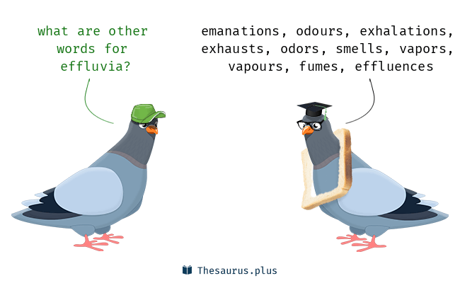
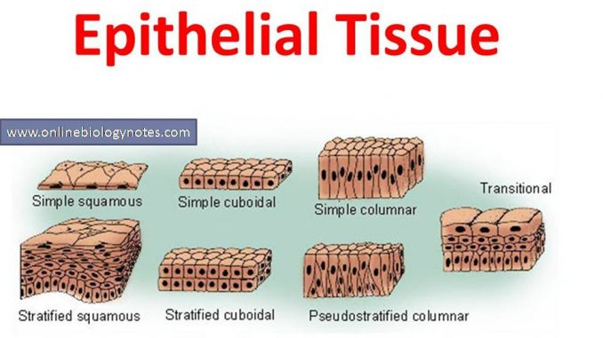
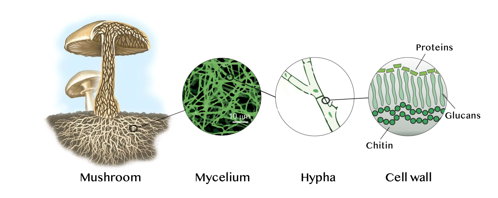
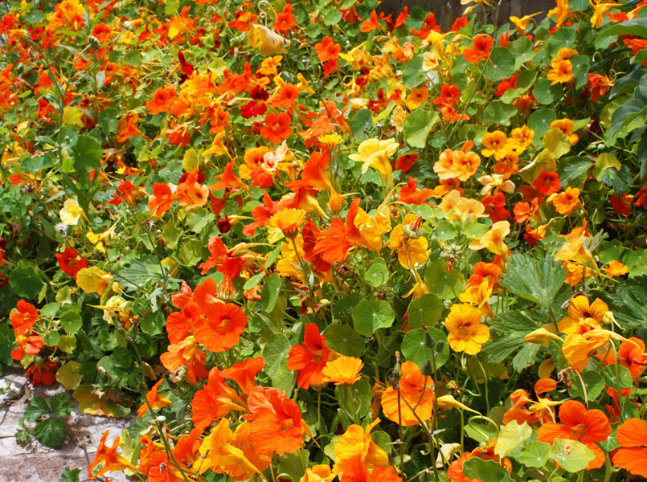
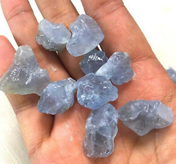
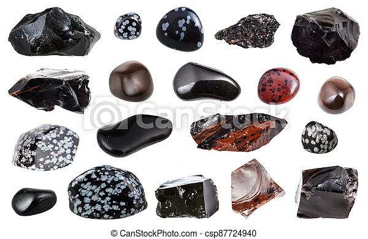

# 咬文嚼字-学科相关-Chemistry

@(TOEFL)[托福, TOEFL, 词根词缀,咬文爵字,学科相关]

[toc]

**chemistry（化学）：古阿拉伯人的炼金术**

在古代，有很多人希望能找到一种方法，将低贱的金属变为金子。这种方法就是所谓的炼金术。据说炼金术最早在古埃及兴起，在阿拉伯语中叫做al kimiya。其中，al是定冠词，相当于英语中的the，kimiya据说是埃及的古称，字面意思是“黑色泥土构成的大地”。

炼金术由阿拉伯人传入欧洲后，其名称al kimiya演变成了英语中的alchemy（炼金术），炼金术士自然就是alchemist，后来又演变为**chemist**。表示化学的词根**`chemi-`**/**`chemo-`**就源自于此，**chemistry**（化学）就源自炼金术**alchemy**。

- **`chemi-`**/**`chemo-`**：化学，炼金术
- **alchemy**： ['ælkɪmɪ] n.炼金术，炼丹术，魔力
- **alchemist**： ['ælkɪmɪst] n.炼金术士
- **alchemical**：[æl'kemikəl] adj. 炼金术的
- **chemist**： ['kemɪst]n. 化学家；化学工作者；药剂师；炼金术士
- **chemical**： ['kemɪk(ə)l] adj.化学的n.化学制品
- **chemistry**： ['kemɪstrɪ] n.化学，化学过程

## 1. -ium[1] 表示金属元素

**`-ium`**表示金属元素。1811 年瑞典化学家 [Berzelius](https://en.wikipedia.org/wiki/J%C3%B6ns_Jacob_Berzelius) 建议，为统一化学元素的命名起见，凡金属元素一律用拉丁词根命名，用 **`-um`** 为词尾。以后所发现的新金属元素，都遵照了这个建议。

由于氕[piē]、氘[dāo]、氚[chuān] 都是氢元素的同位素。具有相同质子数，不同中子数（或不同质量数）同一元素的不同核素互为同位素；自然元素**表里只有质子数不同**才是两种元素,因此他们不会出现在元素周期表内。

| 元素单词                                                     | 解释                                                         | 元素单词                                             | 解释                                                         |
| ------------------------------------------------------------ | ------------------------------------------------------------ | ---------------------------------------------------- | ------------------------------------------------------------ |
| **uranium**    **[jʊ'reɪnɪəm]**                n.铀元素 | **Uranus**（乌拉诺斯）:古希腊神话第一代神王。uran-（天）- us (名词词性）。 **[Uranus](https://en.wikipedia.org/wiki/Uranus)**:   ['juərənəs] ：1781 年，英籍德国天文学家赫瑟尔(Sir [William Herschel](https://en.wikipedia.org/wiki/William_Herschel) )首次,发现一颗新行星，便用 Uranus 命名，中文译为“天王星”	。 **[uranium](https://en.wikipedia.org/wiki/Uranium)**: 8 年后，德国化学家克拉普罗特([Martin Heinrich Klaproth](https://en.wikipedia.org/wiki/Martin_Heinrich_Klaproth))首次从沥青中分离出一种新的化学元素。为了纪念赫瑟尔及其发现的新行星，便以 Uranus 来命名，称为 uranium，这便是用于制造核裂变的常用元素铀。 | **aluminium**                 【ˌæljəˈmɪniəm 】 | aluminium（铝）：从矾土中提炼出来的金属物质 19世纪，英国化学家戴维（Humphry Davy）从矾土中提炼出高纯度铝，因此将其命名为aluminum，最后被英国编辑修改为**aluminium**，以符合化学元素的命名习惯。矾土（alumina）是一种氧化铝矿石，是炼铝的主要原料，因为外形类似矾（alum）而被称为alumina。 |
| **tritium** 【ˈtrɪtiəm】 [氚[chuān]](https://baike.baidu.com/item/%E6%B0%95%E6%B0%98%E6%B0%9A/8757957) | 杜撰词，来自希腊语 tritos,第三，词源同 three,third.-ium,化学元素后缀。比较 deuterium. 称作超重氢。原子核中有一个质子和两个中子。并带有[放射性](https://baike.baidu.com/item/放射性)，会发生[β衰变](https://baike.baidu.com/item/β衰变)，其[半衰期](https://baike.baidu.com/item/半衰期)为12.43年。由于氚的β衰变只会放出高速移动的电子，不会穿透人体，因此只有大量吸入氚才会对人体有害。 | **Deuterium** 【djuːˈtɪriəm】 氘[dāo]      | 重氢,原子核中有一个质子和一个中子，氢中有0.02%的氘。 在大自然的含量约为一般氢的7000分之一 ，用于热核反应 |
| **Protium** 【prəʊtɪəm】 氕[piē]                   | 质子数1，它的原子由一个质子和一个电子组成，是氢的主要形式,，氕为氢的主要成分，约占普通氢的99.98%。 | **Neptun-ium** 【nepˈtjuːniəm】                 | 在***化学领域***，93号元素以海神命名，称为 **Neptunium**（镎），因为它排在 92 号元素 **Uranium**（铀）的后面，而 **Uranium** 就是以天神乌拉诺斯命名的。 镎(放射性化学元素) |
| **Plutonium** 【pluːˈtoʊniəm】                          | 在科学领域，科学家将一种新发现的超铀元素命名为 Plutonium（钚），源自 Pluto（冥 王星），因为这种元素在元素周期表中排名 94 号，位于 Neptunium（镎）之后，恰如冥王星位于海王星之后。 | **Titan-ium** 【tɪˈteɪniəm】                    | 极其坚固、可耐高温、强酸强碱的金属钛（titanium）             |
| **Ion-ium** 【aɪ'onɪəm】                                | 锾（Io）（钍的同位素，Th230） 词源来自古希腊神话美女伊娥 | **iso-tope**[^1] 【ˈaɪsətoʊp】                  | 表示“相等，异构，同种”。 tope-  表示“地方”，来源于希腊语 topos。医学上 ectopia (ec- = ex- + top- + -ia) 表示...异位。 |
| **Tellur-ium** 【teˈlʊriəm】                            | 碲。词源来自古罗马神话大地女神忒勒斯                         | **Selen-ium** 【səˈliːniəm】                    | 1817 瑞典化学家柏采利乌斯（**Berzelius**）在生产硫酸过程中发现一种红色粉末，发现它 是一种性质与碲相似的新元素。为了使之与罗马大地女神忒勒斯（**Tellus**）之意命名的碲 （**Tellurium**）相对应，便以希腊神话中的月亮女神塞勒涅的名字命名，称为 **Selenium**（硒）。 硒(化学元素，用于制造电气设备和有色玻璃，人体缺此元素可致抑郁等病) |
| **hel-ium** 【ˈhiːliəm】                                | 1868 年法国的**杨森**利用分光镜观察太阳表面，发现一条新的黄色谱线，并认为是属于太阳上的某个未知元素，故名氦（**helium**）。 a chemical element. Helium is a very light gas that does not burn, often used to fill balloons and to freeze food. | **cerium** 【ˈsɪriəm】                          | 化学元素铈（**cerium**）也是以谷物女神的名字命名的。 a chemical element. Cerium is a silver-white metal used in the production of glass and ceramics . |
| **lith-ium** 【ˈlɪθiəm】                                | **`lith-`** 表示化学元素“锂”，因锂元素发现于石头中而得名。源自希腊语 lithos "stone." a chemical element. Lithium is a soft, very light, silver-white metal used in batteries and alloys . | **cadm-ium** 【ˈkædmiəm】                       | 镉元素（**cadmium**）以卡德摩斯的名字命名。这是因为镉元素是从菱锌矿（**cadmia**）中发现的，而菱锌矿最早是在底比斯城附近发现的，故采用底比斯城的古名 **Cadmia**（卡德摩斯之城）来命名。 |
| **german-ium** 【dʒɜːrˈmeɪniəm】                        | **锗**。来自其发现者 19 世纪德国科学家 Clemens Alexander Winkler 以祖国 Germany 命名的金属元素。  chemical element. Germanium is a shiny grey element that is similar to a metal (= is a metalloid ) . | **irid-ium** 【ɪˈrɪdiəm】                       | a chemical element. Iridium is a very hard yellow-white metal, used especially in making alloys . |
| **holm-ium** 【ˈhoʊlmiəm】                              | Holmium 1 - 来自 **Holmia**,***瑞典首都 Stockholm 拉丁名字***，该稀土元素发现者 19 世纪瑞典化学家 Per TeodorCleve 以此命名，以纪念他的家乡。 | **Palladium** 【pəˈleɪdiəm】                    | 英语单词 **palladium** 就来自帕拉斯的名字，表示“守护神”。著名化学家 Wollaston 用它来命名他新发明的金属元素钯。 |
| **xenon** 【ˈzenɑːn】                                   | 氙 来自希腊语 xenos,客人，陌生人，其发现者苏格兰化学家 William Ramsay 因这种元素发现困难而命名。比较 krypton,dysprosium. |                                                      |                                                              |

[^1]: [同位素](https://www.zhihu.com/question/314301893)同属于某一化学元素，其原子具有相同数目的电子，原子核也具有相同数目的质子，但却有不同数目的中子。例如氕、氘和氚，它们原子核中都有1个质子，但是它们的原子核中分别有0个中子，1个中子及2个中子，所以它们互为同位素。

### xenon  极为稀少且化学性质不活泼的气体

> xeno- 12
> = strange，表示“陌生”。源自希腊语 xenos "guest, host, stranger."

xenon - 氙是普通人不太熟悉的气体，无色，无臭，无味。它是1898年英国化学家拉姆齐（Sir William Ramsay, 1852-1916）发现的，他在重新分馏六个星期前所发现的稀有气体氦时分离制得氙。他取希腊语xénos 'strange, stranger'（陌生的，陌生人）的中性形式，将它命名为xenon，这是因为该气体极为稀少，且化学性质不活泼的缘故。

英语有个借自希腊语的组合语素xeno-也是源于希腊语xénos的，它含有“陌生人”、“外国人”、“陌生的”、“外来的”等义。英语中有好些借用词含有此一成分，诸如：

- xenophobia（恐外症，对外国人的极度畏惧／憎恨）
- xenophobe（恐惧外国人或陌生人的人）
- xenophile（祟外者）
- xenomania（祟外狂，媚外）等。

- Since xenon is a noble gas, it doesn't combine easily with other elements. (NED) 氙是惰性气体，所以不容易和其他元素化合。

**词源说明(童理民)**  :

 来自希腊语 xenos,客人，陌生人，其发现者苏格兰化学家 William Ramsay 因这种元素发现困难而命名。比较 krypton,dysprosium.

**摩西英语(摩西):**

好玩的是xerox这个单词中两个x的读音不一样，第一个x读/z/音，第二个x读/ks/音，为啥？因为呀，x代表的/ks/音在词首出现时，很难和后边的字母连贯起来发音，勉强读出来也不好听。参考单词：xenon ['zenɒn] n. [化学] 氙（稀有气体元素），词根xeno-表guest，因为它是在霓和氪后才扭扭捏捏被发现的。

## -ium[2] 名词后缀

ium[2] 名词后缀，构成身体器官或生物学等词汇，这些词复数形式一般是-ia形式。

| 单词                                                         | 解释                                                         |
| ------------------------------------------------------------ | ------------------------------------------------------------ |
| **bacter-ium**                【bækˈtɪriəm】 复数： **bacteria** 【bækˈtɪriə】 | **`bacter-`**  = bacterium, 表示“细菌”。源自希腊语 baktron "staff." |
| **ef-fluv-ium**                     【e'flu:vɪəm】 复数：**effluvia** 【ɛˈfluːvjə】 | **`ef-`**  表示“从，从...离开，从...向外，向外，向上”，来自PIE *eghs, 向外。 **`fluv-`**  = flow, 表示“流动”。源自拉丁语 bluere "to flow."  n.   臭气；臭液；【物】磁素；【无线】无声放电 |
| **epi-thel-ium**  【ˌepɪ'θiːlɪəm】                      | 【生】上皮；【植】皮膜   |
| **geran-ium**  【dʒəˈreɪniəm】                          | 老鹤草属植物，天竺葵 a garden plant with a mass of red, pink or white flowers on the end of each stem  |
| **mycel-ium**  【maɪ'siːlɪəm】                          | n.【生】菌丝体   **hypha**【haɪfə】：〈拉〉菌丝；外菌丝（ny of the threadlike filaments forming the mycelium of a fungus） **Chitin**【kaɪtɪn】：  【生化】几丁质；【动】(甲)壳质 a tough semitransparent horny substance **glucan**【glu:kən】：  葡聚糖；多聚葡萄糖 any [polysaccharide](https://www.collinsdictionary.com/zh/dictionary/english/polysaccharide) consisting of a [polymer](https://www.collinsdictionary.com/zh/dictionary/english/polymer) of [glucose](https://www.collinsdictionary.com/zh/dictionary/english/glucose), such as [cellulose](https://www.collinsdictionary.com/zh/dictionary/english/cellulose) or starch |
| **nas-turt-ium** 【nəˈstɜːrʃəm】                        | 旱金莲(有时用于色拉)  a garden plant with round flat leaves and red, orange or yellow flowers that are sometimes eaten in salads |

## -ous /-itous /-eous /-ious / -uous

###  ①：表形容词，表示“…的” {783}

| 单词                                                 | 解释                                                         | 单词                                          | 解释                                                         |
| ---------------------------------------------------- | ------------------------------------------------------------ | --------------------------------------------- | ------------------------------------------------------------ |
| **de-ci-duous                 ** 【dɪˈsɪdʒuəs】 | **`de-`**  来自拉丁语介词形式 de, 表示“从，从...离开，从...向下，向下” **`cid-`**  = fall, 表示“落下，降临”。源自拉丁语 cadere "to fall, die." **`-uous`**  表形容词，表示“…的”，用于化学领域表示“亚酸的，低价（金属）的”。  每年落叶的：A **deciduous** tree or bush is one that loses its leaves in the autumn every year. | **volum∙in∙ous**         【vəˈluːmɪnəs】 | volume  n. 册, 卷, 体积, 容量, 大量, 许多, 份量, 音量 vi. 成团卷起 vt. 把...收集成卷 a. 大量的 -ous  表形容词，表示“…的”，用于化学领域表示“亚酸的，低价（金属）的”。  庞大的;浩繁的;长篇的;肥大的;宽松的;用布料多的;大部头的;冗长的;很大的 |
|                                                      |                                                              |                                               |                                                              |
|                                                      |                                                              |                                               |                                                              |

### ② 用于化学领域表示“亚酸的，低价（金属）的”{?}

| 单词 | 解释 | 单词 | 解释 |
| ---- | ---- | ---- | ---- |
|      |      |      |      |
|      |      |      |      |
|      |      |      |      |

## 2. hydr- = water, 表示“水”

**hydr- = water**, 表示“水”，来源于希腊语。***表示化学元素“氢(hydrogen)”，因为氢燃烧后的产物是水***，法国化学家拉瓦锡便用拉丁文把它命名为“水的生成者”。源自希腊语 hudor "water."

海德拉（Hydra）是希腊神话中巨大的的九头蛇，是希腊神话中最强悍的怪物之父提丰 （Typhon）和女首蛇身怪爱克特娜（Echidina）交配所生。在希腊语中，海德拉的名字 Hydra 是 hydros（水蛇）的阴性形式，而后者来自名词 hydor （水）。希腊词根和英语词根 hydr-（水）就来源于此。英语中用 hydra 来命名水螅，因为它 头部拥有很多触手，形状与传说中的九头蛇很像。

## 3.  -ite1 名词后缀：和化学相关(源自法语) {54}

**`-ite`** 名词后缀，源自法语。和化学相关，如：矿物、岩石、炸药等。

| 单词                                              | 解释                                                         | 单词                                                       | 解释                                                         |
| ------------------------------------------------- | ------------------------------------------------------------ | ---------------------------------------------------------- | ------------------------------------------------------------ |
| **gran-ite**                     【ˈɡrænɪt】 | **`gran-`** = grain, 表示“颗粒”。源自拉丁语 granum "grain." gran-颗粒 + -ite, 表名词。因这种岩石颗粒状的纹理而得名。 花岗岩：I'm so hard, bitches call me granite | **pome-granate**                     【ˈpɑːmɪɡrænɪt】 | （石榴）：有许多颗粒的水果。英语单词pomegranate（石榴）来自拉丁语pomum granatum 字面意思就是“有许多颗粒的水果”，由pome（水果）+ grenate（颗粒、纹理）构成。 石榴得此名称是因为它切开后里面含有大量颗粒状的石榴籽。 |
| **celest-ite** 【selɪstaɪt】                 | **`celest-`** = heaven, 表示“天空”。 | **meteor-ite** 【ˈmiːtiəraɪt】                        | meteor【流星】 + -ite相关的。用于指陨石。 meteor  n. 流星, 大气现象 |
|                                                   |                                                              |                                                            |                                                              |

**obsidian [əb'sɪdɪən]** n.黑曜石。岩浆快速冷却时产生的黑色结晶体，因内部含有氧化铁而呈黑色。

据Pliny the elder老普利尼记载，罗马人Obsius在埃塞俄比亚发现了这种石头，因此这种石头被称为obsianus lapis，意思是Obsius's stone（），对Obsianus lapis的误读产生了obsidianus和随后的obsidian。

### 3.1 grain / core / maize (颗粒)

**corn**乃本族词，来自古英语。在英国**corn**统指“谷类”，在英格兰指“小麦”，在苏格兰和爱尔兰则指“燕麦”。17世纪英国殖民者来到美洲大陆看见当地玉米，就把它称作**Indian corn**。由于当时玉米为新英格兰地区种植的唯一粮食作物，所以后来人们逐渐地把修饰性形容词Indian省略了，corn就这样成了玉米的美国名称，而英国英语则仍沿用**maize**。在美国英语口语中**corn**也指“威士忌酒”，因为美国威士忌酒多用玉米酿成。

**grain**（谷类，谷物）和**kernel**（果仁，核，谷粒）二词在词源上同**corn**有较密切的亲缘关系，三词均可溯源到同一印欧词根。**grain**源于拉丁语***grānum***，直接借自法语***grain***，而**kernel**系**corn**之指小形式，由**corn**加指小后缀**`-el`**所构成。

- Buy peanuts and corn chips for the party. (CID) 给晚会买些花生和玉米片。
- The chickens are raised on a diet of corn and other grains. (OCD) 这些鸡是用玉米和其他谷类饲养的。

### 3.2 **pomegranate**（石榴）：有许多颗粒的水果。

英语单词pomegranate（石榴）来自拉丁语pomum granatum，字面意思就是“有许多颗粒的水果”，由pome（水果）+ grenate（颗粒、纹理）构成。石榴得此名称是因为它切开后里面含有大量颗粒状的石榴籽。

- pomegranate：['pɒmɪgrænɪt] n.石榴
- grain： [ɡren] n. 粮食；谷物；颗粒；纹理v. （使）成谷粒
- engrain：[ɪn'ɡreɪn] vt. 使根深蒂固；把…染成木纹色adj. 根深蒂固的
- granulate：['grænjə,let] v.（使）成颗粒状；（使）表面变粗糙
- granite： ['grænɪt] n. 花岗岩

## 4. -ite2 形容词、名词、动词后缀，表示“属于或和...相关”（来自古希腊语）{38}

> 来自拉丁语和希腊语。

| 单词          | 解释 | 单词         | 解释 |
| ------------- | ---- | ------------ | ---- |
| fin-ite       |      | in-fin-ite   |      |
| define-ite    |      | favor-ite    |      |
| ign-ite       |      | metabol-ite  |      |
| oppos-ite     |      | part-ite     |      |
| pol-ite       |      | re-quis-ite  |      |
| unite         |      | e-rud-ite    |      |
| urban-ite     |      | ex-urban-ite |      |
| sub-urban-ite |      | pre-adam-ite |      |
| decompos-ite  |      | gopl-ite     |      |
| mammon-ite    |      | re-cond-ite  |      |
| Sodomite      |      | term-ite     |      |
| tri-log-ite   |      | Gothma-ite   |      |
| tr-ite        |      |              |      |

## 5. -ase = enzyme【ˈenzaɪm】, 表示“...酶”。{31}

**enzyme**【ˈenzaɪm】: A substance, produced by all living things, which helps a chemical chang happen or happen more quickly, without being changed itself.

| 单词                                          | 解释                                                         | 单词                          | 解释                                                      |
| --------------------------------------------- | ------------------------------------------------------------ | ----------------------------- | --------------------------------------------------------- |
| in-vert-ase                【ɪnvəˌteɪs】 | 转化酶 an enzyme that catalyzes the hydrolysis of sucrose into **glucose** and fructose | hydr-ase                      | an enzyme that catalyzes the addition or removal of water |
| lact-ase 【ˈlækˌteɪs】                   | **`lact-`** = milk, 表示“奶，乳”，lact- 是 galact- 的 ga- 脱落后的形式。 any of a group of enzymes (trade name Lactaid) that hydrolyze lactose to **glucose** and galactose | integr-ase 【ɪntɪgreɪs】 | 整合酶                                                    |
|                                               |                                                              |                               |                                                           |

### [Catalyst vs. Enzyme](https://www.diffen.com/difference/Catalyst_vs_Enzyme)

**`cata-`** 表示“向下，相反，离开”。源自希腊语 kata "down."

l**`yst-`** = break down, 表示“裂开，分解，溶解”。源自希腊语 luein "to loosen, release, untie."

|                   | Catalyst                                                     | Enzyme                                                       |
| ----------------: | :----------------------------------------------------------- | ------------------------------------------------------------ |
|          Function | Catalysts are substances that increase or decrease the rate of a chemical reaction but remain unchanged. | Enzymes are proteins that increase rate of chemical reactions converting substrate into product. |
|  Molecular weight | Low molecular weight compounds.                              | High molecular weight globular proteins.                     |
|             Types | There are two types of catalysts – positive and negative catalysts. | There are two types of enzymes - activation enzymes and inhibitory enzymes. |
|            Nature | Catalysts are simple inorganic molecules.                    | Enzymes are complex proteins.                                |
|   Alternate terms | Inorganic catalyst.                                          | Organic catalyst or bio catalyst.                            |
|    Reaction rates | Typically slower                                             | Several times faster                                         |
|       Specificity | They are not specific and therefore end up producing residues with errors | Enzymes are highly specific producing large amount of good residues |
|        Conditions | High temp, pressure                                          | Mild conditions, physiological pH and temperature            |
| C-C and C-H bonds | absent                                                       | present                                                      |
|           Example | vanadium oxide                                               | amylase, lipase                                              |
| Activation Energy | Lowers it                                                    | Lowers it                                                    |

### agent

- 我推测 ~~agent是catalyst的口语化表达~~
- agent可以是任何产生（化学和生物）反应的溶剂
- 而catalyst是特质产生化学反应的催化剂。
- 实际上我在google上看到了 catalyst agent的表达

## 7.**`-yl`** 表示“...基”{18}

| 单词                                         | 解释                                                         | 单词                                                | 解释                                                         |
| -------------------------------------------- | ------------------------------------------------------------ | --------------------------------------------------- | ------------------------------------------------------------ |
| **alk-yl** 【ælkɪl】                    | 烷基（的）；烃基（的） **`alk-`** 表示“烃”。 describes a hydrocarbon group derived from an alkane , e . g . the ethyl group | **acet-yl**                         【æsɪtɪl】 | 乙酰基 acet-  表示“醋酸、乙酸”，并进一步抽象出含义“乙，二”。源自拉丁语 acetum "vinegar."  the organic group of acetic acid (CH3CO-) |
| **meth-yl** 【ˈmeθəl】                  | **`meth-`** 表示“甲，一”，提取自单词 methylene“亚甲基”。源自希腊语 methu "wine." **`-yl`** 表示“...基”。 the univalent radical CH3- derived from methane（甲烷衍生的一价CH3自由基） | **meth-ane** 【ˈmeθeɪn】                       | 甲烷;沼气  **`meth-`** 表示“甲，一”，提取自单词 methylene“亚甲基”。源自希腊语 methu "wine." -**`ane`** 表示“...烷”。 a gas without colour or smell, that burns easily and is used as fuel. Natural gas consists mainly of methane . |
| **glycos-yl-ation** 【glaɪkəsɪ'leɪʃən】 | 糖基（苷）化（作用） **`glycos-`** = glucose, glycose, 表示“糖”。源自希腊语 glukus "sweet." **`-yl`** 表示“...基”。 **`-ation`** 表名词，“行为、动作、状态、过程、结果；物品”等。 the process by which sugars are chemically attached to proteins to form glycoproteins 糖蛋白糖与蛋白质化学结合形成糖蛋白的过程 |                                                     |                                                              |

## 8. -ose

### **`-ose`**1 表示“碳水化合物” {13}

> **`-ose`** 表示“碳水化合物”；“水解蛋白质的衍生物”

| 单词                           | 解释                                                         | 单词                             | 解释                                                         |
| ------------------------------ | ------------------------------------------------------------ | -------------------------------- | ------------------------------------------------------------ |
| **visc∙ose** 【ˈvɪskoʊz】 | **`visc-`** = poison, virus, 表示“毒，病毒”。源自拉丁语 virus "poison, sap of plants, slimy liquid, a potent juice"。 **`-ose`** 表示“碳水化合物”；“水解蛋白质的衍生物” a chemical made from cellulose , used to make fibres which can be used to make clothes, etc（黏胶） | **glucos∙e**  【ˈɡluːkoʊs】 | **gluc-甜 + -ose，构词形式 glucos-**。 **`-ose`** 表示“碳水化合物”；“水解蛋白质的衍生物” **`glucos-`** = glucose, glycose, 表示“糖”。源自希腊语 glukus "sweet." |
| galact∙ose                     | galact-  = milk, 表示“奶，乳”，lact- 是 galact- 的 ga- 脱落后的形式。 更多同源词... -ose  表示“碳水化合物”；“水解蛋白质的衍生物” | lact∙ose                         | lact-  = milk, 表示“奶，乳”，lact- 是 galact- 的 ga- 脱落后的形式。 更多同源词... -ose  表示“碳水化合物”；“水解蛋白质的衍生物” |
| sacchar∙ose                    | sacchar-  = sugar, 表示“糖”。 -ose  表示“碳水化合物”；“水解蛋白质的衍生物” | xyl∙ose                          | xyl-  = wood，表示“木头”。 -ose  表示“碳水化合物”；“水解蛋白质的衍生物 |
| sucr∙ose                       | sucr∙ose  [词根树] sucr-  = sugar, 表示“糖”。 -ose  表示“碳水化合物”；“水解蛋白质的衍生物” | malt∙ose                         | malt-  = malt, 表示“麦芽”。源自古英语 mealt "malt." 更多同源词... -ose  表示“碳水化合物”；“水解蛋白质的衍生物” |
| visc∙ose                       | visc-  = poison, virus, 表示“毒，病毒”。源自拉丁语 virus "poison, sap of plants, slimy liquid, a potent juice"。 更多同源词... -ose  表示“碳水化合物”；“水解蛋白质的衍生物” | fruct∙ose                        | fruct-  = fruit, 表示“果实”。原始含义也表示“享受”，古时候资源匮乏，为了“享受”，必须“精打细算，勤俭节约”。源自拉丁语 frux "fruit," frui "to enjoy," 和 fructus "enjoyment, produce." 更多同源词... -ose  表示“碳水化合物”；“水解蛋白质的衍生物” |
|                                |                                                              |                                  |                                                              |

#### viscos∙ity 【vɪˈskɑːsəti】

> **`viscose`**  n. 粘胶, 纤维胶
> **`-ity`**  表名词，指具备某种性质。

**Viscosity** is the quality that some liquids have of being thick and sticky. （（液体的）黏性，黏稠度)

- **low viscosity:** 低粘度
- **blood viscosity**: 血液粘度
- **apparent viscosity**: 表观粘度
- **oil viscosity**: 滑油粘度

### -ose 2 表形容词,"多....的" {47}

| 单词     | 解释             | 单词    | 解释               |
| -------- | ---------------- | ------- | ------------------ |
| glob-ose | 球状的           | mor-ose | 阴郁的，闷闷不乐的 |
| nod-ise  | 有节的，结节多的 | pil-ose | 有毛的，毛多的     |
|          |                  |         |                    |

## -ane 化学名词后缀，表示“...烷”。

| 单词                                          | 解释                                                         | 单词                                        | 解释                                                         |
| --------------------------------------------- | ------------------------------------------------------------ | ------------------------------------------- | ------------------------------------------------------------ |
| **meth-yl **                  【ˈmeθəl】 | **`meth-`** 表示“甲，一”，提取自单词 methylene“亚甲基”。源自希腊语 methu "wine." **`-yl`** 表示“...基”。 the univalent radical CH3- derived from methane（甲烷衍生的一价CH3自由基） | **meth-ane**               【ˈmeθeɪn】 | 甲烷;沼气  **`meth-`** 表示“甲，一”，提取自单词 methylene“亚甲基”。源自希腊语 methu "wine." -**`ane`** 表示“...烷”。 a gas without colour or smell, that burns easily and is used as fuel. Natural gas consists mainly of methane . |
| **eth-ane**              【ˈiːθeɪn】     | 乙烷(无色无味的可燃气体) **`eth-`** 表示“乙，二”。 a gas that has no colour and no smell and burns very easily . It is obtained from petroleum and natural gas and is used as a fuel . |                                             |                                                              |
|                                               |                                                              |                                             |                                                              |

## 其他

### 1. [ammonia](https://mp.weixin.qq.com/s?__biz=MzA4NTQ4NzIzNg==&mid=2651801153&idx=1&sn=f3c49ec59712d9ff612cb1ed11980260&chksm=842cddaab35b54bcc04beb866207c8ef4a614d3bfe5d25a2b7d45a7806e3b77fa31fd3b66e35&scene=178&cur_album_id=1297162942844207107#rd)

氨是一种无色气体，含有强烈的刺激气味，极易溶于水，是许多食物和肥料的重要成分。英语中表示氨的单词是ammonia，源自古埃及神话中阿蒙神的名字Ammon。

18世纪时，化学家从“阿蒙神之盐”（**salt of Ammon**）中提取出一种新的化学元素，就将其命名为**ammonia**，中文译为“氨”。

- **ammonia**：[ə'məʊnɪə] n.（化学元素）氨，氨气，氨水，阿摩尼亚
- **ammoniac**：[ə'məʊnɪæk] adj.氨的，含氨的
- **ammonium**：[əˈməʊniəm] n.氨基，铵盐

### 3. Alcohol  （酒精）：古代中东妇女用来画眼影的锑粉

长久以来，阿拉伯、波斯、新疆等地的妇女就已经发现锑粉是一种极好的化妆品。她们用从锑石中精炼提纯的锑粉涂在眼圈附近，不仅能使眼睛更漂亮，还能消除眼疲劳和红肿的功效。阿拉伯妇女喜欢用锑粉画出浓重的眼影，埃及艳后克娄巴特拉的妆容便是典型。

这种用来画眼影的锑粉在阿拉伯语中叫做***al kuhul***，其中的***al***是定冠词，相当于英语中的***the***。英语单词alcohol就源自al kuhul，原本表示“粉末状的化妆品”，17世纪词义扩大为“物品的精华、精炼或提纯的结果”。18世纪，人们用***alcohol of wine***（酒的精华）来表示酒精，后来直接用**alcohol**一词来表示酒精。

> 古埃及绝世美人克娄巴特拉（Cleopatra, 69-30 BC）用锑膏画眉毛。以后，妇女尤其是中东妇女也常用细锑粉来涂眼皮。锑粉在阿拉伯语中作al-kohl或al-kuhl，其中al相当于英语定冠词the，而kohl/kuhl则意为“锑粉”。16世纪时该词通过拉丁语进入英语，作alcohol，最初仅指“精细的粉末”。由于锑粉这一化妆品的提制过程类似于制取酒精的分馏法，到了18世纪，alcohol一词遂被转用以指“酒精”，其原义也随之丧失。但几乎与此同时，阿拉伯语kohl再度进入英语，用于原义，指阿拉伯等东方妇女用以涂黑眼睑和睫毛的化妆品，即“眼圈粉”（尤指“硫化锑粉”）。alcohol除指“酒精”，也可指“酒”或“含酒精的饮料”。

阿拉伯语中表示锑粉的 **kuhul**一词后来通过其他途径也进入了英语，演变成为英语单词kohl，依然保持原意，表示“眼影粉”。

- **alcohol**： ['ælkəhɒl] n.酒精，乙醇
- **alcoholic**： [ælkə'hɒlɪk] adj.酒精的，含酒精的n.酒鬼，酗酒者
- **alcoholism**：['ælkəhɔlɪzəm] n. 酗酒；[内科] 酒精中毒
- **kohl**： [kəʊl] n.眼影粉，化妆墨
- Most wines contain about 12％ alcohol. (CAE) 大多数葡萄酒含有约12％的酒精。
- I could smell the alcohol on his breath from ten feet away! (CID) 我在10英尺之外就能闻到他呼吸中的酒味。
- The doctor told me to keep off alcohol. 医生叫我别沾酒。

### 4. aroma（芬香）：从芬香植物中萃取的油膏

古人很早就开始尝试从芬香植物中萃取精油和药膏，用于保健、提神、治疗、防腐、杀菌等多种用途。在公元前3000年时，古埃及的“医学与治疗之神”伊姆茶提普就使用从植物中萃取的油和膏药治疗疾病。古埃及人在制作木乃伊时还广泛使用芳香精油做为防腐剂和化妆品。考古学家曾经在公元前5世纪的米索不达米亚文明古墓中发现了用来蒸馏植物的器具。

中世纪“黑死病”横行欧洲时，那些贩卖从尸体上剥下来的衣服的盗贼们使用花草制成的芳香剂来消毒防腐，从而避免感染瘟疫。这些花草所具有的杀菌、消毒作用令人瞩目，使用芳香精油和花草的医疗在17世纪的欧洲迎来了黄金时期。当西方医学和药物学兴盛了一百多年之后遇到了瓶颈，19世纪时，芳香精油和花草再度受到重视，成为新的“芳香疗法”并发展至今。

古希腊人将从芳香植物中萃取的精油或药膏称为**aroma**。该词经由拉丁语在13世纪初进入英语，最初用来表示“具有芳香气味的物质”。19世纪后，该词的词义逐渐转变为“芳香气味”。但在**aroma therapy**（芬香疗法）中，**aroma**依然保留原意，指的是芬香物质而非芬香气味。

- **aroma**：[ə'rəʊmə] n.芬香，香气
- **aromatic**：[,ærə'mætɪk] adj. 芳香的，芬芳的；芳香族的n. 芳香植物；芳香剂
- **aromatize**：[ə'rəʊmətaɪz] vt. 使芳香；薰以香气
- **aroma therapy**：n.芬香疗法

