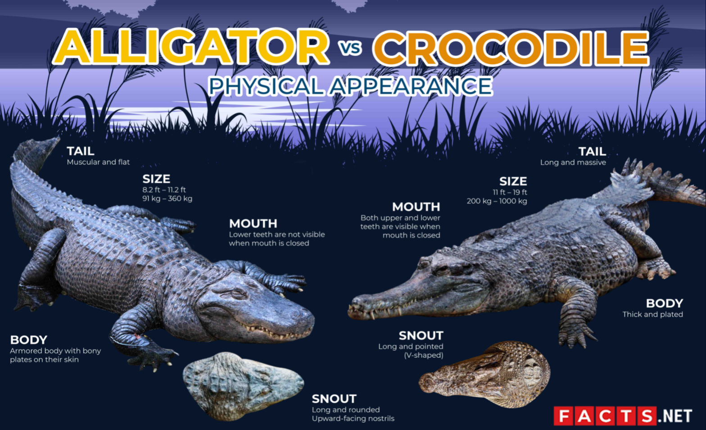
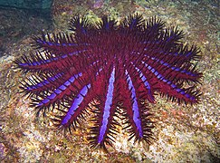
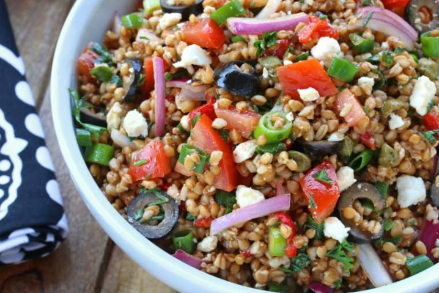
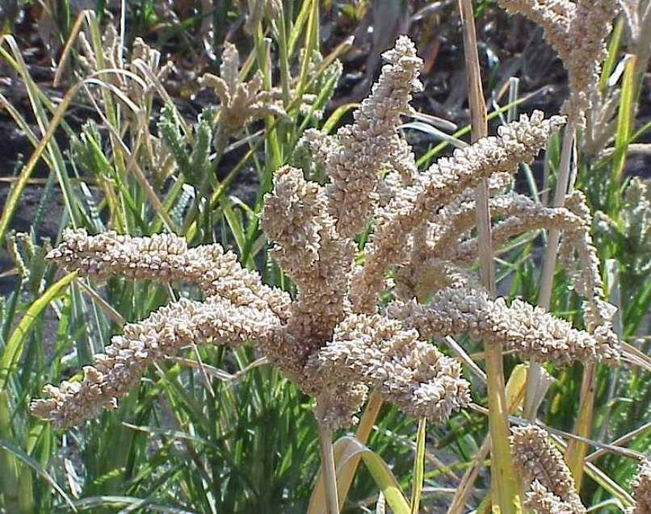

# 咬文嚼字-学科相关-Fauna&Flora

@(TOEFL)[托福, TOEFL, 词根词缀,咬文爵字,学科相关]

[toc]

# Fauna

## - saur = lizard, 表示“蜥蜴”。{12}

| 单词                                                         | 解释                                                         | 单词                                                    | 解释                                                         |
| ------------------------------------------------------------ | ------------------------------------------------------------ | ------------------------------------------------------- | ------------------------------------------------------------ |
| **saur-ian** 【ˈsɔːriən】                               |                                                              | **dino-saur** 【ˈdaɪnəsɔːr】                       | n. 恐龙 推荐：dino-恐怖的 + saur-蜥蜴，用于指恐龙。 dino- 表示“害怕，恐惧”。源自希腊语 deinos "fearful, monstrous." saur- = lizard, 表示“蜥蜴” |
| **bronto-saur-us** 【ˌbrɑːntəˈsɔːrəs】                  | bronto-  = thunder, 表示“雷”。源自希腊语 bronte "thunder." 雷龙;原始的雷龙;雷龙属  | **ichthyo-saur** 【ɪkθɪəsɔ:ə】                     | **`ichthyo-`**  = fish, 表示“鱼”。源自希腊语 ikhthus "fish." （古生）鱼龙  |
| **megalo-saur-us** 【ˌmeɡələˈsɔːrəs】                   | 巨蜥，巨齿龙(最早得到科学研究的恐龙之一)  | **ptero-saur** 【ˈterəˌsɔr】                       | 翼龙  |
| **plesio-saur**[^2] 【plisɪrsɔ】                        | 蛇颈龙;蛇颈龙类  n. 蛇颈龙 推荐：plesio-接近 + saur-蜥蜴。 **`plesio-`** = near, 表示“接近，近似于”。源自希腊语 plesios "near." **`saur-`** = lizard, 表示“蜥蜴”。 | **plesio-saur-us** 【ˌplisɪəˈsɔrəs】               | 蛇颈龙;蛇颈龙属;中生代十分繁盛的蛇颈蜥属;蛇颈龙类            |
| **stego-saur-us**[^1] 【ˌsteɡə'sɔrəs】                  | 剑龙  **`tect-,teg-`** = cover, 表示“盖上”。源自拉丁语 tegere "to cover," tegula "tile." **`saur-`** = lizard, 表示“蜥蜴”。 | **tyranno-saur-us** 【tɪˌrænə'sɔrəs】              | 暴龙  |
| **ankylo-saur**                            【ˈæŋkɪləsɔːr】 | **`ankylo-`**  表示“弯曲、僵硬、粘连”。源自希腊语 ankulos "crooked, bent." 甲龙(食草恐龙，全身披甲)  | **psitaco-saurus**          【psit·ta·co·sau·rus】 | **`psittaco-`**  = parrot, 表示“鹦鹉”。源自希腊语 psittakos "a parrot." 鹦鹉嘴龙  |
| maia-saura                                              | a species of large, herbivorous, duck-billed dinosaur of the genus Maiasaura that lived in the Campanian period |                                                         |                                                              |
|                                                              |                                                              |                                                         |                                                              |

[^1]: 来自希腊语 stegos,屋顶，屋顶瓦，来自 PIE*steg,覆盖，词源同 deck,detective,tegular.-saurus,恐龙，词源同 dinosaur.因这种恐龙背部覆盖有三角板而得名。 **detect** [dɪ'tekt] vt.察觉；探测。前缀de-表away from,down， 词根**`teg-`**,**`tect-`**表to cover or cover，与日耳曼词源的**thatch** [θætʃ] n.茅草；浓密的头发；茅草屋顶，vt.用茅草覆盖屋顶，同源， 也与希腊词根**`stego-`**同源，比如**stegosaurus** [,steɡə'sɔːrəs] n.剑龙（有背甲）。**detect**，就是除掉盖子。

[^2]: 是一类适应浅水环境中生活的类群，个体较大，且长颈，据推测非常“接近”现代爬行动物，并因此得名。

### 1. Dinosaure(恐龙)：令人恐怖的蜥蜴

恐龙（**dinosaur**）这名字最早为英国古生物学家欧文（[Sir Richard Owen](https://en.wikipedia.org/wiki/Richard_Owen), 1804-1892）在1842年创造，由希腊语**`deinos`**（恐怖的）和**`sauros`**（蜥蜴）组合而成，字面意思就是“令人恐怖的蜥蜴”。

 

恐龙和蜥蜴拥有相同的祖先，虽然表面上和蜥蜴相似，但实际上其生物结构却远比蜥蜴、蛇、龟等先进。

汉字“恐龙”是日本生物学家对dinosaur的翻译，后来被中国接受。实际上恐龙与中国的“龙”毫无相似之处。

- **dinosaur**：['daɪnəsɔː] n.恐龙，过时的人或事物

- **saurian**：['sɔrɪən] 

  - adj.蜥蜴的，蜥蜴类的
  - n.蜥蜴，蜥蜴类

- **tyrannosaurus**：[tɪˌrænə'sɔ:rəs] n. 暴龙，霸王龙

  > tyranno- 
  > = tyrant, 表示“暴君”。

- **brontosaurus**：[,brɑntə'sɔrəs] n. 雷龙

- A dinosaur's skeleton was displayed in the museum's main hall. (NED) 一具恐龙骨架陈列在博物馆的大厅。

- The old car was a gas-guzzling dinosaur and we had to get rid of it. (CAE) 这辆旧车是油老虎，我们不得不把它处理掉。

- The typewriter's a bit of a dinosaur (= very old-fashioned), isn't it? (CID) 这台打字机该进博物馆了，对不对？

### 2. Thesaurus 知识的宝库

> 来自拉丁语 thesauras,仓库，储藏室，来自希腊语 thesauros,仓库，储藏室，来自 PIE*dhe,做，放置，词源同 do,fact,thesis.后 19 世纪词典编纂学家借用该拉丁词来命名同义词词典，最终引申该词义。

**thesaurus** 【θɪˈsɔːrəs】- 19世纪直接借自拉丁语，源于希腊语***thēsaurós***，本义为**treasure**（财宝）或**treasure house**（宝库）。

- 在凯撒（Julius Caesar, 100-44 BC）时代，当**thesaurus**进入拉丁语时，它喻指**storehouse of knowledge**（知识宝库）；
- 在文艺复兴时期，它成了几部大型希腊语、拉丁语辞书的书名；
- 到了近代，在不太严格的意义上，它又常被作为“词典”、“词语汇编”（**lexicon**）甚至“百科全书”的同义词使用，有时也指某一学科如音乐、医学等的词汇选编。
- 但在今天，对大多数人来说，**thesaurus**意指“类属词典”或“同类词汇编”，不论是按类属排列的还是按字母排列的。

此义是英国医师、语言学者罗热（Peter Mark Roget, 1779-1869）首先使用的，并首次体现于他编纂的《英语词语类属词典》（**Thesaurus of English Words and Phrases**）。该词典按概念领域对词语进行分类，其编纂目的，正如他本人所说的，是“为表达思想提供便利，为文学创作提供帮助”。自1852年问世以来它几经修订和扩充，但直到今天依然经久不衰。

英语的另一个词**treasure**（财宝）和**thesaurus**有亲缘关系，它可以说间接源自**thesaurus**这个拉丁语借词，其终极词源也是希腊语***thēsaurós***，但它转道法语***trésor***，所以演变为**treasure**这一形式，于12世纪进入英语。

例

- You should keep a thesaurus right next to your dictionary. (FWF) 你应该在词典旁边放一本分类词典。
- He referred to his thesaurus to find some synonyms for "nice". 他在同义词词典里查找nice的一些同义词。

**摩西英语(摩西)**

**thesaurus [θɪ'sɔːrəs]** n.宝库；辞典；知识宝库。

古希腊语里本意是库房，希腊词根the-表to put，与拉丁词根fac-表to do,to make和日耳曼词源的do同源，后半部分词源不明。

但我曲解它为**the**+**saurus**吧，**saurus**本意是蜥蜴，希腊小伙伴们被恐龙化石吓坏了，称之为**dinosaurus**，意思为“可怕的蜥蜴”。 

 

##  -zoan = animal, 表示“动物”{6}

> 源自希腊语 zôion "animal" 的复数 zoia.

| 单词                                   | 解释                                                         | 单词                        | 解释                                                         |
| -------------------------------------- | ------------------------------------------------------------ | --------------------------- | ------------------------------------------------------------ |
| **proto∙zoan**  【ˌproʊtəˈzoʊən】 | n. 原生动物 推荐：proto-原始 + -zoan, 动物  proto- = first, source, parent, preceding, earliest form, original, basic，表示“最初的，原始的，第一的”。 -zoan = animal, 表示“动物”。源自希腊语 zôion "animal" 的复数 zoia. 词源说明(童理民)   1 - proto-,原始的，最早的，-zo,动物，词源同 zoo. | **cougar** 【ˈkuːɡər】 | n. 美洲狮 推荐：来自南美土著语。  词源说明(童理民)   1 - 来自南美土著语。 1 . a large wild cat that lives in mountain areas of North and South America |
|                                        |                                                              |                             |                                                              |
|                                        |                                                              |                             |                                                              |

## mammal ['mæm(ə)l] n.哺乳动物

> **mammal[ˈmæml]**
> mamm- = breast, 表示“乳房”。源自拉丁语 mamma "breast."
> 
>-al 表名词，“人，物，状态”

这个单词是瑞典生物学家林奈根据拉丁单词mammalis（意思是of the breast，词根mamma-表示乳头，因为所有的雌性哺乳动物都用乳汁喂养幼崽）创造。林奈所处的时代，欧洲很多妇女习惯把婴儿交给奶妈喂养，导致婴儿死亡率奇高。林奈创造这个单词，同时也是在提倡母乳喂养。 

> **mamm∙ary  [ˈmæməri]**
> mamm- = breast, 表示“乳房”。源自拉丁语 mamma "breast."
> 
>-ary 表形容词，“…的”。

| 单词                     | 解释                                                         | 单词 | 解释 |
| ------------------------ | ------------------------------------------------------------ | ---- | ---- |
| **liger** 【laɪgə】 | n. (雄狮与雌虎的交配生)狮虎: the offspring that results from breeding a male lion with a female tiger .   推荐： lion【狮子】 + tiger【老虎】  |      |      |
|                          |                                                              |      |      |
|                          |                                                              |      |      |

### baby

**baby**一词来自**babe**，原为**babe**的指小词，一度指“玩具娃娃”。babe则是模仿婴儿哭声baba构成的儿语拟声词，中古英语作baban，曾作标准词用，意指“婴儿”，而今多见于诗歌语言，其原先地位已为后来者baby所取代。

在非正式用语中，babe常用以表示对妻子、丈夫、情人的昵称，相当于汉语“宝贝”。baby除指“婴儿”还可转义为“年纪最小的人”、“孩子气的人”等；作动词用时，则表示“把……当婴儿对待”。

出自婴儿叫声的拟声词还有mama/mamma，papa/poppa，babble（牙牙学语）等词。另有一词mammal（哺乳动物），若究其根源可以说亦属此类。mammal源于拉丁语mamma（乳房），而mamma乃是儿语拟声词。

例

- The baby girl is teething. 这女婴正在长牙。
- Both mother and baby are doing well. 母子均平安。
- She is expecting another baby next month. 下个月她又快生孩子了。
- Don't be such a baby — take your medicine! 别这么孩子气——把药吃下去！

### gorilla（大猩猩）：迦太基航海家在西非见到的多毛野人 / chimpanzee(黑猩猩)

 

公元前5世纪，一位名叫汉诺（**hanon**）的迦太基航海家率领一支船队沿着非洲西海岸向南探险并写了一本游记。希腊人将他所写的游记翻译成了希腊语。在游记中汉诺写道，他们来到一个小岛，岛上有很多长毛野人，雌性多于雄性，皮肤粗糙。当地的黑人向导将这些野人称为gorillai。汉诺等人想抓捕几只野人，但雄性野人非常敏捷地爬到了悬崖顶上，一只也没抓住。最后只抓住了三只雌性野人。但这些野人拼命挣扎，又撕又咬。汉诺等人只好杀死了它们，把它们的皮毛带回了迦太基。

20多世纪后，一位名叫萨维奇（**Savage**）的美国医生兼传教士前往西非传教。1847年，他从西非返回美国，带来了某种类似巨人的动物的骨头。他与一名同事给这种动物起了个拉丁学名叫做Troglodytes gorilla，Troglodytes 是“穴居人”的意思，而gorilla即来源于汉诺的叙述。英语单词gorilla（大猩猩）就来自拉丁语gorilla。

看到这里，很多人也许会想到，汉诺等人发现的野人可能就是大猩猩。不过，也有人根据这些野人被捕获后还有机会又撕又咬的事实推测，它们可能是体型较小的黑猩猩（**chimpanzee**），而非我们原先认为的大猩猩。

 

- **gorilla**：[gə'rɪlə] n.大猩猩

- **chimpanzee**：[,tʃɪmpæn'zi] n.黑猩猩

  > 来自非洲安哥拉班图语，常缩写为 chimp.

#### guerrilla(游击队) (gorilla的homophone)

 

**guerrilla**亦作**guerilla**，乃西班牙语借词，原为西班牙语***guerra 'war'***（战争）的指小形式，故其字面义为**little war**。

该词是1808年拿破仑入侵西班牙之后逐渐流行起来的。西班牙农民拿起武器奋起抗击入侵者，法军只习惯于同正规军作战而不善于应付灵活、分散的小部队出没无常的袭击。

在英军的援助下，西班牙农民终于将入侵者赶出国境。此后**guerrilla**一词进入了法语，也同时进入了英语。英语把此类非正规部队称作**guerrilla army**（游击队），把他们所进行的战斗称为**guerrilla war**（游击战）。

guerrilla的今义“游击队员”始见于当时的英军指挥官威灵顿（1st Duke of Wellington, 1769-1852）1809年发的一份急报上：“I have recommended to the Junta to set the Guerillas to work towards Madrid.”（我已经向政务会提出建议，命令游击队员向马德里推进。）

- A small band of guerrillas blew up a train in the mountains. 一小队游击队员在山中炸毁了一列火车。
- Guerilla warfare has been escalating in this area. (LLA) 该地区游击战一直在升级。
- Two Japanese officers were taken prisoner by the guerrillas. 两名日本军官被游击队俘虏了。
- Ten years of guerrilla resistance followed the occupation. (OCD) （该国家／地区）被占领之后，（抵抗组织）进行了长达十年的游击斗争。

**词源说明(童理民)**  

1 - 词源同 war,战争，-illa,小词后缀。

**摩西英语(摩西)**

印欧语w音，日耳曼人用w表示；罗曼语族（包括后来诺曼征服的人）念起来比较费劲，而且他们的语言里没有w字母，用gu表示这个w音（后期更是简化为g）音。如：

- guard和warden
- waranty和guaranty
- warrior和guerrilla
- guise和wise等。

两种形式在不同时期通过不同途径进入英语并保留到现在。

### mole（卧底）：间谍小说中双面间谍的代称

 

> n. 色素痣; 鼹鼠; 防波堤; 间谍, 内奸; 摩尔

**mole**本来指的是“鼹鼠”，一种穴居地下的小型哺乳动物。鼹鼠高超的掘洞技能给人们留下了深刻印象。

早在17世纪时，就有人使用mole一词来表示卧底，但这种用法并不普遍。

1974年，英国著名间谍及间谍小说作家约翰•勒卡雷（John le Carre）在其著名间谍小说《铁匠、裁缝、士兵和间谍》，用**mole**来表示打入敌人情报系统内部的双面间谍，从而使得该词深入人心，成为“双面间谍”、“卧底”的代名词。

- mole：[məʊl] n.鼹鼠，痣，双面间谍，卧底

**词源说明(童理民)**  

1. 缩写自 molewarp,欧洲鼹鼠。后用于鼹鼠通用名。引申俚语义内奸。

2. 来自拉丁语 moles,大块，防洪堤，大工程，大建筑物，来自 PIE*mo,努力，劳苦，词源同demolish,molecule,molest.*

3. *来自古英语 mal,斑点，痣，来自 Proto-Germanic*mailan,斑点，记号，来自 PIE*mai,涂沫，弄脏，玷污，词源同 miasma.

4. 分子单位，缩写自 molecule.

5. 来自西班牙语，来自南美土著语 molli,沙司，调料，炖料，词源同 guacamole.

    

## reptile 爬行动物

| 单词                 | 解释                                                         | 单词 | 解释 |
| -------------------- | ------------------------------------------------------------ | ---- | ---- |
| adder 【ˈædər】 | n. 黄颔蛇 英英   n. 1 . a snake belonging to a family of mostly nonvenomous snakes . King snakes , garter snakes , and water snakes are colubrids . |      |      |
|                      |                                                              |      |      |
|                      |                                                              |      |      |

### [alligator/crocodile（鳄鱼）](https://mp.weixin.qq.com/s/O1_wRK1OZQeP0ICRN6KtXw)

### alligator [ˈælɪɡeɪtər]  

=> **[ˈæ-lɪ-ɡeɪ-tər]**

 

当西班牙殖民者初次踏上美洲大陆，遇到美洲特有的短吻鳄时，就用西班牙语称其为***el lagarto***（**the lizard**，蜥蜴）。后来英国殖民者沿用了西班牙人对其的称谓，在英语中将其称作***lagarto***。但在16世纪末期，有些人误将西班牙语中的定冠词**`el`**也看作该词的一部分，因此就从西班牙语**`el lagarto`**中产生了英语单词**alligator**。

### crocodile

 

> The difference between an alligator (left) and a crocodile (right).

英语中表示鳄鱼的还有一个单词**crocodile**。它来自希腊语。根据词源大师Frisk的解释，前面的**`croco`**表示卵石，后面的`dile`表示爬虫，合起来字面意思就是“卵石上的爬虫”。鳄鱼得此名号显然是因为它们喜欢在卵石上晒太阳的生活习性。这个单词首先出现于古希腊著名历史学家希罗多德的名著《历史》中，用来表示埃及尼罗河中的鳄鱼。

**alligator**和**crocodile**的区别是：

- **alligator**特指短吻鳄，比如，**American alligator**（美洲鳄）和**Chinese alligator**（中国的扬子鳄）。
- 单词**crocodile**泛指各种鳄鱼，是鳄鱼的统称。习语**crocodile tears**（鳄鱼的眼泪）常用来比喻坏人的假仁假义。

相关单词：

- **alligator**：['ælɪgeɪtə]  n.短吻鳄，美洲鳄

- **crocodile**：[ˈkrɒkədaɪl] n.鳄鱼

## 鸟类

| 单词                             | 解释                                                         | 单词                                 | 解释                                                         |
| -------------------------------- | ------------------------------------------------------------ | ------------------------------------ | ------------------------------------------------------------ |
| **parrot** 【ˈpærət】       | n. 鹦鹉, 应声虫 vt. 学舌, 机械地模仿  词源不详，可能来自法语方言 Pierre,人名 Peter 的法语形式。 比较 parakeet,petrel.由于该鸟学人说话的习惯，也用于形容人鹦鹉学舌。 | **parakeet** 【ˈpærəkiːt】      | 虎皮鹦鹉  **Common name**: [Parakeet](https://worldbirds.com/parakeet/), Budgerigar, Budgie |
| **pipits** 【ˈpɪpɪt】       | n. 鹨，小百灵  词源说明(童理民)   1 - 拟声词，模仿这种小鸟的叫声。 | **mynah** / **myna** 【ˈmaɪnə】 | 鹩哥，家八哥，八哥(东南亚一种能模仿人说话的黑羽鸟) （注意:Google上检索**mynah**会自动导向**myna**）  来自印度语 maina,椋鸟，八哥 |
| **black-cap ** 【b'lækkæp】 | n. 糙莓；黑树莓;（欧洲产的）莺类，白颊鸟类 推荐：black【黑】 + cap-头  **black** n. 黑色, 黑颜料, 黑人; 不加牛奶的咖啡 a. 黑色的 v. 抵制, 拒绝 **cap** n. 盖子, 帽子 vt. 戴帽子, 覆盖, 胜过 vi. 脱帽致意 | **horn-bill** 【ˈhɔːrnbɪl】     | n. 犀鸟(热带鸟类) 推荐：horn【角】 + bill【喙】  bill: 账单;(餐馆的)账单;(提交议会讨论的)议案，法案;（剧院等的)**节目单**;海报;**鸟嘴**;**有…形喙的** |
| **dodo** 【ˈdoʊdoʊ】        | 渡渡鸟(不能飞行，现已灭绝);笨人;蠢人 | **moa** 【ˈmoʊə】               | n. 恐鸟  词源说明(童理民)   1 - 新西兰一种已经灭绝的不能飞的大鸟，来自毛利语。 |
| **fowl** 【faʊl】           | n. 鸟, 飞禽, 家禽 vi. 打鸟 推荐： 源自古英语 fugel "bird," 原始日耳曼语词源。  词源说明(童理民)   1 - 来自 fly 的拼写异化。 | **water-fowl** 【ˈwɔːtərfaʊl】  | n. 水鸟 推荐： water【水】 + fowl【鸟】              |
| **robin** 【ˈrɑːbɪn】       | n. 旅鸫; 知更鸟 推荐：代称，来自人名 Robin.比较 petrel,来自人名 Peter。  词源说明(童理民)   1 - 代称，来自人名 Robin.比较 petrel,来自人名 Peter. | **ostrich** 【ˈɑːstrɪtʃ】       | n. 鸵鸟                                                                                     摩西英语(摩西) 1.ostrich policy鸵鸟政策。ostrich鸵鸟，policy政策。鸵鸟遇到危险无法脱身时，会把身体蜷成一团，脖子向下弯，头钻入沙子里，以为这样就能脱离危险， 我们称之为“自欺欺人的政策”，另外也可以说是ostrich trick鸵鸟伎俩。The reason is simple: the Chinese media is adhering to its ostrich policy.   2.ostrich ['ɒstrɪtʃ] n. 鸵鸟；鸵鸟般的人和osprey ['ɒsprɪ] n. [鸟] 鹗（鱼鹰）。这俩货都是鸟，单词中都有个os-，这个os-是什么呢？ ostrich来自拉丁语avis struthio，avis表bird，struthio表鸵鸟（本意是大个的麻雀)，再如aviary鸟巢和aviator飞行员；osprey是avis prede即 "bird of prey"。 |
| **magpie** 【ˈmæɡpaɪ】      | n. 鹊, 珍种家鸽, 饶舌的人 a. 鹊的, 有收集癖的 推荐： mag , 来自常见女性名Margaret昵称，通常用来指爱唠叨的女子，pie , 鹊名，来自拉丁语picus , 啄木鸟。需注意的是，这种鸟在欧洲中世纪时通常被视为不祥之兆。  词源说明(童理民)   1 - mag,来自常见女性名 Margaret 昵称，通常用来指爱唠叨的女子，pie,鹊名，来自拉丁语 picus,啄木鸟。需注意的是，这种鸟在欧洲中世纪时通常被视为不祥之兆。  摩西英语(摩西) magpie ['mægpaɪ] n.鹊，喜鹊；饶舌的人；有收集零碎东西癖好的人，adj. 鹊的；有收集癖的；斑驳的；混杂的。今天是3.14，圆周率的日子。magpie中mag其实是女子名Margaret玛格丽特（本意是珍珠，希伯来语词源)，而妇女们有啥特点呢？饶舌！而喜鹊啥样子呢？身上羽毛呈斑驳混杂的样子，于是得名！ | **hawk** 【hɔːk】               | n. 鹰, 掠夺者, 鹰派成员 vi. 放鹰行猎, 像鹰一般地袭击, 清嗓, 咳嗽 vt. 捕捉, 咳出, 兜售, 叫卖, 散播 词源说明(童理民)   1 - 来自中古英语 havek,来自 PIE*kap,抓住，词源同 have,heave,capable.后用于指猛禽鹰或隼。  摩西英语(摩西) hawked it up咳痰声。鹞鹰吃肉不假，可是它吃不了骨头。吃到骨头时，鹞鹰会吐出来，此时会发出类似人咳痰的声音来，后来习语hawked it up转义指人咳出嘴里的痰。Hawked it up,he begin his half-hour new employee orientation address.清了清嗓子后，他开始了他半个小时的新员工入职培训演讲。 |
|                                  |                                                              |                                      |                                                              |

### ornitho- = bird, 表示“鸟”。源自希腊语 ornis (词干 ornith-) "bird."{6}

| 单词                                      | 解释                                                         | 单词 | 解释 |
| ----------------------------------------- | ------------------------------------------------------------ | ---- | ---- |
| **ornitho-logy** 【ˌɔːrnɪˈθɑːlədʒi】 | n. 鸟类学 推荐：ornitho- 鸟 + -logy学说。即研究鸟的 → 鸟类学。  ornitho- = bird, 表示“鸟”。源自希腊语 ornis (词干 ornith-) "bird." -logy  = science, 表示“科学，学科”，由词根 log-, 说，引申而来； 词源说明(童理民)   1 - 来自希腊语 ornis 的所有格 ornithos,鸟，-logy,学说。 |      |      |
|                                           |                                                              |      |      |
|                                           |                                                              |      |      |

### **Petrel** /ˈpetrəl/

海燕在觅食时，像小海鸥一样自水面飞掠而过，偶尔降落水面，在海员看来，宛如圣彼得（**St. Peter**）之行于革尼撒勒湖（**Lake of Gennesareth**，即加利利海Sea of Galilee）上（见《圣经·马太福音》14:29）。

因此，在意大利语中这种海鸟被称作**petrello**，意思是**Little Peter**（小彼得），英语名称**petrel**很可能即源于此，它原作pitteral/pittrel，法语名称pétrel则借自英语。

英国海盗、探险家丹皮尔（William Dampier, 1652-1715）在他所写的《新荷兰之行》（Voyage to New Holland）一书的第一部分有关于海燕的一段记述：

>  “As they fly...they pat the Water alternately with their Feet, as if they walk upon it; tho' still upon the Wing. (当它们飞翔时……它们用脚交替拍打水面，仿佛在水面上行走；虽然仍在飞翔。)
>
>  And from hence the Seamen give them the name of Petrels, in allusion to St. Peter's walking upon the Lake of Gennesareth.”(因此，海员们给他们起了海燕的名字，意指圣彼得在根尼萨雷斯湖上行走。)

丹皮尔是将海燕的英语名称与圣彼得相联系的第一人，可是他把原拼法**pitteral**改作**Petrel**。

**petrel**常常被称作**stormy petrel**，因为海员迷信，海燕掠过海面预示暴风雨即将来临，而且他们观察到，即使在暴风雨中海燕也爱在海面上低飞，故在其名称前冠以**stormy**。海员还把**petrel**叫做***Mother Carey's chicken***，据认为Mother Carey乃拉丁文Mater cara 'dear Mother'（圣母玛利亚）的讹误拼法。按迷信说法，在海面低飞而过的海燕是圣母玛利亚所派，向海员预告暴风雨的来临。

- stormy：有暴风雨(或暴风雪)的;群情激愤的;激烈争吵的

### halcyon（神翠鸟）：殉情自尽的痴情夫妻

> 风神的女儿和女婿因得罪宙斯被变成神翠鸟（halcyon）。在冬至前后的两周时间，大海会风平浪静以便鸟儿能孕育后代，据说就是来自起父亲风神的护佑。

 

希腊神话中，风神有一个女儿叫艾尔莎奥妮（**Alcyone**），嫁给了黎明女神的儿子、国王西克斯（**Ceyx**)。两口子非常恩爱，竟然得意地自比宙斯和赫拉，结果惹恼了宙斯和赫拉，决定要好好惩罚这两个不敬神灵的凡人。于是，有一天，西克斯在海上航行的时候溺水而亡，艾尔莎奥妮伤心愈绝，跳崖身亡。

众神被她的痴情感动，就将西克斯与艾尔莎奥妮双双变成神翠鸟（**halcyon**），从此永不分离。 传说中这对恩爱的夫妻在波浪上抚育他们的孩子，而艾尔莎奥妮的父亲风神因为眷顾女儿， 每年十二月份，他就会平息海浪，便于翠鸟在海上筑窝，生育后代。所以单词**halcyon**还有“风浪平息”的含义。

- **halcyon**： ['hælsɪən; -ʃ(ə)n] 
  - n.神翠鸟，翡翠鸟
  - adj.宁静的，平稳的
- **halcyon** days：太平时期

 

**词源说明(童理民)**  

来自希腊语 ***halkyon***,希腊神话中形如翠鸟的神鸟，来自 **`hal-`**,海，词源同 **salt**。

**halogen**,-kyon,孕育，来自 PIE*keue,膨胀，词源同 cave,cumulus.

传说在冬至前后的两周时间，这种鸟在海面上筑巢孕育下一代，平时惊涛骇浪的大海会风平浪静，因此，引申词义太平的。

**摩西英语(摩西)**

- **Halcyon** days冬至前后十四天风平浪静的日子；太平盛世。希腊神话中，Halcyon是风神Aeolus的女儿，因其丈夫溺亡，所以欲投海自尽之时被神变作一只翠鸟，并在每年冬天的12月14日至冬至前后的半个月内命令海上不得有风浪，让Halcyon变成的翠鸟能在海面上筑巢孵化后代，所以Halcyon days指风平浪静的日子。 
- **halcyon** ['hælsɪən] n.翠鸟，adj.宁静的。冬至前后一周风平浪静的日子为“**halcyon days**”，为啥呢？**Alcyone**是风神**Aeolus**之女，嫁给**Cyex**后过于舒坦，竟以“宙斯”和“赫拉”相称，愤怒的宙斯将**Cyex**葬身海底，**Alcyone**投海自尽。宙斯将二人化作一对翠鸟而其在岸上孵卵时，**Aeolus**令这期间海上不得有风。

## 昆虫类

### entomo-  = insect, 表示“昆虫”，由 en- + tom- 复合而成{5}

| 单词                                                 | 词根                                                         | 单词                    | 词根                                                         |
| ---------------------------------------------------- | ------------------------------------------------------------ | ----------------------- | ------------------------------------------------------------ |
| **entomo∙logy**              【ˌentəˈmɑːlədʒi】 | **`entomo-`** = insect, 表示“昆虫”，由 en- + tom- 复合而成。 更多同源词... **`-logy`**  = science, 表示“科学，学科”，由词根 log-, 说，引申而来； -logy 作为词缀表示...学， -logist 作为词缀表示...学家,  -logical 作为词缀表示...学的。 源自希腊语 logos "speech, word, reason." | **midge** 【mɪdʒ】 | n. 蠓, 侏儒  词源说明(童理民)   1 - 来自古英语 mygg,小虫，蚋，蠓， 来自 Proto-Germanic*mugjon, 来自 PIE*mu,小昆虫，小虫，拟声词，模仿小虫嗡嗡的声音， 词源同 moth,mosquito.该词为小虫范指。 |
|                                                      |                                                              |                         |                                                              |
|                                                      |                                                              |                         |                                                              |

### lobster（龙虾）：形如蝗虫(locust)的海鲜

> 来自拉丁语 locusta,蝗虫，龙虾，词源有争议，可能来自 PIE*lek,弯，转，关节，词源同leg,langustine.用以命名如蝗虫，龙虾等节肢动物。

英语单词**lobster**（龙虾）来自拉丁语***locusta***，与英语单词**locust**（蝗虫）同源。之所以如此，是因为龙虾的形状与蝗虫颇为相似。受古英语单词**loppe**（蜘蛛）的影响，“龙虾”在古英语中拼写为***loppestre***，到了现代才演变为**lobster**。

- **lobster**：['lɑbstɚ] n.龙虾
- **locust**：['ləʊkəst] n.蝗虫

推荐：
locust【蝗虫】和lobster【龙虾】是同源词，因为他们长得像。在中国人眼里它们还都是美味呢。

## 水产类

### tent- = stretch, 表示“伸展”，引申为“倾向”等。源自拉丁语 tendere "to stretch, extend."{59}

| 单词                              | 解释                                                         | 单词                     | 解释                                                         |
| --------------------------------- | ------------------------------------------------------------ | ------------------------ | ------------------------------------------------------------ |
| **tent-acle**   【ˈtentəkl】 | . 触须, 触手, 触角 推荐：tent-伸展 + -acle小词后缀。引申词义触角，触须。  **`tent-`** = stretch, 表示“伸展”，引申为“倾向”等。源自拉丁语 tendere "to stretch, extend." **`-acle`** 表名词，“…物品，状态”。 词源说明(童理民)   1 - 来自拉丁语 tentare,感知，接触，触摸，来自 tendere 的反复格，来自 tendere,拉开，张开，词源同 tend,extend.-acle,小词后缀。引申词义触角，触须。 | **squid** 【skwɪd】 | n. 枪乌贼, 鱿鱼, 反潜水雷发射装置  词源说明(童理民)   1 - 来自拟声词根 squ-,挤，压，模仿挤压湿物体时发出的吧唧声。模仿乌贼喷射墨汁的吧唧声。  摩西英语(摩西) squid [skwɪd] n.鱿鱼；乌贼。可能来自squirt [skwɜːt] n.喷射；注射，v.喷出；喷湿，因为乌贼也叫“墨斗鱼”，能喷墨。中文叫“乌贼”则比较好玩。 乌，黑也，当然指墨汁，而乌贼的墨汁中有蛋白质，所以用之书写的文字天长日久会褪色到消失，所以奸诈之人用之书写契约，以此毁约赖账，这是“贼”。 |
|                                   |                                                              |                          |                                                              |
|                                   |                                                              |                          |                                                              |

#### torpedo（鱼雷）：一种可以放电的鱼

> 来自拉丁语 torpedo,电鳐，因这种鱼可以放电电晕猎物而得名，来自 torpere,使麻木，使迟钝，词源同 torpor,torpid.后借用该拉丁词用于指大规律爆炸性炸药鱼雷，水雷。

**torpedo**（鱼雷）这个词源于拉丁语。它原本是一种鱼的名字，中文叫“电鳐”。这种鱼体形扁平，动作迟缓，但可以放电以杀死猎物或击退猎食者。

19世纪初,美国人富尔顿发明了一种可以从军舰上释放、能在水中前进的地雷，但一直找不到合适的名字，只得暂称它为“水地雷”。后来英国人在“水地雷”的基础上制造出了真正意义上的鱼雷，并用电鳐的名字torpedo来命名这种新式武器。该命名十分贴切，一直沿用至今。

- **torpedo**：[tɔː'piːdəʊ] 

  - n.鱼雷，电鳐
  - vt.用鱼雷袭击

- **torpor** ： [ˈtɔːrpər] n. 迟钝;死气沉沉;懒散

  > torp- = numb{3}, 表示“麻木”。源自拉丁语 torpere "to be stiff."

- **torpid** : [ˈtɔːrpɪd] a. 不活泼的;迟钝的;有气无力的;懒散的

**英语词源趣谈(庄和诚)**

在鱼类中有一种鱼能发电伤人，名字叫电鳐，英语称electric ray, numbfish，或crampfish，一度也称**torpedo**。

**torpedo**本是个拉丁名词，原义为**numbness**（麻木），是从动词torpēre 'to be stiff, numb'（使僵硬或麻木）派生过来的。

英语另有两个词**torpid**（迟缓的，有气无力的）和**torpor**（迟钝，有气无力）也源出于此。

这种鱼虽然活动缓慢，但人若触及，则会感到发麻，甚至会被击倒，所以古罗马人以**torpedo**称之。

16世纪初该词通过西班牙语进入英语时，最初仍用于此义。19世纪初美国发明家富尔顿（Robert Fulton, 1765-1815）发明了我们今天称之为**mine**（水雷）的浮动爆炸装置。该物使他想起torpedo这种鱼，他便用torpedo一词来命名。

他发明的这种新式武器曾在美国南北战争中使用过。1866年英国工程师怀特黑德（Robert Whitehead, 1823-1905）研制出世界上第一枚现代鱼雷，也将它称作torpedo。这种torpedo的杀伤力远超富尔顿的torpedo，所以后来torpedo一词就用以指“鱼雷”了。

例　

- The ship was sunk by torpedo. 这艘船是被鱼雷击沉的。
- The submarine launched a torpedo toward the ship. 潜水艇朝那艘船发射了一枚鱼雷。
- The Dutch ship was torpedoed by an enemy submarine. 那艘荷兰船是被一艘敌人的潜水艇用鱼雷击中的。

词源说明(童理民)  
1 - 来自拉丁语 torpere,使麻木，使迟钝，来自 PIE*ster,僵硬，固化，词源同 sterile,stereotype.

#### scavenger（清道夫）：古代对外地商人征收关税的人

> 回构自 scavenger,搭荒者，捡破烂者。

英语单词**scavenger**来自诺曼时代的英国法语**scawager**，本意是“在大街上对外地商人征收关税的人”。在封建时期，商人到外地经商需要向当地领主缴纳税金，称为scawage，而负责征收scawage的人就是scawager。

英语单词**scavenger**就来源于此。后来，这些人又增加了负责街道清洁的职责，因此**scavenger**又产生了“清道夫、拾荒者”的含义，后来又产生了“食腐动物”的含义。

从14世纪至16世纪，许多英国城镇都制定了保护本地商人的法律。外来行商（**travelling merchants**）若把货品在市场上摊开展示出来卖，就会被征收一种名为scavage（字面义为“展示”）的税，负责收此税金的人被称作scavager。

16世纪的scavager除了收税还有保持街道清洁的职责。与此同时，***scavager***的词形演变为**scavenger**，变化形式和**messenger**（送信人←**messager**←**message**），**passenger**（乘客←**passager**←**passage**）二词完全相同，中间多了一个插入音n。

后来这项税被取消了，**scavenger**就转指“清道夫”，最后又变成“捡破烂者”的代称。到了17世纪从**scavenger**逆构出动词**scavenge**，用以表示“在废弃物中捡可用物品”，如今反倒比**scavenger**常用得多。

 

- **scavenger**： ['skævɪn(d)ʒə] n.食腐动物，清道夫，拾荒者
- **scavenge**：['skævɪndʒ] 
  - vt. 打扫；排除废气；以…为食
  - vi. 清除污物；打扫

### coel- = abdomen，表示“腹腔”{7}

| 单词                                       | 解释                                                         | 单词                                 | 解释                                                         |
| ------------------------------------------ | ------------------------------------------------------------ | ------------------------------------ | ------------------------------------------------------------ |
| **acanth-us          **  【əˈkænθəs】 | n. 叶形装饰 推荐：acanth-棘 + -us  **`acanth-`** 表示“棘状、棘”。由ac- 尖+ anth- 花 组成。 | **acanth-coel**  【ˈsiːləkænθ】 | n. 腔棘鱼类的鱼 （产于马达加斯加附近海域，1938年发现之前被认为已灭绝） a. 腔棘鱼类的  推荐： coel-体肠 + acanth-刺 coel- = abdomen，表示“腹腔”{2} acanth- 表示“棘状、棘”。由ac- 尖+ anth- 花 组成。 |
| **acanthaster**                            | 棘冠海星  |                                      |                                                              |
|                                            |                                                              |                                      |                                                              |

#### acanthcoel  因支撑鱼尾的尖鳍为空鳍而得名

词源说明(童理民)   1 - coel-,空的，词源同 hole.-ac,尖，尖刺，词源同 acid.因支撑鱼尾的尖鳍为空鳍而得名。该鱼为一种 7000 万年前的古鱼，仅存化石保留，1938 年在南非东南海岸一张照片显示南非渔民捕获了一条形似这种鱼化石的鱼，但是当鱼化石专家赶到现场的时候，已经被渔民吃的仅剩骨头。但关于这种鱼可能存活的消息传开后，激发了全球各地的渔民寻找这种鱼的热情。

# Flora

| 单词                                   | 解释                                                         | 单词                                   | 解释                                                         |
| -------------------------------------- | ------------------------------------------------------------ | -------------------------------------- | ------------------------------------------------------------ |
| **angio-sperm** 【ˌændʒɪəˌspɜ:m】 | n. 被子植物 angio-血管 + sperm【种子】 **`angio-`** = vessel, container, 表示“脉管，容器”。源自希腊语 angeion（vessel）。 **`sperm-`** = seed, sperm, 表示“种子，精子”。源自希腊语 sperma "sperm, seed." | **angio-sperm** 【ˌændʒɪəˌspɜ:m】 | n. 被子植物 angio-血管 + sperm【种子】 **`angio-`** = vessel, container, 表示“脉管，容器”。源自希腊语 angeion（vessel）。 **`sperm-`** = seed, sperm, 表示“种子，精子”。源自希腊语 sperma "sperm, seed." |
|                                        |                                                              |                                        |                                                              |
|                                        |                                                              |                                        |                                                              |

## 花儿

### antho- = flower, 表示“花”。源自希腊语 anthos "flower."{15}

| 单词                                 | 解释                                                         | 单词                                                    | 解释                                                         |
| ------------------------------------ | ------------------------------------------------------------ | ------------------------------------------------------- | ------------------------------------------------------------ |
| **sanp-dragon** 【ˈsnæpdræɡən】 | n. 啮龙花，金鱼草(庭园植物，花的口部呈唇形，裂片闭合)  **`snap`**  vt. 使突然中断,, 使有啪啪声, 厉声说, 突然射击, 用快照拍摄  vi. 咬, 扑, 抓, 折断, 劈啪地响, 厉声说, 砰然关上  n. 猛咬, 猛扑, 劈啪声, 申斥, 快照, 活力,   a. 突然的, 装搭扣的 ad. 猛地 **`dragon`** <n. 龙, 凶暴的人 词源说明(童理民)   1 - snap,咬，dragon,龙。比喻用法，因这种花形如传说中的龙咬合的嘴而得名。 | **antho-logy**                     【ænˈθɑːlədʒi】 | n. 选集, 诗选 推荐：antho-花 + -logy…学 → 像采花一样收集精品。  antho- = flower, 表示“花”。源自希腊语 anthos "flower." -logy = science, 表示“科学，学科”，由词根 log-, 说，引申而来；-logy 作为词缀表示...学，  |
|                                      |                                                              |                                                         |                                                              |
|                                      |                                                              |                                                         |                                                              |

#### anthology 辑录一部选集就好比采集一束文学之花

> anth-,花，-log,摘，拾，收集，词源同 collect,收集，elect,选出。此处用摘花比喻选出好的文章。

anthology - 选集乃是选录同一人或若干人具有代表性的诗、文、曲、画等而成的集子。

辑录一部选集就好比采集一束文学之花。意为“选集”的**anthology**一词的希腊词源***anthologiā***（ánthos 'flower' + légein 'to gather'）就含有**a collection of flowers**（采集的花束）之义。

历史上最有名的两部英语选集是《希腊诗选》（Anthologiā Palatia，即Greek Anthology，约925）和英国评论家、诗人帕尔格雷夫（F. T. Palgrave, 1824-1897）编纂的《英诗精华》（Golden Treasury, 1861）。

(英语词源趣谈(庄和诚):)

例　

- He bought an anthology of humorous anecdotes. 他买了一本趣闻轶事选。
- We have put together an anthology of children's poetry. (OCD) 我们编了一本儿童诗歌选。

### magnol∙ia  表示“木兰”，以法国植物学家 Magnol 的名字命名。

> 该属植物是以法国植物学家皮埃尔.马尼奥尔 (Pierre Magnol, 1863 - 1715) 的名字命名的。马尼奥尔在对植物系统分类的研究方面颇有成就。著作有《将植物的科排列为表格的植物通志初论》（Prodromus historiae generalis plantarum, in quo familiae plantarum per tabulas disponuntur, 1689）等。

magnolia - 这是一种花大而芳香，树皮也带香味的观赏植物，汉语称作“木兰”，英语名称magnolia借自拉丁语，是瑞典博物学家林奈（Carolus Linnaeus, 1707-1778）根据法国植物学家、蒙彼利埃（Montpelier）大学植物学教授Pierre Magnol (1638-1715)的姓氏命名的，即Magnol加植物名词后缀-ia构成，林奈曾经从Magnol关于植物分类的一部著作中获得许多裨益。

有一种木兰叫做月桂木兰（magnolia grandilora），其叶常用于殡仪花圈。美国密西西比州的别称叫做Magnolia State（木兰花州）。

-  **magnolia** 【mæɡˈnoʊliə】 木兰;木兰树;浅乳白色;浅桃红色
-  Put this magnolia in a vase. (NED) 把这木兰花插到花瓶里。
-  The garden was filled with the scent of magnolias. (NED) 花园里充满了木兰花香。

### belladonna（颠茄）：用来美容的植物汁液

> 词根分解  [词根树]
> bell-,beaut- 12
> = fine, 表示“美好”。源自拉丁语 bellus "handsome, pretty, fine."
> 更多同源词...
> dam- 5
> = woman, lady, 表示“女士”。dominus "master of a household, lord"
> 更多同源词...

颠茄是一种多年生草本植物，含多种生物碱致命毒素。它的英语名称belladonna来自意大利语，由bella（女人）和donna（美好的）构成，字面意思就是“美女草”。

为什么这种有毒植物有这么一个美丽的名称呢？原来，颠茄的汁液虽然有毒，但微量汁液能使人瞳孔放大，使双眼显得更加有神。所以有些爱美胜过一切的女人喜欢用颠茄汁液来美容。因为这个缘故，颠茄才得名belladonna。

- belladonna：[,belə'dɒnə] n.颠茄，美女草
- belle：[bɛl] n. 美女

belladonna - 汉语作“颠茄”，乃一种有毒植物，它的根和叶含阿托品（atropine），用它制成的药剂也叫belladonna。该词源自意大利语bella donna 'fair lady'（美人）。这种植物的花瓣如美女肌肤般润滑，意大利妇女一度用其红色液汁作化妆品，故名

### violet 紫罗兰

> 推荐：viol-紫色 + -et
>
> viol∙et  [词根树]
> **`viol-**`  = violet, 表示“紫色”，和词根 iod- 碘，同源。

 

n. 紫罗兰; 蓝紫色, 紫罗兰色; 堇菜
a. 紫罗兰色的; 堇菜科的

来自拉丁语 viola,紫罗兰，紫色，来自希腊语 ion,紫色，紫色花，词源同 iodine.其拼写比较拉丁语 villa,来自希腊语 oikos,词源同 economy.

| 单词                                     | 解释                                                         |
| ---------------------------------------- | ------------------------------------------------------------ |
| **ultra-violte** 【ˌʌltrəˈvaɪələt】 | ultra-  表示“极端（extremely），过度（beyond）”。源自拉丁语 uls, ultra "beyond." violet  n. 紫罗兰; 蓝紫色, 紫罗兰色; 堇菜 a. 紫罗兰色的; 堇菜科的 词源说明(童理民)   1 - ultra-,超过的，极其的，violet,紫色的 |
| **infra-red** 【ˌɪnfrəˈred】        | a. 红外线的 n. 红外线 infra-低于，在下方 + red【红色】。即低于正常红色的，用于指红外线。 **`infra-`** = "below, underneath, beneath; later than, smaller, inferior to," 表示“下，低”。源自拉丁语 infra "below." **`red`** a. 红的, 红色的, 红肿的, 流血的 n. 红色, 红颜料, 赤字 词源说明(童理民)   1 - infra-,低于，在下方，red,红色。即低于正常红色的，用于指红外线。 |

### pansy（三色堇）：状如沉思小脸的花卉

 

单词pansy来自拉丁语动词pensare（沉思），动词pendere（权衡、称重）的反复形式，本意是“沉思的”，与单词pensive（沉思的）、pendent（悬垂的）同源。

植物学家用**pansy**一词来表示“三色堇”这种植物，因为它的花瓣近乎圆形，状如一张正在沉思的小脸，故此得了这么一个充满诗意的名称。

- **`pen-`**：悬垂，称重，权衡
- **pansy**：['pænzi] 
  - n. [园艺] 三色堇；同性恋男子；三色紫罗兰
  - v. 打扮
  - adj. 女性化的；搞同性恋的；爱打扮的
- **pensive**： ['pɛnsɪv] adj. 沉思的，忧郁的；悲伤的，哀愁的
- **pendent**：['pɛndənt] 
  - adj. 悬而未决的；
  - 下垂的；未定的；
  - 向外伸出的

### sunflower（向日葵）：花朵形如太阳的植物

>  sun,太阳，flower,花。即花瓣朝向太阳的花。
>
> 此花名因其花常朝着太阳而得名。英文称之为sunflower却不是因为它这一特性，而是因为它的黄花形似太阳的缘故，虽然sunflower也多少带有“向日”的含义。

向日葵又名朝阳花，因其花常朝着太阳而得名。英语称之为**sunflower**（太阳花），因为其盛开的黄花形如太阳。

向日葵又名朝阳花，因其花常朝着太阳而得名。英语称之为**sunflower**却不是因为它的这一特性，而是因为它的黄花形似太阳的缘故，虽然**sunflower**也多少带有“向日”的含义。

**sunflower**一词是16世纪到17世纪从拉丁语***flōs sōlis*** (flōs意为flower，sōlis意为sun)借译过来的。向日葵的法语和意大利语名称***tournesol***，***girasol***同汉语名称一样，也是基于“向日”这一特性来命名的。美国得克萨斯州因盛产向日葵有**Sunflower State**的别称。

- **sunflower**：['sʌnflaʊə] n.向日葵，朝阳花

### daisy（雏菊）：白天的眼睛

> 来自短语 day's eye.因这种花朝开暮合而得名。daisy cutter 摘菊使者（杀伤范围大的空投炸弹）比喻用法。

雏菊（**daisy**）是意大利的国花，外观雅致，花朵娇小玲珑，色彩和谐，十分逗人喜爱。意大利人认为它代表了君子风度和天真浪漫，因此推举为国花。

雏菊的花心像太阳，花瓣像太阳的光芒，因此又被称为小小向日葵。传说它的花瓣清晨绽放，傍晚闭合，因此人们称它为**day’s eye**（白天的眼睛），后来演变为**daisy**。

在古代，年轻人爱用雏菊的花瓣来占卜爱情，一面念着“他爱我，他不爱我，他爱我直到天荒地老，”一面数着花瓣，最后一瓣对于的一句代表了爱情的结果。

在英语中，**daisy**还可以用来表示“极好的东西”，还可以用作女子的名字。

- **daisy**：['deɪzɪ] 
  - n.雏菊，极好的东西，（女子名）黛西
  - adj.极好的，一流的

**英语词源趣谈(庄和诚)**

daisy - daisy乃原产欧洲的一种花卉植物，汉语通称“雏菊”。人们认为此花朴实无华，但清新迷人。daisy在古英语作daeges ēage，相当于现代英语day's eye。为什么称此花为day's eye呢？此花花轴长，盘花黄色，边花白色或紫色，呈辐射形，日落而合，日出而开，每朵花宛如喷薄而出的一轮旭日，恰似夜晚闭合、早晨睁开的一只眼睛。

**摩西英语(摩西)**

daisy ['deɪzɪ] n. 雏菊；菊科植物；极好的东西，adj.极好的。和其它花的区别是：雏菊早晨开放，晚上花瓣闭合，就像人眼睛。daisy的dais-部分，相当于day's，而结尾的-y实际同eye，即daisy=day's eye。古英语中daisy写作dægesege，古英语中g音变y音，所以有了现在的拼写。比较garden花园和yard庭院。

### tulip（郁金香）：形如穆斯林头巾的花卉

> 郁金香（tulip）源自波斯，现伊朗，因其形似头巾（turban）而得名。

词源故事(钱磊)

一提起郁金香（tulip），人们往往最先想到的就是荷兰。没错，郁金香是荷兰种植最广泛的花卉，也是荷兰的国花。

很少有人知道，其实郁金香的故乡在中亚，包括西域即现在的新疆，16世纪后才传入欧洲。中国唐朝大诗人李白留下的“兰陵美酒郁金香，玉碗盛来琥珀光”即为明证。

 

由于郁金香花似穆斯林头巾，所以波斯语称之为dulband，土耳其语称为tulbend，意即“穆斯林头巾”。该词通过拉丁文和法语进入英文，演变成tulip这一形式。土耳其语tulbend一词通过另一渠道进入英文，拼写为turban，仍指“穆斯林头巾”。

- **tulip**：['tjuːlɪp] n.郁金香
- **turban**：['tɝbən] n.穆斯林头巾

英语词源趣谈(庄和诚)

**tulip** - 我们常把郁金香与荷兰相联系，但它的历史却可追溯到中东。它原产中东，16世纪传入欧洲。

在中东人们总是把它与穆斯林头巾相联系。由于其花似穆斯林头巾，波斯语称之为dulband，土耳其语借了过来，作tulbend，意即“穆斯林头巾”。

该词通过法语tulipe/tulipan和拉丁文tulipa进入英语中，演变成tulip这一形式。土耳其语tulbend一词通过另一渠道进入英语，则作turban，仍指“穆斯林头巾”。

例　

- Holland is famous for its beautiful tulips. (NED) 荷兰以美丽的郁金香著称。
- She planted a row of tulips in front of the porch. 她在门廊前种了一排郁金香。

词源说明(童理民)  
1 - 来自法语 tulipe,来自早期拼写形式 tulipan,郁金香花，来自土耳其语 tulbent,头巾，词源同turban.字母 r,l 音变。因这种花部分形似穆斯林人所带的头巾而得名。

## 谷物

### **`gran-`** = grain, 表示“颗粒”。源自拉丁语 granum "grain."{21}

| 单词                                              | 解释                                                         | 单词                                                       | 解释                                                         |
| ------------------------------------------------- | ------------------------------------------------------------ | ---------------------------------------------------------- | ------------------------------------------------------------ |
| **gran-ite**                     【ˈɡrænɪt】 | **`gran-`** = grain, 表示“颗粒”。源自拉丁语 granum "grain." gran-颗粒 + -ite, 表名词。因这种岩石颗粒状的纹理而得名。 花岗岩：I'm so hard, bitches call me granite | **pome-granate**                     【ˈpɑːmɪɡrænɪt】 | （石榴）：有许多颗粒的水果。英语单词pomegranate（石榴）来自拉丁语pomum granatum 字面意思就是“有许多颗粒的水果”，由pome（水果）+ grenate（颗粒、纹理）构成。 石榴得此名称是因为它切开后里面含有大量颗粒状的石榴籽。 |
| **gran-zyme**                                     | n. 颗粒酶;粒酶;和颗粒酶;蛋白酶;颗粒溶解酶 **`gran-`** = grain, 表示“颗粒”。源自拉丁语 granum "grain." **`zyme-`** = to ferment, 表示“发酵”。源自希腊语 zume "leaven." |                                                            |                                                              |
|                                                   |                                                              |                                                            |                                                              |

#### grain / core / maize (颗粒)

**corn**乃本族词，来自古英语。在英国**corn**统指“谷类”，在英格兰指“小麦”，在苏格兰和爱尔兰则指“燕麦”。17世纪英国殖民者来到美洲大陆看见当地玉米，就把它称作**Indian corn**。由于当时玉米为新英格兰地区种植的唯一粮食作物，所以后来人们逐渐地把修饰性形容词Indian省略了，corn就这样成了玉米的美国名称，而英国英语则仍沿用**maize**。在美国英语口语中**corn**也指“威士忌酒”，因为美国威士忌酒多用玉米酿成。

**grain**（谷类，谷物）和**kernel**（果仁，核，谷粒）二词在词源上同**corn**有较密切的亲缘关系，三词均可溯源到同一印欧词根。**grain**源于拉丁语***grānum***，直接借自法语***grain***，而**kernel**系**corn**之指小形式，由**corn**加指小后缀**`-el`**所构成。

- Buy peanuts and corn chips for the party. (CID) 给晚会买些花生和玉米片。
- The chickens are raised on a diet of corn and other grains. (OCD) 这些鸡是用玉米和其他谷类饲养的。

#### pomegranate（石榴）：有许多颗粒的水果。

英语单词**pomegranate**（石榴）来自拉丁语***pomum granatum***，字面意思就是“有许多颗粒的水果”，由**pome**（水果）+ **grenate**（颗粒、纹理）构成。石榴得此名称是因为它切开后里面含有大量颗粒状的石榴籽。

- **pomegranate**：['pɒmɪgrænɪt] n.石榴
- **grain**： [ɡren] n. 粮食；谷物；颗粒；纹理v. （使）成谷粒
- **engrain**：[ɪn'ɡreɪn] vt. 使根深蒂固；把…染成木纹色adj. 根深蒂固的
- **granulate**：['grænjə,let] v.（使）成颗粒状；（使）表面变粗糙
- **granite**： ['grænɪt] n. 花岗岩

### einkorn v.s emmer

> and rippling fields of wild barley and wild wheat varieties such as emmer and einkorn.

Two wheats, **emmer** and **einkorn**, belong to the first domesticated plants. Here, a little insight into the diversity of **Triticum**: 

> Triticum 【trɪtɪkəm】 小麦属;小麦;属小麦属;小麥屬 any [annual](https://www.collinsdictionary.com/zh/dictionary/english/annual) [cereal](https://www.collinsdictionary.com/zh/dictionary/english/cereal) grass of the genus *Triticum*, which includes the [wheats](https://www.collinsdictionary.com/zh/dictionary/english/wheat)

- **Wild einkorn**
- **einkorn**【aɪŋkɔrn】：〔农〕栽培一粒小麦：  a variety of wheat, **Triticum monococcum,** of Greece and SW Asia, having pale red kernels, and cultivated in hilly regions as grain for horses
- **emmer**【emə】: 二粒小麦 hard red wheat grown especially in Russia and Germany
- **bread wheat**:(=common wheat)  普通小麦
- **branched wheat**： 分枝小麦
- **hard wheat**： 硬（角）质小麦 wheat with hard dark-colored kernels high in gluten【ˈɡluːtn】（谷蛋白;面筋） and used for bread and pasta
- **spelt**： 【spelt】 【植】(作饲料用的)斯佩耳特小麦 （hardy wheat grown mostly in Europe for livestock feed）
- **miracle wheat**：  (神迹麦 / 神奇小麦)

 **什么是二粒小麦** 

 **Greek Einkorn Wheat Berry Salad** 

This [Greek Eincorn Wheat Berry Salad](https://www.daringgourmet.com/greek-einkorn-wheat-berry-salad/) is not only visually beautiful and nutritious, it's a total flavor explosion!

 **WHAT IS EINKORN?** 

As more attention has recently been given to the topic of wheat, you may have been hearing more about einkorn.  Einkorn remains the most ancient form of wheat and the only form of wheat that hasn’t been altered from its original form.

Below is a list of the different forms of wheat from the most recent to the oldest and in the picture below you can see there is a visual difference between them. Note, with each generation of wheat additional genetic changes were made to make it more resistant to certain conditions, to enable it to grow in different climates and to increase yield.

- **Wheat**:  The wheat of today has been genetically bred to produce exceptionally high yield and is virtually unrecognizable from its original form.  The wheat of the mid to late 20th century has especially undergone extreme genetic alterations.
- **Kamut**:  The wheat from Biblical times.
- **Emmer**: Also a wheat from Biblical times.
- **Spelt**:  The wheat of pre-Biblical times through the Middle Ages.
- **Einkorn**:  The great-grandfather of all wheat and was harvested in the wild.  It has remained unaltered.

Some interesting information for those of you who are gluten-intolerant or have celiac disease: Though celiac disease is more common today than ever before in history (which many attribute to our modern wheat), it also existed as far back as 100 AD.  Ancient records make note of cases of celiac disease and researchers believe those cases are linked to the consumption of kamut, emmer and spelt.  Interestingly einkorn, the original, unaltered, wild form of wheat, seems to have escaped much of this correlation.

**Reference:**

1. [Two wheats, emmer and einkorn, belong to the first domesticated plants--Twitter](https://twitter.com/schreibermona/status/1074746388876021762)
2. [二粒小麦--百度百科](https://baike.baidu.com/item/%E4%BA%8C%E7%B2%92%E5%B0%8F%E9%BA%A6/8512424?fr=aladdin)
3. [一粒小麦--百度百科](https://baike.baidu.com/item/%E4%B8%80%E7%B2%92%E5%B0%8F%E9%BA%A6/8675241?fr=aladdin)
4. [Greek Einkorn (Wheat Berry) Salad](https://www.daringgourmet.com/greek-einkorn-wheat-berry-salad/)

### Cereals

罗马神话中，谷物女神被称作刻瑞斯（**Ceres**），奥林匹斯十二主神之一，宙斯的姐姐和第四任妻子， 掌管农业生产，亦被称为丰饶女神。谷物女神是冥后的母亲。

### millet 稷, 粟, 黍

>  来自拉丁语 milium,黍类，粟，词源同 mill,mallet

| Column1                                                      | Column2                                                      |
| ------------------------------------------------------------ | ------------------------------------------------------------ |
| [Pearl millet](https://en.wikipedia.org/wiki/Pearl_millet) in the field | [Finger millet](https://en.wikipedia.org/wiki/Eleusine_coracana) in the field |
|  Ripe head of [proso millet](https://en.wikipedia.org/wiki/Proso_millet) |  [Sprouting](https://en.wikipedia.org/wiki/Sprouting) millet plants |
|                                                              |                                                              |
|                                                              |                                                              |

**[Millets](https://en.wikipedia.org/wiki/Millet)** ([/ˈmɪlɪts/](https://en.wikipedia.org/wiki/Help:IPA/English))[[1\]](https://en.wikipedia.org/wiki/Millet#cite_note-Oxford_Dictionaries-1) are a group of highly variable small-seeded [grasses](https://en.wikipedia.org/wiki/Grasses), widely grown around the world as [cereal](https://en.wikipedia.org/wiki/Cereal) [crops](https://en.wikipedia.org/wiki/Crops) or grains for [fodder](https://en.wikipedia.org/wiki/Fodder) and human food. Most species generally referred to as millets belong to the tribe [Paniceae](https://en.wikipedia.org/wiki/Paniceae), but some millets also belong to various other taxa.

### oat & oak

**oat**: n. 燕麦, 燕麦田 来自古英语 ate,燕麦粒，野燕麦。

**摩西英语(摩西)**

- **oak** [əʊk] 

  - n.橡树；橡木色；橡木家具，
  - adj.栎树的；栎木制的。

  词源未明。橡树之于欧洲人，就象槐树之于中国人。橡树被凯尔特人中的德鲁伊视作神圣之树，而“槐”字从木从鬼，是招鬼（神灵）之木。1651年Worcester战役失败后，英王查尔斯二世藏身于一棵巨大橡树的树洞中，躲过了议会军队士兵的搜索。 

- **sow one's wild oats**放荡。

  **wild oat**野生燕麦不是农作物，但又总与正常的谷类长在一起，唯一的去除方法是手工拔除。更崩溃的是，拔了之后它们很快又能长出来，所以常人是不会去播种**wild oat**的。**sow**动词播种，与拉丁词源的**semen** ['siːmən] n.精液；精子同源，男人到处“播种”，不小心就会有“野种”。

## 水果

### Grapefruit (the forbidden fruit)

Grapefruit is a human creation—and a comparatively recent one at that. It was first hybridized in Barbados during the 18th century from two very different ancestral citrus fruits–the giant [pomelo](https://ferrebeekeeper.wordpress.com/2011/09/12/the-pomelo-and-the-mid-autumn-lunar-festival/) from Southeast Asia and the Jamaican sweet orange (itself a hybrid fruit with ancient Asian antecedents). A Welsh clergyman, Rev. Griffith Hughes, first documented the tasty new hybrid in the 1750s. Apparently it intrigued and scandalized the English planters (or maybe the Welsh cleric?) to such an extent that it was initially called “the forbidden fruit.”  I guess this earns the grapefruit a place with other fruits known as “the forbidden fruit” such as [quinces](https://ferrebeekeeper.wordpress.com/2011/09/21/the-quince/), [citrons](https://ferrebeekeeper.wordpress.com/2013/03/04/the-citron/), figs, apples, and datura (to say nothing of knowledge…or sensuality, or GMOs, or post-humans or other [*metaphorical* forbidden fruit](https://ferrebeekeeper.wordpress.com/2012/04/27/goblin-market/)).

If you see grapefruit growing on a tree, you will notice that they grow in clusters. It is suggested that these clusters resemble the shape of large yellow grapes and so the fruit was called a grapefruit. Another explanation is that the premature grapefruit looks similar in shape to unripe green grapes.

 

**Reference:**

1. [The Forbidden Fruit….Grapefruit?](https://ferrebeekeeper.wordpress.com/2015/01/19/the-forbidden-fruit-grapefruit/)
2. [How did the grapefruit get its name? It doesn't look like a grape.](https://www.loc.gov/everyday-mysteries/agriculture/item/how-did-grapefruit-get-its-name-it-doesnt-look-like-a-grape/?__cf_chl_captcha_tk__=OEhcWOaDjT.WRNPpdDGMBIrjL4LunT8LKeqF5hWOGkQ-1641883745-0-gaNycGzNCJE)

## 植物

### herbi- = grass, 表示“草”，来自拉丁语。{11}

| 单词                                | 解释                                                         | 单词 | 解释 |
| ----------------------------------- | ------------------------------------------------------------ | ---- | ---- |
| **herbi-vor-e** 【ˈɜːrbɪvɔːr】 | n. 草食动物 推荐：herbi-草 + vor-吃 + -e  **`herbi-`** = grass, 表示“草”，来自拉丁语。 **`vor-`** = eat, 表示“吃”。源自拉丁语 vorare "to swallow up." 更多同源词... 词源说明(童理民)   1 - herbi-,草，-vor,吃，词源同 voracity,devour. |      |      |
|                                     |                                                              |      |      |
|                                     |                                                              |      |      |

## 其他

 

| 单词                   | 解释                                                         | 单词 | 解释 |
| ---------------------- | ------------------------------------------------------------ | ---- | ---- |
| **reed** 【riːd】 | n. 芦苇, 芦笛, 簧舌, 纤弱的人 vt. 用芦苇盖, 用小凸嵌线装饰  词源说明(童理民)   1 - 来自古英语 hreod,芦苇，来自 Proto-Germanic*kreut,芦苇，可能来自 PIE*sker,弯，转，编织，词源同 ring,cradle. |      |      |
|                        |                                                              |      |      |
|                        |                                                              |      |      |

### jungle（丛林）：未被开垦的荒原

 

> 来自印度语 jangal,森林，荒漠，无人居住的土地。现多用于比喻义指水泥丛林，钢铁丛林。

英语单词**jungle**常常被翻译为“丛林”，很多人往往分不清它和**forest**（森林）之间的差异。

其实，从词源上来看，**jungle**和**forest**的差异一目了然。**jungle**来自印地语***jangal***（未被开垦的荒原），源自梵语***jangala***（荒芜的）。

该词进入英语后，常被用来表示“长有茂密的热带植被和树木的地带”，但受其词源含义的影响，常常被用来比喻“**缺乏法律和秩序的蛮荒之地**”。

这是**jungle**和**forest**（森林）的最大差别。

- jungle：['dʒʌŋɡl] n. 
  - 丛林
  - 缺乏法律和秩序的蛮荒之地
  - 弱肉强食的地方

