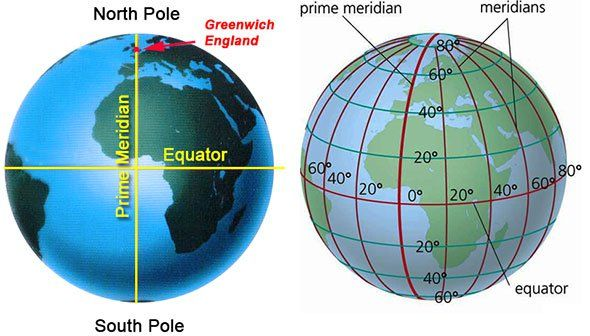
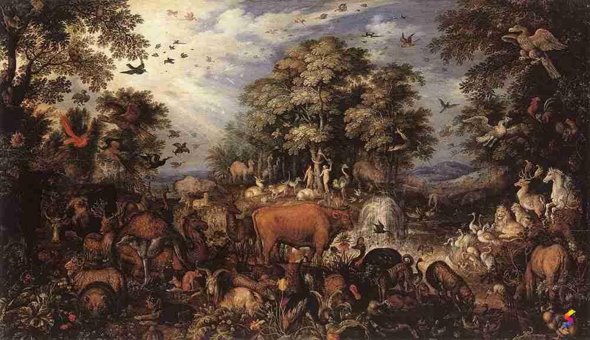
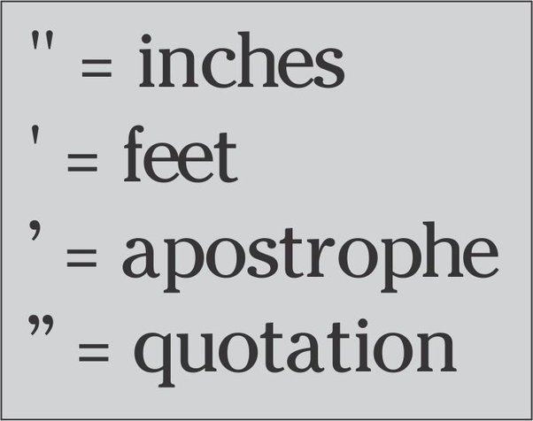

# 咬文嚼字-学科相关-Geology 地质学

@(TOEFL)[托福, TOEFL, 词根词缀,咬文爵字,学科相关]

[toc]

# Geology 地质学

## 1. Geologic time scale （ [Epoch (geology)](https://en.wikipedia.org/w/index.php?title=Epoch_(geology)&redirect=no)）

https://upload.wikimedia.org/wikipedia/commons/7/77/Geologic_Clock_with_events_and_periods.svg

## 2. Zo.ic 关键词根词缀

| 单词                                                     | 解释                                                         |
| -------------------------------------------------------- | ------------------------------------------------------------ |
| zoic                                                     | a. 动物的, 有...的(动物)生活方式的, 有生物的, 含有动植物遗迹的化石的 |
| **zo-**                                                  | =animal, 表示“动物”。源自希腊语 zoon, zoion "living being, animal." |
| **-ic**                                                  | 表形容词，"...的"                                            |
|                                                          |                                                              |
| **phanerozoic**: phanero-zoic 【ˌfænərəˈzəʊɪk} | **`phanero-`** = show, 表示“显示”。源自希腊语 phainein "to bring to light." 由古生代、中生代和新生代构成的地质年代）[地质] 显生宙的:  The period from about 5,400 million years ago until the present. |

## 3. 单位表

##  4. [术语表](https://en.wikipedia.org/wiki/Geologic_time_scale)

|                                          |                                                              |                                               |                                                              |
| ---------------------------------------- | ------------------------------------------------------------ | --------------------------------------------- | ------------------------------------------------------------ |
| **Hadean**                               | 冥古宇：designating or of the time before rocks formed on the Earth, which was then a molten mass, and when the solar system was forming | **Archean**                  【ɑ:ˈkiən】 | **`archa-`** = old, 表示“古”。来自希腊语 arkhē "beginning." 太古宇 |
| **Protero-zo-ic** 【prɔtərə'zəuik】 | **`prot-,proto-`** = first, source, parent, preceding, earliest form, original, basic，表示“最初的，原始的，第一的”。  | **Paleo-zon-ic** 【ˌpeɪliəˈzoʊɪk】       | **`paleo`- =old**, 表示“古，旧”。                                                                                             源自希腊语 palai "long ago." 古生代的 |
| **Meso-zo-ic** 【ˌmɛsəˈzoʊɪk】      | 中生代；中生代沉积岩： of, denoting, or relating to an era of geological time that began 250 000 000 years ago with the ***Triassic*** period and lasted about 185 000 000 years until the end of the ***Cretaceous*** period | **Ceno-zo-ic** 【ˌsinəˈzoʊɪk】           | **ceno-** 表示“新的，近期的”。源自希腊语 kainos "new, fresh, recent, novel."新生代. of, denoting, or relating to the most recent geological era, which began 65 000 000 years ago: characterized by the development and increase of the mammals |

### 1. prot- /  proto-：海中老人普罗透斯(proteus) {26}

普罗透斯（***Proteus***）是希腊神话中的一个早期海神，荷马史诗中所说的“海中老人”之 一。他有预测未来的神通，但只向能逮住他的人透露预言。为了避免被人逮住，他拥有随意 改变自己形状的神力。他居住在尼罗河三角洲海岸外的法罗斯岛上，以放牧海兽为生。

根据荷马史诗的记载，参加特洛伊战争的斯巴达国王墨涅拉奥斯（***Menelaus***）从特洛伊 启程回国前触犯了神灵，被困在法罗斯岛上。在这里他遇到了普罗透斯的女儿。后者向他透露了普罗透斯的秘密，还告诉他制服普罗透斯的诀窍。于是，墨涅拉奥斯带着手下，身披海 豹皮，悄悄接近普罗透斯，趁他瞌睡时，突然抓住他，任凭他千变万化也不松手。普罗透斯 最后没办法，只好变回原形投降，向墨涅拉奥斯透露了他所需要的预言。

普罗透斯的名字 ***Proteus*** 非常有意思，它来自希腊语 ***protos***（第一）。古话说，一生二， 二生四，四生万物，***Proteus*** 这个名字就暗示着他能够千变万化。英语词根 **`proto-`**（第一、最 初）就来源于此。

由 ***Proteus*** 衍生出形容词 **protean**，意思是“千变万化的”。

- proto-：第一，最初  
- Proteus：['prəʊtɪəs] n. 多变的人；普罗透斯（希腊海神）；变形杆菌属 
- protean： ['prəʊtɪən; prəʊ'tiːən] adj.千变万化的，一人分饰多角的，变形虫的 
- protocol：['protə'kɔl] n. 协议；草案；礼仪 v. 拟定。本意为“第一页” 
- proton：['protɑn] n. 质子 
- protein： ['protin] n. 蛋白质；朊 adj. 蛋白质的 
- protoplasm：['protəplæzəm] n. 原生质；原浆；细胞质 
- prototype： ['protə'taɪp] n. 原型；标准，模范 
- prototypical：[,protə'tɪpɪkl] adj. 原型的；典型的 
- protagonist：[prə'tæɡənɪst] n. 主角，主演；主要人物，领导者

### 2. mes- / meso -  = middle, 表示“中间、中部” {19}

> mes-,meso- 
> = middle, 表示“**中间、中部**”，也构成表示“**系膜**”的解刨学词汇。源自希腊语 mesos "middle."

### 3. paleo-  = old, 表示“古，旧” {13}

> **`paleo-`** = old, 表示“古，旧”。源自希腊语 palai "long ago."

| 单词                                      | 解释                                                         | 单词                                                   | 解释                                                         |
| ----------------------------------------- | ------------------------------------------------------------ | ------------------------------------------------------ | ------------------------------------------------------------ |
|                                           |                                                              |                                                        |                                                              |
|                                           |                                                              |                                                        |                                                              |
| **paleo-lith**          【pelɪolɪθ】 | n. 旧石器 推荐：paleo-古 + lith-石  **`paleo-`** = old, 表示“古，旧”。源自希腊语 palai "long ago." **`lith-`** = stone, 表示“石头” | pale-onto-logy               【ˌpeɪliənˈtɑlədʒi】 | 古生物学the earth science that studies fossil organisms and related remains。 **`pale-`** = old, 表示“古，旧”+ **`onto`**- 表示“存在”，和词根ess-同源+ **`-logy`** = science, 表示“科学，学科。 **`pale-`** = old, 表示“古，旧”。源自希腊语 palai "long ago." |
|                                           |                                                              | pale-onto-**logist**                                   | **`onto-`** 表示“存在”，和词根ess-同源。源自希腊语 einai (现在分词 ont- "being.") "to be."**`-logist`** 作为词缀表示...学家, |

### 4. cen- / ceno-  表示“新的，近期的” {13}

> ceno- 
> 表示“新的，近期的”。源自希腊语 kainos "new, fresh, recent, novel."

### 5. archaeo- = old, 表示“古” 来自希腊语 arkhē "beginning."{10}

| 单词                                                         | 解释                                                         | 单词                                                         | 解释                                                         |
| ------------------------------------------------------------ | ------------------------------------------------------------ | ------------------------------------------------------------ | ------------------------------------------------------------ |
| **Archeo-zo-ic **                          【ˌɑːkɪəˈzəʊɪk 】 | n. ~~早期前寒武纪~~太古代;始生代 推荐：Archeo- + zo-动物 + -ic  **`archaeo-`** = old, 表示“古”。来自希腊语 arkhē "beginning." **`zo-`** = animal, 表示“动物”。源自希腊语 zoon, zoion "living being, animal." | **archaeo-cyte**                   【ɑr'ki:əsɪt】        | 【医】 原细胞(游走变形细胞) 推荐：archaeo-古 + -cyte, 细胞  **`archaeo-`** = old, 表示“古”。来自希腊语 arkhē "beginning." **`cyte-`** = cell, 表示“细胞”。源自希腊语 kutos "a hollow, vessel." |
| **archa-ic** 【ɑːrˈkeɪɪk】                              | a. 古体的, 过时的, 古老的, 古代的 推荐：archa-早，古老 + -ic形容词后缀。  **`archa-`** = old, 表示“古”。来自希腊语 arkhē "beginning." **`-ic`** 表形容词，“…的”。  **archaic period**： 古风时期 | **archeo-pteryx** [^3] 【ˌɑːrkiˈɑːpterɪks】             | n. 始祖鸟 (1.5亿年前存在) the oldest known bird, which existed about 150 million years ago 推荐：archaeo-古 + pteryx-翼  **`archaeo-`** = old, 表示“古”。来自希腊语 arkhē "beginning." **`pteryx-`** 表示“翼”。源自希腊语 pteron "feather, wing," pterux "wing." 词源说明(童理民)   1 - arch-,原始，-pet,翅膀，追求，词源同 feather,appetite. |
|                                                              |                                                              | **[archaeo-metry](https://en.wikipedia.org/wiki/Archaeometry_(journal))** 【ˌɑːkɪˈɒmətrɪ】 | n.考古测量学、考古定年学 推荐：archaeo-古 + -metry（关于测量的）..法或...技术  **`archaeo-`** = old, 表示“古”。来自希腊语 arkhē "beginning." **`-metry`** = process of measuring, 表示“（测量)术”。源自希腊语 metron "measure, rule, length, proportion, poetic meter." 英英  n.1 . the systematic dating of archaeological objects |

### Crust

 

 

#### mantle 

> 一开始应该是表示一种（旧时候的）披风、斗篷。后来指代覆盖物，引申出责任和衣钵，地质学上特质地球的地幔。

- [sing.] the ~ of sb/sth （可继承的）责任，职责，衣钵：the role and responsibilities of an important person or job, especially when they are passed on from one person to another

  >  The vice-president must now take on the mantle of supreme power.

- 覆盖层：a layer of sth that covers a surface

  > hills with a mantle of snow

- （尤指旧时的）披风，斗篷：a loose piece of clothing without sleeves, worn over other clothes, especially in the past

- （煤气灯的）白炽罩：a cover around the flame of a gas lamp that becomes very bright when it is heated

- (geology 地) 地幔：the part of the earth below the crust and surrounding the core

**Reference：**

1. [Cloak Vs Cape: What Is the Difference? -- Silver Bobbin](https://silverbobbin.com/cloak-vs-cape/)
2. [What’s the Difference between Capes and Cloaks?--Raven Fox Capes](https://ravenfoxcapes.com/2018/05/difference-capes-vs-cloaks/)
3. [Mantle (clothing)--Wikipedia](https://en.wikipedia.org/wiki/Mantle_(clothing))
4. [Cloak--Wikipedia](https://en.wikipedia.org/wiki/Cloak)
5. [**Fantasy Wardrobe**: Cloaks, Mantles and Capes](https://inky-duchess.tumblr.com/post/183312538353/fantasy-wardrobe-cloaks-mantles-and-capes)

## therm= heat, 表示“热”{78}

> 源自希腊语 thermos "warm, hot, heat."

| 单词                              | 解释                                                         | 单词                                        | 解释                                                         |
| --------------------------------- | ------------------------------------------------------------ | ------------------------------------------- | ------------------------------------------------------------ |
| **ecto∙therm** 【ektəʊθɜːm】 | n. 冷血动物 推荐：ecto-外 + therm-热  **`ecto-`** 表示“外”，一般用于医学领域。源自希腊语 ex, ek "out of, from." **`therm-`** = heat, 表示“热”。源自希腊语 thermos "warm, hot, heat." | **endo-therm**  【endəθɜ:m】           | n. 热血动物 推荐：endo-内 + therm-热  **`endo-`** = within, 表示“内部”。源自希腊语 endon, endo- "within." **`therm-`** = heat, 表示“热”。源自希腊语 thermos "warm, hot, heat." |
| thermo-                           | pref. 热....                                                 | therm-ic                                    | 热的，由热造成的                                             |
| therm-al                          | 热的，热量的，温泉的                                         | therm-el                                    | 热电温度计                                                   |
| therm-ion                         | 热离子                                                       | thermo-os                                   | 热水瓶                                                       |
| thermo-taxis                      | 趋温性，向热性，体温调节                                     | thermo-taxic                                | 趋温性的，向热性的额，体温调节的                             |
| ago-therm-al                      | 地温的，地热的                                               | geo-therm-ic                                | 地温的，地热的                                               |
| exo-therm-ic                      | 发热的，发出热量的                                           | thermo-gen-ic                               | 生热的，产热的                                               |
| thermo-genesis                    | 生热作用                                                     | thermo-genet-ic                             | 生热的，生热作用的                                           |
| thermo-chemistry                  | 热化学                                                       | therm-alloy                                 | 热合金                                                       |
| thermo-paint                      | 示温涂料，测温漆                                             | thermo-color                                | 热敏油漆，色温标示，示温涂料                                 |
| thermo-labile                     | 不耐人的，热感的，受热即分解/破坏的                          | thermo-lysis                                | 热分解作用，热散作用                                         |
| thermo-plast-ic                   | 热熟性的                                                     | thermo-plastcity                            | 热塑性                                                       |
| alumino-therm-y                   | 铝热发                                                       | **a-therm-ancy**  【əˈθɜːrmənsi】      | n. 不透热性 推荐：a-不，非 + therm-热 + -ancy, 表名词 **`a-`** 加在单词前，表示“在…的”；表示“不、无、非”；表示“加强”。源自希腊语 a-, an- "not." **`therm-`** = heat, 表示“热”。源自希腊语 thermos "warm, hot, heat." **`-ancy`** = -ance, 表示“性质，状况”。 |
| a-atherm-ic                       | 不导热的                                                     | **dia-therm-ancy**  【ˌdaɪə'θɜ:mənsɪ】 | n. 透热性 推荐：dia-穿过 + therm-热 + -ancy, 表名词 **`dia-`** 表示“穿过，二者之间”。 **`therm-`** = heat, 表示“热”。源自希腊语 thermos "warm, hot, heat." **`-ancy`** = -ance, 表示“性质，状况”。 |
| thermo-meter                      | 温度测定法                                                   | therm                                       | n. 签卡，克卡，撒姆(煤气热量单位)                            |
| iso-therm                         | 等温线                                                       | thermo-meter                                | 温度计，体温计                                               |
| thermo-graph                      | 温度记录器                                                   | thermo-set                                  | 热固性的，热变定的                                           |
| thermo-regulation                 | 温度调节                                                     | thermo-regulator                            | 温度调节器                                                   |
| thermo-ammeter                    | 热电流表                                                     | thermo-scope                                | 体验器，温差对                                               |
| therm-istor                       | 热敏电阻                                                     | thermo-barometer                            | 温度气压计，虹吸气压表                                       |
| baro-thermo-graph                 | 气压温度计，其他温度计记录器                                 | bathy-thermo-graph                          | 海水测温仪                                                   |
| **thermo-period-ism**             | n. 温周期现象 推荐：thermo-热 + periodism【周期】  **`thermo-`** = heat, 表示“热”。源自希腊语 thermos "warm, hot, heat." **`period`** n. 时期, 节段, 节, 句点, 学时, 周期 a. 当时特有的,  **`-ism`** 抽象名词后缀 | thermo-dynam-ic                             | 热力学的，使用热动力的                                       |
| thermo-dynamics                   | 热力学                                                       | aero-thermo-dynamics                        | 空气热力学                                                   |
| therm-sphere                      | 热大气层，热电离层                                           | thermo-jet                                  | 热力喷气发动机                                               |
| thermo-nuclear                    | 热核的，热核武器的                                           | thermo-pile                                 | 温差电堆，热电堆                                             |
| electro-therm-al                  | 电热的                                                       | electro-therm-ics                           | 电热学                                                       |
| thermo-eletr-ic                   | 热电的                                                       | thermo-electri-city                         | n 温差电，热电                                               |
| thermo-electron                   | 热电子                                                       | epi-therm-al                                | 超热的                                                       |
| hypo-therm-ia                     | 低体温                                                       | thermo-theraphy                             | 温热疗法                                                     |
| dia-therm-ia                      | 透热疗法                                                     | dia-term-ic                                 | 透热疗法的                                                   |
| radio-therm-y                     | 短波透热，热放射疗法                                         | thermo-phil-ic                              | 适温的，喜温的                                               |

## lith- = stone, 表示“石头”{29}

 

| 单词                                      | 解释                                                         | 单词                                      | 解释                                                         |
| ----------------------------------------- | ------------------------------------------------------------ | ----------------------------------------- | ------------------------------------------------------------ |
| **paleo-lith**          【pelɪolɪθ】 | n. 旧石器 推荐：paleo-古 + lith-石  **`paleo-`** = old, 表示“古，旧”。源自希腊语 palai "long ago." **`lith-`** = stone, 表示“石头” | **paleo-lith-ic** 【ˌpeɪlɪəʊ'lɪθɪk】 | a. 旧石器时代的 推荐：Paleolith【旧石器】 + -ic表形容词，是单词paleolith 派生的形容词。  **`paleolith`** n. 旧石器 **`-ic`** 表形容词，“…的”。 词源说明(童理民)   1 - paleo-,远古的，-lith,石头，词源同 lighology. |
|                                           |                                                              |                                           |                                                              |
|                                           |                                                              |                                           |                                                              |

## seism- = earthquake, 表示“地震”。源自希腊语 seiein "to shake." {16}

| 单词                           | 解释                                                         | 单词                                                       | 解释                                                         |
| ------------------------------ | ------------------------------------------------------------ | ---------------------------------------------------------- | ------------------------------------------------------------ |
| **seism-ic** 【ˈsaɪzmɪk】 | a. 地震的 推荐：seism-地震 + -ic表形容词。  **`seism-`** = earthquake, 表示“地震”。源自希腊语 seiein "to shake." **`-ic`** 表形容词，“…的”。 词源说明(童理民)   1 - seism-,地震，-ic,形容词后缀。 | **seismo-logy**                     【saɪzˈmɑːlədʒi】 | n. 地震学 推荐：seismo-地震 + -logy学，学科  **`seismo-`** = earthquake, 表示“地震”。源自希腊语 seiein "to shake." **`-logy`** = science, 表示“科学，学科” 词源说明(童理民)   1 - seismo-,地震，-logy,学说。 |
|                                |                                                              |                                                            |                                                              |
|                                |                                                              |                                                            |                                                              |

# Geography 地理

## -itude 表名词，“性质，状态等”{36}

**`-itude`** 
表名词，“性质，状态等”。源自拉丁语 -tindo, abstract noun suffix.

<video src="./images/00180_longitude.mp4"></video>

| 单词                                 | 解释                                                         | 单词                                             | 解释                                                         |
| ------------------------------------ | ------------------------------------------------------------ | ------------------------------------------------ | ------------------------------------------------------------ |
| **long-itude** 【ˈlɑːndʒɪtuːd】 | **`long`**【长的】 + **`-itude`**, 表名词。即长度，用于地理经度，比较latitude。 **`long-`** = long, 表示“长”。源自拉丁语 longus "long." **`-itude`** 表名词，“性质，状态等”。源自拉丁语 -tindo, abstract noun suffix. 经度 | **lat-itude**                 【ˈlætɪtuːd】 | **`lat-`** = wide 表示“宽”。源自拉丁语 latus "broad, wide." **-itude** 表名词，“性质，状态等”。源自拉丁语 -tindo, abstract noun suffix. 纬度;纬度地区;选择(做什么事或做事方式)的自由。  temperate latitude**s**: 温带地区;温带 |
| **multi-tude** 【ˈmʌltɪtuːd】   | multi-  表示“很多，很多”。源自拉丁语 multus "many, much." 群众;众多;大量;人群;民众;大批百姓 | **Merid-ian** 【məˈrɪdiən】                 | A meridian is an imaginary line from the North Pole to the South Pole. Meridians are drawn on maps to help you describe the position of a place. 子午线;经线 prime meridian：本初子午线；本初子午圈：meridian at zero degree longitude from which east and west are reckoned (usually the Greenwich longitude in England) |
| **alt-itude** 【ˈæltɪtuːd】     | n. 高度, 海拔, 高处 the height above sea level  推荐： alt-高 + -itude → 高的地方 → 高处。 **`alt-`**  = high, 表示“高”。源自拉丁语 altus "high, deep." | ampl-itude                                       |                                                              |
| apt-itude                            |                                                              | in-ept-itude                                     | ,                                                            |
| beat-itude                           |                                                              | coorect-itude                                    | 端正，得体                                                   |
| cert-itude                           | 确实性，确信                                                 | in-cert-itude                                    |                                                              |
| crass-itude                          | 粗俗，愚钝                                                   | att-itude                                        |                                                              |
| de-crep-itude                        |                                                              | **dis-simil-itude ** 【ˌdɪssɪ'mɪlɪtju:d】   | n. 相异, 不同, 相异点 推荐：dis-不 + similitude【相似】  **`dis-`** 来自拉丁语dis-，表示“分开，散开”，引申词义“离开，无，没有，缺乏，表相反等”。 该前缀在字母 g, l, m, r, s, v 前缩写为 di-；在字母f前同化为 dif-。 **`simil-`** = alike, same, 表示“相类似，一样”。 源自拉丁语 simulare "to make like, imitate, copy, represent." **`-itude`** 表名词，“性质，状态等”。源自拉丁语 -tindo, abstract noun suffix. |
| **fort-itude** 【ˈfɔːrtɪtuːd】  | **`fort-`**强 + **`-itude`**, 表示状态 → 强的状态 **`fort-`** = strong, 表示“强大，力量”。源自拉丁语 fortis "strong." If you say that someone has shown **fortitude**, you admire them for being brave, calm, and uncomplaining when they have experienced something unpleasant or painful. | exact-itude                                      |                                                              |
| **grat-itude ** 【ˈɡrætɪtuːd】  | n. 感激之情 推荐：grat-感谢 + -itude, 表名词。  **`grat-`** = pleasing, 表示“感激，高兴”，grat- 源自拉丁语，gree- 是其法语变体。源自拉丁语 gratus "pleasing, beloved, agreeable, favorable, thankful." **`-itude`** 表名词，“性质，状态等”。源自拉丁语 -tindo, abstract noun suffix. 词源说明(童理民)   1 - 来自 grat-,感谢，词源同 grace,gratitude. | in-exact-itude                                   |                                                              |
| lass-itude                           |                                                              | infinit-ude                                      |                                                              |
| magn-itude                           |                                                              | omni-tude                                        |                                                              |
| plat-itude                           |                                                              | plen-itude                                       |                                                              |
| prompt-itude                         |                                                              | pulchr-itude                                     |                                                              |
| rect-itude                           |                                                              | serv-itude                                       |                                                              |
| simil-itude                          |                                                              | sol-itude                                        |                                                              |
| veri-simil-itude                     |                                                              | vast-itude                                       |                                                              |

#### Clay, Loam, Sand, Silt

 

| 单词                   | 解释                                                         | 单词                   | 解释                                                         |
| ---------------------- | ------------------------------------------------------------ | ---------------------- | ------------------------------------------------------------ |
| **Clay** 【kleɪ】 | n. 泥土, 黏土; <古诗>肉体 【复数：clays；现在分词：claying；过去分词：clayed】 源自古英语 clǣg; 和古高地德语 klīa, 挪威语 kli, 拉丁语 glūs "glue", 希腊语 gloios "sticky oil" 有亲缘关系。 1 - 来自 PIE*glei,黏，粘，词源同 cling,glue. | **Loam** 【loʊm】 | n. 壤土 vt. 用土填 【第三人称单数：loams；现在分词：loaming；过去分词：loamed】 1 - 来自古英语 lam,污泥，泥沼，来自 PIE*slei,黏，滑，词源同 slime,slip,lime.引申词义肥沃土壤。 |
| **Sand** 【sænd】 | good quality soil containing sand, clay and decayed vegetable matter n. 沙, 沙子, 沙滩; 浅黄灰色; <北美>刚毅 vt. 打磨; 撒沙, 以沙掩盖 sand意为“沙”，sands意为“沙滩，沙地，沙漠，沙丘”。 1 - 来自古英语 sand,沙，来自 Proto-Germanic*samdaz,沙，来自 PIE*sem,倾泻，涌出。引申动词词义磨砂，用砂纸打磨 | **Silt** 【sɪlt】 | sand, mud, etc. that is carried by flowing water and is left at the mouth of a river or in a harbour n. 淤泥    vt. 使淤塞  vi. 淤塞 【过去分词：silted；现在分词：silting；第三人称单数：silts】 来自古英语 sealt,盐，词源同 salt.原指海水沉积物，后引申词义淤泥，淤沙，淤积，淤塞等。  |
|                        |                                                              |                        |                                                              |

**feet of clay**致命的弱点。

《圣经》中记载，巴比伦王尼布甲尼撒梦到一个人，这个人头是金的，胸和双臂是银的，腹部和大腿是铜的，小腿是铁的，但双脚一部分是铁的，一部分是泥（clay）的。突然，一块石头打到这个人的脚上，他的双脚破碎了，他的整个身躯也瞬间坍塌。Everyone has his own feet of clay. 

**Reference:**

1. [How To Improve Different Types Of Soil For Planting](https://www.wilsonbrosgardens.com/different-soil-types.html)

#### alto | altitude

alto - 此系音乐术语，源自拉丁语altus，但却是直接借自意大利语，在意大利语是“高的”的意思，最初在英语中用以指“男声最高音”（和countertenor同义），不久以后也被用以指“女低音”（和contralto同义），这是因为女低音的音域和男声最高音很相像的缘故。英语中另有一些词，如:

- altimeter（测高仪）
- altitude（高度）
- altar（祭坛）

等也源自拉丁语altus。

- They are looking for an extra alto ... Are you soprano or alto? (CCE) 他们正在找一个临时女低音歌手……你唱女高音还是女低音
- She began by singing soprano, then changed to alto. (CID) 她以演唱女高音开始，然后又改成女低音。

#### archi-pelago [ˌɑːrkɪˈpeləɡoʊ]

**archipelago**（群岛）：希腊人的“主海”

英语单词**archipelago**源自希腊语***arkhipelagos***，由**`arkhi`**（=archi，chief，主的）+**`pilagos`**（sea，海）构成，意思就是“主海”，特指希腊人所处的爱琴海。

众所周知，爱琴海中遍布岛屿，所以希腊语***arkhipelagos***演变为意大利语***arcipelago***后，词义就变了，不再特指爱琴海，而是泛指各种分布有大量岛屿的海。进入英语后，拼写变成archipelago，词义进一步发生变化，除了表示“分布有大量岛屿的海”以外，还可以用来表示“群岛”。

**`archipelago -`** 该词最初仅被用以指爱琴海（**the Aegean Sea**）。这一名称是意大利人在13世纪据意大利语arcipelago 'chief sea'取的。其实这个词本身就来源于希腊语（***archi- 'chief' + pélagos 'sea'***）。由于爱琴海中有一大群岛屿，因此***archipelago***一词在16世纪后逐渐泛指“多岛屿的海”，最后又转指“群岛”。

> 例: The Hawaiian archipelago is made up of a number of large islands and some extremely small ones. (CAE) 夏威夷群岛由若干大岛和一些极小的岛组成。

- archipelago：[,ɑːkɪ'peləgəʊ] n.群岛，多岛的海
- monarch：n.君主，帝王，最高统治者
- pelagic：adj.深海的，浮游的，远洋的

**archi-  = ruler, rule, chief, 表示“统治者，统治，主要的”。来自希腊语 arch "rule or government。"**

## cumul- 表示“堆积”。由膨胀引申到强大是 church 的本意{6}

| 单词                                  | 解释                                                         | 单词                                                         | 解释                                                         |
| ------------------------------------- | ------------------------------------------------------------ | ------------------------------------------------------------ | ------------------------------------------------------------ |
| **cumul-us**[^2] 【ˈkjuːmjələs】 | n. 积云, 堆积物 推荐：cumul-堆积 + -us  cumul- 表示“堆积”。由膨胀引申到强大是 church 的本意。 词源说明(童理民)   1 - 来自 PIE*keue,膨胀，成堆，词源同 church,cave.cuneiform 楔形文字cunei-,楔子，词源同 cone. | **ac-cumul-ate**                      【əˈkjuːmjəleɪt】 | v. 积聚, 堆积 推荐：ac- + cumulate【堆积】 → 堆积起来 → 积累。  **`ac-`** 来自拉丁介词ad, 表示“朝、向、去，或弱化为强调”。 **`cumulate`** a. 堆积的, 累积的 v. 堆积, 累积 |
|                                       |                                                              |                                                              |                                                              |
|                                       |                                                              |                                                              |                                                              |

## 其他单词

| 单词                               | 解释                                                         | 单词                                                         | 解释                                                         |
| ---------------------------------- | ------------------------------------------------------------ | ------------------------------------------------------------ | ------------------------------------------------------------ |
| **glaci-ier**    【ˈɡleɪʃər】 | **`glaci-`** 表示“冰；光滑”。源自拉丁语 glacies "ice." 更多同源词... **`-ier`** {24}表名词，“人或物”。 A **glacier** is an extremely large mass of ice which moves very slowly, often down a mountain valley. | **oro-gen-y**                           【ɔːˈrɑːdʒəni】 | n. 造山运动(地层褶皱形成山脉的过程)  oro-山 + gen-出生 + -y  oro- = mountain, 表示“山”， 源自希腊语 oros "mountain" gen- = birth, produce, 表示“出生，产生”，医学上引申为“生殖或基因”。 -y 表名词，“人或小东西”，常带有戏谑性和爱称。 词源说明(童理民)   1 - 来自希腊语 oros,山，词源同 oread,orient.-gen,产生，造，词源同 gene,generate.即造山运动。 1 . the folding , faulting , and uplift of the Earth ' s crust to form mountain ranges , often accompanied by volcanic and seismic activity |
| **quartz** 【kwɔːrts】        | n. 石英 推荐：来自德语 Quarz,石头结晶体，石英。  词源说明(童理民)   1 - 来自德语 Quarz,石头结晶体，石英。 |                                                              |                                                              |
|                                    |                                                              |                                                              |                                                              |

## 五大洲与七大洋

| 单词                          | 解释                                                         | 单词                                   | 解释                                                         |
| ----------------------------- | ------------------------------------------------------------ | -------------------------------------- | ------------------------------------------------------------ |
|                               |                                                              | Asia 【eɪʒə】                     | n. 亚洲  词源说明(童理民)   1 - 词源不详，争议众多。在古希腊神话，Asia 是一位仙女的名字。同时，古希腊历史学家Herodotus 认为 Asia 是普罗米修斯的妻子。 |
| **Arct-ic** 【ˈɑːrktɪk】 | a. 北极的, 极寒的 n. 北极圈, 北极 推荐：arct-熊 + -ic…的 → 北极位于在大熊星座下。  **`arct-`** = north, bear, 表示“熊”。源自希腊语 arktos "bear." **`-ic`** 表形容词，“…的”。 | **Ant-arct-ica** 【æn'tɑ:rktɪkə】 | n. 南极洲 **`anti-`** 表示“反对，相反”。源自希腊语 anti "against, opposite." **`arct-`** = north, bear, 表示“熊”。源自希腊语 arktos "bear." |
|                               |                                                              |                                        |                                                              |

### Arctic（北极）：正对大熊星座的方向

> 来自希腊语 arktos,熊。北极的代表动物。

中国的古人用北斗七星来辨别北方，西方人则用包含了北斗七星的“大熊星座”来辨识北方。

希腊语***arktos***表示“熊”，引申表示“大熊星座”。因此正对着大熊星座的方向就被称为**arctic**，也就是“北极的”。背对大熊星座的方向就是**antarctic**（南极的）。

- **Arctic**：['ɑːktɪk] n.北极圈adj.北极的，极寒的
- **Antarctic**：[æn'tɑrktɪk] 南极洲，南极地区adj.南极的

**英语词源趣谈(庄和诚)**

**arctic** - 由于北极地区盛产白熊（即北极熊），所以人们往往将该地区同熊这一动物联系起来。夜空中北极附近的星座有大熊座（**Ursa Major**）和小熊座（**Ursa Minor**）。

英语中意指“北极（的）”的**arctic**一词也同熊有关系，它来源于意为“熊”的希腊词***árktos***。

该词还可转义为“极冷的”、“严寒的”。作名词用时，指“北极”或“北极地区”，首字母常大写。

例　

- Polar bears live in the Arctic (regions). (CID) 北极熊生活在北极地区。
- The Arctic is not a barren wasteland. (CAE) 北极地区并不是贫瘠的荒地。

### meander /miˈændər/

 

> 来自拉丁语 meander,蜿蜒的水道，来自希腊语 Maiandros,河流名，位于现土耳其境内。由于这条河流非常曲折，因此，引申词义蜿蜒，闲逛，散步等。该河流名字面意思可能为伟大的男人或善变的男人，来自 andro-,男人，词源同 android,mai-,伟大的，词源同 magnate,或善变的，词源同 mutable.

**meander** - 你可曾听过一首旋律优美的英国民歌**The Ash Grove**（梣丛）？歌中的第一句这样唱道：Down yonder green valley where streamlets meander，意思是说涓涓小溪沿着绿色山谷蜿蜒而下。

**meander**一词在这里表示“蜿蜒流动”。它来自一河流名，这是小亚细亚古国弗里吉亚（**Phrygia**）境内，即今土耳其西部的一条河流，现名**the Menderes**，古称**the Meander**。该河以其河道蜿蜒曲折著称。

**meander**一词源于希腊语***Maíandros***，16世纪末取道拉丁文、法语进入英语，17世纪以后多作动词用，用于河川，作“蜿蜒”解，用于人则作“漫步”、“闲逛”解。

例　

- The brook meanders through the valley. 那条小溪蜿蜒流过山谷。
- He meandered around the town with a backpack. 他背着帆布包在镇里四处闲逛。
- The discussion meandered (on) for hours. 讨论漫无边际地进行了几个小时。
- She'd begun to meander on about some irrelevant topic, so the chairman shut her up. (LCE) 她开始东拉西扯谈些不相干的题目，所以主席制止了她。

# 度量单位

## 源自希腊语 metron "measure, rule, length, proportion, poetic meter."{120}

### 1. metr- = measure, 表示“计量，测量等”{78}

>  源自希腊语 metron "measure, rule, length, proportion, poetic meter."

| 单词                         | 解释                                                         | 单词                              | 解释                                                         |
| ---------------------------- | ------------------------------------------------------------ | --------------------------------- | ------------------------------------------------------------ |
| **metr-ic** 【ˈmetrɪk】 | a. 公尺的, 公制的, 计量的 推荐：metre【米，公制】 + -ic表形容词。 **`metr-`** <= measure, 表示“计量，测量等”。源自希腊语 metron "measure, rule, length, proportion, poetic meter." **`-ic`** 表形容词，“…的”。 | **matrix**[^1] 【ˈmeɪtrɪks】 | n. **母体, 子宫, 基质, 脉石, 模型, 矩阵** 推荐： matri-母亲 + x → 母亲 → 母体。   词根分解  [词根树] **`matern-,matr-` ** = mother, 表示“母性，母亲”，源自拉丁语 mater "mother", 属格形式 matris。 母亲生出各种各样的孩子，就好像原材料做出各种物品一样，由此引出材料的含义。 来自拉丁语 matrix,子宫，母体，来自 mater,母亲。引申词义社会环境，并用于指科学术语矩阵。见电影《黑客帝国》 |
|                              |                                                              |                                   |                                                              |
|                              |                                                              |                                   |                                                              |

### 2. -metry = process of measuring, 表示“（测量）术”{42}

> 源自希腊语 metron "measure, rule, length, proportion, poetic meter." 

| 单词                                                   | 解释                                                         | 单词 | 解释 |
| ------------------------------------------------------ | ------------------------------------------------------------ | ---- | ---- |
| **opto-metry   **                【ɑːpˈtɑːmətri】 | n. 视力测定(法), 验光配镜(法) 推荐：opto-视力 + -metry（关于测量的）..法或...技术  **`opto-`** = sight, 表示“视力，眼睛”。源自希腊语 ops "eye." 更多同源词... **`-metry`** = process of measuring, 表示“（测量）术”。源自希腊语 metron "measure, rule, length, proportion, poetic meter." 更多同源词... 词源说明(童理民)   1 - 来自希腊语 optos,眼睛，视力，词源同 optic.-metry,测量仪器，测试。 |      |      |
|                                                        |                                                              |      |      |
|                                                        |                                                              |      |      |

## mill- 表示“千，千分之一”。源自拉丁语 mille "thousand." {26}

| 单词                                        | 解释                                                         | 单词                                   | 解释                                                         |
| ------------------------------------------- | ------------------------------------------------------------ | -------------------------------------- | ------------------------------------------------------------ |
| **mill-en-arian   **  【ˌmɪlɪˈneriən】 | a. 千禧年的, 一千年的 n. 千禧年信徒 推荐：mill-千 + en-年 + -arian , 人。  **`ann-,enn-`** = year, 表示“年，一年”。源自拉丁语 annus "year." **`mill-`** 表示“千，千分之一”。源自拉丁语 mille "thousand." **`-arian`** 表形容词或名词，“…的(人)”。 词源说明(童理民)   1 - 笃信未来基督再临地球时会出现太平盛世的信徒。来自 millennium,千禧年，-arian,人。 | **mill-enn-ia  **    【məˈlɛniə】 | n. 一千年, 千年周年纪念日, 千年庆典, 千年期, (喻)太平盛世, 想象中的黄金时代 推荐：mill-千 + enn-年 + -ia  **`mill-`** 表示“千，千分之一”。源自拉丁语 mille "thousand." **`enn-`** = year, 表示“年，一年”。源自拉丁语 annus "year." |
|                                             |                                                              |                                        |                                                              |
|                                             |                                                              |                                        |                                                              |

### mile（英里）：一千罗马步的距离

古代罗马人以“罗马步”（***passus***）作为测量距离的单位，一罗马步等于两个右脚（或左脚）脚印之间的距离，也就是两步的距离。

一千罗马步在拉丁语中就写作***mille passus***，其中的**mille**就是“千”的意思，英语词根**`milli-`**（千）就来源于此。英语中表示“英里”的单词mile就由拉丁语mille演变而来。一英里其实就是一千罗马步的距离。

随着罗马的征服，越来越多的地方采用**mile**作为距离单位。但由于各地人高矮不一，步幅有长有短，所以各地的**mile**的精确距离并不相等。1592年，英国女王伊丽莎白一世颁布法令，规定**mile**等于1760码（**yard**），即大约1.6公里，这就是我们今天所说的“法定英里”（**statute mile**）。

- **`milli-`**：千
- **mile**：[maɪl] n.英里
- **mileage**：['maɪlɪdʒ] n. 英里数
- **million**： ['mɪljən] n. 百万；无数adj. 百万的；无数的num. 百万
- **millennium**：[məˈlɛniəm] n. 千年期，千禧年；一千年，千年纪念

词源说明(童理民)  
1 - 来自拉丁语 mille,千，词源同 million,annus,年，词源同 annual.即一千年，千禧年。

## ann-,enn- = year, 表示“年，一年”。源自拉丁语 annus "year." {24}

| 单词                                     | 解释                                                         | 单词                                   | 解释                                                         |
| ---------------------------------------- | ------------------------------------------------------------ | -------------------------------------- | ------------------------------------------------------------ |
| **mill-en-arian ** 【ˌmɪlɪˈneriən】 | a. 千禧年的, 一千年的 n. 千禧年信徒 推荐：mill-千 + en-年 + -arian , 人。  **`ann-,enn-`** = year, 表示“年，一年”。源自拉丁语 annus "year." **`mill-`** 表示“千，千分之一”。源自拉丁语 mille "thousand." **`-arian`** 表形容词或名词，“…的(人)”。 词源说明(童理民)   1 - 笃信未来基督再临地球时会出现太平盛世的信徒。来自 millennium,千禧年，-arian,人。 | **mill-enn-ia  **    【məˈlɛniə】 | n. 一千年, 千年周年纪念日, 千年庆典, 千年期, (喻)太平盛世, 想象中的黄金时代 推荐：mill-千 + enn-年 + -ia  **`mill-`** 表示“千，千分之一”。源自拉丁语 mille "thousand." **`enn-`** = year, 表示“年，一年”。源自拉丁语 annus "year." |
|                                          |                                                              |                                        |                                                              |
|                                          |                                                              |                                        |                                                              |

## nano- 表示“毫微（十亿分之一）”。源自希腊语 nannos, nanos "little old man." {11}

| 单词                     | 解释                                                         | 单词 | 解释 |
| ------------------------ | ------------------------------------------------------------ | ---- | ---- |
| **nano** 【ˈnɑnoʊ】 | 【计】 纳, 毫微 推荐：nano-毫微  **`nano-`** 表示“毫微（十亿分之一）”。源自希腊语 nannos, nanos "little old man." |      |      |
|                          |                                                              |      |      |
|                          |                                                              |      |      |

### acre [ˈeɪkər] 英亩 一对牛一天能耕的面积

 

> 来自 agro,农业，农田，词源同 agriculture,农学。在古英语里指一块土地，后量化为一头牛一天所能耕作的土地，即 1 英亩。

**英语词源趣谈(庄和诚)**

古代巴比伦人把水浇地叫做***agar***。该词进入拉丁语后，作***ager***，公元10世纪进入英语，作**acre**或**acras**。

最初**acre**指未被占用的土地，以后又指一对同轭牛从日出至日落所犁土地的面积。到了爱德华一世时代（1272-1307）才正式把**acre**作为地积单位，指4×40平方杆（rods）的土地，汉语译作“英亩”。

从古英语时期直到莎士比亚时代，**acre**还往往被用来泛指田地。莎剧《皆大欢喜》（As You Like It）第5幕第3场中的一句话“Between the acres of the rye”（在黑麦地与黑麦地之间）可多少说明这一点。

- They bought half an acre of land to build their house on. (CAE) 他们买了半英亩土地来盖房子。
- The farmer planted 40 acres of wheat. (NED) 这个农场主种了40英亩小麦。

英语单词**acre**原本并非计量单位，而是“耕开的土地”的意思。后来，**acre**才演变为计量单位，一英亩到底有多大呢？***其实就是平均一对牛一天能耕的面积***。

在古代英国，耕地时通常使用一对牛来拉一把犁，一天下来，这对牛能耕的面积就是一英亩。后来英国政府才明确规定了**acre**的面积，等于大约6亩、0.4公顷。

- **acre**： ['eɪkə] n.英亩，土地，地产
- **acreage**：['ekərɪdʒ] n. 面积，英亩数

### acorn（橡子）：中世纪时用来喂猪的坚果

 

英语单词**acorn**原本指的是林木所结的任何一种坚果。它在古英语中写作**acern**，由**`acer`**（空旷土地) + **`n`**（nut，坚果）构成，字面意思就是“空旷土地中的坚果”。其中**acer**就是单词**acre**（英亩）的词源。

中世纪时，欧洲人在空旷林地里养猪，橡子是猪所吃的主要食物，因此**acorn**后来专指“橡子”。直到现在，著名的西班牙黑毛猪在屠宰前5个月必须放牧在纯天然的橡树林下，以树上跌落的橡子为食。

- **acorn**：['ekɔrn] n. 橡子，橡实
- **acre**：['ekɚ] n. 土地，地产；英亩

**摩西英语(摩西)**

peregrine ['pɛrɪɡrɪn] n.游隼，adj.外来的；移住的。适合驯养的鹞鹰有几个品种可以选择，其中之一是游隼。前缀per-表through，词根egr-=agr-表田野，比如agriculture ['ægrɪkʌltʃə] n.农业；农耕；农艺，与acre ['eɪkə] n.英亩；土地，同源，后缀-ine表形容词。游隼，飞翔于山野间的鹰。 

### (比较) ace（王牌）：扑克牌中的A

**ace**（王牌）：扑克牌中的A

人们通常认为，西方的扑克牌（**poker**）源自意大利的塔罗牌。除了大小鬼两张副牌外，共有52张正牌，分成四个花色。除了1-10等数字牌外，还有K、Q、J三种人头牌。其中

- K代表King（国王），
- Q代表Queen（王后），
- J代表Jack（勇士）。

其中，表示数字“1”的牌用字母A表示，英语中叫做**ace**，意思就是“一”，来自法语和拉丁语as（一）。**ace**除了可以表示扑克牌中的A外，还可以表示骰子中的一点。由于ace代表最小的分值，所以ace原本含有“坏运气”、“无用的东西”等含义。

在法国大革命后，人们修改了扑克牌的游戏规则，使A比K大，作为“底层人民推翻君主”的象征。从此以后，A成了最大的牌。相应的，单词**ace**的含义也发生了变化，变成了“王牌、佼佼者”的意思。在第一次世界大战中，**ace**还被用来表示击落5架以上敌机的王牌飞行员。在网球比赛中，发球直接得分也被称为“ace球”。

- **ace：[eɪs]**
  - n.幺点，佼佼者，王牌，直接得分的发球
  - adj.一流的，极好的
  - v.发球直接得分，击败，得高分，顺利通过考试

- Her sister is an ace reporter. 她姐姐是位第一流的新闻记者。

### gram

> 来自 PIE*gerbh,刮，刻，切，词源同 carve,graph.后指文字，字母。并在法国于 1799 年用于公制重量体系，克。

n. 克, 绿豆, 鹰嘴豆

### meter（米）：希腊古典诗歌韵律的最小单位

>  来自 metre,米，公制。

英语单词**meter**（米）源自希腊语***metron***，原本是希腊古典诗歌韵律中的最小单位，由一组长短音节组成，希腊古典诗歌中，每一行应该包括若干个**metron**。

其实可以简单地理解为我们的五言诗或七言诗中的一个字。由于***metron***是衡量诗歌韵律的最小单位，所以后来***metron***在希腊语中又衍生出“度量万物的最小单位”之意。

1789年法国大革命胜利后，国民公会令法国科学院组织一个委员会来标准的度量衡制度。委员会提议了一套新的十进制的度量衡制度，并建议以通过巴黎的子午线上从地球赤道到北极点的距离的一千万分之一（即地球子午线的四千万分之一）作为标准单位。他们用希腊语***metron***作为这个标准单位的名称，在法语中拼写为***mètre***，进入英语后拼写变为**meter**，中文译成“米突”或“米”。

到现在，英语单词**meter**依然还保留了“韵律”之意，反映了它的渊源。

- **meter**：['mitɚ] 
  - n.米，公尺；仪表；韵律
  - v.用仪表度量
- **metric**：['mɛtrɪk] 
  - adj. 公制的；米制的；公尺的
  - n. 度量标准

- **Metrics** ： [ˈmɛtrɪks] n. 度量;指标;量度;度量指标;衡量标准

- **metrical**：['mɛtrɪkl] adj. 测量的；韵律的；有韵律的

### What is the symbol for feet and inches?

 

> https://www.quora.com/What-is-the-symbol-for-feet-and-inches

 

Feet = '
Inches = "

E.g.: I am 6'2" tall.

 

## Reference

[^1]: matrix ['meɪtrɪks] n.矩阵；模型；[生物][地质] 基质；母体；子宫。拉丁词源，与英语本族单词mother同源。 英国学者William Tyndale在自己从拉丁语翻译作英语的《圣经》中第一次将这个单词引入了英语。 体会一下所有的意思，**都和母亲在子宫里孕育胎儿这一现象有关。矩阵？括号里包含（孕育）着数集**。  ↩ ↩
[^2]: 气象学有一术语cumulus（积云），是拉丁语借用词，原义为“堆”。accumulate一词源自拉丁语accumulāre，其词根正是这个意为“堆”的cumulus，由ad-加cumulus构成，因此作“积累”或“积聚”解。
[^3]: 摩西英语(摩西) helicopter n.直升机，是因为词根helic表示旋转，而pter表示翅膀，直升机得名自有“旋转”的翅膀，而不是扑腾的声音，否则怎么解释archaeopteryx始祖鸟（最早有翅膀的鸟）、pterosaur翼龙（有翅膀的恐龙）和pterodactyl翼手龙（手dacty的部位长翅膀）。至于再进一步pter的来源，不详细列了。
