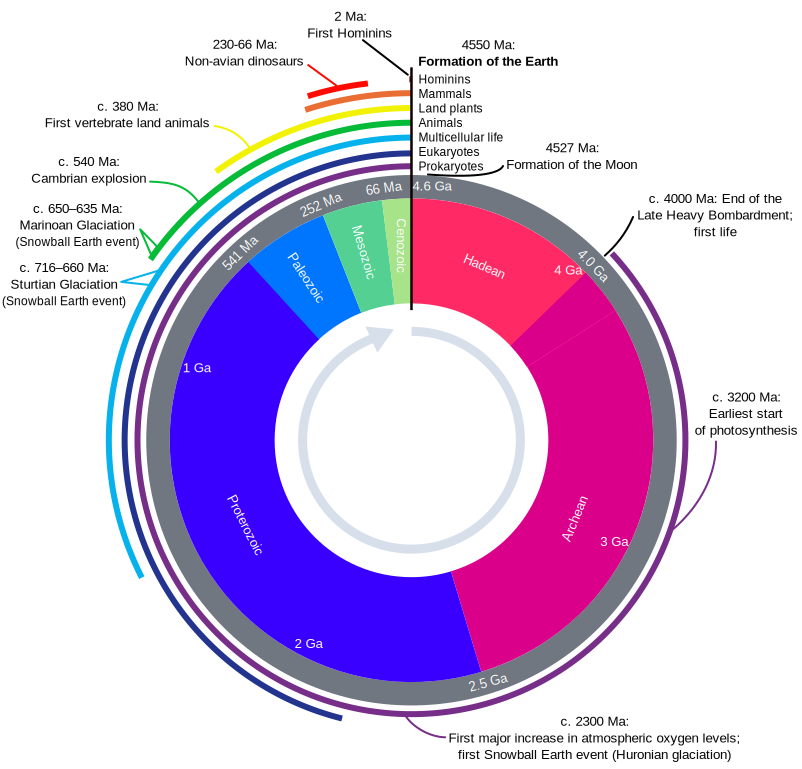
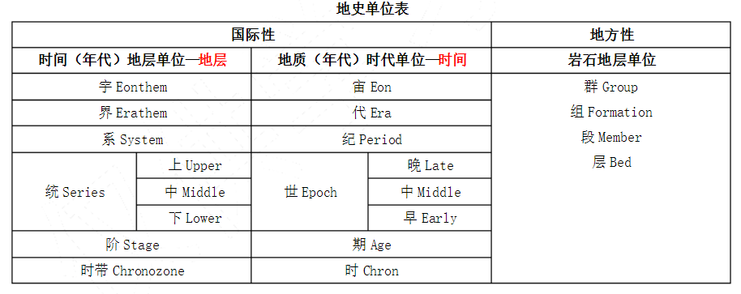
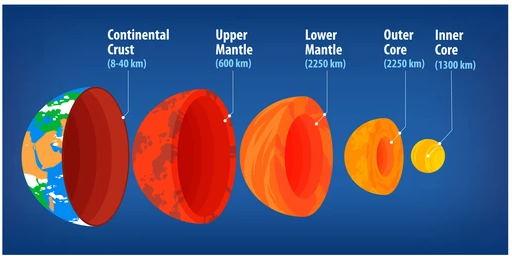

# 咬文嚼字-学科相关-Geology 地质学

@(TOEFL)[托福, TOEFL, 词根词缀,咬文爵字,学科相关]

[toc]

## Geology 地质学

### 1. Geologic time scale （ [Epoch (geology)](https://en.wikipedia.org/w/index.php?title=Epoch_(geology)&redirect=no)）

https://upload.wikimedia.org/wikipedia/commons/7/77/Geologic_Clock_with_events_and_periods.svg

### 2. Zo.ic 关键词根词缀

| 单词                                                     | 解释                                                         |
| -------------------------------------------------------- | ------------------------------------------------------------ |
| zoic                                                     | a. 动物的, 有...的(动物)生活方式的, 有生物的, 含有动植物遗迹的化石的 |
| **zo-**                                                  | =animal, 表示“动物”。源自希腊语 zoon, zoion "living being, animal." |
| **-ic**                                                  | 表形容词，"...的"                                            |
|                                                          |                                                              |
| **phanerozoic**: phanero-zoic 【ˌfænərəˈzəʊɪk} | **`phanero-`** = show, 表示“显示”。源自希腊语 phainein "to bring to light." 由古生代、中生代和新生代构成的地质年代）[地质] 显生宙的:  The period from about 5,400 million years ago until the present. |

### 3. 单位表

###  4. [术语表](https://en.wikipedia.org/wiki/Geologic_time_scale)

|                                          |                                                              |                                               |                                                              |
| ---------------------------------------- | ------------------------------------------------------------ | --------------------------------------------- | ------------------------------------------------------------ |
| **Hadean**                               | 冥古宇：designating or of the time before rocks formed on the Earth, which was then a molten mass, and when the solar system was forming | **Archean**                  【ɑ:ˈkiən】 | **`archa-`** = old, 表示“古”。来自希腊语 arkhē "beginning." 太古宇 |
| **Protero-zo-ic** 【prɔtərə'zəuik】 | **`prot-,proto-`** = first, source, parent, preceding, earliest form, original, basic，表示“最初的，原始的，第一的”。  | **Paleo-zon-ic** 【ˌpeɪliəˈzoʊɪk】       | **`paleo`- =old**, 表示“古，旧”。                                                                                             源自希腊语 palai "long ago." 古生代的 |
| **Meso-zo-ic** 【ˌmɛsəˈzoʊɪk】      | 中生代；中生代沉积岩： of, denoting, or relating to an era of geological time that began 250 000 000 years ago with the ***Triassic*** period and lasted about 185 000 000 years until the end of the ***Cretaceous*** period | **Ceno-zo-ic** 【ˌsinəˈzoʊɪk】           | **ceno-** 表示“新的，近期的”。源自希腊语 kainos "new, fresh, recent, novel."新生代. of, denoting, or relating to the most recent geological era, which began 65 000 000 years ago: characterized by the development and increase of the mammals |

#### 1. paleo-  = old, 表示“古，旧”

> **`paleo-`** = old, 表示“古，旧”。源自希腊语 palai "long ago."

| 单词                                  | 解释           | 单词                                                   | 解释                                                         |
| ------------------------------------- | -------------- | ------------------------------------------------------ | ------------------------------------------------------------ |
|                                       |                |                                                        |                                                              |
|                                       |                |                                                        |                                                              |
| paleo-lith          【pelɪolɪθ】 | 【考古】旧石器 | pale-onto-logy               【ˌpeɪliənˈtɑlədʒi】 | 古生物学the earth science that studies fossil organisms and related remains。 **`pale-`** = old, 表示“古，旧”+ **`onto`**- 表示“存在”，和词根ess-同源+ **`-logy`** = science, 表示“科学，学科。 |
|                                       |                | pale-onto-**logist**                                   | **`-logist`** 作为词缀表示...学家,                           |

> **`pale-`** = old, 表示“古，旧”。源自希腊语 palai "long ago."
>
> **`onto-`** 表示“存在”，和词根ess-同源。源自希腊语 einai (现在分词 ont- "being.") "to be."
>
> **`-logy`** = science, 表示“科学，学科”，由词根 log-, 说，引申而来；-logy 作为词缀表示...学，-logist 作为词缀表示...学家, -logical 作为词缀表示...学的。源自希腊语 logos "speech, word, reason."

#### 2. proto-：海中老人普罗透斯(proteus)

普罗透斯（***Proteus***）是希腊神话中的一个早期海神，荷马史诗中所说的“海中老人”之 一。他有预测未来的神通，但只向能逮住他的人透露预言。为了避免被人逮住，他拥有随意 改变自己形状的神力。他居住在尼罗河三角洲海岸外的法罗斯岛上，以放牧海兽为生。

根据荷马史诗的记载，参加特洛伊战争的斯巴达国王墨涅拉奥斯（***Menelaus***）从特洛伊 启程回国前触犯了神灵，被困在法罗斯岛上。在这里他遇到了普罗透斯的女儿。后者向他透露了普罗透斯的秘密，还告诉他制服普罗透斯的诀窍。于是，墨涅拉奥斯带着手下，身披海 豹皮，悄悄接近普罗透斯，趁他瞌睡时，突然抓住他，任凭他千变万化也不松手。普罗透斯 最后没办法，只好变回原形投降，向墨涅拉奥斯透露了他所需要的预言。

普罗透斯的名字 ***Proteus*** 非常有意思，它来自希腊语 ***protos***（第一）。古话说，一生二， 二生四，四生万物，***Proteus*** 这个名字就暗示着他能够千变万化。英语词根 **`proto-`**（第一、最 初）就来源于此。

由 ***Proteus*** 衍生出形容词 **protean**，意思是“千变万化的”。

- proto-：第一，最初  
- Proteus：['prəʊtɪəs] n. 多变的人；普罗透斯（希腊海神）；变形杆菌属 
- protean： ['prəʊtɪən; prəʊ'tiːən] adj.千变万化的，一人分饰多角的，变形虫的 
- protocol：['protə'kɔl] n. 协议；草案；礼仪 v. 拟定。本意为“第一页” 
- proton：['protɑn] n. 质子 
- protein： ['protin] n. 蛋白质；朊 adj. 蛋白质的 
- protoplasm：['protəplæzəm] n. 原生质；原浆；细胞质 
- prototype： ['protə'taɪp] n. 原型；标准，模范 
- prototypical：[,protə'tɪpɪkl] adj. 原型的；典型的 
- protagonist：[prə'tæɡənɪst] n. 主角，主演；主要人物，领导者

#### 3. mes- / meso -  = middle, 表示“中间、中部”

mes-,meso- 
= middle, 表示“**中间、中部**”，也构成表示“**系膜**”的解刨学词汇。源自希腊语 mesos "middle."

#### 4. Ceno-  表示“新的，近期的”

ceno- 
表示“新的，近期的”。源自希腊语 kainos "new, fresh, recent, novel."

### Crust

#### mantle 

> 一开始应该是表示一种（旧时候的）披风、斗篷。后来指代覆盖物，引申出责任和衣钵，地质学上特质地球的地幔。

- [sing.] the ~ of sb/sth （可继承的）责任，职责，衣钵：the role and responsibilities of an important person or job, especially when they are passed on from one person to another

  >  The vice-president must now take on the mantle of supreme power.

- 覆盖层：a layer of sth that covers a surface

  > hills with a mantle of snow

- （尤指旧时的）披风，斗篷：a loose piece of clothing without sleeves, worn over other clothes, especially in the past

- （煤气灯的）白炽罩：a cover around the flame of a gas lamp that becomes very bright when it is heated

- (geology 地) 地幔：the part of the earth below the crust and surrounding the core

**Reference：**

1. [Cloak Vs Cape: What Is the Difference? -- Silver Bobbin](https://silverbobbin.com/cloak-vs-cape/)
2. [What’s the Difference between Capes and Cloaks?--Raven Fox Capes](https://ravenfoxcapes.com/2018/05/difference-capes-vs-cloaks/)
3. [Mantle (clothing)--Wikipedia](https://en.wikipedia.org/wiki/Mantle_(clothing))
4. [Cloak--Wikipedia](https://en.wikipedia.org/wiki/Cloak)
5. [**Fantasy Wardrobe**: Cloaks, Mantles and Capes](https://inky-duchess.tumblr.com/post/183312538353/fantasy-wardrobe-cloaks-mantles-and-capes)

## Geography 地理

### -itude 表名词，“性质，状态等”{36}

**`-itude`** 
表名词，“性质，状态等”。源自拉丁语 -tindo, abstract noun suffix.

<video src="./images/00180_longitude.mp4"></video>

| 单词                                 | 解释                                                         | 单词                                             | 解释                                                         |
| ------------------------------------ | ------------------------------------------------------------ | ------------------------------------------------ | ------------------------------------------------------------ |
| **long-itude** 【ˈlɑːndʒɪtuːd】 | **`long`**【长的】 + **`-itude`**, 表名词。即长度，用于地理经度，比较latitude。 **`long-`** = long, 表示“长”。源自拉丁语 longus "long." **`-itude`** 表名词，“性质，状态等”。源自拉丁语 -tindo, abstract noun suffix. 经度 | **lat-itude**                 【ˈlætɪtuːd】 | **`lat-`** = wide 表示“宽”。源自拉丁语 latus "broad, wide." **-itude** 表名词，“性质，状态等”。源自拉丁语 -tindo, abstract noun suffix. 纬度;纬度地区;选择(做什么事或做事方式)的自由。  temperate latitude**s**: 温带地区;温带 |
| **multi-tude** 【ˈmʌltɪtuːd】   | multi-  表示“很多，很多”。源自拉丁语 multus "many, much." 群众;众多;大量;人群;民众;大批百姓 | **Merid-ian** 【məˈrɪdiən】                 | A meridian is an imaginary line from the North Pole to the South Pole. Meridians are drawn on maps to help you describe the position of a place. 子午线;经线 prime meridian：本初子午线；本初子午圈：meridian at zero degree longitude from which east and west are reckoned (usually the Greenwich longitude in England) |
| **alt-itude** 【ˈæltɪtuːd】     | n. 高度, 海拔, 高处 the height above sea level  推荐： alt-高 + -itude → 高的地方 → 高处。 **`alt-`**  = high, 表示“高”。源自拉丁语 altus "high, deep." | ampl-itude                                       |                                                              |
| apt-itude                            |                                                              | in-ept-itude                                     | ,                                                            |
| beat-itude                           |                                                              | coorect-itude                                    | 端正，得体                                                   |
| cert-itude                           | 确实性，确信                                                 | in-cert-itude                                    |                                                              |
| crass-itude                          | 粗俗，愚钝                                                   | att-itude                                        |                                                              |
| de-crep-itude                        |                                                              | dis-simil-itude                                  |                                                              |
| **fort-itude** 【ˈfɔːrtɪtuːd】  | **`fort-`**强 + **`-itude`**, 表示状态 → 强的状态 **`fort-`** = strong, 表示“强大，力量”。源自拉丁语 fortis "strong." If you say that someone has shown **fortitude**, you admire them for being brave, calm, and uncomplaining when they have experienced something unpleasant or painful. | exact-itude                                      |                                                              |
| grat-itude                           |                                                              | in-exact-itude                                   |                                                              |
| lass-itude                           |                                                              | infinit-ude                                      |                                                              |
| magn-itude                           |                                                              | omni-tude                                        |                                                              |
| plat-itude                           |                                                              | plen-itude                                       |                                                              |
| prompt-itude                         |                                                              | pulchr-itude                                     |                                                              |
| rect-itude                           |                                                              | serv-itude                                       |                                                              |
| simil-itude                          |                                                              | sol-itude                                        |                                                              |
| veri-simil-itude                     |                                                              | vast-itude                                       |                                                              |

### Clay, Loam, Sand, Silt

 

| 单词                   | 解释                                                         | 单词                   | 解释                                                         |
| ---------------------- | ------------------------------------------------------------ | ---------------------- | ------------------------------------------------------------ |
| **Clay** 【kleɪ】 | n. 泥土, 黏土; <古诗>肉体 【复数：clays；现在分词：claying；过去分词：clayed】 源自古英语 clǣg; 和古高地德语 klīa, 挪威语 kli, 拉丁语 glūs "glue", 希腊语 gloios "sticky oil" 有亲缘关系。 1 - 来自 PIE*glei,黏，粘，词源同 cling,glue. | **Loam** 【loʊm】 | n. 壤土 vt. 用土填 【第三人称单数：loams；现在分词：loaming；过去分词：loamed】 1 - 来自古英语 lam,污泥，泥沼，来自 PIE*slei,黏，滑，词源同 slime,slip,lime.引申词义肥沃土壤。 |
| **Sand** 【sænd】 | good quality soil containing sand, clay and decayed vegetable matter n. 沙, 沙子, 沙滩; 浅黄灰色; <北美>刚毅 vt. 打磨; 撒沙, 以沙掩盖 sand意为“沙”，sands意为“沙滩，沙地，沙漠，沙丘”。 1 - 来自古英语 sand,沙，来自 Proto-Germanic*samdaz,沙，来自 PIE*sem,倾泻，涌出。引申动词词义磨砂，用砂纸打磨 | **Silt** 【sɪlt】 | sand, mud, etc. that is carried by flowing water and is left at the mouth of a river or in a harbour n. 淤泥    vt. 使淤塞  vi. 淤塞 【过去分词：silted；现在分词：silting；第三人称单数：silts】 来自古英语 sealt,盐，词源同 salt.原指海水沉积物，后引申词义淤泥，淤沙，淤积，淤塞等。  |
|                        |                                                              |                        |                                                              |

**feet of clay**致命的弱点。

《圣经》中记载，巴比伦王尼布甲尼撒梦到一个人，这个人头是金的，胸和双臂是银的，腹部和大腿是铜的，小腿是铁的，但双脚一部分是铁的，一部分是泥（clay）的。突然，一块石头打到这个人的脚上，他的双脚破碎了，他的整个身躯也瞬间坍塌。Everyone has his own feet of clay. 

**Reference:**

1. [How To Improve Different Types Of Soil For Planting](https://www.wilsonbrosgardens.com/different-soil-types.html)

### alto | altitude

alto - 此系音乐术语，源自拉丁语altus，但却是直接借自意大利语，在意大利语是“高的”的意思，最初在英语中用以指“男声最高音”（和countertenor同义），不久以后也被用以指“女低音”（和contralto同义），这是因为女低音的音域和男声最高音很相像的缘故。英语中另有一些词，如:

- altimeter（测高仪）
- altitude（高度）
- altar（祭坛）

等也源自拉丁语altus。

- They are looking for an extra alto ... Are you soprano or alto? (CCE) 他们正在找一个临时女低音歌手……你唱女高音还是女低音
- She began by singing soprano, then changed to alto. (CID) 她以演唱女高音开始，然后又改成女低音。

### archi-pelago [ˌɑːrkɪˈpeləɡoʊ]

**archipelago**（群岛）：希腊人的“主海”

英语单词**archipelago**源自希腊语***arkhipelagos***，由**`arkhi`**（=archi，chief，主的）+**`pilagos`**（sea，海）构成，意思就是“主海”，特指希腊人所处的爱琴海。

众所周知，爱琴海中遍布岛屿，所以希腊语***arkhipelagos***演变为意大利语***arcipelago***后，词义就变了，不再特指爱琴海，而是泛指各种分布有大量岛屿的海。进入英语后，拼写变成archipelago，词义进一步发生变化，除了表示“分布有大量岛屿的海”以外，还可以用来表示“群岛”。

**`archipelago -`** 该词最初仅被用以指爱琴海（**the Aegean Sea**）。这一名称是意大利人在13世纪据意大利语arcipelago 'chief sea'取的。其实这个词本身就来源于希腊语（***archi- 'chief' + pélagos 'sea'***）。由于爱琴海中有一大群岛屿，因此***archipelago***一词在16世纪后逐渐泛指“多岛屿的海”，最后又转指“群岛”。

> 例: The Hawaiian archipelago is made up of a number of large islands and some extremely small ones. (CAE) 夏威夷群岛由若干大岛和一些极小的岛组成。

- archipelago：[,ɑːkɪ'peləgəʊ] n.群岛，多岛的海
- monarch：n.君主，帝王，最高统治者
- pelagic：adj.深海的，浮游的，远洋的

**archi-  = ruler, rule, chief, 表示“统治者，统治，主要的”。来自希腊语 arch "rule or government。"**

### 其他单词

| 单词                               | 解释                                                         | 单词                                                         | 解释                                                         |
| ---------------------------------- | ------------------------------------------------------------ | ------------------------------------------------------------ | ------------------------------------------------------------ |
| **glaci-ier**    【ˈɡleɪʃər】 | **`glaci-`** 表示“冰；光滑”。源自拉丁语 glacies "ice." 更多同源词... **`-ier`** {24}表名词，“人或物”。 A **glacier** is an extremely large mass of ice which moves very slowly, often down a mountain valley. | **oro-gen-y**                           【ɔːˈrɑːdʒəni】 | n. 造山运动(地层褶皱形成山脉的过程)  oro-山 + gen-出生 + -y  oro- = mountain, 表示“山”， 源自希腊语 oros "mountain" gen- = birth, produce, 表示“出生，产生”，医学上引申为“生殖或基因”。 -y 表名词，“人或小东西”，常带有戏谑性和爱称。 词源说明(童理民)   1 - 来自希腊语 oros,山，词源同 oread,orient.-gen,产生，造，词源同 gene,generate.即造山运动。 1 . the folding , faulting , and uplift of the Earth ' s crust to form mountain ranges , often accompanied by volcanic and seismic activity |
|                                    |                                                              |                                                              |                                                              |
|                                    |                                                              |                                                              |                                                              |

