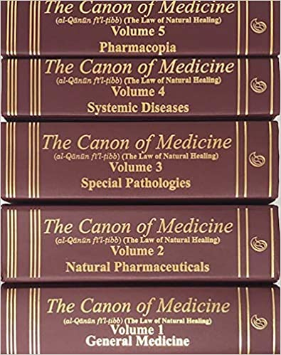

# 咬文嚼字-学科相关-IT

@(TOEFL)[托福, TOEFL, 词根词缀,咬文爵字,学科相关]

[toc]

## Hash 杂烩 => 哈希表

n. 剁碎的食物, 杂乱无章的的一大堆, 杂烩, 复述, 【计】散列
vt. 切碎, 搞糟
【复数：hashes；过去分词：hashed；现在分词：hashing】

1 - 来自法语 hacher,剁，剁碎，词源同 hatchet.引申词义跺碎的肉丁土豆，拼定比较 bake,batch.

## aux∙ili∙ary 【ɔːɡˈzɪliəri】

> aux∙ili∙ary  [词根树]
> aux- 
> = increase, 表示“增加”，auth-引申为产生，创造。源自拉丁语 augere (过去分词 auctus) "to increase."
> 更多同源词...
> -ary 
> 表名词，“人，场所，物”。

n. 辅助者, 辅助物, 附属机构, 助动词
a. 辅助的, 备用的

## millionaire 百万富翁

**millionaire** - ***million***系直接借自古法语，源于意大利语***millione***，按字面义是a thousand thousands（一千个千），汉语作“百万”。

**billion**也直接从法语吸收而来，系由前缀**`bi-`**‘two’（指二次幂）加million缩合而成，按字面义是a million millions（一百万个百万），故应作“万亿”。

然而在美国**billion**并不指“万亿”，而指“十亿”（**a thousand million**）。近年来很多英语国家（包括英国、澳大利亚）也跟着美国把billion当作“十亿”来用了，但在德、法、意等大多数欧洲大陆国家，billion及其在各欧陆语言中的相应单词（如意大利语bilione）则表示“万亿”。

**millionaire**也是法语借词，约于1820年进入英语，意为“百万富翁”。皮毛业商人阿斯特（John Jacob Astor, 1763-1848）可能是第一位被称为**millionaire**的美国人。

而**billionaire**则是由**billion**接**millionaire**的尾部**`-aire`**构成，始见于1861年，意指“亿万富翁”。第一位被称为美国式**billionaire**的恐怕当数美国实业家洛克菲勒（John D. Rockefeller, 1839-1937）。

与**million**相关的词还有几个，如**milliard**，系英国英语，相当于美国英语**billion**，即“十亿”，它也借自法语。

又如**trillion**，其构成与**billion**类似，系由**`tri -`**'three'（指三次幂）接**million**之尾部**`-llion`**缩合而成，它也是法语借词，在英国英语中指“百万的三次幂”，在美国英语则指“百万的二次幂”，即“万亿”。但这两个词在英语中都用得不多。

例　

- Nobody can count to a billion. 没有人能够数到十亿。
- The country is more than two billion in debt. 这个国家负债二十多亿。

 

### -aire,人，对应英语-ary. 引申词义百万富翁

## gadget（小玩意）：美国自由女神像的设计公司

关于英语单词**gadget**（小玩意）一词的来源，有个非常有趣的故事。1876年，著名的自由女神像竣工，竖立在美国纽约市的哈德逊河口小岛上，成为纽约市的地标性建筑。自由女神落成后，纽约市举行了庞大的庆祝活动。

自由女神像的设计公司、法国的Gaget Gaultier希望乘机捞一笔，于是就用青铜制作了大量的自由女神像的小型复制品，作为纪念品来销售。这种小玩意大受欢迎，人人争相抢购，一致人们见面都会询问“你有没有买到那个**Gadget**?”。**gadget**原本是这家公司的名字，现在变成了这种小纪念品的代名词，从而衍生出“小玩意”的含义。

有些词源学家认为**gadget**一词另有来源，来自水手们的俚语，用来表示船上使用的任何小器具。当他们想不起某个小器具的名字或它本来就没有名字时，就用**gadget**一词来表示。

- **gadget**：['gædʒɪt] n.小玩意，小器具，小巧的机械装置

### **gauges【ɡeɪdʒ】**仪表盘

> (用仪器)测量;判定，判断(尤指人的感情或态度);估计;估算
> n. 厚度;测量仪器(或仪表);计量器;宽度;(枪管的)口径
>
> 1 - 来自 PIE*ghalgh,杆，棍，词源同 gallows.字母 l 软化成 u.词义由杆，棍引申为测量，比较 canon,词源同 cane.

-  an instrument for measuring the amount or level of sth((often in compounds 常构成复合词) 测量仪器（或仪表）；计量器)

- a measurement of the width or thickness of sth

  > What gauge of wire do we need?(我们需要多大直径的金属丝？)

- a measurement of the width of the barrel of a gun

  > a 12-gauge shotgun (12号猎枪)

- the distance between the rails of a railway/railroad track or the wheels of a train(（铁道的）轨距；（火车的）轮距)

  > - standard gauge (= 56½ inches in Britain) (标准轨距（在英国为56.5英寸）)
  > - a narrow gauge (= narrower than standard) railway 窄轨铁路

- ~ (of sth): a fact or an event that can be used to estimate or judge sth (（用于估计或判断的）事实，依据，尺度，标准) 

  > Tomorrow's game against Arsenal will be a good gauge of their promotion chances. (明天与阿森纳队的比赛是衡量他们能否升级的很好的依据。)

## crumb 面包屑与导航栏

> n. 碎屑, 面包屑; 少许 vt. 捏碎, 弄碎  来自古英语cruma, 面包屑，碎片。可能同crisp, 卷的， 脆的。  

在IT界，尤其是网站设计里面，Crumb就是navigator导航栏。根据《Don't make me think》这本书提到，之所以导航栏和面包屑会扯上关系，完全是因为~~安徒生童话~~格林兄弟故事里面那个7个被抛弃的小孩子的故事（《奇幻森林历险记》），最小最聪明的那个小孩子企图通过撒面包屑来找到家，从此Crumb在IT界就成了导航栏的代名词。

[格林兄弟写的《奇幻森林历险记》](https://www.sohu.com/a/28468168_128621)（Hansel and Gretel）是另一个广为流传的童话故事，但民间同样也有很多以父母为了生存遗弃孩子为题材的故事。这种主题的故事增多很大可能是受14世纪发生的大饥荒影响，那时候很多家庭为了活命被迫抛弃自己的孩子。而故事《奇幻森林历险记》就是那个时代的产物，与佩罗的《大拇指》（Little Thumb）相比，有过之而无不及。法国童话故事（也就是著名的《大拇指汤姆》（Hop-o’-My-Thumb））讲的就是七个孩子被他们父母遗弃然后在森林里迷路的历险记。其中最小的孩子大拇指无意中听到父母要抛弃他们兄弟的计划，于是在回家的路上撒面包屑做记号，没想到被小鸟吃掉了。

后来他们发现林中有个房子，敲了敲门，希望主人能收留他们并且给他们吃的。食人怪的妻子偷偷让他们进门，为了不让食人怪发现，她试图把他们藏在床底下。可是还是让食人怪发现了，不过他承诺第二天再吃他们。当晚，他们和食人怪的七个女儿一起睡在同一个房间，等他的女儿们熟睡后，大拇指偷偷把他们破旧的帽子和食人怪女儿的金冠换了过来。半夜，食人怪潜进房间在黑暗里摸索他们七个。凭着对帽子的触感，他毫不知情地杀了自己的七个女儿，然后溜回自己的房间。最终，大拇指偷了食人怪有魔法的靴子，利用它发了笔大财，然后他们跑回家和父母团聚，从此一家人幸福地生活在一起。

## 物品

### 1. canon（正典）：古代作为标准长度单位的棍子

在古代，人们使用身体的一部分作为度量长度的单位，如最常用的长度单位“腕尺”（cubit）就是从肘部到手指尖的长度。显而易见，每个人的胳臂不一样长，所以“一腕尺”到底是多长，谁也说不清。

为此，部落首领或国王就会用一根小棍子充当标准尺度，在上面刻上长度单位。以后，所有的长度都以这根棍子为准。在古希腊语中，这个小棍子就称为***kanna***，字面意思就是“小棍子、芦苇”。英语单词**canon**（标准）就来自希腊语***kanna***，引申为法律或艺术的尺度或规范。同源单词还有cane（手杖、藤条）。

 

在基督教中，**canon**表示“正典”，是一批被公认为神所启示或默示的书籍或著作，是在信仰和教义上具有绝对权威的书卷, 是用来比较和衡量其他著作或教导正确与否的标准。 基督教圣经正典共有66卷（旧约39卷，新约27卷）。

 

**Canon**还是一个著名的相机品牌，中文翻译为“佳能”。据说，该品牌原为KWANON（日文“观音”的西式拼写），改为Canon后，销量大增，成为了世界知名品牌。

- **canon**：['kænən] 标准，正典圣经，教规，教士。【品牌名】佳能

  > 区别： cannon 【ˈkænən】： (通常装有轮子并发射铁弹或石弹的旧式)大炮;(飞机上的)自动机关炮

- **canonize**：['kænə'naɪz]

   

  -  vt. 推崇；使加入圣徒之列；
  - 褒扬；将…封为圣徒

- **canonical**：[kə'nɑnɪkl] 

  - adj. 依教规的；权威的；牧师的
  - n. 牧师礼服

- **cane**：[keɪn] 手杖，藤条，细长的茎

### 2. bead（珠子）：中世纪时基督教徒祈祷所用的念珠

英语中，单词bead一般译为“珠子”，但单词beadsman指的却是“乞丐，祈祷者”。这之间有什么关联呢？

原来，单词bead的本意就是“祈祷”，与单词bid（吩咐、出价）同源。单词bead的含义从“祈祷”转变为“珠子”与中世纪时基督教徒的念珠祈祷法有关。

所谓念珠祈祷法，是指在祈祷时用念珠在计算次数，每祈祷一次就拨动一粒念珠。在很多宗教中都可以见到这种祈祷方法，如佛教中的佛珠。

正因为受这种念珠祈祷法的影响，单词bead的含义从“祈祷”慢慢转变为“祈祷时所用的念珠”，进而泛化为一般的珠子，甚至是水滴。

在现代英语中，bead的原意“祈祷”已经不见踪影，但在单词beadsman中依然保留。beadsman指的是受雇为人祈祷的人，通常是乞丐。

- **bead**： [biːd] n.珠子，念珠，滴vt.用珠子装饰vi.变成珠状
- **beadsman**：['biːdzmən] n.祈祷者，乞丐，受雇祈祷者

bead的意义变化颇带戏剧性。它在古英语中作bed，原指“祈祷”，和现代英语bid（命令，吩咐）一词同出一源，都源自古英语动词biddan 'beg/pray'（请求，祈求）。

bead的这一词义沿用了好几个世纪。约在公元14世纪，念珠祈祷（rosary）这一天主教虔修方式传入英国，所谓念珠祈祷是指拨弄念珠作祈祷，此后这一祈祷方式曾经盛行一时。

大约到了16世纪中期，beads几乎总被用来指“念珠祈祷”，此义至今还保留在say/tell/count one's beads（拨弄着念珠喃喃祈祷）等英语短语中。

以后bead由“祷告”转指“念珠”，并进一步由此引申为“小珠”、“水珠”等义，其复数形式则指“珠子项链”；bead的原义“祈祷”现已完全丧失。（参见rosary）

例　

- Beads of sweat rolled down his face. 他脸上的汗珠直往下滚。
- Beads of sweat stood out on his brow/forehead. (LDC) 他的额头上渗出滴滴汗珠。
- The woman wore a necklace of wooden beads. 那个女人戴了一串木珠项链。

## 教会

### 1. Christ（基督）：基督教中的“救世主”

英语单词**Christ**（基督）源自希腊单词khristos，是对希伯来语**mashiah**（弥赛亚）的意译。

希伯来语mashiah的字面意思就是the anointed（被膏立者），大写的Mashiah用来特指上帝指派的救世主。从Mashiah经过希腊语、拉丁语直接产生了英语单词Messiah（弥赛亚，救世主），而对mashiah的意译则产生了英语单词Christ（基督），其实它们同源同意，只是经历了不同的演变路径而已。

不过，Christ现在是基督教的专用名词，专指耶稣（Jesus），因为基督教相信他就是弥赛亚，是上帝的儿子，被上帝派来为世人赎罪的。而犹太教并不承认耶稣是弥赛亚。

相反，他们对自称“弥赛亚”的耶稣相当愤怒，认为是对上帝的亵渎。尤其是犹太教中掌权的祭司们，担心耶稣会夺走他们的领导权，因此他们煽动愚昧的犹太暴民，向当时统治耶路撒冷的罗马总督施加压力，逼着他处死了耶稣。从此以后，基督教就和犹太教结下了梁子，犹太人成了基督教徒心目中杀害耶稣的罪人，这就是基督教世界反犹太人思想的主要原因。

信仰基督的人在英语中称为Christian（基督徒），而他们的宗教就是Christianity（基督教）。

- **Christ**：[kraɪst] n.基督，救世主，耶稣
- **Messiah**：[mə'saɪə] n.弥赛亚，救世主
- **Christian**：['krɪstʃən] n. 基督徒，信徒adj. 基督教的；信基督教的
- **Christianity**：[,kristi'ænəti] n.基督教；基督教精神，基督教教义

### 2. chapel（小教堂）：供奉圣徒马丁斗篷的礼拜堂 

四世纪时，在法兰西的都尔市（Tours）里有一位名叫马丁的基督教僧侣。他原本是一名罗马士兵，后来受洗成为了一名虔诚的基督教徒。

据说他为人友善，生活俭朴。 最著名的传奇是说他有次在途中遭遇暴风雪，见到一位生命垂危的乞丐，他毫不犹豫地将自己的斗篷撕成两半，以救助这位即将死于饥寒的乞丐。

他死后被基督教会封为圣徒，他的斗篷被法兰克的国王们作为圣物世代相传，安放在国王用来做礼拜的小礼堂，这座小礼堂也用“斗篷”（***cappella***）来命名，叫作***chapele***，进入英语后写作**chapel**。

**chapel**一般被译为“小教堂”或“礼拜堂”，通常指学校、医院等大型建筑中专门用于礼拜的附属建筑，在**chapel**工作的教士就叫做**chaplain**，后来泛指“专职教士”。

在欧洲，每年的11月11日是“圣马丁节”（St. Martin's Day），以此纪念圣徒马丁。在圣马丁节那天，人们会吃烧鹅，化装上街游行，并唱有关圣马丁的歌。

烧鹅是圣马丁的传统菜。有关这道菜的起源有几个说法。其一是人们推举马丁担任图尔的主教，但马丁深知主教一职责任重大，因此不愿担当此职。有一次他躲到鹅圈里，结果因为鹅嘎嘎叫个不停，人们还是找到了马丁，而他不得不违心地接受了主教之职。第二个说法是，有一群鹅摇摇晃晃地在教堂里走来走去，并且在马丁的讲稿边睡了一夜。有人就把它们拿来煮了吃。以后就延续成了今天的习俗。

- **chapel**： ['tʃæp(ə)l] n.小教堂，小礼拜堂
- **chaplain**：n. 牧师；专职教士，小教堂教士

 

chapel - 公元4世纪法国图尔（Tours）有一位主教名叫圣马丁（St. Martin, 316?-397?）。他创建了法国最早的几所隐修院，是西方教会隐修制度的倡导人，法国的罗马天主教徒把他尊奉为法兰西主保圣人（patron saint）。为了纪念他，基督教的日历将11月11日定为圣马丁节（Martinmas）。

他在皈依基督教之前曾被征入罗马军队。据传，一个严寒的冬日他在法国亚眠（Amiens）城门边看见一个衣不蔽体的乞丐向行人乞求施舍，但他自己却身无分文，遂拔剑把身上的军用披风划成两半，把一半给了乞丐，一时传为佳话。

在他死后，这件披风被法兰克历代国王奉为圣物，藏置于圣物柜。“披风”在后期拉丁语（Late Latin）作cappella，因此收藏该圣物的“圣所”或“圣堂”人们也以cappella称之。

该拉丁词借入法语时作chapele，13世纪进入英语，作chapel，转指“（学校、医院等的）小教堂”或“附属教堂”。圣马丁披风的保管人拉丁语叫cappellānus，法语作chapelain，英语也借用了该词，作chaplain，用以指chapel里的牧师，即“附属教堂牧师”。

**chapel**除用于以上词义外，尚有一义，即“**印刷所**”或“印刷职工会”，该职工会的主席被称作**father of the chapel**，这一点常使人大惑不解。chapel的两种用法之间到底有无联系呢？

英语最早的印刷所往往设在大教堂的附属礼拜堂即chapel内，英国印刷之父卡克斯顿（William Caxton, 1422?-1491）于1476年创办的英国第一家印刷所便是设在威斯敏斯特教堂附近的小教堂内的。此一事实为chapel词义的延伸提供了一种可能的解释。

例

- The university/hospital/school has its own chapel. 大学／医院／学校有自己的教堂。
- The funeral was conducted in a chapel. 葬礼在一个小教堂里举行。
- They were married in a wedding chapel in Las Vegas. (OCD) 他们的婚礼是在拉斯韦加斯的一个婚礼教堂里举行的。

### 3. Catholic 普世的教会

**Catholic** - 要了解Catholic的来龙去脉和语义演变，我们有必要先追溯基督教的一段历史。

与佛教、伊斯兰教并称为世界三大宗教的基督教是公元一世纪起源于巴勒斯坦，由耶稣基督创立的。1054年基督教分裂为东西两派，史称东西教会大分裂（**the Great Schism**），形成**Eastern Orthodox Christian Church**（“东派教会”，即“东正教会”）和**Western Roman Christian Church**（“西派教会”，指以罗马教皇为首的基督教西派，自称“公教”，即“天主教”）。

> **schism**【ˈskɪzəm】：
>
>  (formal) 分裂；宗派活动；（尤指）教会分裂
> strong disagreement within an organization, especially a religious one, that makes its members divide into separate groups

16世纪欧洲的宗教改革运动（**the Reformation**）又导致了西欧天主教会内部的大分裂（**Schism of the West**），形成**Protestantism**（新教）和**Roman Catholicism**（罗马天主教会）。

**Catholic**一词源自希腊语***katholikós***，原义是“普遍的；无所不包的”，14世纪经由古法语（***catholique***）或教会拉丁语（***catholicus***）进入英语：

- 所以最初**Catholic**被用来表示“全基督教的”
- 以后又特指1054年后东正教会对天主教的称谓
- 现在则主要指宗教改革后新教对旧教（即罗马天主教）的称谓。

1534年亨利八世宣布脱离罗马教会，确立了英国国教会（**Church of England**）。从那以后**Catholic**开始在英语中用于原来的词义，即“广泛的；普遍的”，但首字母须小写。

例　

- Is she (a) Protestant or (a) Catholic? 她是新教教徒还是天主教教徒？
- As a young person he had more catholic tastes than he does now. (CID) 他在年轻时兴趣比现在广泛得多。
- Her musical tastes were **catholic** and ranged from classical to jazz. (NED) 她的音乐爱好范围甚广，从古典音乐到爵士乐，她都有兴趣。

catholic ['kæθlɪk] adj.天主教的；宽宏大量的，n.天主教徒；罗马天主教。前缀cat(a)-表down,towards,concerning，如catapult ['kætəpʌlt] n.石弩，词根hol-表whole。

基督教在罗马帝国东部希腊地区兴起时，面临与犹太教、波斯的拜火教等的竞争，为发展信徒，教会强调了其普遍性，concerning all。

### 4. Orthodox（东正教）和Catholic（天主教）的由来

公元1054年，基督教分裂成东西两个教会。双方都认为自己的教会才是由基督/宗徒使徒所开创的正宗教会，并且都不让对方拥有这头衔。

东部教会自称为“东正教”（**Easter Orthodox Church**），其中的**orthodox**是“正统”的含义，他们认为东正教会保留了最原始的教导和崇敬的教会传统。东正教标榜“正统性”（**orthodox**），所以相对保守，如严格遵守不进行偶像崇拜的传统，教堂内外都没有立体塑像，宗教仪式更加复杂和神秘。

> 英语词根**`ortho`**表示“正的”，与此相反的词根是**`hetero`**，表示“不正”。

以罗马为中心的西部教会自称为“罗马公教会”(**The Roman Catholic Church**)，其中的**catholic**是“普遍的，一般的”的意思，表示他们才是惟一真正的普世教会。罗马公教会于16世纪传入中国后，因其信徒将所崇奉的神称为"天主"，因而在中国被称为天主教。

天主教标榜“普世性”（**catholic**），所以宗教仪式相对简单，入教门槛较低，教众规模和分布范围远远超过东正教。

- **orthodox**： ['ɔːθədɒks]
  - adj.正统的，传统的，惯常的
  - 东正教的
  - n.正统的人，东正教
- **orthopedics**：[,ɔ:θə'pi:dɪks]n.矫形术
- **heterodox**：['het(ə)rə(ʊ)dɒks] adj.异端的
- **orthography**：[ɔː'θɒgrəfɪ] n.正确拼字，正字法
- **catholic**： ['kæθlɪk] 
  - adj.普遍的，天主教的
  - n.天主教，天主教徒
- **catholicism**：[kə'θɔlisizəm]n.天主教，天主教义
- **catholicon**： [kə'θɒlɪkən]n.灵丹妙药，万灵药

### 5. purgatory（炼狱）：净化有罪灵魂的地方

单词**purgatory**（炼狱）原本是一个基督教的术语，指的是人死后，灵魂被“锤炼”、“净化”的地方。单词**purgatory**和**pure**（纯净）同源，来自拉丁语***purus***（纯净的），字面意思就是“净化的场所”。

“炼狱”在基督教大分裂中曾是引发分歧的教义之一。由于炼狱没有直接来自于《圣经》的根据，故不被大多数东正教、基督新教和基督教系的新兴宗教所接纳，仅被**天主教**奉为信条。

按照天主教的说法，人信仰基督后即可灵魂得救，死后升入天堂。但是，如果生前尚有罪恶没有赎罪，或没有充分地悔罪，死后灵魂并不能马上升天，而是先要在炼狱中进行净化。但丁在《神曲》中提到，炼狱共有9层，生前犯有罪过，但可以得到宽恕的灵魂，按人类的七大罪过，分别在那里忏悔罪过，洗涤灵魂。

在1095年时，教皇乌耳班二世曾为鼓励十字军的士兵，演说应许参加圣战的人可以减少在炼狱中受苦的时间，而丧生者，更可不经炼狱直接进天堂。

现在，**purgatory**不仅表示“炼狱”，常常用来比喻磨炼、暂时的苦难。

- **purgatory**：['pɜːgət(ə)rɪ] n.炼狱；涤罪；暂时的苦难adj.涤罪的
- **purgative**：['pɝɡətɪv] adj. 净化的；通便的；赎罪的n. 泻剂，泻药
- **purgation**： [pɝ'geʃən] n. 清洗；洗罪；（吃泻药）通便
- **pure**：[pjʊr] adj. 纯的；纯粹的；纯洁的；清白的
- **purity**：['pjʊrəti] n. 纯度；纯洁；纯净；纯粹
- **purify**：['pjʊrɪfaɪ] v. 净化；（使）变纯净
- **purge**：[pɝdʒ] v. 净化；清洗；通便n. 净化；泻药

### 6. nepotism（裙带关系）：教会高官起用自己的私生子

中世纪期间，和世俗社会一样，基督教会中也存在严重的腐败问题。一些教会高官生活腐化，不仅贪污腐败，还蓄养情妇。生下私生子后，往往对外宣称是自己的nephew（侄子或外甥）。

这些人往往会想方设法把所谓的nephew安排到教会的肥差或重要位置上。人们对此现象十分反感，在拉丁语将其称为nepotismo，其中nepo就是nephew的意思。英语单词nepotism就来源于此，用来表示“裙带关系”。

- nepotism：['nepətɪz(ə)m] n.裙带关系，起用亲戚，任人唯亲
- nephew：['nɛfju] n.侄子，外甥

nephew - 该词起源于意大利。中世纪，在罗马天主教会中重用亲属之风盛极一时。主教们，尤其是教皇，因无子嗣，常常凭借权势偏袒乃至重用其私生子或侄甥，委任他们为教士，甚至授予他们待遇优厚的各种高级神职。

15世纪一位臭名昭著的教皇——亚历山大六世（Pope Alexander VI, 1431-1503）将自己的亲戚安插在教会最高职位上，例如为巩固其权力他竟然任命年仅16岁的私生子博尔吉亚（Cesare Borgia）为大主教，任命年轻的侄甥乔凡尼（Giovanni）为主教。

他这一任人唯亲的做法影响极坏，招致广泛的批评和指责。在英语中侄甥作nephew，教士的私生子也婉称nephew，该词源于拉丁语nepōs；而重用私生子或侄甥则被世人戏称为nepotism，它源出意大利语nepotismo。

嗣后，nepotism不再囿于nephew，而用以泛指“重用亲属”、“任人唯亲”，或表示“裙带关系”。

- Nepotism sometimes occurs in political appointment. (WBD) 政治任命有时存在重用亲属的现象。
- Nepotism and corruption were widespread in the then government. 在当时的政府中裙带关系和腐败现象非常普遍。
- The mayor's son got a city job through nepotism. (NED) 市长的儿子通过裙带关系获得一份城里的工作。
- The newspaper accused the governor's office of nepotism. 该报指责州长办公室搞裙带关系。

### 7.ghost（鬼魂）：人的灵魂或精神

古代人相信人拥有灵魂，在古英语中称为gast，在中古英语中拼写改为gost，在现代英语中拼写改为ghost，原本既可以表示死人的灵魂，也可以表示活人的灵魂，相当于来自拉丁语的spirit（精神、心灵）。到了14世纪时，词义变为专指死人的灵魂，即“鬼魂、幽灵”。但词组Holy Ghost（圣灵）一词中ghost依然保留了原意。

- ghost：[gəʊst] n.鬼，鬼魂，幽灵vt.作祟于，替……代笔vi.替人代笔
- ghostly：['ɡostli] adj. 幽灵的；可怕的；影子似的
- aghast：[ə'ɡæst] adj. 吓呆的，惊骇的；吃惊的
- Holy Ghost：圣灵

ghost - 在古英语的词形为gāst，中古英语变为gost，原指“心灵”（soul）或“精神”（spirit），到了14世纪开始用于“鬼魂”或“幽灵”这一今天最常用的词义。但基督教里所谓三位一体（the Trinity）中的the Holy Ghost（圣灵）仍保留古英语时的旧义。到了20世纪基督徒往往直接把它说成the Holy Spirit，以避免可能的误解。

英语中另有一词ghastly（恐怖的；死人般的；糟透的）和ghost有些关系。和ghost一样，该词源自gāst（心灵；精神），中古英语词形为gastlich，到了16世纪因和ghost相联系而被加上字母h，变成ghastly。这一拼法是英国诗人斯宾塞（Edmund Spenser, 1552-1599）首先使用的。

- Do you believe in ghosts? 你相信有鬼吗？
- People say ghosts haunt that old house. 人们说那所旧屋常常闹鬼。
- A priest was called in to exorcise the ghost. (OCD) 一位教士受召前来驱鬼。
- He looked so terrified I thought he'd seen a ghost. (LDE) 他看上去如此害怕，我真以为他看见鬼了。

## 神职人员

### 1. bishop (主教) 和 pastor（牧师)

**bishop**（主教）和**pastor**（牧师）：人类灵魂的看护和牧人。

基督教中，“主教”称为**bishop**，普通教士称为**pastor**，这两个称谓都具有特定含义。

**bishop**（主教）来自希腊语episkopos，本意为“看守、监督人”，由epi（over）+skopos（看守、守护）组成。episkopos原本并非宗教职务的称谓，而是世俗政府中的一种职位。基督教神职人员以“人类灵魂的看护者”自居，因此便以episkopos作为高级神职人员的称呼。进入英语后，被英国人掐头去尾，拼写变成了bisceop，后来又变成bishop。

**pastor**本意是“牧人，牧羊人”，与**pasture**（牧场，草场）同源。在基督教经典著作中，常将信徒比喻为羊群，将基督比喻为看管、引导羊群的牧人。

如：

- “他必像牧人牧养自己的羊群，用膀臂聚集羊羔抱在怀中。”（赛40:9-11）“
- 耶和华是我的牧者，我必不至缺乏。”（诗23:1）
- “我必立一牧人照管他们，牧养他们。”（结34:23）

因此，在信徒中传播教义的教士们也以牧人自居，称为**pastor**（牧师）。

- **bishop**： ['bɪʃəp] n.主教
- **bishopric**：['bɪʃəprɪk] n. 主教的职位；主教辖区
- **archbishop**： [,ɑrtʃ'bɪʃəp] n. 大主教；总教主
- **pastor**：['pɑːstə] n.牧师，牧人
- **pastoral**：['pæstərəl] adj. 牧师的；牧人的；田园生活的；乡村的n. 牧歌；田园诗；田园景色
- **pastorale**： [,pæstə'rɑli] n. （意）田园曲；牧歌式歌剧
- **pasture**： ['pæstʃɚ] n. 草地；牧场；牧草vt. 放牧；吃草

#### What is the difference between pastors / priests / ministers?

My answer is limited to the application in a contemporary Christian context. Wikipedia actually has pretty good information about this. (http://en.wikipedia.org/wiki/Pastor, http://en.wikipedia.org/wiki/Priest, http://en.wikipedia.org/wiki/Minister_(Christianity))

But I would make a few quick summarizing comments.

**Pastor** - in the Catholic/Anglican/Orthodox churches, generally refers to the priest who is the presiding priest of a particular parish (one local church community, as opposed to the Church at-large) sort of like a principal of one school and it is a job title. In most Protestant denominations it refers to a job title or job function of being a working religious leader.

在天主教/英国圣公会/东正教教堂中，**Pastor**通常指某一教区（一个当地教会社区，而不是整个教会）的首席牧师（presiding priest），有点像一所学校的校长，这是一个职位。在大多数**新教**教派中，它指的是工作宗教领袖的职位或职务。

**Priest** - generally only found in the Catholic/Anglican/Orthodox churches, a priest is your basic ordained clergyman who can provide the standard range of church services and sacraments. This is both a job title and a clerical rank. 

So for example, if a Catholic parish has three priests working there, one of them ought to be the pastor, but they all have the same clerical rank and serve under a bishop, archbishop or cardinal.

priest 一般只在天主教/英雄/东正教教堂中出现，priest 是可以提供标准的教堂服务和圣礼来你洗礼入会的神职人员。Priesr既是职称也是神职等级。

例如，如果天主教教区有三个priests在那里工作，其中一人应该是pastor，但他们都有相同的神职等级，并在主教，大主教或红衣主教下服务。

**Minister** - generally only found in Protestant churches and refers to someone who has been ordained a minister (the processes for that vary widely). But this person can be a minister without having the job of a pastor or performing any religious services currently. 

For example, sometimes you hear of child preachers who become ordained ministers, and later on in life stop performing religious services but are still technically ministers. Being an ordained minister means being recognized as a religious authority of some sort.

通常只在**新教**教堂中出现，指的是被任命为minister的人(任命的程序差别很大)。但这个人可以是一个minister ，而没有pastor的工作或执行任何宗教服务目前。

例如，有时你会听说一些儿童传道者成为被任命的ministers，却在后续的生活中停止执行宗教服务，但根据确切意义地说，他仍然是minister。被任命为minister 意味着被承认为某种宗教权威。

As [Anthony Prince](https://www.quora.com/profile/Anthony-Prince) pointed out in the comments, "[i]n some protestant denominations, pastors are ordained positions while ministers are not ordained."

**Reference**

1. [**What is the difference between pastors / priests / ministers?**](https://www.quora.com/What-is-the-difference-between-pastors-priests-ministers)

### 2. cardinal（红色的、主要的）：穿红衣戴红帽的枢机主教

 

英语单词**cardinal**在辞典中有两个含义：

1. 鲜红色
2. 主要的。

这两个在中文中毫不相关的含义怎么会聚集在同一个单词上呢？原来，**cardinal**一词来自拉丁语***cardinalis***，表示“主要的，首要的”，由拉丁语cardo（门枢、门铰）衍生而成。

在天主教会中，协助教宗治理教会的高级教士被称为**cardinal**，中文一般翻译为“枢机”，其中的主教被称为“枢机主教”。枢机相当于“长老”（**senator**）。枢机由教宗亲自册封，协助教宗管理教会事务。当教宗空缺时，也只有他们有权选举下一任教宗。

历史上出任枢机者包括平信徒、执事、司铎和主教。然而，1917年颁布的天主教法典规定，枢机候任者必须至少为司铎。教宗若望二十三世于1962年更规定，凡擢升为枢机者，如果是司铎，应擢升为主教。

由于枢机主教一般都身穿红衣，戴红帽，所以在中文中枢机主教有时候也被称为“红衣主教”，原本仅表示“枢机”的cardinal一词也因此衍生了“红色”的含义。

- **cardinal**：['kɑːd(ɪ)n(ə)l] 
  - adj.主要的，基本的，红色的
  - n.枢机主教，红衣主教，红色

一词多义现象在英语中十分普遍，**cardinal**即为一典型例词。它源于拉丁语cardō 'hinge'（铰链），从cardō的派生形式cardinālis（和铰链有关的）演变而来。由于铰链对机器、门窗等所起的关键作用，所以**cardinal**的最早词义之一是“主要的”、“基本的”。

在罗马天主教的教皇选举中，其结果取决于（hinged on）红衣主教。红衣主教是天主教的最高主教，分掌教廷各部和许多国家重要教区的领导权。因此**cardinal**一词最初喻指“红衣主教（的）”。由于红衣主教身着红色长袍，**cardinal**又进一步引申为“深红色（的）”、“鲜红色（的）”。18世纪在新大陆发现了一种红羽毛的鸟，**cardinal**又成了鸟名，汉语译成“红衣凤头鸟”或“北美红雀”。

 

- The Pope appointed the archbishop cardinal. (FWF) 教皇任命这位大主教为红衣主教。
- Having clean hands is one of the cardinal rules when preparing food. (LDC) 下厨时的主要规则之一是把双手洗干净。

- **cardinal number**基数，是对应量词的“数”。

cardinal在这里是其形容词含义，表主要的；基本的，因此其名词含义是枢机主教，枢不就是枢纽的枢吗？不正是中枢的枢吗？

- cardinal points是基点，指东西南北四个方向，
- **cardinal sins**则是传说中的七宗罪，即傲慢、嫉妒、愤怒、懒惰、贪婪、暴食及色欲。

###  3. clergy（职员）：能看书写字的人

英语单词**clergy**来自拉丁语，原意是“有学问的人、能看书写字的人”。

为什么表示“神职人员”呢？这是因为，在欧洲中世纪，人们文化水平普遍较低，只有神职人员因为需要研究圣经，所以能够看书写字。因此，clergy（能看书写字的人）就成了“神职人员”的代名词。

另外，贵族们还常常雇佣教士从事记账、记录等文字工作，所以从同样的拉丁词源又产生了clerk（书记、记账员），后来该词的词义泛化，可以表示“职员”、“办事员”等。

clerk - 源自拉丁语clēricus，希腊语klērikós，原义是“神职人员；牧师”，11世纪该词进入英语时，保留了此义，到了13世纪转指“学者”或“能读会写者”，很可能是因为在中世纪能有机会受教育的人为数极少，而能读会写的英国人多半是神职人员。

英国诗人乔叟（Geoffrey Chaucer, 1340?-1400）的代表作《坎特伯雷故事集》（Canterbury Tales, 1386）中的‘Clerk's Tale’之clerk即指“学者”。16世纪以后，随着教育的开始普及，clerk一词逐渐失去“学者”的含义，并被赋予“文书”、“职员”、“办事员”等至今仍在使用的词义。在美国英语中clerk也用以指“店员”或“接待员”。

clerk在进入英语之初，原词形为clerc或cleric。15世纪时clerc这一形式一度变为clark，因此从那时起在英国英语中该词一直读如/klɑːk/，这一点也反映在英美普通姓氏Clark(e)上。另一方面，原词形因深受古法语clerc的影响最终演变成clerk。美国英语不沿用英国英语的发音，而按读音规则将它读成/klɩːk/。

另一形式cleric从一开始就和clerc分道扬镳，它被用作形容词，表示“神职人员的”或“职员的”，直到17世纪才又转作名词用，仍指“神职人员”或“牧师”，其形容词身份则由派生词clerical所取代。可见，cleric和clerk是同源姐妹词，cleric历经千年，其词形与词义始终未变。英语另有一词clergy（神职人员）和clerk，cleric也有较密切的亲缘关系，它也源自拉丁语clēricus。

- **clergy**：['klɜːdʒɪ] n.（总称）神职人员，教士
- **clergyman**：['klɜːdʒɪmən] n.教士，牧师
- **cleric**：['klerɪk] 
  - adj.教士的，牧师的
  - n.教士，牧师
- **clerk**：[klɑːk] n.店员，职员，办事员，书记，记账员，文员

## 圣经

###  1. Babel v.s Babble

**Babel【ˈbeɪbl】** 

> 嘈杂声(尤指讲多种语言).the sound of many voices talking at one time, especially when more than one language is being spoken

源出基督教《圣经》。据其首卷《创世记》所载，Babel原为一城市名。大洪水后，诺亚的后代拟在此建一高塔直通天庭，上帝怒其狂妄，使建塔者突操不同之语言，彼此互不相通，此通天塔因此终未建成，而人类则散居世界各地。这段神话似乎意在说明人类语言纷杂的原因。

**babel**一词到了英语中也据此被赋予了“嘈杂混乱的地方”、“嘈杂声”、“空想的计划”等义。该词的终极词源是阿卡得语(Akkadian) bab-ili，其义为gate of the gods（神门）。阿卡得语乃古巴比伦王国的一种语言。但是**babel**却是从希伯来语借来的。其实《圣经》中的Babel与**Babylon【ˈbæbəˌlɑn】**（巴比伦）指的乃是同一个城市。只是**Babylon**一词通过希腊语进入英语，所以词形不同，其引申义也截然不同，它常用以喻指“奢华淫靡的城市”。

英语另有一词**babble【ˈbæbl】**，究其根源和**babel**并无任何联系。该词系一拟声词，仿婴儿牙牙学语声构成，许多语言中都有类似拟声词。但有的辞书（如《牛津英语词典》）认为**babble**的一些词义可能系与**babel**相联系而受影响的，比如**babble**在用作名词时除了指“（婴孩）咿呀学语声”、“潺潺流水声”，也指“模糊不清的谈话”及“嘈杂的谈话声”；用作动词时，则表示“模糊不清地说”或“唠唠叨叨地说”。

- The convention became a babel of conflicting opinions. (FWF) 会议变成了一阵乱哄哄的争吵。
- We could hear the babble of a brook. (FWF) 我们可以听到小溪的潺潺流水声。
- We listened to Isabel's childish babble as she played. (CID) 我们听着伊莎贝尔玩耍时发出的童稚的咿呀声
- I have no idea what she was babbling about. 我不知道她在唠叨些什么。

### 2. Apocalypse 圣经中的“启示录”

《圣经•新约》中的最后一章是圣约翰（St. John）所写的“启示录”。

据说耶稣基督的十二门徒之一圣约翰被罗马皇帝流放至帕特摩斯岛（Patmos）时，将主给他显示的异象记录下来，并预言了主的降临和世界末日来临时的景象。该书的希腊名是《apokalyptein》，在1230年的英语版本中被译为《The Book of Apocalypse》，在1380年的英语版本中被译为《The Book of Revelation》。

英语单词apocalypse就源自希腊语apokalyptein，由apo（away，off）+kalyptein（cover）构成，意思就是“revelation”（启示，揭示）。

- **apocalypse**：[ə'pɒkəlɪps] n.启示，天启
- **apocalyptic**：[ə'pɑkə'lɪptɪk] adj.启示录的，天启的

### 3. mass 弥撒与群众

mass - 英语里有两个mass。

用作宗教术语的mass指天主教的圣体圣事仪式，汉语作“弥撒”。在这种仪式结束时神父总要用拉丁语说：“Ite, missa est”，相当于英语“Go, it is the dismissal”或“Go, you are dismissed”。显然，这是神父遣散全体参与者的用语。

到了公元8世纪，其中missa一词开始被用以指整个弥撒仪式，进入中世纪英语作masse，最后演变为mass。可见mass原来的含义为dismissal（解散，遣散），而汉语“弥撒”则为拉丁语missa之音译，而绝非译自英语。若再进一步追根溯源的话，我们可发现missa派生自拉丁动词mittere 'to send'（派遣），英语里的mission（使团，使节）和missionary（传教士）也是源自该拉丁词。

另一个mass是普通词，作“块”、“堆”、“群众”等义解，其词源和意为“弥撒”的mass截然不同。它源自希腊语mâza 'barley cake'（大麦饼），由法语masse 'kneaded dough'（揉好的面团）演变而来。出于同源的还有amass（积聚）和massive（大而重的）等词。

例　

- The priest says two Masses each day. 神父一天做两次弥撒。
- Catholics usually go to Mass on Sunday. (NED) 天主教徒通常在星期天做弥撒。
- The mass of the people support the political and economic reforms of the government. 多数人支持政府的政治和经济改革。
- The forest is a mass of colour (= full of colour) in autumn. (CID) 秋季的森林色彩斑斓。

**词源：**

1. 来自拉丁语 missa,解散，遣散，词源同 mission,emit.宗教词义弥撒来自弥撒仪式后的解散语”Ite,missa est”,即走吧，解散了，ite,走，离开，词源同 exit,missa,解散，词源同 emit,est,是，词源同 is,essence.
2. 来自拉丁语 massa,大块，面团，来自 PIE*mag,揉，捏，词源同 make,massage.引申词义团，块，堆，以及用于物理学术语物质质量，原子质量等。

### 4. Lucifer 路法西

> 《以赛亚书》第14章第12节:
>
> How you have fallen from heaven, O morning star, son of the dawn！You have been cast down to the earth, you who once laid low the nations!

路西法（Lucifer）是一个宗教传说的人物。“Lucifer”原先只是[基督教](https://baike.baidu.com/item/基督教/222408)与[犹太教](https://baike.baidu.com/item/犹太教/88496)的名词，出现于《以赛亚书》第14章第12节，意思为“明亮之星”，用来影射[古巴比伦](https://baike.baidu.com/item/古巴比伦/884630)的君王[尼布甲尼撒](https://baike.baidu.com/item/尼布甲尼撒/82569)。经过后世传播，成为了基督教中的堕落天使，虽然无法确认是从何时开始将路西法进行[拟人化](https://baike.baidu.com/item/拟人化)。

### 5. martyr 从证人到殉道者

> 英语单词martyr原本是一个宗教术语，指为了坚守信仰而牺牲的殉道者，被后人视为英雄或圣徒而得到崇拜。martyr一词的本意是witness“证人”，指不惧危险、坚持为信仰作证的人。在基督教中，耶稣基督就是第一位martyr。后来，该术语也应用于世俗领域，用来表示为了自己的信仰而献出生命的人，即所谓的“烈士”。

**martyr【ˈmɑːrtər】** - 该词借自后期拉丁语（**Late Latin**），源于希腊语***mártur***，本义是“证人”。

昔日，奴隶的证词被认为是不可靠的，因此他们往往被施以酷刑。许多早期基督教徒因为是奴隶而饱受折磨，甚至被严刑拷打致死。渐渐地，拉丁语**martyr**从“证人”转为指“受难或殉教的证人”（**witness who suffers or even dies for his religion**）。

公元8世纪末至9世纪初**martyr**一词进入英语时，就用于这一意义。从14世纪起，词义中“证人”的成分逐渐变弱，最后乃至消失。到了近代，作为宗教术语，martyr仍指“殉教者”或“殉道者”，但一般多泛指“殉难者”或“烈士”，有时也指“（因疾病等）长期受苦者”或“假装受苦以博取同情者”。

例

- The early Christian martyrs were massacred in their thousands. (LLA) 数以万计的早期基督教殉道者惨遭屠杀。

- My wish is that the martyrs who died for the liberty of our country did not die for nothing. (CID) 我希望为了国家的自由而献身的烈士不会白白牺牲。

- Stop playing the martyr. (OCD) 不要假装受苦来博取别人的同情了。

- Her father's a martyr to rheumatism. 她父亲长期受风湿病的折磨。

- **martyr**： ['mɑːtə] n.烈士，殉道者vt.牺牲，折磨，杀害

- **martyrdom**： ['mɑːtədəm] n.殉道，殉难，殉教，牺牲，受苦

  > -dom {41}
  > 名词后缀，表示“身份”,“地位”,“职务”,“职位”,“统治”,“界”,“领域”等。
  >
  > 源自古英语 -dom, abstract suffix indicating "state, condition, or power."

### 6. widow's mites 少而可怜的捐献

> mites:
> n. 尽绵薄之力的捐献, 细微, 微少, 螨
> 【复数：mites】
> 来自古英语mite , 小虫，螨，来自Proto-Germanic*mai , 砍，切，词源同maim , mangle . 字面意思即小剪刀。

耶稣对着银库坐着，看众人怎样投钱人库。有财主往里投了若干的钱。有一个穷寡妇来往里投了两个小钱**mites**【maɪts】。耶稣叫门徒来说：“实在告诉你们，这寡妇投入库里的，比众人所投的更多。因为他们都是自己有馀，拿出来投在里头。但这寡妇是自己不足，把她一切养生的都投上了。”

- house dust mites 房内的粉尘蟎
- Poor little mite!  可怜的小家伙！
- She's a mite shy. 她有点害羞。

### 7. legend（传奇）：记录基督教圣徒生平事迹的书

十三世纪末期，热那亚大主教维拉吉欧（Varagine）发表了一本宗教著作“Legenda Sanctorum”，书名意为“应读的圣人史迹”，其中的**legenda**由拉丁语动词***legere***（读、收集、选择）和后缀***-enda***（应……之事物）组成。

该书记录了众多基督教圣徒的生平事迹，由于内容翔实，所以被译成多种语言并在民间广为流传。后来，一些出版商以此书为蓝本出版了许多图书，里面的事迹越传越玄，令人怀疑其真实性。于是当legenda进入英语并演变为单词legend时，词义也转化为“未经证实的故事、传奇”。我国著名的IT公司“联想公司”的英文名原本就是Legend。

- **legend**：['ledʒ(ə)nd] n.传奇，图例，刻印文字
- **legendary**：['ledʒ(ə)nd(ə)rɪ] 
  - adj.传说的，传奇的
  - n.传说集，圣徒传

### 8. advent（到来）：基督的两次降临

根据基督教的教义，耶稣基督一共两次降临世界，第一次是诞生之时，以自己的生命为人类赎罪。第二次是在世界末日来临之前，他将再度降临世界。为了纪念耶稣基督的降临，在圣诞节前四个星期，从第一个周日到圣诞夜，基督教徒将这段时间称为“耶稣降临节”（Advent），用于筹备庆祝耶稣的降临。英语单词advent在基督教中有特殊含义，表示“耶稣的降临”。它来自拉丁语adventus，由ad（to）+venire（come）组合演变而成。后来，该词逐渐应用与其他领域，用来表示不同寻常的人或事物的来临或发生。英语单词adventure（冒险）与此同源，来自拉丁语adventurus，是adventus的未来式，本意是“即将发生的事情，运气”，现在一般表示“冒险、投机”。

- advent：['ædvɛnt] n.到来，降临，基督降临，基督降临节

- adventitious：[,ædvɛn'tɪʃəs] adj. 外来的，偶然的

- adventure：[əd'ventʃə] n.冒险，冒险精神，投机活动v.冒险

- adventurous：[əd'vɛntʃərəs] adj. 爱冒险的；大胆的；充满危险的

- adventurer：[əd'vɛntʃərɚ] n. 冒险家；投机商人

- Adventism:[ˈædvəntizəm] n. 基督复临论

- Adventist: [ˈædvəntɪst] n. 基督复临论者 （Advent【来到, 来临】 + -ist表人，一般为专家）

  > A member of a Christian denomination such as the Seventh - Day Adventists who believes that the Second Coming of Jesus Christ is imminent 

## 文化遗产

### 1. Jubilee  (尤指25周年或50周年的)周年纪念，周年大庆，周年庆祝

> jubilee ['dʒuːbɪliː] n.（犹太史）五十年节；大赦年；欢乐的节日；重要的周年纪念。希伯来语词源，本意是“公羊”。犹太教每七个安息年循环后的一年（亦有说第49年）中的赎罪日，号角会吹响，犹太教徒聚集在犹太会堂中，24小时禁食。而在这一年里，奴隶和囚犯获释，债务被免除并有很多庆祝活动。

jubilee - 据《圣经旧约·利未记》（Leviticus）钦定英译本第25章，犹太人的摩西律法规定，土地耕作6年后的第7年为安息年（Sabbatical year），7个安息年即49年之后的第1年为圣年。

每到圣年，奴隶获释，抵押的土地归还原主，田地休耕。犹太人把圣年视为大喜之年，吹奏羊角号（ram's horn trumpet）来宣告它的到来，并以意为“羊角号”的希伯来文***yōbhēl***一词称之，英语**jubilee**即源于此，因此jubilee最初也表示此义，汉语作“禧年”或“五十年节”。

该词随着威克里夫（John Wycliffe, 1330?-1384）的《圣经》英译本进入英语之后，词义扩大为“具有特殊含义的周年纪念”，如: 

- golden jubilee（五十周年纪念）
- diamond jubilee（六十或七十周年纪念）
- silver jubilee（廿五周年纪念）等。

天主教还用jubilee一词来指每25年由教皇宣布一次的“大赦年”（Holy Year）。由于**jubilee**正好与源自拉丁语jūbilāre 'to rejoice'的英语**jubilant**（欢欣的，喜气洋洋的）及**jubilation**（欢庆，欢欣）十分相似，所以**jubilee**的词义受其影响又逐渐引申为“欢庆”或“喜庆时节”，成了**jubilation**的同义词，词形的偶然相似竟然导致了音、义及背景的理想结合。

- With this edition the book attains its jubilee. 该书推出新版之际恰逢其面世50周年。

**英英：**

1. a time or season of celebration 
2. in the Roman Catholic Church , a period set by the pope , traditionally every 25 years , in which forgiveness of sins is granted in return for acts of piety or repentance 
3.  in Jewish history , a year of restoration or restitution that was proclaimed every 50 years by a countrywide blast of trumpets . 
4. a significant anniversary of an important event such as a wedding or a monarch ' s succession 
5. a big celebration for a special occasion , especially an anniversary 

### 2. gossip（绯闻）：爱八卦的教父母

在基督教中有为孩子挑选教父母的习俗。男性为教父，女性为教母。教父母在孩子的洗礼仪式中扮演作保的角色。婴儿或儿童受洗后，教父或教母会教导受洗者在宗教上的知识，而如果教子女的双亲不幸死亡，教父母有责任去照顾教子。

公元14世纪的时候，教父教母的英语表达是god-sibb。god意为“上帝”，sibb意为“亲戚”，字面意思就是“通过上帝结成的亲戚”。后来，god-sibb逐渐演变成gossip。

由于孩子的教父母和亲生父母通常是好朋友，在一起时难免闲聊一些知己话，因此，gossip的含义演变为“在一起闲聊的密友”。在19世纪的时候，gossip的意思进一步演变，表示“闲话；讲闲话；爱讲闲话的人”。

- gossip： ['gɒsɪp] 
  - n.传闻，绯闻，流言蜚语，八卦新闻；爱传播流言蜚语的人
  - vi.闲聊，传播流言蜚语
- gossipy：['gɑsəpi] adj. 漫谈式的；喜饶舌的
- sibling：['sɪblɪŋ] n.兄弟姐妹，同胞

> 词源说明(童理民)  
> 1 - gos-,来自 god,上帝，-sip,姐妹，词源同 sibling.即上帝的姐妹，通常指妇女们聚在一起闲聊，闲侃，引申词义流言蜚语。

在中世纪时说一个人是**gossip**毫无贬抑的含义。gossip的前身是古英语复合词godsibb，源出撒克逊方言，其中god即God（上帝），而sibb则意为relative（亲属），故godsibb原义为godparent（教母或教父）。

按基督教的传统习俗，婴儿在洗礼时须有教母或教父，而他们不能是婴儿的亲生父母。教母或教父在洗礼仪式中乃受洗者之监护人，因上帝之故而成了受洗者的亲属，故曰godsibb。

到了14世纪前后，该词中的字母d开始消失，拼写形式逐渐演变成gossib，进而演化为今天仍在使用的gossip。它的词义也在开始发生变化。教母或教父一般都是受洗者父母较亲密的朋友，他们之间有许多共同感兴趣的事可谈，甚至无话不谈。

据此，gossip之义逐渐由“教母（父）”引申为“密友”，后来又进而引申为“爱说长道短的人”、“流言蜚语”和“闲谈”等。我们从莎剧中可以看到，在莎士比亚时代该词拼写形式已作gossip。在莎翁几个不同剧中gossip用于不同的意义，如在《维洛那二绅士》用于“教母”一义，在《仲夏夜之梦》用以指“女友”，而在《错误的喜剧》中则用作动词，表示“闲谈”。

- She's too fond of idle gossip. 她太爱无聊的闲谈。
- I don't like people who gossip about their colleagues. 我不喜欢那些老爱议论同事的人。
- What's the latest gossip? (LDC) 有什么最新的小道消息？
- A career can be ruined by malicious gossip. (FWF) 恶毒的流言蜚语可能毁掉一个人的事业。

### 3. choir（唱诗班）：古希腊悲剧中的舞蹈队

英语单词**choir**和单词**chorus**同源，来自希腊语khoros（舞蹈队），原本指的是古希腊悲剧中的舞蹈队。

在古希腊悲剧中，khoros（舞蹈队）原本仅仅负责舞蹈，后来为了表达戏剧中的情感而增加了合唱功能，因此khoros增加了“合唱队”的含义。

英语单词**chorus**和**choir**的区别在于，**choir**常用来特指教堂里的合唱队，即所谓的“唱诗班”，还可以表示教堂中唱诗班所在区域。而**chorus**仅仅表示一般的合唱队，很少用来表示教堂里的唱诗班。

- **choir**：['kwaɪə] n. 唱诗班；合唱队；舞蹈队v.合唱
- **chorus**：['kɔrəs] n. 合唱队,歌舞队,齐声v.合唱，异口同声地说（话）

词源说明(童理民)  
1 - 来自 PIE*gher,围，围栏，词源同 yard,chorus.即围起来唱歌跳舞的一群人。

### 4. chant（圣歌）：古罗马宗教活动中的反复吟唱。

英语单词**chant**来自拉丁语***cantare***，是***canere***（唱）的反复形式，指的是古罗马宗教活动中反复吟唱的活动，既用来赞颂神灵，又用于修炼内心，类似于中国佛教的和尚们打坐诵经。

做名词时，**chant**表示反复吟唱的“圣歌”。这种圣歌的特点是内容简短，适合反复吟唱，一个短短的词也能咿咿呀呀地唱上半天，并且通常没有伴奏，所以听起来十分单调乏味，如著名的[Gregorian chant](https://en.wikipedia.org/wiki/Gregorian_chant)（格里高利圣歌）就是这样一种圣歌，相传为教皇格里高利所著。

中国有句歇后语，小和尚念经——有口无心。西方的僧侣们在吟唱这种chant时，有时候也会装模作样、有口无心，因此英语中出现了一个与chant同源的单词**cant**，用来形容僧侣故作虔诚地吟唱chant，引申为并非发自内心的话，如客套话、乞丐故作可怜的的乞讨声。后来又产生了“**黑话**”（the private language of the underworld | **jargon**）的含义。

除此以外，英语单词**enchant**也与“吟唱”有关，不过不是“唱歌”，而是“念咒语”。**enchant**由**`en`**（into, upon）+**`chant`**（吟唱）构成，字面意思就是“对着……念咒语、施展魔法”，从而控制人的思想，使其迷住。

- **chant**：[tʃɑːnt]n.反复吟唱的圣歌，赞美诗v.吟唱，诵念
- **canticle**：['kæntɪk(ə)l] n. 颂歌；圣歌
- **cant**： [kænt] 
  - n.并非发自内心的话（客套话、乞丐乞讨等）、伪善的话、
  - 单调陈腐的话（如大话西游中唐僧的话）；
  - （乞丐、流浪汉等底层的）黑话
  - adj.单调陈腐的，假仁假义的，假装哀诉的；黑话的vi.讲黑话
- **chanty**： ['ʃænti] n. 劳动号子（等于chantey）
- **enchant**：[ɪn'tʃænt] vt.使迷住，用魔法迷住
- **enchantment**：[ɪn'tʃɑːntm(ə)nt] n.魅力，魔法，妖术，迷醉
- **enchanter**：[in'tʃɑ:ntə, en-] n. 巫师，行妖术的人；魔法师
- **disenchant**：[,dɪsɪn'tʃænt] vt. 使清醒；使不抱幻想
- **incantation**：[ɪnkæn'teɪʃ(ə)n] n.咒语

###  5. charm

当今之世哪个女人不希望自己富于**charm**（魅力），然而在14世纪**charm**用于女人就不是什么好的字眼了。**charm**借自法语***charme***，而法语词则源自拉丁语***carmen***（曲子，妖术），因此**charm**最初有“摄人心魂的歌声”、“妖术”、“魔法”等义。嗣后，词义中“歌声”这一成分逐渐丧失，而且词义变化也由贬而褒。**charm**的今义“魅力”、“迷人之处”始用于16世纪。英语中另有几个词如**chant**（曲子，圣歌），**enchant**（使着魔，使入迷），**incantation**（咒语，妖术）等与**charm**一词均有些亲缘关系，它们均源于拉丁语动词***cantāre 'to sing'***（唱）。

> - The song One Day When We Were Young has an unfailing charm. 《当我们年轻的时候》这首歌曲有经久不衰的魅力。
> - My hometown still retains its rustic charm. 我的家乡仍然保留着乡村风光的魅力。
> - Linda fell for his charm and his rugged good looks. 琳达为他的魅力和他的粗线条英俊外貌所倾倒。

## 黑话与行话

### (1). cant:黑话

> 中国有句歇后语，小和尚念经——有口无心。西方的僧侣们在吟唱这种chant时，有时候也会装模作样、有口无心，因此英语中出现了一个与chant同源的单词**cant**，用来形容僧侣故作虔诚地吟唱chant，引申为并非发自内心的话，如客套话、乞丐故作可怜的的乞讨声。后来又产生了“**黑话**”（the private language of the underworld | **jargon**）的含义。

**`cant-`** cant来源于拉丁语cantus 'song'（歌）或cantāre 'to sing'（唱）。和多数同根词如cantata（大合唱），canticle（圣歌），cantilation（吟咏），chant（赞美诗）等不一样，该词自中世纪进入英语之时起就被赋予了贬抑含义。

翻开辞书一看，我们可以发现cant的词义，诸如“伪善言词”、“（下层社会的）黑话”、“言不由衷之词”、“（乞丐等的）吟唱式哀诉”，几乎无一不带贬抑色彩。造成这一情况的因素有三，均与早先的基督教会有些联系。

- 其一，一些牧师在做弥撒时只会机械地履行职责，不太注意吟诵言词的含义。
- 其二，乞丐被允许参加这些牧师主持的葬礼仪式，他们往往装得十分悲痛，来骗取人们的施舍，他们哀诉式的乞讨也影响了cant一词的意义。
- 其三，17世纪有位苏格兰传道士，因其虚伪不受欢迎，他的名字就叫Andrew Cant。1711年8月18日《旁观者》（The Spectator）第47期上斯梯尔（Richard Steele, 1672-1729）写的一篇文章在追溯cant一词的词源时，试图将它与这位传道士的姓氏Cant联系起来，文中说：“他讲道所操方言，除了部分会众，据说无人听懂。”多数辞书对此很不以为然，但有某些根据说明，cant一词的贬降过程似乎多少受了这方面的影响。

> - Thieves' cant is unintelligible to outsiders. (FWF) 窃贼的黑话外人是听不懂的。
> - Sometimes words that were originally cant come to be used in the general language. (CID) 有时，原先的行话逐渐被用于大众语言中。

### (2). Jargon【ˈdʒɑːrɡən】 ≈Cant【kænt】≠Kant【kænt】

 

**jargon**（行话）：人听不懂的鸟语。

英语单词**jargon**来自法语和拉丁语，原本是个拟声词，表示鸟叽叽喳喳的叫声。当人们在讲话时大量使用晦涩难懂的专业术语或行话，使得观众一头雾水不知所云时，观众就会觉得他们说的是人听不懂的鸟语，因此就称其为**jargon**。

久而久之，**jargon**就演变为“专业术语、行话”的含义，它的本意“鸟叫声”反而被遗忘了。

- jargon：['dʒɑrɡən] n.专业术语，行话，黑话
- Kant:康德
- cant:黑话

[这篇文章](https://www.brandchemistry.com.au/blog/9-examples-of-tech-jargon-that-must-be-stopped)列出了几个常见的行业黑话：

- Acronyms，如 Artificial Intelligence (AI)，Content Management System (CMS)，Marketing Automation (MA)
- Unicorn
-  Bleeding edge（有潜在问题的前沿技术）If you are at the bleeding edge of a particular field of activity, you are involved in its most advanced or most exciting developments.
- Pivot：In tech speak this means to change the direction of your business. If you are using pivot, maybe you should be thinking about the direction of your communications instead. It’s vague, euphemistic and as [TechWired reports](http://www.techrepublic.com/article/startup-jargon-10-terms-to-stop-using/), [Hired.com](https://hired.com/) CEO Matt Mickiewicz defines pivot as, ‘A lame way of saying 'our original hypothesis proved incorrect, and we're going to try something else before we run out of money.’ Bingo.
- synergy【ˈsɪnədʒɪ】协同作用；协同效果；【医】增效作用
- Ideate
- Blue-sky thinking
- Sunsetting： Keeping with the sky analogies, sunsetting is when blue-sky thinking hasn’t worked the way you want it to and a product or service is being discontinued.
- Learnings：It sounds grammatically dodgy and made-up. You don’t sound learned, it sounds like you need to go back to primary school English and find a better word.

### (3). cant v.s jargon

[The difference between Cant and Jargon](https://diffsense.com/diff/cant/jargon):

When used as **nouns**, **cant** means an argot, the jargon of a particular class or subgroup, whereas **jargon** means a technical terminology unique to a particular subject.

When used as **verbs**, **cant** means to speak with the jargon of a class or subgroup, whereas **jargon** means to utter jargon.

### (4).Reference:

1. [The difference between Cant and Jargon](https://diffsense.com/diff/cant/jargon)
2. [9 examples of tech jargon that must be stopped](https://www.brandchemistry.com.au/blog/9-examples-of-tech-jargon-that-must-be-stopped)
