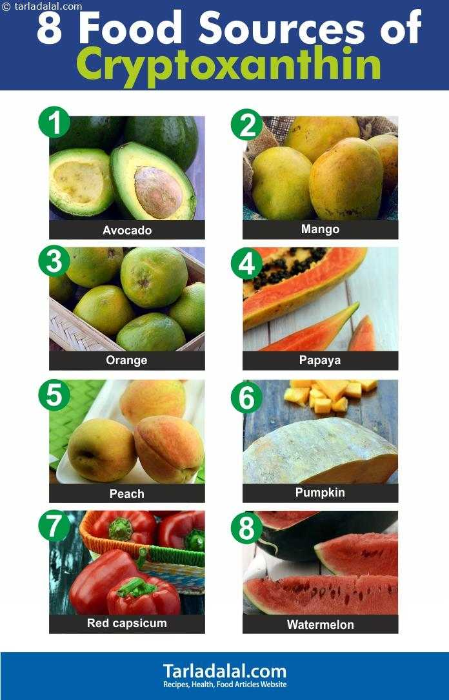

# 咬文嚼字-学科相关-IT

@(TOEFL)[托福, TOEFL, 词根词缀,咬文爵字,学科相关]

[toc]

## 相关单词

| 单词                  | 解释                                                         | 单词                               | 解释                                                         |
| --------------------- | ------------------------------------------------------------ | ---------------------------------- | ------------------------------------------------------------ |
| **hash** 【hæʃ】 | Hash 杂烩 => 哈希表 n. 剁碎的食物, 杂乱无章的的一大堆, 杂烩, 复述,  【计】散列  vt. 切碎, 搞糟   1 - 来自法语 hacher,剁，剁碎，词源同 hatchet. 引申词义跺碎的肉丁土豆，拼定比较 bake,batch. | **wild-card** 【ˈwaɪldˌkɑrd】 | 未知数;未知因素;(给予没有正常参赛资格的选手准其参加比赛的)“外卡”;“外卡”选手;(用于代替任何字符或字符串的)通配符 a playing card that can have any value, suit, color, or other property in a game at the discretion of the player holding it.  - a person or thing whose influence is unpredictable or whose qualities are uncertain. - COMPUTING: a character that will match any character or sequence of characters in a search.  - an opportunity to enter a sports competition without having to take part in qualifying matches or be ranked at a particular level. - a player or team granted a wild card. |
| **matrix**[^1] 【ˈmeɪtrɪks】 | n. **母体, 子宫, 基质, 脉石, 模型, 矩阵** 推荐： matri-母亲 + x → 母亲 → 母体。   词根分解  [词根树] **`matern-,matr-` ** = mother, 表示“母性，母亲”，源自拉丁语 mater "mother", 属格形式 matris。 母亲生出各种各样的孩子，就好像原材料做出各种物品一样，由此引出材料的含义。 来自拉丁语 matrix,子宫，母体，来自 mater,母亲。引申词义社会环境，并用于指科学术语矩阵。见电影《黑客帝国》。 | Sublime 【səˈblaɪm】            | a. 高尚的, 壮观的, 卓越的  v. 提高, (使)变高尚, (使)纯化, (使)升华  n. 庄严, 崇高, 顶点 sub-在…下面 + lim-限制 + -e → 在限制下不乱做事 → 崇高的。  **`sub-`** = under, beneath; behind; from under; resulting from further division，表示“在下面，次一等，副手，下一级，接近”等。源自拉丁语 sub "under."  **`lime-`** = threshold, 表示“门槛，限制”。    sub-,在下，向上，-lim,门槛，界限，词源同 limit. 引申比喻义接近完美的界限，升华，使高尚。引申词义崇高的，壮观的。 |
| compil∙ation                      | n. 编辑, 编纂, 编辑(编纂)物 推荐：compile【编辑】 + -ation表名词，是单词compile 派生的名词。  **`compile`** vt. 编译, 编辑, 编纂, 收集 **`-ation`** 表名词，“行为、动作、状态、过程、结果；物品”等。 | com∙pil∙e                            | vt. 编译, 编辑, 编纂, 收集 推荐：com-强调 + pil-堆积，词源同pile , pellet。  **`com-`** 来自拉丁语介词com，表示“与...一起，一起（with, together）”，或仅做强调。源自拉丁语 com "with (collective and intensive prefix.)" **`pil-`** = pillar, heap, 表示“柱，堆，堆积”。 词源说明(童理民)   1 - com-,表强调，-pil,堆积，词源同 pile,pellet. |
| **dummy** 【ˈdʌmi】 | n. 傀儡, 假人, 仿制品 a. 虚设的, 假的, 名义上的 推荐：<来自dub, 哑的。用于指仿制品。  **dumb** a. 哑的, 不说话的, 无声音的 **`-y`** 表形容词，加在名词后变成形容词。 词源说明(童理民)   1 - 来自 dumb,哑的。用于指仿制品。 | **aux∙ili∙ary** 【ɔːɡˈzɪliəri】 | n. 辅助者, 辅助物, 附属机构, 助动词 a. 辅助的, 备用的  **`aux-`** = increase, 表示“增加”，auth-引申为产生，创造。源自拉丁语 augere (过去分词 auctus) "to increase." **`-ary`** 表名词，“人，场所，物”。 |
| **Kludge** 【kluːdʒ】 | 不成熟产品;蹩脚系统。 A solution to a computer problem that has been quickly and badly put together -  杜撰词，可能模仿了 bodge 和 fudge.   - 俚语词，词源不详。可能同 klutz. We'll start by writing our own coroutine from scratch, and then show you how to "cheat" and get C# to generate a "good enough" coroutine for you, despite it being a bit of a [kludge](https://www.codeproject.com/Tips/5262735/What-is-a-Coroutine)/hack.  | **contrive** 【kən'traɪvd】 | If you say that something someone says or does is [contrived](https://www.codeproject.com/Tips/5262735/What-is-a-Coroutine), you think it is false and deliberate, rather than natural and not planned.  |

[^1]:matrix ['meɪtrɪks] n.矩阵；模型；[生物][地质] 基质；母体；子宫。拉丁词源，与英语本族单词mother同源。 英国学者William Tyndale在自己从拉丁语翻译作英语的《圣经》中第一次将这个单词引入了英语。 体会一下所有的意思，**都和母亲在子宫里孕育胎儿这一现象有关。矩阵？括号里包含（孕育）着数集**。 

## epi- 表示“在…上，在…周围，在…后面”。源自希腊语 epi "on, over, at." {73}

| 单词                               | 解释                                                         | 单词 | 解释 |
| ---------------------------------- | ------------------------------------------------------------ | ---- | ---- |
| **epi-dem-ic** 【ˌepɪˈdemɪk】 | n. 传染病, 流行病 a. 流行的, 传染性的 推荐：epi-在...周围 + dem-人民 + -ic → 在人民周围 → 流行的。  **`epi-`** 表示“在…上，在…周围，在…后面”。源自希腊语 epi "on, over, at." **`dem-`** = people，表示“人民，民众”。源自希腊语 demos "people, land." **`-ic`** 表形容词，“…的”。 词源说明(童理民)   1 - epi-,在上，在中，-demo,人民，词源同 demotic,democracy. |      |      |
|                                    |                                                              |      |      |
|                                    |                                                              |      |      |

## kin- 表示“运动，活动”。源自希腊语 kinein "to move." {32}

| 单词                                     | 解释                                                         | 单词 | 解释 |
| ---------------------------------------- | ------------------------------------------------------------ | ---- | ---- |
| **kin-esthes-ia** 【ˌkɪnəs'θi:ʒɪə】 | n. 肌肉运动知觉 推荐：kin-动 + esthes-感觉 + -ia  **`kin-`** 表示“运动，活动”。源自希腊语 kinein "to move." **`esthes-`** = feeling, 表示“感觉”。源自希腊语 aisthanesthai "to feel." 更多同源词... |      |      |
|                                          |                                                              |      |      |
|                                          |                                                              |      |      |

## esthes- = feeling, 表示“感觉”。源自希腊语 aisthanesthai "to feel." {31}

| 单词                                     | 解释                                                         | 单词 | 解释 |
| ---------------------------------------- | ------------------------------------------------------------ | ---- | ---- |
| **kin-esthes-ia** 【ˌkɪnəs'θi:ʒɪə】 | n. 肌肉运动知觉 推荐：kin-动 + esthes-感觉 + -ia  **`kin-`** 表示“运动，活动”。源自希腊语 kinein "to move." **`esthes-`** = feeling, 表示“感觉”。源自希腊语 aisthanesthai "to feel." 更多同源词... |      |      |
|                                          |                                                              |      |      |
|                                          |                                                              |      |      |

## crypt- / crypto- = secret, hidden, 表示“秘密，隐藏”。源自希腊语 kruptein "to hide."{28}

| 单词                                       | 解释                                                         | 单词                     | 解释                                                         |
| ------------------------------------------ | ------------------------------------------------------------ | ------------------------ | ------------------------------------------------------------ |
| **crypto-xanth-in** 【krɪptəʊzænθɪn】 | n. 隐黄素（维生素A原的一种） 推荐：crypto-秘密 + xanth-黄 + -in  **`xanth-`** = yellow, 表示“黄色”。 **`crypto-`** = secret, hidden, 表示“秘密，隐藏”。源自希腊语 kruptein "to hide." | **crypt** 【krɪpt】 | n. 土窖, 地穴, (尤指旧时作墓穴用的)教堂地下室  **`crypt-`** = secret, hidden, 表示“秘密，隐藏”。源自希腊语 kruptein "to hide." 更多同源词... 词源说明(童理民)   1 - 来自 PIE*krau,隐藏，遮盖，词源同 grotto. |
|                                            |                                                              |                          |                                                              |
|                                            |                                                              |                          |                                                              |

## techn- = skill, ability, 表示“技术，能力”。源自希腊语 tekhne "art, craft, skill." {27}

| 单词                                      | 解释                                                         | 单词 | 解释 |
| ----------------------------------------- | ------------------------------------------------------------ | ---- | ---- |
| **poly-techn-ic ** 【ˌpɑːliˈteknɪk】 | a. 各种工艺的, 工艺教育的 n. 工艺专科学校, 理工专科学校 推荐：poly-多，复，聚 + techn-技术 + -ic表形容词，用于指技术学院或理工学院。  **`poly-`** 表示“多”，来自希腊语。源自希腊语 polus "much, many." **`techn`**- = skill, ability, 表示“技术，能力”。源自希腊语 tekhne "art, craft, skill." **`-ic`** 表形容词，“…的”。 词源说明(童理民)   1 - poly-,多，复，聚，-techn,技术，词源同 technology.用于指技术学院或理工学院。 |      |      |
|                                           |                                                              |      |      |
|                                           |                                                              |      |      |

## stereo- = solid, firm; three-dimensional; stereophonic, 表示“坚固，三维，立体”等 {25}

> 源自希腊语 stereos "solid."

| 单词                                 | 解释                                                         | 单词 | 解释 |
| ------------------------------------ | ------------------------------------------------------------ | ---- | ---- |
| **stereo-type** 【ˈsteriətaɪp】 | n. 铅版, 陈规, 老套 vt. 使用铅版, 把...印制成盲文, 套用老套, 使一成不变 推荐：stereo-固定的 + type，原指一种印刷方法。 stereo-  type |      |      |
|                                      |                                                              |      |      |
|                                      |                                                              |      |      |

### stereotype（刻板印象）：不可更改的固定印版

> stereo-,固定的，坚固的，type,印刷，打印。原指一种印刷方法，引申词义刻板印象，模式化观念等。

19世纪初期，铅版印刷术问世。铅版印刷术以活字版为原型，将其复制为铅版，不仅可以提高印版的耐印力，而且可以用于异地或多台印刷机印刷。

用于铅版印刷的铅版就是**stereotype**，它来自法语，由**`stereo`**（固定的）和**`type`**（版），字面意思就是“固定的印版”，因为它是一大块固定的铅版，不像活字版那样可以拆开，里面的内容自然也不能修改。因此**stereotype**就衍生出“难以更改的刻板印象”之意。

- **stereotype**：['stɛrɪətaɪp] n.刻板印象，陈规，老套，陈词滥调，铅版
- **stereotypical**：[,steriə'tipikl] adj. 老一套的；陈规的

### starve（饿死）：变得僵硬

> 来自古英语 stearc,僵硬的，严厉的，严重的，粗糙的，残酷的，
>
> 来自 Proto-Germanic*starkaz,僵硬的，*
>
> *来自 PIE*ster,僵的，硬的，固定的
>
> 词源同 startle,sterile.引申诸相关词义。
>
> 词义演变比较 hard.

英语单词starve常常被人用来表示“饿死、挨饿”，从词源上看，该词与“饥饿”一点关系也没有。它源自古英语**steorfan**，本意是“变硬、死”，与单词：

- **stern**（严厉的、坚定的）
- **stark**（刻板的、荒凉的）
- 词根 **`stereo-`**（坚固的、实心的、立体的）

等同源。14世纪时，单词**starve**的词义缩小为“冻死”，16世纪时才衍生出“饿死”的含义。

- **starve**：[stɑrv] vi. 饿死；挨饿；渴望vt. 使饿死；使挨饿
- **stern**：[stɝn] adj. 严厉的；坚定的
- **stark**：[stɑrk] 
  - adj. 完全的；荒凉的；刻板的；光秃秃的；朴实的
  - adv. 完全；明显地；突出地；质朴地
- **`stereo-`**：坚固的，实心的，立体的

## certi- = sure, separate, 表示“搞清，区别，分开”{24}

> 源自拉丁语 cernere "to sift, separate, decide."

| 单词                              | 解释                                                         | 单词        | 解释 |
| --------------------------------- | ------------------------------------------------------------ | ----------- | ---- |
| **certi-fy**  【ˈsɜːrtɪfaɪ】 | v. 证明, 保证 推荐：cert-确定 + -ify, 表动词。  certi- = sure, separate, 表示“搞清，区别，分开”。源自拉丁语 cernere "to sift, separate, decide." -fy 缀于名词或形容词后，构成表示“使成…”“…化”“作成…”等意思的动词 词源说明(童理民)   1 - 来自 cert-,确定，见 certain. | certificate |      |
| certification                     |                                                              |             |      |
|                                   |                                                              |             |      |

## misc-,med- = mix, 表示“混淆”{14}

| 单词                                    | 解释                                                         | 单词                                                   | 解释                                                         |
| --------------------------------------- | ------------------------------------------------------------ | ------------------------------------------------------ | ------------------------------------------------------------ |
| **misc-ellan-ea** 【ˌmɪsəˈleɪniə】 | n. 杂集, 杂记, 杂录   **`misc-,med-`** = mix, 表示“混淆”。 np. 1 . miscellaneous things , especially pieces of writing , brought together as a collection  2. various things that have been collected together, especially pieces of literature, poems, letters, etc. | **miscellaneous** 【ˌmɪsəˈleɪniəs】 **MISC** | a. 各种的, 多方面的  **`misc-,med-`** = mix, 表示“混淆”。 **`-eous`** 表形容词，表示“…的”，用于化学领域表示“亚酸的，低价（金属）的”。 词源说明(童理民)   1 - 来自 miscellany,混合体。 consisting of many different kinds of things that are not connected and do not easily form a group |
|                                         |                                                              |                                                        |                                                              |
|                                         |                                                              |                                                        |                                                              |

## bol- 这是一组同源词，基本含义表示 swell（扩张）{15}

| 单词                    | 解释                                                         | 单词 | 解释 |
| ----------------------- | ------------------------------------------------------------ | ---- | ---- |
| **bold** 【boʊld】 | a. 大胆的 n. 粗体 **`bol-`** 这是一组同源词，基本含义表示 swell（扩张）。 词源说明(童理民)   1 - 来自 PIE*bhel,膨胀，鼓起，词源同 ball.-d,插入字母。 |      |      |
|                         |                                                              |      |      |
|                         |                                                              |      |      |

## calibre（口径）：用于制造物品的模具 {？}

> 来自阿拉伯语qalib, 模子，后指枪管口径。

古代阿拉伯人很早就开始使用模具来制造物品，例如在生产鞋时，先制造一个外形接近人脚的模具，也就是所谓的“鞋楦”，然后利用鞋楦就可以制造出大量尺寸和外形几乎一样的鞋来。后来出现了金属铸造技术，模具更得到了大量应用。

在阿拉伯语中，将鞋楦以及各种模具都称为***qalib***。该词到了法语中变成了**calibre**，在英语中的拼写也一样。但在美式英语中，拼写变成了**caliber**。该词的词义也有所变化，从表示模具本身变为表示模具的尺寸。

 

在军事领域，**calibre**一词最早用来表示用来制造火炮的模具，后来用来表示火炮的炮管及炮弹的口径。小型的火枪问世后，用来表示枪管及子弹的口径。后来这个单词的词义发生泛化，可以泛指各种度量衡，**并引申出“水准、才干”等含义**。

- **calibre**： ['kæləbɚ] n.口径，才干，水准，器量
- **caliber**：['kæləbɚ] n. 口径；才干；水准（等于calibre）；器量
- **calibrate**：['kælɪbreɪt]vt.校正，调整，测量口径
- **calibration**：[kælɪ'breɪʃ(ə)n] n.校正，刻度，标度
- **caliper**：['kælɪpə] 
  - n. 卡尺；卡钳
  - vt. 用测径规测量；用卡钳测量，等于calliper

 

## -aire,人，对应英语-ary. 引申词义百万富翁{5}

| 单词                                       | 解释                                                         | 单词                                              | 解释                                                         |
| ------------------------------------------ | ------------------------------------------------------------ | ------------------------------------------------- | ------------------------------------------------------------ |
| **million-aire** 【ˌmɪljəˈner】       | n. 百万富翁, 大富豪 推荐：million【n. 百万, 无数】 + -aire表名词  **`million`** n. 百万, 无数 num. 百万 **`-aire`** 表名词。 someone who has more than a million pounds or dollars | concession-aire                                   | . 让受人, 特许权所有人 推荐：concession【让步】 + -aire  **`concession`** n. 许可, 特许权; 特许经营, 摊位; 让步; 减价 **`-aire`** 表名词。  |
| **zillion-aire** 【zɪljə'neə】        | n. 大富翁, 亿万富翁，财富多得不可计算的人 推荐：zillion【无限大的数字】 + -aire  **zillion** n. 无限大的数字 | **zillion** 【ˈzɪljən】                      | n. 无限大的数字，很大量 词源说明(童理民)   1 - 根据 million,billion 等词杜撰出来的一个词。 |
| **doctrin-aire  **   【ˌdɑːktrɪˈner】 | n. 空论家, 纯理论家, 教条主义者 a. 空谈理论的, 脱离实际的 推荐：doctrine【教条】 + -aire。  **`doctrine`** n. 教条, 学说 **-`aire`** 表名词。 词源说明(童理民)   1 - 来自 doctrine,教义，学说，词义贬义化。 | **question-n-aire**         【ˌkwestʃəˈner】 | n. 调查表, 问卷 推荐：question【问题】 + -n- + -aire名词后缀，即-ary . 引申词义调查问卷。  **`question`** n. 问题, 询问 v. 询问, 审问, 怀疑 **`-aire`** 表名词。 词源说明(童理民)   1 - 来自 question,问题。-aire,名词后缀，即-ary.引申词义调查问卷。 |
|                                            |                                                              |                                                   |                                                              |

### millionaire 百万富翁

**millionaire** - ***million***系直接借自古法语，源于意大利语***millione***，按字面义是a thousand thousands（一千个千），汉语作“百万”。

**billion**也直接从法语吸收而来，系由前缀**`bi-`**‘two’（指二次幂）加million缩合而成，按字面义是a million millions（一百万个百万），故应作“万亿”。

然而在美国**billion**并不指“万亿”，而指“十亿”（**a thousand million**）。近年来很多英语国家（包括英国、澳大利亚）也跟着美国把billion当作“十亿”来用了，但在德、法、意等大多数欧洲大陆国家，billion及其在各欧陆语言中的相应单词（如意大利语bilione）则表示“万亿”。

**millionaire**也是法语借词，约于1820年进入英语，意为“百万富翁”。皮毛业商人阿斯特（John Jacob Astor, 1763-1848）可能是第一位被称为**millionaire**的美国人。

而**billionaire**则是由**billion**接**millionaire**的尾部**`-aire`**构成，始见于1861年，意指“亿万富翁”。第一位被称为美国式**billionaire**的恐怕当数美国实业家洛克菲勒（John D. Rockefeller, 1839-1937）。

与**million**相关的词还有几个，如**milliard**，系英国英语，相当于美国英语**billion**，即“十亿”，它也借自法语。

又如**trillion**，其构成与**billion**类似，系由**`tri -`**'three'（指三次幂）接**million**之尾部**`-llion`**缩合而成，它也是法语借词，在英国英语中指“百万的三次幂”，在美国英语则指“百万的二次幂”，即“万亿”。但这两个词在英语中都用得不多。

例　

- Nobody can count to a billion. 没有人能够数到十亿。
- The country is more than two billion in debt. 这个国家负债二十多亿。

 

## icon- = image, 表示“形象”。源自希腊语 eikon "likeness, image." {5}

| 单词                      | 解释                                                         | 单词 | 解释 |
| ------------------------- | ------------------------------------------------------------ | ---- | ---- |
| **icon** 【ˈaɪkɑːn】 | n. 画像, 肖像, 偶像, 图标, 像标 **`icon-`** = image, 表示“形象”。源自希腊语 eikon "likeness, image."  词源说明(童理民)   1 - 来自拉丁语 icon,圣像，神像。最早用于描绘耶稣等圣人的神像，引申词义偶像，图像。 |      |      |
|                           |                                                              |      |      |
|                           |                                                              |      |      |

## gadget（小玩意）：美国自由女神像的设计公司

关于英语单词**gadget**（小玩意）一词的来源，有个非常有趣的故事。1876年，著名的自由女神像竣工，竖立在美国纽约市的哈德逊河口小岛上，成为纽约市的地标性建筑。自由女神落成后，纽约市举行了庞大的庆祝活动。

自由女神像的设计公司、法国的Gaget Gaultier希望乘机捞一笔，于是就用青铜制作了大量的自由女神像的小型复制品，作为纪念品来销售。这种小玩意大受欢迎，人人争相抢购，一致人们见面都会询问“你有没有买到那个**Gadget**?”。**gadget**原本是这家公司的名字，现在变成了这种小纪念品的代名词，从而衍生出“小玩意”的含义。

有些词源学家认为**gadget**一词另有来源，来自水手们的俚语，用来表示船上使用的任何小器具。当他们想不起某个小器具的名字或它本来就没有名字时，就用**gadget**一词来表示。

- **gadget**：['gædʒɪt] n.小玩意，小器具，小巧的机械装置

### gauges【ɡeɪdʒ】仪表盘

> (用仪器)测量;判定，判断(尤指人的感情或态度);估计;估算
> n. 厚度;测量仪器(或仪表);计量器;宽度;(枪管的)口径
>
> 1 - 来自 PIE*ghalgh,杆，棍，词源同 gallows.字母 l 软化成 u.词义由杆，棍引申为测量，比较 canon,词源同 cane.

-  an instrument for measuring the amount or level of sth((often in compounds 常构成复合词) 测量仪器（或仪表）；计量器)

- a measurement of the width or thickness of sth

  > What gauge of wire do we need?(我们需要多大直径的金属丝？)

- a measurement of the width of the barrel of a gun

  > a 12-gauge shotgun (12号猎枪)

- the distance between the rails of a railway/railroad track or the wheels of a train(（铁道的）轨距；（火车的）轮距)

  > - standard gauge (= 56½ inches in Britain) (标准轨距（在英国为56.5英寸）)
  > - a narrow gauge (= narrower than standard) railway 窄轨铁路

- ~ (of sth): a fact or an event that can be used to estimate or judge sth (（用于估计或判断的）事实，依据，尺度，标准) 

  > Tomorrow's game against Arsenal will be a good gauge of their promotion chances. (明天与阿森纳队的比赛是衡量他们能否升级的很好的依据。)

## crumb 面包屑与导航栏

> n. 碎屑, 面包屑; 少许 vt. 捏碎, 弄碎  来自古英语cruma, 面包屑，碎片。可能同crisp, 卷的， 脆的。  

在IT界，尤其是网站设计里面，**[Breadcrumbs](https://vwo.com/blog/why-use-breadcrumbs/)**就是navigator导航栏。根据《Don't make me think》这本书提到，之所以导航栏和面包屑会扯上关系，完全是因为~~安徒生童话~~格林兄弟故事里面那个7个被抛弃的小孩子的故事（《奇幻森林历险记》），最小最聪明的那个小孩子企图通过撒面包屑来找到家，从此Breadcrumb在IT界就成了导航栏的代名词。

> *Breadcrumbs give you orientation and show you exactly where you are on a website.*

 

[格林兄弟写的《奇幻森林历险记》](https://www.sohu.com/a/28468168_128621)（Hansel and Gretel）是另一个广为流传的童话故事，但民间同样也有很多以父母为了生存遗弃孩子为题材的故事。这种主题的故事增多很大可能是受14世纪发生的大饥荒影响，那时候很多家庭为了活命被迫抛弃自己的孩子。而故事《奇幻森林历险记》就是那个时代的产物，与佩罗的《大拇指》（Little Thumb）相比，有过之而无不及。法国童话故事（也就是著名的《大拇指汤姆》（Hop-o’-My-Thumb））讲的就是七个孩子被他们父母遗弃然后在森林里迷路的历险记。其中最小的孩子大拇指无意中听到父母要抛弃他们兄弟的计划，于是在回家的路上撒面包屑做记号，没想到被小鸟吃掉了。

后来他们发现林中有个房子，敲了敲门，希望主人能收留他们并且给他们吃的。食人怪的妻子偷偷让他们进门，为了不让食人怪发现，她试图把他们藏在床底下。可是还是让食人怪发现了，不过他承诺第二天再吃他们。当晚，他们和食人怪的七个女儿一起睡在同一个房间，等他的女儿们熟睡后，大拇指偷偷把他们破旧的帽子和食人怪女儿的金冠换了过来。半夜，食人怪潜进房间在黑暗里摸索他们七个。凭着对帽子的触感，他毫不知情地杀了自己的七个女儿，然后溜回自己的房间。最终，大拇指偷了食人怪有魔法的靴子，利用它发了笔大财，然后他们跑回家和父母团聚，从此一家人幸福地生活在一起。

**Reference:**

1. [What is Breadcrumb & How It Eases Navigation? Explained with Examples](https://vwo.com/blog/why-use-breadcrumbs/)

## cipher（密码）：阿拉伯数字中的“零”

> 来自阿拉伯语 sifr,零，词源同 zero.因为古人早期对数字零的认识不足，该词逐渐被赋予神秘色彩，词义也由零引申为密码。

英语单词**cipher**最终来自阿拉伯语***sifr***（零），随阿拉伯数字一道传入欧洲。

在英语中最初表示“零”，后来可以表示所有数字，16世纪早期衍生出“密码、加密信息”之意，因为那时候很多加密信息都是用数字来代替字母。

- **cipher**：['saɪfɚ] 
  - n.密码，暗号，零
  - v.计算，做算术，
  - 使用密码，加密
- **decipher**：[dɪ'saɪfɚ] 
  - n.密电译文
  - v.译码，译解，破译
- **indecipherable**：['ɪndɪ'saɪfrəbl] adj. 无法解释的；破译不出的；难辨认的

**英语词源趣谈(庄和诚)**

cipher - zero是又一个源于阿拉伯语的科技用词。意为“空的”或“零”的阿拉伯语***sifr***进入意大利语后，先是拼作***zefiro***，以后缩略为**zero**，法语从意大利语吸收了这个词，作***zéro***，仍用以指“零”，以后英语又从法语直接借了过来。

但**zero**是直到17世纪初期才在英语里被用作数字零的名称。英语另有一个词**cipher**（亦作cypher），在被用以表示“密码”之前也一度指“零”。其实它也源于同一个阿拉伯词，即***sifr***。

例　

- The petrol gauge was already at zero. (LDC) 汽油表已指示零位。
- The economy showed zero growth in the first quarter of this year. (CAE) 在今年第一季度经济是零增长。
- The message was written in cipher. (CID) 电文是用密码写的。
- We spent a lot of time figuring out the enemy's cipher. (CAE) 我们花了不少时间破译敌人的密码。

## Threshold n. 门槛, 入口, 开端, 阈

> 来自古英语 threscold,门槛，来自 threscan,踩踏，词源同 thresh.后拼写可能受 hold 影响俗化，引申诸相关词义。
>
> - thresh  vt. 打谷, 摔打, 反复研究, 推敲 vi. 打谷, 鞭打, 剧烈扭动

**英语词源趣谈(庄和诚)**

threshold - 这是一个古英语时期就已存在的词，最早的文字记录见于公元1000年左右。该词的第一成分**thresh**和动词**thresh**（脱粒，打谷）是同一个词。古时农民常将麦、谷等放在地上踩踏使之脱粒，**thresh**原义即为“tread，tramp”，就是“踩，踏”的意思。

关于**threshold**的第二成分***hold***有以下这样一种说法: 古时英国农户家中是用石头来铺地的，到了冬天为了保暖防滑还要在地面铺上一层麦、谷等的外壳（threshings），并在门口加一块木板把谷壳挡在屋内（to hold the threshings in），这块木板就叫**threshold**。

关于**threshold**一词，《牛津英语词典》原先曾作如下释义：

> “The piece of timber or stone which lies below the bottom of a door, and has to be crossed in entering a house; the sill of a doorway; hence the entrance to a house or building.”
>
> 门底下方的一块木头或石头，进入房屋时必须穿过；门口的门槛；因此是房屋或建筑物的入口

经历了上千年，**threshold**从原义引申出“门口”、“入门”、“开端”、“起始点”、“限”、“阈”等义，至今仍不失为常用词。

英语另有一个词**thrash**，究其根源，乃**thresh**之异体，也具有**thresh**的不少词义，如“打谷”、“脱粒”、“连续拍击”、“不断挥动”、“反复研究”、“推敲”等等。

例　

- He stood on the threshold for a moment before going into the house. 在进屋之前他在门口站了片刻。
- It's traditional for a man to carry his bride over the threshold. (CAE) 按传统，新郎得抱着新娘跨过门槛。
- He was on the threshold of his career. 他的事业刚刚起步。
- Tax thresholds have been raised to protect those on low wages. (LLA) 纳税起点已被提高，这样可以保护低工资者。

## 黑话与行话

### (1). cant:黑话

> 中国有句歇后语，小和尚念经——有口无心。西方的僧侣们在吟唱这种chant时，有时候也会装模作样、有口无心，因此英语中出现了一个与chant同源的单词**cant**，用来形容僧侣故作虔诚地吟唱chant，引申为并非发自内心的话，如客套话、乞丐故作可怜的的乞讨声。后来又产生了“**黑话**”（the private language of the underworld | **jargon**）的含义。

**`cant-`** cant来源于拉丁语cantus 'song'（歌）或cantāre 'to sing'（唱）。和多数同根词如cantata（大合唱），canticle（圣歌），cantilation（吟咏），chant（赞美诗）等不一样，该词自中世纪进入英语之时起就被赋予了贬抑含义。

翻开辞书一看，我们可以发现cant的词义，诸如“伪善言词”、“（下层社会的）黑话”、“言不由衷之词”、“（乞丐等的）吟唱式哀诉”，几乎无一不带贬抑色彩。造成这一情况的因素有三，均与早先的基督教会有些联系。

- 其一，一些牧师在做弥撒时只会机械地履行职责，不太注意吟诵言词的含义。
- 其二，乞丐被允许参加这些牧师主持的葬礼仪式，他们往往装得十分悲痛，来骗取人们的施舍，他们哀诉式的乞讨也影响了cant一词的意义。
- 其三，17世纪有位苏格兰传道士，因其虚伪不受欢迎，他的名字就叫Andrew Cant。1711年8月18日《旁观者》（The Spectator）第47期上斯梯尔（Richard Steele, 1672-1729）写的一篇文章在追溯cant一词的词源时，试图将它与这位传道士的姓氏Cant联系起来，文中说：“他讲道所操方言，除了部分会众，据说无人听懂。”多数辞书对此很不以为然，但有某些根据说明，cant一词的贬降过程似乎多少受了这方面的影响。

> - Thieves' cant is unintelligible to outsiders. (FWF) 窃贼的黑话外人是听不懂的。
> - Sometimes words that were originally cant come to be used in the general language. (CID) 有时，原先的行话逐渐被用于大众语言中。

### (2). Jargon【ˈdʒɑːrɡən】 ≈Cant【kænt】≠Kant【kænt】

 

**jargon**（行话）：人听不懂的鸟语。

英语单词**jargon**来自法语和拉丁语，原本是个拟声词，表示鸟叽叽喳喳的叫声。当人们在讲话时大量使用晦涩难懂的专业术语或行话，使得观众一头雾水不知所云时，观众就会觉得他们说的是人听不懂的鸟语，因此就称其为**jargon**。

久而久之，**jargon**就演变为“专业术语、行话”的含义，它的本意“鸟叫声”反而被遗忘了。

- **jargon**：['dʒɑrɡən] n.专业术语，行话，黑话
- **Kant**:康德
- **cant**:黑话

[这篇文章](https://www.brandchemistry.com.au/blog/9-examples-of-tech-jargon-that-must-be-stopped)列出了几个常见的行业黑话：

- Acronyms，如 Artificial Intelligence (AI)，Content Management System (CMS)，Marketing Automation (MA)
- Unicorn
-  Bleeding edge（有潜在问题的前沿技术）If you are at the bleeding edge of a particular field of activity, you are involved in its most advanced or most exciting developments.
- Pivot：In tech speak this means to change the direction of your business. If you are using pivot, maybe you should be thinking about the direction of your communications instead. It’s vague, euphemistic and as [TechWired reports](http://www.techrepublic.com/article/startup-jargon-10-terms-to-stop-using/), [Hired.com](https://hired.com/) CEO Matt Mickiewicz defines pivot as, ‘A lame way of saying 'our original hypothesis proved incorrect, and we're going to try something else before we run out of money.’ Bingo.
- synergy【ˈsɪnədʒɪ】协同作用；协同效果；【医】增效作用
- Ideate
- Blue-sky thinking
- Sunsetting： Keeping with the sky analogies, sunsetting is when blue-sky thinking hasn’t worked the way you want it to and a product or service is being discontinued.
- Learnings：It sounds grammatically dodgy and made-up. You don’t sound learned, it sounds like you need to go back to primary school English and find a better word.

### (3). cant v.s jargon

[The difference between Cant and Jargon](https://diffsense.com/diff/cant/jargon):

When used as **nouns**, **cant** means an argot, the jargon of a particular class or subgroup, whereas **jargon** means a technical terminology unique to a particular subject.

When used as **verbs**, **cant** means to speak with the jargon of a class or subgroup, whereas **jargon** means to utter jargon.

### (4).Reference:

1. [The difference between Cant and Jargon](https://diffsense.com/diff/cant/jargon)
2. [9 examples of tech jargon that must be stopped](https://www.brandchemistry.com.au/blog/9-examples-of-tech-jargon-that-must-be-stopped)

## Mock data

> Mock:
>
> - 可能来自拉丁语 ***mucus***,鼻涕，即作出擤鼻涕的动作以表示嘲笑和嘲弄，并引申词义模仿。或直接来自拟声词，模仿模仿的声音。
>
> - 不要打成monk data, moke data

为什么模拟数据不叫stimulate data, 而是叫 mock data?

先看**mock**的本意是嘲笑 ：

> to [laugh](https://dictionary.cambridge.org/zhs/词典/英语-汉语-简体/laugh) at someone, often by [copying](https://dictionary.cambridge.org/zhs/词典/英语-汉语-简体/copy) them in a [funny](https://dictionary.cambridge.org/zhs/词典/英语-汉语-简体/funny) but [unkind](https://dictionary.cambridge.org/zhs/词典/英语-汉语-简体/unkind) way
>
> **嘲笑，嘲弄；（常指为取笑而）模仿**
>
> - They were mocking him because he [kept](https://dictionary.cambridge.org/zhs/词典/英语-汉语-简体/kept) [falling](https://dictionary.cambridge.org/zhs/词典/英语-汉语-简体/falling) off his [bike](https://dictionary.cambridge.org/zhs/词典/英语-汉语-简体/bike).他们一个劲儿嘲笑他，因为他老是从自行车上摔下来。
>
> - She made [fun](https://dictionary.cambridge.org/zhs/词典/英语-汉语-简体/fun) of him by mocking his [limp](https://dictionary.cambridge.org/zhs/词典/英语-汉语-简体/limp).她模仿他一瘸一拐地走路来取笑他。

再由这个通过**模仿**（**something made as an imitation**)别人达到嘲笑的目的，引申出形容词：假的；高仿的；防治的；假装的 之意：

> not [real](https://dictionary.cambridge.org/zhs/词典/英语-汉语-简体/real) but [appearing](https://dictionary.cambridge.org/zhs/词典/英语-汉语-简体/appear) or [pretending](https://dictionary.cambridge.org/zhs/词典/英语-汉语-简体/pretend) to be [exactly](https://dictionary.cambridge.org/zhs/词典/英语-汉语-简体/exactly) like something
>
> **假的；仿制的；假装的**
>
> - mock [cream](https://dictionary.cambridge.org/zhs/词典/英语-汉语-简体/cream)人造奶油
> - mock [leather](https://dictionary.cambridge.org/zhs/词典/英语-汉语-简体/leather)人造革
> - mock [surprise](https://dictionary.cambridge.org/zhs/词典/英语-汉语-简体/surprise)假装出来的惊讶

### [What is Mocking?](https://stackoverflow.com/questions/2665812/what-is-mocking)

[Prologue](https://stackoverflow.com/questions/2665812/what-is-mocking): If you look up the noun *mock* in the dictionary you will find that one of the definitions of the word is *something made as an imitation*.

> Mocking is primarily used in unit testing. An object under test may have dependencies on other (complex) objects. To isolate the behavior of the object you want to replace the other objects by mocks that simulate the behavior of the real objects. This is useful if the real objects are impractical to incorporate into the unit test.
>
> In short, mocking is creating objects that simulate the behavior of real objects.

At times you may want to distinguish between *mocking* as opposed to *stubbing*. There may be some disagreement about this subject but my definition of a stub is a "minimal" simulated object. The stub implements just enough behavior to allow the object under test to execute the test.

A mock is like a stub but the test will also verify that the object under test calls the mock as expected. Part of the test is verifying that the mock was used correctly.

To give an example: You can stub a database by implementing a simple in-memory structure for storing records. The object under test can then read and write records to the database stub to allow it to execute the test. This could test some behavior of the object not related to the database and the database stub would be included just to let the test run.

If you instead want to verify that the object under test writes some specific data to the database you will have to mock the database. Your test would then incorporate assertions about what was written to the database mock.

### Mocks, fakes, and stubs

Classification between mocks, fakes, and [stubs](https://en.wikipedia.org/wiki/Test_stub) is highly inconsistent across the literature. Consistent among the literature, though, is that they all represent a production object in a testing environment by exposing the same interface.

Which out of *mock*, *fake*, or *stub* is the simplest is inconsistent, but the simplest always returns pre-arranged responses (as in a [method stub](https://en.wikipedia.org/wiki/Method_stub)). On the other side of the spectrum, the most complex object will fully simulate a production object with complete logic, exceptions, etc. Whether or not any of the mock, fake, or stub trio fits such a definition is, again, inconsistent across the literature.

For example, a mock, fake, or stub method implementation between the two ends of the complexity spectrum might contain [assertions](https://en.wikipedia.org/wiki/Assertion_(computing)) to examine the context of each call. For example, a mock object might assert the order in which its methods are called, or assert consistency of data across method calls.

In the book *[The Art of Unit Testing](https://en.wikipedia.org/wiki/The_Art_of_Unit_Testing)*[[7\]](https://en.wikipedia.org/wiki/Mock_object#cite_note-7) mocks are described as a fake object that helps decide whether a test failed or passed by verifying whether an interaction with an object occurred. Everything else is defined as a stub. In that book, *fakes* are anything that is not real, which, based on their usage, can be either *stubs* or *mocks*.

**Reference:**

1. [[What is Mocking?](https://stackoverflow.com/questions/2665812/what-is-mocking)](https://stackoverflow.com/questions/2665812/what-is-mocking)
2. [Mock object--Wikipedia](https://en.wikipedia.org/wiki/Mock_object)

## Reference

1. [API-Glossary](https://www.abstractapi.com/api-glossary)
2. 
