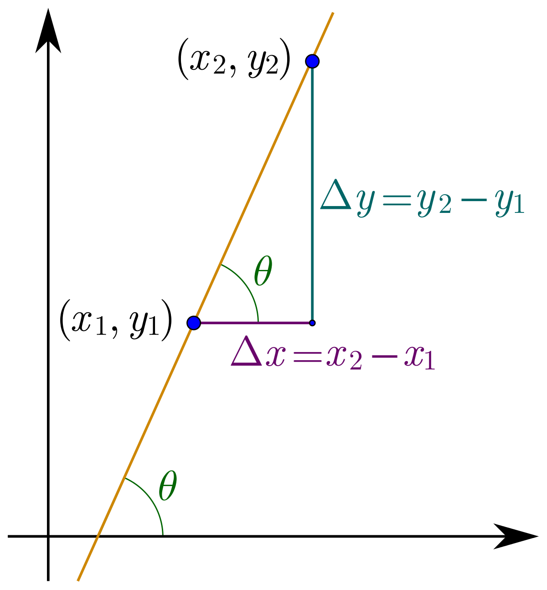

# 咬文嚼字-学科相关-Mathematics

[toc]

## 术语表

| 单词                                                         | 解释                                                         | 单词                                                         | 解释                                                         |
| ------------------------------------------------------------ | ------------------------------------------------------------ | ------------------------------------------------------------ | ------------------------------------------------------------ |
| **divisor** 【dɪˈvaɪzər】                               | A **[divisor](https://leetcode-cn.com/problems/perfect-number/)** of an integer `x` is an integer that can divide `x` evenly. 除数;除子 ***When you [divide](https://dictionary.cambridge.org/zhs/词典/英语-汉语-简体/divide) 21 by 7, 7 is the divisor.*** | **factor**                                                   | 因子;因数; a number that divides into another number exactly ***1, 2, 3, 4, 6 and 12 are the factors of 12.*** |
| common divisor                                               | 公约数 公约数，亦称“公因数”。它是指能同时整除几个整数的数 [1] 。如果一个整数同时是几个整数的[约数](https://baike.baidu.com/item/约数/8417882)，称这个整数为它们的“公约数”；公约数中最大的称为最大公约数。对任意的若干个[正整数](https://baike.baidu.com/item/正整数/8461335)，1总是它们的公因数。 | Common factor                                                | 公因数 公因数，亦称“[公约数](https://baike.baidu.com/item/公约数/1063409)”。它是一个能同时整除若干整数的[整数](https://baike.baidu.com/item/整数/1293937) [1] 。如果一个整数同时是几个整数的[因数](https://baike.baidu.com/item/因数/9539111)，称这个整数为它们的“公因数”；公因数中最大的称为最大公因数。 |
| [**prime factor**](https://leetcode-cn.com/problems/ugly-number-ii/) | [质因数](https://www.mathsisfun.com/definitions/prime-factor.html): A factor that is a prime number. In other words: any of the prime numbers that can be multiplied to give the original number. Example: The prime factors of 15 are 3 and 5 (because 3×5=15, and 3 and 5 are prime numbers).  | [**prime number**](https://www.mathsisfun.com/definitions/prime-number.html) | prime number**素数**（也叫**质数**），指只能被1和自身整除且大于1的自然数。A whole number above 1 that can **not** be made by multiplying other whole numbers.  词根prim与first同源，意思就是最初的、开始的。其应用于数学概念开始于1560年。我们最为熟悉的应该就是primary school小学和prime minister首相；总理这两个例子了。 人是primate灵长类动物是因为你我在哺乳动物中first in order。 |
| relatively prime                                             | 互质 互质是公约数只有1的两个整数，叫做互质整数。[公约数](https://baike.baidu.com/item/公约数/1063409)只有1的两个[自然数](https://baike.baidu.com/item/自然数/385394)，叫做互质自然数，后者是前者的特殊情形。 | multiple                                                     | 倍数                                                         |
|                                                              |                                                              | Least Common Multiple                                        | 最小公倍数                                                   |
| The simplest fraction                                        | 最简分数 最简分数，是分子、[分母](https://baike.baidu.com/item/分母/5421449)只有[公因数](https://baike.baidu.com/item/公因数)1的分数，或者说分子和分母[互质](https://baike.baidu.com/item/互质/577412)的分数，又称[既约分数](https://baike.baidu.com/item/既约分数/1332623)。如：二分之一，三分之二，九分之八，八分之三等等。 | Reduction                                                    | 约分                                                         |
|                                                              |                                                              |                                                              |                                                              |
| [ugly number](https://leetcode-cn.com/problems/ugly-number-ii/) | An ugly number is a positive integer whose **prime factors** are limited to 2, 3, and 5. | [perfect number](https://leetcode-cn.com/problems/perfect-number/) | A [perfect number](https://en.wikipedia.org/wiki/Perfect_number) is a positive integer that is equal to the sum of its positive divisors, excluding the number itself.  对于一个 **正整数**，如果它和除了它自身以外的所有 **正因子** 之和相等，我们称它为 「完美数」。 eg：28 = 1 + 2 + 4 + 7 + 14  1, 2, 4, 7, 和 14 是 28 的所有正因子。那么28是个完美数 |
| **thousand-th**                      【ˈθaʊznθ】        | a. 第一千的, 千分之一的 推荐： thousand【千】 + -th  **thousand** num. 千 a. 成千的, 许多的 n. 许许多多 **`-th`** 构成基数词。 | **difference** 【ˈdɪfrəns】                             | the amount that sth is greater or smaller than sth else(差；差额) |

##  math-  = learn, 表示“学习、知识”{6}

> math- = learn, 表示“学习、知识”。源自希腊语 manthanein (词干 math-) "to learn."

## `-oid`  

**`-oid`** = form, 表示“…之物”，在几何学上表示“…形”；作形容词后缀，表示“如…的”。‘o’为希腊语中的连词符，id=eidos, 希腊语，表示“样貌、影像”。源自希腊语 eidos "form, shape."

### 1. 在几何学上表示“…形” {142}

| 单词                                                         | 解释                                                         | 单词                                   | 解释                                                         |
| ------------------------------------------------------------ | ------------------------------------------------------------ | -------------------------------------- | ------------------------------------------------------------ |
| **para-bo-la**                                 【pəˈræbələ】 | para-在旁，在周围 + -bol扔，投掷，即扔在旁边的，用于几何术语指抛物线。 a mathematical surface in which intersections with planes produce parabolas , ellipses , or hyperbolas | **para-bol-oid**  【pə'ræbəlɔɪd】 | 抛物面(a surface having parabolic sections parallel to a single coordinate axis and elliptic sections perpendicular to that axis , 一种具有平行于一个坐标轴的抛物线截面和垂直于该坐标轴的椭圆截面的表面) **`para-`**  表示“半，类似，辅助，旁，超，异常”，用于化学，意为“对（位），聚，仲，副”，用于医学意为“对，副，衍”，在元音前演变成 par-。源自希腊语 para "beside, alongside of, beyond." **`bol-`**  = throw, dance, ball, 表示“抛，舞，球”。源自希腊语 ballein "to throw"  |
| **parable** 【ˈpærəbl】                                 | **`para-`**在周围 **`+ ble-`**=bole扔，投掷， 即扔在旁边的，引申词义打比方，讲寓言故事。 寓言;(尤指《圣经》中的)寓言故事  来自希腊语 parabole,比较，对话，类比，来自 para-,在旁，在周围，-bole,扔，投掷，词源同ballet,ballistic.即扔在旁边的，引申词义打比方，讲寓言故事。拼写受-able 影响俗化。 | **para-bol-ic** 【ˌpærəˈbɑːlɪk】  | para-在旁，在周围 + bol-扔 + -ic表形容词 寓言的, 比喻的, 抛物线的, 抛物线状的 |
| **opi-oid** 【əʊ'pi:əʊɪd】                              | n. [生化] 阿片样物质; 类鸦片 **`opi-`** = juice, 表示“汁”。源自希腊语 opos "vegetable juice, 蔬菜汁" **`-oid`** = form, 表示“…之物”，在几何学上表示“…形”；作形容词后缀，表示“如…的”。‘o’为希腊语中的连词符，id=eidos, 希腊语，表示“样貌、影像”。源自希腊语 eidos "form, shape." | **opium**  【ˈoʊpiəm】       | n. 鸦片 **`op-, opo-`** = juice, 表示“汁”。源自希腊语 opos "vegetable juice, 蔬菜汁" 词源说明(童理民)   1 - 来自拉丁语 opium,鸦片，来自希腊语 opion,罂粟汁，来自 opos,蔬菜汁，植物汁。 |

### 2. 作形容词后缀，表示“如…的”{142}

| 单词     | 解释                                                         | 单词        | 解释                                                         |
| -------- | ------------------------------------------------------------ | ----------- | ------------------------------------------------------------ |
| astr∙oid | astr-  = star or celestial body; outer space, 表示“星星，天体或外太空”。源自希腊语 aster "star." | anthrop∙oid | anthrop-  = man, human, 表示“人，人类”。来源于希腊语 anthropos "man, human being." |
| ameb∙oid | ameba  n. 阿米巴, 变形虫                                 | alkal∙oid   | alkal-  表示“碱”，源自阿拉伯语 al-qaliy (the ashes)。al-是阿拉伯语中的定冠词 "the"。 |
| acid-oid |                                                              | ault-oid    |                                                              |
| alg-oid  |                                                              | alka-oid    |                                                              |
| alg∙oid  | alg-  表示“藻类”                                         |             |                                                              |

### 3. -wise  表副词，“方向，状态，样子，在...方面等”，和后缀 -oid 有亲缘关系{33}

> -wise 表副词，“方向，状态，样子，在...方面等”，和后缀 -oid 有亲缘关系。
>
>  

| 单词                                  | 解释                                                         | 单词                                | 解释                                                         |
| ------------------------------------- | ------------------------------------------------------------ | ----------------------------------- | ------------------------------------------------------------ |
| bit-wise                              | 位运算符（**以bit的方式运算**） Bitwise is a level of operations that involves working with individual [bits](https://whatis.techtarget.com/definition/bit-binary-digit), which are the smallest units of [data](https://searchdatamanagement.techtarget.com/definition/data) in a computer.  | **other-wise**   【ˈʌðərwaɪz】 |                                                              |
| clock-wise                            | a. 顺时针方向的 ad. 顺时针方向地 推荐： clock【钟】 + -wise副词后缀，表示方向。 | **like-wise**  【ˈlaɪkwaɪz】   | You use **likewise** when you are comparing two methods, states, or situations and saying that they are similar. |
| **cross-wise**    【ˈkrɔːswaɪz】 | across, especially from one corner to the opposite one（横过地；贯穿地；（尤指）对角横穿地，斜穿地） in the form of a cross 成十字地；交叉地 in AM, also use 美国英语亦用 crossways | **fan-wise** 【fænwaɪz】       | ad. 呈扇形展开 a. 呈扇形展开的 推荐：<fan【扇子】 + -wise副词后缀，表示方向  **fan** n. 风扇, 迷, 狂热者, 爱好者 vt. 煽动, 刺激, 吹拂 vi. 飘动, 成扇形散开 **`-wise`** 表副词，“方向，状态，样子，在...方面等”，和后缀 -oid 有亲缘关系。 更多同源词... |
|                                       |                                                              |                                     |                                                              |

#### -wise: 有见识的  => 认识路=> 向前走的方式 => 方式

**clockwise** ['klɒkwaɪz] adv. 顺时针方向地，adj. 顺时针方向的。

clock好理解，后边的-wise和wise聪明的有关系么？有的，**wise**本意是看，聪明则是“见多识广的”或“有见识的”，作为**`-wise`**出现时，词义从有见识延伸为认识路再到向前走的方式再到方式，于是**clockwise**就是“以钟表指针的方式行走的”

####  otherwise

1. **used to state what the result would be if sth did not happen or if the situation were different 否则；不然** 

   - My parents lent me the money. Otherwise, I couldn't have afforded the trip. 我父母借钱给我了。否则，我可付不起这次旅费。

2. **apart from that（除此以外）**

   - There was some music playing upstairs. Otherwise the house was silent. （楼上有些音乐声。除此以外，房子里静悄悄的。）

   -  He was slightly bruised but otherwise unhurt.（他除了一点青肿之外没有受伤。）

3. **in a different way to the way mentioned; differently（在其他方面；另；亦）**

   - Bismarck, otherwise known as ‘the Iron Chancellor（俾斯麦，亦称为“铁血首相”）
   - It is not permitted to sell or otherwise distribute copies of past examination papers.（不准出售或以其他方式散发过去的试卷。）
   - You know what this is about. Why pretend otherwise (= that you do not) ? 你明明知道这是怎么回事，为什么装作不知道？
   - I wanted to see him but he was otherwise engaged (= doing sth else) 我想见他，但他正忙着别的事情。

## gon- = angle, 表示“角”，在医学词汇里表示“膝盖”。{22}

gon- 
= angle, 表示“角”，在医学词汇里表示“膝盖”。源自希腊语 gonia "angle, corner."

| 单词                              | 解释                                                         |
| --------------------------------- | ------------------------------------------------------------ |
| **dia∙gon∙al** 【daɪˈæɡənl】 | dia-穿过 + gon-弯，角 + -al，即穿过去的，成对角的。 **`dia-`** 表示“穿过，二者之间”。 **`gon-`** = angle, 表示“角”，在医学词汇里表示“膝盖”。源自希腊语 gonia "angle, corner." **`-al`** 表形容词，“…的”，一般缀于名词后。源自拉丁语 -alis, adjective suffix.  a. 对角线的, 斜的, 斜纹的 n. 对角线, 斜线, 斜列 |
| 【sloʊp】                         | n. 斜坡, 山坡; **斜率** v. 使倾斜; 悄悄地走, 溜   |
| **bevel** 【ˈbevl】          | n.斜边;斜面;斜角规 v.把（物体的方形边）改成斜面边  [Bevel Edge](https://knowledgebank.materialbank.com/terms/bevel-edge/)  |
| **poly-gon** 【ˈpɑːliɡɑːn】  | n. 多角形, 多边形 推荐：poly-多，复，聚 + gon-角  **`poly-`** 表示“多”，来自希腊语。源自希腊语 polus "much, many." **`gon-`** = angle, 表示“角”，在医学词汇里表示“膝盖”。源自希腊语 gonia "angle, corner." 词源说明(童理民)   1 - poly-,多，复，聚，-gon,边，词源同 knee,heptagon |
|                                   |                                                              |

## tang- = touch, 表示“接触”{22}

> 源自希腊语 tassein, tattein "to arrange," taxis "arrangement."

| 单词                                | 解释                                                         | 单词 | 解释 |
| ----------------------------------- | ------------------------------------------------------------ | ---- | ---- |
| **tang-ent**[^1] 【ˈtændʒənt】 | a. 接触的, 正切的, 离题的 n. 切线, 正切 推荐：tang-=tag-接触 + -ent表形容词，后用于数学术语指正切，切线。  **`tang-`** = touch, 表示“接触”。源自希腊语 tassein, tattein "to arrange," taxis "arrangement." 词源说明(童理民)   1 - 来自拉丁语 tangere,接触，触摸，来自 PIE*tag,接触，触摸，安排，词源同 integer,contact.后用于数学术语指正切，切线。   |      |      |
|                                     |                                                              |      |      |
|                                     |                                                              |      |      |

## vex- = to carry, 表示”带来“，vect- 用在数学领域有“矢量、向量”的含义{13}

> 源自拉丁语 vehere (过去分词 vectus) "to carry."

| 单词                                                         | 解释                                                         | 单词                                              | 解释                                                         |
| ------------------------------------------------------------ | ------------------------------------------------------------ | ------------------------------------------------- | ------------------------------------------------------------ |
| **con-cav-e **                       【kɑːnˈkeɪv】      | a. 凹的 推荐：con-全部 + cav-洞 + -e → 全部像洞一样 → 凹进去的。  **`con-`** 来自拉丁语介词com，表示“与...一起，一起（with, together）”，或仅做强调。源自拉丁语 com "with (collective and intensive prefix.)" **`cav-`** = hole, 表示“洞”，来自拉丁语。 更多同源词... 词源说明(童理民)   1 - con-,表强调，cave,洞穴。即洞穴状，凹进去。 | **con-vex **                   【ˈkɑːnveks】 | a. 中凸的, 凸圆的, 凸面的 n. 凸状, 凸面体, 凸面结构 推荐：con-强调 + vex-=vect-携带，移动，即在拱顶汇集的，形成凸透镜形状的。  **`con-`** 来自拉丁语介词com，表示“与...一起，一起（with, together）”，或仅做强调。源自拉丁语 com "with (collective and intensive prefix.)" **`vex-`** = to carry, 表示”带来“，vect- 用在数学领域有“矢量、向量”的含义。源自拉丁语 vehere (过去分词 vectus) "to carry." 词源说明(童理民)   1 - con-,表强调，-vex,同-vect,携带，移动，词源同 vector,vehicle.即在拱顶汇集，形成凸透镜形状。 |
| **con-cav-ity**                         【kɑːnˈkævəti】 | n. 中央凹陷, 凹洼, 凹曲线 推荐：concave【凹的】 + -ity  **`concave`** a. 凹的 **`-ity`** 表名词，指具备某种性质 | **con-vex-ity**  【ˌkɒn'veksɪtɪ】            | n. 中凸, 凸状, 凸面 推荐：convex【凸】 + -ity  **`convex`** a. 中凸的, 凸圆的, 凸面的 n. 凸状, 凸面体, 凸面结构 **`-ity`** 表名词，指具备某种性质。 |
|                                                              |                                                              |                                                   |                                                              |

## deci- 表示“十分之一”。源自拉丁语 decem "ten." {12}

 

| 单词                           | 解释                                                         | 单词                              | 解释                                                         |
| ------------------------------ | ------------------------------------------------------------ | --------------------------------- | ------------------------------------------------------------ |
| **decim-al ** 【ˈdesɪml】 | a. 十进位的, 小数的 n. 十进制, 小数 推荐：decim-十分之一 + -al。用于数学名词。  **`deci-`** 表示“十分之一”。源自拉丁语 decem "ten." 更多同源词... **`-al`** 表形容词，“…的”，一般缀于名词后。源自拉丁语 -alis, adjective suffix. 来自 decim-,十分之一。用于数学名词。 | **decim-ate ** 【ˈdesɪmeɪt】 | vt. 杀戮;大量毁灭，大批杀死(某地区的动物、植物或人);严重破坏;大大削弱 推荐：decim-十分之一 + -ate, 表动词 → 杀十分之一 , 大批杀死。  **`deci-`** 表示“十分之一”。源自拉丁语 decem "ten." **`-ate`** 表动词，“做，造成”。 |
|                                |                                                              |                                   |                                                              |
|                                |                                                              |                                   |                                                              |

### decimate（大批杀害）：古罗马军队的“杀一儆十”

 

在古罗马军队中对任何兵变的惩罚是以抽签方式处死反叛士兵的十分之一，而且须由同班人行刑。此所谓“杀一儆十”。这种做法后来在英国及其他国家也一度使用过。

这一惩罚性措施在拉丁语称为***decimare***，意思是“十里抽一”或“抽杀…的十分之一”，其词根为decem(十)。

英语**decimate**一词即源于此，所以严格地讲，其词义也应是“抽杀…的十分之一”。可是到了现代，**decimate**常被用作“杀灭…中的十分之九”或“大批杀死”、“大量毁坏”，可以说同其原义几乎相反。

- **decimate**：['desɪmeɪt] vt.十中取一，抽杀十分之一，大批杀害
- **decimation**：[,desɪ'meɪʃən] n.抽杀十分之一，大批杀害

**英语词源趣谈(庄和诚)**

**decimate** - 在古罗马军队中对任何兵变的惩罚是以抽签方式处死反叛士兵的十分之一，每班十人即处死一人，而且须由同班人行刑。此所谓“杀一儆十”，在形象上和汉语成语“杀一儆百”几乎没有什么区别。

这种做法后来在英国及其他国家也一度使用过。这一惩罚性措施拉丁语作***decimāre***，该词的意思是“十里抽一”或“抽杀……的十分之一”，其词根为***decem***（十）。

英语**decimate**一词即源于此，所以严格地讲，其词义也应是“抽杀……的十分之一”。可是由于误用，**decimate**现被释义为“杀灭……中的十分之九”或“大批杀死”、“大量毁坏”，可以说同其原义几乎相反。

另一个英语单词**decimal**（小数，十进位的），若究其根源，也源于拉丁词根***decem***（十）。

例　

- War had decimated the tribe, but the survivors kept on fighting. (WBD) 战争几乎毁了这个部落，但幸存者还在继续战斗。
- If the disease spreads it will decimate the cattle herds in this country. (CID) 这种病如果蔓延开来，将使得这个国家的牛群大量死亡。
- Student numbers have been decimated by cuts in grants. 助学金削减后，学生人数大大减少。
- Imports have continued to decimate the shoe industry. (CID) 进口商品使鞋业持续衰退。

**摩西英语(摩西)**

1.dime [daɪm] n.一角硬币。一角是十美分，十角是一美元，要说它和十的关系那一定是有的，可是为啥看不出来呢？因为呀，拉丁词根decim-,decem-表示ten,tenth（与ten同源），在进入法语后元音间的c脱落了。对比单词decimal ['desɪm(ə)l] adj.小数的；十进位的，n.小数，如decimal system十进制。

2.decimal point小数点。decimal ['desɪm(ə)l] adj. 小数的；十进位的，n. 小数。拉丁词根decim-表示tenth即十分之一的，与日耳曼词源的ten和tenth还有tithe [taɪð] n.什一税同源。于是decimate v.大肆屠杀是罗马对叛变或临阵逃脱士兵的“十中抽一”惩罚，意思是用石头或棍棒等killing one in ten。

## cav- = hole, 表示“洞”，来自拉丁语{8}

| 单词                                                    | 解释                                                         | 单词                                              | 解释                                                         |
| ------------------------------------------------------- | ------------------------------------------------------------ | ------------------------------------------------- | ------------------------------------------------------------ |
| **con-cav-e **                       【kɑːnˈkeɪv】 | a. 凹的 推荐：con-全部 + cav-洞 + -e → 全部像洞一样 → 凹进去的。  **`con-`** 来自拉丁语介词com，表示“与...一起，一起（with, together）”，或仅做强调。源自拉丁语 com "with (collective and intensive prefix.)" **`cav-`** = hole, 表示“洞”，来自拉丁语。 更多同源词... 词源说明(童理民)   1 - con-,表强调，cave,洞穴。即洞穴状，凹进去。 | **con-vex **                   【ˈkɑːnveks】 | a. 中凸的, 凸圆的, 凸面的 n. 凸状, 凸面体, 凸面结构 推荐：con-强调 + vex-=vect-携带，移动，即在拱顶汇集的，形成凸透镜形状的。  **`con-`** 来自拉丁语介词com，表示“与...一起，一起（with, together）”，或仅做强调。源自拉丁语 com "with (collective and intensive prefix.)" **`vex-`** = to carry, 表示”带来“，vect- 用在数学领域有“矢量、向量”的含义。源自拉丁语 vehere (过去分词 vectus) "to carry." 词源说明(童理民)   1 - con-,表强调，-vex,同-vect,携带，移动，词源同 vector,vehicle.即在拱顶汇集，形成凸透镜形状。 |
|                                                         |                                                              |                                                   |                                                              |
|                                                         |                                                              |                                                   |                                                              |

## 单词背后的故事

### [Algebra](https://mp.weixin.qq.com/s?__biz=MzA4NTQ4NzIzNg==&mid=2651801001&idx=1&sn=28b6782b8cac44b75b267f001876ce05&chksm=842cde42b35b57547423fbf0a0c5365528ab1e9c6a369ce7e64eb9f2b298dcb7606d606dba3f&scene=178&cur_album_id=1297162942844207107#rd) [ˈældʒɪbrə] 

公元820年，波斯著名数学家、被称为“代数之父”的阿尔•花刺子模用阿拉伯语发表了一部数学专著《al-mukhtasar fihisab al-jabr wa al-muqabala》（**the compendium on calculation by restoring and balancing**，还原和对消运算概要）。

这本书首次阐述了解一次和二次方程的基本方法，明确提出了代数学中的一些基本概念，奠定了代数学的基础，把代数学发展成为一门与几何学相提并论的独立学科。

> A **compendium** is a short but detailed collection of information, usually in a book. (通常指书中的)概要，纲要)

这部专著书名中的**al jebr**一词，在阿拉伯语中表示“断开部分的重新连接”，在医学领域表示“断骨的重新连接”，其中的**al**是定冠词，相当于英语中的**the**。花刺子模用这个词语来表示代数学中的“还原”，是代数计算的两项基本操作之一。

**`al jebr`**一词进入拉丁语后，变成了**algebra**，后来又进入了英语，被用来表示代数学。

这位数学家的全名是**Abu Jafar Muhammad ibn Msa al-Khwarizmi**，意思是“**穆罕默德，Jafar的父亲，穆萨的儿子，来自花剌子模**”。末尾的**`al-Khwarizmi`**表示“**花剌子模**”，是古代中亚地区的一个古地名。

> [Abu, Ibn, and Bin, Oh My!](https://slate.com/news-and-politics/2006/07/abu-ibn-and-bin-oh-my.html) Ab (Semitic), a common part of Arabic-derived names, *meaning* "father of" in Arabic

这个名称在拉丁语中被翻译为**algorismus**，进入英语后变为**algorism**，原本表示“阿拉伯数字系统”，也就是所谓的“十进位计数法”。

后来，人们把这个单词和希腊语单词**arithmos**（数字）混杂起来，创造出新的单词**algorithm**，用来表示“来自阿拉伯语的计算系统”。现在**algorithm**可以表示任何一种计算方法，在计算机和信息科学领域是一个专业术语，表示“算法”。

- **algebra**：['ældʒɪbrə]  n.代数学

- **algorithm**：['ælgə'rɪðəm]n.算法

- **algorism**：['ælgə,rɪzəm]n.阿拉伯数字系统；十进位计数法

### fraction 分数

#### <1>.complex fraction繁分数。

是分子和/或分母包含了分数的分数。complex ['kɒmpleks] adj.复杂的；合成的，n. 复合体；综合设施。词根plex-简单说是词根plect-表编织、折叠的过去分词，女孩子的辫子就叫plait，所以complex就是“plaited together”。至于complex作名词情结，是瑞士心理学家荣格的创造。

#### <2>.proper fraction 真分数。

proper ['prɒpə] adj.适当的；特有的；正派的，来自拉丁语pro privo，pro表赞成，与for同源，privo中的priv表个人的，见单词privacy隐私。proper可简单理解为for one's own。3个苹果分给5个人，皆大欢喜，5个苹果分给3个人，剩下的2个怎么办？该打架了，就improper不合适了。

#### <3>.vulgar fraction 普通分数

也叫simple fraction最简分数或common fraction。vulgar ['vʌlgə] adj. 粗俗的；通俗的；本土的，n. 平民。语言学上，Classical Latin古典拉丁是罗马共和国晚期至帝国初期的语言，以西塞罗和凯撒等为代表。罗马帝国衰落后，普通老百姓说的大众口语就是Vulgar Latin。

#### <4>.fraction ['frækʃ(ə)n] n.分数；部分；稍微。

词根fract,frag表示to break，为啥呢？因为这个拉丁词根与日耳曼词源的break同源！f和b，没开玩笑，人人喜爱8不就是因为它谐音“发”吗？于是fracture破裂；骨折那就是（骨头）broken，fragile脆弱的是因为事物容易break，-ile表capacity or ability。

### average（平均）：由各方分摊的海运货物损失

9,12,14,19,22,24,24,27,29，这个系列中：

- **mean**平均值是19，因为它是最小值（9）与最大值（29）之和除以二，
- **median** ['miːdɪən] n.中值是22，因为它在数列的中间（词根med-与middle同源）；
- **average**平均数是20，数字总和除以个数。

average还有“海损”之意，对，航行中货物的共同损失由所有货主平摊。

英语单词average一般译作“平均”，但在保险业中，该词却是“海损”（海运货物损失）的意思。单词average是怎么从“海损”之意衍生出“平均”之意呢？原来，average源自阿拉伯语awariya，意思是“损坏的货物”。在海运活动中，当船只遇到恶劣天气等危险，往往会抛弃一部分货物以减轻载重，避免船只倾覆。单词average原本指的就是这种海运货物损失。

海损由相关各方平均分摊，这在古代西方已经形成习惯。在古罗马的《十二铜表法》中就已有明文规定。后来欧洲各国沿用这一惯例，形成本国的法律。average在17世纪时引申出“平均分摊”之意，又从中引申出“平均”、“普通”之意。但在保险业中，它依然保留了“海损”这一原意。

- average： ['æv(ə)rɪdʒ] 
  - n.平均，平均数，海损adj.平均的，普通的
  - vt.平均分配，算出……的平均值
  - vi.平均为，呈中间色

### prime number素数（也叫质数）

指只能被1和自身整除且大于1的自然数。词根prim与first同源，意思就是最初的、开始的。其应用于数学概念开始于1560年。我们最为熟悉的应该就是primary school小学和prime inister首相；总理这两个例子了。人是primate灵长类动物是因为你我在哺乳动物中first in order。

### exponent 指数

n. 说明者, 倡导者, 说明物, 指数
a. 说明的

推荐：**ex-出 + pon-放置 + -ent表人 → 把[内容]放出来 → 讲解。**

> ex∙pon∙ent  [词根树]
>
> - ex- 表示“从，从...离开，从...向外，向外，向上”，来自PIE *eghs, 向外。
> - pon- = put, 表示“放置”，和 pos“放”同源。源自拉丁语 ponere "put, palce."
> - -ent 表名词，“…人”。

**exponent** n. [数] 指数；典型；说明者，adj. 说明的。指数？

这不就是说**n**的**m**次方（幂）的那个**m**吗？

前缀ex表out of，从...中出来，词根pon表to put,to place放置，

后缀-ent实际在拉丁语中表动词的现在分词，即英语的-ing形式，

最早被法国数学家笛卡尔用于代数学中。于是，**opponent**就是**the opposing one**。

>  ex-,向外，-pon,放置，词源同 pose,component.即展开，描述美好的前景，引申词义拥护，鼓吹。同时用来指数学术语指数（据说来自笛尔卡）。

## Reference

[^1]: 摩西英语(摩西) secant line割线，词根sec,sect,seg,sex表to cut，后缀-ant表示是这个词根的现在分词，即cutting，因此secant line就是cutting line，因此是割线。再如section部分、segment分割、sector扇形和sexual adj.性的（性别将人类分开了两半）。tangent line切线，词根tang表示to touch，the touching line。
