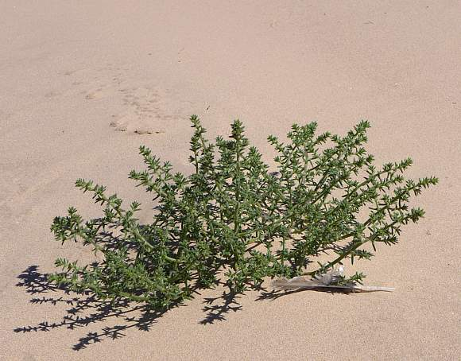

# 咬文嚼字-学科相关-Medicine

@(TOEFL)[托福, TOEFL, 词根词缀,咬文爵字,学科相关]

[toc]

# Medicine [ˈmedɪsn]

## ine / in

### 1. -ine 表形容词 "....的" {51}

also *-in*, adjectival word-forming element, Middle English, from Old French *-in*/*-ine*, or directly from Latin suffix *-inus*/*-ina*/*-inum* "of, like," forming adjectives and derived nouns, as in *divinus*, *feminus*, *caninus*; 

> 这个词根可以看出我对拉丁(古罗马)词根有多陌生。。。。

| 单词                          | 解释                                                         | 单词                               | 解释                                                         |
| ----------------------------- | ------------------------------------------------------------ | ---------------------------------- | ------------------------------------------------------------ |
| **bov-ine** 【ˈboʊvaɪn】 | a. (似)牛的, 迟钝的n. 牛科动物 ： bov-牛 + -ine **`bov-`** = ox, 表示“牛”。源自拉丁语 bos (词干 bov-) "ox, bull, cow." 更多同源词... **`-ine`** 表形容词，“…的”。 | aquil-ine                          | 似鹰的，钩状的                                               |
| asin-ine                      | 驴的，愚蠢的                                                 | can-ine                            | 犬齿，                                                       |
| carp-ine                      | 山羊的                                                       | columbine                          | 鸽似的                                                       |
| elephat-ine                   | 象的，巨大的，粗苯的                                         | equ-ine                            | 马的                                                         |
| leonine                       | 狮子的，狮子般的                                             | lup-ine                            | 狼的，凶残的                                                 |
| pisc-ine                      | 鱼的，鱼族的                                                 | porc-ine                           | 猪的，猪似的                                                 |
| serpent-ine                   | 蛇的，层层卷绕的，阴险的，迂回的                             | vultur-ine                         | 秃鹫似的，贪婪的，掠食的                                     |
| sibyll-ine                    | 女巫的，预言性的                                             | hirc-ine                           | 山羊的，羊膻味的                                             |
| mur-ine                       | 鼠科的                                                       | viper-ine                          | 毒蛇的                                                       |
| vulp-ine                      | 狐狸的，狐狸似的，诡计多端的                                 | zebr-ine                           | 斑马的，像斑马的                                             |
| petal-ine                     | 花瓣的，花瓣状的                                             | **alkal∙ine**   【ˈælkəlaɪn】 | **`alkal-`**  表示“碱”，源自阿拉伯语 al-qaliy (the ashes)。al-是阿拉伯语中的定冠词 "the"。  碱性的;含碱的（Something that is **alkaline** contains an alkali or has a pH value of more than 7.） |
| caul-ine                      | 茎的，茎生的                                                 | a-mar-anth-ine                     | 不凋的，不死的，紫红色的                                     |
| hyacinth-ine                  | 风信子的，紫青色的                                           | hyal-ine                           | 玻璃似的，透明的                                             |
| sangu-ine                     | 血红色的，满怀希望的，乐观的                                 | nerv-ine                           | 神经的，有镇静作用的                                         |
| sup-ine                       | 仰卧的，掌心向上的，懒散的                                   | saturn-ine                         | 沉默寡言的，阴沉的，铅中毒的                                 |
|                               |                                                              |                                    |                                                              |
| femin-ine                     | 女性的，阴性的                                               | infant-ine                         | 小孩似的                                                     |
| ex-sangu-ine                  | 失血的，贫血症的                                             | sacchar-ine                        | 糖的，含糖的，极甜的                                         |
| sal-ine                       | 盐的，苦涩的，                                               | bacul-ine                          | 棍棒的，鞭刑的                                               |
| inter-nec-ine                 | 相互残杀的，两败俱伤的                                       | per-egr-ine                        | 流浪的，移居的，漫游的，外国的，一样的                       |
| asbest-ine                    | 石棉的，不燃性的                                             | figual-ine                         | 陶土的                                                       |
| estuar-ine                    | 河口的，港口的                                               | pont-ine                           | 桥的，与桥有关的                                             |
| river-ine                     | 河的，河边的，                                               | pendul-ine                         | 悬垂的                                                       |
| **saline** 【ˈseɪliːn】  | a. 盐的, 苦涩的, 由碱金属(或含镁之盐类)组成的 n. 盐湖, 盐田, 碱盐泻药, 生理盐水 推荐：sal-盐 + -ine  **`sal-`** = salt, 表示“盐”，来自拉丁语。源自拉丁语 sal "salt." **`-ine`** 表形容词，“…的”。 **`-ine`** 表名词，“状态，药物，化学物品”等 词源说明(童理民)   1 - 来自通俗拉丁语*salamen,盐渍物，来自 sal,盐，词源同 salt.-ine,形容词后缀。 |                                    |                                                              |

### 2. -ine 表名词，“状态，药物，化学物品”等  

> **`-ine`**: 该元素组成的物品，比如氯气、咖啡因等
>
> **`-ide`**: 该元素和其他元素组合成的物品，如：氯化物（Chloride (Cl-) forms when chlorine (Cl2) reacts with hydrogen or [sodium](https://www.ahealthyphilosophy.com/article/sodium-an-essential-macromineral).）、氧化物等 

- 有两种意思，其中一种是 chemical suffix [-ine](https://www.etymonline.com/word/-ine?ref=etymonline_crossreference#etymonline_v_42197)

> word-forming element in chemistry, often interchangeable with [-in](https://www.etymonline.com/word/-in?ref=etymonline_crossreference#etymonline_v_42359) (2), though modern use distinguishes them; early 19c., from French *-ine*, the suffix commonly used to form words for derived substances, hence its extended use in chemistry. It was applied unsystematically at first (as in [aniline](https://www.etymonline.com/word/aniline?ref=etymonline_crossreference)), but now has more restricted use.

| 单词                                   | 解释                                                         | 单词                                                 | 解释                                                         |
| -------------------------------------- | ------------------------------------------------------------ | ---------------------------------------------------- | ------------------------------------------------------------ |
| **Caffe-ine** 【ˈkæfiːn】         | 咖啡因，咖啡碱 **Caffeine** is a chemical substance found in coffee, tea, and cocoa, which affects your brain and body and makes you more active. | **coca-ine**                       【koʊˈkeɪn】 | coca n. [古柯](https://baike.baidu.com/item/%E5%8F%A4%E6%9F%AF/2772401?fr=aladdin), 古柯叶，南美经济作物 a powerful drug that some people take illegally for pleasure and can become addicted to. Doctors sometimes use it as an anaesthetic . |
| **xanth-in**                      | 【医】 金莲花黄素 推荐：xanth-黄色 + -in化学或医药名词  **`xanth-`** = yellow, 表示“黄色”。 **`-in`** 表示名词，用于化学、生物学、医药。 | **xanth-ine** 【zænθɪn】                        | n. 黄质, 黄嘌呤 推荐：xanth-黄 + -ine  **`xanth-`** = yellow, 表示“黄色”。 **`-ine`** 表名词，“状态，药物，化学物品等”。 |
| **morph-ine**   【ˈmɔːrfiːn】     | n. 吗啡 推荐：morph-形状 + -ine **`morph-`** = form, shape, 表示“形状”。派生的 morphin- 专指“吗啡”。源自希腊语 morphe "form, shape"。 **`-ine`**  表名词，“状态，药物，化学物品等” | medic-ine                                            |                                                              |
| adrenal-ine                            | **`adrenal-`** 表示“肾上腺”。复合词根：**`ad-`**（to）+ **`reno-`**（肾）+**al-**（...的)。 肾上腺分泌的一种激素及神经传导物质，能使心跳加快，让人在兴奋、恐惧、紧张或愤怒时精力猛增。 | **vacc-ine**                                         | **`vacc-`** = bull, 表示“牛”。源自拉丁语 vacca "cow. 牛痘苗，疫苗 |
| **saline** 【ˈseɪliːn】           | a. 盐的, 苦涩的, 由碱金属(或含镁之盐类)组成的 n. 盐湖, 盐田, 碱盐泻药, 生理盐水 推荐：sal-盐 + -ine  **`sal-`** = salt, 表示“盐”，来自拉丁语。源自拉丁语 sal "salt." **`-ine`** 表形容词，“…的”。 **`-ine`** 表名词，“状态，药物，化学物品”等 词源说明(童理民)   1 - 来自通俗拉丁语*salamen,盐渍物，来自 sal,盐，词源同 salt.-ine,形容词后缀。 | nectar-ine[^3] 【ˈnektəriːn】                   | 油桃(桃的变种，果皮光滑)                                     |
| anti-febr-ine                          |                                                              | dopam-ine                                            | compound organic chemical, 1959, from *DOPA,* the amino acid (from first letter of elements of *dioxyphenylalanine*), + [amine](https://www.etymonline.com/word/amine?ref=etymonline_crossreference). |
| **iod-ide** 【ˈaɪədaɪd】          | n. 碘化物 推荐：iod-碘 + -ide  **`iod-`** 化学词根表示“碘”，来源于io-紫色，如 violet【紫色】。 **`-ide`** 化学名词后缀，表示“...化物”如oxide氧化物。  词源说明(童理民)   1 - 来自 iodine,碘，-ide,化学名词后缀。 | **iod-ine** 【ˈaɪədaɪn】                        | n. 碘, 碘酒  **`iod-`** 化学词根表示“碘”，来源于io-紫色，如 violet【紫色】。 **`-ine`** 表名词，“状态，药物，化学物品等”。  词源说明(童理民)   1 - 来自希 腊语 ideides,紫色的 ，来自 io-,紫色， 词源同 violet,-eides,像，相 似，词源同alkaloid,ovoid,idea.后 1814 年，英国化学家 Humphrey Davy 借用该希腊词来表示化学元素碘。 |
| **chlor-ide** 【ˈklɔːraɪd】       | 氯化物**Chloride** is a chemical compound of chlorine and another substance.（The scientific name for common salt is sodium chloride.食盐的学名是氯化钠。）  Chloride (Cl-) forms when chlorine (Cl2) reacts with hydrogen or [sodium](https://www.ahealthyphilosophy.com/article/sodium-an-essential-macromineral). | **chlor-ine** 【ˈklɔːriːn】                     | n. 氯 推荐：chlor-氯 + -ine  **`chlor-`** = green, 表示“绿”。用在化学领域表示"氯"源自希腊语 khloros "green, greenish yellow;" khloos "greenish color." **`-ine`** 表名词，“状态，药物，化学物品等”。  |
|                                        |                                                              | **chol-ine** 【kəʊli:n】                        | n. 胆碱 推荐：chol-胆 + -ine  **`chol-`** = bile, 表示“胆，胆汁”。古希腊人认为霍乱与黑胆汁过多有关，所以也表示“霍乱”。源自希腊语 khole "bile." **`-ine`** 表名词，“状态，药物，化学物品等”。 |
| **mescal-ine**      【ˈmeskəlɪn】 | 墨斯卡林，仙人球毒碱(从仙人球中提取的致幻剂) a drug obtained from a type of cactus , that affects people's minds and makes them see and hear things that are not really there |                                                      |                                                              |
| dis-cip-l-ine                          | **`dis-`**分开 + **`cip-`**抓住 + **`-l-`** + **`-ine`**。引申词义训练，必要的纪律，惩罚。 | doctr-ine                                            | = to teach, 表示“教”。源自拉丁语 docere "to teach."          |
| fam-ine                                | fam-来自拉丁语fames,饥饿，饥荒                               | rout-ine                                             | **route** n. 路径, 途径, 路线 vt. 确定路线, 按规定路线发送。 常规;正常顺序;生活乏味;无聊;(演出中的)一套动作，一系列笑话(等) |
| mar-ine                                | 舰队，水兵                                                   | **glycer∙ine** 【ˈɡlɪsərɪn】                    | n. 甘油, 丙三醇： a thick sweet clear liquid made from fats and oils and used in medicines, beauty products and explosives 推荐：glycer-甜 + -ine **`glycer-`** = sweet, 表示“甜”，构成医学词汇时表示“葡萄糖”。源自希腊语 glukus "sweet." **`-ine`** 表名词，“状态，药物，化学物品等”。 |
| fluor-ine                              |                                                              | curarine                                             |                                                              |
| epi-nephr-ine                          |                                                              | vasel-ine                                            | 凡士林                                                       |
|                                        |                                                              |                                                      |                                                              |
|                                        |                                                              |                                                      |                                                              |
|                                        |                                                              |                                                      |                                                              |

#### vaccine 疫苗

> **`vacc-`**=bull, 表示*牛*，来源于拉丁语**vacca**.
>
> **`-ine`** 表名词，“状态，药物，化学物品”等

琴纳（Edward Jenner,18世纪英国医生）将用于人体接种的牛痘苗称为**vaccine virus**，其中**vaccine**来自拉丁语**vaccinus**（母牛的），原本是个形容词，后来演变为名词。不仅可用来表示用于预防天花的牛痘苗，还可以表示任何一种用于接种的疫苗。

18世纪时，英国流行一种叫做“天花”（smallpox）的传染病，夺去了很多人的性命。英国医生琴纳（Edward Jenner）在调查研究如何治疗天花时，偶然发现在牧场工作的挤奶女工很少染上天花。他研究后发现，牧场中的奶牛也会得天花，导致皮肤出现脓包（cowpox，牛痘）。挤奶女工接触牛痘脓液后，会染上轻微的天花病，对健康并无大碍， 反而对天花病毒获得了免疫力。

 

琴纳受此启发，从奶牛牛痘中提取脓液，将其接种至人体，使接种者获得对天花的免疫力。这种用来接种的牛痘脓液就是人类历史上发明的第一种疫苗，被琴纳称为vaccine virus（来自奶牛的病毒），后来被简略为vaccine，用来泛指各种疫苗。

单词**vaccine**（疫苗）来自拉丁语，由词根**`vacc-`**（奶牛）加形容词和名词后缀**`-ine`**组成，字面意思是“来自奶牛的（病毒）”。现在，vaccine泛指各种疫苗。比如：

- There is no vaccine against HIV infection. 现在还没有防艾滋病病毒传染的疫苗。

**vaccine**派生出动词**vaccinate**，意思是“给……接种疫苗”，常用被动式。比如：

- All the children were vaccinated against smallpox. 所有孩子都接种了天花疫苗。

**vaccinate**的动名词形式是vaccination，表示“接种疫苗”这个行为本身，比如：

- Anyone who wants to avoid the flu should consider getting a vaccination. 任何希望避免患流感的人都应该考虑接种疫苗。

**相关单词：**

- **pox**：[pɒks] n.痘，痘疮

- **smallpox**：[ˈsmɔːlpɒks] n.天花

- **cowpox**：[ˈkaʊpɒks] n.牛痘

- **vaccine**：['væksiːn] n.疫苗
- **vaccinate**：['væksɪneɪt] vt.给……接种疫苗
- **vaccination**：[ˌvæksɪˈneɪʃn] n.接种疫苗

**英语词源趣谈(庄和诚)**

**vaccine** - 18世纪天花在英国流行，成为死亡的主要原因。英国医生詹纳（Edward Jenner, 1749-1823）当学徒时就已注意到染过牛痘（**cowpox**）的人不会感染天花（**smallpox**）。

1796年他试验牛痘接种成功，1798年他在论文中指出，接种牛痘病毒能对天花产生持久的免疫。詹纳将牛痘病毒即牛痘苗称为**vaccine virus**，将牛痘称为**vaccine disease**，将牛痘接种称为**vaccine inoculation**。

**vaccine**一词源于拉丁语***vacca*** 'cow'（母牛）的派生词***vaccīnus*** 'of a cow'（母牛的）。起初**vaccine**仅作形容词用，19世纪初由vaccine派生出动词**vaccinate**（种痘；接种）和名词**vaccination**（种痘；接种）。

到了19世纪40年代**vaccine virus**缩略为**vaccine**, **vaccine**开始由形容词转类为名词，直接用以指“牛痘苗”。之后它的词义扩展了，凡用于预防疾病而接种的疫苗人们均称作**vaccine**。

据传，是法国微生物学家巴斯德（Louis Pasteur, 1822-1895）为了纪念詹纳的功绩率先将vaccine和vaccination分别用于广义上的“疫苗”和“接种”的。

例　

- Researchers are trying to develop a vaccine against the disease. (OCD) 研究人员试图培养这种病的疫苗。
- The vaccine protects children against polio. 这种疫苗使孩子们能预防小儿麻痹症。
- All children should be vaccinated against measles and other childhood diseases. 所有孩子都应该接种预防麻疹及其他儿童疾病的疫苗。
- When we went to the tropics, we had to have several different vaccinations. (CID) 我们去热带地区的那阵子，我们得接种好几种不同的疫苗。

**Reference:**

1. [词源趣谈 | 从奶牛身上提取的vaccine（疫苗） --钱磊博士](https://mp.weixin.qq.com/s/_JTma5wUxf1l77vJjLtCCQ)

#### alkali（碱）：古阿拉伯人从灰烬中提取的物质

在中世纪时，阿拉伯人就掌握了从生长于海边盐碱地上的藜科植物**saltwort**（猪毛草）中提取碱的方法。他们焚烧这种植物，从灰烬中获得碱类物质。

在阿拉伯语中，这种来自灰烬的碱被称为***al-qali***，其中**al**是定冠词，**qali**就是“灰烬”的意思。

英语单词alkali就源自阿拉伯语**al-qali**，表示“碱”。

- **alkali**：['ælkəlaɪ] 

  - n.碱
  - adj.碱性的

- **alkaline**：['ælkəlaɪn] adj.碱性的，碱的

- **alkaloid**：['ælkə'lɔɪd] n. 生物碱；植物碱基

   

#### vaseline 凡士林

> 来自德语，vas-,水，词源同 water,-el,油，词源同 oil,-ine,化学名词后缀。因从石油提炼而得名。
>
> [ Brands and Products ] a thick oily substance used on dry skin 

**vaseline** - 提起凡士林，不少学习英语的都知道是从英语的**vaseline**音译而来的，但是对**vaseline**的由来，恐怕就未必有很多人了解了。这一直可以追溯到欧洲移民来到北美新大陆的早期。这些移居者经常发现一种奇特现象，冰凉的山洞中汇成的河水流入地底下神秘地消失后，竟在数英里外重又冒出地面，然而，此时水面上却蒙上薄薄一层油，宛如彩虹，闪闪发光。此外，移居者还发现一股股泉水破地而出，水面同样蒙着薄薄一层油。

过了些时候，移居者目睹印第安人把水面上的油撇起来，敷在烧伤、刀伤、擦伤等伤口处。后来欧洲移民也模仿着做，有些人还把撇取的油装瓶当作药物出售，并称这种油为“印第安油”。

整整一个世纪过去了。一位来自新英格兰，名叫乔治·比斯塞尔（**George Bissell**, 1821-1884）的年轻教师对这种油很感疑惑。他暗自思忖：“能不能从地下取出一种更浓的油呢？”

比斯塞尔把他的想法对一个叫埃德温·德雷克（**Edwin Drake**, 1819-1880）的朋友讲了。他们一起到宾夕法尼亚州泰特斯维尔（**Titusville**）附近钻了一口世界上最早的油井。附近的居民认为这种做法是徒劳无益的，因此称这一工程为“德雷克的徒劳而又愚蠢之举”。

然而，此举后来却成了一种了不起的工业壮举。1859年8月27日，德雷克他们果然在距地面25米的油层中打出了石油。

发现石油的消息不胫而走，数日后一直传到纽约市布鲁克林区一位化学家耳中。这位化学家名叫罗伯特·契斯柏洛（**Robert A. Chesebrough**, 1837-1938），他正在进行一项费时而艰巨的工作：从煤炭中提取煤油。当他一听到这消息，明白自己吃亏了，因为从石油中提取煤油要比从煤炭中提取容易得多了。契斯伯洛觉得不能因此无所事事，决定迁居泰特斯维尔。

一天，他在观看德雷克和工人们钻井时，发现一种蜡状物质附在巨大的钻头上。工人们把它弄下来扔掉。可是他们遇有刀伤或烧伤时，总是首先用这种东西往伤口上一抹。

契斯柏洛拿了些回家，用它做试验，最后成功地从中提取了一种洁净的糊状物。他在自己身上的伤口涂了一些作试验，发现伤痛大有减轻之感，伤口也愈合得快些。他立即向政府申请专利以保护他的产品，并将之命名为**vaseline**。1872年**Vaseline**被契斯柏洛公司（the Chesebrough Manufacturing Company）作为产品的正式商标名。

 

**vaseline**这个名称契斯柏洛一定是费尽心思才造出来的，它是***三种语言***的混合词。他先是取了德语词**Wasser**（水）中的**`was-`**加上希腊语***élaion***（油）中的**el**，再加上拉丁词缀**`-ine`**构成了***waserline***。后来他转念一想，w在德语中不是发成英语中的v吗？于是他才最后把该物质定名为**vaseline**。

契斯柏洛所发现的物质学名叫**petrolatum**或**petroleum jelly**（矿脂，石油冻），然而他所用的商标名**vaseline**却作为其俗名一直沿用至今。

例　

- “Try some Vaseline on those cold sores,”Jim suggested. (CWR) “在冻疮上搽一些凡士林吧，”吉姆建议说。
- "Vaseline is great for dry skin," Nancy said. (CWR) “凡士林对干燥的皮肤很适用，”南希说。

### 3. -in 表示名词，用于化学、生物学、医药{65}

| 单词                                     | 解释                                                         | 单词                                                    | 解释                                                         |
| ---------------------------------------- | ------------------------------------------------------------ | ------------------------------------------------------- | ------------------------------------------------------------ |
| **penicill-in    ** 【ˌpenɪˈsɪlɪn】 | 青霉素;盘尼西林 **`-in`** 表示名词，用于化学、生物学、医药 | **oxy-toc-in**                    【ˌɑksəˈtoʊsən】 | n. 催产素 推荐：oxy-锐敏 + toc-分娩 + -in  **`oxy-`** = sharp, acid。 **`toc-`** 4医学词根表示“分娩”。源自希腊语 tokos "childbirth." **`-in`** 表示名词，用于化学、生物学、医药。 |
| **aspir-in** 【ˈæsprɪn】            | 阿司匹林,一种解热镇痛药品的商标名称。  a drug used to reduce pain, fever and inflammation | **crypt-xanth-in** 【krɪptəʊzænθɪn】               | n. 隐黄素（维生素A原的一种） 推荐：crypto-秘密 + xanth-黄 + -in  **`xanth-`** = yellow, 表示“黄色”。 **`crypto-`** = secret, hidden, 表示“秘密，隐藏”。源自希腊语 kruptein "to hide." |
| **xanth-in**                        | 【医】 金莲花黄素 推荐：xanth-黄色 + -in化学或医药名词  **`xanth-`** = yellow, 表示“黄色”。 **`-in`** 表示名词，用于化学、生物学、医药。 | **xanth-ine** 【zænθɪn】                           | n. 黄质, 黄嘌呤 推荐：xanth-黄 + -ine  **`xanth-`** = yellow, 表示“黄色”。 **`-ine`** 表名词，“状态，药物，化学物品等”。 |

#### penicillin 青霉素

penicillin - 1928年春的一天，英国细菌学家弗莱明（**Sir Alexander Fleming**, 1881-1955）在伦敦圣玛丽医院（St. Mary's Hospital）的实验室里观察到他所培养的葡萄球菌被一种特异青霉菌penicillium notatum所污染。

这种霉菌极有可能是从窗外飘进来的。随着青霉菌的迅速繁殖，金黄色的葡萄球菌不仅不能生长发育，而且不断地被消灭。这显示青霉菌能分泌一种杀灭葡萄球菌或防止其生长的物质。他把这种物质取名为penicillin。

以后英国病理学家佛洛里（**Howard Walter Florey**, 1898-1968）和德裔英籍生物化学家钱恩（**Ernst Boris Chain**, 1906-1979）根据弗莱明的发现，将**penicillin**分离、提纯，并首次进行了临床试验，从而肯定了它的治疗价值。为此三人合得1945年诺贝尔生理学或医学奖。

**penicillin**的发现标志着抗生素纪元的开始，它拯救了千百万人的生命，解除了无数人的痛苦。尽管弗莱明发现**penicillin**完全出于偶然，但他的名字将永远和**penicillin**联系在一起。

**penicillin**一词是发现者根据可用以提取青霉素等抗生素的青霉菌之拉丁名称***pēnicillium***杜撰的，汉语最初将它音译为“盘尼西林”，但如今人们常称之为“青霉素”。

- The doctor prescribed some penicillin to fight my infection. (NED) 为了治疗我的感染，医生给我开了一些青霉素。
- She has a penicillin allergy. 她对青霉素过敏。

 

#### aspirin 阿司匹林：一种解热镇痛药品的商标名称

阿司匹林的学名叫做乙酰水杨酸，是一种历史悠久的解热镇痛药，诞生于1899年3月6日。

在德语中，乙酰水杨酸是***acetylierte spirsäure***，冗长而拗口，不方便记忆。于是，一位德国化学家Heinrich Dreser利用acetylierte（乙酰[ **xiān**]）的第一个字母a、spirsäure（水杨酸）的前四个字母spir以及表示化学制品的后缀**`-in`**，创造了aspirin这个新词，用作一种乙酰水杨酸药品的商标名。

由于这个商标名易于发音和记忆，很快就得到广泛应用。人们去药店买药时，不会说要买“乙酰水杨酸”，而是直接说买**aspirin**，哪怕要买的药品并非aspirin这个品牌。就这样，aspirin这个词就从一个商标名演变成了一种药品名称。

- aspirin：['æsprɪn] n.阿司匹林
- The doctor prescribed aspirin for my arthritis pain. (CWR) 医生为我的关节炎疼痛开了阿斯匹林。
- As aspirin prevents the formation of blood clots, it is also used to treat heart attack and stroke victims. (CID) 由于阿斯匹林可以防止血块的形成，它也被用于治疗心脏病和中风患者。

1

## genu-  = birth, produce, 表示“出生，产生”，医学上引申为“生殖或基因”{166}

| 单词                                   | 解释                                                         | 单词 | 解释 |
| -------------------------------------- | ------------------------------------------------------------ | ---- | ---- |
| **in-genu-ity** 【ˌɪndʒəˈnuːəti】 | n. 心灵手巧, 精巧, 精巧设计 推荐：in-在...内 + genu-出生 + -ity, 表名词  **`in-`** 来自拉丁语in-，表示“在内，进入，使...”。 **`genu-`** = birth, produce, 表示“出生，产生”，医学上引申为“生殖或基因”。 **`-ity`** 表名词，指具备某种性质。 |      |      |
|                                        |                                                              |      |      |
|                                        |                                                              |      |      |

## -osis  医学词根，表示“病理状况”{130}

> -osis 
> 医学词根，表示“病理状况”，复数形式 -oses。

| 单词                                                         | 解释                                                         | 单词                                                        | 解释                                                         |
| ------------------------------------------------------------ | ------------------------------------------------------------ | ----------------------------------------------------------- | ------------------------------------------------------------ |
| **halit-osis **                              【ˌhælɪˈtoʊsɪs】 | **`halit-`** = breathe, 表示“呼吸”，来自拉丁语。 **`-osis`** 医学词根，表示“病理状况”，复数形式 -oses。 a condition in which the breath smells unpleasant | **acid-osis**                          【ˌæsəˈdoʊsəs】 | **`acid`** n. 酸, 酸类物质, 尖刻, 迷幻药 a. 酸的, 酸性的, 尖刻的, 敏锐的 **`-osis`** 医学词根，表示“病理状况”，复数形式 -oses。 abnormally high acidity (excess hydrogen-ion concentration) of the blood and other body tissues |
| **`parasit∙osis`** 【ˌpærəsaɪ'təʊsɪs】                  | **`parasite`**  n. 寄生生物, 寄生虫, 食客 a parasitic disease or infestation | **pollin∙osis** 【ˌpɑləˈnosɪs】                        | **`pollen`** n. 花粉 vt. 传授花粉给  seasonal rhinitis resulting from an allergic reaction to pollen |
| **psych∙osis**   【saɪˈkoʊsɪs】                         | **`psych-`** = soul, 表示“灵魂，心理，精神”。源自希腊语 psykhe "spirit, soul." a serious mental illness that affects the whole personality | **toxic∙osis** 【tɒksɪ'kəʊsɪs】                        | **`toxic-`** = poison, 表示“毒”。源自希腊语 toxon "bow." any disease or condition caused by [poisoning](https://www.collinsdictionary.com/zh/dictionary/english/poisoning) |
| **zoo∙nos∙is** 【zəʊ'ɒnəsɪs】                           | **`-osis`** 医学词根，表示“病理状况”，复数形式 -oses。 **`zoo-`** = animal, 表示“动物”。源自希腊语 zoon, zoion "living being, animal." **`nos-`** = disease，表示“疾病”。源自希腊语nosos "disease, sickness, malady." an animal disease that can be transmitted to humans（人畜（兽）共患病） | **chlor-osis** 【klə'rəʊsɪs】                          | 萎黄病；缺绿病;褪绿部分 iron deficiency anemia in young women   **`chlor-`** = green, 表示“绿”。用在化学领域表示"氯"源自希腊语 khloros "green, greenish yellow;" khloos "greenish color."  **`-osis`** 医学词根，表示“病理状况”，复数形式 -oses。 |

##  -ia：表名词，某种疾病 {125}

| 单词                                                         | 解释                                                         | 单词                                                         | 解释                                                         |
| ------------------------------------------------------------ | ------------------------------------------------------------ | ------------------------------------------------------------ | ------------------------------------------------------------ |
| **pneumonia** 【njuːˈməʊniə】                           | **`pneumon-`**  = lung, 表示“肺”。源自希腊语 pnein "to breatoe," pneuma "breath, wind, spirit." **`-ia`**  表名词，表示“某种病”。 **Pneumonia** is a serious disease which affects your lungs and makes it difficult for you to breathe. | **eu-thanas-ia**                            【ˌjuːθəˈneɪʒə】 | **eu-好 + thanas-死亡 + -ia表示“疾病”=>安乐死** **`eu-`** 表示“好，优秀”。源自希腊语 eu- "well." **`thanas-`** = death，表示“死亡”。源自希腊语 thanatos "death." the practice (illegal in most countries) of killing without pain a person who is suffering from a disease that cannot be cured |
| eu-phor-ia                                                   | 兴奋，陶醉                                                   | dys-phor-ia                                                  | 烦躁不安                                                     |
| **my-op-ia**  【maɪˈoʊpiə】                             | **my-=myst-关闭 + op-眼睛 + -ia，引申词义目光短浅，后用于指近视眼=>近视** **`my-`** = secret, mystery, 表示“秘密，神秘”，原意表示“关闭”。 **`op-/ops-/opt-/opto-`** = sight, 表示“视力，眼睛”。源自希腊语 ops "eye." | **hyper-op-ia**  【ˌhaɪpəˈroʊpiə】                      | **hyper-超过，多 + op-视力 + -ia=>远视** **`hyper-`** 表示“超过，太多”。源自希腊语 huper "over." **`op-`** = sight, 表示“视力，眼睛”。源自希腊语 ops "eye." |
| hyster-ia                                                    | 歇斯底里在                                                   | neo-phil-ia                                                  | 新欢新奇                                                     |
| **algo-lagn-ia**  【æl'ɡəʊlæɡnjə】  [sadism](http://www.youdao.com/w/sadism/?keyfrom=dict.collins), [masochism](http://www.youdao.com/w/masochism/?keyfrom=dict.collins) | **algo-痛 + lagn-色欲 + -ia表示“疾病”=>受虐狂**.  **`algo-`** = pain, 表示“痛”。 **`lagn-`** = lust, 表示“色欲”。源自希腊语 lagnos "lustful, lascivious." sexual pleasure experienced through inflicting【ɪnˈflɪktɪŋ】 or experiencing pain | **necro-phil-ia ** 【ˌnekrəˈfɪliə】                     | n. 恋尸狂 推荐：necro-死 + phil-爱 + -ia  **`necro-`** = die, 表示“死”。源自希腊语 nekro "corpse." **`phil-`** = love, 表示“爱”，在医学和生物学领域常翻译成“嗜...”。 **`-ia`** 表名词，表示“某种病”。 |
| pedo-phil-ia                                                 | 恋童癖                                                       | phob-ia                                                      | 恐惧症                                                       |
| peri-pet-ia                                                  | 剧情突变，命运的突变                                         | perip-pete-ia                                                | 情节突变                                                     |
| alopec-ia                                                    | 脱发                                                         | a-mnes-ia                                                    | 健忘症                                                       |
| hypp-mnes-ia                                                 | 记忆力减低                                                   | an-aem-ia                                                    | 贫血症                                                       |
| an-em-ia                                                     | 贫血症                                                       | an-orex-ia                                                   | 食欲缺乏 厌食症                                              |
| **glycos-ur-ia**  【ˌglaɪkəʊ'sjʊərɪə】                  | 糖尿病 **`glycos-`** = glucose, glycose, 表示“糖”。源自希腊语 glukus "sweet." **`ur-`** = urine, 表示“尿”。源自拉丁语 urina "urine." the presence of abnormally high levels of sugar in the urine | **glucos∙e**  【ˈɡluːkoʊs】                             | **gluc-甜 + -ose，构词形式 glucos-**。 **`-ose`** 表示“碳水化合物”；“水解蛋白质的衍生物” **`glucos-`** = glucose, glycose, 表示“糖”。源自希腊语 glukus "sweet." |
| **glycos-yl-ation** 【glaɪkəsɪ'leɪʃən】                 | 糖基（苷）化（作用） **`glycos-`** = glucose, glycose, 表示“糖”。源自希腊语 glukus "sweet." **`-yl`** 表示“...基”。 **`-ation`** 表名词，“行为、动作、状态、过程、结果；物品”等。 the process by which sugars are chemically attached to proteins to form glycoproteins 糖蛋白糖与蛋白质化学结合形成糖蛋白的过程 | hypo-glyc-em-ia                                              | 低血糖                                                       |
| hemat-ur-ia                                                  | 血尿症                                                       | acid-em-ia                                                   | 酸血症                                                       |
| dys-kines-ia                                                 | 运动障碍，动作困难                                           | dys-phag-ia                                                  | 咽下困难，吞咽困难                                           |
| dys-phon-ia                                                  | 发声困难，言语障碍                                           | dys-toc-ia                                                   | 难产                                                         |
| hypo-therm-ia                                                | 低体温                                                       | a-chromat-ops-ia                                             | 全色盲                                                       |
| a-dynam-ia                                                   | 体力缺乏 无力症                                              | a-lex-ia                                                     | 失读症                                                       |
| ambly-op-ia                                                  | 弱读                                                         | a-ment-ia                                                    | 智力缺陷                                                     |
| de-ment-ia                                                   | 痴呆                                                         | ex-ophthalm-ia                                               | 突眼症                                                       |
| in-somn-ia                                                   | 失眠症                                                       | para-phas-ia                                                 | 语言错乱                                                     |
|                                                              |                                                              | **pan-dem-ia  **  【pæn'di:mɪə】                        | 【医】 大流行病, 泛流行病 推荐：pan-全部 + dem-人民 + -ia“...病”  **`pan-`** 表示“全部的、广泛的”。 **`dem-`** = people，表示“人民，民众”。源自希腊语 demos "people, land." **`-ia`** 表名词，表示“某种病”。 |

### hysteria（歇斯底里）：妇女子宫功能失调导致的情绪失控 {8}

> hyster- = womb，表示“子宫”。古希腊人认为癔病患者多为女性，是由于女性子宫功能紊乱所致。源自希腊语 hustera "womb."
> -ia 表名词，表示“某种病”。 hyster-子宫 + -ia疾病后缀。在古希腊时期的医学观点认为妇女子宫功能失调导致的情绪失控。
>
> hysteria - 早先的医生认为，妇女较之男人更容易情绪激动，而原因则归于子宫机能的失调。他们还认为，因为男人没有子宫，所以癔病只发生于妇女。这一错误看法正是hysterical（歇斯底里的，癔病的）、hysteria（歇斯底里，癔病）和hysterics（歇斯底里发作）这三个词的理据，而且充分反映在它们的词源上。它们始见于19世纪，源自希腊语hysterikós/husterikós 'of the womb'（子宫的），若再往前追溯，则是hystérā（子宫）。

癔病（**hysteria**）又被称为“歇斯底里”，指因为恐惧或其他原因造成的情绪失控。

古代西方医生认为，只有女性才会出现“歇斯底里”的症状，原因在于女性子宫功能失调；男性因为没有子宫，所以不会得癔病。

他们还认为，癔病之所以有各种不同表现，是由于子宫在体内偏离正常位置，到处乱跑造成的。当子宫在体内四处游走，压迫其他器官时，会导致不由自主的恐惧。这种错误的认识，直到十九世纪才被精神学家夏尔科、弗洛伊德等人纠正。

英语单词**hysteria**（癔病）源自希腊语***hysterikos***，字面意思就是“源自子宫的”。词根**`hyster-`**表示“子宫”，如

- **hystera**（子宫）
- **hysteritis**（子宫炎）。
- **hysteria**：[hɪ'stɪərɪə] n.癔病，歇斯底里
- **hysteric**：[hɪ'sterɪk] 
  - adj.歇斯底里的，癔病的，异常亢奋的
  - n.癔病患者
- **hysterical**：[hɪ'sterɪk(ə)l] adj.歇斯底里的，异常亢奋的
- **hystera**：['hɪstərə] n.子宫
- **hysteritis**：[,histə'raitis] n.子宫炎

**摩西英语(摩西)**

ventricle ['ventrɪk(ə)l] n.心室；脑室。拉丁词根ventr-表示腹部；胃，与希腊词源的hysteria [hɪ'stɪərɪə] n.歇斯底里的词根hyster-表示子宫同源（希腊人认为子宫异常会使女性精神不正常的兴奋）。后缀-cle指小，所以ventricle的字面意为“small chamber within the heart or bodily organ”。 

## 内外

### endo- = within, 表示“内部”。源自希腊语 endon, endo- "within."{51}

| 单词                              | 解释                                                         | 单词                              | 解释                                                         |
| --------------------------------- | ------------------------------------------------------------ | --------------------------------- | ------------------------------------------------------------ |
| **ecto∙therm** 【ektəʊθɜːm】 | n. 冷血动物 推荐：ecto-外 + therm-热  **`ecto-`** 表示“外”，一般用于医学领域。源自希腊语 ex, ek "out of, from." **`therm-`** = heat, 表示“热”。源自希腊语 thermos "warm, hot, heat." | **endo-therm**  【endəθɜ:m】 | n. 热血动物 推荐：endo-内 + therm-热  **`endo-`** = within, 表示“内部”。源自希腊语 endon, endo- "within." **`therm-`** = heat, 表示“热”。源自希腊语 thermos "warm, hot, heat." |
|                                   |                                                              |                                   |                                                              |
|                                   |                                                              |                                   |                                                              |

### ecto- 表示“外”，一般用于医学领域。源自希腊语 ex, ek "out of, from."{9}

| 单词                              | 解释                                                         | 单词                              | 解释                                                         |
| --------------------------------- | ------------------------------------------------------------ | --------------------------------- | ------------------------------------------------------------ |
| **ecto∙therm** 【ektəʊθɜːm】 | n. 冷血动物 推荐：ecto-外 + therm-热  **`ecto-`** 表示“外”，一般用于医学领域。源自希腊语 ex, ek "out of, from." **`therm-`** = heat, 表示“热”。源自希腊语 thermos "warm, hot, heat." | **endo-therm**  【endəθɜ:m】 | n. 热血动物 推荐：endo-内 + therm-热  **`endo-`** = within, 表示“内部”。源自希腊语 endon, endo- "within." **`therm-`** = heat, 表示“热”。源自希腊语 thermos "warm, hot, heat." |
|                                   |                                                              |                                   |                                                              |
|                                   |                                                              |                                   |                                                              |

## opto- = sight, 表示“视力，眼睛”。源自希腊语 ops "eye."

 

| 单词                                                   | 解释                                                         | 单词                           | 解释                                                         |
| ------------------------------------------------------ | ------------------------------------------------------------ | ------------------------------ | ------------------------------------------------------------ |
| **opto-metry   **                【ɑːpˈtɑːmətri】 | n. 视力测定(法), 验光配镜(法) 推荐：opto-视力 + -metry（关于测量的）..法或...技术  **`opto-`** = sight, 表示“视力，眼睛”。源自希腊语 ops "eye." 更多同源词... **`-metry`** = process of measuring, 表示“（测量）术”。源自希腊语 metron "measure, rule, length, proportion, poetic meter." 更多同源词... 词源说明(童理民)   1 - 来自希腊语 optos,眼睛，视力，词源同 optic.-metry,测量仪器，测试。 | **bio-psy** 【ˈbaɪɑːpsi】 | n. 活组织检查                                                                                   **`ops-,opt-,opto-`** = sight, 表示“视力，眼睛”。源自希腊语 ops "eye." **`bio-`** = life, 表示“生命，生物”。源自希腊语 bios "life." 词源说明(童理民)   1 - bio-,生命，-ops,看，见 optic,光学的。 |
|                                                        |                                                              |                                |                                                              |
|                                                        |                                                              |                                |                                                              |

## -oma = "tumor, mass, swelling", 名词后缀，表示“...肿、...瘤”等。正确的复数形式是 -omata{46}

| 单词                           | 解释                                                         | 单词 | 解释 |
| ------------------------------ | ------------------------------------------------------------ | ---- | ---- |
| **myx-oma** 【mɪks'əʊmə】 | n. 粘液瘤 推荐：myx-粘液 + -oma肿瘤  **`myx-`** = mucus, 表示“粘液”。源自希腊语 muxa "mucus, lamp wick." **`-oma`** = "tumor, mass, swelling", 名词后缀，表示“...肿、...瘤”等。正确的复数形式是 -omata。  词源说明(童理民)   1 - 来自希腊语 myxa,黏液，词源同 mucus,muggy.-oma,瘤，肿块，词源同 myeloma,carcinoma. |      |      |
|                                |                                                              |      |      |
|                                |                                                              |      |      |

## immuno- 表示“免疫”{41}

> immuno- 
> 表示“免疫”，由 im-（否定） + muni-（公共的）组成，字面含义“不接触公共的（东西）”。源自拉丁语 munus "duty, work, gift."
>
> im-,不，非，-mun,公共的，履行公共服务的，词源同 common,communicate.即免除公共责任或义务，后引申词义免疫的，受保护的。

| 单词     | 解释 | 单词 | 解释 |
| -------- | ---- | ---- | ---- |
| im∙mun∙e |      |      |      |
|          |      |      |      |
|          |      |      |      |

## rhe-,rrhex,rrhea-= to flow, 表示“流” {35}

古希腊人认为风湿病是由多余的液体流入关节引起韧带肿胀，所以命名为 rheumatism。源自希腊语 rhein "to flow," rheuma "stream, humor of the body."

| 单词                           | 解释                        | 单词                                                         | 解释                                                         |
| ------------------------------ | --------------------------- | ------------------------------------------------------------ | ------------------------------------------------------------ |
|                                |                             |                                                              |                                                              |
| rhinorrhea  [,rainə'ri:ə] | n. 鼻液溢（词根rhino-表鼻） | logorrhea  [,lɔgə'riə]                                  | n.多言癖（词根logo-表说）                                    |
| hemorrhea                      | 大出血（词根hemo-表血       | **hemo-rrh-oid-s**                          【ˈhɛməˌrɔɪdz】 | **`hemo-`** 表示“血”。源自希腊语 haima (词干 haimat-) "blood." **`-oid`** = form, 表示“…之物”，在几何学上表示“…形”；作形容词后缀，表示“如…的”。‘o’为希腊语中的连词符，id=eidos, 希腊语，表示“样貌、影像” piles(piles有表示堆积的意思)painful swollen veins at or near the anus |
| menorrhea                      | n.月经（词根meno-表month）  | gonorrhea  [,ɡɒnə'rɪə]                                  | n.淋病（词根gon-表精子，源自错误的认知），那现在明白-rrhea表啥了吧？ |
|                                |                             |                                                              |                                                              |

## cyst-= bladder, pouch, 表示“囊”, 医学上引申为“膀胱”{24}

> 源自希腊语 kustis "bladder, bag" < "bellows."

| 单词             | 解释                                                         | 单词 | 解释 |
| ---------------- | ------------------------------------------------------------ | ---- | ---- |
| cysto-flagellata | n. 囊状鞭毛虫类 推荐：Cysto-囊+ flagellata【鞭毛虫类】  Flagellata 【医】 鞭毛虫类 **`cyst-`** = bladder, pouch, 表示“囊”, 医学上引申为“膀胱”。源自希腊语 kustis "bladder, bag" < "bellows." **`flagell-`** = whip, 表示“鞭子”。源自拉丁语 flagrum "a whip." |      |      |
|                  |                                                              |      |      |
|                  |                                                              |      |      |

## vive- = life, 表示“生命”， 最终源自原始印欧语 *gweie- “to live活着”。和表示生命的词根 bio-同源{23}

> 源自拉丁语 vivus "living, alive," vivere "to live," viva "life." 

| 单词                         | 解释                                                         | 单词 | 解释 |
| ---------------------------- | ------------------------------------------------------------ | ---- | ---- |
| **re-vive** 【rɪˈvaɪv】 | vt. 使苏醒, 使复兴, 使振奋, 回想起, 重播 vi. 苏醒, 复活, 复兴, 恢复精神 推荐：re-再 + viv-活 + -e → 复活。  **`re-`** 表示“向后，往回，相反，相对，再”，或仅作强调用，在元音前 red-, reh-。 源自拉丁语 re-, red- "backward, again." **`vive-`** = life, 表示“生命”， 最终源自原始印欧语 *gweie- “to live活着”。 和表示生命的词根 bio-同源。源自拉丁语 vivus "living, alive," vivere "to live," viva "life."  词源说明(童理民)   1 - re-,再，重新，-viv,生命，词源同 vivid,vital. |      |      |
|                              |                                                              |      |      |
|                              |                                                              |      |      |

## vit- = life, 表示“生命”， 最终源自原始印欧语 *gweie- “to live活着”。和表示生命的词根 bio-同源{23}

> 源自拉丁语 vivus "living, alive," vivere "to live," viva "life." 

| 单词                                             | 解释                                                         | 单词                             | 解释                                                         |
| ------------------------------------------------ | ------------------------------------------------------------ | -------------------------------- | ------------------------------------------------------------ |
| **vit-al** 【ˈvaɪtl】                       | a. 生命的, 重要的, 充满活力的, 生死攸关的, 致命的 推荐：vit-生命 + -al的。  **`vit-`** = life, 表示“生命”， 最终源自原始印欧语 *gweie- “to live活着”。 和表示生命的词根 bio-同源。源自拉丁语 vivus "living, alive," vivere "to live," viva "life."  **`-al`** 表形容词，“…的”，一般缀于名词后。源自拉丁语 -alis, adjective suffix. | **vital-ize** 【vaɪtəlaɪz】 | vt. 给与...生命力, 使有生气, 激发, 使增添活力 推荐：vital【生命的】 + -ise, 表动词  **`vital`** a. 生命的, 重要的, 充满活力的, 生死攸关的, 致命的 **`-ise`** 动词后缀，一般缀于形容词后。-ise 是英式英语，-ize 是美式英语。源自希腊语 -izein, verbal suffix. |
| **re-vital-ize  **       【ˌriːˈvaɪtəlaɪz】 | vt. 使有新的活力, 使新生, 使恢复元气 推荐：re-重新 + vital-活 + -ise, 表动词  **`re-`** 表示“向后，往回，相反，相对，再”，或仅作强调用，在元音前 red-, reh-。源自拉丁语 re-, red- "backward, again." **`vitalise`** vt. 给与...生命力, 使有生气, 激发, 使增添活力 切换词根显示方式 |                                  |                                                              |
|                                                  |                                                              |                                  |                                                              |

### vitamin（维生素）：维持生命活力所需的化合物

 

> 来自拉丁语 vita,生命，来自 PIE*gweie,存活，词源同 biology,quick,vivid,zoo

维生素是维持身体健康所必需的一类有机化合物。这类物质在体内既不能是构成身体组织的原料，也不是能量的来源，而是一类**调节物质**，在物质代谢中起重要作用。

维生素的发现是20世纪的伟大发现之一。1912年，波兰生物化学家卡西米尔•冯克（Casimir Funk）鉴定出在糙米中能对抗脚气病的物质是胺类（**amine**），因此将其命名为**vitamine**，由**vita**（生命）和**amine**（胺）构成。

后来科学家发现，冯克所发现的仅仅是维生素中的一种，还有更多维生素并不属于胺类，因此将**vitamine**最后一个字母**`e`**去掉，变成了**vitamin**。中文曾将**vitamin**音译为“维他命”，后来统一为“维生素”。

- **vitamin**：['vaɪtəmɪn] n.维生素，维他命
- **vital**：['vaɪtl] adj. 至关重要的；生死攸关的；有活力的
- **vitality**：[vaɪ'tæləti] n. 活力，生气；生命力，生动性

英语词源趣谈(庄和诚)

 

**vitamin** - 该词为美国籍波兰生物化学家芬克（[Casimir Funk](https://en.wikipedia.org/wiki/Casimir_Funk), 1884-1967）所创。芬克是研究维生素的先驱，1911年成功地提取了维生素B1。他认为维生素中存在某种amino acid（氨基酸，胺酸），所以翌年他用拉丁语vīta 'life'（生命）加amine（胺）构成vitamine一词，表示我们今天称之为“维生素”的有机物。以后他发现维生素中并不含amino acid，才把字母e去掉，所以今天我们所用的vitamin词尾是没有e的。vitamin旧译“维他命”。

例

- Fish is rich in vitamins and minerals. 鱼含有丰富的维生素和矿物质。
- This old lady needs extra vitamins and protein. 这位老太太需要额外补充维生素和蛋白质。
- Lack of vitamin A can cause blindness. (LDC) 缺乏维生素A可能导致失明。
- Vitamin C deficiency can ultimately lead to scurvy. (OCD) 缺乏维生素C最终会引起坏血病。

## pneumon- = lung, 表示“肺”{19}

> pneumon- 
> = lung, 表示“肺”。源自希腊语 pnein "to breatoe," pneuma "breath, wind, spirit."

| 单词                               | 解释                                                         | 单词           | 解释                                                         |
| ---------------------------------- | ------------------------------------------------------------ | -------------- | ------------------------------------------------------------ |
| **pneumonia** 【njuːˈməʊniə】 | **`pneumon-`**  = lung, 表示“肺”。源自希腊语 pnein "to breatoe," pneuma "breath, wind, spirit." **`-ia`**  表名词，表示“某种病”。 **Pneumonia** is a serious disease which affects your lungs and makes it difficult for you to breathe. | pneumato-meter | 肺活量计                                                     |
| pneumon-ic                         | 肺的，肺炎的                                                 | pneumon-ectomy | 肺切除术                                                     |
| pneumon-itis                       | 肺炎.....                                                    | pneumo-coccus  | 肺炎球菌                                                     |
| pneumo-coniosis                    | 肺尘埃病                                                     | pneumo-rrhagia | 肺出血 **`-rrhagia`** = burst, 表示“破裂”。源自希腊语 rhegnunai "to burst forth." |
| pneumo-bacillus                    | 肺炎杆菌                                                     |                |                                                              |

## pneuma- 表示“气，呼吸” {17}

> 源自希腊语 pnein "to breatoe," pneuma "breath, wind, spirit."

| 单词                       | 解释                                                         | 单词                                                         | 解释                                                         |
| -------------------------- | ------------------------------------------------------------ | ------------------------------------------------------------ | ------------------------------------------------------------ |
| **pneuma** 【njuːmə】 | 基本释义    n. 元气, 灵魂, 精神 **`pneuma-`** 表示“气，呼吸”。源自希腊语 pnein "to breatoe," pneuma "breath, wind, spirit." | **pneuma-tic  **                          【nuːˈmætɪk】 | a. 充气的, 空气的, 有气胎的, 气动的, 灵魂的 n. 充气轮胎 推荐：pneumat-空气 + -ic表形容词。 **`pneumat-`** 表示“气，呼吸”。源自希腊语 pnein "to breatoe," pneuma "breath, wind, spirit." **`-ic`** 表形容词，“…的”。 词源说明(童理民)   1 - 来自希腊语 pneuma,空气，风，呼吸，来自 pnein,吹动，呼吸，来自 PIE*pneu,呼吸，拟声词。 |
|                            |                                                              |                                                              |                                                              |
|                            |                                                              |                                                              |                                                              |

## chol- = bile, 表示“胆，胆汁” 源自希腊语 khole "bile." {16}

> 古希腊人认为霍乱与黑胆汁过多有关，所以也表示“霍乱”。源自希腊语 khole "bile."
>
> 注意区分 【chlor-  = green, 表示“绿”。用在化学领域表示"氯"源自希腊语 khloros "green, greenish yellow;" khloos "greenish{32 】

| 单词                                  | 解释                                                         | 单词                              | 解释                                                         |
| ------------------------------------- | ------------------------------------------------------------ | --------------------------------- | ------------------------------------------------------------ |
| **cholr-ine** 【ˈklɔːriːn】      | n. 氯 推荐：chlor-氯 + -ine  **`chlor-`** = green, 表示“绿”。用在化学领域表示"氯"源自希腊语 khloros "green, greenish yellow;" khloos "greenish color." **`-ine`** 表名词，“状态，药物，化学物品等”。 | **chol-ine **    【kəʊli:n】 | n. 胆碱 推荐：chol-胆 + -ine  **`chol-`** = bile, 表示“胆，胆汁”。古希腊人认为霍乱与黑胆汁过多有关，所以也表示“霍乱”。源自希腊语 khole "bile." **`-ine`** 表名词，“状态，药物，化学物品等”。 |
| **melan∙chol∙y** 【ˈmelənkɑːli】 | n. 忧郁, 悲哀, 愁思 a. 忧郁的, 使人悲伤的, 愁思的 推荐： melan-黑 + chol-胆汁 + -y → 胆汁发黑 → 忧郁。  melan- = black, 表示“黑”。源自希腊语 melas "black." chol- = bile, 表示“胆，胆汁”。 |                                   |                                                              |
|                                       |                                                              |                                   |                                                              |
|                                       |                                                              |                                   |                                                              |

### melancholy（忧郁）：导致人性情忧郁的黑胆汁

> 来自拉丁语 melancholia,来自希腊语 malankholia,黑胆汁过度分泌， 忧郁，悲伤，来自 melas,黑的，词源同 melanin,khole,胆汁，词源同 gall.在古代观念中，人的忧郁，悲伤等是由于黑胆汁的过度分泌引起的。参照 humor,体液，体液学说。

四体液学说还认为，一个人如果体内黑胆汁太多，就会变得“性情忧郁”。在希腊语中，“黑胆汁”被称为*melankholia*，由***melanos***（黑）和***khole***（胆汁，choler）组合而成。该词进入英语后拼写演变为**melancholy**，含义转变为 “忧郁、悲哀”。

- **melancholy**：['melənkəlɪ] n.忧郁；悲哀；愁思adj. 忧郁的；使人悲伤的
- **melancholia**：[,mɛlən'kolɪə] n. 忧郁症
- **melancholic**：[,mɛlən'kɑlɪk] 
  - adj. 忧郁的；抑郁的；患忧郁症的
  - n. 忧郁症患者
- **melanin**：['mɛlənɪn] n. 黑色素

## coron-,coroll- = wreath, crown, 表示“花环，花冠”。源自希腊语 koronos "curved." {16}

| 单词                     | 解释                                                         | 单词                                 | 解释                                                         |
| ------------------------ | ------------------------------------------------------------ | ------------------------------------ | ------------------------------------------------------------ |
| **crown** 【kraʊn】 | n. 王冠, 王权, 顶点 vt. 使成王, 加冕, 居...之顶 **`coron-,coroll-`**= wreath, crown, 表示“花环，花冠”。源自希腊语 koronos "curved." 词源说明(童理民)   1 - 来自 PIE*sker,弯，转，编织，词源同 cradle,corona. | **coron-a**        【kəˈroʊnə】 | n. 冠, 冠状物, 副冠, 根颈, 头顶, 牙冠, 檐板, 日冕, 月华, 日华, 电晕, 光圈 推荐：词源同 corolla,花冠。因形似花冠而得名。  **`coron-`** = wreath, crown, 表示“花环，花冠”。源自希腊语 koronos "curved." 词源说明(童理民)   1 - 词源同 corolla,花冠。因形似花冠而得名。 |
|                          |                                                              |                                      |                                                              |
|                          |                                                              |                                      |                                                              |

### coroner（验尸官）：英国诺曼王朝时期国王的司法官

英语单词**coroner**最早是英国诺曼王朝时设置的一个王室职务，相当于国王的司法官，由各地的骑士担任。

1194年的英国《巡回法院规章》（Articles of Eyre）第20条首次予以明确规定，其职责是“custos placitorum coronae”（拉丁语，= keep the pleas of the Crown，掌管国王的诉讼）。其中，coronae来自corona（crown，王冠），英语单词coroner即来源于此。

在该制度设立的初期，coroner主要负有如下两项职责：

1. 一是维护和增加国王的国库收入，coroner通过查明死因、确定个案的类型而分别予以处理，避免因为一些臆测的刑事案件而浪费人力和财力，还有一项重要职能，即通过将死刑犯的财产没入国库的方式为国王聚敛钱财；
2. 二是负责调查诺曼底人非正常死亡的案件。诺曼底人是当时英国的统治阶级，在有诺曼底人之死存疑的情形下，coroner应查明其死因。

在美国、澳大利亚等受英国司法制度影响的国家，依然保留了coroner（验尸官）职务和制度。现在，coroner（验尸官）的主要职责是调查非正常死亡案件中的死亡原因。

- coroner： ['kɒr(ə)nə] n.验尸官
- crown：[kraʊn] n. 王冠；花冠；王权；顶点vt. 加冕；居…之顶

## xanth- = yellow, 表示“黄色” {15}

| 单词                                       | 解释                                                         | 单词                          | 解释                                                         |
| ------------------------------------------ | ------------------------------------------------------------ | ----------------------------- | ------------------------------------------------------------ |
| **xanth-in**                          | 【医】 金莲花黄素 推荐：xanth-黄色 + -in化学或医药名词  **`xanth-`** = yellow, 表示“黄色”。 **`-in`** 表示名词，用于化学、生物学、医药。 | **xanth-ine** 【zænθɪn】 | n. 黄质, 黄嘌呤 推荐：xanth-黄 + -ine  **`xanth-`** = yellow, 表示“黄色”。 **`-ine`** 表名词，“状态，药物，化学物品等”。 |
| **crypto-xanth-in** 【krɪptəʊzænθɪn】 | n. 隐黄素（维生素A原的一种） 推荐：crypto-秘密 + xanth-黄 + -in  **`xanth-`** = yellow, 表示“黄色”。 **`crypto-`** = secret, hidden, 表示“秘密，隐藏”。源自希腊语 kruptein "to hide." | **xantho-chro-ic**            | a. 白种人的(高加索人种) another name for [xanthochroid](https://www.collinsdictionary.com/zh/dictionary/english/xanthochroid) 推荐：xantho-黄色 + chro-颜色 + -ic  **`xantho-`** = yellow, 表示“黄色”。 **`chro-`** = color, 表示“颜色”。 **`-ic`** 表形容词，“…的”。 |
|                                            |                                                              |                               |                                                              |

## dem- = people，表示“人民，民众”。源自希腊语 demos "people, land."{14}

| 单词                                  | 解释                                                         | 单词                                                   | 解释                                                         |
| ------------------------------------- | ------------------------------------------------------------ | ------------------------------------------------------ | ------------------------------------------------------------ |
| **pan-dem-ia  **  【pæn'di:mɪə】 | 【医】 大流行病, 泛流行病 推荐：pan-全部 + dem-人民 + -ia“...病”  **`pan-`** 表示“全部的、广泛的”。 **`dem-`** = people，表示“人民，民众”。源自希腊语 demos "people, land." **`-ia`** 表名词，表示“某种病”。 | **pan-dem-ic**                      【pænˈdemɪk】 | a. 大流行的, 普遍的, 全世界的 推荐：pan-到处 + dem-人 + -ic表形容词 → 人群中到处流行的。  **`pan-`** 表示“全部的、广泛的”。 **`dem-`** = people，表示“人民，民众”。源自希腊语 demos "people, land." **`-ic`** 表形容词，“…的”。 |
| **epi-dem-ic** 【ˌepɪˈdemɪk】    | **epi-在...周围 + dem-人民 + -ic → 在人民周围 → 流行的。** **`epi-`** 表示“在…上，在…周围，在…后面”。源自希腊语 epi "on, over, at." **`dem-`** = people，表示“人民，民众”。源自希腊语 demos "people, land." | **en-dem-ic[^5]** 【enˈdemɪk】                    | n. 地方病 a. 某地(或某些人中)流行的, 地方的 推荐：en-在…内 + dem-人民 + -ic → 在人民内 → 地方性的。  en-  表示“入、内、在...之内、使...”，来自古法语 en-。 dem- = people，表示“人民，民众”。源自希腊语 demos "people, land." -ic 表形容词，“…的”。 词源说明(童理民)   1 - en-,进入，使，-dem,人民，词源同 demotic,democracy. |
| epidemical                            | a. 流行性的, 传染的 推荐：epidemic【传染病, 流行病】 + -al  epidemic n. 传染病, 流行病 a. 流行的, 传染性的 -al 表形容词，“…的”，一般缀于名词后。源自拉丁语 -alis, adjective suffix. |                                                        |                                                              |

[^5]: 摩西英语(摩西) endemic [en'demɪk] adj.地方性的，n.地方病。en=in，希腊词根demo与日耳曼语词源的time同源，表common people。如果埃博拉ebola还是只发生在塞拉利昂等地，那它就是地方病。它本身是一种epidemic传染病，前缀epi-表on,upon。如果继续传播，恐怕最坏会成为pandemic n.流行性疾病，前缀pan-表all。

### What’s the difference between a pandemic, an epidemic, endemic, and an outbreak?

Not all infectious disease terms are created equal, though often they’re mistakenly used interchangeably. The distinction between the words “pandemic,” “epidemic,” and “endemic” is regularly blurred, even by medical experts. This is because the definition of each term is fluid and changes as diseases become more or less prevalent over time.

While conversational use of these words might not require precise definitions, knowing the difference is important to help you better understand public health news and appropriate public health responses.

Let’s start with basic definitions:

- **AN EPIDEMIC** is a disease that affects a large number of people within a community, population, or region.
- **A PANDEMIC** is an epidemic that’s spread over multiple countries or continents.
- **ENDEMIC** is something that belongs to a particular people or country.
- **AN OUTBREAK** is a greater-than-anticipated increase in the number of endemic cases. It can also be a single case in a new area. If it’s not quickly controlled, an outbreak can become an epidemic.

#### Epidemic vs. Pandemic

A simple way to know the difference between an epidemic and a pandemic is to remember the “P” in pandemic, which means a pandemic has a passport. A pandemic is an epidemic that travels.

#### Epidemic vs. Endemic

But what’s the difference between epidemic and endemic? An epidemic is actively spreading; new cases of the disease substantially exceed what is expected. More broadly, it’s used to describe any problem that’s out of control, such as “the opioid epidemic.” An epidemic is often localized to a region, but the number of those infected in that region is significantly higher than normal. For example, when [COVID-19](https://intermountainhealthcare.org/covid19-coronavirus/?utm_source=coronavirus&utm_medium=vanitydomain&utm_campaign=coronavirus20200302) was limited to Wuhan, China, it was an epidemic. The geographical spread turned it into a pandemic.

Endemics, on the other hand, are a constant presence in a specific location. Malaria is endemic to parts of Africa. Ice is endemic to Antarctica.

#### Endemic vs. Outbreak

Going one step farther, an endemic can lead to an outbreak, and an outbreak can happen anywhere. Last summer’s dengue fever outbreak in Hawaii is as an example. Dengue fever is endemic to certain regions of Africa, Central and South America, and the Caribbean. Mosquitoes in these areas carry dengue fever and transmit it from person to person. But in 2019 there was an outbreak of dengue fever in Hawaii, where the disease is not endemic. It’s believed an infected person visited the Big Island and was bitten by mosquitoes there. The insects then transferred the disease to other individuals they bit, which created an outbreak.

You can see why it’s so easy to confuse these terms. They’re all related to one another and there’s a natural ebb and flow between them as treatments become available and measures for control are put in place — or as flare-ups occur and disease begins to spread.

**Reference:**

1. [What’s the difference between a pandemic, an epidemic, endemic, and an outbreak?](https://intermountainhealthcare.org/blogs/topics/live-well/2020/04/whats-the-difference-between-a-pandemic-an-epidemic-endemic-and-an-outbreak/)

## acro- 表示“最高点”。医学领域引申为四肢，末端。源自希腊语 akros "topmost." {12}

| 单词                           | 解释                                                         | 单词 | 解释 |
| ------------------------------ | ------------------------------------------------------------ | ---- | ---- |
| **acro-nym** 【ˈækrənɪm】 | n. 首字母缩拼词, 首字母组合词 推荐：acer-首的，开头的 + onym-名字，用于指首字母缩略词。  **`acro-`** 表示“最高点”。医学领域引申为四肢，末端。源自希腊语 akros "topmost." **`nym-`** = name, 表示“名字”。源自希腊语 onoma, onuma "name." 词源说明(童理民)   1 - acer-,尖的，开头的，-onym,名字，词源同 name.用于指首字母缩略语。 |      |      |
|                                |                                                              |      |      |
|                                |                                                              |      |      |

## algo- = pain, 表示“痛”{9}

| 单词                                                         | 解释                                                         | 单词 | 解释 |
| ------------------------------------------------------------ | ------------------------------------------------------------ | ---- | ---- |
| **algo-lagn-ia** 【æl'ɡəʊlæɡnjə】  [sadism](http://www.youdao.com/w/sadism/?keyfrom=dict.collins), [masochism](http://www.youdao.com/w/masochism/?keyfrom=dict.collins) | n. 痛淫；变态淫乐；性虐狂  推荐：algo-痛 + lagn-色欲 + -ia表示“疾病”  **`algo-`** = pain, 表示“痛”。 **`lagn-`** 1= lust, 表示“色欲”。源自希腊语 lagnos "lustful, lascivious." **`-ia`** 表名词，表示“某种病”。 sexual pleasure derived from inflicting or experiencing pain |      |      |
|                                                              |                                                              |      |      |
|                                                              |                                                              |      |      |

## thym- 表示“胸腺，精神，思想”{8}

> 源自希腊语 thumos "soul, spirit," thumon, thumos "thyme."

| 单词                          | 解释                                                         | 单词 | 解释 |
| ----------------------------- | ------------------------------------------------------------ | ---- | ---- |
| **thym-us**  【ˈθaɪməs】 | n. 胸腺 推荐：thym-胸腺 + -us  thym- 表示“胸腺，精神，思想”。源自希腊语 thumos "soul, spirit," thumon, thumos "thyme." 词源说明(童理民)   1 - 来自拉丁语 thymus,来自希腊语 thymos,疣子状瘤，古希腊著名医生 Galan 借用该词用以指胸腺，词源同 thymon,百里香。可能因其形如百里香花苞而得名。 |      |      |
|                               |                                                              |      |      |
|                               |                                                              |      |      |

## bulla- = ox, 表示“牛”。源自古英语 bulluc "bull." {7}

| 单词                     | 解释                                                         | 单词 | 解释 |
| ------------------------ | ------------------------------------------------------------ | ---- | ---- |
| **bulla** 【ˈbʊlə】 | n. 大疱, 大水疱  **`bulla-`** = ox, 表示“牛”。源自古英语 bulluc "bull." |      |      |
|                          |                                                              |      |      |
|                          |                                                              |      |      |

## ser- = serum, 表示“浆液，血清”。多用于医学词汇{6}

> 源自拉丁语 serum "whey." 

| 单词                       | 解释                                                         | 单词 | 解释 |
| -------------------------- | ------------------------------------------------------------ | ---- | ---- |
| **ser-um** 【ˈsɪrəm】 | n. 浆液, 血清, 乳清； 吐真剂（Truth serum） 推荐：ser-血清 + -um  ser- 6= serum, 表示“浆液，血清”。多用于医学词汇。源自拉丁语 serum "whey." 词源说明(童理民)   1 - 来自拉丁语 serum,液状物，乳清，乳浆，来自 PIE*ser,流动，词源同 stream,rheum.引申词义血清。 |      |      |
|                            |                                                              |      |      |
|                            |                                                              |      |      |

## viscer- 表示“内脏”。源自拉丁语 viscera（internal organ）{5}

| 单词                                 | 解释                                                         | 单词 | 解释 |
| ------------------------------------ | ------------------------------------------------------------ | ---- | ---- |
| **e-viscer-ate** 【ɪˈvɪsəreɪt】 | vt. 取出内脏, 除去精华, 切除(病人)器官 vi. (因手术不良)内脏凸出 推荐：e-向外 + viscer-内脏 + -ate。  **`e-`** 表示“从，从...离开，从...向外，向外，向上”，来自PIE *eghs, 向外。 **`viscer-`** 表示“内脏”。源自拉丁语 viscera（internal organ）。 **`-ate`** 表动词，“做，造成”。 词源说明(童理民)   1 - e-,向外，viscera,内脏。 |      |      |
|                                      |                                                              |      |      |
|                                      |                                                              |      |      |

## mesmer- 表示“催眠”，来自奥地利催眠大师 Franz Anton Mesmer{5}

| 单词                               | 解释                                                         | 单词 | 解释 |
| ---------------------------------- | ------------------------------------------------------------ | ---- | ---- |
| **mesmer-ize** 【ˈmezməraɪz】 | vt. 对...施催眠术, 使目瞪口呆, 使入迷 推荐：mesmer-催眠 + -ise, 表动词  **`mesmer-`** 表示“催眠”，来自奥地利催眠大师 Franz Anton Mesmer。 **`-ize`** 动词后缀，一般缀于形容词后。 -ise 是英式英语，-ize 是美式英语。源自希腊语 -izein, verbal suffix. |      |      |
|                                    |                                                              |      |      |
|                                    |                                                              |      |      |

### mesmerize（催眠）：以催眠来治疗精神病的奥地利医生麦斯梅尔

> 来自 19 世纪奥地利医生 Franz Anton Mesmer,因他发明了一种催眠术而得名。字面意思即使催眠的，引申词义迷住，着迷。

18世纪70年代，奥地利医生麦斯梅尔（**[Franz Anton Mesmer](https://en.wikipedia.org/wiki/Franz_Mesmer)**）提出了一种“动物磁力”学说，认为人体内有一种动物磁力，分布不当就会产生疾病。

他的治疗方法是：让一群精神病患者围坐在一起，周围是昏暗的灯光，播放着轻音乐。 然后麦斯梅尔从装有各种化学药品的瓶子中取出一根铁棒，用它轻轻敲打每个患者的身体，以此把化学药物中的“动物磁力”传给患者，改善他们的症状。

这套治疗方法被称为麦斯梅尔催眠术（**Mesmerism**）。他曾经用这种方法治愈了很多病人，名噪一时。

然而，很多人并不认同麦斯梅尔的学说和治疗方法，认为他欺世盗名、以魔术来骗人。因此，麦斯梅尔被逐出奥地利。1778年，麦斯梅尔来到巴黎继续行医但再次受挫。

法国国王专门成立了一个委员会来调查麦斯梅尔的学说和治疗方法。最后，该委员会认为他的治疗方法有一定效果，但对其理论学说提出否定意见。

1843年，英国外科医生布雷德发表了《神经催眠学》一书，阐明催眠并非由施术者流入受术者的某种动物磁力或神秘物质所致，而是受术者主观心理的影响效果。

虽然麦斯梅尔的学说遭到了否定，但他所开创的催眠治疗方法却得到了广泛应用。麦斯梅尔本人的姓氏也被用来表示“催眠”。

- **mesmerize**：['mɛzməraɪz] vt.对……催眠，迷住

- **mesmerism**：['mezmərɪz(ə)m] n.催眠术，催眠状态，迷惑，麦斯梅尔催眠术

- **hypnotize**: [ˈhɪpnətaɪz]  vt. 催眠;对(某人)施催眠术;使(某人)着迷

  > hypnot∙ise  [词根树]
  > **`hypno-`**  = sleep, 表示“睡眠”，希腊神话里的睡神称为 Hypnos。源自希腊语 hupnos "sleep."
  > **`-ize`** 动词后缀，一般缀于形容词后。-ise 是英式英语，-ize 是美式英语。源自希腊语 -izein, verbal suffix.

**英语词源趣谈(庄和诚)**

 

**mesmerize** - 该词源出奥地利医师、当代催眠术的先驱Mesmer (**[Franz Anton Mesmer](https://en.wikipedia.org/wiki/Franz_Mesmer)**, 1734-1815)。

他认定人体内有一种潜在的“动物磁力”（**animal magnetism**），并用它来治病。然而，维也纳的医生指控他玩弄魔术。1778年他被迫离开奥地利去巴黎定居，在那里继续行医，并再次遭到医学界的反对。

1784年路易十六任命一个由科学家和医生组成，其中包括**B. 富兰克林**和**A. 拉瓦锡**在内的专门委员会去调查Mesmer的方法。委员会的报告对他持否定态度，把他称为骗子，但承认他的方法有疗效，将他的“治愈例”归因于患者自己的想像。结果，Mesmer又被迫离开巴黎，在瑞士度过了他的余生。

其实，Mesmer所用的方法就是后人所谓的催眠（术）。在**hypnotism**和**hypnotize**出现之前，人们据他的姓氏创造了**mesmerism**及其相应动词形式mesmerize来分别表示“催眠（术）”和“对……施催眠术”。

在当代英语中后两者除了作为前两者的同义语使用之外，更常用于引申义，分别表示“巨大的魅力”和“使入迷”或“惊得目瞪口呆”。

例　

- The magician mesmerized a volunteer from the audience. (NED) 魔术师对观众里的一位志愿者施以催眠术。
- He was mesmerized by her charm and beauty. (LDC) 他被她的魅力和美貌迷住。
- She stood there mesmerized as he picked up the gun and turned it slowly towards her. (LLA) 当他拿起枪，慢慢把枪对着她，她站在那里惊呆了。

## asthma- = panting, 表示“喘气”{3}

| 单词                      | 解释                                                         | 单词 | 解释 |
| ------------------------- | ------------------------------------------------------------ | ---- | ---- |
| **asthma** 【ˈæzmə】 | n. 哮喘 推荐：来自希腊语，拟声词。  **`asthma-`** = panting, 表示“喘气”。 词源说明(童理民)   1 - 来自希腊语，拟声词。 |      |      |
|                           |                                                              |      |      |
|                           |                                                              |      |      |

## 医学单词故事

### placebo（安慰剂）

#### 背景

英语单词**placebo**（安慰剂）来自拉丁语，原本指基督教葬礼中为死者念的祷词。

在基督教中，当人去世后要在教堂举行葬礼，在葬礼上要为他念祷词。祷词的第一句是“**I will please the Lord in the land of the living**”（我将愉悦尘世之主）。在拉丁语中，该祷词的第一个词是placebo，是拉丁语动词placere（使人愉悦，等于please）的未来陈述式，等于英语中的“I will please（我将愉悦）”。因此，人们就将这段祷词称为**placebo**。

由于人们所念的祷词往往会有意美化死者，因此人们就把那种阿谀奉承的话称为**placebo**，将阿谀奉承的行为称为sing placebos。

18世纪的英国名医William Cullen大力宣扬“安慰疗法”，并用placebo来表示“安慰剂”，即无特定疗效的方法或药物，仅仅用来舒缓患者情绪，使其心情愉悦。

现代医学已经证实安慰疗法的有效性，尤其是针对某些特定的疾病，安慰剂/疗法能够快速治愈或至少能极大地缓解病人的症状。从此后，安慰疗法得到广泛应用，而placebo（安慰剂）这一术语也得到广泛应用。

#### 词根

单词**placebo**中，**`plac-`**是个词根，意思就是“愉悦，满意，平静”，常见单词**please**就来自这个词根，只不过在法语中发生了音变，导致拼写发生较大变化。

**please**原本是个动词，表示“使人愉悦，使人满意”，比如

> I did it to please my parents. 我这么做是为了让父母高兴。

在日常生活中，**please**常常用作[插入语](https://baike.baidu.com/item/%E6%8F%92%E5%85%A5%E8%AF%AD/5391607?fr=aladdin)(**parenthesis**)，表示礼貌地请求或吩咐，比如：

> Please sit down. 请坐。Two coffees, please. 请来两杯咖啡。

**please**还派生出名词**pleasure**（快乐，愉悦，欣慰）和形容词**pleasant**（令人愉悦的，惬意的）。在这里，**please**都取其本意，表示“使愉悦，使满意”。

由词根**`plac-`**（愉悦，满意，平静）派生出的常见单词还有**placate**，后面加了一个常见动词后缀**`-ate`**，构成动词，表示“抚慰，安抚，使满意”，比如：

> ***The concessions did little to placate the students***. 让步根本未能平息学生的愤怒。

单词**placid**也来自词根**`plac-`**，后面加了一个形容词后缀**`-id`**，意思是“温和的，平静的”，比如：

> This horse has a placid nature.这匹马性情温和。
>
> The placid water of a small lake（小湖平静的水面）。

#### 相关单词

- 词根**plac**-：愉悦，满意，平静
- **placebo**：[plə'siːbəʊ] n.安慰剂，为死者念的祷词，阿谀奉承的话
- **please**：[pliːz] vt.使愉悦，使满意；int.请，拜托
- **pleasure**：[ˈpleʒə(r)] n.快乐，愉悦，欣慰
- **pleasant**：[ˈpleznt] adj.令人愉悦的，惬意的
- **placate**：[pləˈkeɪt] vt.抚慰，安抚，使满意
- **placid**：[ˈplæsɪd] adj.温和的，平静的

1. [词源趣谈 | 死人和活人都需要的placebo（安慰剂）](https://mp.weixin.qq.com/s/vrP08asSBbgq1MG1iQ69zg)

### allergy（过敏）：人体对疫苗的异常反应

> alle-,相异，不同，-erg,驱动，词源同 synergy,work.
>
> all∙erg∙y  [词根树]
> all- = other, to change, 表示“其他的，改变状态”。源自拉丁语 alius "another, other, different."
>
> erg- = energy, work, 表示“能量，活动，工作”。源自希腊语 ergon “work”

1906 年，奥地利儿科医师皮尔凯（***Pirquet***）发现许多病人在第二次注射由马血清制成的天花疫苗的时候，都产生了严重的病理反应。他首次将这种现象称之为**allergy**，由希腊语**`allos`**（另一个）和**`ergon`**（活动、活性）构成，原意为“异常反应”，我国则译为“变态反应”，即“过敏反应”。皮尔凯也因此被国际公认为过敏反应之父。

- **allergy**：['ælədʒɪ] n.过敏症，反感，厌恶
- **allergic**： [ə'lɝdʒɪk] adj. 对…过敏的；对…极讨厌的
- **allergen**：['ælɚdʒən] n. 过敏原

### nausea（恶心）：海上航行时的晕船现象

> 来自拉丁语 naus,船，词源同 nautical,navigate.其原义为晕船，作呕，后词义通用化。

古代人和现代人一样，在海上航行时也会发生晕船恶心现象。英语单词**nausea**的本意就是表示这种晕船恶心现象。它来自希腊语**nausia**，其中词根**`naus-`**表示“航行”，后缀**`-ia`**表示“病症”。进入拉丁语后，**nausia**的拼写变为***nausea***。不过在现代英语中，**nausea**并不局限于表示“晕船”，通常仅仅表示“恶心”。

- **nausea**： [ˈnɔ:ziə] n.恶心，晕船，极度的憎恶
- **nauseate**：['nɔzɪet] 
  - vi. 作呕；厌恶；产生恶感
  - vt. 使厌恶；使恶心；使作呕
- **nauseous**：['nɔʃəs] adj. 令人作呕的；厌恶的
- **nauseant**：['nɔsɪənt] adj. 引起呕吐的n. 呕吐剂

**英语词源趣谈(庄和诚)**

**nausea**在今天一般多用以表示“恶心”或“憎恶”，但其原义乃是法国人所说的mal de mer 'sickness of the sea'，即seasickness（晕船）。该词借自希腊语nausíā（晕船），源出希腊词根naûs 'ship'（船），故其字面义为‘shipsickness’而不是seasickness，与汉语“晕船”倒是有异曲同工之处。

然而巧的是**nausea**的最后三个字母恰恰是‘**sea**’，和英语的**sea**（海）词形毫无二致。英语另有两个词**navy**（海军）和**naval**（海军的），若究其根源，也源自意为“船”的希腊词根***naûs***。

**nausea**是16世纪始用于英语的，到了17世纪又派生出动词形式**nauseate**（使恶心，感到恶心；使感到厌恶）和形容词形式**nauseous**（令人作呕的；令人厌恶的）等词。

例　

- Cancer drugs often have unpleasant side effects, such as nausea and loss of hair. (LLA) 治癌药物常有令人不适的副作用，如恶心和脱发。
- Early pregnancy is often accompanied by nausea. (LDC) 早期妊娠常伴有恶心。
- The pitching and rolling of the ship filled me with nausea. (FWF) 那只船颠簸摇晃，我晕船晕得很厉害。
- He felt dizzy and nauseated from the fumes. (LAA) 他闻到油烟味就感到眩晕和恶心。

### clinic 诊所

> clin- = bed, 表示“床”。源自希腊语 cline "bed."
>
> -ic 表形容词，“…的”。
>
> 来自 PIE*klei,倾斜，词源同 lean,incline.原义为躺下，病床，医生上门给病人看病的病床。

clinic - 源自拉丁语clīnicus，原义是“卧床不起的人”（bedridden person），再往上可溯源至希腊语klīnē 'bed'（床）。该词是作为形容词于17世纪进入英语的，用以表示“卧床不起的”（bedridden），同时也用作名词，仍保留拉丁语的原义。

到了18世纪clinic不再用作形容词，其形容词身份被派生词clinical所取代。clinic的今义“诊所”是19世纪末从法语clinique或德语Klinik借用过来的。

以后又由此引申出“门诊部”、“（医院的）科”、“专科医院”、“门诊”等义，而clinical除了表示“诊所的”或“医院的”，又被赋予了“临床的”、“冷静客观的”等义。

- She is being treated at the school clinic. 她在学校的医务室接受治疗。
- Dr. Li holds a clinic on Monday mornings. 李医生每星期一上午门诊。
- The medical students will begin their clinical training next month. (CID) 医科学生将在下月开始临床实习。

### recipe（食谱）：医生处方中的第一个字

> re-,向后，往回，-cip,抓住，词源同 receive,participate.引申词义食谱，秘诀。

古代西方医生在开处方时，第一个字通常是拉丁语**recipe**，意思是**take**（服用），后来缩写为**Rx**，并且**R**的最后一笔和**x**的第一笔重合。学过西医的中国医生在开处方时也是这样写的，不信可以翻开自己看病时医生开的处方单看看。

 

因此，单词**recipe**在英语中原本表示“处方”，到了17世纪时逐渐用来表示“食谱”，而用**prescription**来表示“处方”。不过，从医生处方的第一个字上依然能看出**recipe**的初始含义。

与**recipe**同源的英语单词还有**receive**（接收）、**reception**（接收）等。

- **recipe**：['resɪpɪ] n.食谱，菜谱，处方
- **receive**：[rɪ'siv] vt. 收到；接待；接纳vi. 接收
- **reception**：[rɪ'sɛpʃən] n. 接待；接收；招待会；感受；反应

**英语词源趣谈(庄和诚)**

**recipe** - 在处方上我们常常可以见到**Rx**这一符号。这是什么意思呢？从中世纪以来，**R**一直被用作处方的符号，它代表**recipe**（处方）。**recipe**借自拉丁语，原为拉丁语动词recipere 'to take, receive'（取；服用）的命令式，意为‘**take (it)’**。

14世纪进入英语之初，**recipe**是医药处方上的第一个字，意思是“**服用以下……**”，因此在英语中最初指“处方”，现在多指“食谱”。但又为什么多加了个**x**呢？R后面本来没有x，但却有根斜线号**/**。**/**是罗马神话的主神、医药的保护神朱庇特（**Jupiter**）的标志。**/**和**R**的尾部相交，看起来很像**Rx**，人们就索性写成**Rx**了。

### dimple: 你的笑，泛起涟漪

 

>  词源同 dip,浸。引申词义小洞，酒窝。

dimple - 少女都讨厌**pimple**（青春痘），而喜欢一个字母之差的**dimple**，因为脸上有了**dimple**，平添了几分妩媚。

**dimple**可以追溯到13世纪，原词形为***dympel***，原意是hollow in the ground（地面凹坑；坑洞）。

到了14世纪以后，人们发现有的人脸颊两侧也有形状类似的东西，才用以指small hollow in the cheek，即“酒窝”。dimple也可作动词用，表示“露出酒窝”。

例　

- She had a dimple which appeared when she smiled. 她笑的时候，脸上露出了一个酒窝。
- Her cheeks dimpled as she smiled. 她一笑，脸上露出了酒窝。
- She dimpled prettily at his compliment. 听到他的称赞，她妩媚地面露笑靥。

### malaria 由脏空气引发的疾病

 

疟疾（**malaria【məˈleriə】**）是一种由于疟蚊叮咬引发的传染病。在古代罗马(该词源自意大利语短语mala aria) 城周围有许多沼泽，沼泽附件的空气又脏又臭，在沼泽附近待的时间一久，人就容易得疟疾。

当时的罗马人不知道疟疾是因为疟蚊叮咬引发的，还以为是脏空气引发的，所以将这种病称为malaria，由mal（bad）+aria（air）构成，字面意思就是“脏空气”。英语单词malaria就来自意大利语**malaria**。

该词始用于18世纪中期。到了19世纪后半期，当人们发现疟疾是由按蚊（**anopheles【ə'nɒfəˌlɪz】**）传布时，便给疟疾重新下了定义，但却保留了原有的名称。

- **malaria**：[mə'leərɪə] n.疟疾，痢疾，瘴气
- **malarial**：[mə'lɛrɪəl] adj.疟疾的，患疟疾的，毒气的

**英语词源趣谈(庄和诚)**

malaria - 该词源自意大利语短语mala aria，字面义相当于英语bad air（污浊或有毒的空气），因为昔日人们误认为称作malaria的疾病，即疟疾乃沼泽地散发出的气体——瘴气所致。该词始用于18世纪中期。到了19世纪后半期，当人们发现疟疾是由按蚊（anopheles）传布时，便给疟疾重新下了定义，但却保留了原有的名称。

例　

- Malaria is transmitted by mosquitoes. 疟疾是由蚊子传布的。
- An outbreak of malaria struck the small tropical village. (NED) 疟疾在那个热带小村子蔓延。
