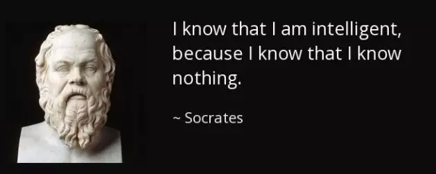
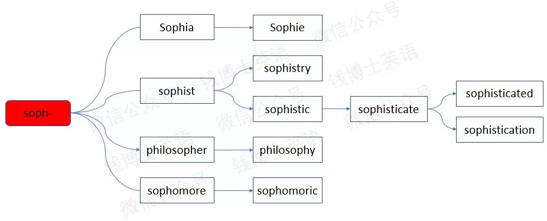

# 咬文嚼字-学科相关-Philosophy

@(TOEFL)[托福, TOEFL, 词根词缀,咬文爵字,学科相关]

[toc]

## Philosophy 形而上学（哲学）

### Meta-phys-ic

**`meta-`**在后/在..之上 + **`phys-`**物理 + **`-ic`**表形容词

> **Metaphysics is a part of philosohpy which is concerned with understanding reality and developing theories about what exists and how we know that is exists**.

**`meta-`** 表示“超过，改变，在...之后”。源自希腊语 meta "between, with, beside, after."

**`phys-`** = nature, natural science, growth, 表示“自然，自然科学，生长”。源自希腊语 phusis "growth, nature."

**metaphysics**。这个词一般翻译成"形而上学"，看起来很"雅"，[然而私以为不是很"信"](https://www.zhihu.com/question/27192923/answer/2068334212)。metaphysics，由**`meta-`**和-**`physics`**两个词根构成；meta-一般译做"元…"、"后…"，那么**metaphysics**的译名应更合适地译作"后物理学"。实际上，就其得名由来和研究领域而言，这样翻译也确实合适。这门学科的名字最初来自亚里士多德的一部著作，而这部著作被汇编在其另一著作《物理学》之后；而它研究那些无法被确定知识把握的自然的存在者(比如，因果性、substance、property in general)，也确实是继续着物理学的工作。

- > 其实形而上学出自《易经》形而上者谓之道，形而下者谓之器。这个和原文物理学之后是相对应的，个人认为是相当棒的翻译。

- 正是知道它这个出处，我才承认它确实"雅"。

- > 其实可以这么理解，物理学当时看来是研究诸多“有形有质”的客观世界、形而下的世界的，而在这“物理学”之后，就开始探讨无形无质，非常抽象的形而上领域了。这也比较好对标形而上者谓之道，形而下者谓之器的提法.

- 重要的是，没人把物理学叫形而下学，那把后物理学叫形而上学，就没有那种直观的对应关系了。没有必要从古汉语绕个圈。

- > 博主知识渊博，令人佩服，不过metaphysics这个词中的meta，刚查了下词典，发现除了有靠后的意思外，还有**Beyond**; **transcending**的意思，也就是“**超越**”的意思，**超越了物理的东西**，感觉形而上很合适。本人愚见，仅供参考。

### “形而上学”到底是什么？(熊毅 / 58.3)

> 2018-5-2

#### 道与器

“形而上学”在中文里的直接出处是《周易》，原话是“形而上者谓之道，形而下者谓之器”。这里的“形”，是形象、形状的意思。一切有形的东西都是具体的东西，比如你戴的手表，你住的房子。这些具体的、有形的东西，都属于“形而下者”，那么反过来，抽象的、无形的东西就是“形而上者”。你的手表为什么能计时，你的房子为什么能遮风避雨，**这背后都有抽象的规律在，这些规律就属于形而上的学问，也就是“道”，也就是形而上学。**

中国传统里很重视“道”和“器”的二分法。如果你的水平只停留在“器”的阶段，你的发展潜力就很有限。比如你能胜任A公司的前台工作，但把你换到B公司的前台，你就不知所措了。这就意味着，你的能力过于具体了。但如果你上升到“道”的层次，就可以举一反三、一通百通，随便换到任何一家公司的前台都能胜任愉快。如果你在“道”的层次更上一层楼，你还能掌握更抽象、更有普遍性的规律，从一家公司的前台工作领悟出待人接物的一切要领，那么哪怕让你去做一份从没做过的工作，但只要它是和人际关系高度相关的，比如治理天下，你都可以无师自通。

这就是孔子推崇的“君子不器”，这方面的榜样人物就是儒家的圣人大舜。大舜明明只是穷小子出身，既没学问又没眼界，但偏偏做什么像什么，就算突然提拔他当领导，他也能表现得好像在这个岗位上已经干了一辈子一样。如果我们来总结大舜的成功经验，就可以说他对“形而上”的知识有着超常的领悟。但是，中文里可以说“形而上”，可以说“道”，并不会说“形而上学”。

确定“形而上学”这个名称的是日本明治时代的哲学教授井上哲次郎。当时西学东渐，日本大量译介西方经典，井上哲次郎从《周易》取材，把亚里士多德的名著Metaphysics翻译成“形而上学”，意思是“研究形而上的学问的学科”。后来这部书传到中国，中国的翻译大师严复很排斥日本人的译名——这点我在第15周讲过——严复把Metaphysics重新翻译成“玄学”，结果谁也没压倒谁。今天我们读西方哲学的中译本，“形而上学”和“玄学”都是常见的词，不知道来龙去脉的话还以为这是两个不同的概念。

但无论如何，亚里士多德那部Metaphysics终于还是以井上哲次郎的译名胜出了，今天我们看到的中译本，译名基本都叫《形而上学》。不过在西方世界，Metaphysics这个书名本身的来历就是一场乌龙。公元前1世纪，学者编辑亚里士多德的遗著，把这部分手稿排在《物理学》手稿的后边，原稿并没有题目，编者也没想好该怎么取名，就暂时写上“排在《物理学》之后的若干卷”。这话是用希腊语写的，后来罗马人整理图书，用拉丁语改写成Metaphysica，这个名字后来就在西方世界沿用下来，到了英语里就变成了Metaphysics。词的前缀meta既有“在……之后”的意思，又有“超越……”的意思，学者们舍简易取深刻，Metaphysics的意思就这样从“排在《物理学》之后的若干卷”变成了“超物理学”。

这也不能全怪学者们粗心，因为这部书里讲的内容真的属于“超物理学”，诸如“存在”到底是什么，“实体”到底是什么，“一”和“多”到底是什么关系，事物存在的原因是什么，终极原因又是什么，诸如此类。这些问题如果用英文表达，就是Be和Being的问题。所以哈姆莱特最名著的台词“to be, or not to be”涵义不仅仅是“生存还是死亡”，否则就可以说成“to live, or to die”了，但中文只能这样翻译。

你肯定会问：“这不都是哲学研究的课题吗？”

#### 形而上学与辩证法

没错，这都是最基本的哲学课题，所以“形而上学”和“哲学”这两个词在有些时候可以等价互换。“哲学”这个词也是日本人借用汉语的发明，用来翻译philosophy。philosophy的词源同样要追溯到希腊语，原义是“爱智慧”。如果追溯得再早一点，希腊语的“哲学”来自“神话”，两者是同源的，甚至可以说就是同一回事，只是后来经过苏格拉底、柏拉图、亚里士多德的努力，才终于使“哲学”脱离“神话”，成为一个独立而高贵的名词。

日本当时翻译西方经典并没有什么统一的翻译标准，借用中文来表达philosophy的译名五花八门，比如有“理学”、“性理学”，让人怀疑是朱熹的书。物竞天择之下，“哲学”一词最后胜出。

所以当我们要分辨“哲学”和“形而上学”的区别，可以到philosophy和metaphysics的区别上找。显然前者的涵义更宽泛，诸如人生哲学、政治哲学，都可以归入philosophy，但不能归入metaphysics。就连自然科学原先也属于哲学，比如牛顿的名著《自然哲学的数学原理》，那些惯性定律、万有引力、行星运行轨道等等，都不是“科学”（science），而是“自然哲学”（natural philosophy）。那么牛顿当然也不是科学家了，而是一位自然哲学家。要等到牛顿死后一百多年，英语里才出现科学家（scientist）这个词。科学（science）倒是早就有了，来自拉丁语，意思是“知识”，和来自古英语的knowledge原本是同义词。

这里顺便讲一句，把science译成“科学”也是日本人借用汉语来做的。古汉语里直接就有“科学”这个词，涵义是“科举之学”。但科举为什么叫科举呢，是因为要分科考试，比如一位唐朝考生要想好该报考哪一科，明经科还是进士科。而science作为现代科学，一大特征就是学科越分越细，专业性越来越强，所以在分科之学的意义上被称为“科学”。

你可以把所有的学问想象成一棵大树，作为基础的树干肯定只有一个，而树枝越分越多。狭义上的“形而上学”曾经就是这个树干，它是更基础、更抽象、更有本原意义的哲学。正是因为这个缘故，“形而上学”也被称为“第一哲学”。如果没有坚实的“第一哲学”做基础，那么各种人生哲学、政治哲学，甚至自然哲学，就变成了空中楼阁。

比如牛顿的《自然哲学的数学原理》，第三卷的标题是“研究哲学的规则”，一共给出四大规则，其中有这么一句话：“所有物体的每一最小部分是广延的、坚硬的、不可入的，可运动的且具有惰性力，这是整个哲学的基础。”如果能请亚里士多德主义者来评价一下的话，他们应该会说：“没错，这就是形而上学。”

我再换个角度举个例子。比如我们说“己所不欲，勿施于人”是孔子教导我们的人生哲学，我们应该照着去做。但为什么要照做呢？如果你的回答是“因为照做会有好处”，那么你就沦为功利主义者了，无利不早起而已，一点都不高尚。如果你回答“因为照做的话，全社会都会变好”——中国人能回答到这一步一般就算到头了，但放到西方哲学里来看的话，你仍然是个功利主义者，你的动机不过是为了谋求世俗意义上的利益而已。再说你怎么能证明这样的结果真的好呢？还有，所谓“勿施于人”，到底谁才算人呢？奴隶算不算人？“女子与小人”算不算人？异教徒算不算人？反动派算不算人？“人”的定义在历史上从来就没有一以贯之的标准。而且，如果我们采用佛陀对“无我”的证明，完全能证明出世界上从来没有一种叫做“人”的东西。所以我们先要在第一哲学里边找到基础性的答案，比如我们发现世界是上帝创造的，上帝是至善至公的，那么我们只要按照上帝的旨意做事就好了，或者像康德那样找到所谓“定言令式”，非得如何去做不可。

最后复习一下。这一讲梳理了一下“形而上学”的概念演变，它的希腊语原义是“排在《物理学》之后的若干卷”，后来被误解为“超物理学”，等到黑格尔用辩证法和形而上学对立，后者就有了贬义色彩。

#### 形而上学的贬义化

Allelujah 朱磊

> 之所以“形而上学”在今天很多人的心目中是个贬义词，是因为许多人都是功利主义者，或者至少是想通过学习谋求更大利益的人。 而形而上学对他们来说，在谋求利益上实在是没什么帮助——虽然事实上也是这样，这门学问在一开始就不是为了追求世俗上的利益，而仅仅是为了满足“爱智慧”的思想者们。 于是占很大一部分人口比例的利益至上者们，显然会觉得学习形而上学的人都是在浪费时间。

何楟楟

> 熊老师好！ “形而上学”在今天很多人的心目中是个贬义词，主要有以下几个原因： 1、黑格尔用辩证法和形而上学对立，后者就有了贬义色彩。 2、形而上学亦被提出为是对科学以外、无形体、不可证明的事物的研究，是脱离实践的，用“孤立、静止、片面的观点”观察事物的思维方式。 3、用形而上学的观点看问题，势必导致唯心主义，原因是形而上学的孤立、静止、片面的观点不符合客观实际，并进而夸大主观的作用。 4、形而上学的命运主题与其内涵性主题一样古老。 5、在人们看来，绝大多数的形而上学问题本身是没有意义的。

mingle

> 高中政治课上是将形而上学与辩证法对立，认为形而上学是以孤立的静止的眼光看问题，辩证法是以发展的联系的眼光看问题，所以给出标准答案说辩证法就是比形而上学好，从今天文末来看，估计是黑格尔的首创，之所以有这种说法可能是形而上学的目标是追求永恒的不变的真理，这个永恒的不变的就与那些信仰世界上唯一不变的是变化的理念相冲突，加上每天见识到的亲历的活生生的变化与永恒的不变的真理至今好像也没找到，去追求那些东西好像是作无用功，所以做下了如此论断

Martin

> 中国人一般都把学问分成有用和无用。比如熊老师讲的绝大多数东西在传统中国人眼里都是垃圾。因为没有什么实际用处，既不能让你发财也不能让你做官。我小时候用零用钱买各种"闲书"来看就没少挨骂。但是事情到了今天有所变化，因为世界的复杂性越来越超乎想象，远远不是"学好数理化，就能走遍天下"的格局了。实际上在今天学好数理化顶多是成为一个萝卜一个坑的某种技师，不但走不了天下，恐怕连公司的门走出去都觉得慌。变得更复杂，是我现在学任何东西的动机，什么有用什么无用，任何人恐怕都没资格来讲了，真是三十年河东，三十年河西。

### Philosopher v.s Sophist

#### Sophist与诡辩家

希腊战胜波斯后，希腊城邦进入繁荣阶段，以雅典为代表的民主制度日臻完善。雅典民主制下的竞争主要通过辩论和演讲进行。

在这种背景下，出现了一批专门传授辩论和演讲的教师，他们自诩为**sophist**，由希腊词根**`soph-`**（智慧）和名词后缀**`-ist`**（者）组成，字面意思就是“有智慧的人、智者”。

这些人具有强烈的功利性，为了赢得个人声誉，他们利用*怀疑主义*和*相对主义*对传统观念提出挑战，虽然在一定程度上促进了古希腊哲学的发展，但对哲学的根基带来了严重损害，因为他们否定存在确定的真理标准，对一切都表示怀疑和反驳，以达到驳倒对方的实用目的。他们虽然有智慧，却拿来作为达到实用目的之手段。因此，后人往往将**sophist**翻译成“**诡辩家**”。

单词**sophist**衍生出了不少派生词。

- 它后面加上抽象名词后缀**`-ry`**，变成**sophistry**，字面意思是“诡辩家的专业技能”，也就是“诡辩、诡辩法”。类似的单词还有**artistry**（艺术性、艺术家的专业技能）。

- **sophist**后面加上形容词后缀**`-ic`**，变成形容词**sophistic**，意思是“**诡辩的，强词夺理的**”。

- 这个单词后面还可以继续添加动词后缀**`-ate`**，变成**sophisticate**，它的本意是“***诡辩、强词夺理”***，引申为“使某件事变得复杂，使某个人变得世故”。它还可以转作名词，表示“世故的人”。

- 我们更熟悉它的派生词**sophisticated**，在后面加了一个**`-ed`**，形容事物时意思是“***复杂的，巧妙的，先进的***”，形容人时意思是“***世故的，精明老练的，见多识广的***”。

- **sophisticate**还派生出动名词**sophistication**，意思是“复杂、巧妙，精明老练，世故”。

#### 苏格拉底的反击

古希腊最有名的哲学家苏格拉底特别瞧不起那些诡辩家，把他们斥为“批发或零售精神食粮的商人”。苏格拉底对**sophist**这个称谓特别反感，觉得这帮人特别狂妄无知。他曾经说过，“认识自己的无知就是最大的智慧”，“我只知道一件事，那就是我什么也不知道”，“我不是一个智慧的人，我只是一个爱智慧的人”。

因此，苏格拉底将自己称为**philosopher**，意思是“爱智慧的人”，第一个词根**`philo-`**表示“爱”。从此以后，人们就将哲学家称为**philosopher**，将“哲学”称为**philosophy**。不过**philosopher**这个单词并不是苏格拉底创造的，而是比他更早的一位哲学家毕达哥斯拉首次创造的。只不过苏格拉底名气更大，把这个称呼发扬光大了。

#### Sophomore 二年级学生

在西方大学，二年级的学生被称为**sophomore**。这个词常常被人通俗地解释为**`sopho`**+**`more`**，前一部分表示“智慧、聪慧“，后一部分表示”愚蠢“，和单词**moron**（笨蛋）同源。整个单词的意思就是”有点聪明，又有点愚蠢“。这是不是挺符合大二学生的特点？自以为自己聪明，其实还是一个笨蛋。

词根**`soph-`**来自希腊语，意思是“**智慧**”。常见的女子英文名**Sophia**（索菲娅）就来自这个希腊词根，意思是“***有智慧的女人***”。

#### 法兰西的玫瑰

另一个常见名字**Sophie**（苏菲）和**Sophia**（索菲娅）同源，其实就是它的法语变体形式。叫这个名字的名人有法国著名女演员[苏菲·玛索（Sophie Marceau）](https://en.wikipedia.org/wiki/Sophie_Marceau)，被誉为“法兰西玫瑰”。

#### 词根

#### 相关单词

- **Sophia**：['səʊfɪə]n. 索菲娅（女子名）
- **Sophie**：[ˈsəʊfi]n. 索菲（女子名）
- **sophist**：[ˈsɒfɪst] n.诡辩家；诡辩派；智者
- **sophistry**：[ˈsɒfɪstri]n. 诡辩；诡辩法
- **sophistic**：[sə'fistik]adj. 强词夺理的；诡辩的
- **sophisticate**：[səˈfɪstɪkeɪt]vt. 使变得复杂；使变得世故；曲解vi. 诡辩n. 久经世故的人
- **sophisticated**：[səˈfɪstɪkeɪtɪd]adj. 复杂的；精致的；久经世故的；富有经验的
- **sophistication**：[səˌfɪstɪˈkeɪʃn]n. 复杂；诡辩；老于世故
- **philosopher**：[/fəˈlɒsəfə(r)]n. 哲学家；哲人
- **philosophy**：[fəˈlɒsəfi]n. 哲学；哲理
- **sophomore**：[ˈsɒfəmɔː(r)]n. 高中或大学的二年级生
- **sophomoric**：[ˌsɒfəˈmɔːrɪk]adj.二年级生的；一知半解的

#### Reference

1. [词源趣谈 | sophist（有智慧的人）和philosopher（爱智慧的人），谁更有智慧？--钱博士英语](https://mp.weixin.qq.com/s/bkIvQ1tZH21MaruRBlb78g)

### cynic

> **`cyn-`** = dog, 表示“狗”，源自希腊语。
> **`-ic`** 表名词，“人或学科”。

**`cyn-`** = dog, 表示“狗”，源自希腊语。

| 单词       | 解释        | 单词           | 解释   |
| ---------- | ----------- | -------------- | ------ |
| cynic      |             | cyno-cephal-us |        |
| cyno-logy  | 犬类学;犬学 | cyno-phobia    | 恐犬病 |
| cynos-ure  |             | ken-n-el       |        |
| quins-i-ed |             | quinsy         |        |

#### cynic- 犬儒派（古希腊哲学学派）

**cynic -** 公元前4世纪希腊有一个哲学学派叫犬儒学派，希腊文作Kynikós/Kunikós，意思是snarlers（嗥叫的狗）。

该派名称为何会与犬相联系呢？据有关资料记载，得名来由有二：

1. 其创始人苏格拉底的门徒安提西尼（Antisthenes）在雅典城外一个以Cynosarges（白犬）为名的体育馆中讲学；
2. 此派中人生活刻苦，不修边幅，举止粗鲁，故人们讥之为kýōn/kúōn（犬）。

犬儒学派把名利看作身外之物，认为社会生活和文化生活是不自然的，无足轻重的；提倡克己自制，独善其身而无所求，鄙视金钱和享受，认为这就是美德。

他们所抱的这种愤世嫉俗、玩世不恭的态度反映了城邦贫民和被剥夺了部分权利的自由民对大奴隶主骄奢淫侈生活的消极反抗。

英语**cynic**一词正是源于希腊语Kynikós/Kunikós，由拉丁语***cynicus***演变而来，在16世纪原指“犬儒学派哲学家”，以后由专有名词转化为普通名词，意指“愤世嫉俗者”、“玩世不恭的人”、“好挑剔挖苦的人”、“怀疑人之真诚或善意的人”等

从**cynic**派生的形容词**cynical**，有时也带贬抑含义，表示“愤世嫉俗的”或“冷嘲热讽的”。

例

- A cynic attributes selfish motives to all acts. (FWF) 愤世嫉俗者认为一切行为均有自私的动机。
- He's too much of a cynic to believe that we'll keep our promise. 他太怀疑世间的一切，不相信我们会信守诺言。
- "What is a cynic? A man who knows the price of everything and the value of nothing." (Oscar Wilde, Lady Windermere's Fan) “什么样的人是愤世嫉俗者？他知道一切东西的价格，却不知任何一件东西的价值。”（王尔德《温德梅尔夫人的扇子》）
- Since her divorce she's become very cynical about men. (LDC) 离婚后，她对所有的男人都采取讥讽的态度。

------------------

#### cynic（愤世嫉俗的）：对他人行为动机的恶意揣测

单词cynic源于古代希腊的一个哲学流派“犬儒主义”（Cynicism）。

- 人们一般认为犬儒主义是**苏格拉底**的弟子安提斯泰尼（Antisthenes）创立的
- 另一人物第欧根尼（Diogenēs）则因住在木桶里的怪异行为而成为更有名的犬儒主义者。

犬儒主义者行为怪诞，放浪形骸，因此在希腊语中被称为kynikos，意为dog-like（像狗一样的），源自希腊语kyno（dog）。英语单词**cynic**就源自希腊语kynikos。但也有人认为，**cynic**一词源自安提斯泰尼讲学所在的一座体育馆的名字Kynosarge（gray dog，灰狗）。

犬儒主义宣扬人要摆脱世俗的利益而追求唯一值得拥有的善，精神上的幸福快乐才是真的的快乐满足。随着犬儒理念的流行，犬儒主义的内涵发生了微妙的根本变化。早期的犬儒主义者是根据自身的道德原则去蔑视世俗的观念；后期的犬儒主义者依旧蔑视世俗的观念，却丧失了赖为准绳的道德原则，从愤世嫉俗就变成了玩世不恭。

现在，人们通常将“犬儒主义”定义为一种带着***厌倦情绪的负面态度***，对于他人行为的动机与德性都采取一种不信任和嘲弄的态度，认为人的一切行为都是自私自利驱使的。这也是cynic这个单词在现代的主要含义。

- cynic：['sɪnɪk] adj.犬儒学派的n.愤世嫉俗者，犬儒学派的人
- cynical：['sɪnɪk(ə)l] adj.愤世嫉俗的，冷嘲热讽的，挑剔讽刺的
- cynicism：['sɪnɪsɪz(ə)m] n.犬儒主义，玩世不恭，愤世嫉俗，冷嘲热讽

## 其他

### yoga（瑜伽）：追求“合一”的修行方式

> yoga是印度的一种传统修行法，强调调息和静坐，以解除精神紧张，修身养性，在英国常被视为一种健身法。yoga一词系借自梵文，原义为‘union, the uniting of the self with the universe’（结合，自我与宇宙合一），汉语“瑜伽”乃yoga之音译。

**yoga**（瑜伽）起源于印度，一种达到身体、心灵与精神和谐统一的运动方式，包括调身的体位法、调息的呼吸法、调心的冥想法等。

英语单词**yoga**来自梵语***yoga-s***，其含义是“一致”、“结合”或“和谐”，而后者又来自原始印欧语词根**`yeug-`**（结合）。

> 来自梵语 yoga,连接，天人合一，来自 PIE*yeug,连接，词源同 join,joke.原指一种精神修行方法，以达到灵魂与天的合一，但后来越来越忽视了精神层面的锻炼，而注重于身体的柔和，手脚合一。

所以**yoga**一词的字面意思就是“合一”，这正是瑜伽运动的宗旨，即身心合一和天人合一。

与**yoga**同源的单词还有**yoke**（轭）、**jugular**（颈部的）

- **yoga**：['jəʊgə] n.瑜伽
- **yoke**：[jəʊk] n.轭，束缚v.结合，上轭
- **jugular**：['dʒʌgjʊlə] 
  - adj.颈部的，咽喉的，颈静脉的
  - n.颈静脉

- (区分）**yogurt**【ˈjoʊɡərt】n. 酸乳酪 (来自土耳其语。)

