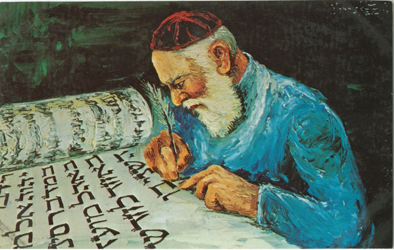
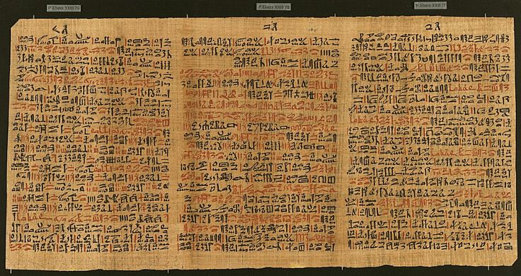
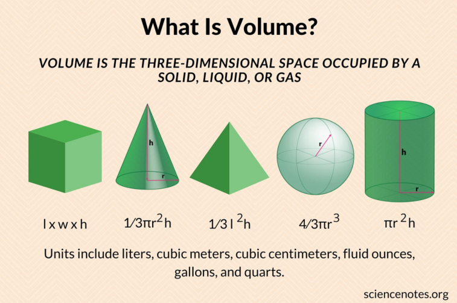
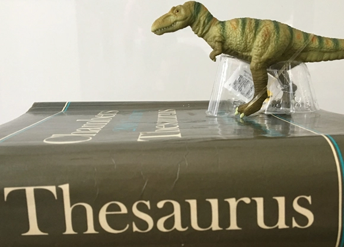
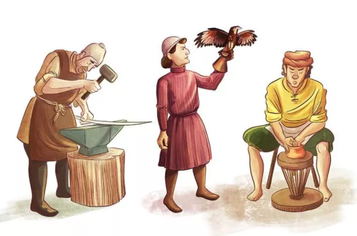
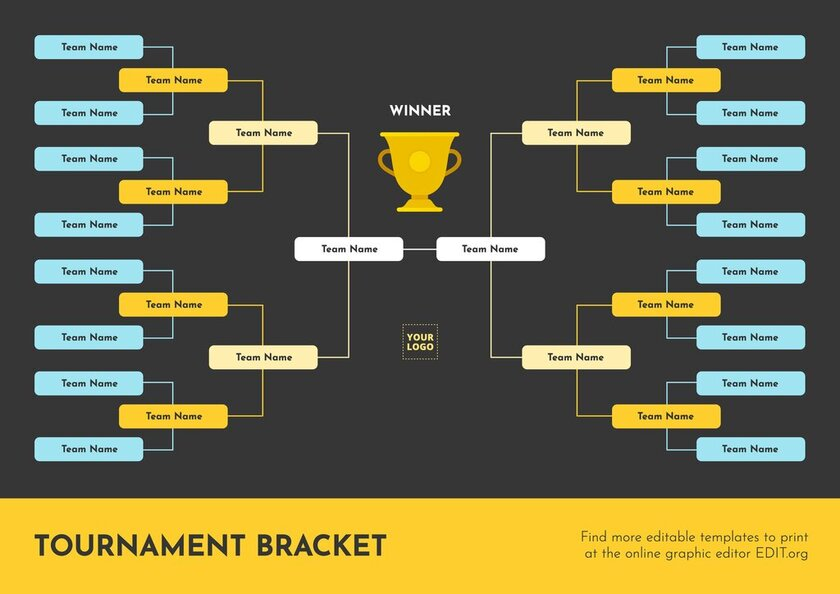
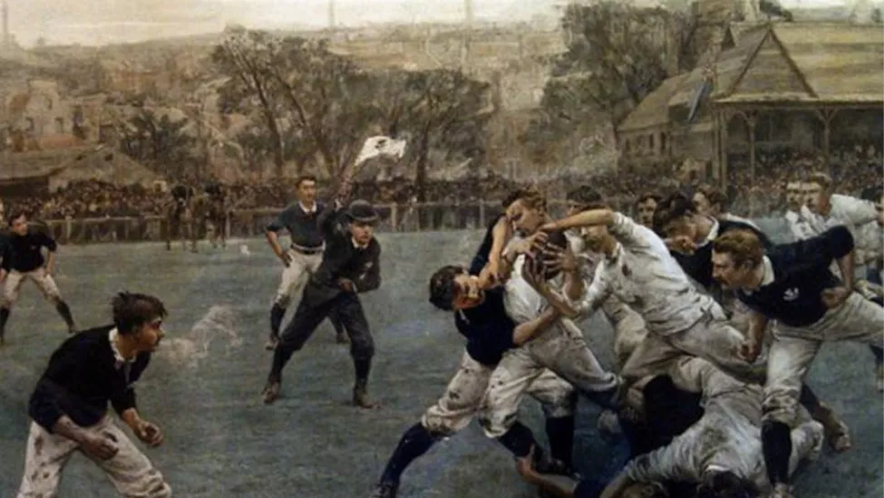

# 咬文嚼字-学科相关--学校学院

@(TOEFL)[托福, TOEFL, 词根词缀,咬文爵字,学科相关]

[toc]

## 拉丁

### -a: 由希腊语和拉丁语直接进入英语的表示复数的后缀

| 单词                                                 | 解释                                                         | 单词                                | 解释                                                         |
| ---------------------------------------------------- | ------------------------------------------------------------ | ----------------------------------- | ------------------------------------------------------------ |
| **cnidaria** 【naɪˈderɪə】                      | an alternative name for the invertebrate phylum(无脊椎动物门的另一个名称) | **cnidarian** 【nɑɪ'deəri:ən】 | 腔肠动物;刺细胞动物;刺胞动物;动物门;胞动物 radially symmetrical animals having saclike bodies with only one opening and tentacles with stinging structures 放射状对称的动物，囊状身体只有一个开口，触手有刺状结构 |
| **criteria** 【kraɪ'tɪriə】 **crit-eri-a** | crit-  = judge, discern, 表示“判断，分辨”。源自希腊语 krinein "to separate, decide, judge." 标准;(评判或作决定的)准则;原则 | **criterion** 【kraɪˈtɪriən】  | a standard or principle by which sth is judged, or with the help of which a decision is made （评判或作决定的）标准，准则，原则 criteria的单数形式 |
| arcan-a                                              | 奥法 深奥的知识  acranum的复数形式                           | acranum                             |                                                              |
| bacteri-a                                            |                                                              |                                     |                                                              |
| data                                                 |                                                              |                                     |                                                              |
| medi-a                                               |                                                              |                                     |                                                              |
| quant-a                                              |                                                              |                                     |                                                              |
| ag-end-a                                             |                                                              |                                     |                                                              |
| pheno-men-a                                          |                                                              |                                     |                                                              |
| real-i-a                                             |                                                              |                                     |                                                              |
| addend-a                                             |                                                              |                                     |                                                              |
| regal-i-a                                            |                                                              |                                     |                                                              |
| **al-luv-ia** 【əˈluːviəm】                     | pl.【地】冲积层；冲积土 alluvium的复数。                | **al∙luv∙ium**  【əˈluːviəm】  | al-  来自拉丁介词ad, 表示“朝、向、去，或弱化为强调”。在字母 b, f, g, l, n, p, r, s, t 前同化为 ab-, af-, ag-, al-, an-, ap-, ar-, as-, at-；在 c, k, qu 前同化为 ac-；在 sc, sp, st 前缩写成 a-. luv-  = wash, 表示“洗，冲洗”。源自拉丁语 lavere "to wash," lavare "to wash." a fine-grained fertile soil consisting of mud, silt, and sand deposited by flowing water on flood plains, in river beds, and in estuaries |

###  -us 阳性后缀 与 -a 阴性后缀

- **冷知识1：-us 在拉丁语中表示 阳性名称 后缀**

  **alumnus**末尾的**`-us`**是拉丁语中的***阳性名词***后缀，因此这个单词只能表示男校友，不能表示女校友。女校友应该称为**alumna**，末尾改用***阴性名词***后缀**`-a`**。**

  **alumnus**（男校友）的复数形式是**alumn`i`**，而**alumna**（女校友）的复数形式是**alumn`ae`**。如果既有男的又有女的，复数形式一般用**alumni**。

- **冷知识2：-a 在拉丁语中表示 阴性名词 后缀**

| 阳性    | 解释                                                         | 阴性         | 解释                                                         |
| ------- | ------------------------------------------------------------ | ------------ | ------------------------------------------------------------ |
| theos   |                                                              | theia / thea | 忒伊亚（视力女神）的名字（**Theia** 或 **Thea**）在希腊语中就是“女神”的意思，是 **theos**（神）的阴性名词形式，英语词根 **`the-`**/**`theo-`**（神）与其同源。 |
| alumnus | 男校友                                                       | alumna       | 女校友                                                       |
| Faunus  | 法乌努斯，（古罗马的）男牧神                                 | Fauna        | 女牧神                                                       |
| /       |                                                              | Hydra        | 九头蛇                                                       |
| Hero    | heros（hero，保护者） n. 英雄；保护者；男主角，男主人公 | Hera         | 希腊语中的含义是“女主人、女保护者”， 是 heros（hero，保护者）的阴性名词形式。 与英语单词 hero（英雄）同源。 |
|         |                                                              | Juno Moneta  | 警告者朱诺。                                                 |
|         |                                                              | Parca        | 复数为Parcase, the Roman goddesses of fate 命运三女神 (Greek counterparts the Moirai) |
| Bellum  | 拉丁语 战争                                                  | Bellona      | 拉丁语 战争 的阴性名词形式                                   |

**Reference:**

1. Reference: [词源趣谈：如何低调地表示自己是某名校的毕业生？](https://mp.weixin.qq.com/s?__biz=MzA4NTQ4NzIzNg==&mid=2651801070&idx=1&sn=871a03c4e7e076d7025f2ffa125bf1a9&chksm=842cde05b35b5713efbe1742d596d74bb2b611608485355b8bad7da7068be8847a94cc200d09&scene=178&cur_album_id=1297162942844207107#rd)

## 学院学校

### academy  （学院): 帮助寻回海伦的农夫阿卡德摩斯

在希腊神话传说中有一位绝世美女海伦，是宙斯和斯巴达王后勒达所生。当她还是一名少女的时候，来自雅典的英雄忒修斯与朋友偶然在神庙中看见海伦跳舞。两人惊为天人，就闯进神庙将海伦劫走。两人决定扔骰子来确定海伦的归属，并约好赢的人要帮输的人再去抢个妻子。

结果忒修斯抽中了，于是忒修斯把海伦带回老家，嘱咐母亲好生照顾。然后，两个好朋友再次出发去作采花大盗。这回他们看上了冥王的妻子珀耳塞福涅(***Persephone***)，可惜行动失败，被冥王关押在冥府中。后来另一个英雄赫拉克勒斯在冥府遇到他们俩，救出了忒修斯一人。

海伦的两个哥哥率人四处寻找海伦。他们来到雅典，要求雅典人归还自己的妹妹。但雅典人说不知道海伦在哪里。两兄弟威胁要动用武力。

正在这危急时刻，一个名叫阿卡德摩斯（**Akademos**）的农夫站出来告诉了海伦的位置。两兄弟很快就夺回了自己的妹妹，而**Akademos**也因为使雅典避免了一场战争而成为英雄，得到神灵的庇佑，他的橄榄树林年年丰收。这片橄榄树林也因此得名**Akademeia**，意思是“Akademos的果园”。

后来，希腊大哲学家柏拉图在这片橄榄树林里创建了学园。人们将他的学园也称为**Akademeia**。英语单词`academy`就来源于柏拉图创建的**Akademeia**学园，原本专指柏拉图所创建的学园，但后来词义进一步扩充，泛指各种学术研究性机构。

- academy：[ə'kædəmɪ] n.学院，研究院，学会，专科院校
- academic：[ækə'demɪk] adj.学术的，学院的，理论的n.学者，大学教师，大学生

### pedagogue（教师）：小孩上学放学的带路人

> ped- 
> = child, education, 表示“儿童”，引申为“教育”，英式英语中品写成paed-。源自拉丁语 pais (词干 paid-) "child."
> agogy- 
> = lead, 表示“引导”。源自希腊语 agein "to drive, lead, weigh."

在古希腊的雅典，儿童从7岁就要开始进入学校接受教育。由于年龄尚幼，还不记得上学和放学回家的道路，通常需要家里的奴隶或卫士领着去学校或回家。这些给学童带路的人就是**pedagogue**。

这个英语单词来自希腊语，与**`ped`**(kid，儿童)+ **`agogos`**（lead，带领）构成。后来，这些人还负责督促儿童学习。因此，pedagogue逐渐衍生出“教师”的含义。

- **pedagogue**： ['pedəgɒg] n.教师，教员，卖弄学问的人，等于pedagog
- **pedagogy**： ['pedəgɒdʒɪ; -gɒgɪ]n.教育，教育学，教学法
- **pedagogic**：[,pɛdə'ɡɑdʒɪk] adj. 教师的（等于pedagogical）；教育学的；教授法的
- pedant:学究；迂夫子
- pedantic: 迂腐的；学究式的
- pedantry: 迂腐；卖弄学问

在古希腊，富有人家未成年的公子常有一名机灵能干的奴隶负责照顾，公子上学或外出时都由这名奴隶随侍。希腊语称这种奴隶为paidagōgós，字面义是boy-leader（带领男孩者），由paîs 'boy'和agōgós 'leader'合成。

14世纪该词经由拉丁语（paedagōgus）进入英语，词形演变为pedagogue（美国英语作pedagog）。英语的pedagogue所取的是“带领者”一义，这其中自然包括功课有不懂的地方从旁指点，故最初被赋予“教师”一义。

嗣后，词义贬降为“学究”或“过分拘泥于条条框框的老师”。16世纪从pedagogue衍生出pedagogy（教育学；教学），17世纪又进而派生出pedagogical（教学法的），两个词都不再带贬抑含义。

与**pedagogue**同义的**pedant**（学究；迂夫子）虽然在词源上很可能多少有些联系，但却是借自法语pédant，源自意大利语pedante（教书先生）。和pedagogue不同的是，**pedant**的派生词**pedantic**（迂腐的；学究式的），**pedantry**（迂腐；卖弄学问）仍带有贬义。

例

- The old-fashioned teacher dismissed modern methods of pedagogy. (NED) 这位老派教师不接受现代教学法。
- He is something of a pedant when it comes to intellectual argument. 在学术争论一事上，他多少有点学究气。
- Pedantry proceeds from much reading and little understanding. 迂腐出自于读得多而懂得少。
- There was a hint of pedantry in his elegant style of speaking. (CID) 他讲话时那种优雅的风格有点故意卖弄的意味。

### [alumni](https://en.wikipedia.org/wiki/Alumnus) [əˈlʌmnaɪ]

> the former male and female students of a school, college or university. e.g: Harvard Alumni Association (哈佛大学校友会)

|                                     |                                                              |                                            |                                                              |
| ----------------------------------- | ------------------------------------------------------------ | ------------------------------------------ | ------------------------------------------------------------ |
| **alumnus** 【əˈlʌmnəs】       | **`al-,ol-,ul-`**  = to feed, nourish, grow, 表示“喂养；滋养；使生长”。源自拉丁语 alere "nourish," alumnus  校友 | **alumna**                【əˈlʌmnə】 | feminine。                                                   |
| **alumni**  【əˈlʌmnaɪ】       | for men and mixed groups                                     | **alumnae**  【əˈlʌmˌneɪ】            | for women                                                    |
| **aluminium** 【ˌæljəˈmɪniəm】 | **`alum-:`** 表示"明矾、铝”，铝最初提取自矾土。 （铝）：从矾土中提炼出来的金属物质 | **alumina**  【əˈluːmɪnə】            | 矾土（alumina）是一种氧化铝矿石，是炼铝的主要原料，因为外形类似矾（alum）而被称为alumina。 |

在中文中，从某个学校毕业的学生常常被称为该校的“校友”。那么，在英语中，该如何表示“校友”呢？是school friends吗？当然不是！在英语中，“校友”被称为**alumnus**。它直接来自拉丁语，由:

- 词根**`al-`**（滋养、抚养）
- 连接字母**`u`**
- 完成分词后缀**`mn`**
- 名词后缀**`us`**

组成字面意思就是被抚养的人，也就是“养子”。

为什么西方的“校友”被称为“养子”呢？原来，西方古时候没有学校。为了培养孩子，有些家长会把孩子送到各行业的大师那里，拜他为师。我们中国有句古话，一日为师终身为父。在西方也一样。拜了师傅后，就要住在师傅家里，作为徒弟在师父身边成长并接受教育。这些学徒在拉丁语中被称为**alumnus**（养子）。因此，**alumnus**一词就逐渐产生了“**学生、徒弟**”的含义。

现在虽然有了学校，学生无须住到老师家里去，但出于对母校的感激之情，学生毕业后依然自称为**alumnus**。可以翻译为“校友”或“毕业生”。比如

> Our school has received a large donation from a wealthy alumnus. 我们学校收到一位土豪校友的大笔捐款。
>
> President Kennedy was an alumnus of Harvard university. 肯尼迪总统是哈佛大学的毕业生。

####  Legacy admissions

[Legacy admission](https://en.wikipedia.org/wiki/Legacy_preferences) is giving an advantage to someone who has an arbitrary privilege of their parent having attended the university to which they're applying. （Alumni Status）

**Digested from [Wikipedia](https://en.wikipedia.org/wiki/Legacy_preferences):**

>  **Legacy preference** or **legacy admission** is a preference given by an institution or organization to certain applicants on the basis of their familial relationship to [alumni](https://en.wikipedia.org/wiki/Alumni) of that institution, with college admissions being the field in which legacy preferences are most controversially used. Students so admitted are referred to as legacies or legacy students. Legacy preferences in college and university admissions are particularly widespread in the [United States](https://en.wikipedia.org/wiki/United_States); almost three-quarters of research universities and nearly all liberal arts colleges grant legacy preferences in admissions.[[1\]](https://en.wikipedia.org/wiki/Legacy_preferences#cite_note-1)

### cafeteria (医院、高校、商场等的)自助餐厅,食堂

> cafe∙teria  [词根树]
> -**teria** 
> = an inexpensive shop. 表示“小商店”，来自西班牙语。

**cafeteria** 【ˌkæfəˈtɪriə】 - 相传在公元850年，一位名叫Kaldi的阿拉伯牧羊人发现他的羊群行为异常，感到很困惑。以后他注意到他的羊在啃食一种干果仁，于是决定亲自尝一尝。他吃了之后，有一种心旷神怡之感。他非常激动，便冲下山去把这事告诉了别的牧羊人。

不久，阿拉伯人学会了把这种干果仁弄干再加以煎煮的方法，他们把调制成的饮料叫做qahwah（该词含有“酒”之意）。qahwah的饮用立即在穆斯林中间引起一阵巨大的骚动。按伊斯兰教教义，伊斯兰教徒是不准饮酒的。

一些教徒为使自己在冗长不堪的祈祷仪式中不致困倦，便饮用qahwah来提神。而另一些教徒则认为qahwah既然有兴奋作用，可视为酒类饮料，自然应在禁饮之列。然而同样信仰伊斯兰教的土耳其人却不理这一套，欣然接受了该饮料，并称之为kahve。

以后传入法国，作**café**，英语**coffee**可能是从意大利语caffè演化过来的，汉语则译为“咖啡”。

另有一说认为coffee源自埃塞俄比亚南部一个古代王国Kaffa，那里曾被誉为“咖啡的故乡”。

**词源：**

- 英语中意为“咖啡馆”或“小餐馆”的**café**/**cafe**和**coffee**同出一源，但它直接借自法语**café**（咖啡）。
- 另有一个英语词**cafeteria**（自助餐厅）和**coffee**也有亲缘关系，它源自西班牙语**cafetero**（咖啡店），但终极词源仍是阿拉伯语qahwah。

**例句：**

- Would you rather have fresh coffee or instant? (CID) 你要现磨的咖啡还是速溶咖啡？
- An inviting smell of coffee wafted into the room. (OCD) 诱人的咖啡香味飘进房间。
- He took a sip of his coffee. (OCD) 他喝了一小口咖啡。

### university（大学）：中世纪欧洲的学术公会

英语单词**university**所代表的现代大学源自欧洲的中世纪大学。在中世纪时期，欧洲教会成为古代文化的主要承担者和传播者。在12、13世纪期间，一些教会牧师走上街头，向民众宣讲自己的研究心得，成为最早的讲师。

其中那些富有真知灼见而又口才出众的讲师周围逐渐聚集了一批学生，定期前来听课。一些知名大教堂所在地区形成了知名的学术中心，拥有多名教师和数百名学生。

随着人数的增加，为了保障自己的权利，教师和学生自发组成一种类似于行业协会的公会，明确双方的权利义务。这种公会在拉丁文中被称为“universitas magistrorum et scholarium”，意思是“community of masters and scholars”（专家学者社团），简称universitas，意思是“团体、集合体”，源自universus（整体，英语单词universe的来源），1228年在教皇颁布的敕令首先使用。这就是英语单university的来源。

- university：[juːnɪ'vɜːsɪtɪ] n.（综合性）大学
- universe：['junɪvɝs] n.宇宙，世界
- universal： ['jʊnə'vɝsl] adj. 普遍的；通用的；宇宙的；全体的n. 一般概念；普通性

### dis-cip-l-ine 【ˈdɪsəplɪn】 （纪律）：纪律严明的古罗马教育

> dis-分开 + cip-抓住 + -l- + -ine。引申词义训练，必要的纪律，惩罚。

**`dis-`** 来自拉丁语dis-，表示“分开，散开”，引申词义“离开，无，没有，缺乏，表相反等”。该前缀在字母 g, l, m, r, s, v 前缩写为 di-；在字母f前同化为 dif-。

**`cip-`** = take, hold, seize, 表示“拿，抓，握住”。源自拉丁语 capere "to take, seize, catch."

古罗马人以纪律严明著称，古罗马军队之所以拥有强大的战斗力，一个主要原因就是士兵们能够严守军纪。古罗马人的纪律性是从儿童教育阶段就开始培养、锻炼出来的。古罗马人认为，教育不仅仅是传授知识，更重要的是磨练意志、培养学生吃苦耐劳、遵守纪律等各项优良品质，因此在教学活动中往往融合对学生的意志和纪律的培养，普遍采用体罚手段。

英语单词**discipline**来自拉丁语***disciplina***，指的就是古罗马的这种教育，字面意思是“**指导、教学”**，由此延伸出“**学科**”之意。由于古罗马的教育强调纪律和惩戒，因此**discipline**又产生了“**纪律、磨练、管教**”的含义。与它同源的单词有**disciple**（门徒、弟子）。

- discipline：['dɪsɪplɪn] 
  - n.学科，纪律，磨练，管教，惩罚
  - vt.训练，寻到，惩戒
- indiscipline：[ɪn'dɪsɪplɪn] n. 无纪律；缺乏训练；无纪律行为
- disciplinary：['dɪsəplənɛri] adj. 规律的；训练的；训诫的
- disciple：[dɪ'saɪp(ə)l] n.门徒，弟子

### Diploma （证书）：古罗马给服役期满的蛮族雇佣军颁发的绿卡

在古罗马时期，当一个蛮族雇佣军在罗马军队中服役25年（海军26年）后，即可获得罗马公民权利。为此，罗马政府将为其提供一个凭证，就像现在的美国绿卡一样。

这个凭证就是所谓的Roman Military Diploma（罗马军事证书）。它由两片铜片构成，里面刻有持有人的相关信息，还有政府的烙印。铜片上留有小孔，可以用铜丝穿过小孔，把它们对折起来。

单词**diploma**来自古希腊语diploma，由diploun （对折）和oma（物品）构成，字面意思就是“可以对折的物品”。古罗马人也使用**diploma**一词来表示这种可以对折的铜片证书。拥有这种证书的蛮族人，可以在罗马帝国的道路和边境自由通行。

后来，**diploma**进入英语，词义得到扩展，可以表示政府颁发的各种证书，如大学的文凭。

十八世纪，法国人开始称呼他们与外国打交道的官员为diplomat，也就是“持有diploma的人”。这个单词后来也进入了英语，还衍生出diplomatic（外交的）和diplomacy（外交）等词。

- diploma：[dɪ'pləʊmə] n.证书，文凭，公文
- diplomat：['dɪpləmæt] n.外交官，外交家
- diplomatic：[,dɪplə'mætɪk] adj.外交的，老练的
- diplomacy：[dɪ'pləʊməsɪ] n.外交
- diploid：['dɪplɒɪd] adj. 双倍的；倍数的；双重的n. 二倍体；倍数染色体

例句：　

- I'm hoping to get my teaching diploma this year. (LDC) 我希望在今年获得教师证书。
- Are you on the degree course or the diploma course? (CCE) 你是攻读学位还是为取文凭？
- It's hard to find a good job if you don't have a high school diploma. (CAE) 你要是没有高中毕业文凭，很难找到好工作
- Diploma holders have a far better chance of employment than those with no qualification. (OCD) 持有文凭的人比无证书者有更多更好的就业机会。

**credentialism**

### investigate v.s invest

> in∙vestig∙ate  [词根树]
> in- 
> 来自拉丁语in-，表示“在内，进入，使...”。
> vestig- 
> = foot print, track, 表示“脚印，踪迹”。
> -ate 
> 表动词，“做，造成”。

**invest（投资）：给财富换上神奇的衣服**

17世纪初期，西方的英、法、荷等国纷纷向东半球开展殖民扩展，并设立多家“东印度公司”负责殖民地的经贸事务，实际上是西方列强侵略盘剥印度等地的工具。1602年，荷兰联合东印度公司成立。它采取了一种全新的企业组织形式——股份制，即通过向全社会融资来筹集资金。1609年，在荷兰的阿姆斯特丹成立了世界上第一家股票交易所。

当时，东印度公司成了国家的摇钱树，源源不断地从东方带来巨大财富。在海外财富的刺激下，成千上万的人把自己的积蓄投入给东印度公司，希望将来能获得丰厚的回报。甚至，阿姆斯特丹市市长的女仆也成了东印度公司的股东之一。正是在这种背景下，invest这个原本与金融毫无关系的单词衍生出了“投资”的含义。

英语单词invest来自investire，本意是“穿上正式的制服”，由**`in`**（进入）+**`vestire`**（衣服）构成，英语单词vest（背心，汗衫）就源自vestire。

人们将手中的钱换成东印度公司股票时，就像是给财富换上了一件神奇的衣服，一件可以带来滚滚财源的衣服，所以人们用invest这个单词来比喻这种购买股票的投资行为，invest也就产生了“投资”的含义。

有趣的是，股票交易所中的交易员都身穿马甲（**in vest**）。

- **invest**：[ɪn'vest] v.投资，投资于；覆盖，包围
- **investment**：[ɪn'ves(t)m(ə)nt] n.投资，投入，封锁
- **investor**： [ɪn'vɛstɚ] n. 投资者
- **vest**： [vest] 
  - n.背心，汗衫，马甲
  - vt.授予，使穿衣服
  - vi.归属，穿衣服
- **investiture**：[ɪn'vɛstətʃɚ] 
  - n. 授职仪式；授权仪式；
  - 装饰或覆盖物

 **investigate（调查）：利用脚印来调查罪案** 

通过脚印来追踪罪犯、勘探罪案的做法早已有之。英语单词**investigate**的词源就体现了古代这种查案手法。

它源自拉丁文investigare，其中in=into，表示“循着”，vestigare源自vestigium（脚印、痕迹），表示“跟踪”，所以investigate的字面意思就是“循着脚印跟踪、探究”。英语单词vestige（遗迹）同样源自拉丁文vestigium（脚印、痕迹）。

- **investigate**： [ɪn'vestɪgeɪt] v.调查，研究
- **investigation**： [ɪn,vestɪ'geɪʃ(ə)n] n.调查，研究
- **investigator**：[ɪn'vɛstɪɡetɚ] n. 研究者；调查者；侦查员
- **vestige**： ['vestɪdʒ] n.遗迹，残余，退化的器官
- **vestigial**： [ve'stɪdʒɪəl; -dʒ(ə)l] adj.残余的，退化的，发育不全的

## 书卷

### scribe （写）：古代用铭刻的方式来写字

> 1 - 来自拉丁语 scribere,写，来自 PIE*skribh,刻，划，扩大形式自 PIE*sker,砍，切，削，词源同score,shear,scrabble.引申词义抄书匠，抄书吏。

古代，在墨水发明之前，人们都是用铭刻的方式来写字的，即用尖刻之物在竹简、木板、泥版、蜡板等书写材料上刻画。

所以在英语单词中，表示“写”的单词**scribe**及由此衍生的词根**`scribe-`**还含有“刻”的含义。如**inscribe**，既表示“题写”，也表示“铭记”。

英语单词**scribe**来自拉丁语***scribere***，本意是“刻”。与它同源的单词有：**script**（脚本）、**prescribe**（开处方）、**describe**（描述）、**manuscript**（手稿）等。

而英语中表示“写”的更常用单词**write**来自古日耳曼语，本意是**scratch**（刮擦）。

- **`scrib-`**/**script**：写，刻
- **scribe**：[skraɪb] 
  - v.写，记，划
  - n.抄写员，作家，划线器
- **script**：[skrɪpt] 
  - n. 脚本；手迹；书写用的字母
  - vt. 把…改编为剧本
  - vi. 写电影脚本
- **inscribe**：[ɪn'skraɪb] vt.题写，铭记，铭刻
- **inscription：n**.题词，铭文，刻印
- **prescribe**：[prɪ'skraɪb] vi. 规定；开药方vt. 规定；开处方
- **prescription**：[prɪ'skrɪpʃən] 
  - n. 药方；指示
  - adj. 凭处方方可购买的
- **describe**： [dɪ'skraɪb] vt. 描述，形容；描绘
- **description**：[dɪ'skrɪpʃən] n. 描述，描写；类型；说明书
- **manuscript**： ['mænjuskrɪpt] 
  - n. 手稿；原稿
  - adj. 手写的

### papyrus 古埃及用纸莎草制造的纸

古埃及人广泛使用莎草纸作为书写的载体。莎草纸用当时盛产于尼罗河三角洲的纸莎草的茎制成，类似竹简，但比竹简的制作过程更加复杂。

在人类造纸术极其落后的古代，埃及纸莎草纸一度成为法老时期重要的出口商品，远销至古希腊、古罗马等欧洲国家，历时3000年而不衰。用莎草纸在干燥的环境下可以千年不腐，曾经是古埃及最重要的出口商品。

莎草纸一直使用到8世纪左右，后来退出历史舞台。在埃及，莎草纸一直使用到9世纪才被从阿拉伯传入的廉价纸张代替。在此之前，羊皮纸和牛皮纸已经在很多领域代替了莎草纸，因为它们在潮湿的环境下更耐用，而且它们在任何地方都能生产。

纸莎草和用它做出的纸在英语中写作**papyrus**。英语单词**paper**（纸）就源自**papyrus**。

- **paper**：
  - n.纸张，报纸，论文，文件
  - adj.纸质的
  - v.用纸包装，用纸糊，贴条，发传票
- **papyrus【pəˈpaɪrəs】**：n.莎草，纸莎草，莎草纸
- **paperwork**：['pepɚ'wɝk] n. 文书工作
- **newspaper**： ['nuzpepɚ] n. 报纸

###  volume: vol-转 + ume → 卷 → 一卷书。

> n. 册, 卷, 体积, 容量, 大量, 许多, 份量, 音量
> vi. 成团卷起
> vt. 把...收集成卷
> a. 大量的

古代拉丁文字是书写在纸莎草纸（papyrus）或羊皮纸（parchment, vellum）上，为了阅读方便，就粘连成长幅，卷在卷轴上，阅读时将卷轴打开，读完再卷起。拉丁语动词volvere 'to roll'（卷，绕）即指这种开卷收卷动作，古罗马人称这种可以卷动的书卷为volūmen 'roll of parchment'，古法语作volum，英语volume即由此而来，它始见于14世纪，原词形亦作volum。

后来书的式样变了，但很多纸页订成的厚本书仍称volume，小册子就不叫volume。由于volume所指的是篇幅大、页数多的大部头书，16世纪时又被用以指书的size（篇幅，部头），到17世纪开始泛指各种物体的size，即“量”、“额”、“分量”、“容量”等，而“音量”这一今义则是到19世纪初才出现的。因此，由volume派生出的形容词voluminous便被赋予“篇幅长的”、“大部头的”、“容量大的”等义。

在探究volume的来龙去脉时，我们发现汉语“卷”的字源与其颇为相似。中国古时的书籍是写在帛或纸上，卷起来收藏，因此书籍的数量论卷，一部书可以分成若干卷。英语的volume何尝不是如此呢？如今volume一词通常也指“（一套书的）卷”或“册”。

例句：

- **volum∙in∙ous**  【vəˈluːmɪnəs】：庞大的;浩繁的;长篇的;肥大的;宽松的;用布料多的;大部头的;冗长的;很大的

  > volume 
  > n. 册, 卷, 体积, 容量, 大量, 许多, 份量, 音量 vi. 成团卷起 vt. 把...收集成卷 a. 大量的
  > -ous 
  > 表形容词，表示“…的”，用于化学领域表示“亚酸的，低价（金属）的”。

- The library contains over a million volumes. 该图书馆有一百多万册藏书。

- The main difficulty with teaching was the sheer volume of work. (CID) 教学的主要困难是工作量大。

- The volume of passenger travel on the railways is decreasing. (LDE) 火车旅客流量正在减少。

- She took voluminous notes during the lecture. 她在听课时作了大量笔记。

### Thesaurus 知识的宝库

> 来自拉丁语 thesauras,仓库，储藏室，来自希腊语 thesauros,仓库，储藏室，来自 PIE*dhe,做，放置，词源同 do,fact,thesis.后 19 世纪词典编纂学家借用该拉丁词来命名同义词词典，最终引申该词义。
>
> **`the-,thec-,thes-,thet-`** 
> = setting, 表示“放置”。源自 the- 的 theca 表示放东西的“囊，膜，鞘”。源自希腊语 theke "receptacle."

**thesaurus** - 19世纪直接借自拉丁语，源于希腊语***thēsaurós***，本义为**treasure**（财宝）或**treasure house**（宝库）。

- 在凯撒（Julius Caesar, 100-44 BC）时代，当**thesaurus**进入拉丁语时，它喻指**storehouse of knowledge**（知识宝库）；
- 在文艺复兴时期，它成了几部大型希腊语、拉丁语辞书的书名；
- 到了近代，在不太严格的意义上，它又常被作为“词典”、“词语汇编”（**lexicon**）甚至“百科全书”的同义词使用，有时也指某一学科如音乐、医学等的词汇选编。
- 但在今天，对大多数人来说，**thesaurus**意指“类属词典”或“同类词汇编”，不论是按类属排列的还是按字母排列的。

此义是英国医师、语言学者罗热（Peter Mark Roget, 1779-1869）首先使用的，并首次体现于他编纂的《英语词语类属词典》（**Thesaurus of English Words and Phrases**）。该词典按概念领域对词语进行分类，其编纂目的，正如他本人所说的，是“为表达思想提供便利，为文学创作提供帮助”。自1852年问世以来它几经修订和扩充，但直到今天依然经久不衰。

英语的另一个词**treasure**（财宝）和**thesaurus**有亲缘关系，它可以说间接源自**thesaurus**这个拉丁语借词，其终极词源也是希腊语***thēsaurós***，但它转道法语***trésor***，所以演变为**treasure**这一形式，于12世纪进入英语。

例

- You should keep a thesaurus right next to your dictionary. (FWF) 你应该在词典旁边放一本分类词典。
- He referred to his thesaurus to find some synonyms for "nice". 他在同义词词典里查找nice的一些同义词。

**摩西英语(摩西)**

**thesaurus [θɪ'sɔːrəs]** n.宝库；辞典；知识宝库。

古希腊语里本意是库房，希腊词根the-表to put，与拉丁词根fac-表to do,to make和日耳曼词源的do同源，后半部分词源不明。

但我曲解它为**the**+**saurus**吧，**saurus**本意是蜥蜴，希腊小伙伴们被恐龙化石吓坏了，称之为**dinosaurus**，意思为“可怕的蜥蜴”。 

 

### affluence 美国经济学家加尔布雷斯的《富裕社会》

> af∙flu∙ence  [词根树]
> **`af-`** 
> 来自拉丁介词ad, 表示“朝、向、去，或弱化为强调”。在字母 b, f, g, l, n, p, r, s, t 前同化为 ab-, af-, ag-, al-, an-, ap-, ar-, as-, at-；在 c, k, qu 前同化为 ac-；在 sc, sp, st 前缩写成 a-.
>
> **`flu-`** 
> = flow, 表示“流动”。源自拉丁语 bluere "to flow."
>
> **`-ence`** 
> 表名词，“性质，状态”。

affluent（富裕的）：美国经济学家加尔布雷斯的《富裕社会》

1958年，美国经济学家约翰•加尔布雷斯（[John Galbraith](https://en.wikipedia.org/wiki/John_Kenneth_Galbraith)）出版了《富裕社会》（The Affluent Society）一书。

在该书中，加尔布雷斯指出，以往经济学家所关心的贫困问题已经解决，美国社会已经进入“富裕社会”（affluent society）。但是，虽然私人消费品得到了源源不断的供应，但社会公共服务却供不应求。加尔布雷斯指出，经济学家和政策制定者现在应该将更大注意放在公共事业上，而不是私人消费品的生产上。

他呼吁政府在市场中发挥积极作用，将社会平衡置于经济增长之前。他的理论对20世纪60~70年代的政府广泛扩张起了重要作用，《富裕社会》一书也成了成千上万大学生的指定阅读教材。

英语单词affluent来源于拉丁语affluere，由ad（to）+fluere（flow），本来表示“向前自由流动”，与同源的英语单词fluent（流畅的）意思接近。在《富裕社会》中，affluent一词被用来形容各种消费品源源不断的流入社会，表示“供应充足”的意思，在中文中对应于“富裕”一词。由于此书的影响，affluent一词中的“富裕”之意得到越来越广泛的应用，甚至超过了它的初始含义。

- **affluent**： ['æflʊənt] 
  - adj.富裕的，丰富的，流畅的
  - n.支流，富人
- **affluence**：['æflʊəns] n. 富裕；丰富；流入；汇聚
- **fluent**：['fluːənt] adj.流畅的，流利的，液态的，畅流的
- **fluid**：['fluːɪd] 
  - n.液体，流体
  - adj.流动的，流畅的，液态的，不固定的

**John Kenneth Galbraith**[[a\]](https://en.wikipedia.org/wiki/John_Kenneth_Galbraith#cite_note-2) [OC](https://en.wikipedia.org/wiki/Order_of_Canada) (October 15, 1908 – April 29, 2006), also known as **Ken Galbraith**, was a Canadian-American economist, diplomat, public official, and [intellectual](https://en.wikipedia.org/wiki/Public_intellectual). His books on economic topics were bestsellers from the 1950s through the 2000s. As an [economist](https://en.wikipedia.org/wiki/Economics), he leaned toward [post-Keynesian economics](https://en.wikipedia.org/wiki/Post-Keynesian_economics) from an [institutionalist perspective](https://en.wikipedia.org/wiki/Institutional_economics).

> "I react pragmatically. Where the market works, I'm for that. Where the government is necessary, I'm for that. I'm deeply suspicious of somebody who says, 'I'm in favor of privatization,' or, 'I'm deeply in favor of public ownership.' I'm in favor of whatever works in the particular case." — C-SPAN, November 13, 1994

### album（相册、唱片集）：古罗马时期的（白色）公报

> alb- 10
> = white, 表示“白色”，在医学领域派生出 albumin- 白蛋白。源自拉丁语 albus "white."
> 更多同源词...

古罗马的凯撒当选为执政官后，规定每天在元老院门口大街，以手抄公告方式，向市民报道元老院议事内容。这种手抄公告被历史学家称为《元老院纪事》（Acta Senatus）。

凯撒死后，他的继承人屋大维在此基础上创办“每日纪闻”（Acta Diurna），公布于罗马和各省公共场所，内容为公民投票、官吏任命、政府命令、条约、战争和宗教新闻等，先后出版数百年之久。

《元老院纪事》和《每日纪闻》被统称为“罗马公报”，被称为“历史上第一份官方报刊”。它其实是一块树立在广场中的木板，上面涂有**白蜡**，由专人每天在上面发布公告。这块蜡板在当时叫做**album**，本意是“白色”，是拉丁语albus（白）的中性形式，英语词根**`alb-`**（白）就源自albus。

16世纪时，人们使用一种空白的本子来搜集名人的签名，并把这种本子也叫做album，意思就是“空白的本子”。19世纪，人们管相册、集邮册也叫做album，因为它们都是“空白的本子”。到了20世纪50年代，唱片问世后，人们管唱片也叫做album，因为唱片的封套很像一个album。

- **`alb-`**：白的，白色的
- **album**：['ælbəm] n.相册，唱片集，集邮册，签名纪念册
- **albino**：[æl'biːnəʊ] n.白化病，白化病人
- **Alps**： [ælps] n.阿尔卑斯山
- **albumen**：[æl'bjʊmən] n. 蛋白；胚乳

### panorama 综合研究;全景画卷

> pan-全部，所有 + -orama看，景观，景致。
>
> pan∙orama  [词根树]
> **`pan-`** 表示“全部的、广泛的”。
> **`orama-`** = see, view, 表示“观看，景”。源自希腊语 hordan "to see." {9}

**panorama**【ˌpænəˈræmə】 - 和pandemonium（大混乱）一样，panorama也是杜撰的。18世纪80年代末爱尔兰画家巴克（Robert Barker, 1739-1806）在圆筒形画布上完成了他的全景画，他称这一创作为panorama。该词系由希腊语pan 'all'（全；整个）和hórāma 'view'（景象；景色）两部分组成。

最初panorama仅用作美术术语，指“全景画”，但没过多久，到了19世纪初就已被赋予了至今仍在使用的所有喻义，即“全景”、“全貌”、“概论”、“综述”等。英国有一个很有名的电视节目取名Panorama，美国也有一个同名电视节目，汉译作“广角镜”。

例　

- A vast panorama of the valley lies before us. 山谷的广阔全景展现在我们眼前。
- From the top floor of the hotel you get a panorama of the whole city. 从饭店的顶层俯瞰，城市的全景尽收眼底。
- A breathtaking panorama of the Grand Canyon spread out in front of us. 大峡谷的壮观全景展现在我们面前。
- This book gives a panorama of life in England 400 years ago. (LDE) 本书展现了400年前英格兰生活的概貌。

## 职业身份

### Profession vs Occupation

####  Profession

英语单词profession常常被翻译为“职业”，但是它指的可不是一般的工作，而是门槛较高、需要专门技能和正规资格的正经工作。要想全面深入地理解profession的内涵，我们就必须考察它的词源。

profession来自拉丁语，由前缀**`pro-`**（在前面）+动词词根**`fess-`**（宣布）+名词后缀**`-ion`**组成，字面意思就是“在人群面前公开宣布”，引申为“公开宣布加入某个行业公会”。

在中世纪时，每个正式行业都有自己的行业公会，新入行者必须当众宣布加入公会，遵守公会的规矩，才能被允许进入该行业。因此profession（公开宣布）一词便引申出“行业、专业”之意，比如：She was at the very top of her profession.她是她那个行业中的佼佼者。

profession也可以表示一个人的“职业”，但它指的不是一般的可以养家糊口的工作，而是专业性较高的那些行业。它派生出形容词professional，意思就是“专业的，职业性的”。比如，These garments are intended for professional sports people.这些服装是为专业运动员制作的。

和profession词源相关的还有单词professor（教授），它的字面意思就是“公开宣布加入教师行业公会的人”。在中世纪大学中，学生取得研究生学位时——注意不是本科学位哟，将举行一项隆重的仪式，公开宣布自己加入“教师行业公会”，可以收徒授课了。举行完仪式，他就成为了教师行业公会的一份子，变成了一位professor（教授）。

单词profess是什么意思呢？聪明的读者应该已经猜到，它的字面意思就是“公开宣布”，引申为“承认、声称”。比如，I don’t profess to be an expert in this subject. 我不敢自诩为这个领域的专家。另外，它在宗教领域表示“宣布信奉某个宗教，正式准予加入某个教会”，比如，She entered St Margaret’s Convent, and was professed in 1943. 她进入了圣玛格丽特修道院，并于1943年正式加入修会。在教育领域profess表示“教授某门课程，做教授”。比如：He is a professor.他是一位教授。——What dose he profess?他教什么课程？

#### Occupation

有人或许会问，专业性强的职业称为profession，那么专业性不强的普通工作用哪个单词来表示呢？应该用occupation。这个单词派生自动词occupy（占据，占用，使忙于），字面意思就是“占用某人的时间和精力的事情，忙碌的事情”，可以泛指一般意义上的工作、职业，比如：Tell me your name, address and occupation. 告诉我你的姓名、地址和职业。Television repairman was a common occupation in the 1950s. 在20世纪50年代，电视修理工是一个很常见的职业。

实际上，occupation除了表示工作、职业外，还可以表示消遣，因为消遣同样也是“占用某人的时间和精力的事情”。比如说，Her main occupation seems to be shopping. 逛街购物似乎是她的主要消遣。

occupation派生出一个形容词occupational，意思是“职业的，由职业引起的”，比如：occupational disease（职业病），occupational injury（工伤）。它的意思和professional（专业的）相差甚远，由此也可反向推导出名词occupation和profession的明显差异。

#### 相关单词

- **fess-**宣布，承认
- **profession**：[prəˈfeʃn] n.职业，行业，专业
- **professional**：[prəˈfeʃənl] adj.专业的，职业性的
- **professor**：[prəˈfesə(r)] n.教授
- **profess**：[prəˈfes] vt.声称，自称，宣布信奉，准予加入，教授vi.做教授
- **occupy**：[ˈɒkjupaɪ] vt.占据，占领，占用
- **occupation**：[ˌɒkjuˈpeɪʃ(ə)n] n.占据，占领，占用；工作；消遣
- **occupational**：[ˌɒkjuˈpeɪʃən(ə)l] adj.职业的，由职业引起的，与职业有关的

**Reference**

1. [词源趣谈 | 什么样的工作才算得上profession（职业）？ --钱磊博士](https://mp.weixin.qq.com/s/U-24KvVutORhH_0CHYBNmg)

## 运动

### tournament（锦标赛）：中世纪的骑士比武大会

> tourn-转 + a + -ment名词后缀 → 转着轮流比赛 , 锦标赛。
> tourn- = turn, 表示“转，环绕”。
> -ment 表名词，“行为或结果”。

 

中世纪的欧洲盛行骑士比武大会。最早的比武大会一般认为诞生于法国，主要项目是马上长枪比武，即两个骑士手执长枪策马迎面对刺。在13世纪以前，骑士比武大会的军事气氛依然比较浓厚，显得非常的粗野残暴，有些时候几乎与真正的战争无异，参赛骑士所使用的武器都是战场上使用的开刃武器。可以说，一场骑士比武大会就是一场真实模拟战争的军事演习。

到13世纪以后，骑士比武大会逐渐向庆典和仪式转变，参赛者往往以“秀”为主，通过表现自己的勇敢和武艺，来赢得观众中领主或女性的赏识或青睐。

15世纪，骑士比武大会的各项程序和制度已经变得非常完备和复杂了，所用武器也与实战武器不同，增加了防护装置，长枪的枪头变成木制的。17世纪后，骑士比武大会逐渐淡出历史舞台。

 

英语单词tournament原本指的就是中世纪的骑士比武大会，来自法语tornement，由tornoier（长枪对刺）衍生而出，用来表示赛制类似中世纪骑士比武大会、需要经过多场比赛才能决定最终冠军的比赛，如锦标赛和联赛。单词tourney（锦标赛）也来源于此。

- **tournament**：['tʊənəm(ə)nt] n.锦标赛，联赛，比赛
- **tourney**：['tʊənəm(ə)nt] 
  - n.锦标赛
  - vi.参加比赛

### football,soccer,rugby

####  英国

早在中世纪时，英格兰就出现了一种用脚踢球的比赛（football）。但直到这项运动在伊顿和拉格比等高级私立学校的贵族少年中流行后，人们才开始考虑制订统一的比赛规则。

1863年10月26日，11家英格兰足球俱乐部的负责人在伦敦一家酒馆聚会，统一了足球运动的规则，并成立了英格兰足球协会。

 

然而，到了1871年，以拉格比（Rugby）学院为首的另一批俱乐部聚会，制订了另一种运动规则，允许更多的用手触球。人们将拉格比学院牵头制订规则的这项运动称为Rugby football（拉格比足球，即英式橄榄球），简称为rugby或rugger。

为了区别，人们将英格兰足球协会制订规则的足球运动称为association football（协会足球），简称为**soccer**。由于足球运动的影响力远远大于橄榄球运动，所以英国人就直接用**football**来表示足球运动，很少使用**soccer**这个单词。

 

#### 美国

但是在大洋彼岸的美国，情况正好相反。美国人更喜欢玩橄榄球，橄榄球的影响力大于足球，所以他们直接用football表示橄榄球运动。美国最高级别的职业橄榄球联赛就叫做National Football League（国家橄榄球联盟，简称NFL），是北美四大职业体育运动联盟之首。

 

在美国，橄榄球运动如此受欢迎，以致人们还推出了“女子内衣橄榄球比赛”。一大群身材超棒的美女们，上戴头盔，下穿性感内衣，在赛场上激情四射地冲撞扭打，画面真是香艳刺激。

 

那在美国怎么表示“足球运动”呢？美国人捡起了英国人曾经用过的soccer（协会足球）来表示“足球运动”。美国最高级别的职业足球联赛就叫做Major League Soccer（美国职业足球大联盟），1996年才开始比赛。

在同样说英语的加拿大和澳大利亚，对足球和橄榄球这两种运动的称呼和**美国人**一样，足球运动被称为**soccer**，橄榄球运动被称为football。

在这些国家，football既可以表示“橄榄球”这些运动，也可以表示“橄榄球”这个物品。那么，在足球运动（soccer）中，用来踢的那个足球叫做什么呢？就叫做soccer ball。

#### 小结

最后总结一下：

单词**football**既可以表示足球运动，还可以表示橄榄球运动。在英国，足球更受欢迎，所以**football**就表示足球，而橄榄球被称为**rugby**或**rugger**。

而在美国、加拿大和澳大利亚，橄榄球更受欢迎，所以**football**就表示橄榄球，而足球被称为**soccer**。

#### 相关单词：

- **football**：[ˈfʊtbɔːl] n.足球，足球运动；橄榄球，橄榄球运动
- **soccer**：[ˈsɒkə(r)] n.足球运动
- **rugby**：[ˈrʌɡbi]n.橄榄球，英式橄榄球运动
- **rugger**：[ˈrʌɡə(r)] n.橄榄球，英式橄榄球运动

**Reference**

1. [词源趣谈 | football到底是足球还是橄榄球？ --钱磊博士](https://mp.weixin.qq.com/s/5E2f23kH14bqRkQk2hHDiA)

## 其他

### yet

> Such power, yet so blind. Allow me to lift the veil from your eyes, my Archon.

柯林斯英汉双解

1. ***ADV*** You use **`yet`** in negative statements to indicate that something has not happened up to the present time, although it probably will happen. You can also use yet in questions to ask if something has happened up to the present time. 尚 (用于否定句); 已经 (用于疑问句)

   - 例：They haven't finished yet. 他们还没有结束。
   - 例：No decision has yet been made.尚未作出决定。
   - 例：She hasn't yet set a date for her marriage. 她尚未定下她结婚的日子。

2. ***ADV*** You use **`yet`** with a negative statement when you are talking about the past, to report something that was not the case then, although it became the case later. (当时) 还 (用于否定句)

   - 例：There was so much that Sam didn't know yet.有那么多萨姆当时还不知道的。

3. ***ADV*** If you say that something should not or cannot be done **`yet`**, you mean that it should not or cannot be done now, although it will have to be done at a later time. (此时) 还 (用于否定句) [with brd-neg, ADV with v]

   - 例：Don't get up yet. 还别起床。
   - 例：The hostages cannot go home just yet.人质们这时还不能回家。

4. ***ADV*** You use **`yet`** after a superlative to indicate, for example, that something is the worst or the best of its kind up to the present time. 迄今 (最…)

   - 例：This is the network's worst idea yet.这是到目前为止该网络最糟糕的点子。
   - 例：Her latest novel is her best yet.她的最新小说是到目前为止她的最好的小说。

5. ***ADV*** You can use **`yet`** to say that there is still a possibility that something will happen. 仍 (用以表示某事仍有发生的可能性) [ADV before v]

   - 例：Like the best stories, this one may yet have a happy ending.像那些最好的故事一样，这个故事可能仍有个幸福的结局。

6. ***ADV*** You can use **`yet`** after expressions that refer to a period of time, when you want to say how much longer a situation will continue for. 还 (会继续某段时间) [n ADV]

   - 例：Unemployment will go on rising for some time yet.失业人数还会继续增长一段时间。
   - 例：Nothing will happen for a few years yet.几年内还不会发生什么事。

7. ***ADV*** If you say that you have `yet` to do something, you mean that you have never done it, especially when this is surprising or bad. 还 (不曾做某事) [ADV to-inf]

   - 例：She has yet to spend a Christmas with her husband. 她还不曾跟丈夫一起度过一个圣诞节。

8. ***CONJ*** You can use **`yet`** to **introduce a fact that is rather surprising after the previous fact you have just mentioned**. 然而

   - 例：I don't eat much, yet I am a size 16. 我吃得不多，然而我是个穿16号的人。

9. ***ADV*** You can use **`yet`** to emphasize a word, especially when you are saying that something is surprising because it is more extreme than previous things of its kind, or a further case of them. 还 (尤用以强调令人吃惊的事物) [强调]

   - 例： I saw yet another doctor.我还看了另一位医生。
   - 例：They would criticize me, or worse yet, pay me no attention.他们会批评我，甚或更糟，会不理我。

10. **PHRASE** You use **`as yet`** with negative statements to describe a situation that has existed up until the present time. 迄今还 (用于否定陈述句中) [正式]

    - 例：As yet it is not known whether the crash was the result of an accident.迄今尚不知该撞击是否是由于一起事故。

 ### -wise

#### Otherwise

一个单词有很多个意思，但都来自一个本质意思，你只要充分理解这个本质意思，所有的意思都一通百通。

**otherwise**的本质意思就是 ***not this one, but something else***，很明显就是从**other**衍生过来的，其后缀**`wise`**是表示**「in a… way」**以…方式，**「in … respect」**在…方面。

比如

- likewise 类似的（in a "like" way）
- clockwise 顺时针的 （沿着钟表走动的方向）
- stepwise 逐步的 （像阶梯一样的方式）

你自己也可以用wise创造新词，这种做法很常见，表示「在…方面」

- timewise 在时间方面(Timewise, we are OK 在时间方面，我们还很充足）
- moneywise 在钱方面
- marketwise 在市场方面
- healthwise 在健康方面

我们再来看otherwise，就是在其他方面(other respect/other thing），即not this one but something else，就是指「除目前说的这个以外的其他…」，something else包罗万象，指代任何你想指代的东西。

> 否则（if not）只是其中的一个意思，出现在是两个对立的情况中，只有Yes和No，才会让你觉得otherwise是「否则」的意思。

如果在非对立的情况中，**otherwise就是指除此之外的「其他情况」**。

反正这是个万能词，可以指代任何方面，既可以是副词，也可以是代词。比如:

- Please follow my instructions. Don't do it ***otherwise**(副词，= don’t do it in a different way).*

**Reference**:

1. [把otherwise当「否则」理解，--知乎--史蒂芬的专栏](https://zhuanlan.zhihu.com/p/140503806)) 

### orthogonal

Authorization is [orthogonal](https://docs.microsoft.com/en-us/aspnet/core/security/authorization/introduction?view=aspnetcore-5.0) and independent from authentication. However, authorization requires an authentication mechanism.  

Used to describe two things that are independent of each other. One does not imply the other.

> Common sense and intelligence are orthogonal. I've seen plenty of smart people with no common sense.

