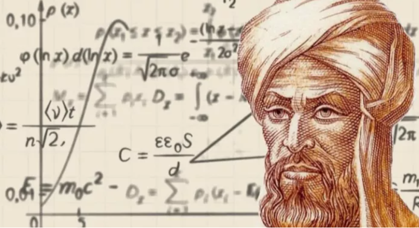

# 咬文嚼字-学科相关

@(TOEFL)[托福, TOEFL, 词根词缀,咬文爵字,学科相关]

[toc]

## Taxonomy [tækˈsɑːnəmi] 分类学 分类系统

**`taxo-`**分类 + **`-nomy`**学科。分类学有广义与狭义之分。广义分类学就是系统学，指分门别类的科学。 狭义分类学特指生物分类学，研究活着的和已灭绝的动植物分类的科学，即研究动物、植物的鉴定、命名和描述，把物种科学地划分到一种等级系统以此反映对其系统发育的了解情况。

**taxonomy [tæk'sɒnəmɪ]** n.分类学。词根tax-表安排、处置，如syntax ['sɪntæks] n.句法；语法就是句子的成分（单词）如何“安排”“在一起（前缀syn-）。词根nom-表规则、管理，如economy [ɪ'kɒnəmɪ] n.经济是the management of the household(词根eco-)。瑞典生物学家林奈创立了生物命名学。

### taxo-

**= arrangement**, 表示“排列”，后缀 **`-taxis`** 表示...趋向性。源自希腊语 ***tassein, tattein "to arrange," taxis "arrangement."***

| 单词                                                         | 句子                                                         |
| :----------------------------------------------------------- | ------------------------------------------------------------ |
| **chemotaxis**                        【ˌkemoʊ'tæksɪs】    chemo.taxis  | **`chemo-`** = chemistry n. movement by a cell or organism in reaction to a chemical stimulus（（趋化性、趋药性） Development on Bacterial Chemotaxis Optimization Theory and its Application. |
| **hypotaxis** 【ˌhaɪpoʊˈtæksɪs】 hypo.taxis        | **`hypo-`** 在下面 n. the use of subordinate clauses (从属关系;主从结构)  **Hypotaxis and parataxis** are the most important features which help us distinguish English（**形合与意合**是英汉语之间最重要的区别。） |
| **parataxis** 【ˌpærəˈtæksɪs】 para.taxis          | **para-** 表示“半，类似，辅助，旁，超，异常”，用于化学，意为“对（位），聚，仲，副”，用于医学意为“对，副，衍”，在元音前演变成 par-。源自希腊语 para "beside, alongside of, beyond."  [U] the placing of clauses and phrases one after the other, without words to link them or show their relationship（语法：**无连词并列；意合连接**）  Affected by Chinese, the parataxis means is obvious.(因为受汉语影响，其意合手段明显。) |
| **phototaxis** 【ˌfoʊtə'tæksɪs】 photo.taxis       | **photo-** = **light**, 表示“光”。源自希腊语 **`phos`** (词干 **`phot-`**) "light."  n. the movement of an entire organism in response to light 趋光性。  Advances in research on phototaxis of insects and mechanism. |
| **rheotaxis** 【riːə'tæksɪs】                           | **rheo= to flow, 表示“流”**。古希腊人认为风湿病是由多余的液体流入关节引起韧带肿胀，所以命名为 ***rheumatism***。源自希腊语 rhein "to flow," rheuma "stream, humor of the body." 走流性;趋流性： movement of an organism towards or away from a current of water  |
| **thermotaxis** 【ˌθɜːmə(ʊ)ˈtæksɪs  】                  | 趋温性;趋热性：the directional movement of an organism in response to the stimulus of a source of heat |
| **paratactic** 【pærə'tæktɪk】                          | and Chinese, as a paratactic language, depends on the logical connection of the meaning to achieve the coherence of the text.（而汉语属于“**意合**”的语言，其语篇的连贯则更多依靠意义间的逻辑衔接。） |
| **ataxia** 【əˈtæksiə】                                 | 共济失调，运动失调(表现为动作不稳、不协调)：a loss of full control of body movements caused by a problem with the nervous system |
| **ataxic** 【ə'tæksɪk】                                 | 混乱的；运动失调的:lack of muscular coordination             |
| **syntax** 【ˈsɪntæks】                                 | **`syn-`**:表示“共同，相同，对称”。源自希腊语 sun, xun "together, with." **`syn-`**一起 + **`-tax`**,接触，安排，用于语法格指句法，句法规则。 句法;句法规则;语构；the way that words and phrases are put together to form sentences in a language; the rules of grammar for this |
| **taxidermal** 【[,tæksə'dɜːrml]】                      | **`derm-`** = skin, 表示“皮肤”。源自希腊语 derma "skin." **Taxidermy** is the craft of preparing the skins of dead animals and birds and filling them with a special material to make them look as if they are alive. |
| **taxidermist** 【ˈtæksɪdɜːrmɪst】                      | 动物标本剥制师：a person whose job is taxidermy              |

### 【1】- nomy  /nam- / nom- （某一领域的知识）{25}

**= law**，表示“法则”，引申为“管理”，用于后缀 **`-nomy`** = ***a field of knowledge***, 表示“某一领域的知识”。源自希腊语 nomos "portion, usage, custom, law, division, district."

#### 单词背后的神话故事(Nemesis:报应女神)  (mnemonic /nɪ'mɑnɪk/  记忆女神)

> 百因必有果，你的报应就是我，Muuuuuuua！

**nemesis**（报应）：报应女神涅墨西斯。

希腊神话中的涅墨西斯（***Nemesis***）一般被译为“报应女神”，黑夜神倪克斯之女，**代表着神对凡人的奖惩，她对好人给予奖赏，对坏人则会施加惩罚**。

据说天神宙斯爱上了涅墨西斯，想尽一切办法想占有她。又羞又怒的女神一直躲避，不断变成不同动物。但宙斯穷追不舍。当女神变成一只天鹅时，宙斯也变成一只天鹅与其交配。后来，女神下了一个蛋，从蛋中诞生了倾国倾城的美女**海伦**。

由于受到了宙斯的奸污，女神心理失衡，把主要精力都放到了惩罚坏人上面。美少年那喀索斯因为过分自恋，无情地拒绝了爱慕他的宁芙仙女艾柯，也遭到了涅墨西斯的惩罚，变成了水仙花。

涅墨西斯的名字***Nemesis***在希腊语中表示“义愤”，字面意思是“***分配（应得的奖惩）***”，源自希腊语动词***nemein***（分配）。英语词根-**`nomo-/-nomy`**（治理、法则）与其同源，也来自希腊语动词***nemein***（分配）。

- nemesis：['nɛməsɪs] n.报应，天罚；主要敌人，强大对手
- **`-nomo-/-nomy`**：治理，管理，法则，秩序
- economy：[ɪ'kɒnəmɪ] n.经济，节约，理财
- astronomy：[ə'strɒnəmɪ] n.天文学
- agronomy：[ə'grɒnəmɪ] n.农学
- autonomy：[ɔː'tɒnəmɪ] n.自治

| 单词                                                         | 解释                                                         | 单词                                                         | 解释                                                         |
| ------------------------------------------------------------ | ------------------------------------------------------------ | ------------------------------------------------------------ | ------------------------------------------------------------ |
| **aeronomy**                【eˈrɑːnəmi】 aero.nomy | **`aero-` = air**, 表示“空气，充气”等。源自希腊语 aer "air 层大气物理（学）（研究地球或其他太空星球高层大气的科学）      ions: Ions are electrically charged atoms.离子是带电的原子。 | **agronomy**              【əˈɡrɑnəmi】            | **`agro-`** = field, land, 表示“田地，农业”等。源自希腊语 agros "field," 同时通过拉丁语进入英语。  农学;农（艺）学；作物栽培学 |
| **anomy** 【ænəmɪ】                                     | **`- an-,无，不`**，+ **`-nomy,规范，管理`**，词源同 astronomy. (社会)反常状态；混乱 lack of moral standards in a society | **antinomy** 【æn'tɪnəmɪ】                              | **`anti-`** 表示“反对，相反”。源自希腊语 anti "against, opposite." 二律背反；自相矛盾；悖论： a contradiction between two statements that seem equally reasonable |
| **astronomy** 【əˈstrɑːnəmi】 astro.nomy           | **`astro-`** = **star or celestial body; outer space**, 表示“星星，天体或外太空”。源自希腊语 **aster** "star." 天文学:the scientific study of the sun, moon, stars, planets, etc. | **autonomy** 【ɔːˈtɑːnəmi】                             | 自治;自治权;自主;自主权。 区别记忆：autotomy [ɔː'tɒtəmɪ] n.[动] 自割，是壁虎等紧急情况下切掉（tom-表to cut）自己身体的一部分。 |
| **topo-logy** 【tə'pɒlədʒɪ】                            | **`topo-`**地方 + **`-logy`**学科。 **`topo-`** 表示“地方”，来源于希腊语 topos。医学上 ectopia (ec- = ex- + top- + -ia) 表示...异位。 n. 地志学, 拓扑学, 局部解剖学 | **topo-graphy**               【təˈpɑɡrəfi】            | 地形；测绘学： **Topography** is the study and description of the physical features of an area, for example its hills, valleys, or rivers, or the representation of these features on maps. |
| **topo-nym** 【ˈtɑːpənɪm】                              | n. 地名，以地名命名者；部位名称：the name by which a geographical place is known |                                                              |                                                              |
| **bionomy** 【baɪ'ɑnəmi】                               | **`bio-`** = life, 表示“生命，生物”。源自希腊语 bios "life." 生命学，生态学。 **bionomics**  【ˌbaɪə'nɑmɪks】：（个体）生态学；生物学特性。 the branch of biology concerned with the relations between organisms and their environment  **-ics** 表名词，“学科，学术”。 | **economy** 【ɪˈkɑːnəmi】 eco.nom.y                | **`eco-`，`ecu-`,`oce-` = house**, 表示“家”，引申为环境。源自希腊语 ***oikos*** "house."  经济;经济情况;经济结构;(就经济体制而言)国家;经济制度;节约;节省;节俭  An **economy** is the system according to which the money, industry, and trade of a country or region are organized. (国家或地区的）经济，经济体制{可数})  **Economy** is the use of the minimum amount of money, time, or other resources needed to achieve something, so that nothing is wasted.（节约;节俭{不可数}） |
| heterinomy                                                   |                                                              | **pluto-nomy** 【pluː'tɒnəmɪ】 plutonomist(政治经济学家) | **`pluto-`** = wealth, 表示“财富”，希腊财神 Ploutos 被罗马人转写成 Pluto，都源自希腊语 ploutos 表示财富。另外冥王星也用 Pluto 命名。 **`pluto-`**财富 + **`-nomy`**学科。政治经济学是从生产关系方面研究各个阶级在经济发展过程中的地位和作用的经济学，独立于政治和经济。 |
| taphonomy                                                    |                                                              | taxonomy                                                     |                                                              |
| astronomer                                                   |                                                              | **gastro-logy**【gæs'trɒlədʒɪ】 **gastro-nomy**【ɡæˈstrɑːnəmi】 | gastro- = stomach, 表示“胃”。源自希腊语 gaster "stomach, belly." the art and practice of cooking and eating good food：烹饪学 |
| ergonomics                                                   |                                                              | ergonomist                                                   |                                                              |
| gastronome                                                   |                                                              | metronome                                                    |                                                              |
| nomogram                                                     |                                                              | nomograph                                                    |                                                              |
|                                                              |                                                              | Deuteronomy                                                  | Deuteronomic                                                 |
|                                                              |                                                              |                                                              |                                                              |

### 【2】-logy （科学、学科）

####  -logy  / -logist / -logical

| -logy                             | 解释                                                         | -nomy                                                        | 解释                                                         |
| --------------------------------- | ------------------------------------------------------------ | ------------------------------------------------------------ | ------------------------------------------------------------ |
| **Astrology** [əˈstrɑːlədʒi] | 星语人生;星座;占星术;占星学;占星                             | **Astronomy**             [əˈstrɑːnəmi]                 | 天文学                                                       |
| **topo-logy** 【tə'pɒlədʒɪ】 | **`topo-`**地方 + **`-logy`**学科。 **`topo-`** 表示“地方”，来源于希腊语 topos。医学上 ectopia (ec- = ex- + top- + -ia) 表示...异位。 n. 地志学, 拓扑学, 局部解剖学 | **topo-graphy**               【təˈpɑɡrəfi】            | 地形；测绘学： **Topography** is the study and description of the physical features of an area, for example its hills, valleys, or rivers, or the representation of these features on maps. |
| **topo-nym** 【ˈtɑːpənɪm】   | n. 地名，以地名命名者；部位名称：the name by which a geographical place is known | **gastro-logy**【gæs'trɒlədʒɪ】 **gastro-nomy**【ɡæˈstrɑːnəmi】 | gastro- = stomach, 表示“胃”。源自希腊语 gaster "stomach, belly." the art and practice of cooking and eating good food：烹饪学 |

**= science**, 表示“***科学，学科***”，由词根 **`log-`**, 说，引申而来；

- **`-logy`** 作为词缀表示**...学**，
- **`-logist`** 作为词缀表示**...学家**, 
- **`-logical`** 作为词缀表示**...学的**。

源自希腊语 **logos "speech, word, reason."**

#### etymology 【ˌetɪˈmɑːlədʒi】

**`etymo-`** = true, 表示“真实的”。 eg: **etymon**【ˈetɪmɑːn】 词源;词的原形;字的原形（a simple form inferred as the common basis from which related words in several languages can be derived by linguistic processes）

**etymology** - 古希腊人认为凡词都有其原型，他们称之为étymos lógos，意思是true word，而关于原型词的研究他们称之为etymologíā，意思是true-word study。古罗马人把这个希腊词吸收了过来，作***etymologia***，英语又借自拉丁语，作***etymology***，汉语译为“词源（学）”。

- At university he developed an interest in etymology. 在大学时他对词源学产生了兴趣。
- Some dictionaries do not give etymologies. 有些词典不提供词源说明。
- Unabridged dictionaries provide the etymologies of most entry words. (NED) 足本大词典提供其大多数词条的词源。

#### biology

**biology** - 意为“生命”或“生物”的希腊语词根**`bíos`**被近代欧洲语言吸收，广泛用作前缀或构词成分，特别是在20世纪。

构词力强的英语组合语素**`bio-`**就是由此而来的。**biography**是最早出现于英语的**`bio-`**衍生词之一。英国桂冠诗人、剧作家、批评家德莱顿（John Dryden, 1631-1700）在1683年首次将该词用于其散文著作*Life of Plutarch*。

**biography**源自希腊语*`biographiā`*，由bíos 'life'加gráphein 'write'构成，从英语构词法来看，就是**`bio-`** 'life'和**`-grahy`** 'writing'的组合，意思是“传记”。若再将biography冠以源于希腊语的组合语素**`auto-`** 'of oneself'（自己的），就构成**autobiography**（自传）。

**biology**是另一个较早产生的bio-衍生词，始见于19世纪初，是仿德语biologie和法语biologie创造的，由bio-加-ology 'the study of'（……学）构成。到了20世纪bio-衍生词猛增了起来，诸如**bioengineering**（生物工程），**bionic**（仿生学的），**biotechnology**（生物技术），**biosphere**（生物圈），**biorhythm**（生物节律），**biochemistry**（生物化学）等等。

例

- Boswell wrote a famous biography of Dr. Johnson. 博斯韦尔为约翰逊博士写过一本著名的传记。
- Famous people often have several very different biographies written about them. (CID) 名人们通常都有几种内容大相径庭的传记。
- Every sophomore is required to take biology. 每一位二年级生必修生物学。

#### topology【tə'pɒlədʒɪ】拓扑学

1. the configuration of a communication network (network topology)

   > 网络通讯节点的配置

2. the branch of pure mathematics that deals only with the properties of a figure X that hold for every figure into which X can be transformed with a one-to-one correspondence that is continuous in both directions (analysis situs)

   > 纯数学的一个分支，它只处理图形X的性质，这些性质适用于X可以在两个方向上连续的一对一对应关系中变换成的每个图形

3. the study of anatomy based on regions or divisions of the body and emphasizing the relations between various structures (muscles and nerves and arteries etc.) in that region (regional anatomy, topographic anatomy)

   > 解剖学以身体的区域或分区为基础，强调该区域内各种结构(肌肉、神经和动脉等)之间的关系的解剖学研究

4. topographic study of a given place (especially the history of the place as indicated by its topography)

   > 对某一特定地点的地形研究(尤指由其地形所显示的该地点的历史)

#### topic（题目）：亚里斯多德的一篇文章的标题

单词**topic**来自古希腊哲学家亚里士多德（384—322BC）的一篇著作的标题Ta Topika中来的，意思是“老生常谈的事”、“平凡小事”，其中***Topika***来自***topikos***（本地的、普通地方的），来自**`topos`**（地方）。后来**topic**一词便成了“标题”、“题目”的总称。

与**topic**同源的单词有英语单词**topical**（局部的）、**topology**（拓扑学）、**topography**（地势）等。

- topo-：place，地方，地点，位置
- topic： ['tɒpɪk] n.题目，主题，话题
- topical：['tɑpɪkl] adj. 局部的；论题的；时事问题的；局部地区的
- topology：[təˈpɑlədʒi] n. 拓扑学；地志学；局部解剖学
- topography： [tə'pɑgrəfi] n. 地势；地形学；地志
- isotope：['aɪsə'top] n. 同位素
- toponym：['tɑpənɪm] n. 地名，以地名命名者；部位名称

### 【3】-ics 表名词，“学科，学术”。

| -logy                                                        | 解释                                                         | -nomy                                       | 解释                                                         |
| ------------------------------------------------------------ | ------------------------------------------------------------ | ------------------------------------------- | ------------------------------------------------------------ |
| **Astrology** [əˈstrɑːlədʒi]                            | 星语人生;星座;占星术;占星学;占星                             | **Astronomy**            [əˈstrɑːnəmi] | 天文学                                                       |
| athl-et-ics                                                  |                                                              | aesthet-ics                                 |                                                              |
| ana-lyt-ics                                                  |                                                              | astro-naut-ics                              |                                                              |
| astro-phys-ics                                               |                                                              | atom-ics                                    |                                                              |
| bio-metr-ics                                                 |                                                              | bio-nom-ics                                 |                                                              |
| eco-nom-ics                                                  |                                                              | architect-on-ics                            |                                                              |
| bion-ics                                                     |                                                              | ball-ist-ics                                |                                                              |
| electro-ics                                                  | 电子学                                                       | eletro-magnet-ics                           | 电磁学                                                       |
| eletro-therm-ics                                             | 电热学                                                       | acro-bat-ics                                |                                                              |
| aero-bat-ics                                                 |                                                              | aero-donet-ics                              |                                                              |
| ceram-ics                                                    |                                                              | en-erg-et-ics                               |                                                              |
| ergo-nom-ics                                                 |                                                              |                                             |                                                              |
| kinet-ic 【kɪˈnetɪk】                                   | **`kinet-`** 表示“运动，活动”。源自希腊语 kinein "to move." of or produced by movement.运动的;运动引起的 kinetic energy 动能 | [kinet-ics 【kəˈnɛtɪks】]              | the branch of mechanics concerned with the forces that cause motions of bodies（动力学） |
| **techno-logy**                         【tekˈnɑːlədʒi】 | **`techno-`** = skill, ability, 表示“技术，能力”。源自希腊语 tekhne "art, craft, skill." 1. **scientific knowledge used in practical ways in industry, for example in designing new machines**(科技；工艺；工程技术；技术学；工艺学) 2. **machinery or equipment designed using technology**(技术性机器（或设备）) | **tecno-logy** 【 tek'nɔlədʒi】        | 儿童学（指对儿童性格、成长及发育的研究）。把这个单词看成technology技术的同学请举手！You are not alone。把这个单词听成technology的请举手！Oh,so many of you。这么任性的一个单词！复合词根tecno-是希腊来源，表示child，tecnology是the study of children。 |

### 【4】 -grphay = process of recording, 表示“（记录的）技术”{66}

**`graph-`** = write, 表示“写，图”。源自希腊语 graphein "to scratch, draw, write," gramma "a picture, written letter, piece of writing," grame "a line." 

**`-y`**：名词性质

| 单词                              | 解释                                                         | 单词                                              | 解释                                                         |
| --------------------------------- | ------------------------------------------------------------ | ------------------------------------------------- | ------------------------------------------------------------ |
| **topo-logy** 【tə'pɒlədʒɪ】 | **`topo-`**地方 + **`-logy`**学科。 **`topo-`** 表示“地方”，来源于希腊语 topos。医学上 ectopia (ec- = ex- + top- + -ia) 表示...异位。 n. 地志学, 拓扑学, 局部解剖学 | **topo-graphy**               【təˈpɑɡrəfi】 | 地形；测绘学： **Topography** is the study and description of the physical features of an area, for example its hills, valleys, or rivers, or the representation of these features on maps. |
| **topo-nym** 【ˈtɑːpənɪm】   | n. 地名，以地名命名者；部位名称：the name by which a geographical place is known |                                                   |                                                              |
| geo-graphy                        | 地理学，地理                                                 | geo-logy                                          | 地质学                                                       |
| hagio-graphy                      | 圣徒传，圣徒言行录                                           | ocean-o-graphy                                    | 海洋学                                                       |
| paleo-graphy                      | 古文书，古文书学                                             | petro-graphy                                      | 岩相学                                                       |
| poly-somno-graphy                 | 多导睡眠图                                                   | phono-graphy                                      | 表音法，表音速记法                                           |
| sono-graphy                       | 超声波检测法                                                 | strait-graphy                                     | 地层学，地层情况                                             |
| zoo-graphy                        | 动物志，动物地理学                                           | acti-graphy                                       | 体动记录仪                                                   |
| dactylo-graphy                    | 指纹学；指纹鉴定学；指纹法                                   | aero-graphy                                       | 气象学                                                       |
| cosmo-graphy                      | 宇宙志 宇宙结构学                                            | ethno-graphy                                      | 人种论，人中穴                                               |
| demo∙graphy 【dɪˈmɑːɡrəfi】  | **`demo-`** = people，表示“人民，民众”。 demo-人民 + -graphy, 技术 → 人口学。 读音比较：demographic 【ˌdeməˈɡræfɪk】 |                                                   |                                                              |

## Autonomy

**ions**: Ions are electrically charged atoms.离子是带电的原子。

| 英文                            | 中文                                                         | 备注 |
| ------------------------------- | ------------------------------------------------------------ | ---- |
| Nucleus 【ˈnuːkliəs】      | 细胞核;原子核;核心;胞核： (physics 物) 核；原子核： the part of an atom that contains most of its mass and that carries a positive electric charge； (biology 生) 细胞核： the central part of some cells, containing the genetic material |      |
| Proton 【ˈproʊtɑːn】  | 质子：a very small piece of matter (= a substance) with a positive electric charge that forms part of the nucleus (= central part) of an atom |      |
| Neutron 【ˈnuːtrɑːn】      | 中子：a very small piece of matter (= a substance) that carries no electric charge and that forms part of the nucleus (= central part) of an atom |      |
| Electron 【ɪˈlektrɑːn】    | 电子:a very small piece of matter (= a substance) with a negative electric charge, found in all atoms |      |

###  ion（离子）：被化为白牛的美女伊娥（Io）

在希腊神话中，伊俄（**Io**）是一位美丽的凡人少女，是河神伊那科斯的女儿，赫拉神殿 的女祭司。宙斯爱上了她，在乌云的掩护下与她相会。心生疑虑的赫拉驱散乌云。宙斯怕事 情败露，将伊俄变成一头小母牛。赫拉识破了丈夫的诡计，将计就计地向宙斯讨要了这头小 母牛，命令百眼巨人严密看管。

宙斯派出赫尔墨斯杀死了百眼巨人。赫拉仍然不肯放过伊俄，派出一群牛虻，不断叮咬 被变为小母牛的依娥。为了躲避牛虻的叮咬，伊俄四处奔跑，渡过了伊俄渡过了博斯普鲁斯([Bosporus Strait](https://baike.baidu.com/item/%E4%BC%8A%E6%96%AF%E5%9D%A6%E5%B8%83%E5%B0%94%E6%B5%B7%E5%B3%A1/1371859?fromtitle=%E5%8D%9A%E6%96%AF%E6%99%AE%E9%B2%81%E6%96%AF%E6%B5%B7%E5%B3%A1&fromid=1005745&fr=aladdin),又名：伊斯坦布尔海峡) 海峡，该海峡因此而得名（博斯普鲁斯意为“***牛所通过***”）。然后又穿过地中海，来到了埃 及。从此这片海便以她的名字命名，叫爱奥尼亚海（**Ionian Sea**，伊俄之海）。

最后，宙斯请 求赫拉放过可怜的少女，伊俄才得以恢复原形。

伊俄的名字 **Io** 在希腊语中就是“流浪”的意思，英语单词 **ion**（离子）与此同源。在天 文学上，**Io** 被用来命名木星的第一颗卫星。在化学中，元素锾（Ionium）的命名也源于此。

- **Io**：[,aɪ 'o] n. 木卫一，伊俄 
- **Ionia**：[ai'əunjə] n. 爱奥尼亚 
- **Ionian**：[ai'əunjən] 
  - n.爱奥尼亚人 
  - adj.爱奥尼亚的，爱奥尼亚人的 
- **Ionium**：[aɪ'onɪəm] n. 锾（一种化学元素，第 90 号元素钍的放射性同位素）

## Mathematics

### - oid  在几何学上表示“…形”

**`-oid`** 
= form, 表示“…之物”，在几何学上表示“…形”；作形容词后缀，表示“如…的”。‘o’为希腊语中的连词符，id=eidos, 希腊语，表示“样貌、影像”。源自希腊语 eidos "form, shape."

| 单词                                                         | 解释                                                         |
| ------------------------------------------------------------ | ------------------------------------------------------------ |
| **para-bo-la**                                 【pəˈræbələ】 | para-在旁，在周围 + -bol扔，投掷，即扔在旁边的，用于几何术语指抛物线。 a mathematical surface in which intersections with planes produce parabolas , ellipses , or hyperbolas |
| **para-bol-oid** 【pə'ræbəlɔɪd】                        | 抛物面(a surface having parabolic sections parallel to a single coordinate axis and elliptic sections perpendicular to that axis , 一种具有平行于一个坐标轴的抛物线截面和垂直于该坐标轴的椭圆截面的表面) **`para-`**  表示“半，类似，辅助，旁，超，异常”，用于化学，意为“对（位），聚，仲，副”，用于医学意为“对，副，衍”，在元音前演变成 par-。源自希腊语 para "beside, alongside of, beyond." **`bol-`**  = throw, dance, ball, 表示“抛，舞，球”。源自希腊语 ballein "to throw"  |
| **para-bol-ic<**br />【ˌpærəˈbɑːlɪk】                        | para-在旁，在周围 + bol-扔 + -ic表形容词 寓言的, 比喻的, 抛物线的, 抛物线状的 |
|                                                              | 来自希腊语 parabole,比较，对话，类比，来自 para-,在旁，在周围，-bole,扔，投掷，词源同ballet,ballistic.即扔在旁边的，引申词义打比方，讲寓言故事。拼写受-able 影响俗化。 |
|                                                              |                                                              |
| **Slope** 【sloʊp】                                     | n. 斜坡, 山坡; **斜率** v. 使倾斜; 悄悄地走, 溜   |
| **bevel** 【ˈbevl】                                     | n.斜边;斜面;斜角规 v.把（物体的方形边）改成斜面边  [Bevel Edge](https://knowledgebank.materialbank.com/terms/bevel-edge/)  |

### [Algebra](https://mp.weixin.qq.com/s?__biz=MzA4NTQ4NzIzNg==&mid=2651801001&idx=1&sn=28b6782b8cac44b75b267f001876ce05&chksm=842cde42b35b57547423fbf0a0c5365528ab1e9c6a369ce7e64eb9f2b298dcb7606d606dba3f&scene=178&cur_album_id=1297162942844207107#rd) [ˈældʒɪbrə] 

公元820年，波斯著名数学家、被称为“代数之父”的阿尔•花刺子模用阿拉伯语发表了一部数学专著《al-mukhtasar fihisab al-jabr wa al-muqabala》（**the compendium on calculation by restoring and balancing**，还原和对消运算概要）。

这本书首次阐述了解一次和二次方程的基本方法，明确提出了代数学中的一些基本概念，奠定了代数学的基础，把代数学发展成为一门与几何学相提并论的独立学科。

> A **compendium** is a short but detailed collection of information, usually in a book. (通常指书中的)概要，纲要)

这部专著书名中的**al jebr**一词，在阿拉伯语中表示“断开部分的重新连接”，在医学领域表示“断骨的重新连接”，其中的**al**是定冠词，相当于英语中的**the**。花刺子模用这个词语来表示代数学中的“还原”，是代数计算的两项基本操作之一。

**`al jebr`**一词进入拉丁语后，变成了**algebra**，后来又进入了英语，被用来表示代数学。

这位数学家的全名是**Abu Jafar Muhammad ibn Msa al-Khwarizmi**，意思是“**穆罕默德，Jafar的父亲，穆萨的儿子，来自花剌子模**”。末尾的**`al-Khwarizmi`**表示“**花剌子模**”，是古代中亚地区的一个古地名。

> [Abu, Ibn, and Bin, Oh My!](https://slate.com/news-and-politics/2006/07/abu-ibn-and-bin-oh-my.html) Ab (Semitic), a common part of Arabic-derived names, *meaning* "father of" in Arabic

这个名称在拉丁语中被翻译为**algorismus**，进入英语后变为**algorism**，原本表示“阿拉伯数字系统”，也就是所谓的“十进位计数法”。

后来，人们把这个单词和希腊语单词**arithmos**（数字）混杂起来，创造出新的单词**algorithm**，用来表示“来自阿拉伯语的计算系统”。现在**algorithm**可以表示任何一种计算方法，在计算机和信息科学领域是一个专业术语，表示“算法”。

- **algebra**：['ældʒɪbrə]  n.代数学

- **algorithm**：['ælgə'rɪðəm]n.算法

- **algorism**：['ælgə,rɪzəm]n.阿拉伯数字系统；十进位计数法

### fraction 分数

#### 1.complex fraction繁分数。

是分子和/或分母包含了分数的分数。complex ['kɒmpleks] adj.复杂的；合成的，n. 复合体；综合设施。词根plex-简单说是词根plect-表编织、折叠的过去分词，女孩子的辫子就叫plait，所以complex就是“plaited together”。至于complex作名词情结，是瑞士心理学家荣格的创造。

#### 2.proper fraction真分数。

proper ['prɒpə] adj.适当的；特有的；正派的，来自拉丁语pro privo，pro表赞成，与for同源，privo中的priv表个人的，见单词privacy隐私。proper可简单理解为for one's own。3个苹果分给5个人，皆大欢喜，5个苹果分给3个人，剩下的2个怎么办？该打架了，就improper不合适了。

#### 3.vulgar fraction普通分数

也叫simple fraction最简分数或common fraction。vulgar ['vʌlgə] adj. 粗俗的；通俗的；本土的，n. 平民。语言学上，Classical Latin古典拉丁是罗马共和国晚期至帝国初期的语言，以西塞罗和凯撒等为代表。罗马帝国衰落后，普通老百姓说的大众口语就是Vulgar Latin。

#### 4.fraction ['frækʃ(ə)n] n.分数；部分；稍微。

词根fract,frag表示to break，为啥呢？因为这个拉丁词根与日耳曼词源的break同源！f和b，没开玩笑，人人喜爱8不就是因为它谐音“发”吗？于是fracture破裂；骨折那就是（骨头）broken，fragile脆弱的是因为事物容易break，-ile表capacity or ability。
