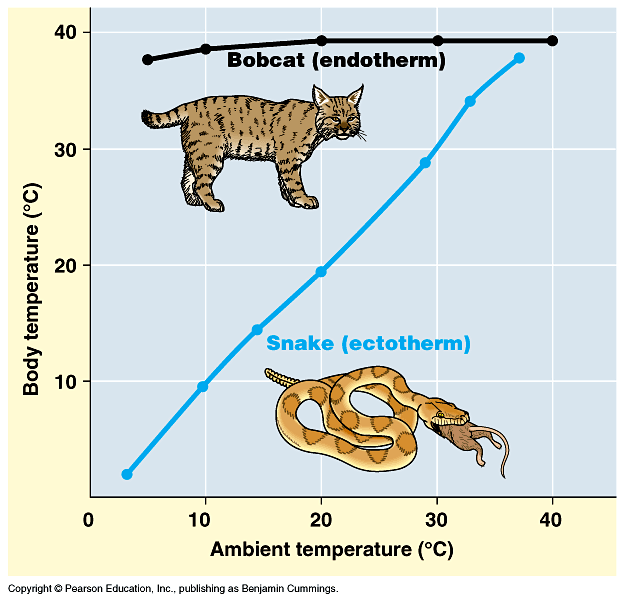

# 咬文嚼字-学科相关

@(TOEFL)[托福, TOEFL, 词根词缀,咬文爵字,学科相关]

[toc]

## Taxonomy [tækˈsɑːnəmi] 分类学 分类系统

**`taxo-`**分类 + **`-nomy`**学科。分类学有广义与狭义之分。广义分类学就是系统学，指分门别类的科学。 狭义分类学特指生物分类学，研究活着的和已灭绝的动植物分类的科学，即研究动物、植物的鉴定、命名和描述，把物种科学地划分到一种等级系统以此反映对其系统发育的了解情况。

**taxonomy [tæk'sɒnəmɪ]** n.分类学。词根tax-表安排、处置，如syntax ['sɪntæks] n.句法；语法就是句子的成分（单词）如何“安排”“在一起（前缀syn-）。词根nom-表规则、管理，如economy [ɪ'kɒnəmɪ] n.经济是the management of the household(词根eco-)。瑞典生物学家林奈创立了生物命名学。

### 【0】taxo-**= arrangement**, 表示“排列”，后缀 **`-taxis`** 表示...趋向性{21}

> 源自希腊语 ***tassein, tattein "to arrange," taxis "arrangement."***

| 单词                                                         | 句子                                                         |
| :----------------------------------------------------------- | ------------------------------------------------------------ |
| **chemotaxis**                        【ˌkemoʊ'tæksɪs】    chemo.taxis  | **`chemo-`** = chemistry n. movement by a cell or organism in reaction to a chemical stimulus（（趋化性、趋药性） Development on Bacterial Chemotaxis Optimization Theory and its Application. |
| **hypotaxis** 【ˌhaɪpoʊˈtæksɪs】 hypo.taxis        | **`hypo-`** 在下面 n. the use of subordinate clauses (从属关系;主从结构)  **Hypotaxis and parataxis** are the most important features which help us distinguish English（**形合与意合**是英汉语之间最重要的区别。） |
| **parataxis** 【ˌpærəˈtæksɪs】 para.taxis          | **para-** 表示“半，类似，辅助，旁，超，异常”，用于化学，意为“对（位），聚，仲，副”，用于医学意为“对，副，衍”，在元音前演变成 par-。源自希腊语 para "beside, alongside of, beyond."  [U] the placing of clauses and phrases one after the other, without words to link them or show their relationship（语法：**无连词并列；意合连接**）  Affected by Chinese, the parataxis means is obvious.(因为受汉语影响，其意合手段明显。) |
| **phototaxis** 【ˌfoʊtə'tæksɪs】 photo.taxis       | **photo-** = **light**, 表示“光”。源自希腊语 **`phos`** (词干 **`phot-`**) "light."  n. the movement of an entire organism in response to light 趋光性。  Advances in research on phototaxis of insects and mechanism. |
| **rheotaxis** 【riːə'tæksɪs】                           | **rheo= to flow, 表示“流”**。古希腊人认为风湿病是由多余的液体流入关节引起韧带肿胀，所以命名为 ***rheumatism***。源自希腊语 rhein "to flow," rheuma "stream, humor of the body." 走流性;趋流性： movement of an organism towards or away from a current of water  |
| **thermotaxis** 【ˌθɜːmə(ʊ)ˈtæksɪs  】                  | 趋温性;趋热性：the directional movement of an organism in response to the stimulus of a source of heat |
| **paratactic** 【pærə'tæktɪk】                          | and Chinese, as a paratactic language, depends on the logical connection of the meaning to achieve the coherence of the text.（而汉语属于“**意合**”的语言，其语篇的连贯则更多依靠意义间的逻辑衔接。） |
| **ataxia** 【əˈtæksiə】                                 | 共济失调，运动失调(表现为动作不稳、不协调)：a loss of full control of body movements caused by a problem with the nervous system |
| **ataxic** 【ə'tæksɪk】                                 | 混乱的；运动失调的:lack of muscular coordination             |
| **syntax** 【ˈsɪntæks】                                 | **`syn-`**:表示“共同，相同，对称”。源自希腊语 sun, xun "together, with." **`syn-`**一起 + **`-tax`**,接触，安排，用于语法格指句法，句法规则。 句法;句法规则;语构；the way that words and phrases are put together to form sentences in a language; the rules of grammar for this |
| **taxidermal** 【[,tæksə'dɜːrml]】                      | **`derm-`** = skin, 表示“皮肤”。源自希腊语 derma "skin." **Taxidermy** is the craft of preparing the skins of dead animals and birds and filling them with a special material to make them look as if they are alive. |
| **taxidermist** 【ˈtæksɪdɜːrmɪst】                      | 动物标本剥制师：a person whose job is taxidermy              |

### 【1】- nomy  /nam- / nom- （某一领域的知识）{25}

**= law**，表示“法则”，引申为“管理”，用于后缀 **`-nomy`** = ***a field of knowledge***, 表示“某一领域的知识”。源自希腊语 nomos "portion, usage, custom, law, division, district."

#### Nemesis：百因必有果，你的报应就是我

> 百因必有果，你的报应就是我，Muuuuuuua！
>
> 区别： **mnemonic** /nɪ'mɑnɪk/  记忆女神

**nemesis**（报应）：报应女神涅墨西斯。

希腊神话中的涅墨西斯（***Nemesis***）一般被译为“报应女神”，黑夜神倪克斯之女，**代表着神对凡人的奖惩，她对好人给予奖赏，对坏人则会施加惩罚**。

据说天神宙斯爱上了涅墨西斯，想尽一切办法想占有她。又羞又怒的女神一直躲避，不断变成不同动物。但宙斯穷追不舍。当女神变成一只天鹅时，宙斯也变成一只天鹅与其交配。后来，女神下了一个蛋，从蛋中诞生了倾国倾城的美女**海伦**。

由于受到了宙斯的奸污，女神心理失衡，把主要精力都放到了惩罚坏人上面。美少年那喀索斯因为过分自恋，无情地拒绝了爱慕他的宁芙仙女艾柯，也遭到了涅墨西斯的惩罚，变成了水仙花。

涅墨西斯的名字***Nemesis***在希腊语中表示“义愤”，字面意思是“***分配（应得的奖惩）***”，源自希腊语动词***nemein***（分配）。英语词根-**`nomo-/-nomy`**（治理、法则）与其同源，也来自希腊语动词***nemein***（分配）。

- nemesis：['nɛməsɪs] n.报应，天罚；主要敌人，强大对手
- **`-nomo-/-nomy`**：治理，管理，法则，秩序
- economy：[ɪ'kɒnəmɪ] n.经济，节约，理财
- astronomy：[ə'strɒnəmɪ] n.天文学
- agronomy：[ə'grɒnəmɪ] n.农学
- autonomy：[ɔː'tɒnəmɪ] n.自治

| 单词                                                         | 解释                                                         | 单词                                                         | 解释                                                         |
| ------------------------------------------------------------ | ------------------------------------------------------------ | ------------------------------------------------------------ | ------------------------------------------------------------ |
| **aeronomy**                【eˈrɑːnəmi】 aero.nomy | **`aero-` = air**, 表示“空气，充气”等。源自希腊语 aer "air 层大气物理（学）（研究地球或其他太空星球高层大气的科学）      ions: Ions are electrically charged atoms.离子是带电的原子。 | **agronomy**              【əˈɡrɑnəmi】            | **`agro-`** = field, land, 表示“田地，农业”等。源自希腊语 agros "field," 同时通过拉丁语进入英语。  农学;农（艺）学；作物栽培学 |
| **anomy** 【ænəmɪ】                                     | **`- an-,无，不`**，+ **`-nomy,规范，管理`**，词源同 astronomy. (社会)反常状态；混乱 lack of moral standards in a society | **antinomy** 【æn'tɪnəmɪ】                              | **`anti-`** 表示“反对，相反”。源自希腊语 anti "against, opposite." 二律背反；自相矛盾；悖论： a contradiction between two statements that seem equally reasonable |
| **astronomy** 【əˈstrɑːnəmi】 astro.nomy           | **`astro-`** = **star or celestial body; outer space**, 表示“星星，天体或外太空”。源自希腊语 **aster** "star." 天文学:the scientific study of the sun, moon, stars, planets, etc. | **autonomy** 【ɔːˈtɑːnəmi】                             | 自治;自治权;自主;自主权。 区别记忆：autotomy [ɔː'tɒtəmɪ] n.[动] 自割，是壁虎等紧急情况下切掉（tom-表to cut）自己身体的一部分。 |
| **topo-logy** 【tə'pɒlədʒɪ】                            | **`topo-`**地方 + **`-logy`**学科。 **`topo-`** 表示“地方”，来源于希腊语 topos。医学上 ectopia (ec- = ex- + top- + -ia) 表示...异位。 n. 地志学, 拓扑学, 局部解剖学 | **topo-graphy**               【təˈpɑɡrəfi】            | 地形；测绘学： **Topography** is the study and description of the physical features of an area, for example its hills, valleys, or rivers, or the representation of these features on maps. |
| **topo-nym** 【ˈtɑːpənɪm】                              | n. 地名，以地名命名者；部位名称：the name by which a geographical place is known |                                                              |                                                              |
| **bionomy** 【baɪ'ɑnəmi】                               | **`bio-`** = life, 表示“生命，生物”。源自希腊语 bios "life." 生命学，生态学。 **bionomics**  【ˌbaɪə'nɑmɪks】：（个体）生态学；生物学特性。 the branch of biology concerned with the relations between organisms and their environment  **-ics** 表名词，“学科，学术”。 | **economy** 【ɪˈkɑːnəmi】 eco.nom.y                | **`eco-`，`ecu-`,`oce-` = house**, 表示“家”，引申为环境。源自希腊语 ***oikos*** "house."  经济;经济情况;经济结构;(就经济体制而言)国家;经济制度;节约;节省;节俭  An **economy** is the system according to which the money, industry, and trade of a country or region are organized. (国家或地区的）经济，经济体制{可数})  **Economy** is the use of the minimum amount of money, time, or other resources needed to achieve something, so that nothing is wasted.（节约;节俭{不可数}） |
| heterinomy                                                   |                                                              | **pluto-nomy** 【pluː'tɒnəmɪ】 plutonomist(政治经济学家) | **`pluto-`** = wealth, 表示“财富”，希腊财神 Ploutos 被罗马人转写成 Pluto，都源自希腊语 ploutos 表示财富。另外冥王星也用 Pluto 命名。 **`pluto-`**财富 + **`-nomy`**学科。政治经济学是从生产关系方面研究各个阶级在经济发展过程中的地位和作用的经济学，独立于政治和经济。 |
| taphonomy                                                    |                                                              | taxonomy                                                     |                                                              |
| astronomer                                                   |                                                              | **gastro-logy**【gæs'trɒlədʒɪ】 **gastro-nomy**【ɡæˈstrɑːnəmi】 | gastro- = stomach, 表示“胃”。源自希腊语 gaster "stomach, belly." the art and practice of cooking and eating good food：烹饪学 |
| ergonomics                                                   |                                                              | ergonomist                                                   |                                                              |
| gastronome                                                   |                                                              | metronome                                                    |                                                              |
| nomogram                                                     |                                                              | nomograph                                                    |                                                              |
|                                                              |                                                              | Deuteronomy                                                  | Deuteronomic                                                 |
|                                                              |                                                              |                                                              |                                                              |

### 【2】-logy （科学、学科）

####  -logy  / -logist / -logical

| -logy                             | 解释                                                         | -nomy                                                        | 解释                                                         |
| --------------------------------- | ------------------------------------------------------------ | ------------------------------------------------------------ | ------------------------------------------------------------ |
| **Astrology** [əˈstrɑːlədʒi] | 星语人生;星座;占星术;占星学;占星                             | **Astronomy**             [əˈstrɑːnəmi]                 | 天文学                                                       |
| **topo-logy** 【tə'pɒlədʒɪ】 | **`topo-`**地方 + **`-logy`**学科。 **`topo-`** 表示“地方”，来源于希腊语 topos。医学上 ectopia (ec- = ex- + top- + -ia) 表示...异位。 n. 地志学, 拓扑学, 局部解剖学 | **topo-graphy**               【təˈpɑɡrəfi】            | 地形；测绘学： **Topography** is the study and description of the physical features of an area, for example its hills, valleys, or rivers, or the representation of these features on maps. |
| **topo-nym** 【ˈtɑːpənɪm】   | n. 地名，以地名命名者；部位名称：the name by which a geographical place is known | **gastro-logy**【gæs'trɒlədʒɪ】 **gastro-nomy**【ɡæˈstrɑːnəmi】 | gastro- = stomach, 表示“胃”。源自希腊语 gaster "stomach, belly." the art and practice of cooking and eating good food：烹饪学 |
| **etho-logy** 【ɪˈθɑlədʒi】  | **`etho-`** = nation, 表示“民族；性情（民族情感）”。源自希腊语 ethnos "band of people living together, nation;" ethos "custom, disposition, trait." **`-logy`** = science, 表示“科学，学科”，由词根 log-, 说，引申而来  动物行动学，道德体系学，个体生态学 the branch of zoology that studies the behavior of animals in their natural habitats |                                                              |                                                              |

**= science**, 表示“***科学，学科***”，由词根 **`log-`**, 说，引申而来；

- **`-logy`** 作为词缀表示**...学**，
- **`-logist`** 作为词缀表示**...学家**, 
- **`-logical`** 作为词缀表示**...学的**。

源自希腊语 **logos "speech, word, reason."**

#### etymology 【ˌetɪˈmɑːlədʒi】

**`etymo-`** = true, 表示“真实的”。 eg: **etymon**【ˈetɪmɑːn】 词源;词的原形;字的原形（a simple form inferred as the common basis from which related words in several languages can be derived by linguistic processes）

**etymology** - 古希腊人认为凡词都有其原型，他们称之为étymos lógos，意思是true word，而关于原型词的研究他们称之为etymologíā，意思是true-word study。古罗马人把这个希腊词吸收了过来，作***etymologia***，英语又借自拉丁语，作***etymology***，汉语译为“词源（学）”。

- At university he developed an interest in etymology. 在大学时他对词源学产生了兴趣。
- Some dictionaries do not give etymologies. 有些词典不提供词源说明。
- Unabridged dictionaries provide the etymologies of most entry words. (NED) 足本大词典提供其大多数词条的词源。

#### biology

**biology** - 意为“生命”或“生物”的希腊语词根**`bíos`**被近代欧洲语言吸收，广泛用作前缀或构词成分，特别是在20世纪。

构词力强的英语组合语素**`bio-`**就是由此而来的。**biography**是最早出现于英语的**`bio-`**衍生词之一。英国桂冠诗人、剧作家、批评家德莱顿（John Dryden, 1631-1700）在1683年首次将该词用于其散文著作*Life of Plutarch*。

**biography**源自希腊语*`biographiā`*，由bíos 'life'加gráphein 'write'构成，从英语构词法来看，就是**`bio-`** 'life'和**`-grahy`** 'writing'的组合，意思是“传记”。若再将biography冠以源于希腊语的组合语素**`auto-`** 'of oneself'（自己的），就构成**autobiography**（自传）。

**biology**是另一个较早产生的bio-衍生词，始见于19世纪初，是仿德语biologie和法语biologie创造的，由bio-加-ology 'the study of'（……学）构成。到了20世纪bio-衍生词猛增了起来，诸如**bioengineering**（生物工程），**bionic**（仿生学的），**biotechnology**（生物技术），**biosphere**（生物圈），**biorhythm**（生物节律），**biochemistry**（生物化学）等等。

例

- Boswell wrote a famous biography of Dr. Johnson. 博斯韦尔为约翰逊博士写过一本著名的传记。
- Famous people often have several very different biographies written about them. (CID) 名人们通常都有几种内容大相径庭的传记。
- Every sophomore is required to take biology. 每一位二年级生必修生物学。

#### topology【tə'pɒlədʒɪ】拓扑学

1. the configuration of a communication network (network topology)

   > 网络通讯节点的配置

2. the branch of pure mathematics that deals only with the properties of a figure X that hold for every figure into which X can be transformed with a one-to-one correspondence that is continuous in both directions (analysis situs)

   > 纯数学的一个分支，它只处理图形X的性质，这些性质适用于X可以在两个方向上连续的一对一对应关系中变换成的每个图形

3. the study of anatomy based on regions or divisions of the body and emphasizing the relations between various structures (muscles and nerves and arteries etc.) in that region (regional anatomy, topographic anatomy)

   > 解剖学以身体的区域或分区为基础，强调该区域内各种结构(肌肉、神经和动脉等)之间的关系的解剖学研究

4. topographic study of a given place (especially the history of the place as indicated by its topography)

   > 对某一特定地点的地形研究(尤指由其地形所显示的该地点的历史)

#### topic（题目）：亚里斯多德的一篇文章的标题

单词**topic**来自古希腊哲学家亚里士多德（384—322BC）的一篇著作的标题Ta Topika中来的，意思是“老生常谈的事”、“平凡小事”，其中***Topika***来自***topikos***（本地的、普通地方的），来自**`topos`**（地方）。后来**topic**一词便成了“标题”、“题目”的总称。

与**topic**同源的单词有英语单词**topical**（局部的）、**topology**（拓扑学）、**topography**（地势）等。

- topo-：place，地方，地点，位置
- topic： ['tɒpɪk] n.题目，主题，话题
- topical：['tɑpɪkl] adj. 局部的；论题的；时事问题的；局部地区的
- topology：[təˈpɑlədʒi] n. 拓扑学；地志学；局部解剖学
- topography： [tə'pɑgrəfi] n. 地势；地形学；地志
- isotope：['aɪsə'top] n. 同位素
- toponym：['tɑpənɪm] n. 地名，以地名命名者；部位名称

### 【3】-ics 表名词，“学科，学术”。

| -logy                                                        | 解释                                                         | -nomy                                       | 解释                                                         |
| ------------------------------------------------------------ | ------------------------------------------------------------ | ------------------------------------------- | ------------------------------------------------------------ |
| **Astrology** [əˈstrɑːlədʒi]                            | 星语人生;星座;占星术;占星学;占星                             | **Astronomy**            [əˈstrɑːnəmi] | 天文学                                                       |
| athl-et-ics                                                  |                                                              | aesthet-ics                                 |                                                              |
| ana-lyt-ics                                                  |                                                              | astro-naut-ics                              |                                                              |
| astro-phys-ics                                               |                                                              | atom-ics                                    |                                                              |
| bio-metr-ics                                                 |                                                              | bio-nom-ics                                 |                                                              |
| eco-nom-ics                                                  |                                                              | architect-on-ics                            |                                                              |
| bion-ics                                                     |                                                              | ball-ist-ics                                |                                                              |
| electro-ics                                                  | 电子学                                                       | eletro-magnet-ics                           | 电磁学                                                       |
| eletro-therm-ics                                             | 电热学                                                       | acro-bat-ics                                |                                                              |
| aero-bat-ics                                                 |                                                              | aero-donet-ics                              |                                                              |
| ceram-ics                                                    |                                                              | en-erg-et-ics                               |                                                              |
| ergo-nom-ics                                                 |                                                              |                                             |                                                              |
| kinet-ic 【kɪˈnetɪk】                                   | **`kinet-`** 表示“运动，活动”。源自希腊语 kinein "to move." of or produced by movement.运动的;运动引起的 kinetic energy 动能 | [kinet-ics 【kəˈnɛtɪks】]              | the branch of mechanics concerned with the forces that cause motions of bodies（动力学） |
| **techno-logy**                         【tekˈnɑːlədʒi】 | **`techno-`** = skill, ability, 表示“技术，能力”。源自希腊语 tekhne "art, craft, skill." 1. **scientific knowledge used in practical ways in industry, for example in designing new machines**(科技；工艺；工程技术；技术学；工艺学) 2. **machinery or equipment designed using technology**(技术性机器（或设备）) | **tecno-logy** 【 tek'nɔlədʒi】        | 儿童学（指对儿童性格、成长及发育的研究）。把这个单词看成technology技术的同学请举手！You are not alone。把这个单词听成technology的请举手！Oh,so many of you。这么任性的一个单词！复合词根tecno-是希腊来源，表示child，tecnology是the study of children。 |

### 【4】 -grphay = process of recording, 表示“（记录的）技术”{66}

**`graph-`** = write, 表示“写，图”。源自希腊语 graphein "to scratch, draw, write," gramma "a picture, written letter, piece of writing," grame "a line." 

**`-y`**：名词性质

| 单词                              | 解释                                                         | 单词                                              | 解释                                                         |
| --------------------------------- | ------------------------------------------------------------ | ------------------------------------------------- | ------------------------------------------------------------ |
| **topo-logy** 【tə'pɒlədʒɪ】 | **`topo-`**地方 + **`-logy`**学科。 **`topo-`** 表示“地方”，来源于希腊语 topos。医学上 ectopia (ec- = ex- + top- + -ia) 表示...异位。 n. 地志学, 拓扑学, 局部解剖学 | **topo-graphy**               【təˈpɑɡrəfi】 | 地形；测绘学： **Topography** is the study and description of the physical features of an area, for example its hills, valleys, or rivers, or the representation of these features on maps. |
| **topo-nym** 【ˈtɑːpənɪm】   | n. 地名，以地名命名者；部位名称：the name by which a geographical place is known |                                                   |                                                              |
| geo-graphy                        | 地理学，地理                                                 | geo-logy                                          | 地质学                                                       |
| hagio-graphy                      | 圣徒传，圣徒言行录                                           | ocean-o-graphy                                    | 海洋学                                                       |
| paleo-graphy                      | 古文书，古文书学                                             | petro-graphy                                      | 岩相学                                                       |
| poly-somno-graphy                 | 多导睡眠图                                                   | phono-graphy                                      | 表音法，表音速记法                                           |
| sono-graphy                       | 超声波检测法                                                 | strait-graphy                                     | 地层学，地层情况                                             |
| zoo-graphy                        | 动物志，动物地理学                                           | acti-graphy                                       | 体动记录仪                                                   |
| dactylo-graphy                    | 指纹学；指纹鉴定学；指纹法                                   | aero-graphy                                       | 气象学                                                       |
| cosmo-graphy                      | 宇宙志 宇宙结构学                                            | ethno-graphy                                      | 人种论，人中穴                                               |
| demo∙graphy 【dɪˈmɑːɡrəfi】  | **`demo-`** = people，表示“人民，民众”。 demo-人民 + -graphy, 技术 → 人口学。 读音比较：demographic 【ˌdeməˈɡræfɪk】 |                                                   |                                                              |

### 【5】therm= heat, 表示“热”{78}

> 源自希腊语 thermos "warm, hot, heat."

| 单词                              | 解释                                                         | 单词                              | 解释                                                         |
| --------------------------------- | ------------------------------------------------------------ | --------------------------------- | ------------------------------------------------------------ |
| **ecto∙therm** 【ektəʊθɜːm】 | n. 冷血动物 推荐：ecto-外 + therm-热  **`ecto-`** 表示“外”，一般用于医学领域。源自希腊语 ex, ek "out of, from." **`therm-`** = heat, 表示“热”。源自希腊语 thermos "warm, hot, heat." | **endo-therm**  【endəθɜ:m】 | n. 热血动物 推荐：endo-内 + therm-热  **`endo-`** = within, 表示“内部”。源自希腊语 endon, endo- "within." **`therm-`** = heat, 表示“热”。源自希腊语 thermos "warm, hot, heat." |
| thermo-                           | pref. 热....                                                 | therm-ic                          | 热的，由热造成的                                             |
| therm-al                          | 热的，热量的，温泉的                                         | therm-el                          | 热电温度计                                                   |
| therm-ion                         | 热离子                                                       | thermo-os                         | 热水瓶                                                       |
| thermo-taxis                      | 趋温性，向热性，体温调节                                     | thermo-taxic                      | 趋温性的，向热性的额，体温调节的                             |
| ago-therm-al                      | 地温的，地热的                                               | geo-therm-ic                      | 地温的，地热的                                               |
| exo-therm-ic                      | 发热的，发出热量的                                           | thermo-gen-ic                     | 生热的，产热的                                               |
| thermo-genesis                    | 生热作用                                                     | thermo-genet-ic                   | 生热的，生热作用的                                           |
| thermo-chemistry                  | 热化学                                                       | therm-alloy                       | 热合金                                                       |
| thermo-paint                      | 示温涂料，测温漆                                             | thermo-color                      | 热敏油漆，色温标示，示温涂料                                 |
| thermo-labile                     | 不耐人的，热感的，受热即分解/破坏的                          | thermo-lysis                      | 热分解作用，热散作用                                         |
| thermo-plast-ic                   | 热熟性的                                                     | thermo-plastcity                  | 热塑性                                                       |
| alumino-therm-y                   | 铝热发                                                       | **a-therm-ancy**                  | 不透热性                                                     |
| a-atherm-ic                       | 不导热的                                                     | **dia-therm-ancy**                | 透热性的                                                     |
| thermo-meter                      | 温度测定法                                                   | therm                             | n. 签卡，克卡，撒姆(煤气热量单位)                            |
| iso-therm                         | 等温线                                                       | thermo-meter                      | 温度计，体温计                                               |
| thermo-graph                      | 温度记录器                                                   | thermo-set                        | 热固性的，热变定的                                           |
| thermo-regulation                 | 温度调节                                                     | thermo-regulator                  | 温度调节器                                                   |
| thermo-ammeter                    | 热电流表                                                     | thermo-scope                      | 体验器，温差对                                               |
| therm-istor                       | 热敏电阻                                                     | thermo-barometer                  | 温度气压计，虹吸气压表                                       |
| baro-thermo-graph                 | 气压温度计，其他温度计记录器                                 | bathy-thermo-graph                | 海水测温仪                                                   |
| **thermo-peroid-ism**             | 温周期现象                                                   | thermo-dynam-ic                   | 热力学的，使用热动力的                                       |
| thermo-dynamics                   | 热力学                                                       | aero-thermo-dynamics              | 空气热力学                                                   |
| therm-sphere                      | 热大气层，热电离层                                           | thermo-jet                        | 热力喷气发动机                                               |
| thermo-nuclear                    | 热核的，热核武器的                                           | thermo-pile                       | 温差电堆，热电堆                                             |
| electro-therm-al                  | 电热的                                                       | electro-therm-ics                 | 电热学                                                       |
| thermo-eletr-ic                   | 热电的                                                       | thermo-electri-city               | n 温差电，热电                                               |
| thermo-electron                   | 热电子                                                       | epi-therm-al                      | 超热的                                                       |
| hypo-therm-ia                     | 低体温                                                       | thermo-theraphy                   | 温热疗法                                                     |
| dia-therm-ia                      | 透热疗法                                                     | dia-term-ic                       | 透热疗法的                                                   |
| radio-therm-y                     | 短波透热，热放射疗法                                         | thermo-phil-ic                    | 适温的，喜温的                                               |

## Atom

### atom（原子）：不可再细分的最小颗粒

> a-,不，非，-tom,切，词源同 anatomy.因古代认为原子是最小的不可切分的单位而得名。

古希腊人认为，物质是不可能无限地分割下去的，到最后会小到不可再分，这种不可再分的最小微粒就是“原子”。

最先提出原子学说的是古希腊爱奥尼亚学派中的留基伯。他的学生德谟克利特（Democritus, 460-370 BC,古希腊哲学家）特继承并发展了原子学说，并用原子学说来解释宇宙。他认为宇宙由原子和虚空组成，原子从古以来就存在于虚空之中，既不能创生，也不能毁灭，它们在无限的虚空中运动着构成万物。

他还提出原子在数量上无限，在形式上是多样的，如水的原子是圆而光滑的，它们相互间不能“勾住”，因而就像小球那样相互滚来滚去，而铁的原子则粗糙不平，因而互相粘附在一起成为“固体”，火的原子是多刺的，这便是烧灼使人感到痛的原因。

在希腊语中，原子被称作***atomos***，由**`a`**（not）+**`tomos`**（cut）构成，意思就是“不可分割）。后来这个词进入英语，演变为**atom**。现在我们知道原子并非不可分割，比原子更小的是**夸克**。

- **atom**： ['ætəm] n.原子
- **atomic**：[ə'tɑmɪk] adj. 原子的，原子能的；微粒子的
- **atomize**：['ætəmaɪz] vt. 使分裂为原子；将…喷成雾状；使遭受原子弹轰炸vi. 分裂
- **atomistic**：[,ætə'mɪstɪk] adj. 原子的；原子论的
- The splitting of the atom was a milestone in the history of science. (FWF) 使原子产生核裂变是科学史上的一个里程碑。
- An atom is made up of protons, neutrons, and one or more electrons. (NED) 原子由质子、中子和一个或多个电子组成。
- There's not an atom of truth in what she says. 她说的话没有丝毫真实性。

#### insect（昆虫）：身体分节的虫子

古代西方看到蚂蚁、甲虫等昆虫大多数都有一个共同特点，身体都是一节一节的，因此以为昆虫都是这样的。英语单词**insect**（昆虫）和**entomology**（昆虫学）都反映了古代人的这种观念。

**insect**来自拉丁语***insectum***，本意是“cut up”（切断）。**entomology**来自希腊语***entomos***，本意也是“cut up”（切断）。

- **`sect-`**：切，分割
- **insect**： ['ɪnsekt] n.昆虫
- **section**： ['sɛkʃən] 
  - n. 截面；部分；部门；地区；章节
  - v.划分，切割，分段
- **sector**：['sɛktɚ] n. 部门；扇形，扇区；象限仪
- **`tom-`**：切，分割
- **entomology**：[ˌentə'mɒlədʒi] n.昆虫学
- **atom**：['ætəm] n. 原子。字面意思为“不可分割”

### Molecule

|                                    |                                                              |                                               |                                                              |
| ---------------------------------- | ------------------------------------------------------------ | --------------------------------------------- | ------------------------------------------------------------ |
| **molecule**  【ˈmɑːlɪkjuːl】 | n. 分子, 些微 推荐： mole-堆 + -cule小 → 很小的东西堆在一起 → 分子。 **`-ule`** 23 表名词，“小…”。源自拉丁语 -ulus, 小词后缀。  **`mole-`**  = heap, 表示“堆”。源自拉丁语 moles "heavy bulk, mass, massive structure." 来自拉丁语 moles,大块，防洪堤，大工程，大建筑物，-cul,小词后缀。用于化学术语分子 | **molecular**            【məˈlekjələr】 | a. 分子的, 由分子组成的 推荐：molecule【分子】 + -ar表形容词。 **`molecule`**  n. 分子, 些微 **`-ar`** 表形容词，“…的”。源自拉丁语 -alis, adjective suffix. |
|                                    |                                                              |                                               |                                                              |
|                                    |                                                              |                                               |                                                              |

### -on  表名词，指人，物和一些物理学上的名词

**ions**: Ions are electrically charged atoms.离子是带电的原子。

| 单词                                                         | 解释                                                         | 单词                                 | 解释                                                         |
| ------------------------------------------------------------ | ------------------------------------------------------------ | ------------------------------------ | ------------------------------------------------------------ |
| **Prot-ium** 【prəʊtɪəm】 氕[piē]                  | 质子数1，它的原子由一个质子和一个电子组成，是氢的主要形式,，氕为氢的主要成分，约占普通氢的99.98%。 | **prot-on** 【ˈproʊtɑːn】       | **`prot-`** = first, source, parent, preceding, earliest form, original, basic，表示“最初的，原始的，第一的”。 a very small piece of matter (= a substance) with a positive electric charge that forms part of the nucleus (= central part) of an atom 质子 |
| **Deuter-ium **                      【djuːˈtɪriəm】 氘[dāo] | 重氢,原子核中有一个质子和一个中子，氢中有0.02%的氘。 在大自然的含量约为一般氢的7000分之一 ，用于热核反应 | **deuter-on**     【djuːtərɒn】 | the nucleus of deuterium（氘核）                             |
| **trit-ium** 【ˈtrɪtiəm】 [氚[chuān]](https://baike.baidu.com/item/%E6%B0%95%E6%B0%98%E6%B0%9A/8757957) | 杜撰词，来自希腊语 tritos,第三，词源同 three,third.-ium,化学元素后缀。比较 deuterium. 称作超重氢。原子核中有一个质子和两个中子。并带有[放射性](https://baike.baidu.com/item/放射性)，会发生[β衰变](https://baike.baidu.com/item/β衰变)，其[半衰期](https://baike.baidu.com/item/半衰期)为12.43年。由于氚的β衰变只会放出高速移动的电子，不会穿透人体，因此只有大量吸入氚才会对人体有害。 | **trit-on** 【ˈtraɪtən】        | （贝壳）法螺，北螈，氚核 small usually bright-colored semiaquatic salamanders of North America and Europe and northern Asia |
| **nucleus** 【ˈnuːkliəs】                               | **`nucle-`**核 + -us. 引申词义原子核，细胞核。 (physics 物) 核；原子核： the part of an atom that contains most of its mass and that carries a positive electric charge； (biology 生) 细胞核： the central part of some cells, containing the genetic material |                                      |                                                              |
| **ion** 【ˈaɪən】                                       | (physics 物 or chemistry 化) 离子 an atom or a molecule with a positive or negative electric charge caused by its losing or gaining one or more electrons | **phot-on** 【ˈfoʊtɑːn】        | n. 光子, 光量子, 光度 推荐： phot-光 + on            |
| **electr-on<**br />【ɪˈlektrɑːn】                            | a very small piece of matter (= a substance) with a negative electric charge, found in all atoms 电子 | **neutr-on** 【ˈnuːtrɑːn】      | a very small piece of matter (= a substance) that carries no electric charge and that forms part of the nucleus (= central part) of an atom 中子 |

### proto-（第一）：变化多端的海中老人普罗透斯

普罗透斯（**Proteus**）是希腊神话中的一个早期海神，荷马史诗中所说的“海中老人”之一。他有预测未来的神通，但只向能逮住他的人透露预言。为了避免被人逮住，他拥有随意改变自己形状的神力。他居住在尼罗河三角洲海岸外的法罗斯岛上，以放牧海兽为生。

根据荷马史诗的记载，参加特洛伊战争的斯巴达国王墨涅拉奥斯（Menelaus）从特洛伊启程回国前触犯了神灵，被困在法罗斯岛上。在这里他遇到了普罗透斯的女儿。后者向他透露了普罗透斯的秘密，还告诉他制服普罗透斯的诀窍。于是，墨涅拉奥斯带着手下，身披海豹皮，悄悄接近普罗透斯，趁他瞌睡时，突然抓住他，任凭他千变万化也不松手。普罗透斯最后没办法，只好变回原形投降，向墨涅拉奥斯透露了他所需要的预言。

普罗透斯的名字Proteus非常有意思，它来自希腊语protos（第一）。古话说，一生二，二生四，四生万物，Proteus这个名字就暗示着他能够千变万化。英语词根proto-（第一、最初）就来源于此。由Proteus衍生出形容词protean，意思是“千变万化的”。

- **`proto-`**：第一，最初

- **Proteus**：['prəʊtɪəs] n. 多变的人；普罗透斯（希腊海神）；变形杆菌属

- **protean**： ['prəʊtɪən; prəʊ'tiːən] adj.千变万化的，一人分饰多角的，变形虫的

- **protocol**：['protə'kɔl] n. 协议；草案；礼仪v. 拟定。本意为“第一页”

- **proton**：['protɑn] n. 质子

- **protein**： ['protin] n. 蛋白质；朊adj. 蛋白质的

- **protoplasm**：['protəplæzəm] n. 原生质；原浆；细胞质

- **prototype**： ['protə'taɪp] n. 原型；标准，模范

- **prototypical**：[,protə'tɪpɪkl] adj. 原型的；典型的

- **protagonist**：[prə'tæɡənɪst] n. 主角，主演；主要人物，领导者

  

###  ion（离子）：被化为白牛的美女伊娥（Io）

在希腊神话中，伊俄（**Io**）是一位美丽的凡人少女，是河神伊那科斯的女儿，赫拉神殿 的女祭司。宙斯爱上了她，在乌云的掩护下与她相会。心生疑虑的赫拉驱散乌云。宙斯怕事 情败露，将伊俄变成一头小母牛。赫拉识破了丈夫的诡计，将计就计地向宙斯讨要了这头小 母牛，命令百眼巨人严密看管。

宙斯派出赫尔墨斯杀死了百眼巨人。赫拉仍然不肯放过伊俄，派出一群牛虻，不断叮咬 被变为小母牛的依娥。为了躲避牛虻的叮咬，伊俄四处奔跑，渡过了伊俄渡过了博斯普鲁斯([Bosporus Strait](https://baike.baidu.com/item/%E4%BC%8A%E6%96%AF%E5%9D%A6%E5%B8%83%E5%B0%94%E6%B5%B7%E5%B3%A1/1371859?fromtitle=%E5%8D%9A%E6%96%AF%E6%99%AE%E9%B2%81%E6%96%AF%E6%B5%B7%E5%B3%A1&fromid=1005745&fr=aladdin),又名：伊斯坦布尔海峡) 海峡，该海峡因此而得名（博斯普鲁斯意为“***牛所通过***”）。然后又穿过地中海，来到了埃 及。从此这片海便以她的名字命名，叫爱奥尼亚海（**Ionian Sea**，伊俄之海）。

最后，宙斯请 求赫拉放过可怜的少女，伊俄才得以恢复原形。

伊俄的名字 **Io** 在希腊语中就是“流浪”的意思，英语单词 **ion**（离子）与此同源。在天 文学上，**Io** 被用来命名木星的第一颗卫星。在化学中，元素锾（Ionium）的命名也源于此。

- **Io**：[,aɪ 'o] n. 木卫一，伊俄 
- **Ionia**：[ai'əunjə] n. 爱奥尼亚 
- **Ionian**：[ai'əunjən] 
  - n.爱奥尼亚人 
  - adj.爱奥尼亚的，爱奥尼亚人的 
- **Ionium**：[aɪ'onɪəm] n. 锾（一种化学元素，第 90 号元素钍的放射性同位素）

### quark 物理学家的反拉丁命名论

夸克是一种基本粒子，为构成物质的基本单元。两个上夸克和一个下夸克组成一个质子，两个下夸克和一个上夸克组成一个中子。
**quark** 原为一种喜欢上上下下蹦跳的海鸟，为拟声构词，模仿这种海鸟的叫声。

发现该物理粒子的美国科学家 **Murray Gell-Mann** 希望为其取一个朗朗上口的名字，避免落入俗套（科学界流行从希腊和拉丁语中找词来命名科学术语）。后来在一本小说的打油诗中找到一名”**Three quarks for Muster Mark**”,向麦克老人三呼夸克。

这个词听起来既有穿透力，又较好的契合了这种物质的基本属性，因此以此命名。

###  ohm(欧姆）, amp（安培）, volt （伏特），watt(瓦特)

1881年巴黎国际电学会议通过一项决议，为了纪念对电磁学作出巨大贡献的法国物理学家**André Marie Ampère** (1775-1836)，***电流强度***的单位以他的姓氏命名为**ampere**，口语常作**amp**，汉语译为“安培”，简称“安”。

在此以前为了纪念意大利物理学家**Alessandro Volta** (1745-1827)，电压单位已定名为**volt**，汉语作“伏特”或简称“伏”。

另外两个电学的常用单位名称，即***电阻单位***  **ohm**（欧姆）和 ***功率单位*** **watt**（瓦特）则分别得名于德国物理学家**Georg Simon Ohm** (1789-1854)和英国发明家**James Watt** (1736-1819)。

- This piece of equipment needs a thirty-amp fus

