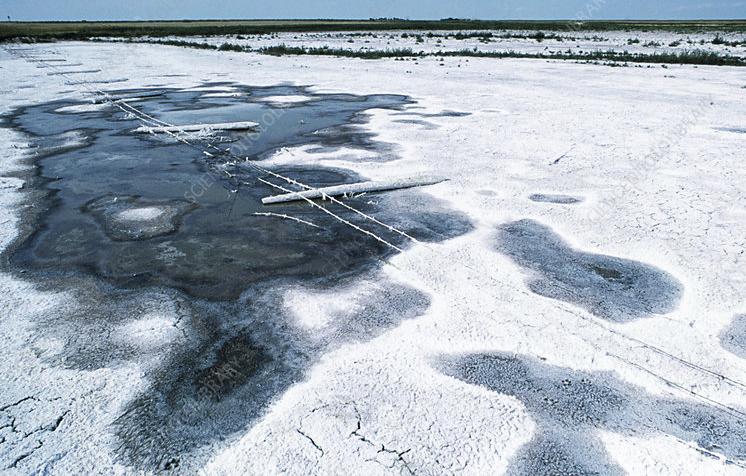
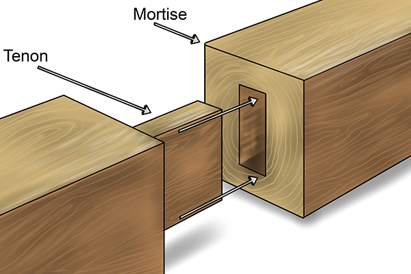
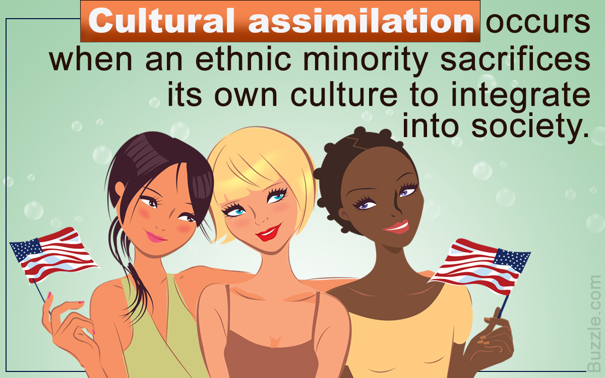

# 咬文嚼字-常见词根词缀

@(TOEFL)[托福, TOEFL, 词根词缀,咬文嚼字]

[toc]

## 希腊、日耳曼、拉丁

- **拉丁前缀**super-表示over,above，
- **希腊前缀**hyper-
- **日耳曼词源**的单词over同源

- **希腊前缀** **`an-`**表否定，
- 与**拉丁前缀** **`in-`**，比如 innocent ['ɪnəs(ə)nt] adj.无辜的；无知的，n.天真的人；笨蛋（词根noc-表to harm）和 
- **日耳曼前缀** **`un-`**，如unfair不同平的同源。

The word *[syndicate](https://en.wikipedia.org/wiki/Syndicate)* comes from the [French](https://en.wikipedia.org/wiki/French_language) word *syndicat* which means "[trade union](https://en.wikipedia.org/wiki/Trade_union)" (*[syndic](https://en.wikipedia.org/wiki/Syndic)* meaning "administrator"), from the [Latin](https://en.wikipedia.org/wiki/Latin) word *syndicus* which in turn comes from the [Greek](https://en.wikipedia.org/wiki/Ancient_Greek) word σύνδικος (*syndikos*), which means "caretaker of an issue"; compare to [ombudsman](https://en.wikipedia.org/wiki/Ombudsman) or [representative](https://en.wikipedia.org/wiki/Representation_(politics)).[[1\]](https://en.wikipedia.org/wiki/Syndicate#cite_note-1)

**gen- / kin** | **General, King**

希腊拉丁词根**`gen-`**, **`gon-`**表示生产（孩子），与日耳曼词源的**kin** [kɪn]n.亲戚；家族；同族，adj.同类的；有亲属关系的，同源。

大家一起生孩子，就有了宗族的概念。按照这个道理，希腊拉丁人对本族人**generous** ['dʒen(ə)rəs] adj.慷慨的；有雅量的，而日耳曼人对本族人则是**kind** adj.和蔼的；宽容的。 

同样，拉丁人的首长是**general** ['dʒen(ə)r(ə)l] adj.一般的；综合的，n.一般；将军（形容词是说适用于整个宗族），而日耳曼人部落的首领则是**king**。后缀**`-gen`**表示**producer**，比如**hydrogen** ['haɪdrədʒ(ə)n] n.氢，因它燃烧后生成水（hydro-），而日耳曼后缀**`-kind`**，比如**mankind**那是“种类”是“人”。

这样我们也就好理解这三个单词了：

- **akin** [ə'kɪn] adj.类似的；同类的；同族的，那是因为它的意思是“**of the same kin**”，
- 而**kindred** ['kɪndrɪd] adj.同类的；血缘的；同族的，n.家族；相似，后缀**`-red`**表状态，实际就是**hundred**中的**-`red`**，
- 而**kinsman** ['kɪnzmən] n.男性亲戚；同族者，则是本族之人。

## -ion / -ation / -ition  表名词，“行为、动作、状态、过程、结果；物品” {1759}

| 单词                                                         | 解释                                                         | 单词                                                         | 解释                                                         |
| ------------------------------------------------------------ | ------------------------------------------------------------ | ------------------------------------------------------------ | ------------------------------------------------------------ |
| **crit-er-ion**                          【kraɪˈtɪriən】 | **`crit-`**判断 + **`-er`** + **`-ion`**。 即区分的关键，标准。 **`crit-`** = judge, discern, 表示“判断，分辨”。源自希腊语 krinein "to separate, decide, judge." **`-ion`** 表名词，“行为、动作、状态、过程、结果；物品”等。 | **crit-er-ia**                            【kraɪ'tɪriə】 | **`crit-`** = judge, discern, 表示“判断，分辨”。源自希腊语 krinein "to separate, decide, judge." **`-a`** 由希腊语和拉丁语直接进入英语的表示复数的后缀。 |
| **at∙tent∙ion**  【əˈtenʃn】                            | 不要误写成： atten**s**ion 2022年1月24日09:17:15 **`at-`** 来自拉丁介词ad, 表示“朝、向、去，或弱化为强调”。 **`tent-`** = stretch, 表示“伸展”，引申为“倾向”等。源自拉丁语 tendere "to stretch, extend." **`-ion`** 表名词，“行为、动作、状态、过程、结果；物品”等。 |                                                              |                                                              |
|                                                              |                                                              |                                                              |                                                              |

## -al / -ial 表形容词， ”...的“ {1146}

| 单词                                                   | 解释                                                         | 单词                                                         | 解释                                                         |
| ------------------------------------------------------ | ------------------------------------------------------------ | ------------------------------------------------------------ | ------------------------------------------------------------ |
| **genit-al**                         【ˈdʒenɪtl】 | **genit-** = birth, produce, 表示“出生，产生”，医学上引申为“生殖或基因”。 生殖的;生殖器的。 => genit-al-ia | **bacteri-al**                           【bækˈtɪriəl】 | **`bacter-`** = bacterium, 表示“细菌”。源自希腊语 baktron "staff." 细菌的;细菌引起的 |
| **cervic-al** 【ˈsɜːrvɪkl】                       | **cervic-** 表示“颈，宫颈”，多用于医学领域。和表示角的horn同源。源自拉丁语 cervix "neck."  1.子宫颈的connected with the cervix 2. 颈的connected with the neck cervical vertebra 【ˈsɜːrvɪkl ˈvɜːrtɪbrə】 | **act-ual**                                                  | **`act-`** = to do, to drive, 表示“行动，做” 。源自拉丁语 agere (过去分词 actum) "to do, act, drive, conduct, lead, weigh." **`-ual`** 表形容词，“…的”，一般缀于名词后。源自拉丁语 -alis, adjective suffix. 真实的;实际的;(强调事情最重要的部分)真正的，…本身 |
| **later-al** 【ˈlætərəl】                         | **`later-`** = side, 表示“边”。 connected with the side of sth or with movement to the side。侧面的；横向的；向侧面移动的， If career advancement is important to you there may be some lateral moves that would work our for you and the company. | **uni-vers-al** 【ˌjuːnɪˈvɜːrsl】                       | **`uni-`**一个 + **`vers-`**转 + **`-al`**。即转为一体的，引申义通用的。 **`universe`**  n. 宇宙, 星系, (思想等)范围 普遍的;全体的;全世界的;共同的;普遍存在的;广泛适用的 |
| **lab-ial** 【ˈleɪbiəl】                          | **`lab-`** = lip, 表示“唇”。源自拉丁语 labrum "to lick; lip." **`-ia`**l  表形容词，“…的”，一般缀于名词后。源自拉丁语 -alis, adjective suffix. | **mur∙al** 【ˈmjʊrəl】                                  | **`mur-`** = wall, 表示“墙壁”。源自拉丁语 murus "wall." 1 - 缩写自 mural painting,壁画，来自拉丁语  murus,墙，墙壁，来自 PIE*mei,修建，巩固，防御工事，可能来自 PIE*mo,辛劳，劳作，词源同 mole,防洪堤，城墙，大型工事。 |
| **apprais-al** 【əˈpreɪzl】                       | n. 评价, 估价 appraise【估价】 + -al 。 appraise  vt. 评价, 估价 **performance appraisal** 业绩评价 **real estate appraisal** 房地产评估，不动产评估 **project appraisal** 项目评估 |                                                              |                                                              |

## -ic 

### 1. 表形容词, "...的" {1012}

| 单词                                                         | 解释                                                         | 单词                                   | 解释                                                         |
| ------------------------------------------------------------ | ------------------------------------------------------------ | -------------------------------------- | ------------------------------------------------------------ |
| **acid-ic**                                    【əˈsɪdɪk】 | 酸的;酸性的;很酸的                                           | **academ-ic**                          | a.学术的(与实践性、技术性相对);学业的;教学的(尤指与学校教育有关);学习良好的 n.高等院校教师;高校科研人员 |
| **en-dem-ic** 【enˈdemɪk】                              | **`en-`** <br/表示“入、内、在...之内、使...”，来自古法语 en-。在字母 b, m, p 前拼写同化为 em-。 **`dem-`** = people，表示“人民，民众”。源自希腊语 demos "people, land." **en-在…内 + dem-人民 + -ic → 在人民内 → 地方性的。** adj.地方性;(某地或某集体中)特有的;流行的;难摆脱的 n.地方病;某地特产的植物[动物] | **pan-dem-ic** 【pænˈdemɪk】      | **`pan-`** 表示“全部的、广泛的”。 **`dem-`** = people，表示“人民，民众”。源自希腊语 demos "people, land." **pan-到处 + dem-人 + -ic表形容词 → 人群中到处流行的。** n.(全国或全球性)流行病;大流行病 adj. （疾病）大流行的;普遍的，全世界的 |
| **epi-demic** 【ˌepɪˈdemɪk】                            | **epi-在...周围 + dem-人民 + -ic → 在人民周围 → 流行的。** **`epi-`** 表示“在…上，在…周围，在…后面”。源自希腊语 epi "on, over, at." **`dem-`** = people，表示“人民，民众”。源自希腊语 demos "people, land." | **demo-crat-ic** 【ˌdeməˈkrætɪk】 | **`demo-`** = people，表示“人民，民众”。源自希腊语 demos "people, land." **`crat-`** = rule, ruler, 表示“统治或政体，统治者”，最初含义表示“力量”。也引申为“支持者，参加者”等。源自希腊语 kratos "strength, might, power." |
| authent.ic                                                   | 可靠的，可信的，真正的                                       | auto.bio.graph.ic                      | 自转的                                                       |
| **`zo.ic`**                                                  | a. 动物的, 有...的(动物)生活方式的, 有生物的, 含有动植物遗迹的化石的 | a.zo.ic                                | **`-a`**：加在单词前，表示“在…的”；表示“不、无、非”；表示“加强”。源自希腊语 a-, an- "not." 无生命痕迹的，无生的 |
| a-centri-ic                                                  | 无中心的                                                     | **agatic** 【æg'nætɪk】           | 男系亲属的，男方的；同族的                                   |
| Arabic                                                       | 阿拉伯语的，阿拉伯人的                                       | barbar-ic 【bɑːrˈbærɪk】          | 残暴的;野蛮的;没有文化的;野蛮人的;原始部落人的               |
| calc.ic 【kælsɪk】                                      | 含钙的;石灰质的                                              | civic civ-ic                      | 公民的，市的                                                 |
| autom-ic                                                     | 原子的，原子能的                                             | hydr-ic                                | 氢气的，含氢的                                               |
| manson-ic                                                    | 共济会会员的                                                 | **mim-ic** 【ˈmɪmɪk】             | 模仿(人的言行举止);(外表或行为举止)像 to copy the way sb speaks, moves, behaves, etc., especially in order to make other people laugh【第三人称单数：mimics；现在分词：mimicking；过去分词：mimicked】 *"I'm so sorry", she mimicked* |
| **poet-ic** 【poʊˈetɪk】                                | 诗歌的;诗的;像诗一般的;富有诗意的：like or suggesting poetry, especially because it shows imagination and deep feeling | aur.ic                                 | 金的                                                         |
| **kinet-ic**                        【kɪˈnetɪk】        | **`kinet-`** 表示“运动，活动”。源自希腊语 kinein "to move." of or produced by movement.运动的;运动引起的 kinetic energy 动能 | **kinet-ics** 【kəˈnɛtɪks】       | the branch of mechanics concerned with the forces that cause motions of bodies（动力学） |
| **diagnost-ic** 【ˌdaɪəɡˈnɑːstɪk】                      | **`-ic`** 表形容词，“…的”。 **`diagnose`** v. 诊断。 connected with identifying sth, especially an illness | **peri-pher-al** 【pəˈrɪfərəl】   | **`peri-`**四周 + **`pher-`**带来 + **`-al`**形容词后缀 → 周边带来的 → 不重要的 , 外围的。 周边的;外围的;次要的;附带的;与计算机相连的。  **`peri-`** 表示“周围，靠近”。 **`pher-`** = to bring, 表示“带来”。源自希腊语 pherein "to carry." |

### 2. 表名词，“人或学科”{23}

| 单词                                                         | 解释                                                         | 单词                                 | 解释                                                         |
| ------------------------------------------------------------ | ------------------------------------------------------------ | ------------------------------------ | ------------------------------------------------------------ |
| **Meta-phys-ic-s**                               【ˌmetəˈfɪzɪks】 | **`meta-`**在后/在..之上 + **`phys-`**物理 + **`-ic`**表形容词. 形而上学：the branch of philosophy that deals with the nature of existence, truth and knowledge | cyn-ic                               |                                                              |
| rhetor-ic                                                    |                                                              | techn-ic                             |                                                              |
| etiolog-ic                                                   |                                                              | em-pir-ic                            |                                                              |
| log-ic                                                       |                                                              | **arithm∙et∙ic** 【əˈrɪθmətɪk】 | **`arithm-`** = number, 表示“数字”。源自希腊语 arithmos "number, amount." 算术;算术运算;四则运算 |
| crit-ic                                                      |                                                              | med-ic                               |                                                              |
| a-gnost-ic                                                   |                                                              | zoogeograph-ic                       |                                                              |
| ocean-o-graph-ic                                             |                                                              | ophthalmo-log-ic                     |                                                              |
| serolog-ic                                                   |                                                              |                                      |                                                              |

## -ism {724}

可以参阅：哪些专业名词翻译得特别烂？ - Gengius的回答 - 知乎 https://www.zhihu.com/question/27192923/answer/2068334212

抽象名词后缀，表示“…主义”；“宗教”；“制度、行为”；“…学”、“…术”、“…论”、“…法”；“疾病名称”；“情况、状态”等。

### 1. …的行为（或结果）

**the action or result of**

| 单词                               | 解释                                                   | 单词                                                 | 解释                                                         |
| ---------------------------------- | ------------------------------------------------------ | ---------------------------------------------------- | ------------------------------------------------------------ |
| **criticism** 【ˈkrɪtɪsɪzəm】 | 批评;批判;责备;指责;(尤指对书、音乐等的)评论文章，评论 | [vandalism](https://en.wikipedia.org/wiki/Vandalism) | [汪达尔~~主义~~行为](https://baike.baidu.com/item/%E6%B1%AA%E8%BE%BE%E5%B0%94%E4%B8%BB%E4%B9%89/9538262?fr=aladdin) **Vandalism** is the **`action`** involving deliberate destruction of or damage to public or private property.  故意破坏文物的行为，破坏他人财产的行为，汪达尔人的作风 |
|                                    |                                                        |                                                      |                                                              |
|                                    |                                                        |                                                      |                                                              |

#### vandalism（肆意破坏）：大肆破坏罗马城的汪达尔人。

汪达尔人（**Vandal**）是古代日耳曼民族中的一支，在欧洲民族大迁徙时期，曾在北非今突尼斯地区建立了一个汪达尔王国。

公元455年，他们从海上出发，入侵意大利并占领了罗马城，在罗马城中进行了历时两周之久的大肆掠夺和破坏活动。他们将罗马城中所有能搬上船的东西统统搬走，甚至连神庙上的镀金瓦片也都揭走。原本是欧洲文化中心的罗马城遭到严重破坏，大批珍贵文物被劫走或损坏。

 

汪达尔王国于公元533年被东罗马军队攻陷，国王被关押在君士坦丁堡，大部分人口被发配至东罗马帝国各处。从此，汪达尔人作为一个民族从历史中消失了，但他们在罗马城所犯下的滔天罪恶却永远不会被世人遗忘。

 

英语中为此诞生了一个新词**vandalize**，用来表示像汪达尔人破坏罗马城那样的破坏行径。

- **vandalize**： ['vændəlaɪz] vt.肆意破坏，摧毁

- **vandalism**： ['vænd(ə)lɪz(ə)m] n. 故意破坏文物的行为，破坏他人财产的行为，汪达尔人的作风
- **Vandal**：['vændl] n. 汪达尔人adj. 汪达尔人的

**Reference**

1. [The Vandals sacked Rome, but do they deserve their reputation?](https://www.nationalgeographic.com/culture/article/vandals-sacked-rome-deserve-reputation)
2. 

### 2. …的状态（或品质）（“情况、状态”）

**the state or quality of**

| 单词                             | 解释                                                         | 单词                  | 解释                                                         |
| -------------------------------- | ------------------------------------------------------------ | --------------------- | ------------------------------------------------------------ |
| **hero-ism** 【ˈheroʊɪzəm】 | 英勇表现;英雄精神(very great courage) He received a medal for his heroism. | **thermo-period-ism** | n. 温周期现象 推荐：thermo-热 + periodism【周期】  **`thermo-`** = heat, 表示“热”。源自希腊语 thermos "warm, hot, heat." **`period`** n. 时期, 节段, 节, 句点, 学时, 周期 a. 当时特有的, 过去某段时期的 interj. 就是这话, 就是这么回事 **`-ism`** 抽象名词后缀 |
|                                  |                                                              |                       |                                                              |
|                                  |                                                              |                       |                                                              |

### 3. …的教义（或体系、运动）/（“宗教”；“制度、行为”）

**the teaching, system or movement of**

| 单词                                | 解释                                                         | 单词                                              | 解释                                                         |
| ----------------------------------- | ------------------------------------------------------------ | ------------------------------------------------- | ------------------------------------------------------------ |
| **Buddhism** 【ˈbʊdɪzəm】      | 来自 PIE*bheudh,醒悟，意识，词源同 Bodhisattva,菩萨。 佛教 | **socialism** 【ˈsoʊʃəlɪzəm】                | social  a. 社会的, 群居的, 社交的 n. 联欢会              |
| **melior-ism**  【miljərɪzəm】 | 社会向善论 the belief that the world can be made better by human effort  **`melior-`** = better, 表示“更好”，这里 -or 表示比较级。源自拉丁语 melior "better." **`-ism`** 抽象名词后缀，表示“…主义”；“宗教”；“制度、行为”；“…学”、“…术”、“…论”、“…法”；“疾病名称”；“情况、状态”等。 词源说明(童理民)   1 - 来自 meliorate,改善，变好，-ism,主义，思想。引申词义社会向善论。 | **agnostic∙ism    **      【æɡˈnɑːstɪsɪzəm】 | n. 不可知论 agnostic【不可知论者】 + -ism **`agnostic`** n. 不可知论者 不可知论者是指对基督教神学教条表示怀疑，但又拒绝无神论，主张把上帝是否存在这一类问题搁置起来的人。这种哲学学说就是**`agnosticism`**（“不可知论”） |
|                                     |                                                              | **totalitarianism** 【toʊˌtæləˈteriənɪzəm】  | n. 极权主义 推荐：totalitarian【a. 极权主义的】 + -ism抽象名词后缀，表示“...主义，思想” totalitarian a. 极权主义的 n. 极权主义者 -ism   |
|                                     |                                                              |                                                   |                                                              |

#### agnosticism（不可知论）：处于有神论和无神论之间的哲学学说

> **`a-`**,非，没有，**`-gn`**,知道，词源同 can,know.此处用于宗教义，认为上帝不存在。
>
> **`a-`**  加在单词前，表示“在…的”；表示“不、无、非”；表示“加强”。源自希腊语 a-, an- "not."
> **`gnost-`** = know, 表示“知道”。源自拉丁语 (g)noscere "to get to know."
> **`-ic`** 表名词，“人或学科”。

英语单词**agnostic**最早在1869年由英国哲学家托马斯•亨利•赫胥黎 (**[Thomas Henry Huxley](https://en.wikipedia.org/wiki/Thomas_Henry_Huxley)**, 1825-1895) 在一次聚会上首次提出来的，用于描述他的哲学思想。

 金刚狼？

他认为，除感觉或现象而外，世界本身是无法认识的，“物质实体”和上帝、灵魂一样，都是不可知的。他以**agnostic**一词表示像他本人那样的“不可知论者”。**agnostic**源于希腊语的***ágnōstos***，其原意是“不知道的”（**unknowing**），“不可知的”（**unknowable**），含义则为“我不知道是不是存在着上帝”。

> **agnostic**由否定前缀**`a`**加上希腊语中表示“知道”的单词**`gnostos`**复合而成，字面意思就是“不知道”。这种哲学否认认识世界或彻底认识世界的可能性。

在Huxely那里，不可知论者是指对基督教神学教条表示怀疑，但又拒绝无神论，主张把上帝是否存在这一类问题搁置起来的人。这种哲学学说就是**`agnosticism`**（“不可知论”）。 

- **agnostic**：[æg'nɒstɪk] adj.不可知论的n.不可知论者
- **agnosticism**：[æɡ'nɒstɪsɪzəm] n.不可知论
- She likes to keep an open mind in religious matters and so refers to herself as an agnostic. (LLA) 在宗教问题上她愿意听取不同的意见，所以称自己为不可知论者。
- I'm agnostic about whether there really is a hell. (CID) 我不知是否真的有地狱。

###  4. 因…的不公平对待（或敌意）

**-ism** is used to form uncount nouns that refer to unfair or hostile treatment of a particular group of people.

| 单词   | 解释     | 单词 | 解释 |
| ------ | -------- | ---- | ---- |
| racism | 种族偏见 |      |      |
|        |          |      |      |
|        |          |      |      |

### 5. …语言特点（“…学”、“…术”、“…论”、“…法”）

**a feature of language of the type mentioned**

| 单词                         | 解释                                                         | 单词                                                     | 解释                                                         |
| ---------------------------- | ------------------------------------------------------------ | -------------------------------------------------------- | ------------------------------------------------------------ |
| Americanism                  | 美国英语的特点.(a word, phrase or spelling that is typical of American English, used in another variety of English) | **colloquialism**               【kəˈloʊkwiəlɪzəm】 | an informal word or phrase that is more common in conversation than in formal speech or writing (口语, 口语用法, 口语词, 方言, 口语体) |
| **mal-ism** 【meɪlɪzm】 | The evil of the world(现世邪恶说)                            | **syl-log-ism** 【ˈsɪlədʒɪzəm】                     | `syl-`一起，集中 + `log-`说话，思考，辩证 + `-ism`理论。 **`syl-`** 表示“共同，相同，对称”。源自希腊语 sun, xun "together, with." l**`og-`** = speak, 表示“说话”，更倾向于知识阶层的‘说’，所以经常引申为...学。源自希腊语 logos "speech, word, reason." 三段论, 推论, 演绎 |
|                              |                                                              |                                                          |                                                              |

### 6. 健康状况；疾病（“疾病名称”）

**a medical condition or disease**

| 单词                               | 解释                                                         | 单词                                  | 解释                                                         |
| ---------------------------------- | ------------------------------------------------------------ | ------------------------------------- | ------------------------------------------------------------ |
| **em-bol-ism** 【ˈembəlɪzəm】 | **`em-`** 表示“入、内、在...之内、使...”，来自古法语 en-。 在字母 b, m, p 前拼写同化为 em-。 **`bol-`** = throw, dance, ball, 表示“抛，舞，球”。 源自希腊语 ballein "to throw" An **embolism** is a serious medical condition that occurs when an artery becomes blocked, usually by a blood clot.（闰日, 栓塞(动脉被栓子堵塞)） | **alcoholism** 【ˈælkəhɑːlɪzəm】 | 酒精中毒 People who suffer from **alcoholism** cannot stop drinking large quantities of alcohol. |
|                                    |                                                              |                                       |                                                              |
|                                    |                                                              |                                       |                                                              |

## -ize / -ise 动词后缀，一般缀于形容词后{701}

> 源自希腊语 -izein, verbal suffix.
>
> -ise 是英式英语，-ize 是美式英语。

| 单词                             | 解释                                                         | 单词                                                  | 解释                                                         |
| -------------------------------- | ------------------------------------------------------------ | ----------------------------------------------------- | ------------------------------------------------------------ |
| **salin-ize ** 【sælɪnaɪz】 | vt. 使(土壤等) 盐化 推荐：saline【盐的】 + -ize  **`saline`** a. 盐的, 苦涩的, 由碱金属(或含镁之盐类)组成的 n. 盐湖, 盐田, 碱盐泻药, 生理盐水 **`-ize`** 动词后缀，一般缀于形容词后。-ise 是英式英语，-ize 是美式英语。源自希腊语 -izein, verbal suffix.  | **alkal-ize  **                    【ælkəˌlɑɪz】 | vt. 使成碱性 推荐：alkal-碱 + -ize, 表动词  **`alkal-`** 表示“碱”，源自阿拉伯语 al-qaliy (the ashes)。al-是阿拉伯语中的定冠词 "the"。 **`-ize`** 动词后缀，一般缀于形容词后。-ise 是英式英语，-ize 是美式英语。源自希腊语 -izein, verbal suffix.  |
|                                  |                                                              |                                                       |                                                              |
|                                  |                                                              |                                                       |                                                              |

### -ise  表名词，“物品，状态”{5}

| 单词                                    | 解释                                                         | 单词                                 | 解释                                                         |
| --------------------------------------- | ------------------------------------------------------------ | ------------------------------------ | ------------------------------------------------------------ |
| **merch-and-ise** 【ˈmɜːtʃəndaɪz】 | n. 商品, 货物 v. 交易, 买卖 推荐：merch-交易 + -and + -ise, 表名词。引申词义商品，商品销售，销售。  **`merch-`** = trade, 表示“交易”。 **`-ise`** 表名词，“物品，状态”。 | **turqu-o-ise ** 【ˈtɜːrkwɔɪz】 | n. 绿松石, 绿松石色 推荐： **`turqu-`**, = Turk 突厥 (原意strong) + -**`oise`**附在地名后构成形容词，字面意思：土耳其的石头，因蓝玉首先发现于土耳其斯坦(**Turkestan**) 。 **`-ise`** 表名词，“物品，状态”。  词源说明(童理民)   1 - 来自古法语 pierre turqueise,来自土耳其的石头，来自 pierre,石头，词源同 petrol,turqueise,土耳其的，词源同 Turkish. |
| **tenon** 【ˈtenən】               | n. 雄榫, 凸榫 vt. 接榫, 在(木料)上开榫  词源说明(童理民)   1 - ten-,持有，握住，-on,小词后缀。后用于指工具接榫，榫头。  | **mort-ise** 【ˈmɔːrtɪs】       | n. 榫**sǔn**眼 （榫(sǔn)卯(mǎo) )  vt. 开榫眼于, 使上榫 推荐：mort-死 + -ise, 表名词  **`mort-`** = death, 表示“死”。源自拉丁语 mors (词干 mort-) "death." **`-ise`** 表名词，“物品，状态”。  词源说明(童理民)   1 - 来自古法语 mortaise,可能来自阿拉伯语 murtazz,系紧，系牢，来自 mu-,表位置，razza,插入，插进。引申词义榫眼，接合。 |
| **ex-erc-ise** [^4]                     | n. 行使, 执行, 运动, 练习, 作业 vt. 运用, 练习, 运动 vi. 练习, 锻炼 推荐：ex-向外 + erc-保护，限制，隐藏 + -ise. 即去除限制，进行练习。  **`ex-`** 表示“从，从...离开，从...向外，向外，向上”，来自PIE *eghs, 向外。 **`erc-`** [^3] = to hold, contain, guard, 表示“限制、抓住、保护”。 **`-ise`** 表名词，“物品，状态”。 词源说明(童理民)   1 - ex-,向外，-erc,保护，限制，隐藏，词源同 ark,arcane.即去除限制，进行练习 | **treat-ise** 【ˈtriːtɪs】      | n. 论文, 专著 推荐：treat【对待，处理】 + -ise名词后缀。引申词义论文。 **`treat`** n. 宴请, 款待; 乐趣 vt. 视为, 对待, 论述, 治疗, 款待 vi. 讨论, 谈判, 作东 **`-ise`** 表名词，“物品，状态”。 词源说明(童理民)   1 - treat,对待，处理，-ise,名词后缀。引申词义论文。 |

[^3]: 原始印欧语形式 *ark- 。 (Ark) 方舟是诺亚夫妇在大洪水中用来保护人和动物的. exercise 原指把牲畜从围栏中赶出来吃草的行为. 反过来把牲畜赶回到围栏就是强制和胁迫 (coerce).

[^4]: 摩西英语(摩西) exorcise ['eksɔːsaɪz] vt. 驱邪；除怪。前缀ex-表out of，后缀-ise表使动，词根orc实际表誓言，衍生词不多，因此可以理解为to drive out or call up the evil spirits.不过我们和exercise联系起来吧！exercise中的词根-erc同Noah's Ark中的ark方舟，本指盒子等容器，锻炼就是get out of the box啦!

## `-ity` 表名词，指具备某种性质{677}

| 单词                                                         | 解释                                                         | 单词                                                         | 解释                                                         |
| ------------------------------------------------------------ | ------------------------------------------------------------ | ------------------------------------------------------------ | ------------------------------------------------------------ |
| **long-ev-ity**                           【lɔːnˈdʒevəti】 | **`long-`** = long, 表示“长”。源自拉丁语 longus "long." **`ev-`** = age, 表示“年龄，时代”。源自拉丁语 aevum "age, eternity," etās (词干 aetāti‑) "age," aeternus "eterna." | **acid-ity**                                【əˈsɪdəti】 | acid  n. 酸, 酸类物质, 尖刻, 迷幻药 a. 酸的, 酸性的, 尖刻的, 敏锐的：the state of having a sour taste or of containing acid |
| **veloc-ity** 【vəˈlɑːsəti】                            | **`veloc-`** = fast，表示“速度”。源自拉丁语 velox "fast." **`-ity`** 表名词，指具备某种性质。 词源说明(童理民)   1 - 来自拉丁语 volo,飞，词源同 volatile,volley.引申词义极快的速度。或来自拉丁语 vehere,携带，运载，词源同 vehicle. the speed of sth in a particular direction(沿某一方向的)速度;高速;快速 | **melior-ity**  【mil'jɒrətɪ】                          | 盖上，优越性，进步 the state or condition of being improved melior- = better, 表示“更好”，这里 -or 表示比较级。源自拉丁语 melior "better." -ity 表名词，指具备某种性质。  |
|                                                              |                                                              |                                                              |                                                              |

## **`-ist`**  表名词，表示“信仰者，专家或从事某活动的人”{559}

| 单词                                | 解释                                                         | 单词 | 解释 |
| ----------------------------------- | ------------------------------------------------------------ | ---- | ---- |
| prot-agon-ist 【prəˈtæɡənɪst】 | **`prota-`**第一的 + **`agon-`**挣扎，表演 + **`-ist`**表人。 **`agon-`** = struggle, 表示“挣扎，斗争”。源自希腊语 agein "to drive, lead, weigh." |      |      |
|                                     |                                                              |      |      |
|                                     |                                                              |      |      |

## -ate

### 1. 表动作，“做，造成” {570}

| 单词                                                         | 解释                                                         | 单词                                               | 解释                                                         |
| ------------------------------------------------------------ | ------------------------------------------------------------ | -------------------------------------------------- | ------------------------------------------------------------ |
| **con-greg-ate**                             【ˈkɑːŋɡrɪɡeɪt】 | **`con-`** 来自拉丁语介词com，表示“与...一起，一起（with, together）”，或仅做强调。 **`greg-`** = group, 表示“群体”，来自拉丁语。源自拉丁语 grex (词干 greg-) "herd, flock." ***群集;聚集;集合*** | **ac-celer-ate** 【əkˈseləreɪt】              | **`ac-`**加强 + **celer**-速度 + **-ate**动词后缀 → 一再增加速度。 **`celer-`** = quick, speed, 表示“快，速”。源自拉丁语 celer "swift." |
| **activ-ate** 【ˈæktɪveɪt】                             | active【活跃的】 + -ate使… → 使…活动。 vt.使活动;激活;使活化。 The gene is activiated by a specific protein | **administr-ate**           【əd'mɪnɪstreɪt】 |                                                              |
| **ag-greg-ate** 【ˈæɡrɪɡət , ˈæɡrɪɡeɪt】                | **`ag-`**增加 + **`greg-`**群体 + **`-ate`**, 表动词 → 增加团体 → 聚集。 ***合计;总计*** | **al-lev-i-ate** 【əˈliːvieɪt】               | **`lev-`** = raise, lighten, 表示“提高，举起，变轻”。源自拉丁语 levis "light." **`al-`**同ad- + **`levi-`**轻 + **`-ate`**动词后缀 → 使轻松 → 缓和 |
| **ac-cumul-ate** 【əˈkjuːmjəleɪt】                      | 积累;积聚;(数量)逐渐增加;(数额)逐渐增长                      | **na-rr-ate** 【ˈnæreɪt】                     | **`na-`**=gno-知道 + -**`r(r)`**拉丁语现在不定式格 + **`-ate`**, 表动，词引申词义叙述，告知。 讲（故事）；叙述 \| 给（纪录片或节目）作解说 |
| **circ-ul-ate** 【ˈsɜːrkjəleɪt】                        | **`circ-`**圆 , 环 + **`-ul`** + **`-ate`**, 表动词 → 绕圈走 → 循环。  **`circ-`** = ring, 表示“圆环”。源自希腊语 kirkos, krikos "a ring." | **satur-ate**[^6] 【ˈsætʃəreɪt】              | **`satur-`**做够 + **`-ate`**, 表动词 → 使足够 → 饱和。 **`satur-`** = enough, full of food, 表示“足够，饱足”。源自拉丁语 satis "enough, sufficient," satur "full (of food), sated." |
| **facilit-ate**  【fəˈsɪlɪteɪt】                   | facile【a. 容易的】 + -it + -ate能够 → 使能够做 → 使容易。 **facile** a. 容易的, 不动脑筋的+**-ate** 表动词，“做，造成”。 to make an action or a process possible or easier | **fac-ile** 【ˈfæsl】                         | **`fac-`**做 + **`-ile`**, 表形容词; **`fac-`** = make, do, 表示“做，制作”。源自拉丁语 facere "to do, make." **`-ile`** 表形容词，“…的”。源自拉丁语 -ilis, adjective suffix. 1. produced without effort or careful thought 2. obtained too easily and having little value |
| **temper-ate** 【ˈtempərət】                            | temper-调节 + -ate, 表形容词 → 脾气[不坏] → 有节制的。  temper∙ate  [词根树] temper-  = moderate, 表示“调和”。 气候温和的;温带的;温和的;心平气和的;自我克制的 | **plac-ate** 【ˈpleɪkeɪt】                    | 推荐：**`plac-`**平 + **`-ate`**, 表动词 → 使…平静。 **plac-** = to please, 表示“取悦，使满意，使平静”。源自拉丁语 placere "to please, be agreeable," placare "to calm." |
| **pollen** 【ˈpɑːlən】                                  | **`pol-`** = dust, 表示“灰尘”。源自拉丁语 pollen "fine flour, dust."  1 - 来自拉丁语 pollen,谷物粉，面粉，来自 PIE*pel,面粉，粉末，粉尘，词源同 polenta,powder.后引申词义花粉。 | **pollin-ate** 【ˈpɑːləneɪt】                 | pollen【花粉】 + -ate使。  **`pol-`** = dust, 表示“灰尘”。源自拉丁语 pollen "fine flour, dust." **-ate** 表动词，“做，造成”。  |
| **per-col-ate** 【ˈpɜːrkəleɪt】                         | per-贯穿 + col-排水 + -ate, 表动词 → 水流穿过 → 渗透。 **`per-`** 表示“完全，贯穿，自始至终，向前”。forth, ford 是其同源词。 **`col-`** = to strain, 表示“排水”。源自拉丁语 colum "sieve."  v.渗入;渗透;渗漏;逐渐流传;传开;(用渗滤式咖啡壶)滤煮;滤煮咖啡 n.渗出液 to move gradually through a surface that has very small holes or spaces in it | **dis-sip-ate** 【ˈdɪsɪpeɪt】                 | dis-,分开，散开，-sip,扔，分散。引申词义挥霍，浪费。  **`dis-`**  来自拉丁语dis-，表示“分开，散开”，引申词义“离开，无，没有，缺乏，表相反等”。该前缀在字母 g, l, m, r, s, v 前缩写为 di-；在字母f前同化为 dif-。 **`sip-`**  = to throw, 表示“扔出去”。源自拉丁语 supar "to throw, scatter."  |
| **domestic-ate** 【dəˈmestɪkeɪt】                       | vt. 驯养; 驯化; 使精于家务 推荐： domestic【家里的】 + -ate, 表动词 → 使成为家里的 → 驯养动物。 1. to make a wild animal used to living with or working for humans. 2. to grow plants or crops for human use 3. (often humorous) to make sb. good at cooking, caring for a house, etc.; to make sb. enjoy home life. | **suf-foc-ate** 【ˈsʌfəkeɪt】                 | vt. 使窒息, 噎住, 闷熄 vi. 闷死, 窒息, 受阻 推荐：**suf-下面 + foc-喉咙 + -ate, 表动词 → 把(手)放喉咙下 → 窒息**。 **`suf-`**  = sub-，用在同辅音词根前表示“在…下面”。源自拉丁语 sub "under." 更多同源词... **`foc-`**  表示“咽喉”，参见拉丁语 lauces“咽喉、喉咙”。 词源说明(童理民)   1 - 来自**拉丁语** suffocare,窒息，扼住咽喉，来自 suf-,在下，fauces,喉咙，词源同 faucet,水龙头。 |
| **sub-stant-i-ate** 【səbˈstænʃieɪt】                   | vt. 使实体化, 事实,证实 推荐： **`sub-`**下面 + **`stant`**-站 + -`i`- + **`-ate`**, 表动词 → [把理论]物质化 → 证实。 | **liter-ate** 【ˈlɪtərət】                    | **`liter-`**文字 + **`-ate`** 引申词义有读写能力的。**`liter-`** = letter, 表示“文字，字母”。源自拉丁语 littera, litera "letter," 在拉丁语中原字母-d-受萨宾方言的影响变为-l-。 词源说明(童理民)   1 - 来自拉丁语 litera,书写，字母，词源同 letter.引申词义有读写能力的。 adj. 有读写能力的;有文化的 n. 识字的人;有学问的人 |
| **ex-termin-ate** 【ɪkˈstɜːrmɪneɪt】                    | vt. 扑灭, 消灭, 根绝 ex-出 + termin-限制 + -ate, 表动词 → 从界限中弄出来 → 根绝掉。 **`ex-`** 表示“从，从...离开，从...向外，向外，向上”，来自PIE *eghs, 向外。 **`termin-`** = limit, 表示“界限”。源自拉丁语 terminus "boundary, limit." **`-ate`** 表动词，“做，造成”。   | **flagell-ate** 【ˈflædʒəleɪt】               | vt. 鞭打, 鞭挞 a. 鞭状的, 鞭索形的, 有鞭毛的 n. 鞭毛虫 推荐：flagell-鞭子 + -ate  **`flagell-`** = whip, 表示“鞭子”。源自拉丁语 flagrum "a whip." **`-ate`** 表动词，“做，造成”。  词源说明(童理民)   1 - 来自 PIE*bhlag,击打，鞭笞，词源同 flail,flog. |
| **gest∙ate**[^7] 【ˈdʒesteɪt】                          | vt. 孕育 to carry a young human or animal inside the womb until it is born gest-含有，带来 + -ate, 表动词。  **`gest-`**= carry, bring, 表示“带来，产生”。源自拉丁语 gerere (过去分词 gestus) "to carry on, wage, perform." **`-ate`** 表动词，“做，造成”。 词源说明(童理民)   1 - 来自 gest-,含有，带来，词源同 exaggerate,gesture.引申词义孕育 | **e-viscer-ate** 【ɪˈvɪsəreɪt】               | vt. 取出内脏, 除去精华, 切除(病人)器官 vi. (因手术不良)内脏凸出 推荐：e-向外 + viscer-内脏 + -ate。  **`e-`** 表示“从，从...离开，从...向外，向外，向上”，来自PIE *eghs, 向外。 **`viscer-`** 表示“内脏”。源自拉丁语 viscera（internal organ）。 **`-ate`** 表动词，“做，造成”。 词源说明(童理民)   1 - e-,向外，viscera,内脏。 |
| **as-simi-ate** 【əˈsɪməleɪt】                          | vt. 使同化, 吸收, 使相拟, 把...比作 vi. 被吸收, 被同化 推荐：as- + simil-相同 + -ate, 表动词 → 成为相同 → 同化。  **`as-`** 来自拉丁介词ad, 表示“朝、向、去，或弱化为强调”。 **`simil-`** = alike, same, 表示“相类似，一样”。源自拉丁语 simulare "to make like, imitate, copy, represent." **`-ate`** 表动词，“做，造成”。 词源说明(童理民)   1 - as-,去，往，-sem,一，词源同 same. |                                                    |                                                              |

[^6]: satire（讽刺）：古罗马诗人Ennius的诗集

[^7]: 摩西英语(摩西) like terms(similiar terms)同类项。term n.术语；学期；期限；条款，vt. 把…叫做，collect the like terms就是合并同类项。词根term表终点、界限，后词义延伸为数学意义上的项，与thrum n.织边同源

### 2. 表形容词，“具有…的” {170}

>  -ate来自拉丁语动词的过去分词后缀，相当于-ed，表示动作已经完成。
>
>    --《[词源趣谈 | 人的脾气（temper）都是怎么来的？--钱磊博士》](https://mp.weixin.qq.com/s/Kxk29Lhd9Jljrn7-A535lA)

| 单词                                   | 解释                                                         | 单词                                 | 解释                                                         |
| -------------------------------------- | ------------------------------------------------------------ | ------------------------------------ | ------------------------------------------------------------ |
| **temper-ate  **    【ˈtempərət】 | a. 温和的, 适度的, 有节制的, 温带的 推荐：temper-调节 + -ate, 表形容词 → 脾气[不坏] → 有节制的。  **`temper-`** = moderate, 表示“调和”。 **`-ate`** 表形容词，“具有…的”。 词源说明(童理民)   1 - 来自 temper,管控，调节，-ate,形容词后缀。 即控制住的，引申词义气候温和的，特别用于指温带的。比较 tropic. | **ac-cur-ate**   【ˈækjərət】   | a. 正确的, 精确的 推荐：ac-加强 + cur-关心 + -ate, 表形容词 → 一再关心，弄精确为止。  **`ac-`** 来自拉丁介词ad, 表示“朝、向、去，或弱化为强调”。 **`cur-`** = care, 表示“关心”。源自拉丁语 cura "care." **`-ate`** 表形容词，“具有…的”。 词源说明(童理民)   1 - ac-,去，往，cure,关心。 |
| **tri-ate** 【ˈtɜːrnɪt】          | a. 三个组成的, 三个一套的, 三出的 推荐：tern【三个一组】 + -ate  **`tri-`** 表示“三”。源自希腊语 tri- "three." **`-ate`** 表形容词，“具有…的”。 | com-mens-ur-ate                      | 等量齐观的，同等的                                           |
| ad-equ-ate                             | 适当的，足够的                                               | dis-par-ate                          | 根本不同的，全异的，不相干的                                 |
| ap-propri-ate                          | 适当的                                                       | disproportion-ate                    | 不成比例的                                                   |
| affection-ate                          | 深情的，充满情爱的                                           | bin-ate                              | 成对的                                                       |
| companion-ate                          | 伙伴的，和谐的                                               | articul-ate                          | 发音清晰的，口才好的                                         |
| consider-ate                           | 体贴的，体谅的，考虑周到的                                   | ap-pell-ate                          | 上诉的，有权受理上诉的                                       |
| extrotion-ate                          | 敲诈的，勒索的，价格过高的，安规的                           | corpor-ate                           | 社团的，全体的，共同的，公司的                               |
| annul-ate                              | 环形的，有纹路的                                             | arcu-ate                             | 弓形的                                                       |
| acerv-ate                              | 成堆的                                                       | cancell-ate                          | 格子状的，网眼状的                                           |
| capit-ate                              | 头状的                                                       | capsul-ate                           | 胶囊包裹的，装入雷管的                                       |
| com-plan-ate                           | 平坦的，平面的                                               | cord-ate                             | 心脏形的                                                     |
| falc-ate                               | 镰状的，钩状的                                               | uncin-ate                            | 钩状的                                                       |
| virg-ate                               | 棒状的，多直细枝的                                           | virgul-ate                           | 棒状的                                                       |
| ligul-ate                              | 舌状的                                                       | lingu-l-ate                          | 舌状的                                                       |
| limb-ate                               | 有边的                                                       | line-ate                             | 划线的，标线的                                               |
| lun-ate                                | 新月状的，半月形的                                           | stell-ate                            | 星形的，似星的                                               |
| tunic-ate                              | 有膜皮的，有被囊的                                           | aure-ate                             | 金色的，镀金的，文体华丽的                                   |
| acer-ate                               | 针状的                                                       | ac-icul-ate                          | 有刺的，针状的，有针尖划痕的                                 |
| acule-ate                              | 有刺的，尖锐的，一针见血的                                   | Latin-ate                            | 从拉丁文衍生的，类似拉丁语的                                 |
|                                        |                                                              | **flagell-ate** 【ˈflædʒəleɪt】 | vt. 鞭打, 鞭挞 a. 鞭状的, 鞭索形的, 有鞭毛的 n. 鞭毛虫 推荐：flagell-鞭子 + -ate  **`flagell-`** = whip, 表示“鞭子”。源自拉丁语 flagrum "a whip." **`-ate`** 表动词，“做，造成”。  词源说明(童理民)   1 - 来自 PIE*bhlag,击打，鞭笞，词源同 flail,flog. |

### 3. 表名词，“人或地位”{42}

| 单词                                  | 解释                                                         | 单词                                | 解释                                                         |
| ------------------------------------- | ------------------------------------------------------------ | ----------------------------------- | ------------------------------------------------------------ |
| **vertebr-ate**  【ˈvɜːrtɪbrət】 | n. 脊椎动物 a. 有椎骨的, 有脊椎的 推荐： vertebr-脊柱 + -ate **`vertebra-`** = joint, vertebra, 表示“椎骨, 脊椎或连接处”， 源自拉丁语 vertebra，和词根 vert-（转）同源，-bra 为拉丁语工具格。 **`-ate`** 表名词，“人或地位”。 | **celib∙ate** 【ˈselɪbət】     | n. 独身者, 独身主义者 a. 独身的, 独身主义的 推荐： 来自拉丁词caelebs，未婚的。 **`celib-`** = single, 表示“单个”。 **`-ate`** 表名词，“人或地位” |
| **emir-ate** 【ˈemərət】         | n. 埃米尔的地位, 酋长国 推荐： emir【埃米尔】 + -ate -ate 表名词，“人或地位”。 emir n. 埃米尔(穆斯林国家酋长等的称号) | **consul-ate**  【ˈkɑːnsələt】 | n. 领事, 领事任期, 领事馆 **`consul`**【领事】 + **`-ate`**, 表名词。 |
| **prim-ate** 【ˈpraɪmeɪt】       | n. 大主教, 灵长目动物 推荐：prime【第一的，最初的，首要的】 + -ate名词后缀。后用于指灵长类动物。 prim- = first, chief, 表示“第一，主要的”。 -ate 表名词，“人或地位”。 词源说明(童理民)   1 - 来自 prime,第一的，最初的，首要的，-ate,名词后缀。后用于指灵长类动物。 |                                     |                                                              |

## -exo  表示“从，从...离开，从...向外，向外，向上” {405}

表示“从，从...离开，从...向外，向外，向上”，来自PIE *eghs, 向外。

- 该原始印欧语根进入希腊语产生变体形式 **`ek-`**
-  进入英语拼写演变为 **`ec-`**；
- 进入拉丁语演变成 **`ex-`**；
- 在浊辅音 b, d, g 和半辅音 j, l, m, n, r, v 前缩写成 **`e-`**；
- 在字母f前同化为 **`ef-`**。
- 源自希腊语 ex, ek "out of, from."
-  拉丁语 ex, ex- "out of, away from."

| 单词                                                   | 解释                                                         | 单词                                                         | 解释                                                         |
| ------------------------------------------------------ | ------------------------------------------------------------ | ------------------------------------------------------------ | ------------------------------------------------------------ |
| ex-mayor                                               | ex-husband ex-wife                                       | ex-ag-ger-ate                                                |                                                              |
| ex-act                                                 |                                                              | e-lev-ate                                                    |                                                              |
| ex-od-us                                               |                                                              | ec-stat-ic                                                   |                                                              |
| e-leg-ant                                              | **`e-`**出 + **`leg-`**=lig-选 + **`-ant`**表形容词 → 选出的 → 即选出来的，优秀的，优雅的 | an-ec-dote                                                   | **`an-`**没有 **`+ ec`**-=ex-向外 + **`dot-`**=don-给予。字面含义“没有发表出去的、未公开的”。 |
| ef-fect                                                |                                                              | ef-fort                                                      |                                                              |
| ex-gest                                                |                                                              | ex-cer-ment                                                  |                                                              |
| ex-crete                                               |                                                              | ef-fuse                                                      |                                                              |
| exo-crine                                              |                                                              | ef-fulg-ence                                                 |                                                              |
| **ef-front-ery**                   【ɪˈfrʌntəri】 | **`ef-`** 表示“从，从...离开，从...向外，向外，向上”，来自PIE *eghs, 向外。该原始印欧语根进入希腊语产生变体形式 ek-, 进入英语拼写演变为 ec-；进入拉丁语演变成 ex-；在字母f前同化为 ef-。 from." **`front-`** = forehead, 表示“前额”。源自拉丁语 frons "forehead, front." **`-ery`** 表名词，“行为，情况，身份，职业”等抽象名词或集合名词。 词源说明(童理民)   1 - ef-,向外，-front,前面，脸面。即不要脸的。 | as-ton-ish                                                   |                                                              |
| ex-pand                                                |                                                              | ex-odont-ia                                                  |                                                              |
| exo-centr-ic                                           |                                                              | **ex-termin-ate   **                    【ɪkˈstɜːrmɪneɪt】 | vt. 扑灭, 消灭, 根绝 ex-出 + termin-限制 + -ate, 表动词 → 从界限中弄出来 → 根绝掉。 **`ex-`** 表示“从，从...离开，从...向外，向外，向上”，来自PIE *eghs, 向外。 **`termin-`** = limit, 表示“界限”。源自拉丁语 terminus "boundary, limit." **`-ate`** 表动词，“做，造成”。  摩西英语(摩西) like terms(similiar terms)同类项。term n.术语；学期；期限；条款，vt. 把…叫做，collect the like terms就是合并同类项。词根term表终点、界限，后词义延伸为数学意义上的项，与thrum n.织边同源 |

## ad- / ac- 来自拉丁介词ad, 表示“朝、向、去，或弱化为强调”  {312}

- **`ad-`** 来自拉丁介词ad, 表示“朝、向、去，或弱化为强调”。

- 在字母 b, f, g, l, n, p, r, s, t 前同化为 ab-, af-, ag-, al-, an-, ap-, ar-, as-, at-；
- 在 c, k, qu 前同化为 ac-；
- 在 sc, sp, st 前缩写成 a-.

| 单词                                                   | 解释                                                         | 单词                                     | 解释                                                         |
| ------------------------------------------------------ | ------------------------------------------------------------ | ---------------------------------------- | ------------------------------------------------------------ |
| ac-celer-ate                                           | **`ac-`**加强 + **celer**-速度 + **-ate**动词后缀 → 一再增加速度。 **`celer-`** = quick, speed, 表示“快，速”。源自拉丁语 celer "swift."ex-husband ex-wife | ag-greg-ate           【ˈæɡrɪɡeɪt】 | **`ag-`**增加 + **`greg-`**群体 + **`-ate`**, 表动词 → 增加团体 → 聚集。 合计;总计 |
| ac-cumul-ate                    【əˈkjuːmjəleɪt】 | 积累;积聚;(数量)逐渐增加;(数额)逐渐增长                      |                                          |                                                              |

## -ment: 表名词，“行为或结果” {274}

## **`-ish`** 

### 1. 表形容词，“像…一样，有的…”，通常缀于名词或形容词后{262}

| 单词                                               | 解释                                                         | 单词                                         | 解释                                                         |
| -------------------------------------------------- | ------------------------------------------------------------ | -------------------------------------------- | ------------------------------------------------------------ |
| **snob-b-ish    **               【snɒbɪʃ】   | **`snob`** n. 势利小人; 自以为优越的人, 自命高雅的人(sine nobilitate) **`-ish`** 表形容词，“像…一样，有的…”，通常缀于名词或形容词后。 | **slav-ish** 【ˈsleɪvɪʃ】               | slave  n. 奴隶, 从动装置, 卑鄙的人 vi. 拼命工作 -ish  表形容词，“像…一样，有的…”，通常缀于名词或形容词后。 adj.无独创性的;盲从的;照搬的 |
| **Pol-ish      ** 【ˈpoʊlɪʃ】                 | **`pol-`** 表示“波兰”，源自波兰语 pole（土地）。 **`-ish`** 表形容词，“像…一样，有的…”，通常缀于名词或形容词后。 n.波兰语 adj.波兰的;波兰人的;波兰语的;波兰文化的 | **pol-ish          ** 【ˈpoʊlɪʃ】       | **`pol-`** = smooth, 表示“光滑”。源自拉丁语 polire "to make smooth, polish." **`-ish`** 表动词，“造成…”。  v.磨光;润色;擦光;修改;润饰 n.抛光;擦亮;上光;擦光剂;上光剂;亮光剂;擦光的面;打磨光亮的面;（表演的）完美，娴熟，精湛;文雅 |
| Jewish                                             | a. 犹太人的, 犹太族的 Jew【犹太】 + -ish表形容词         | Hunn-ish                                     | a. 匈奴人的, 野蛮的                                          |
| Gaul∙ish                                           | Gaul n. 高卢（位于欧洲西部）; 高卢人 -ish 表形容词，“像…一样，有的…”，通常缀于名词或形容词后。 a. 高卢的, 高卢人的 n. 高卢语 | ghoul∙ish                                    | ghoul n. 食尸鬼, 饿鬼, 盗墓者 -ish 表形容词，“像…一样，有的…”，通常缀于名词或形容词后。 a. 食尸鬼似的, 残忍的 |
| Frank-ish                                          | a. 法兰克语的, 法兰克人的 n. 法兰克语                    | Czech-ish 【ˈtʃekiʃ】                   | a. 捷克的, 捷克语的, 捷克人的 推荐： Czech【捷克】 + -ish表形容词 捷克语;捷克人;捷克的 |
| **plump-ish**                     【plʌmpiʃ】 | **`plump`** a. 圆胖的, 丰满的, 直接下落的, 直率的  vt. 突然放下, 支持, 使丰满, 使鼓起 vi. 扑通落下, 投票赞成, 变丰满, 鼓起 ad. 沉重地, 突然地, 直截了当地 **`-ish`** 表形容词，“像…一样，有的…”，通常缀于名词或形容词后。 a. 较丰满的(plump【丰满的】 + -ish表形容词) | **lav-ish **                 【ˈlævɪʃ】 | **`lav-`** = wash, 表示“洗，冲洗”。源自拉丁语 lavere "to wash," lavare "to wash." **`-ish`**表形容词，“像…一样，有的…”，通常缀于名词或形容词后。  ***av-冲洗 + -ish表形容词 → 冲掉 → 浪费。*** adj.奢华;慷慨的;大量的;给人印象深刻的;耗资巨大的;大方的 v.浪费;滥花;乱给 1 - 来自拉丁语 lavare,冲洗，涌出，词源同 lava,dilute,antediluvian,-ish,形容词后缀。即大量涌出的，大量的。 |
| forty-ish                                          | a. 近四十岁的, 四十岁左右的 推荐: forty【四十】 + -ish表形容词 | thrity-ish                                   | a. 近三十岁的, 三十岁左右的 单词笔记   ［添加］ 推荐： thirty【三十】 + -ish |
| gar∙ish                                            | gar- = furnish, 表示“装饰，供应”。源自古法语 guarnir "to equip." -ish 表形容词，“像…一样，有的…”，通常缀于名词或形容词后。  可能和 garnish【装饰】有关，也就是 gar-装饰 + -ish表形容词。 a. 穿着花哨的, 炫耀的, 过分装饰的 | freak-ish                                    | a. 朝三暮四的, 见异思迁的, 畸形的 单词笔记   ［添加］ 推荐： freak【反复无常】 + -ish表形容词 |
| fool-ish                                           | a. 愚蠢的, 傻的 范围：四级,专四,考研,雅思,高考 单词笔记   ［添加］ 推荐： fool【傻瓜】 + -ish表形容词 | faint-ish                                    | a. 较弱的, 有些昏晕的 推荐： faint【微弱的】 + -ish表形容词 |
| dump-ish                                           | a. 忧愁的, 忧郁的 推荐： dump + -ish表形容词         | dog-ish                                      | a. 狗一样的, 卑鄙的, 浮华的 推荐： dog【狗】 + -ish表形容词 |
| cad∙d∙ish                                          | cad n. 卑鄙的男人, 下流人, 无赖, 计算机辅助设计 -ish 表形容词，“像…一样，有的…”，通常缀于名词或形容词后。 cad【下流人】 + -d- + -ish（a. 下流的, 卑鄙的） | bull-ish                                     | a. 似公牛的, 看涨的, 上扬的 推荐：bull【牛】 + -ish表形容词 |
| bad∙d∙ish                                          | **`bad`** a. 坏的 n. 坏 ad. 坏地 **`-ish`** 表形容词，“像…一样，有的…”，通常缀于名词或形容词后。 a. 好读书的, 书呆子的 | baby∙ish                                     | baby n. 婴孩 -ish 表形容词，“像…一样，有的…”，通常缀于名词或形容词后。 |
| **kitten∙ish** 【ˈkɪtnɪʃ】                    | **`kitten`** n. 小猫 vt. 产仔 **`-ish`** 表形容词，“像…一样，有的…”，通常缀于名词或形容词后。 搔首弄姿的;卖弄风情的（lively, and trying to attract men's attention） | **coquett∙ish** 【koʊˈketɪʃ】           | coquet v. 卖弄风情 a. 卖弄风情的 n. 卖弄风情 -ish 表形容词，“像…一样，有的…”，通常缀于名词或形容词后。  If you describe a woman as **coquettish**, you mean she acts in a playful way that is intended to make men find her attractive. ...a coquettish glance.（卖弄风骚的一瞥） |
| **woman-ish** 【ˈwʊmənɪʃ】                    | a. (贬)似女子的, 女子气的, 适于女子的 单词笔记   ［添加］ 推荐： woman【女人】 + -ish表形容词 | **yellow-ish** 【ˈjeloʊɪʃ】             | yellow  n. 黄色 a. 黄色的 fairly yellow in colour（微黄色的；发黄的） |
| **round-ish** 【raʊndɪʃ】                     | a. 略圆的 推荐： round【n. 圆】 + -ish表形容词       | **green-ish** 【ˈɡriːnɪʃ】              | a. 呈绿色的 similar to green or slightly green in colour  推荐：green【绿色】 + -ish表形容词  green n. 绿色, 绿色颜料 a. 绿色的, 未成熟的, 新鲜的, 青春的, 无经验的, 脸色发青的 -ish 表形容词，“像…一样，有的…”，通常缀于名词或形容词后。 |

###  2. 表动词，“造成…” {38}

| 单词                               | 解释                                                         | 单词                                   | 解释                                                         |
| ---------------------------------- | ------------------------------------------------------------ | -------------------------------------- | ------------------------------------------------------------ |
| **Pol-ish      ** 【ˈpoʊlɪʃ】 | **`pol-`** 表示“波兰”，源自波兰语 pole（土地）。 **`-ish`** 表形容词，“像…一样，有的…”，通常缀于名词或形容词后。 n.波兰语 adj.波兰的;波兰人的;波兰语的;波兰文化的 | **pol-ish          ** 【ˈpoʊlɪʃ】 | **`pol-`** = smooth, 表示“光滑”。源自拉丁语 polire "to make smooth, polish." **`-ish`** 表动词，“造成…”。  v.磨光;润色;擦光;修改;润饰 n.抛光;擦亮;上光;擦光剂;上光剂;亮光剂;擦光的面;打磨光亮的面;（表演的）完美，娴熟，精湛;文雅 |
| **per-ish  ** 【ˈperɪʃ】      | vi. 毁灭, 丧生, 凋谢, 颓丧, 死亡, 腐烂 vt. 毁坏, 使麻木, 使丧生, 耗尽 推荐：per-穿过，完全的 + -ish 是拉丁语ire走，行程的残留，引申词义死亡，毁灭。  **`per-`** 表示“完全，贯穿，自始至终，向前”。forth, ford 是其同源词。 **`-ish`** 表动词，“造成…”。 词源说明(童理民)   1 - 来自古法语 periss-,来自拉丁语 perire,走完，走尽，来自 per-,穿过，完全的，ire,走，行程，词源同 exit,itinerary.引申词义死亡，毁灭。-iss,分词格。 |                                        |                                                              |
|                                    |                                                              |                                        |                                                              |

##  -ant 三类词根 {200}

### 1. 表形容词，“…的，具有…性质的”

| 单词                                                         | 解释                                                         | 单词                                                         | 解释                                                         |
| ------------------------------------------------------------ | ------------------------------------------------------------ | ------------------------------------------------------------ | ------------------------------------------------------------ |
| **dis-cord-ant**                               【dɪsˈkɔːrdənt】 | dis 不 + cord 心 + ant …的，具有…性质的 → 不是一条心的 → 不一致的 | **extra-vag-ant**                          【ɪkˈstrævəɡənt】 | extra 超过 + vag 走 + ant …的，具有…性质的 → 漫游过多 → 奢侈的 |
| **ex-uber-ant**  【ɪɡˈzuːbərənt】                       | ex 出 + uber 果实 + ant …的，具有…性质的 → 出果实的 → 茂盛的 | **in-toxic-ant**  【ɪnˈtɑːksɪkənt】                     | in 使… + toxic 毒 + ant …的，具有…性质的 → 酒精中毒 → 酒精 → 醉人的 |
| **repent-ant** 【rɪˈpentənt】                           | repent 后悔 + ant …的，具有…性质的 → 后悔的                  | **resist-ant**  【rɪˈzɪstənt】                          | resist 抵抗 + ant …的，具有…性质的 → 抵抗的                  |
| **ad-ulter-ant** 【ə'dʌltərənt】                        | 掺杂（用）的；掺假（用）的；使不纯的 ad-去 + ulter-改变 + -ate, 表动词 → 变成别的 → 掺假。 ulter-  = other, to change, 表示“其他的，改变状态” | **e-leg-ant** 【ˈelɪɡənt】                              | **`e-`**出 + **`leg-`**=lig-选 + **`-ant`**表形容词 → 选出的 → 即选出来的，优秀的，优雅的 |
| **rumin-ant** 【ˈruːmɪnənt】                            | **`rumin-`** 表示“反刍”。  | **pleas-ant** 【ˈpleznt】                               | **please** ad. 请 vt. 使高兴, 合...的心意, 取悦 vi. 使人满意, 讨好, 愿意, 敬请 **`-ant`** 表形容词，“…的”。 |
| **fragr-ant** 【ˈfreɪɡrənt】                            | **`fragr-`** 表示“强烈的味道”。源自拉丁语 fragrare "to small." **`-ant`** 表形容词，“…的”。 | **ex-uber-ant** 【ɪɡˈzuːbərənt】                        | a. 繁茂的; 热情洋溢的, 精力充沛的 **`ex-`**向外 + **`uber-`**果实 + **`-ant`** → 原指多产的，丰富的，引申义兴高采烈的 |
| **significant**          【sɪɡˈnɪfɪkənt】               | a person or an animal that lives in a particular place       | **page-ant** 【ˈpædʒənt】                               | 推荐： **page【页】 + -ant名词后缀，原指写在纸上的剧本。**  1. 穿古代服装的游行；再现历史场景的娱乐活动 2. (NAmE) 选美比赛 (Beauty Pageant) 3. ~ (of sth) (literary) 内容繁杂有趣的场面；盛大华丽的情景 life's rich pageant（丰富的人生画卷) |
| **a-melior-ant**  【əˈmiːljərənt】                      | 改良物 a thing that ameliorates **`a-`** 加在单词前，表示“在…的”；表示“不、无、非”；表示“加强”。源自希腊语 a-, an- "not." **`melior-`**= better, 表示“更好”，这里 -or 表示比较级。源自拉丁语 melior "better." **`-ant`** 表形容词，“…的”。 |                                                              |                                                              |

### 2. 表名词，“人”

| 单词                                             | 解释                                                         | 单词                                                  | 解释                                                   |
| ------------------------------------------------ | ------------------------------------------------------------ | ----------------------------------------------------- | ------------------------------------------------------ |
| **account-ant**          【əˈkaʊntənt】     | account 账目 + ant 人 → 打理账目的人 → 会计                  | **adjut-ant**  【ˈædʒʊtənt】                     | adjut 帮助 + ant 人 → 副手；副官                       |
| **aspir-ant**  【əˈspaɪərənt】              | aspire 热望，立志 + ant 人 → 有抱负者 A person with a strong desire to achieve a position of importance or to win a competition. | **assist-ant**  【əˈsɪstənt】                    | assist 帮助 + ant 人 → 助手                            |
| **inhabit-ant**             【ɪnˈhæbɪtənt】 | inhabit 居住 + ant 人 → 居民                                 | **particip-ant**               【pɑːrˈtɪsɪpənt】 | participate 参加 + ant 人 → 参与者                     |
| **tyr-ant** 【ˈtaɪrənt】                    | **`tyrann-`** = tyrant, 表示“暴君”。 **`-ant`** 表名词，“…人”。 | **inhabitant**          【ɪnˈhæbɪtənt】          | a person or an animal that lives in a particular place |
| **flagell-ant**[^2] 【flædʒɪlənt】          | n. 鞭笞者, 受鞭笞者, 自笞者;  a. (言语)刺人的, 伤人的 推荐：flagell-鞭子 + -ant  flagell- = whip, 表示“鞭子”。源自拉丁语 flagrum "a whip." -ant 表形容词，“…的”。  |                                                       |                                                        |

[^2]: 摩西英语(摩西) flagellant ['flædʒ(ə)l(ə)nt] n.苦修者；执鞭抽打者，adj.伤人的；鞭打的。欧洲黑死病（black death）期间，欧洲人口减少了三分之一。由于医学不发达，没有人知道瘟疫的源头。死亡阴影中，人们开始用鞭打自己的方式进行忏悔，希望这样能洗净过去的罪恶，从而不被瘟疫感染。词根flag-表to strike。  n. 1 . a penitent who whips himself or herself as a means of repentance  2 . somebody who uses whipping to achieve pleasure 

###  3. 表名词，“…剂，…物”

| 单词                                | 解释                                       | 单词                                | 解释                                      |
| ----------------------------------- | ------------------------------------------ | ----------------------------------- | ----------------------------------------- |
| **lubricant**  【ˈluːbrɪkənt】 | lubric 滑 + ant …剂，…物 → 润滑剂          | **retardant** 【rɪtɑːrdənt】   | retard 延迟，阻止 + ant …剂，…物 → 阻化剂 |
| **stimulant**  【ˈstɪmjələnt】 | stimul 刺 + ant …剂，…物 → 刺激物 → 兴奋剂 | **suppressant**  【səˈpresnt】 | suppress 抑制 + ant …剂，…物 → 抑制物     |
|                                     |                                            |                                     |                                           |
|                                     |                                            |                                     |                                           |

#### agent v.s broker

**agenda（议程）：信徒应当去做的事情。**

英语单词agenda（议程）来自拉丁语，意思是“待办之事”，由词根**`ag-`**（做）+后缀**`-enda`**（应…之事），同源词有agency（代理）、agent（代理人）。

进入英语后，agenda最初用于宗教领域，是一个宗教术语，表示“信徒应当去做的事”，即“教规”，包括祈祷、斋戒、朝拜等。与它对应的是单词credenda（教条），表示“信徒应当相信的事”。

19世纪80年代后，**agenda**开始用来表示会议中待讨论的议题或待进行的事项，即所谓的“议程”。现在既可表示会议议程，也可表示日常工作中的待办事项。

- agenda：[ə'dʒendə] n.议程，待办事项
- agent：['edʒənt] n.代理人，代理商adj.代理的
- agency：['edʒənsi] n.代理，中介，代理处，经销处
- credenda：[kri'dendə] n.信条，教条

**broker（经纪人）：打开酒桶卖酒的人**

在古代欧洲的酒吧或其他零售酒水的地方，卖酒的小贩会批发采购一桶一桶的啤酒或其他酒类，然后打开酒桶，装上龙头，然后一杯一杯地卖给喝酒的人。打开酒桶的工具在法语中叫***broche***，后来演变为英语单词**broach**（钻头、凿子）。而表示“打开酒桶”的法语动词。

***brochier***产生了名词***brocheor***，后来演变成英语中的**broker**，字面意思就是“打开酒桶的人”，原本用来表示零售酒水的小贩，后来泛指各种经销商，在金融行业中，则用来表示经纪人、掮客。虽然中文叫法不同，但其实都是经销商、中间人的意思。经纪人其实就是把股票、证券等金融产品贩卖给个体投资者的中间人。

> 掮（**qián**），动词，用肩扛东西，如掮客（旧指介绍买卖，取得佣金的人）。
>
> 新人初夜，郎以手摸其头而甚得意，摸其乳腹俱欢喜，及摸下体，不见两足，惊骇问之，则已掮起半日矣。

- **broker**： ['brəʊkə] n.经纪人，中间人，掮客v.以中间人身份来谈判、安排
- **brokerage**：['brokərɪdʒ] n. 佣金；回扣；中间人业务
- **broach**： [brəʊtʃ] 
  - n.钻头，凿子，胸针
  - vt.提出，给……钻孔、开口，开始讨论

### 4. 同义词辨析

| 单词                                | 解释                                                         |
| :---------------------------------- | :----------------------------------------------------------- |
| **candidate**  n. 候选人；申请人 | 〔辨析〕指竞选的候选人或某一职位的申请人。   〔例证〕   Who will be the presidential candidate?    The defeated candidate demanded a recount.   Tom is the strongest candidate for the position. |
| **applicant**  n. 申请者，求职者 | 〔辨析〕通常指正式提交书面材料申请某一职位、高校入学资格等的人。   〔例证〕   We give preference(优先权) to applicants with some experience.   He is the best applicant for the job.  There is no lack of applicants to this college |
| **aspirant**  n. [正式]有志者    | 〔辨析〕**通常指有雄心壮志要取得成功或荣誉的人**。    〔例证〕   An aspirant for literary honor.   They're aspirants to the title of world champion |
| **nominee**.  n. 被提名者        | 〔辨析〕通常指某一职位、奖项等的提名候选人。    〔例证〕   a presidential nominee.   an Oscar nominee.   He is the nominee for the position. |

##  -ent

### 1. 表名词 …人；…事物 {21}

| 单词                           | 解释                                                         | 单词                                 | 解释                                                         |
| ------------------------------ | ------------------------------------------------------------ | ------------------------------------ | ------------------------------------------------------------ |
| stud-ent                       | 学生，学者                                                   | pati-ent                             | 病人，承受者                                                 |
| **ag-ent**                     | ag-做 + -ent表人或物 → 做的人 → 代理人。 代理商、政府代表、媒介 | par-ent                              | 父母、父母亲，根源                                           |
| pro-fic-i-ent                  | 高手、专家                                                   | doc-ent                              | 讲师，讲解员                                                 |
| audi-ent                       | 倾听者                                                       | correspond-ent                       | 通讯记者，通信者                                             |
| ante-ced-ent                   | 前情，先行词                                                 | re-sid-ent                           | 居民，常驻程序                                               |
| **reg∙ent** 【ˈriːdʒənt】 | **`reg-`** = rule, 表示“规则”。源自拉丁语 regula "straight piece of wood, rod." 摄政者;摄政王（用在名词后）摄政的 | presid-ent                           | 总统、总裁                                                   |
| de-linq-ent                    | 少年犯                                                       | de-ced-ent                           | 死者                                                         |
| pro-pon-ent                    | 建议者，支持者                                               | ex-pon-ent                           | 说明者，提倡者，说明物                                       |
| coag-ent                       | 合作者，共事者，扳手                                         | adher-ent                            | 信徒，追随者                                                 |
| depend-ent                     | 依赖他人者                                                   | op-pon-ent                           | 对手，敌手，反对者                                           |
|                                |                                                              | **succ∙ul∙ent**  【ˈsʌkjələnt】 | a. 多汁的, 多水分的 推荐：succ-汁 + -ul + -ent **`succ-`** = juice, 表示“果汁”。源自拉丁语 sugere "to suck," sucus, succus "juice." **`-ent`** 表示形容词，“…的”。  词源说明(童理民)   1 - 来自拉丁语 succus,汁液，来自 PIE*sug,吸，来自 PIE*seue,汁液，液体，词源同 suck,soak,soup.即多汁的，引申词义肉质的，后用于生物学类属指肉质植物 |

### 2. 表形容词 {239}

| 单词                                      | 解释                                                         | 单词                                    | 解释                                                         |
| ----------------------------------------- | ------------------------------------------------------------ | --------------------------------------- | ------------------------------------------------------------ |
| **deterrent**         【dɪˈtɜːrənt】 | **`deter`** vt. 制止, 吓住, 威慑 **`-ent`** 表示形容词，“…的”。 词源说明(童理民)   1 - 来自 deter,震慑，威慑 具威慑性的事物：a thing that makes sb less likely to do sth (= that deters them) | **different**         【ˈdɪfrənt】 | 不同的;有区别的;有差异的;分别的;各别的;各种的;不平常;与众不同;别致 |
| advert-ent                                | 注意的、留意的                                               | af.fer.ent                              | 传入的                                                       |
| al.flu.ent                                | 丰富的、赋予的                                               | ambi.ent                                | 周围的                                                       |
| **ambi.val.ent**                          | 矛盾的、模棱两可的                                           | anci.ent                                | 古代的、古老的                                               |
| **ap.par.ent**                            | 清晰可见的、显然的                                           | **de.cad.ent** 【ˈdekədənt】       | 衰微的，颓废的 推荐： de-向下 + cad-掉落 + -ent **`de-`**  来自拉丁语介词形式 de, 表示“从，从...离开，从...向下，向下”。由其基本词义引申词义  1.彻底离开，完全离开，完全下去，因而表完全，表整个，表加强； 2.由离开表没有，相反，使相反，使反转。 源自拉丁语 de, de- "from." **`cad-`**  = fall, 表示“落下，降临”。源自拉丁语 cadere "to fall, die." |
| **dec.ent**                               | 有分寸的、得体的、大方的                                     | de.cumb.ent                             | 匍生的、匍匐的                                               |
| de.fer.ent                                | 传送的、输出的                                               | de.fic.ient                             | 不充分的、有缺陷的                                           |
| de.flu.ent                                | 向下流的                                                     | **con.cup.is`c`ent**                    | 欲望强烈的；色欲强的                                         |
| **confid.ent**                            | 有信心的                                                     | con.flu.ent                             | 合流的，汇合的，融合性的                                     |
| **con.gru.ent**                           | 适合的、一致的，和谐的                                       | conniv.ent                              | 会接的、靠合的                                               |
| **con.sent.i.ent**                        | 同意的、无异议的                                             | **nasc∙ent**  【ˈnæsnt】           | **`nasc-`** = born, 表示“出生的”。源自拉丁语 gnasci, nasci "to be born." **`-ent`** 表示形容词，“…的”。 词源说明(童理民)   1 - 来自拉丁语 nasci,出生，来自 PIE*gen,生育，词源同 gene,natal,native. |
|                                           |                                                              | **succ∙ul∙ent**  【ˈsʌkjələnt】    | a. 多汁的, 多水分的 推荐：succ-汁 + -ul + -ent **`succ-`** = juice, 表示“果汁”。源自拉丁语 sugere "to suck," sucus, succus "juice." **`-ent`** 表示形容词，“…的”。  词源说明(童理民)   1 - 来自拉丁语 succus,汁液，来自 PIE*sug,吸，来自 PIE*seue,汁液，液体，词源同 suck,soak,soup.即多汁的，引申词义肉质的，后用于生物学类属指肉质植物 |

## -age 表示“状态，总称” {199}

| 单词                                         | 解释                                                         | 单词                                                 | 解释                                                         |
| -------------------------------------------- | ------------------------------------------------------------ | ---------------------------------------------------- | ------------------------------------------------------------ |
| **acre-age**[^1][^2] 【ˈeɪkərɪdʒ】      | acre【ˈeɪkər】：英亩（4 840平方码，约为4 050平方米） an area of land measured in acres [U, C] 大块土地；英亩数 | **advant-age** 【ədˈvæntɪdʒ】              | **`advant-` = ahead**, 表示“前面”，来源于法语 avance 以前，其字母 d 是在 16 世纪时加=>先行优势 |
| **amper-age** 【ˈæmpərɪdʒ】             | 按倍数                                                       | **anecdot-age** 【'ænek,dotɪdʒ】                | anecdote【ˈænɪkdoʊt】 n. 轶事, 奇闻                          |
| **arbitr-age** 【ˈɑːrbɪtrɑːʒ】          | **`arbitr-`** = judge, 表示“判断”。复合词根：ar-=ad- + bit-走。 | **arbitr-ary** 【ˈɑːbɪtrəri】                   | arbitr-判断 + **`-ary`**形容词后缀 → 做出[自己的]判断 → 武断的。 |
| **band-age** 【ˈbændɪdʒ】               | band-带子 + -age, 表名词 →用带子束缚。                       | **baron-age** 【bærənɪdʒ】                      | baron 【ˈbærən】 男爵（英国男爵头衔为Lord;其他国家为Baron） n. 男爵, 男爵爵位, 贵族 |
| **baron-et-age**         【bærənɪtɪdʒ】 | **baron**: 男爵 **`-et`**： 表示“小”。源自拉丁语 -ellus, diminutive suffix. | **barr-age** 【bəˈrɑːʒ】                        | **`barr-` = bar, barrier**, 表示棍子引申为“栏”。 火力网;弹幕射击;(尤指)掩护炮火;堰;水坝;拦河坝 |
| **blindage**                                 | （军事）盲障；掩体；隐蔽部 (esp formerly) a [protective](https://www.collinsdictionary.com/zh/dictionary/english/protective) [screen](https://www.collinsdictionary.com/zh/dictionary/english/screen) or structure, as over a [trench](https://www.collinsdictionary.com/zh/dictionary/english/trench)。这个完全不同于地堡Bunker。 | **brew-age** 【bruːɪdʒ】                        | **brew** n. (酿的) 啤酒; 一杯茶 (或咖啡); 酝酿 v. 酿造; 沏 (茶等); 酝酿 |
| **broker-age** 【ˈbroʊkərɪdʒ】          | 经纪业务;经纪人佣金(或回扣)                                  | **buoy-age** 【bɔɪeɪdʒ】                        | 浮标；浮标装置； a system of buoys                           |
| **cab-b-age**[^5] 【ˈkæbɪdʒ】           | **`cap-,cipit-`** = head, 表示“头”。源自拉丁语 caput "head" 显然，这种菜是因其形似人的头颅而得名的。它是最古老的蔬菜之一，其种植史已有四千多年。 在希腊神话中卷心菜被说成是主神宙斯头上的汗珠变的，古希腊人还相信卷心菜能治秃头病。 Children never semm to like eating  cabbage. | **carnage** 【ˈkɑːrnɪdʒ】 carn.age         | carn- = flesh, 表示“肉，肉欲”，原始含义“切、砍”下来的一块肉。源自拉丁语 caro (词干 carn-) "flesh." 大屠杀 |
| **ballotage** 【bælɔ'tɑ:ʒ】             | n. 决选投票                                                  | **salv-age** 【ˈsælvɪdʒ】                       | **`salv-`** = safe, healthful, saved, 表示“安全、健康、储存”等。源自拉丁语 salus "health," salvus "whole, healthy, safe, uninjured." salve【救】 + -age名词后缀。引申诸相关词义。 打捞;挽救;挽回;营救(失事船舶等);抢救(失事船舶、火灾等中的财物) |
| **cot∙t∙age** 【ˈkɑːtɪdʒ】              | **`cote`** n. 棚, 窝, 栏. 小屋;(尤指)村舍，小别墅。（a small house, especially in the country） 引申出：cottage industry:家庭作坊。Such fakes have become a cottage industry in China. [比较：Cotton 棉花] | **assemble-age**  【əˈsemblɪdʒ】                | a collection of things; a group of people(formal, technical 术语) （人、物的）集聚. Tropical rainforests have the most varied assemblage of plants in the world. |
| **burg-age** 【bɜ:ɡeɪdʒ】               | **`burg-`** 表示“ 城堡”。源自拉丁语 burgus "fortified place;" 古法语 burg "borough." （英史）市镇土地保有权;民宅 tenure of land or tenement in a town or city, which originally involved a fixed money rent  [history] | **pass-age**  【ˈpæsɪdʒ】                  | pass【走过，通过】 + -age, 表名词。 **`pass-`** = pass through, 表示“通过”。源自拉丁语 pandere (过去分词 passus) "to spread out" 通道；过道；走廊\|   通过；经过 |
| us-age                                       | use【使用】 + -age状态 → 用的状态 → 用法。              |                                                      |                                                              |
| **baggage**  【ˈbæɡɪdʒ】                | 行李;(因阅历而形成的)信仰，看法。 She was carrying a lot of emotional baggage .（她背负着很多感情包袱。） | **luggage** 【ˈlʌɡɪdʒ】                         | also baggage especially in NAmE.  Luggage is the usual word in BrE , but baggage is also used, especially in the context of the bags and cases that passengers take on a flight. **In NAmE baggage is usually used.** 英国英语常用luggage，但也用baggage，尤指旅客乘飞机时所带的行李。北美英语通常用baggage。 |

[^1]:  1.acorn（橡子）：中世纪时用来喂猪的坚果英语单词acorn【ˈeɪkɔːrn】原本指的是林木所结的任何一种坚果。它在古英语中写作acern，由acer（空旷土地) + n（nut，坚果）构成，字面意思就是“空旷土地中的坚果”。其中acer就是单词acre（英亩）的词源。中世纪时，欧洲人在空旷林地里养猪，橡子是猪所吃的主要食物，因此acorn后来专指“橡子”。直到现在，著名的西班牙黑毛猪在屠宰前5个月必须放牧在纯天然的橡树林下，以树上跌落的橡子为食。
acorn：['ekɔrn] n. 橡子，橡实
acre：['ekɚ] n. 土地，地产；英亩

[^2 ]:  2.acre（英亩）：一对牛一天能耕的面积英语单词acre【ˈeɪkər】原本并非计量单位，而是“耕开的土地”的意思。后来，acre才演变为计量单位，一英亩到底有多大呢？其实就是平均一对牛一天能耕的面积。在古代英国，耕地时通常使用一对牛来拉一把犁，一天下来，这对牛能耕的面积就是一英亩。后来英国政府才明确规定了acre的面积，等于大约6亩、0.4公顷。
acre： ['eɪkə] n.英亩，土地，地产
acreage：['ekərɪdʒ] n. 面积，英亩数

[^5]: cabbage - 当人们说a head of cabbage（一颗卷心菜）时，恐怕很少人会想到cabbage（卷心菜）的原义是head（头）。它来源于中世纪法语caboche（头），很可能同拉丁语caput（头）有亲缘关系。显然，这种菜是因其形似人的头颅而得名的。它是最古老的蔬菜之一，其种植史已有四千多年。在希腊神话中卷心菜被说成是主神宙斯头上的汗珠变的，古希腊人还相信卷心菜能治秃头病。短语cabbage head表示“笨蛋”或“没头脑的家伙”，源出17世纪末一首古老曲子的歌词：“I ought to call him a cabbage head,/He is so very green ...”。

## -ship 表示某种关系、状态或技能。 {147}

-ship 
表示某种关系、状态或技能。源自古英语 -scipe "state, condition."

| 单词                           | 解释                                                         | 单词 | 解释 |
| ------------------------------ | ------------------------------------------------------------ | ---- | ---- |
| **wor-ship** 【ˈwɜːrʃɪp】 | worth- = value, 表示“价值”。源自古英语 weorth "worth, valuable." |      |      |
|                                |                                                              |      |      |
|                                |                                                              |      |      |

## -fy / -ify 缀于名词或形容词后，构成表示“使成…”“…化”“作成… {132}

-fy 缀于名词或形容词后，构成表示“使成…”“…化”“作成…”等意思的动词

| 单词                                               | 解释                                                         | 单词                                           | 解释                                                         |
| -------------------------------------------------- | ------------------------------------------------------------ | ---------------------------------------------- | ------------------------------------------------------------ |
| **mod-ify**                                        | **`mod-`** = mode, manner, 表示“方式，模式，风度”。 源自拉丁语 modus  mod-模式 + -ify使... → 规范化 → 修改  not-ify | **clar-ify** 【ˈklærəfaɪ】 澄清 阐明 | class-ify ampl-ify satis-fy ver-ify test-ify ident-ify uni-fy |
| bourgeois-ify                                      |                                                              | viv-ify                                        | 给与生气，使生动                                             |
| ugl-ify                                            | sillic-ify simpl-ify solid-ify                     | vil-ify                                        | 诽谤，贬低                                                   |
| speci-fy                                           |                                                              | stupe-fy                                       |                                                              |
| cit-ify                                            | 使都市化                                                     | certi-ify                                      | 证明 保证                                                    |
| cod-ify                                            | 编成法典 **pur-ify** 【ˈpjʊrɪfaɪ】                 | acid-ify                                       | 使变酸                                                       |
| terr-ify                                           |                                                              | sign-ify                                       |                                                              |
| strati-fy:                                         | （使）成层                                                   | quant-ify                                      |                                                              |
| **rat-ify**                      【ˈrætɪfaɪ】 | 批准 认可： rate【评估，评价】 + -fy使。**即经过评估的**。  **`rat-`** = calculate, 表示“计算”，引申为“思考”。源自拉丁语 reri "to consider, confirm, ratify." **`-ify`** 缀于名词或形容词后，构成表示“使成…”“…化”“作成…”等意思的动词  | **rect-ify** 【ˈrektɪfaɪ】                | **`rect-`**直 + **`-ify`**…化 → 使…正直 → 改正[错误]。  **`rect-`** = straight, right, 表示“正、直”。源自拉丁语 regere (过去分词 rectus) "to lead straight, guide, rule." **`-ify`**缀于名词或形容词后，构成表示“使成…”“…化”“作成…”等意思的动词 |
| glori-fy                                           |                                                              | horr-ify                                       |                                                              |
| humid-ify                                          | gas-ify（使）气化                                            | fals-ify                                       | 伪造 扭曲                                                    |
| fluid-ify                                          | 液化                                                         | fort-ify 【ˈfɔːrtɪfaɪ】                   | **`fort-`** = strong, 表示“强大，力量”。源自拉丁语 fortis "strong. 设置要塞于，加强，使坚强： to make a place more able to resist attack, especially by building high walls |
| fruct-ify                                          | 结果实                                                       | intens-ify                                     |                                                              |
| beau-ify                                           | 美化                                                         | mort-ify                                       |                                                              |
| divers-ify                                         |                                                              | edi-fy                                         | 启迪熏陶 教育                                                |
| electr-ify                                         | 通电 上气 使电气化                                           | null-ify                                       | damn-ify                                                     |
| persona-ify                                        |                                                              | object-ify                                     | argu-fy torp-ify                                         |
| myst-ify                                           | rigid-ify sanct-ify sani-fy                         | magn-ify                                       | micr-ify mini-ify                                       |
| veri-ify                                           | 使动词化                                                     | tume-fy                                        |                                                              |
| putr-efy                                           | 化脓、腐烂、堕落                                             | ammonify                                       |                                                              |
| **terr-ify **          【ˈterɪfaɪ】           | **`terr-`** = frighten, 表示“恐，怕”。源自拉丁语 terrere "to frighten." **`-ify`** 缀于名词或形容词后，构成表示“使成…”“…化”“作成…”等意思的动词。 to make sb feel extremely frightened（Flying terrifies her.） | plastify                                       |                                                              |
| **electr-ify** 【ɪˈlektrɪfaɪ】                | = electric, 表示“电的”。来自古希腊语 elektron "amber." vt. 通电;使电气化;使带电;使激动;使兴奋 **Her performance electrified the audience** | **test-ify** 【ˈtestɪfaɪ】                | v.(尤指出庭)作证;证明;证实;见证(上帝的存在) **`test-`** = test, witness, 表示“测试，证据”，医学上表示“睾丸”，因为睾丸是证明男人的“东西”。源自拉丁语 testis "witness." 更多同源词... **`-ify`**缀于名词或形容词后，构成表示“使成…”“…化”“作成…”等意思的动词  - test-,见证，证明，-fy,使。 |

##  -tic /-atic / etic/ -itic 表形容词，通常放在一个名词前，“与…相关的，…的”。{126}

| 单词                                           | 解释                                                         | 单词                                                  | 解释                                                         |
| ---------------------------------------------- | ------------------------------------------------------------ | ----------------------------------------------------- | ------------------------------------------------------------ |
| **path-etic**                     【pəˈθetɪk】 | **`path-`** = feeling, suffering, 表示“感情，遭受（病痛）”。 源自希腊语 pathos "suffering, passion, emotion, feelings." If you describe a person or animal as **pathetic**, you mean that they are sad and weak or helpless, and they make you feel very sorry for them. | **aqua-tic**                       【əˈkwɑːtɪk】 | **aqua-** = water, 表示“水”。源自拉丁语 aqua "water, the sea, rain." growing or living in, on or near water |
| sym-path-etic                                  | 有同情心的，合意的，赞成的                                   | phelgm-atic                                           | **`phlegm-`** = flame, 表示“发炎”。源自希腊语 phlegein "to burn." 不易冲动的;冷静的;镇定的(not easily made angry or upset) |
| exo-tic                                        | 异国风情的                                                   | roman-tic                                             |                                                              |
| narco-tic                                      | **narco-麻醉 + -tic → 麻醉的** 麻醉药，镇静剂           | seman-tic                                             |                                                              |
| arom-atic                                      | **`arom-`** = spice. 表示“香料” 芬芳的                  | amnes-tic                                             | 记忆缺失的 健忘的                                            |
| apo-calyp-tic                                  | 天启的，启示录的                                             | enzym-atic                                            | 酶的                                                         |
| ero-tic                                        | 心爱的，社情的                                               | fanatic                                               | 狂热者                                                       |
| here-tic                                       | 异教徒                                                       | herm-etic                                             | 奥妙的，密封的，不透气的                                     |
| bio-tic                                        | 生命的，生物的                                               | en-erg-etic                                           | 精力充沛的，积极的                                           |
| enigma-tic                                     | 费解的，谜一般的，高深莫测的                                 | err-atic                                              | 古怪人的                                                     |
| frene-tic                                      | 发狂的，狂热的                                               | hier-artic                                            | **`hier-`** = sacred, 表示“神圣的”。源自希腊语 hieros "holy." 来自希腊语 hiereus,祭司，僧侣，来自 hieros,神圣的，神灵的，来自 PIE*eis,强烈的感情，发狂，着迷，词源同 ire,estrushieroglyph 象形文字，神秘符号hiero-,神圣的，-glyph,刻，划，图形，词源同 glyph,cleave.即神圣的图形，神秘的符号，用于指埃及的象形文字。  僧侣的 |
| poro-tic                                       | 多孔性的，骨质疏松的                                         | apo-pto-tic                                           | 凋亡的                                                       |
| tonsill-itic                                   | 扁桃体炎的                                                   | via-tic                                               | 道路的,旅行的                                                |
| zoe-itc                                        | 生命的                                                       | demo-tic                                              | 人民的，民众的，通俗的                                       |
| schem-atic                                     | 概要的，图基恩的，略图的                                     | phon-etic                                             | 语音的，语音学的                                             |
| **cosm-etic** 【kɑːzˈmetɪk】              | n. 化妆品 a. 化妆用的 推荐：cosm-秩序（需要经过修饰与润色才能有条理和秩序） + -etic **`cosm-`** = order, 本意表示“秩序”，源自希腊语。古希腊人认为宇宙体系是有规律运转的，所以也引申为“宇宙”；另外修饰女人的时候表示 to deck"化妆"。 **`-etic`** 表形容词，通常放在一个名词前，“与…相关的，…的”。 | **err-atic** 【ɪˈrætɪk】                         | n. 古怪的人, 漂石 a. 不规则的; 不确定的; 不稳定的, 不可靠的 推荐：err-错误 + -atic → [被人认为]错误的 → 古怪的。  **`err-`** = wander, mistake, 表示“漫游”，引申为“犯错误（偏离）”。源自拉丁语 errare "wander." 更多同源词... **`-atic`** 表形容词，通常放在一个名词前，“与…相关的，…的”。  词源说明(童理民)   1 - 来自 PIE*ers,漫游，偏离，引申词义错误，词源同 error.即漫游的，偏离的。 |

## mis- 表示“错误，坏”。源自古英语和古法语{121}

| 单词                                          | 解释                                                         | 单词                                                 | 解释                                                         |
| --------------------------------------------- | ------------------------------------------------------------ | ---------------------------------------------------- | ------------------------------------------------------------ |
| **mis-hap**                  【ˈmɪshæp】 | n. 不幸之事, 灾祸, 恶运 推荐： mis-坏的，错的，不好的 + hap-机会，运气 → 坏运气。 **`mis-`** 表示“错误，坏”。源自古英语和古法语。 **`hap-`** = chance, 表示“机会，运气”。源自古诺尔斯语 happ "chance, good luck." | **mis-o-gyny**                   【mɪˈsɑdʒəni】 | n. 厌恶女人；厌女症[癖]  Misogyny is a strong dislike of women.  **`miso-`**坏的，错的，不好的 + -**`gyny`**, 妇女 |
|                                               |                                                              |                                                      |                                                              |
|                                               |                                                              |                                                      |                                                              |

## be- 构成动词，表示“使…成为”，来源于盎格鲁撒克逊语{100}

| 单词                          | 解释                                                         | 单词                                | 解释                                                         |
| ----------------------------- | ------------------------------------------------------------ | ----------------------------------- | ------------------------------------------------------------ |
| **be-witch** 【bɪˈwɪtʃ】 | vt. 施魔法于, 蛊惑, 使着迷 推荐：be-使... + witch【施巫术】  be- 构成动词，表示“使…成为” witch n. 巫婆, 女巫 vt. 施巫术, 迷惑 词源说明(童理民)   1 - be-,表强调，witch,女巫，巫术。 | **be-witch-ing** 【bɪˈwɪtʃɪŋ】 | a. 迷人的, 令人销魂的 推荐：<bewitch【使着迷】 + -ing。 bewitch  vt. 施魔法于, 蛊惑, 使着迷 -ing  表形容词，“正…的”，“令人…的”。 切换词根显示方式 |
| be-like                       | ad. 多半, 或许 推荐：be-使... + like像...一样  be- 构成动词，表示“使…成为”，来源于盎格鲁撒克逊语。 like a. 相似的, 同样的 vt. 喜欢, 愿意, 想 vi. 喜欢, 希望 n. 爱好, 同样的人(或物) prep. 象, 如同 ad. 可能 | be∙have                             | vi. 举止端正, 行为规矩 vt. 检点(自己的)行为, 使表现好 推荐：be-表示动作 + have【有】 → [一个人]拥有的动作 → 举动。 be- 构成动词，表示“使…成为”，来源于盎格鲁撒克逊语。 have- = possess, 表示“拥有”。源自古英语 habban "to have, hold." |
|                               | v. 相信 推荐：be-强调 + liev-=lov-爱， 因为爱所以相信。 be- 构成动词，表示“使…成为”，来源于盎格鲁撒克逊语。 liev- 这是一组同源词，原始含义表示 "to care, desire, love"。 词源说明(童理民)   1 - be-,表强调，-lieve,爱，词源同 love.因为爱所以相信。 | be∙lief                             | n. 信念, 相信, 信仰 推荐：be-加强 + lief=lov-爱 → 爱是信任的基础 → 信任。 be- 构成动词，表示“使…成为”，来源于盎格鲁撒克逊语。 lief- 这是一组同源词，原始含义表示 "to care, desire, love"。 |
|                               | vt. 为某人之生父, 招致, 产生, 引起 推荐：be-强调 + get【生育（古义）】。 be- 构成动词，表示“使…成为”，来源于盎格鲁撒克逊语。 get vt. 得到, 获得, 变成, 使得, 收获, 接通, 抓住, 染上 vi. 到达, 成为, 变得 n. (网球等)救球, 生殖, 幼兽 词源说明(童理民)   1 - be-,表强调，get,古义，生育。 | be∙fall                             | v. 降临(于) 推荐：be-使... + fall【下降】  be- 构成动词，表示“使…成为”，来源于盎格鲁撒克逊语。 fall n. 落下, 瀑布, 采伐量, 下降, 落差, 降低, 堕落, 秋天 vi. 倒下, 落下, 来临, 失守, 阵亡, 下跌, 减弱, 倾斜, 垮台, 轮到, 变成, 降低 a. 秋天的 |
| be-deck                       | vt. 装饰, 修饰 推荐：be-强调 + deck-装饰 → 装饰。 be- 构成动词，表示“使…成为”，来源于盎格鲁撒克逊语。 deck- 原意表示“美丽”，引申为“可接受的、装饰”等。源自拉丁语 decus "grace, ornament." 词源说明(童理民)   1 - be-,表强调，-deck,装饰，见 decoration,装修。 |                                     | vt. 使遭遇, 降临于 推荐：be-使... + chance【机会】  be- 构成动词，表示“使…成为”，来源于盎格鲁撒克逊语。 chance  n. 机会, 时机; 冒险; 意外; 可能性 vi. 冒险; 偶然发生 a. 意外的, 偶然的, 碰巧的 |

## -ess:表名词，“女性、雌性" {97}

| 单词                             | 解释                                                         | 单词                                   | 解释                                                         |
| -------------------------------- | ------------------------------------------------------------ | -------------------------------------- | ------------------------------------------------------------ |
| actress 【ˈæktrəs】         | ambassadress【æmˈbæsədres】:a female ambassador              | authoress            【ˈɔːθəres】 | authoress:女作者;女作家 waitr-ess【ˈweɪtrəs】：女服务员;女侍者 |
| empress 【ˈemprəs】         | empress: a woman who is the ruler of an empire; host-ess【ˈhoʊstəs】：女主人;女房东;(夜总会的)女招待;(电视或广播节目的)女主持人 | foundress 【faʊndres】            | a woman founder. **directress**【dɪ'rektrɪs】:a woman who is a director |
| heir-ess 【ˈerəs】          | heiress:a female heir , especially one who has received or will receive a large amount of money | an-chor-ess 【ˈæŋkəres】          | anchor-ess: a female anchorite (旧时的)女隐修者  seer-ess【sɪrɪs】prophetess sorcer-ess【ˈsɔːrsərəs】：(in stories) a woman with magic powers, who is helped by evil spirits。=>sorcerer |
| mayor-ess 【ˈmeɪərəs】      | maj-,magn-,max- = great, 表示“大，伟大”，源自拉丁语 magnus "great". -or 表示“人或物。  女市长;市长(或镇长、郡长)女助理 | god-d-ess                              | giant-ess  Titan-ess villain-ess                |
| ancestress 【ænsestrɪs】    | ancestress:a female ancestor. manageress[ˌmænɪdʒəˈres]:a woman who is in charge of a small business, for example, a shop/store, restaurant or hotel | enchantr-ess 【ɪnˈtʃæntrəs】      | (故事中)施魔法的女人，巫婆;迷人的女子                        |
| ad-ulter-ess 【əˈdʌltərəs】 | adulteress: a woman who commits adultery ad-ulter-y:n. 通奸 adulter-ous:An **adulterous** relationship is a sexual relationship between a married person and someone they are not married to. | mistr-ess 【ˈmɪstrəs】            | Mister:先生  + -ess 主妇;情妇;(尤指私立学校的)女教师; (尤指旧时雇用仆人的)女主人 |
| procur-ess 【prəʊ'kjʊərɪs】 | procure v. 获得 (尤指难以获得的东西); 诱使（妇女）卖淫. a woman pimp | ogr-ess【ˈoʊɡrɪs】                     | ogre n. 食人恶魔; 凶恶的人, 可怕的人 =>吃人女妖          |
| peer-ess 【ˈpɪəres】        | （英国的）女贵族，贵族夫人 baron-ess【ˌbærəˈnes】:女男爵;男爵夫人 count-ess【ˈkaʊntəs】女伯爵;伯爵夫人  dauphin-ess【dɔ:fɪnɪs】法国太子妃    duch-ess 【ˈdʌtʃəs】公爵夫人;女公爵 marchion-ess【ˌmɑːrʃəˈnes】女侯爵;侯爵夫人  viscount-ess【ˈvaɪkaʊntəs】女子爵;子爵夫人 | tigr-ess                               | panther-ess  leopard-ess   tigr-ess   lion-ess |
| arbitress 【ɑrbətrɪs】      |                                                              | citizen-ess 【sitizənis】         | electress【ɪ'lektrɪs】女选民；（神圣罗马帝国的）有权选举皇帝的诸侯的妻子 laundress【lɔːndrɪs】 paintr-ess【peɪntrɪs】 |

## par- 表示“半，类似，辅助，旁，超，异常”，{91}

> - 用于化学，意为“对（位），聚，仲，副”
> - 用于医学意为“对，副，衍”
> - 在元音前演变成 par-。
> - 源自希腊语 para "beside, alongside of, beyond." {91}

| 单词 | 解释 | 单词 | 解释 |
| ---- | ---- | ---- | ---- |
|      |      |      |      |
|      |      |      |      |
|      |      |      |      |

## -en 表动词，“变成”{71}

| 单词                      | 解释                                                         | 单词                            | 解释                                                         |
| ------------------------- | ------------------------------------------------------------ | ------------------------------- | ------------------------------------------------------------ |
| 读音相近                  | **Weaken**: 【ˈwiːkən】 **waken**【ˈweɪkən】 **Weekend**【ˈwiːkend】 |                                 |                                                              |
| fast-en                   | vt. 拴紧, 使固定, 系, 集中于, 强加于 vi. 扣紧 推荐：fast【固定】 + -en表动词。 fast a. 快速的, 敏捷的; 头脑灵活的; 稳固的  ad. 很快地, 不久; 牢固地  n. 禁食期, 斋戒期  vi. 禁食, 斋戒 -en 表动词，“变成”。 词源说明(童理民)   1 - 来自 fast,固定的。 | blank-en                        | 使变黑，诽谤                                                 |
| wide-en                   | vt. 弄宽, 加宽, 扩大 vi. 变宽, 扩大 推荐： wide【宽的 , 广阔的】 + -en表动词。 | broad-en                        | 变宽，扩大                                                   |
| bright-en                 | 变亮，活跃                                                   | **damp-en** 【ˈdæmpən】    | vt. 弄湿, 使沮丧，减弱(感情、反应等) vi. 变湿, 丧气 damp【潮湿】 + -en表动词，引申义减弱。 |
| sharp-en                  | 使尖锐，使敏捷，加重                                         | shrot-en                        | 弄短，缩短                                                   |
| tight-en                  | 使变紧，勒紧                                                 | slack-en                        | 使松弛，放松                                                 |
| weak-en                   | 削弱，减弱，使虚弱                                           | stregth-en                      | 加强，变坚固                                                 |
| soft-en                   | 使变柔软，变柔和                                             | tough-en                        | 使变坚韧，变顽强                                             |
| stiff-en                  | 使变硬，使僵硬，使顽强，使严厉                               |                                 |                                                              |
| stweet-en                 | 使变甜，加糖于，使悦耳，使柔和，使减轻                       | straight-en                     | 弄直，整顿，清理，使改正                                     |
| thick-en                  | 变浓，变厚，变得模糊，变得复杂                               |                                 |                                                              |
| **diz-en** 【daɪzn】 | vt. 把...装饰得华丽而俗气 推荐：diz-亚麻 + -en表动词 **`diz-`** 表示 “亚麻”；动词表示“穿衣服”。 | **be-diz-en** 【bɪ'daɪzn】 | vt. 打扮得俗不可耐 **`dis-`**,**`diz-`** 表示 “亚麻”；动词表示“穿衣服”。 **`be-`** 构成动词，表示“使…成为”，来源于盎格鲁撒克逊语。 |
| sick-en                   | 患病，使厌倦，使恶心                                         | threat-en                       | 恐吓，威胁，预示...的凶兆                                    |

## ward

### 1. -ward 表形容词或副词，“向…”。源自古英语 -weard {66}

| 单词                           | 解释                                                         | 单词                               | 解释                                                         |
| ------------------------------ | ------------------------------------------------------------ | ---------------------------------- | ------------------------------------------------------------ |
| **toward** 【təˈwɒrd】    | prep朝向;;倾向于;趋向于;关于 adj.有利的;正在进行中的;顺利的 | **south-ward**  【ˈsaʊθwərd】 | n. 朝南的方向(或地点、地区) a. 在南方的, 往南方的 ad. 往南  south【南】 + -**`ward`向...**。 |
| **awk∙ward** 【ˈɔːkwərd】 | awk- 表示“错误方向”。 -ward 表形容词或副词，“向…”。源自古英语 -weard "toward." 词源说明(童理民)   1 - awk-,错误方向，-ward,朝向。引申词义笨拙的。 | **down-ward**   【ˈdaʊnwərd】 | a. 向下的 范围：四级,专四,考研,雅思 down【下】 + -ward朝向。 down  a. 向下的 ad. 下, 下去, 降下 prep. 往下, 沿着 n. 丘陵, 软毛, 开阔的高地  |
|                                |                                                              |                                    |                                                              |

### 2. ward 表示“照顾、看管” {?}

印欧语w音，日耳曼人用w表示；罗曼语族（包括后来诺曼征服的人）念起来比较费劲，而且他们的语言里没有w字母，用gu表示这个w音（后期更是简化为g）音。如: 

- guard和warden
- waranty和guaranty
- warrior和guerrilla
- guise和wise等

两种形式在不同时期通过不同途径进入英语并保留到现在。

| 单词    | 解释                                                         | 单词 | 解释 |
| ------- | ------------------------------------------------------------ | ---- | ---- |
| ward-en | ward  n. 病房, 守卫, 保卫, 保护, 监护, 牢房, 行政区,  锁孔内的榫舌 vt. 使入病房, 守护, 保卫 -en  表名词，“人或物”，有时构成小词或昵称。 词源说明(童理民)   1 - 来自 ward,看管，看护。 n. 典狱官, 渔猎法监督官, 看守人 |      |      |
|         |                                                              |      |      |
|         |                                                              |      |      |

**Reference:**

1. [词源趣谈 | 照顾一大家人吃喝拉撒的steward（乘务员）--钱磊博士](https://mp.weixin.qq.com/s/W9QtXDLp7gcv6m1T5FsRKQ)

##  -some ：表形容词，“充满…的，具有…倾向的{48}

| 单词                                      | 解释                                                         | 单词                               | 解释                                                         |
| ----------------------------------------- | ------------------------------------------------------------ | ---------------------------------- | ------------------------------------------------------------ |
| **fear-some **           【ˈfɪrsəm】 | fear  n. 恐怖, 害怕, 担心 v. 害怕, 恐惧, 为...担心, 敬畏 making people feel very frightened | **wear∙i∙some**  【ˈwɪrisəm】 | weary  a. 疲倦的, 萎靡的, 厌倦的, 厌烦的 vt. 使疲倦, 使厌烦 vi. 疲乏, 生厌, 不耐烦 that makes you feel very bored and tired |
| adventure-some                            | 冒险性的                                                     | awe-some                           | 引起敬畏的，可怕的                                           |
| further-some                              | 有利的                                                       | hand-some                          | 英俊的，大方的，慷慨的，相当可观的                           |
| hum-our-some                              | 幽默滑稽的，古怪的                                           | bore-some                          | 烦人的                                                       |
| bother-some                               | 讨厌的                                                       | ful-some                           | 过度的，过分的，令人生厌的                                   |
| irk-some                                  | 厌恶的，讨厌的令人厌烦的                                     | loath-some                         | 讨厌的，可恶的，令人憎恶的                                   |
| looth-some                                | 讨厌的，令人恶心的，可厌的                                   | plague-some                        | 讨厌的，瘟疫的，麻烦的                                       |
| tire-some                                 | 累人的，烦人的                                               | trouble-some                       | 麻烦的，令人讨厌的                                           |
| worr-i-some                               | 令人烦恼的，麻烦的，劳碌命的                                 | nettle-some                        | 烦人的，容易发怒的                                           |
| pick-some                                 | 吹毛求疵的                                                   | quarrel-some                       | 喜欢争吵的，好争论的                                         |
| mdddle-some                               | 爱管闲事的，好干涉的                                         | burden-some                        | 累赘的，烦人的，繁重的                                       |
| lumber-some                               | 沉重的                                                       | cumber-some                        | 笨重的，麻烦的，累赘的                                       |
| toil-some                                 | 费力的，辛苦的                                               | labor-some                         | 费力的，吃力的                                               |
| gamble-some                               | 喜欢赌博/投机的                                              | tangle-some                        | 紊乱的，复杂的                                               |
| un-wholesome                              | 不为什的，不适合健康的                                       | whole-some                         | 有益健康的，合乎卫生的                                       |
| dark-some                                 | 微暗的，阴暗的，阴沉的                                       | dole-some                          | 悲哀的，寂寞的                                               |
| lone-some                                 | 寂寞的                                                       | frolic-some                        | 嬉戏的 爱闹着玩的                                            |
| cuddle-some                               | 可拥抱的，可爱的                                             | blithe-some                        | 愉快的，高兴的                                               |
| game-some                                 | 爱玩耍，快乐的，爱闹着玩的                                   | glad-some                          | 高兴地，快乐的，愉快的                                       |
| light-some                                | 柔软的，勤快的                                               | mettle-some                        | 精神饱满的，有生气的，勇敢的                                 |
| play-some                                 | 爱打趣的，多趣的，开玩笑的                                   | win-some                           | 引人注目的，迷人的，可爱的                                   |
| tooth-some                                | 可口的，美味的                                               |                                    |                                                              |

## mal- = bad, wretched, 表示“坏，恶” {41}

| 单词                     | 解释                                                         | 单词             | 解释                                                         |
| ------------------------ | ------------------------------------------------------------ | ---------------- | ------------------------------------------------------------ |
| dis-mal                  |                                                              | mal-ice          |                                                              |
| mal-function             |                                                              | mal-adapt-ive    |                                                              |
|                          |                                                              |                  |                                                              |
| mal-nourish-ed           |                                                              | mala-dict-ion    |                                                              |
| mal-adjust-ed            |                                                              | mal-administer   |                                                              |
| mal-adroit               |                                                              | mal-apportion-ed |                                                              |
| mal-ison                 |                                                              | mal-aprop        |                                                              |
| mal-ism 【meɪlɪzm】 | The evil of the world(现世邪恶说)                            | male-dict-ory    |                                                              |
| mal-afct-ion             |                                                              | male-vol-ence    |                                                              |
| mal-feas-ant             |                                                              | mal-feasance     |                                                              |
| mal-treat                |                                                              | mal-aise         |                                                              |
| mal-odour                |                                                              | mal-odor         | **`odor`** n. 气味, 香味, 名声, 意味                         |
| mal-ady                  | 1 - 来自古法语 malade,病的，病态的，来自拉丁语 male habitus,感觉病恹恹的，情况不好的，来自 male,坏的，habitus,持，握，习惯，词源同 habit,habitable.引申词义坏习惯，痼疾，疾病等。 | mal-ady          | 1 - 来自古法语 malade,病的，病态的，来自拉丁语 male habitus,感觉病恹恹的，情况不好的，来自 male,坏的，habitus,持，握，习惯，词源同 habit,habitable.引申词义坏习惯，痼疾，疾病等。 |
|                          |                                                              |                  |                                                              |

