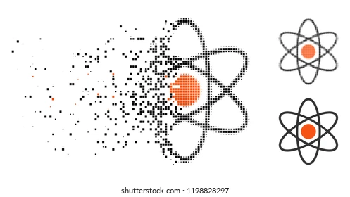

# 咬文嚼字-常见词根词缀

@(TOEFL)[托福, TOEFL, 词根词缀,咬文嚼字]

[toc]

## 希腊、日耳曼、拉丁

superstition [,supɚ'stɪʃən] n.迷信。**拉丁**前缀super-表示over,above，与希腊前缀hyper-和**日耳曼词源**的单词over同源，stition部分可以理解做a standing，词根与stand同源，表示站立。罗马人信奉多神，认为神和人是平等共存的，可是迷信认为常识之外超自然现象背后的力量“standing above”人类。 

The word *[syndicate](https://en.wikipedia.org/wiki/Syndicate)* comes from the [French](https://en.wikipedia.org/wiki/French_language) word *syndicat* which means "[trade union](https://en.wikipedia.org/wiki/Trade_union)" (*[syndic](https://en.wikipedia.org/wiki/Syndic)* meaning "administrator"), from the [Latin](https://en.wikipedia.org/wiki/Latin) word *syndicus* which in turn comes from the [Greek](https://en.wikipedia.org/wiki/Ancient_Greek) word σύνδικος (*syndikos*), which means "caretaker of an issue"; compare to [ombudsman](https://en.wikipedia.org/wiki/Ombudsman) or [representative](https://en.wikipedia.org/wiki/Representation_(politics)).[[1\]](https://en.wikipedia.org/wiki/Syndicate#cite_note-1)

## -ion / -ation / -ition  表名词，“行为、动作、状态、过程、结果；物品” {1759}

| 单词                                                         | 解释                                                         | 单词                                                         | 解释                                                         |
| ------------------------------------------------------------ | ------------------------------------------------------------ | ------------------------------------------------------------ | ------------------------------------------------------------ |
| **crit-er-ion**                          【kraɪˈtɪriən】 | **`crit-`**判断 + **`-er`** + **`-ion`**。 即区分的关键，标准。 **`crit-`** = judge, discern, 表示“判断，分辨”。源自希腊语 krinein "to separate, decide, judge." **`-ion`** 表名词，“行为、动作、状态、过程、结果；物品”等。 | **crit-er-ia**                            【kraɪ'tɪriə】 | **`crit-`** = judge, discern, 表示“判断，分辨”。源自希腊语 krinein "to separate, decide, judge." **`-a`** 由希腊语和拉丁语直接进入英语的表示复数的后缀。 |
|                                                              |                                                              |                                                              |                                                              |
|                                                              |                                                              |                                                              |                                                              |

## -al / -ial 表形容词， ”...的“ {1146}

| 单词                                                   | 解释                                                         | 单词                                                         | 解释                                                         |
| ------------------------------------------------------ | ------------------------------------------------------------ | ------------------------------------------------------------ | ------------------------------------------------------------ |
| **genit-al**                         【ˈdʒenɪtl】 | **genit-** = birth, produce, 表示“出生，产生”，医学上引申为“生殖或基因”。 生殖的;生殖器的。 => genit-al-ia | **bacteri-al**                           【bækˈtɪriəl】 | **`bacter-`** = bacterium, 表示“细菌”。源自希腊语 baktron "staff." 细菌的;细菌引起的 |
| **cervic-al** 【ˈsɜːrvɪkl】                       | **cervic-** 表示“颈，宫颈”，多用于医学领域。和表示角的horn同源。源自拉丁语 cervix "neck."  1.子宫颈的connected with the cervix 2. 颈的connected with the neck cervical vertebra 【ˈsɜːrvɪkl ˈvɜːrtɪbrə】 | **act-ual**                                                  | **`act-`** = to do, to drive, 表示“行动，做” 。源自拉丁语 agere (过去分词 actum) "to do, act, drive, conduct, lead, weigh." **`-ual`** 表形容词，“…的”，一般缀于名词后。源自拉丁语 -alis, adjective suffix. 真实的;实际的;(强调事情最重要的部分)真正的，…本身 |
| **later-al** 【ˈlætərəl】                         | **`later-`** = side, 表示“边”。 connected with the side of sth or with movement to the side。侧面的；横向的；向侧面移动的， If career advancement is important to you there may be some lateral moves that would work our for you and the company. | **uni-vers-al** 【ˌjuːnɪˈvɜːrsl】                       | **`uni-`**一个 + **`vers-`**转 + **`-al`**。即转为一体的，引申义通用的。 **`universe`**  n. 宇宙, 星系, (思想等)范围 普遍的;全体的;全世界的;共同的;普遍存在的;广泛适用的 |
| **lab-ial** 【ˈleɪbiəl】                          | **`lab-`** = lip, 表示“唇”。源自拉丁语 labrum "to lick; lip." **`-ia`**l  表形容词，“…的”，一般缀于名词后。源自拉丁语 -alis, adjective suffix. | **mur∙al** 【ˈmjʊrəl】                                  | **`mur-`** = wall, 表示“墙壁”。源自拉丁语 murus "wall." 1 - 缩写自 mural painting,壁画，来自拉丁语  murus,墙，墙壁，来自 PIE*mei,修建，巩固，防御工事，可能来自 PIE*mo,辛劳，劳作，词源同 mole,防洪堤，城墙，大型工事。 |

## -ic[1]：表形容词, "...的" {1012}

| 单词                                                         | 解释                                                         | 单词                                   | 解释                                                         |
| ------------------------------------------------------------ | ------------------------------------------------------------ | -------------------------------------- | ------------------------------------------------------------ |
| **acid-ic**                                    【əˈsɪdɪk】 | 酸的;酸性的;很酸的                                           | **academ-ic**                          | a.学术的(与实践性、技术性相对);学业的;教学的(尤指与学校教育有关);学习良好的 n.高等院校教师;高校科研人员 |
| **en-dem-ic** 【enˈdemɪk】                              | **`en-`** <br/表示“入、内、在...之内、使...”，来自古法语 en-。在字母 b, m, p 前拼写同化为 em-。 **`dem-`** = people，表示“人民，民众”。源自希腊语 demos "people, land." **en-在…内 + dem-人民 + -ic → 在人民内 → 地方性的。** adj.地方性;(某地或某集体中)特有的;流行的;难摆脱的 n.地方病;某地特产的植物[动物] | **pan-dem-ic** 【pænˈdemɪk】      | **`pan-`** 表示“全部的、广泛的”。 **`dem-`** = people，表示“人民，民众”。源自希腊语 demos "people, land." **pan-到处 + dem-人 + -ic表形容词 → 人群中到处流行的。** n.(全国或全球性)流行病;大流行病 adj. （疾病）大流行的;普遍的，全世界的 |
| **epi-demic** 【ˌepɪˈdemɪk】                            | **epi-在...周围 + dem-人民 + -ic → 在人民周围 → 流行的。** **`epi-`** 表示“在…上，在…周围，在…后面”。源自希腊语 epi "on, over, at." **`dem-`** = people，表示“人民，民众”。源自希腊语 demos "people, land." | **demo-crat-ic** 【ˌdeməˈkrætɪk】 | **`demo-`** = people，表示“人民，民众”。源自希腊语 demos "people, land." **`crat-`** = rule, ruler, 表示“统治或政体，统治者”，最初含义表示“力量”。也引申为“支持者，参加者”等。源自希腊语 kratos "strength, might, power." |
| authent.ic                                                   | 可靠的，可信的，真正的                                       | auto.bio.graph.ic                      | 自转的                                                       |
| **`zo.ic`**                                                  | a. 动物的, 有...的(动物)生活方式的, 有生物的, 含有动植物遗迹的化石的 | a.zo.ic                                | **`-a`**：加在单词前，表示“在…的”；表示“不、无、非”；表示“加强”。源自希腊语 a-, an- "not." 无生命痕迹的，无生的 |
| a-centri-ic                                                  | 无中心的                                                     | **agatic** 【æg'nætɪk】           | 男系亲属的，男方的；同族的                                   |
| Arabic                                                       | 阿拉伯语的，阿拉伯人的                                       | barbar-ic 【bɑːrˈbærɪk】          | 残暴的;野蛮的;没有文化的;野蛮人的;原始部落人的               |
| calc.ic 【kælsɪk】                                      | 含钙的;石灰质的                                              | civic civ-ic                      | 公民的，市的                                                 |
| autom-ic                                                     | 原子的，原子能的                                             | hydr-ic                                | 氢气的，含氢的                                               |
| manson-ic                                                    | 共济会会员的                                                 | **mim-ic** 【ˈmɪmɪk】             | 模仿(人的言行举止);(外表或行为举止)像 to copy the way sb speaks, moves, behaves, etc., especially in order to make other people laugh【第三人称单数：mimics；现在分词：mimicking；过去分词：mimicked】 *"I'm so sorry", she mimicked* |
| **poet-ic** 【poʊˈetɪk】                                | 诗歌的;诗的;像诗一般的;富有诗意的：like or suggesting poetry, especially because it shows imagination and deep feeling | aur.ic                                 | 金的                                                         |
| **kinet-ic**                        【kɪˈnetɪk】        | **`kinet-`** 表示“运动，活动”。源自希腊语 kinein "to move." of or produced by movement.运动的;运动引起的 kinetic energy 动能 | **kinet-ics** 【kəˈnɛtɪks】       | the branch of mechanics concerned with the forces that cause motions of bodies（动力学） |
| **diagnost-ic** 【ˌdaɪəɡˈnɑːstɪk】                      | **`-ic`** 表形容词，“…的”。 **`diagnose`** v. 诊断。 connected with identifying sth, especially an illness | **peri-pher-al** 【pəˈrɪfərəl】   | **`peri-`**四周 + **`pher-`**带来 + **`-al`**形容词后缀 → 周边带来的 → 不重要的 , 外围的。 周边的;外围的;次要的;附带的;与计算机相连的。  **`peri-`** 表示“周围，靠近”。 **`pher-`** = to bring, 表示“带来”。源自希腊语 pherein "to carry." |

## -ic[2] 表名词，“人或学科”{23}

| 单词                                                         | 解释                                                         | 单词                                 | 解释                                                         |
| ------------------------------------------------------------ | ------------------------------------------------------------ | ------------------------------------ | ------------------------------------------------------------ |
| **Meta-phys-ic-s**                               【ˌmetəˈfɪzɪks】 | **`meta-`**在后/在..之上 + **`phys-`**物理 + **`-ic`**表形容词. 形而上学：the branch of philosophy that deals with the nature of existence, truth and knowledge | cyn-ic                               |                                                              |
| rhetor-ic                                                    |                                                              | techn-ic                             |                                                              |
| etiolog-ic                                                   |                                                              | em-pir-ic                            |                                                              |
| log-ic                                                       |                                                              | **arithm∙et∙ic** 【əˈrɪθmətɪk】 | **`arithm-`** = number, 表示“数字”。源自希腊语 arithmos "number, amount." 算术;算术运算;四则运算 |
| crit-ic                                                      |                                                              | med-ic                               |                                                              |
| a-gnost-ic                                                   |                                                              | zoogeograph-ic                       |                                                              |
| ocean-o-graph-ic                                             |                                                              | ophthalmo-log-ic                     |                                                              |
| serolog-ic                                                   |                                                              |                                      |                                                              |

## -ism {724}

可以参阅：哪些专业名词翻译得特别烂？ - Gengius的回答 - 知乎 https://www.zhihu.com/question/27192923/answer/2068334212

抽象名词后缀，表示“…主义”；“宗教”；“制度、行为”；“…学”、“…术”、“…论”、“…法”；“疾病名称”；“情况、状态”等。

### 1. …的行为（或结果）

**the action or result of**

| 单词                         | 解释                                                   | 单词                                                     | 解释                                                         |
| ---------------------------- | ------------------------------------------------------ | -------------------------------------------------------- | ------------------------------------------------------------ |
| criticism 【ˈkrɪtɪsɪzəm | 批评;批判;责备;指责;(尤指对书、音乐等的)评论文章，评论 | [vandalism[^4]](https://en.wikipedia.org/wiki/Vandalism) | [汪达尔~~主义~~行为](https://baike.baidu.com/item/%E6%B1%AA%E8%BE%BE%E5%B0%94%E4%B8%BB%E4%B9%89/9538262?fr=aladdin) **Vandalism** is the **`action`** involving deliberate destruction of or damage to public or private property. |
|                              |                                                        |                                                          |                                                              |
|                              |                                                        |                                                          |                                                              |

[^4]: vandalize（肆意破坏）：大肆破坏罗马城的汪达尔人。汪达尔人（Vandal）是古代日耳曼民族中的一支，在欧洲民族大迁徙时期，曾在北非今突尼斯地区建立了一个汪达尔王国。公元455年，他们从海上出发，入侵意大利并占领了罗马城，在罗马城中进行了历时两周之久的大肆掠夺和破坏活动。他们将罗马城中所有能搬上船的东西统统搬走，甚至连神庙上的镀金瓦片也都揭走。原本是欧洲文化中心的罗马城遭到严重破坏，大批珍贵文物被劫走或损坏。汪达尔王国于公元533年被东罗马军队攻陷，国王被关押在君士坦丁堡，大部分人口被发配至东罗马帝国各处。从此，汪达尔人作为一个民族从历史中消失了，但他们在罗马城所犯下的滔天罪恶却永远不会被世人遗忘。英语中为此诞生了一个新词vandalize，用来表示像汪达尔人破坏罗马城那样的破坏行径。vandalize： ['vændəlaɪz] vt.肆意破坏，摧毁
vandalism： ['vænd(ə)lɪz(ə)m] n.故意破坏文物的行为，破坏他人财产的行为，汪达尔人的作风
Vandal：['vændl] n. 汪达尔人adj. 汪达尔人的
### 2. …的状态（或品质）（“情况、状态”）

**the state or quality of**

| 单词    | 解释 | 单词 | 解释 |
| ------- | ---- | ---- | ---- |
| heroism | 英勇 |      |      |
|         |      |      |      |
|         |      |      |      |

### 3. …的教义（或体系、运动）/（“宗教”；“制度、行为”）

**the teaching, system or movement of**

| 单词                       | 解释                                                         | 单词                           | 解释                                            |
| -------------------------- | ------------------------------------------------------------ | ------------------------------ | ----------------------------------------------- |
| Buddhism 【ˈbʊdɪzəm】 | 来自 PIE*bheudh,醒悟，意识，词源同 Bodhisattva,菩萨。 佛教 | socialism 【ˈsoʊʃəlɪzəm】 | social  a. 社会的, 群居的, 社交的 n. 联欢会 |
|                            |                                                              |                                |                                                 |
|                            |                                                              |                                |                                                 |

###  4. 因…的不公平对待（或敌意）

**-ism** is used to form uncount nouns that refer to unfair or hostile treatment of a particular group of people.

| 单词   | 解释     | 单词 | 解释 |
| ------ | -------- | ---- | ---- |
| racism | 种族偏见 |      |      |
|        |          |      |      |
|        |          |      |      |

### 5. …语言特点（“…学”、“…术”、“…论”、“…法”）

**a feature of language of the type mentioned**

| 单词                         | 解释                                                         | 单词                                                     | 解释                                                         |
| ---------------------------- | ------------------------------------------------------------ | -------------------------------------------------------- | ------------------------------------------------------------ |
| Americanism                  | 美国英语的特点.(a word, phrase or spelling that is typical of American English, used in another variety of English) | **colloquialism**               【kəˈloʊkwiəlɪzəm】 | an informal word or phrase that is more common in conversation than in formal speech or writing (口语, 口语用法, 口语词, 方言, 口语体) |
| **mal-ism** 【meɪlɪzm】 | The evil of the world(现世邪恶说)                            | **syl-log-ism** 【ˈsɪlədʒɪzəm】                     | `syl-`一起，集中 + `log-`说话，思考，辩证 + `-ism`理论。 **`syl-`** 表示“共同，相同，对称”。源自希腊语 sun, xun "together, with." l**`og-`** = speak, 表示“说话”，更倾向于知识阶层的‘说’，所以经常引申为...学。源自希腊语 logos "speech, word, reason." 三段论, 推论, 演绎 |
|                              |                                                              |                                                          |                                                              |

#### col-loq 

**基本释义**   

- n. 口语, 口语用法, 口语词, 方言, 口语体
- a. 口语的, 非正式的, 用通俗口语的, 会话的

**词根树**

- **`loqu-,locu-`** = speak, 表示“说话”。源自拉丁语 loqui "to speak."
- **`col-`** 来自拉丁语介词com，表示“与...一起，一起（with, together）”，或仅做强调。源自拉丁语 com "with (collective and intensive prefix.)"

- **col-loqu-ia** 【kə'ləʊkwɪə】：座谈会（**colloquium**【kəˈləʊkwiəm】 的复数）；学术研讨会

  > Colloquium for senior officials in the United Nations System.

- **col-loqu-ial** 【kəˈloʊkwiəl】used in conversation but not in formal speech or writing(会话的;口语的)

  > - His stumbling attempts at colloquial Russian amused her.  他结结巴巴地学说俄语，把她逗乐了。
  > - Her letter is written in a colloquial style. 他的信是用口语体写的。
  > - This is a colloquial expression.  这是口语表达。

### 6. 健康状况；疾病（“疾病名称”）

**a medical condition or disease**

| 单词                               | 解释                                                         | 单词                                  | 解释                                                         |
| ---------------------------------- | ------------------------------------------------------------ | ------------------------------------- | ------------------------------------------------------------ |
| **em-bol-ism** 【ˈembəlɪzəm】 | **`em-`** 表示“入、内、在...之内、使...”，来自古法语 en-。 在字母 b, m, p 前拼写同化为 em-。 **`bol-`** = throw, dance, ball, 表示“抛，舞，球”。 源自希腊语 ballein "to throw" An **embolism** is a serious medical condition that occurs when an artery becomes blocked, usually by a blood clot.（闰日, 栓塞(动脉被栓子堵塞)） | **alcoholism** 【ˈælkəhɑːlɪzəm】 | 酒精中毒 People who suffer from **alcoholism** cannot stop drinking large quantities of alcohol. |
|                                    |                                                              |                                       |                                                              |
|                                    |                                                              |                                       |                                                              |

## `-ity` 表名词，指具备某种性质{677}

| 单词                                                         | 解释                                                         | 单词                                                         | 解释                                                         |
| ------------------------------------------------------------ | ------------------------------------------------------------ | ------------------------------------------------------------ | ------------------------------------------------------------ |
| **long-ev-ity**                           【lɔːnˈdʒevəti】 | **`long-`** = long, 表示“长”。源自拉丁语 longus "long." **`ev-`** = age, 表示“年龄，时代”。源自拉丁语 aevum "age, eternity," etās (词干 aetāti‑) "age," aeternus "eterna." | **acid-ity**                                【əˈsɪdəti】 | acid  n. 酸, 酸类物质, 尖刻, 迷幻药 a. 酸的, 酸性的, 尖刻的, 敏锐的：the state of having a sour taste or of containing acid |
|                                                              |                                                              |                                                              |                                                              |
|                                                              |                                                              |                                                              |                                                              |

## **`-ist`**  表名词，表示“信仰者，专家或从事某活动的人”{559}

| 单词                                | 解释                                                         | 单词 | 解释 |
| ----------------------------------- | ------------------------------------------------------------ | ---- | ---- |
| prot-agon-ist 【prəˈtæɡənɪst】 | **`prota-`**第一的 + **`agon-`**挣扎，表演 + **`-ist`**表人。 **`agon-`** = struggle, 表示“挣扎，斗争”。源自希腊语 agein "to drive, lead, weigh." |      |      |
|                                     |                                                              |      |      |
|                                     |                                                              |      |      |

## -ate: 表动作，“做，造成” {570}

| 单词                                                         | 解释                                                         | 单词                                               | 解释                                                         |
| ------------------------------------------------------------ | ------------------------------------------------------------ | -------------------------------------------------- | ------------------------------------------------------------ |
| **con-greg-ate**                             【ˈkɑːŋɡrɪɡeɪt】 | **`con-`** 来自拉丁语介词com，表示“与...一起，一起（with, together）”，或仅做强调。 **`greg-`** = group, 表示“群体”，来自拉丁语。源自拉丁语 grex (词干 greg-) "herd, flock." ***群集;聚集;集合*** | **ac-celer-ate** 【əkˈseləreɪt】              | **`ac-`**加强 + **celer**-速度 + **-ate**动词后缀 → 一再增加速度。 **`celer-`** = quick, speed, 表示“快，速”。源自拉丁语 celer "swift." |
| **activ-ate** 【ˈæktɪveɪt】                             | active【活跃的】 + -ate使… → 使…活动。 vt.使活动;激活;使活化。 The gene is activiated by a specific protein | **administr-ate**           【əd'mɪnɪstreɪt】 |                                                              |
| **ag-greg-ate** 【ˈæɡrɪɡət , ˈæɡrɪɡeɪt】                | **`ag-`**增加 + **`greg-`**群体 + **`-ate`**, 表动词 → 增加团体 → 聚集。 ***合计;总计*** | **al-lev-i-ate** 【əˈliːvieɪt】               | **`lev-`** = raise, lighten, 表示“提高，举起，变轻”。源自拉丁语 levis "light." **`al-`**同ad- + **`levi-`**轻 + **`-ate`**动词后缀 → 使轻松 → 缓和 |
| **ac-cumul-ate** 【əˈkjuːmjəleɪt】                      | 积累;积聚;(数量)逐渐增加;(数额)逐渐增长                      | **na-rr-ate** 【ˈnæreɪt】                     | **`na-`**=gno-知道 + -**`r(r)`**拉丁语现在不定式格 + **`-ate`**, 表动，词引申词义叙述，告知。 讲（故事）；叙述 \| 给（纪录片或节目）作解说 |
| **circ-ul-ate** 【ˈsɜːrkjəleɪt】                        | **`circ-`**圆 , 环 + **`-ul`** + **`-ate`**, 表动词 → 绕圈走 → 循环。  **`circ-`** = ring, 表示“圆环”。源自希腊语 kirkos, krikos "a ring." | **satur-ate**[^6] 【ˈsætʃəreɪt】              | **`satur-`**做够 + **`-ate`**, 表动词 → 使足够 → 饱和。 **`satur-`** = enough, full of food, 表示“足够，饱足”。源自拉丁语 satis "enough, sufficient," satur "full (of food), sated." |
| **facilit-ate**  【fəˈsɪlɪteɪt】                   | facile【a. 容易的】 + -it + -ate能够 → 使能够做 → 使容易。 **facile** a. 容易的, 不动脑筋的+**-ate** 表动词，“做，造成”。 to make an action or a process possible or easier | **fac-ile** 【ˈfæsl】                         | **`fac-`**做 + **`-ile`**, 表形容词; **`fac-`** = make, do, 表示“做，制作”。源自拉丁语 facere "to do, make." **`-ile`** 表形容词，“…的”。源自拉丁语 -ilis, adjective suffix. 1. produced without effort or careful thought 2. obtained too easily and having little value |
| **temper-ate** 【ˈtempərət】                            | temper-调节 + -ate, 表形容词 → 脾气[不坏] → 有节制的。  temper∙ate  [词根树] temper-  = moderate, 表示“调和”。 气候温和的;温带的;温和的;心平气和的;自我克制的 | **plac-ate** 【ˈpleɪkeɪt】                    | 推荐：**`plac-`**平 + **`-ate`**, 表动词 → 使…平静。 **plac-** = to please, 表示“取悦，使满意，使平静”。源自拉丁语 placere "to please, be agreeable," placare "to calm." |
| **pollen** 【ˈpɑːlən】                                  | **`pol-`** = dust, 表示“灰尘”。源自拉丁语 pollen "fine flour, dust."  1 - 来自拉丁语 pollen,谷物粉，面粉，来自 PIE*pel,面粉，粉末，粉尘，词源同 polenta,powder.后引申词义花粉。 | **pollin-ate** 【ˈpɑːləneɪt】                 | pollen【花粉】 + -ate使。  **`pol-`** = dust, 表示“灰尘”。源自拉丁语 pollen "fine flour, dust." **-ate** 表动词，“做，造成”。  |
| **per-col-ate** 【ˈpɜːrkəleɪt】                         | per-贯穿 + col-排水 + -ate, 表动词 → 水流穿过 → 渗透。 **`per-`** 表示“完全，贯穿，自始至终，向前”。forth, ford 是其同源词。 **`col-`** = to strain, 表示“排水”。源自拉丁语 colum "sieve."  v.渗入;渗透;渗漏;逐渐流传;传开;(用渗滤式咖啡壶)滤煮;滤煮咖啡 n.渗出液 to move gradually through a surface that has very small holes or spaces in it | **dis-sip-ate** 【ˈdɪsɪpeɪt】                 | dis-,分开，散开，-sip,扔，分散。引申词义挥霍，浪费。  **`dis-`**  来自拉丁语dis-，表示“分开，散开”，引申词义“离开，无，没有，缺乏，表相反等”。该前缀在字母 g, l, m, r, s, v 前缩写为 di-；在字母f前同化为 dif-。 **`sip-`**  = to throw, 表示“扔出去”。源自拉丁语 supar "to throw, scatter."  |
| **domestic-ate** 【dəˈmestɪkeɪt】                       | vt. 驯养; 驯化; 使精于家务 推荐： domestic【家里的】 + -ate, 表动词 → 使成为家里的 → 驯养动物。 1. to make a wild animal used to living with or working for humans. 2. to grow plants or crops for human use 3. (often humorous) to make sb. good at cooking, caring for a house, etc.; to make sb. enjoy home life. |                                                    |                                                              |

[^6]: satire（讽刺）：古罗马诗人Ennius的诗集

## -exo  表示“从，从...离开，从...向外，向外，向上” {405}

表示“从，从...离开，从...向外，向外，向上”，来自PIE *eghs, 向外。

- 该原始印欧语根进入希腊语产生变体形式 **`ek-`**
-  进入英语拼写演变为 **`ec-`**；
- 进入拉丁语演变成 **`ex-`**；
- 在浊辅音 b, d, g 和半辅音 j, l, m, n, r, v 前缩写成 **`e-`**；
- 在字母f前同化为 **`ef-`**。
- 源自希腊语 ex, ek "out of, from."
-  拉丁语 ex, ex- "out of, away from."

| 单词         | 解释                                                         | 单词          | 解释                                                         |
| ------------ | ------------------------------------------------------------ | ------------- | ------------------------------------------------------------ |
| ex-mayor     | ex-husband ex-wife                                       | ex-ag-ger-ate |                                                              |
| ex-act       |                                                              | e-lev-ate     |                                                              |
| ex-od-us     |                                                              | ec-stat-ic    |                                                              |
| e-leg-ant    | **`e-`**出 + **`leg-`**=lig-选 + **`-ant`**表形容词 → 选出的 → 即选出来的，优秀的，优雅的 | an-ec-dote    | **`an-`**没有 **`+ ec`**-=ex-向外 + **`dot-`**=don-给予。字面含义“没有发表出去的、未公开的”。 |
| ef-fect      |                                                              | ef-fort       |                                                              |
| ex-gest      |                                                              | ex-cer-ment   |                                                              |
| ex-crete     |                                                              | ef-fuse       |                                                              |
| exo-crine    |                                                              | ef-fulg-ence  |                                                              |
| ef-front-ery |                                                              | as-ton-ish    |                                                              |
| ex-pand      |                                                              | ex-odont-ia   |                                                              |
| exo-centr-ic |                                                              |               |                                                              |

## ad- / ac- 来自拉丁介词ad, 表示“朝、向、去，或弱化为强调”  {312}

- **`ad-`** 来自拉丁介词ad, 表示“朝、向、去，或弱化为强调”。

- 在字母 b, f, g, l, n, p, r, s, t 前同化为 ab-, af-, ag-, al-, an-, ap-, ar-, as-, at-；
- 在 c, k, qu 前同化为 ac-；
- 在 sc, sp, st 前缩写成 a-.

| 单词                                                   | 解释                                                         | 单词                                     | 解释                                                         |
| ------------------------------------------------------ | ------------------------------------------------------------ | ---------------------------------------- | ------------------------------------------------------------ |
| ac-celer-ate                                           | **`ac-`**加强 + **celer**-速度 + **-ate**动词后缀 → 一再增加速度。 **`celer-`** = quick, speed, 表示“快，速”。源自拉丁语 celer "swift."ex-husband ex-wife | ag-greg-ate           【ˈæɡrɪɡeɪt】 | **`ag-`**增加 + **`greg-`**群体 + **`-ate`**, 表动词 → 增加团体 → 聚集。 合计;总计 |
| ac-cumul-ate                    【əˈkjuːmjəleɪt】 | 积累;积聚;(数量)逐渐增加;(数额)逐渐增长                      |                                          |                                                              |

## -ment: 表名词，“行为或结果” {274}

## **`-ish`** 

### 表形容词1，“像…一样，有的…”，通常缀于名词或形容词后{262}

| 单词                                               | 解释                                                         | 单词                                         | 解释                                                         |
| -------------------------------------------------- | ------------------------------------------------------------ | -------------------------------------------- | ------------------------------------------------------------ |
| **snob-b-ish    **               【snɒbɪʃ】   | **`snob`** n. 势利小人; 自以为优越的人, 自命高雅的人(sine nobilitate) **`-ish`** 表形容词，“像…一样，有的…”，通常缀于名词或形容词后。 | slav-ish                                     | slave  n. 奴隶, 从动装置, 卑鄙的人 vi. 拼命工作 -ish  表形容词，“像…一样，有的…”，通常缀于名词或形容词后。 |
| **Pol-ish      ** 【ˈpoʊlɪʃ】                 | **`pol-`** 表示“波兰”，源自波兰语 pole（土地）。 **`-ish`** 表形容词，“像…一样，有的…”，通常缀于名词或形容词后。 n.波兰语 adj.波兰的;波兰人的;波兰语的;波兰文化的 | **pol-ish          ** 【ˈpoʊlɪʃ】       | **`pol-`** = smooth, 表示“光滑”。源自拉丁语 polire "to make smooth, polish." **`-ish`** 表动词，“造成…”。  v.磨光;润色;擦光;修改;润饰 n.抛光;擦亮;上光;擦光剂;上光剂;亮光剂;擦光的面;打磨光亮的面;（表演的）完美，娴熟，精湛;文雅 |
| Jewish                                             | a. 犹太人的, 犹太族的 Jew【犹太】 + -ish表形容词         | Hunn-ish                                     | a. 匈奴人的, 野蛮的                                          |
| Gaul∙ish                                           | Gaul n. 高卢（位于欧洲西部）; 高卢人 -ish 表形容词，“像…一样，有的…”，通常缀于名词或形容词后。 a. 高卢的, 高卢人的 n. 高卢语 | ghoul∙ish                                    | ghoul n. 食尸鬼, 饿鬼, 盗墓者 -ish 表形容词，“像…一样，有的…”，通常缀于名词或形容词后。 a. 食尸鬼似的, 残忍的 |
| Frank-ish                                          | a. 法兰克语的, 法兰克人的 n. 法兰克语                    | Czech-ish 【ˈtʃekiʃ】                   | a. 捷克的, 捷克语的, 捷克人的 推荐： Czech【捷克】 + -ish表形容词 捷克语;捷克人;捷克的 |
| **plump-ish**                     【plʌmpiʃ】 | **`plump`** a. 圆胖的, 丰满的, 直接下落的, 直率的  vt. 突然放下, 支持, 使丰满, 使鼓起 vi. 扑通落下, 投票赞成, 变丰满, 鼓起 ad. 沉重地, 突然地, 直截了当地 **`-ish`** 表形容词，“像…一样，有的…”，通常缀于名词或形容词后。 a. 较丰满的(plump【丰满的】 + -ish表形容词) | **lav-ish **                 【ˈlævɪʃ】 | **`lav-`** = wash, 表示“洗，冲洗”。源自拉丁语 lavere "to wash," lavare "to wash." **`-ish`**表形容词，“像…一样，有的…”，通常缀于名词或形容词后。  ***av-冲洗 + -ish表形容词 → 冲掉 → 浪费。*** adj.奢华;慷慨的;大量的;给人印象深刻的;耗资巨大的;大方的 v.浪费;滥花;乱给 1 - 来自拉丁语 lavare,冲洗，涌出，词源同 lava,dilute,antediluvian,-ish,形容词后缀。即大量涌出的，大量的。 |
| forty-ish                                          | a. 近四十岁的, 四十岁左右的 推荐: forty【四十】 + -ish表形容词 | thrity-ish                                   | a. 近三十岁的, 三十岁左右的 单词笔记   ［添加］ 推荐： thirty【三十】 + -ish |
| gar∙ish                                            | gar- = furnish, 表示“装饰，供应”。源自古法语 guarnir "to equip." -ish 表形容词，“像…一样，有的…”，通常缀于名词或形容词后。  可能和 garnish【装饰】有关，也就是 gar-装饰 + -ish表形容词。 a. 穿着花哨的, 炫耀的, 过分装饰的 | freak-ish                                    | a. 朝三暮四的, 见异思迁的, 畸形的 单词笔记   ［添加］ 推荐： freak【反复无常】 + -ish表形容词 |
| fool-ish                                           | a. 愚蠢的, 傻的 范围：四级,专四,考研,雅思,高考 单词笔记   ［添加］ 推荐： fool【傻瓜】 + -ish表形容词 | faint-ish                                    | a. 较弱的, 有些昏晕的 推荐： faint【微弱的】 + -ish表形容词 |
| dump-ish                                           | a. 忧愁的, 忧郁的 推荐： dump + -ish表形容词         | dog-ish                                      | a. 狗一样的, 卑鄙的, 浮华的 推荐： dog【狗】 + -ish表形容词 |
| cad∙d∙ish                                          | cad n. 卑鄙的男人, 下流人, 无赖, 计算机辅助设计 -ish 表形容词，“像…一样，有的…”，通常缀于名词或形容词后。 cad【下流人】 + -d- + -ish（a. 下流的, 卑鄙的） | bull-ish                                     | a. 似公牛的, 看涨的, 上扬的 推荐：bull【牛】 + -ish表形容词 |
| bad∙d∙ish                                          | **`bad`** a. 坏的 n. 坏 ad. 坏地 **`-ish`** 表形容词，“像…一样，有的…”，通常缀于名词或形容词后。 a. 好读书的, 书呆子的 | baby∙ish                                     | baby n. 婴孩 -ish 表形容词，“像…一样，有的…”，通常缀于名词或形容词后。 |
| **kitten∙ish** 【ˈkɪtnɪʃ】                    | **`kitten`** n. 小猫 vt. 产仔 **`-ish`** 表形容词，“像…一样，有的…”，通常缀于名词或形容词后。 搔首弄姿的;卖弄风情的（lively, and trying to attract men's attention） | **coquett∙ish** 【koʊˈketɪʃ】           | coquet v. 卖弄风情 a. 卖弄风情的 n. 卖弄风情 -ish 表形容词，“像…一样，有的…”，通常缀于名词或形容词后。  If you describe a woman as **coquettish**, you mean she acts in a playful way that is intended to make men find her attractive. ...a coquettish glance.（卖弄风骚的一瞥） |
| woman-ish                                          | a. (贬)似女子的, 女子气的, 适于女子的 单词笔记   ［添加］ 推荐： woman【女人】 + -ish表形容词 |                                              |                                                              |

###  表动词2，“造成…” {38}

| 单词                               | 解释                                                         | 单词                                   | 解释                                                         |
| ---------------------------------- | ------------------------------------------------------------ | -------------------------------------- | ------------------------------------------------------------ |
| **Pol-ish      ** 【ˈpoʊlɪʃ】 | **`pol-`** 表示“波兰”，源自波兰语 pole（土地）。 **`-ish`** 表形容词，“像…一样，有的…”，通常缀于名词或形容词后。 n.波兰语 adj.波兰的;波兰人的;波兰语的;波兰文化的 | **pol-ish          ** 【ˈpoʊlɪʃ】 | **`pol-`** = smooth, 表示“光滑”。源自拉丁语 polire "to make smooth, polish." **`-ish`** 表动词，“造成…”。  v.磨光;润色;擦光;修改;润饰 n.抛光;擦亮;上光;擦光剂;上光剂;亮光剂;擦光的面;打磨光亮的面;（表演的）完美，娴熟，精湛;文雅 |
|                                    |                                                              |                                        |                                                              |
|                                    |                                                              |                                        |                                                              |

##  -ant 三类词根 {200}

### 1. 表形容词，“…的，具有…性质的”

| 单词                                                         | 解释                                                         | 单词                                                         | 解释                                                         |
| ------------------------------------------------------------ | ------------------------------------------------------------ | ------------------------------------------------------------ | ------------------------------------------------------------ |
| **dis-cord-ant**                               【dɪsˈkɔːrdənt】 | dis 不 + cord 心 + ant …的，具有…性质的 → 不是一条心的 → 不一致的 | **extra-vag-ant**                          【ɪkˈstrævəɡənt】 | extra 超过 + vag 走 + ant …的，具有…性质的 → 漫游过多 → 奢侈的 |
| **ex-uber-ant**  【ɪɡˈzuːbərənt】                       | ex 出 + uber 果实 + ant …的，具有…性质的 → 出果实的 → 茂盛的 | **in-toxic-ant**  【ɪnˈtɑːksɪkənt】                     | in 使… + toxic 毒 + ant …的，具有…性质的 → 酒精中毒 → 酒精 → 醉人的 |
| **repent-ant** 【rɪˈpentənt】                           | repent 后悔 + ant …的，具有…性质的 → 后悔的                  | **resist-ant**  【rɪˈzɪstənt】                          | resist 抵抗 + ant …的，具有…性质的 → 抵抗的                  |
| **ad-ulter-ant** 【ə'dʌltərənt】                        | 掺杂（用）的；掺假（用）的；使不纯的 ad-去 + ulter-改变 + -ate, 表动词 → 变成别的 → 掺假。 ulter-  = other, to change, 表示“其他的，改变状态” | **e-leg-ant** 【ˈelɪɡənt】                              | **`e-`**出 + **`leg-`**=lig-选 + **`-ant`**表形容词 → 选出的 → 即选出来的，优秀的，优雅的 |
| **rumin-ant** 【ˈruːmɪnənt】                            | **`rumin-`** 表示“反刍”。                                    | **pleas-ant** 【ˈpleznt】                               | **please** ad. 请 vt. 使高兴, 合...的心意, 取悦 vi. 使人满意, 讨好, 愿意, 敬请 **`-ant`** 表形容词，“…的”。 |
| **fragr-ant** 【ˈfreɪɡrənt】                            | **`fragr-`** 表示“强烈的味道”。源自拉丁语 fragrare "to small." **`-ant`** 表形容词，“…的”。 | **ex-uber-ant** 【ɪɡˈzuːbərənt】                        | a. 繁茂的; 热情洋溢的, 精力充沛的 **`ex-`**向外 + **`uber-`**果实 + **`-ant`** → 原指多产的，丰富的，引申义兴高采烈的 |

### 2. 表名词，“人”

| 单词                                             | 解释                                                         | 单词                                                  | 解释                               |
| ------------------------------------------------ | ------------------------------------------------------------ | ----------------------------------------------------- | ---------------------------------- |
| **account-ant**          【əˈkaʊntənt】     | account 账目 + ant 人 → 打理账目的人 → 会计                  | **adjut-ant**  【ˈædʒʊtənt】                     | adjut 帮助 + ant 人 → 副手；副官   |
| **aspir-ant**  【əˈspaɪərənt】              | aspire 热望，立志 + ant 人 → 有抱负者 A person with a strong desire to achieve a position of importance or to win a competition. | **assist-ant**  【əˈsɪstənt】                    | assist 帮助 + ant 人 → 助手        |
| **inhabit-ant**             【ɪnˈhæbɪtənt】 | inhabit 居住 + ant 人 → 居民                                 | **particip-ant**               【pɑːrˈtɪsɪpənt】 | participate 参加 + ant 人 → 参与者 |
| **tyr-ant** 【ˈtaɪrənt】                    | **`tyrann-`** = tyrant, 表示“暴君”。 **`-ant`** 表名词，“…人”。 |                                                       |                                    |

###  3. 表名词，“…剂，…物”

| 单词                                | 解释                                       | 单词                                | 解释                                      |
| ----------------------------------- | ------------------------------------------ | ----------------------------------- | ----------------------------------------- |
| **lubricant**  【ˈluːbrɪkənt】 | lubric 滑 + ant …剂，…物 → 润滑剂          | **retardant** 【rɪtɑːrdənt】   | retard 延迟，阻止 + ant …剂，…物 → 阻化剂 |
| **stimulant**  【ˈstɪmjələnt】 | stimul 刺 + ant …剂，…物 → 刺激物 → 兴奋剂 | **suppressant**  【səˈpresnt】 | suppress 抑制 + ant …剂，…物 → 抑制物     |
|                                     |                                            |                                     |                                           |

#### agent v.s broker

**agenda（议程）：信徒应当去做的事情。**

英语单词agenda（议程）来自拉丁语，意思是“待办之事”，由词根**`ag-`**（做）+后缀**`-enda`**（应…之事），同源词有agency（代理）、agent（代理人）。

进入英语后，agenda最初用于宗教领域，是一个宗教术语，表示“信徒应当去做的事”，即“教规”，包括祈祷、斋戒、朝拜等。与它对应的是单词credenda（教条），表示“信徒应当相信的事”。

19世纪80年代后，**agenda**开始用来表示会议中待讨论的议题或待进行的事项，即所谓的“议程”。现在既可表示会议议程，也可表示日常工作中的待办事项。

- agenda：[ə'dʒendə] n.议程，待办事项
- agent：['edʒənt] n.代理人，代理商adj.代理的
- agency：['edʒənsi] n.代理，中介，代理处，经销处
- credenda：[kri'dendə] n.信条，教条

**broker（经纪人）：打开酒桶卖酒的人**

在古代欧洲的酒吧或其他零售酒水的地方，卖酒的小贩会批发采购一桶一桶的啤酒或其他酒类，然后打开酒桶，装上龙头，然后一杯一杯地卖给喝酒的人。打开酒桶的工具在法语中叫***broche***，后来演变为英语单词**broach**（钻头、凿子）。而表示“打开酒桶”的法语动词。

***brochier***产生了名词***brocheor***，后来演变成英语中的**broker**，字面意思就是“打开酒桶的人”，原本用来表示零售酒水的小贩，后来泛指各种经销商，在金融行业中，则用来表示经纪人、掮客。虽然中文叫法不同，但其实都是经销商、中间人的意思。经纪人其实就是把股票、证券等金融产品贩卖给个体投资者的中间人。

> 掮（**qián**），动词，用肩扛东西，如掮客（旧指介绍买卖，取得佣金的人）。
>
> 新人初夜，郎以手摸其头而甚得意，摸其乳腹俱欢喜，及摸下体，不见两足，惊骇问之，则已掮起半日矣。

- broker： ['brəʊkə] n.经纪人，中间人，掮客v.以中间人身份来谈判、安排
- brokerage：['brokərɪdʒ] n. 佣金；回扣；中间人业务
- broach： [brəʊtʃ] n.钻头，凿子，胸针vt.提出，给……钻孔、开口，开始讨论

### 4. 同义词辨析

| 单词                                | 解释                                                         |
| :---------------------------------- | :----------------------------------------------------------- |
| **candidate**  n. 候选人；申请人 | 〔辨析〕指竞选的候选人或某一职位的申请人。   〔例证〕   Who will be the presidential candidate?    The defeated candidate demanded a recount.   Tom is the strongest candidate for the position. |
| **applicant**  n. 申请者，求职者 | 〔辨析〕通常指正式提交书面材料申请某一职位、高校入学资格等的人。   〔例证〕   We give preference(优先权) to applicants with some experience.   He is the best applicant for the job.  There is no lack of applicants to this college |
| **aspirant**  n. [正式]有志者    | 〔辨析〕**通常指有雄心壮志要取得成功或荣誉的人**。    〔例证〕   An aspirant for literary honor.   They're aspirants to the title of world champion |
| **nominee**.  n. 被提名者        | 〔辨析〕通常指某一职位、奖项等的提名候选人。    〔例证〕   a presidential nominee.   an Oscar nominee.   He is the nominee for the position. |

##  -ent

### 1. 表名词 …人；…事物

| 单词                                         | 解释                                                   | 单词                                      | 解释                                                         |
| -------------------------------------------- | ------------------------------------------------------ | ----------------------------------------- | ------------------------------------------------------------ |
| **inhabitant**          【ɪnˈhæbɪtənt】 | a person or an animal that lives in a particular place | **deterrent**         【dɪˈtɜːrənt】 | 具威慑性的事物：a thing that makes sb less likely to do sth (= that deters them) |
| **ag-ent**                                   | ag-做 + -ent表人或物 → 做的人 → 代理人。               |                                           |                                                              |

### 2. 表形容词

| 单词                                           | 解释                                                         | 单词                                    | 解释                                                         |
| ---------------------------------------------- | ------------------------------------------------------------ | --------------------------------------- | ------------------------------------------------------------ |
| **significant**          【sɪɡˈnɪfɪkənt】 | a person or an animal that lives in a particular place       | **different**         【ˈdɪfrənt】 | 不同的;有区别的;有差异的;分别的;各别的;各种的;不平常;与众不同;别致 |
| **reg∙ent** 【ˈriːdʒənt】                 | **`reg-`** = rule, 表示“规则”。源自拉丁语 regula "straight piece of wood, rod." 摄政者;摄政王（用在名词后）摄政的 |                                         |                                                              |

## -age 表示“状态，总称” {199}

| 单词                                         | 解释                                                         | 单词                                                 | 解释                                                         |
| -------------------------------------------- | ------------------------------------------------------------ | ---------------------------------------------------- | ------------------------------------------------------------ |
| **acre-age**[^1][^2] 【ˈeɪkərɪdʒ】      | acre【ˈeɪkər】：英亩（4 840平方码，约为4 050平方米） an area of land measured in acres [U, C] 大块土地；英亩数 | **advant-age** 【ədˈvæntɪdʒ】              | **`advant-` = ahead**, 表示“前面”，来源于法语 avance 以前，其字母 d 是在 16 世纪时加=>先行优势 |
| **amper-age** 【ˈæmpərɪdʒ】             | 按倍数                                                       | **anecdot-age** 【'ænek,dotɪdʒ】                | anecdote【ˈænɪkdoʊt】 n. 轶事, 奇闻                          |
| **arbitr-age** 【ˈɑːrbɪtrɑːʒ】          | **`arbitr-`** = judge, 表示“判断”。复合词根：ar-=ad- + bit-走。 | **arbitr-ary** 【ˈɑːbɪtrəri】                   | arbitr-判断 + **`-ary`**形容词后缀 → 做出[自己的]判断 → 武断的。 |
| **band-age** 【ˈbændɪdʒ】               | band-带子 + -age, 表名词 →用带子束缚。                       | **baron-age** 【bærənɪdʒ】                      | baron 【ˈbærən】 男爵（英国男爵头衔为Lord;其他国家为Baron） n. 男爵, 男爵爵位, 贵族 |
| **baron-et-age**         【bærənɪtɪdʒ】 | **baron**: 男爵 **`-et`**： 表示“小”。源自拉丁语 -ellus, diminutive suffix. | **barr-age** 【bəˈrɑːʒ】                        | **`barr-` = bar, barrier**, 表示棍子引申为“栏”。 火力网;弹幕射击;(尤指)掩护炮火;堰;水坝;拦河坝 |
| **blindage**                                 | （军事）盲障；掩体；隐蔽部 (esp formerly) a [protective](https://www.collinsdictionary.com/zh/dictionary/english/protective) [screen](https://www.collinsdictionary.com/zh/dictionary/english/screen) or structure, as over a [trench](https://www.collinsdictionary.com/zh/dictionary/english/trench)。这个完全不同于地堡Bunker。 | **brew-age** 【bruːɪdʒ】                        | **brew** n. (酿的) 啤酒; 一杯茶 (或咖啡); 酝酿 v. 酿造; 沏 (茶等); 酝酿 |
| **broker-age** 【ˈbroʊkərɪdʒ】          | 经纪业务;经纪人佣金(或回扣)                                  | **buoy-age** 【bɔɪeɪdʒ】                        | 浮标；浮标装置； a system of buoys                           |
| **cab-b-age**[^5] 【ˈkæbɪdʒ】           | **`cap-,cipit-`** = head, 表示“头”。源自拉丁语 caput "head" 显然，这种菜是因其形似人的头颅而得名的。它是最古老的蔬菜之一，其种植史已有四千多年。 在希腊神话中卷心菜被说成是主神宙斯头上的汗珠变的，古希腊人还相信卷心菜能治秃头病。 Children never semm to like eating  cabbage. | **carnage** 【ˈkɑːrnɪdʒ】 carn.age         | carn- = flesh, 表示“肉，肉欲”，原始含义“切、砍”下来的一块肉。源自拉丁语 caro (词干 carn-) "flesh." 大屠杀 |
| **ballotage** 【bælɔ'tɑ:ʒ】             | n. 决选投票                                                  | **salv-age** 【ˈsælvɪdʒ】                       | **`salv-`** = safe, healthful, saved, 表示“安全、健康、储存”等。源自拉丁语 salus "health," salvus "whole, healthy, safe, uninjured." salve【救】 + -age名词后缀。引申诸相关词义。 打捞;挽救;挽回;营救(失事船舶等);抢救(失事船舶、火灾等中的财物) |
| **cot∙t∙age** 【ˈkɑːtɪdʒ】              | **`cote`** n. 棚, 窝, 栏. 小屋;(尤指)村舍，小别墅。（a small house, especially in the country） 引申出：cottage industry:家庭作坊。Such fakes have become a cottage industry in China. [比较：Cotton 棉花] | **assemble-age**  【əˈsemblɪdʒ】                | a collection of things; a group of people(formal, technical 术语) （人、物的）集聚. Tropical rainforests have the most varied assemblage of plants in the world. |
| **burg-age** 【bɜ:ɡeɪdʒ】               | **`burg-`** 表示“ 城堡”。源自拉丁语 burgus "fortified place;" 古法语 burg "borough." （英史）市镇土地保有权;民宅 tenure of land or tenement in a town or city, which originally involved a fixed money rent  [history] | **pass-age**  【ˈpæsɪdʒ】                  | pass【走过，通过】 + -age, 表名词。 **`pass-`** = pass through, 表示“通过”。源自拉丁语 pandere (过去分词 passus) "to spread out" 通道；过道；走廊\|   通过；经过 |
| us-age                                       | use【使用】 + -age状态 → 用的状态 → 用法。              |                                                      |                                                              |
| **baggage**  【ˈbæɡɪdʒ】                | 行李;(因阅历而形成的)信仰，看法。 She was carrying a lot of emotional baggage .（她背负着很多感情包袱。） | **luggage** 【ˈlʌɡɪdʒ】                         | also baggage especially in NAmE.  Luggage is the usual word in BrE , but baggage is also used, especially in the context of the bags and cases that passengers take on a flight. **In NAmE baggage is usually used.** 英国英语常用luggage，但也用baggage，尤指旅客乘飞机时所带的行李。北美英语通常用baggage。 |

[^1]:  1.acorn（橡子）：中世纪时用来喂猪的坚果英语单词acorn【ˈeɪkɔːrn】原本指的是林木所结的任何一种坚果。它在古英语中写作acern，由acer（空旷土地) + n（nut，坚果）构成，字面意思就是“空旷土地中的坚果”。其中acer就是单词acre（英亩）的词源。中世纪时，欧洲人在空旷林地里养猪，橡子是猪所吃的主要食物，因此acorn后来专指“橡子”。直到现在，著名的西班牙黑毛猪在屠宰前5个月必须放牧在纯天然的橡树林下，以树上跌落的橡子为食。
acorn：['ekɔrn] n. 橡子，橡实
acre：['ekɚ] n. 土地，地产；英亩

[^2 ]:  2.acre（英亩）：一对牛一天能耕的面积英语单词acre【ˈeɪkər】原本并非计量单位，而是“耕开的土地”的意思。后来，acre才演变为计量单位，一英亩到底有多大呢？其实就是平均一对牛一天能耕的面积。在古代英国，耕地时通常使用一对牛来拉一把犁，一天下来，这对牛能耕的面积就是一英亩。后来英国政府才明确规定了acre的面积，等于大约6亩、0.4公顷。
acre： ['eɪkə] n.英亩，土地，地产
acreage：['ekərɪdʒ] n. 面积，英亩数

[^5]: cabbage - 当人们说a head of cabbage（一颗卷心菜）时，恐怕很少人会想到cabbage（卷心菜）的原义是head（头）。它来源于中世纪法语caboche（头），很可能同拉丁语caput（头）有亲缘关系。显然，这种菜是因其形似人的头颅而得名的。它是最古老的蔬菜之一，其种植史已有四千多年。在希腊神话中卷心菜被说成是主神宙斯头上的汗珠变的，古希腊人还相信卷心菜能治秃头病。短语cabbage head表示“笨蛋”或“没头脑的家伙”，源出17世纪末一首古老曲子的歌词：“I ought to call him a cabbage head,/He is so very green ...”。

## - et / -le / -let, 表示“小”。源自拉丁语  {176}

> \- et / -le / -let
> = -et, 表示“小”。源自拉丁语 -ellus, diminutive suffix.
> 更多同源词...

| 单词                                     | 解释                                                         | 单词 | 解释 |
| ---------------------------------------- | ------------------------------------------------------------ | ---- | ---- |
|                                          |                                                              |      |      |
|                                          |                                                              |      |      |
| ballet 【bæˈleɪ】 **t** 不发音 | ball-  = throw, dance, ball, 表示“抛，舞，球”。源自希腊语 ballein "to throw" |      |      |

## -ship 表示某种关系、状态或技能。 {147}

-ship 
表示某种关系、状态或技能。源自古英语 -scipe "state, condition."

| 单词                           | 解释                                                         | 单词 | 解释 |
| ------------------------------ | ------------------------------------------------------------ | ---- | ---- |
| **wor-ship** 【ˈwɜːrʃɪp】 | worth- = value, 表示“价值”。源自古英语 weorth "worth, valuable." |      |      |
|                                |                                                              |      |      |
|                                |                                                              |      |      |

## -ary 表形容词，“…的”。{133}

| 单词                                             | 解释                                                         | 单词           | 解释                                                         |
| ------------------------------------------------ | ------------------------------------------------------------ | -------------- | ------------------------------------------------------------ |
| contr-ary                   【ˈkɑːntreri 】 | **`contr-`** = against, 表示“反对，相反”，来自拉丁语。 **`com-`** "with, together" + **`-tr`** "comparative suffix "，本意放在一起比较。源自拉丁语 contra "against, opposite." | arbitr-ary     | **`arbitr-`** = judge, 表示“判断”。复合词根：ar-=ad- + bit-走。 任意的;武断的;随心所欲的;专横的;专制的 1):**not seeming to be based on a reason, system or plan and sometimes seeming unfair**  2):**using power without restriction and without considering other people** |
| ne-cess-ary                                      | a. 必要的 必然的 n. 必需品                                   | coron-ary      |                                                              |
| custom-ary                                       | 习惯的 惯常的                                                | disciplin-ary  |                                                              |
| diversion-ary                                    |                                                              | lter-ary       |                                                              |
| bin-ary                                          | 由两部分组成的，二进制的，二院的                             | access-ary     |                                                              |
| ordin-ary                                        |                                                              | pre-limin-ary  |                                                              |
| question-ary                                     |                                                              | sanit-ary      | 卫生的                                                       |
| second-ary                                       |                                                              | sed-ent-ary    | 就做的，坐惯的                                               |
| sediment-ary                                     | 沉淀物的                                                     | solid-ary      | 团结一致的                                                   |
| solit-ary                                        | 独居者                                                       | sati-ion-ary   | 不动的 静止的                                                |
| sum-m-ary                                        |                                                              | tempor-ary     |                                                              |
| traditon-ary                                     |                                                              | tribut-ary     | 滞留的，纳贡的，从属的，辅助的                               |
| trin-ary                                         | 三倍的，三重的                                               | unit-ary       | 单位的，单一的，归一的，整体的                               |
| mon-et-ary                                       | 货币的，金钱的                                               | nobili-ary     | 贵族的                                                       |
| octo-n-ary                                       | 八进制的                                                     | quin-ary       | 五的，五个组成的，五进制的                                   |
| oliv-ary                                         | 橄榄形的                                                     | salut-ary      | 有益的，有用的                                               |
| complement-ary                                   |                                                              | compliment-ary |                                                              |
| caution-ary                                      |                                                              | cent-en-ary    |                                                              |
| adver-ary                                        |                                                              | mamm-ary       |                                                              |
| milit-ary                                        | n 军队                                                       | hono-ary       |                                                              |
| imagin-ary                                       |                                                              | judic-i-ary    | n 司法部，司法系统                                           |
| lengend-ary                                      |                                                              | funer-ary      |                                                              |
| element-ary                                      | 初步的，基本的                                               | evolution-ary  |                                                              |
| expension-ary                                    |                                                              | expedition-ary |                                                              |

## -fy / -ify 缀于名词或形容词后，构成表示“使成…”“…化”“作成… {132}

-fy 缀于名词或形容词后，构成表示“使成…”“…化”“作成…”等意思的动词

| 单词                                               | 解释                                                         | 单词                                           | 解释                                                         |
| -------------------------------------------------- | ------------------------------------------------------------ | ---------------------------------------------- | ------------------------------------------------------------ |
| **mod-ify**                                        | **`mod-`** = mode, manner, 表示“方式，模式，风度”。 源自拉丁语 modus  mod-模式 + -ify使... → 规范化 → 修改  not-ify | **clar-ify** 【ˈklærəfaɪ】 澄清 阐明 | class-ify ampl-ify satis-fy ver-ify test-ify ident-ify uni-fy |
| bourgeois-ify                                      |                                                              | viv-ify                                        | 给与生气，使生动                                             |
| ugl-ify                                            | sillic-ify simpl-ify solid-ify                     | vil-ify                                        | 诽谤，贬低                                                   |
| speci-fy                                           |                                                              | stupe-fy                                       |                                                              |
| cit-ify                                            | 使都市化                                                     | certi-ify                                      | 证明 保证                                                    |
| cod-ify                                            | 编成法典 **pur-ify** 【ˈpjʊrɪfaɪ】                 | acid-ify                                       | 使变酸                                                       |
| terr-ify                                           |                                                              | sign-ify                                       |                                                              |
| strati-fy:                                         | （使）成层                                                   | quant-ify                                      |                                                              |
| **rat-ify**                      【ˈrætɪfaɪ】 | 批准 认可： rate【评估，评价】 + -fy使。**即经过评估的**。  **`rat-`** = calculate, 表示“计算”，引申为“思考”。源自拉丁语 reri "to consider, confirm, ratify." **`-ify`** 缀于名词或形容词后，构成表示“使成…”“…化”“作成…”等意思的动词  | **rect-ify** 【ˈrektɪfaɪ】                | **`rect-`**直 + **`-ify`**…化 → 使…正直 → 改正[错误]。  **`rect-`** = straight, right, 表示“正、直”。源自拉丁语 regere (过去分词 rectus) "to lead straight, guide, rule." **`-ify`**缀于名词或形容词后，构成表示“使成…”“…化”“作成…”等意思的动词 |
| glori-fy                                           |                                                              | horr-ify                                       |                                                              |
| humid-ify                                          | gas-ify（使）气化                                            | fals-ify                                       | 伪造 扭曲                                                    |
| fluid-ify                                          | 液化                                                         | fort-ify 【ˈfɔːrtɪfaɪ】                   | **`fort-`** = strong, 表示“强大，力量”。源自拉丁语 fortis "strong. 设置要塞于，加强，使坚强： to make a place more able to resist attack, especially by building high walls |
| fruct-ify                                          | 结果实                                                       | intens-ify                                     |                                                              |
| beau-ify                                           | 美化                                                         | mort-ify                                       |                                                              |
| divers-ify                                         |                                                              | edi-fy                                         | 启迪熏陶 教育                                                |
| electr-ify                                         | 通电 上气 使电气化                                           | null-ify                                       | damn-ify                                                     |
| persona-ify                                        |                                                              | object-ify                                     | argu-fy torp-ify                                         |
| myst-ify                                           | rigid-ify sanct-ify sani-fy                         | magn-ify                                       | micr-ify mini-ify                                       |
| veri-ify                                           | 使动词化                                                     | tume-fy                                        |                                                              |
| putr-efy                                           | 化脓、腐烂、堕落                                             | ammonify                                       |                                                              |
| **terr-ify **          【ˈterɪfaɪ】           | **`terr-`** = frighten, 表示“恐，怕”。源自拉丁语 terrere "to frighten." **`-ify`** 缀于名词或形容词后，构成表示“使成…”“…化”“作成…”等意思的动词。 to make sb feel extremely frightened（Flying terrifies her.） | plastify                                       |                                                              |
| **electr-ify** 【ɪˈlektrɪfaɪ】                | = electric, 表示“电的”。来自古希腊语 elektron "amber." vt. 通电;使电气化;使带电;使激动;使兴奋 **Her performance electrified the audience** |                                                |                                                              |

##  -tic /-atic / etic/ -itic 表形容词，通常放在一个名词前，“与…相关的，…的”。{126}

| 单词                                           | 解释                                                         | 单词                                                  | 解释                                                         |
| ---------------------------------------------- | ------------------------------------------------------------ | ----------------------------------------------------- | ------------------------------------------------------------ |
| **path-etic**                     【pəˈθetɪk】 | **`path-`** = feeling, suffering, 表示“感情，遭受（病痛）”。 源自希腊语 pathos "suffering, passion, emotion, feelings." If you describe a person or animal as **pathetic**, you mean that they are sad and weak or helpless, and they make you feel very sorry for them. | **aqua-tic**                       【əˈkwɑːtɪk】 | **aqua-** = water, 表示“水”。源自拉丁语 aqua "water, the sea, rain." growing or living in, on or near water |
| sym-path-etic                                  | 有同情心的，合意的，赞成的                                   | phelgm-atic                                           | **`phlegm-`** = flame, 表示“发炎”。源自希腊语 phlegein "to burn." 不易冲动的;冷静的;镇定的(not easily made angry or upset) |
| exo-tic                                        | 异国风情的                                                   | roman-tic                                             |                                                              |
| narco-tic                                      | **narco-麻醉 + -tic → 麻醉的** 麻醉药，镇静剂           | seman-tic                                             |                                                              |
| arom-atic                                      | **`arom-`** = spice. 表示“香料” 芬芳的                  | amnes-tic                                             | 记忆缺失的 健忘的                                            |
| apo-calyp-tic                                  | 天启的，启示录的                                             | enzym-atic                                            | 酶的                                                         |
| ero-tic                                        | 心爱的，社情的                                               | fanatic                                               | 狂热者                                                       |
| here-tic                                       | 异教徒                                                       | herm-etic                                             | 奥妙的，密封的，不透气的                                     |
| bio-tic                                        | 生命的，生物的                                               | en-erg-etic                                           | 精力充沛的，积极的                                           |
| enigma-tic                                     | 费解的，谜一般的，高深莫测的                                 | err-atic                                              | 古怪人的                                                     |
| frene-tic                                      | 发狂的，狂热的                                               | hier-artic                                            | **`hier-`** = sacred, 表示“神圣的”。源自希腊语 hieros "holy." 来自希腊语 hiereus,祭司，僧侣，来自 hieros,神圣的，神灵的，来自 PIE*eis,强烈的感情，发狂，着迷，词源同 ire,estrushieroglyph 象形文字，神秘符号hiero-,神圣的，-glyph,刻，划，图形，词源同 glyph,cleave.即神圣的图形，神秘的符号，用于指埃及的象形文字。  僧侣的 |
| poro-tic                                       | 多孔性的，骨质疏松的                                         | apo-pto-tic                                           | 凋亡的                                                       |
| tonsill-itic                                   | 扁桃体炎的                                                   | via-tic                                               | 道路的,旅行的                                                |
| zoe-itc                                        | 生命的                                                       | demo-tic                                              | 人民的，民众的，通俗的                                       |
| schem-atic                                     | 概要的，图基恩的，略图的                                     | phon-etic                                             | 语音的，语音学的                                             |
| cosm-etic                                      |                                                              |                                                       |                                                              |

## -ess:表名词，“女性、雌性" {97}

| 单词                             | 解释                                                         | 单词                                   | 解释                                                         |
| -------------------------------- | ------------------------------------------------------------ | -------------------------------------- | ------------------------------------------------------------ |
| actress 【ˈæktrəs】         | ambassadress【æmˈbæsədres】:a female ambassador              | authoress            【ˈɔːθəres】 | authoress:女作者;女作家 waitr-ess【ˈweɪtrəs】：女服务员;女侍者 |
| empress 【ˈemprəs】         | empress: a woman who is the ruler of an empire; host-ess【ˈhoʊstəs】：女主人;女房东;(夜总会的)女招待;(电视或广播节目的)女主持人 | foundress 【faʊndres】            | a woman founder. **directress**【dɪ'rektrɪs】:a woman who is a director |
| heir-ess 【ˈerəs】          | heiress:a female heir , especially one who has received or will receive a large amount of money | an-chor-ess 【ˈæŋkəres】          | anchor-ess: a female anchorite (旧时的)女隐修者  seer-ess【sɪrɪs】prophetess sorcer-ess【ˈsɔːrsərəs】：(in stories) a woman with magic powers, who is helped by evil spirits。=>sorcerer |
| mayor-ess 【ˈmeɪərəs】      | maj-,magn-,max- = great, 表示“大，伟大”，源自拉丁语 magnus "great". -or 表示“人或物。  女市长;市长(或镇长、郡长)女助理 | god-d-ess                              | giant-ess  Titan-ess villain-ess                |
| ancestress 【ænsestrɪs】    | ancestress:a female ancestor. manageress[ˌmænɪdʒəˈres]:a woman who is in charge of a small business, for example, a shop/store, restaurant or hotel | enchantr-ess 【ɪnˈtʃæntrəs】      | (故事中)施魔法的女人，巫婆;迷人的女子                        |
| ad-ulter-ess 【əˈdʌltərəs】 | adulteress: a woman who commits adultery ad-ulter-y:n. 通奸 adulter-ous:An **adulterous** relationship is a sexual relationship between a married person and someone they are not married to. | mistr-ess 【ˈmɪstrəs】            | Mister:先生  + -ess 主妇;情妇;(尤指私立学校的)女教师; (尤指旧时雇用仆人的)女主人 |
| procur-ess 【prəʊ'kjʊərɪs】 | procure v. 获得 (尤指难以获得的东西); 诱使（妇女）卖淫. a woman pimp | ogr-ess【ˈoʊɡrɪs】                     | ogre n. 食人恶魔; 凶恶的人, 可怕的人 =>吃人女妖          |
| peer-ess 【ˈpɪəres】        | （英国的）女贵族，贵族夫人 baron-ess【ˌbærəˈnes】:女男爵;男爵夫人 count-ess【ˈkaʊntəs】女伯爵;伯爵夫人  dauphin-ess【dɔ:fɪnɪs】法国太子妃    duch-ess 【ˈdʌtʃəs】公爵夫人;女公爵 marchion-ess【ˌmɑːrʃəˈnes】女侯爵;侯爵夫人  viscount-ess【ˈvaɪkaʊntəs】女子爵;子爵夫人 | tigr-ess                               | panther-ess  leopard-ess   tigr-ess   lion-ess |
| arbitress 【ɑrbətrɪs】      |                                                              | citizen-ess 【sitizənis】         | electress【ɪ'lektrɪs】女选民；（神圣罗马帝国的）有权选举皇帝的诸侯的妻子 laundress【lɔːndrɪs】 paintr-ess【peɪntrɪs】 |

### chant (enchantr-ess)

**chant**（圣歌）：古罗马宗教活动中的反复吟唱。

英语单词**chant**来自拉丁语***cantare***，是***canere***（唱）的反复形式，指的是古罗马宗教活动中反复吟唱的活动，既用来赞颂神灵，又用于修炼内心，类似于中国佛教的和尚们打坐诵经。

做名词时，**chant**表示反复吟唱的“圣歌”。这种圣歌的特点是内容简短，适合反复吟唱，一个短短的词也能咿咿呀呀地唱上半天，并且通常没有伴奏，所以听起来十分单调乏味，如著名的[Gregorian chant](https://en.wikipedia.org/wiki/Gregorian_chant)（格里高利圣歌）就是这样一种圣歌，相传为教皇格里高利所著。

中国有句歇后语，小和尚念经——有口无心。西方的僧侣们在吟唱这种chant时，有时候也会装模作样、有口无心，因此英语中出现了一个与chant同源的单词**cant**，用来形容僧侣故作虔诚地吟唱chant，引申为并非发自内心的话，如客套话、乞丐故作可怜的的乞讨声。后来又产生了“**黑话**”（the private language of the underworld | **jargon**）的含义。

除此以外，英语单词**enchant**也与“吟唱”有关，不过不是“唱歌”，而是“念咒语”。**enchant**由**`en`**（into, upon）+**`chant`**（吟唱）构成，字面意思就是“对着……念咒语、施展魔法”，从而控制人的思想，使其迷住。

- chant：[tʃɑːnt]n.反复吟唱的圣歌，赞美诗v.吟唱，诵念
- canticle：['kæntɪk(ə)l] n. 颂歌；圣歌
- cant： [kænt] n.并非发自内心的话（客套话、乞丐乞讨等）、伪善的话、单调陈腐的话（如大话西游中唐僧的话）；（乞丐、流浪汉等底层的）黑话adj.单调陈腐的，假仁假义的，假装哀诉的；黑话的vi.讲黑话
- chanty： ['ʃænti] n. 劳动号子（等于chantey）
- enchant：[ɪn'tʃænt] vt.使迷住，用魔法迷住
- enchantment：[ɪn'tʃɑːntm(ə)nt] n.魅力，魔法，妖术，迷醉
- enchanter：[in'tʃɑ:ntə, en-] n. 巫师，行妖术的人；魔法师
- disenchant：[,dɪsɪn'tʃænt] vt. 使清醒；使不抱幻想
- incantation：[ɪnkæn'teɪʃ(ə)n] n.咒语

**`cant-`** cant来源于拉丁语cantus 'song'（歌）或cantāre 'to sing'（唱）。和多数同根词如cantata（大合唱），canticle（圣歌），cantilation（吟咏），chant（赞美诗）等不一样，该词自中世纪进入英语之时起就被赋予了贬抑含义。翻开辞书一看，我们可以发现cant的词义，诸如“伪善言词”、“（下层社会的）黑话”、“言不由衷之词”、“（乞丐等的）吟唱式哀诉”，几乎无一不带贬抑色彩。造成这一情况的因素有三，均与早先的基督教会有些联系。

- 其一，一些牧师在做弥撒时只会机械地履行职责，不太注意吟诵言词的含义。
- 其二，乞丐被允许参加这些牧师主持的葬礼仪式，他们往往装得十分悲痛，来骗取人们的施舍，他们哀诉式的乞讨也影响了cant一词的意义。
- 其三，17世纪有位苏格兰传道士，因其虚伪不受欢迎，他的名字就叫Andrew Cant。1711年8月18日《旁观者》（The Spectator）第47期上斯梯尔（Richard Steele, 1672-1729）写的一篇文章在追溯cant一词的词源时，试图将它与这位传道士的姓氏Cant联系起来，文中说：“他讲道所操方言，除了部分会众，据说无人听懂。”多数辞书对此很不以为然，但有某些根据说明，cant一词的贬降过程似乎多少受了这方面的影响。

> - Thieves' cant is unintelligible to outsiders. (FWF) 窃贼的黑话外人是听不懂的。
> - Sometimes words that were originally cant come to be used in the general language. (CID) 有时，原先的行话逐渐被用于大众语言中。

### Jargon【ˈdʒɑːrɡən】 ≈Cant【kænt】≠Kant【kænt】

**jargon**（行话）：人听不懂的鸟语。
英语单词**jargon**来自法语和拉丁语，原本是个拟声词，表示鸟叽叽喳喳的叫声。当人们在讲话时大量使用晦涩难懂的专业术语或行话，使得观众一头雾水不知所云时，观众就会觉得他们说的是人听不懂的鸟语，因此就称其为**jargon**。久而久之，**jargon**就演变为“专业术语、行话”的含义，它的本意“鸟叫声”反而被遗忘了。

- jargon：['dʒɑrɡən] n.专业术语，行话，黑话

###  charm

**enchant -** 当今之世哪个女人不希望自己富于**charm**（魅力），然而在14世纪**charm**用于女人就不是什么好的字眼了。**charm**借自法语***charme***，而法语词则源自拉丁语***carmen***（曲子，妖术），因此**charm**最初有“摄人心魂的歌声”、“妖术”、“魔法”等义。嗣后，词义中“歌声”这一成分逐渐丧失，而且词义变化也由贬而褒。**charm**的今义“魅力”、“迷人之处”始用于16世纪。英语中另有几个词如**chant**（曲子，圣歌），**enchant**（使着魔，使入迷），**incantation**（咒语，妖术）等与**charm**一词均有些亲缘关系，它们均源于拉丁语动词***cantāre 'to sing'***（唱）。

> - The song One Day When We Were Young has an unfailing charm. 《当我们年轻的时候》这首歌曲有经久不衰的魅力。
> - My hometown still retains its rustic charm. 我的家乡仍然保留着乡村风光的魅力。
> - Linda fell for his charm and his rugged good looks. 琳达为他的魅力和他的粗线条英俊外貌所倾倒。

## -ward 表形容词或副词，“向…”。源自古英语 -weard {66}

| 单词                    | 解释                                                         | 单词       | 解释                                                         |
| ----------------------- | ------------------------------------------------------------ | ---------- | ------------------------------------------------------------ |
| toward 【təˈwɒrd】 | prep朝向;;倾向于;趋向于;关于 adj.有利的;正在进行中的;顺利的 | south-ward | n. 朝南的方向(或地点、地区) a. 在南方的, 往南方的 ad. 往南  south【南】 + -**`ward`向...**。 |
|                         |                                                              |            |                                                              |
|                         |                                                              |            |                                                              |

##  -some ：表形容词，“充满…的，具有…倾向的{48}

| 单词                                      | 解释                                                         | 单词                               | 解释                                                         |
| ----------------------------------------- | ------------------------------------------------------------ | ---------------------------------- | ------------------------------------------------------------ |
| **fear-some **           【ˈfɪrsəm】 | fear  n. 恐怖, 害怕, 担心 v. 害怕, 恐惧, 为...担心, 敬畏 making people feel very frightened | **wear∙i∙some**  【ˈwɪrisəm】 | weary  a. 疲倦的, 萎靡的, 厌倦的, 厌烦的 vt. 使疲倦, 使厌烦 vi. 疲乏, 生厌, 不耐烦 that makes you feel very bored and tired |
| adventure-some                            | 冒险性的                                                     | awe-some                           | 引起敬畏的，可怕的                                           |
| further-some                              | 有利的                                                       | hand-some                          | 英俊的，大方的，慷慨的，相当可观的                           |
| hum-our-some                              | 幽默滑稽的，古怪的                                           | bore-some                          | 烦人的                                                       |
| bother-some                               | 讨厌的                                                       | ful-some                           | 过度的，过分的，令人生厌的                                   |
| irk-some                                  | 厌恶的，讨厌的令人厌烦的                                     | loath-some                         | 讨厌的，可恶的，令人憎恶的                                   |
| looth-some                                | 讨厌的，令人恶心的，可厌的                                   | plague-some                        | 讨厌的，瘟疫的，麻烦的                                       |
| tire-some                                 | 累人的，烦人的                                               | trouble-some                       | 麻烦的，令人讨厌的                                           |
| worr-i-some                               | 令人烦恼的，麻烦的，劳碌命的                                 | nettle-some                        | 烦人的，容易发怒的                                           |
| pick-some                                 | 吹毛求疵的                                                   | quarrel-some                       | 喜欢争吵的，好争论的                                         |
| mdddle-some                               | 爱管闲事的，好干涉的                                         | burden-some                        | 累赘的，烦人的，繁重的                                       |
| lumber-some                               | 沉重的                                                       | cumber-some                        | 笨重的，麻烦的，累赘的                                       |
| toil-some                                 | 费力的，辛苦的                                               | labor-some                         | 费力的，吃力的                                               |
| gamble-some                               | 喜欢赌博/投机的                                              | tangle-some                        | 紊乱的，复杂的                                               |
| un-wholesome                              | 不为什的，不适合健康的                                       | whole-some                         | 有益健康的，合乎卫生的                                       |
| dark-some                                 | 微暗的，阴暗的，阴沉的                                       | dole-some                          | 悲哀的，寂寞的                                               |
| lone-some                                 | 寂寞的                                                       | frolic-some                        | 嬉戏的 爱闹着玩的                                            |
| cuddle-some                               | 可拥抱的，可爱的                                             | blithe-some                        | 愉快的，高兴的                                               |
| game-some                                 | 爱玩耍，快乐的，爱闹着玩的                                   | glad-some                          | 高兴地，快乐的，愉快的                                       |
| light-some                                | 柔软的，勤快的                                               | mettle-some                        | 精神饱满的，有生气的，勇敢的                                 |
| play-some                                 | 爱打趣的，多趣的，开玩笑的                                   | win-some                           | 引人注目的，迷人的，可爱的                                   |
| tooth-some                                | 可口的，美味的                                               |                                    |                                                              |

## mal- = bad, wretched, 表示“坏，恶” {41}

| 单词                     | 解释                              | 单词             | 解释                                 |
| ------------------------ | --------------------------------- | ---------------- | ------------------------------------ |
| dis-mal                  |                                   | mal-ice          |                                      |
| mal-function             |                                   | mal-adapt-ive    |                                      |
| mal-nourish-ed           |                                   | mala-dict-ion    |                                      |
| mal-adjust-ed            |                                   | mal-administer   |                                      |
| mal-adroit               |                                   | mal-apportion-ed |                                      |
| mal-ison                 |                                   | mal-aprop        |                                      |
| mal-ism 【meɪlɪzm】 | The evil of the world(现世邪恶说) | male-dict-ory    |                                      |
| mal-afct-ion             |                                   | male-vol-ence    |                                      |
| mal-feas-ant             |                                   | mal-feasance     |                                      |
| mal-treat                |                                   | mal-aise         |                                      |
| mal-odour                |                                   | mal-odor         | **`odor`** n. 气味, 香味, 名声, 意味 |

