# 咬文嚼字-月份星期与星座篇

@(TOEFL)[托福, TOEFL, 词根词缀,咬文嚼字]

[toc]

## 月份 Month

英语中各个月份的名称全都来自拉丁语，沿用古罗马人对各月的命名。古罗马人最初采 用罗马历，法定一年有 304 日， 分 10 个月，以三月份（March）作为新年及一年之始。罗 马历的一年比太阳年 365 日相比少了 61 日，当时的罗马人似乎忽略这些日子，只把它当成 无名称及不定期的月份，成为年与年之间无一定规律的冬日。 后来，凯撒修订古罗马历而制定儒略历。将一年分为十二个月，在原来的十个月之前增 加了两个月（一月和二月）。

### January 双面门神雅努斯

在古罗马传说中，有一位名叫“雅努斯”（Janus）的古老神灵。他的名字Janus在拉丁语中就是“门”的意思，所以雅努斯是门神，主要职责就是看守天宫的大门。每天早上，雅努斯打开天门，让太阳神驾着金色马车出来，使阳光普照大地；到了晚上他关上天门，让黑夜笼罩大地。

雅努斯的长相非常有特点。他的头部前后有两张面孔，一张年老，一张年轻。年老的面孔在回顾过去，年轻的面孔在展望未来。所以雅努斯象征着一切事物的开始和结束。

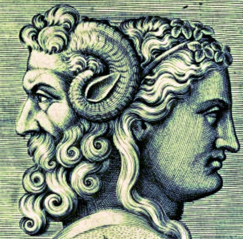

雅努斯还是战争与和平之神。古罗马人在战争期间，会打开雅努斯神殿的大门，等到战争结束后才会关闭神殿大门。

古罗马人在正月里祭祀雅努斯，罗马的执政官也在正月的第一天就职，并向雅努斯献祭。公元前46年，古罗马凯撒把正月第一天定为罗马历新年的开始，用雅努斯的名字Janus来命名第一个月，在拉丁语中拼写为***Januarius***，在英语中演变为单词**January**（一月）。它由Janus去掉末尾的字母s后再加上一个常见的形容词和名词后缀-ary组成，字面意思就是“雅努斯的月份”。

英语单词**Janitor**也源自雅努斯的名字***Janus***。它最早表示“看门人”、“门房”，现在常表示公寓的管理员，其主要职责是公寓的清洁卫生，有些还负责公寓的维护和保安工作。

- **Janus**：['dʒeinəs] n.雅努斯，两面神
- **Janus-faced**：伪善的，口是心非的，有双面孔的
- **January**：[ˈdʒænjuəri] n.一月
- **janitor**：[ˈdʒænɪtə(r)] n.看门人，门房，清洁工

摘自：[词源趣谈：献给门神雅努斯（Janus）的一月（January）](https://mp.weixin.qq.com/s/OsM09L_5CI15YClA4WwPYA)

### February（二月）：古罗马净化节所在之月

在基督教传入罗马之前，每年 2 月 13 日至 15 日，古罗马人都要杀牲饮酒，欢庆净化节 （***Februalia***，菲勃卢姆节）。人们将这一天看作是一年的开始，因此，人们忏悔自己过去一 年的罪过，洗刷自己的灵魂，求得神明的饶恕，使自己成为一个贞洁的人，同时也希望洗掉 一切晦气和烦恼，在新的一年得到好运和好收成。

这一天，人们常用一种名叫 ***Februa*** 的鞭 子抽打那些不孕妇女，以象征净化妇女的身体，使其更加容易受孕和生产。

净化节的名称 ***Februalia*** 来自拉丁语动词 ***februa***（净化）。凯撒修订古罗马历，便用净化 节来命名二月，称为 Februarius（month of Februalia）。英语单词 February（二月）便由此演 变而来。 

- February： ['fɛbrʊ'ɛri] n.二月

### April（四月）：爱神阿芙洛狄忒

阿芙洛狄忒（**Aphrodite**）是希腊神话中的爱与美之女神，简称爱神，奥林巴斯十二主神之一，是爱情和女性美的象征。她是众神仰慕的对象，据说天神宙斯也追求过她，被她拒绝后强行把她嫁给了丑陋的火神。
阿芙洛狄忒与高大威猛的战神私通，生下了小爱神厄洛斯和其他子女。她还跟美男子阿多尼斯相爱。希腊和罗马神话中流传着大量她的风流韵事。

阿芙洛狄忒的名字Aphrodite的意思是“水泡中产生的”，其中词根aphro表示“水泡”。因为传说当乌拉诺斯被儿子克洛诺斯阉割后，其精血洒落在大海上，产生了很多泡沫，阿芙洛狄忒就从泡沫中诞生。

由于阿芙洛狄忒代表着情欲和性爱，从她的名字Aphrodite产生了不少跟性爱相关的词汇，如aphrodisia（性欲）、aphrodisiac（春药）。表示“四月”的单词April也是以她的名字命名的，因为四月是结婚的好季节。

- **April**：['eɪprəl] n.四月
- **Aphrodite**：[,æfrə'daɪti] n.阿芙洛狄忒
- **aphrodisia**：[,æfrəu'diziə] n.性欲，（医学）性欲炽盛
- **aphrodisiac**：[,æfrə'dɪzɪæk] n.春药adj.激发性欲的

英语词源趣谈(庄和诚)

April - 4月是树木抽芽、春蕾绽放之月，富于幻想的古罗马人根据拉丁词aperire 'to open'（开放）造了Aprīlis一词，作为该月的月名。

但另有一种更为可信的说法，认为Aprīlis是以希腊神话中爱与美的女神Aphrodite（阿佛洛狄特）命名的。在凯撒大帝时代以前的罗马年历中，公历3月为第一个月，Aprīlis则为第二个月，英语的4月月名April即源于此。早先英国人把4月叫做Easter-Monath (Easter-Month），即“复活节月”之意。

例　

- This has been one of the driest Aprils for many years. (CID) 这是多年来最干旱的一个4月。
- She said she would be eighty next April. 她说她到明年4月就80岁了。

 

#### aper- = to open, 表示“开”。由apo- + ver-组成

> 源自拉丁语 aperire "to open, uncover."{4}

| 单词                       | 解释                                                         | 单词                                                       | 解释                                                         |
| -------------------------- | ------------------------------------------------------------ | ---------------------------------------------------------- | ------------------------------------------------------------ |
| **April** 【ˈeɪprəl】 | n. 四月 推荐：来自拉丁短语mensis Aprilis, 以爱神Aphrodite命名的月份。   *``*aper-** = to open, 表示“开”。由apo- + ver-组成。源自拉丁语 aperire "to open, uncover." | **aper-itif**                         【əˌperəˈtiːf】 | n. 开胃酒 推荐：aper-开口 + -itif  **`aper-`** = to open, 表示“开”。由apo- + ver-组成。源自拉丁语 aperire "to open, uncover." 词源说明(童理民)   1 - 来自法语。来自 aper-,开口，打开。 |
|                            |                                                              |                                                            |                                                              |
|                            |                                                              |                                                            |                                                              |

### March 战神

希腊神话中，战神阿瑞斯（**Ares**）是主神宙斯和天后赫拉的儿子，爱神阿芙洛狄忒的情 人，掌管战争。他相貌英俊，孔武有力，性格残暴好斗，象征着战争的野蛮杀戮。阿瑞斯性 格暴戾，其他神祇和人类都不喜欢他。他的生身父母也不喜欢他。在《伊里亚特》中，宙斯 对阿瑞斯说：“在所有住在奥林匹斯山的神中，你最令我作呕，你除了争吵、战争和打仗之 外什么也不喜欢。你遗传了你母亲赫拉的固执和难管束的性情。”

在希腊神话中，战神屡吃败仗。他曾被两个巨人塞进青铜大瓮，囚禁 13 月之久，若不 是他兄弟赫尔墨斯的营救，他早已丧生其中。他与两个妹妹，即智慧女神雅典娜和月亮及狩 猎女神阿尔忒弥斯经常发生矛盾，但基本上每次都被她们狠狠修理。

在特洛伊战场，他主动 挑衅雅典娜，结果被雅典娜用一块石头砸伤脖子。凡人英雄赫拉克勒斯杀了他的儿子，阿瑞 斯向他挑战，结果被英雄打伤，呻吟着逃回奥林匹斯山。可以说，在崇尚和平和文艺的古希 腊，战神就是外强内干，备受嘲弄的草包。

这也反映了当时希腊诸城邦之间的相互关系。战神是斯巴达的保护神，雅典娜是雅典的保护神。与精于文艺的雅典人相比，沉默寡言的斯巴 达人对希腊神话的影响力极低，导致在希腊神话中战神屡屡被雅典娜欺负。 

阿瑞斯的名字 **Ares** 在希腊语中的含义是“伤害者、毁坏者”。由于在希腊神话中不受 人待见，来源于他的英语单词很少。 

不过到了古罗马时期，战神却时来运转了。在罗马神话中他被称为马尔斯（**Mars**）。因 为罗马人崇尚武力，所以战神在罗马神话中地位极高，火星（**Mars**）和三月（**March**）都以 他的名字命名。单词 **march** 还表示“进军”，因为古罗马人认为三月份是进军打仗的好季节。 从战神的名字中还产生了 **martial**（战争的）等单词。男性名字 **Martin**、**Marcus** 等都来自战 神的名字。

在罗马神话里，他不但骁勇善战，甚至成了罗马人的祖先。大家都知道那座矗立在罗马城内的那座狼喂孩子的雕像吧，那两个孩子的亲生父亲就是这位伟大的战神马尔斯，由此可知战神的形象在古代罗马人的心目中有多高大。

古罗马时期，每年的冬季由于天气寒 冷，所以是天然的休战期。每年到了冬季时，在外出征的军队都会返回营地过冬。等来来年 春暖花开之际，军队就会再次出发行军打仗。所以古罗马人就将春暖花开的三月份献给战神， 希望战神能够保佑罗马军队在战场上取胜。所以三月就被称为 **March**，本意就是“***Mars's month***”（战神之月）。

- Mars：[mɑːz] n.战神，火星
- Martian： ['mɑ:ʃən] adj. 火星的 n. 火星人
- March：[mɑːtʃ] n.三月
- march：[mɑːtʃ] v.进军
- martial：['mɑːʃ(ə)l] adj.军事的，战争的，尚武的
- martial art：n.武艺
- Martin： ['mɑːtɪn] n. 马丁（男子名）
- Marcus：['mɑrkəs] n. 马库斯（男子名）

### May 春天女神玛雅

和一月（**January**，以双面门神 Janus 命名）一样，五月也是以一位地道的罗马神祇命名 的。在远古罗马神话中，**Maia**（玛雅）是专门掌管春天和生命的女神，她的名字的含义就 是“能使万物生长者”。每年春天，她为世界带来温暖，使世间万物蓬勃生长。为了纪念这 位女神，罗马人就用它的名字来命名 5 月（罗马历中的 3 月），在拉丁语中称为 ***Maius***，意 思就是 ***month of Maia***。英语中表示“5 月”的单词 **May** 就源自拉丁语 ***Maius***。

摘自：《读神话故事 学英语单词--钱磊博士》

### June 天后朱诺（Juno）

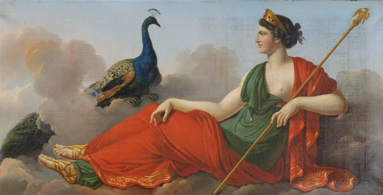	

六月正值初夏之际，莺飞草长、百花盛开，是婚嫁的绝好时机，罗马人常常选择在这个季节结婚，于是就用掌管婚姻的天后朱诺（***Juno***）为其命名，英语中的六月June就来源于此。

***Juno***（朱诺）是古罗马神话中的天后，是众神之父***Jupiter***（朱庇特）的姐姐和妻子，对应古希腊神话中的赫拉，是成年女子和婚姻的保护神。

***Juno***这个名字在拉丁语中意思就是“年轻人”，词根`Jun-`意思就是“年轻的”。比如单词**junior**（年轻的、资历浅的）就派生自这个词根，后面加了一个比较级后缀`-ior`，字面意思就是“更加年轻的”。

从词源上看，拉丁词根`jun-`（年轻的）和日耳曼词根`you(n)-`（年轻的）来自同一个老祖宗，***辅音字母j和y相通***。后者派生出了常见单词**young**（年轻的）和抽象名词后缀**youth**（年轻，青春）。

另外，同源的还有拉丁词根`juven-`（年轻的）。常见单词**juvenile**（青少年的、青少年）就来自这个词根，后面加了一个常见的形容词后缀`-ile`。

#### 不老青春女神 尤文图斯

古罗马神话中的青春女神尤文图斯（**Juventus**）也来自词根`juven-`（年轻的），后面加的***抽象名词后缀***`-tus`和后缀`-th`同源。所以***Juventus***相当于单词**youth**（年轻，青春）。

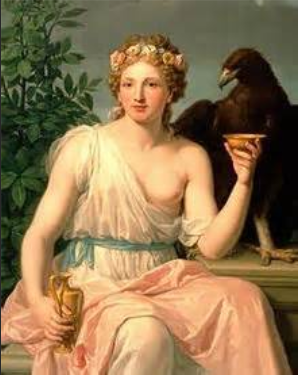

***尤文图斯（Juventus）***是朱庇特和朱诺的女儿，掌管青春，拥有少女般的青春和活力，她的双耳壶中盛有的长生不老酒拥有恢复青春美貌的神力。她是诸神的斟酒官，在奥林匹斯圣山的神宴上侍候诸神，专门给他们斟酒。当凡人英雄升天成仙时，第一个出来迎接的就是青春女神。她为他们奉上神酒，使他们立刻恢复青春年少并长生不老。

尤文图斯是青少年的守护神，所有罗马少年在即将成年之时都要前往尤文图斯的神庙祈求女神的庇佑。1896年，意大利都灵市的一群中学生成立了一支足球俱乐部，起名就叫做Juventus，寓意像青春女神那样永远蓬勃向上，充满年轻活力。这就是大名鼎鼎的尤文图斯队队名的由来。

#### 相关词根与单词

##### 词根：**jun-**（年轻的）

- **June**：[dʒuːn] n.六月，（人名）琼
- **Juno**：[ˈdʒuːnəʊ] n.朱诺（主神朱庇特的妻子）
- **junior**：[ˈdʒuːniə(r)] adj.年轻的，资历浅的，下级的n.年少者，职务和地位较低的人

##### 词根：**y**ou(n)-（年轻的）

- **young**：[jʌŋ]n.年轻的
- **youth**：[juːθ]n.年轻，青春

##### 词根：**juven-**（年轻的）

- **juvenile**：[ˈdʒuːvənaɪl] adj.青少年的n.青少年
- **Juventus**：[ˈdʒuːvəntəs]n.尤文图斯

摘自：[词源趣谈：奉献给天后朱诺（Juno）的“六月”（June） --钱磊博士](https://mp.weixin.qq.com/s/admI963qvVAcxZpcYStdHg)

### July 凯撒大帝

**盖乌斯·尤利乌斯·恺撒（Gaius [Julius Caesar](https://en.wikipedia.org/wiki/Julius_Caesar)）**常被人尊称为“凯撒大帝”。他是古罗马最著名的军事家和政治家，罗马帝国的奠基人。公元前44年3月15日，恺撒遭元老院反对派议员暗杀身亡，享年56岁。

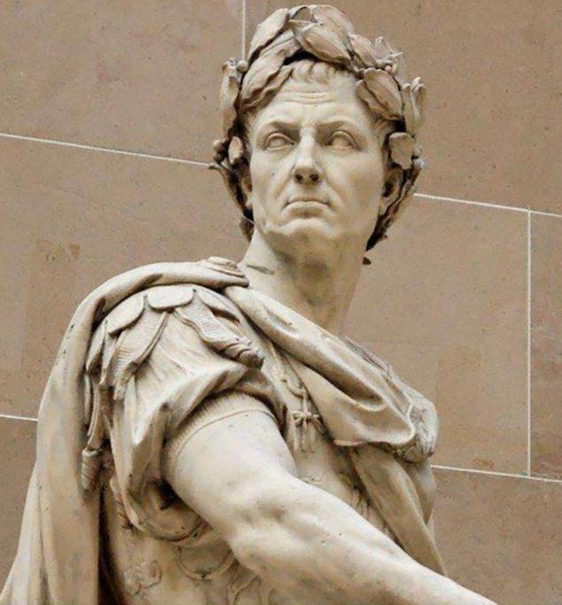

凯撒大帝被刺身亡后，他手下的罗马将军安东尼向元老院提议，用凯撒的家族名Julius来命名凯撒诞辰所在月份七月，以表达对凯撒的崇敬。元老院同意了，于是七月的名称就改成了**Julius**。

英语单词**July**（七月）便来源于拉丁语单词***Julius***，只不过按照英文的拼写习惯，去掉了末尾的词尾`-us`，变成了`Juli`，然后末尾的字母i改写为`y`，最终演变为单词**July**。

那么，***Julius（尤利乌斯，或朱利乌斯）***这个单词，到底有什么含义呢？从词源上看，它的含义尚未有定论，最常被人接受的解释有两种：

- 一种认为它来自希腊语，意思是“刚长出来的胡须绒毛”，所以与“年轻”有关。
- 另一种解释认为，这个名字源自古罗马神话中众神之父朱庇特的本名Jove，意思是“Jove的后裔”。

我个人更喜欢第二种解释。

Julius对应的阴性形式就是Julia（茱莉亚），词尾-us改成了对应的阴性形式-a。Julia（茱莉亚）是一个很常见的女子名，有很多女性名人就叫做Julia（茱莉亚），比如著名女演员茱莉亚·罗伯茨（Julia Roberts）。

有些中国人取英文名字时，会考虑Julius或Julia。大家觉得这两个名字好不好？快来留言发表你的看法吧。

- **July**：[dʒʊˈlaɪ] n.七月
- **Julius**：[ˈdʒuːliəs] n.（男子名）尤利乌斯，朱利乌斯
- **Julia**：[ˈdʒuːljə] n.（女子名）茱莉亚

​	

摘自：[词源趣谈：以凯撒大帝命名的July（七月）--钱磊博士](https://mp.weixin.qq.com/s/EnMCWrUU7ZrJACCl0gkadw)	

### August 奥古斯都大帝

> 我的~~很~~最大，你们都忍一忍

屋大维（***Octavian***）是罗马帝国的第一个皇帝，元首政制的创始人。他本是恺撒大帝的 甥孙，后来被凯撒收为养子并指定为继承人。凯撒遇刺身亡后他开始走上政治舞台。他结束 了罗马国内的多年内战，统治罗马 40 多年，使罗马帝国进入了繁荣发展时期。公元前 27 年 8 月罗马元老院授予他 ***Augustus***（奥古斯都，意为“至尊者”）的称号。

- 词根 `aug` 表示“增大”；
- `ust`=`est`，表示“最”
- `us` 是名词后缀，

所以 Augustus 的字面意思就是“最伟大的人”。

公元 14 年，屋大维去世。罗马元老院决定将他也列入神的行列。因为他是在 8 月被授 予 Augustus 尊号的，所以元老院决定用 Augustus 来命名八月，并将八月的天数增加 1 天， 使他与凯撒大帝平起平坐。所以现在的八月和七月都是 31 天。英语中的“August”（八月）便来源于此。

屋大维是最后一个名字出现在月份名称中的凡人。据说当他的继承人提比略继位时，有 人为了拍马屁，提议仿效前人，用提比略的名字来命名月份，结果被提比略拒绝了。提比略 说一年一共只有 12 个月，要是都用皇帝的名字来命名，将来第 13 个皇帝咋办呢？因此，后 来再无人用凡人名字来命名月份。

- **August**：[ɔ:ˈgʌst] n.八月  adj.威严的，令人敬畏的。

### September（九月）：古罗马历中的第 7 个月

 英语中表示“九月”的单词 September 直接来自拉丁语，是拉丁单词 septem（七）的衍 生词，本意是“七月”，因为 September 原本是指古罗马历中的第 7 个月。 

- September： [sep'tembə] n.九月

### October（十月）：古罗马历中的第 8 个月

英语中表示“十月”的单词 October 直接来自拉丁语，是拉丁单词 octo（八）的衍生词， 本意是“八月”，因为 October 原本是指古罗马历中的第 8 个月。

- October： [ɒk'təʊbə] n.十月

### November（十一月）：古罗马历中的第 9 个月

英语中表示“十一月”的单词 November 直接来自拉丁语，是拉丁单词 novem（九）的 衍生词，本意是“九月”，因为 November 原本是指古罗马历中的第 9 个月。

- November： [nə(ʊ)'vembə]n.十一月

### December（十二月）：古罗马历中的第 10 个月

英语中表示“十二月”的单词 December 直接来自拉丁语，是拉丁单词 decem（十）的 衍生词，本意是“十月”，因为 December 原本是指古罗马历中的第 10 个月。

- December： [dɪ'sembə] n.十二月

## 星期 Week

### Sunday（星期日）和Monday（星期一）：献给太阳和月亮的日子

很多现代人认为周一是一星期的开始，而星期日属于“周末”，这其实是一种误解，源自现代社会普遍采用的一周工作5天制度。

实际上，在古代，一星期的第一天是星期日（**Sunday**），这从英语中表示“星期日”（Sunday）和“星期一”（Monday）的单词中可以得到验证。

古代希腊人崇拜太阳和月亮，因此将一星期的第一天献给太阳神Helios，称为Hemera Heliou（太阳神之日）；将第二天（星期一）献给月亮神塞勒涅（Selene），命名为Hemera Selenes（月亮神之日）。古罗马人继承了古希腊人的这种传统，将星期日称为Dies solis，星期一称为Dies Lunæ。古英国人依葫芦画瓢，将星期日称为Sunnandæg，将星期一称为Monandæg。到了现代英语中则演变成了Sunday和Monday。

- Sunday：['sʌndeɪ] n.星期日，星期天，礼拜日，礼拜天
- Monday：['mʌndeɪ] n.星期一，礼拜一

### Tuesday（星期二）：战神提尔

在北欧神话中，战神被称为提尔（***Tyr***），是北欧神话中主要神祇之一，是勇气和战争的象征，是主神奥丁的儿子，相当于罗马神话中的***Mars***。

战神提尔的一只胳臂被狼精芬里厄咬断，因此只有一只胳臂。据说诸神以试验力气为由，想用魔法锁链缚住芬里厄。芬里厄要求一位神将胳臂放在他嘴里。勇敢的提尔挺身而出，把自己的胳臂放在芬里厄的嘴里。芬里厄发现上当后就愤怒地咬断了提尔的胳臂。

战神提尔在好战的北欧人中得到极高的崇拜，甚至仅次于主神奥丁。北欧的勇士常常在打仗前向提尔祈祷。

在西方文明中，一周的第三天献给战神，以战神命名。因此，在古英语中，周二便以北欧神话中的战神提尔（***Tyr***）命名，称为Tiwesdaeg，字面意思就是Tyr’s day（提尔之日），在现代英语中拼写演变为**Tuesday**。

- Tuesday：['tjuːzdeɪ; -dɪ] n.星期二

### Wednesday（星期三）：主神奥丁

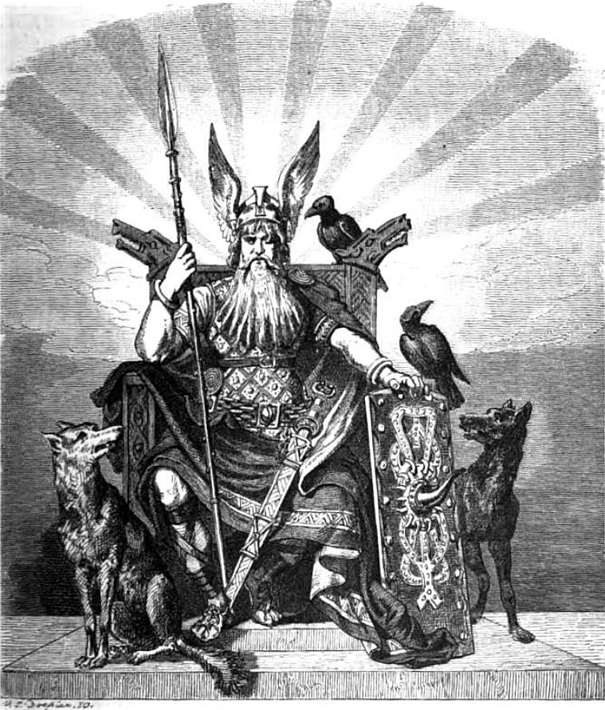 

在北欧神话中，奥丁（***Odin***，古英语为*Woden*）是阿萨神族的至高神，是诸神之父，世界的统治者。他曾以一人之力冒险闯入冥界，为人类取得古文字，从而拥有大量知识，并因此而失去一只眼睛。

在北欧神话中，奥丁身形高大，身披金甲，骑八足神马，手持名枪“冈尼尔”(Gungnir)，居住在“英灵殿”（Valhalla，瓦尔哈拉）中。据说凡是在战争中英勇战死的武士，死后都能进入英灵殿，共同迎接“诸神的黄昏”中最后的决战。因此北欧武士在战场上都视死如归，以死后能进入英灵殿为荣。

在西方文明中，一周的第四天献给亡灵引导之神。在北欧神话中，负责引导亡灵的是主神奥丁。因此古英语中的星期三以北欧神话中的主神奥丁命名，称为wodnesdaeg，字面意思就是***Woden’s day***（奥丁之日），在现代英语中拼写演变为**Wednesday**。

- **Wednesday**： ['wenzdeɪ; -dɪ] n.星期三
- **Odin**：['əudin] n.奥丁神。

### Thursday（星期四）：雷神托尔

托尔**Thor**是北欧神话中的雷神，掌管战争和农业。他是主神奥丁的长子，其母为大地女神。

他是神族中最为强壮的勇士，具有呼风唤雨的能力。他的职责是保护诸神国度的安全和在人间巡视农作。相传每当雷雨交加时，就是托尔乘坐马车出来巡视，因此北欧人称呼托尔为“雷神”。

托尔的武器是一只可以发出致命闪电的大铁锤，其实就是雷电的象征。无论托尔把这只铁锤扔出去多远，它总是会像回旋飞镖一样飞回托尔的手上。另外，他还拥有一条能够提升力量的腰带。

在神和巨人族的终极一战中，雷神托尔和他的宿敌巨蟒展开了惊天动地的决战。经历了激战之后，托尔使出致命一击杀死了巨蟒，不过他也因碰到了从巨蟒的伤口里流出的剧毒液体，而付出了生命的代价。

在西方文明中，一周的第五天献给雷神。因此，在古英语中，星期四以北欧神话中的雷神托尔来命名，称为。英语中表示星期四的单词***Thurresdæg***，字面意思就是**Thor's day**（托尔之日），在现代英语中拼写为**Thursday**。

- **Thor**：[θɔ:] n.雷神托尔
- **thunder**：['θʌndɚ] n. 雷；轰隆声；恐吓vi. 打雷；怒喝vt. 轰隆地发出；大声喊出
- **Thursday**：['θə:zdi; -dei]n.星期四

### Friday（星期五）：爱神弗丽嘉

 

弗丽嘉（***Frigg***）是北欧神话中的爱神，主神奥丁的妻子，掌管婚姻和家庭。她容貌美丽，金色的头发中间夹着白色的羽毛，身着束着金色腰带的白袍，腰带上挂一串钥匙。她拥有预知未来的能力，但从来不会泄露天机。弗丽嘉是诸神中唯一被允许坐在主神奥丁的王座上观察宇宙万物的神祇。

在古北欧语中，Frigg就是“钟爱的”之意。英语单词friend与它同源，本意就是“喜爱之人”。

在西方文明中，一周的第六天献给爱神。因此，在古英语中，星期五就以北欧神话中的爱神弗丽嘉命名，称为frigedaeg，字面意思就是***Frigg’s day***（弗丽嘉之日），在现代英语中拼写为**Friday**。

- Friday：['fraidi] n.星期五
- friend：[frɛnd] n. 朋友

### Saturday（星期六）：农神萨图恩

在罗马神话中，萨图恩（***Saturn***）原本是农神。继承希腊神话后，罗马人就将农神萨图恩和希腊神话中的第二代神王克洛诺斯合二为一了，原因也许是因为克洛诺斯用石镰刀阉割了自己的父亲，而镰刀也是农神的武器。根据罗马神话，萨图恩在被朱庇特（即宙斯）推翻后逃到了拉丁姆，并教会了那里的人民耕种土地，因此被罗马人尊为农神。

罗马人将星期六以农神命名，所以表示“星期六”的英语单词就是**Saturday**，字面意思就是***Saturn’s day***。

天文学上，土星（***Saturn***）就是以农神萨图恩的名字命名的，因为它排在木星（***Jupiter***）的外侧。太阳系中，土星距离太阳远，运行速度最慢。因此，占星学中认为，土星座的人性情阴郁冷漠，从而产生了saturinine（阴郁的）这个单词。

农神节（***saturnalia***）是古罗马的一个大型的祭祀活动，是为了祭祀农神萨图恩，时间在12月中旬，相当于中国的庙会。古罗马人们在这一天向农神祈福，保佑一年风调雨顺，国泰民安。

- Saturn：['sæt(ə)n] n.土星，农神
- Saturday：['sætədɪ; -de] n.星期六
- saturnine：['sætənaɪn] adj.土星宫的，忧郁的，阴沉的
- saturnalia：[,sætɚ'nelɪə] n.古罗马的农神节，狂欢喧闹

## 节日

### Valentine

> n. 情人, 情人节礼物
> **`vail-,val-` **= strong, worth, 表示“强壮，价值”。源自拉丁语 valere "to be strong."
>
> 来自拉丁语 Valentinus,意大利守护圣人，字面意思为力量，能力，词源同 valiant.据说是因为其纪念日期间，恰好是鸟儿互相选择伴侣的时候，因而引申词义情人节。

**英语词源趣谈(庄和诚)**

**valentine** - 2月14日是西方的**St. Valentine's Day**（圣瓦伦庭节）。人们在这一天庆祝浪漫的爱情并向心爱的人寄情人卡、赠送红玫瑰或巧克力，表示倾慕之情。按传统的做法，情人卡上是不署名的，所以收到情人卡的人就得自己猜这卡是谁寄来的了。

有的人还特地在这一天选择情人。实际上这可以说是专为情侣设立的节日，所以人们也称之为“情人节”。在此节日赠送给情人的礼物或贺词、贺卡、图画，在此节日选定送礼致意的情人等，在英语中均可用**valentine**一词来表示。

**St. Valentine**是公元3世纪一位基督教殉教者。根据传说，有两个**St. Valentine**同日殉难，一个是意大利牧师、医生，另一个是意大利境内特尔尼（Terni）的主教，可能原本就是一人。

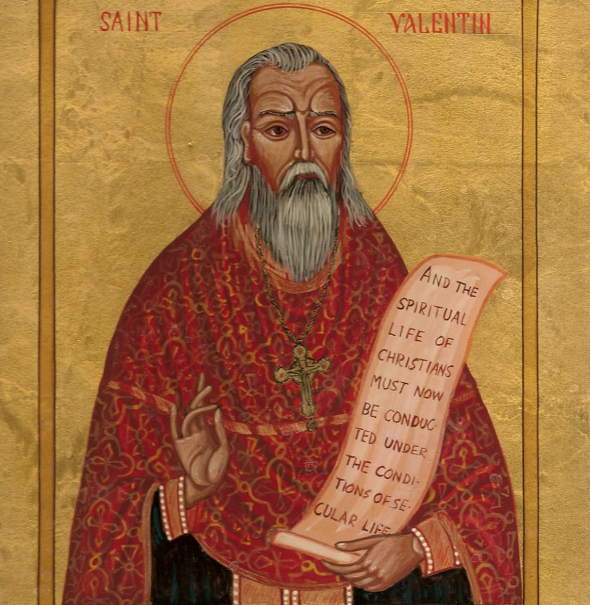 

英国教士勃特勒（Alban Butler, 1710-1773）所写《圣徒故事集》（Lives of the Saints）一书中讲述的二者故事几乎完全一致。**Valentine**因为帮助受罗马皇帝迫害的基督教徒而被逮捕，先遭棍打，后被斩首。死刑是公元270年2月14日于罗马执行的。因此，后人便把2月14日作为**St. Valentine**的祝典日，称**St. Valentine's Day**。

这一节日以后变成情人节则是由于两个日期上的巧合，与这两位圣徒毫无关系：2月14日正巧是古时传统的鸟类择偶日，而2月15日又是古罗马的牧神节（**Lupercalia**），一个与爱情有关的节日。英国诗人乔叟在他写的《百鸟会议》（Assembly of Fowls）一诗中提到鸟类在St. Valentine's Day这一天择偶交配：

> For this was on Saint Valentine's Day,
>
> When ev'ry fowl cometh to choose her make.

莎翁在《仲夏夜之梦》（Midsummer Night's Dream）一剧中也将这两者联系在一起：

> Good morrow, friends! St. Valentine is past;
>
> Begin these wood-birds but to couple now?

青年人是富于想像力的，正如一位作家所说的，青年人很容易由此联想到爱情。他们选择在这一天以抽签方式选择情侣，并给情侣赠送礼品。到了19世纪初期，青年人还在这一天给异性友人寄诙谐信或情书。到最后，与**St. Valentine's Day**重合的鸟类择偶日逐渐地演变为情人节。然而，这种源于古罗马的习俗在今天的西方社会已经引不起公众多大的兴趣，情人节只是因为贺卡业的发达才得以保留至今。

例　

- He got some valentines on Valentine's Day. 他在情人节那天收到一些情人卡。
- I gave my valentine candy and flowers. (NED) 我送糖果和鲜花给我的情人。
- The message on the card said 'Be my Valentine'. (CID) 卡上写的是“做我的情人吧”。
- Most of the valentine cards either had hearts on them or were very rude. (CID) 大多数的情人卡要么上面画有一颗心，要么非常粗俗。

**Reference:**

1. [6 Surprising Facts About St. Valentine
   Who was St. Valentine, and why do we celebrate him on February 14? Get the facts about this enigmatic character.](https://www.history.com/news/6-surprising-facts-about-st-valentine)

#### 相关表达

- **You had me at hello.** （你说 hello 时，便拥有了我）

  You had me at hello里的 at 表示“在（你喊出hello）的那个时刻”。As soon as I heard you say, 'Hello,' I was yours”.（“**见到你的第一面时，我就沦陷了**”。）

  探寻其源头，它出自汤姆·克鲁斯1996年主演的电影《甜心先生》（Jerry Maguire）。

   

  男主 Jerry（阿汤哥）在人生低谷时女主Dorthy就嫁给了他，填补了他的空虚和无助。后来境遇好转时，阿汤哥又开始了在外闯荡，全然不顾女主。

  Dorthy深爱Jerry，不想成为他的束缚，便勇敢地提出离婚，好让Jerry放手一搏。Jerry 事业成功后，心怀对Dorthy的愧疚，便找到她，分享了一大堆自己最真实的想法。

  Dorthy这时让Jerry，轻描淡写地说了一句“Just shut up, you had me at hello”

  没有浓烈的大词、没有精巧的句型，就这么简简单单5个词，胜似千万句甜言蜜语，这就是语言的魅力。其实你可以把 hello 换成别的词，变成自己专属的表白句式，比如：

  - You had me at smiling.你微笑的那一刻，我沦陷了。
  - You had me at passing the book. 你递书的那一刻，我沦陷了。
  - You had me at calling my name. 你喊我名字那一刻，我沦陷了。

  

- **You complete me.**

  “You complete me”中，complete 就是动词，整句话意思是“你让我的人生变得完整”，换言之，“没有你，我的人生不完整”。

  因为西方人也认为每个人实际上都是个半圆，两个半圆合在一起才变成整圆，所以英语中对“另一半”的说法也是“the other half”，这并不是中式英语哦！

**Reference:**

1. [表白时别再说“I love you”了，这句英文很甜很高级！收好！--谢侃](https://mp.weixin.qq.com/s/nCgv8IX4csfQH_2CvW3tlw)

# 星座

### capr- 9= goat, 表示“山羊”。源自拉丁语 caper "he-goat," capra "sh-goat." {9}

 

| 单词                                 | 解释                                                         | 单词                                         | 解释                                                         |
| ------------------------------------ | ------------------------------------------------------------ | -------------------------------------------- | ------------------------------------------------------------ |
| **capr-i-corn** 【ˈkæprɪkɔːrn】 | n. 摩羯宫, 摩羯(星)座, 在摩羯宫时段出生的人(约出生于12月21日至1月20日) **`capr-`** = goat, 表示“山羊”。源自拉丁语 caper "he-goat," capra "sh-goat." 更多同源词... **`corn-`** = horn, 表示“角”。源自拉丁语 cornu "horn." 更多同源词... 词源说明(童理民)   1 - Capri,山羊，-corn,角。因该星座形似山羊角而得名。 |                                              |                                                              |
| **capr-ice** 【kəˈpriːs】       | n. 反复无常, 多变, 任性 推荐：capr-山羊 + -ice。因山羊喜欢踏踏跳跳和突然踢出后腿，因而引申此义。 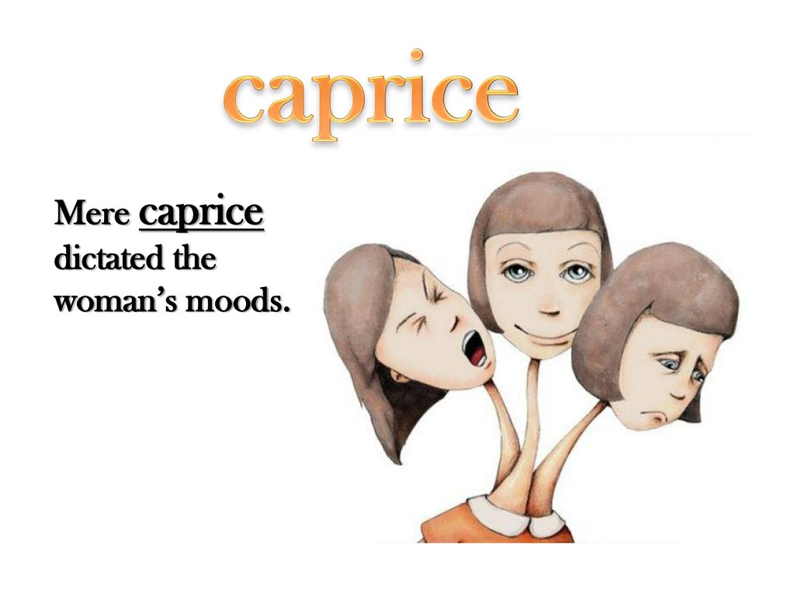 **`capr-`** = goat, 表示“山羊”。源自拉丁语 caper "he-goat," capra "sh-goat." **`-ice`** 表名词，“行为，状态”。 | **caprice-ious **         【kəˈprɪʃəs】 | a. 反复无常的, 多变的, 任性的 推荐：caprice【任性】 + -ious表形容词，是单词caprice 派生的形容词。 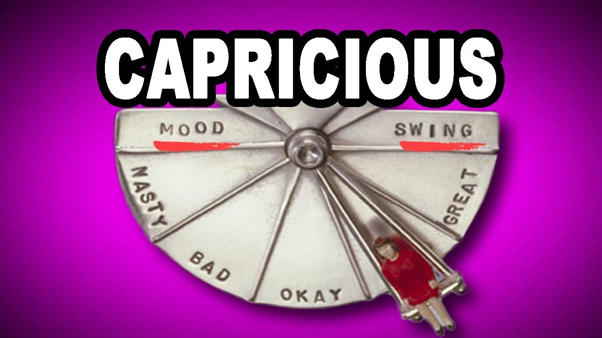 **caprice** n. 反复无常, 多变, 任性 **`-ious`** 表形容词，表示“…的”，用于化学领域表示“亚酸的，低价（金属）的”。 切换词根显示方式 词源说明(童理民)   1 - 来自 caprice. |
|                                      |                                                              |                                              |                                                              |

### caprice（反复无常）：山羊的突然跳跃

古人发现，山羊在低头安静吃草时，有时候会突然地跳跃起来。

单词**caprice**原本就是表示山羊的这种突然跳跃。它来自意大利语***capriccio*** “奇想、颤抖”，而后者来自拉丁语***capreolus***（野山羊）。后来，**caprice**引申为人心意的突然变化、一时的兴致。

- **caprice**：[kə'priːs] 
  - n.突发奇想；奇思怪想；
  - 一时兴致；心血来潮；变化无常；
  - 随想曲；充满幻想的作品
- **capriccio**：[kə'prɪtʃɪəʊ] n. 恶作剧；任性；狂想曲

**词源说明(童理民)**  
1 - 来自拉丁语 caper,山羊。因山羊喜欢蹦蹦跳跳和突然踢出后腿，因而引申此义。

**英语词源趣谈(庄和诚)**

我们在用**caprice**一词时，一般是不会立刻联想到刺猬和山羊的。可是，它们在**caprice**的词义发展中却起了一定作用。

**caprice**直接借自法语***caprice***，但却源于意大利语***capriccio***。该意大利词由capo 'head'（头）和riccio 'hedgehog'（刺猬）两部分组成，字面义是“刺猬头”，含有head with hair standing on end（毛骨悚然）或fright（惊吓）等义，因为人在受惊吓时毛发就会竖起，正像刺猬的硬刺一样。

以后***capriccio***因前半部capr形似意大利词***capra***（山羊）而与山羊的特性相联系。山羊有个奇特的习性，在安详地低头吃草的时候，往往会突然跃起或跳向一旁，然后又若无其事地恢复原状而继续低头吃草，***capriccio***因而被赋予了英语**caprice**至今还在使用的“反复无常”、“多变”、“任性”等义。原意大利词**capriccio**也被英语直接吸收，用作音乐术语，指“随想曲”。

例　

- Her decision was pure caprice. 她的决定纯粹是一时心血来潮。
- Mary's actions are unpredictable. She is known for her caprice. (NED) 玛丽的行动是难以预测的。她的反复无常是出了名的。
- He burst into a rage, out of caprice. 他莫名其妙地勃然大怒起来。

### Reference

1. [美国人也爱聊星座-- 2016-04-28 开言英语](https://www.evernote.com/l/ALpXYsAglqpHWKOGfI_-x5ELdll4XgyII4k/)

# 24节气

节气是中国特有的概念，英文没有固定翻译版本。

24节气是中国人对自然观察和农忙实践的重要经验总结和知识体系，2016年，联合国教科文组织将“二十四节气”列入人类非物质文化遗产代表作名录。

### 0. 节气 Solar term

节气是根据地球绕太阳的运行规律而进行划分的，故称 **Solar term**。

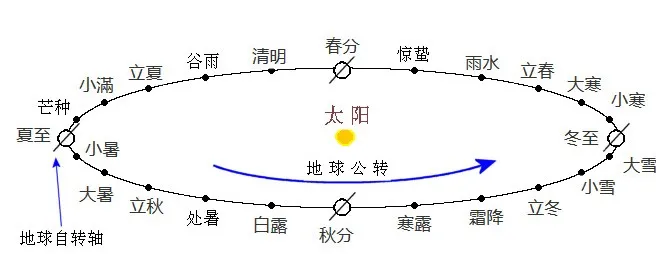 

Solar 来自拉丁文，表示“跟太阳有关的”，比如太阳系solar system，太阳能 solar energy；而Term 表示“时间段”，24节气就是一年中的24个时间段。

所以“24节气”的英文就是 24 solar terms。

下面我们按照**正序**，也就是从**“立春”**到**“大寒”**给大家梳理一遍：

### 1. 立春 Beginning of Spring

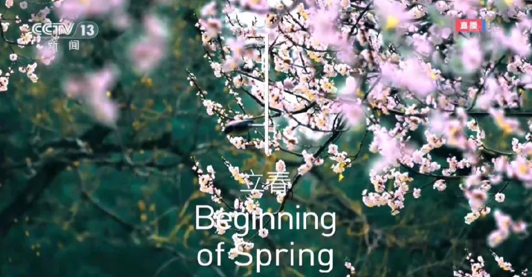 

“立春”表示“春天的开始”，英文 **Beginning of Spring**；

### 2.  雨水 Rain Water

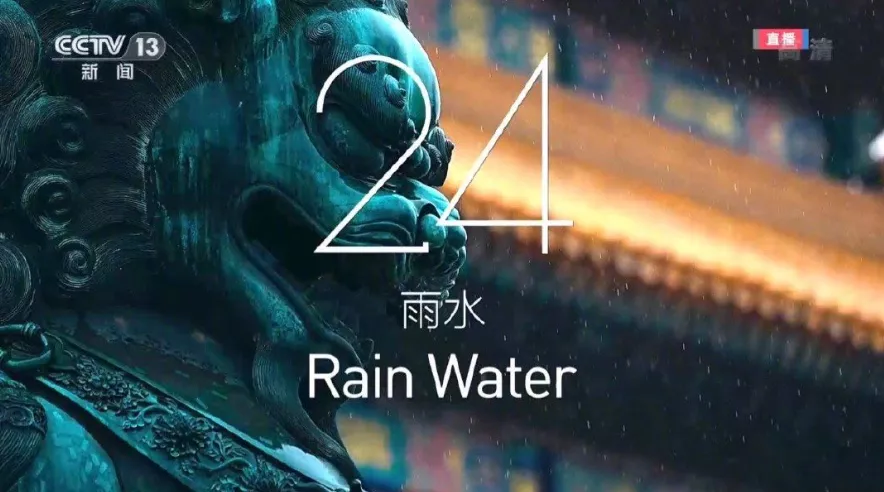 

“雨水”也是字面含义，翻译为 **Rain Water**。

### 3. 惊蛰 Awakening of Insects

 

第三个需要解释一下——“惊蛰”。中国古人造字也挺有意思啊，你看这个“蛰”，底下是“虫”，“蛰”表示冬眠中的蛇虫鼠蚁，不吃不动。

而“惊”字表示“春雷惊醒了这些冬眠的动物”， 所谓“春雷惊百虫”。惊蛰之后，万物复苏，这些蛇虫鼠蚁就要出洞了。

我们再来看“惊蛰”的翻译：**Awakening of Insects**。

冬眠的动物种类繁多，无法逐一翻译，就找了 **insects**（昆虫类）当个代表。

### 4. 春分 Spring Equinox

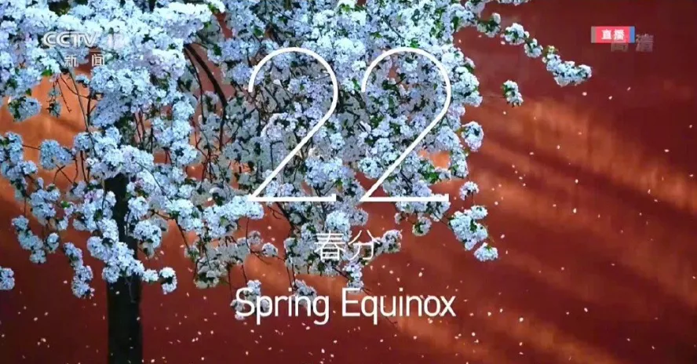 

“春分”是24节气中**四**个重要的时间节点之一（另外三个是秋分、冬至、夏至）。因为这一天，太阳直射赤道，也就意味着全球昼夜平分，Equinox 就是“昼夜平分点”的意思。

**`Equi-`**表示**equal**（相等）；**`nox`** 是古罗马神话中的“夜神”，后来指“黑夜”，所以请记住，**equinox** 字面含义就是“昼夜相等”。

所以春分（**Spring Equinox**）还是秋分（**Autumn Equinox**）是一年当中两个昼夜平分点，过了之后，就要“昼长夜短”，或“夜长昼短”了。

来看“清明”，不要和“清明节”混淆，节气这种的“清明”就是字面意思“清澈明朗”，指个时节阳光明媚、草木萌动，自然界呈现生机勃勃的景象。

- equinox【ˈekwɪnɑːks】： 

  > 二分时刻；昼夜平分时；春分；秋分
  > one of the two times in the year (around 20 March and 22 September) when the sun is above the equator and day and night are of equal length

### 5. 清明 Pure Brightness

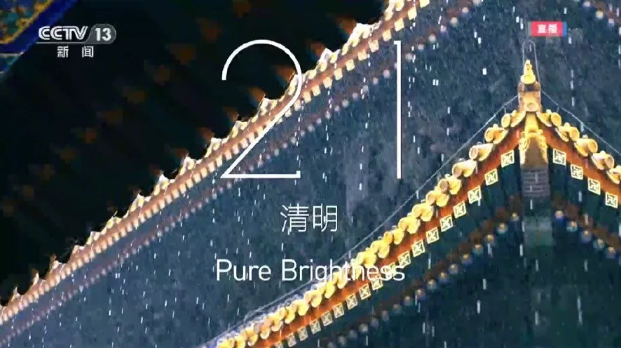 

来看“清明”，不要和“清明节”混淆，节气这种的“清明”就是字面意思“清澈明朗”，指个时节阳光明媚、草木萌动，自然界呈现生机勃勃的景象。

所以“清明”翻译为 **Pure Brightness**，把“清澈明朗”的本质翻译出来了。

 

### 6. 谷雨 Grain Rain

 

“谷雨”表示在这个时节雨水增多，农民伯伯开始播种了，所以英文是 **Grain Rain**，大家记住这个 **Grain**（谷物），后面很多节气都要用到它。

### 7.  立夏 Beginning of Summer

 

“立夏”表示“夏天的开始”，翻译不多解释——Beginning of Summer。

### 8. 小满 Grain bud

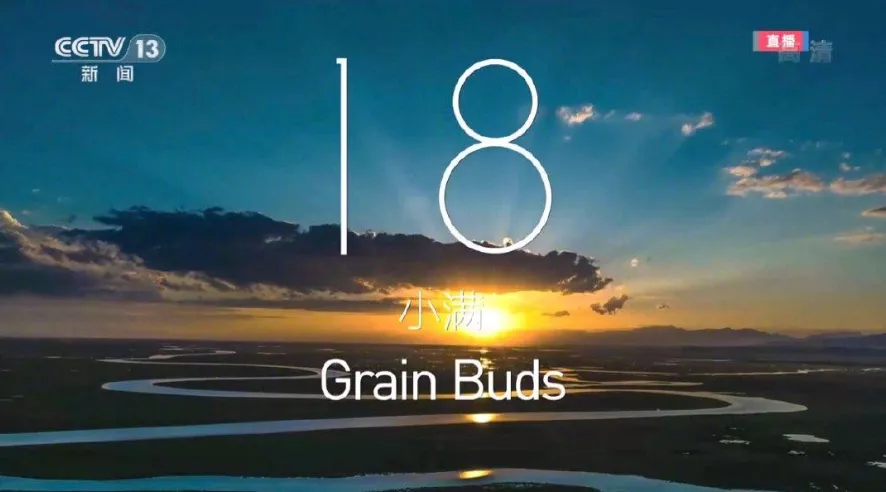 

“小满”指的是谷雨时播种的作物开始发芽，“小满”表示还未成熟，只是谷物发芽的状态，所以用 grain buds 来表示。

### 9. 芒种 Grain in Ear

Grain in Ear—the 9th of the 24 solar terms; the day marking the beginning of the 9th solar term (June 5, 6, or 7, the end of the grain-growing season and the last chance for sowing)

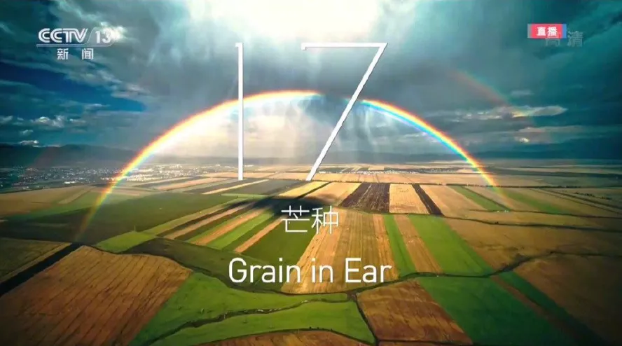 

 “芒种”表示“有芒的麦子快收，有芒的稻子可种”，指北方收麦和南方种稻之时。“芒”字指“**作物籽粒外壳上的细刺**”，***同时又跟“忙”同音***，暗指这时是农民伯伯最忙的时候。

英语为什么要翻译成 **Grain in Ear**？ 

**Ear** 此处不是“耳朵”的意思啊，而是谷类植物的“穗”，大家可以在留言区把稻穗的 emoji 表情打出来 🌾——你看，饱满的稻穗挂下来，像弯弯的耳朵吧？大家也可以这样记。

> Ear: the top part of a grain plant, such as wheet, that contains the seeds.
>
> > ears of corn: 玉米穗

**Grain in Ear** 字面意思是“稻穗里的谷物”，强调丰收的概念。

> - Once the time of grain in ear passes, it will be no use plantin 过了芒种，不可强种。
> - The Grain in Ear tells people that the wheat has ripened.芒种告诉人们小麦已经成熟了。
> - Season of Grain in Ear, river Chinese Campagna a light green. 种时节，江汉平原一片绿。

### 10. 夏至 Summer Solstice

 

这里需要重点讲讲“夏至”。

前面说过，24节气中有四个关键时间节点，**夏至**也是其中一个。“***至***”表示“**极端**”，指地球公转过程中运行到离太阳最远的点，一年中分别有两次。

夏至时，太阳光直射北回归线；冬至时，太阳光直射南回归线。这个“至点”在英文中叫 **solstice**，来自拉丁文 ***solstitium***，sol 就是 solar（太阳），词根 **stit** 就是停止，静止，表示太阳到达离地最远点。

> sol,太阳，-st,站住，停止，词源同 stand,-ice,名词后缀。**字面意思即太阳停止的地方**，用于指夏至（北回归线）或冬至（南回归线）。
>
> 推荐：sol-太阳 + stice
> **`st-,sta-,stat-,stan-,stant-,stin-`** = stand, 表示“站、立”。
>
> **`sol-`** = sun, 表示“太阳”。源自拉丁语 sol "the sun."

夏至之后，就是北半球的炎炎夏日。

### 11. 小暑 Minor Heat

 

接下来就是“小暑”和“大暑”两个节气，这两个节气很好理解，英语翻译也简单 **minor heat** 和 **major heat**。

**Minor** 表示“小的、次要的”，未成年人就可以用 **minor** 来表示；**major** 是 **minor** 的反义词，表示“大的、主要的”。

### 12. 大暑 Major Heat

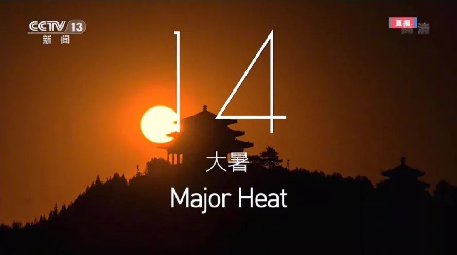 

### 13.立秋 Beginning of Autumn

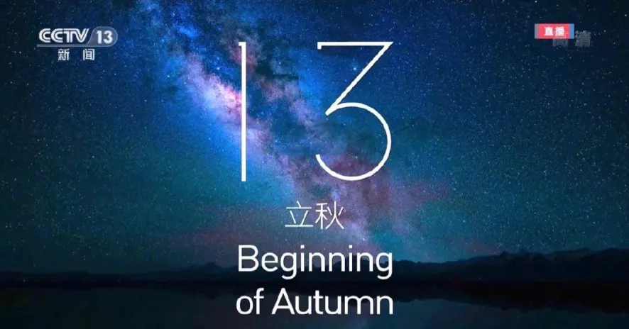 

“立秋”不多解释，Beginning of Autumn，秋天的开始。

### 14.处暑 End of Heat

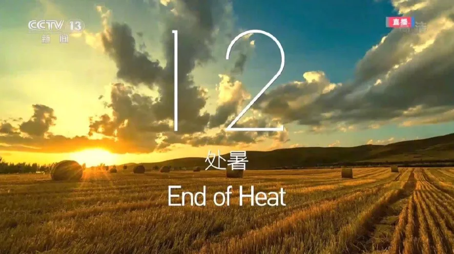 

“处暑”就是“暑气的终结”，英文是 end of heat，也很好理解。

### 15.白露 White Dew

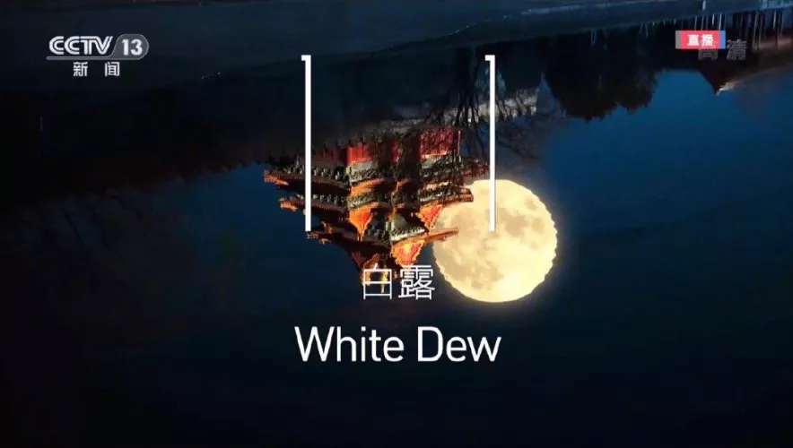 

“白露”是指天气变凉之后，挂在植物叶子上白色的露珠，非常有诗意的一个词，李白名句“露从今夜白，月是故乡明”，描写的就是“白露”时节。

英语翻译不难，按字面翻译的，叫 **White Dew**，**Dew** 就是露珠的意思。

### 16.秋分 Autumn Equinox

 

“秋分”其实前面提到过，原理跟“春分”一样，太阳光直射赤道，全球昼夜相等，**Equinox** 表示“昼夜平分点”，这里就不赘述了。

### 17.寒露 Cold Dew

 

“寒露”的“露”还是白露的那个露 **Dew**，但一个“寒”字，点明了气温的下降，英文是 **Cold Dew**。

### 18.霜降 Frost's Descent

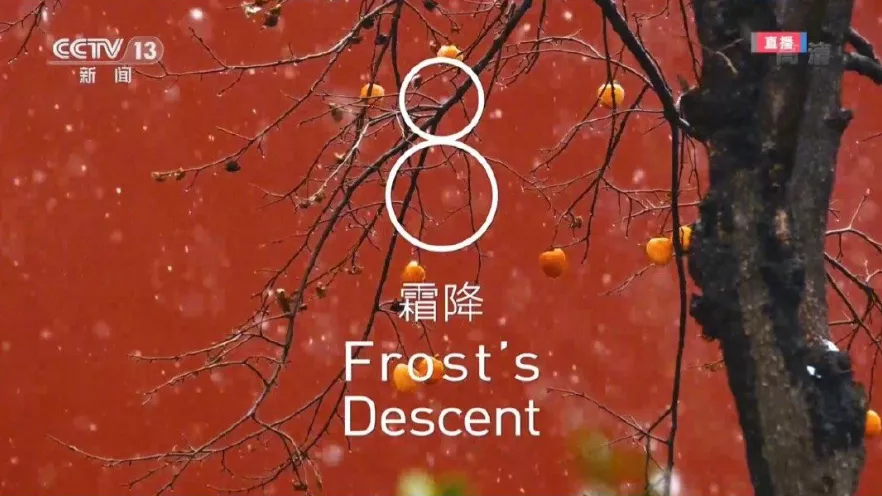 

“霜降”表示气温进一步下降，都开始落霜了，**Frost’s Descent** 也是字面翻译，**frost** 表示“霜”，**descent** 表示“下降”、“落下”。

对了，这个词还可以表示血统、出身，这是引申义了，因为血统讲究的就是传承，这也是从上到下的概念。**descendant** 表示后裔、后代、子孙。

有人可能会问霜降的“降”为啥不用 **fall**，**drop**？因为不如 **descent** 高级。

### 19.立冬 Beginning of Winter

 

“立冬”是冬天的开始，**Beginning of Winter**。

### 20.小雪 Minor Snow

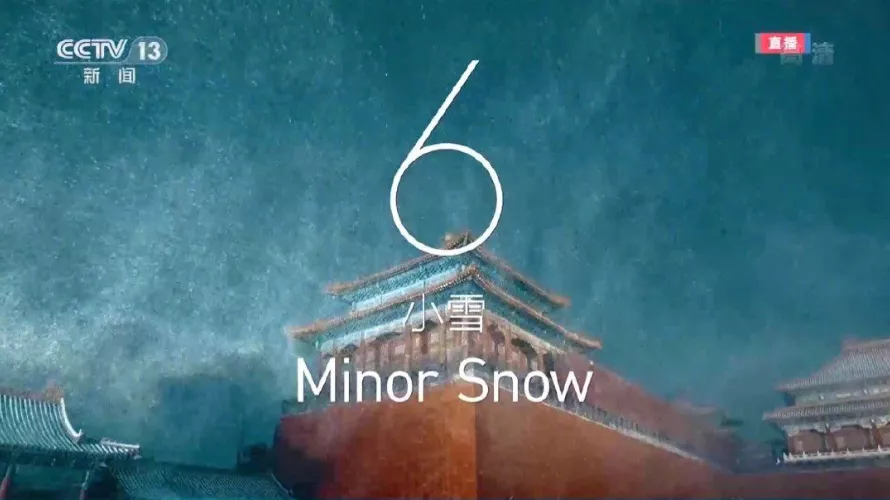 

“小雪”: Minor Snow

### 21.大雪 Major Snow

 

“大雪”: Major Snow

### 22.冬至 Winter Solstice

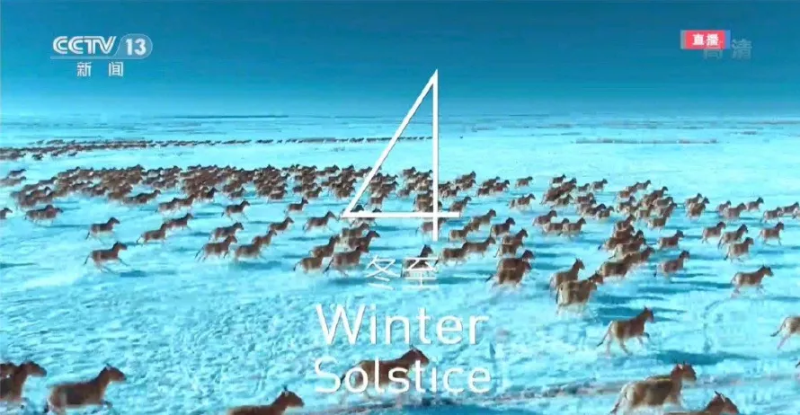 

 

“冬至”就是地球又运行到了离日最远点，此时太阳直射南回归线。

### 23.小寒 Minor Cold

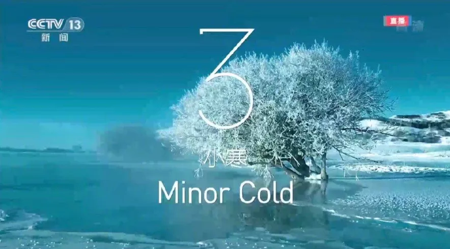 

### 24.大寒 Major Cold

 

### Reference

1. [冬奥会开幕式“24节气倒计”太高级！英语为何这样翻译？--谢侃](https://mp.weixin.qq.com/s/C4BlHkwzKWt5y4pRvdx2yg)

## 扑克牌

### Poker face

###   spade - 扑克牌中的黑桃

> Spade【speɪd】 锹;铲;(纸牌中的)黑桃;黑桃牌

**spade** - 扑克牌中的黑桃之所以称作**spade**并不是因为它形似铲子。

从词源上来说，意为“铲子”的spade只是意为“黑桃”的spade的远亲。前者在古英语的词形为spadu，意思就是“铲子”，而后者则源自意大利语spada的复数形式spade，原义是“剑”，16世纪进入英语。一般辞书都将它们分列为两个词条。但两个spade最终都可溯源至希腊语spáthē 'broad blade'（阔的刀刃）。

古时的意大利纸牌中有一组黑花色牌，上面印的是阔刃剑，英国人就把这组黑花色的牌叫做spades，但英国牌上印的却不是阔刃剑，而是仿法国纸牌上的箭尖头图案（pike）或早先德国人的纸牌上印的树叶状图案（leaf）。这在一般人看来颇像铲子，而在中国人看来就像是黑桃，汉语“黑桃”因而得名。

- You must play a spade if you have one. 如果你有黑桃，你就得出黑桃。
- You should have led a high spade. 你本应出一张点数大的黑桃。
- I only had the ace of spades and the three of hearts in my hand. 我手中仅有黑桃A和红桃3。

### ace（王牌）：扑克牌中的A

人们通常认为，西方的扑克牌（**poker**）源自意大利的塔罗牌。除了大小鬼两张副牌外，共有52张正牌，分成四个花色。除了1-10等数字牌外，还有K、Q、J三种人头牌。其中

- **K**代表**King**（国王），
- **Q**代表**Queen**（王后），
- **J**代表**Jack**（勇士）。

其中，表示数字“**1**”的牌用字母**A**表示，英语中叫做**ace**，意思就是“**一**”，来自法语和拉丁语**as**（一）。**ace**除了可以表示扑克牌中的A外，还可以表示骰子中的一点。由于**ace**代表最小的分值，所以**ace**原本含有“坏运气”、“无用的东西”等含义。

在法国大革命后，人们修改了扑克牌的游戏规则，使**A**比**K**大，作为“底层人民推翻君主”的象征。从此以后，**A**成了最大的牌。相应的，单词**ace**的含义也发生了变化，变成了“王牌、佼佼者”的意思。在第一次世界大战中，**ace**还被用来表示击落5架以上敌机的王牌飞行员。在网球比赛中，发球直接得分也被称为“ace球”。

- **ace：[eɪs]**
  - n.幺点，佼佼者，王牌，直接得分的发球
  - adj.一流的，极好的
  - v.发球直接得分，击败，得高分，顺利通过考试

- Her sister is an ace reporter. 她姐姐是位第一流的新闻记者。