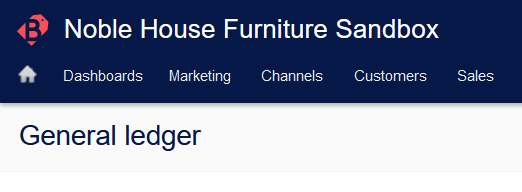
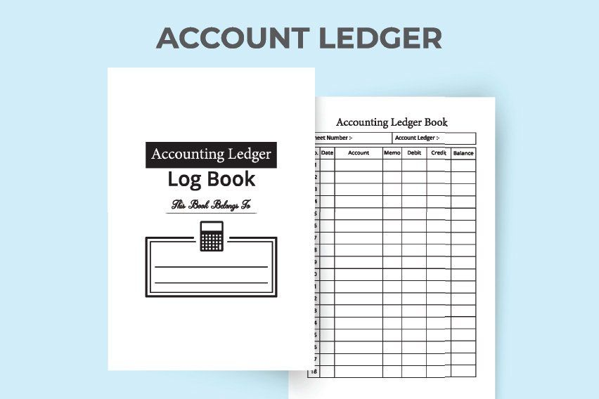
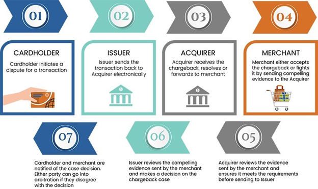
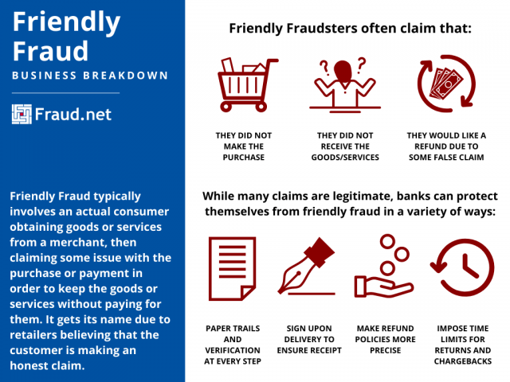
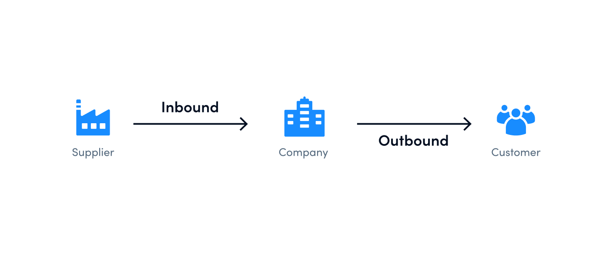
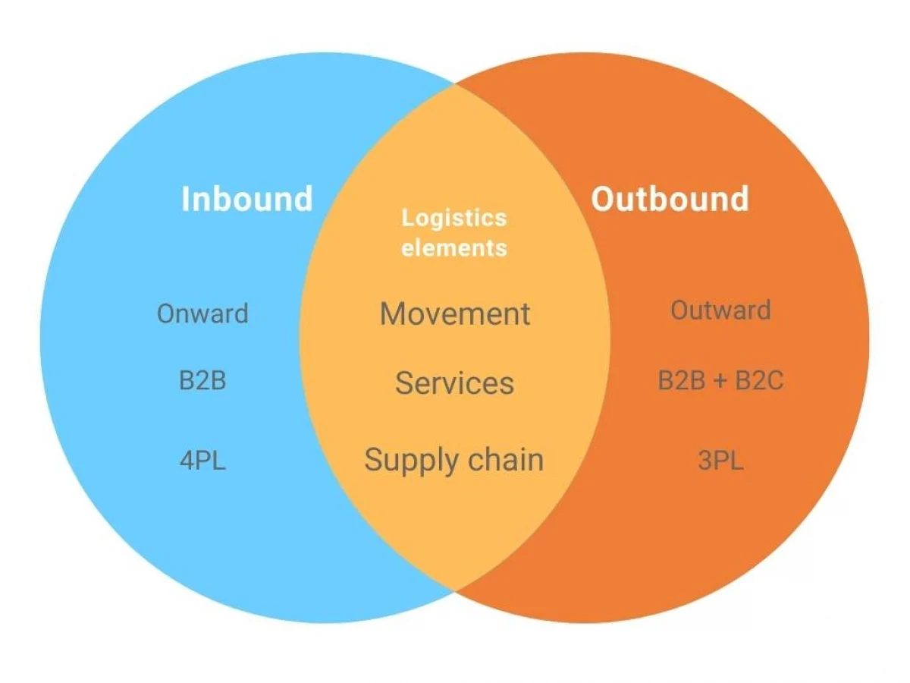
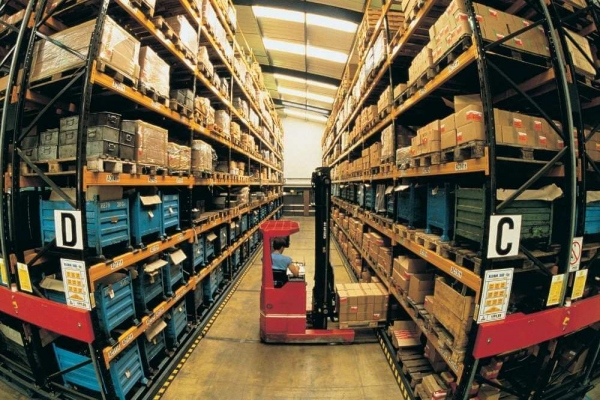

# 咬文嚼字-学科相关-电商财务篇

[toc]

 

## ledger

 

n. 分类帐, 分户总帐; 横木

lag-,law,lay- 8
这是一组同源词，原始含义表示 "to lay, put, place 放下"。其原始印欧语形式为 *legh。law 词义由“放置”引申为“法律”。

-er 是施动者名词后缀，表示“人或物”，一般缀于动词后，来自古英语。

**词源说明(童理民)**  
1 - 来自 PIE*legh,放置，词源同 lay,lager,插入字母 d.原指教堂放在固定位置的祷告书。

后引申词义帐本，帐目表，因帐目表通常放在固定的安全位置，同时也因为帐目表的重要性。

**摩西英语(摩西)**

ledger ['ledʒə] n.总帐；[会计] 分类帐；帐簿；底帐。

 

ledger最初指中世纪英国教堂里放在讲经处很少移动大部头的每日祈祷书，词源上与lay和lie甚至law n.法律（制定下来的规则）等有关。因为这些书普遍很沉重，所以就固定放在某处而不是被拿来拿去。

商业上的账本也是如此，厚厚的，需要时才拿出来。 

## Inverse

a. 倒转的, 相反的
n. 反向, 反面

推荐：in-进 + vers-转 + -e → 转进去 → 翻转的。

**in-** 来自拉丁语in-，表示“在内，进入，使...”。

**vers-** 76= turn, 表示“转”。源自拉丁语 vertere, versare "to turn."

**词源说明(童理民)**  

1 - 来自 invert,颠倒，倒置，-se,过去分词后缀。引申词义相反的，反向的。

**摩西英语(摩西)**
inverse ['ɪnvɜːs] n.倒数；相反；倒转，adj. 相反的；倒转的。

拉丁词根vert-,vers-表to turn，二者啥关系呢？简单说**vert-表to turn**，而**vers-是turned**。因此**invert**就是动词使...颠倒；使...翻转，而inverse则可以理解为“inverted”，再如divert是动词转移，diverse则是形容词不同的；多种多样的。

- Regardless of how the physical stock is managed, a sales credit is required. A sales credit is the [inverse](https://help.brightpearl.com/hc/en-us/articles/212648483) of a sales order.

## Chargeback（信用卡)退单

> [GDF-Shopify refund issue](https://bsitc.on.spiceworks.com/tickets/open/25106/activity) - #002155030
>
> Per Daniel A, opening a ticket for the above issue. We are unable to refund with error message: "This transaction already has a chargeback filed". However, key points to consider -there's no open chargeback filed for this order -on June 6,  Fulfillment "cancelled" the order after the refund they submitted didn't push thru (due to the paypal restriction at the time that recently has been lifted)

Chargebacks are initiated by cardholders, evaluated by banks, and paid for by merchants. A single chargeback, from initiation to resolution, can last months or even years.

[A chargeback is a debit or credit card transaction](https://www.chargebackgurus.com/blog/merchant-chargebacks-101-what-they-are-why-they-matter) that’s reversed by the cardholder’s bank after they dispute a charge on their account. Chargebacks may also be referred to as payment disputes.

> “退款”指的是持卡人对信用卡上的费用提出异议后，由持卡人的银行撤销的一种借记卡或信用卡交易。退款也可能被称为支付纠纷。

The meaning of the word chargeback is fairly straightforward. The bank will charge back the amount of the disputed transaction to the merchant, returning the money to the cardholder without needing the merchant’s approval.

> “退款”这个词的意思是相当直接的。银行将不经过信用卡商户(merchant’s approval)的同意，直接把有争议的交易金额返还给商户(merchant)。

When a cardholder disputes a charge, banks typically review the transaction, and if the reason for the dispute is valid, provide a provisional credit to the customer’s account while the chargeback claim is resolved.

> As a business owner, the last thing you want is a dispute with a customer. Unfortunately, with the increased incidence of chargebacks due to “**friendly fraud**,” businesses are at a greater risk of losing money from customers who opt to file a dispute with their bank instead of working directly with merchants to resolve the issue or receive a refund.

### What is the chargeback process?

 

1. When a cardholder disputes a transaction with their issuing bank, the bank decides whether or not the customer has grounds to file a chargeback.
   - **ground**: [C, usually pl.] ~ for sth/for doing sth: 充分的理由；根据 (a good or true reason for saying, doing or believing sth)
     - You have no grounds for complaint. 你没有理由抱怨。
     - What were his grounds for wanting a divorce? 他要离婚的理由是什么？
     - The case was dismissed on the grounds that there was not enough evidence.此案以缺乏足够的证据为由被驳回。
     - He retired from the job on health grounds. 他因健康原因退职。
     - Employers cannot discriminate on grounds of age. 雇主不得有年龄歧视。
2. If a chargeback is granted, the bank will notify the acquiring bank—AKA the merchant’s bank—and debit the funds from the merchant’s account.
3. The merchant can either accept the chargeback or fight it by resubmitting the charge along with a rebuttal letter and the necessary evidence to disprove the claim. This process is called representment.
4. The issuing bank will review the new evidence and make a decision. If they find in favor of the merchant, the funds will be returned.
5. At this point, any party unhappy with the decision can contest the issue further by initiating pre-arbitration. This most often occurs when the issuing bank decides in the merchant’s favor, but then receives new evidence that puts that decision in question.
6. If neither party accepts liability during pre-arbitration, the chargeback moves to arbitration. Here, the card network will examine the evidence and make a final decision. This decision can’t be appealed further, and the losing party will be required to pay hundreds of dollars in fees.

### Reference

1. [What is a Chargeback?](https://www.chargebackgurus.com/blog/merchant-chargebacks-101-what-they-are-why-they-matter)

## Friendly Fraud(友善欺诈)

Friendly Fraud, also referred to as first-party fraud, can take many forms, but typically involves an actual consumer obtaining goods or services from a merchant, then claiming they did [not make the purchase](https://fraud.net/s/chargeback-protection/), did not receive the goods, request a refund from a false claim, or only received a fraction of items, in order to keep the goods or services without paying for them. 

> 友好欺诈，也被称为第一方欺诈，可以采取多种形式，但通常涉及到一个实际的消费者从商人那里获得商品或服务，然后声称他们没有购买，没有收到商品，从一个虚假的索赔要求退款，或只收到了一小部分商品，以保留商品或服务，而没有支付他们的钱。

It gets its name due to retailers believing that the customer is making an honest claim. “Friendly fraudsters” are often good at their crimes, which can sometimes make it hard for customer service to point out a fraudulent claim.

> 它之所以得名，是因为零售商相信顾客是在诚实地索赔。友好的骗子往往擅长他们的犯罪，这有时会使客户服务很难指出欺诈性索赔。

 

Reference:

1. [What is Friendly Fraud?](https://fraud.net/d/friendly-fraud/)
2. [What is Friendly Fraud?](https://www.ethoca.com/blog/what-is-friendly-fraud)

## Logistics

###  What is outbound logistics?

> Outbound logistics refers to all logistics processes built for moving finished products from a storage facility to the end-user.

 

(formal)  **travelling from a place rather than arriving in it** (向外的；出港的；离开某地的)

- But Chinese **outbound investment** could still increase if companies and individuals seek safety overseas.(但是如果公司和个人到海外寻求资金安全，中国的境外投资可能还会上升。)
- The trend of growing **outbound** Chinese investment is unmistakable. (长中国对外投资增长的趋势是显而易见的。)
- He's booked an **outbound flight** 48 hours later. 他预定了48小时后出国的航班

 

### Inbound logistics

> Inbound logistics, on the other hand, encompasses all the logistical processes that have to do with moving raw materials into the company.

Essentially, inbound logistics is all about supply, suppliers, and [supplier relationship management](https://www.track-pod.com/blog/supplier-management-logistics/), which involves a lot of transportation but never includes the end-user.

Businesses approach inbound logistics differently depending on their industry, production capacity, and many other factors. Some businesses outsource inbound logistics processes and some manage them in-house.

Ultimately, inbound logistics is meant to support the supply chain with solid warehouse operations, storage, and inventory management. Depending on the demand for a specific product, businesses need to optimize their supply processes to cut operational costs and promote cost savings.

 

### Reference

1. [Outbound Logistics: What It Is & How to Do It Right](https://www.track-pod.com/blog/outbound-logistics/)

