# 咬文嚼字-词根词缀(100-199)

[toc]

## -age 表示“状态，总称” {199}

| 单词                                         | 解释                                                         | 单词                                                 | 解释                                                         |
| -------------------------------------------- | ------------------------------------------------------------ | ---------------------------------------------------- | ------------------------------------------------------------ |
| **acre-age**[^1][^2] 【ˈeɪkərɪdʒ】      | acre【ˈeɪkər】：英亩（4 840平方码，约为4 050平方米） an area of land measured in acres [U, C] 大块土地；英亩数 | **advant-age** 【ədˈvæntɪdʒ】              | **`advant-` = ahead**, 表示“前面”，来源于法语 avance 以前，其字母 d 是在 16 世纪时加=>先行优势 |
| **amper-age** 【ˈæmpərɪdʒ】             | 按倍数                                                       | **anecdot-age** 【'ænek,dotɪdʒ】                | anecdote【ˈænɪkdoʊt】 n. 轶事, 奇闻                          |
| **arbitr-age** 【ˈɑːrbɪtrɑːʒ】          | **`arbitr-`** = judge, 表示“判断”。复合词根：ar-=ad- + bit-走。 | **arbitr-ary** 【ˈɑːbɪtrəri】                   | arbitr-判断 + **`-ary`**形容词后缀 → 做出[自己的]判断 → 武断的。 |
| **band-age** 【ˈbændɪdʒ】               | band-带子 + -age, 表名词 →用带子束缚。  | **bond-age** 【ˈbɑːndɪdʒ】                      | n. 奴役, 束缚  bond n. 捆绑物, 结合, 债券, 保释金, 契约, 粘合剂, 保证人, 键, 关栈保留 vt. 存入关栈, 使黏合 vi. 结合 -age 表示“状态，总称”。 词源说明(童理民)   1 - 来自 PIE*bheue,存在，生长，居住，词源同 be,husband.后词义受 bond 影响。 |
| **baron-et-age**         【bærənɪtɪdʒ】 | **baron**: 男爵 **`-et`**： 表示“小”。源自拉丁语 -ellus, diminutive suffix. | **baron-age** 【bærənɪdʒ】                      | baron 【ˈbærən】 男爵（英国男爵头衔为Lord;其他国家为Baron） n. 男爵, 男爵爵位, 贵族 |
|                                              |                                                              | **barr-age** 【bəˈrɑːʒ】                        | **`barr-` = bar, barrier**, 表示棍子引申为“栏”。 火力网;弹幕射击;(尤指)掩护炮火;堰;水坝;拦河坝 |
| **blindage**                                 | （军事）盲障；掩体；隐蔽部 (esp formerly) a [protective](https://www.collinsdictionary.com/zh/dictionary/english/protective) [screen](https://www.collinsdictionary.com/zh/dictionary/english/screen) or structure, as over a [trench](https://www.collinsdictionary.com/zh/dictionary/english/trench)。这个完全不同于地堡Bunker。 | **brew-age** 【bruːɪdʒ】                        | **brew** n. (酿的) 啤酒; 一杯茶 (或咖啡); 酝酿 v. 酿造; 沏 (茶等); 酝酿 |
| **broker-age** 【ˈbroʊkərɪdʒ】          | 经纪业务;经纪人佣金(或回扣)                                  | **buoy-age** 【bɔɪeɪdʒ】                        | 浮标；浮标装置； a system of buoys                           |
| **cab-b-age**[^5] 【ˈkæbɪdʒ】           | **`cap-,cipit-`** = head, 表示“头”。源自拉丁语 caput "head" 显然，这种菜是因其形似人的头颅而得名的。它是最古老的蔬菜之一，其种植史已有四千多年。 在希腊神话中卷心菜被说成是主神宙斯头上的汗珠变的，古希腊人还相信卷心菜能治秃头病。 Children never semm to like eating  cabbage. | **carnage** 【ˈkɑːrnɪdʒ】 carn.age         | carn- = flesh, 表示“肉，肉欲”，原始含义“切、砍”下来的一块肉。源自拉丁语 caro (词干 carn-) "flesh." 大屠杀 |
| **ballotage** 【bælɔ'tɑ:ʒ】             | n. 决选投票                                                  | **salv-age** 【ˈsælvɪdʒ】                       | **`salv-`** = safe, healthful, saved, 表示“安全、健康、储存”等。源自拉丁语 salus "health," salvus "whole, healthy, safe, uninjured." salve【救】 + -age名词后缀。引申诸相关词义。 打捞;挽救;挽回;营救(失事船舶等);抢救(失事船舶、火灾等中的财物) |
| **cot∙t∙age** 【ˈkɑːtɪdʒ】              | **`cote`** n. 棚, 窝, 栏. 小屋;(尤指)村舍，小别墅。（a small house, especially in the country） 引申出：cottage industry:家庭作坊。Such fakes have become a cottage industry in China. [比较：Cotton 棉花] | **assemble-age**  【əˈsemblɪdʒ】                | a collection of things; a group of people(formal, technical 术语) （人、物的）集聚. Tropical rainforests have the most varied assemblage of plants in the world. |
| **burg-age** 【bɜ:ɡeɪdʒ】               | **`burg-`** 表示“ 城堡”。源自拉丁语 burgus "fortified place;" 古法语 burg "borough." （英史）市镇土地保有权;民宅 tenure of land or tenement in a town or city, which originally involved a fixed money rent  [history] | **pass-age**  【ˈpæsɪdʒ】                  | pass【走过，通过】 + -age, 表名词。 **`pass-`** = pass through, 表示“通过”。源自拉丁语 pandere (过去分词 passus) "to spread out" 通道；过道；走廊\|   通过；经过 |
| us-age                                       | use【使用】 + -age状态 → 用的状态 → 用法。              | **ton-n-age** 【ˈtʌnɪdʒ】                       | n. 吨位 推荐：ton【吨】 + -age名词后缀。  **`ton`** n. 吨 **`-age`** 表示“状态，总称”。 词源说明(童理民)   1 - 来自 ton,吨，-age,名词后缀。 30 to 50 percent of the **tonnage** of imports to Venice was in salt |
| **baggage**  【ˈbæɡɪdʒ】                | 行李;(因阅历而形成的)信仰，看法。 She was carrying a lot of emotional baggage .（她背负着很多感情包袱。） | **luggage** 【ˈlʌɡɪdʒ】                         | also baggage especially in NAmE.  Luggage is the usual word in BrE , but baggage is also used, especially in the context of the bags and cases that passengers take on a flight. **In NAmE baggage is usually used.** 英国英语常用luggage，但也用baggage，尤指旅客乘飞机时所带的行李。北美英语通常用baggage。 |
| **seep-age** 【ˈsiːpɪdʒ】               | . 渗漏, 渗出物 推荐：seep【vi. 渗出】 + -age 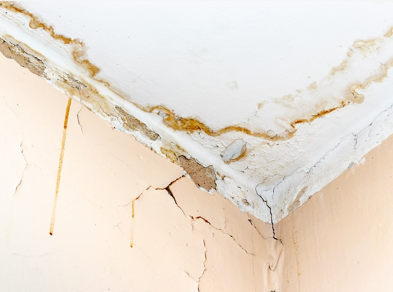 **`seep`** vi. 渗出, 渗流, 漏 n. 小泉, 水陆两用吉普车 **`-age`** 表示“状态，总称”。 词源说明(童理民)   1 - seep,渗透，渗漏，-age,名词后缀。 | **seep** 【siːp】                               | vi. 渗出, 渗流, 漏 n. 小泉, 水陆两用吉普车 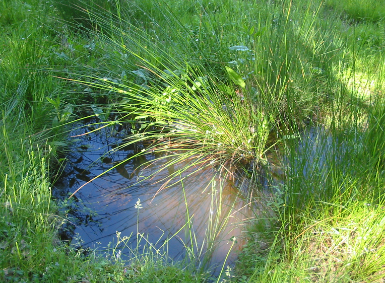 词源说明(童理民)   1 - 来自古英语 sipian,渗透，流出，来自 Proto-Germanic*sip,渗透，流出，来自 PIE*seip,流出，溢出，词源同 soap,sebum. |
|                                              |                                                              |                                                      |                                                              |
|                                              |                                                              |                                                      |                                                              |

## enter,inter- 表示“在…之间，相互，内”。

> 由 in- + ter-（土地）组成。在医学领域 enter- 表示“小肠”，已单独列出{178}

| 单词                                  | 解释                                                         | 单词                                    | 解释                                                         |
| ------------------------------------- | ------------------------------------------------------------ | --------------------------------------- | ------------------------------------------------------------ |
| **intern-ship**  【ˈɪntɜːrnʃɪp】 | n. 实习;(学生或毕业生的)实习期;医科学生的实习工作 推荐：intern【实习医生】 + -ship表示关系、状态或技能等  **`enter,inter-`** 表示“在…之间，相互，内”。由 in- + ter-（土地）组成。在医学领域 enter- 表示“小肠”，已单独列出。 **`-ship`** 表示某种关系、状态或技能。源自古英语 -scipe "state, condition." 词源说明(童理民)   1 - 来自 intern,实习。 | **intern** 【ɪnˈtɜːrn , ˈɪntɜːrn】 | n. 实习生, 被拘留者 vi. 作实习医师(教师、实习生) vt. 拘留, 扣留 推荐：来自in的比较级，-ter , 比较级后缀，-n , 鼻音后缀。即更里面的，用于动词词义拘留，关押。 来自in的比较级，-ter , 比较级后缀，-n , 鼻音后缀。用于名词词义实习医生，实习学生。  **`enter,inter-`** 表示“在…之间，相互，内”。由 in- + ter-（土地）组成。在医学领域 enter- 表示“小肠”，已单独列出。 更多同源词... 词源说明(童理民)   1 - 来自 in 的比较级，-ter,比较级后缀，-n,鼻音后缀。即更里面的，用于动词词义拘留，关押。 2 - 来自 in 的比较级，-ter,比较级后缀，-n,鼻音后缀。用于名词词义实习医生，实习学生。 |
|                                       |                                                              |                                         |                                                              |
|                                       |                                                              |                                         |                                                              |

## 小小小小小小小小小

### - et / -le / -let, 表示“小”。源自拉丁语  {176}

> \- et / -le / -let = -et, 表示“小”。源自拉丁语 -ellus, diminutive suffix.
>
> 后缀**`-et`**表示“小”，如**widget**（小部件、小工具）、**closet**（小房间）、**bullet**（子弹，小球）。

| 单词                             | 解释                                                         | 单词                            | 解释                                                         |
| -------------------------------- | ------------------------------------------------------------ | ------------------------------- | ------------------------------------------------------------ |
| **amulet** 【ˈæmjʊlət】     | n. 护身符；驱邪物(为祛邪防病等佩戴的珠宝)  推荐： 词源不详。可能同词根am- , 爱。 | **omel-et** 【ˈɑmlət】     | n. 煎蛋卷, 煎蛋饼, 炒蛋  **`omel-`**=lamel-层 + **`-et`**小词后缀。 **`lamell-,lamin-`** = leaf, layer, 表示“层，片”。源自拉丁语 lamina "plate, layer." |
| **plate-let** 【ˈpleɪtlət】 | n. 血小板, 小盘, 小板 plate【板】 + -let小词后缀 plate  n. 碟, 盘子, 盆中物, 金属板, 图版, 金银餐具, 印版, 金属牌(照) vt. 镀金, 电镀, 用金属板固定, 给...装钢板, 为...制印版 | **cors∙et** 【ˈkɔːrsɪt】   | n. (尤指旧时妇女束腰的)紧身褡, 妇女的胸衣  **`cors-`** = body, 表示“身体，团体”，corp- 来自拉丁语名词 corpus "body", corpor- 源自其属格 corporis。词源说明(童理民)   1 - cors-,词源同 corp-,身体。-et,小词后缀。 |
| **gird-le** 【ˈɡɜːrdl】     | n. 腰带, 围绕物 vt. 用腰带束缚, 围绕 推荐：<gird【围，绕】 + -le。   gird n. 嘲笑 vt. 用带束, 佩带, 围绕, 嘲笑 vi. 准备, 嘲笑 词源说明(童理民)   1 - 来自 gird,围，绕。 | **gird** 【ɡɜːrd】         | n. 嘲笑 vt. 用带束, 佩带, 围绕, 嘲笑 vi. 准备, 嘲笑 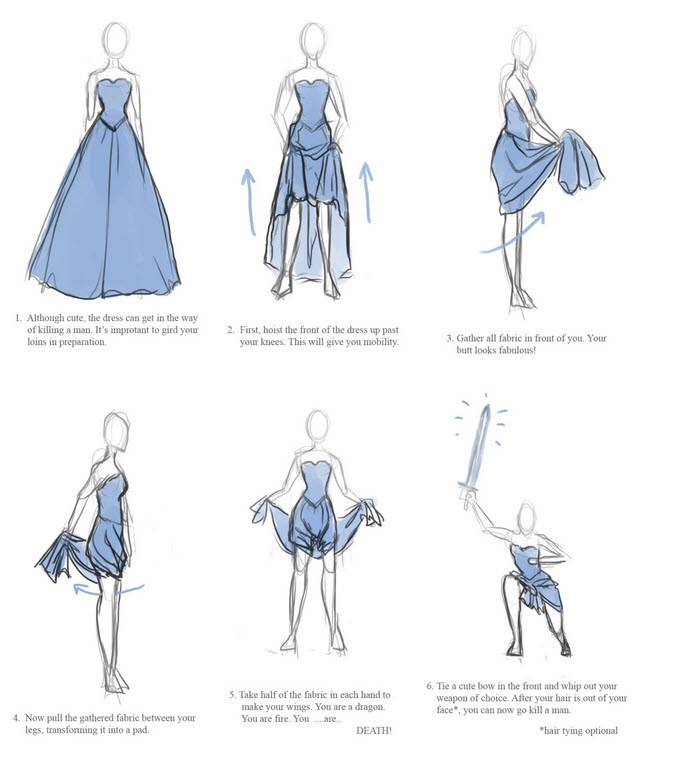 **gird your loins** 词源说明(童理民)   1 - 来自 PIE*gher,围，绕，词源同 yard,garden. |
| **ballet** 【bæˈleɪ】       | **`ball-`**= throw, dance, ball, 表示“抛，舞，球”。源自希腊语 ballein "to throw" **t** 不发音 | **pell-et**     【ˈpelɪt】 | **`pil-`** = hair, 表示“毛发”。源于拉丁语 pilus "a hair." 词源说明(童理民)   1 - 来自拉丁语 pila,球，球丸，词源同 pill.-et,小词后缀。 n. 颗粒状物, 小子弹, 小药丸 vt. 使成颗粒, 使成团, 用子弹打 |
| bull-let                         | n. 子弹 推荐： bull(=ball)球 + -et小词后缀 → 小球 → 子弹。 | cave-let                        | n 小洞 cave-洞 + -let小词后缀                            |
| widg=et                          | 小部件、小工具                                               | clos-et                         | 小房间                                                       |
| **fac-et** 【ˈfæsɪt】       | n. (多面体的)面,, 方面;(事物的)部分;(宝石的)小平面;琢面 推荐：face【脸】 + -et小词后缀 → 像脸的一面 → 平面 , 表面。 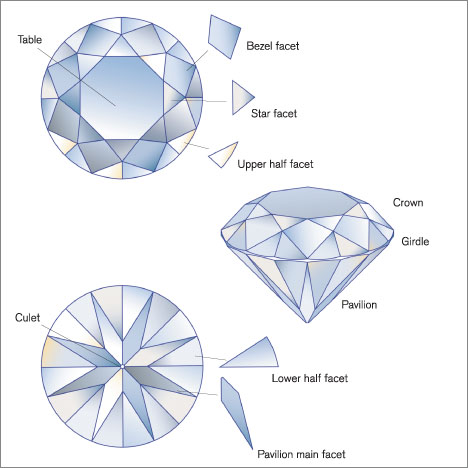 face n. 脸, 面容, 正面, 外观 vt. 面对, 朝, 正视, 面临 vi. 朝, 向 -et = -et, 表示“小”。源自拉丁语 -ellus, diminutive suffix. 切换词根显示方式 词源说明(童理民)   1 - 来自 face,脸，-et,小词后缀。 | **bezel** 【ˈbezl】        | n.(手表、手机等的)嵌玻璃凹槽，镶嵌板外圈 (technical 术语)  a ring with a long narrow cut around the inside, used to hold sth in place, such as the cover of a watch or mobile phone/cellphone 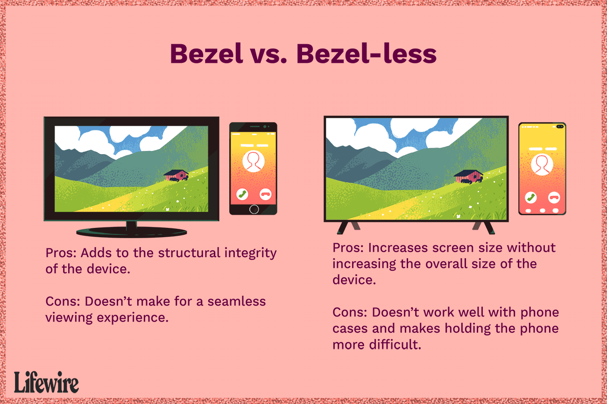 |
|                                  |                                                              | **leaf-let** 【ˈliːflət】  | 百度翻译对原文进行调整，例句发音部分来自牛津n. 小叶, 传单 推荐：leaf【叶子】 + -let小词后缀。引申词义传单，小册子。  leaf n. 叶, 树叶; 页; 薄金属片, 箔; 折叠桌板 v. 生叶; 匆匆翻阅, 浏览 **`-let`** = -et, 表示“小”。源自拉丁语 -ellus, diminutive suffix. 词源说明(童理民)   1 - leaf,叶子，-let,小词后缀。引申词义传单，小册子。 |
|                                  |                                                              |                                 |                                                              |

#### -le  表示“反复”{21}

| 单词                        | 解释                                                         | 单词                          | 解释                                                         |
| --------------------------- | ------------------------------------------------------------ | ----------------------------- | ------------------------------------------------------------ |
| **bat∙t∙le** 【ˈbætl】 | n. 战役 v. 战斗 bat-击，打 + -t- + -le, 表反复。 **`bat-`** = beat, 表示“打、击”。 **`-le`** 21表示“反复”。 | **bust-le** 【ˈbʌsl】    | n. 喧闹; 裙撑 v. 奔忙. 催促 推荐： 来自bust, 同burst, 爆发。 |
|                             |                                                              | **bustling** 【ˈbʌslɪŋ】 | a. 熙熙攘攘的, 忙乱的 推荐： bustle【忙碌,】 + -ing  |
|                             |                                                              |                               |                                                              |
| brittle 【ˈbrɪtl】     | a. 易碎的, 脆弱的, 易坏的  推荐： 词源同break，破开 + -le, 表反复。  词源说明(童理民)   1 - 词源同 break,破开。 | **beetle** 【ˈbiːtl】    | n. 甲虫; 大槌 v. 快速移动; 突出 推荐： beetle 披头士乐队（The Beatles）就是甲壳虫乐队。 词源说明(童理民)   1 - 词源同 bite,咬。 |

#### -el 表名词，“人或物”{15}

| 单词                                     | 解释                                                         | 单词                        | 解释                                                         |
| ---------------------------------------- | ------------------------------------------------------------ | --------------------------- | ------------------------------------------------------------ |
| person-n-el                              | 人员，人事部门，人事科（处）                                 | **tunn-el ** 【ˈtʌnl】 | n. 隧道, 地下道 vi. 挖隧道 vt. 掘隧道于  **`-el`** 表名词，“人或物”。 词源说明(童理民)   1 - 来自古法语 tonel,小桶，来自 tonne,木桶，水桶， 词源同 tun.原指一种漏斗形的捕鸟网或烟囱，后引申词义地道，隧道等                                                                                                                                                                                        。 |
| sent-in-el                               | 哨兵，标记                                                   | marv-el                     | 奇异的事，罕见例子                                           |
| mod-el                                   | 模型，模范，模特儿                                           | dams-el                     | 少女，闺女                                                   |
| nov-el                                   | 小说，长篇故事                                               | parc-el                     | 包裹，部分，片段                                             |
| chis-el                                  | 凿子                                                         | barr-el                     | 桶；枪管，炮管；躯干                                         |
| barb-el                                  | 触须                                                         | ken-n-el                    | 狗舍，狗屋。阴沟                                             |
| ap-par-el                                | 衣服，外表                                                   | colon-el                    | 陆军上校，长官                                               |
| therm-el                                 | 热电温度计                                                   |                             |                                                              |
| **ap-par-el **          【əˈpærəl】 | n. (尤指正式场合穿的)衣服;(商店出售的)服装 vt. 给…穿衣服（尤指华丽或特殊的服装） 推荐：ap-加强 + par-看见 + el → 穿出来给别人看的 → 衣服。  **`ap-`** 来自拉丁介词ad, 表示“朝、向、去，或弱化为强调”。 **`par-`** = get ready, 表示“准备”。源自拉丁语 parare "to try to get, prepare, equip." **`-el`** 表名词，“人或物”。 词源说明(童理民)   1 - ap-,向，往，-par,准备，词源同 prepare.引申词义服装。 |                             |                                                              |

### -esimal  形容词后缀，表示“小”{5}

> 源自拉丁语 -ēsimus, suffix of ordinal numerals + -al

| 单词                                       | 解释                                                         | 单词                                       | 解释                                                         |
| ------------------------------------------ | ------------------------------------------------------------ | ------------------------------------------ | ------------------------------------------------------------ |
| **planet∙esimal**  【ˌplænə'tesɪməl】 | n. 星子, 小行星体 推荐： **`planet`**【行星】 + **`-esimal`**, 小的，形容词后缀。  | **infinit∙esimal** 【ˌɪnfɪnɪˈtesɪml】 | a. 极小的, 极微的, 无限小的 n. 极小量, 极微量, 无限小 **`infinite`** a. 无穷的, 无限的, 极大的 n. 无限的事物; 上帝 (the ~) **`-esimal`** 形容词后缀，表示“小”。源自拉丁语 -ēsimus, suffix of ordinal numerals + -**`al`** 1 - infinite,无限的，-esimal,小的，缩写自 centesimal,百分之一的。引申词义无限小的，微量的。 |
| **mill∙esimal**  【mi'lesiməl】       | a. 千分之一的, 千分之一组成的 n. 千分之一 推荐： mill-千分之一 + -esimal, 小的，形容词后缀。 **`mill-`**  表示“千，千分之一”。源自拉丁语 mille "thousand." | **cent-esimal** 【sen'tesɪməl】       | 百分之一的, 百分的, 百进位的 推荐： cent-百 + -esimal, 小的，形容词后缀。 **`cent-`** = hundred, 表示“一百”。源自拉丁语 centum "hundred." **`-esimal`** 形容词后缀，表示“小”。源自拉丁语 -ēsimus, suffix of ordinal numerals + -al |
| **sexag∙esimal** 【ˌseksə'dʒesəml】   | a. 六十的, 六十进制的 n. 以60为分母的分数 sexag-六十 + -esimal, 小的，形容词后缀。 **`sex-`** 表示“六”。源自拉丁语 sex "six," sextus "sixth." a fraction in which the denominator is a power of 60 adj. relating to or based on the number 60 |                                            |                                                              |

## -ery 和 -ary

### 1. **`-ery`** 表名词，“行为，情况，身份，职业”等抽象名词或集合名词 {93}

| 单词                             | 解释                                                         | 单词                             | 解释                                                         |
| -------------------------------- | ------------------------------------------------------------ | -------------------------------- | ------------------------------------------------------------ |
| **lot∙t∙ery** 【ˈlɑːtəri】  | **`lot-`** = lot, 表示“运气”，源自古英语 hlot "object used to determine someone's share"。 **`-ery`** 表名词，“行为，情况，身份，职业”等抽象名词或集合名词。 | **jewel∙ry**  【ˈdʒuːəlri】 | jewel  n. 珠宝, 贵重物, 镶珠宝的饰物 vt. 饰以珠宝, 镶以宝石 -ery  表名词，“行为，情况，身份，职业”等抽象名词或集合名词。 更多同源词... 切换词根显示方式 |
| fin∙ery                          | fine n. 罚款, 罚金, 晴天, 精细 a. 好的, 晴朗的, 健康的, 细小的, 精细的 vt. 罚款, 精炼, 澄清 vi. 变清, 变细 ad. 很好 -ery 表名词，“行为，情况，身份，职业”等抽象名词或集合名词。 词源说明(童理民)   1 - 来自 fine,精细。用于指华丽的衣服。 | crook∙ery                        | crook n. 钩, 弯曲部分, 坏蛋 vt. 使弯曲, 诈骗 vi. 弯曲 -ery 表名词，“行为，情况，身份，职业”等抽象名词或集合名词。 |
| cook∙ery                         | cook n. 厨子, 厨师 v. 烹饪, 煮 (或烘烤, 煎炸等); 密谋 -ery 表名词，“行为，情况，身份，职业”等抽象名词或集合名词。 | cajol∙ery                        | cajole vt. 以甜言蜜语哄骗, 勾引 -ery 表名词，“行为，情况，身份，职业”等抽象名词或集合名词。 |
| brav∙ery                         | brave a. 勇敢的, 美好的, 华丽的 n. 勇敢者 vt. 勇敢地面对 -ery 表名词，“行为，情况，身份，职业”等抽象名词或集合名词。 | **artery** 【ˈɑːrtəri】     | arm-,art-  = skill, joint, trick, 表示“技巧，关节，诡计”。 -ery  表名词，“行为，情况，身份，职业”等抽象名词或集合名词。更多词源说明(童理民)   1 - art,技艺，工艺。原指冷兵器时代的投石机，代表当时的先进工艺，现指大炮。 |
| **arch∙ery**  【ˈɑːrtʃəri】 | arch- = bow, 表示“弓”。源自拉丁语 arcus "a bow" -ery 表名词，“行为，情况，身份，职业” | **sorc-ery** 【ˈsɔːrsəri】  | n. 巫术, 魔术 **Sorcery** is magic performed by using the power of evil spirits. 推荐：sorc-=sort-分类 + -ery, 表名词。  **`sort-`** 10= kind, 表示“种类”。源自拉丁语 sors (词干 sort) "lot, fortune." **`-ery`** 表名词，“行为，情况，身份，职业”等抽象名词或集合名词。 |
| **draper** 【dreɪp】        | n. 布商 【复数：drapers】 单词笔记   ［添加］ 推荐： drape【布帘】 + -er, 表人，是单词drape 派生的动作执行者（施动）名词。 | **drap-ery** 【ˈdreɪpəri】  | n. 帏帐, 垂褶布(或织物);(布商出售的)织物，布料 推荐： drape【布帘】 + -ery 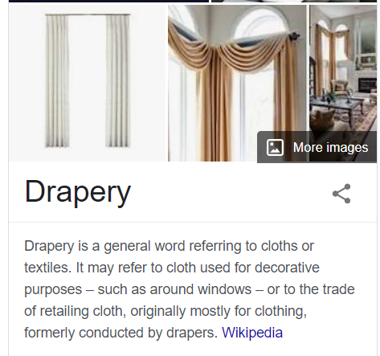 drape n. 布帘, 褶皱 vt. 用布帘覆盖, 披上 vi. 成褶皱状 -ery 表名词，“行为，情况，身份，职业”等抽象名词或集合名词。 更多同源词... 词源说明(童理民)   1 - 来自 drape,布匹，帘子。 |

### 2. **`-ery`** 表名词，“场所，地点”{59}

| 单词                                                | 解释                                                         | 单词                                            | 解释                                                         |
| --------------------------------------------------- | ------------------------------------------------------------ | ----------------------------------------------- | ------------------------------------------------------------ |
| **pot-t-ery**                     【ˈpɑːtəri】 | **`pot`** n. 盆, 罐, 壶, 坩埚, 奖杯; <非正式>大麻 vt. 装入盆中, 在锅中煮, 随手射击 vi. 随手射击 **`-ery`** 表名词，“场所，地点”。 陶器(尤指手工制的);陶土;制陶手艺;制陶技艺 | **bak-ery**                   【ˈbeɪkəri】 | A **bakery** is a building where bread, pastries, and cakes are baked, or the shop where they are sold. |
| refin-ery                                           |                                                              | eat-ery                                         |                                                              |
| monast-ery                                          |                                                              | monk-ery                                        |                                                              |
| nun-n-ery                                           |                                                              | nurs-ery                                        |                                                              |
| peat-ery                                            |                                                              | rock-ery                                        |                                                              |
| fish-ery                                            |                                                              | hen-n-ery                                       |                                                              |
| hog-g-ery                                           |                                                              | pig-g-ery                                       |                                                              |
| rook-ery                                            |                                                              | ros-ery                                         |                                                              |
| smith-ery                                           |                                                              | swan-n-ery                                      |                                                              |
| win-ery                                             |                                                              | vin-ery                                         |                                                              |
| drink-ery                                           |                                                              | goos-ery                                        |                                                              |
| grap-ery                                            |                                                              | per-fum-ery                                     |                                                              |
| brew-ery                                            |                                                              | can-n-ery                                       |                                                              |
| cemet-ery                                           |                                                              | coop-ery                                        |                                                              |
| cream-ery                                           |                                                              | curriery                                        | 鞣皮业，制革业                                               |
| danc-ery                                            |                                                              | distill-ery                                     |                                                              |
| green-ery                                           |                                                              | grog-g-ery                                      |                                                              |
| hash-ery                                            | n. 剁碎的食物, 杂乱无章的的一大堆, 杂烩, 复述, 【计】散列 vt. 切碎, 搞糟 【复数：hashes；过去分词：hashed；现在分词：hashing】 1 - 来自法语 hacher,剁，剁碎，词源同 hatchet.引申词义跺碎的肉丁土豆，拼定比较 bake,batch. | hatch-ery                                       |                                                              |
| orang-ery                                           |                                                              | bind-ery                                        |                                                              |
| bean-ery                                            |                                                              | bleach-ery                                      |                                                              |
| cocoon-ery                                          |                                                              | command-ery                                     |                                                              |
| confection-ery                                      |                                                              | dean-ery                                        |                                                              |
|                                                     |                                                              |                                                 |                                                              |

#### 2.1 -ory / -atory  表名词，指场所等{30}

| 单词                                                         | 解释                                                         | 单词                                       | 解释                                                         |
| ------------------------------------------------------------ | ------------------------------------------------------------ | ------------------------------------------ | ------------------------------------------------------------ |
| **labor-atory ** 【ˈlæbrətɔːri】                        | n. 实验室, 研究室, 化工厂 推荐：labor【劳动】 + -atory地方 → 劳动之地 → 实验室。  **`labor-`** = labor, 表示“劳动”，来自拉丁语。 **`-atory`** 表名词，指场所等。 | **dis-pens-atory ** 【dɪs'pensətərɪ】 | n. 药房，处方集，药典 推荐：dispense 【分发】+ -atory  **`dis-`** 来自拉丁语dis-，表示“分开，散开”，引申词义“离开，无，没有，缺乏，表相反等” **`pens-`** = weight, expend, 表示“称重量，称银子”，引申为“花费”，还表示思考，我们购物的时候不是要比较和考虑么。 **`-atory`** 表名词，指场所等。 |
| **re-posit-ory**                       【rɪˈpɑːzətɔːri】 | n. 贮藏所, 贮物器, 仓库, 博物馆, 店铺, 陈列室, 资源丰富地区, 墓地, 亲信, 知己 推荐：re-重新 + posit-放 + -ory → 重新放东西之地 → 仓库。 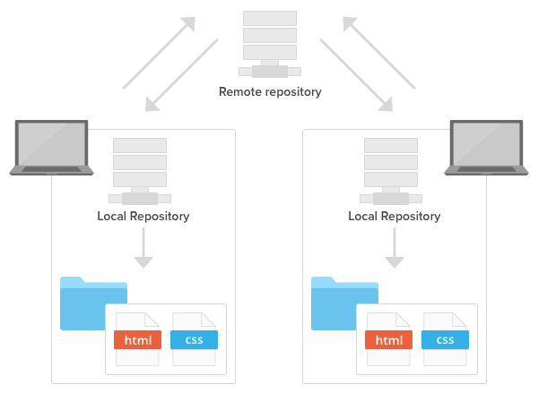 **`reposit`** vt. 贮藏, 使复位 **`-itory`** 表名词，指场所等。 词源说明(童理民)   1 - re-,向后，往回，-posit,放置，词源同 position,composite.引申词义仓库。 | **de-posit-ory** 【dɪˈpɑːzətɔːri】    | n. 仓库, 贮藏所, 受托者 推荐：deposit【存放】 + -ory  **`deposit`** n. 存款, 定金, 堆积物 vt. 存放, 堆积 vi. 沉淀 **`-ory`** 表名词，指场所等。 |
| **dorm-itory** 【ˈdɔːrmətɔːri】                         | n. 宿舍 推荐：dorm-睡 + -itory  **`dorm-`** = sleep, 表示“睡眠”。源自拉丁语 dormire "to sleep." **`-itory`** 表名词，指场所等。 词源说明(童理民)   1 - 来自 PIE*drem,睡觉，休息。 | **lav-atory** 【ˈlævətɔːri】          | n. 洗脸盆, 厕所 推荐：lav-冲洗 + -atory场所 → 冲洗的地方 → 洗手间。  **`lav-`** = wash, 表示“洗，冲洗”。源自拉丁语 lavere "to wash," lavare "to wash." **`-atory`** 表名词，指场所等。 |
| **terr-itory** 【ˈterətɔːri】                           | n. 领土, 领地, 版图, 地区, 活动范围 推荐：terr-陆地 + -itory, 表示场所、范围 → 地的范围 → 领土。  **`terr-`** = earth, 表示“土地”。源自拉丁语 terra "dry land." 更多同源词... **`-itory`** 表名词，指场所等。 |                                            |                                                              |
|                                                              |                                                              |                                            |                                                              |

#### 2.2 **`-arium`**   表名词，“地点，场所”,复数形式一般是-a形式 {23}

> 这些词的复数形式一般是-a形式。
>
> 注： 不要与【ium[2] 名词后缀，构成身体器官或生物学等词汇，这些词复数形式一般是-ia形式。比如 **bacter-ium** 、**geran-ium**、**mycel-ium**等】混淆

| 单词                                            | 解释                                                         | 单词                                                         | 解释                                                         |
| ----------------------------------------------- | ------------------------------------------------------------ | ------------------------------------------------------------ | ------------------------------------------------------------ |
| **aqu-arium** 【əˈkweriəm】                | 养鱼缸;水族玻璃槽;水族馆（a building where people can go to see fish and other water creatures） | ocean-arium                                                  |                                                              |
| **gymn∙asia**              【dʒɪmˈneɪziə】 | pl. 体育馆, 健身房, 大学预科（gymnasium的复数） 词根树    gymn-gymn.asia  gymn∙asia  [词根树] gymn-  = naked, 表示“裸体的”。源自希腊语 gumnos "naked." | **gymn-as-ium**                            【dʒɪmˈneɪziəm】 | n. 健身房, 体育馆 推荐：gymn-裸体 + -as + -ium表地点 → 穿得很少锻炼身体的地方 → 体育馆。 **`gymn-`** = naked, 表示“裸体的”。源自希腊语 gumnos "naked." **`-ium`** 表名词，“地点，场所”。这些词的复数形式一般是-a形式。 |
| empor-ium                                       |                                                              | sanat-arium                                                  |                                                              |
| sanitar-ium                                     |                                                              | sanitor-ium                                                  | sanataor-ium                                                 |
| pod-ium                                         |                                                              | Byzant-ium                                                   |                                                              |
| sol-arium                                       |                                                              | ciner-arium                                                  |                                                              |
| serpent-arium                                   |                                                              | columb-arium                                                 |                                                              |
| lepros-arium                                    |                                                              | cremator-ium                                                 |                                                              |
| **planet-arium** 【ˌplænɪˈteriəm】         | **`planet`** n. 行星, 命运星辰, 杰出的人, 重大影响的事. 天文馆；天象馆 a building with a curved ceiling to represent the sky  at night, with moving images of the planets and stars,  used to educate and entertain people | audit-o-ium                                                  |                                                              |

#### 2.3 `-ern` 表名词，“…场所”{4}

| 单词                           | 解释                                                         | 单词 | 解释 |
| ------------------------------ | ------------------------------------------------------------ | ---- | ---- |
| **cist∙ern** 【ˈsɪstərn】 | n. 贮水器, 水塘, 水箱 **`cist-`** = box, 表示“盒子”。 **`-ern`** 表名词，“…场所”。 词源说明(童理民)   1 - 来自拉丁语 cista,箱子，盒子，词源同 chest. |      |      |
|                                |                                                              |      |      |
|                                |                                                              |      |      |

### 3. **`-ary`** 表形容词，“…的”。{133}

| 单词                                             | 解释                                                         | 单词                        | 解释                                                         |
| ------------------------------------------------ | ------------------------------------------------------------ | --------------------------- | ------------------------------------------------------------ |
|                                                  | n. 敌手, 对手 a. 敌手的, 敌对的 【复数：adversaries】 范围：专八,雅思 单词笔记   ［添加］ 推荐： adverse【敌对的】 + -ary名词后缀。  词根树    -ary-aryad-vers-advers.ary-adverse  advers∙ary  [词根树] adverse  a. 不利的, 敌对的, 相反的, 逆的 -ary  表形容词，“…的”。 更多同源词... -ary  表名词，“人，场所，物”。 |                             |                                                              |
| contr-ary                   【ˈkɑːntreri 】 | **`contr-`** = against, 表示“反对，相反”，来自拉丁语。 **`com-`** "with, together" + **`-tr`** "comparative suffix "，本意放在一起比较。源自拉丁语 contra "against, opposite." | arbitr-ary                  | **`arbitr-`** = judge, 表示“判断”。复合词根：ar-=ad- + bit-走。 任意的;武断的;随心所欲的;专横的;专制的 1):**not seeming to be based on a reason, system or plan and sometimes seeming unfair**  2):**using power without restriction and without considering other people** |
| ne-cess-ary                                      | a. 必要的 必然的 n. 必需品                                   | coron-ary                   |                                                              |
| custom-ary                                       | 习惯的 惯常的                                                | disciplin-ary               |                                                              |
| diversion-ary                                    |                                                              | lter-ary                    |                                                              |
| bin-ary                                          | 由两部分组成的，二进制的，二院的                             | access-ary                  |                                                              |
| ordin-ary                                        |                                                              | pre-limin-ary               |                                                              |
| question-ary                                     |                                                              | sanit-ary                   | 卫生的                                                       |
| second-ary                                       |                                                              | sed-ent-ary                 | 就做的，坐惯的                                               |
| sediment-ary                                     | 沉淀物的                                                     | solid-ary                   | 团结一致的                                                   |
| solit-ary                                        | 独居者                                                       | sati-ion-ary                | 不动的 静止的                                                |
| sum-m-ary                                        |                                                              | tempor-ary                  |                                                              |
| traditon-ary                                     |                                                              | tribut-ary                  | 滞留的，纳贡的，从属的，辅助的                               |
| trin-ary                                         | 三倍的，三重的                                               | unit-ary                    | 单位的，单一的，归一的，整体的                               |
| mon-et-ary                                       | 货币的，金钱的                                               | nobili-ary                  | 贵族的                                                       |
| octo-n-ary                                       | 八进制的                                                     | quin-ary                    | 五的，五个组成的，五进制的                                   |
| oliv-ary                                         | 橄榄形的                                                     | salut-ary                   | 有益的，有用的                                               |
| complement-ary                                   |                                                              | compliment-ary              |                                                              |
| caution-ary                                      |                                                              | cent-en-ary                 |                                                              |
| adver-ary                                        |                                                              | mamm-ary   【ˈmæməri】 | mamm- = breast, 表示“乳房”。源自拉丁语 mamma "breast." -ary 表形容词，“…的”。 |
| milit-ary                                        | n 军队                                                       | hono-ary                    |                                                              |
| imagin-ary                                       |                                                              | judic-i-ary                 | n 司法部，司法系统                                           |
| lengend-ary                                      |                                                              | funer-ary                   |                                                              |
| element-ary                                      | 初步的，基本的                                               | evolution-ary               |                                                              |
| expension-ary                                    |                                                              | expedition-ary              |                                                              |

### 4. **`-ary`** 表名词，“人，场所，物”{68}

| 单词                                      | 解释                                                         | 单词                                 | 解释                                                         |
| ----------------------------------------- | ------------------------------------------------------------ | ------------------------------------ | ------------------------------------------------------------ |
| **advers-ary  **     【ˈædvərseri】  | n. 敌手, 对手 a. 敌手的, 敌对的 推荐：adverse【敌对的】 + -ary名词后缀。  **`adverse`** a. 不利的, 敌对的, 相反的, 逆的 **`-ary`** 表形容词，“…的”。 **`-ary`** 表名词，“人，场所，物”。 | **aux∙ili∙ary** 【ɔːɡˈzɪliəri】 | n. 辅助者, 辅助物, 附属机构, 助动词 a. 辅助的, 备用的 **`aux-`** = increase, 表示“增加”，auth-引申为产生，创造。源自拉丁语 augere (过去分词 auctus) "to increase." **`-ary`** 表名词，“人，场所，物”。 |
| **anni-vers-ary**  【ˌænɪˈvɜːrsəri】 | n. 周年纪念 推荐：anni-年 + vers-转 + -ary名词后缀 → 一年转到一次 → 周年纪念日。 **`anni-`** = year, 表示“年，一年”。源自拉丁语 annus "year." **`vers-`** = turn, 表示“转”。源自拉丁语 vertere, versare "to turn." **`-ary`** 表名词，“人，场所，物”。 | **avi-ary** 【ˈeɪvieri】        | n. 大型鸟舍, 鸟类饲养场 推荐：avi-鸟 + -ary, 表示地方 → 鸟的地方 → 鸟舍。 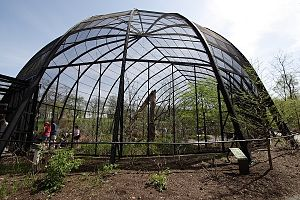 **`avi-`** = bird, 表示“鸟”。源自拉丁语 avis "bird." **`-ary`** 表名词，“人，场所，物”。 词源说明(童理民)   1 - 来自 av-,鸟。 |
|                                           |                                                              |                                      |                                                              |
|                                           |                                                              |                                      |                                                              |

#### -o  表名词，“人，物或状态”{17}

| 单词                           | 解释                                                         | 单词 | 解释 |
| ------------------------------ | ------------------------------------------------------------ | ---- | ---- |
| **dynam-o** 【ˈdaɪnəmoʊ】 | n. 发电机 推荐：dynam-力 + -o。  **`dynam-`** = power, 表示“力量”。源自希腊语 dunasthai "to be able." **`-o`** 表名词，“人，物或状态”。 |      |      |
|                                |                                                              |      |      |
|                                |                                                              |      |      |

## super-,supr- = above, over, beyond, 表示“超级，超过，在...上”{160}

> 源自拉丁语 super "above, over;" supra "above, beyond."

| 单词                                   | 解释                                                         | 单词 | 解释 |
| -------------------------------------- | ------------------------------------------------------------ | ---- | ---- |
| **suprem-acy   ** 【suːˈpreməsi】 | n. 至高无上, 霸权地位, 优势, 至上 推荐：supreme【至高无上】 + -acy名词后缀。  **`super-,supr-`** = above, over, beyond, 表示“超级，超过，在...上”。源自拉丁语 super "above, over;" supra "above, beyond." **`-acy`** 表名词，“性质，状态”。 词源说明(童理民)   1 - supreme,至高无上，-acy,名词后缀。 |      |      |
|                                        |                                                              |      |      |
|                                        |                                                              |      |      |

## -ship 表示某种关系、状态或技能。 {147}

> 表示某种关系、状态或技能。源自古英语 -scipe "state, condition."

| 单词                            | 解释                                                         | 单词                                  | 解释                                                         |
| ------------------------------- | ------------------------------------------------------------ | ------------------------------------- | ------------------------------------------------------------ |
| **wor-ship ** 【ˈwɜːrʃɪp】 | n. 崇拜, 礼拜, 尊敬 vi. 参加礼拜 vt. 崇拜, 尊敬 推荐：worth【价值】 + -ship。  **`worth-`** {3}= value, 表示“价值”。源自古英语 weorth "worth, valuable." **`-ship`** 表示某种关系、状态或技能。源自古英语 -scipe "state, condition." 更多同源词... 词源说明(童理民)   1 - 缩写自古英语 worthscip,高贵，荣耀，名声，来自 worth,价值，力量，-scip,词源同-ship,抽象名词后缀。后引申词义对神灵或超自然现象的尊敬，崇拜。 | **intern-ship**  【ˈɪntɜːrnʃɪp】 | n. 实习;(学生或毕业生的)实习期;医科学生的实习工作 推荐：intern【实习医生】 + -ship表示关系、状态或技能等  **`enter,inter-`** 表示“在…之间，相互，内”。由 in- + ter-（土地）组成。在医学领域 enter- 表示“小肠”，已单独列出。 **`-ship`** 表示某种关系、状态或技能。源自古英语 -scipe "state, condition." 词源说明(童理民)   1 - 来自 intern,实习。 |
|                                 |                                                              |                                       |                                                              |
|                                 |                                                              |                                       |                                                              |

## -fy / -ify 缀于名词或形容词后，构成表示“使成…”“…化”“作成… {132}

-fy 缀于名词或形容词后，构成表示“使成…”“…化”“作成…”等意思的动词

| 单词                                               | 解释                                                         | 单词                                           | 解释                                                         |
| -------------------------------------------------- | ------------------------------------------------------------ | ---------------------------------------------- | ------------------------------------------------------------ |
| **mod-ify**                                        | **`mod-`** = mode, manner, 表示“方式，模式，风度”。 源自拉丁语 modus  mod-模式 + -ify使... → 规范化 → 修改  not-ify | **clar-ify** 【ˈklærəfaɪ】 澄清 阐明 | class-ify ampl-ify satis-fy ver-ify test-ify ident-ify uni-fy |
| bourgeois-ify                                      |                                                              | viv-ify                                        | 给与生气，使生动                                             |
| ugl-ify                                            | sillic-ify simpl-ify solid-ify                     | vil-ify                                        | 诽谤，贬低                                                   |
| speci-fy                                           |                                                              | stupe-fy                                       |                                                              |
| cit-ify                                            | 使都市化                                                     | certi-ify                                      | 证明 保证                                                    |
| cod-ify                                            | 编成法典 **pur-ify** 【ˈpjʊrɪfaɪ】                 | acid-ify                                       | 使变酸                                                       |
| terr-ify                                           |                                                              | sign-ify                                       |                                                              |
| strati-fy:                                         | （使）成层                                                   | quant-ify                                      |                                                              |
| **rat-ify**                      【ˈrætɪfaɪ】 | 批准 认可： rate【评估，评价】 + -fy使。**即经过评估的**。  **`rat-`** = calculate, 表示“计算”，引申为“思考”。源自拉丁语 reri "to consider, confirm, ratify." **`-ify`** 缀于名词或形容词后，构成表示“使成…”“…化”“作成…”等意思的动词  | **rect-ify** 【ˈrektɪfaɪ】                | **`rect-`**直 + **`-ify`**…化 → 使…正直 → 改正[错误]。  **`rect-`** = straight, right, 表示“正、直”。源自拉丁语 regere (过去分词 rectus) "to lead straight, guide, rule." **`-ify`**缀于名词或形容词后，构成表示“使成…”“…化”“作成…”等意思的动词 |
| glori-fy                                           |                                                              | horr-ify                                       |                                                              |
| humid-ify                                          | gas-ify（使）气化                                            | fals-ify                                       | 伪造 扭曲                                                    |
| fluid-ify                                          | 液化                                                         | fort-ify 【ˈfɔːrtɪfaɪ】                   | **`fort-`** = strong, 表示“强大，力量”。源自拉丁语 fortis "strong. 设置要塞于，加强，使坚强： to make a place more able to resist attack, especially by building high walls |
| fruct-ify                                          | 结果实                                                       | intens-ify                                     |                                                              |
| beau-ify                                           | 美化                                                         | mort-ify                                       |                                                              |
| divers-ify                                         |                                                              | edi-fy                                         | 启迪熏陶 教育                                                |
| electr-ify                                         | 通电 上气 使电气化                                           | null-ify                                       | damn-ify                                                     |
| persona-ify                                        |                                                              | object-ify                                     | argu-fy torp-ify                                         |
| myst-ify                                           | rigid-ify sanct-ify sani-fy                         | magn-ify                                       | micr-ify mini-ify                                       |
| veri-ify                                           | 使动词化                                                     | tume-fy                                        |                                                              |
| putr-efy                                           | 化脓、腐烂、堕落                                             | ammonify                                       |                                                              |
| **terr-ify **          【ˈterɪfaɪ】           | **`terr-`** = frighten, 表示“恐，怕”。源自拉丁语 terrere "to frighten." **`-ify`** 缀于名词或形容词后，构成表示“使成…”“…化”“作成…”等意思的动词。 to make sb feel extremely frightened（Flying terrifies her.） | plastify                                       |                                                              |
| **electr-ify** 【ɪˈlektrɪfaɪ】                | = electric, 表示“电的”。来自古希腊语 elektron "amber." vt. 通电;使电气化;使带电;使激动;使兴奋 **Her performance electrified the audience** | **test-ify** 【ˈtestɪfaɪ】                | v.(尤指出庭)作证;证明;证实;见证(上帝的存在) **`test-`** = test, witness, 表示“测试，证据”，医学上表示“睾丸”，因为睾丸是证明男人的“东西”。源自拉丁语 testis "witness." 更多同源词... **`-ify`**缀于名词或形容词后，构成表示“使成…”“…化”“作成…”等意思的动词  - test-,见证，证明，-fy,使。 |

##  -tic /-atic / etic/ -itic 表形容词，通常放在一个名词前，“与…相关的，…的”。{126}

| 单词                                           | 解释                                                         | 单词                                                  | 解释                                                         |
| ---------------------------------------------- | ------------------------------------------------------------ | ----------------------------------------------------- | ------------------------------------------------------------ |
| **path-etic**                     【pəˈθetɪk】 | **`path-`** = feeling, suffering, 表示“感情，遭受（病痛）”。 源自希腊语 pathos "suffering, passion, emotion, feelings." If you describe a person or animal as **pathetic**, you mean that they are sad and weak or helpless, and they make you feel very sorry for them. | **aqua-tic**                       【əˈkwɑːtɪk】 | **aqua-** = water, 表示“水”。源自拉丁语 aqua "water, the sea, rain." growing or living in, on or near water |
| sym-path-etic                                  | 有同情心的，合意的，赞成的                                   | phelgm-atic                                           | **`phlegm-`** = flame, 表示“发炎”。源自希腊语 phlegein "to burn." 不易冲动的;冷静的;镇定的(not easily made angry or upset) |
| exo-tic                                        | 异国风情的                                                   | roman-tic                                             |                                                              |
| narco-tic                                      | **narco-麻醉 + -tic → 麻醉的** 麻醉药，镇静剂           | seman-tic                                             |                                                              |
| arom-atic                                      | **`arom-`** = spice. 表示“香料” 芬芳的                  | amnes-tic                                             | 记忆缺失的 健忘的                                            |
| apo-calyp-tic                                  | 天启的，启示录的                                             | enzym-atic                                            | 酶的                                                         |
| ero-tic                                        | 心爱的，社情的                                               | fanatic                                               | 狂热者                                                       |
| here-tic                                       | 异教徒                                                       | herm-etic                                             | 奥妙的，密封的，不透气的                                     |
| bio-tic                                        | 生命的，生物的                                               | en-erg-etic                                           | 精力充沛的，积极的                                           |
| enigma-tic                                     | 费解的，谜一般的，高深莫测的                                 | err-atic                                              | 古怪人的                                                     |
| frene-tic                                      | 发狂的，狂热的                                               | hier-artic                                            | **`hier-`** = sacred, 表示“神圣的”。源自希腊语 hieros "holy." 来自希腊语 hiereus,祭司，僧侣，来自 hieros,神圣的，神灵的，来自 PIE*eis,强烈的感情，发狂，着迷，词源同 ire,estrushieroglyph 象形文字，神秘符号hiero-,神圣的，-glyph,刻，划，图形，词源同 glyph,cleave.即神圣的图形，神秘的符号，用于指埃及的象形文字。  僧侣的 |
| poro-tic                                       | 多孔性的，骨质疏松的                                         | apo-pto-tic                                           | 凋亡的                                                       |
| tonsill-itic                                   | 扁桃体炎的                                                   | via-tic                                               | 道路的,旅行的                                                |
| zoe-itc                                        | 生命的                                                       | demo-tic                                              | 人民的，民众的，通俗的                                       |
| schem-atic                                     | 概要的，图基恩的，略图的                                     | phon-etic                                             | 语音的，语音学的                                             |
| **cosm-etic** 【kɑːzˈmetɪk】              | n. 化妆品 a. 化妆用的 推荐：cosm-秩序（需要经过修饰与润色才能有条理和秩序） + -etic **`cosm-`** = order, 本意表示“秩序”，源自希腊语。古希腊人认为宇宙体系是有规律运转的，所以也引申为“宇宙”；另外修饰女人的时候表示 to deck"化妆"。 **`-etic`** 表形容词，通常放在一个名词前，“与…相关的，…的”。 | **err-atic** 【ɪˈrætɪk】                         | n. 古怪的人, 漂石 a. 不规则的; 不确定的; 不稳定的, 不可靠的 推荐：err-错误 + -atic → [被人认为]错误的 → 古怪的。  **`err-`** = wander, mistake, 表示“漫游”，引申为“犯错误（偏离）”。源自拉丁语 errare "wander." 更多同源词... **`-atic`** 表形容词，通常放在一个名词前，“与…相关的，…的”。 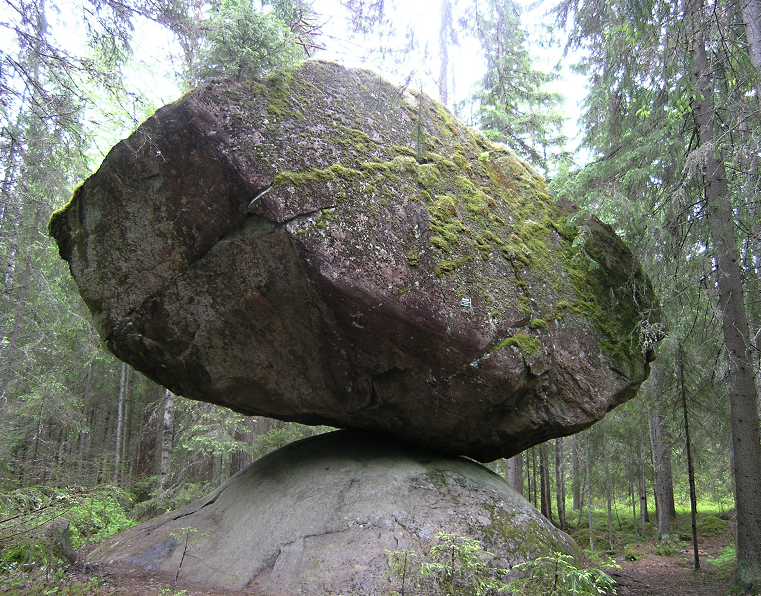 词源说明(童理民)   1 - 来自 PIE*ers,漫游，偏离，引申词义错误，词源同 error.即漫游的，偏离的。 |

## mis- 表示“错误，坏”。源自古英语和古法语{121}

| 单词                                          | 解释                                                         | 单词                                                 | 解释                                                         |
| --------------------------------------------- | ------------------------------------------------------------ | ---------------------------------------------------- | ------------------------------------------------------------ |
| **mis-hap**                  【ˈmɪshæp】 | n. 不幸之事, 灾祸, 恶运 推荐： mis-坏的，错的，不好的 + hap-机会，运气 → 坏运气。 **`mis-`** 表示“错误，坏”。源自古英语和古法语。 **`hap-`** = chance, 表示“机会，运气”。源自古诺尔斯语 happ "chance, good luck." | **mis-o-gyny**                   【mɪˈsɑdʒəni】 | n. 厌恶女人；厌女症[癖]  Misogyny is a strong dislike of women.  **`miso-`**坏的，错的，不好的 + -**`gyny`**, 妇女 |
|                                               |                                                              |                                                      |                                                              |
|                                               |                                                              |                                                      |                                                              |

## -ee 名词后缀，表示“人或物” {115}

| 单词                            | 解释                                                         | 单词                           | 解释                                                         |
| ------------------------------- | ------------------------------------------------------------ | ------------------------------ | ------------------------------------------------------------ |
| **proteg-ee** 【ˈprotəʒe】 | 女的被保护人, 女门徒 -ee 名词后缀，表示“人或物”。        | **vouch-ee** 【vaʊ'tʃiː】 | n. 被担保人 推荐：vouch【担保】 + -ee  **`vouch`** vi. 担保, 保证, 证明, 确定地说  vt. 担保, 证明, 断定, 传唤...出庭作证 **`-ee`** 名词后缀，表示“人或物”。 |
| **don-ee** 【dəʊni】       | n. 受赠者 推荐：don-给予 + -ee  **`don-`** = give, 表示“给予”。 **`-ee`** 名词后缀，表示“人或物”。 | divorc-ee 【dɪˌvɔːrˈseɪ】 | n. 离婚者 推荐：divorce【离婚】 + -ee  **`divorce`** n. 离婚 vt. 与...离婚 **`-ee`** 名词后缀，表示“人或物”。 |
| designee                        | n. 被指定者, 被选派者 推荐：design【设计】 + -ee  design n. 设计, 图样, 方案, 企图 v. 设计, 计划 -ee 名词后缀，表示“人或物”。 | chimpanz-ee                    | n. 黑猩猩 推荐：来自非洲安哥拉班图语，常缩写为chimp。  -ee  名词后缀，表示“人或物”。 |
| call-ee                         | n. 被召者 推荐：call【召集】 + -ee  call n. 呼叫, 访问, 打电话, 号召, 召集, 要求  vt. 呼叫, 召集, 打电话 vi. 叫喊, 访问, 叫牌 -ee 名词后缀，表示“人或物”。 | bigoraph-ee                    | n. 传记中的主人公 推荐：biography【n. 传记】 + -ee, 表名词 **`biography`** n. 传记; 生平; 人生历程 **`-ee`** 名词后缀，表示“人或物”。 |
| award-ee                        | n. 受奖者 推荐：award【奖品】 + -ee  award n. 奖品, 裁定, 判决 vt. 授予, 给予 -ee 名词后缀，表示“人或物”。 | alien-ee                       | n. 财产受让人 推荐：alien【外国的】 + -ee  alien n. 外国人, 外侨 a. 外国的, 相异的 -ee 名词后缀，表示“人或物”。 |

## st-,sta-,stat-,stan-,stant-,stin- = stand, 表示“站、立”{107}

| 单词                                                         | 解释                                                         | 单词                          | 解释                                                         |
| ------------------------------------------------------------ | ------------------------------------------------------------ | ----------------------------- | ------------------------------------------------------------ |
| **ped-e-st-ian  **                        【pəˈdestriən】 | n. 行人, 步行者 a. 人行的, 徒步的, 呆板的, 通俗的, 平淡无奇的 推荐：ped-脚 + -e-str-ian…的人 → 用脚走路的人。  **`st-,sta-,stat-,stan-,stant-,stin-`** = stand, 表示“站、立”。 **`ped-`** = foot, 表示“脚”。源自拉丁语 pes (词干 ped-) "foot." **`-ian`** 表名词，“某种人”。 | **stand** 【stænd】      | n. 态度, 立场; 保卫, 捍卫; 货摊; 桌, 台, 架, 座; 看台; 舞台; (车) 站; 证人席 v. 站立, 起立; 使直立; 位于 (某处 );处于 (某状态 ); 高度为; 停靠;  停滞; 维持不变; 采取某种立场; 容忍, 承受; 参选 **`st-,sta-,stat-,stan-,stant-,stin-`** = stand, 表示“站、立”。 词源说明(童理民)   1 - 来自古英语 standan,站立，站起，来自 Proto-Germanic*standana, 站立，来自 PIE*sta,站，站立，词源同 stable,state.引申诸相关词义。 |
| **stat-ute** 【ˈstætʃuːt】                              | n. 法令, 成文法律, 法规, 章程, 条例 推荐：stat-站 + ute → 站着不动的东西 → 法令。  **`stat-`** = stand, 表示“站、立”。 词源说明(童理民)   1 - 来自拉丁语 statutum,法令，法规，规章，过去分词名词格于 statuere,实施，建立，来自 stare,站立，建立，词源同 stand,state. | **stat-ue** 【ˈstætʃuː】 | vt. 以雕像装饰 n. 雕像 推荐：stat-站 + ue → 站着的[雕像]。  **`stat-`** = stand, 表示“站、立”。 词源说明(童理民)   1 - 来自拉丁语 statua,雕像，塑像，图像，来自 stare,站立，词源同 stand,state. |
| **stat-ure** 【ˈstætʃər】                               | n. 身材;身高;个子;声望;名望 推荐：形近字： statue 塑像 statute 法令 stature 身长 status 地位 。  **`stat-`** = stand, 表示“站、立”。 **`-ure`** 表名词，通常在单词或词根以t结尾时使用，表示“一般状态，行为”。 词源说明(童理民)   1 - 来自拉丁语 statura,身高，身长，尺寸，生长状况，来自 stare,站立，词源同 stand,state. | **stat-us** 【ˈsteɪtəs】 | n. 地位;状态;身份;职位;高级职位;社会上层地位;重视（或崇尚）程度;（进展的）状况，情形 **`stat-`** = stand, 表示“站、立”。 词源说明(童理民)   1 - 来自拉丁语 status,情况，状况，位置，举止，来自 stare,站立，词源同 stand,state.引申诸相关词义。 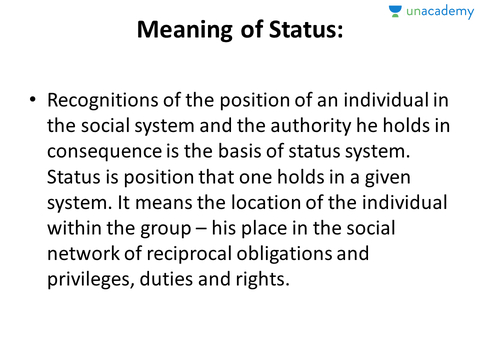 摩西英语(摩西) estate [ɪ'steɪt; e-] n.房地产；财产；身份。和state都来自status ['steɪtəs] n.地位；状态；情形；重要身份，后来state多指抽象的“状态”，而estate多指有形的如房地产等。经常说的real estate房地产（不动产)两层含义：1.可实际触摸到，所以是真实的，2.所有地产等是帝王的授予，real=regal。 |
| **state ** [^6] 【steɪt】                               | n. 州; 状态, 情形; 国家, 政府; 隆重仪式 a. 国家的; 州的, 邦的 v. 陈述, 说明; 规定, 公布 推荐： estate n.财产；身份和state n.情况。罗马帝国后期罗马人越发觉着sc-,sp-和st开头的单词难发音或发音难听，就在前边加了个e-。 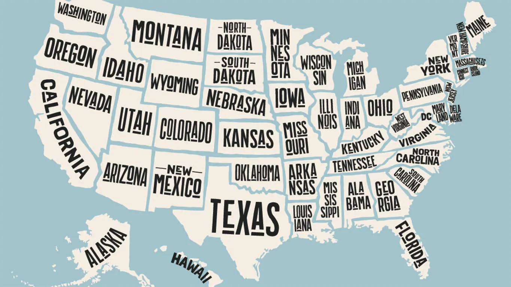 **`state-`** = stand, 表示“站、立”。 词源说明(童理民)   1 - 来自拉丁语 status,位置，地方，站立姿势，情况，状况，公共秩序，过去分词名词格于 stare,站立，来自 PIE*sta,站立，词源同 stand.引申词义陈述，说明，规定等。 2 - 来自该词基本词义的特殊引申词义，字面意思即国家和政府状况，引申词义国家，州，邦等。 | **stat-ic** 【ˈstætɪk】  | n. 静电, 静电干扰 a. 静态的, 静止的, 固有的, 静电的 推荐：来自 stasis,停滞，静止，-atic,形容词后缀。  **`stat-`** = stand, 表示“站、立”。 **`-ic`** 表形容词，“…的”。 词源说明(童理民)   1 - 来自 stasis,停滞，静止，-atic,形容词后缀。 |
|                                                              |                                                              |                               |                                                              |

## -ture / -iture / -ature  表名词，通常在单词或词根以**`t`**结尾时使用，表示“一般状态，行为”{103}

| 单词                                | 解释                                                         | 单词                                        | 解释                                                         |
| ----------------------------------- | ------------------------------------------------------------ | ------------------------------------------- | ------------------------------------------------------------ |
| **sign-ature ** 【ˈsɪɡnətʃər】 | n. 签字, 识别标志, 调号 推荐：sign【签字】 + -ature, 表名词。  **`sign-`** = mark, 表示“记号，信号”。源自拉丁语 signum "identifying mark, sign." **`-ature`** 表名词，通常在单词或词根以t结尾时使用，表示“一般状态，行为”。 词源说明(童理民)   1 - 来自 sign,签字，签署，签约，-ate,使，-ure,名词后缀。引申诸相关词义。 | **mat-ure**                【məˈtʃʊr】 | a. 成熟的, 到期的, 充分考虑的 vt. 使成熟 vi. 成熟, 到期 推荐：mat-成熟 + -ure, 表名词   **`mat-`** = ripe, 表示“成熟”。源自拉丁语 maturus "seasonable, ripe, mature." **`-ure`** 表名词，通常在单词或词根以t结尾时使用，表示“一般状态，行为”。 词源说明(童理民)   1 - 来自拉丁语 maturare,开始成熟的，开始裂开，来自 PIE*ma,好的，好时间的，词源同matins,matinee.原用于水果成熟的，后引申词义人成年的。 |
|                                     |                                                              |                                             |                                                              |
|                                     |                                                              |                                             |                                                              |

## fac- / fact- / fect/ fic- / feas- = make, do, 表示“做，制作”{103}

> 源自拉丁语 facere "to do, make." {103}

| 单词                                   | 解释                                                         | 单词                                        | 解释                                                         |
| -------------------------------------- | ------------------------------------------------------------ | ------------------------------------------- | ------------------------------------------------------------ |
| **feas-ible** 【ˈfiːzəbl】        | a. 能实行的, 可行的, 适宜的 推荐：feas-=fac-做 + -ible, 表形容词 → 可做，可实行的。  **`feas-`** = make, do, 表示“做，制作”。源自拉丁语 facere "to do, make." **`-ible`** 表形容词，“能…的”。 词源说明(童理民)   1 - 来自法语。来自 fac-,做，词源同 do,fact.即可做，可实行的。 | **fac-simil-e**         【fækˈsɪməli】 | n. 摹(真)本, 传真 vt. 传真, 临摹 a. 复制的 推荐：fac-做 + simil-一样 + -e，做出来一样的东西，缩写为fax。  **`fac-`** = make, do, 表示“做，制作”。源自拉丁语 facere "to do, make." **`simil-`**= alike, same, 表示“相类似，一样”。源自拉丁语 simulare "to make like, imitate, copy, represent. |
| **fact-or** 【ˈfæktər】           | n. 因素;因子;因数;要素;(增或减的)数量，倍数;系数;凝血因子 推荐：fact-做 + -or → 促使人做的东西 → 要素;动力。 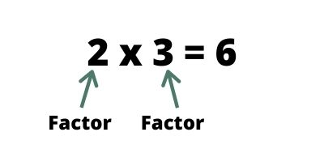 **`fact-`** = make, do, 表示“做，制作”。源自拉丁语 facere "to do, make." **`-or`** 表示“人或物”，是施动者名词。是拉丁语后缀 -tor 的俗化（可能受英语本土后缀 -er 的影响）形式。 词源说明(童理民)   1 - 来自 fact-,做，词源同 fact,effect.即做事情的必要条件，因素，要素等。  2.factor ['fæktə] n. 因素；要素；[物] 因数；代理人，vi. 做代理商。拆分是fac+tor还是fact+or？是前者，后缀-(a)tor表执事者。拉丁词根fac-表to do，与英语词源的do同源，因此factor就是“doer”之意，是起作用的“因素”。而fact-则是fac-这个词根的过去分词形式了，因此fact事实是something done。 | **fact-or** 【ˈfæktər】                | v. 把…因素包括进去;（数学）分解…的因子，将…分解成因子;以代理商（或管家等）的身份行事;做代理商（或管家）  **`fact`**- = make, do, 表示“做，制作”。源自拉丁语 facere "to do, make." **`-or`** 表示“人或物”，是施动者名词。是拉丁语后缀 -tor 的俗化（可能受英语本土后缀 -er 的影响）形式。 词源说明(童理民)   1 - 来自 fact-,做，词源同 fact,effect.即做事情的必要条件，因素，要素等。  摩西英语(摩西) 1.latte factor拿铁因素。拿铁咖啡是特浓咖啡和蒸热的牛奶（latte）混合而成的。如果你每天节省下来喝拿铁咖啡的几美元，那几十年后单单这笔钱就能让你成为百万富翁。引申义：压缩那些琐碎的开支，久而久之也能积累到巨大的财富。这里的latte来自拉丁词根lacto-表牛奶，如lactose ['læktəʊz] n.乳糖。   |
| **bene-fact-or**  【ˈbenɪfæktər】 | n. 恩人, 捐助者, 施主 推荐：bene-好 + fact-做 + -or, 表人 → 做好事的人。  **`bene-`** 表示“善，好”。源自拉丁语 bene "well." **`fact-`** = make, do, 表示“做，制作”。源自拉丁语 facere "to do, make." **`-or`** 表示“人或物”，是施动者名词。是拉丁语后缀 -tor 的俗化（可能受英语本土后缀 -er 的影响)形式。 |                                             |                                                              |

### facsimile: 摹(真)本, 传真机

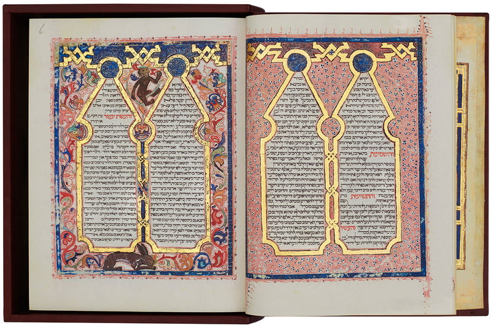 

> 来自拉丁语 fac simile,即 do something similar.用来指传真，通常缩写为 fax.

英语词源趣谈(庄和诚)

**facsimile** - 原先写成两个词，作***fac simile***，系直接借自拉丁语。

**fac**是拉丁语动词facere 'to make'的祈使式，**simile**是similis 'similar, like'的中性形式，fac simile两词连用则是**make similar**（使……相似，使……一模一样）之意。

facsimile于17世纪进入英语，用以指“摹（真）本”、“复制本”，偶尔作动词用，表示“摹写”、“使……一模一样”，今天人们赋之以一些新的词义，如“电传真”、“传真通信”和“传真传输”，用于这些词义时，**facsimile**通常被缩略为**fax**。

例　

- This is a facsimile of the original manuscript. 这是原始手稿的复制本。
- Please confirm our telephone agreement by letter or facsimile. (CWR) 请通过信件或传真确认我们电话上达成的协议。
- We will send a fax of the design plan. 我们把设计蓝图发一份传真过去。
- I'll fax it (through/over/across) to you. (CID) 我会把它用传真发给你。

## be- 构成动词，表示“使…成为”，来源于盎格鲁撒克逊语{100}

| 单词                          | 解释                                                         | 单词                                | 解释                                                         |
| ----------------------------- | ------------------------------------------------------------ | ----------------------------------- | ------------------------------------------------------------ |
| **be-witch** 【bɪˈwɪtʃ】 | vt. 施魔法于, 蛊惑, 使着迷 推荐：be-使... + witch【施巫术】  be- 构成动词，表示“使…成为” witch n. 巫婆, 女巫 vt. 施巫术, 迷惑 词源说明(童理民)   1 - be-,表强调，witch,女巫，巫术。 | **be-witch-ing** 【bɪˈwɪtʃɪŋ】 | a. 迷人的, 令人销魂的 推荐：<bewitch【使着迷】 + -ing。 bewitch  vt. 施魔法于, 蛊惑, 使着迷 -ing  表形容词，“正…的”，“令人…的”。 切换词根显示方式 |
| be-like                       | ad. 多半, 或许 推荐：be-使... + like像...一样  be- 构成动词，表示“使…成为”，来源于盎格鲁撒克逊语。 like a. 相似的, 同样的 vt. 喜欢, 愿意, 想 vi. 喜欢, 希望 n. 爱好, 同样的人(或物) prep. 象, 如同 ad. 可能 | be∙have                             | vi. 举止端正, 行为规矩 vt. 检点(自己的)行为, 使表现好 推荐：be-表示动作 + have【有】 → [一个人]拥有的动作 → 举动。 be- 构成动词，表示“使…成为”，来源于盎格鲁撒克逊语。 have- = possess, 表示“拥有”。源自古英语 habban "to have, hold." |
|                               | v. 相信 推荐：be-强调 + liev-=lov-爱， 因为爱所以相信。 be- 构成动词，表示“使…成为”，来源于盎格鲁撒克逊语。 liev- 这是一组同源词，原始含义表示 "to care, desire, love"。 词源说明(童理民)   1 - be-,表强调，-lieve,爱，词源同 love.因为爱所以相信。 | be∙lief                             | n. 信念, 相信, 信仰 推荐：be-加强 + lief=lov-爱 → 爱是信任的基础 → 信任。 be- 构成动词，表示“使…成为”，来源于盎格鲁撒克逊语。 lief- 这是一组同源词，原始含义表示 "to care, desire, love"。 |
|                               | vt. 为某人之生父, 招致, 产生, 引起 推荐：be-强调 + get【生育（古义）】。 be- 构成动词，表示“使…成为”，来源于盎格鲁撒克逊语。 get vt. 得到, 获得, 变成, 使得, 收获, 接通, 抓住, 染上 vi. 到达, 成为, 变得 n. (网球等)救球, 生殖, 幼兽 词源说明(童理民)   1 - be-,表强调，get,古义，生育。 | be∙fall                             | v. 降临(于) 推荐：be-使... + fall【下降】  be- 构成动词，表示“使…成为”，来源于盎格鲁撒克逊语。 fall n. 落下, 瀑布, 采伐量, 下降, 落差, 降低, 堕落, 秋天 vi. 倒下, 落下, 来临, 失守, 阵亡, 下跌, 减弱, 倾斜, 垮台, 轮到, 变成, 降低 a. 秋天的 |
| be-deck                       | vt. 装饰, 修饰 推荐：be-强调 + deck-装饰 → 装饰。 be- 构成动词，表示“使…成为”，来源于盎格鲁撒克逊语。 deck- 原意表示“美丽”，引申为“可接受的、装饰”等。源自拉丁语 decus "grace, ornament." 词源说明(童理民)   1 - be-,表强调，-deck,装饰，见 decoration,装修。 |                                     | vt. 使遭遇, 降临于 推荐：be-使... + chance【机会】  be- 构成动词，表示“使…成为”，来源于盎格鲁撒克逊语。 chance  n. 机会, 时机; 冒险; 意外; 可能性 vi. 冒险; 偶然发生 a. 意外的, 偶然的, 碰巧的 |

## Reference

[^1]:  1.acorn（橡子）：中世纪时用来喂猪的坚果英语单词acorn【ˈeɪkɔːrn】原本指的是林木所结的任何一种坚果。它在古英语中写作acern，由acer（空旷土地) + n（nut，坚果）构成，字面意思就是“空旷土地中的坚果”。其中acer就是单词acre（英亩）的词源。中世纪时，欧洲人在空旷林地里养猪，橡子是猪所吃的主要食物，因此acorn后来专指“橡子”。直到现在，著名的西班牙黑毛猪在屠宰前5个月必须放牧在纯天然的橡树林下，以树上跌落的橡子为食。

acorn：['ekɔrn] n. 橡子，橡实
acre：['ekɚ] n. 土地，地产；英亩

[^2 ]:  2.acre（英亩）：一对牛一天能耕的面积英语单词acre【ˈeɪkər】原本并非计量单位，而是“耕开的土地”的意思。后来，acre才演变为计量单位，一英亩到底有多大呢？其实就是平均一对牛一天能耕的面积。在古代英国，耕地时通常使用一对牛来拉一把犁，一天下来，这对牛能耕的面积就是一英亩。后来英国政府才明确规定了acre的面积，等于大约6亩、0.4公顷。

acre： ['eɪkə] n.英亩，土地，地产
acreage：['ekərɪdʒ] n. 面积，英亩数

[^5]: cabbage - 当人们说a head of cabbage（一颗卷心菜）时，恐怕很少人会想到cabbage（卷心菜）的原义是head（头）。它来源于中世纪法语caboche（头），很可能同拉丁语caput（头）有亲缘关系。显然，这种菜是因其形似人的头颅而得名的。它是最古老的蔬菜之一，其种植史已有四千多年。在希腊神话中卷心菜被说成是主神宙斯头上的汗珠变的，古希腊人还相信卷心菜能治秃头病。短语cabbage head表示“笨蛋”或“没头脑的家伙”，源出17世纪末一首古老曲子的歌词：“I ought to call him a cabbage head,/He is so very green ...”。

[^6]: 摩西英语(摩西) 1.state [steɪt] n.国家；州；情形，vt.规定；声明；陈述，adj.国家的；州的；正式的。这个单词与stand同源，在这里的本意是情况（在社会上是如何“立足”的），因为经常有类似“state of the country”即“国家（或省或城市都可以）的情况”，所以state就合并了后边的“国家”等概念，转而指政体本身。   2.A组：esquire [ɪ'skwaɪə] n.绅士和squire [skwaɪə] n.乡绅（中世纪拉丁语作 scutarius）。B组：spy n.间谍和espionage ['espɪənɑːʒ] n.间谍活动。C组：estate n.财产；身份和state n.情况。什么原因？罗马帝国后期罗马人越发觉着sc-,sp-和st开头的单词难发音或发音难听，就在前边加了个e-。

