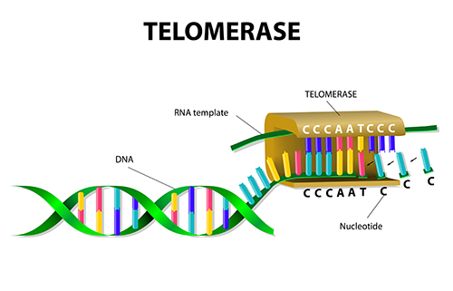
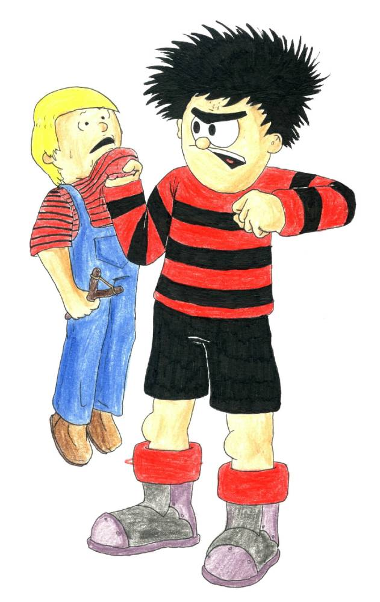
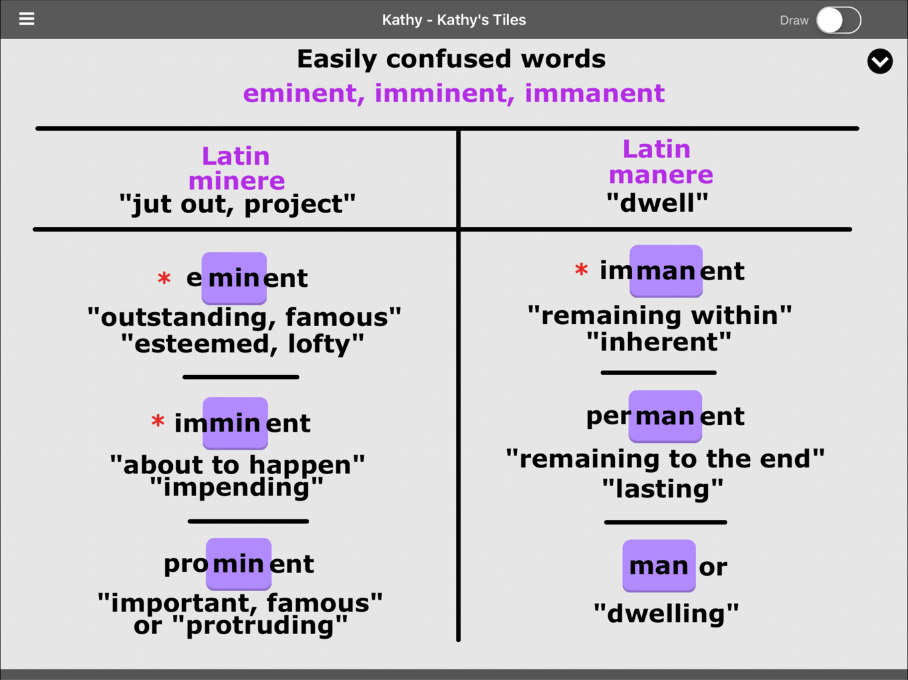
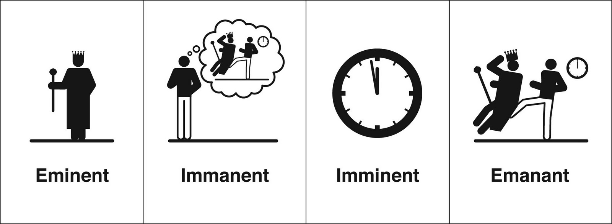
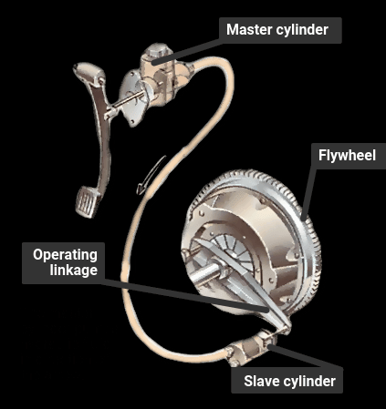
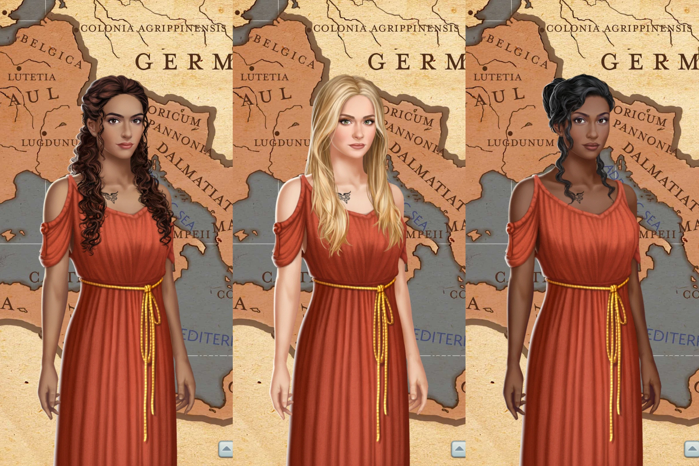
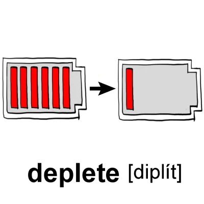
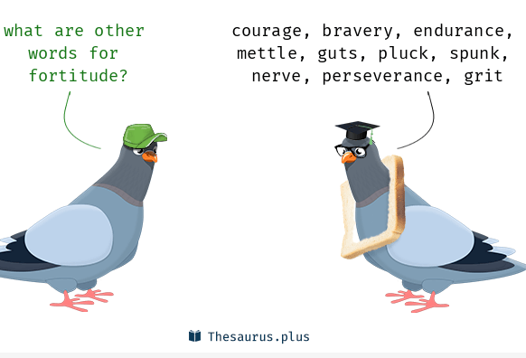
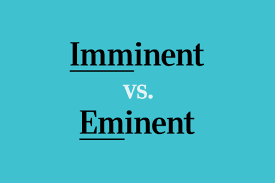

# 咬文嚼字-词根词缀(3-20)

@(TOEFL)[托福, TOEFL, 词根词缀,咬文嚼字]

[toc]

## solv- = loosen, 表示“松开”。源自拉丁语 solvere "to loose, untie."{20}

| 单词                            | 解释                                                         | 单词 | 解释 |
| ------------------------------- | ------------------------------------------------------------ | ---- | ---- |
| **ab-solv-e** 【əbˈzɑːlv】 | vt. 宣告...无罪, 赦免, 免除 推荐：ab-离开 + solv-松开 + -e → 松开 → 免罪。  **`ab-`** 表示从，来自（from）；从...离开，离开（away from, sway, off）；不，非，表否定（not, opposite）。 **`solv-`** = loosen, 表示“松开”。源自拉丁语 solvere "to loose, untie." 词源说明(童理民)   1 - ab-,离开，solve,溶解，解开，解决。用于法律用语指宣告无罪，无罪释放。 |      |      |
|                                 |                                                              |      |      |
|                                 |                                                              |      |      |

## mer- = part, 表示“部分，分配”，并由分配引申为“奖励”{20}

> 源自希腊语 méros "part." {20}

| 单词                                                         | 解释                                                         | 单词 | 解释 |
| ------------------------------------------------------------ | ------------------------------------------------------------ | ---- | ---- |
| **telo-mer-ase **                            【təˈloʊməˌreɪz】 | n. 端粒酶  **`tele-`** = further, 表示“远”，引申为“电”，电从远方来。源自希腊语 tele "far off." **`mer-`** = part, 表示“部分，分配”，并由分配引申为“奖励”。源自希腊语 méros "part." **`-ase`** = enzyme, 表示“...酶”。 an enzyme in eukaryotic cells that can add telomeres to the ends of chromosomes after they divide |      |      |
|                                                              |                                                              |      |      |
|                                                              |                                                              |      |      |

## nym- = name, 表示“名字”。源自希腊语 onoma, onuma "name." {20}

| 单词                           | 解释                                                         | 单词 | 解释 |
| ------------------------------ | ------------------------------------------------------------ | ---- | ---- |
| **acro-nym** 【ˈækrənɪm】 | n. 首字母缩拼词, 首字母组合词 推荐：acer-首的，开头的 + onym-名字，用于指首字母缩略词。  **`acro-`** 表示“最高点”。医学领域引申为四肢，末端。源自希腊语 akros "topmost." **`nym-`** = name, 表示“名字”。源自希腊语 onoma, onuma "name." 词源说明(童理民)   1 - acer-,尖的，开头的，-onym,名字，词源同 name.用于指首字母缩略语。 |      |      |
|                                |                                                              |      |      |
|                                |                                                              |      |      |

## min- / men- = project, 表示“伸出、突出”，引申为“引导（管理）”，“威胁”{19}

> 源自拉丁语 minae "projecting points, threats;" -minere "to project, jut, threaten." 
>
> min / men 与mountain有关，喻突出的（因突出而迫近)

| 单词                             | 解释                                                         | 单词                                 | 解释                                                         |
| -------------------------------- | ------------------------------------------------------------ | ------------------------------------ | ------------------------------------------------------------ |
| **menace** 【ˈmenəs】       | n. 威胁, 胁迫 v. 威吓, 胁迫  **`men-`** = project, 表示“伸出、突出”，引申为“引导（管理)” | **im-min-ent**[^6] 【ˈɪmɪnənt】 | a. 即将来临的, 逼近的 推荐：im-进 + min-突出 + -ent形容词后缀 → 伸进来 → 来临的。  **`im-`** 来自拉丁语in-，表示“在内，进入，使...”。 **`min-`** = project, 表示“伸出、突出”，引申为“引导（管理）”，“威胁” **`-ent`** 表示形容词，“…的”。 词源说明(童理民)   1 - im-,进入，使，-min,逼迫，突出，词源同 mount,eminent.引申词义迫近的，临近的 |
| **e-min-ent ** 【ˈemɪnənt】 | a. 显赫的, 杰出的, 有名的; 突出的, 明显的 推荐：e-=ex-出 + min-突，凸 + -ent=-ing表形容词。  **`e-`** 表示“从，从...离开，从...向外，向外，向上”，来自PIE *eghs, 向外。 **`min-`** = project, 表示“伸出、突出”，引申为“引导（管理)”，“威胁”。源自拉丁语 minae "projecting points, threats;" -minere "to project, jut, threaten." **`-ent`** 表示形容词，“…的”。 |                                      |                                                              |
|                                  |                                                              |                                      |                                                              |

### eminent, immient, immanent

 

 

### menace（威吓）：以喊叫威胁的方式驱赶牲畜

> 来自拉丁语 minari,突出，升出，来自 PIE*men,突出，升出，词源同 mountain,minatory.引申词义威胁。

古代人放牧、驱赶牲畜时比较粗暴简单，通常通过喊叫、威胁或鞭打的方式来驱赶牲畜，这种方式在拉丁语中叫做***minare***，进入法语后拼写为***mener***。

英语单词**menace**（威胁）就来源于此，本意指的是驱赶牲畜时人所发出的叫喊声、威胁声，兼有“威胁”和“驱策”的含义。后来“驱策”的含义逐渐消失，仅仅表示“威胁、恐吓”，变成了**threaten**的同义词。

还有一个单词也来源于此，那就是***amenable***，由a（=to，面对）+mener（驱赶、领导）+able（能够），字面意思就是“能够面对领导”，引申为“顺从的、易于管教、易于屈服、容易被说服的”，还可以表示“负有责任的、经得起检验的”。要注意这个词与**amend**（改善）并没有关系。

- **menace**：['menəs] n.v.威胁，恐吓
- **minacious**： [mɪ'neʃəs] adj. 威吓的
- **minatory**：['mɪnə,təri] adj. 恐吓的，威胁的
- **amenable**：[ə'miːnəb(ə)l] adj.顺从的，肯接受的；负有责任的；经得起检验的
- **promenade**：[,prɑmə'ned] 
  - v. 散步，漫步；骑马
  - n. 散步；舞会；骑马
  - adj. 散步的

## articul- = skill, joint, trick, 表示“技巧，关节，诡计”{18}

| 单词                                                         | 解释                                                         | 单词 | 解释 |
| ------------------------------------------------------------ | ------------------------------------------------------------ | ---- | ---- |
| **articul-ate** 【ɑːrˈtɪkjuleɪt】 【ɑːrˈtɪkjələt】 | a. 发音清晰的, 口才好的 vt. 明白地说, 以关节连接, 使成为系统的整体 推荐：articul-连接 + -ate，指音节间“连接”流畅。  **`articul-`** = skill, joint, trick, 表示“技巧，关节，诡计”。 **`-ate`** 表形容词，“具有…的”。 词源说明(童理民)   1 - 来自 art-,连接，词源同 art,arm. |      |      |
|                                                              |                                                              |      |      |
|                                                              |                                                              |      |      |

## -esce 表示“动作的起始”{18}

| 单词                              | 解释                                                         | 单词 | 解释 |
| --------------------------------- | ------------------------------------------------------------ | ---- | ---- |
| **co-al-esce** 【ˌkoʊəˈles】 | vi. 合并, 联合, 合生 推荐：co-表强调 + al-生长 + -esce。  **`co-`** 来自拉丁语介词com，表示“与...一起，一起（with, together）”，或仅做强调。源自拉丁语 com "with (collective and intensive prefix.)" **`al-`** = to grow, 表示“成长”。源自拉丁语 alere "nourish," alumnus "fosterling, step-child." **`-esce`** 表示“动作的起始”。 词源说明(童理民)   1 - co-,表强调，-al,生长，词源同 adult,adolescence.即长到一块。 |      |      |
|                                   |                                                              |      |      |
|                                   |                                                              |      |      |

## agr- = field, land, 表示“田地，农业”等。源自希腊语 agros "field," 同时通过拉丁语进入英语{17}

| 单词                             | 解释                                                         | 单词 | 解释 |
| -------------------------------- | ------------------------------------------------------------ | ---- | ---- |
| **agr-arian** 【əˈɡreriən】 | a. 土地的, 耕地的 推荐：agr-土地 + -arian表形容词 → 土地的。  agr- = field, land, 表示“田地，农业”等。源自希腊语 agros "field," 同时通过拉丁语进入英语。 -arian 表形容词或名词，“…的(人)”。 词源说明(童理民)   1 - agra-,农业，来自 ag-,做，词源同 act,agent. |      |      |
|                                  |                                                              |      |      |
|                                  |                                                              |      |      |

## err- = wander, mistake, 表示“漫游”，引申为“犯错误（偏离）”{17}

> 源自拉丁语 errare "wander."

| 单词                        | 解释                                                         | 单词 | 解释 |
| --------------------------- | ------------------------------------------------------------ | ---- | ---- |
| **err-and** 【ˈerənd】 | n. 任务, 差使, 使命 推荐：err-漫游 + -and。  **`err-`** = wander, mistake, 表示“漫游”，引申为“犯错误（偏离）”。源自拉丁语 errare "wander." 词源说明(童理民)   1 - 来自 PIE*ei,走，离开。其现在分词 ion,过去分词 it,词源同 exit,itinerary,该词来自其拉丁语现在主动不完全格 ire. |      |      |
|                             |                                                              |      |      |
|                             |                                                              |      |      |

## vor- = eat, 表示“吃”。源自拉丁语 vorare "to swallow up."

| 单词                                | 解释                                                         | 单词 | 解释 |
| ----------------------------------- | ------------------------------------------------------------ | ---- | ---- |
| **herbi-vor-e** 【ˈɜːrbɪvɔːr】 | n. 草食动物 推荐：herbi-草 + vor-吃 + -e  **`herbi-`** = grass, 表示“草”，来自拉丁语。 **`vor-`** = eat, 表示“吃”。源自拉丁语 vorare "to swallow up." 更多同源词... 词源说明(童理民)   1 - herbi-,草，-vor,吃，词源同 voracity,devour |      |      |
|                                     |                                                              |      |      |
|                                     |                                                              |      |      |

## glu-,glutin- = glue，表示“胶”。源自拉丁语 gluten "glue."{17}

| 单词                      | 解释                                                         | 单词 | 解释 |
| ------------------------- | ------------------------------------------------------------ | ---- | ---- |
| **clutch** 【klʌtʃ】 | n. 抓紧, 掌握, 离合器, 一窝小鸡 vt. 抓住, 踩汽车离合器踏板 vi. 抓 推荐：词源同cling, clench。  **`glu-,glutin-`** = glue，表示“胶”。源自拉丁语 gluten "glue." 词源说明(童理民)   1 - 词源同 cling,clench. |      |      |
|                           |                                                              |      |      |
|                           |                                                              |      |      |

## etho- = nation, 表示“民族；性情（民族情感）”{16}

> 源自希腊语 ethnos "band of people living together, nation;" ethos "custom, disposition, trait."

| 单词                         | 解释                                                         | 单词 | 解释 |
| ---------------------------- | ------------------------------------------------------------ | ---- | ---- |
| etho-logy 【ɪˈθɑlədʒi】 | n. 性格学, 生态学, 特性论 推荐：etho-民族 + -logy学，学科 etho-  = nation, 表示“民族；性情（民族情感）”。源自希腊语 ethnos "band of people living together, nation;" ethos "custom, disposition, trait." -logy  = science, 表示“科学，学科” |      |      |
|                              |                                                              |      |      |
|                              |                                                              |      |      |

## ourt- 16表示“围起来的一个庭院”，引申为“朝廷”。{16}

> 而朝廷是容易让人“阿谀奉承”的。源自古法语 cort, 源自拉丁语 cohors (词根 cohort-) "enclose yard, company of soldiers, multitude."

| 单词                              | 解释                                                         | 单词                               | 解释                                                         |
| --------------------------------- | ------------------------------------------------------------ | ---------------------------------- | ------------------------------------------------------------ |
| **court-esy**  【ˈkɜːrtəsi】 | n. 礼貌, 谦恭, 好意 推荐：court【宫廷】 + -esy，宫廷礼仪。  **`court-`** 表示“围起来的一个庭院”，引申为“朝廷”。而朝廷是容易让人“阿谀奉承”的。 词源说明(童理民)   1 - 来自 court,宫廷，宫廷礼仪。 | **court-esan  【ˈkɔːrtɪzn】** | n. 高等妓女, 名妓  **`court-`** 表示“围起来的一个庭院”，引申为“朝廷”。而朝廷是容易让人“阿谀奉承”的。源自古法语 cort, 源自拉丁语 cohors (词根 cohort-) "enclose yard, company of soldiers, multitude." 词源说明(童理民)   1 - 来自 [court](https://choices-stories-you-play.fandom.com/wiki/Main_Character_(A_Courtesan_of_Rome)),宫廷。原指宫廷艺伎。 |
|                                   |                                                              |                                    |                                                              |
|                                   |                                                              |                                    |                                                              |

## turb- = stir, 表示“搅动”。源自希腊语 turbe "tumult, disorder."{16}

| 单词                            | 解释                                                         | 单词 | 解释 |
| ------------------------------- | ------------------------------------------------------------ | ---- | ---- |
| **per-turb** 【pərˈtɜːrb】 | vt. 扰乱, 使混乱, 使心绪不宁 推荐：per-完全的 + turb-转动，引申词义搅动，使焦虑，不安等。  per- 表示“完全，贯穿，自始至终，向前”。forth, ford 是其同源词。 turb- = stir, 表示“搅动”。源自希腊语 turbe "tumult, disorder." 词源说明(童理民)   1 - per-,完全的，-turb,转动，词源同 turn,turbid.引申词义搅动，使焦虑，不安等。 |      |      |
|                                 |                                                              |      |      |
|                                 |                                                              |      |      |

## man- / main- = stay, 表示“逗留”。源自拉丁语 manere "to remain." {15}

| 单词                                  | 解释                                                         | 单词                             | 解释                                                         |
| ------------------------------------- | ------------------------------------------------------------ | -------------------------------- | ------------------------------------------------------------ |
| **im-man-ent** [^6] 【ˈɪmənənt】 | a. 内在的, 固有的 present as a natural part of sth; present everywhere 推荐：im-内 + man-逗留 + -ent形容词后缀 → 留在内部 → 内在的。  **`im-`** 来自拉丁语in-，表示“在内，进入，使...”。 **`man-`** = stay, 表示“逗留”。源自拉丁语 manere "to remain." **`-ent`** 表示形容词，“…的”。 词源说明(童理民)   1 - im-,进入，使，-man,内在，居住，词源同 manor,permanent. | **e-man-ate**  【ˈeməneɪt】 | vi. 散发, 发出, 发源 推荐：e-向外 + man-流出，显露 + -ate动词后缀。  **`e-`** 表示“从，从...离开，从...向外，向外，向上”，来自PIE *eghs, 向外。 **`man-`** 表示“流出”。源自拉丁语 manare "to flow, trickle." **`-ate`** 表动词，“做，造成”。 词源说明(童理民)   1 - e-,向外，-man,流出，显露。 |
|                                       |                                                              |                                  |                                                              |
|                                       |                                                              |                                  |                                                              |

## rav- = snatch, 表示“捕，夺”。源自拉丁语 rapere "to seize." {15}

| 单词                         | 解释                                                         | 单词 | 解释 |
| ---------------------------- | ------------------------------------------------------------ | ---- | ---- |
| **rav-age** 【ˈrævɪdʒ】 | n. 破坏, 蹂躏 v. 毁坏, 破坏, 掠夺 推荐：rav-夺 + -age状态 → 掠夺过的状态。  **`rav-`** = snatch, 表示“捕，夺”。源自拉丁语 rapere "to seize." **`-age`** 表示“状态，总称”。 词源说明(童理民)   1 - 来自古法语 ravage,破坏，毁灭，来自 ravir,破坏，来自拉丁语 rapere,抓走，夺走，词源同rape,ravish. |      |      |
|                              |                                                              |      |      |
|                              |                                                              |      |      |

## sol-,solid-,sold- = firm, whole，表示“坚固，完整”{15}

> 源自拉丁语 solidus "solid," sollus "whole, entire, unbroken."

| 单词                                                     | 解释                                                         | 单词                                | 解释                                                         |
| -------------------------------------------------------- | ------------------------------------------------------------ | ----------------------------------- | ------------------------------------------------------------ |
| **sol-um**  【səʊləm】                              | n. 土壤表层  **`sol-`** = foundation, 表示“基础”。源自拉丁语 solum "bottom, foundation." | **sol-emn**  【ˈsɑːləm】       | a. 严肃的, 郑重的, 庄严的 推荐：sol-=全部的 + emn=enn=ann，表“年”。该词本义是“每年都会发生的”，如节日，人们庆祝方式较隆重。 **`ann-,enn-`** = year, 表示“年，一年”。源自拉丁语 annus "year." **`sol-,solid-,sold-`** = firm, whole，表示“坚固，完整”。源自拉丁语 solidus "solid," sollus "whole, entire, unbroken." 词源说明(童理民)   1 - 来自拉丁语 solemnis/sollemnis,仪式的，宗教节日的，一年一度的， 来自 sollennis,年度的，固定的，来自 sollus,整个的，完整的，词源同 solid,-enn,年，词源同 annual,biennial.引申词义庄严的，郑重的，严肃的等。 |
| **solem-ity **                       【səˈlemnəti】 | n. 严肃, 一本正经 推荐：solemn【严肃的】 + -ity, 表名词。 solemn a. 严肃的, 郑重的, 庄严的 -ity 表名词，指具备某种性质。 词源说明(童理民)   1 - solemn,仪式的，-ity,名词后缀。引申诸相关词义。 简明例句 ●to observe the solemnities of the occasion 遵守这一盛典的礼仪 | **solemn-ize** 【ˈsɑːləmnaɪz】 | vt. 隆重庆祝, 隆重纪念, 使庄严, 使严肃 推荐：solemn【严肃的】 + -ise, 表动词  **`solemn`** a. 严肃的, 郑重的, 庄严的 **`-ise`** 动词后缀，一般缀于形容词后。-ise 是英式英语，-ize 是美式英语。源自希腊语 -izein, verbal suffix. |
| **solemnize-ation  ** 【ˌsɒləmˌnaɪzeɪʃən            | n. 隆重庆祝, 举行仪式, 庄严化 推荐：solemnize【使庄严】 + -ation表名词  solemnize vt. 隆重地庆祝, 庄重举行, 使庄严 -ation 表名词，“行为、动作、状态、过程、结果；物品”等。 |                                     |                                                              |
| **solicit** 【səˈlɪsɪt】                            | v. 恳求;征求;索求，请求…给予(援助、钱或信息);筹集;招徕(嫖客);拉(客)  **`soli-`** = firm, whole，表示“坚固，完整”。源自拉丁语 solidus "solid," sollus "whole, entire, unbroken." **`cit-`** = quote, call, 表示“引用，唤起”。源自拉丁语 citare "to summon, urge, call; to put in sudden motion, call forward; arouse, excite." 词源说明(童理民)   1 - 来自拉丁语 sollicitare,打扰，麻烦，刺激，煽动，来自 sollus,整个的，全部的， 词源同 solid,-cit,召唤，使兴奋，词源同 cite,excite.后引申词义请求，恳求，以及俚语词义招嫖，拉客等。 |                                     |                                                              |

## bol- 这是一组同源词，基本含义表示 swell（扩张）{15}

| 单词                   | 解释                                                         | 单词                     | 解释                                                         |
| ---------------------- | ------------------------------------------------------------ | ------------------------ | ------------------------------------------------------------ |
| **bulk** 【bʌlk】 | n. 大小, 体积, 大块, 大多数 vt. 显得大, 显得重要 推荐：词源同ball, 膨胀，鼓起，球。  bol- 这是一组同源词，基本含义表示 swell（扩张）。 词源说明(童理民)   1 - 词源同 ball,膨胀，鼓起，球。 | **bulge** 【bʌldʒ】 | n. 胀, 膨胀 vi. 凸出 vt. 使膨胀  推荐： 源自古法语 bouge, boulge "wallet, pouch, leather bag," 或直接源自拉丁语 bulga "leather sack,"。 |
|                        |                                                              |                          |                                                              |
|                        |                                                              |                          |                                                              |

### budget 该词原义为“皮包”或“钱袋”

英语词源趣谈(庄和诚)

bulge - 该词原义为“皮包”或“钱袋”，它源自拉丁语bulga（皮包），但却是通过法语指小词bougette（钱袋）进入英语的。我们从辞书里尚能查到这一古义。旧时店主把钱放在钱袋里，做预算时就得先打开钱袋，数一数现金。据说从前英国财政大臣在议会上提出预算时也有个习惯：先打开皮包（open the budget），取出有关文件。于是人们就常常将“皮包”同“预算”相联系。久而久之，budget的词义逐渐引申为“预算”或“预算案”。至今英语还保留着open the budget一语，但它已丧失原义，现仅用于引申义“向议会提出预算案”。

关于budget词义的这种演变还有另外一种解释。1733年，英国财政大臣沃波尔爵士（Robert Walpole, 1676-1745）提出了一项不得人心的消费税议案，有一本政治小册子将他比作“集市上打开假药包的江湖医生”（a mountebank at a fair opening his budget of crank medicines），从此以后budget就和政府财政预算联系起来了。budget亦可作动词用，表示“编预算”、“计划”或“安排”。

英语另有一个词bulge（膨胀）和budget是同源词，也是源于拉丁语bulga的。

例　

- The firm has drawn up a budget for the coming financial year. (CID) 公司已制定了下一财政年度的预算。
- It's important to balance one's budget. 使收支平衡十分重要。
- We'll have to budget more carefully in the future. We've spent far more than we can afford. (LLA) 我们在将来必须更精打细算。我们的开支已远远超出我们所能承受的。
- You will have to learn how to budget your time to get all your work done. (CAE) 要把所有工作都做完的话，你必须安排好自己的时间。

词源说明(童理民)  
1 - 词源同 ball,膨胀，鼓起，球。

## grat-,gree- = pleasing, 表示“感激，高兴”，grat- 源自拉丁语，gree- 是其法语变体{14}

> 源自拉丁语 gratus "pleasing, beloved, agreeable, favorable, 

| 单词                             | 解释                                                         | 单词                                | 解释                                                         |
| -------------------------------- | ------------------------------------------------------------ | ----------------------------------- | ------------------------------------------------------------ |
| **grace** 【ɡreɪs】         | n. 优雅, 风度, 慈悲, 恩惠, 体面, 赦免,**宽限期**; 恩典, 谢恩祷告 vt. 为增色;为锦上添花;装饰;使荣耀;使生辉;承蒙光临 the kindness that God shows towards the human race  **`grat-,gree-`** = pleasing, 表示“感激，高兴”，grat- 源自拉丁语，gree- 是其法语变体。源自拉丁语 gratus "pleasing, beloved, agreeable, favorable, thankful." 词源说明(童理民)   1 - 来自 PIE*gwere,恩惠，眷顾，进一步来自 PIE*gher,神恩，鼓励，词源同 charisma,exhort.原指神的恩宠，好感，感谢，神赐予的美德，美丽，后词义通用化。 | **grat-itude ** 【ˈɡrætɪtuːd】 | n. 感激之情 推荐：grat-感谢 + -itude, 表名词。  **`grat-`** = pleasing, 表示“感激，高兴”，grat- 源自拉丁语，gree- 是其法语变体。源自拉丁语 gratus "pleasing, beloved, agreeable, favorable, thankful." **`-itude`** 表名词，“性质，状态等”。源自拉丁语 -tindo, abstract noun suffix. 词源说明(童理民)   1 - 来自 grat-,感谢，词源同 grace,gratitude. |
| **grate-ful**  【ˈɡreɪtfl】 | a. 感谢的, 感激的, 令人快意的, 受欢迎的 推荐：grat-感谢 + -ful, 表形容词。  **`grate-`** = pleasing, 表示“感激，高兴”，grat- 源自拉丁语，gree- 是其法语变体。源自拉丁语 gratus "pleasing, beloved, agreeable, favorable, thankful." **`-ful`** 表形容词，“有…的”，和单词full同源。 词源说明(童理民)   1 - 来自 grat-,感谢，词源同 grace,gratitude. |                                     |                                                              |
|                                  |                                                              |                                     |                                                              |

## -esque 表形容词，“如…的” {13}

| 单词                                    | 解释                                                         | 单词 | 解释 |
| --------------------------------------- | ------------------------------------------------------------ | ---- | ---- |
| **picture-esque** 【ˌpɪktʃəˈresk】 | a. 生动的, 如画的, 独特的, 别致的, 栩栩如生的 推荐：picture【画】 + -esque像…的 → 像图画的。  pict-,pig-,paint = paint, 表示“描画” 源自拉丁语 pingere "to make pictures, to paint",  -esque 表形容词，“如…的”。 词源说明(童理民)   1 - 来自 picture,图片，照片，-esque,形容词后缀。比喻用法。 |      |      |
|                                         |                                                              |      |      |
|                                         |                                                              |      |      |

## heg- sag- 来源于希腊语，sag- 来源于拉丁语，表示“寻求，想获得”{13}

| 单词                                              | 解释                                                         | 单词                         | 解释                                                         |
| ------------------------------------------------- | ------------------------------------------------------------ | ---------------------------- | ------------------------------------------------------------ |
| **heg-e-mony               ** 【hɪˈdʒeməni】 | n. 霸权, 领导权, 支配权, 拥有支配权的政府 推荐：heg-寻求，支配 + -e- + -mony, 表结果、状态或动作。  **`heg- sag-`** 来源于希腊语，sag- 来源于拉丁语，表示“寻求，想获得”。 **`-mony`** 表示“动作的结果、状态”。 词源说明(童理民)   1 - 来自希腊语 hegemon,领导者，来自 PIE*sag,寻找，寻求，探路者，词源同 seek,sagacious.引申词义领导权，支配权，霸权。 | **ransack** 【ˈrænsæk】 | vt. 洗劫;(为找东西)把…翻腾得乱七八糟  **`heg-,sag- heg-`** 来源于希腊语，sag- 来源于拉丁语，表示“寻求，想获得”。 词源说明(童理民)   1 - 来自古诺斯语 ransakka,入室抢劫，来自 rann,屋子，房屋，词源同 barn,saka,搜寻，翻找，词源同 seek. |
|                                                   |                                                              |                              |                                                              |
|                                                   |                                                              |                              |                                                              |

## ple- / plet- / pli = to fill, 表示“填满”。源自拉丁语 plere "to fill" {13}

| 单词                            | 解释                                                         | 单词 | 解释 |
| ------------------------------- | ------------------------------------------------------------ | ---- | ---- |
| **de-plet-e** 【dɪˈpliːt】 | vt. 耗尽, 使衰竭 推荐：de-不，非，使相反 + ple-满的，即把满的倒空，耗尽。  **`de-`** 来自拉丁语介词形式 de, 表示“从，从...离开，从...向下，向下”。 **`plet-`** = to fill, 表示“填满”。源自拉丁语 plere "to fill" 更多同源词... 词源说明(童理民)   1 - de-,不，非，使相反，-ple,满的，词源同 full,complete.即把满的倒空，耗尽。 |      |      |
|                                 |                                                              |      |      |
|                                 |                                                              |      |      |

## fort- = strong, 表示“强大，力量”。源自拉丁语 fortis "strong." {13}

| 单词                                      | 解释                                                         | 单词 | 解释 |
| ----------------------------------------- | ------------------------------------------------------------ | ---- | ---- |
| **fort-itude** [^9]  【ˈfɔːrtɪtuːd】 | n. 刚毅, 坚毅, 不屈不挠 推荐：fort-强 + -itude, 表示状态 → 强的状态。  **`fort-`** = strong, 表示“强大，力量”。源自拉丁语 fortis "strong." 更多同源词... **`-itude`** 表名词，“性质，状态等”。源自拉丁语 -tindo, abstract noun suffix. 词源说明(童理民)   1 - 来自 fort,坚固，坚强，堡垒 |      |      |
|                                           |                                                              |      |      |
|                                           |                                                              |      |      |

## pact- = fastened, 表示“紧的” 。源自拉丁语 pangere "to fasten." {13}

| 单词                                         | 解释                                                         | 单词 | 解释 |
| -------------------------------------------- | ------------------------------------------------------------ | ---- | ---- |
| **im-pact** 【ˈɪmpækt ,  ɪmˈpækt】 | n. 冲击, 冲突, 影响, 效果 vt. 挤入, 撞击, 压紧, 对...发生影响 推荐：im-进入 + pact-压、紧 → 压进去的力量 → 影响力。  iim- 来自拉丁语in-，表示“在内，进入，使...” **`pact-`** = fastened, 表示“紧的” 。源自拉丁语 pangere "to fasten." 词源说明(童理民)   1 - im-,进入，使，-pact,压紧，推进，词源同 impinge,compact.其原义为牙齿阻生，后引申词义冲击，影响。 |      |      |
|                                              |                                                              |      |      |
|                                              |                                                              |      |      |

## bon- = good, 表示“好”。源自拉丁语 bonus "good."{12}

| 单词                         | 解释                                                         | 单词                       | 解释                                                         |
| ---------------------------- | ------------------------------------------------------------ | -------------------------- | ------------------------------------------------------------ |
| **boon** 【buːn】       | n. 恩惠 推荐：bon-好，词源同bonus。  **`bon-`** 12= good, 表示“好”。源自拉丁语 bonus "good." 词源说明(童理民)   1 - 词源同 bonus. | **bonus** 【ˈboʊnəs】 | n. 奖金, 红利   推荐： bon-好 + -us。  **`bon-`**  = good, 表示“好”。源自拉丁语 bonus "good." |
| **bon-n-ie**  【bɒnɪ】  | a. 漂亮的 **`bon-`**  = good, 表示“好”。源自拉丁语 bonus "good." | boni-face                  | n. 小旅店的老板，小餐馆老板 n. （Boniface）（美、肯、法）博尼费斯（人名） 推荐：boni-好 + face【脸】  **`boni-`** = good, 表示“好”。源自拉丁语 bonus "good." **`face-`** = face, 表示“脸，面”。源自拉丁语 facies "shape, face." |
| **bon-n-y**  【ˈbɑːni】 | a. 漂亮的 推荐：bon-好，漂亮 + -y, 表形容词。 **`bon-`** = good, 表示“好”。源自拉丁语 bonus "good." **`-y`** 表形容词，加在名词后变成形容词。 |                            |                                                              |

### bonus（红利）：股票持有人除股息之外的更多收益

> bonus原系拉丁语单词，意思是“好”或“好处”。约在美国独立战争前后，bonus被借入英语，第一次用于现在的词义，即“额外给予的东西”、“奖金”或“红利”，但仍然保留了原拉丁文拼写形式。

1733年，英国第一家证券交易所在一家名叫乔纳森的咖啡馆成立。1802年获得英国政府的正式批准。这家证券交易所即为现在伦敦证券交易所的前身。

早期人们对股票还不熟悉，为了劝说人们购买股票，证券交易商会大力向人们解释购买股票的各种收益。其中最基本的一项收益是“股息”（**dividend**），即股票持有人可以按照预定的比率，根据所购买的股份从所投资的公司的盈利中获得收益，就像从银行存款中获得固定比率的利息一样。

另外，与银行存款不一样，在派发股息之后，如果公司还有盈余，股票持有人还有可能进一步瓜分盈余，获得更多收益。当时，英语中并没有一个对应单词用来表示这种股息之外的更多收益。于是证券交易商们借用了拉丁语中的***bonus***一词。该词的本意是“好处”（**good**），英语中表示“好”的词根bene就与此同源。

从此以后，**bonus**一词就成为了对这种更多收益的称呼，中文一般翻译为“红利”。

“股息”（**dividend**）和“红利”（**bonus**）的区别在于：**股息是预先确定收益率的，而红利是没有固定收益率的，可以上下浮动**。

股份公司在派息分红时，首先按照固定收益率向优先股股东发放股息；发完股息后，如果还有盈余，则还可以在扣除企业发展积累金后进一步向普通股东发放红利。

现在，**bonus**一词早已经超越了股票领域，用来泛指固定收益外的各种更多收益，如奖金、给退伍军人发放的一次性费用等，甚至还成为了贿赂的暗语，相当于我们中国人说的“意思意思”。

- **bonus**：['bəʊnəs] n.奖金，红利，津贴，额外收益
- **dividend**：['dɪvɪdend] n.股息，被除数

## radic- = root, 表示“根”， 和 root 同源。源自拉丁语 radix "root."{12}

| 单词                                | 解释                                                         | 单词 | 解释 |
| ----------------------------------- | ------------------------------------------------------------ | ---- | ---- |
| **e-radic-ate** 【ɪˈrædɪkeɪt】 | vt. 根除, 扑灭, 根绝, 消灭 推荐：e-=ex-表out of，词根radic-表示植物的根，-ate动词后缀  e- 表示“从，从...离开，从...向外，向外，向上”，来自PIE *eghs, 向外。 radic- = root, 表示“根”， 和 root 同源。源自拉丁语 radix "root." -ate 表动词，“做，造成”。 词源说明(童理民)   1 - e-,向外，-rad,根，词源同 radish,root.即连根拔起，根除。 |      |      |
|                                     |                                                              |      |      |
|                                     |                                                              |      |      |

## cro-,cru- = hook, bend, 表示“钩子；弯曲”{12}

| 单词                             | 解释                                                         | 单词 | 解释 |
| -------------------------------- | ------------------------------------------------------------ | ---- | ---- |
| **en-croach** 【ɪnˈkroʊtʃ】 | vi. 侵犯, 侵蚀, 蚕食 推荐：en-进入，使 + croach-钩子，词源同crook, crochet。  **`cro-,cru-`** = hook, bend, 表示“钩子；弯曲”。 **`en-`** 表示“入、内、在...之内、使...”，来自古法语 en- 词源说明(童理民)   1 - en-,进入，使，-croach,钩子，词源同 crook,crochet. |      |      |
|                                  |                                                              |      |      |
|                                  |                                                              |      |      |

## loc- = place, 表示“地方”{12}

| 单词                        | 解释                                                         | 单词 | 解释 |
| --------------------------- | ------------------------------------------------------------ | ---- | ---- |
| **loc-us** 【ˈloʊkəs】 | n. 场所, 所在地 **`loc-`** = place, 表示“地方”。  词源说明(童理民)   1 - 来自拉丁语 locus,地方，位置，来自 PIE*stel,站立，放置，词源同 stand,stall,install.引申词义所在地，场所，中心。拼写比较 ring,来自 PIE*sker,围，转。 |      |      |
|                             |                                                              |      |      |
|                             |                                                              |      |      |

## Reference

[^1]: 摩西英语(摩西) pop one's clogs死掉。pop这里是个古代用法，表示典当，而clog则是木屐；木底鞋。过去英国中部和北部好多工业城市的工人们都穿木底鞋，因为木底比布料和皮革好清洁。连这样的生活必需品都拿出来典当，可见主人确实（多因病重而）活不了多久了。When I pop my clogs , bury me on top of that mountain.

[^2]: root and branch彻底地；全部地；极端地。eradicate [ɪ'rædɪkeɪt] vt.根除；根绝；消灭，这里前缀e-=ex-表out of，词根radic-表示植物的根，-ate动词后缀，那eradicate当真是“根除”。可是有些时候树的枝条也有繁殖能力，所以也不能放过。These evil practices must be destroyed root and branch. 

[^3]: 来自拉丁语in-，表示“在内，进入，使...”。该拉丁语前缀进入古法语和西班牙语时拼写演变为 en-，这些词进入英语后导致在现代英语里少数单词存在两种拼写形式，如 insure, ensure, 确保；inquire, enquire, 查询。该前缀在字母 b, m, p 前拼写变体为 im-；在字母l前拼写同化为 il-；在字母r前拼写同化为 ir-。

[^4]: 摩西英语(摩西) loathsome ['ləʊðs(ə)m] adj.令人憎恶的；令人呕吐的。本身loath [ləʊθ] adj.勉强的，就是个单词，-some后缀是单词some弱化后的体现，如handsome就是easy to handle。英王James一世说抽烟：a custom loathsome to the eye, hateful to the nose, harmful to the brain, dangerous the the lungs...

[^5]: 英语词源趣谈(庄和诚) mimeograph - 1889年美国发明家爱迪生（Thomas A. Edison, 1847-1931）发明（蜡纸）油印机时就以mimeograph命名。该词系由希腊语mīméomai（模仿）和源于希腊语的英语组合语素-graph（含“写”之意）组合而成。在很长一段时间内，mimeograph一直被用作油印机的商标名，到了1948年之后才逐渐变成油印机的属名，以后也用作动词，表示“油印”。

[^6]: 摩西英语(摩西)  imminent ['ɪmɪnənt] adj.迫近的和单词immanent ['ɪmənənt] adj.内在的两个单词拼写相近，容易混淆。前者词根min与mountain有关，喻突出的（因突出而迫近)，后者词根man的意思是停留即remain。住人的房子就是manor庄园领地采邑，留在家里干的活就是menage家庭家务，长期停留的就是permanent。

[^7]: 摩西英语(摩西) haggard ['hægəd] adj.憔悴的；野性的，n.野鹰。hagg-部分同hedge [hedʒ] n.树篱，v.树树篱围住，后缀-ard表贬义。鹞鹰要从小喂起，但偶尔也会捕捉到迁徙中、精疲力尽的野生成年鹞鹰（篱笆之外），因其野性已经养成，且被捕捉时多疲劳不堪，故haggard就是在篱笆之外捕捉到的憔悴的成年鹞鹰之意。 

[^8]:摩西英语(摩西) histogram ['hɪstəgræm] n.[统计] 直方图；柱状图。词根-gram部分好理解，表thing written，而词根histo-部分有了两种可能性。1.histo-表站立，与stand和assist等同源，2.histo-表经历（历史），与history有关。两者都有道理：现实中的柱子是竖立着（stand）的，而柱状图看到的就是事物发展的历程。

[^9]: 摩西英语(摩西) fortitude ['fɔːtɪtjuːd] n. 刚毅；不屈不挠；勇气和patience ['peɪʃ(ə)ns] n.耐心；容忍。这两个单词有关系么？词源上没有，但在线下，它俩确是一对焦不离孟的好基友！美国纽约曼哈顿New York Public Library纽约公立图书馆门口有一对狮子，其中一个叫fortitude刚毅，另一个叫patience耐心。
