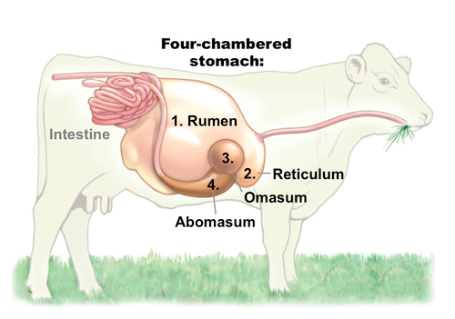
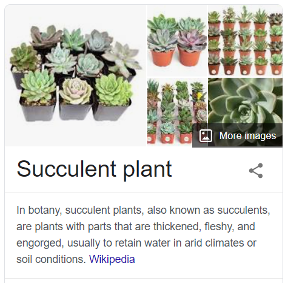

# 咬文嚼字-词根词缀(200-499)

[toc]

## -exo  表示“从，从...离开，从...向外，向外，向上” {405}

表示“从，从...离开，从...向外，向外，向上”，来自PIE *eghs, 向外。

- 该原始印欧语根进入希腊语产生变体形式 **`ek-`**
- 进入英语拼写演变为 **`ec-`**；
- 进入拉丁语演变成 **`ex-`**；
- 在浊辅音 b, d, g 和半辅音 j, l, m, n, r, v 前缩写成 **`e-`**；
- 在字母f前同化为 **`ef-`**。
- 源自希腊语 ex, ek "out of, from."
- 拉丁语 ex, ex- "out of, away from."

| 单词                                                   | 解释                                                         | 单词                                                         | 解释                                                         |
| ------------------------------------------------------ | ------------------------------------------------------------ | ------------------------------------------------------------ | ------------------------------------------------------------ |
| ex-mayor                                               | ex-husband ex-wife                                       | ex-ag-ger-ate                                                |                                                              |
| ex-act                                                 |                                                              | e-lev-ate                                                    |                                                              |
| ex-od-us                                               |                                                              | ec-stat-ic                                                   |                                                              |
| e-leg-ant                                              | **`e-`**出 + **`leg-`**=lig-选 + **`-ant`**表形容词 → 选出的 → 即选出来的，优秀的，优雅的 | an-ec-dote                                                   | **`an-`**没有 **`+ ec`**-=ex-向外 + **`dot-`**=don-给予。字面含义“没有发表出去的、未公开的”。 |
| ef-fect                                                |                                                              | ef-fort                                                      |                                                              |
| ex-gest                                                |                                                              | ex-cer-ment                                                  |                                                              |
| ex-crete                                               |                                                              | ef-fuse                                                      |                                                              |
| exo-crine                                              |                                                              | ef-fulg-ence                                                 |                                                              |
| **ef-front-ery**                   【ɪˈfrʌntəri】 | **`ef-`** 表示“从，从...离开，从...向外，向外，向上”，来自PIE *eghs, 向外。该原始印欧语根进入希腊语产生变体形式 ek-, 进入英语拼写演变为 ec-；进入拉丁语演变成 ex-；在字母f前同化为 ef-。 from." **`front-`** = forehead, 表示“前额”。源自拉丁语 frons "forehead, front." **`-ery`** 表名词，“行为，情况，身份，职业”等抽象名词或集合名词。 词源说明(童理民)   1 - ef-,向外，-front,前面，脸面。即不要脸的。 | as-ton-ish                                                   |                                                              |
| ex-pand                                                |                                                              | ex-odont-ia                                                  |                                                              |
| exo-centr-ic                                           |                                                              | **ex-termin-ate   **                    【ɪkˈstɜːrmɪneɪt】 | vt. 扑灭, 消灭, 根绝 ex-出 + termin-限制 + -ate, 表动词 → 从界限中弄出来 → 根绝掉。 **`ex-`** 表示“从，从...离开，从...向外，向外，向上”，来自PIE *eghs, 向外。 **`termin-`** = limit, 表示“界限”。源自拉丁语 terminus "boundary, limit." **`-ate`** 表动词，“做，造成”。  摩西英语(摩西) like terms(similiar terms)同类项。term n.术语；学期；期限；条款，vt. 把…叫做，collect the like terms就是合并同类项。词根term表终点、界限，后词义延伸为数学意义上的项，与thrum n.织边同源 |

## ad- / ac- 来自拉丁介词ad, 表示“朝、向、去，或弱化为强调”  {312}

- **`ad-`** 来自拉丁介词ad, 表示“朝、向、去，或弱化为强调”。

- 在字母 b, f, g, l, n, p, r, s, t 前同化为 ab-, af-, ag-, al-, an-, ap-, ar-, as-, at-；
- 在 c, k, qu 前同化为 ac-；
- 在 sc, sp, st 前缩写成 a-.

| 单词                                                   | 解释                                                         | 单词                                     | 解释                                                         |
| ------------------------------------------------------ | ------------------------------------------------------------ | ---------------------------------------- | ------------------------------------------------------------ |
| ac-celer-ate                                           | **`ac-`**加强 + **celer**-速度 + **-ate**动词后缀 → 一再增加速度。 **`celer-`** = quick, speed, 表示“快，速”。源自拉丁语 celer "swift."ex-husband ex-wife | ag-greg-ate           【ˈæɡrɪɡeɪt】 | **`ag-`**增加 + **`greg-`**群体 + **`-ate`**, 表动词 → 增加团体 → 聚集。 合计;总计 |
| ac-cumul-ate                    【əˈkjuːmjəleɪt】 | 积累;积聚;(数量)逐渐增加;(数额)逐渐增长                      |                                          |                                                              |

## -ment: 表名词，“行为或结果” {274}

## **`-ish`** 

### 1. 表形容词，“像…一样，有的…”，通常缀于名词或形容词后{262}

| 单词                                               | 解释                                                         | 单词                                         | 解释                                                         |
| -------------------------------------------------- | ------------------------------------------------------------ | -------------------------------------------- | ------------------------------------------------------------ |
| **snob-b-ish    **               【snɒbɪʃ】   | **`snob`** n. 势利小人; 自以为优越的人, 自命高雅的人(sine nobilitate) **`-ish`** 表形容词，“像…一样，有的…”，通常缀于名词或形容词后。 | **slav-ish** 【ˈsleɪvɪʃ】               | slave  n. 奴隶, 从动装置, 卑鄙的人 vi. 拼命工作 -ish  表形容词，“像…一样，有的…”，通常缀于名词或形容词后。 adj.无独创性的;盲从的;照搬的 |
| **Pol-ish      ** 【ˈpoʊlɪʃ】                 | **`pol-`** 表示“波兰”，源自波兰语 pole（土地）。 **`-ish`** 表形容词，“像…一样，有的…”，通常缀于名词或形容词后。 n.波兰语 adj.波兰的;波兰人的;波兰语的;波兰文化的 | **pol-ish          ** 【ˈpoʊlɪʃ】       | **`pol-`** = smooth, 表示“光滑”。源自拉丁语 polire "to make smooth, polish." **`-ish`** 表动词，“造成…”。  v.磨光;润色;擦光;修改;润饰 n.抛光;擦亮;上光;擦光剂;上光剂;亮光剂;擦光的面;打磨光亮的面;（表演的）完美，娴熟，精湛;文雅 |
| Jewish                                             | a. 犹太人的, 犹太族的 Jew【犹太】 + -ish表形容词         | Hunn-ish                                     | a. 匈奴人的, 野蛮的                                          |
| Gaul∙ish                                           | Gaul n. 高卢（位于欧洲西部）; 高卢人 -ish 表形容词，“像…一样，有的…”，通常缀于名词或形容词后。 a. 高卢的, 高卢人的 n. 高卢语 | ghoul∙ish                                    | ghoul n. 食尸鬼, 饿鬼, 盗墓者 -ish 表形容词，“像…一样，有的…”，通常缀于名词或形容词后。 a. 食尸鬼似的, 残忍的 |
| Frank-ish                                          | a. 法兰克语的, 法兰克人的 n. 法兰克语                    | Czech-ish 【ˈtʃekiʃ】                   | a. 捷克的, 捷克语的, 捷克人的 推荐： Czech【捷克】 + -ish表形容词 捷克语;捷克人;捷克的 |
| **plump-ish**                     【plʌmpiʃ】 | **`plump`** a. 圆胖的, 丰满的, 直接下落的, 直率的  vt. 突然放下, 支持, 使丰满, 使鼓起 vi. 扑通落下, 投票赞成, 变丰满, 鼓起 ad. 沉重地, 突然地, 直截了当地 **`-ish`** 表形容词，“像…一样，有的…”，通常缀于名词或形容词后。 a. 较丰满的(plump【丰满的】 + -ish表形容词) | **lav-ish **                 【ˈlævɪʃ】 | **`lav-`** = wash, 表示“洗，冲洗”。源自拉丁语 lavere "to wash," lavare "to wash." **`-ish`**表形容词，“像…一样，有的…”，通常缀于名词或形容词后。  ***av-冲洗 + -ish表形容词 → 冲掉 → 浪费。*** adj.奢华;慷慨的;大量的;给人印象深刻的;耗资巨大的;大方的 v.浪费;滥花;乱给 1 - 来自拉丁语 lavare,冲洗，涌出，词源同 lava,dilute,antediluvian,-ish,形容词后缀。即大量涌出的，大量的。 |
| forty-ish                                          | a. 近四十岁的, 四十岁左右的 推荐: forty【四十】 + -ish表形容词 | thrity-ish                                   | a. 近三十岁的, 三十岁左右的 单词笔记   ［添加］ 推荐： thirty【三十】 + -ish |
| gar∙ish                                            | gar- = furnish, 表示“装饰，供应”。源自古法语 guarnir "to equip." -ish 表形容词，“像…一样，有的…”，通常缀于名词或形容词后。  可能和 garnish【装饰】有关，也就是 gar-装饰 + -ish表形容词。 a. 穿着花哨的, 炫耀的, 过分装饰的 | freak-ish                                    | a. 朝三暮四的, 见异思迁的, 畸形的 单词笔记   ［添加］ 推荐： freak【反复无常】 + -ish表形容词 |
| fool-ish                                           | a. 愚蠢的, 傻的 范围：四级,专四,考研,雅思,高考 单词笔记   ［添加］ 推荐： fool【傻瓜】 + -ish表形容词 | faint-ish                                    | a. 较弱的, 有些昏晕的 推荐： faint【微弱的】 + -ish表形容词 |
| dump-ish                                           | a. 忧愁的, 忧郁的 推荐： dump + -ish表形容词         | dog-ish                                      | a. 狗一样的, 卑鄙的, 浮华的 推荐： dog【狗】 + -ish表形容词 |
| cad∙d∙ish                                          | cad n. 卑鄙的男人, 下流人, 无赖, 计算机辅助设计 -ish 表形容词，“像…一样，有的…”，通常缀于名词或形容词后。 cad【下流人】 + -d- + -ish（a. 下流的, 卑鄙的） | bull-ish                                     | a. 似公牛的, 看涨的, 上扬的 推荐：bull【牛】 + -ish表形容词 |
| bad∙d∙ish                                          | **`bad`** a. 坏的 n. 坏 ad. 坏地 **`-ish`** 表形容词，“像…一样，有的…”，通常缀于名词或形容词后。 a. 好读书的, 书呆子的 | baby∙ish                                     | baby n. 婴孩 -ish 表形容词，“像…一样，有的…”，通常缀于名词或形容词后。 |
| **kitten∙ish** 【ˈkɪtnɪʃ】                    | **`kitten`** n. 小猫 vt. 产仔 **`-ish`** 表形容词，“像…一样，有的…”，通常缀于名词或形容词后。 搔首弄姿的;卖弄风情的（lively, and trying to attract men's attention） | **coquett∙ish** 【koʊˈketɪʃ】           | coquet v. 卖弄风情 a. 卖弄风情的 n. 卖弄风情 -ish 表形容词，“像…一样，有的…”，通常缀于名词或形容词后。  If you describe a woman as **coquettish**, you mean she acts in a playful way that is intended to make men find her attractive. ...a coquettish glance.（卖弄风骚的一瞥） |
| **woman-ish** 【ˈwʊmənɪʃ】                    | a. (贬)似女子的, 女子气的, 适于女子的 单词笔记   ［添加］ 推荐： woman【女人】 + -ish表形容词 | **yellow-ish** 【ˈjeloʊɪʃ】             | yellow  n. 黄色 a. 黄色的 fairly yellow in colour（微黄色的；发黄的） |
| **round-ish** 【raʊndɪʃ】                     | a. 略圆的 推荐： round【n. 圆】 + -ish表形容词       | **green-ish** 【ˈɡriːnɪʃ】              | a. 呈绿色的 similar to green or slightly green in colour  推荐：green【绿色】 + -ish表形容词  green n. 绿色, 绿色颜料 a. 绿色的, 未成熟的, 新鲜的, 青春的, 无经验的, 脸色发青的 -ish 表形容词，“像…一样，有的…”，通常缀于名词或形容词后。 |

###  2. 表动词，“造成…” {38}

| 单词                               | 解释                                                         | 单词                                   | 解释                                                         |
| ---------------------------------- | ------------------------------------------------------------ | -------------------------------------- | ------------------------------------------------------------ |
| **Pol-ish      ** 【ˈpoʊlɪʃ】 | **`pol-`** 表示“波兰”，源自波兰语 pole（土地）。 **`-ish`** 表形容词，“像…一样，有的…”，通常缀于名词或形容词后。 n.波兰语 adj.波兰的;波兰人的;波兰语的;波兰文化的 | **pol-ish          ** 【ˈpoʊlɪʃ】 | **`pol-`** = smooth, 表示“光滑”。源自拉丁语 polire "to make smooth, polish." **`-ish`** 表动词，“造成…”。  v.磨光;润色;擦光;修改;润饰 n.抛光;擦亮;上光;擦光剂;上光剂;亮光剂;擦光的面;打磨光亮的面;（表演的）完美，娴熟，精湛;文雅 |
| **per-ish  ** 【ˈperɪʃ】      | vi. 毁灭, 丧生, 凋谢, 颓丧, 死亡, 腐烂 vt. 毁坏, 使麻木, 使丧生, 耗尽 推荐：per-穿过，完全的 + -ish 是拉丁语ire走，行程的残留，引申词义死亡，毁灭。  **`per-`** 表示“完全，贯穿，自始至终，向前”。forth, ford 是其同源词。 **`-ish`** 表动词，“造成…”。 词源说明(童理民)   1 - 来自古法语 periss-,来自拉丁语 perire,走完，走尽，来自 per-,穿过，完全的，ire,走，行程，词源同 exit,itinerary.引申词义死亡，毁灭。-iss,分词格。 |                                        |                                                              |
|                                    |                                                              |                                        |                                                              |

##  -ant 三类词根 {200}

### 1. 表形容词，“…的，具有…性质的”

| 单词                                                         | 解释                                                         | 单词                                                         | 解释                                                         |
| ------------------------------------------------------------ | ------------------------------------------------------------ | ------------------------------------------------------------ | ------------------------------------------------------------ |
| **dis-cord-ant**                               【dɪsˈkɔːrdənt】 | dis 不 + cord 心 + ant …的，具有…性质的 → 不是一条心的 → 不一致的 | **extra-vag-ant**                          【ɪkˈstrævəɡənt】 | extra 超过 + vag 走 + ant …的，具有…性质的 → 漫游过多 → 奢侈的 |
| **ex-uber-ant**  【ɪɡˈzuːbərənt】                       | ex 出 + uber 果实 + ant …的，具有…性质的 → 出果实的 → 茂盛的 | **in-toxic-ant**  【ɪnˈtɑːksɪkənt】                     | in 使… + toxic 毒 + ant …的，具有…性质的 → 酒精中毒 → 酒精 → 醉人的 |
| **repent-ant** 【rɪˈpentənt】                           | repent 后悔 + ant …的，具有…性质的 → 后悔的                  | **resist-ant**  【rɪˈzɪstənt】                          | resist 抵抗 + ant …的，具有…性质的 → 抵抗的                  |
| **ad-ulter-ant** 【ə'dʌltərənt】                        | 掺杂（用）的；掺假（用）的；使不纯的 ad-去 + ulter-改变 + -ate, 表动词 → 变成别的 → 掺假。 ulter-  = other, to change, 表示“其他的，改变状态” | **e-leg-ant** 【ˈelɪɡənt】                              | **`e-`**出 + **`leg-`**=lig-选 + **`-ant`**表形容词 → 选出的 → 即选出来的，优秀的，优雅的 |
| **rumin-ant** 【ˈruːmɪnənt】                            | **`rumin-`** 表示“反刍”。  | **pleas-ant** 【ˈpleznt】                               | **please** ad. 请 vt. 使高兴, 合...的心意, 取悦 vi. 使人满意, 讨好, 愿意, 敬请 **`-ant`** 表形容词，“…的”。 |
| **fragr-ant** 【ˈfreɪɡrənt】                            | **`fragr-`** 表示“强烈的味道”。源自拉丁语 fragrare "to small." **`-ant`** 表形容词，“…的”。 | **ex-uber-ant** 【ɪɡˈzuːbərənt】                        | a. 繁茂的; 热情洋溢的, 精力充沛的 **`ex-`**向外 + **`uber-`**果实 + **`-ant`** → 原指多产的，丰富的，引申义兴高采烈的 |
| **significant**          【sɪɡˈnɪfɪkənt】               | a person or an animal that lives in a particular place       | **page-ant** 【ˈpædʒənt】                               | 推荐： **page【页】 + -ant名词后缀，原指写在纸上的剧本。**  1. 穿古代服装的游行；再现历史场景的娱乐活动 2. (NAmE) 选美比赛 (Beauty Pageant) 3. ~ (of sth) (literary) 内容繁杂有趣的场面；盛大华丽的情景 life's rich pageant（丰富的人生画卷) |
| **a-melior-ant**  【əˈmiːljərənt】                      | 改良物 a thing that ameliorates **`a-`** 加在单词前，表示“在…的”；表示“不、无、非”；表示“加强”。源自希腊语 a-, an- "not." **`melior-`**= better, 表示“更好”，这里 -or 表示比较级。源自拉丁语 melior "better." **`-ant`** 表形容词，“…的”。 |                                                              |                                                              |

### 2. 表名词，“人”

| 单词                                             | 解释                                                         | 单词                                                  | 解释                                                   |
| ------------------------------------------------ | ------------------------------------------------------------ | ----------------------------------------------------- | ------------------------------------------------------ |
| **account-ant**          【əˈkaʊntənt】     | account 账目 + ant 人 → 打理账目的人 → 会计                  | **adjut-ant**  【ˈædʒʊtənt】                     | adjut 帮助 + ant 人 → 副手；副官                       |
| **aspir-ant**  【əˈspaɪərənt】              | aspire 热望，立志 + ant 人 → 有抱负者 A person with a strong desire to achieve a position of importance or to win a competition. | **assist-ant**  【əˈsɪstənt】                    | assist 帮助 + ant 人 → 助手                            |
| **inhabit-ant**             【ɪnˈhæbɪtənt】 | inhabit 居住 + ant 人 → 居民                                 | **particip-ant**               【pɑːrˈtɪsɪpənt】 | participate 参加 + ant 人 → 参与者                     |
| **tyr-ant** 【ˈtaɪrənt】                    | **`tyrann-`** = tyrant, 表示“暴君”。 **`-ant`** 表名词，“…人”。 | **inhabitant**          【ɪnˈhæbɪtənt】          | a person or an animal that lives in a particular place |
| **flagell-ant**[^2] 【flædʒɪlənt】          | n. 鞭笞者, 受鞭笞者, 自笞者;  a. (言语)刺人的, 伤人的 推荐：flagell-鞭子 + -ant  flagell- = whip, 表示“鞭子”。源自拉丁语 flagrum "a whip." -ant 表形容词，“…的”。  |                                                       |                                                        |

[^2]: 摩西英语(摩西) flagellant ['flædʒ(ə)l(ə)nt] n.苦修者；执鞭抽打者，adj.伤人的；鞭打的。欧洲黑死病（black death）期间，欧洲人口减少了三分之一。由于医学不发达，没有人知道瘟疫的源头。死亡阴影中，人们开始用鞭打自己的方式进行忏悔，希望这样能洗净过去的罪恶，从而不被瘟疫感染。词根flag-表to strike。  n. 1 . a penitent who whips himself or herself as a means of repentance  2 . somebody who uses whipping to achieve pleasure 

###  3. 表名词，“…剂，…物”

| 单词                                | 解释                                       | 单词                                | 解释                                      |
| ----------------------------------- | ------------------------------------------ | ----------------------------------- | ----------------------------------------- |
| **lubricant**  【ˈluːbrɪkənt】 | lubric 滑 + ant …剂，…物 → 润滑剂          | **retardant** 【rɪtɑːrdənt】   | retard 延迟，阻止 + ant …剂，…物 → 阻化剂 |
| **stimulant**  【ˈstɪmjələnt】 | stimul 刺 + ant …剂，…物 → 刺激物 → 兴奋剂 | **suppressant**  【səˈpresnt】 | suppress 抑制 + ant …剂，…物 → 抑制物     |
|                                     |                                            |                                     |                                           |
|                                     |                                            |                                     |                                           |

#### agent v.s broker

**agenda（议程）：信徒应当去做的事情。**

英语单词agenda（议程）来自拉丁语，意思是“待办之事”，由词根**`ag-`**（做）+后缀**`-enda`**（应…之事），同源词有agency（代理）、agent（代理人）。

进入英语后，agenda最初用于宗教领域，是一个宗教术语，表示“信徒应当去做的事”，即“教规”，包括祈祷、斋戒、朝拜等。与它对应的是单词credenda（教条），表示“信徒应当相信的事”。

19世纪80年代后，**agenda**开始用来表示会议中待讨论的议题或待进行的事项，即所谓的“议程”。现在既可表示会议议程，也可表示日常工作中的待办事项。

- agenda：[ə'dʒendə] n.议程，待办事项
- agent：['edʒənt] n.代理人，代理商adj.代理的
- agency：['edʒənsi] n.代理，中介，代理处，经销处
- credenda：[kri'dendə] n.信条，教条

**broker（经纪人）：打开酒桶卖酒的人**

在古代欧洲的酒吧或其他零售酒水的地方，卖酒的小贩会批发采购一桶一桶的啤酒或其他酒类，然后打开酒桶，装上龙头，然后一杯一杯地卖给喝酒的人。打开酒桶的工具在法语中叫***broche***，后来演变为英语单词**broach**（钻头、凿子）。而表示“打开酒桶”的法语动词。

***brochier***产生了名词***brocheor***，后来演变成英语中的**broker**，字面意思就是“打开酒桶的人”，原本用来表示零售酒水的小贩，后来泛指各种经销商，在金融行业中，则用来表示经纪人、掮客。虽然中文叫法不同，但其实都是经销商、中间人的意思。经纪人其实就是把股票、证券等金融产品贩卖给个体投资者的中间人。

> 掮（**qián**），动词，用肩扛东西，如掮客（旧指介绍买卖，取得佣金的人）。
>
> 新人初夜，郎以手摸其头而甚得意，摸其乳腹俱欢喜，及摸下体，不见两足，惊骇问之，则已掮起半日矣。

- **broker**： ['brəʊkə] n.经纪人，中间人，掮客v.以中间人身份来谈判、安排
- **brokerage**：['brokərɪdʒ] n. 佣金；回扣；中间人业务
- **broach**： [brəʊtʃ] 
  - n.钻头，凿子，胸针
  - vt.提出，给……钻孔、开口，开始讨论

### 4. 同义词辨析

| 单词                                | 解释                                                         |
| :---------------------------------- | :----------------------------------------------------------- |
| **candidate**  n. 候选人；申请人 | 〔辨析〕指竞选的候选人或某一职位的申请人。   〔例证〕   Who will be the presidential candidate?    The defeated candidate demanded a recount.   Tom is the strongest candidate for the position. |
| **applicant**  n. 申请者，求职者 | 〔辨析〕通常指正式提交书面材料申请某一职位、高校入学资格等的人。   〔例证〕   We give preference(优先权) to applicants with some experience.   He is the best applicant for the job.  There is no lack of applicants to this college |
| **aspirant**  n. [正式]有志者    | 〔辨析〕**通常指有雄心壮志要取得成功或荣誉的人**。    〔例证〕   An aspirant for literary honor.   They're aspirants to the title of world champion |
| **nominee**.  n. 被提名者        | 〔辨析〕通常指某一职位、奖项等的提名候选人。    〔例证〕   a presidential nominee.   an Oscar nominee.   He is the nominee for the position. |

##  -ent

### 1. 表名词 …人；…事物 {21}

| 单词                           | 解释                                                         | 单词                                 | 解释                                                         |
| ------------------------------ | ------------------------------------------------------------ | ------------------------------------ | ------------------------------------------------------------ |
| stud-ent                       | 学生，学者                                                   | pati-ent                             | 病人，承受者                                                 |
| **ag-ent**                     | ag-做 + -ent表人或物 → 做的人 → 代理人。 代理商、政府代表、媒介 | par-ent                              | 父母、父母亲，根源                                           |
| pro-fic-i-ent                  | 高手、专家                                                   | doc-ent                              | 讲师，讲解员                                                 |
| audi-ent                       | 倾听者                                                       | correspond-ent                       | 通讯记者，通信者                                             |
| ante-ced-ent                   | 前情，先行词                                                 | re-sid-ent                           | 居民，常驻程序                                               |
| **reg∙ent** 【ˈriːdʒənt】 | **`reg-`** = rule, 表示“规则”。源自拉丁语 regula "straight piece of wood, rod." 摄政者;摄政王（用在名词后）摄政的 | presid-ent                           | 总统、总裁                                                   |
| de-linq-ent                    | 少年犯                                                       | de-ced-ent                           | 死者                                                         |
| pro-pon-ent                    | 建议者，支持者                                               | ex-pon-ent                           | 说明者，提倡者，说明物                                       |
| coag-ent                       | 合作者，共事者，扳手                                         | adher-ent                            | 信徒，追随者                                                 |
| depend-ent                     | 依赖他人者                                                   | op-pon-ent                           | 对手，敌手，反对者                                           |
|                                |                                                              | **succ∙ul∙ent**  【ˈsʌkjələnt】 | a. 多汁的, 多水分的 推荐：succ-汁 + -ul + -ent **`succ-`** = juice, 表示“果汁”。源自拉丁语 sugere "to suck," sucus, succus "juice." **`-ent`** 表示形容词，“…的”。  词源说明(童理民)   1 - 来自拉丁语 succus,汁液，来自 PIE*sug,吸，来自 PIE*seue,汁液，液体，词源同 suck,soak,soup.即多汁的，引申词义肉质的，后用于生物学类属指肉质植物 |

### 2. 表形容词 {239}

| 单词                                      | 解释                                                         | 单词                                    | 解释                                                         |
| ----------------------------------------- | ------------------------------------------------------------ | --------------------------------------- | ------------------------------------------------------------ |
| **deterrent**         【dɪˈtɜːrənt】 | **`deter`** vt. 制止, 吓住, 威慑 **`-ent`** 表示形容词，“…的”。 词源说明(童理民)   1 - 来自 deter,震慑，威慑 具威慑性的事物：a thing that makes sb less likely to do sth (= that deters them) | **different**         【ˈdɪfrənt】 | 不同的;有区别的;有差异的;分别的;各别的;各种的;不平常;与众不同;别致 |
| advert-ent                                | 注意的、留意的                                               | af.fer.ent                              | 传入的                                                       |
| al.flu.ent                                | 丰富的、赋予的                                               | ambi.ent                                | 周围的                                                       |
| **ambi.val.ent**                          | 矛盾的、模棱两可的                                           | anci.ent                                | 古代的、古老的                                               |
| **ap.par.ent**                            | 清晰可见的、显然的                                           | **de.cad.ent** 【ˈdekədənt】       | 衰微的，颓废的 推荐： de-向下 + cad-掉落 + -ent **`de-`**  来自拉丁语介词形式 de, 表示“从，从...离开，从...向下，向下”。由其基本词义引申词义  1.彻底离开，完全离开，完全下去，因而表完全，表整个，表加强； 2.由离开表没有，相反，使相反，使反转。 源自拉丁语 de, de- "from." **`cad-`**  = fall, 表示“落下，降临”。源自拉丁语 cadere "to fall, die." |
| **dec.ent**                               | 有分寸的、得体的、大方的                                     | de.cumb.ent                             | 匍生的、匍匐的                                               |
| de.fer.ent                                | 传送的、输出的                                               | de.fic.ient                             | 不充分的、有缺陷的                                           |
| de.flu.ent                                | 向下流的                                                     | **con.cup.is`c`ent**                    | 欲望强烈的；色欲强的                                         |
| **confid.ent**                            | 有信心的                                                     | con.flu.ent                             | 合流的，汇合的，融合性的                                     |
| **con.gru.ent**                           | 适合的、一致的，和谐的                                       | conniv.ent                              | 会接的、靠合的                                               |
| **con.sent.i.ent**                        | 同意的、无异议的                                             | **nasc∙ent**  【ˈnæsnt】           | **`nasc-`** = born, 表示“出生的”。源自拉丁语 gnasci, nasci "to be born." **`-ent`** 表示形容词，“…的”。 词源说明(童理民)   1 - 来自拉丁语 nasci,出生，来自 PIE*gen,生育，词源同 gene,natal,native. |
|                                           |                                                              | **succ∙ul∙ent**  【ˈsʌkjələnt】    | a. 多汁的, 多水分的 推荐：succ-汁 + -ul + -ent **`succ-`** = juice, 表示“果汁”。源自拉丁语 sugere "to suck," sucus, succus "juice." **`-ent`** 表示形容词，“…的”。  词源说明(童理民)   1 - 来自拉丁语 succus,汁液，来自 PIE*sug,吸，来自 PIE*seue,汁液，液体，词源同 suck,soak,soup.即多汁的，引申词义肉质的，后用于生物学类属指肉质植物 |

## 一缀三连

### 1. `-ence` 表名词，“性质，状态”{191}

| 单词                              | 解释                                                         | 单词                                     | 解释                                                         |
| --------------------------------- | ------------------------------------------------------------ | ---------------------------------------- | ------------------------------------------------------------ |
| **af∙flu∙ence** 【ˈæfluəns】 | **`af-`**  来自拉丁介词ad, 表示“朝、向、去，或弱化为强调”。 **`flu-`**  = flow, 表示“流动”。源自拉丁语 bluere "to flow." **`-ence`**  表名词，“性质，状态”。 | **succ∙ul∙ence**[^1]  【sʌkjələns】 | n. 多汁, 青饲料 推荐：succ-汁 + -ul + -ence, 表名词 **`succ-`** = juice, 表示“果汁”。源自拉丁语 sugere "to suck," sucus, succus "juice." **`-ence`** 表名词，“性质，状态”。  |
|                                   |                                                              |                                          |                                                              |
|                                   |                                                              |                                          |                                                              |

[^1]:  **What is Succulence?** [Succulence](http://succulence.strikingly.com/workshops) is an Urban Plant shop that finds plants to suit your home or city space like offices, shops, or or any space that you want to decorate. http://mrsjonasrecommends.com/spotlight-introducing-succulence/

### 2. `-esce`表示“动作的起始”{18}

| 单词                                | 解释                                                         | 单词                            | 解释                                                         |
| ----------------------------------- | ------------------------------------------------------------ | ------------------------------- | ------------------------------------------------------------ |
| **in-cand-esce** 【ɪnkæn'des】 | vt. 使白热化 vi. 白热化 推荐: in-进入 + cand-发光 + -esce **`in-`**  来自拉丁语in-，表示“在内，进入， **`cand-`**  = white, glow, 表示“白，发光”。源自拉丁语 candere "to shine." **`-esce`**  表示“动作的起始”。 | **adol∙esce** 【ˌædəˈles】 | **`adol-`**  = adult, 表示“成年”。这是一个复合词根，由"ad- (to)" + "ul- (nourish) " 组成。 **`-esce`**  表示“动作的起始”。 在成长过程；在成熟 (become adolescent) |
|                                     |                                                              |                                 |                                                              |
|                                     |                                                              |                                 |                                                              |

### 3. `-escence`  复合后缀（-esce + -ence），表示“动作的起始”，名词后缀{42}

| 单词                                      | 解释                                                         | 单词                                      | 解释                                                         |
| ----------------------------------------- | ------------------------------------------------------------ | ----------------------------------------- | ------------------------------------------------------------ |
| **in∙cand∙escence** 【ˌɪnkæn'desns】 | in-  来自拉丁语in-，表示“在内，进入，使...”。 cand-  = white, glow, 表示“白，发光”。源自拉丁语 candere "to shine." -escence  复合后缀（-esce + -ence），表示“动作的起始”，名词后缀。 白炽度;白（灼）热；白炽 She burned with an incandescence that had nothing to do with her looks.（她光彩照人，却与容貌无关。） | **in∙cand∙escence** 【ˌɪnkæn'desns】 | in-  来自拉丁语in-，表示“在内，进入，使...”。 cand-  = white, glow, 表示“白，发光”。源自拉丁语 candere "to shine." -escence  复合后缀（-esce + -ence），表示“动作的起始”，名词后缀。 白炽度;白（灼）热；白炽 She burned with an incandescence that had nothing to do with her looks.（她光彩照人，却与容貌无关。） |
|                                           |                                                              |                                           |                                                              |
|                                           |                                                              |                                           |                                                              |

### 4. `-ancy` = -ance, 表示“性质，状况”{62}

| 单词                                   | 解释                                                         | 单词                                        | 解释                                                         |
| -------------------------------------- | ------------------------------------------------------------ | ------------------------------------------- | ------------------------------------------------------------ |
| **dilat-ancy** 【daɪ'leɪtənsɪ】   | n. 膨胀性 **`dilate`**【膨胀】 + -**`ancy`**, 表名词 **`dilate`** vi. 扩大, 详述, 膨胀 vt. 使膨胀 **`-ancy`** = -ance, 表示“性质，状况”。 | **dilate  **            【daɪˈleɪt】   | di-分开 + lat-带、拿 + -e → 带开 → 扩大。 **`di-`** 来自拉丁语dis-，表示“分开，散开”，引申词义“离开，无，没有，缺乏，表相反等”。 **`lat-`** = wide 表示“宽”。源自拉丁语 latus "broad, wide." 词源说明(童理民)   1 - dis-,分开，散开，-lat,变宽，膨胀，词源同 latitude.即扩散，膨胀。 |
| **a-therm-ancy**  【əˈθɜːrmənsi】 | n. 不透热性 推荐：a-不，非 + therm-热 + -ancy, 表名词 **`a-`** 加在单词前，表示“在…的”；表示“不、无、非”；表示“加强”。源自希腊语 a-, an- "not." **`therm-`** = heat, 表示“热”。源自希腊语 thermos "warm, hot, heat." **`-ancy`** = -ance, 表示“性质，状况”。 | **dia-therm-ancy**  【ˌdaɪə'θɜ:mənsɪ】 | n. 透热性 推荐：dia-穿过 + therm-热 + -ancy, 表名词 **`dia-`** 表示“穿过，二者之间”。 **`therm-`** = heat, 表示“热”。源自希腊语 thermos "warm, hot, heat." **`-ancy`** = -ance, 表示“性质，状况”。 |
|                                        |                                                              |                                             |                                                              |

1