# 咬文嚼字-词根词缀(21-50)

@(TOEFL)[托福, TOEFL, 词根词缀,咬文嚼字]

[toc]

## 同类与异类

> In the process of studying English, it is likely to confuse homograph, homonym, and homophone.
> 在英语学习过程中, 对同形异义词、同音同形异义词 、 同音异形异义词的运用很容易造成混淆.

### 1. homo- 表示“同类的”。源自希腊语 homos " {41}

| 单词          | 解释                                                         | 单词          | 解释                                                         |
| ------------- | ------------------------------------------------------------ | ------------- | ------------------------------------------------------------ |
| homo∙gene∙ity | homo-  表示“同类的”。源自希腊语 homos "same." gene-  = birth, produce, 表示“出生，产生”，医学上引申为“生殖或基因”。 -ity  表名词，指具备某种性质。 | homo-graph    | homo-  表示“同类的”。源自希腊语 homos "same." 更多同源词... graph-  = write, 表示“写，图”。源自希腊语 graphein 1 . a word that is spelled in the same way  as one or more other words but is different in meaning , e . g . the verb " project " and the noun " project ." |
| homo∙log∙ate  | homo-相同 + log-说话 + -ate  homo-  表示“同类的”。源自希腊语 homos "same." log-  = speak, 表示“说话”，更倾向于知识阶层的‘说’，所以经常引申为...学。源自希腊语 logos "speech, word, reason." -ate  表动词，“做，造成”。 | homo∙morph∙ic | homo-相同 + morph-形状 + -ic  homo-  表示“同类的”。源自希腊语 homos "same." morph-  = form, shape, 表示“形状”。派生的 morphin- 专指“吗啡”。源自希腊语 morphe "form, shape"。 -ic  表形容词，“…的”。 |
| hemo-the-ism  | heno + the-神 + -ism (一神教) **`homo-`** 表示“同类的”。源自希腊语 homos "same." **`the-`** = god， 表示“神”。源自希腊语 theos "god." **`-ism`** 抽象名词后缀，表示“…主义”；“宗教”；“制度、行为”；“…学”、“…术”、“…论”、“…法”；“疾病名称”；“情况、状态”等。 词源说明(童理民)   1 - heno-,一，theism,有神论。即只信奉一个神，但是不否认其它神的存在，也不排斥别人信仰其它神。 | Homosexusl    | 相同+sex+形容词后缀=同性恋者 Bisexual →bi前缀表示双+sex+形容词后缀=双性恋者 |

### 2. hetero- 表示“异类，异种”。源自希腊语 heteros "one of two, other."{25}

| 单词              | 解释                         | 单词             | 解释                   |
| ----------------- | ---------------------------- | ---------------- | ---------------------- |
| hetero-phobia     | 异形恐惧症                   | hetero-sexual    | 异性的，异性爱的       |
| hetero-chromosome | 异性染色体                   | hetero-sexuality | 异性爱                 |
| hetero-clite      | 反常的人（或事），不规则明朝 | hetero-dox       | a. 非正统的，异端的    |
| hetero-doxy       | 非正统，异端                 | hetero-gene-ity  | 异种，异质，不同成分   |
| hetero-gen-eous   | 异种的，异质的               | hetero-gen-ous   | 异源的，异形的，异种的 |
| hetero-genesis    | 世代交替，异形生殖，自然发生 | hetero-logy      |                        |
| hetero-morph-ic   | 异形的，异态的               | hetero-morph-ism | 异态性，异态想象       |
| hetero-nomy       | 他治，受制于人               | heter-onym       | 同形异义词             |
| hetero-phor-ia    | 隐斜视                       | hetero-osis      | 杂种优势               |
| hetero-plasmy     |                              |                  |                        |

## 厚礼蟹忒的小词后缀

### **`-ule`** 表名词，“小…”。源自拉丁语 -ulus, 小词后缀{23}

| 单词                               | 解释                                                         | 单词 | 解释 |
| ---------------------------------- | ------------------------------------------------------------ | ---- | ---- |
| **mole-cule** 【ˈmɑːlɪkjuːl】 | n. 分子, 些微 推荐：mole-堆 + -cule小 → 很小的东西堆在一起 → 分子。 mole∙cule  [词根树] **`-ule`** 23 表名词，“小…”。源自拉丁语 -ulus, 小词后缀。 **`mole-`**  = heap, 表示“堆”。源自拉丁语 moles "heavy bulk, mass, massive structure." |animal-cule|微动物|
|antenn-ule|小触角|barb-ule|鱼的触须，鸟的羽小支|
|caps-ule|太空舱，航天舱，胶囊|cell-ule|小细胞|
|lun-ule|半月形的东西|gran-ule|小粒，细粒，颗粒|
|glob-ule|小球，血球，药丸，液滴|mod-ule|单元，模块，组件，模数|
|ferr-ule|金属手杖，金属环，圈套|flos-cule|小花|
|nod-ule|小节，小瘤，小结节|min-usc-ule|小书写体，小写字|
|pil-ule|小药丸|plum-ule|胚芽，绒羽|
|pust-ule|脓疱|spher-ule|小球，小球体|
|tub-ule|小管，细胞|||
|zon-ule|小带|||

### -ular 表形容词，“有…形状或性质的”。源自拉丁语 -ulus, 小词后缀{41}

| 单词                              | 解释                                                         | 单词                            | 解释                                                         |
| --------------------------------- | ------------------------------------------------------------ | ------------------------------- | ------------------------------------------------------------ |
| **ang∙ular** 【ˈæŋɡjələr】   | a. 有角的, 消瘦的, 有尖角的, 生硬的 推荐 ang-角 + ular。 **`ang-`** = to bend, 表示“弯或钩”。 **`-ular`** 表形容词，“有…形状或性质的”。源自拉丁语 -ulus, 小词后缀。 摩西英语(摩西) angular ['æŋgjʊlə] adj. [生物] 有角的；angle ['æŋg(ə)l] n.角。为啥一个是angle另一个是angul呢？这现象叫syncope ['sɪŋkəpɪ] n.字中音省略，即angul的重音第一音节后的元音脱落了。顺便说一句，English中的Engl指的就是来自欧洲大陆“钩型”（成角度）地区渡海到不列颠的Anglo盎格鲁人。 | **ang∙ular** 【ˈæŋɡjələr】 | a. 有角的, 消瘦的, 有尖角的, 生硬的 推荐 ang-角 + ular。 **`ang-`** = to bend, 表示“弯或钩”。 **`-ular`** 表形容词，“有…形状或性质的”。源自拉丁语 -ulus, 小词后缀。 摩西英语(摩西) angular ['æŋgjʊlə] adj. [生物] 有角的；angle ['æŋg(ə)l] n.角。为啥一个是angle另一个是angul呢？这现象叫syncope ['sɪŋkəpɪ] n.字中音省略，即angul的重音第一音节后的元音脱落了。顺便说一句，English中的Engl指的就是来自欧洲大陆“钩型”（成角度）地区渡海到不列颠的Anglo盎格鲁人。 |
| **vas-cular** 【ˈvæskjələr】 | a. 血管的, 维管的 推荐：vas-管 + -cular 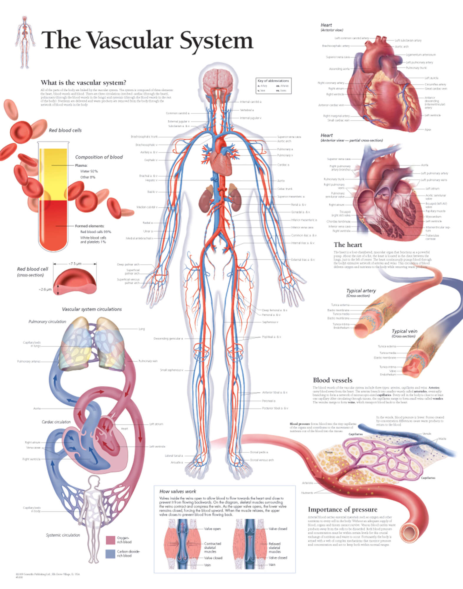 **`-ular`** 表形容词，“有…形状或性质的”。源自拉丁语 -ulus, 小词后缀。 **`vas-`** = vessel, 表示“管状的”，引申为“容器”。 词源说明(童理民)   1 - 来自拉丁语 vas,容器，词源同 vase,vessel.-cul,小词后缀，引申词义血管。 |                                 |                                                              |
|                                   |                                                              |                                 |                                                              |

### **`-ar`** 表形容词，“…的”。源自拉丁语 -alis, adjective suffix{50}

| 单词                                | 解释                                                         | 单词 | 解释 |
| ----------------------------------- | ------------------------------------------------------------ | ---- | ---- |
| **molecul∙ar** 【məˈlekjələr】 | a. 分子的, 由分子组成的 推荐：molecule【分子】 + -ar表形容词。 **`molecule`** n. 分子, 些微 **`-ar`** 表形容词，“…的”。源自拉丁语 -alis, adjective suffix. |      |      |
|                                     |                                                              |      |      |
|                                     |                                                              |      |      |

## ped- = foot, 表示“脚”。源自拉丁语 pes (词干 ped-) "foot." {50}

| 单词                                               | 解释                                                         | 单词                                                         | 解释                                                         |
| -------------------------------------------------- | ------------------------------------------------------------ | ------------------------------------------------------------ | ------------------------------------------------------------ |
| **ex-ped-i-ent **            【ɪkˈspiːdiənt】 | n. 权宜之计 a. 权宜的, 方便的, 有用的 推荐：ex-出 + ped-脚 + -i- + -ent → 能把脚跨出去 → 方便的。 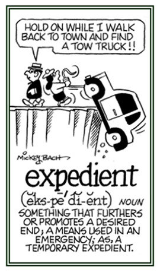 **`-ent`** 表示形容词，“…的”。 **`ex-`** 表示“从，从...离开，从...向外，向外，向上”，来自PIE *eghs, 向外。 **`ped-`** = foot, 表示“脚”。源自拉丁语 pes (词干 ped-) "foot." 更多同源词... 词源说明(童理民)   1 - 来自 expedite,加速。引申词义权宜之计。 | **ex-ped-i-ence**  【ɪk'spɪdɪəns】                      | n. 权宜, 方便, 私利 推荐：ex-出 + ped-脚 + -i- + -ence, 表名词。  -ence 表名词，“性质，状态”。 expedient n. 权宜之计 a. 权宜的, 方便的, 有用的 |
| **im-ped-e ** 【ɪmˈpiːd】                     | vt. 妨碍, 阻碍, 阻止 推荐：im-进入 + ped-脚 + -e → 把脚放进去 → 妨碍。  im- 来自拉丁语in-，表示“在内，进入，使...”。 ped- = foot, 表示“脚”。源自拉丁语 pes (词干 ped-) "foot." | **ped-e-st-ian  **                        【pəˈdestriən】 | n. 行人, 步行者 a. 人行的, 徒步的, 呆板的, 通俗的, 平淡无奇的 推荐：ped-脚 + -e-str-ian…的人 → 用脚走路的人。 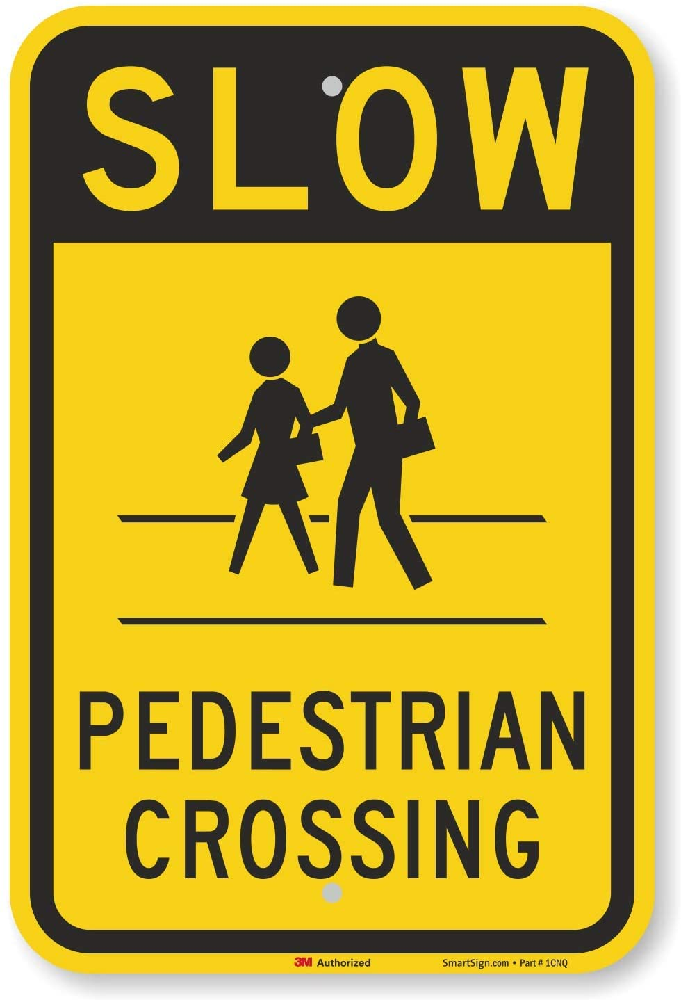 **`st-,sta-,stat-,stan-,stant-,stin-`** = stand, 表示“站、立”。 **`ped-`** = foot, 表示“脚”。源自拉丁语 pes (词干 ped-) "foot." **`-ian`** 表名词，“某种人”。 |
|                                                    |                                                              |                                                              |                                                              |

n. 行人, 步行者
a. 人行的, 徒步的, 呆板的, 通俗的, 平淡无奇的
【复数：pedestrians】
范围：六级,专四,专八,GRE,考研,雅思,高考
单词笔记   ［添加］
推荐：
ped-脚 + -estrian…的人 → 用脚走路的人。

词根树   
-ianped-st-,sta-,stat-,stan-,stant-,stin-ped.estr.ian

ped∙estr∙ian  [词根树]
st-,sta-,stat-,stan-,stant-,stin- 107
= stand, 表示“站、立”。
更多同源词...
ped- 50
= foot, 表示“脚”。源自拉丁语 pes (词干 ped-) "foot."
更多同源词...
-ian 70
表名词，“某种人”。

### pedestrain

英语词源趣谈(庄和诚)
pedestrian - 该词源自拉丁语impedīre，原义为shackle the feet（戴上脚镣），系由前缀im- 'not'加ped-, pēs 'foot'（脚）构成。设想一个人若被戴上脚镣，他的行动必然不便。英语impede初作impedite，所取的正是impedīre的引申义“妨碍”或“阻碍”。名词impediment（障碍）则是从impede派生而来。但假若一个经常戴着脚镣的罪犯或奴隶能将脚镣解开，他突然会觉得身轻如燕，行动起来也会比常人快得多。拉丁语impedīre的反义词，原义为“解除脚镣”的expedīre一词也被英语所吸收，词形作expedite，它所取的也是引申义，即“加速”或“促进”。词源可追溯到拉丁语pēs 'foot'（脚）的英语单词除了impede和expedite，还有pedal（踏板），pedestal（柱子或雕像的基座），pedestrian（行人），centipede（百足虫，蜈蚣），pedigree（家谱）等词。

例　Progress has been impeded by a number of economic factors. (LLA) 若干经济因素妨碍了进展。

The main impediment to development is the country's huge foreign debt. (LDE, LDC) 巨额外债是该国发展的主要障碍。

Lack of confidence is an impediment to success. 缺乏信心是成功的主要障碍。

I'd be grateful if you could do something to expedite a reply to my query. (CID) 若能设法尽快回复我的问题，我将十分感谢。

词源说明(童理民)  
1 - 来自拉丁语 pedester,步行，步行的，来自 pedis,脚，来自 PIE*ped,脚，词源同 foot,biped.

摩西英语(摩西)
词根ped两个含义，1.foot，2.child，实际分别与foot和few同源，比如单词pedal n.脚踏板、pedestrian n.行人（one who walks on foot）、podium n.乐队指挥台和pedagogue n.教师（agogue=leader，leader of the children）等。那现在问题来了，pedology为啥是土壤学呢？因为我们双脚踩着的是土地呗！

## spice- = look, see, 表示“看”，引申为“光谱”。源自拉丁语 specere "to look, to see"{49}

| 单词                          | 解释                                                         | 单词                                    | 解释                                                         |
| ----------------------------- | ------------------------------------------------------------ | --------------------------------------- | ------------------------------------------------------------ |
| **au-spice ** 【ɔːspɪs】 | n. 吉兆;（复数）支持；赞助；资助；主办；保护;（以飞鸟行动为根据的）占卜 推荐：au-鸟 + spic-看 + -e。 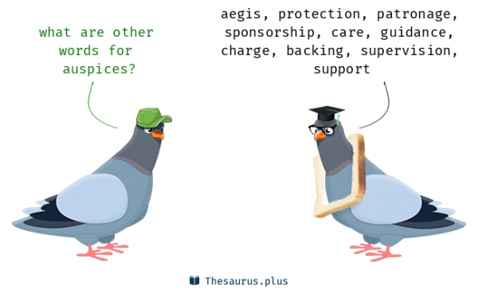 **`av-,avar-,avi-`** = bird, 表示“鸟”。源自拉丁语 avis "bird." **`spice-`** = look, see, 表示“看”，引申为“光谱”。源自拉丁语 specere "to look, to see"。 | **circum-spect** 【ˈsɜːrkəmspekt】 | a. 细心的, 慎重的 推荐：circum-周围 + spect-看。 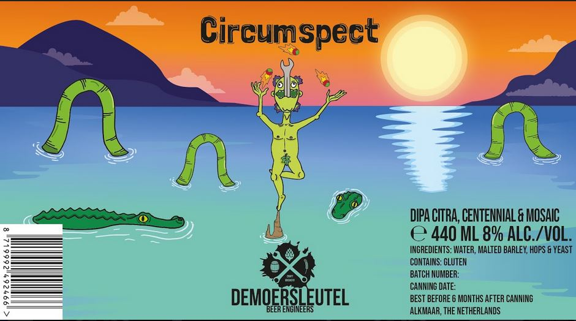 **`circum-`** 表示“环绕，周围”。源自希腊语 kirkos, krikos "a ring." **`spect-`** = look, see, 表示“看”，引申为“光谱”。源自拉丁语 specere "to look, to see"。 词源说明(童理民)   1 - circum-,圈，周围，-spect,看，见 respect,spectator. |
|                               |                                                              |                                         |                                                              |
|                               |                                                              |                                         |                                                              |
|                               |                                                              |                                         |                                                              |

## **`ig-`** = do, act, 表示“做，代理做”，来自拉丁语 agere "actor" ( 按照预先决定的角色) 行动{49}

> 源自拉丁语 agere "to do, act, drive, conduct, lead, weigh."

| 单词                                  | 解释                                                         | 单词                              | 解释                                                         |
| ------------------------------------- | ------------------------------------------------------------ | --------------------------------- | ------------------------------------------------------------ |
| **av-ig-ation** 【ævɪ'ɡeɪʃ(ə)n】 | n. 空中航行, 航空学, 空中领航 推荐：av- + ig-走 + -ation 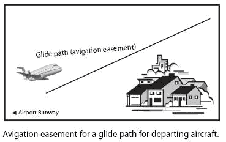 **`av-`** = bird, 表示“鸟”。源自拉丁语 avis "bird." **`ig-`** = do, act, 表示“做，代理做”，来自拉丁语 agere "actor" ( 按照预先决定的角色) 行动。源自拉丁语 agere "to do, act, drive, conduct, lead, weigh." **`-ation`** 表名词，“行为、动作、状态、过程、结果；物品”等。 | **av-ig-ator**  【ævɪɡeɪtə】 | n. 领航员；空中导航 推荐：av-鸟 + ig-走 + -ator 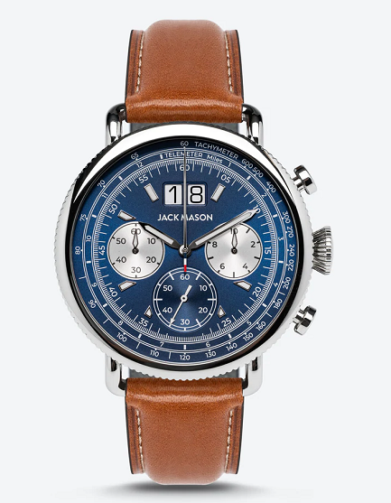 **`av-`** = bird, 表示“鸟”。源自拉丁语 avis "bird." **`ig-`** = do, act, 表示“做，代理做”，来自拉丁语 agere "actor" ( 按照预先决定的角色) 行动。源自拉丁语 agere "to do, act, drive, conduct, lead, weigh." **`-ator`** 表名词，通常由-ate结尾的动词而来，“做事的人或物”。 |
|                                       |                                                              |                                   |                                                              |
|                                       |                                                              |                                   |                                                              |

##  -some ：表形容词，“充满…的，具有…倾向的{48}

| 单词                                      | 解释                                                         | 单词                                     | 解释                                                         |
| ----------------------------------------- | ------------------------------------------------------------ | ---------------------------------------- | ------------------------------------------------------------ |
| **fear-some **           【ˈfɪrsəm】 | fear  n. 恐怖, 害怕, 担心 v. 害怕, 恐惧, 为...担心, 敬畏 making people feel very frightened | **wear∙i∙some**  【ˈwɪrisəm】       | weary  a. 疲倦的, 萎靡的, 厌倦的, 厌烦的 vt. 使疲倦, 使厌烦 vi. 疲乏, 生厌, 不耐烦 that makes you feel very bored and tired |
| adventure-some                            | 冒险性的                                                     | awe-some                                 | 引起敬畏的，可怕的                                           |
| further-some                              | 有利的                                                       | **hand-some**[^4] 【ˈhænsəm】       | 英俊的，大方的，慷慨的，相当可观的  |
| hum-our-some                              | 幽默滑稽的，古怪的                                           | bore-some                                | 烦人的                                                       |
| bother-some                               | 讨厌的                                                       | ful-some                                 | 过度的，过分的，令人生厌的                                   |
| irk-some                                  | 厌恶的，讨厌的令人厌烦的                                     | **loath-some** [^4] 【ˈloʊðsəm】    | a. 讨厌的, 可恶的, 令人憎恶的 推荐：loath【厌恶的】 + -some, 形容词后缀。 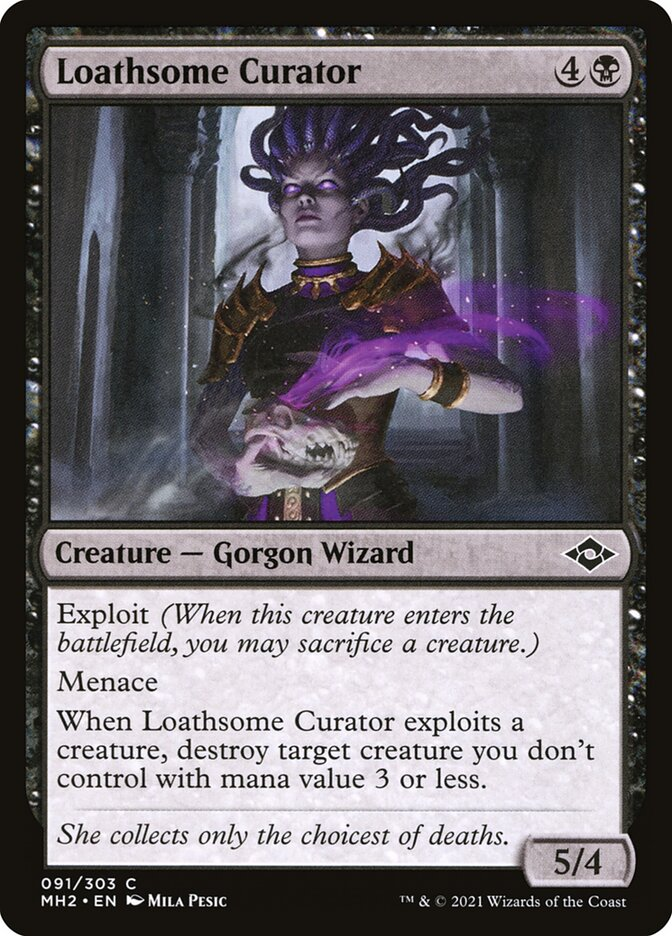 **`loath`** a. 不情愿的, 厌恶的 **`-some`** 表形容词，“充满…的，具有…倾向的”。 词源说明(童理民)   1 - 来自 loath,厌恶的，-some,形容词后缀。 |
| looth-some                                | 讨厌的，令人恶心的，可厌的                                   | plague-some                              | 讨厌的，瘟疫的，麻烦的                                       |
| tire-some                                 | 累人的，烦人的                                               | trouble-some                             | 麻烦的，令人讨厌的                                           |
| worr-i-some                               | 令人烦恼的，麻烦的，劳碌命的                                 | nettle-some                              | 烦人的，容易发怒的                                           |
| pick-some                                 | 吹毛求疵的                                                   | quarrel-some                             | 喜欢争吵的，好争论的                                         |
| mdddle-some                               | 爱管闲事的，好干涉的                                         | **burden-some** [^1] 【ˈbɜːrdnsəm】 | a. 累赘的, 恼人的, 繁重的 推荐：burden【负担】 + -some, 形容词后缀。 **`burden`** n. 负担, 重载, 担子, 责任 vt. 装货于, 烦扰, 使负担 **`-some`** 表形容词，“充满…的，具有…倾向的” |
| lumber-some                               | 沉重的                                                       | cumber-some                              | 笨重的，麻烦的，累赘的                                       |
| toil-some                                 | 费力的，辛苦的                                               | labor-some                               | 费力的，吃力的                                               |
| gamble-some                               | 喜欢赌博/投机的                                              | tangle-some                              | 紊乱的，复杂的                                               |
| un-wholesome                              | 不为什的，不适合健康的                                       | whole-some                               | 有益健康的，合乎卫生的                                       |
| dark-some                                 | 微暗的，阴暗的，阴沉的                                       | dole-some                                | 悲哀的，寂寞的                                               |
| lone-some                                 | 寂寞的                                                       | frolic-some                              | 嬉戏的 爱闹着玩的                                            |
| cuddle-some                               | 可拥抱的，可爱的                                             | blithe-some                              | 愉快的，高兴的                                               |
| game-some                                 | 爱玩耍，快乐的，爱闹着玩的                                   | glad-some                                | 高兴地，快乐的，愉快的                                       |
| light-some                                | 柔软的，勤快的                                               | mettle-some                              | 精神饱满的，有生气的，勇敢的                                 |
| play-some                                 | 爱打趣的，多趣的，开玩笑的                                   | win-some                                 | 引人注目的，迷人的，可爱的                                   |
| tooth-some                                | 可口的，美味的                                               |                                          |                                                              |
| **mettle** 【ˈmetl】                 | n. 气质, 耐力, 勇气 推荐：metal (金属) 的变体，音形义俱通！。  词源说明(童理民)   1 - 来自 metal 的拼写变体。后产生词义上的差别。 | **mettled** 【metld】               | a. 精神饱满的, 有生气的, 勇敢的 推荐：mettle【精神，气概】 + -ed  mettle <n. 气质, 耐力, 勇气 -ed 形容词后缀，加在名词后表示“如...的”；加在动词后表示“被...的”。 |
| **mettle-some ** 【metlsəm】         | a. 精神饱满的, 有生气的, 勇敢的 推荐：mettle【精神，气概】 + -some形容词后缀。  **`mettle`** n. 气质, 耐力, 勇气 **`-some`** 表形容词，“充满…的，具有…倾向的”。 词源说明(童理民)   1 - 来自 mettle,精神，气概，-some,形容词后缀。 |                                          |                                                              |

## `ced-` / `ceed-` / `cess-` = go away; withdraw, yield {45}

>  表示“走开，撤退，屈服” 源自拉丁语 cedere "to go, withdraw, yield."

| 单词                                             | 解释                                                         | 单词                                                 | 解释                                                         |
| ------------------------------------------------ | ------------------------------------------------------------ | ---------------------------------------------------- | ------------------------------------------------------------ |
| **pro-ceed   **               【proʊˈsiːd】 | vi. 继续进行, 进行, 开始, 发出, 起诉 推荐：pro-向前 + ceed-走 → 向前走 → 前进。 **`pro-`** 表示“向前，在前”，变体包括 pur-, por-。 **`ceed-`**  词源说明(童理民)   1 - pro-,向前，-ceed,走，词源同 accede,concede.引申诸相关词义。 | **re-cess **               【ˈriːses , rɪˈses】 | n. 休息, 休会, 放假, 凹进处, 深处 vt. 使凹进 vi. 休假, 休息 推荐：re-回 + cess-走 → 回到停止状态 → 休息。 **`re-`** 表示“向后，往回，相反，相对，再”，或仅作强调用，在元音前 red-, reh-。源自拉丁语 re-, red- "backward, again." **`cess-`** = go away; withdraw, yield, 表示“走开，撤退，屈服”。源自拉丁语 cedere "to go, withdraw, yield." 词源说明(童理民)   1 - 来自 recede,后退，-ss,过去分词格。此处形容词作名词，引申诸相关词义。 |
| **inter-cess-or**  【ˌɪntə'sesə】           | n. 仲裁者, 调解人 推荐：inter-在…中间 + cess-走 + -or, 表人。 **`inter-`** 表示“在…之间，相互，内”。由 in- + ter-（土地）组成。在医学领域 enter- 表示“小肠”，已单独列出。 **`cess-`** = go away; withdraw, yield, 表示“走开，撤退，屈服”。源自拉丁语 cedere "to go, withdraw, yield." **`-or`** 表示“人或物”，是施动者名词。是拉丁语后缀 -tor 的俗化（可能受英语本土后缀 -er 的影响）形式。 | **cess-ion **          【ˈseʃn】                | n. 割让, 转让 推荐：cess-走，离开 + -ion，此处词义进一步强调为投降，割让。 **`cess-`** = go away; withdraw, yield, 表示“走开，撤退，屈服”。源自拉丁语 cedere "to go, withdraw, yield." **`-ion`** 表名词，“行为、动作、状态、过程、结果；物品”等。 词源说明(童理民)   1 - 来自 cede,走，离开，词源同 cease,cessation.此处词义进一步加强为投降，割让。 |
| **in∙cess∙ant** 【ɪnˈsesnt】                | a. 不断的, 不绝的, 无尽的 推荐：in-不，非 + cess-走，离开 + -ant即不离开的，不停止的。 **`in-`** 表示“无，没有（not,opposite）”，来自拉丁语 in-。 **`cess-`** = go away; withdraw, yield, 表示“走开，撤退，屈服”。源自拉丁语 cedere "to go, withdraw, yield." **`-ant`** 表形容词，“…的”。 词源说明(童理民)   1 - in-,不，非，-cess,走，离开，词源同 cease,concession.即不离开的，不停止的。 | **in∙cess∙ancy**  【ɪn'sesnsɪ】                 | n. 不间断性 推荐：in-不，非 + cess-走，离开 + -ancy, 表名词 **`in-`** 表示“无，没有（not,opposite）”，来自拉丁语 in-。 **`cess-`** = go away; withdraw, yield, 表示“走开，撤退，屈服”。源自拉丁语 cedere "to go, withdraw, yield." **`-ancy`** = -ance, 表示“性质，状况”。 |
| **cess∙pool**  【ˈsɛˌspul】                 | n. 污水坑, 化粪池 推荐：cess-离开 + pool【池】  cess- = go away; withdraw, yield, 表示“走开，撤退，屈服”。源自拉丁语 cedere "to go, withdraw, yield." **pool** n. 池, 水塘, 石油层, 撞球, 联营 vt. 合伙经营, 共享, 采掘, 汇聚成 vi. 汇合成塘, 淤积, 联营 词源说明(童理民)   1 - 可能来自 recess 和 pool 的合成词。 | **cess-pit** 【ˈsespɪt】                        | n. 粪坑, 垃圾坑 推荐：cess-离开 + pit【坑】  **`cess-`** = go away; withdraw, yield, 表示“走开，撤退，屈服”。源自拉丁语 cedere "to go, withdraw, yield." **pit** n. 深坑, 矿井, 果核, 地窖, 深渊, 绝境, 陷阱 vt. 窖藏, 使凹下, 使有麻点, 去...之核, 使留疤痕, 使相斗, 使竞争 vi. 起凹点, 凹陷 词源说明(童理民)   1 - 来自 cesspool 和 pit 的合成词。 |
| an-cest-or                                       | 祖先，祖宗                                                   | ancest-ry                                            | 祖先，世系，名门出身                                         |
| ante-cess-or                                     | 先行者，先驱者                                               | pre-de-cess-or                                       | 前任，先辈，前身                                             |
| ante-cede                                        | 在....之前，居...之先                                        | abs-cess                                             | 脓肿                                                         |
| cess-ation                                       | 停止                                                         | ceas-e                                               | 停止                                                         |
| cess-er                                          | 期限，责任的终止                                             | ced-e                                                | 割让                                                         |
| se-ced-e                                         | 正式脱离/退出，分离                                          | se-cess-ion                                          | 脱离，分离                                                   |
| ex-ceed                                          | vt. 超过，超越，胜过                                         | ex-cess                                              | n. 过度，剩余,超过，超额                                     |
| ne-cess-ary                                      | a. 必要的，必然的 n. 必需品                                  | ne-cee-it-arian                                      | 必然论的                                                     |
| ne-cess-itous                                    | 贫乏的，贫苦的，紧迫的，必须的                               | ac-cess                                              | 通道，入口，使用权                                           |
| suc-ceed                                         | 成功，继承，继续                                             | suc-cess-ion                                         | 先行，优先                                                   |
| suc-cess-ive                                     | 继承的，连续的                                               | pre-cess-ion                                         | 优先，优先权                                                 |
| ac-ced-e                                         | 同意，正式加入，就任，继任                                   | a-ced-ia                                             | 倦怠，漠然                                                   |
| **in-cess-ant** 【ɪnˈsesnt】                | a. 不断的, 不绝的, 无尽的 推荐：in-不，非 + cess-走，离开 + -ant即不离开的，不停止的。 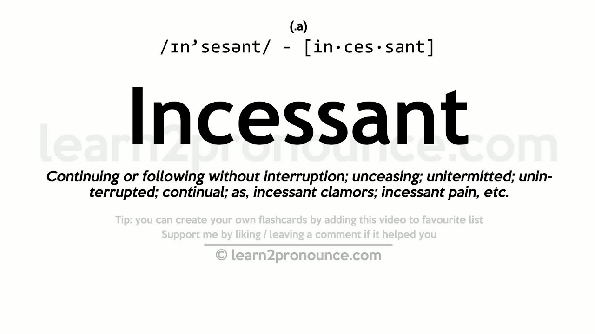 **`in-`** 表示“无，没有（not,opposite）”，来自拉丁语 in-。 **`cess-`** = go away; withdraw, yield, 表示“走开，撤退，屈服”。源自拉丁语 cedere "to go, withdraw, yield." **`-ant`** 表形容词，“…的”。 词源说明(童理民)   1 - in-,不，非，-cess,走，离开，词源同 cease,concession.即不离开的，不停止的。 |                                                      |                                                              |

## chro- = color, 表示“颜色”{44}

| 单词               | 解释                                                         | 单词 | 解释 |
| ------------------ | ------------------------------------------------------------ | ---- | ---- |
| **xantho-chro-ic** | a. 白种人的(高加索人种) another name for [xanthochroid](https://www.collinsdictionary.com/zh/dictionary/english/xanthochroid) 推荐：xantho-黄色 + chro-颜色 + -ic  **`xantho-`** = yellow, 表示“黄色”。 **`chro-`** = color, 表示“颜色”。 **`-ic`** 表形容词，“…的”。 |      |      |
|                    |                                                              |      |      |
|                    |                                                              |      |      |

## posit- = put, 表示“放”。源自拉丁语 positionem "act or fact of placing, situation, position, affirmation." {44}

| 单词                           | 解释                                                         | 单词 | 解释 |
| ------------------------------ | ------------------------------------------------------------ | ---- | ---- |
| **re-posit** 【rɪ'pɒzɪt】 | vt. 贮藏, 使复位 推荐：re-重新 + posit-放  **`re-`** 表示“向后，往回，相反，相对，再”，或仅作强调用，在元音前 red-, reh-。源自拉丁语 re-, red- "backward, again." **`posit-`** = put, 表示“放”。源自拉丁语 positionem "act or fact of placing, situation, position, affirmation." 更多同源词... |      |      |
|                                |                                                              |      |      |
|                                |                                                              |      |      |

## -ile 表形容词，“…的”。源自拉丁语 -ilis, adjective suffix.{43}

| 单词                           | 解释                                                         | 单词                           | 解释                                                         |
| ------------------------------ | ------------------------------------------------------------ | ------------------------------ | ------------------------------------------------------------ |
| **serv-ile** 【ˈsɜːvaɪl】 | a. 奴隶的, 奴性的, 卑屈的 推荐：serv-服务 + -ile, 表形容词 → 为[主人]服务的 → 奴隶的。  **`serve`**  vt. 可作...用, 服务, 经历, 招待, 供应, 送交, 对待  vi. 服务, 服役, 侍应, 适合, 有用, 开球 n. 发球, 轮到发球 **`-ile`** 表形容词，“…的”。源自拉丁语 -ilis, adjective suffix. 词源说明(童理民)   1 - 来自拉丁语 servus,奴隶，奴仆，词源同 serve,服侍。-ile,形容词后缀。申词义奴性的。 | **rept-ile** 【ˈreptaɪl】 | n. 爬行动物, 爬虫, 卑鄙的人 a. 爬行的, 爬虫类的, 卑鄙的 推荐：rept-爬行 + -ile。 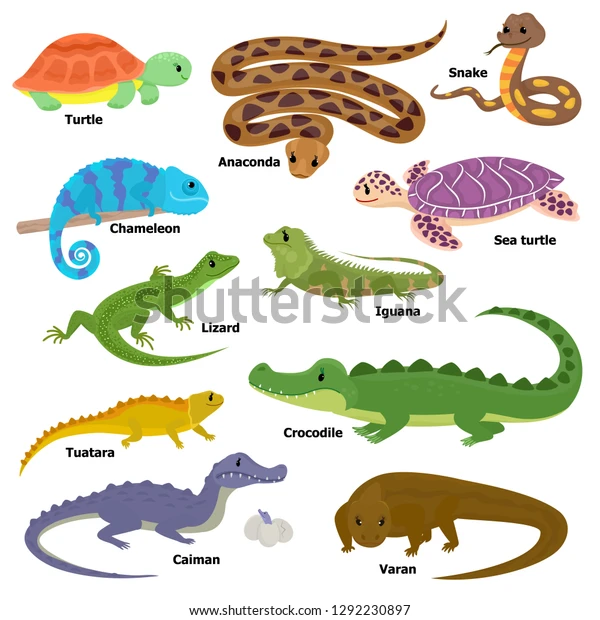 **`rept-`** = creep, 表示“爬”。源自拉丁语 repere "to creep." **`-ile`** 表形容词，“…的”。源自拉丁语 -ilis, adjective suffix.               词源说明(童理民)   1 - 来自拉丁语 rep |
| **fert-ile** 【ˈfɜːtaɪl】 | a. 可繁殖的, 肥沃的, 生产多的 推荐：fert-=fer-带来 + -ile, 表形容词 → 能带来粮食 → 肥沃的。 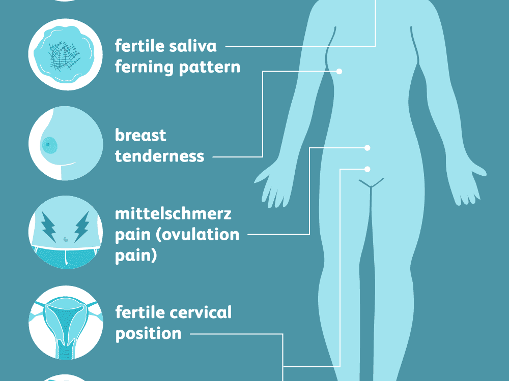 **`fer-`** = bring, carry, 表示“带来，拿来”。源自拉丁语 ferre "to bear, carry"  **`-ile`** 表形容词，“…的”。源自拉丁语 -ilis, adjective suffix. 词源说明(童理民)   1 - 来自 fer-,带来，携带，词源同 bring,infer.引申词义肥沃的，多产的。 |                                |                                                              |
|                                |                                                              |                                |                                                              |

## -dom 名词后缀，表示“身份”,“地位”,“职务”,“职位”,“统治”,“界”,“领域”等，表示抽象的状态和情况{41}

> 源自古英语 -dom, abstract suffix indicating "state, condition, or power."

| 单词                                              | 解释                                                         | 单词                             | 解释                                                         |
| ------------------------------------------------- | ------------------------------------------------------------ | -------------------------------- | ------------------------------------------------------------ |
| **star-dom** 【ˈstɑːrdəm】                   | n. 明星身份, 明星们 推荐：star【星】 + dom名词后缀，表身份。  **`star`**  **`-dom`**  词源说明(童理民)   1 - star,明星，-dom,表状态。 | **serf-dom** 【ˈsɜːrfdəm】  | n. 农权制, 农奴地位, 农奴境遇, 奴役 推荐：serf【农奴】 + -dom表状态。引申词义农奴制。  serf n. 农奴, 奴隶, 服苦役的人 -dom 名词后缀，表示“身份”,“地位”,“职务”,“职位”,“统治”,“界”,“领域”等。 源自古英语 -dom, abstract suffix indicating "state, condition, or power." |
| **whoredom** 【hɔːdəm】                      | 卖淫，通奸；偶像崇拜 offering sexual intercourse for pay | **king-dom**  【ˈkɪŋdəm】   | n. 王国, 领域 缩写自古英语 cyningdom,王国，对应于 king,君王，-dom,抽象名词后缀，来自 PIE*dhe,放置，建立，词源同 do. 推荐：king【n. 国王, 君主】 + -dom表名词  king n. 国王, 君主 vt. 使...成为君主 vi. 君临, 统治 -dom 名词后缀，表示“身份”,“地位”,“职务”,“职位”,“统治”,“界”,“领域”等。源自古英语 -dom, abstract suffix indicating "state, condition, or power." |
| **Yankee-dom** 【ˈjæŋkidəm】                 | . 美国, 美国佬, 美国人, 扬基国 推荐：Yankee【美国的北方人】 + -dom抽象名词后缀。 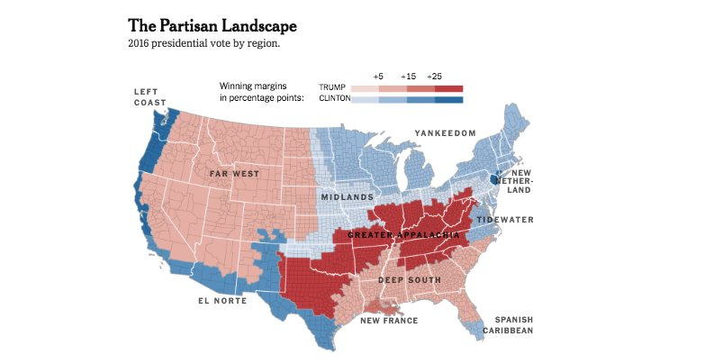 Yankee n. (美国的)新英格兰人, (美国)北方诸州的人, 美国佬 -dom 名词后缀，表示“身份”,“地位”,“职务”,“职位”,“统治”,“界”,“领域”等。源自古英语 -dom, abstract suffix indicating "state, condition, or power." | **queen-dom ** 【kwiːndəm】 | n. 女王统治的王国, 女王的地位, 女王的身份, 王后的地位, 王后的身份 推荐：queen【女王】 + -dom抽象名词后缀。  queen n. 王后, 女王 vt. 立为女王 vi. 做女王 -dom 名词后缀，表示“身份”,“地位”,“职务”,“职位”,“统治”,“界”,“领域”等。源自古英语 -dom, abstract suffix indicating "state, condition, or power." |
| [Pingdome](https://en.wikipedia.org/wiki/Pingdom) | [Easy and Affordable End-User Experience Monitoring.](https://www.pingdom.com/) Complete monitoring combines synthetic and real user monitoring for ultimate visibility and enhanced troubleshooting. Monitor both from a single pane of glass with SolarWinds® Pingdom®. |                                  |                                                              |

摩西英语(摩西)

kingdom ['kɪŋdəm] n.王国；界；领域。后缀-dom与词根dom-表统治无关，**它表抽象的状态和情况**，与doom [duːm] n.厄运；死亡；判决；世界末日，vt.注定；判决；使失败，有关，kingdom的字面意为“the realm of the king’s judgement”。whoredom ['hɔːdəm] n.卖淫；通奸，与统治有半毛钱的关系？ 

## mal- = bad, wretched, 表示“坏，恶” {41}

| 单词                                                    | 解释                                                         | 单词                                                 | 解释                                                         |
| ------------------------------------------------------- | ------------------------------------------------------------ | ---------------------------------------------------- | ------------------------------------------------------------ |
| dis-mal                                                 |                                                              | mal-ice                                              |                                                              |
| mal-function                                            |                                                              | mal-adapt-ive                                        |                                                              |
| **mal-ison   **                         【mælɪzn】 | n. 诅咒, 咒骂 单词笔记   ［添加］ **`mal-`** = bad, wretched, 表示“坏，恶”。源自拉丁语 malus "bad, male, ill." |                                                      |                                                              |
| mal-nourish-ed                                          |                                                              | mala-dict-ion                                        |                                                              |
| mal-adjust-ed                                           |                                                              | mal-administer                                       |                                                              |
| mal-adroit                                              |                                                              | mal-apportion-ed                                     |                                                              |
|                                                         |                                                              | mal-aprop                                            |                                                              |
| mal-ism 【meɪlɪzm】                                | The evil of the world(现世邪恶说)                            | male-dict-ory                                        |                                                              |
| mal-afct-ion                                            |                                                              | male-vol-ence                                        |                                                              |
| mal-feas-ant                                            |                                                              | mal-feasance                                         |                                                              |
| mal-treat                                               |                                                              | mal-aise                                             |                                                              |
| mal-odour                                               |                                                              | mal-odor                                             | **`odor`** n. 气味, 香味, 名声, 意味                         |
| **mal-aise** 【məˈleɪz】                           | n. (广泛存在的)难以捉摸的问题，无法描述的问题;莫名的不适(或不快、不满等) 推荐：mal-坏的，不良的 + aise "ease", 轻松，简单，和 ease 同源。 **`mal-`** = bad, wretched, 表示“坏，恶”。源自拉丁语 malus "bad, male, ill." 词源说明(童理民)   1 - 来自古法语 malaise,困难，忍受，痛苦，来自 mal-,坏的，不良的，aise,轻松，简单，词源同ease,disease.引申词义生病，不适，不舒服。 | **mal-ady                        ** 【ˈmælədi】 | n. 病, 疾病, 弊病 **`mal-`** = bad, wretched, 表示“坏，恶”。源自拉丁语 malus "bad, male, ill." 词源说明(童理民)   1 - 来自古法语 malade,病的，病态的，来自拉丁语 male habitus,感觉病恹恹的，情况不好的，来自 male,坏的，habitus,持，握，习惯，词源同 habit,habitable.引申词义坏习惯，痼疾，疾病等。 |
|                                                         |                                                              |                                                      |                                                              |

## circum- 表示“环绕，周围”。源自希腊语 kirkos, krikos "a ring." {40}

| 单词                                    | 解释                                                         | 单词 | 解释 |
| --------------------------------------- | ------------------------------------------------------------ | ---- | ---- |
| **circum-spect** 【ˈsɜːrkəmspekt】 | a. 细心的, 慎重的 推荐：circum-周围 + spect-看。  **`circum-`** 表示“环绕，周围”。源自希腊语 kirkos, krikos "a ring." **`spect-`** = look, see, 表示“看”，引申为“光谱”。源自拉丁语 specere "to look, to see"。 词源说明(童理民)   1 - circum-,圈，周围，-spect,看，见 respect,spectator. |      |      |
|                                         |                                                              |      |      |
|                                         |                                                              |      |      |

## cip- / cipt- = head, 表示“头”。源自拉丁语 caput "head" {40}

英语中有为数不少的词，其终极词源可以一直追溯到拉丁语**caput**（头），**capital**即为其中之一。它来自**caput**的派生词***capitālis 'of the head'***，因此最初也表示“头的”。

英国诗人弥尔顿（John Milton, 1608-1674）在长诗《失乐园》中写了(Serpent's) capital bruise（头部的伤痕）这样的字句，其中**capital**一词即含此义。

**capital**的几个常用词义均与“头”有联系。旧时一个人犯了**capital crime**（死罪）被判以**capital sentence**（死刑）或被处以**capital punishment**（极刑），不是被砍头就是被绞死。

**capital letter**（大写字母）一般多位于句首和词首。**capital**还用以指“首都”、“首府”，该用法出自弥尔顿笔下，始见于《失乐园》。

**capital**用以指“资本”则始于用牛的头数计算财富的时代，但这一用法直至18世纪才通用起来。

除了capital，源自拉丁语**caput**的英语常用词还有

- **cape**（海角）

- **captain**（队长，船长）

- **decapitate**（斩首）

- **chapter**（章，回）

- **precipice**（悬崖）

  > pre-,在前，-cip,头，词源同 cap,captain.即头在前，一头栽下，引申词义陡坡，陡崖，悬崖等。

- **precipitate**（突然下降；促成；沉淀）等。

**摩西英语(摩西)**

chaperon这个单词与cap棒球帽、cape袍子、escape逃脱（run out of the cape）、chief主要的、chieftain酋长、captain队长、capital首都以及chef厨师长（head cooker）和chattel动产；奴隶（财富的体现，论“头”数）等同根，而这个词根与head同源。袍子或斗篷等，或者有一个帽兜来盖头，或从头套着穿。

| 单词                                    | 解释                                                         | 单词                                   | 解释                                                         |
| --------------------------------------- | ------------------------------------------------------------ | -------------------------------------- | ------------------------------------------------------------ |
| **pre∙cip∙ice** 【ˈpresəpɪs】      | n. 悬崖, 绝壁, 险境 推荐：pre-前 + cip-头 + -ice → 前面是尽头 → 悬崖。  **`pre-`** 表示“…前的，预先”，来自拉丁语，一般放在动词性词根前。 **`cip-`** = head, 表示“头”。源自拉丁语 caput "head" **`-ice`** 表名词，“行为，状态”。 | **pre∙cipit∙ous** 【prɪˈsɪpɪtəs】 | a. 陡峭的, 轻率的 推荐：pre-在前 + cipit-头 + -ous形容词后缀。引申词义陡峭的，仓促的，贸然的。  **`pre-`** 表示“…前的，预先”，来自拉丁语，一般放在动词性词根前。 **`cipit-`** = head, 表示“头”。源自拉丁语 caput "head" **`-ous`** 表形容词，表示“…的”，用于化学领域表示“亚酸的，低价（金属）的”。 词源说明(童理民)   1 - 来自 precipitate,一头栽下，-ous,形容词后缀。引申词义陡峭的，仓促的，贸然的。 |
| **pre∙cipit∙ant** 【prɪ'sɪpɪtənt】 | a. 突如其来的, 勇往直前的, 急促的, 径直向下的 n. 沉淀剂  **`pre-`** 表示“…前的，预先”，来自拉丁语，一般放在动词性词根前。 **`cipit-`** = head, 表示“头”。源自拉丁语 caput "head" **`-ant`** 表形容词，“…的”。 -ant 表名词，“…剂”。 | **caps-ize** 【ˈkæpsaɪz】         | v. 翻覆, 倾覆 推荐：caps-头 + -ize, 表动词。即头往下栽的。  **`cap-,cipit-`** = head, 表示“头”。源自拉丁语 caput "head" **`-ize`** 动词后缀，一般缀于形容词后。-ise 是英式英语，-ize 是美式英语。源自希腊语 -izein, verbal suffix. 词源说明(童理民)   1 - 可能来自 cap-,头，见 captain,拼写受 size 俗化。即头往下栽的。 |
| **cheif-tain**  【ˈtʃiːftən】      | n. 酋长, 首领 推荐：chief【领袖】 + -tain  **`-ain`** 表名词，“…人”。 **`chief`** n. 领袖, 酋长, 长官, 主要部分 a. 主要的, 首位的 词源说明(童理民)   1 - 来自 chief,主要的。 |                                        |                                                              |

## pel-  / puls- = drive, push, 表示“驱动，推”{35}

> 源自拉丁语 pellere "to push, drive, strike," appellare "to drive to."

| 单词                                       | 解释                                                         | 单词                                                | 解释                                                         |
| ------------------------------------------ | ------------------------------------------------------------ | --------------------------------------------------- | ------------------------------------------------------------ |
| **ex-pel **               【ɪkˈspel】 | vt. 驱逐, 逐出, 排出, 开除 推荐：ex-出 + pel-推 → 推出 → 开除。 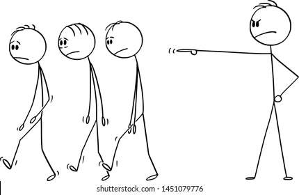 ex- 表示“从，从...离开，从...向外，向外，向上”，来自PIE *eghs, 向外。 pel- = drive, push, 表示“驱动，推”。源自拉丁语 pellere "to push, drive, strike," appellare "to drive to." 词源说明(童理民)   1 - ex-,向外，-pel,驱使，词源同 pulse,impel. | **ex-puls-ion                 ** 【ɪkˈspʌlʃn】 | n. 逐出, 开除, 驱逐, 排气 推荐：ex-出 + puls-推 + -ion, 表名词 → 推出去 → 驱逐。 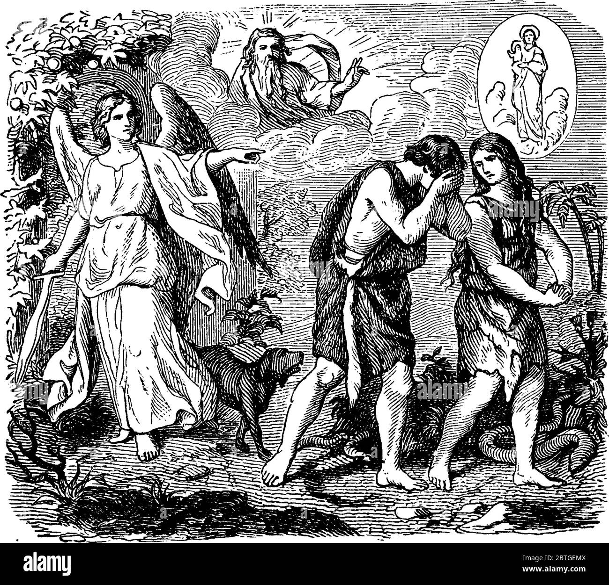 ex-  表示“从，从...离开，从...向外，向外，向上”，来自PIE *eghs, 向外。 puls- = drive, push, 表示“驱动，推”。源自拉丁语 pellere "to push, drive, strike," appellare "to drive to." -ion 表名词，“行为、动作、状态、过程、结果；物品”等。 词源说明(童理民)   1 - 来自 expel,驱逐。 |
|                                            |                                                              |                                                     |                                                              |
|                                            |                                                              |                                                     |                                                              |

## -arian 表形容词或名词，“…的(人)” {35}

| 单词                             | 解释                                                         | 单词                                    | 解释                                                         |
| -------------------------------- | ------------------------------------------------------------ | --------------------------------------- | ------------------------------------------------------------ |
| **agr-arian** 【əˈɡreriən】 | a. 土地的, 耕地的 推荐：agr-土地 + -arian表形容词 → 土地的。 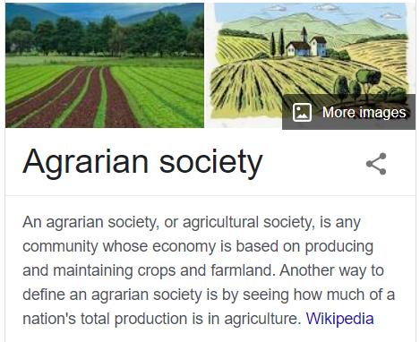 agr- = field, land, 表示“田地，农业”等。源自希腊语 agros "field," 同时通过拉丁语进入英语。 -arian 表形容词或名词，“…的(人)”。 词源说明(童理民)   1 - agra-,农业，来自 ag-,做，词源同 act,agent. | **mill-en-arian** 【ˌmɪlɪˈneriən】 | a. 千禧年的, 一千年的 n. 千禧年信徒 推荐：mill-千 + en-年 + -arian , 人。  **`ann-,enn-`** = year, 表示“年，一年”。源自拉丁语 annus "year." **`mill-`** 表示“千，千分之一”。源自拉丁语 mille "thousand." **`-arian`** 表形容词或名词，“…的(人)”。 |
|                                  |                                                              |                                         |                                                              |
|                                  |                                                              |                                         |                                                              |

## lect-

### 1. = choose, gather, 表示“选择，收集”{34}

> 源自拉丁语 legere "to gather, choose, pluck, read."

| 单词                                          | 解释                                                         | 单词                                                   | 解释                                                         |
| --------------------------------------------- | ------------------------------------------------------------ | ------------------------------------------------------ | ------------------------------------------------------------ |
| **col-lect              **   【kəˈlekt】 | v. 收集, 聚集, 集中, 搜集 a. 由收到者付款的 ad. 由收到者付款地 推荐：col-共同 + lect-选择 → 放在一起选择 → 收集。  **`col-`** 来自拉丁语介词com，表示“与...一起，一起（with, together）”，或仅做强调。源自拉丁语 com "with (collective and intensive prefix.)" **`lect-`** = choose, gather, 表示“选择，收集”。源自拉丁语 legere "to gather, choose, pluck, read." 词源说明(童理民)   1 - col-,表强调，-lect,收集，选出，词源同 elect,college. | **ec-lect-ic**                      【ɪˈklektɪk】 | n. 折衷主义者 a. 选择的, 折衷的 推荐：ec-向外 + lect-收集 + -ic。 **`ec-`** 表示“从，从...离开，从...向外，向外，向上”，来自PIE *eghs, 向外。 **`lect-`** = choose, gather, 表示“选择，收集”。源自拉丁语 legere "to gather, choose, pluck, read." **`-ic`** 表形容词，“…的”。 词源说明(童理民)   1 - ec-,向外，-lect,选，收集，词源同 elect,collect. |
|                                               |                                                              |                                                        |                                                              |
|                                               |                                                              |                                                        |                                                              |

### 2. = speak, read, 表示“讲，读” {13}

> 源自希腊语 legein "to gether, speak."

| 单词                           | 解释                                                         | 单词 | 解释 |
| ------------------------------ | ------------------------------------------------------------ | ---- | ---- |
| **lect-ern** 【ˈlektərn】 | n. 诵经台 推荐：lect-读 + -ern  lect- = speak, read, 表示“讲，读”。源自希腊语 legein "to gether, speak." -ern 表名词，“…场所”。 词源说明(童理民)   1 - 来自拉丁语 legere,读，词源同 lecture.原指教堂的读经台，后用来指讲台。 |      |      |
|                                |                                                              |      |      |
|                                |                                                              |      |      |

## eu- 表示“好，优秀”。源自希腊语 eu- " {34}

| 单词                                 | 解释                                                         | 单词 | 解释 |
| ------------------------------------ | ------------------------------------------------------------ | ---- | ---- |
| **eu-karyo-te**  【jʊ'kærɪəʊt】 | n. 真核细胞（等于eucaryote） 推荐：eu-好 + karyo-核 + -ote  **`eu-`** 表示“好，优秀”。源自希腊语 eu- "well." **`karyo-`** 表示“核”，生物学前缀。源自希腊语 karyon "nut, kernel," |      |      |
|                                      |                                                              |      |      |
|                                      |                                                              |      |      |

## loqu- = speak, 表示“说话”。源自拉丁语 loqui "to speak."{34}

| 单词                                                         | 解释                                                         | 单词                                          | 解释                                                         |
| ------------------------------------------------------------ | ------------------------------------------------------------ | --------------------------------------------- | ------------------------------------------------------------ |
| **col-loq**                                                  | n. 口语, 口语用法, 口语词, 方言, 口语体 a. 口语的, 非正式的, 用通俗口语的, 会话的 **`loqu-,locu-`** = speak, 表示“说话”。源自拉丁语 loqui "to speak." **`col-`** 来自拉丁语介词com，表示“与...一起，一起（with, together）”，或仅做强调。源自拉丁语 com "with (collective and intensive prefix.)" | **col-loqu-ia**     【kəˈləʊkwiəm】      | n. (学术)讨论会, (学术讨论会上的)报告（colloquium的复数） **`col-`** 来自拉丁语介词com，表示“与...一起，一起（with, together）”，或仅做强调。源自拉丁语 com "with (collective and intensive prefix.)" **`loqu-`** = speak, 表示“说话”。源自拉丁语 loqui "to speak."  |
| **col-loqu-ial**                         【kəˈloʊkwiəl】 | a. 会话的, 口语的, 口语体的 推荐：col-共同 + loqu-说 + -ial表形容词 → 共同说 → 口语。  **`col-`** 来自拉丁语介词com **`loqu-`** = speak, 表示“说话”。源自拉丁语 loqui "to speak." **`-ial`** 表形容词，“…的”，一般缀于名词后。源自拉丁语 -alis, adjective suffix. 词源说明(童理民)   1 - col-,表强调，-loq,说话，词源同 locution,loquacious. | **col-loqu-qal-sim** 【kəˈloʊkwiəlɪzəm】 | n. 口语, 口语用法, 口语词, 方言, 口语体 推荐：colloquial【口语的】 + -ism  **`colloquial`** a. 会话的, 口语的, 口语体的 **`-ism`** 抽象名词后缀，表示“…主义”；“宗教”；“制度、行为”；“…学”、“…术”、“…论”、“…法”；“疾病名称”；“情况、状态”等。 |
|                                                              |                                                              |                                               |                                                              |

 

## flu- = flow, 表示“流动”。源自拉丁语 bluere "to flow."{34}

| 单词                    | 解释                                                         | 单词 | 解释 |
| ----------------------- | ------------------------------------------------------------ | ---- | ---- |
| **flux** 【flʌks】 | n. 流出, 涨潮, 变迁 vi. 熔化, 流出 vt. 使熔融 推荐：flu-流。来自拉丁语fluere, 流动，引申持续流动，改变，变迁。  **`flu-`** = flow, 表示“流动”。源自拉丁语 bluere "to flow." 词源说明(童理民)   1 - 来自拉丁语 fluere,流动，词源同 fluent.引申词义流动，变迁。 |      |      |
|                         |                                                              |      |      |
|                         |                                                              |      |      |

## lav- = wash, 表示“洗，冲洗”。源自拉丁语 lavere "to wash," lavare "to wash." {34}

| 单词                              | 解释                                                         | 单词 | 解释 |
| --------------------------------- | ------------------------------------------------------------ | ---- | ---- |
| **lav-atory** 【ˈlævətɔːri】 | n. 洗脸盆, 厕所 推荐：lav-冲洗 + -atory场所 → 冲洗的地方 → 洗手间。  **`lav-`** = wash, 表示“洗，冲洗”。源自拉丁语 lavere "to wash," lavare "to wash." **`-atory`** 表名词，指场所等。 |      |      |
|                                   |                                                              |      |      |
|                                   |                                                              |      |      |

## course- = run, 表示“跑，发生”。源自拉丁语 currere "to run." {33}

| 单词                              | 解释                                                         | 单词                                   | 解释                                                         |
| --------------------------------- | ------------------------------------------------------------ | -------------------------------------- | ------------------------------------------------------------ |
| **re-course ** 【ˈriːkɔːrs】 | n. 求援, 求助, 追索权 推荐：re-回 + course【路线】 → 跑回来 → 求助。  **`re-`** 表示“向后，往回，相反，相对，再”，或仅作强调用，在元音前 red-, reh-。源自拉丁语 re-, red- "backward, again." **`course-`** = run, 表示“跑，发生”。源自拉丁语 currere "to run." 词源说明(童理民)   1 - re-,向后，往回，-cour,跑，词源同 course,current.即跑回来，引申词义求助，依靠。 | **inter-course ** 【ˈɪntərkɔːrs】 | n. 交际, 交往; 性交 推荐：inter-在…之间 + course跑 → 在二者之间跑 → 交流。  **`inter-`** 表示“在…之间，相互，内”。由 in- + ter-（土地）组成。在医学领域 enter- 表示“小肠”，已单独列出。 **`course-`** = run, 表示“跑，发生”。源自拉丁语 currere "to run." 词源说明(童理民)   1 - inter-,在内，在中间，相互，course,跑动，跑道。即跑到一起，引申词义交际，性交。 |
|                                   |                                                              |                                        |                                                              |
|                                   |                                                              |                                        |                                                              |

## pens- = weight, expend, 表示“称重量，称银子”，引申为“花费”，还表示思考，我们购物的时候不是要比较和考虑么。{32}

| 单词                                         | 解释                                                         | 单词                                                         | 解释                                                         |
| -------------------------------------------- | ------------------------------------------------------------ | ------------------------------------------------------------ | ------------------------------------------------------------ |
| **pens-ion**                【ˈpenʃn 】 | n. 养老金, 退休金, 津贴, 年金, 抚恤金, 膳宿学校, 膳宿费 vt. 发给退休金, 用津贴拉拢 推荐：pens-花费 + -ion, 表名词 → 用心花费的。  **`pens-`** = weight, expend, 表示“称重量，称银子”，引申为“花费”，还表示思考，我们购物的时候不是要比较和考虑么。 **`-ion`** 表名词，“行为、动作、状态、过程、结果；物品”等。 词源说明(童理民)   1 - 来自拉丁语 pendere,悬挂，称量，支付，词源同 pendulum,dependent,pound.-s,过去分词格。引申词义定期支付的钱，养老金。 2 - 来自拉丁语 pendere,悬挂，称量，支付，词源同 pendulum,dependent,pound.-s,过去分词格。引申词义定期支付的钱，后用于指寄宿学校，现用于指法国等国家的廉价小旅店。 | **com-pend-ium**                            【kəmˈpendiəm】 | n. 纲要, 概略 推荐：com-强调 + pend-悬垂，称量 + -ium → 即挂到一起的，汇编。                                                           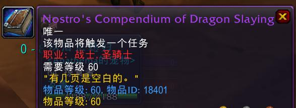 **`com-`** 来自拉丁语介词com，表示“与...一起，一起（with, together）”，或仅做强调。源自拉丁语 com "with (collective and intensive prefix.)" **`pend-`** = weight, expend, 表示“称重量，称银子”，引申为“花费”，还表示思考，我们购物的时候不是要比较和考虑么。 词源说明(童理民)   1 - com-,表强调，-pend,悬垂，称量，词源同 pendulum,pound .即挂到一起，汇编。 |
| **dis-pens-atory ** 【dɪs'pensətərɪ】   | n. 药房，处方集，药典 推荐：dispense 【分发】+ -atory  **`dis-`** 来自拉丁语dis-，表示“分开，散开”，引申词义“离开，无，没有，缺乏，表相反等” **`pens-`** = weight, expend, 表示“称重量，称银子”，引申为“花费”，还表示思考，我们购物的时候不是要比较和考虑么。 **`-atory`** 表名词，指场所等。 |                                                              |                                                              |
|                                              |                                                              |                                                              |                                                              |

## gn-,gnos-,gnor- 30= know, 表示“知道”{30}

> 源自拉丁语 (g)noscere "to get to know."

| 单词                           | 解释                                                         | 单词                            | 解释                                                         |
| ------------------------------ | ------------------------------------------------------------ | ------------------------------- | ------------------------------------------------------------ |
| **narr-ate**  【ˈnæreɪt】 | v. 说故事, 说明, 叙述 推荐：na-=gno-知道 + -r(r)拉丁语现在不定式格 + -ate, 表动，词引申词义叙述，告知。  **`-ate`** 表动词，“做，造成”。 **`gn-,gnos-,gnor-`** 30= know, 表示“知道”。源自拉丁语 (g)noscere "to get to know." 词源说明(童理民)   1 - 来自拉丁语 narrare,告知，解释，来自 PIE*gno,去知道，了解， 词源同 can,know.引申词义叙述，告知。字母 g 脱落，-r,拉丁语现在不定式格，比较 affair,fact. | **narrator** 【ˈnæreɪtər】 | n. 讲述者, 叙述者 推荐：narrate【叙述】 + -or, 表人，是单词narrate 派生的动作执行者（施动）名词。  narrate v. 说故事, 说明, 叙述 -or 表示“人或物”，是施动者名词。是拉丁语后缀 -tor 的俗化（可能受英语本土后缀 -er 的影响）形式。 切换词根显示方式 词源说明(童理民)   1 - 来自 narrate,叙述。 |
| **keen**[^1] 【kiːn】     | a. 敏锐的; 强烈的; 敏捷的; 热心的; 着迷的; 渴望的 v. 恸哭, 哀号 推荐： 源自古英语cene "bold, brave, fearless."  **`gn-,gnos-,gnor-`** = know, 表示“知道”。源自拉丁语 (g)noscere "to get to know." 词源说明(童理民)   1 - 来自古英语 cene,勇敢的，来自 Proto-Germnaic*kan,有能力的，来自 PIE*gno,知道，了解，词源同 can,know.引申词义渴望的，热切的。 |                                 |                                                              |
|                                |                                                              |                                 |                                                              |

## van- = empty, 表示“空”。源自拉丁语 vanus "empty," vacare "to be empty," vastus "empty, waste."{29}

| 单词                         | 解释                                                         | 单词 | 解释 |
| ---------------------------- | ------------------------------------------------------------ | ---- | ---- |
| **van-ity** 【ˈvænəti】 | n. 虚荣心, 虚无, 自负, 空虚, 时髦的小摆饰 推荐：van-空 + -ity, 表名词 → 心里空空 → 虚荣心。  **`van-`**= empty, 表示“空”。 **`-ity`** 表名词，指具备某种性质。 词源说明(童理民)   1 - 来自 vain,自负的，虚无的，徒劳的，词源同 vainglory. |      |      |
|                              |                                                              |      |      |
|                              |                                                              |      |      |

## simil- = alike, same, 表示“相类似，一样”{29}

> 源自拉丁语 simulare "to make like, imitate, copy, represent."

| 单词                                          | 解释                                                         | 单词                                                         | 解释                                                         |
| --------------------------------------------- | ------------------------------------------------------------ | ------------------------------------------------------------ | ------------------------------------------------------------ |
| **dis-simil-itude** 【ˌdɪssɪ'mɪlɪtju:d】 | n. 相异, 不同, 相异点 推荐：dis-不 + similitude【相似】  **`dis-`** 来自拉丁语dis-，表示“分开，散开”，引申词义“离开，无，没有，缺乏，表相反等”。 该前缀在字母 g, l, m, r, s, v 前缩写为 di-；在字母f前同化为 dif-。 **`simil-`** = alike, same, 表示“相类似，一样”。 源自拉丁语 simulare "to make like, imitate, copy, represent." **`-itude`** 表名词，“性质，状态等”。源自拉丁语 -tindo, abstract noun suffix. | **dissimilat-ion  **                           【dɪˌsɪməˈleɪʃən】 | n. 异化, 异化作用 推荐：dissimilate【vt. (使)变得不同】 + -ion, 表名词，是单词dissimilate 派生的名词。 **`dissimilate`** v. (使)变得不同 **`-ion`** 表名词，“行为、动作、状态、过程、结果；物品”等。 |
| **fac-simil-e**         【fækˈsɪməli】   | n. 摹(真)本, 传真 vt. 传真, 临摹 a. 复制的 推荐：fac-做 + simil-一样 + -e，做出来一样的东西，缩写为fax。  **`fac-`** = make, do, 表示“做，制作”。源自拉丁语 facere "to do, make." **`simil-`**= alike, same, 表示“相类似，一样”。源自拉丁语 simulare "to make like, imitate, copy, represent. |                                                              |                                                              |
|                                               |                                                              |                                                              |                                                              |

## pet- = seek, 表示“追寻，寻求”。源自拉丁语 petere "to go toward, seek." {27}

| 单词                                           | 解释                                                         | 单词                                                        | 解释                                                         |
| ---------------------------------------------- | ------------------------------------------------------------ | ----------------------------------------------------------- | ------------------------------------------------------------ |
| **ap-pet-ite  **             【ˈæpɪtaɪt】 | n. 食欲, 欲望, 爱好 推荐：ap-加强 + pet-追求 + -ite → 一再追求(好吃的东西) → 有胃口。  **`ap-`** 来自拉丁介词ad, 表示“朝、向、去，或弱化为强调”。 **`pet-`** = seek, 表示“追寻，寻求”。源自拉丁语 petere "to go toward, seek." 词源说明(童理民)   1 - ap-,向，往，-pet,追求，词源同 compete,竞争。此处指渴望美食。 | **per-petu-ate**                      【pərˈpetʃueɪt】 | vt. 使永存, 使不朽, 保持 推荐：per-全部 , 永久 + petu-追求 + -ate, 表动词 → 追求永久。 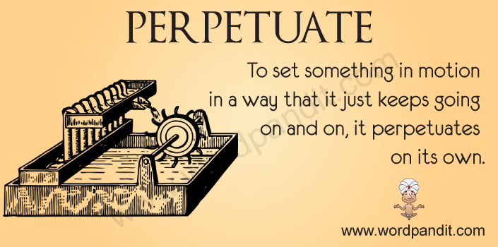 **`per-`** 表示“完全，贯穿，自始至终，向前”。forth, ford 是其同源词。 **`petu-`** = seek, 表示“追寻，寻求”。源自拉丁语 petere "to go toward, seek." **`-ate`** 表动词，“做，造成”。 词源说明(童理民)   1 - per-,完全的，-pet,寻求，追寻，词源同 compete,petition.引申词义持续，坚持。 |
|                                                |                                                              |                                                             |                                                              |
|                                                |                                                              |                                                             |                                                              |

## junct- = join, 表示“结合，连接”。源自拉丁语 iugum "yoke," iungere "to join."{27}

| 单词                           | 解释                                                         | 单词 | 解释 |
| ------------------------------ | ------------------------------------------------------------ | ---- | ---- |
| **ad-junct** 【ˈædʒʌŋkt】 | n. 附属物, 附件, 助手, 修饰语 a. 附属的 adjunct professor：〈美〉副教授  推荐：ad-增加 + junct-连接 → 加上连接 → 附属物；助手。  ad- 来自拉丁介词ad, 表示“朝、向、去，或弱化为强调”。 junct- = join, 表示“结合，连接”。源自拉丁语 iugum "yoke," iungere "to join." 词源说明(童理民)   1 - ad-,去，往，-junct,连接，词源同 join,juncture. |      |      |
|                                |                                                              |      |      |
|                                |                                                              |      |      |

## cas- = fall, 表示“落下，降临”。源自拉丁语 cadere "to fall, die." {25}

| 单词                            | 解释                                                         | 单词 | 解释 |
| ------------------------------- | ------------------------------------------------------------ | ---- | ---- |
| **cas-c-ade** 【kæˈskeɪd】 | n. 小瀑布, 瀑布状物 v. 倾斜; 大量落下 推荐：来自词根cad, 掉落，词源同case, accident. 字母c来自形容词后缀-ic的缩略，见altercation。  **`cas-`** = fall, 表示“落下，降临”。源自拉丁语 cadere "to fall, die." **`-ade`** 表示“状态，物品”。 |      |      |
|                                 |                                                              |      |      |
|                                 |                                                              |      |      |

## cret- = grow, make, 表示“增长，产生”{24}

> 源自拉丁语 creare "to bring forth, create, produce;" crescere "to grow, increase."

| 单词                         | 解释                                                         | 单词                              | 解释                                                         |
| ---------------------------- | ------------------------------------------------------------ | --------------------------------- | ------------------------------------------------------------ |
| **ac-cret** 【æ'kri:t】 | vi. 连生, 合生, 附依 vt. 使依附, 使连接 a. 合生的 推荐：ac- + cret-增长 + -e→ 长到一起 → 依附。  **`ac-`** 来自拉丁介词ad, 表示“朝、向、去，或弱化为强调”。 **`cret-`**= grow, make, 表示“增长，产生”。源自拉丁语 creare "to bring forth, create, produce;" crescere "to grow, increase." | **accret-ion ** 【əˈkriːʃn】 | n. 自然增大, 添加, 添加物, 连生 推荐：accrete【增长】 + -ion名词后缀，是单词accrete 派生的名词。  **`accrete`** vi. 连生, 合生, 附依 vt. 使依附, 使连接 a. 合生的 **`-ion`** 表名词，“行为、动作、状态、过程、结果；物品”等。 词源说明(童理民)   1 - ac-,去，往，-cre,生长，词源同 create,生长，创造。指长到一起，堆积。 |
|                              |                                                              |                                   |                                                              |
|                              |                                                              |                                   |                                                              |

## -ier 表名词，“人或物”{24}

| 单词                         | 解释                                                         | 单词 | 解释 |
| ---------------------------- | ------------------------------------------------------------ | ---- | ---- |
| **cash-ier** 【kæˈʃɪr】 | n. 出纳员; v. 开除…的军职 推荐：1. cash【现金】 + -ier, 表人; 2. 源自拉丁语 cassus "empty, void."  cash n. 现金 vt. 兑现 -ier 表名词，“人或物”。 |      |      |
|                              |                                                              |      |      |
|                              |                                                              |      |      |

## retro- 表示“向后，倒退，之前”。源自拉丁语 retro "backward, back, behind." {23}

| 单词       | 解释                                                         | 单词 | 解释 |
| ---------- | ------------------------------------------------------------ | ---- | ---- |
| retro-rear | n. 后面, 背后, 后方 a. 后面的, 背面的, 后方的 vt. 养育, 培养, 饲养, 举起, 树立, 栽种 vi. 高耸, 暴跳 retro- 表示“向后，倒退，之前”。源自拉丁语 retro "backward, back, behind." 词源说明(童理民)   1 - 来自（缩写自）拉丁语 retro,后面的，词源同 retroactive,retrospect.引申俚语词义屁股。 2 - 来自古英语 raeran,升起，上升，来自 Proto-Germanic*risana,上升，举起，来自 PIE*rei,上升，举起，词源同 rise,raise.引申词义抚养，养育。 |      |      |
|            |                                                              |      |      |
|            |                                                              |      |      |

## cart- = paper, 表示“纸片” {23}

| 单词                               | 词根                                                         | 单词 | 词根 |
| ---------------------------------- | ------------------------------------------------------------ | ---- | ---- |
| **cart-ridge** 【ˈkɑːrtrɪdʒ】 | n. 弹药筒, 弹药, 一卷软片, 墨粉鼓  **`cart-`** = paper, 表示“纸片”。 词源说明(童理民)   1 - 来自法语 cartouche,来自 card,卡片。因早期用卷起来的硬纸片装弹药而引申诸多词义。 |      |      |
|                                    |                                                              |      |      |
|                                    |                                                              |      |      |

## -arian 表形容词或名词，“…的(人)”{25}

| 单词                                         | 词根                                                         | 单词                                             | 词根                                                         |
| -------------------------------------------- | ------------------------------------------------------------ | ------------------------------------------------ | ------------------------------------------------------------ |
| **total∙it∙arian**  【toʊˌtæləˈteriən】 | a. 极权主义的 n. 极权主义者 推荐：total【全部的】 + -itarian,缩写自 authoritarian,极权主义者。 total a. 全体的, 总的, 全然的 vt. 计算...的总和, 共计为 vi. 合计 n. 总数, 全体, 合计 ad. 统统 -arian 表形容词或名词，“…的(人)”。  词源说明(童理民)   1 - total,全部的，-itarian,缩写自 authoritarian,极权主义者。 | **totalitarianism** 【toʊˌtæləˈteriənɪzəm】 | n. 极权主义 推荐：totalitarian【a. 极权主义的】 + -ism抽象名词后缀，表示“...主义，思想” totalitarian a. 极权主义的 n. 极权主义者 -ism 抽象名词后缀，表示“…主义”；“宗教”；“制度、行为”；“…学”、“…术”、“…论”、“…法”；“疾病名称”；“情况、状态”等。 |
|                                              |                                                              |                                                  |                                                              |
|                                              |                                                              |                                                  |                                                              |

## cas- = fall, 表示“落下，降临”。源自拉丁语 cadere "to fall, die."{25}

| 单词                         | 解释                                                         | 单词                             | 解释                                                         |
| ---------------------------- | ------------------------------------------------------------ | -------------------------------- | ------------------------------------------------------------ |
| **cas-ual** 【ˈkæʒuəl】 | a. 偶然的, 不经意的, 便装的 n. 临时工, 待命士兵 推荐：cas-落下 + -ual表形容词 → 落下的 → 不是安排好的 → 偶然的。  **`cas-`** = fall, 表示“落下，降临”。源自拉丁语 cadere "to fall, die." **`-ual`** 表形容词，“…的”，一般缀于名词后。源自拉丁语 -alis, adjective suffix. 词源说明(童理民)   1 - 来自 cad-,掉落，词源同 case,accident. | **casual-ty** 【ˈkæʒuəlti】 | n. 意外事故, 伤亡, 受害者 推荐：casual【偶然的】 + -ty → [突然]落下的事 → 事故。  **casual** a. 偶然的, 不经意的, 便装的 n. 临时工, 待命士兵 **`-ty`** 表名词，用在形容词后，把形容词变成名词。 词源说明(童理民)   1 - 来自 cad-,掉落，词源同 case,accident.原指偶然伤亡者，不幸者。 |
|                              |                                                              |                                  |                                                              |
|                              |                                                              |                                  |                                                              |

## quis- = seek, search, 表示“寻求，询问” {24}

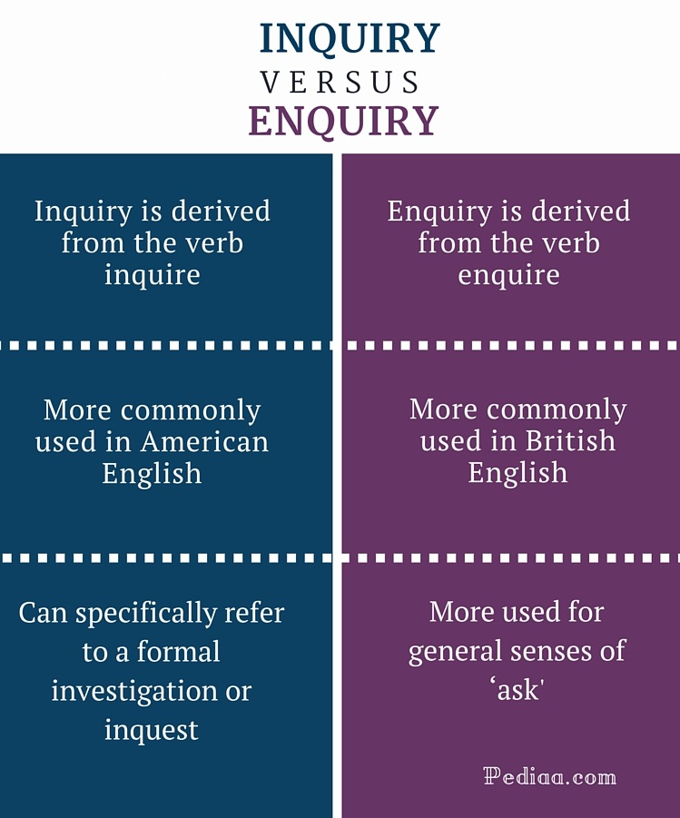 

| 单词                                        | 解释                                                         | 单词                                      | 解释                                                         |
| ------------------------------------------- | ------------------------------------------------------------ | ----------------------------------------- | ------------------------------------------------------------ |
| **ac-quis-ition **      【ˌækwɪˈzɪʃn】 | n. 获得, 获得物 推荐：ac-去、往 + quis-获得 + -ition表名词  ac- 来自拉丁介词ad, 表示“朝、向、去，或弱化为强调”。 quis- = seek, search, 表示“寻求，询问”。 -ition  表名词，“行为、动作、状态、过程、结果；物品”等。 | **en-quir-e**          【ɪnˈkwaɪər】 | v. 询问 推荐：<en-进入，使 + quir-询问 + -e。  **`im-,in-,il-,ir-`** 来自拉丁语in-，表示“在内，进入，使...”。 **`quir-`** = seek, search, 表示“寻求，询问”。 词源说明(童理民)   1 - en-,进入，使，-quir,询问，词源同 query,question. |
|                                             |                                                              |                                           |                                                              |
|                                             |                                                              |                                           |                                                              |

## sign- = mark, 表示“记号，信号”。源自拉丁语 signum "identifying mark, sign." {24}

| 单词                               | 解释                                                         | 单词 | 解释 |
| ---------------------------------- | ------------------------------------------------------------ | ---- | ---- |
| **sign-ature** 【ˈsɪɡnətʃər】 | n. 签字, 识别标志, 调号 推荐：sign【签字】 + -ature, 表名词。 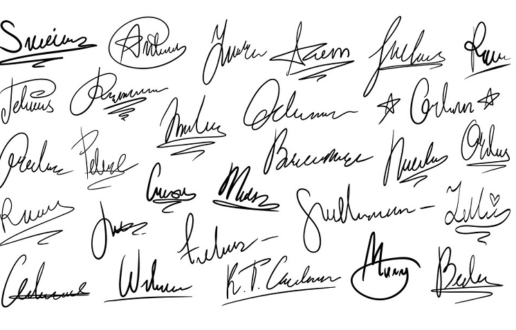 **`sign-`** = mark, 表示“记号，信号”。源自拉丁语 signum "identifying mark, sign." **`-ature`** 表名词，通常在单词或词根以t结尾时使用，表示“一般状态，行为”。 词源说明(童理民)   1 - 来自 sign,签字，签署，签约，-ate,使，-ure,名词后缀。引申诸相关词义。 |      |      |
|                                    |                                                              |      |      |
|                                    |                                                              |      |      |

## lus- = play, 表示“玩，戏剧”。源自拉丁语 ludere (过去分词 lusus) "to play."{22}

| 单词                                             | 解释                                                         | 单词                                               | 解释                                                         |
| ------------------------------------------------ | ------------------------------------------------------------ | -------------------------------------------------- | ------------------------------------------------------------ |
| **il-lus-ion                 ** 【ɪˈluːʒn】 | n. 幻影, 错觉, 幻想 推荐：il-使 + lus-玩 + -ion名词后缀 → 被(幻觉)玩弄 → 幻觉。  **`il-`** [^3]来自拉丁语in-，表示“在内，进入，使...”。 **`lus-`** = play, 表示“玩，戏剧”。源自拉丁语 ludere (过去分词 lusus) "to play." **`-ion`** 表名词，“行为、动作、状态、过程、结果；物品”等。 词源说明(童理民)   1 - il-,进入，使，-lus,玩乐，玩耍，词源同 ludic,elude,elusive.引申词义玩弄，欺骗，虚幻。 | **dis-illusion **             【ˌdɪsɪˈluːʒn】 | n. 觉醒, 幻灭 vt. 使醒悟, 使幻想破灭 推荐：dis-不，非，使相反 + illusion【幻想】。  **`dis-`** 来自拉丁语dis-，表示“分开，散开”，引申词义“离开，无，没有，缺乏，表相反等”。 该前缀在字母 g, l, m, r, s, v 前缩写为 di-；在字母f前同化为 dif-。 **`illusion`** n. 幻影, 错觉, 幻想 切换词根显示方式 词源说明(童理民)   1 - dis-,不，非，使相反，illusion,幻想。 |
|                                                  |                                                              |                                                    |                                                              |
|                                                  |                                                              |                                                    |                                                              |

## sect- = cut, divide, 表示“切，割”。源自拉丁语 secare "to cut." {22}

| 单词                   | 解释                                                         | 单词 | 解释 |
| ---------------------- | ------------------------------------------------------------ | ---- | ---- |
| **sect** 【sekt】 | n. 宗派, 教派 **`sect-`** = cut, divide, 表示“切，割”。源自拉丁语 secare "to cut."  词源说明(童理民)   1 - 来自拉丁语 secta,宗派，组织，方式，原则，来自 sectus,追随的，过去分词格于 sequi,追随，跟随，词源同 sequence,pursue.词义受另一个拉丁语 secare（分开)影响，词源同 section,segment. |      |      |
|                        |                                                              |      |      |
|                        |                                                              |      |      |

## bat- = beat, 表示“打、击”{21}

| 单词    | 解释                                                         | 单词 | 解释 |
| ------- | ------------------------------------------------------------ | ---- | ---- |
| **bat** | n. 蝙蝠; 球棒; 令人生厌的妇女 v. 击球; 眨眼 单词笔记   ［添加］ 推荐： 1.棍子，词源同beat, 击，打。 2.蝙蝠，词源不详，可能来自拟声词，模仿蝙蝠扇动翅膀的声音。 |      |      |
|         |                                                              |      |      |
|         |                                                              |      |      |

### batty（古怪的）：令人反感的蝙蝠

英语单词**batty**是从**bat**（蝙蝠）一词衍生出来的形容词，按照构词法应该解释为“跟蝙蝠有关的”。

为什么**batty**含有“古怪的，疯狂的”这样的负面含义呢？原来，这与东西方的文化差异有关。在东方文化中，蝙蝠是“福”的象征，因为“蝠”字与“福”字发音接近。但在西方人的眼中，生活在阴暗洞穴里、长相丑陋怪异的蝙蝠是魔鬼的化身，传说中的吸血鬼就多半有着蝙蝠那样的翅膀。因此，由蝙蝠（bat）衍生出来的形容词batty就有了“古怪的、疯狂的”等负面含义。

- **batty**：['bætɪ] adj.古怪的，疯狂的
- **bat**：[bæt] n. 蝙蝠；球棒；球拍
- a**s blind as bat**：有眼无珠，像蝙蝠一样盲目

### battery（电池）：能连续发射炮弹的炮组

英语单词**battery**（电池）原本是动词**bat**（击打）的名词形式，源自中古法语名词***batterie***，其中的***batt***来自拉丁语动词***battuere***（击打）。

**battery**最初表示“连续重击”，后来衍生出“轰炸”之意，后来又被用来表示包含一组火炮或炮台，因为包含多门火炮的火炮组能够不间断地连续发射炮弹。

电池问世后，还没有合适的名称。美国科学家本.富兰克明便将电池也称为**battery**，因为电池能像火炮组一样连续发射电荷。跟**battery**同源的单词有**bat**（击打、球棒）和**batter**（击球手、猛击）、**battle**（战役）等。

- **battery**：['bæt(ə)rɪ] n. 电池，蓄电池n. 殴打n. 炮台，炮位
- **bat**：[bæt] n. 蝙蝠；球棒；球拍v. 用球棒击球；击球率达…；轮到击球
  **batter**：['bætɚ] n. 击球手；（用鸡蛋、牛奶、面粉等调成的）糊状物；墙面的倾斜vt. 猛击；打坏；使向上倾斜vi. 接连猛击；向上倾斜
- **battle**： ['bætl] n. 战役；斗争vi. 斗争；作战vt. 与…作战

## Reference

[^1]: 摩西英语(摩西) as keen as mustard极热心的，极感兴趣的。mustard ['mʌstəd] n.芥末；芥菜；深黄色，芥末和热心有啥交集呢？原因就在于芥末经常用来给牛肉调味，所以久而久之强烈的滋味（趣味或味道）就等同于了芥末。He is as keen as mustard in his work.顺便说一下，英语里有很多as x as y格式的习语和成语哦。 

[^2]: root and branch彻底地；全部地；极端地。eradicate [ɪ'rædɪkeɪt] vt.根除；根绝；消灭，这里前缀e-=ex-表out of，词根radic-表示植物的根，-ate动词后缀，那eradicate当真是“根除”。可是有些时候树的枝条也有繁殖能力，所以也不能放过。These evil practices must be destroyed root and branch. 

[^3]: 来自拉丁语in-，表示“在内，进入，使...”。该拉丁语前缀进入古法语和西班牙语时拼写演变为 en-，这些词进入英语后导致在现代英语里少数单词存在两种拼写形式，如 insure, ensure, 确保；inquire, enquire, 查询。该前缀在字母 b, m, p 前拼写变体为 im-；在字母l前拼写同化为 il-；在字母r前拼写同化为 ir-。

[^4]: 摩西英语(摩西) loathsome ['ləʊðs(ə)m] adj.令人憎恶的；令人呕吐的。本身loath [ləʊθ] adj.勉强的，就是个单词，-some后缀是单词some弱化后的体现，如handsome就是easy to handle。英王James一世说抽烟：a custom loathsome to the eye, hateful to the nose, harmful to the brain, dangerous the the lungs...

[^5]: 英语词源趣谈(庄和诚) mimeograph - 1889年美国发明家爱迪生（Thomas A. Edison, 1847-1931）发明（蜡纸）油印机时就以mimeograph命名。该词系由希腊语mīméomai（模仿）和源于希腊语的英语组合语素-graph（含“写”之意）组合而成。在很长一段时间内，mimeograph一直被用作油印机的商标名，到了1948年之后才逐渐变成油印机的属名，以后也用作动词，表示“油印”。
