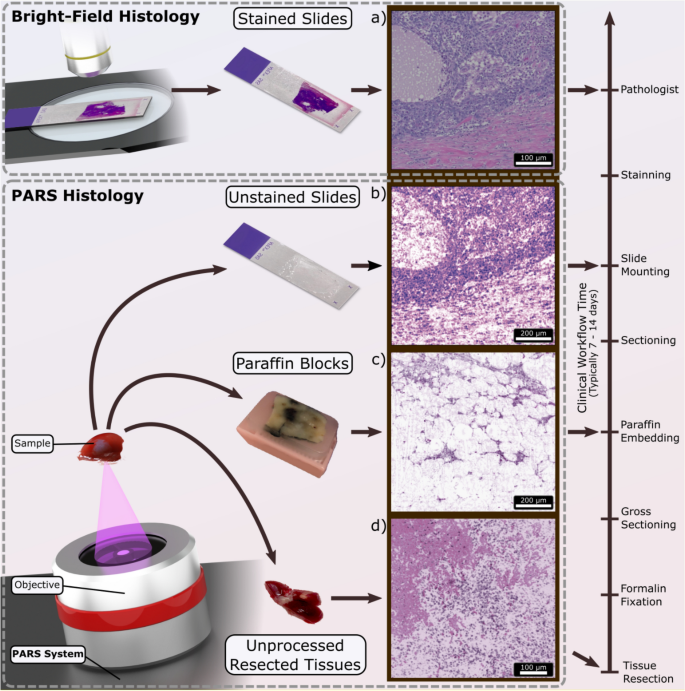
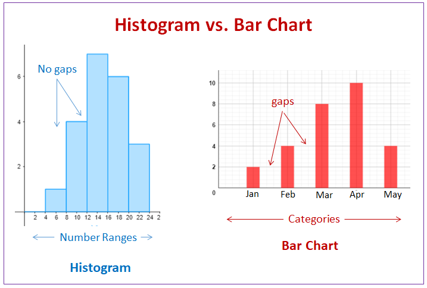
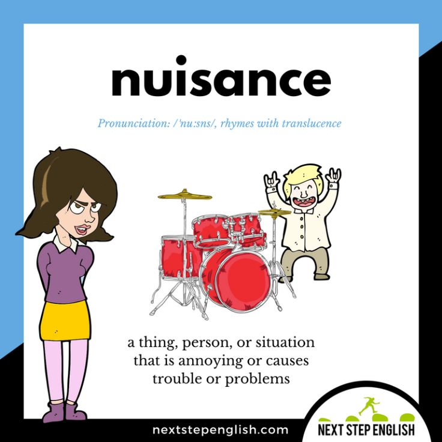
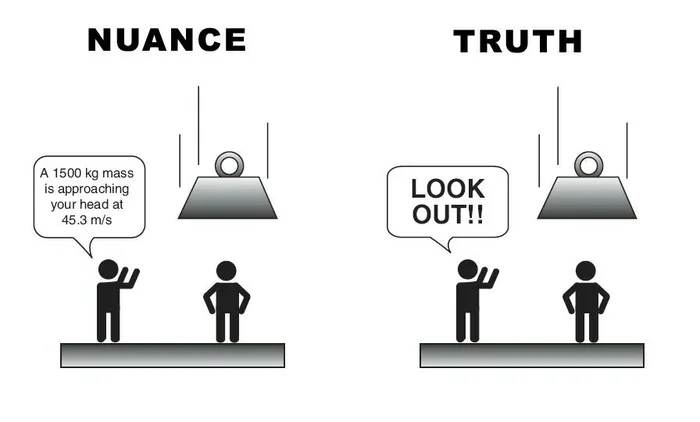
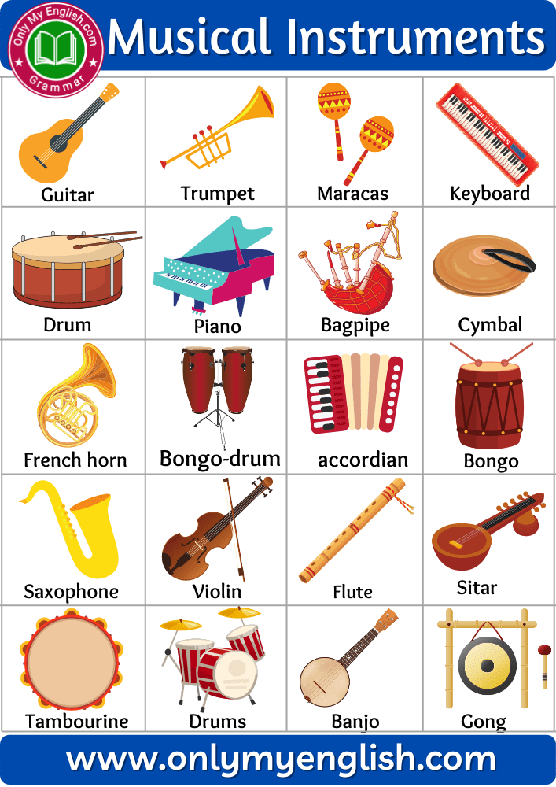
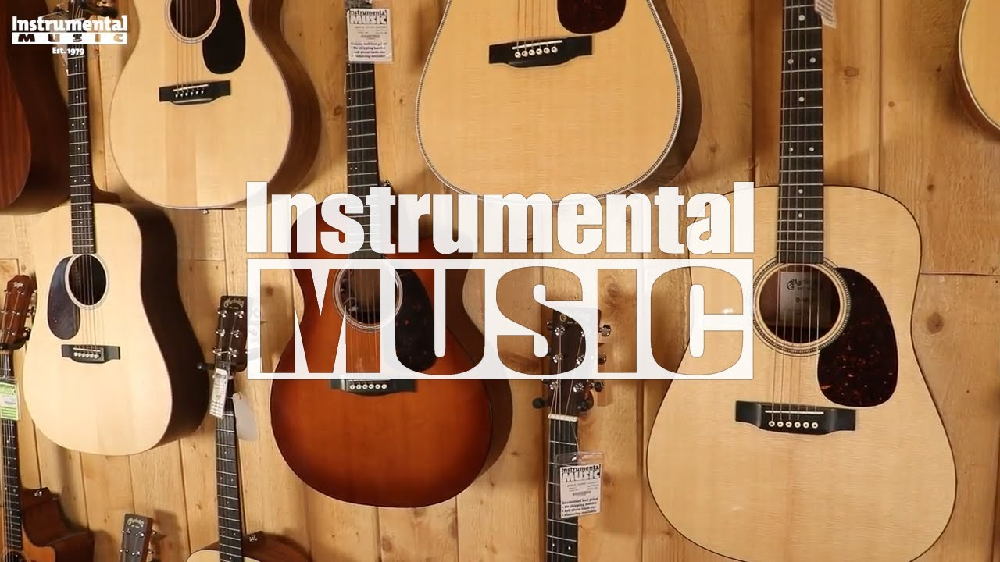
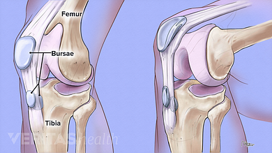
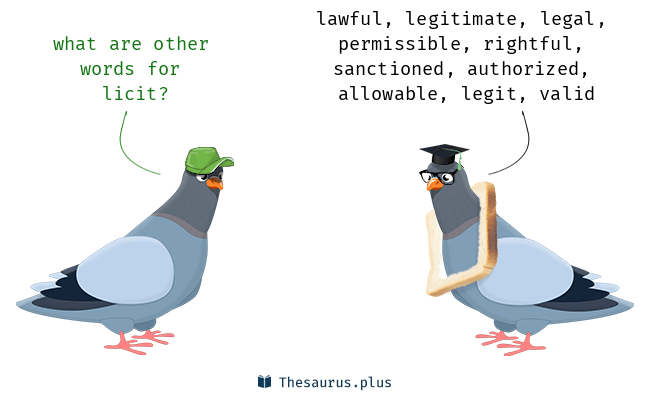
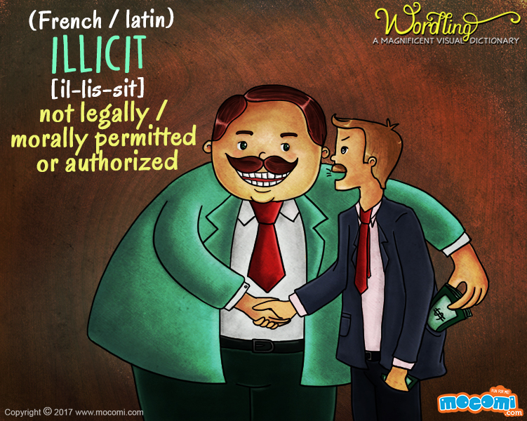

# 咬文嚼字-词根词缀(3-11)

@(TOEFL)[托福, TOEFL, 词根词缀,咬文嚼字]

[toc]

## -ode 

### 1. 表示“电极 {11}

**`-ode`** 表示“电极”。源自希腊语 hodos "way, journey."
更多同源词... 

| 单词                                       | 解释                                                         | 单词                          | 解释                                                         |
| ------------------------------------------ | ------------------------------------------------------------ | ----------------------------- | ------------------------------------------------------------ |
| **an-ode**  【ˈænoʊd】                | an-  = up, above, 表示“上”，和前缀 ana- 同源。           | **cat-hode** 【ˈkæθoʊd】 | **`cat-`** 表示“向下，相反，离开”。源自希腊语 kata "down." **`-hode`** 表示“电极”。源自希腊语 hodos "way, journey." |
| **eletr-ode**          【ɪˈlektroʊd】 | electr-  = electric, 表示“电的”。来自古希腊语 elektron "amber." | **di-ode** 【ˈdaɪoʊd】   | **`di-`**  表示“两个，双”。源自希腊语 dis "twice;" dikha "in two." |
| **tri-od**e 【traɪəʊd】               | **`tri-`** 表示“三”。源自希腊语 tri- "three."                | **tetr-ode** 【tetrəʊd】 | **`tetr-`**  表示“四”。源自希腊语 tetra- "four."         |
| **quadr-ode** 【kwɒdrəʊd】            | quadr-  = four, 表示“四”。源自拉丁语 quattuor "four."    | **pent-ode** 【pentəʊd】 | **`pent-`**  表示“戊，五”。源自希腊语 pente "five."      |
| **hept-ode** 【heptəud】              | **`hept-`**  表示“七”。源自希腊语 hepta "seven."         |                               |                                                              |

### 2. =like,表示“像”，一般用于希腊语借词{?}

## -ade 表示“状态，物品”{12}

| 单词                            | 解释                                                         | 单词 | 解释 |
| ------------------------------- | ------------------------------------------------------------ | ---- | ---- |
| **cas-c-ade** 【kæˈskeɪd】 | n. 小瀑布, 瀑布状物 v. 倾斜; 大量落下 推荐：来自词根cad, 掉落，词源同case, accident. 字母c来自形容词后缀-ic的缩略，见altercation。  **`cas-`** = fall, 表示“落下，降临”。源自拉丁语 cadere "to fall, die." **`-ade`** 表示“状态，物品”。 |      |      |
|                                 |                                                              |      |      |
|                                 |                                                              |      |      |

## histo- = tissue, 表示“组织”{11}

| 单词                                                     | 解释                                                         | 单词                                    | 解释                                                         |
| -------------------------------------------------------- | ------------------------------------------------------------ | --------------------------------------- | ------------------------------------------------------------ |
| **histo-logy  **                   【hɪˈstɑːlədʒi】 | n. 组织学 推荐：histo-组织 + -logy学说。引申词义组织学。 the scientific study of the extremely small structures that form living tissue                                                                                                     **`histo-`** = tissue, 表示“组织”。 **`-logy`** = science, 表示“科学，学科”，由词根 log-, 说，引申而来； 词源说明(童理民)   1 - histo,竖直，组织，-logy,学说。引申词义组织学。 | **histo-gram** [^8] 【ˈhɪstəɡræm】 | n. （统计学的）直方图，矩形图  a bar chart representing a frequency distribution 推荐：histo-直立（站立） + gram-写，记录。引申词义条形图，柱形图。  **`histo-`** = tissue, 表示“组织”。 **`-gram`** = image, 表示图像。源自希腊语 gramma "a picture, written letter, piece of writing," grame "a line." 词源说明(童理民)   1 - histo,竖，直立，-gram,写，记录。引申词义条形图，柱形图。 |
|                                                          |                                                              |                                         |                                                              |
|                                                          |                                                              |                                         |                                                              |

### history: 是过往的故事，不是他的故事

> **history 与 histogram没有相同的词根哦**

英语词源趣谈(庄和诚)

history - 英语里意为“历史”的**history**和意为“故事”的**story**本是同源词，**history**直接源自拉丁语historia 'recording of past events'（过去事件的记载），而**story**则借自源于拉丁语historia的法语estoire。

渠道不同，结果也不同。不仅拼写有差异，词义也作了分工。

1970年女权主义者把history分解为his story，说是history意含the story of men，即“男性史”。按此逻辑，“女性史”自然应该是her story，即herstory。herstory一词便这样应运而生了。（参见story）

例　

- The herstory of our foremothers is often ignored in school textbooks. 学校的教科书往往忽视了我们女祖先的历史。
- When women in the movement use herstory, their purpose is to emphasize that women's lives, deeds, and participation in human affairs have been neglected or undervalued in standard histories. 参与这项运动的妇女使用herstory一词的目的是要强调，在通行的历史中，妇女的生活、成就和在人类事务中的角色一直遭到忽视和贬抑。

词源说明(童理民)  

1 - 来自拉丁语 historia,叙述，告知，讲述过去发生的事，来自希腊语 histor,智者，见证者，评论者，来自 PIE*wid-tor,看，知道，了解，词源同 visit,vision.其原义更偏重于讲故事，含有个人的主观色彩，后来从 14 世纪开始才逐渐确立为对过去发生事件的真实记录，而于 1842年才确立为一门学科，即我们现在所理解的历史学。比较其与同源词 story 的区别。

摩西英语(摩西)
Rx ['ɑr 'ɛks] n.处方；食谱。这个符号大家都熟悉吧，谁没看过病呢！它是拉丁词源单词recipe ['resɪpɪ] n.处方；食谱的缩写，是词根cap=to take的命令式，即要患者（或食客）去按照该配方去做。它有几个兄弟呢你造不？dx: diagnosis诊断, hx: history病史, sx: symptoms症状和tx: treatment治疗。

## -acle 表名词，“…物品，状态”{11}

| 单词                              | 解释                                                         | 单词 | 解释 |
| --------------------------------- | ------------------------------------------------------------ | ---- | ---- |
| **tent-acle**   【ˈtentəkl】 | . 触须, 触手, 触角 推荐：tent-伸展 + -acle小词后缀。引申词义触角，触须。  **`tent-`** = stretch, 表示“伸展”，引申为“倾向”等。源自拉丁语 tendere "to stretch, extend." **`-acle`** 表名词，“…物品，状态”。 词源说明(童理民)   1 - 来自拉丁语 tentare,感知，接触，触摸，来自 tendere 的反复格，来自 tendere,拉开，张开，词源同 tend,extend.-acle,小词后缀。引申词义触角，触须。 |      |      |
|                                   |                                                              |      |      |
|                                   |                                                              |      |      |

## noc-,nox- = hurt, poison, 表示“伤害，毒”{11}

> 源自拉丁语 nocere "to injure, harm," noxa "injury, hurt."

| 单词                              | 解释                                                         | 单词                            | 解释                                                         |
| --------------------------------- | ------------------------------------------------------------ | ------------------------------- | ------------------------------------------------------------ |
| **nu-i-s-ance ** 【ˈnuːsns】 | n. 讨厌的东西, 讨厌的人, 损害 推荐：nu-=noc-伤害 + -i- + -ance, 表名词，用来指妨害行为，讨厌的人。  **`noc-,nox-`** = hurt, poison, 表示“伤害，毒”。源自拉丁语 nocere "to injure, harm," noxa "injury, hurt." **`-ance`** 表名词，“性质，状况”，一般缀于动词后。 词源说明(童理民)   1 - 来自古法语nuisance,伤害，损伤，来自拉丁语nocere, 去伤害，谋害，词源同necro-,noxious,innocent.后词义弱化，用来指妨害行为，讨厌的人。 | **nuance** 【ˈnuːɑːns】    | n. 细微差别 推荐：源自拉丁语 nubes "a cloud, mist, vapor," 后借道法语进入英语。                                                                        词源说明(童理民)   1 - 来自法语 nuance,细微差别，云影，来自拉丁语 nubes,云朵，水气，词源同 nebula,nimbus.引申词义云彩的阴影，云影的细微差别。 |
| **nox-i-ous** 【ˈnɑːkʃəs】   | a. 有害的, 有毒的, 使道德败坏的 推荐：nox-毒 + -ious...的。  **`nox-`** 11= hurt, poison, 表示“伤害，毒”。源自拉丁语 nocere "to injure, harm," noxa "injury, hurt." **`-ious`** 783表形容词，表示“…的”，用于化学领域表示“亚酸的，低价（金属）的”。 词源说明(童理民)   1 - 来自拉丁语 noxius,有毒的，伤害的，来自 PIE*nek,死亡，致死，词源同 innocent,necro-. | **ign-enous**  【ˈɪɡniəs】 | a. 火的, 似火的, 火成的(尤指火山喷出的) formed when magma (= melted or liquid material lying below the earth's surface) becomes solid, especially after it has poured out of a volcano 推荐：ign-火 + -eous表形容词 → 火的。  **`ign-`** = fire, 表示”点火“。源自拉丁语 ignis "fire." **-eous** 表形容词，表示“…的”，用于化学领域表示“亚酸的，低价（金属）的”。 词源说明(童理民)   1 - 来自拉丁语 ignis,火，来自 PIE*egni,火，词源同 Egni,印度火神。 |
|                                   |                                                              |                                 |                                                              |

## stinct-,stimul- = prick, 表示“刺，刺激”{11}

| 单词                                | 解释                                                         | 单词 | 解释 |
| ----------------------------------- | ------------------------------------------------------------ | ---- | ---- |
| **in-stig-ate** 【ˈɪnstɪɡeɪt】 | vt. 教唆, 怂恿, 煽动 推荐：in-进入 + stig-=stinct刺 + -ate, 表动词 →  刺激[别人]内部 → 煽动。  **`stinct-,stimul-`** = prick, 表示“刺，刺激”。 **`in-`** 来自拉丁语in-，表示“在内，进入，使...”。 **`-ate`** 表动词，“做，造成”。 词源说明(童理民)   1 - in-,进入，使，-stig,刺，棍，词源同 stick,instinct.引申词义唆使，煽动。 |      |      |
|                                     |                                                              |      |      |
|                                     |                                                              |      |      |

## struct- = build, 表示“建立”。源自拉丁语 struere "to pile up, construct." {10}

| 单词                                   | 解释                                                         | 单词                                       | 解释                                                         |
| -------------------------------------- | ------------------------------------------------------------ | ------------------------------------------ | ------------------------------------------------------------ |
| **in-stru-ment**  【ˈɪnstrəmənt】 | n.器械;仪器;器具;(车辆、机器的)仪器，仪表;促成某事的人(或事物);手段;受利用（或控制）的人;文据 v.用仪器装备；为管弦乐队编(曲)；向…提交法律文件 推荐：in-内 + stru-[=struct] + -ment名词后缀 → 内部结构 → 仪器、工具。  **`struct-`** = build, 表示“建立”。源自拉丁语 struere "to pile up, construct." **`in-`** 来自拉丁语in-，表示“在内，进入，使...”。 **`-men`**t 表示具体物。 词源说明(童理民)   1 - in-,进入，使，-stru,建造，建设，词源同 structure,destruct.引申词义提供的工具，仪器，器械等。后也用于指乐器或法律文件。 | **instrument-tal ** 【ˌɪnstrəˈmentl】 | adj.**起重要作用**;用乐器演奏的;为乐器谱写的 n.器乐曲;工具格;工具词 推荐：<instrument【工具，仪器】 + -al表形容词。引申词义起重要作用的。  **instrument** n. 工具, 手段, 仪器 **`-al`** 表形容词，“…的”，一般缀于名词后。源自拉丁语 -alis, adjective suffix. 切换词根显示方式 词源说明(童理民)   1 - 来自 instrument,工具，仪器。引申词义起重要作用的。 |
|                                        |                                                              |                                            |                                                              |
|                                        |                                                              |                                            |                                                              |

## infra- = "below, underneath, beneath; later than, smaller, inferior to," 表示“下，低”。源自拉丁语 infra "below." {10}

| 单词                                         | 解释                                                         | 单词 | 解释 |
| -------------------------------------------- | ------------------------------------------------------------ | ---- | ---- |
| **infra-structure** 【ˈɪnfrəstrʌktʃər】 | n. 基础结构, 基础设施 推荐：infra-低于，在下方 + structure【结构】。引申词义基础结构，基础设施。  **`infra-`** = "below, underneath, beneath; later than, smaller, inferior to," 表示“下，低”。源自拉丁语 infra "below." structure n. 结构, 构造, 建筑物 vt. 构成, 组织 词源说明(童理民)   1 - infra-,低于，在下方，structure,结构。引申词义基础结构，基础设施。 |      |      |
|                                              |                                                              |      |      |
|                                              |                                                              |      |      |

## pir- = try, 表示“尝试，冒险”。源自拉丁语 periclum "trail, danger," experiri "to try, learn by tring," peira "trial, attempt." {10}

| 单词                             | 解释                                                         | 单词                                                     | 解释                                                         |
| -------------------------------- | ------------------------------------------------------------ | -------------------------------------------------------- | ------------------------------------------------------------ |
| **em-pir-ic**  【em'pɪrɪk】 | n.经验主义者;〈古〉江湖医生；庸医 adj.经验的；以实验为依据的；实验（上）的；（根据）经验的【复数：empirics】 推荐：em-进入 + pir-尝试，冒险 + -ic  **`em-`** 表示“入、内、在...之内、使...”，来自古法语 en-。在字母 b, m, p 前拼写同化为 em-。 **`pir-`** = try, 表示“尝试，冒险”。源自拉丁语 periclum "trail, danger," experiri "to try, learn by tring," peira "trial, attempt." **`-ic`** 表名词，“人或学科”。 | **em-pir-ic-al**                      【ɪmˈpɪrɪkl】 | a. 完全跟据经验的, 经验主义的 推荐：em-进入，使 + pir-尝试，冒险 + -ical表形容词，字面意思即尝试过的，有经验的。  empiric n. 经验主义者, 江湖医生 -al 表形容词，“…的”，一般缀于名词后。源自拉丁语 -alis, adjective suffix. 切换词根显示方式 词源说明(童理民)   1 - em-,进入，使，-pir,尝试，冒险，词源同 pirate,expert.字面意思即尝试过的，有经验的。 |
|                                  |                                                              |                                                          |                                                              |
|                                  |                                                              |                                                          |                                                              |

## -ard 表名词，“不好的人”; 后缀-ard贬义; 源自日耳曼语 *-hart, *-hard "hold, hardy." {10}

| 单词                           | 解释                                                         | 单词                             | 解释                                                         |
| ------------------------------ | ------------------------------------------------------------ | -------------------------------- | ------------------------------------------------------------ |
| **bast-ard** 【ˈbæstərd】 | n. 私生子, 劣货 a. 私生的, 杂种的, 不合标准的                                                                                                                               推荐：bast-鞍 + -ard。  **`bast-`** 表示“马鞍”。源自法语bast **`-ard`** 表名词，“不好的人”。源自日耳曼语 *-hart, *-hard "hold, hardy." | coward                           |                                                              |
|                                |                                                              | **haggard**[^7] 【ˈhæɡərd】 | a. 憔悴的, 疲惫的 n. 野鹰  词源说明(童理民)   1 - 词源不确定，可能来自古法语 faulcon hagard,野鹰，被抓获的猎鹰，来自古英语 haga,树篱，篱笆，围栏，词源同 haw,hedge .因野鹰的天性狂野，桀骜不驯，被抓获后常绝食而亡，因此引申词义消瘦的，后用为形容人憔悴的。或来自 hag,老巫婆。   |
|                                |                                                              |                                  |                                                              |

### bastard（私生子）：诞生于驮鞍之上的孩子

> - bast-,马鞍，来自 fasc-,编织，词源同 basket.来自旧时行旅中马鞍常作为临时地铺，即露水婚姻所生，私生子。-ard,人，作贬义，由 hard 衍生后缀。

在中世纪法国普罗旺斯地区，当地的赶骡人在乡村小店投宿时，往往将驮鞍铺开当做临时床铺使用。

有些赶骡人生性风流，免不了拈花惹草，不少私生子就诞生于这样的驮鞍上。因此，法国人管这种私生子称为**bastard**（驮鞍之子），由**`bast`**（驮鞍）和表示人的名词后缀**`-ard`**组成。

后缀**`ard`**常含有蔑视之意，如**coward**（胆小鬼）。

但**bastard**一词当初仅表示非婚生子，并无贬义，如征服英国的威廉一世就被称为**William the Bastard**（私生子威廉）。

14世纪后期才逐渐衍生出“不纯、不真实”的含义，19世纪后开始用作骂人的脏话，相当于中文中的“杂种、王八蛋”。

- **bastard**： ['bɑːstəd; 'bæst-] 
  - n.私生子，杂种，王八蛋
  - adj.私生的

**英语词源趣谈(庄和诚)**

**bastard** - 古法语有个短语***fils de bast***，字面意思是**son of a packsaddle**（驮鞍之子）。

据传，中世纪法国普罗旺斯地区的赶骡人常将驮鞍当作临时床铺使用，不少私生子就是在这种床铺上出生的，故人们便用该短语婉称私生子， 意为“私生子”的古法语**bastard**一词即源于该短语。

更确切地说，是由其中的**bast**（驮鞍）衍化而来，因为**bast**在睡觉时可用作枕头，当然还能在这枕头上一夜风流。据认为**bastard**很可能是**bast**加贬抑后缀**`-ard`**构成。

13世纪时英语直接借用了该词，用以指“私生子”。但从19世纪初以来bastard开始贬义化，如今更多地被作为粗俗语用以骂人，若要表示“私生子”或“非婚生子”，如今则常以**love-child**一词代之。

**bastard**的近义词**bantling**（小杂种）其来历有点相似。它源自德语Bank 'bench'（长凳），不同的是，孩子不是在驮鞍上而是在长凳上出生的。

例　

- You lied to me, you bastard! (CID) 你居然对我撒谎，你这个混蛋！
- He's a complete and utter bastard — I don't want anything more to do with him. (LLA) 他是个十足的混账——我不想再跟他来往了。
- As a bastard, he had no claim to his parents' fortune. (NED) 他是私生子，没有权利继承他父母的财产。

**摩西英语(摩西)**

A:bastard ['bɑːstəd] adj.私生的，n.私生子。后缀-ard贬义，bast-部分表铺盖。旧时旅人在驮鞍上（白天在马背上，晚上放地上就是铺盖）与女人野合出来的孩子。B：bustard ['bʌstəd] n.大鸨，词根tard-表缓慢，bus-或同拉丁avis鸟，slow-moving bird。AB一字母之差，意思大相径庭，字母可能表意？ 

## -mony 表示“动作的结果、状态”{10}

| 单词                                              | 解释                                                         | 单词                              | 解释                                                         |
| ------------------------------------------------- | ------------------------------------------------------------ | --------------------------------- | ------------------------------------------------------------ |
| **heg-e-mony               ** 【hɪˈdʒeməni】 | n. 霸权, 领导权, 支配权, 拥有支配权的政府 推荐：heg-寻求，支配 + -e- + -mony, 表结果、状态或动作。  **`heg- sag-`** 来源于希腊语，sag- 来源于拉丁语，表示“寻求，想获得”。 **`-mony`** 表示“动作的结果、状态”。 词源说明(童理民)   1 - 来自希腊语 hegemon,领导者，来自 PIE*sag,寻找，寻求，探路者，词源同 seek,sagacious.引申词义领导权，支配权，霸权。 | **harm-ony** 【ˈhɑːrməni】   | n. 协调, 和睦, 调和       推荐：harm-适合 + -ony, 表名词 → 适合的心态 → 和谐。  **`-mony`** 表示“动作的结果、状态”。 **`harm-`** = fitting, 表示“适合”。源自希腊语 harmos "joint, shoulder." |
|                                                   |                                                              | **cere-mony** 【ˈserəmoʊni】 | n. 典礼, 仪式, 礼节  **`-mony`** 表示“动作的结果、状态”。 词源说明(童理民)   1 - 来自 PIE*kwer,做，履行，词源同 Sanskri（(梵语），karma（业，因果报应)。俗词源认为来自地名 Caere,罗马地名，因最早进行相关的宗教仪式而得名。 |
|                                                   |                                                              |                                   |                                                              |

## par-= get ready, 表示“准备”。源自拉丁语 parare "to try to get, prepare, equip." {9}

| 单词                                                | 解释                                                         | 单词                                  | 解释                                                         |
| --------------------------------------------------- | ------------------------------------------------------------ | ------------------------------------- | ------------------------------------------------------------ |
| **ap-par-atus                ** 【ˌæpəˈrætəs】 | n. 装置, 器具, 器官 【复数：apparatuses】 推荐：ap-加强 + par-准备 + atus表名词 → 准备好用的东西 → 设备。  ap- 来自拉丁介词ad, 表示“朝、向、去，或弱化为强调” par- = get ready, 表示“准备”。源自拉丁语 parare "to try to get, prepare, equip." 词源说明(童理民)   1 - ap-,向，往，-par,准备，词源同 prepare. | **ap-par-el **       【əˈpærəl】 | n. (尤指正式场合穿的)衣服;(商店出售的)服装 vt. 给…穿衣服（尤指华丽或特殊的服装） 推荐：ap-加强 + par-看见 + el → 穿出来给别人看的 → 衣服。  **`ap-`** 来自拉丁介词ad, 表示“朝、向、去，或弱化为强调”。 **`par-`** = get ready, 表示“准备”。源自拉丁语 parare "to try to get, prepare, equip." **`-el`** 表名词，“人或物”。 词源说明(童理民)   1 - ap-,向，往，-par,准备，词源同 prepare.引申词义服装。 |
|                                                     |                                                              |                                       |                                                              |
|                                                     |                                                              |                                       |                                                              |

## nav- = ship, 表示“船”。源自拉丁语 navis "ship."{9}

| 单词                      | 解释                                                         | 单词 | 解释 |
| ------------------------- | ------------------------------------------------------------ | ---- | ---- |
| **nav-y** 【ˈneɪvi】 | n. 海军, 海军人员, 海军军力, 烟蒂 推荐：nav-船 + -y, 表名词，引申词义海军。  **`nav-`** = ship, 表示“船”。源自拉丁语 navis "ship." **`-y`** 表名词，加在形容词或以r结尾的单词后。 更多同源词... |      |      |
|                           |                                                              |      |      |
|                           |                                                              |      |      |

## tric- = petty obstacle, 表示“小障碍”{9}

| 单词                                  | 解释                                                         | 单词                                         | 解释                                                         |
| ------------------------------------- | ------------------------------------------------------------ | -------------------------------------------- | ------------------------------------------------------------ |
| **ex-tric-able ** 【ekstrɪkəbl】 | a. 可救出的, 可解救的 推荐：ex-向外 + tric-繁琐 + -able, 表形容词。  **`ex-`** 表示“从，从...离开，从...向外，向外，向上”，来自PIE *eghs, 向外 **`tric-`** = petty obstacle, 表示“小障碍”。 **`-able`** 一般缀于动词后，构成形容词，表示“可…的，能…”。 | **in∙ex∙tric∙able**  【ˌɪnɪkˈstrɪkəbl】 | a. 逃脱不掉的, 解不开的, 无法解决的 推荐：in-不，非 + extricable【可分开的】。  **`in-`** 表示“无，没有（not,opposite）”，来自拉丁语 in-。 **`extricable`** a. 可救出的, 可解救的 词源说明(童理民)   1 - in-,不，非，extricable,可分开的。 |
|                                       |                                                              |                                              |                                                              |
|                                       |                                                              |                                              |                                                              |

## brev- = short, 表示“短，缩短”。源自拉丁语 brevis "short" {9}

| 单词                                   | 解释                                                         | 单词 | 解释 |
| -------------------------------------- | ------------------------------------------------------------ | ---- | ---- |
| **ab-brev-i-ate** 【əˈbriːvieɪt】 | vt. 缩写, 使...简略, 缩短 vi. 使用缩写词 推荐：ab-同ad-往 + brev-短 + -ate使... → 使缩短 → 缩写。  **`ab-`** 来自拉丁介词ad, 表示“朝、向、去，或弱化为强调”。 **`brev-`** = short, 表示“短，缩短”。源自拉丁语 brevis "short" **`-ate`** 表动词，“做，造成”。 词源说明(童理民)   1 - ab-,去，往，-brev,短，词源同 brief. |      |      |
|                                        |                                                              |      |      |
|                                        |                                                              |      |      |

## bursa- = bag, sack, purse, 表示“囊，口袋”。源自希腊语 bursa "skin, hide." {9}

| 单词                       | 解释                                                         | 单词 | 解释 |
| -------------------------- | ------------------------------------------------------------ | ---- | ---- |
| **bursa** 【ˈbɜːrsə】 | n. 囊, 黏液囊  **`bursa-`** = bag, sack, purse, 表示“囊，口袋”。源自希腊语 bursa "skin, hide." |      |      |
|                            |                                                              |      |      |
|                            |                                                              |      |      |

## dign- = worthy, noble, 表示“值得，高贵”。源自拉丁语 dignus "worthy, deserving, fitting." {8}

| 单词                                                        | 解释                                                         | 单词                         | 解释                                                         |
| ----------------------------------------------------------- | ------------------------------------------------------------ | ---------------------------- | ------------------------------------------------------------ |
| **in-dign-ation                    ** 【ˌɪndɪɡˈneɪʃn】 | n. 愤怒, 愤慨, 义愤 推荐：in-不 + dign-高贵 + -ation表名词，是单词indign 派生的名词。  **`indign`** a. <古> 不值得的, 不应得的, 不光彩的 **`-ation`** 表名词，“行为、动作、状态、过程、结果；物品”等。 | **in-dign** 【ɪn'daɪn】 | a. <**古**> 不值得的, 不应得的, 不光彩的 推荐：in-不 + dign-高贵  **`in-`** 表示“无，没有（not,opposite）”，来自拉丁语 in-。 **`dign-`** = worthy, noble, 表示“值得，高贵”。源自拉丁语 dignus "worthy, deserving, fitting.". |
|                                                             |                                                              |                              |                                                              |
|                                                             |                                                              |                              |                                                              |

## pute- = think, 表示“认为，思考”。原意为“剪、砍”，修剪树枝使要“考虑”，后来引申为思考{8}

> 源自拉丁语 putare "to prune, clean, settle an account, think over, reflect."

| 单词                              | 解释                                                         | 单词 | 解释 |
| --------------------------------- | ------------------------------------------------------------ | ---- | ---- |
| **re-pute    ** 【rɪˈpjuːt】 | n. 名望, 名气, 声望 vt. 认为, 以为 推荐：re-再 + put-思考 + -e → 再让人想起的东西 → 名声。  **`re-`** 表示“向后，往回，相反，相对，再”，或仅作强调用，在元音前 red-, reh-。源自拉丁语 re-, red- "backward, again." **`pute-`** = think, 表示“认为，思考”。原意为“剪、砍”，修剪树枝使要“考虑”，后来引申为思考。源自拉丁语 putare "to prune, clean, settle an account, think over, reflect." 词源说明(童理民)   1 - re-,再，重新，-put,思考，计算，词源同 putative,compute.即需重新考虑的，引申词义名誉，名声，以及贬义词义听说，耳闻。 |      |      |
|                                   |                                                              |      |      |
|                                   |                                                              |      |      |

## cl- 表示“粘连或聚集成块”，和表示“胶”的词根 glu- 同源，原始印欧语形式为 *glei. {8}

| 单词                          | 解释                                                         | 单词                     | 解释                                                         |
| ----------------------------- | ------------------------------------------------------------ | ------------------------ | ------------------------------------------------------------ |
| **clog**[^1] 【klɑːɡ】   | v. 堵塞; 拍照并在未经许可的情况下发到网上 n. 木屐 推荐：词源同clump,clod,clout.原指大块状东西，后词义明确为木屐这一物体。   **`cl-`** 表示“粘连或聚集成块”，和表示“胶”的词根 glu- 同源，原始印欧语形式为 *glei. 词源说明(童理民)   1 - 词源同 clump,clod,clout.原指大块状东西，后词义明确为木屐这一物体。 | **clump** 【klʌmp】 | n. 丛, 块, 笨重的脚步声 v. 聚集, 以沉重的脚步行走  **`cl-`** 表示“粘连或聚集成块”，和表示“胶”的词根 glu- 同源，原始印欧语形式为 *glei. 词源说明(童理民)   1 - 词源同 club,大块，木棍。 |
| **cluster** 【ˈklʌstər】 | n. 串, 丛, 群, 簇  vi. 成串, 丛生 vt. 使聚集 推荐：词源同clod,clot.即大块形状。  **`cl-`** 表示“粘连或聚集成块”，和表示“胶”的词根 glu- 同源，原始印欧语形式为 *glei. 词源说明(童理民)   1 - 词源同 clod,clot.即大块形状。 |                          |                                                              |
|                               |                                                              |                          |                                                              |

## barb- = beard, 表示“胡子，倒刺”。源自拉丁语 barba "beard." {7}

| 单词                    | 解释                                                         | 单词 | 解释 |
| ----------------------- | ------------------------------------------------------------ | ---- | ---- |
| **barb** 【bɑːrb】 | n. 倒钩 vt. 装倒钩于 推荐：来自拉丁词barba, 胡子，词源同beard. 形容箭上的钩刺如硬胡茬。  barb- = beard, 表示“胡子，倒刺”。源自拉丁语 barba "beard." |      |      |
|                         |                                                              |      |      |
|                         |                                                              |      |      |

## bat- = to go, walk, 表示“走”，来。源自希腊语 bainein "to go, walk, step." {7}

| 单词                           | 解释                                                         | 单词 | 解释 |
| ------------------------------ | ------------------------------------------------------------ | ---- | ---- |
| **caro-bat** 【ˈækrəbæt】 | n. 表演特技者, 杂技演员 推荐：acer-尖的，高的 + bat-走 → 指走高空钢丝的杂技演员，后统指杂技演员。  **`acro-`** 表示“最高点”。医学领域引申为四肢，末端。源自希腊语 akros "topmost." **`bat-`** = to go, walk, 表示“走”，来。源自希腊语 bainein "to go, walk, step." |      |      |
|                                |                                                              |      |      |
|                                |                                                              |      |      |

### acrobat（杂技演员）：表演高空行走的人

> 来自 acer-,尖的，高的，-bat,走，词源同 advent,aerobatics.指走高空钢丝的杂技演员，后统指杂技演员。

高空走绳索等杂技表演在古希腊就早已有之，希腊语用***akrobates***来表示这些高空走绳索的演员，字面意思是“在高空行走的人”。其中，akro来自akros（顶端、最高点），英语词根**`acro`**（高空）也来源于此；bates表示“行走者”。

英语单词**acrobat**（杂技）正是从此而来，并随着杂技表演形式的丰富，词义扩展为表示各种杂技表演。

- **acrobat**：['ækrəbæt] n.杂技演员，特技演员
- **acrobatic**： [ækrə'bætɪk] adj.杂技的，特技的
- **acrobatics**：[,ækrə'bætɪks] n. 杂技；巧妙手法
- **acrophobia**： [,ækrə'fəʊbɪə] n.高空恐惧症

**英语词源趣谈(庄和诚)**

**acrobat** - 该词源于希腊语akróbatos (ákros 'tip, aloft' + batos 'walking')，其字面义为walking on tiptoe（踮着脚尖走），原指昔时杂技演员表演的走绳索等空中特技。走绳索在古希腊即已有之。acrobat一词在19世纪指“走绳索者”，现泛指“杂技演员”。

例　

- The children were fascinated by the acrobats at the circus. 马戏团里的杂技演员令孩子们着迷。
- The acrobats swung from trapeze to trapeze. (NED) 杂技演员们从一个高空秋千荡到另一个高空秋千。

## melior- = better, 表示“更好”，这里 -or 表示比较级{6}

> 源自拉丁语 melior "better."

| 单词                                    | 解释                                                         | 单词                                       | 解释                                                         |
| --------------------------------------- | ------------------------------------------------------------ | ------------------------------------------ | ------------------------------------------------------------ |
| **melior∙ate** 【mi:ljəreɪt】      | v. 改善, 改良, 变好 melior-更好 + -ate, 表动词  **`melior-`** = better, 表示“更好”，这里 -or 表示比较级。源自拉丁语 melior "better." **`-ate`** 表动词，“做，造成”。 词源说明(童理民)   1 - 来自拉丁语 melior,更好的，-or,比较级后缀，来自 PIE*mel,强壮的，有力的，增多的，词源同 multi-,ameliorate. The fat substitute could meliorate the sensory properties of low fat ice cream（脂肪替代品能明显改善低脂冰淇淋的感官品质。） | **a∙melior∙ate**     【əˈmiːliəreɪt】 | v. 改善, 改良, 改进 a-加强 + melior-更好 + -ate, 表动词 → 改善。 **`meliorate`** v. 改善, 改良, 变好 **`a-`** 加在单词前，表示“在…的”；表示“不、无、非”；表示“加强”。源自希腊语 a-, an- "not." 词源说明(童理民)   1 - a-,向，往，-mel,加强，多，词源同 multitude,许多。-ior,比较级后缀。 Steps have been taken to ameliorate the situation.已经采取措施以改善局面。 |
| **a-melior-ant**  【əˈmiːljərənt】 | 改良物 a thing that ameliorates **`a-`** 加在单词前，表示“在…的”；表示“不、无、非”；表示“加强”。源自希腊语 a-, an- "not." **`melior-`**= better, 表示“更好”，这里 -or 表示比较级。源自拉丁语 melior "better." **`-ant`** 表形容词，“…的”。 | **melior-ism**  【miljərɪzəm】        | 社会向善论 the belief that the world can be made better by human effort  **`melior-`** = better, 表示“更好”，这里 -or 表示比较级。源自拉丁语 melior "better." **`-ism`** 抽象名词后缀，表示“…主义”；“宗教”；“制度、行为”；“…学”、“…术”、“…论”、“…法”；“疾病名称”；“情况、状态”等。 词源说明(童理民)   1 - 来自 meliorate,改善，变好，-ism,主义，思想。引申词义社会向善论。 |
| **melior-ity**  【mil'jɒrətɪ】     | 盖上，优越性，进步 the state or condition of being improved melior- = better, 表示“更好”，这里 -or 表示比较级。源自拉丁语 melior "better." -ity 表名词，指具备某种性质。  | **melior-able**                            | 可改善的，可改进的，可改良的                                 |

## mim- = to imitate, 表示“模仿”{6}

| 单词                                      | 解释                                                         | 单词                   | 解释                                                         |
| ----------------------------------------- | ------------------------------------------------------------ | ---------------------- | ------------------------------------------------------------ |
| **mim-ic** 【ˈmɪmɪk】                | a. 模仿的, 摹拟的 n. 效颦者, 模仿者, 小丑, 仿制品 vt. 模仿, 摹拟 推荐：mime【模仿 + -ic形容词后缀。  mim- = to imitate, 表示“模仿”。 -ic 表形容词，“…的”。 词源说明(童理民)   1 - 来自 mime,模仿，-ic,形容词后缀。 | **mime** 【maɪm】 | n. 哑剧, 小丑, 滑稽戏 v. 摸拟表演  **`mime-`** = to imitate, 表示“模仿”。 词源说明(童理民)   1 - 来自拉丁语 mimus,模仿，来自希腊语 mimos,模仿者，小丑，模仿表演艺术家，可能来自拟声词，模仿模仿的声音。引申词义模拟，哑剧等。 |
| **mime-o-graph** [^5] 【mɪmɪəgrɑːf】 | n.滚筒油印机；复写机 v.用油印机油印；用复写器复印推荐：mime【模仿】 + -o- + graph-画，写  mime- = to imitate, 表示“模仿”。 -graph = instrument to record, 表示“（记录)仪器”。源自希腊语 graphein "to scratch, draw, write." |                        |                                                              |
|                                           |                                                              |                        |                                                              |

## pock- = sack，表示“袋”{6}

| 单词                     | 解释                                                         | 单词 | 解释 |
| ------------------------ | ------------------------------------------------------------ | ---- | ---- |
| **poach** 【poʊtʃ】 | vt. 水煮(蛋), 偷猎, 侵入, 窃取 vi. 水煮;炖;煨(尤指鱼);去壳水煮蛋;(在他人地界)偷猎;偷捕;盗用  pock- = sack，表示“袋”。 词源说明(童理民)   1 - 来自古法语 pochier,放入口袋，包起来，来自 poche,包，包裹，来自 Proto-Germanic*puk,袋子，来自 PIE*bu,beu,鼓起，膨胀，词源同 ball,pock,pouch.后用于比喻义像蛋白包裹着蛋黄，引申词义炖，煨，煮。 2 - 词源不确定，可能来自法语 pocher,装入口袋，词源同 poach.或来自古法语 pochier,刺，捅，词源同 poke.引申词义越界，偷猎，偷捕。 |      |      |
|                          |                                                              |      |      |
|                          |                                                              |      |      |

## licen- = allow, 表示“允许”{6}

| 单词                          | 解释                                                         | 单词                          | 解释                                                         |
| ----------------------------- | ------------------------------------------------------------ | ----------------------------- | ------------------------------------------------------------ |
| **licen-ce** 【ˈlaɪsns】 | n. 执照, 许可证, 特许 vt. 许可, 特许, 认可 推荐：licen-允许 + -ence。引申词义执照，许可证。  **`-ence`** 表名词，“性质，状态”。 **`licen-`** = allow, 表示“允许”。 词源说明(童理民)   1 - 来自拉丁语 licere,合法的，许可的，词源同 licit,leisure,进一步来自 PIE*leik,提议，交易。引申词义执照，许可证。 | **leisure** 【ˈliːʒər】  | n. 空闲, 闲暇, 悠闲 a. 空闲的, 有闲的 **`licen-`** = allow, 表示“允许”。 词源说明(童理民)   1 - 来自法语 leisir,来自拉丁语 licere,许可，允许，词源同 licit,license.引申词义许可做自己的事，有空，空闲，休闲。词义演变比较 school,sport. |
| **lic-it** 【ˈlɪsɪt】    | a. 合法的, 正当的 **`licen-`** = allow, 表示“允许”。  词源说明(童理民)   1 - 来自拉丁语 licere,合法的，许可的，词源同 illicit,license. | **il-licit** 【ɪˈlɪsɪt】 | a. 不法的, 不正当的, 禁止的 推荐：il-不 + licit【合法的】 → 不合法的。  **`il-`** 表示“无，没有（not,opposite）”，来自拉丁语 in-  **licit** a. 合法的, 正当的 词源说明(童理民)   1 - il-,不，非，licit,合法的。 |
|                               |                                                              |                               |                                                              |

## frig-,friger- = cold, 表示“冷”。源自拉丁语 frigere "to be code," frigidus "cold." {5}

| 单词                         | 解释                                                         | 单词 | 解释 |
| ---------------------------- | ------------------------------------------------------------ | ---- | ---- |
| **frigid** 【ˈfrɪdʒɪd】 | a. 性冷淡的;达不到性高潮的;寒冷的;严寒的;冷淡的  frig-,friger- = cold, 表示“冷”。源自拉丁语 frigere "to be code," frigidus "cold." 词源说明(童理民)   1 - 来自拉丁语 frigidus,寒冷的，词源同 fridge,sang-froid.同时用于指性冷淡。 |      |      |
|                              |                                                              |      |      |
|                              |                                                              |      |      |

## rod-  = bite, 表示“咬”。源自拉丁语 rodere "to gnaw" {5}

| 单词                         | 解释                                                         | 单词 | 解释 |
| ---------------------------- | ------------------------------------------------------------ | ---- | ---- |
| **rod-ent** 【ˈroʊdnt】 | a. 咬的, 啮齿类的 n. 啮齿动物 推荐：rod-咬 + -ent  **`rod-`** = bite, 表示“咬”。源自拉丁语 rodere "to gnaw" **`-ent`** 表示形容词，“…的”。 词源说明(童理民)   1 - 来自拉丁语 Rodentia,啮齿动物目，来自拉丁语 rodere,咬，啃， 来自 PIE*red,咬，抓，刮，词源同 rat,raze,eraser. |      |      |
|                              |                                                              |      |      |
|                              |                                                              |      |      |

## surd- = deaf, 表示“耳聋”。源自拉丁语 surdus "deaf, mute." {4}

| 单词                                                    | 解释                                                         | 单词                     | 解释                                                         |
| ------------------------------------------------------- | ------------------------------------------------------------ | ------------------------ | ------------------------------------------------------------ |
| **ab-surd **               【əbˈsɜːrd】            | a. 荒谬的, 不合理的, 可笑的 n. 荒诞 推荐：ab-加强 + surd-模糊不清的说话 → 此处词义由杂音扩大为听不清，听不懂，荒谬。  ab- 表示从，来自（from）；从...离开，离开（away from, sway, off）；不，非，表否定（not, opposite. surd- = deaf, 表示“耳聋”。源自拉丁语 surdus "deaf, mute." 词源说明(童理民)   1 - ab-,此处表强调，-sur,模糊不清的说话，拟声词，词源同 susurration,沙沙声，杂音。词义由杂音引申为听不清，听不懂，荒谬。 | **surd**  【sɜːrd】 | a. 荒谬的, 无理数的, 不尽根的, 清音的 n. 无理数, 不尽根数, 清音  surd- = deaf, 表示“耳聋”。源自拉丁语 surdus "deaf, mute." 英英   n. 1 . in mathematics , **an irrational root or irrational number** , or an expression containing one or the other  2 . a consonant pronounced without vibration of the vocal cords |
| **absurd-ity**                      【əbˈsɜrdəti】 | n. 荒谬, 悖理, 荒谬的言行 推荐：absurd【荒谬的】 + -ity, 表名词。  **`absurd`** a. 荒谬的, 不合理的, 可笑的 n. 荒诞 **`-ity`** 表名词，指具备某种性质。 |                          |                                                              |
|                                                         |                                                              |                          |                                                              |

## me- = to go, 表示“走”。源自拉丁语 meare "to go, pass." {4}

| 单词                                | 解释                                                         | 单词 | 解释 |
| ----------------------------------- | ------------------------------------------------------------ | ---- | ---- |
| **per-me-able** 【ˈpɜːrmiəbl】 | a. 有渗透性的, 能透过的 推荐：per-穿过 + me-走 + -able, 表形容词 → 可渗透的。  **`per-`** 表示“完全，贯穿，自始至终，向前”。forth, ford 是其同源词。 **`me-`** = to go, 表示“走”。源自拉丁语 meare "to go, pass." **`-able`** 一般缀于动词后，构成形容词，表示“可…的，能…”。 词源说明(童理民)   1 - 来自 permeate,渗透。 |      |      |
|                                     |                                                              |      |      |
|                                     |                                                              |      |      |

## mur- = delay, 表示“耽搁、拖延”。源自拉丁语 mora "a delay." {4}

| 单词                        | 解释                                                         | 单词 | 解释 |
| --------------------------- | ------------------------------------------------------------ | ---- | ---- |
| **de-mur** 【dɪˈmɜːr】 | vi. 提出异议, 反对, 抗辩 n. 异议, 反对 推荐：de-向下，强调 + mur-延迟，原义为延迟，引申词义反对，拒绝。  **`de-`** 来自拉丁语介词形式 de, 表示“从，从...离开，从...向下，向下”。 **`mur-`** = delay, 表示“耽搁、拖延”。源自拉丁语 mora "a delay." 更多同源词... 词源说明(童理民)   1 - de-,向下，表强调，-mor,延迟，词源同 moratorium.原义为延迟，引申词义反对，拒绝。 |      |      |
|                             |                                                              |      |      |
|                             |                                                              |      |      |

## journ- = day, 表示“日期” {4}

| 单词                             | 解释                                                         | 单词 | 解释 |
| -------------------------------- | ------------------------------------------------------------ | ---- | ---- |
| **so-journ** 【ˈsoʊdʒɜːrn】 | n. 逗留, 旅居 vi. 逗留, 旅居 推荐：so-=sub在…面 + journ-日期、一天 → 在...玩一天 → 旅居。  **`sub-,sus`** = under, beneath; behind; from under; resulting from further division，表示“在下面，次一等，副手，下一级，接近”等。源自拉丁语 sub "under." 更多同源词... **`journ-`** = day, 表示“日期”。 来自古法语 sojurner,逗留，暂住一段时间，来自通俗拉丁语*subdiurnare,停留一天，玩一天，来自 sub-,在下，持续，-diurn,天，一天，词源同 diurnal,journal. |      |      |
|                                  |                                                              |      |      |
|                                  |                                                              |      |      |

### journal 古法语journal 'daily'（每日的）

英语词源趣谈(庄和诚)

**journal** 14世纪借自古法语journal 'daily'（每日的），但其终极词源却是拉丁语dies 'a day'（一天）。

最初**journal**指“（天主教）日课书”，到了16世纪开始指“日志”（daily record），以后也指“日记”（diary），到了18世纪又用以指“日报”，并进而引申为“杂志”或“期刊”，尤指“专业团体所办的定期刊物”。

英语中和**journal**同出一源的还有

- **journey**（旅行，行程）
- **journeyman**（熟练工）
- **adjourn**（使审判、会议等暂停）
- **sojourn**（逗留）
- **diary**（日记）

等。从**journal**派生的词也为数不少，如

- journalist（新闻工作者）
- journalism（新闻业，新闻学）
- journalese（新闻报道用语）
- journalistic（新闻工作的）等。（参见journey，journeyman）

例　

- She kept a journal of her activities during her visit to China. 她在访华期间把她的活动都记入日记。
- The events are all recorded in her journal. (OCD) 她的日记里记录了所有事件。
- Journalism and advertising are popular career choices among arts graduates. (CID) 新闻和广告工作是受文科毕业生青睐的职业选择。

## ign- = fire, 表示”点火“。源自拉丁语 ignis "fire." {3}

| 单词                           | 解释                                                         | 单词 | 解释 |
| ------------------------------ | ------------------------------------------------------------ | ---- | ---- |
| **ign-enous** 【ˈɪɡniəs】 | a. 火的, 似火的, 火成的(尤指火山喷出的) formed when magma (= melted or liquid material  lying below the earth's surface) becomes solid,  especially after it has poured out of a volcano 推荐：ign-火 + -eous表形容词 → 火的。  **`ign-`** = fire, 表示”点火“。源自拉丁语 ignis "fire." **-eous** 表形容词，表示“…的”，用于化学领域表示“亚酸的，低价（金属）的”。 词源说明(童理民)   1 - 来自拉丁语 ignis,火，来自 PIE*egni,火，词源同 Egni,印度火神。 |      |      |
|                                |                                                              |      |      |
|                                |                                                              |      |      |

## Reference

[^1]: 摩西英语(摩西) pop one's clogs死掉。pop这里是个古代用法，表示典当，而clog则是木屐；木底鞋。过去英国中部和北部好多工业城市的工人们都穿木底鞋，因为木底比布料和皮革好清洁。连这样的生活必需品都拿出来典当，可见主人确实（多因病重而）活不了多久了。When I pop my clogs , bury me on top of that mountain.

[^2]: root and branch彻底地；全部地；极端地。eradicate [ɪ'rædɪkeɪt] vt.根除；根绝；消灭，这里前缀e-=ex-表out of，词根radic-表示植物的根，-ate动词后缀，那eradicate当真是“根除”。可是有些时候树的枝条也有繁殖能力，所以也不能放过。These evil practices must be destroyed root and branch. 

[^3]: 来自拉丁语in-，表示“在内，进入，使...”。该拉丁语前缀进入古法语和西班牙语时拼写演变为 en-，这些词进入英语后导致在现代英语里少数单词存在两种拼写形式，如 insure, ensure, 确保；inquire, enquire, 查询。该前缀在字母 b, m, p 前拼写变体为 im-；在字母l前拼写同化为 il-；在字母r前拼写同化为 ir-。

[^4]: 摩西英语(摩西) loathsome ['ləʊðs(ə)m] adj.令人憎恶的；令人呕吐的。本身loath [ləʊθ] adj.勉强的，就是个单词，-some后缀是单词some弱化后的体现，如handsome就是easy to handle。英王James一世说抽烟：a custom loathsome to the eye, hateful to the nose, harmful to the brain, dangerous the the lungs...

[^5]: 英语词源趣谈(庄和诚) mimeograph - 1889年美国发明家爱迪生（Thomas A. Edison, 1847-1931）发明（蜡纸）油印机时就以mimeograph命名。该词系由希腊语mīméomai（模仿）和源于希腊语的英语组合语素-graph（含“写”之意）组合而成。在很长一段时间内，mimeograph一直被用作油印机的商标名，到了1948年之后才逐渐变成油印机的属名，以后也用作动词，表示“油印”。

[^6]: 摩西英语(摩西)  imminent ['ɪmɪnənt] adj.迫近的和单词immanent ['ɪmənənt] adj.内在的两个单词拼写相近，容易混淆。前者词根min与mountain有关，喻突出的（因突出而迫近)，后者词根man的意思是停留即remain。住人的房子就是manor庄园领地采邑，留在家里干的活就是menage家庭家务，长期停留的就是permanent。

[^7]: 摩西英语(摩西) haggard ['hægəd] adj.憔悴的；野性的，n.野鹰。hagg-部分同hedge [hedʒ] n.树篱，v.树树篱围住，后缀-ard表贬义。鹞鹰要从小喂起，但偶尔也会捕捉到迁徙中、精疲力尽的野生成年鹞鹰（篱笆之外），因其野性已经养成，且被捕捉时多疲劳不堪，故haggard就是在篱笆之外捕捉到的憔悴的成年鹞鹰之意。 

[^8]:摩西英语(摩西) histogram ['hɪstəgræm] n.[统计] 直方图；柱状图。词根-gram部分好理解，表thing written，而词根histo-部分有了两种可能性。1.histo-表站立，与stand和assist等同源，2.histo-表经历（历史），与history有关。两者都有道理：现实中的柱子是竖立着（stand）的，而柱状图看到的就是事物发展的历程。

[^9]: 摩西英语(摩西) fortitude ['fɔːtɪtjuːd] n. 刚毅；不屈不挠；勇气和patience ['peɪʃ(ə)ns] n.耐心；容忍。这两个单词有关系么？词源上没有，但在线下，它俩确是一对焦不离孟的好基友！美国纽约曼哈顿New York Public Library纽约公立图书馆门口有一对狮子，其中一个叫fortitude刚毅，另一个叫patience耐心。
