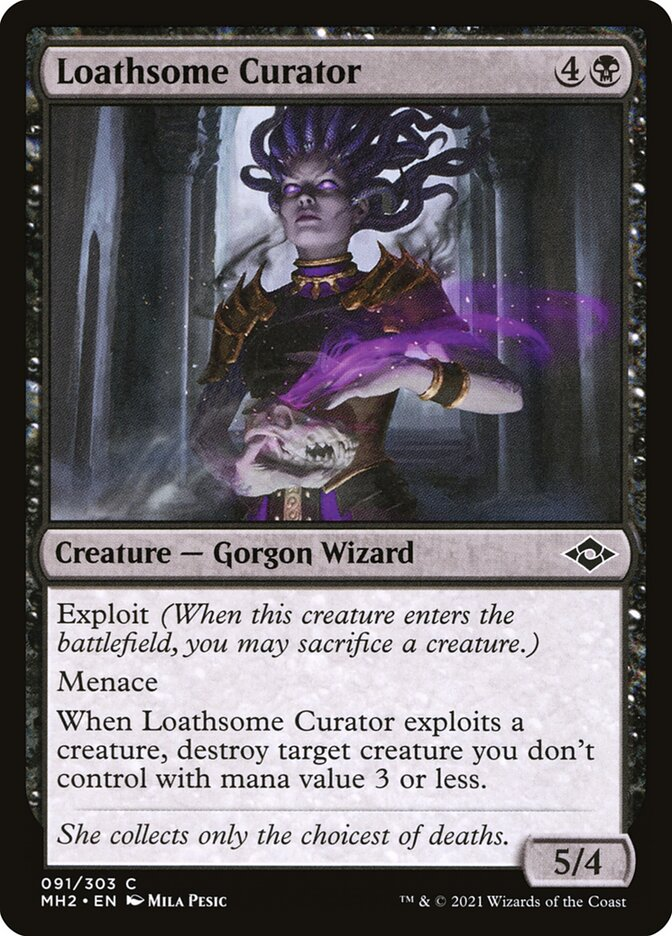
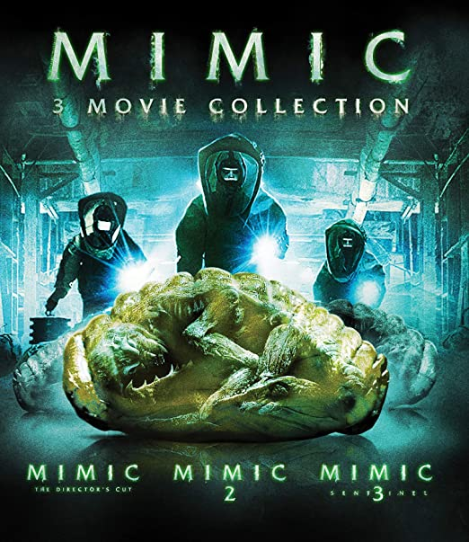
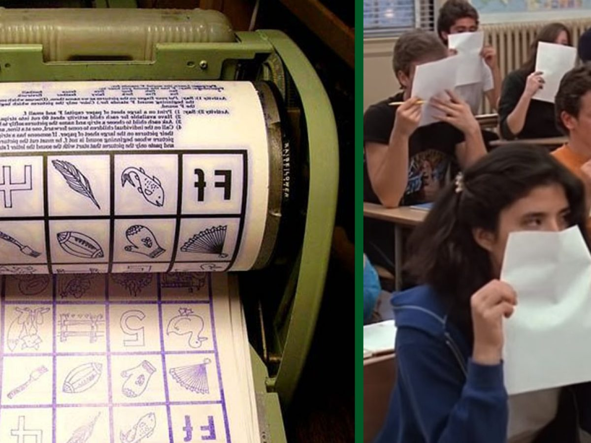

# 咬文嚼字-词根词缀(5-50)

@(TOEFL)[托福, TOEFL, 词根词缀,咬文嚼字]

[toc]

## 同类与异类

> In the process of studying English, it is likely to confuse homograph, homonym, and homophone.
> 在英语学习过程中, 对同形异义词、同音同形异义词 、 同音异形异义词的运用很容易造成混淆.

### 1. homo- 表示“同类的”。源自希腊语 homos " {41}

| 单词          | 解释                                                         | 单词          | 解释                                                         |
| ------------- | ------------------------------------------------------------ | ------------- | ------------------------------------------------------------ |
| homo∙gene∙ity | homo-  表示“同类的”。源自希腊语 homos "same." gene-  = birth, produce, 表示“出生，产生”，医学上引申为“生殖或基因”。 -ity  表名词，指具备某种性质。 | homo-graph    | homo-  表示“同类的”。源自希腊语 homos "same." 更多同源词... graph-  = write, 表示“写，图”。源自希腊语 graphein 1 . a word that is spelled in the same way  as one or more other words but is different in meaning , e . g . the verb " project " and the noun " project ." |
| homo∙log∙ate  | homo-相同 + log-说话 + -ate  homo-  表示“同类的”。源自希腊语 homos "same." log-  = speak, 表示“说话”，更倾向于知识阶层的‘说’，所以经常引申为...学。源自希腊语 logos "speech, word, reason." -ate  表动词，“做，造成”。 | homo∙morph∙ic | homo-相同 + morph-形状 + -ic  homo-  表示“同类的”。源自希腊语 homos "same." morph-  = form, shape, 表示“形状”。派生的 morphin- 专指“吗啡”。源自希腊语 morphe "form, shape"。 -ic  表形容词，“…的”。 |
| hemo-the-ism  | heno + the-神 + -ism (一神教) **`homo-`** 表示“同类的”。源自希腊语 homos "same." **`the-`** = god， 表示“神”。源自希腊语 theos "god." **`-ism`** 抽象名词后缀，表示“…主义”；“宗教”；“制度、行为”；“…学”、“…术”、“…论”、“…法”；“疾病名称”；“情况、状态”等。 词源说明(童理民)   1 - heno-,一，theism,有神论。即只信奉一个神，但是不否认其它神的存在，也不排斥别人信仰其它神。 | Homosexusl    | 相同+sex+形容词后缀=同性恋者 Bisexual →bi前缀表示双+sex+形容词后缀=双性恋者 |

### 2. hetero- 表示“异类，异种”。源自希腊语 heteros "one of two, other."{25}

| 单词              | 解释                         | 单词             | 解释                   |
| ----------------- | ---------------------------- | ---------------- | ---------------------- |
| hetero-phobia     | 异形恐惧症                   | hetero-sexual    | 异性的，异性爱的       |
| hetero-chromosome | 异性染色体                   | hetero-sexuality | 异性爱                 |
| hetero-clite      | 反常的人（或事），不规则明朝 | hetero-dox       | a. 非正统的，异端的    |
| hetero-doxy       | 非正统，异端                 | hetero-gene-ity  | 异种，异质，不同成分   |
| hetero-gen-eous   | 异种的，异质的               | hetero-gen-ous   | 异源的，异形的，异种的 |
| hetero-genesis    | 世代交替，异形生殖，自然发生 | hetero-logy      |                        |
| hetero-morph-ic   | 异形的，异态的               | hetero-morph-ism | 异态性，异态想象       |
| hetero-nomy       | 他治，受制于人               | heter-onym       | 同形异义词             |
| hetero-phor-ia    | 隐斜视                       | hetero-osis      | 杂种优势               |
| hetero-plasmy     |                              |                  |                        |

## 厚礼蟹忒的小词后缀

### **`-ule`** 表名词，“小…”。源自拉丁语 -ulus, 小词后缀{23}

| 单词                               | 解释                                                         | 单词 | 解释 |
| ---------------------------------- | ------------------------------------------------------------ | ---- | ---- |
| **mole-cule** 【ˈmɑːlɪkjuːl】 | n. 分子, 些微 推荐：mole-堆 + -cule小 → 很小的东西堆在一起 → 分子。 mole∙cule  [词根树] **`-ule`** 23 表名词，“小…”。源自拉丁语 -ulus, 小词后缀。 **`mole-`**  = heap, 表示“堆”。源自拉丁语 moles "heavy bulk, mass, massive structure." |animal-cule|微动物|
|antenn-ule|小触角|barb-ule|鱼的触须，鸟的羽小支|
|caps-ule|太空舱，航天舱，胶囊|cell-ule|小细胞|
|lun-ule|半月形的东西|gran-ule|小粒，细粒，颗粒|
|glob-ule|小球，血球，药丸，液滴|mod-ule|单元，模块，组件，模数|
|ferr-ule|金属手杖，金属环，圈套|flos-cule|小花|
|nod-ule|小节，小瘤，小结节|min-usc-ule|小书写体，小写字|
|pil-ule|小药丸|plum-ule|胚芽，绒羽|
|pust-ule|脓疱|spher-ule|小球，小球体|
|tub-ule|小管，细胞|||
|zon-ule|小带|||

### -ular 表形容词，“有…形状或性质的”。源自拉丁语 -ulus, 小词后缀{41}

| 单词                              | 解释                                                         | 单词                            | 解释                                                         |
| --------------------------------- | ------------------------------------------------------------ | ------------------------------- | ------------------------------------------------------------ |
| **ang∙ular** 【ˈæŋɡjələr】   | a. 有角的, 消瘦的, 有尖角的, 生硬的 推荐 ang-角 + ular。 **`ang-`** = to bend, 表示“弯或钩”。 **`-ular`** 表形容词，“有…形状或性质的”。源自拉丁语 -ulus, 小词后缀。 摩西英语(摩西) angular ['æŋgjʊlə] adj. [生物] 有角的；angle ['æŋg(ə)l] n.角。为啥一个是angle另一个是angul呢？这现象叫syncope ['sɪŋkəpɪ] n.字中音省略，即angul的重音第一音节后的元音脱落了。顺便说一句，English中的Engl指的就是来自欧洲大陆“钩型”（成角度）地区渡海到不列颠的Anglo盎格鲁人。 | **ang∙ular** 【ˈæŋɡjələr】 | a. 有角的, 消瘦的, 有尖角的, 生硬的 推荐 ang-角 + ular。 **`ang-`** = to bend, 表示“弯或钩”。 **`-ular`** 表形容词，“有…形状或性质的”。源自拉丁语 -ulus, 小词后缀。 摩西英语(摩西) angular ['æŋgjʊlə] adj. [生物] 有角的；angle ['æŋg(ə)l] n.角。为啥一个是angle另一个是angul呢？这现象叫syncope ['sɪŋkəpɪ] n.字中音省略，即angul的重音第一音节后的元音脱落了。顺便说一句，English中的Engl指的就是来自欧洲大陆“钩型”（成角度）地区渡海到不列颠的Anglo盎格鲁人。 |
| **vas-cular** 【ˈvæskjələr】 | a. 血管的, 维管的 推荐：vas-管 + -cular  **`-ular`** 表形容词，“有…形状或性质的”。源自拉丁语 -ulus, 小词后缀。 **`vas-`** = vessel, 表示“管状的”，引申为“容器”。 词源说明(童理民)   1 - 来自拉丁语 vas,容器，词源同 vase,vessel.-cul,小词后缀，引申词义血管。 |                                 |                                                              |
|                                   |                                                              |                                 |                                                              |

### **`-ar`** 表形容词，“…的”。源自拉丁语 -alis, adjective suffix{50}

| 单词                                | 解释                                                         | 单词 | 解释 |
| ----------------------------------- | ------------------------------------------------------------ | ---- | ---- |
| **molecul∙ar** 【məˈlekjələr】 | a. 分子的, 由分子组成的 推荐：molecule【分子】 + -ar表形容词。 **`molecule`** n. 分子, 些微 **`-ar`** 表形容词，“…的”。源自拉丁语 -alis, adjective suffix. |      |      |
|                                     |                                                              |      |      |
|                                     |                                                              |      |      |

##  -some ：表形容词，“充满…的，具有…倾向的{48}

| 单词                                      | 解释                                                         | 单词                                     | 解释                                                         |
| ----------------------------------------- | ------------------------------------------------------------ | ---------------------------------------- | ------------------------------------------------------------ |
| **fear-some **           【ˈfɪrsəm】 | fear  n. 恐怖, 害怕, 担心 v. 害怕, 恐惧, 为...担心, 敬畏 making people feel very frightened | **wear∙i∙some**  【ˈwɪrisəm】       | weary  a. 疲倦的, 萎靡的, 厌倦的, 厌烦的 vt. 使疲倦, 使厌烦 vi. 疲乏, 生厌, 不耐烦 that makes you feel very bored and tired |
| adventure-some                            | 冒险性的                                                     | awe-some                                 | 引起敬畏的，可怕的                                           |
| further-some                              | 有利的                                                       | **hand-some**[^4] 【ˈhænsəm】       | 英俊的，大方的，慷慨的，相当可观的  |
| hum-our-some                              | 幽默滑稽的，古怪的                                           | bore-some                                | 烦人的                                                       |
| bother-some                               | 讨厌的                                                       | ful-some                                 | 过度的，过分的，令人生厌的                                   |
| irk-some                                  | 厌恶的，讨厌的令人厌烦的                                     | **loath-some** [^4] 【ˈloʊðsəm】    | a. 讨厌的, 可恶的, 令人憎恶的 推荐：loath【厌恶的】 + -some, 形容词后缀。  **`loath`** a. 不情愿的, 厌恶的 **`-some`** 表形容词，“充满…的，具有…倾向的”。 词源说明(童理民)   1 - 来自 loath,厌恶的，-some,形容词后缀。 |
| looth-some                                | 讨厌的，令人恶心的，可厌的                                   | plague-some                              | 讨厌的，瘟疫的，麻烦的                                       |
| tire-some                                 | 累人的，烦人的                                               | trouble-some                             | 麻烦的，令人讨厌的                                           |
| worr-i-some                               | 令人烦恼的，麻烦的，劳碌命的                                 | nettle-some                              | 烦人的，容易发怒的                                           |
| pick-some                                 | 吹毛求疵的                                                   | quarrel-some                             | 喜欢争吵的，好争论的                                         |
| mdddle-some                               | 爱管闲事的，好干涉的                                         | **burden-some** [^1] 【ˈbɜːrdnsəm】 | a. 累赘的, 恼人的, 繁重的 推荐：burden【负担】 + -some, 形容词后缀。 **`burden`** n. 负担, 重载, 担子, 责任 vt. 装货于, 烦扰, 使负担 **`-some`** 表形容词，“充满…的，具有…倾向的” |
| lumber-some                               | 沉重的                                                       | cumber-some                              | 笨重的，麻烦的，累赘的                                       |
| toil-some                                 | 费力的，辛苦的                                               | labor-some                               | 费力的，吃力的                                               |
| gamble-some                               | 喜欢赌博/投机的                                              | tangle-some                              | 紊乱的，复杂的                                               |
| un-wholesome                              | 不为什的，不适合健康的                                       | whole-some                               | 有益健康的，合乎卫生的                                       |
| dark-some                                 | 微暗的，阴暗的，阴沉的                                       | dole-some                                | 悲哀的，寂寞的                                               |
| lone-some                                 | 寂寞的                                                       | frolic-some                              | 嬉戏的 爱闹着玩的                                            |
| cuddle-some                               | 可拥抱的，可爱的                                             | blithe-some                              | 愉快的，高兴的                                               |
| game-some                                 | 爱玩耍，快乐的，爱闹着玩的                                   | glad-some                                | 高兴地，快乐的，愉快的                                       |
| light-some                                | 柔软的，勤快的                                               | mettle-some                              | 精神饱满的，有生气的，勇敢的                                 |
| play-some                                 | 爱打趣的，多趣的，开玩笑的                                   | win-some                                 | 引人注目的，迷人的，可爱的                                   |
| tooth-some                                | 可口的，美味的                                               |                                          |                                                              |

## `ced-` / `ceed-` / `cess-` = go away; withdraw, yield {45}

>  表示“走开，撤退，屈服” 源自拉丁语 cedere "to go, withdraw, yield."

| 单词                                             | 解释                                                         | 单词                                                 | 解释                                                         |
| ------------------------------------------------ | ------------------------------------------------------------ | ---------------------------------------------------- | ------------------------------------------------------------ |
| **pro-ceed   **               【proʊˈsiːd】 | vi. 继续进行, 进行, 开始, 发出, 起诉 推荐：pro-向前 + ceed-走 → 向前走 → 前进。 **`pro-`** 表示“向前，在前”，变体包括 pur-, por-。 **`ceed-`**  词源说明(童理民)   1 - pro-,向前，-ceed,走，词源同 accede,concede.引申诸相关词义。 | **re-cess **               【ˈriːses , rɪˈses】 | n. 休息, 休会, 放假, 凹进处, 深处 vt. 使凹进 vi. 休假, 休息 推荐：re-回 + cess-走 → 回到停止状态 → 休息。 **`re-`** 表示“向后，往回，相反，相对，再”，或仅作强调用，在元音前 red-, reh-。源自拉丁语 re-, red- "backward, again." **`cess-`** = go away; withdraw, yield, 表示“走开，撤退，屈服”。源自拉丁语 cedere "to go, withdraw, yield." 词源说明(童理民)   1 - 来自 recede,后退，-ss,过去分词格。此处形容词作名词，引申诸相关词义。 |
| **inter-cess-or**  【ˌɪntə'sesə】           | n. 仲裁者, 调解人 推荐：inter-在…中间 + cess-走 + -or, 表人。 **`inter-`** 表示“在…之间，相互，内”。由 in- + ter-（土地）组成。在医学领域 enter- 表示“小肠”，已单独列出。 **`cess-`** = go away; withdraw, yield, 表示“走开，撤退，屈服”。源自拉丁语 cedere "to go, withdraw, yield." **`-or`** 表示“人或物”，是施动者名词。是拉丁语后缀 -tor 的俗化（可能受英语本土后缀 -er 的影响）形式。 | **cess-ion **          【ˈseʃn】                | n. 割让, 转让 推荐：cess-走，离开 + -ion，此处词义进一步强调为投降，割让。 **`cess-`** = go away; withdraw, yield, 表示“走开，撤退，屈服”。源自拉丁语 cedere "to go, withdraw, yield." **`-ion`** 表名词，“行为、动作、状态、过程、结果；物品”等。 词源说明(童理民)   1 - 来自 cede,走，离开，词源同 cease,cessation.此处词义进一步加强为投降，割让。 |
| **in∙cess∙ant** 【ɪnˈsesnt】                | a. 不断的, 不绝的, 无尽的 推荐：in-不，非 + cess-走，离开 + -ant即不离开的，不停止的。 **`in-`** 表示“无，没有（not,opposite）”，来自拉丁语 in-。 **`cess-`** = go away; withdraw, yield, 表示“走开，撤退，屈服”。源自拉丁语 cedere "to go, withdraw, yield." **`-ant`** 表形容词，“…的”。 词源说明(童理民)   1 - in-,不，非，-cess,走，离开，词源同 cease,concession.即不离开的，不停止的。 | **in∙cess∙ancy**  【ɪn'sesnsɪ】                 | n. 不间断性 推荐：in-不，非 + cess-走，离开 + -ancy, 表名词 **`in-`** 表示“无，没有（not,opposite）”，来自拉丁语 in-。 **`cess-`** = go away; withdraw, yield, 表示“走开，撤退，屈服”。源自拉丁语 cedere "to go, withdraw, yield." **`-ancy`** = -ance, 表示“性质，状况”。 |
| **cess∙pool**  【ˈsɛˌspul】                 | n. 污水坑, 化粪池 推荐：cess-离开 + pool【池】  cess- = go away; withdraw, yield, 表示“走开，撤退，屈服”。源自拉丁语 cedere "to go, withdraw, yield." **pool** n. 池, 水塘, 石油层, 撞球, 联营 vt. 合伙经营, 共享, 采掘, 汇聚成 vi. 汇合成塘, 淤积, 联营 词源说明(童理民)   1 - 可能来自 recess 和 pool 的合成词。 | **cess-pit** 【ˈsespɪt】                        | n. 粪坑, 垃圾坑 推荐：cess-离开 + pit【坑】  **`cess-`** = go away; withdraw, yield, 表示“走开，撤退，屈服”。源自拉丁语 cedere "to go, withdraw, yield." **pit** n. 深坑, 矿井, 果核, 地窖, 深渊, 绝境, 陷阱 vt. 窖藏, 使凹下, 使有麻点, 去...之核, 使留疤痕, 使相斗, 使竞争 vi. 起凹点, 凹陷 词源说明(童理民)   1 - 来自 cesspool 和 pit 的合成词。 |
| an-cest-or                                       | 祖先，祖宗                                                   | ancest-ry                                            | 祖先，世系，名门出身                                         |
| ante-cess-or                                     | 先行者，先驱者                                               | pre-de-cess-or                                       | 前任，先辈，前身                                             |
| ante-cede                                        | 在....之前，居...之先                                        | abs-cess                                             | 脓肿                                                         |
| cess-ation                                       | 停止                                                         | ceas-e                                               | 停止                                                         |
| cess-er                                          | 期限，责任的终止                                             | ced-e                                                | 割让                                                         |
| se-ced-e                                         | 正式脱离/退出，分离                                          | se-cess-ion                                          | 脱离，分离                                                   |
| ex-ceed                                          | vt. 超过，超越，胜过                                         | ex-cess                                              | n. 过度，剩余,超过，超额                                     |
| ne-cess-ary                                      | a. 必要的，必然的 n. 必需品                                  | ne-cee-it-arian                                      | 必然论的                                                     |
| ne-cess-itous                                    | 贫乏的，贫苦的，紧迫的，必须的                               | ac-cess                                              | 通道，入口，使用权                                           |
| suc-ceed                                         | 成功，继承，继续                                             | suc-cess-ion                                         | 先行，优先                                                   |
| suc-cess-ive                                     | 继承的，连续的                                               | pre-cess-ion                                         | 优先，优先权                                                 |
| ac-ced-e                                         | 同意，正式加入，就任，继任                                   | a-ced-ia                                             | 倦怠，漠然                                                   |
| **in-cess-ant** 【ɪnˈsesnt】                | a. 不断的, 不绝的, 无尽的 推荐：in-不，非 + cess-走，离开 + -ant即不离开的，不停止的。  **`in-`** 表示“无，没有（not,opposite）”，来自拉丁语 in-。 **`cess-`** = go away; withdraw, yield, 表示“走开，撤退，屈服”。源自拉丁语 cedere "to go, withdraw, yield." **`-ant`** 表形容词，“…的”。 词源说明(童理民)   1 - in-,不，非，-cess,走，离开，词源同 cease,concession.即不离开的，不停止的。 |                                                      |                                                              |

## -ile 表形容词，“…的”。源自拉丁语 -ilis, adjective suffix.{43}

| 单词                            | 解释                                                         | 单词 | 解释 |
| ------------------------------- | ------------------------------------------------------------ | ---- | ---- |
| **serve-ile** 【ˈsɜːvaɪl】 | a. 奴隶的, 奴性的, 卑屈的 推荐：serv-服务 + -ile, 表形容词 → 为[主人]服务的 → 奴隶的。  serve  vt. 可作...用, 服务, 经历, 招待, 供应, 送交, 对待  vi. 服务, 服役, 侍应, 适合, 有用, 开球 n. 发球, 轮到发球 -ile 表形容词，“…的”。源自拉丁语 -ilis, adjective suffix. 词源说明(童理民)   1 - 来自拉丁语 servus,奴隶，奴仆，词源同 serve,服侍。-ile,形容词后缀。申词义奴性的。 |      |      |
|                                 |                                                              |      |      |
|                                 |                                                              |      |      |

## dom 名词后缀，表示“身份”,“地位”,“职务”,“职位”,“统治”,“界”,“领域”等{41}

> 源自古英语 -dom, abstract suffix indicating "state, condition, or power."

| 单词                            | 解释                                                         | 单词                            | 解释                                                         |
| ------------------------------- | ------------------------------------------------------------ | ------------------------------- | ------------------------------------------------------------ |
| **star-dom** 【ˈstɑːrdəm】 | n. 明星身份, 明星们 推荐：star【星】 + dom名词后缀，表身份。  **`star`**  **`-dom`**  词源说明(童理民)   1 - star,明星，-dom,表状态。 | **serf-dom** 【ˈsɜːrfdəm】 | n. 农权制, 农奴地位, 农奴境遇, 奴役 推荐：serf【农奴】 + -dom表状态。引申词义农奴制。  serf n. 农奴, 奴隶, 服苦役的人 -dom 名词后缀，表示“身份”,“地位”,“职务”,“职位”,“统治”,“界”,“领域”等。 源自古英语 -dom, abstract suffix indicating "state, condition, or power." |
|                                 |                                                              |                                 |                                                              |
|                                 |                                                              |                                 |                                                              |

## mal- = bad, wretched, 表示“坏，恶” {41}

| 单词                                                    | 解释                                                         | 单词                                                 | 解释                                                         |
| ------------------------------------------------------- | ------------------------------------------------------------ | ---------------------------------------------------- | ------------------------------------------------------------ |
| dis-mal                                                 |                                                              | mal-ice                                              |                                                              |
| mal-function                                            |                                                              | mal-adapt-ive                                        |                                                              |
| **mal-ison   **                         【mælɪzn】 | n. 诅咒, 咒骂 单词笔记   ［添加］ **`mal-`** = bad, wretched, 表示“坏，恶”。源自拉丁语 malus "bad, male, ill." |                                                      |                                                              |
| mal-nourish-ed                                          |                                                              | mala-dict-ion                                        |                                                              |
| mal-adjust-ed                                           |                                                              | mal-administer                                       |                                                              |
| mal-adroit                                              |                                                              | mal-apportion-ed                                     |                                                              |
|                                                         |                                                              | mal-aprop                                            |                                                              |
| mal-ism 【meɪlɪzm】                                | The evil of the world(现世邪恶说)                            | male-dict-ory                                        |                                                              |
| mal-afct-ion                                            |                                                              | male-vol-ence                                        |                                                              |
| mal-feas-ant                                            |                                                              | mal-feasance                                         |                                                              |
| mal-treat                                               |                                                              | mal-aise                                             |                                                              |
| mal-odour                                               |                                                              | mal-odor                                             | **`odor`** n. 气味, 香味, 名声, 意味                         |
| **mal-aise** 【məˈleɪz】                           | n. (广泛存在的)难以捉摸的问题，无法描述的问题;莫名的不适(或不快、不满等) 推荐：mal-坏的，不良的 + aise "ease", 轻松，简单，和 ease 同源。 **`mal-`** = bad, wretched, 表示“坏，恶”。源自拉丁语 malus "bad, male, ill." 词源说明(童理民)   1 - 来自古法语 malaise,困难，忍受，痛苦，来自 mal-,坏的，不良的，aise,轻松，简单，词源同ease,disease.引申词义生病，不适，不舒服。 | **mal-ady                        ** 【ˈmælədi】 | n. 病, 疾病, 弊病 **`mal-`** = bad, wretched, 表示“坏，恶”。源自拉丁语 malus "bad, male, ill." 词源说明(童理民)   1 - 来自古法语 malade,病的，病态的，来自拉丁语 male habitus,感觉病恹恹的，情况不好的，来自 male,坏的，habitus,持，握，习惯，词源同 habit,habitable.引申词义坏习惯，痼疾，疾病等。 |
|                                                         |                                                              |                                                      |                                                              |

## cip- / cipt- = head, 表示“头”。源自拉丁语 caput "head" {40}

英语中有为数不少的词，其终极词源可以一直追溯到拉丁语**caput**（头），**capital**即为其中之一。它来自**caput**的派生词***capitālis 'of the head'***，因此最初也表示“头的”。

英国诗人弥尔顿（John Milton, 1608-1674）在长诗《失乐园》中写了(Serpent's) capital bruise（头部的伤痕）这样的字句，其中**capital**一词即含此义。

**capital**的几个常用词义均与“头”有联系。旧时一个人犯了**capital crime**（死罪）被判以**capital sentence**（死刑）或被处以**capital punishment**（极刑），不是被砍头就是被绞死。

**capital letter**（大写字母）一般多位于句首和词首。**capital**还用以指“首都”、“首府”，该用法出自弥尔顿笔下，始见于《失乐园》。

**capital**用以指“资本”则始于用牛的头数计算财富的时代，但这一用法直至18世纪才通用起来。

除了capital，源自拉丁语**caput**的英语常用词还有

- **cape**（海角）

- **captain**（队长，船长）

- **decapitate**（斩首）

- **chapter**（章，回）

- **precipice**（悬崖）

  > pre-,在前，-cip,头，词源同 cap,captain.即头在前，一头栽下，引申词义陡坡，陡崖，悬崖等。

- **precipitate**（突然下降；促成；沉淀）等。

**摩西英语(摩西)**

chaperon这个单词与cap棒球帽、cape袍子、escape逃脱（run out of the cape）、chief主要的、chieftain酋长、captain队长、capital首都以及chef厨师长（head cooker）和chattel动产；奴隶（财富的体现，论“头”数）等同根，而这个词根与head同源。袍子或斗篷等，或者有一个帽兜来盖头，或从头套着穿。

| 单词                                    | 解释                                                         | 单词                                   | 解释                                                         |
| --------------------------------------- | ------------------------------------------------------------ | -------------------------------------- | ------------------------------------------------------------ |
| **pre∙cip∙ice** 【ˈpresəpɪs】      | n. 悬崖, 绝壁, 险境 推荐： pre-前 + cip-头 + -ice → 前面是尽头 → 悬崖。 **`pre-`** 表示“…前的，预先”，来自拉丁语，一般放在动词性词根前。 **`cip-`** = head, 表示“头”。源自拉丁语 caput "head" **`-ice`** 表名词，“行为，状态”。 | **pre∙cipit∙ous** 【prɪˈsɪpɪtəs】 | a. 陡峭的, 轻率的 推荐： pre-在前 + cipit-头 + -ous形容词后缀。引申词义陡峭的，仓促的，贸然的。 **`pre-`** 表示“…前的，预先”，来自拉丁语，一般放在动词性词根前。 **`cipit-`** = head, 表示“头”。源自拉丁语 caput "head" **`-ous`** 表形容词，表示“…的”，用于化学领域表示“亚酸的，低价（金属）的”。 词源说明(童理民)   1 - 来自 precipitate,一头栽下，-ous,形容词后缀。引申词义陡峭的，仓促的，贸然的。 |
| **pre∙cipit∙ant** 【prɪ'sɪpɪtənt】 | a. 突如其来的, 勇往直前的, 急促的, 径直向下的 n. 沉淀剂 **`pre-`** 表示“…前的，预先”，来自拉丁语，一般放在动词性词根前。 **`cipit-`** = head, 表示“头”。源自拉丁语 caput "head" **`-ant`** 表形容词，“…的”。 -ant 表名词，“…剂”。 | **caps-ize** 【ˈkæpsaɪz】         | v. 翻覆, 倾覆 推荐： caps-头 + -ize, 表动词。即头往下栽的。 **`cap-,cipit-`** = head, 表示“头”。源自拉丁语 caput "head" **`-ize`** 动词后缀，一般缀于形容词后。-ise 是英式英语，-ize 是美式英语。源自希腊语 -izein, verbal suffix. 词源说明(童理民)   1 - 可能来自 cap-,头，见 captain,拼写受 size 俗化。即头往下栽的。 |
| **cheif-tain**  【ˈtʃiːftən】      | n. 酋长, 首领 推荐：chief【领袖】 + -tain  **`-ain`** 表名词，“…人”。 **`chief`** n. 领袖, 酋长, 长官, 主要部分 a. 主要的, 首位的 词源说明(童理民)   1 - 来自 chief,主要的。 |                                        |                                                              |

## pel-  / puls- = drive, push, 表示“驱动，推”{35}

> 源自拉丁语 pellere "to push, drive, strike," appellare "to drive to."

| 单词                                       | 解释                                                         | 单词                                                | 解释                                                         |
| ------------------------------------------ | ------------------------------------------------------------ | --------------------------------------------------- | ------------------------------------------------------------ |
| **ex-pel **               【ɪkˈspel】 | vt. 驱逐, 逐出, 排出, 开除 推荐：ex-出 + pel-推 → 推出 → 开除。  ex- 表示“从，从...离开，从...向外，向外，向上”，来自PIE *eghs, 向外。 pel- = drive, push, 表示“驱动，推”。源自拉丁语 pellere "to push, drive, strike," appellare "to drive to." 词源说明(童理民)   1 - ex-,向外，-pel,驱使，词源同 pulse,impel. | **ex-puls-ion                 ** 【ɪkˈspʌlʃn】 | n. 逐出, 开除, 驱逐, 排气 推荐：ex-出 + puls-推 + -ion, 表名词 → 推出去 → 驱逐。  ex-  表示“从，从...离开，从...向外，向外，向上”，来自PIE *eghs, 向外。 puls- = drive, push, 表示“驱动，推”。源自拉丁语 pellere "to push, drive, strike," appellare "to drive to." -ion 表名词，“行为、动作、状态、过程、结果；物品”等。 词源说明(童理民)   1 - 来自 expel,驱逐。 |
|                                            |                                                              |                                                     |                                                              |
|                                            |                                                              |                                                     |                                                              |

## -arian 表形容词或名词，“…的(人)” {35}

| 单词                             | 解释                                                         | 单词 | 解释 |
| -------------------------------- | ------------------------------------------------------------ | ---- | ---- |
| **agr-arian** 【əˈɡreriən】 | a. 土地的, 耕地的 推荐：agr-土地 + -arian表形容词 → 土地的。  agr- = field, land, 表示“田地，农业”等。源自希腊语 agros "field," 同时通过拉丁语进入英语。 -arian 表形容词或名词，“…的(人)”。 词源说明(童理民)   1 - agra-,农业，来自 ag-,做，词源同 act,agent. |      |      |
|                                  |                                                              |      |      |
|                                  |                                                              |      |      |

## lect-

### 1. = choose, gather, 表示“选择，收集”{34}

> 源自拉丁语 legere "to gather, choose, pluck, read."

| 单词                                          | 解释                                                         | 单词                                                   | 解释                                                         |
| --------------------------------------------- | ------------------------------------------------------------ | ------------------------------------------------------ | ------------------------------------------------------------ |
| **col-lect              **   【kəˈlekt】 | v. 收集, 聚集, 集中, 搜集 a. 由收到者付款的 ad. 由收到者付款地 推荐：col-共同 + lect-选择 → 放在一起选择 → 收集。  **`col-`** 来自拉丁语介词com，表示“与...一起，一起（with, together）”，或仅做强调。源自拉丁语 com "with (collective and intensive prefix.)" **`lect-`** = choose, gather, 表示“选择，收集”。源自拉丁语 legere "to gather, choose, pluck, read." 词源说明(童理民)   1 - col-,表强调，-lect,收集，选出，词源同 elect,college. | **ec-lect-ic**                      【ɪˈklektɪk】 | n. 折衷主义者 a. 选择的, 折衷的 推荐：ec-向外 + lect-收集 + -ic。 **`ec-`** 表示“从，从...离开，从...向外，向外，向上”，来自PIE *eghs, 向外。 **`lect-`** = choose, gather, 表示“选择，收集”。源自拉丁语 legere "to gather, choose, pluck, read." **`-ic`** 表形容词，“…的”。 词源说明(童理民)   1 - ec-,向外，-lect,选，收集，词源同 elect,collect. |
|                                               |                                                              |                                                        |                                                              |
|                                               |                                                              |                                                        |                                                              |

### 2. = speak, read, 表示“讲，读” {13}

> 源自希腊语 legein "to gether, speak."

| 单词                           | 解释                                                         | 单词 | 解释 |
| ------------------------------ | ------------------------------------------------------------ | ---- | ---- |
| **lect-ern** 【ˈlektərn】 | n. 诵经台 推荐：lect-读 + -ern  lect- = speak, read, 表示“讲，读”。源自希腊语 legein "to gether, speak." -ern 表名词，“…场所”。 词源说明(童理民)   1 - 来自拉丁语 legere,读，词源同 lecture.原指教堂的读经台，后用来指讲台。 |      |      |
|                                |                                                              |      |      |
|                                |                                                              |      |      |

## eu- 表示“好，优秀”。源自希腊语 eu- " {34}

| 单词                                 | 解释                                                         | 单词 | 解释 |
| ------------------------------------ | ------------------------------------------------------------ | ---- | ---- |
| **eu-karyo-te**  【jʊ'kærɪəʊt】 | n. 真核细胞（等于eucaryote） 推荐：eu-好 + karyo-核 + -ote  **`eu-`** 表示“好，优秀”。源自希腊语 eu- "well." **`karyo-`** 表示“核”，生物学前缀。源自希腊语 karyon "nut, kernel," |      |      |
|                                      |                                                              |      |      |
|                                      |                                                              |      |      |

## loqu- = speak, 表示“说话”。源自拉丁语 loqui "to speak."{34}

| 单词                                                         | 解释                                                         | 单词                                          | 解释                                                         |
| ------------------------------------------------------------ | ------------------------------------------------------------ | --------------------------------------------- | ------------------------------------------------------------ |
| **col-loq**                                                  | n. 口语, 口语用法, 口语词, 方言, 口语体 a. 口语的, 非正式的, 用通俗口语的, 会话的 **`loqu-,locu-`** = speak, 表示“说话”。源自拉丁语 loqui "to speak." **`col-`** 来自拉丁语介词com，表示“与...一起，一起（with, together）”，或仅做强调。源自拉丁语 com "with (collective and intensive prefix.)" | **col-loqu-ia**     【kəˈləʊkwiəm】      | n. (学术)讨论会, (学术讨论会上的)报告（colloquium的复数） **`col-`** 来自拉丁语介词com，表示“与...一起，一起（with, together）”，或仅做强调。源自拉丁语 com "with (collective and intensive prefix.)" **`loqu-`** = speak, 表示“说话”。源自拉丁语 loqui "to speak."  |
| **col-loqu-ial**                         【kəˈloʊkwiəl】 | a. 会话的, 口语的, 口语体的 推荐：col-共同 + loqu-说 + -ial表形容词 → 共同说 → 口语。  **`col-`** 来自拉丁语介词com **`loqu-`** = speak, 表示“说话”。源自拉丁语 loqui "to speak." **`-ial`** 表形容词，“…的”，一般缀于名词后。源自拉丁语 -alis, adjective suffix. 词源说明(童理民)   1 - col-,表强调，-loq,说话，词源同 locution,loquacious. | **col-loqu-qal-sim** 【kəˈloʊkwiəlɪzəm】 | n. 口语, 口语用法, 口语词, 方言, 口语体 推荐：colloquial【口语的】 + -ism  **`colloquial`** a. 会话的, 口语的, 口语体的 **`-ism`** 抽象名词后缀，表示“…主义”；“宗教”；“制度、行为”；“…学”、“…术”、“…论”、“…法”；“疾病名称”；“情况、状态”等。 |
|                                                              |                                                              |                                               |                                                              |

 

## gn-,gnos-,gnor- 30= know, 表示“知道”{30}

> 源自拉丁语 (g)noscere "to get to know."

| 单词                           | 解释                                                         | 单词                            | 解释                                                         |
| ------------------------------ | ------------------------------------------------------------ | ------------------------------- | ------------------------------------------------------------ |
| **narr-ate**  【ˈnæreɪt】 | v. 说故事, 说明, 叙述 推荐：na-=gno-知道 + -r(r)拉丁语现在不定式格 + -ate, 表动，词引申词义叙述，告知。  **`-ate`** 表动词，“做，造成”。 **`gn-,gnos-,gnor-`** 30= know, 表示“知道”。源自拉丁语 (g)noscere "to get to know." 词源说明(童理民)   1 - 来自拉丁语 narrare,告知，解释，来自 PIE*gno,去知道，了解， 词源同 can,know.引申词义叙述，告知。字母 g 脱落，-r,拉丁语现在不定式格，比较 affair,fact. | **narrator** 【ˈnæreɪtər】 | n. 讲述者, 叙述者 推荐：narrate【叙述】 + -or, 表人，是单词narrate 派生的动作执行者（施动）名词。  narrate v. 说故事, 说明, 叙述 -or 表示“人或物”，是施动者名词。是拉丁语后缀 -tor 的俗化（可能受英语本土后缀 -er 的影响）形式。 切换词根显示方式 词源说明(童理民)   1 - 来自 narrate,叙述。 |
| **keen**[^1] 【kiːn】     | a. 敏锐的; 强烈的; 敏捷的; 热心的; 着迷的; 渴望的 v. 恸哭, 哀号 推荐： 源自古英语cene "bold, brave, fearless."  **`gn-,gnos-,gnor-`** = know, 表示“知道”。源自拉丁语 (g)noscere "to get to know." 词源说明(童理民)   1 - 来自古英语 cene,勇敢的，来自 Proto-Germnaic*kan,有能力的，来自 PIE*gno,知道，了解，词源同 can,know.引申词义渴望的，热切的。 |                                 |                                                              |
|                                |                                                              |                                 |                                                              |

## van- = empty, 表示“空”。源自拉丁语 vanus "empty," vacare "to be empty," vastus "empty, waste."{29}

| 单词                         | 解释                                                         | 单词 | 解释 |
| ---------------------------- | ------------------------------------------------------------ | ---- | ---- |
| **van-ity** 【ˈvænəti】 | n. 虚荣心, 虚无, 自负, 空虚, 时髦的小摆饰 推荐：van-空 + -ity, 表名词 → 心里空空 → 虚荣心。  **`van-`**= empty, 表示“空”。 **`-ity`** 表名词，指具备某种性质。 词源说明(童理民)   1 - 来自 vain,自负的，虚无的，徒劳的，词源同 vainglory. |      |      |
|                              |                                                              |      |      |
|                              |                                                              |      |      |

## simil- = alike, same, 表示“相类似，一样”{29}

> 源自拉丁语 simulare "to make like, imitate, copy, represent."

| 单词                                          | 解释                                                         | 单词                                                         | 解释                                                         |
| --------------------------------------------- | ------------------------------------------------------------ | ------------------------------------------------------------ | ------------------------------------------------------------ |
| **dis-simil-itude** 【ˌdɪssɪ'mɪlɪtju:d】 | n. 相异, 不同, 相异点 推荐：dis-不 + similitude【相似】  **`dis-`** 来自拉丁语dis-，表示“分开，散开”，引申词义“离开，无，没有，缺乏，表相反等”。 该前缀在字母 g, l, m, r, s, v 前缩写为 di-；在字母f前同化为 dif-。 **`simil-`** = alike, same, 表示“相类似，一样”。 源自拉丁语 simulare "to make like, imitate, copy, represent." **`-itude`** 表名词，“性质，状态等”。源自拉丁语 -tindo, abstract noun suffix. | **dissimilat-ion  **                           【dɪˌsɪməˈleɪʃən】 | n. 异化, 异化作用 推荐：dissimilate【vt. (使)变得不同】 + -ion, 表名词，是单词dissimilate 派生的名词。 **`dissimilate`** v. (使)变得不同 **`-ion`** 表名词，“行为、动作、状态、过程、结果；物品”等。 |
|                                               |                                                              |                                                              |                                                              |
|                                               |                                                              |                                                              |                                                              |

## junct- = join, 表示“结合，连接”。源自拉丁语 iugum "yoke," iungere "to join."{27}

| 单词                           | 解释                                                         | 单词 | 解释 |
| ------------------------------ | ------------------------------------------------------------ | ---- | ---- |
| **ad-junct** 【ˈædʒʌŋkt】 | n. 附属物, 附件, 助手, 修饰语 a. 附属的 adjunct professor：〈美〉副教授  推荐：ad-增加 + junct-连接 → 加上连接 → 附属物；助手。  ad- 来自拉丁介词ad, 表示“朝、向、去，或弱化为强调”。 junct- = join, 表示“结合，连接”。源自拉丁语 iugum "yoke," iungere "to join." 词源说明(童理民)   1 - ad-,去，往，-junct,连接，词源同 join,juncture. |      |      |
|                                |                                                              |      |      |
|                                |                                                              |      |      |

## cret- = grow, make, 表示“增长，产生”{24}

> 源自拉丁语 creare "to bring forth, create, produce;" crescere "to grow, increase."

| 单词                         | 解释                                                         | 单词                              | 解释                                                         |
| ---------------------------- | ------------------------------------------------------------ | --------------------------------- | ------------------------------------------------------------ |
| **ac-cret** 【æ'kri:t】 | vi. 连生, 合生, 附依 vt. 使依附, 使连接 a. 合生的 推荐：ac- + cret-增长 + -e→ 长到一起 → 依附。  **`ac-`** 来自拉丁介词ad, 表示“朝、向、去，或弱化为强调”。 **`cret-`**= grow, make, 表示“增长，产生”。源自拉丁语 creare "to bring forth, create, produce;" crescere "to grow, increase." | **accret-ion ** 【əˈkriːʃn】 | n. 自然增大, 添加, 添加物, 连生 推荐：accrete【增长】 + -ion名词后缀，是单词accrete 派生的名词。  **`accrete`** vi. 连生, 合生, 附依 vt. 使依附, 使连接 a. 合生的 **`-ion`** 表名词，“行为、动作、状态、过程、结果；物品”等。 词源说明(童理民)   1 - ac-,去，往，-cre,生长，词源同 create,生长，创造。指长到一起，堆积。 |
|                              |                                                              |                                   |                                                              |
|                              |                                                              |                                   |                                                              |

## retro- 表示“向后，倒退，之前”。源自拉丁语 retro "backward, back, behind." {23}

| 单词       | 解释                                                         | 单词 | 解释 |
| ---------- | ------------------------------------------------------------ | ---- | ---- |
| retro-rear | n. 后面, 背后, 后方 a. 后面的, 背面的, 后方的 vt. 养育, 培养, 饲养, 举起, 树立, 栽种 vi. 高耸, 暴跳 retro- 表示“向后，倒退，之前”。源自拉丁语 retro "backward, back, behind." 词源说明(童理民)   1 - 来自（缩写自）拉丁语 retro,后面的，词源同 retroactive,retrospect.引申俚语词义屁股。 2 - 来自古英语 raeran,升起，上升，来自 Proto-Germanic*risana,上升，举起，来自 PIE*rei,上升，举起，词源同 rise,raise.引申词义抚养，养育。 |      |      |
|            |                                                              |      |      |
|            |                                                              |      |      |

## -arian 表形容词或名词，“…的(人)”{25}

| 单词                                         | 词根                                                         | 单词                                             | 词根                                                         |
| -------------------------------------------- | ------------------------------------------------------------ | ------------------------------------------------ | ------------------------------------------------------------ |
| **total∙it∙arian**  【toʊˌtæləˈteriən】 | a. 极权主义的 n. 极权主义者 推荐：total【全部的】 + -itarian,缩写自 authoritarian,极权主义者。 total a. 全体的, 总的, 全然的 vt. 计算...的总和, 共计为 vi. 合计 n. 总数, 全体, 合计 ad. 统统 -arian 表形容词或名词，“…的(人)”。  词源说明(童理民)   1 - total,全部的，-itarian,缩写自 authoritarian,极权主义者。 | **totalitarianism** 【toʊˌtæləˈteriənɪzəm】 | n. 极权主义 推荐：totalitarian【a. 极权主义的】 + -ism抽象名词后缀，表示“...主义，思想” totalitarian a. 极权主义的 n. 极权主义者 -ism 抽象名词后缀，表示“…主义”；“宗教”；“制度、行为”；“…学”、“…术”、“…论”、“…法”；“疾病名称”；“情况、状态”等。 |
|                                              |                                                              |                                                  |                                                              |
|                                              |                                                              |                                                  |                                                              |

## cas- = fall, 表示“落下，降临”。源自拉丁语 cadere "to fall, die."{25}

| 单词                         | 解释                                                         | 单词                             | 解释                                                         |
| ---------------------------- | ------------------------------------------------------------ | -------------------------------- | ------------------------------------------------------------ |
| **cas-ual** 【ˈkæʒuəl】 | a. 偶然的, 不经意的, 便装的 n. 临时工, 待命士兵 推荐：cas-落下 + -ual表形容词 → 落下的 → 不是安排好的 → 偶然的。  **`cas-`** = fall, 表示“落下，降临”。源自拉丁语 cadere "to fall, die." **`-ual`** 表形容词，“…的”，一般缀于名词后。源自拉丁语 -alis, adjective suffix. 词源说明(童理民)   1 - 来自 cad-,掉落，词源同 case,accident. | **casual-ty** 【ˈkæʒuəlti】 | n. 意外事故, 伤亡, 受害者 推荐：casual【偶然的】 + -ty → [突然]落下的事 → 事故。  **casual** a. 偶然的, 不经意的, 便装的 n. 临时工, 待命士兵 **`-ty`** 表名词，用在形容词后，把形容词变成名词。 词源说明(童理民)   1 - 来自 cad-,掉落，词源同 case,accident.原指偶然伤亡者，不幸者。 |
|                              |                                                              |                                  |                                                              |
|                              |                                                              |                                  |                                                              |

## quis- = seek, search, 表示“寻求，询问” {24}

| 单词                                  | 解释                                                         | 单词 | 解释 |
| ------------------------------------- | ------------------------------------------------------------ | ---- | ---- |
| **ac-quis-ition** 【ˌækwɪˈzɪʃn】 | n. 获得, 获得物 推荐：ac-去、往 + quis-获得 + -ition表名词  ac- 来自拉丁介词ad, 表示“朝、向、去，或弱化为强调”。 quis- = seek, search, 表示“寻求，询问”。 -ition  表名词，“行为、动作、状态、过程、结果；物品”等。 |      |      |
|                                       |                                                              |      |      |
|                                       |                                                              |      |      |

## sign- = mark, 表示“记号，信号”。源自拉丁语 signum "identifying mark, sign." {24}

| 单词                               | 解释                                                         | 单词 | 解释 |
| ---------------------------------- | ------------------------------------------------------------ | ---- | ---- |
| **sign-ature** 【ˈsɪɡnətʃər】 | n. 签字, 识别标志, 调号 推荐：sign【签字】 + -ature, 表名词。  **`sign-`** = mark, 表示“记号，信号”。源自拉丁语 signum "identifying mark, sign." **`-ature`** 表名词，通常在单词或词根以t结尾时使用，表示“一般状态，行为”。 词源说明(童理民)   1 - 来自 sign,签字，签署，签约，-ate,使，-ure,名词后缀。引申诸相关词义。 |      |      |
|                                    |                                                              |      |      |
|                                    |                                                              |      |      |

## lus- = play, 表示“玩，戏剧”。源自拉丁语 ludere (过去分词 lusus) "to play."{22}

| 单词                                             | 解释                                                         | 单词                                               | 解释                                                         |
| ------------------------------------------------ | ------------------------------------------------------------ | -------------------------------------------------- | ------------------------------------------------------------ |
| **il-lus-ion                 ** 【ɪˈluːʒn】 | n. 幻影, 错觉, 幻想 推荐：il-使 + lus-玩 + -ion名词后缀 → 被(幻觉)玩弄 → 幻觉。  **`il-`** [^3]来自拉丁语in-，表示“在内，进入，使...”。 **`lus-`** = play, 表示“玩，戏剧”。源自拉丁语 ludere (过去分词 lusus) "to play." **`-ion`** 表名词，“行为、动作、状态、过程、结果；物品”等。 词源说明(童理民)   1 - il-,进入，使，-lus,玩乐，玩耍，词源同 ludic,elude,elusive.引申词义玩弄，欺骗，虚幻。 | **dis-illusion **             【ˌdɪsɪˈluːʒn】 | n. 觉醒, 幻灭 vt. 使醒悟, 使幻想破灭 推荐：dis-不，非，使相反 + illusion【幻想】。  **`dis-`** 来自拉丁语dis-，表示“分开，散开”，引申词义“离开，无，没有，缺乏，表相反等”。 该前缀在字母 g, l, m, r, s, v 前缩写为 di-；在字母f前同化为 dif-。 **`illusion`** n. 幻影, 错觉, 幻想 切换词根显示方式 词源说明(童理民)   1 - dis-,不，非，使相反，illusion,幻想。 |
|                                                  |                                                              |                                                    |                                                              |
|                                                  |                                                              |                                                    |                                                              |

## bat- = beat, 表示“打、击”{21}

| 单词    | 解释                                                         | 单词 | 解释 |
| ------- | ------------------------------------------------------------ | ---- | ---- |
| **bat** | n. 蝙蝠; 球棒; 令人生厌的妇女 v. 击球; 眨眼 单词笔记   ［添加］ 推荐： 1.棍子，词源同beat, 击，打。 2.蝙蝠，词源不详，可能来自拟声词，模仿蝙蝠扇动翅膀的声音。 |      |      |
|         |                                                              |      |      |
|         |                                                              |      |      |

### batty（古怪的）：令人反感的蝙蝠

英语单词**batty**是从**bat**（蝙蝠）一词衍生出来的形容词，按照构词法应该解释为“跟蝙蝠有关的”。

为什么**batty**含有“古怪的，疯狂的”这样的负面含义呢？原来，这与东西方的文化差异有关。在东方文化中，蝙蝠是“福”的象征，因为“蝠”字与“福”字发音接近。但在西方人的眼中，生活在阴暗洞穴里、长相丑陋怪异的蝙蝠是魔鬼的化身，传说中的吸血鬼就多半有着蝙蝠那样的翅膀。因此，由蝙蝠（bat）衍生出来的形容词batty就有了“古怪的、疯狂的”等负面含义。

- **batty**：['bætɪ] adj.古怪的，疯狂的
- **bat**：[bæt] n. 蝙蝠；球棒；球拍
- a**s blind as bat**：有眼无珠，像蝙蝠一样盲目

### battery（电池）：能连续发射炮弹的炮组

英语单词**battery**（电池）原本是动词**bat**（击打）的名词形式，源自中古法语名词***batterie***，其中的***batt***来自拉丁语动词***battuere***（击打）。

**battery**最初表示“连续重击”，后来衍生出“轰炸”之意，后来又被用来表示包含一组火炮或炮台，因为包含多门火炮的火炮组能够不间断地连续发射炮弹。

电池问世后，还没有合适的名称。美国科学家本.富兰克明便将电池也称为**battery**，因为电池能像火炮组一样连续发射电荷。跟**battery**同源的单词有**bat**（击打、球棒）和**batter**（击球手、猛击）、**battle**（战役）等。

- **battery**：['bæt(ə)rɪ] n. 电池，蓄电池n. 殴打n. 炮台，炮位
- **bat**：[bæt] n. 蝙蝠；球棒；球拍v. 用球棒击球；击球率达…；轮到击球
  **batter**：['bætɚ] n. 击球手；（用鸡蛋、牛奶、面粉等调成的）糊状物；墙面的倾斜vt. 猛击；打坏；使向上倾斜vi. 接连猛击；向上倾斜
- **battle**： ['bætl] n. 战役；斗争vi. 斗争；作战vt. 与…作战

## solv- = loosen, 表示“松开”。源自拉丁语 solvere "to loose, untie."{20}

| 单词                            | 解释                                                         | 单词 | 解释 |
| ------------------------------- | ------------------------------------------------------------ | ---- | ---- |
| **ab-solv-e** 【əbˈzɑːlv】 | vt. 宣告...无罪, 赦免, 免除 推荐：ab-离开 + solv-松开 + -e → 松开 → 免罪。  **`ab-`** 表示从，来自（from）；从...离开，离开（away from, sway, off）；不，非，表否定（not, opposite）。 **`solv-`** = loosen, 表示“松开”。源自拉丁语 solvere "to loose, untie." 词源说明(童理民)   1 - ab-,离开，solve,溶解，解开，解决。用于法律用语指宣告无罪，无罪释放。 |      |      |
|                                 |                                                              |      |      |
|                                 |                                                              |      |      |

## mer- = part, 表示“部分，分配”，并由分配引申为“奖励”{20}

> 源自希腊语 méros "part." {20}

| 单词                                                         | 解释                                                         | 单词 | 解释 |
| ------------------------------------------------------------ | ------------------------------------------------------------ | ---- | ---- |
| **telo-mer-ase **                            【təˈloʊməˌreɪz】 | n. 端粒酶  **`tele-`** = further, 表示“远”，引申为“电”，电从远方来。源自希腊语 tele "far off." **`mer-`** = part, 表示“部分，分配”，并由分配引申为“奖励”。源自希腊语 méros "part." **`-ase`** = enzyme, 表示“...酶”。 an enzyme in eukaryotic cells that can add telomeres to the ends of chromosomes after they divide |      |      |
|                                                              |                                                              |      |      |
|                                                              |                                                              |      |      |

## men- = project, 表示“伸出、突出”，引申为“引导（管理）”，“威胁”{19}

> 源自拉丁语 minae "projecting points, threats;" -minere "to project, jut, threaten."

| 单词                       | 解释                                                         | 单词 | 解释 |
| -------------------------- | ------------------------------------------------------------ | ---- | ---- |
| **menace** 【ˈmenəs】 | n. 威胁, 胁迫 v. 威吓, 胁迫 men- = project, 表示“伸出、突出”，引申为“引导（管理）”，“威胁”。源自拉丁语 minae "projecting points, threats;" -minere "to project, jut, threaten." |      |      |
|                            |                                                              |      |      |
|                            |                                                              |      |      |

### menace（威吓）：以喊叫威胁的方式驱赶牲畜

> 来自拉丁语 minari,突出，升出，来自 PIE*men,突出，升出，词源同 mountain,minatory.引申词义威胁。

古代人放牧、驱赶牲畜时比较粗暴简单，通常通过喊叫、威胁或鞭打的方式来驱赶牲畜，这种方式在拉丁语中叫做***minare***，进入法语后拼写为***mener***。

英语单词**menace**（威胁）就来源于此，本意指的是驱赶牲畜时人所发出的叫喊声、威胁声，兼有“威胁”和“驱策”的含义。后来“驱策”的含义逐渐消失，仅仅表示“威胁、恐吓”，变成了**threaten**的同义词。

还有一个单词也来源于此，那就是***amenable***，由a（=to，面对）+mener（驱赶、领导）+able（能够），字面意思就是“能够面对领导”，引申为“顺从的、易于管教、易于屈服、容易被说服的”，还可以表示“负有责任的、经得起检验的”。要注意这个词与**amend**（改善）并没有关系。

- **menace**：['menəs] n.v.威胁，恐吓
- **minacious**： [mɪ'neʃəs] adj. 威吓的
- **minatory**：['mɪnə,təri] adj. 恐吓的，威胁的
- **amenable**：[ə'miːnəb(ə)l] adj.顺从的，肯接受的；负有责任的；经得起检验的
- **promenade**：[,prɑmə'ned] 
  - v. 散步，漫步；骑马
  - n. 散步；舞会；骑马
  - adj. 散步的

## articul- = skill, joint, trick, 表示“技巧，关节，诡计”{18}

| 单词                                                         | 解释                                                         | 单词 | 解释 |
| ------------------------------------------------------------ | ------------------------------------------------------------ | ---- | ---- |
| **articul-ate** 【ɑːrˈtɪkjuleɪt】 【ɑːrˈtɪkjələt】 | a. 发音清晰的, 口才好的 vt. 明白地说, 以关节连接, 使成为系统的整体 推荐：articul-连接 + -ate，指音节间“连接”流畅。  **`articul-`** = skill, joint, trick, 表示“技巧，关节，诡计”。 **`-ate`** 表形容词，“具有…的”。 词源说明(童理民)   1 - 来自 art-,连接，词源同 art,arm. |      |      |
|                                                              |                                                              |      |      |
|                                                              |                                                              |      |      |

## agr- = field, land, 表示“田地，农业”等。源自希腊语 agros "field," 同时通过拉丁语进入英语{17}

| 单词                             | 解释                                                         | 单词 | 解释 |
| -------------------------------- | ------------------------------------------------------------ | ---- | ---- |
| **agr-arian** 【əˈɡreriən】 | a. 土地的, 耕地的 推荐：agr-土地 + -arian表形容词 → 土地的。  agr- = field, land, 表示“田地，农业”等。源自希腊语 agros "field," 同时通过拉丁语进入英语。 -arian 表形容词或名词，“…的(人)”。 词源说明(童理民)   1 - agra-,农业，来自 ag-,做，词源同 act,agent. |      |      |
|                                  |                                                              |      |      |
|                                  |                                                              |      |      |

## err- = wander, mistake, 表示“漫游”，引申为“犯错误（偏离）”{17}

> 源自拉丁语 errare "wander."

| 单词                        | 解释                                                         | 单词 | 解释 |
| --------------------------- | ------------------------------------------------------------ | ---- | ---- |
| **err-and** 【ˈerənd】 | n. 任务, 差使, 使命 推荐：err-漫游 + -and。  **`err-`** = wander, mistake, 表示“漫游”，引申为“犯错误（偏离）”。源自拉丁语 errare "wander." 词源说明(童理民)   1 - 来自 PIE*ei,走，离开。其现在分词 ion,过去分词 it,词源同 exit,itinerary,该词来自其拉丁语现在主动不完全格 ire. |      |      |
|                             |                                                              |      |      |
|                             |                                                              |      |      |

## glu-,glutin- = glue，表示“胶”。源自拉丁语 gluten "glue."{17}

| 单词                      | 解释                                                         | 单词 | 解释 |
| ------------------------- | ------------------------------------------------------------ | ---- | ---- |
| **clutch** 【klʌtʃ】 | n. 抓紧, 掌握, 离合器, 一窝小鸡 vt. 抓住, 踩汽车离合器踏板 vi. 抓 推荐：词源同cling, clench。  **`glu-,glutin-`** = glue，表示“胶”。源自拉丁语 gluten "glue." 词源说明(童理民)   1 - 词源同 cling,clench. |      |      |
|                           |                                                              |      |      |
|                           |                                                              |      |      |

## etho- = nation, 表示“民族；性情（民族情感）”{16}

> 源自希腊语 ethnos "band of people living together, nation;" ethos "custom, disposition, trait."

| 单词                         | 解释                                                         | 单词 | 解释 |
| ---------------------------- | ------------------------------------------------------------ | ---- | ---- |
| etho-logy 【ɪˈθɑlədʒi】 | n. 性格学, 生态学, 特性论 推荐：etho-民族 + -logy学，学科 etho-  = nation, 表示“民族；性情（民族情感）”。源自希腊语 ethnos "band of people living together, nation;" ethos "custom, disposition, trait." -logy  = science, 表示“科学，学科” |      |      |
|                              |                                                              |      |      |
|                              |                                                              |      |      |

## ourt- 16表示“围起来的一个庭院”，引申为“朝廷”。{16}

> 而朝廷是容易让人“阿谀奉承”的。源自古法语 cort, 源自拉丁语 cohors (词根 cohort-) "enclose yard, company of soldiers, multitude."

| 单词                              | 解释                                                         | 单词                               | 解释                                                         |
| --------------------------------- | ------------------------------------------------------------ | ---------------------------------- | ------------------------------------------------------------ |
| **court-esy**  【ˈkɜːrtəsi】 | n. 礼貌, 谦恭, 好意 推荐：court【宫廷】 + -esy，宫廷礼仪。  **`court-`** 表示“围起来的一个庭院”，引申为“朝廷”。而朝廷是容易让人“阿谀奉承”的。 词源说明(童理民)   1 - 来自 court,宫廷，宫廷礼仪。 | **court-esan  【ˈkɔːrtɪzn】** | n. 高等妓女, 名妓  **`court-`** 表示“围起来的一个庭院”，引申为“朝廷”。而朝廷是容易让人“阿谀奉承”的。源自古法语 cort, 源自拉丁语 cohors (词根 cohort-) "enclose yard, company of soldiers, multitude." 词源说明(童理民)   1 - 来自 [court](https://choices-stories-you-play.fandom.com/wiki/Main_Character_(A_Courtesan_of_Rome)),宫廷。原指宫廷艺伎。 |
|                                   |                                                              |                                    |                                                              |
|                                   |                                                              |                                    |                                                              |

## turb- = stir, 表示“搅动”。源自希腊语 turbe "tumult, disorder."{16}

| 单词                            | 解释                                                         | 单词 | 解释 |
| ------------------------------- | ------------------------------------------------------------ | ---- | ---- |
| **per-turb** 【pərˈtɜːrb】 | vt. 扰乱, 使混乱, 使心绪不宁 推荐：per-完全的 + turb-转动，引申词义搅动，使焦虑，不安等。  per- 表示“完全，贯穿，自始至终，向前”。forth, ford 是其同源词。 turb- = stir, 表示“搅动”。源自希腊语 turbe "tumult, disorder." 词源说明(童理民)   1 - per-,完全的，-turb,转动，词源同 turn,turbid.引申词义搅动，使焦虑，不安等。 |      |      |
|                                 |                                                              |      |      |
|                                 |                                                              |      |      |

## sol-,solid-,sold- = firm, whole，表示“坚固，完整”{15}

> 源自拉丁语 solidus "solid," sollus "whole, entire, unbroken."

| 单词                                                     | 解释                                                         | 单词                           | 解释                                                         |
| -------------------------------------------------------- | ------------------------------------------------------------ | ------------------------------ | ------------------------------------------------------------ |
| **sol-um**  【səʊləm】                              | n. 土壤表层 **`sol-`** = foundation, 表示“基础”。源自拉丁语 solum "bottom, foundation." | **sol-emn**  【ˈsɑːləm】  | a. 严肃的, 郑重的, 庄严的 推荐：sol-=全部的 + emn=enn=ann，表“年”。该词本义是“每年都会发生的”，如节日，人们庆祝方式较隆重。 **`ann-,enn-`** = year, 表示“年，一年”。源自拉丁语 annus "year." **`sol-,solid-,sold-`** = firm, whole，表示“坚固，完整”。源自拉丁语 solidus "solid," sollus "whole, entire, unbroken." 词源说明(童理民)   1 - 来自拉丁语 solemnis/sollemnis,仪式的，宗教节日的，一年一度的， 来自 sollennis,年度的，固定的，来自 sollus,整个的，完整的，词源同 solid,-enn,年，词源同 annual,biennial.引申词义庄严的，郑重的，严肃的等。 |
| **solem-ity **                       【səˈlemnəti】 | n. 严肃, 一本正经 推荐：solemn【严肃的】 + -ity, 表名词。 solemn a. 严肃的, 郑重的, 庄严的 -ity 表名词，指具备某种性质。 词源说明(童理民)   1 - solemn,仪式的，-ity,名词后缀。引申诸相关词义。 简明例句 ●to observe the solemnities of the occasion 遵守这一盛典的礼仪 | solem-ize 【ˈsɑːləmnaɪz】 | vt. 隆重庆祝, 隆重纪念, 使庄严, 使严肃 推荐：solemn【严肃的】 + -ise, 表动词  **`solemn`** a. 严肃的, 郑重的, 庄严的 **`-ise`** 动词后缀，一般缀于形容词后。-ise 是英式英语，-ize 是美式英语。源自希腊语 -izein, verbal suffix. |
| **solemnize-ation ** 【ˌsɒləmˌnaɪzeɪʃən             | n. 隆重庆祝, 举行仪式, 庄严化 推荐：solemnize【使庄严】 + -ation表名词  solemnize vt. 隆重地庆祝, 庄重举行, 使庄严 -ation 表名词，“行为、动作、状态、过程、结果；物品”等。 |                                |                                                              |
|                                                          |                                                              |                                |                                                              |

## -esque 表形容词，“如…的” {13}

| 单词                                    | 解释                                                         | 单词 | 解释 |
| --------------------------------------- | ------------------------------------------------------------ | ---- | ---- |
| **picture-esque** 【ˌpɪktʃəˈresk】 | a. 生动的, 如画的, 独特的, 别致的, 栩栩如生的 推荐：picture【画】 + -esque像…的 → 像图画的。  pict-,pig-,paint = paint, 表示“描画” 源自拉丁语 pingere "to make pictures, to paint",  -esque 表形容词，“如…的”。 词源说明(童理民)   1 - 来自 picture,图片，照片，-esque,形容词后缀。比喻用法。 |      |      |
|                                         |                                                              |      |      |
|                                         |                                                              |      |      |

## bon- = good, 表示“好”。源自拉丁语 bonus "good."{12}

| 单词                         | 解释                                                         | 单词                       | 解释                                                         |
| ---------------------------- | ------------------------------------------------------------ | -------------------------- | ------------------------------------------------------------ |
| **boon** 【buːn】       | n. 恩惠 推荐：bon-好，词源同bonus。  **`bon-`** 12= good, 表示“好”。源自拉丁语 bonus "good." 词源说明(童理民)   1 - 词源同 bonus. | **bonus** 【ˈboʊnəs】 | n. 奖金, 红利   推荐： bon-好 + -us。  **`bon-`**  = good, 表示“好”。源自拉丁语 bonus "good." |
| **bon-n-ie**  【bɒnɪ】  | a. 漂亮的 **`bon-`**  = good, 表示“好”。源自拉丁语 bonus "good." | boni-face                  | n. 小旅店的老板，小餐馆老板 n. （Boniface）（美、肯、法）博尼费斯（人名） 推荐：boni-好 + face【脸】  **`boni-`** = good, 表示“好”。源自拉丁语 bonus "good." **`face-`** = face, 表示“脸，面”。源自拉丁语 facies "shape, face." |
| **bon-n-y**  【ˈbɑːni】 | a. 漂亮的 推荐：bon-好，漂亮 + -y, 表形容词。 **`bon-`** = good, 表示“好”。源自拉丁语 bonus "good." **`-y`** 表形容词，加在名词后变成形容词。 |                            |                                                              |

### bonus（红利）：股票持有人除股息之外的更多收益

> bonus原系拉丁语单词，意思是“好”或“好处”。约在美国独立战争前后，bonus被借入英语，第一次用于现在的词义，即“额外给予的东西”、“奖金”或“红利”，但仍然保留了原拉丁文拼写形式。

1733年，英国第一家证券交易所在一家名叫乔纳森的咖啡馆成立。1802年获得英国政府的正式批准。这家证券交易所即为现在伦敦证券交易所的前身。

早期人们对股票还不熟悉，为了劝说人们购买股票，证券交易商会大力向人们解释购买股票的各种收益。其中最基本的一项收益是“股息”（**dividend**），即股票持有人可以按照预定的比率，根据所购买的股份从所投资的公司的盈利中获得收益，就像从银行存款中获得固定比率的利息一样。

另外，与银行存款不一样，在派发股息之后，如果公司还有盈余，股票持有人还有可能进一步瓜分盈余，获得更多收益。当时，英语中并没有一个对应单词用来表示这种股息之外的更多收益。于是证券交易商们借用了拉丁语中的***bonus***一词。该词的本意是“好处”（**good**），英语中表示“好”的词根bene就与此同源。

从此以后，**bonus**一词就成为了对这种更多收益的称呼，中文一般翻译为“红利”。

“股息”（**dividend**）和“红利”（**bonus**）的区别在于：**股息是预先确定收益率的，而红利是没有固定收益率的，可以上下浮动**。

股份公司在派息分红时，首先按照固定收益率向优先股股东发放股息；发完股息后，如果还有盈余，则还可以在扣除企业发展积累金后进一步向普通股东发放红利。

现在，**bonus**一词早已经超越了股票领域，用来泛指固定收益外的各种更多收益，如奖金、给退伍军人发放的一次性费用等，甚至还成为了贿赂的暗语，相当于我们中国人说的“意思意思”。

- **bonus**：['bəʊnəs] n.奖金，红利，津贴，额外收益
- **dividend**：['dɪvɪdend] n.股息，被除数

## radic- = root, 表示“根”， 和 root 同源。源自拉丁语 radix "root."{12}

| 单词                                | 解释                                                         | 单词 | 解释 |
| ----------------------------------- | ------------------------------------------------------------ | ---- | ---- |
| **e-radic-ate** 【ɪˈrædɪkeɪt】 | vt. 根除, 扑灭, 根绝, 消灭 推荐：e-=ex-表out of，词根radic-表示植物的根，-ate动词后缀  e- 表示“从，从...离开，从...向外，向外，向上”，来自PIE *eghs, 向外。 radic- = root, 表示“根”， 和 root 同源。源自拉丁语 radix "root." -ate 表动词，“做，造成”。 词源说明(童理民)   1 - e-,向外，-rad,根，词源同 radish,root.即连根拔起，根除。 |      |      |
|                                     |                                                              |      |      |
|                                     |                                                              |      |      |

## cro-,cru- = hook, bend, 表示“钩子；弯曲”{12}

| 单词                             | 解释                                                         | 单词 | 解释 |
| -------------------------------- | ------------------------------------------------------------ | ---- | ---- |
| **en-croach** 【ɪnˈkroʊtʃ】 | vi. 侵犯, 侵蚀, 蚕食 推荐：en-进入，使 + croach-钩子，词源同crook, crochet。  **`cro-,cru-`** = hook, bend, 表示“钩子；弯曲”。 **`en-`** 表示“入、内、在...之内、使...”，来自古法语 en- 词源说明(童理民)   1 - en-,进入，使，-croach,钩子，词源同 crook,crochet. |      |      |
|                                  |                                                              |      |      |
|                                  |                                                              |      |      |

## -ode 

### 1. 表示“电极 {11}

**`-ode`** 表示“电极”。源自希腊语 hodos "way, journey."
更多同源词... 

| 单词                                       | 解释                                                         | 单词                          | 解释                                                         |
| ------------------------------------------ | ------------------------------------------------------------ | ----------------------------- | ------------------------------------------------------------ |
| **an-ode**  【ˈænoʊd】                | an-  = up, above, 表示“上”，和前缀 ana- 同源。           | **cat-hode** 【ˈkæθoʊd】 | **`cat-`** 表示“向下，相反，离开”。源自希腊语 kata "down." **`-hode`** 表示“电极”。源自希腊语 hodos "way, journey." |
| **eletr-ode**          【ɪˈlektroʊd】 | electr-  = electric, 表示“电的”。来自古希腊语 elektron "amber." | **di-ode** 【ˈdaɪoʊd】   | **`di-`**  表示“两个，双”。源自希腊语 dis "twice;" dikha "in two." |
| **tri-od**e 【traɪəʊd】               | **`tri-`** 表示“三”。源自希腊语 tri- "three."                | **tetr-ode** 【tetrəʊd】 | **`tetr-`**  表示“四”。源自希腊语 tetra- "four."         |
| **quadr-ode** 【kwɒdrəʊd】            | quadr-  = four, 表示“四”。源自拉丁语 quattuor "four."    | **pent-ode** 【pentəʊd】 | **`pent-`**  表示“戊，五”。源自希腊语 pente "five."      |
| **hept-ode** 【heptəud】              | **`hept-`**  表示“七”。源自希腊语 hepta "seven."         |                               |                                                              |

### 2. =like,表示“像”，一般用于希腊语借词{?}

1

## -acle 表名词，“…物品，状态”{11}

| 单词                              | 解释                                                         | 单词 | 解释 |
| --------------------------------- | ------------------------------------------------------------ | ---- | ---- |
| **tent-acle**   【ˈtentəkl】 | . 触须, 触手, 触角 推荐：tent-伸展 + -acle小词后缀。引申词义触角，触须。  **`tent-`** = stretch, 表示“伸展”，引申为“倾向”等。源自拉丁语 tendere "to stretch, extend." **`-acle`** 表名词，“…物品，状态”。 词源说明(童理民)   1 - 来自拉丁语 tentare,感知，接触，触摸，来自 tendere 的反复格，来自 tendere,拉开，张开，词源同 tend,extend.-acle,小词后缀。引申词义触角，触须。 |      |      |
|                                   |                                                              |      |      |
|                                   |                                                              |      |      |

## infra- = "below, underneath, beneath; later than, smaller, inferior to," 表示“下，低”。源自拉丁语 infra "below." {10}

| 单词                                         | 解释                                                         | 单词 | 解释 |
| -------------------------------------------- | ------------------------------------------------------------ | ---- | ---- |
| **infra-structure** 【ˈɪnfrəstrʌktʃər】 | n. 基础结构, 基础设施 推荐：infra-低于，在下方 + structure【结构】。引申词义基础结构，基础设施。  **`infra-`** = "below, underneath, beneath; later than, smaller, inferior to," 表示“下，低”。源自拉丁语 infra "below." structure n. 结构, 构造, 建筑物 vt. 构成, 组织 词源说明(童理民)   1 - infra-,低于，在下方，structure,结构。引申词义基础结构，基础设施。 |      |      |
|                                              |                                                              |      |      |
|                                              |                                                              |      |      |

## pir- = try, 表示“尝试，冒险”。源自拉丁语 periclum "trail, danger," experiri "to try, learn by tring," peira "trial, attempt." {10}

| 单词                             | 解释                                                         | 单词                                                     | 解释                                                         |
| -------------------------------- | ------------------------------------------------------------ | -------------------------------------------------------- | ------------------------------------------------------------ |
| **em-pir-ic**  【em'pɪrɪk】 | n.经验主义者;〈古〉江湖医生；庸医 adj.经验的；以实验为依据的；实验（上）的；（根据）经验的【复数：empirics】 推荐：em-进入 + pir-尝试，冒险 + -ic  **`em-`** 表示“入、内、在...之内、使...”，来自古法语 en-。在字母 b, m, p 前拼写同化为 em-。 **`pir-`** = try, 表示“尝试，冒险”。源自拉丁语 periclum "trail, danger," experiri "to try, learn by tring," peira "trial, attempt." **`-ic`** 表名词，“人或学科”。 | **em-pir-ic-al**                      【ɪmˈpɪrɪkl】 | a. 完全跟据经验的, 经验主义的 推荐：em-进入，使 + pir-尝试，冒险 + -ical表形容词，字面意思即尝试过的，有经验的。  empiric n. 经验主义者, 江湖医生 -al 表形容词，“…的”，一般缀于名词后。源自拉丁语 -alis, adjective suffix. 切换词根显示方式 词源说明(童理民)   1 - em-,进入，使，-pir,尝试，冒险，词源同 pirate,expert.字面意思即尝试过的，有经验的。 |
|                                  |                                                              |                                                          |                                                              |
|                                  |                                                              |                                                          |                                                              |

## par-= get ready, 表示“准备”。源自拉丁语 parare "to try to get, prepare, equip." {9}

| 单词                                | 解释                                                         | 单词 | 解释 |
| ----------------------------------- | ------------------------------------------------------------ | ---- | ---- |
| **ap-par-atus** 【ˌæpəˈrætəs】 | n. 装置, 器具, 器官 【复数：apparatuses】 推荐：ap-加强 + par-准备 + atus表名词 → 准备好用的东西 → 设备。  ap- 来自拉丁介词ad, 表示“朝、向、去，或弱化为强调” par- = get ready, 表示“准备”。源自拉丁语 parare "to try to get, prepare, equip." 词源说明(童理民)   1 - ap-,向，往，-par,准备，词源同 prepare. |      |      |
|                                     |                                                              |      |      |
|                                     |                                                              |      |      |

## nav- = ship, 表示“船”。源自拉丁语 navis "ship."{9}

| 单词                      | 解释                                                         | 单词 | 解释 |
| ------------------------- | ------------------------------------------------------------ | ---- | ---- |
| **nav-y** 【ˈneɪvi】 | n. 海军, 海军人员, 海军军力, 烟蒂 推荐：nav-船 + -y, 表名词，引申词义海军。  **`nav-`** = ship, 表示“船”。源自拉丁语 navis "ship." **`-y`** 表名词，加在形容词或以r结尾的单词后。 更多同源词... |      |      |
|                           |                                                              |      |      |
|                           |                                                              |      |      |

## tric- = petty obstacle, 表示“小障碍”{9}

| 单词                                  | 解释                                                         | 单词                                         | 解释                                                         |
| ------------------------------------- | ------------------------------------------------------------ | -------------------------------------------- | ------------------------------------------------------------ |
| **ex-tric-able ** 【ekstrɪkəbl】 | a. 可救出的, 可解救的 推荐：ex-向外 + tric-繁琐 + -able, 表形容词。  **`ex-`** 表示“从，从...离开，从...向外，向外，向上”，来自PIE *eghs, 向外 **`tric-`** = petty obstacle, 表示“小障碍”。 **`-able`** 一般缀于动词后，构成形容词，表示“可…的，能…”。 | **in∙ex∙tric∙able**  【ˌɪnɪkˈstrɪkəbl】 | a. 逃脱不掉的, 解不开的, 无法解决的 推荐：in-不，非 + extricable【可分开的】。  **`in-`** 表示“无，没有（not,opposite）”，来自拉丁语 in-。 **`extricable`** a. 可救出的, 可解救的 词源说明(童理民)   1 - in-,不，非，extricable,可分开的。 |
|                                       |                                                              |                                              |                                                              |
|                                       |                                                              |                                              |                                                              |

## dign- = worthy, noble, 表示“值得，高贵”。源自拉丁语 dignus "worthy, deserving, fitting." {8}

| 单词                                                        | 解释                                                         | 单词                         | 解释                                                         |
| ----------------------------------------------------------- | ------------------------------------------------------------ | ---------------------------- | ------------------------------------------------------------ |
| **in-dign-ation                    ** 【ˌɪndɪɡˈneɪʃn】 | n. 愤怒, 愤慨, 义愤 推荐：in-不 + dign-高贵 + -ation表名词，是单词indign 派生的名词。  **`indign`** a. <古> 不值得的, 不应得的, 不光彩的 **`-ation`** 表名词，“行为、动作、状态、过程、结果；物品”等。 | **in-dign** 【ɪn'daɪn】 | a. <**古**> 不值得的, 不应得的, 不光彩的 推荐：in-不 + dign-高贵  **`in-`** 表示“无，没有（not,opposite）”，来自拉丁语 in-。 **`dign-`** = worthy, noble, 表示“值得，高贵”。源自拉丁语 dignus "worthy, deserving, fitting.". |
|                                                             |                                                              |                              |                                                              |
|                                                             |                                                              |                              |                                                              |

## barb- = beard, 表示“胡子，倒刺”。源自拉丁语 barba "beard." {7}

| 单词                    | 解释                                                         | 单词 | 解释 |
| ----------------------- | ------------------------------------------------------------ | ---- | ---- |
| **barb** 【bɑːrb】 | n. 倒钩 vt. 装倒钩于 推荐：来自拉丁词barba, 胡子，词源同beard. 形容箭上的钩刺如硬胡茬。  barb- = beard, 表示“胡子，倒刺”。源自拉丁语 barba "beard." |      |      |
|                         |                                                              |      |      |
|                         |                                                              |      |      |

## melior- = better, 表示“更好”，这里 -or 表示比较级{6}

> 源自拉丁语 melior "better."

| 单词                                    | 解释                                                         | 单词                                       | 解释                                                         |
| --------------------------------------- | ------------------------------------------------------------ | ------------------------------------------ | ------------------------------------------------------------ |
| **melior∙ate** 【mi:ljəreɪt】      | v. 改善, 改良, 变好 melior-更好 + -ate, 表动词  **`melior-`** = better, 表示“更好”，这里 -or 表示比较级。源自拉丁语 melior "better." **`-ate`** 表动词，“做，造成”。 词源说明(童理民)   1 - 来自拉丁语 melior,更好的，-or,比较级后缀，来自 PIE*mel,强壮的，有力的，增多的，词源同 multi-,ameliorate. The fat substitute could meliorate the sensory properties of low fat ice cream（脂肪替代品能明显改善低脂冰淇淋的感官品质。） | **a∙melior∙ate**     【əˈmiːliəreɪt】 | v. 改善, 改良, 改进 a-加强 + melior-更好 + -ate, 表动词 → 改善。 **`meliorate`** v. 改善, 改良, 变好 **`a-`** 加在单词前，表示“在…的”；表示“不、无、非”；表示“加强”。源自希腊语 a-, an- "not." 词源说明(童理民)   1 - a-,向，往，-mel,加强，多，词源同 multitude,许多。-ior,比较级后缀。 Steps have been taken to ameliorate the situation.已经采取措施以改善局面。 |
| **a-melior-ant**  【əˈmiːljərənt】 | 改良物 a thing that ameliorates **`a-`** 加在单词前，表示“在…的”；表示“不、无、非”；表示“加强”。源自希腊语 a-, an- "not." **`melior-`**= better, 表示“更好”，这里 -or 表示比较级。源自拉丁语 melior "better." **`-ant`** 表形容词，“…的”。 | **melior-ism**  【miljərɪzəm】        | 社会向善论 the belief that the world can be made better by human effort  **`melior-`** = better, 表示“更好”，这里 -or 表示比较级。源自拉丁语 melior "better." **`-ism`** 抽象名词后缀，表示“…主义”；“宗教”；“制度、行为”；“…学”、“…术”、“…论”、“…法”；“疾病名称”；“情况、状态”等。 词源说明(童理民)   1 - 来自 meliorate,改善，变好，-ism,主义，思想。引申词义社会向善论。 |
| **melior-ity**  【mil'jɒrətɪ】     | 盖上，优越性，进步 the state or condition of being improved melior- = better, 表示“更好”，这里 -or 表示比较级。源自拉丁语 melior "better." -ity 表名词，指具备某种性质。  | **melior-able**                            | 可改善的，可改进的，可改良的                                 |

## mim- = to imitate, 表示“模仿”{6}

| 单词                                      | 解释                                                         | 单词                   | 解释                                                         |
| ----------------------------------------- | ------------------------------------------------------------ | ---------------------- | ------------------------------------------------------------ |
| **mim-ic** 【ˈmɪmɪk】                | a. 模仿的, 摹拟的 n. 效颦者, 模仿者, 小丑, 仿制品 vt. 模仿, 摹拟 推荐：mime【模仿 + -ic形容词后缀。  mim- = to imitate, 表示“模仿”。 -ic 表形容词，“…的”。 词源说明(童理民)   1 - 来自 mime,模仿，-ic,形容词后缀。 | **mime** 【maɪm】 | n. 哑剧, 小丑, 滑稽戏 v. 摸拟表演  **`mime-`** = to imitate, 表示“模仿”。 词源说明(童理民)   1 - 来自拉丁语 mimus,模仿，来自希腊语 mimos,模仿者，小丑，模仿表演艺术家，可能来自拟声词，模仿模仿的声音。引申词义模拟，哑剧等。 |
| **mime-o-graph** [^5] 【mɪmɪəgrɑːf】 | n.滚筒油印机；复写机 v.用油印机油印；用复写器复印推荐：mime【模仿】 + -o- + graph-画，写  mime- = to imitate, 表示“模仿”。 -graph = instrument to record, 表示“（记录)仪器”。源自希腊语 graphein "to scratch, draw, write." |                        |                                                              |
|                                           |                                                              |                        |                                                              |

## Reference

[^1]: 摩西英语(摩西) as keen as mustard极热心的，极感兴趣的。mustard ['mʌstəd] n.芥末；芥菜；深黄色，芥末和热心有啥交集呢？原因就在于芥末经常用来给牛肉调味，所以久而久之强烈的滋味（趣味或味道）就等同于了芥末。He is as keen as mustard in his work.顺便说一下，英语里有很多as x as y格式的习语和成语哦。 

[^2]: root and branch彻底地；全部地；极端地。eradicate [ɪ'rædɪkeɪt] vt.根除；根绝；消灭，这里前缀e-=ex-表out of，词根radic-表示植物的根，-ate动词后缀，那eradicate当真是“根除”。可是有些时候树的枝条也有繁殖能力，所以也不能放过。These evil practices must be destroyed root and branch. 

[^3]: 来自拉丁语in-，表示“在内，进入，使...”。该拉丁语前缀进入古法语和西班牙语时拼写演变为 en-，这些词进入英语后导致在现代英语里少数单词存在两种拼写形式，如 insure, ensure, 确保；inquire, enquire, 查询。该前缀在字母 b, m, p 前拼写变体为 im-；在字母l前拼写同化为 il-；在字母r前拼写同化为 ir-。

[^4]: 摩西英语(摩西) loathsome ['ləʊðs(ə)m] adj.令人憎恶的；令人呕吐的。本身loath [ləʊθ] adj.勉强的，就是个单词，-some后缀是单词some弱化后的体现，如handsome就是easy to handle。英王James一世说抽烟：a custom loathsome to the eye, hateful to the nose, harmful to the brain, dangerous the the lungs...

[^5]: 英语词源趣谈(庄和诚) mimeograph - 1889年美国发明家爱迪生（Thomas A. Edison, 1847-1931）发明（蜡纸）油印机时就以mimeograph命名。该词系由希腊语mīméomai（模仿）和源于希腊语的英语组合语素-graph（含“写”之意）组合而成。在很长一段时间内，mimeograph一直被用作油印机的商标名，到了1948年之后才逐渐变成油印机的属名，以后也用作动词，表示“油印”。
