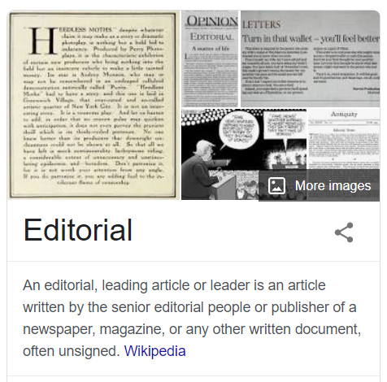

# 咬文嚼字-词根词缀(500-2000)

@(TOEFL)[托福, TOEFL, 词根词缀,咬文嚼字]

[toc]

## 希腊、日耳曼、拉丁

- **拉丁前缀**super-表示over,above，
- **希腊前缀**hyper-
- **日耳曼词源**的单词over同源

- **希腊前缀** **`an-`**表否定，
- 与**拉丁前缀** **`in-`**，比如 innocent ['ɪnəs(ə)nt] adj.无辜的；无知的，n.天真的人；笨蛋（词根noc-表to harm）和 
- **日耳曼前缀** **`un-`**，如unfair不同平的同源。

The word *[syndicate](https://en.wikipedia.org/wiki/Syndicate)* comes from the [French](https://en.wikipedia.org/wiki/French_language) word *syndicat* which means "[trade union](https://en.wikipedia.org/wiki/Trade_union)" (*[syndic](https://en.wikipedia.org/wiki/Syndic)* meaning "administrator"), from the [Latin](https://en.wikipedia.org/wiki/Latin) word *syndicus* which in turn comes from the [Greek](https://en.wikipedia.org/wiki/Ancient_Greek) word σύνδικος (*syndikos*), which means "caretaker of an issue"; compare to [ombudsman](https://en.wikipedia.org/wiki/Ombudsman) or [representative](https://en.wikipedia.org/wiki/Representation_(politics)).[[1\]](https://en.wikipedia.org/wiki/Syndicate#cite_note-1)

**gen- / kin** | **General, King**

希腊拉丁词根**`gen-`**, **`gon-`**表示生产（孩子），与日耳曼词源的**kin** [kɪn]n.亲戚；家族；同族，adj.同类的；有亲属关系的，同源。

大家一起生孩子，就有了宗族的概念。按照这个道理，希腊拉丁人对本族人**generous** ['dʒen(ə)rəs] adj.慷慨的；有雅量的，而日耳曼人对本族人则是**kind** adj.和蔼的；宽容的。 

同样，拉丁人的首长是**general** ['dʒen(ə)r(ə)l] adj.一般的；综合的，n.一般；将军（形容词是说适用于整个宗族），而日耳曼人部落的首领则是**king**。后缀**`-gen`**表示**producer**，比如**hydrogen** ['haɪdrədʒ(ə)n] n.氢，因它燃烧后生成水（hydro-），而日耳曼后缀**`-kind`**，比如**mankind**那是“种类”是“人”。

这样我们也就好理解这三个单词了：

- **akin** [ə'kɪn] adj.类似的；同类的；同族的，那是因为它的意思是“**of the same kin**”，
- 而**kindred** ['kɪndrɪd] adj.同类的；血缘的；同族的，n.家族；相似，后缀**`-red`**表状态，实际就是**hundred**中的**-`red`**，
- 而**kinsman** ['kɪnzmən] n.男性亲戚；同族者，则是本族之人。

## -ion / -ation / -ition  表名词，“行为、动作、状态、过程、结果；物品” {1759}

| 单词                                                         | 解释                                                         | 单词                                                         | 解释                                                         |
| ------------------------------------------------------------ | ------------------------------------------------------------ | ------------------------------------------------------------ | ------------------------------------------------------------ |
| **crit-er-ion**                          【kraɪˈtɪriən】 | **`crit-`**判断 + **`-er`** + **`-ion`**。 即区分的关键，标准。 **`crit-`** = judge, discern, 表示“判断，分辨”。源自希腊语 krinein "to separate, decide, judge." **`-ion`** 表名词，“行为、动作、状态、过程、结果；物品”等。 | **crit-er-ia**                            【kraɪ'tɪriə】 | **`crit-`** = judge, discern, 表示“判断，分辨”。源自希腊语 krinein "to separate, decide, judge." **`-a`** 由希腊语和拉丁语直接进入英语的表示复数的后缀。 |
| **at∙tent∙ion**  【əˈtenʃn】                            | 不要误写成： atten**s**ion 2022年1月24日09:17:15 **`at-`** 来自拉丁介词ad, 表示“朝、向、去，或弱化为强调”。 **`tent-`** = stretch, 表示“伸展”，引申为“倾向”等。源自拉丁语 tendere "to stretch, extend." **`-ion`** 表名词，“行为、动作、状态、过程、结果；物品”等。 | **sub-duct-ion** 【səb'dʌkʃən】                         | n. 俯冲; 除去; 减法;**隐没;隐没作用** 推荐：subduct【vt. 减去, 拿掉】 + -ion  **`subduct`** vt. 减去, 拿掉 |
| **ac-quis-ition** 【ˌækwɪˈzɪʃn】                        | n. 获得, 获得物 推荐：ac-去、往 + quis-获得 + -ition表名词  ac- 来自拉丁介词ad, 表示“朝、向、去，或弱化为强调”。 quis- = seek, search, 表示“寻求，询问”。 -ition  表名词，“行为、动作、状态、过程、结果；物品”等。 |                                                              |                                                              |

## -al / -ial / -ual 表形容词， ”...的“ {1146}

| 单词                                                   | 解释                                                         | 单词                                                         | 解释                                                         |
| ------------------------------------------------------ | ------------------------------------------------------------ | ------------------------------------------------------------ | ------------------------------------------------------------ |
| **genit-al**                         【ˈdʒenɪtl】 | **genit-** = birth, produce, 表示“出生，产生”，医学上引申为“生殖或基因”。 生殖的;生殖器的。 => genit-al-ia | **bacteri-al**                           【bækˈtɪriəl】 | **`bacter-`** = bacterium, 表示“细菌”。源自希腊语 baktron "staff." 细菌的;细菌引起的 |
| **cervic-al** 【ˈsɜːrvɪkl】                       | **cervic-** 表示“颈，宫颈”，多用于医学领域。和表示角的horn同源。源自拉丁语 cervix "neck."  1.子宫颈的connected with the cervix 2. 颈的connected with the neck cervical vertebra 【ˈsɜːrvɪkl ˈvɜːrtɪbrə】 | **act-ual**                                                  | **`act-`** = to do, to drive, 表示“行动，做” 。源自拉丁语 agere (过去分词 actum) "to do, act, drive, conduct, lead, weigh." **`-ual`** 表形容词，“…的”，一般缀于名词后。源自拉丁语 -alis, adjective suffix. 真实的;实际的;(强调事情最重要的部分)真正的，…本身 |
| **later-al** 【ˈlætərəl】                         | **`later-`** = side, 表示“边”。 connected with the side of sth or with movement to the side。侧面的；横向的；向侧面移动的， If career advancement is important to you there may be some lateral moves that would work our for you and the company. | **uni-vers-al** 【ˌjuːnɪˈvɜːrsl】                       | **`uni-`**一个 + **`vers-`**转 + **`-al`**。即转为一体的，引申义通用的。 **`universe`**  n. 宇宙, 星系, (思想等)范围 普遍的;全体的;全世界的;共同的;普遍存在的;广泛适用的 |
| **lab-ial** 【ˈleɪbiəl】                          | **`lab-`** = lip, 表示“唇”。源自拉丁语 labrum "to lick; lip." **`-ia`**l  表形容词，“…的”，一般缀于名词后。源自拉丁语 -alis, adjective suffix. | **mur∙al** 【ˈmjʊrəl】                                  | **`mur-`** = wall, 表示“墙壁”。源自拉丁语 murus "wall." 1 - 缩写自 mural painting,壁画，来自拉丁语  murus,墙，墙壁，来自 PIE*mei,修建，巩固，防御工事，可能来自 PIE*mo,辛劳，劳作，词源同 mole,防洪堤，城墙，大型工事。 |
| **apprais-al** 【əˈpreɪzl】                       | n. 评价, 估价 appraise【估价】 + -al 。 appraise  vt. 评价, 估价 **performance appraisal** 业绩评价 **real estate appraisal** 房地产评估，不动产评估 **project appraisal** 项目评估 | **cas-ual** 【ˈkæʒuəl】                                 | a. 偶然的, 不经意的, 便装的 n. 临时工, 待命士兵 推荐：cas-落下 + -ual表形容词 → 落下的 → 不是安排好的 → 偶然的。  **`cas-`** = fall, 表示“落下，降临”。源自拉丁语 cadere "to fall, die." **`-ual`** 表形容词，“…的”，一般缀于名词后。源自拉丁语 -alis, adjective suffix. 词源说明(童理民)   1 - 来自 cad-,掉落，词源同 case,accident. |
| **edit-or-ial** 【ˌedɪˈtɔːriəl】                  | n. 社论, 评论 a. 编辑的, 主笔的, 社论的 推荐：editor【编者】 + -ial。  editor n. 编者, 编辑, 主笔, 编辑器, 编辑装置 **`-ial`** 表形容词，“…的”，一般缀于名词后。源自拉丁语 -alis, adjective suffix. 更多同源词... |                                                              |                                                              |

## -ic 

### 1. 表形容词, "...的" {1012}

| 单词                                                         | 解释                                                         | 单词                                   | 解释                                                         |
| ------------------------------------------------------------ | ------------------------------------------------------------ | -------------------------------------- | ------------------------------------------------------------ |
| **acid-ic**                                    【əˈsɪdɪk】 | 酸的;酸性的;很酸的                                           | **academ-ic**                          | a.学术的(与实践性、技术性相对);学业的;教学的(尤指与学校教育有关);学习良好的 n.高等院校教师;高校科研人员 |
| **en-dem-ic** 【enˈdemɪk】                              | **`en-`** <br/表示“入、内、在...之内、使...”，来自古法语 en-。在字母 b, m, p 前拼写同化为 em-。 **`dem-`** = people，表示“人民，民众”。源自希腊语 demos "people, land." **en-在…内 + dem-人民 + -ic → 在人民内 → 地方性的。** adj.地方性;(某地或某集体中)特有的;流行的;难摆脱的 n.地方病;某地特产的植物[动物] | **pan-dem-ic** 【pænˈdemɪk】      | **`pan-`** 表示“全部的、广泛的”。 **`dem-`** = people，表示“人民，民众”。源自希腊语 demos "people, land." **pan-到处 + dem-人 + -ic表形容词 → 人群中到处流行的。** n.(全国或全球性)流行病;大流行病 adj. （疾病）大流行的;普遍的，全世界的 |
| **epi-dem-ic** 【ˌepɪˈdemɪk】                           | **epi-在...周围 + dem-人民 + -ic → 在人民周围 → 流行的。** **`epi-`** 表示“在…上，在…周围，在…后面”。源自希腊语 epi "on, over, at." **`dem-`** = people，表示“人民，民众”。源自希腊语 demos "people, land." | **demo-crat-ic** 【ˌdeməˈkrætɪk】 | **`demo-`** = people，表示“人民，民众”。源自希腊语 demos "people, land." **`crat-`** = rule, ruler, 表示“统治或政体，统治者”，最初含义表示“力量”。也引申为“支持者，参加者”等。源自希腊语 kratos "strength, might, power." |
| authent.ic                                                   | 可靠的，可信的，真正的                                       | auto.bio.graph.ic                      | 自转的                                                       |
| **`zo.ic`**                                                  | a. 动物的, 有...的(动物)生活方式的, 有生物的, 含有动植物遗迹的化石的 | a.zo.ic                                | **`-a`**：加在单词前，表示“在…的”；表示“不、无、非”；表示“加强”。源自希腊语 a-, an- "not." 无生命痕迹的，无生的 |
| a-centri-ic                                                  | 无中心的                                                     | **agatic** 【æg'nætɪk】           | 男系亲属的，男方的；同族的                                   |
| Arabic                                                       | 阿拉伯语的，阿拉伯人的                                       | barbar-ic 【bɑːrˈbærɪk】          | 残暴的;野蛮的;没有文化的;野蛮人的;原始部落人的               |
| calc.ic 【kælsɪk】                                      | 含钙的;石灰质的                                              | civic civ-ic                      | 公民的，市的                                                 |
| autom-ic                                                     | 原子的，原子能的                                             | hydr-ic                                | 氢气的，含氢的                                               |
| manson-ic                                                    | 共济会会员的                                                 | **mim-ic** 【ˈmɪmɪk】             | 模仿(人的言行举止);(外表或行为举止)像 to copy the way sb speaks, moves, behaves, etc., especially in order to make other people laugh【第三人称单数：mimics；现在分词：mimicking；过去分词：mimicked】 *"I'm so sorry", she mimicked* |
| **poet-ic** 【poʊˈetɪk】                                | 诗歌的;诗的;像诗一般的;富有诗意的：like or suggesting poetry, especially because it shows imagination and deep feeling | aur.ic                                 | 金的                                                         |
| **kinet-ic**                        【kɪˈnetɪk】        | **`kinet-`** 表示“运动，活动”。源自希腊语 kinein "to move." of or produced by movement.运动的;运动引起的 kinetic energy 动能 | **kinet-ics** 【kəˈnɛtɪks】       | the branch of mechanics concerned with the forces that cause motions of bodies（动力学） |
| **diagnost-ic** 【ˌdaɪəɡˈnɑːstɪk】                      | **`-ic`** 表形容词，“…的”。 **`diagnose`** v. 诊断。 connected with identifying sth, especially an illness | **peri-pher-al** 【pəˈrɪfərəl】   | **`peri-`**四周 + **`pher-`**带来 + **`-al`**形容词后缀 → 周边带来的 → 不重要的 , 外围的。 周边的;外围的;次要的;附带的;与计算机相连的。  **`peri-`** 表示“周围，靠近”。 **`pher-`** = to bring, 表示“带来”。源自希腊语 pherein "to carry." |

### 2. 表名词，“人或学科”{23}

| 单词                                                         | 解释                                                         | 单词                                 | 解释                                                         |
| ------------------------------------------------------------ | ------------------------------------------------------------ | ------------------------------------ | ------------------------------------------------------------ |
| **Meta-phys-ic-s**                               【ˌmetəˈfɪzɪks】 | **`meta-`**在后/在..之上 + **`phys-`**物理 + **`-ic`**表形容词. 形而上学：the branch of philosophy that deals with the nature of existence, truth and knowledge | cyn-ic                               |                                                              |
| rhetor-ic                                                    |                                                              | techn-ic                             |                                                              |
| etiolog-ic                                                   |                                                              | em-pir-ic                            |                                                              |
| log-ic                                                       |                                                              | **arithm∙et∙ic** 【əˈrɪθmətɪk】 | **`arithm-`** = number, 表示“数字”。源自希腊语 arithmos "number, amount." 算术;算术运算;四则运算 |
| crit-ic                                                      |                                                              | med-ic                               |                                                              |
| a-gnost-ic                                                   |                                                              | zoogeograph-ic                       |                                                              |
| ocean-o-graph-ic                                             |                                                              | ophthalmo-log-ic                     |                                                              |
| serolog-ic                                                   |                                                              |                                      |                                                              |

## -ism {724}

可以参阅：哪些专业名词翻译得特别烂？ - Gengius的回答 - 知乎 https://www.zhihu.com/question/27192923/answer/2068334212

抽象名词后缀，表示“…主义”；“宗教”；“制度、行为”；“…学”、“…术”、“…论”、“…法”；“疾病名称”；“情况、状态”等。

### 1. …的行为（或结果）

**the action or result of**

| 单词                               | 解释                                                   | 单词                                                 | 解释                                                         |
| ---------------------------------- | ------------------------------------------------------ | ---------------------------------------------------- | ------------------------------------------------------------ |
| **criticism** 【ˈkrɪtɪsɪzəm】 | 批评;批判;责备;指责;(尤指对书、音乐等的)评论文章，评论 | [vandalism](https://en.wikipedia.org/wiki/Vandalism) | [汪达尔~~主义~~行为](https://baike.baidu.com/item/%E6%B1%AA%E8%BE%BE%E5%B0%94%E4%B8%BB%E4%B9%89/9538262?fr=aladdin) **Vandalism** is the **`action`** involving deliberate destruction of or damage to public or private property.  故意破坏文物的行为，破坏他人财产的行为，汪达尔人的作风 |
|                                    |                                                        |                                                      |                                                              |
|                                    |                                                        |                                                      |                                                              |

#### vandalism（肆意破坏）：大肆破坏罗马城的汪达尔人。

汪达尔人（**Vandal**）是古代日耳曼民族中的一支，在欧洲民族大迁徙时期，曾在北非今突尼斯地区建立了一个汪达尔王国。

公元455年，他们从海上出发，入侵意大利并占领了罗马城，在罗马城中进行了历时两周之久的大肆掠夺和破坏活动。他们将罗马城中所有能搬上船的东西统统搬走，甚至连神庙上的镀金瓦片也都揭走。原本是欧洲文化中心的罗马城遭到严重破坏，大批珍贵文物被劫走或损坏。

 

汪达尔王国于公元533年被东罗马军队攻陷，国王被关押在君士坦丁堡，大部分人口被发配至东罗马帝国各处。从此，汪达尔人作为一个民族从历史中消失了，但他们在罗马城所犯下的滔天罪恶却永远不会被世人遗忘。

 

英语中为此诞生了一个新词**vandalize**，用来表示像汪达尔人破坏罗马城那样的破坏行径。

- **vandalize**： ['vændəlaɪz] vt.肆意破坏，摧毁

- **vandalism**： ['vænd(ə)lɪz(ə)m] n. 故意破坏文物的行为，破坏他人财产的行为，汪达尔人的作风

- **Vandal**：['vændl] n. 汪达尔人adj. 汪达尔人的

- **havoc** : [ˈhævək] n. 大破坏, 蹂躏  vt. 严重破坏

  > 1 - 来自诺曼法语 crier havok,即 cry havoc,准许士兵抢劫的信号，词源不详，可能来自拉丁语habere,抓，占有，词源同 habit,give(古义为拥有).

  > 摩西英语(摩西)
  > 1.wreak havoc肆虐；造成严重破坏。军队攻占了一个城市，守军全部被消灭，占领军首领大喊一声“havoc!”，意思是战斗已经结束，抢劫时间到！Once released into the atmosphere, methane could wreak havoc with the world's climate. 

  > 2.havoc ['hævək] n.浩劫；蹂躏，v.损毁。本意是拿（劫掠），与have和hawk鹰（抓其它动物吃）以及haven ['heɪv(ə)n] n.港口；避难所，vt.为……提供避难处，有关，与拉丁词根cap-,capt-表to take同源。有趣的是，搜索haven例句，很可能会出现这样的：I haven't told him the whole story to this day. 

**Reference**

1. [The Vandals sacked Rome, but do they deserve their reputation?](https://www.nationalgeographic.com/culture/article/vandals-sacked-rome-deserve-reputation)
2. 

### 2. …的状态（或品质）（“情况、状态”）

**the state or quality of**

| 单词                             | 解释                                                         | 单词                  | 解释                                                         |
| -------------------------------- | ------------------------------------------------------------ | --------------------- | ------------------------------------------------------------ |
| **hero-ism** 【ˈheroʊɪzəm】 | 英勇表现;英雄精神(very great courage) He received a medal for his heroism. | **thermo-period-ism** | n. 温周期现象 推荐：thermo-热 + periodism【周期】  **`thermo-`** = heat, 表示“热”。源自希腊语 thermos "warm, hot, heat." **`period`** n. 时期, 节段, 节, 句点, 学时, 周期 a. 当时特有的, 过去某段时期的 interj. 就是这话, 就是这么回事 **`-ism`** 抽象名词后缀 |
|                                  |                                                              |                       |                                                              |
|                                  |                                                              |                       |                                                              |

### 3. …的教义（或体系、运动）/（“宗教”；“制度、行为”）

**the teaching, system or movement of**

| 单词                                    | 解释                                                         | 单词                                              | 解释                                                         |
| --------------------------------------- | ------------------------------------------------------------ | ------------------------------------------------- | ------------------------------------------------------------ |
| **Buddhism** 【ˈbʊdɪzəm】          | 来自 PIE*bheudh,醒悟，意识，词源同 Bodhisattva,菩萨。 佛教 | **socialism** 【ˈsoʊʃəlɪzəm】                | social  a. 社会的, 群居的, 社交的 n. 联欢会              |
| **melior-ism**  【miljərɪzəm】     | 社会向善论 the belief that the world can be made better by human effort  **`melior-`** = better, 表示“更好”，这里 -or 表示比较级。源自拉丁语 melior "better." **`-ism`** 抽象名词后缀，表示“…主义”；“宗教”；“制度、行为”；“…学”、“…术”、“…论”、“…法”；“疾病名称”；“情况、状态”等。 词源说明(童理民)   1 - 来自 meliorate,改善，变好，-ism,主义，思想。引申词义社会向善论。 | **agnostic∙ism    **      【æɡˈnɑːstɪsɪzəm】 | n. 不可知论 agnostic【不可知论者】 + -ism **`agnostic`** n. 不可知论者 不可知论者是指对基督教神学教条表示怀疑，但又拒绝无神论，主张把上帝是否存在这一类问题搁置起来的人。这种哲学学说就是**`agnosticism`**（“不可知论”） |
| **poly-the-ism**  【ˈpɑːliθiɪzəm】 | n. 多神教, 多神论 推荐：poly-多 + the-神 + -ism  **`poly-`** 表示“多”，来自希腊语。源自希腊语 polus "much, many." **`the-`** = god， 表示“神”。源自希腊语 theos "god." **`-ism`** 抽象名词后缀，表示“…主义”；“宗教”；“制度、行为”；“…学”、“…术”、“…论”、“…法”；“疾病名称”；“情况、状态”等。 词源说明(童理民)   1 - poly-,多，复，聚，theism,有神论。 | **totalitarianism** 【toʊˌtæləˈteriənɪzəm】  | n. 极权主义 推荐：totalitarian【a. 极权主义的】 + -ism抽象名词后缀，表示“...主义，思想” totalitarian a. 极权主义的 n. 极权主义者 -ism   |
|                                         |                                                              |                                                   |                                                              |

#### agnosticism（不可知论）：处于有神论和无神论之间的哲学学说

> **`a-`**,非，没有，**`-gn`**,知道，词源同 can,know.此处用于宗教义，认为上帝不存在。
>
> **`a-`**  加在单词前，表示“在…的”；表示“不、无、非”；表示“加强”。源自希腊语 a-, an- "not."
> **`gnost-`** = know, 表示“知道”。源自拉丁语 (g)noscere "to get to know."
> **`-ic`** 表名词，“人或学科”。

英语单词**agnostic**最早在1869年由英国哲学家托马斯•亨利•赫胥黎 (**[Thomas Henry Huxley](https://en.wikipedia.org/wiki/Thomas_Henry_Huxley)**, 1825-1895) 在一次聚会上首次提出来的，用于描述他的哲学思想。

 金刚狼？

他认为，除感觉或现象而外，世界本身是无法认识的，“物质实体”和上帝、灵魂一样，都是不可知的。他以**agnostic**一词表示像他本人那样的“不可知论者”。**agnostic**源于希腊语的***ágnōstos***，其原意是“不知道的”（**unknowing**），“不可知的”（**unknowable**），含义则为“我不知道是不是存在着上帝”。

> **agnostic**由否定前缀**`a`**加上希腊语中表示“知道”的单词**`gnostos`**复合而成，字面意思就是“不知道”。这种哲学否认认识世界或彻底认识世界的可能性。

在Huxely那里，不可知论者是指对基督教神学教条表示怀疑，但又拒绝无神论，主张把上帝是否存在这一类问题搁置起来的人。这种哲学学说就是**`agnosticism`**（“不可知论”）。 

- **agnostic**：[æg'nɒstɪk] adj.不可知论的n.不可知论者
- **agnosticism**：[æɡ'nɒstɪsɪzəm] n.不可知论
- She likes to keep an open mind in religious matters and so refers to herself as an agnostic. (LLA) 在宗教问题上她愿意听取不同的意见，所以称自己为不可知论者。
- I'm agnostic about whether there really is a hell. (CID) 我不知是否真的有地狱。

###  4. 因…的不公平对待（或敌意）

**-ism** is used to form uncount nouns that refer to unfair or hostile treatment of a particular group of people.

| 单词   | 解释     | 单词 | 解释 |
| ------ | -------- | ---- | ---- |
| racism | 种族偏见 |      |      |
|        |          |      |      |
|        |          |      |      |

### 5. …语言特点（“…学”、“…术”、“…论”、“…法”）

**a feature of language of the type mentioned**

| 单词                                       | 解释                                                         | 单词                                                     | 解释                                                         |
| ------------------------------------------ | ------------------------------------------------------------ | -------------------------------------------------------- | ------------------------------------------------------------ |
| Americanism                                | 美国英语的特点.(a word, phrase or spelling that is typical of American English, used in another variety of English) | **colloquialism**               【kəˈloʊkwiəlɪzəm】 | an informal word or phrase that is more common in conversation than in formal speech or writing (口语, 口语用法, 口语词, 方言, 口语体) |
| **mal-ism** 【meɪlɪzm】               | The evil of the world(现世邪恶说)                            | **syl-log-ism** 【ˈsɪlədʒɪzəm】                     | `syl-`一起，集中 + `log-`说话，思考，辩证 + `-ism`理论。 **`syl-`** 表示“共同，相同，对称”。源自希腊语 sun, xun "together, with." l**`og-`** = speak, 表示“说话”，更倾向于知识阶层的‘说’，所以经常引申为...学。源自希腊语 logos "speech, word, reason." 三段论, 推论, 演绎 |
| **aphorism**            【ˈæfərɪzəm】 | n. 格言, 警语 推荐：<ap-强调 + hor-边界 + -ism → 定义人的行为界限 → 格言。 **`ap-`** 表示“远离”。源自希腊语 apo "away from, from." **`hor-`** = to limit, 表示“边界”，引申为“视野、范围”。 **`-ism`** 抽象名词后缀，表示“…主义”；“宗教”；“制度、行为”；“…学”、“…术”、“…论”、“…法”；“疾病名称”；“情况、状态”等。 |                                                          |                                                              |

### 6. 健康状况；疾病（“疾病名称”）

**a medical condition or disease**

| 单词                               | 解释                                                         | 单词                                  | 解释                                                         |
| ---------------------------------- | ------------------------------------------------------------ | ------------------------------------- | ------------------------------------------------------------ |
| **em-bol-ism** 【ˈembəlɪzəm】 | **`em-`** 表示“入、内、在...之内、使...”，来自古法语 en-。 在字母 b, m, p 前拼写同化为 em-。 **`bol-`** = throw, dance, ball, 表示“抛，舞，球”。 源自希腊语 ballein "to throw" An **embolism** is a serious medical condition that occurs when an artery becomes blocked, usually by a blood clot.（闰日, 栓塞(动脉被栓子堵塞)） | **alcoholism** 【ˈælkəhɑːlɪzəm】 | 酒精中毒 People who suffer from **alcoholism** cannot stop drinking large quantities of alcohol. |
|                                    |                                                              |                                       |                                                              |
|                                    |                                                              |                                       |                                                              |

## -ize / -ise 动词后缀，一般缀于形容词后{701}

> 源自希腊语 -izein, verbal suffix.
>
> -ise 是英式英语，-ize 是美式英语。

| 单词                             | 解释                                                         | 单词                                                  | 解释                                                         |
| -------------------------------- | ------------------------------------------------------------ | ----------------------------------------------------- | ------------------------------------------------------------ |
| **salin-ize ** 【sælɪnaɪz】 | vt. 使(土壤等) 盐化 推荐：saline【盐的】 + -ize  **`saline`** a. 盐的, 苦涩的, 由碱金属(或含镁之盐类)组成的 n. 盐湖, 盐田, 碱盐泻药, 生理盐水 **`-ize`** 动词后缀，一般缀于形容词后。-ise 是英式英语，-ize 是美式英语。源自希腊语 -izein, verbal suffix.  | **alkal-ize  **                    【ælkəˌlɑɪz】 | vt. 使成碱性 推荐：alkal-碱 + -ize, 表动词  **`alkal-`** 表示“碱”，源自阿拉伯语 al-qaliy (the ashes)。al-是阿拉伯语中的定冠词 "the"。 **`-ize`** 动词后缀，一般缀于形容词后。-ise 是英式英语，-ize 是美式英语。源自希腊语 -izein, verbal suffix.  |
|                                  |                                                              |                                                       |                                                              |
|                                  |                                                              |                                                       |                                                              |

### -ise  表名词，“物品，状态”{5}

| 单词                                    | 解释                                                         | 单词                                 | 解释                                                         |
| --------------------------------------- | ------------------------------------------------------------ | ------------------------------------ | ------------------------------------------------------------ |
| **merch-and-ise** 【ˈmɜːtʃəndaɪz】 | n. 商品, 货物 v. 交易, 买卖 推荐：merch-交易 + -and + -ise, 表名词。引申词义商品，商品销售，销售。  **`merch-`** = trade, 表示“交易”。 **`-ise`** 表名词，“物品，状态”。 | **turqu-o-ise ** 【ˈtɜːrkwɔɪz】 | n. 绿松石, 绿松石色 推荐： **`turqu-`**, = Turk 突厥 (原意strong) + -**`oise`**附在地名后构成形容词，字面意思：土耳其的石头，因蓝玉首先发现于土耳其斯坦(**Turkestan**) 。 **`-ise`** 表名词，“物品，状态”。  词源说明(童理民)   1 - 来自古法语 pierre turqueise,来自土耳其的石头，来自 pierre,石头，词源同 petrol,turqueise,土耳其的，词源同 Turkish. |
| **tenon** 【ˈtenən】               | n. 雄榫, 凸榫 vt. 接榫, 在(木料)上开榫  词源说明(童理民)   1 - ten-,持有，握住，-on,小词后缀。后用于指工具接榫，榫头。  | **mort-ise** 【ˈmɔːrtɪs】       | n. 榫**sǔn**眼 （榫(sǔn)卯(mǎo) )  vt. 开榫眼于, 使上榫 推荐：mort-死 + -ise, 表名词  **`mort-`** = death, 表示“死”。源自拉丁语 mors (词干 mort-) "death." **`-ise`** 表名词，“物品，状态”。  词源说明(童理民)   1 - 来自古法语 mortaise,可能来自阿拉伯语 murtazz,系紧，系牢，来自 mu-,表位置，razza,插入，插进。引申词义榫眼，接合。 |
| **ex-erc-ise** [^4]                     | n. 行使, 执行, 运动, 练习, 作业 vt. 运用, 练习, 运动 vi. 练习, 锻炼 推荐：ex-向外 + erc-保护，限制，隐藏 + -ise. 即去除限制，进行练习。  **`ex-`** 表示“从，从...离开，从...向外，向外，向上”，来自PIE *eghs, 向外。 **`erc-`** [^3] = to hold, contain, guard, 表示“限制、抓住、保护”。 **`-ise`** 表名词，“物品，状态”。 词源说明(童理民)   1 - ex-,向外，-erc,保护，限制，隐藏，词源同 ark,arcane.即去除限制，进行练习 | **treat-ise** 【ˈtriːtɪs】      | n. 论文, 专著 推荐：treat【对待，处理】 + -ise名词后缀。引申词义论文。 **`treat`** n. 宴请, 款待; 乐趣 vt. 视为, 对待, 论述, 治疗, 款待 vi. 讨论, 谈判, 作东 **`-ise`** 表名词，“物品，状态”。 词源说明(童理民)   1 - treat,对待，处理，-ise,名词后缀。引申词义论文。 |

[^3]: 原始印欧语形式 *ark- 。 (Ark) 方舟是诺亚夫妇在大洪水中用来保护人和动物的. exercise 原指把牲畜从围栏中赶出来吃草的行为. 反过来把牲畜赶回到围栏就是强制和胁迫 (coerce).

[^4]: 摩西英语(摩西) exorcise ['eksɔːsaɪz] vt. 驱邪；除怪。前缀ex-表out of，后缀-ise表使动，词根orc实际表誓言，衍生词不多，因此可以理解为to drive out or call up the evil spirits.不过我们和exercise联系起来吧！exercise中的词根-erc同Noah's Ark中的ark方舟，本指盒子等容器，锻炼就是get out of the box啦!

## `-ity` 表名词，指具备某种性质{677}

| 单词                                                         | 解释                                                         | 单词                                                         | 解释                                                         |
| ------------------------------------------------------------ | ------------------------------------------------------------ | ------------------------------------------------------------ | ------------------------------------------------------------ |
| **long-ev-ity**                           【lɔːnˈdʒevəti】 | **`long-`** = long, 表示“长”。源自拉丁语 longus "long." **`ev-`** = age, 表示“年龄，时代”。源自拉丁语 aevum "age, eternity," etās (词干 aetāti‑) "age," aeternus "eterna." | **acid-ity**                                【əˈsɪdəti】 | acid  n. 酸, 酸类物质, 尖刻, 迷幻药 a. 酸的, 酸性的, 尖刻的, 敏锐的：the state of having a sour taste or of containing acid |
| **veloc-ity** 【vəˈlɑːsəti】                            | **`veloc-`** = fast，表示“速度”。源自拉丁语 velox "fast." **`-ity`** 表名词，指具备某种性质。 词源说明(童理民)   1 - 来自拉丁语 volo,飞，词源同 volatile,volley.引申词义极快的速度。或来自拉丁语 vehere,携带，运载，词源同 vehicle. the speed of sth in a particular direction(沿某一方向的)速度;高速;快速 | **melior-ity**  【mil'jɒrətɪ】                          | 盖上，优越性，进步 the state or condition of being improved melior- = better, 表示“更好”，这里 -or 表示比较级。源自拉丁语 melior "better." -ity 表名词，指具备某种性质。  |
| **con-cav-ity**                         【kɑːnˈkævəti】 | n. 中央凹陷, 凹洼, 凹曲线 推荐：concave【凹的】 + -ity  **`concave`** a. 凹的 **`-ity`** 表名词，指具备某种性质 | **con-vex-ity**  【ˌkɒn'veksɪtɪ】                       | n. 中凸, 凸状, 凸面 推荐：convex【凸】 + -ity  **`convex`** a. 中凸的, 凸圆的, 凸面的 n. 凸状, 凸面体, 凸面结构 **`-ity`** 表名词，指具备某种性质。 |
| **vicin-ity  **               【vəˈsɪnəti】             | n. 附近, 邻近, 附近地区, 近处 **`vill-`** 表示“村庄、农场”，常引申为“邻居、附近”。源自拉丁语 villa "country house, farm," vicus "quarter or district of a town, neighborhood." **`-ity`** 表名词，指具备某种性质。 词源说明(童理民)   1 - 来自 PIE*weik,宗族，村落，家庭，社会单位，词源同 village,economy,Greenwick.引申词义临近地区，附近。 | **van-ity** 【ˈvænəti】                                 | n. 虚荣心, 虚无, 自负, 空虚, 时髦的小摆饰 推荐：van-空 + -ity, 表名词 → 心里空空 → 虚荣心。  **`van-`**= empty, 表示“空”。 **`-ity`** 表名词，指具备某种性质。 词源说明(童理民)   1 - 来自 vain,自负的，虚无的，徒劳的，词源同 vainglory. |
| **am-ity** 【ˈæməti】                                   | n. 便利设施, 惬意, 舒适 推荐：am-爱，愉悦 + enity → 令人愉悦的（设施）。  **`am-`** = love, 表示“爱，情爱”。源自拉丁语 amor "love," amare "to love," amicus "friend." **`-ity`** 表名词，指具备某种性质。 词源说明(童理民)   1 - 来自 am-,爱，愉悦，词源同 amiable.即令人愉悦的设施，生活设施。 |                                                              |                                                              |

## **`-ist`**  表名词，表示“信仰者，专家或从事某活动的人”{559}

| 单词                                | 解释                                                         | 单词 | 解释 |
| ----------------------------------- | ------------------------------------------------------------ | ---- | ---- |
| prot-agon-ist 【prəˈtæɡənɪst】 | **`prota-`**第一的 + **`agon-`**挣扎，表演 + **`-ist`**表人。 **`agon-`** = struggle, 表示“挣扎，斗争”。源自希腊语 agein "to drive, lead, weigh." |      |      |
|                                     |                                                              |      |      |
|                                     |                                                              |      |      |

## -ate

### 1. 表动作，“做，造成” {570}

| 单词                                                         | 解释                                                         | 单词                                               | 解释                                                         |
| ------------------------------------------------------------ | ------------------------------------------------------------ | -------------------------------------------------- | ------------------------------------------------------------ |
| **con-greg-ate**                             【ˈkɑːŋɡrɪɡeɪt】 | **`con-`** 来自拉丁语介词com，表示“与...一起，一起（with, together）”，或仅做强调。 **`greg-`** = group, 表示“群体”，来自拉丁语。源自拉丁语 grex (词干 greg-) "herd, flock." ***群集;聚集;集合*** | **ac-celer-ate** 【əkˈseləreɪt】              | **`ac-`**加强 + **celer**-速度 + **-ate**动词后缀 → 一再增加速度。 **`celer-`** = quick, speed, 表示“快，速”。源自拉丁语 celer "swift." |
| **activ-ate** 【ˈæktɪveɪt】                             | active【活跃的】 + -ate使… → 使…活动。 vt.使活动;激活;使活化。 The gene is activiated by a specific protein | **administr-ate**           【əd'mɪnɪstreɪt】 |                                                              |
| **ag-greg-ate** 【ˈæɡrɪɡət , ˈæɡrɪɡeɪt】                | **`ag-`**增加 + **`greg-`**群体 + **`-ate`**, 表动词 → 增加团体 → 聚集。 ***合计;总计*** | **al-lev-i-ate** 【əˈliːvieɪt】               | **`lev-`** = raise, lighten, 表示“提高，举起，变轻”。源自拉丁语 levis "light." **`al-`**同ad- + **`levi-`**轻 + **`-ate`**动词后缀 → 使轻松 → 缓和 |
| **ac-cumul-ate** 【əˈkjuːmjəleɪt】                      | 积累;积聚;(数量)逐渐增加;(数额)逐渐增长                      | **na-rr-ate** 【ˈnæreɪt】                     | **`na-`**=gno-知道 + -**`r(r)`**拉丁语现在不定式格 + **`-ate`**, 表动，词引申词义叙述，告知。 讲（故事）；叙述 \| 给（纪录片或节目）作解说 |
| **circ-ul-ate** 【ˈsɜːrkjəleɪt】                        | **`circ-`**圆 , 环 + **`-ul`** + **`-ate`**, 表动词 → 绕圈走 → 循环。  **`circ-`** = ring, 表示“圆环”。源自希腊语 kirkos, krikos "a ring." | **satur-ate**[^6] 【ˈsætʃəreɪt】              | **`satur-`**做够 + **`-ate`**, 表动词 → 使足够 → 饱和。 **`satur-`** = enough, full of food, 表示“足够，饱足”。源自拉丁语 satis "enough, sufficient," satur "full (of food), sated." |
| **facilit-ate**  【fəˈsɪlɪteɪt】                   | facile【a. 容易的】 + -it + -ate能够 → 使能够做 → 使容易。 **facile** a. 容易的, 不动脑筋的+**-ate** 表动词，“做，造成”。 to make an action or a process possible or easier | **fac-ile** 【ˈfæsl】                         | **`fac-`**做 + **`-ile`**, 表形容词; **`fac-`** = make, do, 表示“做，制作”。源自拉丁语 facere "to do, make." **`-ile`** 表形容词，“…的”。源自拉丁语 -ilis, adjective suffix. 1. produced without effort or careful thought 2. obtained too easily and having little value |
| **temper-ate** 【ˈtempərət】                            | temper-调节 + -ate, 表形容词 → 脾气[不坏] → 有节制的。  temper∙ate  [词根树] temper-  = moderate, 表示“调和”。 气候温和的;温带的;温和的;心平气和的;自我克制的 | **plac-ate** 【ˈpleɪkeɪt】                    | 推荐：**`plac-`**平 + **`-ate`**, 表动词 → 使…平静。 **plac-** = to please, 表示“取悦，使满意，使平静”。源自拉丁语 placere "to please, be agreeable," placare "to calm." |
| **pollen** 【ˈpɑːlən】                                  | **`pol-`** = dust, 表示“灰尘”。源自拉丁语 pollen "fine flour, dust."  1 - 来自拉丁语 pollen,谷物粉，面粉，来自 PIE*pel,面粉，粉末，粉尘，词源同 polenta,powder.后引申词义花粉。 | **pollin-ate** 【ˈpɑːləneɪt】                 | pollen【花粉】 + -ate使。授粉;传粉  **`pol-`** = dust, 表示“灰尘”。源自拉丁语 pollen "fine flour, dust." **-ate** 表动词，“做，造成”。  |
| **per-col-ate** 【ˈpɜːrkəleɪt】                         | per-贯穿 + col-排水 + -ate, 表动词 → 水流穿过 → 渗透。 **`per-`** 表示“完全，贯穿，自始至终，向前”。forth, ford 是其同源词。 **`col-`** = to strain, 表示“排水”。源自拉丁语 colum "sieve."  v.渗入;渗透;渗漏;逐渐流传;传开;(用渗滤式咖啡壶)滤煮;滤煮咖啡 n.渗出液 to move gradually through a surface that has very small holes or spaces in it | **dis-sip-ate** 【ˈdɪsɪpeɪt】                 | dis-,分开，散开，-sip,扔，分散。引申词义挥霍，浪费。  **`dis-`**  来自拉丁语dis-，表示“分开，散开”，引申词义“离开，无，没有，缺乏，表相反等”。该前缀在字母 g, l, m, r, s, v 前缩写为 di-；在字母f前同化为 dif-。 **`sip-`**  = to throw, 表示“扔出去”。源自拉丁语 supar "to throw, scatter."  |
| **domestic-ate** 【dəˈmestɪkeɪt】                       | vt. 驯养; 驯化; 使精于家务 推荐： domestic【家里的】 + -ate, 表动词 → 使成为家里的 → 驯养动物。 1. to make a wild animal used to living with or working for humans. 2. to grow plants or crops for human use 3. (often humorous) to make sb. good at cooking, caring for a house, etc.; to make sb. enjoy home life. | **suf-foc-ate** 【ˈsʌfəkeɪt】                 | vt. 使窒息, 噎住, 闷熄 vi. 闷死, 窒息, 受阻 推荐：**suf-下面 + foc-喉咙 + -ate, 表动词 → 把(手)放喉咙下 → 窒息**。 **`suf-`**  = sub-，用在同辅音词根前表示“在…下面”。源自拉丁语 sub "under." 更多同源词... **`foc-`**  表示“咽喉”，参见拉丁语 lauces“咽喉、喉咙”。 词源说明(童理民)   1 - 来自**拉丁语** suffocare,窒息，扼住咽喉，来自 suf-,在下，fauces,喉咙，词源同 faucet,水龙头。 |
| **sub-stant-i-ate** 【səbˈstænʃieɪt】                   | vt. 使实体化, 事实,证实 推荐： **`sub-`**下面 + **`stant`**-站 + -`i`- + **`-ate`**, 表动词 → [把理论]物质化 → 证实。 | **liter-ate** 【ˈlɪtərət】                    | **`liter-`**文字 + **`-ate`** 引申词义有读写能力的。**`liter-`** = letter, 表示“文字，字母”。源自拉丁语 littera, litera "letter," 在拉丁语中原字母-d-受萨宾方言的影响变为-l-。 词源说明(童理民)   1 - 来自拉丁语 litera,书写，字母，词源同 letter.引申词义有读写能力的。 adj. 有读写能力的;有文化的 n. 识字的人;有学问的人 |
| **ex-termin-ate** 【ɪkˈstɜːrmɪneɪt】                    | vt. 扑灭, 消灭, 根绝 ex-出 + termin-限制 + -ate, 表动词 → 从界限中弄出来 → 根绝掉。 **`ex-`** 表示“从，从...离开，从...向外，向外，向上”，来自PIE *eghs, 向外。 **`termin-`** = limit, 表示“界限”。源自拉丁语 terminus "boundary, limit." **`-ate`** 表动词，“做，造成”。   | **flagell-ate** 【ˈflædʒəleɪt】               | vt. 鞭打, 鞭挞 a. 鞭状的, 鞭索形的, 有鞭毛的 n. 鞭毛虫 推荐：flagell-鞭子 + -ate  **`flagell-`** = whip, 表示“鞭子”。源自拉丁语 flagrum "a whip." **`-ate`** 表动词，“做，造成”。  词源说明(童理民)   1 - 来自 PIE*bhlag,击打，鞭笞，词源同 flail,flog. |
| **gest∙ate**[^7] 【ˈdʒesteɪt】                          | vt. 孕育 to carry a young human or animal inside the womb until it is born gest-含有，带来 + -ate, 表动词。  **`gest-`**= carry, bring, 表示“带来，产生”。源自拉丁语 gerere (过去分词 gestus) "to carry on, wage, perform." **`-ate`** 表动词，“做，造成”。 词源说明(童理民)   1 - 来自 gest-,含有，带来，词源同 exaggerate,gesture.引申词义孕育 | **e-viscer-ate** 【ɪˈvɪsəreɪt】               | vt. 取出内脏, 除去精华, 切除(病人)器官 vi. (因手术不良)内脏凸出 推荐：e-向外 + viscer-内脏 + -ate。  **`e-`** 表示“从，从...离开，从...向外，向外，向上”，来自PIE *eghs, 向外。 **`viscer-`** 表示“内脏”。源自拉丁语 viscera（internal organ）。 **`-ate`** 表动词，“做，造成”。 词源说明(童理民)   1 - e-,向外，viscera,内脏。 |
| **as-simi-ate** 【əˈsɪməleɪt】                          | vt. 使同化, 吸收, 使相拟, 把...比作 vi. 被吸收, 被同化 推荐：as- + simil-相同 + -ate, 表动词 → 成为相同 → 同化。  **`as-`** 来自拉丁介词ad, 表示“朝、向、去，或弱化为强调”。 **`simil-`** = alike, same, 表示“相类似，一样”。源自拉丁语 simulare "to make like, imitate, copy, represent." **`-ate`** 表动词，“做，造成”。 词源说明(童理民)   1 - as-,去，往，-sem,一，词源同 same. | **e-radic-ate** 【ɪˈrædɪkeɪt】                | vt. 根除, 扑灭, 根绝, 消灭 推荐：e-=ex-表out of，词根radic-表示植物的根，-ate动词后缀  e- 表示“从，从...离开，从...向外，向外，向上”，来自PIE *eghs, 向外。 radic- = root, 表示“根”， 和 root 同源。源自拉丁语 radix "root." -ate 表动词，“做，造成”。 词源说明(童理民)   1 - e-,向外，-rad,根，词源同 radish,root.即连根拔起，根除。 |
| **avi-ary** 【ˈeɪvieri】                                | n. 大型鸟舍, 鸟类饲养场 推荐：avi-鸟 + -ary, 表示地方 → 鸟的地方 → 鸟舍。  **`avi-`** = bird, 表示“鸟”。源自拉丁语 avis "bird." **`-ary`** 表名词，“人，场所，物”。 词源说明(童理民)   1 - 来自 av-,鸟。 |                                                    |                                                              |

[^6]: satire（讽刺）：古罗马诗人Ennius的诗集

[^7]: 摩西英语(摩西) like terms(similiar terms)同类项。term n.术语；学期；期限；条款，vt. 把…叫做，collect the like terms就是合并同类项。词根term表终点、界限，后词义延伸为数学意义上的项，与thrum n.织边同源

### 2. 表形容词，“具有…的” {170}

>  -ate来自拉丁语动词的过去分词后缀，相当于-ed，表示动作已经完成。
>
>    --《[词源趣谈 | 人的脾气（temper）都是怎么来的？--钱磊博士》](https://mp.weixin.qq.com/s/Kxk29Lhd9Jljrn7-A535lA)

| 单词                                   | 解释                                                         | 单词                                 | 解释                                                         |
| -------------------------------------- | ------------------------------------------------------------ | ------------------------------------ | ------------------------------------------------------------ |
| **temper-ate  **    【ˈtempərət】 | a. 温和的, 适度的, 有节制的, 温带的 推荐：temper-调节 + -ate, 表形容词 → 脾气[不坏] → 有节制的。  **`temper-`** = moderate, 表示“调和”。 **`-ate`** 表形容词，“具有…的”。 词源说明(童理民)   1 - 来自 temper,管控，调节，-ate,形容词后缀。 即控制住的，引申词义气候温和的，特别用于指温带的。比较 tropic. | **ac-cur-ate**   【ˈækjərət】   | a. 正确的, 精确的 推荐：ac-加强 + cur-关心 + -ate, 表形容词 → 一再关心，弄精确为止。  **`ac-`** 来自拉丁介词ad, 表示“朝、向、去，或弱化为强调”。 **`cur-`** = care, 表示“关心”。源自拉丁语 cura "care." **`-ate`** 表形容词，“具有…的”。 词源说明(童理民)   1 - ac-,去，往，cure,关心。 |
| **tri-ate** 【ˈtɜːrnɪt】          | a. 三个组成的, 三个一套的, 三出的 推荐：tern【三个一组】 + -ate  **`tri-`** 表示“三”。源自希腊语 tri- "three." **`-ate`** 表形容词，“具有…的”。 | com-mens-ur-ate                      | 等量齐观的，同等的                                           |
| ad-equ-ate                             | 适当的，足够的                                               | dis-par-ate                          | 根本不同的，全异的，不相干的                                 |
| ap-propri-ate                          | 适当的                                                       | disproportion-ate                    | 不成比例的                                                   |
| affection-ate                          | 深情的，充满情爱的                                           | bin-ate                              | 成对的                                                       |
| companion-ate                          | 伙伴的，和谐的                                               | articul-ate                          | 发音清晰的，口才好的                                         |
| consider-ate                           | 体贴的，体谅的，考虑周到的                                   | ap-pell-ate                          | 上诉的，有权受理上诉的                                       |
| extrotion-ate                          | 敲诈的，勒索的，价格过高的，安规的                           | corpor-ate                           | 社团的，全体的，共同的，公司的                               |
| annul-ate                              | 环形的，有纹路的                                             | arcu-ate                             | 弓形的                                                       |
| acerv-ate                              | 成堆的                                                       | cancell-ate                          | 格子状的，网眼状的                                           |
| capit-ate                              | 头状的                                                       | capsul-ate                           | 胶囊包裹的，装入雷管的                                       |
| com-plan-ate                           | 平坦的，平面的                                               | cord-ate                             | 心脏形的                                                     |
| falc-ate                               | 镰状的，钩状的                                               | uncin-ate                            | 钩状的                                                       |
| virg-ate                               | 棒状的，多直细枝的                                           | virgul-ate                           | 棒状的                                                       |
| ligul-ate                              | 舌状的                                                       | lingu-l-ate                          | 舌状的                                                       |
| limb-ate                               | 有边的                                                       | line-ate                             | 划线的，标线的                                               |
| lun-ate                                | 新月状的，半月形的                                           | stell-ate                            | 星形的，似星的                                               |
| tunic-ate                              | 有膜皮的，有被囊的                                           | aure-ate                             | 金色的，镀金的，文体华丽的                                   |
| acer-ate                               | 针状的                                                       | ac-icul-ate                          | 有刺的，针状的，有针尖划痕的                                 |
| **acule-ate**                          | **有刺的，尖锐的，一针见血的**                               | **Latin-ate**                        | **从拉丁文衍生的，类似拉丁语的**                             |
| **ob-stin-ate ** 【ˈɑːbstɪnət】   | a. 倔强的, 顽固的, 不让步的 范围：六级,专四,专八,GRE,雅思 推荐：ob-反 + stin-站 + -ate, 表形容词 → [和别人]反着站 → 顽固的。  ob- 来自拉丁语 ob-, 来自其介词形式 ob, 朝向，去，在...方向；相对，对反；在上，来自 PIE *epi-,  stin- = stand, 表示“站、立”。 -ate 表形容词，“具有…的”。 词源说明(童理民)   1 - ob-,相对，对着的，-stin,站，站立，词源同 stand,destiny.即对着站的，站在对面的，引申词义对手，顽固的。 | **flagell-ate** 【ˈflædʒəleɪt】 | vt. 鞭打, 鞭挞 a. 鞭状的, 鞭索形的, 有鞭毛的 n. 鞭毛虫 推荐：flagell-鞭子 + -ate  **`flagell-`** = whip, 表示“鞭子”。源自拉丁语 flagrum "a whip." **`-ate`** 表动词，“做，造成”。  词源说明(童理民)   1 - 来自 PIE*bhlag,击打，鞭笞，词源同 flail,flog. |
|                                        |                                                              |                                      |                                                              |

### 3. 表名词，“人或地位”{42}

| 单词                                  | 解释                                                         | 单词                                | 解释                                                         |
| ------------------------------------- | ------------------------------------------------------------ | ----------------------------------- | ------------------------------------------------------------ |
| **vertebr-ate**  【ˈvɜːrtɪbrət】 | n. 脊椎动物 a. 有椎骨的, 有脊椎的 推荐： vertebr-脊柱 + -ate **`vertebra-`** = joint, vertebra, 表示“椎骨, 脊椎或连接处”， 源自拉丁语 vertebra，和词根 vert-（转）同源，-bra 为拉丁语工具格。 **`-ate`** 表名词，“人或地位”。 | **celib∙ate** 【ˈselɪbət】     | n. 独身者, 独身主义者 a. 独身的, 独身主义的 推荐： 来自拉丁词caelebs，未婚的。 **`celib-`** = single, 表示“单个”。 **`-ate`** 表名词，“人或地位” |
| **emir-ate** 【ˈemərət】         | n. 埃米尔的地位, 酋长国 推荐： emir【埃米尔】 + -ate -ate 表名词，“人或地位”。 emir n. 埃米尔(穆斯林国家酋长等的称号) | **consul-ate**  【ˈkɑːnsələt】 | n. 领事, 领事任期, 领事馆 **`consul`**【领事】 + **`-ate`**, 表名词。 |
| **prim-ate** 【ˈpraɪmeɪt】       | n. 大主教, 灵长目动物 推荐：prime【第一的，最初的，首要的】 + -ate名词后缀。后用于指灵长类动物。 prim- = first, chief, 表示“第一，主要的”。 -ate 表名词，“人或地位”。 词源说明(童理民)   1 - 来自 prime,第一的，最初的，首要的，-ate,名词后缀。后用于指灵长类动物。 |                                     |                                                              |

