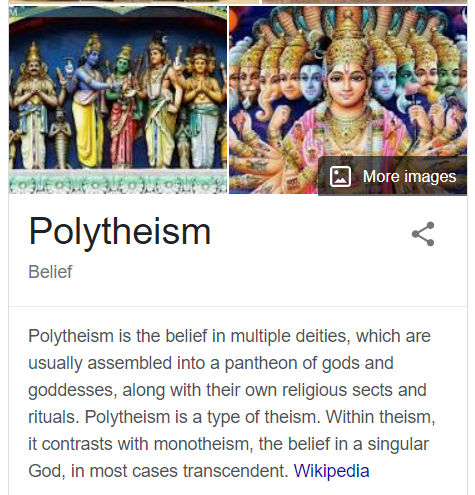
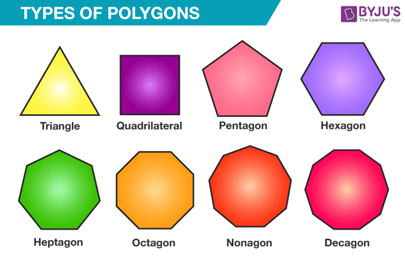
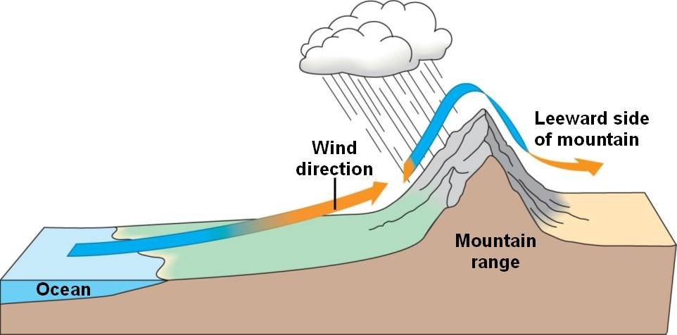

# 咬文嚼字-词根词缀(51-99)

​	

## **`poly-`** 表示“多”，来自希腊语。源自希腊语 polus "much, many."{99}

| 单词                                                         | 解释                                                         | 单词                                    | 解释                                                         |
| ------------------------------------------------------------ | ------------------------------------------------------------ | --------------------------------------- | ------------------------------------------------------------ |
| **Poly-nes-ia**                         【ˌpɑˌlɪˈniʒə】 | n. 波利尼西亚 推荐：Poly-多 + nes-岛 + -ia  **`poly-`** 表示“多”，来自希腊语。源自希腊语 polus "much, many." **`nes-`** 表示“岛”。源自希腊语 nesos "island." 更多同源词... 词源说明(童理民)   1 - 南太平洋群岛。来自 poly-,多，复，聚，-nesia,岛，词源同 Indonesia. | **poly-the-ism**  【ˈpɑːliθiɪzəm】 | n. 多神教, 多神论 推荐：poly-多 + the-神 + -ism  **`poly-`** 表示“多”，来自希腊语。源自希腊语 polus "much, many." **`the-`** = god， 表示“神”。源自希腊语 theos "god." **`-ism`** 抽象名词后缀，表示“…主义”；“宗教”；“制度、行为”；“…学”、“…术”、“…论”、“…法”；“疾病名称”；“情况、状态”等。 词源说明(童理民)   1 - poly-,多，复，聚，theism,有神论。 |
| **poly-andr-ic**                            【ˌpɒlɪˈændrɪk】 | a. 一妻多夫的  推荐：poly-多 + andr-男人 + -ic表形容词  poly- 表示“多”，来自希腊语。源自希腊语 polus "much, many." andr- = male, man, 表示“男人”。源自希腊语 aner (词干 andr-) "man." | **poly-andry** 【ˌpɑːliˈændri】    | n. 一妻多夫, 多雄蕊式 推荐：poly-多 + andr-男人。  poly- 表示“多”，来自希腊语。源自希腊语 polus "much, many." andry- = male, man, 表示“男人”。源自希腊语 aner (词干 andr-) "man." 更多同源词... 词源说明(童理民)   1 - poly-,多，复，聚，-ander,男人，人，词源同 android. |
| **poly-gyn-y** 【pə'lɪdʒənɪ】                           | n. 一夫多妻 推荐：poly-多 + gyn-妇女 + -y  poly- 表示“多”，来自希腊语。源自希腊语 polus "much, many." gyny- = woman, 表示“妇女”。源自希腊语 gune "woman." 词源说明(童理民)   1 - poly-,多，复，聚，-gyn,女人，词源同 queen,gynecology. | **poly-gyn-ous**   【pə'lɪdʒənəs】 | a. 一夫多妻的, 多花柱的 推荐：poly-多 + gyn-妇女 + -ous  poly- 表示“多”，来自希腊语。源自希腊语 polus "much, many." gyn- = woman, 表示“妇女”。源自希腊语 gune "woman." -ous 表形容词，表示“…的”，用于化学领域表示“亚酸的，低价（金属)的”。 |
| **poly-pod** 【pɒlɪpɒd】                                | a. 多足的 推荐：poly-多，复，聚 + pod-足  poly- 表示“多”，来自希腊语。源自希腊语 polus "much, many." pod- = foot, 表示“脚”。源自希腊语 pous (词干 pod-) "foot." | **poly-gon** 【ˈpɑːliɡɑːn】        | n. 多角形, 多边形 推荐：poly-多，复，聚 + gon-角  **`poly-`** 表示“多”，来自希腊语。源自希腊语 polus "much, many." **`gon-`** = angle, 表示“角”，在医学词汇里表示“膝盖”。源自希腊语 gonia "angle, corner." 词源说明(童理民)   1 - poly-,多，复，聚，-gon,边，词源同 knee,heptagon |
| **poly-archy** 【pɒlɪˌɑːkɪ】                            | n. 多头政治 推荐：poly-多 + -archy, 统治  **`poly-`** 表示“多”，来自希腊语。源自希腊语 polus "much, many." **`archy-`** = ruler, rule, chief, 表示“统治者，统治，主要的”。来自希腊语 arch "rule or government。" | **poly-pus** 【pɒlɪpəs】           | n.   【医】(鼻子、子宫等的)息肉；【动】水螅虫 (hydra) 推荐：poly-多，复，聚 + pus-脚  poly- 表示“多”，来自希腊语。源自希腊语 polus "much, many." |
| **poly-techn-ic ** 【ˌpɑːliˈteknɪk】                    | a. 各种工艺的, 工艺教育的 n. 工艺专科学校, 理工专科学校 推荐：poly-多，复，聚 + techn-技术 + -ic表形容词，用于指技术学院或理工学院。  **`poly-`** 表示“多”，来自希腊语。源自希腊语 polus "much, many." **`techn`**- = skill, ability, 表示“技术，能力”。源自希腊语 tekhne "art, craft, skill." **`-ic`** 表形容词，“…的”。 词源说明(童理民)   1 - poly-,多，复，聚，-techn,技术，词源同 technology.用于指技术学院或理工学院。 |                                         |                                                              |

## -ess:表名词，“女性、雌性" {97}

| 单词                             | 解释                                                         | 单词                                   | 解释                                                         |
| -------------------------------- | ------------------------------------------------------------ | -------------------------------------- | ------------------------------------------------------------ |
| actress 【ˈæktrəs】         | ambassadress【æmˈbæsədres】:a female ambassador              | authoress            【ˈɔːθəres】 | authoress:女作者;女作家 waitr-ess【ˈweɪtrəs】：女服务员;女侍者 |
| empress 【ˈemprəs】         | empress: a woman who is the ruler of an empire; host-ess【ˈhoʊstəs】：女主人;女房东;(夜总会的)女招待;(电视或广播节目的)女主持人 | foundress 【faʊndres】            | a woman founder. **directress**【dɪ'rektrɪs】:a woman who is a director |
| heir-ess 【ˈerəs】          | heiress:a female heir , especially one who has received or will receive a large amount of money | an-chor-ess 【ˈæŋkəres】          | anchor-ess: a female anchorite (旧时的)女隐修者  seer-ess【sɪrɪs】prophetess sorcer-ess【ˈsɔːrsərəs】：(in stories) a woman with magic powers, who is helped by evil spirits。=>sorcerer |
| mayor-ess 【ˈmeɪərəs】      | maj-,magn-,max- = great, 表示“大，伟大”，源自拉丁语 magnus "great". -or 表示“人或物。  女市长;市长(或镇长、郡长)女助理 | god-d-ess                              | giant-ess  Titan-ess villain-ess                |
| ancestress 【ænsestrɪs】    | ancestress:a female ancestor. manageress[ˌmænɪdʒəˈres]:a woman who is in charge of a small business, for example, a shop/store, restaurant or hotel | enchantr-ess 【ɪnˈtʃæntrəs】      | (故事中)施魔法的女人，巫婆;迷人的女子                        |
| ad-ulter-ess 【əˈdʌltərəs】 | adulteress: a woman who commits adultery ad-ulter-y:n. 通奸 adulter-ous:An **adulterous** relationship is a sexual relationship between a married person and someone they are not married to. | mistr-ess 【ˈmɪstrəs】            | Mister:先生  + -ess 主妇;情妇;(尤指私立学校的)女教师; (尤指旧时雇用仆人的)女主人 |
| procur-ess 【prəʊ'kjʊərɪs】 | procure v. 获得 (尤指难以获得的东西); 诱使（妇女）卖淫. a woman pimp | ogr-ess【ˈoʊɡrɪs】                     | ogre n. 食人恶魔; 凶恶的人, 可怕的人 =>吃人女妖          |
| peer-ess 【ˈpɪəres】        | （英国的）女贵族，贵族夫人 baron-ess【ˌbærəˈnes】:女男爵;男爵夫人 count-ess【ˈkaʊntəs】女伯爵;伯爵夫人  dauphin-ess【dɔ:fɪnɪs】法国太子妃    duch-ess 【ˈdʌtʃəs】公爵夫人;女公爵 marchion-ess【ˌmɑːrʃəˈnes】女侯爵;侯爵夫人  viscount-ess【ˈvaɪkaʊntəs】女子爵;子爵夫人 | tigr-ess                               | panther-ess  leopard-ess   tigr-ess   lion-ess |
| arbitress 【ɑrbətrɪs】      |                                                              | citizen-ess 【sitizənis】         | electress【ɪ'lektrɪs】女选民；（神圣罗马帝国的）有权选举皇帝的诸侯的妻子 laundress【lɔːndrɪs】 paintr-ess【peɪntrɪs】 |

## mono- 表示“单个，一个”。源自希腊语 monos "alone, single, sole."{91}

| 单词                                    | 解释                                                         | 单词 | 解释 |
| --------------------------------------- | ------------------------------------------------------------ | ---- | ---- |
| **mono-the-ism** 【ˈmɑːnoʊθiɪzəm】 | n. 一神论, 一神教 单词笔记   ［添加］ 推荐：mono-单个 + the-神 + -ism  **`mono-`** 表示“单个，一个”。源自希腊语 monos "alone, single, sole." **`the-`** = god， 表示“神”。源自希腊语 theos "god." **`-ism`** 抽象名词后缀。 词源说明(童理民)   1 - mono-,单个的，theism,有神论。 |      |      |
|                                         |                                                              |      |      |
|                                         |                                                              |      |      |

## par- 表示“半，类似，辅助，旁，超，异常”，{91}

> - 用于化学，意为“对（位），聚，仲，副”
> - 用于医学意为“对，副，衍”
> - 在元音前演变成 par-。
> - 源自希腊语 para "beside, alongside of, beyond." {91}

| 单词 | 解释 | 单词 | 解释 |
| ---- | ---- | ---- | ---- |
|      |      |      |      |
|      |      |      |      |
|      |      |      |      |

## verse- = turn, 表示“转”。源自拉丁语 vertere, versare "to turn." {76}

| 单词                     | 解释                                                         | 单词 | 解释 |
| ------------------------ | ------------------------------------------------------------ | ---- | ---- |
| **verse** 【vɜːrs】 | n. 诗, 韵文, 诗句 （《圣经》的）节 vt. 用诗表达 vi. 作诗 推荐：vers-转，转着反复说的话 → 诗歌。  **`verse-`** = turn, 表示“转”。源自拉丁语 vertere, versare "to turn." 词源说明(童理民)   1 - 来自拉丁语 versus,转，翻转，词源 versus,toward.引申词义诗行，韵文。 |      |      |
|                          |                                                              |      |      |
|                          |                                                              |      |      |

## ceit- = take, hold, seize, 表示“拿，抓，握住” {75}

> 源自拉丁语 capere "to take, seize, catch."{75}

| 单词                                           | 解释                                                         | 单词                                   | 解释                                                         |
| ---------------------------------------------- | ------------------------------------------------------------ | -------------------------------------- | ------------------------------------------------------------ |
| **con-ceit **                【kənˈsiːt】 | n. 自负, 空想, 狂妄 vt. 幻想 推荐：词源同conceive, concept. 原指形成思想和概念的，后指异想天开的，盲目自大的。  **`con-`** 来自拉丁语介词com，表示“与...一起，一起（with, together）”，或仅做强调。 **`ceit-`** = take, hold, seize, 表示“拿，抓，握住”。 词源说明(童理民)   1 - 词源同 conceive,concept.原指形成思想和概念，后指异想天开，盲目自大。 | **re-ceive**          【rɪˈsiːv】 | n. 收据, 收入, 收到 vt. 接收;拿到;体验;受到(某种待遇或伤害);对…作出反应;接待;接纳;接收到，收听到（无线电讯号）;购买，接受（赃物）;接（发球） 推荐： re-再 + ceipt-抓 → 收据，收条。 |
|                                                |                                                              |                                        |                                                              |
|                                                |                                                              |                                        |                                                              |

## tele- = further, 表示“远”，引申为“电”，电从远方来。源自希腊语 tele "far off." {74}

| 单词                                                         | 解释                                                         | 单词 | 解释 |
| ------------------------------------------------------------ | ------------------------------------------------------------ | ---- | ---- |
| **telo-mer-ase **                            【təˈloʊməˌreɪz】 | n. 端粒酶  **`tele-`** = further, 表示“远”，引申为“电”，电从远方来。源自希腊语 tele "far off." **`mer-`** = part, 表示“部分，分配”，并由分配引申为“奖励”。源自希腊语 méros "part." **`-ase`** = enzyme, 表示“...酶”。 an enzyme in eukaryotic cells that can add telomeres to the ends of chromosomes after they divide |      |      |
|                                                              |                                                              |      |      |
|                                                              |                                                              |      |      |

## -en 表动词，“变成”{71}

| 单词                      | 解释                                                         | 单词                            | 解释                                                         |
| ------------------------- | ------------------------------------------------------------ | ------------------------------- | ------------------------------------------------------------ |
| 读音相近                  | **Weaken**: 【ˈwiːkən】 **waken**【ˈweɪkən】 **Weekend**【ˈwiːkend】 |                                 |                                                              |
| fast-en                   | vt. 拴紧, 使固定, 系, 集中于, 强加于 vi. 扣紧 推荐：fast【固定】 + -en表动词。 fast a. 快速的, 敏捷的; 头脑灵活的; 稳固的  ad. 很快地, 不久; 牢固地  n. 禁食期, 斋戒期  vi. 禁食, 斋戒 -en 表动词，“变成”。 词源说明(童理民)   1 - 来自 fast,固定的。 | blank-en                        | 使变黑，诽谤                                                 |
| wide-en                   | vt. 弄宽, 加宽, 扩大 vi. 变宽, 扩大 推荐： wide【宽的 , 广阔的】 + -en表动词。 | broad-en                        | 变宽，扩大                                                   |
| bright-en                 | 变亮，活跃                                                   | **damp-en** 【ˈdæmpən】    | vt. 弄湿, 使沮丧，减弱(感情、反应等) vi. 变湿, 丧气 damp【潮湿】 + -en表动词，引申义减弱。 |
| sharp-en                  | 使尖锐，使敏捷，加重                                         | shrot-en                        | 弄短，缩短                                                   |
| tight-en                  | 使变紧，勒紧                                                 | slack-en                        | 使松弛，放松                                                 |
| weak-en                   | 削弱，减弱，使虚弱                                           | stregth-en                      | 加强，变坚固                                                 |
| soft-en                   | 使变柔软，变柔和                                             | tough-en                        | 使变坚韧，变顽强                                             |
| stiff-en                  | 使变硬，使僵硬，使顽强，使严厉                               |                                 |                                                              |
| stweet-en                 | 使变甜，加糖于，使悦耳，使柔和，使减轻                       | straight-en                     | 弄直，整顿，清理，使改正                                     |
| thick-en                  | 变浓，变厚，变得模糊，变得复杂                               |                                 |                                                              |
| **diz-en** 【daɪzn】 | vt. 把...装饰得华丽而俗气 推荐：diz-亚麻 + -en表动词 **`diz-`** 表示 “亚麻”；动词表示“穿衣服”。 | **be-diz-en** 【bɪ'daɪzn】 | vt. 打扮得俗不可耐 **`dis-`**,**`diz-`** 表示 “亚麻”；动词表示“穿衣服”。 **`be-`** 构成动词，表示“使…成为”，来源于盎格鲁撒克逊语。 |
| sick-en                   | 患病，使厌倦，使恶心                                         | threat-en                       | 恐吓，威胁，预示...的凶兆                                    |

## ward

### 1. -ward 表形容词或副词，“向…”。源自古英语 -weard {66}

| 单词                           | 解释                                                         | 单词                               | 解释                                                         |
| ------------------------------ | ------------------------------------------------------------ | ---------------------------------- | ------------------------------------------------------------ |
| **toward** 【təˈwɒrd】    | prep朝向;;倾向于;趋向于;关于 adj.有利的;正在进行中的;顺利的 | **south-ward**  【ˈsaʊθwərd】 | n. 朝南的方向(或地点、地区) a. 在南方的, 往南方的 ad. 往南  south【南】 + -**`ward`向...**。 |
| **awk∙ward** 【ˈɔːkwərd】 | awk- 表示“错误方向”。 -ward 表形容词或副词，“向…”。源自古英语 -weard "toward." 词源说明(童理民)   1 - awk-,错误方向，-ward,朝向。引申词义笨拙的。 | **down-ward**   【ˈdaʊnwərd】 | a. 向下的 范围：四级,专四,考研,雅思 down【下】 + -ward朝向。 down  a. 向下的 ad. 下, 下去, 降下 prep. 往下, 沿着 n. 丘陵, 软毛, 开阔的高地  |
| lee                            | n. 背风处, 避风处, 下风处, 保护, 庇护 a. 避风的, 背风的, 下风的, 保护的 推荐： 来自古英语hleo , 防御，保护，避难所，来自PIEn. 1 . the side of a ship away from the source of the wind  2 . shelter from the wind  adj.1 . on or toward the side of a ship , natural feature , or object that is away from the wind  ●The sea started to ease as we came under Cuba's lee. 我们靠近古巴的背风海岸时风浪开始平息。 | **lee-ward** 【ˈliːwərd】     | a. 下风的, 在下风的 ad. 在下风, 在下风方向 n. 下风, 背风 推荐：lee【背风处】 + -ward向。  **`lee`** n. 背风处, 避风处, 下风处, 保护, 庇护 a. 避风的, 背风的, 下风的, 保护的 **`-ward`** 表形容词或副词，“向…”。源自古英语 -weard "toward." |
|                                |                                                              |                                    |                                                              |

### 2. ward 表示“照顾、看管” {?}

印欧语w音，日耳曼人用w表示；罗曼语族（包括后来诺曼征服的人）念起来比较费劲，而且他们的语言里没有w字母，用gu表示这个w音（后期更是简化为g）音。如: 

- guard和warden
- waranty和guaranty
- warrior和guerrilla
- guise和wise等

两种形式在不同时期通过不同途径进入英语并保留到现在。

| 单词    | 解释                                                         | 单词 | 解释 |
| ------- | ------------------------------------------------------------ | ---- | ---- |
| ward-en | ward  n. 病房, 守卫, 保卫, 保护, 监护, 牢房, 行政区,  锁孔内的榫舌 vt. 使入病房, 守护, 保卫 -en  表名词，“人或物”，有时构成小词或昵称。 词源说明(童理民)   1 - 来自 ward,看管，看护。 n. 典狱官, 渔猎法监督官, 看守人 |      |      |
|         |                                                              |      |      |
|         |                                                              |      |      |

**Reference:**

1. [词源趣谈 | 照顾一大家人吃喝拉撒的steward（乘务员）--钱磊博士](https://mp.weixin.qq.com/s/W9QtXDLp7gcv6m1T5FsRKQ)

