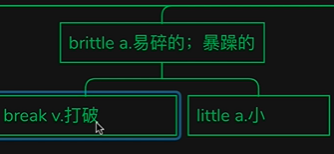

# 咬文嚼字-奇怪的词根又增加了

@(TOEFL)[托福, TOEFL, 词根词缀,咬文嚼字]

[toc]

## 一缀三连

### 1. `-ence` 表名词，“性质，状态”{191}

| 单词                              | 解释                                                         | 单词                                     | 解释                                                         |
| --------------------------------- | ------------------------------------------------------------ | ---------------------------------------- | ------------------------------------------------------------ |
| **af∙flu∙ence** 【ˈæfluəns】 | **`af-`**  来自拉丁介词ad, 表示“朝、向、去，或弱化为强调”。 **`flu-`**  = flow, 表示“流动”。源自拉丁语 bluere "to flow." **`-ence`**  表名词，“性质，状态”。 | **succ∙ul∙ence**[^1]  【sʌkjələns】 | n. 多汁, 青饲料 推荐：succ-汁 + -ul + -ence, 表名词 **`succ-`** = juice, 表示“果汁”。源自拉丁语 sugere "to suck," sucus, succus "juice." **`-ence`** 表名词，“性质，状态”。  |
|                                   |                                                              |                                          |                                                              |
|                                   |                                                              |                                          |                                                              |

[^1]:  **What is Succulence?** [Succulence](http://succulence.strikingly.com/workshops) is an Urban Plant shop that finds plants to suit your home or city space like offices, shops, or or any space that you want to decorate. http://mrsjonasrecommends.com/spotlight-introducing-succulence/

### 2. `-esce`表示“动作的起始”{18}

| 单词                                | 解释                                                         | 单词                            | 解释                                                         |
| ----------------------------------- | ------------------------------------------------------------ | ------------------------------- | ------------------------------------------------------------ |
| **in-cand-esce** 【ɪnkæn'des】 | vt. 使白热化 vi. 白热化 推荐: in-进入 + cand-发光 + -esce **`in-`**  来自拉丁语in-，表示“在内，进入， **`cand-`**  = white, glow, 表示“白，发光”。源自拉丁语 candere "to shine." **`-esce`**  表示“动作的起始”。 | **adol∙esce** 【ˌædəˈles】 | **`adol-`**  = adult, 表示“成年”。这是一个复合词根，由"ad- (to)" + "ul- (nourish) " 组成。 **`-esce`**  表示“动作的起始”。 在成长过程；在成熟 (become adolescent) |
|                                     |                                                              |                                 |                                                              |
|                                     |                                                              |                                 |                                                              |

### 3. `-escence`  复合后缀（-esce + -ence），表示“动作的起始”，名词后缀{42}

| 单词                                      | 解释                                                         | 单词                                      | 解释                                                         |
| ----------------------------------------- | ------------------------------------------------------------ | ----------------------------------------- | ------------------------------------------------------------ |
| **in∙cand∙escence** 【ˌɪnkæn'desns】 | in-  来自拉丁语in-，表示“在内，进入，使...”。 cand-  = white, glow, 表示“白，发光”。源自拉丁语 candere "to shine." -escence  复合后缀（-esce + -ence），表示“动作的起始”，名词后缀。 白炽度;白（灼）热；白炽 She burned with an incandescence that had nothing to do with her looks.（她光彩照人，却与容貌无关。） | **in∙cand∙escence** 【ˌɪnkæn'desns】 | in-  来自拉丁语in-，表示“在内，进入，使...”。 cand-  = white, glow, 表示“白，发光”。源自拉丁语 candere "to shine." -escence  复合后缀（-esce + -ence），表示“动作的起始”，名词后缀。 白炽度;白（灼）热；白炽 She burned with an incandescence that had nothing to do with her looks.（她光彩照人，却与容貌无关。） |
|                                           |                                                              |                                           |                                                              |
|                                           |                                                              |                                           |                                                              |

### 4. `-ancy` = -ance, 表示“性质，状况”{62}

| 单词                                   | 解释                                                         | 单词                                        | 解释                                                         |
| -------------------------------------- | ------------------------------------------------------------ | ------------------------------------------- | ------------------------------------------------------------ |
| **dilat-ancy** 【daɪ'leɪtənsɪ】   | n. 膨胀性 **`dilate`**【膨胀】 + -**`ancy`**, 表名词 **`dilate`** vi. 扩大, 详述, 膨胀 vt. 使膨胀 **`-ancy`** = -ance, 表示“性质，状况”。 | **dilate  **            【daɪˈleɪt】   | di-分开 + lat-带、拿 + -e → 带开 → 扩大。 **`di-`** 来自拉丁语dis-，表示“分开，散开”，引申词义“离开，无，没有，缺乏，表相反等”。 **`lat-`** = wide 表示“宽”。源自拉丁语 latus "broad, wide." 词源说明(童理民)   1 - dis-,分开，散开，-lat,变宽，膨胀，词源同 latitude.即扩散，膨胀。 |
| **a-therm-ancy**  【əˈθɜːrmənsi】 | n. 不透热性 推荐：a-不，非 + therm-热 + -ancy, 表名词 **`a-`** 加在单词前，表示“在…的”；表示“不、无、非”；表示“加强”。源自希腊语 a-, an- "not." **`therm-`** = heat, 表示“热”。源自希腊语 thermos "warm, hot, heat." **`-ancy`** = -ance, 表示“性质，状况”。 | **dia-therm-ancy**  【ˌdaɪə'θɜ:mənsɪ】 | n. 透热性 推荐：dia-穿过 + therm-热 + -ancy, 表名词 **`dia-`** 表示“穿过，二者之间”。 **`therm-`** = heat, 表示“热”。源自希腊语 thermos "warm, hot, heat." **`-ancy`** = -ance, 表示“性质，状况”。 |
|                                        |                                                              |                                             |                                                              |

## -ery 和 -ary

### 1. -ery 表名词，“行为，情况，身份，职业”等抽象名词或集合名词 {93}

| 单词                             | 解释                                                         | 单词                             | 解释                                                         |
| -------------------------------- | ------------------------------------------------------------ | -------------------------------- | ------------------------------------------------------------ |
| **lot∙t∙ery** 【ˈlɑːtəri】  | **`lot-`** = lot, 表示“运气”，源自古英语 hlot "object used to determine someone's share"。 **`-ery`** 表名词，“行为，情况，身份，职业”等抽象名词或集合名词。 | **jewel∙ry**  【ˈdʒuːəlri】 | jewel  n. 珠宝, 贵重物, 镶珠宝的饰物 vt. 饰以珠宝, 镶以宝石 -ery  表名词，“行为，情况，身份，职业”等抽象名词或集合名词。 更多同源词... 切换词根显示方式 |
| fin∙ery                          | fine n. 罚款, 罚金, 晴天, 精细 a. 好的, 晴朗的, 健康的, 细小的, 精细的 vt. 罚款, 精炼, 澄清 vi. 变清, 变细 ad. 很好 -ery 表名词，“行为，情况，身份，职业”等抽象名词或集合名词。 词源说明(童理民)   1 - 来自 fine,精细。用于指华丽的衣服。 | crook∙ery                        | crook n. 钩, 弯曲部分, 坏蛋 vt. 使弯曲, 诈骗 vi. 弯曲 -ery 表名词，“行为，情况，身份，职业”等抽象名词或集合名词。 |
| cook∙ery                         | cook n. 厨子, 厨师 v. 烹饪, 煮 (或烘烤, 煎炸等); 密谋 -ery 表名词，“行为，情况，身份，职业”等抽象名词或集合名词。 | cajol∙ery                        | cajole vt. 以甜言蜜语哄骗, 勾引 -ery 表名词，“行为，情况，身份，职业”等抽象名词或集合名词。 |
| brav∙ery                         | brave a. 勇敢的, 美好的, 华丽的 n. 勇敢者 vt. 勇敢地面对 -ery 表名词，“行为，情况，身份，职业”等抽象名词或集合名词。 | **artery** 【ˈɑːrtəri】     | arm-,art-  = skill, joint, trick, 表示“技巧，关节，诡计”。 -ery  表名词，“行为，情况，身份，职业”等抽象名词或集合名词。更多词源说明(童理民)   1 - art,技艺，工艺。原指冷兵器时代的投石机，代表当时的先进工艺，现指大炮。 |
| **arch∙ery**  【ˈɑːrtʃəri】 | arch- = bow, 表示“弓”。源自拉丁语 arcus "a bow" -ery 表名词，“行为，情况，身份，职业”等抽象名词或集合名词 |                                  |                                                              |

### 2. **`-ery`** 表名词，“场所，地点”{59}

| 单词                                                | 解释                                                         | 单词                                            | 解释                                                         |
| --------------------------------------------------- | ------------------------------------------------------------ | ----------------------------------------------- | ------------------------------------------------------------ |
| **pot-t-ery**                     【ˈpɑːtəri】 | **`pot`** n. 盆, 罐, 壶, 坩埚, 奖杯; <非正式>大麻 vt. 装入盆中, 在锅中煮, 随手射击 vi. 随手射击 **`-ery`** 表名词，“场所，地点”。 陶器(尤指手工制的);陶土;制陶手艺;制陶技艺 | **bak-ery**                   【ˈbeɪkəri】 | A **bakery** is a building where bread, pastries, and cakes are baked, or the shop where they are sold. |
| refin-ery                                           |                                                              | eat-ery                                         |                                                              |
| monast-ery                                          |                                                              | monk-ery                                        |                                                              |
| nun-n-ery                                           |                                                              | nurs-ery                                        |                                                              |
| peat-ery                                            |                                                              | rock-ery                                        |                                                              |
| fish-ery                                            |                                                              | hen-n-ery                                       |                                                              |
| hog-g-ery                                           |                                                              | pig-g-ery                                       |                                                              |
| rook-ery                                            |                                                              | ros-ery                                         |                                                              |
| smith-ery                                           |                                                              | swan-n-ery                                      |                                                              |
| win-ery                                             |                                                              | vin-ery                                         |                                                              |
| drink-ery                                           |                                                              | goos-ery                                        |                                                              |
| grap-ery                                            |                                                              | per-fum-ery                                     |                                                              |
| brew-ery                                            |                                                              | can-n-ery                                       |                                                              |
| cemet-ery                                           |                                                              | coop-ery                                        |                                                              |
| cream-ery                                           |                                                              | curriery                                        | 鞣皮业，制革业                                               |
| danc-ery                                            |                                                              | distill-ery                                     |                                                              |
| green-ery                                           |                                                              | grog-g-ery                                      |                                                              |
| hash-ery                                            | n. 剁碎的食物, 杂乱无章的的一大堆, 杂烩, 复述, 【计】散列 vt. 切碎, 搞糟 【复数：hashes；过去分词：hashed；现在分词：hashing】 1 - 来自法语 hacher,剁，剁碎，词源同 hatchet.引申词义跺碎的肉丁土豆，拼定比较 bake,batch. | hatch-ery                                       |                                                              |
| orang-ery                                           |                                                              | bind-ery                                        |                                                              |
| bean-ery                                            |                                                              | bleach-ery                                      |                                                              |
| cocoon-ery                                          |                                                              | command-ery                                     |                                                              |
| confection-ery                                      |                                                              | dean-ery                                        |                                                              |
|                                                     |                                                              |                                                 |                                                              |

#### 2.1 **`-arium`**   表名词，“地点，场所”,复数形式一般是-a形式 {23}

> 这些词的复数形式一般是-a形式。
>
> 注： 不要与【ium[2] 名词后缀，构成身体器官或生物学等词汇，这些词复数形式一般是-ia形式。比如 **bacter-ium** 、**geran-ium**、**mycel-ium**等】混淆

| 单词                                            | 解释                                                         | 单词                                                         | 解释                                                         |
| ----------------------------------------------- | ------------------------------------------------------------ | ------------------------------------------------------------ | ------------------------------------------------------------ |
| **aqu-arium** 【əˈkweriəm】                | 养鱼缸;水族玻璃槽;水族馆（a building where people can go to see fish and other water creatures） | ocean-arium                                                  |                                                              |
| **gymn∙asia**              【dʒɪmˈneɪziə】 | pl. 体育馆, 健身房, 大学预科（gymnasium的复数） 词根树    gymn-gymn.asia  gymn∙asia  [词根树] gymn-  = naked, 表示“裸体的”。源自希腊语 gumnos "naked." | **gymn-as-ium**                            【dʒɪmˈneɪziəm】 | n. 健身房, 体育馆 推荐：gymn-裸体 + -as + -ium表地点 → 穿得很少锻炼身体的地方 → 体育馆。 **`gymn-`** = naked, 表示“裸体的”。源自希腊语 gumnos "naked." **`-ium`** 表名词，“地点，场所”。这些词的复数形式一般是-a形式。 |
| empor-ium                                       |                                                              | sanat-arium                                                  |                                                              |
| sanitar-ium                                     |                                                              | sanitor-ium                                                  | sanataor-ium                                                 |
| pod-ium                                         |                                                              | Byzant-ium                                                   |                                                              |
| sol-arium                                       |                                                              | ciner-arium                                                  |                                                              |
| serpent-arium                                   |                                                              | columb-arium                                                 |                                                              |
| lepros-arium                                    |                                                              | cremator-ium                                                 |                                                              |
| **planet-arium** 【ˌplænɪˈteriəm】         | **`planet`** n. 行星, 命运星辰, 杰出的人, 重大影响的事. 天文馆；天象馆 a building with a curved ceiling to represent the sky  at night, with moving images of the planets and stars,  used to educate and entertain people | audit-o-ium                                                  |                                                              |

#### 2.2 `-ern` 表名词，“…场所”{4}

| 单词                           | 解释                                                         | 单词 | 解释 |
| ------------------------------ | ------------------------------------------------------------ | ---- | ---- |
| **cist∙ern** 【ˈsɪstərn】 | n. 贮水器, 水塘, 水箱 **`cist-`** = box, 表示“盒子”。 **`-ern`** 表名词，“…场所”。 词源说明(童理民)   1 - 来自拉丁语 cista,箱子，盒子，词源同 chest. |      |      |
|                                |                                                              |      |      |
|                                |                                                              |      |      |

### 3. **`-ary`** 表形容词，“…的”。{133}

| 单词                                             | 解释                                                         | 单词                        | 解释                                                         |
| ------------------------------------------------ | ------------------------------------------------------------ | --------------------------- | ------------------------------------------------------------ |
|                                                  | n. 敌手, 对手 a. 敌手的, 敌对的 【复数：adversaries】 范围：专八,雅思 单词笔记   ［添加］ 推荐： adverse【敌对的】 + -ary名词后缀。  词根树    -ary-aryad-vers-advers.ary-adverse  advers∙ary  [词根树] adverse  a. 不利的, 敌对的, 相反的, 逆的 -ary  表形容词，“…的”。 更多同源词... -ary  表名词，“人，场所，物”。 |                             |                                                              |
| contr-ary                   【ˈkɑːntreri 】 | **`contr-`** = against, 表示“反对，相反”，来自拉丁语。 **`com-`** "with, together" + **`-tr`** "comparative suffix "，本意放在一起比较。源自拉丁语 contra "against, opposite." | arbitr-ary                  | **`arbitr-`** = judge, 表示“判断”。复合词根：ar-=ad- + bit-走。 任意的;武断的;随心所欲的;专横的;专制的 1):**not seeming to be based on a reason, system or plan and sometimes seeming unfair**  2):**using power without restriction and without considering other people** |
| ne-cess-ary                                      | a. 必要的 必然的 n. 必需品                                   | coron-ary                   |                                                              |
| custom-ary                                       | 习惯的 惯常的                                                | disciplin-ary               |                                                              |
| diversion-ary                                    |                                                              | lter-ary                    |                                                              |
| bin-ary                                          | 由两部分组成的，二进制的，二院的                             | access-ary                  |                                                              |
| ordin-ary                                        |                                                              | pre-limin-ary               |                                                              |
| question-ary                                     |                                                              | sanit-ary                   | 卫生的                                                       |
| second-ary                                       |                                                              | sed-ent-ary                 | 就做的，坐惯的                                               |
| sediment-ary                                     | 沉淀物的                                                     | solid-ary                   | 团结一致的                                                   |
| solit-ary                                        | 独居者                                                       | sati-ion-ary                | 不动的 静止的                                                |
| sum-m-ary                                        |                                                              | tempor-ary                  |                                                              |
| traditon-ary                                     |                                                              | tribut-ary                  | 滞留的，纳贡的，从属的，辅助的                               |
| trin-ary                                         | 三倍的，三重的                                               | unit-ary                    | 单位的，单一的，归一的，整体的                               |
| mon-et-ary                                       | 货币的，金钱的                                               | nobili-ary                  | 贵族的                                                       |
| octo-n-ary                                       | 八进制的                                                     | quin-ary                    | 五的，五个组成的，五进制的                                   |
| oliv-ary                                         | 橄榄形的                                                     | salut-ary                   | 有益的，有用的                                               |
| complement-ary                                   |                                                              | compliment-ary              |                                                              |
| caution-ary                                      |                                                              | cent-en-ary                 |                                                              |
| adver-ary                                        |                                                              | mamm-ary   【ˈmæməri】 | mamm- = breast, 表示“乳房”。源自拉丁语 mamma "breast." -ary 表形容词，“…的”。 |
| milit-ary                                        | n 军队                                                       | hono-ary                    |                                                              |
| imagin-ary                                       |                                                              | judic-i-ary                 | n 司法部，司法系统                                           |
| lengend-ary                                      |                                                              | funer-ary                   |                                                              |
| element-ary                                      | 初步的，基本的                                               | evolution-ary               |                                                              |
| expension-ary                                    |                                                              | expedition-ary              |                                                              |

### 4. **`-ary`** 表名词，“人，场所，物”{68}

| 单词                                      | 解释                                                         | 单词                                 | 解释                                                         |
| ----------------------------------------- | ------------------------------------------------------------ | ------------------------------------ | ------------------------------------------------------------ |
| **advers-ary  **     【ˈædvərseri】  | n. 敌手, 对手 a. 敌手的, 敌对的 推荐：adverse【敌对的】 + -ary名词后缀。  **`adverse`** a. 不利的, 敌对的, 相反的, 逆的 **`-ary`** 表形容词，“…的”。 **`-ary`** 表名词，“人，场所，物”。 | **aux∙ili∙ary** 【ɔːɡˈzɪliəri】 | n. 辅助者, 辅助物, 附属机构, 助动词 a. 辅助的, 备用的 **`aux-`** = increase, 表示“增加”，auth-引申为产生，创造。源自拉丁语 augere (过去分词 auctus) "to increase." **`-ary`** 表名词，“人，场所，物”。 |
| **anni-vers-ary**  【ˌænɪˈvɜːrsəri】 | n. 周年纪念 推荐：anni-年 + vers-转 + -ary名词后缀 → 一年转到一次 → 周年纪念日。 **`anni-`** = year, 表示“年，一年”。源自拉丁语 annus "year." **`vers-`** = turn, 表示“转”。源自拉丁语 vertere, versare "to turn." **`-ary`** 表名词，“人，场所，物”。 |                                      |                                                              |
|                                           |                                                              |                                      |                                                              |
|                                           |                                                              |                                      |                                                              |

#### -o  表名词，“人，物或状态”{17}

| 单词                           | 解释                                                         | 单词 | 解释 |
| ------------------------------ | ------------------------------------------------------------ | ---- | ---- |
| **dynam-o** 【ˈdaɪnəmoʊ】 | n. 发电机 推荐：dynam-力 + -o。  **`dynam-`** = power, 表示“力量”。源自希腊语 dunasthai "to be able." **`-o`** 表名词，“人，物或状态”。 |      |      |
|                                |                                                              |      |      |
|                                |                                                              |      |      |

## 小小小小小小小小小

### - et / -le / -let, 表示“小”。源自拉丁语  {176}

> \- et / -le / -let = -et, 表示“小”。源自拉丁语 -ellus, diminutive suffix.
>
> 后缀**`-et`**表示“小”，如**widget**（小部件、小工具）、**closet**（小房间）、**bullet**（子弹，小球）。

| 单词                             | 解释                                                         | 单词                            | 解释                                                         |
| -------------------------------- | ------------------------------------------------------------ | ------------------------------- | ------------------------------------------------------------ |
| amulet                           | n. 护身符 推荐： 词源不详。可能同词根am- , 爱。      | omel-et                         | n. 煎蛋卷, 煎蛋饼, 炒蛋 **`omel-`**=lamel-层 + **`-et`**小词后缀。 **`lamell-,lamin-`** = leaf, layer, 表示“层，片”。源自拉丁语 lamina "plate, layer." |
| **plate-let** 【ˈpleɪtlət】 | n. 血小板, 小盘, 小板 plate【板】 + -let小词后缀 plate  n. 碟, 盘子, 盆中物, 金属板, 图版, 金银餐具, 印版, 金属牌(照) vt. 镀金, 电镀, 用金属板固定, 给...装钢板, 为...制印版 | cors∙et                         | n. 紧身褡, 妇女的胸衣 **`cors-`** = body, 表示“身体，团体”，corp- 来自拉丁语名词 corpus "body", corpor- 源自其属格 corporis。词源说明(童理民)   1 - cors-,词源同 corp-,身体。-et,小词后缀。 |
| **ballet** 【bæˈleɪ】       | **`ball-`**= throw, dance, ball, 表示“抛，舞，球”。源自希腊语 ballein "to throw" **t** 不发音 | **pell-et**     【ˈpelɪt】 | **`pil-`** = hair, 表示“毛发”。源于拉丁语 pilus "a hair." 词源说明(童理民)   1 - 来自拉丁语 pila,球，球丸，词源同 pill.-et,小词后缀。 n. 颗粒状物, 小子弹, 小药丸 vt. 使成颗粒, 使成团, 用子弹打 |
| bull-let                         | n. 子弹 推荐： bull(=ball)球 + -et小词后缀 → 小球 → 子弹。 | cave-let                        | n 小洞 cave-洞 + -let小词后缀                            |
| widg=et                          | 小部件、小工具                                               | clos-et                         | 小房间                                                       |

#### -le  表示“反复”{21}

| 单词                        | 解释                                                         | 单词                          | 解释                                                         |
| --------------------------- | ------------------------------------------------------------ | ----------------------------- | ------------------------------------------------------------ |
| **bat∙t∙le** 【ˈbætl】 | n. 战役 v. 战斗 bat-击，打 + -t- + -le, 表反复。 **`bat-`** = beat, 表示“打、击”。 **`-le`** 21表示“反复”。 | **bust-le** 【ˈbʌsl】    | n. 喧闹; 裙撑 v. 奔忙. 催促 推荐： 来自bust, 同burst, 爆发。 |
|                             |                                                              | **bustling** 【ˈbʌslɪŋ】 | a. 熙熙攘攘的, 忙乱的 推荐： bustle【忙碌,】 + -ing  |
|                             |                                                              |                               |                                                              |
| brittle 【ˈbrɪtl】     | a. 易碎的, 脆弱的, 易坏的  推荐： 词源同break，破开 + -le, 表反复。  词源说明(童理民)   1 - 词源同 break,破开。 | **beetle** 【ˈbiːtl】    | n. 甲虫; 大槌 v. 快速移动; 突出 推荐： beetle 披头士乐队（The Beatles）就是甲壳虫乐队。 词源说明(童理民)   1 - 词源同 bite,咬。 |

#### -el 表名词，“人或物”{15}

| 单词        | 解释                         | 单词                       | 解释                                                         |
| ----------- | ---------------------------- | -------------------------- | ------------------------------------------------------------ |
| person-n-el | 人员，人事部门，人事科（处） | **tunn-el** 【ˈtʌnl】 | n. 隧道, 地下道 vi. 挖隧道 vt. 掘隧道于  **`-el`** 表名词，“人或物”。 词源说明(童理民)   1 - 来自古法语 tonel,小桶，来自 tonne,木桶，水桶， 词源同 tun.原指一种漏斗形的捕鸟网或烟囱，后引申词义地道，隧道等。 |
| sent-in-el  | 哨兵，标记                   | marv-el                    | 奇异的事，罕见例子                                           |
| mod-el      | 模型，模范，模特儿           | dams-el                    | 少女，闺女                                                   |
| nov-el      | 小说，长篇故事               | parc-el                    | 包裹，部分，片段                                             |
| chis-el     | 凿子                         | barr-el                    | 桶；枪管，炮管；躯干                                         |
| barb-el     | 触须                         | ken-n-el                   | 狗舍，狗屋。阴沟                                             |
| ap-par-el   | 衣服，外表                   | colon-el                   | 陆军上校，长官                                               |
| therm-el    | 热电温度计                   |                            |                                                              |

### -esimal  形容词后缀，表示“小”{5}

> 源自拉丁语 -ēsimus, suffix of ordinal numerals + -al

| 单词                                       | 解释                                                         | 单词                                       | 解释                                                         |
| ------------------------------------------ | ------------------------------------------------------------ | ------------------------------------------ | ------------------------------------------------------------ |
| **planet∙esimal**  【ˌplænə'tesɪməl】 | n. 星子, 小行星体 推荐： **`planet`**【行星】 + **`-esimal`**, 小的，形容词后缀。  | **infinit∙esimal** 【ˌɪnfɪnɪˈtesɪml】 | a. 极小的, 极微的, 无限小的 n. 极小量, 极微量, 无限小 **`infinite`** a. 无穷的, 无限的, 极大的 n. 无限的事物; 上帝 (the ~) **`-esimal`** 形容词后缀，表示“小”。源自拉丁语 -ēsimus, suffix of ordinal numerals + -**`al`** 1 - infinite,无限的，-esimal,小的，缩写自 centesimal,百分之一的。引申词义无限小的，微量的。 |
| **mill∙esimal**  【mi'lesiməl】       | a. 千分之一的, 千分之一组成的 n. 千分之一 推荐： mill-千分之一 + -esimal, 小的，形容词后缀。 **`mill-`**  表示“千，千分之一”。源自拉丁语 mille "thousand." | **cent-esimal** 【sen'tesɪməl】       | 百分之一的, 百分的, 百进位的 推荐： cent-百 + -esimal, 小的，形容词后缀。 **`cent-`** = hundred, 表示“一百”。源自拉丁语 centum "hundred." **`-esimal`** 形容词后缀，表示“小”。源自拉丁语 -ēsimus, suffix of ordinal numerals + -al |
| **sexag∙esimal** 【ˌseksə'dʒesəml】   | a. 六十的, 六十进制的 n. 以60为分母的分数 sexag-六十 + -esimal, 小的，形容词后缀。 **`sex-`** 表示“六”。源自拉丁语 sex "six," sextus "sixth." a fraction in which the denominator is a power of 60 adj. relating to or based on the number 60 |                                            |                                                              |

## 同类与异类

> In the process of studying English, it is likely to confuse homograph, homonym, and homophone.
> 在英语学习过程中, 对同形异义词、同音同形异义词 、 同音异形异义词的运用很容易造成混淆.

### 1. homo- 表示“同类的”。源自希腊语 homos " {41}

| 单词          | 解释                                                         | 单词          | 解释                                                         |
| ------------- | ------------------------------------------------------------ | ------------- | ------------------------------------------------------------ |
| homo∙gene∙ity | homo-  表示“同类的”。源自希腊语 homos "same." gene-  = birth, produce, 表示“出生，产生”，医学上引申为“生殖或基因”。 -ity  表名词，指具备某种性质。 | homo-graph    | homo-  表示“同类的”。源自希腊语 homos "same." 更多同源词... graph-  = write, 表示“写，图”。源自希腊语 graphein 1 . a word that is spelled in the same way  as one or more other words but is different in meaning , e . g . the verb " project " and the noun " project ." |
| homo∙log∙ate  | homo-相同 + log-说话 + -ate  homo-  表示“同类的”。源自希腊语 homos "same." log-  = speak, 表示“说话”，更倾向于知识阶层的‘说’，所以经常引申为...学。源自希腊语 logos "speech, word, reason." -ate  表动词，“做，造成”。 | homo∙morph∙ic | homo-相同 + morph-形状 + -ic  homo-  表示“同类的”。源自希腊语 homos "same." morph-  = form, shape, 表示“形状”。派生的 morphin- 专指“吗啡”。源自希腊语 morphe "form, shape"。 -ic  表形容词，“…的”。 |
| hemo-the-ism  | heno + the-神 + -ism (一神教) **`homo-`** 表示“同类的”。源自希腊语 homos "same." **`the-`** = god， 表示“神”。源自希腊语 theos "god." **`-ism`** 抽象名词后缀，表示“…主义”；“宗教”；“制度、行为”；“…学”、“…术”、“…论”、“…法”；“疾病名称”；“情况、状态”等。 词源说明(童理民)   1 - heno-,一，theism,有神论。即只信奉一个神，但是不否认其它神的存在，也不排斥别人信仰其它神。 | Homosexusl    | 相同+sex+形容词后缀=同性恋者 Bisexual →bi前缀表示双+sex+形容词后缀=双性恋者 |

### 2. hetero- 表示“异类，异种”。源自希腊语 heteros "one of two, other."{25}

| 单词              | 解释                         | 单词             | 解释                   |
| ----------------- | ---------------------------- | ---------------- | ---------------------- |
| hetero-phobia     | 异形恐惧症                   | hetero-sexual    | 异性的，异性爱的       |
| hetero-chromosome | 异性染色体                   | hetero-sexuality | 异性爱                 |
| hetero-clite      | 反常的人（或事），不规则明朝 | hetero-dox       | a. 非正统的，异端的    |
| hetero-doxy       | 非正统，异端                 | hetero-gene-ity  | 异种，异质，不同成分   |
| hetero-gen-eous   | 异种的，异质的               | hetero-gen-ous   | 异源的，异形的，异种的 |
| hetero-genesis    | 世代交替，异形生殖，自然发生 | hetero-logy      |                        |
| hetero-morph-ic   | 异形的，异态的               | hetero-morph-ism | 异态性，异态想象       |
| hetero-nomy       | 他治，受制于人               | heter-onym       | 同形异义词             |
| hetero-phor-ia    | 隐斜视                       | hetero-osis      | 杂种优势               |
| hetero-plasmy     |                              |                  |                        |

## 厚礼蟹忒的小词后缀

### **`-ule`** 表名词，“小…”。源自拉丁语 -ulus, 小词后缀{23}

| 单词                               | 解释                                                         | 单词 | 解释 |
| ---------------------------------- | ------------------------------------------------------------ | ---- | ---- |
| **mole-cule** 【ˈmɑːlɪkjuːl】 | n. 分子, 些微 推荐：mole-堆 + -cule小 → 很小的东西堆在一起 → 分子。 mole∙cule  [词根树] **`-ule`** 23 表名词，“小…”。源自拉丁语 -ulus, 小词后缀。 **`mole-`**  = heap, 表示“堆”。源自拉丁语 moles "heavy bulk, mass, massive structure." |animal-cule|微动物|
|antenn-ule|小触角|barb-ule|鱼的触须，鸟的羽小支|
|caps-ule|太空舱，航天舱，胶囊|cell-ule|小细胞|
|lun-ule|半月形的东西|gran-ule|小粒，细粒，颗粒|
|glob-ule|小球，血球，药丸，液滴|mod-ule|单元，模块，组件，模数|
|ferr-ule|金属手杖，金属环，圈套|flos-cule|小花|
|nod-ule|小节，小瘤，小结节|min-usc-ule|小书写体，小写字|
|pil-ule|小药丸|plum-ule|胚芽，绒羽|
|pust-ule|脓疱|spher-ule|小球，小球体|
|tub-ule|小管，细胞|||
|zon-ule|小带|||

### -ular 表形容词，“有…形状或性质的”。源自拉丁语 -ulus, 小词后缀{41}

| 单词                            | 解释                                                         | 单词                            | 解释                                                         |
| ------------------------------- | ------------------------------------------------------------ | ------------------------------- | ------------------------------------------------------------ |
| **ang∙ular** 【ˈæŋɡjələr】 | a. 有角的, 消瘦的, 有尖角的, 生硬的 推荐 ang-角 + ular。 **`ang-`** = to bend, 表示“弯或钩”。 **`-ular`** 表形容词，“有…形状或性质的”。源自拉丁语 -ulus, 小词后缀。 摩西英语(摩西) angular ['æŋgjʊlə] adj. [生物] 有角的；angle ['æŋg(ə)l] n.角。为啥一个是angle另一个是angul呢？这现象叫syncope ['sɪŋkəpɪ] n.字中音省略，即angul的重音第一音节后的元音脱落了。顺便说一句，English中的Engl指的就是来自欧洲大陆“钩型”（成角度）地区渡海到不列颠的Anglo盎格鲁人。 | **ang∙ular** 【ˈæŋɡjələr】 | a. 有角的, 消瘦的, 有尖角的, 生硬的 推荐 ang-角 + ular。 **`ang-`** = to bend, 表示“弯或钩”。 **`-ular`** 表形容词，“有…形状或性质的”。源自拉丁语 -ulus, 小词后缀。 摩西英语(摩西) angular ['æŋgjʊlə] adj. [生物] 有角的；angle ['æŋg(ə)l] n.角。为啥一个是angle另一个是angul呢？这现象叫syncope ['sɪŋkəpɪ] n.字中音省略，即angul的重音第一音节后的元音脱落了。顺便说一句，English中的Engl指的就是来自欧洲大陆“钩型”（成角度）地区渡海到不列颠的Anglo盎格鲁人。 |
|                                 |                                                              |                                 |                                                              |
|                                 |                                                              |                                 |                                                              |

### **`-ar`** 表形容词，“…的”。源自拉丁语 -alis, adjective suffix{50}

| 单词                                | 解释                                                         | 单词 | 解释 |
| ----------------------------------- | ------------------------------------------------------------ | ---- | ---- |
| **molecul∙ar** 【məˈlekjələr】 | a. 分子的, 由分子组成的 推荐：molecule【分子】 + -ar表形容词。 **`molecule`** n. 分子, 些微 **`-ar`** 表形容词，“…的”。源自拉丁语 -alis, adjective suffix. |      |      |
|                                     |                                                              |      |      |
|                                     |                                                              |      |      |

## `ced-` / `ceed-` / `cess-` = go away; withdraw, yield {45}

>  表示“走开，撤退，屈服” 源自拉丁语 cedere "to go, withdraw, yield."

| 单词                                             | 解释                                                         | 单词                                                 | 解释                                                         |
| ------------------------------------------------ | ------------------------------------------------------------ | ---------------------------------------------------- | ------------------------------------------------------------ |
| **pro-ceed   **               【proʊˈsiːd】 | vi. 继续进行, 进行, 开始, 发出, 起诉 推荐：pro-向前 + ceed-走 → 向前走 → 前进。 **`pro-`** 表示“向前，在前”，变体包括 pur-, por-。 **`ceed-`**  词源说明(童理民)   1 - pro-,向前，-ceed,走，词源同 accede,concede.引申诸相关词义。 | **re-cess **               【ˈriːses , rɪˈses】 | n. 休息, 休会, 放假, 凹进处, 深处 vt. 使凹进 vi. 休假, 休息 推荐：re-回 + cess-走 → 回到停止状态 → 休息。 **`re-`** 表示“向后，往回，相反，相对，再”，或仅作强调用，在元音前 red-, reh-。源自拉丁语 re-, red- "backward, again." **`cess-`** = go away; withdraw, yield, 表示“走开，撤退，屈服”。源自拉丁语 cedere "to go, withdraw, yield." 词源说明(童理民)   1 - 来自 recede,后退，-ss,过去分词格。此处形容词作名词，引申诸相关词义。 |
| **inter-cess-or**  【ˌɪntə'sesə】           | n. 仲裁者, 调解人 推荐：inter-在…中间 + cess-走 + -or, 表人。 **`inter-`** 表示“在…之间，相互，内”。由 in- + ter-（土地）组成。在医学领域 enter- 表示“小肠”，已单独列出。 **`cess-`** = go away; withdraw, yield, 表示“走开，撤退，屈服”。源自拉丁语 cedere "to go, withdraw, yield." **`-or`** 表示“人或物”，是施动者名词。是拉丁语后缀 -tor 的俗化（可能受英语本土后缀 -er 的影响）形式。 | **cess-ion **          【ˈseʃn】                | n. 割让, 转让 推荐：cess-走，离开 + -ion，此处词义进一步强调为投降，割让。 **`cess-`** = go away; withdraw, yield, 表示“走开，撤退，屈服”。源自拉丁语 cedere "to go, withdraw, yield." **`-ion`** 表名词，“行为、动作、状态、过程、结果；物品”等。 词源说明(童理民)   1 - 来自 cede,走，离开，词源同 cease,cessation.此处词义进一步加强为投降，割让。 |
| **in∙cess∙ant** 【ɪnˈsesnt】                | a. 不断的, 不绝的, 无尽的 推荐：in-不，非 + cess-走，离开 + -ant即不离开的，不停止的。 **`in-`** 表示“无，没有（not,opposite）”，来自拉丁语 in-。 **`cess-`** = go away; withdraw, yield, 表示“走开，撤退，屈服”。源自拉丁语 cedere "to go, withdraw, yield." **`-ant`** 表形容词，“…的”。 词源说明(童理民)   1 - in-,不，非，-cess,走，离开，词源同 cease,concession.即不离开的，不停止的。 | **in∙cess∙ancy**  【ɪn'sesnsɪ】                 | n. 不间断性 推荐：in-不，非 + cess-走，离开 + -ancy, 表名词 **`in-`** 表示“无，没有（not,opposite）”，来自拉丁语 in-。 **`cess-`** = go away; withdraw, yield, 表示“走开，撤退，屈服”。源自拉丁语 cedere "to go, withdraw, yield." **`-ancy`** = -ance, 表示“性质，状况”。 |
| **cess∙pool**  【ˈsɛˌspul】                 | n. 污水坑, 化粪池 推荐：cess-离开 + pool【池】  cess- = go away; withdraw, yield, 表示“走开，撤退，屈服”。源自拉丁语 cedere "to go, withdraw, yield." **pool** n. 池, 水塘, 石油层, 撞球, 联营 vt. 合伙经营, 共享, 采掘, 汇聚成 vi. 汇合成塘, 淤积, 联营 词源说明(童理民)   1 - 可能来自 recess 和 pool 的合成词。 | **cess-pit** 【ˈsespɪt】                        | n. 粪坑, 垃圾坑 推荐：cess-离开 + pit【坑】  **`cess-`** = go away; withdraw, yield, 表示“走开，撤退，屈服”。源自拉丁语 cedere "to go, withdraw, yield." **pit** n. 深坑, 矿井, 果核, 地窖, 深渊, 绝境, 陷阱 vt. 窖藏, 使凹下, 使有麻点, 去...之核, 使留疤痕, 使相斗, 使竞争 vi. 起凹点, 凹陷 词源说明(童理民)   1 - 来自 cesspool 和 pit 的合成词。 |
| an-cest-or                                       | 祖先，祖宗                                                   | ancest-ry                                            | 祖先，世系，名门出身                                         |
| ante-cess-or                                     | 先行者，先驱者                                               | pre-de-cess-or                                       | 前任，先辈，前身                                             |
| ante-cede                                        | 在....之前，居...之先                                        | abs-cess                                             | 脓肿                                                         |
| cess-ation                                       | 停止                                                         | ceas-e                                               | 停止                                                         |
| cess-er                                          | 期限，责任的终止                                             | ced-e                                                | 割让                                                         |
| se-ced-e                                         | 正式脱离/退出，分离                                          | se-cess-ion                                          | 脱离，分离                                                   |
| ex-ceed                                          | vt. 超过，超越，胜过                                         | ex-cess                                              | n. 过度，剩余,超过，超额                                     |
| ne-cess-ary                                      | a. 必要的，必然的 n. 必需品                                  | ne-cee-it-arian                                      | 必然论的                                                     |
| ne-cess-itous                                    | 贫乏的，贫苦的，紧迫的，必须的                               | ac-cess                                              | 通道，入口，使用权                                           |
| suc-ceed                                         | 成功，继承，继续                                             | suc-cess-ion                                         | 先行，优先                                                   |
| suc-cess-ive                                     | 继承的，连续的                                               | pre-cess-ion                                         | 优先，优先权                                                 |
| ac-ced-e                                         | 同意，正式加入，就任，继任                                   | a-ced-ia                                             | 倦怠，漠然                                                   |

## dom 名词后缀，表示“身份”,“地位”,“职务”,“职位”,“统治”,“界”,“领域”等{41}

> 源自古英语 -dom, abstract suffix indicating "state, condition, or power."

| 单词                            | 解释                                                         | 单词 | 解释 |
| ------------------------------- | ------------------------------------------------------------ | ---- | ---- |
| **star-dom** 【ˈstɑːrdəm】 | n. 明星身份, 明星们 推荐：star【星】 + dom名词后缀，表身份。  **`star`**  **`-dom`**  词源说明(童理民)   1 - star,明星，-dom,表状态。 |      |      |
|                                 |                                                              |      |      |
|                                 |                                                              |      |      |

## cip = head, 表示“头”。源自拉丁语 caput "head" {40}

英语中有为数不少的词，其终极词源可以一直追溯到拉丁语**caput**（头），**capital**即为其中之一。它来自**caput**的派生词***capitālis 'of the head'***，因此最初也表示“头的”。

英国诗人弥尔顿（John Milton, 1608-1674）在长诗《失乐园》中写了(Serpent's) capital bruise（头部的伤痕）这样的字句，其中**capital**一词即含此义。

**capital**的几个常用词义均与“头”有联系。旧时一个人犯了**capital crime**（死罪）被判以**capital sentence**（死刑）或被处以**capital punishment**（极刑），不是被砍头就是被绞死。

**capital letter**（大写字母）一般多位于句首和词首。**capital**还用以指“首都”、“首府”，该用法出自弥尔顿笔下，始见于《失乐园》。

**capital**用以指“资本”则始于用牛的头数计算财富的时代，但这一用法直至18世纪才通用起来。

除了capital，源自拉丁语**caput**的英语常用词还有

- **cape**（海角）

- **captain**（队长，船长）

- **decapitate**（斩首）

- **chapter**（章，回）

- **precipice**（悬崖）

  > pre-,在前，-cip,头，词源同 cap,captain.即头在前，一头栽下，引申词义陡坡，陡崖，悬崖等。

- **precipitate**（突然下降；促成；沉淀）等。

| 单词                                    | 解释                                                         | 单词                                   | 解释                                                         |
| --------------------------------------- | ------------------------------------------------------------ | -------------------------------------- | ------------------------------------------------------------ |
| **pre∙cip∙ice** 【ˈpresəpɪs】      | n. 悬崖, 绝壁, 险境 推荐： pre-前 + cip-头 + -ice → 前面是尽头 → 悬崖。 **`pre-`** 表示“…前的，预先”，来自拉丁语，一般放在动词性词根前。 **`cip-`** = head, 表示“头”。源自拉丁语 caput "head" **`-ice`** 表名词，“行为，状态”。 | **pre∙cipit∙ous** 【prɪˈsɪpɪtəs】 | a. 陡峭的, 轻率的 推荐： pre-在前 + cipit-头 + -ous形容词后缀。引申词义陡峭的，仓促的，贸然的。 **`pre-`** 表示“…前的，预先”，来自拉丁语，一般放在动词性词根前。 **`cipit-`** = head, 表示“头”。源自拉丁语 caput "head" **`-ous`** 表形容词，表示“…的”，用于化学领域表示“亚酸的，低价（金属）的”。 词源说明(童理民)   1 - 来自 precipitate,一头栽下，-ous,形容词后缀。引申词义陡峭的，仓促的，贸然的。 |
| **pre∙cipit∙ant** 【prɪ'sɪpɪtənt】 | a. 突如其来的, 勇往直前的, 急促的, 径直向下的 n. 沉淀剂 **`pre-`** 表示“…前的，预先”，来自拉丁语，一般放在动词性词根前。 **`cipit-`** = head, 表示“头”。源自拉丁语 caput "head" **`-ant`** 表形容词，“…的”。 -ant 表名词，“…剂”。 | **caps-ize** 【ˈkæpsaɪz】         | v. 翻覆, 倾覆 推荐： caps-头 + -ize, 表动词。即头往下栽的。 **`cap-,cipit-`** = head, 表示“头”。源自拉丁语 caput "head" **`-ize`** 动词后缀，一般缀于形容词后。-ise 是英式英语，-ize 是美式英语。源自希腊语 -izein, verbal suffix. 词源说明(童理民)   1 - 可能来自 cap-,头，见 captain,拼写受 size 俗化。即头往下栽的。 |
|                                         |                                                              |                                        |                                                              |

## loqu- = speak, 表示“说话”。源自拉丁语 loqui "to speak."{34}

| 单词                                                         | 解释                                                         | 单词                                          | 解释                                                         |
| ------------------------------------------------------------ | ------------------------------------------------------------ | --------------------------------------------- | ------------------------------------------------------------ |
| **col-loq**                                                  | n. 口语, 口语用法, 口语词, 方言, 口语体 a. 口语的, 非正式的, 用通俗口语的, 会话的 **`loqu-,locu-`** = speak, 表示“说话”。源自拉丁语 loqui "to speak." **`col-`** 来自拉丁语介词com，表示“与...一起，一起（with, together）”，或仅做强调。源自拉丁语 com "with (collective and intensive prefix.)" | **col-loqu-ia**     【kəˈləʊkwiəm】      | n. (学术)讨论会, (学术讨论会上的)报告（colloquium的复数） **`col-`** 来自拉丁语介词com，表示“与...一起，一起（with, together）”，或仅做强调。源自拉丁语 com "with (collective and intensive prefix.)" **`loqu-`** = speak, 表示“说话”。源自拉丁语 loqui "to speak."  |
| **col-loqu-ial**                         【kəˈloʊkwiəl】 | a. 会话的, 口语的, 口语体的 推荐：col-共同 + loqu-说 + -ial表形容词 → 共同说 → 口语。  **`col-`** 来自拉丁语介词com **`loqu-`** = speak, 表示“说话”。源自拉丁语 loqui "to speak." **`-ial`** 表形容词，“…的”，一般缀于名词后。源自拉丁语 -alis, adjective suffix. 词源说明(童理民)   1 - col-,表强调，-loq,说话，词源同 locution,loquacious. | **col-loqu-qal-sim** 【kəˈloʊkwiəlɪzəm】 | n. 口语, 口语用法, 口语词, 方言, 口语体 推荐：colloquial【口语的】 + -ism  **`colloquial`** a. 会话的, 口语的, 口语体的 **`-ism`** 抽象名词后缀，表示“…主义”；“宗教”；“制度、行为”；“…学”、“…术”、“…论”、“…法”；“疾病名称”；“情况、状态”等。 |
|                                                              |                                                              |                                               |                                                              |

 

## -arian 表形容词或名词，“…的(人)”{25}

| 单词                                         | 词根                                                         | 单词                                             | 词根                                                         |
| -------------------------------------------- | ------------------------------------------------------------ | ------------------------------------------------ | ------------------------------------------------------------ |
| **total∙it∙arian**  【toʊˌtæləˈteriən】 | a. 极权主义的 n. 极权主义者 推荐：total【全部的】 + -itarian,缩写自 authoritarian,极权主义者。 total a. 全体的, 总的, 全然的 vt. 计算...的总和, 共计为 vi. 合计 n. 总数, 全体, 合计 ad. 统统 -arian 表形容词或名词，“…的(人)”。  词源说明(童理民)   1 - total,全部的，-itarian,缩写自 authoritarian,极权主义者。 | **totalitarianism** 【toʊˌtæləˈteriənɪzəm】 | n. 极权主义 推荐：totalitarian【a. 极权主义的】 + -ism抽象名词后缀，表示“...主义，思想” totalitarian a. 极权主义的 n. 极权主义者 -ism 抽象名词后缀，表示“…主义”；“宗教”；“制度、行为”；“…学”、“…术”、“…论”、“…法”；“疾病名称”；“情况、状态”等。 |
|                                              |                                                              |                                                  |                                                              |
|                                              |                                                              |                                                  |                                                              |

## etho- = nation, 表示“民族；性情（民族情感）”{16}

> 源自希腊语 ethnos "band of people living together, nation;" ethos "custom, disposition, trait."

| 单词                         | 解释                                                         | 单词 | 解释 |
| ---------------------------- | ------------------------------------------------------------ | ---- | ---- |
| etho-logy 【ɪˈθɑlədʒi】 | n. 性格学, 生态学, 特性论 推荐：etho-民族 + -logy学，学科 etho-  = nation, 表示“民族；性情（民族情感）”。源自希腊语 ethnos "band of people living together, nation;" ethos "custom, disposition, trait." -logy  = science, 表示“科学，学科” |      |      |
|                              |                                                              |      |      |
|                              |                                                              |      |      |

## -ode 

### 1. 表示“电极 {11}

**`-ode`** 表示“电极”。源自希腊语 hodos "way, journey."
更多同源词... 

| 单词                                       | 解释                                                         | 单词                          | 解释                                                         |
| ------------------------------------------ | ------------------------------------------------------------ | ----------------------------- | ------------------------------------------------------------ |
| **an-ode**  【ˈænoʊd】                | an-  = up, above, 表示“上”，和前缀 ana- 同源。           | **cat-hode** 【ˈkæθoʊd】 | **`cat-`** 表示“向下，相反，离开”。源自希腊语 kata "down." **`-hode`** 表示“电极”。源自希腊语 hodos "way, journey." |
| **eletr-ode**          【ɪˈlektroʊd】 | electr-  = electric, 表示“电的”。来自古希腊语 elektron "amber." | **di-ode** 【ˈdaɪoʊd】   | **`di-`**  表示“两个，双”。源自希腊语 dis "twice;" dikha "in two." |
| **tri-od**e 【traɪəʊd】               | **`tri-`** 表示“三”。源自希腊语 tri- "three."                | **tetr-ode** 【tetrəʊd】 | **`tetr-`**  表示“四”。源自希腊语 tetra- "four."         |
| **quadr-ode** 【kwɒdrəʊd】            | quadr-  = four, 表示“四”。源自拉丁语 quattuor "four."    | **pent-ode** 【pentəʊd】 | **`pent-`**  表示“戊，五”。源自希腊语 pente "five."      |
| **hept-ode** 【heptəud】              | **`hept-`**  表示“七”。源自希腊语 hepta "seven."         |                               |                                                              |

### 2. =like,表示“像”，一般用于希腊语借词{?}

1

## tric- = petty obstacle, 表示“小障碍”{9}

| 单词                                  | 解释                                                         | 单词                                         | 解释                                                         |
| ------------------------------------- | ------------------------------------------------------------ | -------------------------------------------- | ------------------------------------------------------------ |
| **ex-tric-able ** 【ekstrɪkəbl】 | a. 可救出的, 可解救的 推荐：ex-向外 + tric-繁琐 + -able, 表形容词。  **`ex-`** 表示“从，从...离开，从...向外，向外，向上”，来自PIE *eghs, 向外 **`tric-`** = petty obstacle, 表示“小障碍”。 **`-able`** 一般缀于动词后，构成形容词，表示“可…的，能…”。 | **in∙ex∙tric∙able**  【ˌɪnɪkˈstrɪkəbl】 | a. 逃脱不掉的, 解不开的, 无法解决的 推荐：in-不，非 + extricable【可分开的】。  **`in-`** 表示“无，没有（not,opposite）”，来自拉丁语 in-。 **`extricable`** a. 可救出的, 可解救的 词源说明(童理民)   1 - in-,不，非，extricable,可分开的。 |
|                                       |                                                              |                                              |                                                              |
|                                       |                                                              |                                              |                                                              |

## melior- = better, 表示“更好”，这里 -or 表示比较级{6}

> 源自拉丁语 melior "better."

| 单词                                    | 解释                                                         | 单词                                       | 解释                                                         |
| --------------------------------------- | ------------------------------------------------------------ | ------------------------------------------ | ------------------------------------------------------------ |
| **melior∙ate** 【mi:ljəreɪt】      | v. 改善, 改良, 变好 melior-更好 + -ate, 表动词  **`melior-`** = better, 表示“更好”，这里 -or 表示比较级。源自拉丁语 melior "better." **`-ate`** 表动词，“做，造成”。 词源说明(童理民)   1 - 来自拉丁语 melior,更好的，-or,比较级后缀，来自 PIE*mel,强壮的，有力的，增多的，词源同 multi-,ameliorate. The fat substitute could meliorate the sensory properties of low fat ice cream（脂肪替代品能明显改善低脂冰淇淋的感官品质。） | **a∙melior∙ate**     【əˈmiːliəreɪt】 | v. 改善, 改良, 改进 a-加强 + melior-更好 + -ate, 表动词 → 改善。 **`meliorate`** v. 改善, 改良, 变好 **`a-`** 加在单词前，表示“在…的”；表示“不、无、非”；表示“加强”。源自希腊语 a-, an- "not." 词源说明(童理民)   1 - a-,向，往，-mel,加强，多，词源同 multitude,许多。-ior,比较级后缀。 Steps have been taken to ameliorate the situation.已经采取措施以改善局面。 |
| **a-melior-ant**  【əˈmiːljərənt】 | 改良物 a thing that ameliorates **`a-`** 加在单词前，表示“在…的”；表示“不、无、非”；表示“加强”。源自希腊语 a-, an- "not." **`melior-`**= better, 表示“更好”，这里 -or 表示比较级。源自拉丁语 melior "better." **`-ant`** 表形容词，“…的”。 | **melior-ism**  【miljərɪzəm】        | 社会向善论 the belief that the world can be made better by human effort  **`melior-`** = better, 表示“更好”，这里 -or 表示比较级。源自拉丁语 melior "better." **`-ism`** 抽象名词后缀，表示“…主义”；“宗教”；“制度、行为”；“…学”、“…术”、“…论”、“…法”；“疾病名称”；“情况、状态”等。 词源说明(童理民)   1 - 来自 meliorate,改善，变好，-ism,主义，思想。引申词义社会向善论。 |
| **melior-ity**  【mil'jɒrətɪ】     | 盖上，优越性，进步 the state or condition of being improved melior- = better, 表示“更好”，这里 -or 表示比较级。源自拉丁语 melior "better." -ity 表名词，指具备某种性质。  | **melior-able**                            | 可改善的，可改进的，可改良的                                 |

