# 需要强化记忆的单词

大部分都是日耳曼本地语，少部分是古希腊、古罗马词根。

日耳曼本语的最大的一个特征就是和现实生活中的物品可以一一对应，一旦掌握就好理解，比如舔狗就是舔狗：

 

很少会有引申出比如校长之意，因此一旦和现实本体一一对应，就很好记。

[toc]

## 2022-2

| 单词                                  | 解释                                                         |
| ------------------------------------- | ------------------------------------------------------------ |
| **parade** 【pəˈreɪd】           | n. 游行, 炫耀, 阅兵 v. 游行, 炫耀, (使)列队行进 推荐： par-准备 + -ade=-ate。 para-,par- 表示“半，类似，辅助，旁，超，异常”，用于化学，意为“对（位），聚，仲，副”，用于医学意为“对，副，衍”，在元音前演变成 par-。源自希腊语 para "beside, alongside of, beyond." par- = get ready, 表示“准备”。源自拉丁语 parare "to try to get, prepare, equip." 词源说明(童理民)   1 - 来自拉丁语 parere,准备，安排，装饰，词源同 pare,prepare.原指接受检阅的军队，后词义通俗化。 摩西英语(摩西) parade [pə'reɪd] n.游行；阅兵；炫耀；行进，v.游行；炫耀；列队行进。词根par-在这里是准备之意。莫斯科红场阅兵，其实深层次表达的是“we are prepared or ready for any challenge or war”。美国海岸警卫队的格言是SEMPER PARATUS，意思就always be prepared，semper=sem+per=always the same。 |
| **gal∙lop** 【ˈɡæləp】           | n. 疾驰, 飞奔 vi. 飞驰, 急速进行, 急急忙忙地说 vt. 使飞跑, 迅速运输 **`lop-`** = run, 表示“跑”。 词源说明(童理民)   1 - 来自 wallop 的拼写变体，即 well leap. |
| **gripe** 【ɡraɪp】              | n. 抱怨, 怨言, 牢骚; 肠绞痛 v. 抱怨, 发牢骚; 偏航; <古>紧握 词源说明(童理民)   1 - 词源同 grab,grapple.比喻义麻烦缠身的，痛苦，抱怨，发牢骚。 |
| **grip** 【ɡrɪp】                | n.紧握;紧抓;(对…的)控制，影响力;理解;了解;不打滑;把手;（拍摄电影时）摄影机和照明设备管理人员;旅行袋 v.紧握;紧抓;使感兴趣;使激动;吸引住(某人)的注意;对…产生强有力的影响;抓牢 |
| **stalk** 【stɔːk】              | n. 茎, 梗 v. 悄悄跟踪; 怒冲冲地走, 趾高气扬地走; 骚扰, 纠缠 词根树   st-,sta-,stat-,stan-,stant-,stin-stalk 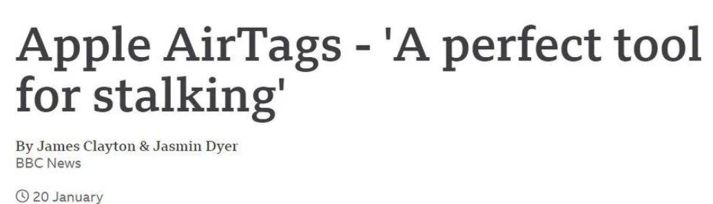 = stand, 表示“站、立”。 词源说明(童理民)   1 - 来自中古英语 stalke,小杆，小柱，小词形式于 stale,来自古英语 stalu,直柱，立柱，来自Proto-Germanic*stallaz,放置，固定位置，来自 PIE*stel,放置，站立，词源同 stall,stand.引申词义叶柄，花茎等。 2 - 可能来自 steal,偷，偷偷摸摸，-k,表强调，比较 hear,hark,tell,talk.引申词义跟踪，盯梢等。  摩西英语(摩西) stalking horse掩护；借口。中世纪英格兰，猎人打猎时会使用一匹受过专门训练的马，让马看似人畜无害般接近猎物，而自己藏在马身后，进入射程，biubiu，猎物被打倒。The project is a stalking horse for exploitation of the iron mine. |
| **prairie** 【ˈpreri】           | n. 大草原;北美草原;新大陆北部草原(美国北部和加拿大) 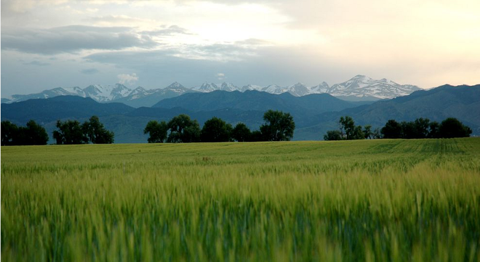 词源说明(童理民)   1 - 来自法语 prairie,草地，牧场，来自拉丁语 pratum,草地。特指北美大草原。 |
| **steppe** 【step】              | 草原;(尤指东南欧及西伯利亚树少的)大草原;干草原   来自俄罗斯语 step',大草原，尤指从东欧横穿苏联南部直至西伯利亚的大片地区。 |
| **grasslands** 【ˈgræˌslændz】   | 草原;草地;草场 a large area of open land covered with wild grass |
| **thatch** 【θætʃ】              | n. 茅草, 稻草用草盖的屋顶; 浓密头发 vt. 用茅草覆盖 推荐：它的根义是“覆盖”，和词根tect-覆盖同源。  词源说明(童理民)   1 - 来自古英语 theccan,盖茅草，遮盖屋顶，来自 Proto-Germanic*thakan,遮盖，隐藏，来自 PIE*steg,遮盖，隐藏，词源同 tegular,deck,detective.  摩西英语(摩西) **detect** [dɪ'tekt] vt.察觉；探测。前缀de-表away from,down，词根**`teg-`**,**`tect-`**表to cover or cover，与日耳曼词源的**thatch** [θætʃ] n.茅草；浓密的头发；茅草屋顶，vt.用茅草覆盖屋顶，同源，也与希腊词根**`stego-`**同源，比如**stegosaurus** [,steɡə'sɔːrəs] n.剑龙（有背甲）。**detect**，就是除掉盖子。 |
| **grudge** 【ɡrʌdʒ               | n. 积怨, 怨恨, 嫌隙 vt. 勉强做, 吝惜; 认为...不应得到 【复数：grudges；过去分词：grudged；现在分词：grudging】 范围：专四,GRE,雅思 单词笔记   ［添加］ 推荐： 拟声词。比较grouse, grumble。  词源说明(童理民)   1 - 拟声词。比较 grouse,grumble. |
| **imbibe** 【ɪmˈbaɪb】           | vt. 饮, 吸取, 吸入 vi. 喝, 吸收水分 推荐：im-使… + bib-喝 + -e → 饮。  **`im-`** 来自拉丁语in-，表示“在内，进入，使...”。 **`bib-`** = to drink, 表示“喝”。源自拉丁语 bibere "to drink."  词源说明(童理民)   1 - im-,进入，使，-bib,喝，饮，词源同 bibulous,beverage.即喝进去，引申词义吸收。 |
| **stencil** 【ˈstensl】          | n. 模版, 蜡纸 vt. 用蜡纸印, 用模版印刷 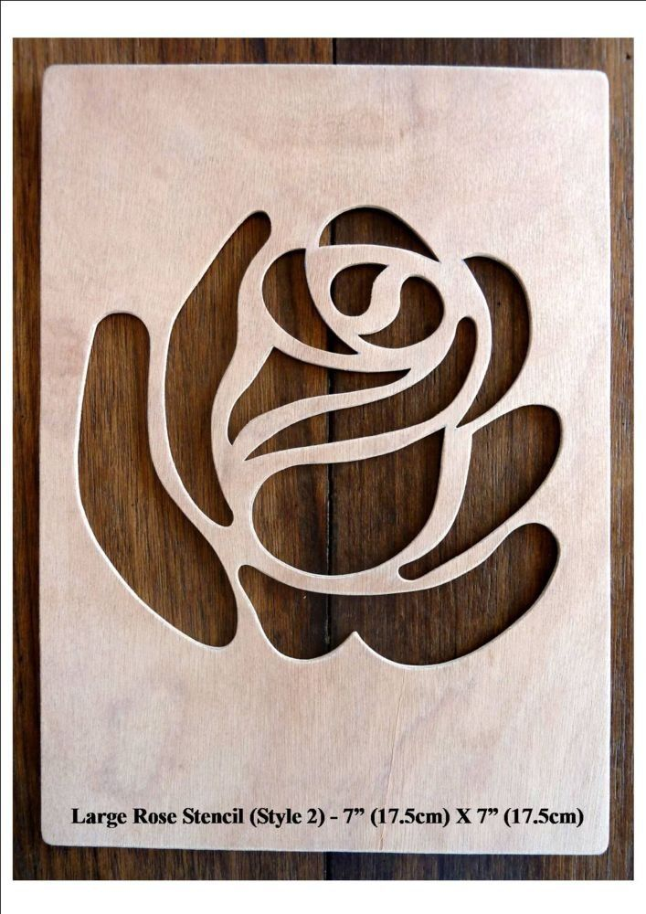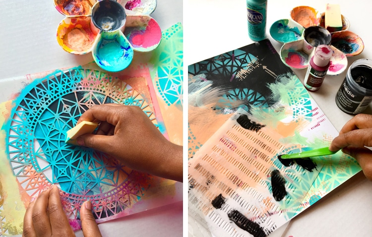 词源说明(童理民)   1 - 来自中古英语 stencellen,装饰以明亮图案，来自中古法语 estencele,闪光片，火星，火花，来自通俗拉丁语*stincilla,置换自 scintilla,火星，火花，词源同 scintilla,scintillate.引申诸相关词义。 |
| stag 【stæɡ】                    | n. 牡鹿, 男性社交晚会 vi. 不带女伴参加晚会;[商]〈俚〉买进新股（等）见利即抛;〈英〉监视;盯梢;告发;截短长裤 a. 全是男人(集会等)的;无异性伴侣的 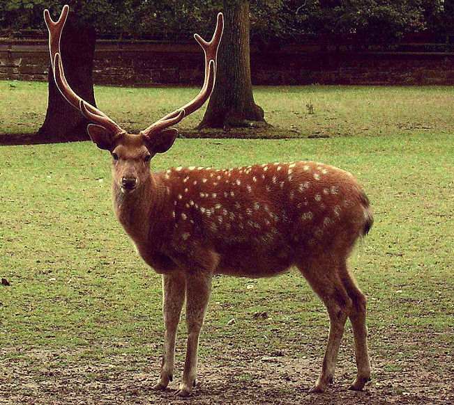 词源说明(童理民)   1 - 来自古英语 stagga,雄鹿，来自 Proto-Germanic*staggijo,雄鹿，豪猪，来自 PIE*stegh,刺，插，词源同 stick,sting. |
| **stag-g-er** 【ˈstæɡər】        | v. 蹒跚, 踉跄; 使交错, 使错开; 使震惊 a. 令人难以相信的 n. 摇晃;一种不稳定形式，部署或者秩序;摇摆不定  **`-er`** 构成动词，表示动作的“反复”。 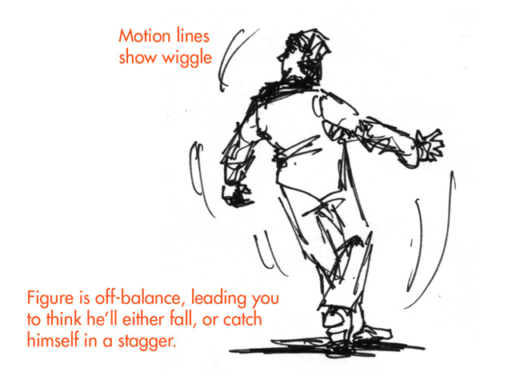 词源说明(童理民)   1 - 来自古诺斯语 stakra,推，挤，使打转，来自 Proto-Germanic*stakon,棍子，柱子，来自 PIE*steg,棍子，柱子，词源同 stack,stick.-er,表反复。其字面意思可能是用棍子在后面追打或赶，引申词义蹒跚，踉跄，及相关比喻义。 |
| **staggering** 【ˈstæɡərɪŋ】     | a. 蹒跚的, 巨大的, 惊人的 推荐：stagger【蹒跚】 + -ing表形容词。  stagger v. 蹒跚, 踉跄; 使交错, 使错开; 使震惊 a. 交错的, 错开的 n. 蹒跚 -ing 表形容词，“正…的”，“令人…的”。 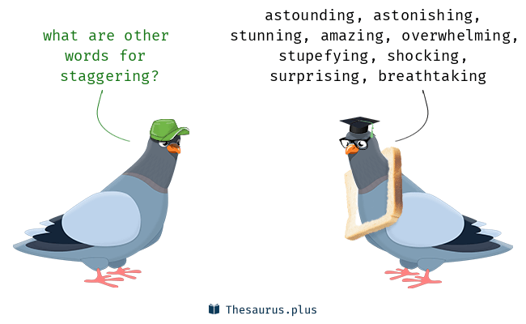 词源说明(童理民)   1 - stagger,震惊，-ing,形容词后缀。 |
| whistle-stop tour                     | whistle-stop tour走马观花式的旅游。过去美国西部，铁路还不发达，如果某个乘客需要在前方某个不出名的小镇下车，需要告诉火车司机，而司机到站前会鸣笛两声提醒乘客下车，短暂停留后再继续前行。现在国内流行那种比如“西欧七国十日游”等，游客只能在每个国家做短暂停留，这就叫whistle-stop tour。 |
| **rite** 【raɪt】                | n. 仪式, 典礼, 惯例, 礼拜式 词源说明(童理民)   1 - 来自拉丁语 ritus,宗教仪式，习惯，习俗，可能来自 PIE*rei,思考，劝告，词源同 rate,read,reason. |
| **in-veigh** 【ɪnˈveɪ】          | vi. 痛骂, 漫骂, 臭骂 推荐：in-进入，使 + veigh , 携带，运载，词义演变同invective。  **`veh-,vect-,vex-,veign-`**  = to carry, 表示”带来“，vect- 用在数学领域有“矢量、向量”的含义。源自拉丁语 vehere (过去分词 vectus) "to carry." **`in-`**  表示“无，没有（not,opposite）”，来自拉丁语 in-    1 - in-,进入，使，-veigh,携带，运载，词源同 vehicle,wagon.词义演变同 invective. |
| **vex** 【veks】                 | vt. [VN] (**old-fashioned or formal**) 使恼火；使烦恼；使忧虑 to annoy or worry sb vi. 烦恼 vex- 13 = to carry, 表示”带来“，vect- 用在数学领域有“矢量、向量”的含义。源自拉丁语 vehere (过去分词 vectus) "to carry." 词源说明(童理民)   1 - 来自拉丁语 vexo,摇晃，搅拌。 |
|                                       | n. 有轨电车路线, 电车道, (有轨)电车, (吊车)索道 推荐：tram【电车】 + way【道路】 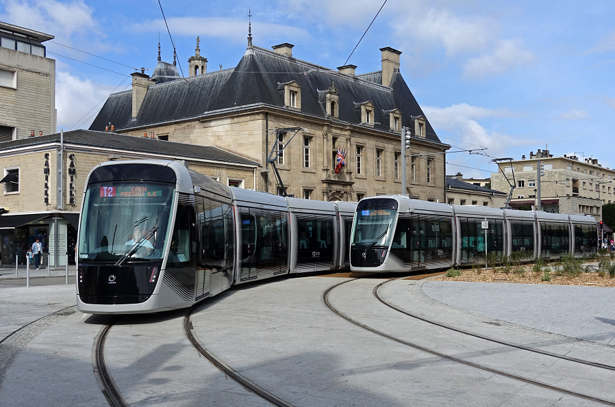 tram n. 电车轨道, 煤车, 纬纱, 纬丝 vt. 用煤车运载 vi. 乘电车 way n. 路, 路线, 路途, 方法, 道路, 情形, 规模, 习惯, 行业, 方面 ad. 远远地, 非常 |
| **fiss-ure** 【ˈfɪʃər】          | n. 裂缝, 裂沟 v. (使)裂开, (使)分裂 推荐：fiss-分裂 + -ure, 表名词。 ***次奥，这个单词谷歌一样挺尴尬的***  **`fiss-`** = to split, 表示“分裂”。源自拉丁语 findere (过去分词 fissus) "to split." **`-ure`** 表名词，通常在单词或词根以t结尾时使用，表示“一般状态，行为”。 |
| **dis-may** 【dɪsˈmeɪ】          | n. 沮丧;惊愕;诧异;灰心;丧气 vt. 使惊愕, 使气馁 推荐：dis-不，非 + may【能够】 → 不能做事 → 沮丧;参考:五月能种粮食 , 所以叫may。  dis- 来自拉丁语dis-，表示“分开，散开”，引申词义“离开，无，没有，缺乏，表相反等”。该前缀在字母 g, l, m, r, s, v 前缩写为 di-；在字母f前同化为 dif-。 may n. 五月 aux. 愿能, 可以, 愿意 词源说明(童理民)   1 - dis-,不，非，使相反，-may,权力，力量，词源同 may,might.原指剥夺权力或者力量，引申词义灰心，丧气。 |
| bay                                   | n. 海湾; 狗吠声; 月桂; 分隔间; 栗色马 v. 吠; 厉声强要 (~ for sth) a. 枣红色的 词源说明(童理民)   1 - 1. 海湾，词源不详。2. 栗色马，来自 PIE*badyo,棕色，栗子色。3. 月桂，来自拉丁语 bacca,莓子，桂果，词源同 Bacchus,酒神。4. 犬吠，拟声词。  摩西英语(摩西) keep at bay阻止…前进；使无法近身。这是个来自狩猎的习语。习语中的bay不是海湾那层含义，而是狗的吠叫。猎物（想象为一头野猪）被猎犬们包围了，试图顽抗并逃脱，但猎犬大声吠叫，与野猪对峙，使其不能逃出生天。所以有一条关于多吃苹果有益健康的西谚：One apple a day,keeps the doctor at bay. |
| **verg-e** 【vɜːrdʒ】            | n. 边缘, 边界, 起始点 vi. 处在边缘, 接近, 下沉, 趋向 推荐：verg-倾向 + -e  verg- = to turn,to bend, 表示“倾向；倾斜”。源自拉丁语 vergere "to turn, bend toward." 词源说明(童理民)   1 - 来自拉丁语 virga,小杆，绿枝，引申词义小草地。同时，因用做教堂司事的权杖，引申词义管辖范围，管辖范围的边缘。 |
| **verg-er** 【ˈvɜːrdʒər】        | n. 执权标的人, 教堂司事 推荐： verg-树枝，权杖 + -er。 -er 是施动者名词后缀，表示“人或物”，一般缀于动词后，来自古英语。 词源说明(童理民)   1 - 来自拉丁语 virga,小杆，绿枝，引申词义权杖，执权杖者，教堂司事。 |
| **plush** 【plʌʃ】               | n. 长毛绒, 长毛绒裤 a. 长毛绒制的, 豪华的 词源说明(童理民)   1 - 来自法语 pluche,棉绒，丝绒，来自古法语 peluchier,拔，扯，来自拉丁语 pilus,头发，毛发，词源同 pile,pluck.引申词义豪华的。 |
| **monk** 【mʌŋk】                | 词源说明(童理民)   1 - 来自希腊语 monas,单个的，词源同 monad,monastery.即单独生活的人，用于指僧侣，修道者，苦修者等。  摩西英语(摩西) friar ['fraɪə] n. 化缘修士；男修道士。与集体居住在封闭环境中修行的monk僧侣不同，friar是流动的，靠善心施舍为生，活动于一般信徒和普通民众中间。这个单词是拉丁词源，本意是兄弟，比如单词fraternity [frə'tɜːnɪtɪ] n.友爱；兄弟会；互助会；大学生联谊会。与日耳曼词源的brother同源。 |
| **com-bust** 【kəmˈbʌst】        | 基本释义    v. 开始燃烧 推荐：com-一起 + bust-燃烧 **`com-`** 来自拉丁语介词com，表示“与...一起，一起（with, together）”，或仅做强调。源自拉丁语 com "with (collective and intensive prefix.)" **`bust-`** = to burn up, 表示“燃烧”。源自拉丁语 urere "to burn." 词源说明(童理民)   1 - com-,表强调，-bust,燃烧。 |
| **muscovite** 【ˈmʌskəʊvaɪt】    | 白云母;云母;白雲母;莫斯科人;莫斯科公国                       |
| **lament** 【ləˈment】           | n. 悲叹, 悔恨, 恸哭, 挽歌, 悼词 vt. 哀悼 vi. 悔恨, 悲叹 词源说明(童理民)   1 - 来自 PIE*la,叹息，悲痛，拟声词，-ment,名词后缀。 |
| **lament-able** 【ləˈmentəbl】   | a. 可悲的, 哀伤的, 可怜的 推荐：lament【痛惜，悲痛】 + -able, 表形容词。  lament n. 悲叹, 悔恨, 恸哭, 挽歌, 悼词 vt. 哀悼 vi. 悔恨, 悲叹 -able 一般缀于动词后，构成形容词，表示“可…的，能…”。 词源说明(童理民)   1 - 来自 lament,痛惜，悲痛。 |
| **un-canny** 【ʌnˈkæni】         | a. 异常的, 难以解释的 推荐：un-无 + canny【a. 精明的】  **`un-`** 表示“不，无，非，没有”。源自古英语 un- "not." **`canny`** a. 精明的, 谨慎的, 节约的 词源说明(童理民)   1 - un-,不，非，can,能够，知道。即不知道的，异常的。比较 canny. |
| **tug** 【tʌɡ】                  | n. 用力拉, 拖曳, 苦干, 挣扎, 绳索 v. 用力拉 词源说明(童理民)   1 - 来自古英语 teohan,拉，拖，来自 Proto-Germanic*teuhan,拉，拖，来自 PIE*deuk,拉，词源同duct,tow. |
| **thrift** 【θrɪft】             | n. 节约, 茂盛, 海石竹 推荐：来自中古英语thriven , 繁荣，兴旺，词源同thrive , 繁荣，兴旺。-th , 名词后缀，后缩写自t . 词义由繁荣，兴旺引申为节约，节俭。词义演变比较fruitful , frugal。  词源说明(童理民)   1 - 来自中古英语 thriven,繁荣，兴旺，词源同 thrive,繁荣，兴旺。-th,名词后缀，后缩写自 t.词义由繁荣，兴旺引申为节约，节俭。词义演变比较 fruitful,frugal. |
| **tat** 【tæt】                  | v. 梭编, 梭织 n. 衣衫褴褛(的人), 粗麻布, 轻击 词源说明(童理民)   1 - 可能回构自 tatty,劣质的。 |
| **Tit for tat** 【tɪt fɔːr tæt】 | a situation in which you do sth bad to sb because they have done the same to you 以牙还牙；针锋相对；一报还一报 |
| **tit** 【tɪt】                  | n. (女人的)奶子，奶头，乳头;蠢货;笨蛋;窝囊废;山雀  词源说明(童理民)   1 - 来自古英语 titt,奶头，词源同 teat,最终词源不详，可能来自拟声词，模仿吸奶的声音。 2 - 用于表示各种小动物或小物件，词源不详。 |
|                                       |                                                              |

## 2022-3

| 单词                                                         | 解释                                                         |
| ------------------------------------------------------------ | ------------------------------------------------------------ |
| **parole** 【pəˈroʊl】                                  | n. 假释; 言语 v. 假释, 有条件地释放 词源说明(童理民)   1 - 来自法语 parole d'honneur,承诺，承诺辞，即 parole of honor,来自拉丁语 parabola,说话，词源同 parable,parley.原指战争中俘虏作出的不逃跑的承诺，后用于对罪犯的假释。 |
| **parol-ee**                                 【pəˌrəʊ'liː】 | n. 假释犯 推荐：parole【假释】 + -ee  **`parole`** n. 假释; 言语 v. 假释, 有条件地释放 **`-ee`** 名词后缀，表示“人或物”。 |
| **stifle** 【ˈstaɪfl】                                  | vt. 使窒息, 抑止, 扼杀 vi. 窒息, 被扼杀 n. (马,狗的)后腿膝关节(病) 词源说明(童理民)   1 - 词源不确定，可能最终来自 PIE*steip,压紧，打包，塞满，词源同 stiff,stuff.-le,表反复。引申词义窒息，压制，扼杀等。 |
| **trem-ble** 【ˈtrembl】                                | n. 战栗, 颤抖 vi. 战栗, 忧虑, 摇晃 推荐：源自拉丁语 tremulus "trembling, shaking, quaking"，源自 tremere "to tremble, shiver, quake," 后借道法语进入英语。  **`trem-`** = quiver, 表示“颤抖”。源自拉丁语 tremere "to shake, tremble." 词源说明(童理民)   1 - 来自古法语 trembler,颤抖，恐惧，来自拉丁语 tremere,颤抖，摇摆，来自 PIE*trem,颤抖，来自 PIE*ter,转，摇，扭曲，词源同 turn,torture.插入字母 b,比较 number,numerate. |
| **over-ride** 【ˌoʊvərˈraɪd】                           | vt. 推翻, 无视, 对...有最后发言权, 制服, 践踏, 奔越过 推荐：over-上 + ride【骑】 → 骑在上面 → 推翻[下面的]。  **`over-`** 表示“过度，过分；在上”，或表强调，表整个，表完全。源自古英语 ofer "over." **`ride`** n. 骑马, 乘坐, 乘车, 搭便车 vt. 骑, 乘坐, 压迫, 控制 vi. 骑马, 乘车, 漂游 切换词根显示方式 词源说明(童理民)   1 - over-,在上，超过，ride,骑。即骑在上面的，凌驾于之上的。后用于指否决，推翻。 |
| **bolster** 【ˈboʊlstər】                               | n.靠垫;垫枕(长而厚) vt.加强;改善 推荐：词源同ball, 原来指鼓起来的垫子，枕头，护垫等，主要作名词使用。后来做动词使用，指支持，保护。  词源说明(童理民)   1 - 词源同 ball,用于指鼓起来的垫子，枕头，护垫等。后引申词义支持，保护。 |
| **serene** 【səˈriːn】                                  | a. 宁静的, 沉着的, 安详的, 晴朗的 n. 晴朗, 平静  词源说明(童理民)   1 - 来自拉丁语 serenus,平静的，平和的，安详的。 |
| **blade** 【bleɪd】                                     | n. 叶; 刀锋, 刀口; （船或直升机）桨叶; 冰刀 词源说明(童理民)   1 - 来自 PIE*bhel,膨胀，生长，繁茂，词源同 blow.原指生长的叶子，叶片，后指刀片。 |
| **blaze** 【bleɪz】                                     | n. 火焰, 烈火; 灿烂; 大量; 浅颜色的斑 v. 燃烧; 发光; 怒视; 大肆宣扬; 连续射击 **`blaze`**- = torch, 表示“火把”。 词源说明(童理民)   1 - 来自 PIE*bhel,燃烧，发光，词源同 blank. |
| **trail-blazers**  【ˈtreɪlbleɪzər】                    | n. 开路的人, 开拓者 trail n. 踪迹, 痕迹; 一串足迹; 小径, 路径; <北美>滑雪道 v. 拖, 拉; 疲惫地走; 落后, 失利, 失败; 跟踪; 蔓生, 蔓延 blaze n. 火焰, 烈火; 灿烂; 大量; 浅颜色的斑 v. 燃烧; 发光; 怒视; 大肆宣扬; 连续射击 -er 是施动者名词后缀，表示“人或物”，一般缀于动词后，来自古英语。 切换词根显示方式 词源说明(童理民)   1 - trail,踪迹，小径，blaze,燃烧，-er,人。比喻用法 |
| **coke** 【koʊk】                                       | n. 可口可乐, 焦炭 v. (使)成焦炭 推荐：来自英语方言colke, 焦碳，可能来自coal。  词源说明(童理民)   1 - 来自英语方言 colke,焦碳，可能来自 coal. |
| **hut** 【hʌt】                                         | n. 小屋, 茅舍, 临时军营 v. (使)住在茅舍 hut- 5 = house, 表示“家”，引申为“环境”。 词源说明(童理民)   1 - 来自古法语 hutte,村舍，来自 PIE*skeu,隐藏，遮盖，词源同 hide,house.后该词用于指简陋的小棚，小舍，house 用于指屋子，大型建筑物。 |
| **mount** 【maʊnt】                                     | n. 乘骑用马, 框, 衬纸, 山 vi. 乘马, 爬上, 增长 vt. 爬上, 使上马, 装上, 装裱, **安放,** **制作...的标本**, **设置**, **上演** mount- = ascend, 表示“登上”。源自拉丁语 mons (词干 mont-) "mountain." 词源说明(童理民)   1 - 来自拉丁语 mons,山峰，高山，山，来自 PIE*men,升出，突起，词源同 eminent,amount.引申动词词义攀登，骑上，安装等。  摩西英语(摩西) Mount Everest珠穆朗玛峰。它的英文名字来自1830-1843年作为大英帝国印度测量局局长的Sir George Everest。当年因为印度和中国对珠穆朗玛峰有不同的叫法，所以Everest决定两个都不用，而用自己的名字命名了这座世界最高峰。有记载的第一个登上珠峰的是新西兰登山者Edmund Hillary和他的向导丹增诺盖。 |
| **speculat-ion** 【ˌspekjuˈleɪʃn】                      | n. 沉思, 推测, 投机 推荐：speculate【推测】 + -ion, 表名词，是单词speculate 派生的名词。  **`speculate`** vi. 深思, 推测, 投机 **`-ion`** 表名词，“行为、动作、状态、过程、结果；物品”等。 词源说明(童理民)   1 - speculate,推测，猜测，投机，炒股，-ion,名词后缀。  摩西英语(摩西) speculation [,spekjʊ'leɪʃn] n.投机；推测；思索。词根spec-的意思是观察，原本是一个哲学术语，意为思索。希腊哲学家泰勒斯有次边走路边思索，不小心掉进了水沟，路人大笑，说哲学家有啥用呀。泰勒斯用行动来反驳，他预测到某年的橄榄会丰收，提前租下了周围所有的榨油场，大发了一笔，投机成功。 |
| trapping                                                     | 【计】 设陷, 陷入, 俘获 【化】 截留; 捕俘 【医】 捕集, 收集; 捕捉法, 陷阱捕捉法 >推荐：trap【n. 圈套, 陷阱, 诡计, 存水弯】 + -p- + -ing  trap n. 圈套, 陷阱, 诡计, 存水弯; 双轮轻便马车 vi. 设圈套, 设陷阱 vt. 诱捕, 诱骗, 抓住, 使受限制 |
| trappings                                                    | trappings n. 马饰, 服饰, 礼服, 装饰品, 外部标志 词源说明(童理民)   1 - 来自中古英语 trappe,马鞍，马饰，装饰，改写自法语 drap,布，词源同 drape,窗帘，帘布。后引申词义个人所有物，标志，服装等 |
| **charter** / **writ**                                       | n. 特许状, 执照, 宪章 vt. 特许, 发给特许执照, 包租 推荐：chart-纸 + -er → 纸上的东西 → 契约等，是单词chart 派生的动作执行者（施动）名词。 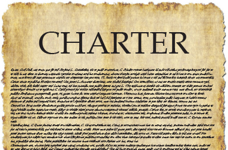 **`chart`** n. 图表, 海图 vt. 制成图表 **`-er`** 是施动者名词后缀，表示“人或物”，一般缀于动词后，来自古英语。 词源说明(童理民)   1 - 来自拉丁语 charta,卡片，纸，词源同 card,cartel.指在纸上签订的协议和条款。  摩西英语(摩西) **writ** [rɪt] n.[法] 令状；文书；法院命令。这个单词与write有关，确切说它的字面意为“something written”或“piece of writing”，指委任状、传票和特权令等（多为法庭所颁布）文书，特点为：**简洁且有效期短**。与之相对，charter ['tʃɑːtə] vt.特许；包租，n.宪章；执照；**特许状，繁冗但效期长**。  n. 1 . the renting or leasing of transport vehicles for personal or special use , or a contract for this purpose  2 . a formal document incorporating (将…包括在内;包含;吸收;使并入;注册成立) an organization , company , or educational institution  3 . a formal written statement of the aims , principles , and procedures of an organization  4 . a formal written statement describing the rights and responsibilities of a state and its citizens  5 . **a *document* from an organization or society that authorizes the setting up of a new branch**  6 . a special privilege , immunity(免疫;免疫力;豁免;受保护;免除) , or exemption granted to a particular person or group  7 . a vehicle chartered for personal or special use  8 . an official document that ***creates a city , university , private corporation , etc*** . and describes its purpose and its legal rights  9 . the process of renting a boat , airplane , or bus , especially for use by a group of people  10 . an official document describing the aims , rights , or principles of an organization  v. 1 . to hire or lease a vehicle for a personal or special purpose  2 . to grant a charter of incorporation to a group or organization  3 . to rent a boat , airplane , or bus , especially for use by a group of people  4 . to create a city , private corporation , university , etc . by giving it a charter  5 . give a charter to   ●a chartered plane包机 ●a charter service包租服务 ●a blackmailer's charter敲诈者可钻的法律空子 |
| **franch-ise** 【ˈfræntʃaɪz】                           | n. 公民权, 特权, 特许经营权, 免赔额 vt. 给以特权, 给以...公民权 推荐：franch【自由】 + -ise。  **`-ise, -ize`** 动词后缀，一般缀于形容词后。-ise 是英式英语，-ize 是美式英语。源自希腊语 -izein, verbal suffix. **`franc-,frank,franch`** 表示“自由、坦白、特权”。 词源说明(童理民)   1 - 来自古法语 franc,非奴役的，自由的，来自拉丁语 francus,法兰克人，自由人，词源同 Frank.其原词义即使享有自由权，后引申词义选举权，特许经销权等。 |
| **cunni-ling-us** 【ˌkʌnɪˈlɪŋɡəs】                      | n. 舔阴(用口和舌接触女性生殖器)  cunni- = vulva, 表示“外阴”。源自拉丁语 cunnus "vulva." ling- = to lick, 表示 "舔"。源自拉丁语 lingere "to lick." 词源说明(童理民)   1 - cun-,阴户，词源同 cunt.-ling,舔，词源同 tongue,language.  the act of touching a woman's sex organs with the mouth and tongue in order to give sexual pleasure |
| **ani-ling-us** 【ænɪ'lɪŋɡʌs】                          | n. 舐肛 ani- = anus, 表示“肛门”。源自拉丁语 anus "ring, anus." ling- = to lick, 表示 "舔"。源自拉丁语 lingere "to lick." sexual stimulation of the anus by the tongue or mouth. |
| **cunning** 【ˈkʌnɪŋ】                                  | adj.狡猾的;奸诈的;诡诈的;灵巧的;精巧的;巧妙的 n.狡猾;诡诈;狡黠 |
| **quill** 【kwɪl】                                      | n. 羽根, 大翎毛, 羽毛笔, （豪猪）刺 vt. 刺穿 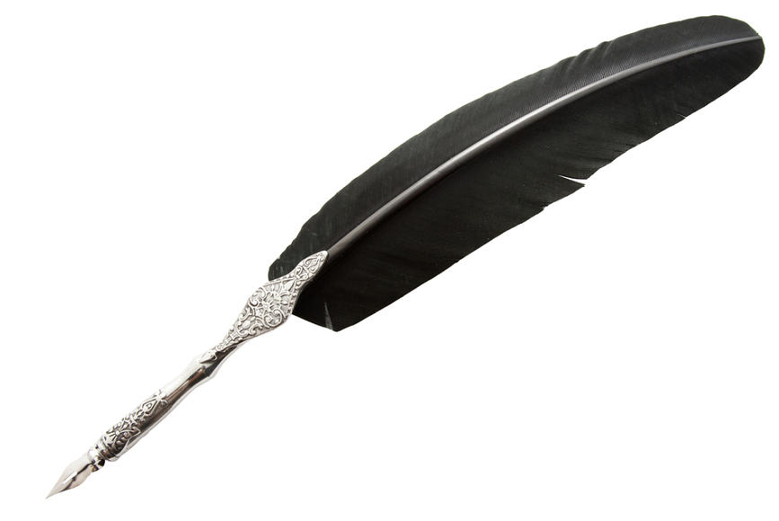 词源说明(童理民)   1 - 词源不详。 |
| **quilt** 【kwɪlt】                                     | n. 棉被 vt. 加软衬料后缝制, 东拼西凑地编 vi. 缝被子 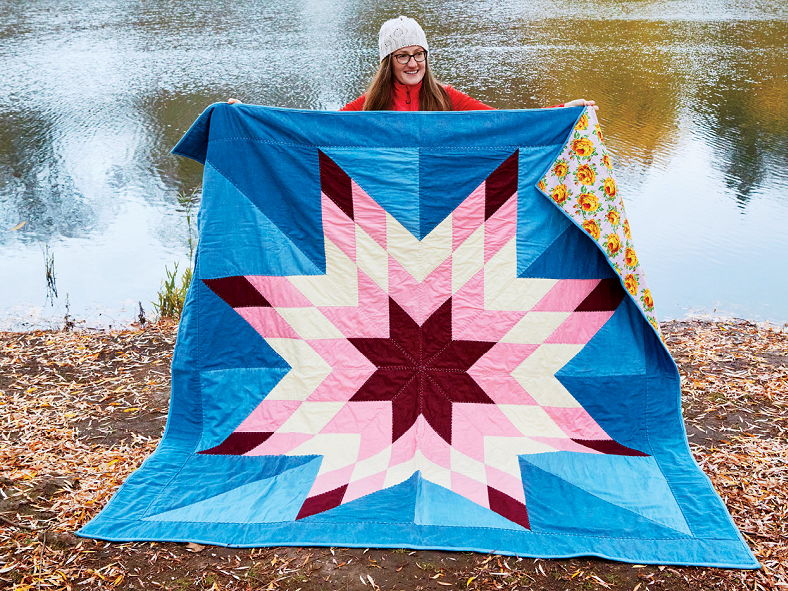 词源说明(童理民)   1 - 来自拉丁语 culcita,垫子，床垫，词源同 cushion.原指软衬里垫子，后用于指被子。 |
| **nom-ad** 【ˈnoʊmæd】                                  | n. 游牧部落一员, 流浪者 a. 游牧的, 流浪的  **`nom-`** = pasture, 表示“牧场”。源自希腊语 nome "pasturage, grazing," nomas "wandering in search of pasture." **`-ad`** 表名词，“…东西，状态”。 词源说明(童理民)   1 - 来自希腊语 nomos,牧场，放牧，来自 PIE*nem,分配，分开，词源同 number,nemesis.用于指分配的草地，游牧，游牧民族。 |
| **nomad-ic** 【noʊˈmædɪk】                              | a. 游牧的, 游牧生活的, 流浪的 推荐：nomad【游牧的】 + -ic表形容词，是单词nomad 派生的形容词。  **`nomad`** n. 游牧部落一员, 流浪者 a. 游牧的, 流浪的 **`-ic`** 表形容词，“…的”。 |
| **cane-on**（canon) 【ˈkænən】                          | n. 原则;(主教座堂的)咏礼司铎;准则;标准;(某作家的)真作，精品;两重轮唱（或演奏） v. 炮轰 推荐：cane【芦苇】 + -on大词后缀。因形如大芦苇而得名。  cane n. 植物茎; 手杖, 藤条 v. 以杖击, 鞭挞 词源说明(童理民)   1 - 来自 cane,芦苇，-on,大词后缀。因形如大芦苇而得名。  摩西英语(摩西) 1.cannon ['kænən] n.大炮；加农炮；榴弹炮；机关炮，vi.炮轰；开炮，vt.炮轰。这个单词的后缀-on在这里是个指大后缀，其另外一种形式是-oon，比如balloon就是一个big ball。那问题就来了，那can呢？这里不是能不能那个意思了，而是(金属或塑料)罐。听装的饮料都喝过吧，加农炮，炮筒象放大版的易拉罐。  2.loose cannon变得无法控制的人(或事物)。早期的船舶是木制的，而战船上基本都装有大炮。因为大炮发射炮弹时的后座力很大，所以炮身需要固定安装在滑轮车上并且用绳子把炮和车捆绑结实。假如绳子不幸松了，大炮多半会滚落到甲板上从而误伤到己方。Daniel has always been something of a loose cannon. |
| **faculty** 【ˈfæklti】                                 | n. 才能, 能力, 全体教员, (大学的)系 推荐：fac-做，表示事情的能力，才能等。后用来指全体教职员。  fac-,fact-,fect-,fic- = make, do, 表示“做，制作”。源自拉丁语 facere "to do, make." 英英   n. 1 . **a capacity or ability that somebody is born with or learns**  2 . **a mental power or ability such as reason or memory**  3 . the entire teaching staff of a university , college , or school , including any administrators holding academic rank  4 . the teaching staff of a particular faculty in a university or college  5 . a department or group of departments dealing with a particular subject in a university or college  6 . all of the people who practice a particular profession , especially medicine  7 . a power or right given by an authority  8 . all the teachers in a university , college , or school 9 . **a natural physical or mental ability that most people have** |
| **ex-cis-e** 【ˈeksaɪz , ɪkˈsaɪz】                      | n. (烟、酒等)消费税, 货物税, 国产税 vt. 切除 推荐：ex-外 + cis-切 + -e → 切出 → 切除。  ex- 表示“从，从...离开，从...向外，向外，向上”，来自PIE *eghs, 向外。该原始印欧语根进入希腊语产生变体形式 ek-, 进入英语拼写演变为 ec-；进入拉丁语演变成 ex-；在浊辅音 b, d, g 和半辅音 j, l, m, n, r, v 前缩写成 e-；在字母f前同化为 ef-。源自希腊语 ex, ek "out of, from." 拉丁语 ex, ex- "out of, away from." cis- = cut, kill, 表示“切开，杀”。也可用于词尾表示“杀，切断”，形式为 -cide。源自拉丁语 caedere "to cut." 词源说明(童理民)   1 - 来**自拉丁语 accensum,评估，估税**，来自 cens-,评估，审查，词源同 census.因词义与 excise有所重合，因而拼写受 excise 影响俗化。 2 **- ex-,向外，-cis,砍，切**，词源同 decide,circumcise |
| **toll** 【toʊl】                                       | n. 通行费, 代价, 钟声; 伤亡人数 vt. 征收, 敲钟, 鸣钟, 勾引, 引诱 vi. 征税, 鸣钟  词源说明(童理民)   1 - 来自**古英语 toll,费用，税费，关税**，来自 Proto-Germanic*tullo,计算数，告知，来自 PIE*dol,计算，思考，词源同 tell,tall.引申诸相关词义。 2 - 词源不详，多用于指比较庄严的钟声。 |
| **booth** 【buːθ】                                      | n. 亭, 摊棚  词源说明(童理民)   1 - 来自 PIE*bheue,存在，生长，居住，词源同 boor,原指简陋的居住之所。 |
| **en-trench** 【ɪnˈtrentʃ】                             | vt. 围以壕沟, 防护, 保卫, 使处于牢固地位 vi. 掘壕, 侵犯 推荐：en-使 + trench-砍 → 切出壕沟 → 防护。  **`en-`** 表示“入、内、在...之内、使...”，来自古法语 en-。在字母 b, m, p 前拼写同化为 em-。 **trench** n. 渠, 沟渠, 战壕 vt. 在...开沟, 挖战壕于, 用战壕围住 vi. 挖战壕, 开沟 词源说明(童理民)   1 - en-,进入，使，-trench,砍，切，词源同 trench,truncate.即切进去，牢固树立。 |
| **trench** 【trentʃ】                                   | n.沟槽;沟;海沟;战壕;堑壕;渠;大洋沟 v.开畦沟；深耕；【木工】作沟槽；切开 |
| **en-trench-ed** 【ɪnˈtrentʃt】                         | a. 牢固的, 根深蒂固的 推荐：entrench【防护、掘壕】 + -ed  **entrench** vt. 围以壕沟, 防护, 保卫, 使处于牢固地位 vi. 掘壕, 侵犯 **`-ed`** 形容词后缀，加在名词后表示“如...的”；加在动词后表示“被...的”。 |
| **treat-y** 【ˈtriːti】                                 | n. 条约, 谈判 推荐：treat【对待】 + -y名词后缀 → 作出处理的文件 → 条约。  treat- = handle, 表示“处理”，是词根 tract- "to draw" 的法语变体。 -y 表名词，加在形容词或以r结尾的单词后。 词源说明(童理民)   1 - treat,对待，处理，-y,名词后缀。引申词义条约，协定。 |
| **sneak-er** 【ˈsniːkər】                               | n. 帆布胶底运动鞋; 鬼鬼祟祟做事的人, 卑鄙者 推荐：sneak【鬼鬼祟祟】 + -er，是单词sneak 派生的动作执行者（施动）名词。  sneak v. 溜走; 偷走; 偷偷地做; 告状 n. 鬼鬼祟祟的人, 偷偷摸摸的行为 a. 突然的；出其不意的 -er 是施动者名词后缀，表示“人或物”，一般缀于动词后，来自古英语。 词源说明(童理民)   1 - 比喻用法。 |
| **ruffle** 【ˈrʌfl】                                    | n. 荷叶边, 皱褶; 波纹; 生气, 混乱 vt. 弄皱; 使沮丧, 触怒; 抚弄 (头发); 竖起; 擂(鼓)  推荐：词源不详，可能来自 rough 的发音拼写讹误。来自 rough 的词源义，击，打，弄皱，词源同corrugate,rug.引申词义褶饰，花边等。  词源说明(童理民)   1 - 词源不详，可能来自 rough 的发音拼写讹误。来自 rough 的词源义，击，打，弄皱，词源同corrugate,rug.引申词义褶饰，花边等。 |
| **swarm** 【swɔːrm】                                    | n. 群, 大群, 蜂群, 分蜂群 vi. 分群, 群集, 聚集一块, 云集, 攀 vt. 挤满, 爬, 攀  词源说明(童理民)   1 - 来自古英语 swearm,嗡嗡声，来自 Proto-Germanic*swarmaz,嗡嗡声，来自 PIE*swer,蜂鸣声，耳语声，拟声词，词源同 absurd.  摩西英语(摩西) **susurrus** ['sjuːsərəs] n.低语声；沙沙声；潺潺声。可能是拟声来源，证据么，你能找到拼写比它更象其所描述的声音的单词吗？susurr-部分是拉丁词根sur-表低语；嗡嗡声的重复式，可以理解为强调，与日耳曼词源的**swarm** [swɔːm] n.蜂群和希腊词源的**syrinx** ['sɪrɪŋks] n. [鸟] 鸣管；耳管，同源。 |
| **coarse** 【kɔːs】                                     | 粗糙的;粗织的;粗的;大颗粒的;粗鲁无礼的，粗俗的(尤指涉及性的) **Coarse** things have a rough texture because they consist of thick threads or large pieces.  |
| **subsidy** 【ˈsʌbsədi】                                | n. 补助金, 津贴 推荐：sub-在~下面 + sid-坐 + -y名词后缀 → 位于其下 → 支撑，支持 → 补贴；津贴。 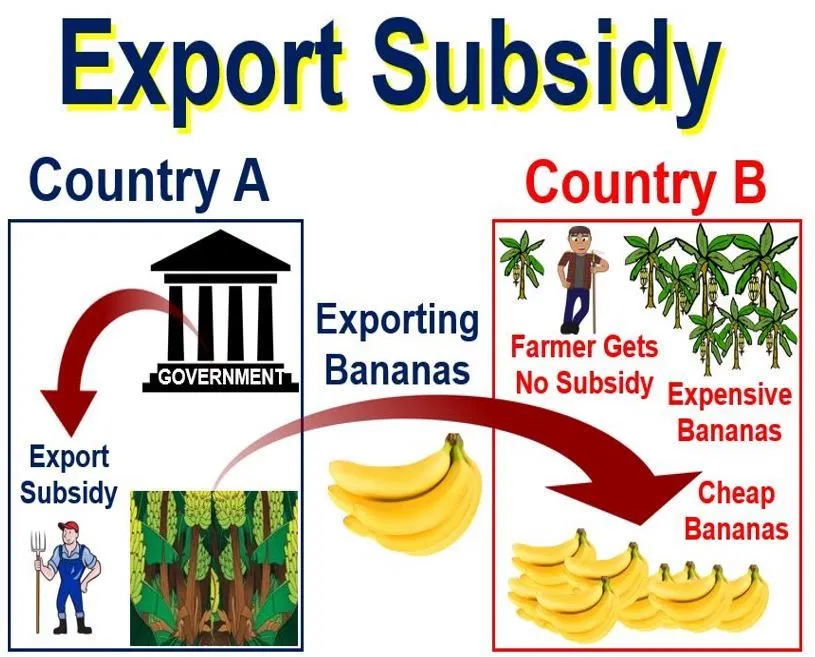 sub-,sus = under, beneath; behind; from under; resulting from further division，表示“在下面，次一等，副手，下一级，接近”等。源自拉丁语 sub "under." sid-,sed-,sess- = sit, 表示“坐”。 词源说明(童理民)   1 - sub-,在下，-sid,坐下，安排，词源同 money that is paid by a government or an organization to reduce the costs of services or of producing goods so that their prices can be kept low |
| **corner**                                                   | **corner the market (in sth)**: 垄断（某种货品的交易） to get control of the trade in a particular type of goods |
| **fluff** 【flʌf】                                      | n. 软毛, 柔毛, 绒毛, 错误, 无价值的东西 vi. 起毛, 变松, 出错 vt. 使起毛, 抖松; 搞糟  词源说明(童理民)   1 - 来自拉丁语 vellus,羊毛，词源同 wool,fleece.或来自辅音丛 fl-,扑腾，拍打，词源同 flap,flop.用来指绒毛，绒屑。 |
| **nag** 【næɡ】                                         | n. 老马 v. 唠叨; 不停地抱怨; 不断困扰 词源说明(童理民)   1 - 来自 Proto-Germanic*gnagan,咬，词源同 gnaw,最终来自咬牙的声音。引申词义抱怨，牢骚。  摩西英语(摩西) nag [næg] n.唠叨，vt.使烦恼；不断地唠叨。它与gnaw [nɔː] v.咬；折磨；侵蚀，同源（都是原始日耳曼语词源）。两点：1.nag本来是以gn-开头的，但正如gnaw一样后来g-不发音了，所以脱落了。2.gnaw拼写中的w其实最初是硬音g，这是古英语中g音的音变之一。夏夜蚊虫不断叮咬（gnaw），你不烦恼（nag）？ |
| **sting-y** 【ˈstɪndʒi】                                | 基本释义    a. 小气的, 吝啬的, 缺乏的, 有刺的 推荐：sting【刺】 + -y, 表形容词 → 像刺一样[小的心胸] → 小气的。  sting- = to stick, 表示“刺”。源自古英语 stingan "to sting." -y 表形容词，加在名词后变成形容词。 词源说明(童理民)   1 - sting,刺，叮，蜇，-y,形容词后缀。俚语。 |
| **stringy** 【ˈstrɪŋi】                                 | 细长而干枯的;细长而稀疏的;多筋的;纤维多而不嫩的;柴的;瘦得露出筋的 The meat was stringy... 这肉嚼不烂 |
| **pacifier** 【ˈpæsɪfaɪər】                             | 。n. 慰抚者, 调解人, 橡皮奶头, 镇静剂 推荐：pacify【使平和】 + -ier，是单词pacify 派生的动作执行者（施动）名词。  pacify vt. 使平静, 安慰, 绥靖, 使服从 -er 是施动者名词后缀，表示“人或物”，一般缀于动词后，来自古英语。 切换词根显示方式 词源说明(童理民)   1 - 来自 pacify,平息，安抚，使平和。后用于指婴儿用的奶嘴。 |
| **rape** 【reɪp】                                       | n. 抢夺, 掠夺, 强奸, 葡萄渣, 芸苔, (欧洲)油菜 vt. 掠夺, 抢夺, 强奸 rape- = snatch, 表示“捕，夺”。源自拉丁语 rapere "to seize." 词源说明(童理民)   1 - 来自拉丁语 rapere,抓住，抓取，来自 PIE*rep,reup,抓走，抢夺，词源同 rob,rip,rapid.引申词义掠夺，强夺，后用于指强奸，强暴。 2 - 来自拉丁语 rapum,萝卜，根茎植物，-a,复数格，词源同 ravioli.后用于指油菜。 |
| **bill-board** 【ˈbɪlbɔːrd】                            | n. 广告牌, 布告板 vt. 宣传 推荐：bill【广告】 + board【板】  bill n. 帐单; 清单, 节目单; 纸币; 鸟嘴, 喙; 广告; 议案 v. 给…开账单; 宣传; 把…宣传为 board n. 木板, 甲板, 膳食, 会议桌 vt. 乘船, 供膳食, 用板覆盖 vi. 搭伙 |
| juggle                                                       | v. 玩抛接杂耍; 尽量兼顾; 有效利用 joc- 表示“欢乐，开心”。源自拉丁语 iocus "joke." |
| juggler                                                      | n. 变戏法者, 行骗者 推荐： juggle【玩戏法】 + -er, 表人，是单词juggle 派生的动作执行者（施动）名词。 |
| hither-to                                                    | ad. 迄今, 至今 推荐：hither【这里】 + to【向】。引申词义迄今。  hither a. 这边的, 在这边的 ad. 向这边, 向此处 to prep. 到, 向, 趋于 ad. 向前 词源说明(童理民)   1 - hither,这里，to,向。引申词义迄今。 |
| hither 【ˈhɪðər】                                       | a. 这边的, 在这边的 adv. 向这边, 向此处 词源说明(童理民)   1 - 来自 Proto-Germanic*hi,这里，来自 PIE*ki,这里，词源同 here,he,-ther,工具格后缀。  1 . on the near side of something  adv.1 . to this place |
| hither-most                                                  | a. 最靠近的 推荐：hither【近】 + most【最高级】  hither a. 这边的, 在这边的 ad. 向这边, 向此处 most n. 最多, 最大 a. 大多数的, 几乎全部的, 最多的 ad. 最, 最多, 极其 |
| **hamper** 【ˈhæmpər】                                  | n. 食篮, 阻碍物, 食盒 vt. 阻碍, 使困累, 妨碍, 牵制 单词笔记   ［添加］ 词源说明(童理民)   1 - 来自古法语 hanap,杯子，酒杯，后引申词义装杯子的大篮子。防碍义词源不详，参照习语basket case,困境。 |
| **chagrin** 【ʃəˈɡrɪn】                                 | n. 懊恼, 失望 vt. 使懊恼 推荐：【联想】cha差 + grin咧嘴笑 → 差强人意、勉强的笑 → 懊恼。  词源说明(童理民)   1 - 词源不详。 |
| **glissandi** 【gləˈsɑndi】                             | n. 滑奏, 滑奏声部 词源说明(童理民)   1 - 来自 glide,滑动。用于音乐术语。 |
| **paddy** 【ˈpædi】                                     | n. 稻, 谷, 爱尔兰人, 警察 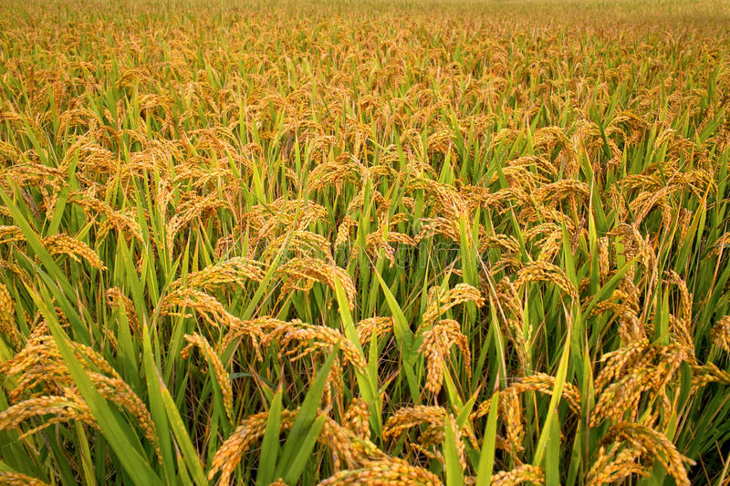 词源说明(童理民)   1 - 来自爱尔兰常用名 Patrick 昵称。 2 - 缩写自 paddy field,来自马来语 padi,稻谷，未加工过的水稻。 |
| **gibe** 【dʒaɪb】                                      | v. 嘲笑 n. 嘲笑  |
| **phew** 【fjuː】                                       | interj. 咳, 哦, 唷 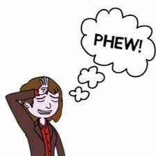 词源说明(童理民)   1 - 感叹词。 |
| **allay** 【əˈleɪ】                                     | vt. 使平静, 使缓和 推荐：al-去，往 + lay【放】，这里指“放心，使平静”。  al- 来自拉丁介词ad, 表示“朝、向、去，或弱化为强调”。 lay vt. 放置, 产, 铺设, 布置, 提出, 平息 vi. 下蛋, 打赌 n. 位置, 层, 隐藏处 a. 世俗的, 外行的 lie的过去式 词源说明(童理民)   1 - al-,去，往，lay,放置，放下。引申词义缓和。 |
| **bandana** 【bænˈdænə】                                | n.印花大围巾;鲜艳的大头巾;造成麻烦(或使人当众出丑)的事物  英英   n. 1 . a large square of brightly colored cotton or silk cloth worn over the hair or around the neck  2 . a piece of colored cloth worn around your head or neck |
| **sickle** 【ˈsɪkl】                                    | n.镰刀 vi.用镰刀割…;使（红血细胞）成镰状呈现出一种异常的月牙状;用于指红血细胞 推荐：sick-=sect-切。 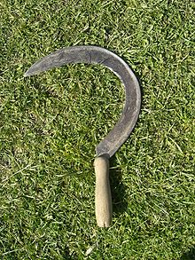 词源说明(童理民)   1 - 来自古英语 sicol,来自通俗拉丁语*sicila,来自拉丁语 secula,镰刀，来自 secare,砍，切，来自PIE*sek,砍，切，词源同 segment,secateurs. |
| **hurl** 【hɜːrl】                                      | n. 用力的投掷 vt. 投掷;猛投;猛扔;猛摔;大声说出(辱骂或斥责等);呕吐, 愤慨地说出, 丢下 vi. 猛投, 猛掷 推荐：词源不确定，可能来自拟声词，快速掷物体的声音。 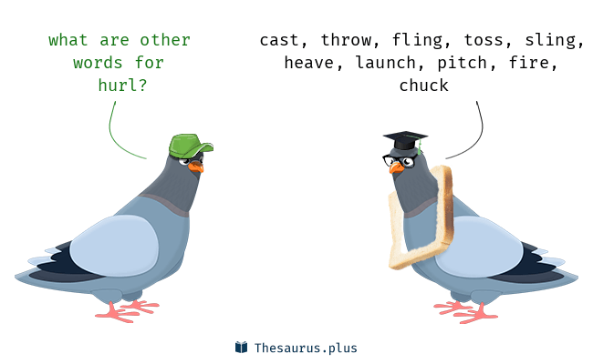 词源说明(童理民)   1 - 词源不确定，可能来自拟声词，快速掷物体的声音。 |
| **can-n-y** 【ˈkæni】                                   | a. 精明的;(尤指在商业或政治方面)精明谨慎的，老谋深算的 推荐：can【能】 + -n- + -y, 表形容词。 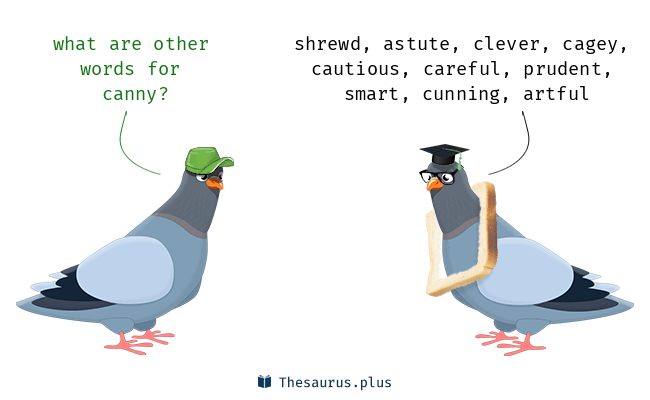 can vt. 装罐 n. 罐头, 容器 aux. 能, 可以 词源说明(童理民)   1 - 来自 can,知道，词源同 cunning,uncanny. |
| **prowess** 【ˈpraʊəs】                                 | n. 英勇, 勇敢; 超凡技术 推荐：prow【勇敢的】 + -ess。引申词义非凡的技能，造诣。 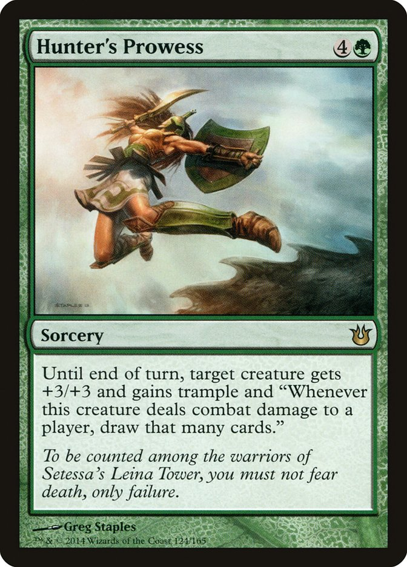 prow n. 船首, 船首状物 a. 勇敢的 词源说明(童理民)   1 - 来自 prow,勇敢的，-ess,名词后缀。引申词义非凡的技能，造诣。 |
| **hip** 【hɪp】                                         | n. 臀部, 蔷薇果, 忧郁 a. 熟悉内情的 vt. 使忧郁, 给(屋顶)造屋脊 interj. 喝彩声 词源说明(童理民)   1 - 来自古英语 hype,臀部，来自 PIE*keub,弯，转，词源同 cubit,cubicle,incubus.引申词义身体的弯转部位，特别用于指臀部，髋骨。 2 - 词源不详，通常认为来自非洲土著语言，义为眼睛睁开的，后通过美国黑人爵士乐广泛流行。 |
| **hedge** 【hedʒ】                                      | n. 树篱, 障碍, 套头交易 vt. 用树篱围, 套期保值, 妨碍, 两面下注以防...的损失 vi. 筑树篱, 躲闪, 两面下注以防损失 a. 树篱的, 偷偷摸摸的  词源说明(童理民)   1 - 来自古英语 hecg,篱笆，篱笆墙，来自 PIE*kagh,编织，抓住，围住，词源同 hag,haw.后用于指树篱，引申词义缓冲，防备，拐弯抹角等。 |
| **rug** 【rʌɡ】                                         | n. 小块地毯, 揭露某人 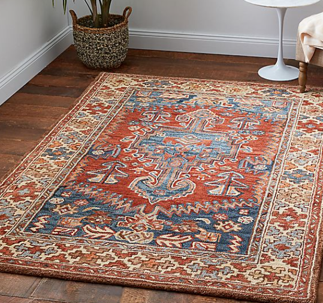 词源说明(童理民)   1 - 来自古诺斯语 rogg,粗毛，粗布，来自 Proto-Germanic*rawwa,粗糙的，皱的，来自 PIE*reue,击，打，撕开，词源同 rag,rough.  摩西英语(摩西) sweep something under the rug粗浅地掩藏某物。扫地呢，看到了不少的灰尘，但是自己又懒的去拿簸箕，怎么办？掀开地毯一角，把脏东西扫到地毯下，眼不见心不烦了。这样自欺欺人的处理，叫sweep something under the carpet.When you know there’s something wrong, don’t sweep it under the rug. |
| **rug-g-ed** 【ˈrʌɡɪd】                                 | a. 高低不平的, 崎岖的, 粗糙的, 坚固的 推荐：来自古诺斯语rogg , 粗毛，粗布，词源同rug . 引申词义粗糙的，粗犷的，崎岖的，不平的等。  -ed  形容词后缀，加在名词后表示“如...的”；加在动词后表示“被...的”。 词源说明(童理民)   1 - 来自古诺斯语 rogg,粗毛，粗布，词源同 rug.引申词义粗糙的，粗犷的，崎岖的，不平的等。 |
| **frivol** 【frɪvəl】                                   | frivol vt. 糟蹋, 浪费 vi. 虚度日子, 做无聊事             |
| **gloom** 【ɡluːm】                                     | n. 忧郁, 暗处, 幽暗 vi. 变忧沉, 变黑暗 vt. 使忧郁, 使黑暗 推荐：词源同gleam, glimmer, 微光，朦胧。引申义忧郁。  词源说明(童理民)   1 - 词源同 gleam,glimmer,微光，朦胧。引申词义忧郁。 |
| roast                                                        | n. 烤肉, 烘烤, 嘲笑 a. 烘烤的, 烤过的 vt. 烤, 炙, 烘焙, 嘲笑 vi. 烤, 炙, 烘焙 词源说明(童理民)   1 - 来自古法语 rostir,烤，来自 Proto-Germanic*raustijana,烤，来自 PIE*reus,烤，词源同 rotisserie.  摩西英语(摩西) 1.rule the roast称雄；当家；作主。你没看错，这是习语rule the roost的另一个版本。roast这里是名词含义，烤肉。中世纪领主家里，谁来分配好吃的烤肉呢？领主。好玩的是，roast烤肉或与roost鸡窝有关呢！烤肉在铁架子上，铁架子什么样子的？格栅状。鸡窝什么搭建的？木板。木板搭建成什么样？格栅状。  2.roster ['rɒstə] n. 花名册；执勤人员表；逐项登记表。这个单词与roast烧烤是有关的，本意是烤架，后来词义扩展为表格和目录。想想表格的样子，再想想烧烤时候用的铁架子是不是有格栅就明白了。而单词girdiron ['grɪdaɪən] n.烤架；格状物；橄榄球场的意思中，橄榄球场也是有各种象表格的横竖线。 |
| roster                                                       | n. 花名册 推荐：这个单词与roast烧烤是有关的，本意是烤架，后来词义扩展为表格和目录。想想表格的样子，再想想烧烤时候用的铁架子是不是有格栅就明白了。  词源说明(童理民)   1 - 来自荷兰语 rooster,表格，清单，来自中古荷兰语 roosten,烤，烧烤，词源同 roast.比喻用法，因表格如同烧烤架而得名。  摩西英语(摩西) roster ['rɒstə] n. 花名册；执勤人员表；逐项登记表。这个单词与roast烧烤是有关的，本意是烤架，后来词义扩展为表格和目录。想想表格的样子，再想想烧烤时候用的铁架子是不是有格栅就明白了。而单词girdiron ['grɪdaɪən] n.烤架；格状物；橄榄球场的意思中，橄榄球场也是有各种象表格的横竖线。 |
| **blob** 【blɑːb】                                      | n. 一滴, 小斑点 vt. 溅污 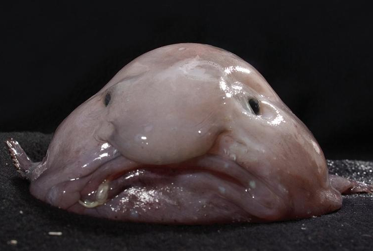 词源说明(童理民)   1 - 词源同 ball,球。 |
| **groan** 【ɡroʊn】                                     | n. 呻吟, 叹息 vi. 呻吟, 抱怨, 受压迫 vt. 呻吟地说 推荐： 拟声词，呻吟的声音。  词源说明(童理民)   1 - 拟声词，呻吟的声音。 |
| **roe** 【roʊ】                                         | n. 狍, 鱼子, 鱼卵  词源说明(童理民)   1 - 来自中古英语 rowe,卵，鱼子，来自 Proto-Germanic*hrogn,产卵，鱼子，来自 PIE*krek,青蛙卵。 2 - 来自古英语 raha,狍，小鹿，来自 Proto-Germanic*raiha,条纹，来自 PIE*rei,有斑点的，有条纹的，可能来自该印欧词根另一词义 PIE*rei,抓，撕，扯，词源同 rift,river.因这种小鹿皮肤条纹状的花纹而得名。  摩西英语(摩西) Richard Roe某乙（对诉讼中不知名的当事人称呼)。法官发现比如原告和被告或证人不方便披露姓名时，就用John Doe和Richard Roe代替，前者多是原告，后者多是被告。因为doe [dəʊ] n.母鹿，性格多温顺，而选择roe [rəʊ] n.牝鹿，则是为了与doe押韵。至于John和Richard，那可真是英国的路人甲路人乙。 |
| **gut** 【ɡʌt】                                         | n. 剧情, 内容, 内脏, 肚子, 海峡, 勇气 vt. 取出内脏, 毁坏...的内部 词源说明(童理民)   1 - 来自 PIE*gheu,涌出，倾泻，词源同 foundry,gush,gust.用于解剖学术语。肠道在古代医字观念被认为是情感所在之地，引申词义勇气。 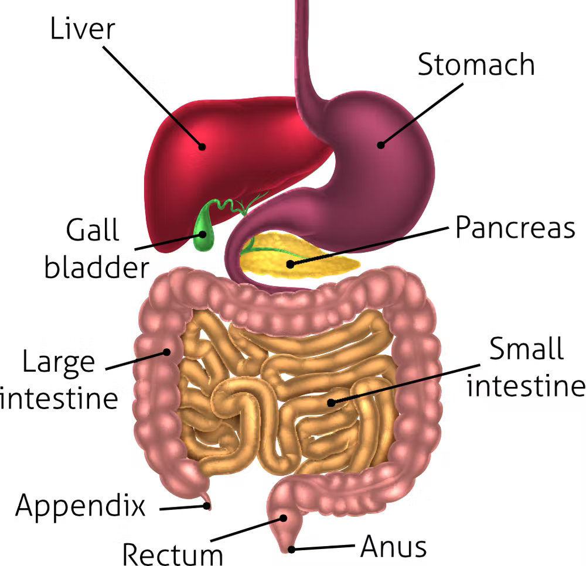 摩西英语(摩西) have your guts for garters要对你剥皮抽筋（喻严酷的报复)。gut是肠子，garter是吊袜带。虽然历史上并没有记载真有过这样残酷血腥的事情，但咬牙切齿感恨之入骨的感觉还是在guts和garters两个g-音的押韵中体现了出来。I'll have your guts for garters next time if you don't do it as I tell you. |
| **bog** 【bɑːɡ】                                        | n. 沼泽; <俚>厕所, 浴室 v. (使) 陷于泥沼; 妨碍; 走开 (~ off) 推荐：词源同bow, 弯。形容沼泽软泥般的容易陷进去。 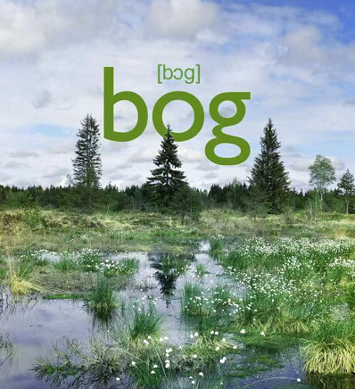 词源说明(童理民)   1 - 词源同 bow,弯。形容沼泽软泥般的容易陷进去。  摩西英语(摩西) bagel ['beɪg(ə)l] n.百吉饼（先蒸后烤的发面圈）；（体育比赛中）零蛋。印欧词根 *bheug- 表示to bend，并扩展为柔软的和弯曲形状的物体，因为面包圈边缘呈弯曲状。几个同源词比较有意思：bow n.弓；鞠躬，v.鞠躬、buxom adj. （妇女)丰满的；健美的、bight n. 海湾，绳圈；曲线和bog n.沼泽等。 |
| **entice** 【ɪnˈtaɪs】                                  | vt. 诱骗, 引诱, 怂恿  词源说明(童理民)   1 - 词源不详，可能来自拉丁语 titio,火把，即煽风点火，引诱。或来自 titillate,挠痒，挑逗。 |
| wage 【weɪdʒ】                                          | n.工资;工钱 vt.开始，发动，进行，继续(战争、战斗等)vi. 进行 1 - 来自 PIE*wadh,承诺，誓言，词源同 wed,engage.原指承诺对别人的服务的报酬，引申词义工资，原仅限于手工和机械劳动所得，后词义通用化。同时，引申词义承诺参战，发动战争，后词义通用化指开展或发动某运动。 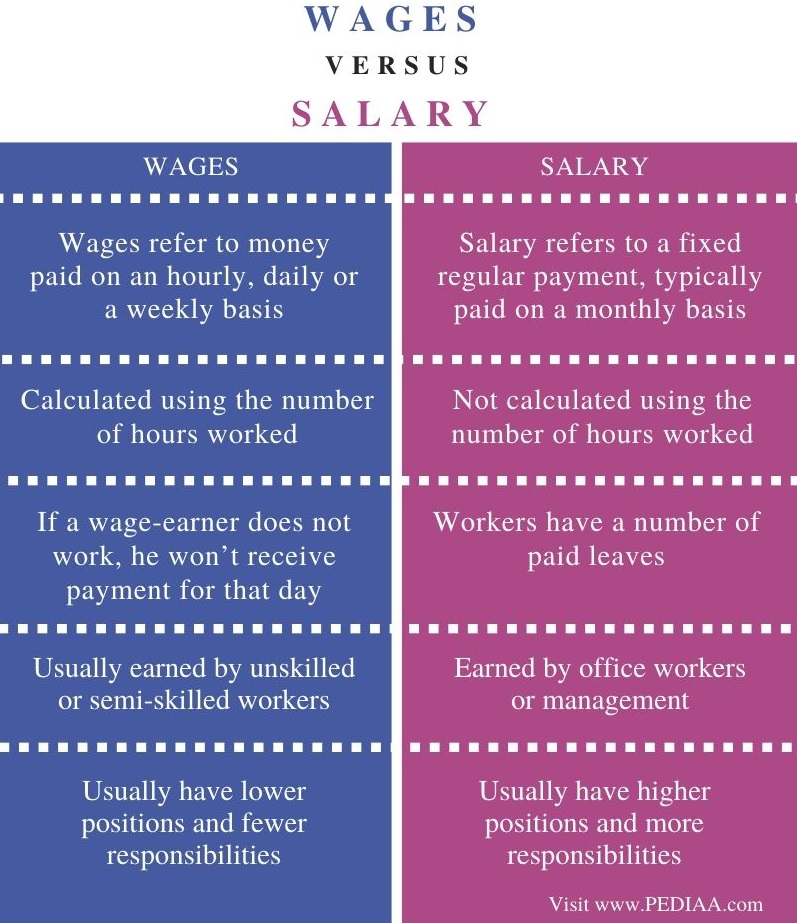 英英   v.1 . to engage in war or in a serious fight to achieve an end  2 . to start and to continue a war or a fight  n.1 . a sum of money paid to a worker in exchange for services , especially for work performed on an hourly , daily , or weekly basis , or by the piece  2 . an amount of money that you earn for working , usually according to how many hours or days you work each week or month   简明例句 ●He earns a good wage .他工资挺高。 ●The police are waging war on drug pushers in the city.警方正在市内开展一场打击毒贩的战争。 ●He alleged that a press campaign was being waged against him.他声称有人正在对他发起新闻攻势。 |

## 2022-4

| 单词                        | 解释                                                         |
| --------------------------- | ------------------------------------------------------------ |
| **shave** 【ʃeɪv】     | n. 修面, 刮胡子, 幸免, 剃刀 vt. 修面, 剃, 修剪, 掠过 vi. 刮脸, 勉强通过  词源说明(童理民)   1 - 来自古英语 sceafan,刮，剃，来自 Proto-Germanic*skaban,刮，剃，来自 PIE*skep,切，削，剪，词源同 ship,shape.引申词义刮脸，剃须等。 |
| **enigma** 【ɪˈnɪɡmə】 | n. 谜, 费解的事物 推荐：来自希腊语 ainos,说故事，讲谜语。  词源说明(童理民)   1 - 来自希腊语 ainos,说故事，讲谜语。 |
| **dangle** 【ˈdæŋɡl】  | v. 悬挂; 悬摆; 炫示    推荐： 可能来自拟声词，摇摇晃晃的声音。 |
|                             |                                                              |

