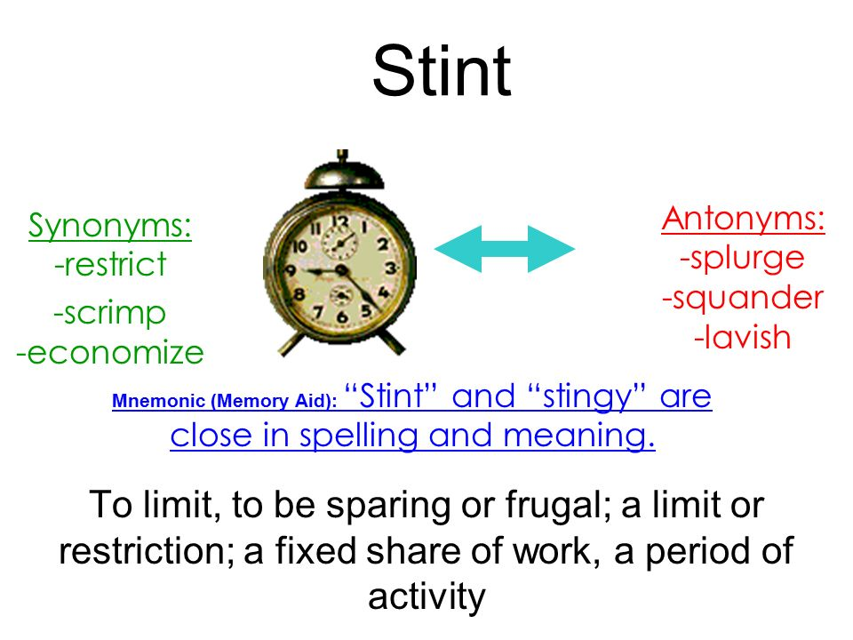
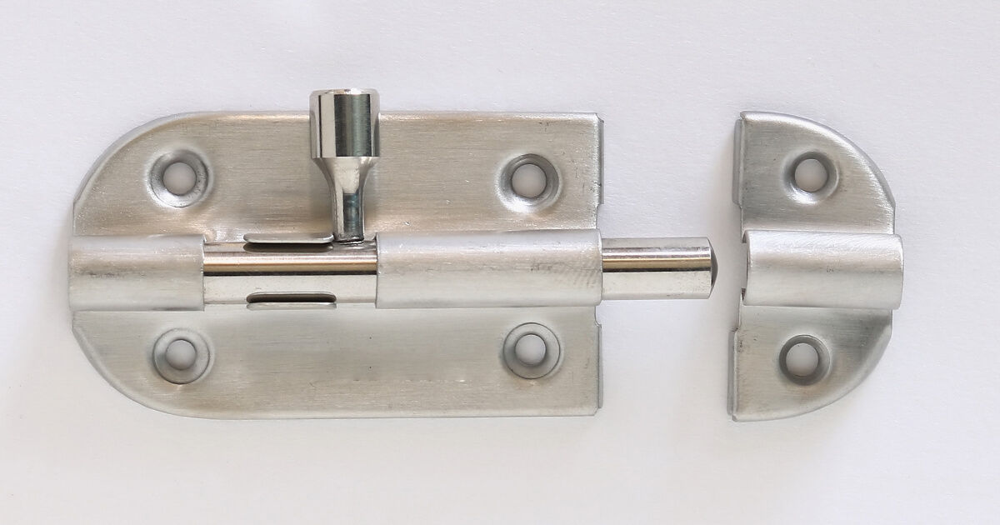
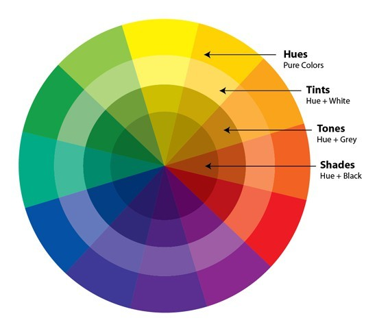
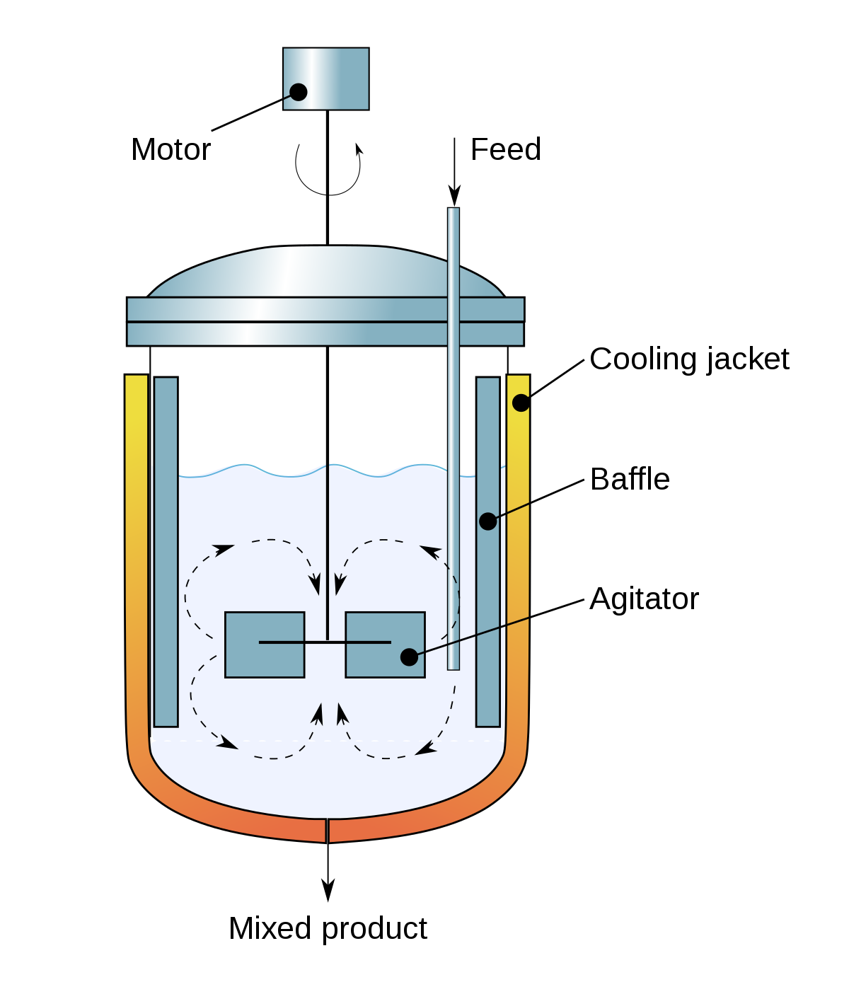
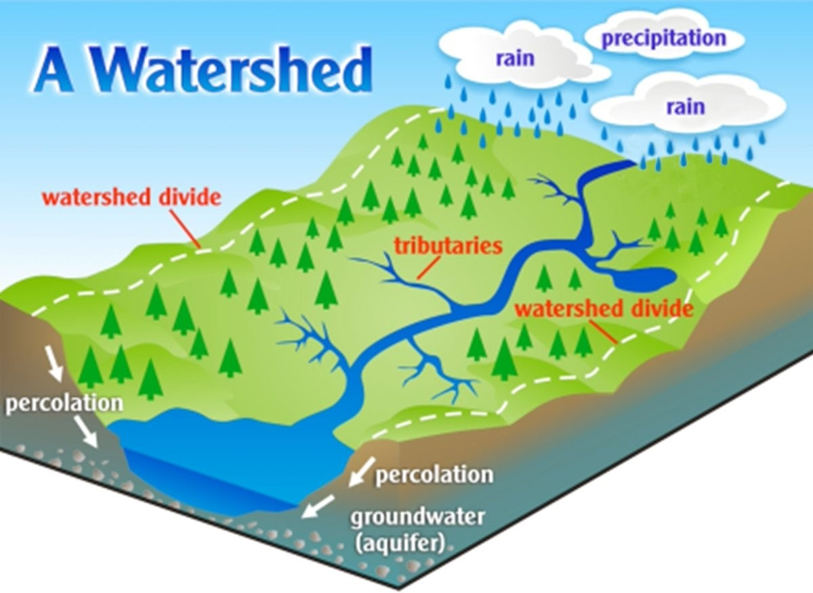

# 需要强化记忆的单词

大部分都是日耳曼本地语，少部分是古希腊、古罗马词根。

日耳曼本语的最大的一个特征就是和现实生活中的物品可以一一对应，一旦掌握就好理解，比如舔狗就是舔狗：

 

很少会有引申出比如校长之意，因此一旦和现实本体一一对应，就很好记。

[toc]

## 2022-5

| 单词                                | 解释                                                         |
| ----------------------------------- | ------------------------------------------------------------ |
| **stint** 【stɪnt】            | vt. 节省, 限制, 停止 vi. 节约 n. 吝惜, 节约, 限额; 固定〔进行某项工作或活动的〕时期  词源说明(童理民)   1 - 来自古英语 styntan,使钝化，使缩短，来自 Proto-Germanic*stuntijanan,砍短，变钝，来自Proto-Germanic*stuntaz,短的，钝的，笨的，来自 PIE*steu,推，击，打，词源同 steep,stunt.引申词义节省，限制，定额，定量等，后也用于指在某地的一定的工作时间。  My background is in Applied mathematics, but in my second year I have discovered that I really like writing code. This started my [stint](https://ludoro.github.io/blog/career/2022/02/14/newgrad.html) of different internship experiences: the most valuable thing you can do while at university. |
| **latch** 【lætʃ】             | n. 门闩;插销;碰锁;弹簧锁 vi. 上闩, 抓住, 占有 vt. 用插销插上;用碰锁锁上 词源说明(童理民)   1 - 可能来自 PIE*slagw,抓住，词源同 lemma,syllable,epilepsy.用于指门闩，插销。  摩西英语(摩西) latch [lætʃ] vi.占有；闭锁，vt.闩上；纠缠住某人，n.门闩。日耳曼词源，或与希腊词根lem-和lab-同源，本意是to hold，因为门闩能把门板和门框holding together。不过有些轿车后座头枕部位的LATCH就不是latch了，而是Lower Anchors and Tethers for CHildren的简称，是一种儿童安全座椅的固定方式。 |
| **listless** 【ˈlɪstləs】      | a. 倦怠的, 无精打采的  推荐：list , 愉悦，欲望，精神，词源同lust + -less 没有。即没精神的，无精打采的。 |
| **shabby** 【ˈʃæbi】           | a. 衣衫褴褛的, 低劣的, 破旧的, 吝啬的, 卑鄙的 推荐：shab=scab【疥癣，疮疤】 + -b- + -y形容词后缀。引申词义脏的，破败的，破旧的。  词源说明(童理民)   1 - 等同于 scab,疥癣，疮疤，-y,形容词后缀。引申词义脏的，破败的，破旧的。 |
| **hue** 【hjuː】               | n. 颜色, 色度, 色调; 信仰, 观点 词源说明(童理民)   1 - 来自古英语 hyd,来自 Proto-Germanic*hudiz,来自 PIE*skeu,遮蔽，隐藏，词源同 hide,hut.引申词义颜色，色彩，外表。词义演变比较 color,来自 PIE*kel,隐藏，词源同 hole,cell. 2 - 拟声词，常见于短语 hue and cry,喊叫，大声抗议。  摩西英语(摩西) **hue and cry**追捕犯人时的叫喊。英国的很多森林在1066年后被指定为皇家专用，私自猎捕甚至修池塘或砍树烧柴等行为被视作犯法，有专门的法律规定老百姓发现了这样的行为需大声通知森林看管人和民众围捕犯人。This caused a hue and cry from conservatives, and a thundering reproof from the leader. |
| **baffle** 【ˈbæfl】           | vt. 困惑, 为难, 使挫折 vi. 徒作挣扎 n. 迷惑, (控制声、光、液体等流动的)隔板，挡板，反射板  推荐：谐音"拜佛" . &nbsp;助记法:(受挫)和(困惑)的时候就去拜佛 , 让佛来开导你、启导你、帮助你。  词源说明(童理民)   1 - 拟声词。 |
| **water-shed**  【ˈwɔːtərʃed】 | n. 流域, 分水岭 推荐：water【水】 + shed , 分开。  water n. 水, 雨水, 海水, 水位, 水面, 流水 vt. 给...浇水, 供以水, 注入水, 使湿 vi. 流泪, 流口水, 加水 a. 水的, 水上的, 水生的, 含水的 shed n. 棚, 车棚, 挤奶棚, 厂房, 库房 v. 流泪, 流血; 去除, 摆脱; 蜕皮; 落下, 掉下; 散发出光 切换词根显示方式 词源说明(童理民)   1 - water,水，shed,分开。 |
| **totem** 【ˈtoʊtəm】          | n. (尤指美洲土著的)图腾, 标志物, 崇拜物 推荐：音译。  词源说明(童理民)   1 - 来自北美印第安土著语-doodem,图腾，家族符号。 |
| **totem-ism** 【təʊ'təmɪzəm】  | n. 图腾崇拜, 图腾制度 推荐：totem【n. 图腾】 + -ism  totem n. 图腾, 标志物, 崇拜物 **`-ism`** 抽象名词后缀，表示“…主义”；“宗教”；“制度、行为”；“…学”、“…术”、“…论”、“…法”；“疾病名称”；“情况、状态”等。 |
|                                     |                                                              |

## 2022-6

## 2022-7

