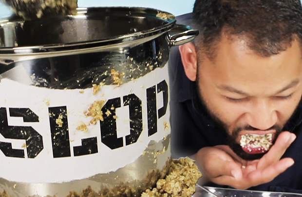

# 需要强化记忆的单词

大部分都是日耳曼本地语，少部分是古希腊、古罗马词根。

日耳曼本语的最大的一个特征就是和现实生活中的物品可以一一对应，一旦掌握就好理解，比如舔狗就是舔狗：

很少会有引申出比如校长之意，因此一旦和现实本体一一对应，就很好记。

[toc]

## 2021-10

| 单词                                                         | 解释                                                         |
| ------------------------------------------------------------ | ------------------------------------------------------------ |
| rive  riven  river                                 | rive 【raɪv】裂开;裂罅;碎片； riven【ˈrɪvn】裂开;分裂;撕开;拧去 (from; away; off);使烦恼rive的过去分词和过去式 river【ˈrɪvər】河;江;(液体)涌流 |
| **oar** 【ɔːr】                                         | a long pole with a flat blade at one end that is used for rowing a boat 船桨;铝合金桨;划桨。   oarfish:桨鱼;勒氏皇带鱼 **put/stick your oar in**: 多管闲事；横插一杠子 The trustworthiness is like the barge-pole oar of life ship, controlling the direction of life. |
| **orc** 【ɔrk】                                         | an imaginary creature like a very ugly, violent human, that is described in books by J.R.R. Tolkien  半兽人（源自英国小说家托尔金的作品，也译作兽人，奥克，欧克) |
| **OCR**                    【ˌoʊ siː ˈɑːr】             | OCR：***optical character recognition*** Very natural, we introduce the artificial neural networks into OCR algorithm design.(很自然地，我们在光学字符识别算法设计中引入了人工神经网络。) |
| **galley** 【ˈɡæli】                                    | **galley**  n.单层甲板的桨帆船。  地中海风向多变，船如果光有帆，逆风或无风怎么办？用桨。但是用桨吧，水手得24小时划船，因为不划桨船就不动。另外，划桨前进的速度无论如何如何是太快不了的。怎么办？桨帆并用的galley船应运而生，但词源unknown，这也说明古代地中海地区确实有很多古代文明。 |
| **corridor** 【ˈkɔːrɪdɔːr】                             | 走廊(一国领土通过他国境内的狭长地带);(建筑物内的)过道;通道;(火车上的)走道;空中走廊(一国领空中允许他国飞机经过的区域)：a long narrow passage in a building, with doors that open into rooms on either side。  the corridors of power：(sometimes humorous) 权力走廊（高层政治决策机构) the higher levels of government, where important decisions are made. You'll find his office just along the corridor. |
| **secular** 【ˈsekjələr】                               | 现世的；世俗的；非宗教的：not connected with spiritual or religious matters (of priests 司祭) 教区的；在俗的：living among ordinary people rather than in a religious community  He spoke about preserving the country as a secular state.(他谈及了保持该国世俗化的问题。) Mexico is a secular state and does not have diplomatic relations with the Vatican(墨西哥是个世俗国家，和梵蒂冈没有外交关系。) |
| **reef** 【riːf】                                       | 礁；礁脉 a long line of rocks or sand near the surface of the sea： a coral reef （珊瑚礁） 缩帆部；帆的可收缩部：a part of a sail that can be tied or rolled up to make the sail smaller in a strong wind  ***coal*** 【koʊl】:煤炭 \|  ***carol*** 【ˈkærəl】颂歌;圣诞颂歌 \| ***coral***【ˈkɔːrəl】n.珊瑚;珊瑚虫  adj.  珊瑚色的;红色的;粉红的 ***Coral*** 源自希腊语 korallion, 后借道法语进入英语。取这个名字的人（卡洛尔），寓意有着如宝石一般高贵夺目的气质。 |
| **balsa** 【ˈbɔːlsə】                                   | 热带美洲轻木(尤用于制作模型)the light wood of the tropical American balsa tree , used especially for making models.  Strong lightweight wood of the balsa tree used especially for floats(轻而坚韧的轻木木料，用于制筏。) |
| **hump** 【hʌmp】                                       | （平面上的）大隆起物；（尤指）土墩，丘，冈 a large lump that sticks out above the surface of sth, especially the ground； （某些动物的）峰；（尤指）驼峰 a large lump on the back of some animals, especially camels  |
| **lime** 【laɪm】                                       | 石灰;酸橙;酸橙汁;酸橙树 |
| **limestone** 【ˈlaɪmstoʊn】                            | lime【石灰】 + stone【石头】。  石灰岩是以方解石为主要成分的碳酸盐岩，是烧制石灰和水泥的主要原料，是炼铁和炼钢的熔剂。美式英语中多用limerock。 |
| **karst** 【kɑrst】                                     | 喀斯特；岩溶:an area of land formed of rock such as limestone that is worn away by water to make caves and other formations |
| **vicinity** 【vəˈsɪnəti】                              | **vill-** 表示“村庄、农场”，常引申为“邻居、附近”。源自拉丁语 villa "country house, farm," vicus "quarter or district of a town, neighborhood." **-ity** 表名词，指具备某种性质。   周围地区;邻近地区;附近:the area around a particular place. There is no hospital in the immediate vicinity.附近没有医院。 Both of these grow in coastal waters, often in the vicinity of coral reefs.(这两个都在沿海水域生长，通常在珊瑚礁的附近) |
| **per-tin-ent** 【ˈpɜːrtnənt】 **Pertinence** **Pertinency** | appropriate to a particular situation：有关的;恰当的;相宜的  **`per-`**完全的 + **tin-**抓住，握住 + **`-ent`**形容词后缀。  **`per-`** 表示“完全，贯穿，自始至终，向前”。forth, ford 是其同源词。 **`tin-`** = hold, 表示“拿住”，来自拉丁语，原意表示“展开”。 **`-ent`** 表示形容词，“…的”。 |
| **pebble** 【ˈpebl】                                    | 鹅卵石；砾石:a smooth, round stone that is found in or near water。 A tsunami is not like dropping a pebble into water and seeing the ripples go out equally in all directions.  |
| cobble 【ˈkɑb(ə)l】                                     | **n.**鹅卵石；【地】中砾；卵石路；圆煤块 **v.**制（鞋）；修补（鞋）  |
| **spinach** 【ˈspɪnɪtʃ】                                | 菠菜：a vegetable with large dark green leaves that are cooked or eaten in salads   来自盎格鲁法语 spinache,来自古法语 espinoche,来自阿拉伯语 isfanak,来自波斯语 ispanakh,一种绿色蔬菜。比较汉语菠菜，原名波斯菜。 |
| **graze** 【ɡreɪz】                                     | 吃草;(在草地上)吃青草;放牧;放牛;放羊;擦伤，擦破(皮肤)   There were cows grazing beside the river The land is used by local people to graze their animals I feel and grazed my knee. The bullet grazed his cheek. |
| **lemur** 【ˈliːmər】                                   | 狐猴(栖居于马达加斯加岛)an animal like a monkey , with thick fur and a long tail, that lives in trees in Madagascar  |
| **axi-om** 【ˈæksiəm】                                  | n. 自明之理, 公理, 原理, 格言 【复数：axioms】 **`axi-`**价值 + **`om`** → 有价值的理论 → 公理 ...the long-held axiom that education leads to higher income. |
| **pharaoh** 【ˈferoʊ】                                  | - 来自希腊语 Pharao,来自希伯来语 Par'oh,来自埃及语 Pero',埃及国王尊称，字面意思即大屋。 a ruler of ancient Egypt |
| **Harp**                                                     | a triangular - shaped instrument that has a curved neck and strings stretched between the neck and the body , at an angle to the sound box .   学习竖琴（**Harp**）是很难的（**Hard**) Harp on about sth. 喋喋不休的说：My grandfather harps on about the war all the time. |
| **peat** 【piːt】                                       | 词源不详。可能来自凯尔特语*pett,小块，小量，词源同 piece,patch.后引申词义小块泥土，泥煤，泥炭等。 ** Peat** is decaying plant material which is found under the ground in some cool, wet regions. Peat can be added to soil to help plants grow, or can be burnt on fires instead of coal. |
| **picture-sque                     ** 【ˌpɪktʃəˈresk】  | - 来自 picture,图片，照片，-esque,形容词后缀，如…的。比喻用法。 古雅的;优美的;古色古香的;生动的;栩栩如生的 The inn is picturesquely situated on the banks of the river. |
| **rut**                                                      | n. 车辙; <比喻>刻板, 惯例; **发情期** v. 形成车辙; **发情**  【复数：ruts；过去分词：rutted；现在分词：rutting】 In the present, Michael finds himself in a similar creative runt. |
| **porcelain** 【ˈpɔːrsəlɪn】 破稀烂                | 1 - 来自中古法语 procelaine,来自意大利语 porcellana,贝壳，瓷器，因其相似的光泽而得名，来自拉丁语 porcellus,小猪，词源同 pork,-elle,小词后缀。据说是因为贝壳的孔隙有如母猪的外阴而得名。  英语单词porcelain（瓷器）来自意大利语porcellana，它是一种贝壳，外表有着瓷器一样明亮光泽。porcellana来自意大利语porcella（年轻的母猪），与英语中的pork（猪肉）同源。当意大利看到外表明亮的中国瓷器时，就用同样有着明亮光泽的贝壳porcellana来称呼它，经由法语进入英语后，拼写变成了porcelain。现在，谁还能想到，porcelain（瓷器）与pork（猪肉）还有这样的渊源呢？ n.瓷器;瓷 \|  adj.瓷(器)的;脆的;易碎的;精美的 |
| **bulwark** 【ˈbʊlwɜːrk】                               | 1. (formal) 保护者，防御者（指人或事物）a person or thing that protects or defends sth。eg: a bulwark against extremism(坚决反对极端主义者) 2. 堡垒；防御工事 a wall built as a defence 3. [usually pl.] （船的）舷墙: he part of a ship's side that is above the level of the deck  |
| **camouflage** 【ˈkæməflɑːʒ】                           | (军事上的)伪装，隐蔽;(动物的)保护色，保护形状;隐瞒。 Her angry words were camouflage for the way she felt.（她以气愤的言辞掩盖自己的真实感情。） The soldiers camouflaged themselves with leaves Her size was camouflaged by the long loose dress she wore.（她穿的那件宽松长裙掩饰了她的身材。）  |
| **dial** 【ˈdaɪəl】                                     | v.拨号;拨(电话号码) n.**表盘;刻度盘;标度盘;仪表盘;**(收音机、炉、灶等的)调节盘，控制盘;(旧式电话机的)拨号盘。  来自拉丁短语rotadialis , daily wheel "rotate diurnal"，一种古代测太阳运转的日晷，后用来指相关圆形物体。 |
| **peri-pher-al** 【pəˈrɪfərəl】                         | **`peri-`**四周 + **`pher-`**带来 + **`-al`**形容词后缀 → 周边带来的 → 不重要的 , 外围的。  周边的;外围的;次要的;附带的;与计算机相连的 |
| **dome** 【doʊm】                                       | **`dome-`** = house, 表示“屋，家”。来自拉丁语 domus "house" 及 dominus "master of a household, lord"  穹顶;圆屋顶;圆顶状物;穹状建筑物;圆顶体育场  /   加圆屋顶于…上成圆顶状 |
| **scrutin-y** 【ˈskruːtəni】                            | **`scrutin-`**  = search, 表示“检查”，原意表示“分别查看”。源自拉丁语 scrutari "to examine, investigate, search."更多同源词... **`-y`**  表名词，加在形容词或以r结尾的单词后。   来自拉丁语 scrutinium,检查，搜查，查问，来自 scrutari,检查，搜查，来自 scruta,碎片，垃圾，来自 PIE*skreu,扩大形式于 PIE*sker,砍，切，词源同 shear,shred,scrap.比喻用法，原义为从垃圾堆里搜寻有用之物，引申诸相关词义。 |
| **Slop** 【slɑːp】                                      | 晃荡;(常指)溢出，溅出;倒出;使泼出;使溅洒； 泔水;(倒掉的)剩饭菜;污水;脏水  |
| **Slope** 【sloʊp】                                     | n. 斜坡, 山坡; **斜率** v. 使倾斜; 悄悄地走, 溜  【ˈfoʊliər】                                | foli-叶子 + -ar： 叶的;叶状的  **`foli-`** = leaf, 表示“树叶”。源自拉丁语 folium "leaf." **`-ar`** 表形容词，“…的”。源自拉丁语 -alis, adjective suffix. |
| **cenote** 【sɪ'nəʊtɪ】                                 | 【地】(石灰岩溶蚀形成的)天然水井 。  [a natural well](https://www.journeymexico.com/blog/cenotes-in-mexico) formed by the collapse of an overlying limestone crust: often used as a sacrificial site by the Mayas (尤指墨西哥的)天然井  |
| **bov-ine** 【ˈboʊvaɪn】                                | a. (似)牛的, 迟钝的n. 牛科动物 ： bov-牛 + -ine **`bov-`** = ox, 表示“牛”。源自拉丁语 bos (词干 bov-) "ox, bull, cow." 更多同源词... **`-ine`** 表形容词，“…的”。  |
| **calve** 【kæv】                                       | v. 生小牛, 下仔, (使)崩解 1 . to give birth to a calf  2 . to release a mass of ice that breaks away |
| **reindeer** 【ˈreɪndɪr】                               | a large deer with long antlers (= horns shaped like branches), that lives in cold northern regions  |
| **smother** 【ˈsmʌðər】                                 | 缩写自中古英语 smorthre,浓烟，来自古英语 smorian,使窒息，闷死，-ian,表动词，词源可能同 smolder. -ther,工具格后缀，比较 tether,mother.引申比喻义抑制，扼杀。 a rich dessert smothered in cream（涂了厚厚一层奶油的多脂甜点） |
| **avalanche** 【ˈævəlæntʃ】                             | 雪崩;山崩。 俗词源解读为 avaler-,向下，词源同 valance,挂布。-anche,名词后缀，同-ance。 |
| **ramble** 【ˈræmbl】                                   | n. 漫步, 随笔 v. 漫步, 漫游, 闲逛; 漫谈; 蔓延 可能来自 roam,漫游，-le,表反复。插入字母 b,比较 number,numerate.引申诸相关词义。 |
| **[beckon](https://daily.wordreference.com/2016/03/04/word-of-the-day-beckon/)** 【ˈbekən】 | v.召唤；吸引；示意，n.表召唤的点头；手势。  这个单词不太好记，但招财猫the beckoning cat都见过吧？而且用食指或勾手召唤别人的姿势也做过好多次吧？实际上，明白beckon实际是beacon ['biːk(ə)n] n.灯塔这个单词的异体就明白了。这两个单词追溯到印欧根的意思是“to shine”。 推荐： beckon是由beacon变体而来。因此含义具有很强的关联性 |
| **[Legume](https://www.everydayhealth.com/diet-nutrition/legumes-types-health-benefits-nutrition-facts-cooking-methods-and-more/)** 【ˈleɡjuːm】 | 豆类;荚果;豆科植物;豆科;豆类植物。any plant that has seeds in long pods . Peas and beans are legumes  |
| **spurge** 【spɜːdʒ】                                   | 戟科;大戟;大戟属;大戟属植物;红乳草 any of numerous plants of the genus Euphorbia  |
| **mustard** 【ˈmʌstərd】                                | 末;芥菜;芥;芥末酱;芥末黄;褐黄色 a small plant with yellow flowers, grown for its seeds that are crushed to make mustard  |
| **oasis** 【oʊˈeɪsɪs】                                  | 来自希腊语oasis , 沙漠绿洲，最终来自埃及语。 (沙漠中的)绿洲;(困苦中)令人快慰的地方(或时刻);乐土;乐事。An **oasis** is a small area in a desert where water and plants are found.  |
| **thaw** 【θɔː】                                        | 解冻;(结冰后)融化，融解;天气暖和得使冰雪融化(或解冻);(使冷冻食品)化冻 n.解冻时期;融化季节;(敌对国家之间)关系缓和 It's starting to thaw  Leave the meat to thaw completely before cooking(让冻肉完全化冻后再烹煮。) Relations between the two countries thawed a little after the talks(谈判后两国关系缓和了些。)  |
| **guru** 【ˈɡʊruː】                                     | 古鲁(印度教或锡克教的宗教导师或领袖);专家;权威;大师 a Hindu or Sikh religious teacher or leader  a person who is an expert on a particular subject or who is very good at doing sth |
| **frame**                                                    | 有**陷害**的意思。  n. 框架, 构架, 骨架; 眼镜框; 体形; 体系, 体制; 帧, 画面 v. 给…做框; 诬陷; 表达; 环绕 |
| **timber** 【ˈtɪmbər】                                  | 1 - 来自**古英语** timber,房屋，建筑物，来自 Proto-Germanic*timran,建筑物，来自 PIE*deme,建造，修建，来自 PIE*dom,屋子，住所，词源同 dome,domicile.后引申词义建筑材料，树木，木材，木料等。  n.木材;用材林;(用于建筑或制作物品的)树木;林木;(建筑等用的)木料;(建造房屋用的)大木料;栋木;(造船用的)肋材 vt.用木料支撑;备以木材 roof timbers（房檩（**lǐn**）  |
| **lad** 【læd】                                         | n. 青年, 家伙, 少年, 情人  可能来自lead的过去分词，即被引导者，被带领的人，后用来指年轻的小伙。 |
| **lade** 【leɪd】                                       | vt. 装满, 装载 vi. 装货  1 - 来自 PIE*kla,展开，平铺，引申词义堆积，装载，用于装船，船载货物，但后来被 load 取代。 |
| **inter∙city** 【ˌɪntərˈsɪti】                          | 城市间的，城际的，市际的(通常中途停站不多)   intercity travel |
| **fiss-ion** 【ˈfɪʃn】                                  | **`fiss-`** = to split, 表示“分裂”。源自拉丁语 findere (过去分词 fissus) "to split." **`-ion`** 表名词，“行为、动作、状态、过程、结果；物品”等。 (核)裂变，分裂;细胞分裂;裂体生殖;(化学键)断裂;裂变  Nuclear fission releases tremendous amounts of energy. |
| **intrin∙sic** 【ɪnˈtrɪnzɪk】                           | intro- 表示“向内，入内”。 secut-,sequ-,su-  = follow, 表示“跟随”。源自 拉丁语 sequi "to follow," sequester "follower." intrin-内在的 + sic-=seq-跟随，沿着 → 固有的，内在的。 |
| **tapestry** 【ˈtæpəstri】                              | **tapestry** 【ˈtæpəstri】来自古法语 tapisserie,织锦，壁毯，挂毯，来自 tapiz,毯子，地毯，通过拉丁语借自希腊语 tapes,纺织品，布料，毯子，词源同 tape.  |
| **crook-ed** 【krʊkt , ˈkrʊkɪd】                        | crook n. 钩, 弯曲部分, 坏蛋 vt. 使弯曲, 诈骗 vi. 弯曲 -ed 形容词后缀，加在名词后表示“如...的”；加在动词后表示“被...的”。   The **Crooked Forest** ([Polish](https://en.wikipedia.org/wiki/Polish_language): *Krzywy Las*) is a [grove](https://en.wikipedia.org/wiki/Grove_(nature)) of oddly-shaped [pine](https://en.wikipedia.org/wiki/Pine) trees located near the town of [Gryfino](https://en.wikipedia.org/wiki/Gryfino), [West Pomerania](https://en.wikipedia.org/wiki/West_Pomeranian_Voivodeship), [Poland](https://en.wikipedia.org/wiki/Poland). It is generally believed that some form of human tool or technique was used to make the trees grow or bend this way, but the method was never determined and remains a mystery to this day. |
| **riddle**                                                   | riddle既可用作名词，指“谜”或“谜语”，有时也作动词用，表示“猜谜”或“解谜” She asked me a riddle.  I know the answer to the riddle. 我知道谜底。 |
| **fung-us**                                                  | fung- 表示“真菌”，和表示海绵的单词 sponge 同源。  **fungi【ˈfʌndʒaɪ】** (pl). 真菌, 突然发生而迅速生长的东西 **fungus**的复数 |
| **stout**                                                    | n. 浓烈黑啤酒, 矮胖子 a. 强壮的, 勇敢的, 坚定的, 结实的, 矮胖的  来自古法语 estout,勇敢的，狂暴的，骄傲的，来自 Proto-Germanic*stultaz,雄壮的，庄严的，沉稳的，来自 PIE*stel,放置，站立，词源同 stall,still.字母 l 软化为 u.词义贬义化为粗壮的，肥壮的。 |
| **sap**                                                      | n. 汁液; <喻>元气; 棍棒; <非正式>笨蛋; 地道 v. 使虚弱; <古>逐渐破坏 1 - 来自古英语 saepm,来自 Proto-Germanic*sapam,来自 PIE*sab,液体，汁液，来自 PIE*sap,品尝，品味，词源同 savor,insipid. 2 - 来自中古法语 saper,挖地道，来自拉丁语 sappa,铲子，词源可能同 spade,铲子。其比喻义削弱，破坏可能受上一词义影响。 |
| **rinse** 【rɪns】                                      | n. 清洗, 染发, 染发剂 vt. 以清水冲洗, 漱, 漂清 vi. 被漂净  1 - 来自中古英语 rinsen,冲洗，来自古法语 rinser,冲洗，来自 Proto-Germanic*hrainisona,清洁，净化，来自 PIE*krei,ker,分开，筛选，词源同 riddle,crisis. |
| **outlying**                                                 | outlying :a. 在外的, 边远的, 偏僻的, 题外的  |
| **defiance** def∙i∙ance                                 | defy  vt. 藐视, 挑衅, 使落空 n. 挑战 -ance  表名词，“性质，状况”，一般缀于动词后。 |
| **tread** 【tred】                                 | 踩;踏;践踏;走;踩碎 n.步法;步态;脚步声;(轮胎的)**胎面**;外胎花纹;(台阶或楼梯的)踏步板;梯面;踏面 过去式： **trod**过去分词： **trodden**  古英语 tredan "to tread, step on, trample; traverse, pass over." |
| **aerosol** 【ˈerəsɑːl】                                | **`solv-,solu-,solut-`** = loosen, 表示“松开”。源自拉丁语 solvere "to loose, untie." **`aero-`** = air, 表示“空气，充气”等。源自希腊语 aer "air."   气溶胶;气雾剂;(喷油漆、头发定型剂等的)喷雾器，雾化器  |
| **tusk** 【tʌsk】                                       | n. 长牙, 獠牙, 尖物 vt. 以长牙刺戳, 以长牙掘  1 - 来自古英语 tusc,犬牙，磨牙，来自 Proto-Germanic*tunthskaz,牙齿，来自 PIE*dent,牙齿，词源同 tooth,dentist.拼写去鼻音化。 |
| **tuck** 【tʌk】                                        | n. 褶; 去赘皮手术; 食品, 零食 v. 塞进, 折叠, 卷起; 把…藏入, 收藏; 用…盖住  来自中古荷兰语 tucken,卷起，折起，来自 Proto-Germanic*teug,拉，推，PIE*deuk,拉，推，词源同 duct,tug.后用于指把裤脚折边，塞进。 She tucked an unruly lock of hair behind her ear.她把一缕不听话的头发撩到耳后。 Jack tucked his shirt in. |
| **blouse** 【blaʊs】                                    | 衬衫;(女式)短上衣 A piece of clothing like a shirt, worn by women   **a big girl's blouse** 懦弱的男人；胆小不自信的男人 |
| **haul** 【hɔːl】                                       | vt. 拖;(用力)拽;用力缓慢挪动到(某处);强迫(某人)去某处； n. 大量非法物品;很高的得分;旅行的距离;旅程   来自中古英语halen,拉升，抬高，原指航海时升帆，拉索，可能来自PIE*kel,叫，呼喊，词源同call,claim.引申词义水手升帆时喊的号子。或来自PIE*kel,升起，举起，词源同hill,excel.后词义由向上拉扩展为向前拉，运输，搬运等 |
| **mesh** 【meʃ】                                        | n. 网孔, 网丝, 网眼, 网状物, **圈套**, **困境**，陷阱, 啮合 vt. 以网捕捉, 啮合, 使缠住 vi. 落网, 相啮合   来自古英语 max,网，来自 PIE*mezg,纺织，编织，可能来自 PIE*meik,混合，词源同mix,miscellany. |
| **fringe** 【frɪndʒ】                                   | n. 边缘, 端, 流苏, 穗, **刘海儿**，(沿…边缘的)一排(树木、房屋等) vt. 加穗于, 加饰边于 a. 边缘的, 附加的  |
| **drape** 【dreɪp】                                     | vt.将(衣服、织物等)悬挂，披;遮盖;盖住;装饰;使(身体部位)放松地搭在…上 n.(厚长的)**帘子，帷帘，帷幕**  In US English, *[drapes](https://daily.wordreference.com/2020/09/17/intermediate-word-of-the-day-drape/)*, most commonly in the plural form, are a type of curtain (in the UK, we only use “curtains” for this). It is also the way in which a piece of fabric or clothing [hangs](https://daily.wordreference.com/2019/09/19/intermediate-word-of-the-day-hang/). As a verb, to *drape* means ‘to cover or adorn with cloth,’ ‘to adjust a piece of fabric into graceful folds,’ or ‘to let something hang or fall carelessly.’ In medicine, to *drape* means ‘to surround a part of the body that’s being examined or operated on with cloth.’ |
| **bid**                                                      | v. 投标;出(价);(尤指拍卖中)喊价;**努力争取**;企图获得 n.买方的出价;投标;努力争取 v.向(某人)问候、道别等;告诉(某人做某事);吩咐  (used especially in newspapers 尤用于报章) 努力争取；企图获得(to try to do, get or achieve sth) The team is bidding to retain its place in the league a bid for power  (权力之争) a desperate bid to escape from his attackers (拼命躲避攻击他的人) |
| **ceaseless**  【ˈsiːsləs】                             | not stopping; seeming to have no end  cease （使）停止，终止，结束 |
| **nonconformist** 【ˌnɑːnkənˈfɔːrmɪst】                 |   |
| **nonconformity** 【ˌnɑːnkənˈfɔːrməti】                 | 不遵从传统规范;不认同主流思想;非国教教义;不信奉英国国教  |
|                                                              |                                                              |

## 2021-11

| 单词                                                         | 解释                                                         |
| ------------------------------------------------------------ | ------------------------------------------------------------ |
| **heads**                                                    |  ADV （硬币的）有人头像的一面，正面 If you toss a coin and it comes down **heads**, you can see the side of the coin which has a picture of a head on it. We might toss up for it,' suggested Ted. 'If it's heads, then we'll talk.'(“我们可以掷硬币来决定。”特德建议道，“如果是正面，我们就谈谈。”) |
| **tails**                                                    |  ADV (硬币的)反面 If you toss a coin and it comes down **tails**, you can see the side of it that does not have a picture of a head on it.  **get head**: To [receive](https://www.urbandictionary.com/define.php?term=receive) oral sex, ie. [cunnilingus](https://www.urbandictionary.com/define.php?term=cunnilingus) or a [fellatio](https://www.urbandictionary.com/define.php?term=fellatio).  **cunnilingus** 【ˌkʌnɪˈlɪŋɡəs】 the act of touching a woman's sex organs with the mouth and tongue in order to give sexual pleasure （**Cunnilingus** is oral sex which involves someone using their mouth to stimulate a woman's genitals.） **fellatio**【fəˈleɪʃioʊ】：**Fellatio** is oral sex which involves someone using their mouth to stimulate their partner's penis.（the practice of touching a man's penis with the tongue and lips to give sexual pleasure）  **[get some tail](https://idioms.thefreedictionary.com/get+some+tail)**：*slang* Typically of a man, to have sex or engage in sexual activity with (usually) a woman.* I'm a little bit tired of going to parties with Steve—he just spends the entire night trying to get some tail.* *How'd the date go last night? Did you get some tail?*  **anilingus**【ænɪ'lɪŋɡʌs】：Anilingus is the "scientific" term for [applying](https://www.urbandictionary.com/define.php?term=applying) ones mouth to another ones asshole. Then [plunging](https://www.urbandictionary.com/define.php?term=plunging) ones tongue deep within the anal cavity, and [swirling](https://www.urbandictionary.com/define.php?term=swirling) it 'round; giving one's partner sexual pleasure.  This is different than a [rimjob](https://www.urbandictionary.com/define.php?term=rimjob). A rimjob would, however, be a precursor to anilingus. It is the act of [plunging](https://www.urbandictionary.com/define.php?term=plunging) one's tongue into the anal cavity of your sexual partner and then [swirling](https://www.urbandictionary.com/define.php?term=swirling) and thrusting aforementioned tongue in an effort to make said partner happy. |
| **lingua** 【ˈlɪŋgwə】 **linguae** 【ˈlɪŋɡjʊə】 | It is well advised to wash the anus that is to be pleasured thoroughly (and perhaps even douche) before attempting this.舌；语言。a mobile mass of muscular tissue covered with mucous membrane and located in the oral cavity  |
| **arson** [ˈɑːrsn]  **arsonist** 【ˈɑːrsənɪst】 | **arson**: 纵火(罪);放火(罪)  **arsonist**： 纵火犯;放火犯  |
| **eminent** 【ˈemɪnənt】                                |  (尤指在某专业中)卓越的，著名的，显赫的;非凡的;杰出的 |
| **imminent** 【ˈɪmɪnənt】                               |  迫在眉睫的;即将发生的;临近的 the imminent threat of invasion(迫在眉睫的入侵威胁)  the imminence of death(死亡的逼近) An announcement about his resignation is imminent.(马上就要宣布他的辞职。) |
| **bail** 【beɪl】                                       | n.保释金;保释;三柱门上的横木 v.允许保释(某人);(尤指迅速地)离开;与…搭讪(常指对方不愿意) 来自拉丁语 bajulus,持有者，责任者。来自旧时的一种法律规定，如须保释某人出去，须自己进监狱代替保释者，以作为承诺和责任。  bail hearing: 保释聆讯;保释听证;保释听证会  **bait**【beɪt】：鱼饵上钩了(t),想要放生就要缴保证金 |
| **javelin** 【ˈdʒævlɪn】                                | 标枪;投掷标枪项目(或运动)  |
| **ascription** 【ə'skrɪpʃ】                             | 归于；归（因，咎，功）于（of，to）  |
| **ascribe** 【əˈskraɪb】                                | vt. 归因于, 归咎于：**a- + scrib-写 + -e → 把…写上去 → 归因于。** ●I would not ascribe vice to him.（我不愿意把罪过归给他）. ●He ascribed his failure to bad luck.（他认为自己的失败是运气不好。） ●This play is usually ascribed to Shakespeare.（通常认为这部剧是莎士比亚所写） |
| **subservient** 【səbˈsɜːrviənt】                       | 顺从的;谄媚的;恭顺的;驯服的;卑躬屈膝的;次要;从属于； **subserve【对...有用, 对...有帮助】 + -i- + -ent形容词后缀。引申比喻义温驯的，谄媚的等**。  |
| **paunch** 【pɔːntʃ】                                   | n. 腹部, 瘤胃, 大肚子 vt. 剖腹, 取出内脏, 使...的肚子受伤  来自古法语 pance,来自拉丁语 pantex,肚子 |
| **paunchy** 【ˈpɔːntʃi】                                | a. 大肚子的, 大腹便便的 【比较级：paunchier；最高级：paunchiest】 |
| **punch** 【pʌntʃ】                                     | n. 打洞器, 钻孔机, 冲压机, 冲床, **潘趣酒** vt. 以拳重击, 开洞, 冲压 vi. 用拳猛击  1 - 来自**拉丁语** pungere,刺，击，来自 PIE*pung,刺，击，打，词源同 pungent,puncture,point.引申诸相关词义。 2 - 来自**印度语** panch,五，词源同 five,Pentecost.因这种酒需五种原料（酒，水，柠檬汁，糖，香料）调制而得名。 |
| **punchy** 【ˈpʌntʃi】                                  | 简洁有力的;言简意赅的;简练的 A good way to sound confident is to use short punchy sentences(想要听起来很自信，使用简短有力的句子不失为一个好方法。) |
| **plight** 【plaɪt】                                    | n. 困境; 誓约 vt. 宣誓; 保证  词源说明(童理民)   1 - 来自**古英语** pliht,有风险的承诺，危险，风险，来自 Proto-Germanic*pleg,承诺，责任，担保，来自 PIE*dlegh,忙于，从事于，责任，承诺，来自 PIE*del,长的，词源同 long,play,pledge.引申词义誓言，誓约，特别是郑重的誓言，如订婚。 2 - 来自**古法语** pleit,情况，来自拉丁语 plicare,卷入，卷进，词源同 ply,complex.后主要用于指坏的情况，引申词义苦难，困境。词义部分受到上一词义的影响。 |
| **yearn**【jɜːrn】 **yawn**【jɔːn】                     | yearn: vi. 渴望, 想念, 怀念, 同情 ywan:来自 PIE*ghai,张嘴，打呵欠，词源同 gas,chaos,gape. |
| **tar**【tɑːr】 / **tar pitch**                         | n. 焦油, 柏油, <旧，非正式>水手 vt. 涂以焦油  1 - 来自古英语 teru,树脂，树胶，沥青，来自 Proto-Germanic*terwo,橡树，树，来自 PIE*deru,橡树，树，词源同 tree,dentrology. |
| **bask** 【bæsk】                                       | vi. 晒太阳, 感到舒适 （We sat basking in the warm sunshine.）  词源同bath【沐浴】，字面含义”日光浴“。 |
|                                                              |                                                              |

## 2021-12

| 单词                                                         | 解释                                                         |
| ------------------------------------------------------------ | ------------------------------------------------------------ |
| **taro** 【ˈtɛroʊ】 **tarot** 【ˈtæroʊ】 **tarp**【tɑrp】 | **taro ： (野)芋;芋头**   **tarot： 塔罗纸牌(用于占卜)**    来自法语 tarot,塔罗牌，来自意大利语 tarocchi,可能来自阿拉伯语 taraha,扔，投掷，可能进一步来自 ta-,表名词，词源同 Talmud,Torah,-roha,扔，投掷。  **tarp**：防水帆布;油布（A **tarp** is a sheet of heavy waterproof material that is used as a protective cover.)  |
| **Ube** 【ˈuː.beɪ】                                     | **Ube**: a type of yam(山药【jæm】) (= a root vegetable) that is purple in colour  参薯，香芋 The Filipino word for purple yam. [Ube](https://www.urbandictionary.com/define.php?term=Ube) is used in a variety of desserts from ice cream to [pastries](https://www.urbandictionary.com/define.php?term=pastries).  **Uber**：【ˈuːbər】：**Uber** combines with nouns and adjectives to form nouns and adjectives that refer to a great or extreme example of something.COMB in N-COUNT, COMB in ADJ （与名词、形容词结合构成名词、形容词）表示“超级的”，“非常”，“极其” |
| **ransom** 【ˈrænsəm】 注意结尾没有**`e`**         | n. 赎金, 赎身, 赎回 vt. 赎, 赎身, 赎回, 勒索赎金  来自古法语 ranson,赎金，救赎，来自（缩写自）拉丁语 redemptionem,拯救，救赎，词源同redeem,redemption.拼写比较 custom,来自（缩写自）拉丁语 consuetudinem.  **king's ransom大量的金钱**。英王狮心王理查Richard the Lionheart在第三次十字军东征失败之后的返家途中被政治对手俘虏，在英国付出高达10万英镑的赎金（相当于当时英国数年的财政收入）后，理查才得以回国。所以，king's ransom国王的赎金喻很大一笔钱。They paid a king's ransom for the painting.   Ransomware infections can cause companies to lose access to their computer systems until they pay a ransom, and can be highly disruptive and expensive to remediate. |
| **telescope**                                                | n. 望远镜 vi. **叠缩, 嵌进, 缩短** vt. 使叠缩, 使缩短 tele-远、电 + -scope, 检查或观察用的镜、仪器 → 看远方 → 望远镜。 |
| **twig** 【twɪɡ】                                       | n. 小枝, 细枝 v. 懂得, 了解  来自古英语 twig,细枝，小枝，来自 Proto-Germanic*twigga,叉子，分叉，来自 PIE*dwo,二，词源同 two. |
| sign sight                                              | sign: n. 叹息   vi. 叹息, 渴望  vt. 叹息着说  sight : n. 景观, 视力, 眼界, 阅读, 见解, 意见 vt. 看见, 瞄准 vi. 瞄准, 观看 a. 即席的, 见票即付的  来自古英语 sihth,所见之物，视力，视野，来自 Proto-Germanic*sekh,看，来自 PIE*sekw,看，词源同 see.引申诸相关词义。 |
| **nuance** 【ˈnjuːɑːns】                                | 细微的差别;(意义、声音、颜色、感情等方面的)细微差别  来自法语 nuance,细微差别，云影，来自拉丁语 nubes,云朵，水气，词源同 nebula,nimbus.引申词义云彩的阴影，云影的细微差别。 |
| **flax** 【flæks】                                      | n. 亚麻, 麻布, 亚麻织品；  来自 PIE*plek,转，编织，词源同 ply,complicate.用来指纺织材料黄麻。或来自 PIE*pleik,撕，剥，词源同 flay.用来指剥下来的黄麻皮。 |
| **moraine** 【məˈreɪn】                                 | 冰碛；冰碛土 a mass of earth, stones, etc., carried along by a glacier and left when it melts  来自法国普罗旺斯方言 morre,鼻子，突起部分，词源可能同 muzzle.后用于指突起的土块，冰碛。  |
| **wr-**                                                      | waist [weɪst] n.腰部。日耳曼语词源，与wax v.月亮渐满；增大同源，更与词根aug-,auct-,aux-表to increase,to grow同源，可能腰部是where the body grows的那一部分吧。而wrist手腕，与wreckage残骸、wrestle摔跤、wrong错误的、wrench扳手、wreath花冠等众多wr-开头的单词有关，**核心含义是转动。** |
| **mildew** 【ˈmɪldjuː】                                 | 霉;霉菌 / 发霉;生霉病： a very small white fungus that grows on walls, plants, food, etc. in warm wet conditions  mil-,甜的，词源同 molasses,dew,露珠。该词原义为甘汁，蜜露。现词义可能是受 meal(粉)影响，即粉状露珠，用以形容发霉，霉菌。 1. [WHAT DIFFERENCES BETWEEN MOULD AND MILDEW?](https://www.daniela-perego.com/what-differences-between-mould-and-mildew/) |
| **mold** 【moʊld】                                      | Mildew and mould are both fungi, but mildew is not as invasive or troublesome. Mildew is a surface fungus that can be easily treated with a store-bought cleaner or bleach and a scrubbing brush. Mould is often a part of a larger infestation that may require professional treatment –[***Υδραυλικοί Αθήνας***](https://24gr.gr/ydraulikoi-ydraulikes-ergasies-athina/) . Rather than growing on the surface of its host, mould penetrates the object it lives on and eats away at its cellular integrity.  These fungi also differ in appearance, and potential health risks. Mildew is typically a grey, white, or light brown colour and rests on the surface of a moist area. It has a powdery appearance and may be accompanied by a foul odour. Mould is usually black or green and has a fuzzy appearance and a distinctly musty smell. |
| **ranch** 【ræntʃ】                                     | a large farm, especially in N America or Australia, where cows, horses, sheep, etc. are bred  Ranch 1 - 来自美式西班牙语 rancho,农场，农庄，来自西班牙语 rancho,一起吃饭的人，来自古法语 ranger,扎寨，安营，安置，来自 rang,排列，布置，词源同 range,rank. |
| neon                                                         | n. 氖 来自希腊语neos , 新的，因其在1898年被“新”发现而得名，词源同new。 |
| repeal                                                       | n. 废止, 撤消 vt. 废止, 撤消, 放弃  re-向后，往回 + peal-呼叫，引申词义废除，废止。 |
| **diabetes**                  【ˌdaɪəˈbiːtiːz】         | dia-穿过 + bet-走，在古希腊用来指尿液过多的疾病症状。        |
| **cuddle** 【ˈkʌdl】                                    | n. 搂抱, 拥抱 vt. 抚抱, 抱着睡, 拥抱 vi. 依偎, 依偎着躺在一起  |
| **saddle** 【ˈsædl】                                    | n. 鞍, 马鞍, 车座, 鞍状物; 脊肉 vt. 装以马鞍, 使负担 vi. 跨上马鞍  sad-=sit-做 + -d- + le。  saddle ['sæd(ə)l] n.鞍；车座，vt.承受；使负担；装以马鞍，vi.跨上马鞍。sad-部分同sit，而-dle部分实际表工具，因saddle是你能够坐到马背上的工具。类似，needle缝针是缝纫的工具，和net网（编织而成）相关，再如spindle ['spɪnd(ə)l] n.轴；纺锤；细长的人或物，adj.锭子的，是spin纺纱的工具。 |
| **huddle** 【ˈhʌdl】                                    | n. 杂乱一团, 混乱, 拥挤  **队员靠拢(磋商战术)** vt. 把...挤在一起, 乱堆, 草率了事, 蜷曲 vi. 挤作一团, 蜷缩  |
| flick                                                        | n. 快速的轻打, 轻打声, 弹开 v. 轻弹, 轻轻拂去, 忽然摇动; 浏览  来自辅音丛bl, fl, 折腾，拍打，拟声词，词源同flap, flip. -ck, 清脆音，比较click。 |
| flicker                                                      | n. 闪烁, 闪光, 颤动 vi. 闪动, 闪烁, 摇动, 扑动翅膀 vt. 使摇曳, 使闪烁  flick【轻弹】 + -er。 |
| war∙fare                                                     | 战争;战;作战;(群体、公司等之间的)斗争，竞争，冲突 war 战争的 fare- = to go, 表示“走”。源自古英语 faran "to go on a journey, get along." |
| **scarlet** 【ˈskɑːrlət】 / **Scarlett**【ˈskɑrlɪt】    | n. 猩红色, 绯红色, 红衣 a. 绯红色的, 鲜红色的 1 - 来自古法语 escarlate,红布，来自拉丁语 scarlatum,红布，来自波斯语 saqerlat,红布，特指颜色鲜红的布。并由该词衍生姓氏 Scarlett,染色工或布商，如好莱坞著名美女 Scarlett Johansson. |
| **plume** 【pluːm】                                     | n. 羽毛, 一缕（一道，一股等） vt. 用羽毛装饰, 整理羽毛, 使成羽毛状 plum-羽毛 + -e → 整理羽毛。 |
| **scruff** 【skrʌf】                                    | the back side of the neck  颈背, 后颈; 邋遢的人         |
| **scruffy** 【ˈskrʌfi】                                 | scruff【邋遢鬼】 + -y形容词后缀。  a. 不整齐的, 肮脏的, 破旧的, 褴褛的 【比较级：scruffier；最高级：scruffiest】 |
| **rod** 【rɑːd】                                        | 来自古英语rodd , 杆，竿，棒，词源不详，可能同rood。  **Spare the rod and spoil the child**.这句俗语的字面意思是“节省了棍子，惯坏了孩子”。spare在这里是节约和吝啬之意，rod是棍棒，spoil是溺爱宠爱。句子整体可以理解做不打不成器。Should parents spare the rod and spoil the child ? Opinions concerning strict parental discipline vary widely. |
| **mul-al** 【ˈmjʊrəl】                                  | **`mur-`** = wall, 表示“墙壁”。源自拉丁语 murus "wall." **`-al`** 表形容词，“…的”，一般缀于名词后。源自拉丁语 -alis, adjective suffix.  murus,墙，墙壁，来自 PIE*mei,修建，巩固，防御工事，可能来自 PIE*mo,辛劳，劳作，词源同 mole,防洪堤，城墙，大型工事。 |
| **wedge** 【wedʒ】                                      | n. 楔子, 楔形物, 起因, 导致分裂的东西 vt. 楔住, 挤进, 楔入 vi. 楔入, 挤进   1 - 来自 Proto-Germanic*wagjaz,楔子，来自 PIE*wegh,移动，运送，词源同 way,vehicle.用于指楔子，拼写受 dge 影响，比较 bridge,judge,knowledge. |
| **massif** 【mæˈsiːf】                                  | a group of mountains that form a large mass （n.山峦; 群山）    - 来自法语 massif,山峦，群山，词源同 mass,大块，大团。 |
| **peddler** 【ˈpedlər】 毒品贩子                   | **peddler** ['pedlə] n.小贩；传播者。词根ped-与foot同源，peddler就是我们汉语里的贩夫“走”卒，因为他要peddles（叫卖；兜售） on foot to sell his goods。    |
| **hawker** 【ˈhɔːkər】                                  | 那推着两轮车的小贩叫啥呢？叫**hawker** ['hɔːkə] n.叫卖小贩；饲鹰者，叫卖的含义与鹰无关，因为它hawk（叫卖) his goods in the street.  |
| **axis,ax,axe,axes**                                         | axis ['æksɪs] n. 轴；轴线；轴心国。ax [æks] vt. 削减；用斧修整；解雇，n. 斧头。axe [æks] n. 斧，vt. 削减；用斧砍。第二个单词ax实际来自第三个单词axe，但它很low的样子使得英国人现在很不喜欢实际使用。这三个单词有共同点吗？单词axes是这三个单词做名词讲是共同的复数形式，人生大赢家呀！ |
| **feat** 【fiːt】                                       | feat-=fact-做 → 做大事 → 功绩。 - 来自法语。来自 fac-,做，词源同 do,fact.即做出来的业绩，功绩。 |
| **pew** 【pjuː】                                        | n. 教堂长椅, 会众, 座位 vt. 为(教堂)安装座位, 把...围在一起  1 - 来自古法语 puie,阳台，讲台，来自拉丁语 podia,阳台，戏院楼厅，词源同 foot,podium.后用于指教堂祈祷台，祈祷者座处，即教堂长椅。 |
| **pewter** 【ˈpjuːtər】                                 | n.白镴; 锡镴; 青灰色  a. 白镴(制)的  1 - 来自古法语 peautre,来自拉丁语*peltrum,词源可能同 spelter,粗制锌，粗锌。 |
| **flint** 【flɪnt】                                     | n. 打火石, 燧石, 极硬的东西  1 - 来自 PIE*splei,撕开，分开，词源同 split,splinter.指古代用来打火用的两块硬石片。拼写演变比较 foam,spume. |
| **fling** 【flɪŋ】                                      | n. 投掷, 急冲, 嘲弄; 短暂的风流韵事 vt. 投, 丢下, 抛弃, 使陷入, 挥动, 嘲笑, 扫视 vi. 猛冲  |
| **naught** 【nɔːt】                                     | n. 没有, 零, 无 来自 naught 的拼写变体，后 naught 被赋予感情色情，调皮的，捣蛋的，nought 用于指数字零。  null- = none, 表示“没有”。源自拉丁语 nullus "none." 更多同源词... |
| **etho-logy** 【ɪˈθɑlədʒi】                             | etho- = nation, 表示“民族；性情（民族情感）”。源自希腊语 ethnos "band of people living together, nation;" ethos "custom, disposition, trait." -logy  = science, 表示“科学，学科”，由词根 log-, 说，引申而来 |
| **strait** 【streɪt】                                   | n. 海峡, 困境 a. 困难的, 窘迫的, 狭窄的   strain-,strict-,string-,stress-  = tighten, 表示“拉紧”。源自拉丁语 stringere (过去分词 strictus) "to draw tight, press together."  1 - 来自古法语 estrait,狭窄的，收缩的，紧的，来自拉丁语 strictus,紧的，过去分词格于 stringere,拉紧，绑紧，词源同 strain,strict.引申比喻义困难的，窘迫的等。 2 - 由形容词 strait 引申的名词词义。如 Taiwan Strait,台湾海峡。 |

## 2022-1

| 单词                                          | 解释                                                         |
| --------------------------------------------- | ------------------------------------------------------------ |
| **meticulous** 【məˈtɪkjələs】           | **meticulous** 1 - 来自拉丁语 metus,恐惧，害怕，忧虑。即充满恐惧的，后引申词义谨慎的，小心翼翼的。 adj.1 . extremely careful and precise  2 . very thorough and with careful attention to detail |
| pit                                           | n. 深坑, 矿井, 果核, 地窖, 深渊, 绝境, 陷阱 **麻子；痘瘢**  vt. 窖藏, 使凹下, 使有麻点, 去...之核, 使留疤痕, 使相斗, 使竞争 vi. 起凹点, 凹陷 1 - 来自古英语 pytt,水坑，井，来自 Proto-Germanic*puttjaz,水坑，井，借自拉丁语 puteur,水坑，井，来自 PIE*peue,清洗，纯化，词源同 pure,purity.引申坑，井，洞，休息区等多种词义。 2 - 来自 pith 拼写变体或对词。 - We dug a deep pit in the yard. - a chalk/gravel pit (白垩 / 沙砾矿坑) -  He went down the pit (= started work as a miner ) when he left school. (他中学一毕业就当矿工了。) |
| **ov-ation** 【oʊˈveɪʃn】                | -ation  表名词，“行为、动作、状态、过程、结果；物品”等。 词源说明(童理民)   1 - 来自拉丁语 ovare,欢狂，欢呼，可能来自拟声词。引申词义鼓掌，热烈欢迎。 |
| **edi-fice** 【ˈedɪfɪs】                 | 大厦, 大建筑物 **`edi-`** = to burn. 表示“燃烧”。源自拉丁语 aestas "heat, summer," aestus "heat, swell, surge, tide," aedes "building, house. (< "hearth.")" **`fice-`** = make, do, 表示“做，制作”。源自拉丁语 facere "to do, make."  来自 PIE*aidh,燃烧，词源同 ash,ether.原指火炉，引申词义居住地，大厦。-fice,做，建造。 |
| deed                                          | n. 行为, 实行, 契约 vt. 立契转让 【复数：deeds；过去分词：deeded；现在分词：deeding】 1 - 来自 PIE*dhe,做，树立，放置，词源同 do,fact.用于指行为，契约。 |
| in-deed                                       | 基本释义    ad. 的确, 实在, 真正地, 甚至 in-在...内 + deed【n. 行为, 实行, 契约】，连写后作为副词使用。 |
| **halve** 【hæv】                        | vt. 二等分, 对半分享, 把...减半 【第三人称单数：halves；现在分词：halving；过去式：halved】 来自half的动词形式。比较interleave |
| **jot**                                       | n. 少量, 稍许 vt. 略记, 摘要记载下来 词源说明(童理民)   1 - 来自希腊语 iota,即字母 i,在希腊字母中书写最小，引申词义快写，速记。 |
| **bagel** 【ˈbeɪɡl】                     | a hard bread roll shaped like a ring  |
| **loam**                                      | n. 壤土 vt. 用土填  词源说明(童理民)   1 - 来自古英语 lam,污泥，泥沼，来自 PIE*slei,黏，滑，词源同 slime,slip,lime.引申词义肥沃土壤。 |
| **maroon** 【məˈruːn】                   | n. 褐紫红色; 逃亡黑人奴隶; <作海上信号>鞭炮 a. 褐紫红色的 v. 困住, 使无法逃脱 词源说明(童理民)   1 - 来自法语 couleur marron,栗子色，couleur,颜色，词源同 color,marron,栗子，栗色，可能来自希腊语 maraon,甜栗，产于南欧。 2 - 来自法语 marron,来自西班牙语 cimmaron 的拼写讹误，野的，未驯服的，来自古西班牙语cimarra,丛林，来自 PIE*keue,鼓起，膨胀，词源同 encumber,cumulative.最早用于指中南美洲西班牙殖民地逃亡到丛林的黑奴，后来用于航海术语，把犯了错误的水手扔到一座孤岛上自生自灭，并留下一颗子弹供其自杀。 |
| on earth                                      | on earth (用于包含形容词最高级的名词短语后表示强调)世界上，人世间；（用于以how, why, what 或 where 开始的问句，表示强调，通常表示问题没有答案或很难回答）究竟，到底；（用于否定名词短语后表强调）根本，完全 |
| sub-due                                       | sub-下面 + due从属 → 从属在下面 → 征服。 duc-,duct-  = to lead, 表示“引导，带来”。源自拉丁语 ducere (过去分词 ductus) "to lead." sub-  = under, beneath; behind; from under; resulting from further division，表示“在下面，次一等，副手，下一级，接近”等。源自拉丁语 sub "under." 词源说明(童理民)   1 - 来自拉丁语 subducere,拉走，拉下，来自 sub-,在下，-duc,拉，引导，词源同 deduce,deduct.引申诸相关比喻义。 |
| ship∙wright                                   | ship n. 船, 舰, 飞机<北美> v. 装船, 运送, 上船, 乘船; 上市 wright  n. 制作者, 工人 |
| wright                                        | n. 制作者, 工人 源自古英语 wryhta, wyrhta; 和古弗里西亚语 wrichta, 古高地德语 wurhtio 有关。 |
| premi-er 【prɪˈmɪr】                     | n. 总理, 首相 a. 首要的; 最著名的; 最成功的; 第一的 **`prim-`** = first, chief, 表示“第一，主要的”。 **`-er`** 是施动者名词后缀，表示“人或物”，一般缀于动词后，来自古英语。 词源说明(童理民)   1 - 来自中古法语 premier,第一的，首要的，来自拉丁语 primariuss,第一的，一流的，词源同prime,primary.后用于指首要，总理。 |
| starch                                        | n. 淀粉, 浆糊, 刻板 vt. 浆硬 词源说明(童理民)   1 - 来自古英语*stercan,使僵硬，使变硬，来自 Proto-Germanic*starkijan,使变硬，来自 PIE*ster,僵的，硬的，固定的，词源同 stark,startle,sterile.因过去常用浆糊给布料糊浆使布料变硬，而淀粉是制浆的重要原料，因而引申词义淀粉。现在中国农村仍然有熬制浆糊贴春联的习俗。 |
| list-less                                     | a. 倦怠的, 无精打采的 推荐： list , 愉悦，欲望，精神，词源同lust + -less 没有。即没精神的，无精打采的。 |
| **vellum** 【ˈveləm】                    | n. 上等皮纸, 皮纸文书, (书封或旧时书写用的)牛皮纸 a. 牛皮纸的  1 - 词源同 veal,小牛，小牛肉，该词用于指牛皮纸或羊皮纸。material made from the skin of a sheep, goat or calf , used for making book covers and, in the past, for writing on |
| **veal** 【viːl】                        | n. 小牛肉 vt. 宰小牛 词源说明(童理民)   1 - 来自拉丁语 vitulus,小牛，字母 t 脱落，来自 PIE*wet,年，词源同 vellum,wether.原指尚未成年的小牛，后指小牛肉。 |
| **coma** 【ˈkoʊmə】                      | n. 昏迷, 麻木; 慧发; 慧星头部的发光云 **`-a`** 由希腊语和拉丁语直接进入英语的表示阴性的后缀。 **`coma-`** = to sleep, 表示“睡”。源自希腊语 koiman "to put to sleep." 词源说明(童理民)   1 - 来自 PIE*kei,躺，睡，词源同 home. |
| **comma** 【ˈkɑːmə】                     | 逗号                                                         |
| **dilate** 【daɪˈleɪt】                  | di-分开 + lat-带、拿 + -e → 带开 → 扩大。 **`di-`** 来自拉丁语dis-，表示“分开，散开”，引申词义“离开，无，没有，缺乏，表相反等”。该前缀在字母 g, l, m, r, s, v 前缩写为 di-；在字母f前同化为 dif-。 **`lat-`** = wide 表示“宽”。源自拉丁语 latus "broad, wide." 词源说明(童理民)   1 - dis-,分开，散开，-lat,变宽，膨胀，词源同 latitude.即扩散，膨胀。 |
| **dilat-ancy** 【daɪ'leɪtənsɪ】          | n. 膨胀性 **`dilate`**【膨胀】 + -**`ancy`**, 表名词 **`dilate`** vi. 扩大, 详述, 膨胀 vt. 使膨胀 **`-ancy`** = -ance, 表示“性质，状况”。 |
| **ken-n-el** 【ˈkenl】                   | n. 狗舍, 狗屋, 阴沟、（寄养狗的）养狗场；狗繁殖场 vt. 置于狗舍, 宿于狗舍 vi. 进狗窝 **`cyn-`** = dog, 表示“狗”，源自希腊语。 **`-el`** 表名词，“人或物”。 词源说明(童理民)   1 - 来自拉丁语 canis,狗，词源同 canine,cynic,hound. |
| **moose** 【muːs】                       | 基本释义    n.驼鹿(产于北美;在欧洲和亚洲称为麋鹿) 词源说明(童理民)   1 - 来自北美印第安土著语，可能来自 moosu,剥树皮，因这种鹿剥树皮作为食物而得名。 |
| **tracery** 【ˈtreɪsəri】                | n. 窗花格, 装饰线条 1 - 来自 trace,追踪，描绘，勾勒，-ery,名词后缀。建筑学术语，用于指精美的花饰图案。 |
| **troupe** 【truːp】                     | n. 团, 班, 一伙 vi. 巡回演出 推荐： 来自法语 troupe,团队，队伍，词源同 troop.引申词义演员团队，表演队伍，表演团。 |
| **tra-vers-e** 【trəˈvɜːrs , ˈtrævɜːrs】 | n. 越过, 横贯, 横断物, 屏障, 否认, 反驳 vt. 横过, 穿过, 经过, 详细研究, 反对, 在...来回移动 vi. 横越, 横断, 旋转, 来回移动 a. 横亘的, 横贯的 推荐： tra-横穿，穿过 + vers-转 + -e。 **`tra-`** 表示“横过，越过，转变”。源自拉丁语 trans "across, over, beyond, through." **`vers-`** = turn, 表示“转”。源自拉丁语 vertere, versare "to turn." 词源说明(童理民)   1 - tra-,横穿，穿过，-vers,转，词源同 converse,versus. |
| **boast** 【boʊst】                      | n. 吹牛 vi. 吹牛, 自夸 vt. 夸口说, 自恃有 词源说明(童理民)   1 - 来自 PIE*bheu,膨胀，鼓起，吹，词源同 bucket,圆木桶。 |
| **flannel** 【ˈflænl】                   | n. 法兰绒, 法兰绒衣服   1 - 来自 PIE*wele,羊毛，词源同 wool.字母 f,w 音变。用来指法兰绒。 |
| **ex∙ped∙ient** 【ɪkˈspiːdiənt】         | n. 权宜之计 a. 权宜的, 方便的, 有用的 推荐： ex-出 + ped-脚 + -i- + -ent → 能把脚跨出去 → 方便的。 -ent  表示形容词，“…的”。 ex-  表示“从，从...离开，从...向外，向外，向上”，来自PIE *eghs, 向外。ped-  = foot, 表示“脚”。源自拉丁语 pes (词干 ped-) "foot." |
| **teem** 【tiːm】                        | vi. 充满, 充足, 倾注 vt. 倒出 词源说明(童理民)   1 - 来自古英语 teman,生育，繁殖，来自 Proto-Germanic*taumjan,拉，引导，来自 PIE*deuk,拉，引导，词源同 team,duct.引申词义充满，大量。 2 - 来自中古英语 temen,空出，倾空，来自古诺斯语 toema,倾空，来自 Proto-Germanic*tomijana,倾空，特指倾空容器。后引申词义倾泻，流注。  摩西英语(摩西) teem [tiːm] vi.大量出现；充满，vt.倒出。及物动词含义是其它词源，不及物动词含义与team有关。team队伍呀，队伍是多个成员呀，而每个成员是妈妈生的呀，生孩子前什么状态呢？妈妈的肚子大呀，胎儿占据（充满）了目前的子宫，这就是teem和team的交集。His composition teems with spelling mistakes. |
| **mortar** 【ˈmɔːrtər】                  | n. 臼, 研钵, 灰泥 vt. 用灰泥涂抹, 用灰泥结合 【复数：mortars；过去分词：mortared；现在分词：mortaring】 范围：专八,GRE 单词笔记   ［添加］ 词源说明(童理民)   1 - 来自拉丁语 mortarium,研钵，捣药罐，搅拌碗，词源不详。可能来自 PIE*mer,捣碎，伤害，来自 PIE*smi,砍，劈，词源同 smith.后引申词义捣灰池，灰泥，砂浆等。 |
|                                               |                                                              |
| **sand-piper** 【ˈsændpaɪpər】           | n. 鹬 sand【沙】 + piper【吹笛者】 词源说明(童理民)   1 - sand,沙地，piper,吹笛人。比喻用法。 |
| **piper** 【ˈpaɪpər】                    | n. 吹笛者, 风笛手, 管乐器吹奏者, 管道安装工, 幼鸽 pipe【笛】 + -er, 表人，是单词pipe 派生的动作执行者（施动）名词。 pipe  n. 管, 导管, 输送管, 管状器官, 声带, 尖细的声音, 烟斗, 笛, 管乐器 vt. 以管输送, 吹哨子, 吹奏, 尖声唱 vi. 吹笛, 尖叫, 吹长哨发令 -er  是施动者名词后缀，表示“人或物”，一般缀于动词后，来自古英语。 摩西英语(摩西) pay the piper承担费用；自食其果。1284年，德国城市哈米伦老鼠成灾，市长悬赏消除鼠患，一个笛手用乐曲把老鼠吸引到河里淹死了，可是市长却在事后食言。愤怒的笛手用另外一首曲子将全城的孩子们带到了城外，然后孩子们就失踪了。I have to pay the piper today for I stayed up too late last night. |
| **rifle** 【ˈraɪfl】                     | n. 来复枪, 步枪 v. 偷窃; 用步枪射击; 迅速翻查 词源说明(童理民)   1 - 来自古法语 rifler,掠夺，抢劫，刮，来自 Proto-Germanic*rifana,刮，抢，来自 PIE*rei,撕，砍，抓，词源同 rive,rift.引申词义挖槽，词义来复枪缩写自 rifled pistol,槽孔火枪。-le,表反复。 |
| **bout** 【baʊt】                        | n. 一回, 一场, 一阵, 较量; 发作, 发病期 推荐： 词源不确定，可能来自拟声词。  词源说明(童理民)   1 - 词源不确定，可能来自拟声词。 |
| **ab-o-und** 【əˈbaʊnd】                 | vi. 大量存在, 富于, 充满 ab-离开 + -o- + und-水、波动。字面意思为水漫过堤岸的，后指大量的。 **`ab-`** 表示从，来自（from）；从...离开，离开（away from, sway, off）；不，非，表否定（not, opposite）。在字母v 前缩略成a-，在字母c, t 前扩展为abs-。来自拉丁介词ab。源自希腊语 ab, ab- "away from." **`und-`** = wave, 表示“波动”。源自拉丁语 unda "wave." |
| **ooze** 【uːz】                         | n. 稀泥, 渗流, 分泌物 v. 渗出, 泄漏 **`ooze-`**  = poison, virus, 表示“毒，病毒”。源自拉丁语 virus "poison, sap of plants, slimy liquid, a potent juice"。  词源说明(童理民)   1 - 来自古英语 wase,软泥，泥沼，来自 Proto-Germanic*waison,来自 PIE*weis,黏滑，流出，词源同 virus,viscid,viscous. |
| **dis∙miss**   【dɪsˈmɪs】               | v. 消除, 摒弃, 对...不屑一顾; 解雇, 开除; 驳回, 不受理; 出局 【第三人称单数：dismisses；现在分词：dismissing；过去式：dismissed】 dis-不，非 + miss-送 → 送出 → 解散。 miss-  = send, cast, 表示“送，放出”。源自拉丁语 mittere (分词形式 missus) "let go, send." 词源说明(童理民)   1 - dis-,分开，散开，miss,送出。即送走，引申词义摈弃。 |
| **ex-termin-ate** 【ɪkˈstɜːrmɪneɪt】     | vt. 扑灭, 消灭, 根绝 ex-出 + termin-限制 + -ate, 表动词 → 从界限中弄出来 → 根绝掉。 **`ex-`** 表示“从，从...离开，从...向外，向外，向上”，来自PIE *eghs, 向外。 **`termin-`** = limit, 表示“界限”。源自拉丁语 terminus "boundary, limit." **`-ate`** 表动词，“做，造成”。  摩西英语(摩西) like terms(similiar terms)同类项。term n.术语；学期；期限；条款，vt. 把…叫做，collect the like terms就是合并同类项。词根term表终点、界限，后词义延伸为数学意义上的项，与thrum n.织边同源 |
| **as-certain** 【ˌæsərˈteɪn】            | vt. 确定, 查明 推荐： as-加强 + certain【确信】 → 非常确信 → 确定。 |
| **litter** 【ˈlɪtər】                    | n. 垃圾, 杂乱, 轿, 担架, 一窝幼崽 vt. 乱丢, 铺草, 弄乱 vi. 产仔, 乱丢垃圾 词源说明(童理民)   1 - 来自拉丁语 lectus,床，沙发，来自 PIE*legh,躺，词源同 lie.其原义为床，折叠床，担架，轿子，后来指铺床的草垫，草，猫窝，一窝猫崽，现在用于词义杂草，杂物，垃圾。拼写比较latte,lettuce.  摩西英语(摩西) litter ['lɪtə] n.垃圾；轿；一窝（动物的幼崽）；凌乱，vt. 乱丢；给…垫褥草，vi.产仔。归根结底，这个单词本意是床（躺下的地方），与lie躺和lay放置同源。好，古代没有席梦思，那就用草来铺床吧，实乃防潮取暖之居家必备，产仔要在床上吧，稻草啥的也不值钱，随便扔吧，这个单词的所有含义齐活。 |
| **motto** 【ˈmɑːtoʊ】                    | n. 箴言, 座右铭, 警句 词源说明(童理民)   1 - 来自意大利语 motto,格言，来自拉丁语 muttire,说，咕哝，词源同 mutter,mot,motet. |

## 2022-2

| 单词                     | 解释                                                         |
| ------------------------ | ------------------------------------------------------------ |
| parade                   | n. 游行, 炫耀, 阅兵 v. 游行, 炫耀, (使)列队行进 推荐： par-准备 + -ade=-ate。 para-,par- 表示“半，类似，辅助，旁，超，异常”，用于化学，意为“对（位），聚，仲，副”，用于医学意为“对，副，衍”，在元音前演变成 par-。源自希腊语 para "beside, alongside of, beyond." par- = get ready, 表示“准备”。源自拉丁语 parare "to try to get, prepare, equip." 词源说明(童理民)   1 - 来自拉丁语 parere,准备，安排，装饰，词源同 pare,prepare.原指接受检阅的军队，后词义通俗化。 摩西英语(摩西) parade [pə'reɪd] n.游行；阅兵；炫耀；行进，v.游行；炫耀；列队行进。词根par-在这里是准备之意。莫斯科红场阅兵，其实深层次表达的是“we are prepared or ready for any challenge or war”。美国海岸警卫队的格言是SEMPER PARATUS，意思就always be prepared，semper=sem+per=always the same。 |
| gal∙lop 【ˈɡæləp】  | n. 疾驰, 飞奔 vi. 飞驰, 急速进行, 急急忙忙地说 vt. 使飞跑, 迅速运输 **`lop-`** = run, 表示“跑”。 词源说明(童理民)   1 - 来自 wallop 的拼写变体，即 well leap. |
| **gripe** 【ɡraɪp】 | n. 抱怨, 怨言, 牢骚; 肠绞痛 v. 抱怨, 发牢骚; 偏航; <古>紧握 词源说明(童理民)   1 - 词源同 grab,grapple.比喻义麻烦缠身的，痛苦，抱怨，发牢骚。 |
| grip 【ɡrɪp】       | n.紧握;紧抓;(对…的)控制，影响力;理解;了解;不打滑;把手;（拍摄电影时）摄影机和照明设备管理人员;旅行袋 v.紧握;紧抓;使感兴趣;使激动;吸引住(某人)的注意;对…产生强有力的影响;抓牢 |

### axis,ax,axe,axes

- axis ['æksɪs] n. 轴；轴线；轴心国。
- ax [æks] vt. 削减；用斧修整；解雇，n. 斧头。
- axe [æks] n. 斧，vt. 削减；用斧砍。

第二个单词ax实际来自第三个单词axe，但它很low的样子使得英国人现在很不喜欢实际使用。

这三个单词有共同点吗？单词**axes**是这三个单词做名词讲是共同的复数形式，人生大赢家呀！

### Kast

###  river & arrive &rival

- **arrive（到达）：水路运输中船只抵达河岸**

  英语单词**arrive**（到达）与**river**（河流）有关系吗？没错，它们其实是同源词。

  古代交通不发达，公路很少，所以天然形成的河流及大洋是非常重要的交通途径。英语单词**arrive**（到达）就与古代的水运方式有关。

  **arrive**源自拉丁语arripare，由ad+ripa组合构成。ad表示toward、 near（靠近），因为后面的ripa以r开头所以改写为ar；ripa表示“河岸、海岸”，如英语单词**riparian**（河边居民）。

  英语单词**river**（河流）与**arrive**同源，它源自拉丁语riparius（河岸的）。

  - arrive：[ə'raɪv] vi.达到，达成。记：ar（=ad，靠近）+rive（river的岸边）→靠岸
  - arrival：[ə'raɪv(ə)l] n.到达，到来，到达者
  - river：['rɪvə] n.河，江
  - riparian： [raɪ'peərɪən] n.河边居民，河岸拥有者adj.河边的

- **rival（对手）：在河两面争夺河水的人**

  英语单词**rival**和**river**（河流）同源，来自古拉丁文rivalis，本意是“河对面的人、共饮一江水的人”。

  在古代，围绕一江一河往往会展开激烈的争夺，由近邻演变为对手。所以当rivalis借道法语进入英语并演变为rival时，很快被赋予了“竞争对手、敌手”的含义。

  - rival： ['raɪvl] n.竞争对手，敌手adj.竞争的v.竞争
  - rivalry： ['raɪvlri] n. 竞争；对抗；竞赛
  - rivalrous： ['raɪvlrəs] adj. 敌对性的；有竞争性的
  - unrivalled：[ʌn'raɪv(ə)ld] adj. 无与伦比的；无敌的
  - river： ['rɪvɚ] n. 河，江

## 奇怪的知识又增加了

### Hat Trick帽子戏法

Hat Trick帽子戏法。1858年，英国，板球手HH•斯蒂芬森在一场板球比赛中连续3次击中门柱得分，赛后兴奋的球迷们为斯蒂芬森买了一顶帽子作为奖赏，后来Hat Trick这个表达也被应用到水球、足球和手球等体育项目中的连续三次得分。世界杯决赛史上唯一的帽子戏法是1966年决赛中，英国的赫斯特进了西德三球。

### treadmill & tread

1.treadmill ['tredmɪl] n.踏车，跑步机；单调的工作。tread n.&amp;v.踩踏，与单词trap [træp] n.陷阱；圈套，vi.设陷阱，有关。mill，磨坊。机械引入前，欧洲的磨坊用人力或畜力驱动磨面机，有时被罚做苦役的囚犯也被迫做这项没完没了及其枯燥的活。可是现在很多人在健身中心的跑步机上花钱做同样的事情。 

2.tread [tred] n.踏；胎面；步态；鞋底；踏板；梯级，v.踩；踏。这个单词与trap n.陷阱；圈套，v.诱捕和trip n.&amp;v.旅行；绊倒以及trampe v.流浪；踩踏等有关。美国独立战争期间，Christopher Gadsden设计了一个以美国特有的响尾蛇为图案的黄底旗帜，蛇下方的文字为：DON'T TREAD ON ME.寓意要反击英国。

### MOULD v.s MILDEW?

[Mildew and mould are both fungi](https://www.daniela-perego.com/what-differences-between-mould-and-mildew/), but mildew is not as invasive or troublesome. Mildew is a surface fungus that can be easily treated with a store-bought cleaner or bleach and a scrubbing brush. Mould is often a part of a larger infestation that may require professional treatment –[***Υδραυλικοί Αθήνας***](https://24gr.gr/ydraulikoi-ydraulikes-ergasies-athina/) . Rather than growing on the surface of its host, mould penetrates the object it lives on and eats away at its cellular integrity.

These fungi also differ in appearance, and potential health risks. Mildew is typically a grey, white, or light brown colour and rests on the surface of a moist area. It has a powdery appearance and may be accompanied by a foul odour. Mould is usually black or green and has a fuzzy appearance and a distinctly musty smell.

While mildew can cause minor respiratory problems, enjoy coughing fits, it poses less of a threat than mould. A significant mould infestation can cause a host of issues that range in seriousness based on the health of the individual it comes into contact with. According to the CDC, persons in good health may experience sneezing, dry skin, nasal stuffiness, and itchy throat, whereas those with severe mould allergies, asthma, chronic lung illnesses, and other serious health issues may experience chest tightness, shortness of breath, and lung infections.
